The <SwmToken path="spring-binding/src/main/java/org/springframework/binding/convert/service/GenericConversionService.java" pos="340:5:5" line-data="	public Object executeConversion(Object source, Class&lt;?&gt; targetClass) throws ConversionException {">`executeConversion`</SwmToken> method is responsible for converting a source object to a target type within the application. This method ensures that the conversion process is handled efficiently and correctly by first validating the source object, retrieving the appropriate conversion executor, and then performing the conversion.

For instance, if the source object is a string representing a date, the <SwmToken path="spring-binding/src/main/java/org/springframework/binding/convert/service/GenericConversionService.java" pos="340:5:5" line-data="	public Object executeConversion(Object source, Class&lt;?&gt; targetClass) throws ConversionException {">`executeConversion`</SwmToken> method will use the appropriate conversion executor to transform this string into a date object.

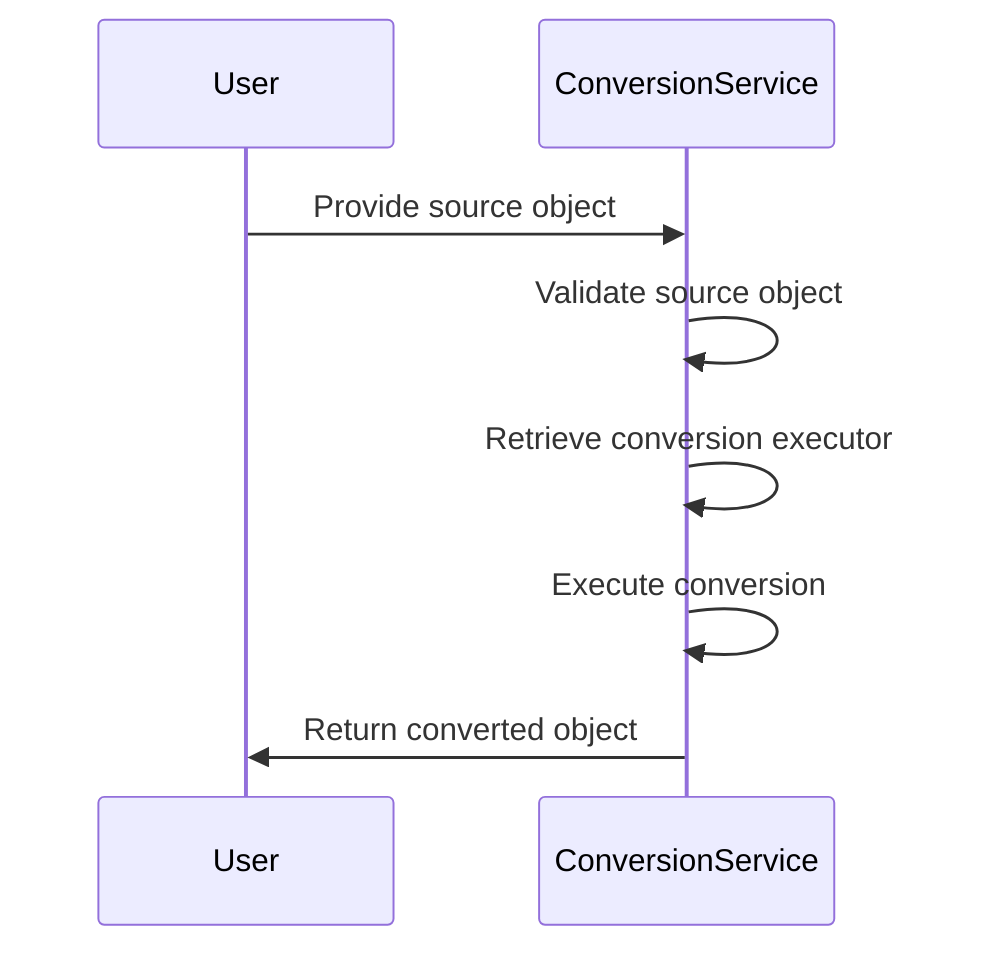

Here is a high level diagram of the flow, showing only the most important functions:

```mermaid
graph TD;
      subgraph springbindingsrcmainjavaorgspringframeworkbindingconvertserviceGenericConversionServicejava[spring-binding/…/service/GenericConversionService.java]
73c3bff0fe1591d916c6f133954e389a999cbdc78f0b513d20253e7055bb46b9(GenericConversionService.executeConversion) --> c9215b3b9bea7b58d05032aed4c79c23d09ea304d1c691103ae832650497ad7c(GenericConversionService.getConversionExecutor)
end

subgraph springbindingsrcmainjavaorgspringframeworkbindingconvertserviceGenericConversionServicejava[spring-binding/…/service/GenericConversionService.java]
c9215b3b9bea7b58d05032aed4c79c23d09ea304d1c691103ae832650497ad7c(GenericConversionService.getConversionExecutor) --> c9215b3b9bea7b58d05032aed4c79c23d09ea304d1c691103ae832650497ad7c(GenericConversionService.getConversionExecutor)
end

subgraph springbindingsrcmainjavaorgspringframeworkbindingconvertserviceGenericConversionServicejava[spring-binding/…/service/GenericConversionService.java]
c9215b3b9bea7b58d05032aed4c79c23d09ea304d1c691103ae832650497ad7c(GenericConversionService.getConversionExecutor) --> c9215b3b9bea7b58d05032aed4c79c23d09ea304d1c691103ae832650497ad7c(GenericConversionService.getConversionExecutor)
end


      classDef mainFlowStyle color:#000000,fill:#7CB9F4
classDef rootsStyle color:#000000,fill:#00FFF4
classDef Style1 color:#000000,fill:#00FFAA
classDef Style2 color:#000000,fill:#FFFF00
classDef Style3 color:#000000,fill:#AA7CB9

%% Swimm:
%% graph TD;
%%       subgraph springbindingsrcmainjavaorgspringframeworkbindingconvertserviceGenericConversionServicejava[<SwmPath>[spring-binding/…/service/GenericConversionService.java](spring-binding/src/main/java/org/springframework/binding/convert/service/GenericConversionService.java)</SwmPath>]
%% 73c3bff0fe1591d916c6f133954e389a999cbdc78f0b513d20253e7055bb46b9(GenericConversionService.executeConversion) --> c9215b3b9bea7b58d05032aed4c79c23d09ea304d1c691103ae832650497ad7c(GenericConversionService.getConversionExecutor)
%% end
%% 
%% subgraph springbindingsrcmainjavaorgspringframeworkbindingconvertserviceGenericConversionServicejava[<SwmPath>[spring-binding/…/service/GenericConversionService.java](spring-binding/src/main/java/org/springframework/binding/convert/service/GenericConversionService.java)</SwmPath>]
%% c9215b3b9bea7b58d05032aed4c79c23d09ea304d1c691103ae832650497ad7c(GenericConversionService.getConversionExecutor) --> c9215b3b9bea7b58d05032aed4c79c23d09ea304d1c691103ae832650497ad7c(GenericConversionService.getConversionExecutor)
%% end
%% 
%% subgraph springbindingsrcmainjavaorgspringframeworkbindingconvertserviceGenericConversionServicejava[<SwmPath>[spring-binding/…/service/GenericConversionService.java](spring-binding/src/main/java/org/springframework/binding/convert/service/GenericConversionService.java)</SwmPath>]
%% c9215b3b9bea7b58d05032aed4c79c23d09ea304d1c691103ae832650497ad7c(GenericConversionService.getConversionExecutor) --> c9215b3b9bea7b58d05032aed4c79c23d09ea304d1c691103ae832650497ad7c(GenericConversionService.getConversionExecutor)
%% end
%% 
%% 
%%       classDef mainFlowStyle color:#000000,fill:#7CB9F4
%% classDef rootsStyle color:#000000,fill:#00FFF4
%% classDef Style1 color:#000000,fill:#00FFAA
%% classDef Style2 color:#000000,fill:#FFFF00
%% classDef Style3 color:#000000,fill:#AA7CB9
```

# Flow drill down

## A closer look at <SwmToken path="spring-binding/src/main/java/org/springframework/binding/convert/service/GenericConversionService.java" pos="340:5:5" line-data="	public Object executeConversion(Object source, Class&lt;?&gt; targetClass) throws ConversionException {">`executeConversion`</SwmToken>

```mermaid
graph TD
 subgraph executeConversion
 executeConversion:A["Check if source is not null"] -->|Source is valid| executeConversion:B["Retrieve the ConversionExecutor"]
 executeConversion:B --> executeConversion:C["Execute the conversion"]
 executeConversion:A -->|Source is null| executeConversion:D["Return null"]
 end

%% Swimm:
%% graph TD
%%  subgraph <SwmToken path="spring-binding/src/main/java/org/springframework/binding/convert/service/GenericConversionService.java" pos="340:5:5" line-data="	public Object executeConversion(Object source, Class&lt;?&gt; targetClass) throws ConversionException {">`executeConversion`</SwmToken>
%%  <SwmToken path="spring-binding/src/main/java/org/springframework/binding/convert/service/GenericConversionService.java" pos="340:5:5" line-data="	public Object executeConversion(Object source, Class&lt;?&gt; targetClass) throws ConversionException {">`executeConversion`</SwmToken>:A["Check if source is not null"] -->|Source is valid| <SwmToken path="spring-binding/src/main/java/org/springframework/binding/convert/service/GenericConversionService.java" pos="340:5:5" line-data="	public Object executeConversion(Object source, Class&lt;?&gt; targetClass) throws ConversionException {">`executeConversion`</SwmToken>:B["Retrieve the <SwmToken path="spring-binding/src/main/java/org/springframework/binding/convert/service/GenericConversionService.java" pos="179:6:6" line-data="						&quot;No custom ConversionExecutor found with id &#39;&quot; + id + &quot;&#39; for converting from sourceClass [&quot;">`ConversionExecutor`</SwmToken>"]
%%  <SwmToken path="spring-binding/src/main/java/org/springframework/binding/convert/service/GenericConversionService.java" pos="340:5:5" line-data="	public Object executeConversion(Object source, Class&lt;?&gt; targetClass) throws ConversionException {">`executeConversion`</SwmToken>:B --> <SwmToken path="spring-binding/src/main/java/org/springframework/binding/convert/service/GenericConversionService.java" pos="340:5:5" line-data="	public Object executeConversion(Object source, Class&lt;?&gt; targetClass) throws ConversionException {">`executeConversion`</SwmToken>:C["Execute the conversion"]
%%  <SwmToken path="spring-binding/src/main/java/org/springframework/binding/convert/service/GenericConversionService.java" pos="340:5:5" line-data="	public Object executeConversion(Object source, Class&lt;?&gt; targetClass) throws ConversionException {">`executeConversion`</SwmToken>:A -->|Source is null| <SwmToken path="spring-binding/src/main/java/org/springframework/binding/convert/service/GenericConversionService.java" pos="340:5:5" line-data="	public Object executeConversion(Object source, Class&lt;?&gt; targetClass) throws ConversionException {">`executeConversion`</SwmToken>:D["Return null"]
%%  end
```

<SwmSnippet path="/spring-binding/src/main/java/org/springframework/binding/convert/service/GenericConversionService.java" line="350">

---

First, the <SwmToken path="spring-binding/src/main/java/org/springframework/binding/convert/service/GenericConversionService.java" pos="340:5:5" line-data="	public Object executeConversion(Object source, Class&lt;?&gt; targetClass) throws ConversionException {">`executeConversion`</SwmToken> method checks if the source object is not null. This is important because a null source would mean there is nothing to convert, and the method would return null immediately.

```java
		if (source != null) {
			ConversionExecutor conversionExecutor = getConversionExecutor(converterId, source.getClass(), targetClass);
			return conversionExecutor.execute(source);
		} else {
			return null;
		}
```

---

</SwmSnippet>

<SwmSnippet path="/spring-binding/src/main/java/org/springframework/binding/convert/service/GenericConversionService.java" line="351">

---

Next, if the source object is valid, the method retrieves the appropriate conversion executor by calling <SwmToken path="spring-binding/src/main/java/org/springframework/binding/convert/service/GenericConversionService.java" pos="351:7:7" line-data="			ConversionExecutor conversionExecutor = getConversionExecutor(converterId, source.getClass(), targetClass);">`getConversionExecutor`</SwmToken>. This step is crucial as it determines the correct converter to use based on the provided source and target classes.

```java
			ConversionExecutor conversionExecutor = getConversionExecutor(converterId, source.getClass(), targetClass);
```

---

</SwmSnippet>

<SwmSnippet path="/spring-binding/src/main/java/org/springframework/binding/convert/service/GenericConversionService.java" line="352">

---

Then, the conversion executor's <SwmToken path="spring-binding/src/main/java/org/springframework/binding/convert/service/GenericConversionService.java" pos="352:5:5" line-data="			return conversionExecutor.execute(source);">`execute`</SwmToken> method is called with the source object. This is where the actual conversion takes place, transforming the source object into the target type.

```java
			return conversionExecutor.execute(source);
```

---

</SwmSnippet>

<SwmSnippet path="/spring-binding/src/main/java/org/springframework/binding/convert/service/GenericConversionService.java" line="354">

---

Finally, if the source object was null, the method simply returns null, indicating that no conversion was performed.

```java
			return null;
		}
```

---

</SwmSnippet>

## Breaking down <SwmToken path="spring-binding/src/main/java/org/springframework/binding/convert/service/GenericConversionService.java" pos="176:5:5" line-data="				return parent.getConversionExecutor(id, sourceClass, targetClass);">`getConversionExecutor`</SwmToken>

```mermaid
graph TD
  subgraph getConversionExecutor
    getConversionExecutor:A["Ensure source and target classes are not null"] --> getConversionExecutor:B["Convert source and target to wrapper classes if necessary"]
    getConversionExecutor:B --> getConversionExecutor:C["Check if target class is assignable from source"]
    getConversionExecutor:C -->|Yes| getConversionExecutor:D["Return StaticConversionExecutor with NoOpConverter"]
    getConversionExecutor:C -->|No| getConversionExecutor:E["Check if delegate can convert classes"]
    getConversionExecutor:E -->|Yes| getConversionExecutor:F["Return StaticConversionExecutor with SpringConvertingConverterAdapter"]
    getConversionExecutor:E -->|No| getConversionExecutor:G["Check if parent is not null"]
    getConversionExecutor:G -->|Yes| getConversionExecutor:H["Return parent's conversion executor"]
    getConversionExecutor:G -->|No| getConversionExecutor:I["Throw ConversionExecutorNotFoundException"]
  end

%% Swimm:
%% graph TD
%%   subgraph <SwmToken path="spring-binding/src/main/java/org/springframework/binding/convert/service/GenericConversionService.java" pos="176:5:5" line-data="				return parent.getConversionExecutor(id, sourceClass, targetClass);">`getConversionExecutor`</SwmToken>
%%     <SwmToken path="spring-binding/src/main/java/org/springframework/binding/convert/service/GenericConversionService.java" pos="176:5:5" line-data="				return parent.getConversionExecutor(id, sourceClass, targetClass);">`getConversionExecutor`</SwmToken>:A["Ensure source and target classes are not null"] --> <SwmToken path="spring-binding/src/main/java/org/springframework/binding/convert/service/GenericConversionService.java" pos="176:5:5" line-data="				return parent.getConversionExecutor(id, sourceClass, targetClass);">`getConversionExecutor`</SwmToken>:B["Convert source and target to wrapper classes if necessary"]
%%     <SwmToken path="spring-binding/src/main/java/org/springframework/binding/convert/service/GenericConversionService.java" pos="176:5:5" line-data="				return parent.getConversionExecutor(id, sourceClass, targetClass);">`getConversionExecutor`</SwmToken>:B --> <SwmToken path="spring-binding/src/main/java/org/springframework/binding/convert/service/GenericConversionService.java" pos="176:5:5" line-data="				return parent.getConversionExecutor(id, sourceClass, targetClass);">`getConversionExecutor`</SwmToken>:C["Check if target class is assignable from source"]
%%     <SwmToken path="spring-binding/src/main/java/org/springframework/binding/convert/service/GenericConversionService.java" pos="176:5:5" line-data="				return parent.getConversionExecutor(id, sourceClass, targetClass);">`getConversionExecutor`</SwmToken>:C -->|Yes| <SwmToken path="spring-binding/src/main/java/org/springframework/binding/convert/service/GenericConversionService.java" pos="176:5:5" line-data="				return parent.getConversionExecutor(id, sourceClass, targetClass);">`getConversionExecutor`</SwmToken>:D["Return <SwmToken path="spring-binding/src/main/java/org/springframework/binding/convert/service/GenericConversionService.java" pos="221:9:9" line-data="					ConversionExecutor elementConverter = new StaticConversionExecutor(sourceComponentType,">`StaticConversionExecutor`</SwmToken> with <SwmToken path="spring-binding/src/main/java/org/springframework/binding/convert/service/GenericConversionService.java" pos="154:15:15" line-data="			return new StaticConversionExecutor(sourceClass, targetClass, new NoOpConverter(sourceClass, targetClass));">`NoOpConverter`</SwmToken>"]
%%     <SwmToken path="spring-binding/src/main/java/org/springframework/binding/convert/service/GenericConversionService.java" pos="176:5:5" line-data="				return parent.getConversionExecutor(id, sourceClass, targetClass);">`getConversionExecutor`</SwmToken>:C -->|No| <SwmToken path="spring-binding/src/main/java/org/springframework/binding/convert/service/GenericConversionService.java" pos="176:5:5" line-data="				return parent.getConversionExecutor(id, sourceClass, targetClass);">`getConversionExecutor`</SwmToken>:E["Check if delegate can convert classes"]
%%     <SwmToken path="spring-binding/src/main/java/org/springframework/binding/convert/service/GenericConversionService.java" pos="176:5:5" line-data="				return parent.getConversionExecutor(id, sourceClass, targetClass);">`getConversionExecutor`</SwmToken>:E -->|Yes| <SwmToken path="spring-binding/src/main/java/org/springframework/binding/convert/service/GenericConversionService.java" pos="176:5:5" line-data="				return parent.getConversionExecutor(id, sourceClass, targetClass);">`getConversionExecutor`</SwmToken>:F["Return <SwmToken path="spring-binding/src/main/java/org/springframework/binding/convert/service/GenericConversionService.java" pos="221:9:9" line-data="					ConversionExecutor elementConverter = new StaticConversionExecutor(sourceComponentType,">`StaticConversionExecutor`</SwmToken> with <SwmToken path="spring-binding/src/main/java/org/springframework/binding/convert/service/GenericConversionService.java" pos="34:12:12" line-data="import org.springframework.binding.convert.converters.SpringConvertingConverterAdapter;">`SpringConvertingConverterAdapter`</SwmToken>"]
%%     <SwmToken path="spring-binding/src/main/java/org/springframework/binding/convert/service/GenericConversionService.java" pos="176:5:5" line-data="				return parent.getConversionExecutor(id, sourceClass, targetClass);">`getConversionExecutor`</SwmToken>:E -->|No| <SwmToken path="spring-binding/src/main/java/org/springframework/binding/convert/service/GenericConversionService.java" pos="176:5:5" line-data="				return parent.getConversionExecutor(id, sourceClass, targetClass);">`getConversionExecutor`</SwmToken>:G["Check if parent is not null"]
%%     <SwmToken path="spring-binding/src/main/java/org/springframework/binding/convert/service/GenericConversionService.java" pos="176:5:5" line-data="				return parent.getConversionExecutor(id, sourceClass, targetClass);">`getConversionExecutor`</SwmToken>:G -->|Yes| <SwmToken path="spring-binding/src/main/java/org/springframework/binding/convert/service/GenericConversionService.java" pos="176:5:5" line-data="				return parent.getConversionExecutor(id, sourceClass, targetClass);">`getConversionExecutor`</SwmToken>:H["Return parent's conversion executor"]
%%     <SwmToken path="spring-binding/src/main/java/org/springframework/binding/convert/service/GenericConversionService.java" pos="176:5:5" line-data="				return parent.getConversionExecutor(id, sourceClass, targetClass);">`getConversionExecutor`</SwmToken>:G -->|No| <SwmToken path="spring-binding/src/main/java/org/springframework/binding/convert/service/GenericConversionService.java" pos="176:5:5" line-data="				return parent.getConversionExecutor(id, sourceClass, targetClass);">`getConversionExecutor`</SwmToken>:I["Throw <SwmToken path="spring-binding/src/main/java/org/springframework/binding/convert/service/GenericConversionService.java" pos="178:5:5" line-data="				throw new ConversionExecutorNotFoundException(sourceClass, targetClass,">`ConversionExecutorNotFoundException`</SwmToken>"]
%%   end
```

<SwmSnippet path="/spring-binding/src/main/java/org/springframework/binding/convert/service/GenericConversionService.java" line="149">

---

First, the <SwmToken path="spring-binding/src/main/java/org/springframework/binding/convert/service/GenericConversionService.java" pos="176:5:5" line-data="				return parent.getConversionExecutor(id, sourceClass, targetClass);">`getConversionExecutor`</SwmToken> method ensures that both the source and target classes are not null. This validation is crucial to prevent any null pointer exceptions during the conversion process.

```java
		Assert.notNull(sourceClass, "The source class to convert from is required");
		Assert.notNull(targetClass, "The target class to convert to is required");
```

---

</SwmSnippet>

## Diving into the <SwmToken path="spring-binding/src/main/java/org/springframework/binding/convert/service/GenericConversionService.java" pos="176:5:5" line-data="				return parent.getConversionExecutor(id, sourceClass, targetClass);">`getConversionExecutor`</SwmToken> function

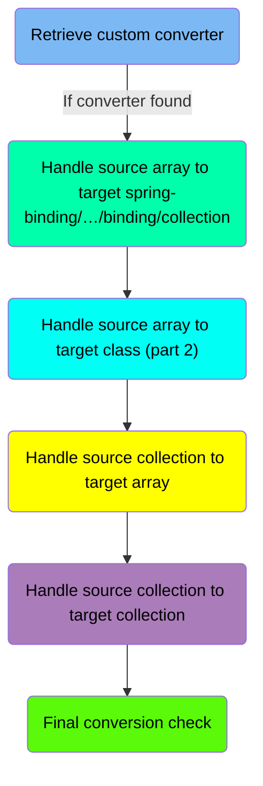

## <SwmToken path="spring-binding/src/main/java/org/springframework/binding/convert/service/GenericConversionService.java" pos="176:5:5" line-data="				return parent.getConversionExecutor(id, sourceClass, targetClass);">`getConversionExecutor`</SwmToken> function - Retrieve custom converter

Here is a diagram of this part:

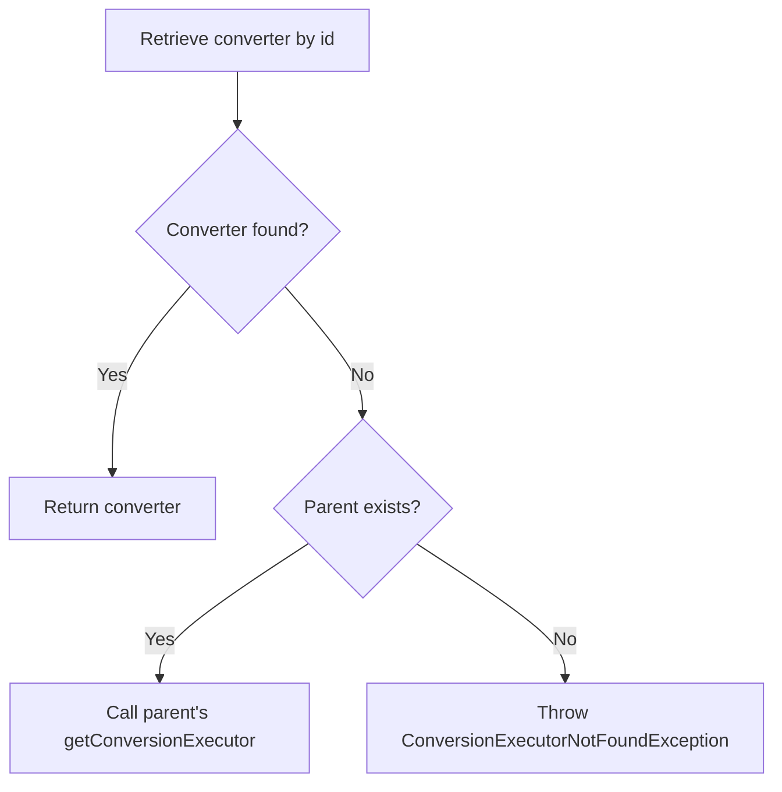

<SwmSnippet path="/spring-binding/src/main/java/org/springframework/binding/convert/service/GenericConversionService.java" line="173">

---

The function first attempts to retrieve a converter using the provided <SwmToken path="spring-binding/src/main/java/org/springframework/binding/convert/service/GenericConversionService.java" pos="173:11:11" line-data="		Converter converter = customConverters.get(id);">`id`</SwmToken> (the identifier for the custom converter) from the <SwmToken path="spring-binding/src/main/java/org/springframework/binding/convert/service/GenericConversionService.java" pos="173:7:7" line-data="		Converter converter = customConverters.get(id);">`customConverters`</SwmToken> map.

```java
		Converter converter = customConverters.get(id);
```

---

</SwmSnippet>

<SwmSnippet path="/spring-binding/src/main/java/org/springframework/binding/convert/service/GenericConversionService.java" line="174">

---

If the converter is not found (<SwmToken path="spring-binding/src/main/java/org/springframework/binding/convert/service/GenericConversionService.java" pos="174:4:8" line-data="		if (converter == null) {">`converter == null`</SwmToken>), the function checks if a <SwmToken path="spring-binding/src/main/java/org/springframework/binding/convert/service/GenericConversionService.java" pos="175:4:4" line-data="			if (parent != null) {">`parent`</SwmToken> conversion service is available. If a parent exists, it delegates the call to the parent's <SwmToken path="spring-binding/src/main/java/org/springframework/binding/convert/service/GenericConversionService.java" pos="176:5:5" line-data="				return parent.getConversionExecutor(id, sourceClass, targetClass);">`getConversionExecutor`</SwmToken> method. If no parent is available, it throws a <SwmToken path="spring-binding/src/main/java/org/springframework/binding/convert/service/GenericConversionService.java" pos="178:5:5" line-data="				throw new ConversionExecutorNotFoundException(sourceClass, targetClass,">`ConversionExecutorNotFoundException`</SwmToken> indicating that no suitable converter was found for the given source and target classes.

```java
		if (converter == null) {
			if (parent != null) {
				return parent.getConversionExecutor(id, sourceClass, targetClass);
			} else {
				throw new ConversionExecutorNotFoundException(sourceClass, targetClass,
						"No custom ConversionExecutor found with id '" + id + "' for converting from sourceClass ["
								+ sourceClass.getName() + "] to targetClass [" + targetClass.getName() + "]");
			}
		}
```

---

</SwmSnippet>

## <SwmToken path="spring-binding/src/main/java/org/springframework/binding/convert/service/GenericConversionService.java" pos="176:5:5" line-data="				return parent.getConversionExecutor(id, sourceClass, targetClass);">`getConversionExecutor`</SwmToken> function - Handle source array to target <SwmPath>[spring-binding/…/binding/collection/](spring-binding/src/main/java/org/springframework/binding/collection/)</SwmPath>

Here is a diagram of this part:

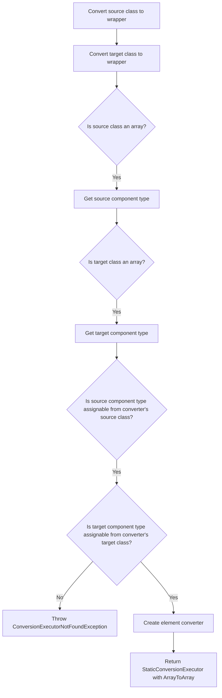

<SwmSnippet path="/spring-binding/src/main/java/org/springframework/binding/convert/service/GenericConversionService.java" line="183">

---

The function begins by converting the <SwmToken path="spring-binding/src/main/java/org/springframework/binding/convert/service/GenericConversionService.java" pos="183:1:1" line-data="		sourceClass = convertToWrapperClassIfNecessary(sourceClass);">`sourceClass`</SwmToken> and <SwmToken path="spring-binding/src/main/java/org/springframework/binding/convert/service/GenericConversionService.java" pos="184:1:1" line-data="		targetClass = convertToWrapperClassIfNecessary(targetClass);">`targetClass`</SwmToken> to their wrapper classes if necessary. This ensures that primitive types are handled correctly during the conversion process.

```java
		sourceClass = convertToWrapperClassIfNecessary(sourceClass);
		targetClass = convertToWrapperClassIfNecessary(targetClass);
```

---

</SwmSnippet>

## <SwmToken path="spring-binding/src/main/java/org/springframework/binding/convert/service/GenericConversionService.java" pos="176:5:5" line-data="				return parent.getConversionExecutor(id, sourceClass, targetClass);">`getConversionExecutor`</SwmToken> function - Handle source array to target class (part 2)

Here is a diagram of this part:

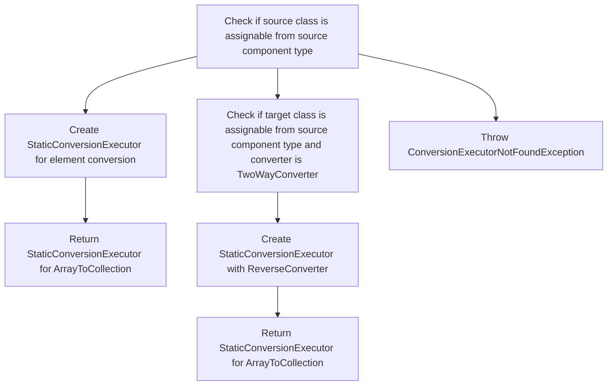

<SwmSnippet path="/spring-binding/src/main/java/org/springframework/binding/convert/service/GenericConversionService.java" line="219">

---

The function handles the conversion of source arrays to target collections by checking compatibility and creating appropriate conversion executors. It first checks if the <SwmToken path="spring-binding/src/main/java/org/springframework/binding/convert/service/GenericConversionService.java" pos="219:4:4" line-data="				if (converter.getSourceClass().isAssignableFrom(sourceComponentType)) {">`converter`</SwmToken>'s source class is assignable from the <SwmToken path="spring-binding/src/main/java/org/springframework/binding/convert/service/GenericConversionService.java" pos="219:12:12" line-data="				if (converter.getSourceClass().isAssignableFrom(sourceComponentType)) {">`sourceComponentType`</SwmToken>. If this condition is met, it creates a <SwmToken path="spring-binding/src/main/java/org/springframework/binding/convert/service/GenericConversionService.java" pos="221:9:9" line-data="					ConversionExecutor elementConverter = new StaticConversionExecutor(sourceComponentType,">`StaticConversionExecutor`</SwmToken> for element conversion and returns a new <SwmToken path="spring-binding/src/main/java/org/springframework/binding/convert/service/GenericConversionService.java" pos="221:9:9" line-data="					ConversionExecutor elementConverter = new StaticConversionExecutor(sourceComponentType,">`StaticConversionExecutor`</SwmToken> for <SwmToken path="spring-binding/src/main/java/org/springframework/binding/convert/service/GenericConversionService.java" pos="223:15:15" line-data="					return new StaticConversionExecutor(sourceClass, targetClass, new ArrayToCollection(">`ArrayToCollection`</SwmToken>.

```java
				if (converter.getSourceClass().isAssignableFrom(sourceComponentType)) {
					// type erasure has prevented us from getting the concrete type, this is best we can do for now
					ConversionExecutor elementConverter = new StaticConversionExecutor(sourceComponentType,
							converter.getTargetClass(), converter);
					return new StaticConversionExecutor(sourceClass, targetClass, new ArrayToCollection(
							elementConverter));
```

---

</SwmSnippet>

## <SwmToken path="spring-binding/src/main/java/org/springframework/binding/convert/service/GenericConversionService.java" pos="176:5:5" line-data="				return parent.getConversionExecutor(id, sourceClass, targetClass);">`getConversionExecutor`</SwmToken> function - Handle source collection to target array

Here is a diagram of this part:

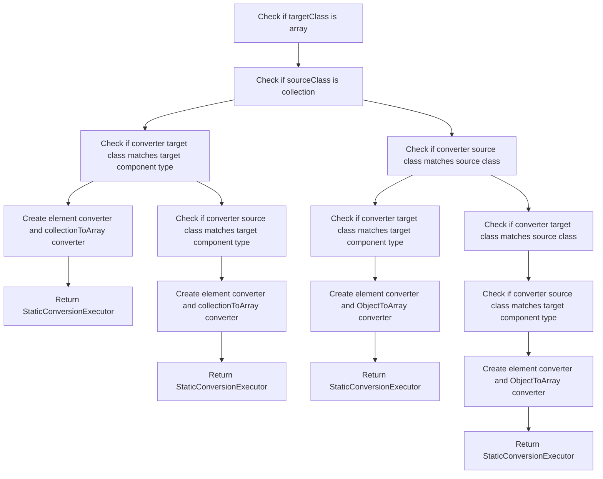

### Handling source collection to target array conversion

The function <SwmToken path="spring-binding/src/main/java/org/springframework/binding/convert/service/GenericConversionService.java" pos="176:5:5" line-data="				return parent.getConversionExecutor(id, sourceClass, targetClass);">`getConversionExecutor`</SwmToken> handles the conversion of a source collection to a target array by determining the appropriate conversion strategy based on the source and target types. The function first checks if the <SwmToken path="spring-binding/src/main/java/org/springframework/binding/convert/service/GenericConversionService.java" pos="150:5:5" line-data="		Assert.notNull(targetClass, &quot;The target class to convert to is required&quot;);">`targetClass`</SwmToken> is an array and if the <SwmToken path="spring-binding/src/main/java/org/springframework/binding/convert/service/GenericConversionService.java" pos="149:5:5" line-data="		Assert.notNull(sourceClass, &quot;The source class to convert from is required&quot;);">`sourceClass`</SwmToken> is a collection. If both conditions are met, it proceeds to determine the appropriate conversion strategy.

<SwmSnippet path="/spring-binding/src/main/java/org/springframework/binding/convert/service/GenericConversionService.java" line="241">

---

If the <SwmToken path="spring-binding/src/main/java/org/springframework/binding/convert/service/GenericConversionService.java" pos="245:4:4" line-data="				if (converter.getTargetClass().isAssignableFrom(targetComponentType)) {">`converter`</SwmToken>'s target class matches the target component type, it creates an <SwmToken path="spring-binding/src/main/java/org/springframework/binding/convert/service/GenericConversionService.java" pos="246:3:3" line-data="					ConversionExecutor elementConverter = new StaticConversionExecutor(converter.getSourceClass(),">`elementConverter`</SwmToken> and a <SwmToken path="spring-binding/src/main/java/org/springframework/binding/convert/service/GenericConversionService.java" pos="248:3:3" line-data="					Converter collectionToArray = new ReverseConverter(new ArrayToCollection(elementConverter));">`collectionToArray`</SwmToken> converter. This is done by creating a new <SwmToken path="spring-binding/src/main/java/org/springframework/binding/convert/service/GenericConversionService.java" pos="246:9:9" line-data="					ConversionExecutor elementConverter = new StaticConversionExecutor(converter.getSourceClass(),">`StaticConversionExecutor`</SwmToken> with the source class, target component type, and the converter. The <SwmToken path="spring-binding/src/main/java/org/springframework/binding/convert/service/GenericConversionService.java" pos="248:3:3" line-data="					Converter collectionToArray = new ReverseConverter(new ArrayToCollection(elementConverter));">`collectionToArray`</SwmToken> converter is created using a <SwmToken path="spring-binding/src/main/java/org/springframework/binding/convert/service/GenericConversionService.java" pos="248:9:9" line-data="					Converter collectionToArray = new ReverseConverter(new ArrayToCollection(elementConverter));">`ReverseConverter`</SwmToken> with an <SwmToken path="spring-binding/src/main/java/org/springframework/binding/convert/service/GenericConversionService.java" pos="248:13:13" line-data="					Converter collectionToArray = new ReverseConverter(new ArrayToCollection(elementConverter));">`ArrayToCollection`</SwmToken> converter.

```java
		if (targetClass.isArray()) {
			Class<?> targetComponentType = targetClass.getComponentType();
			if (Collection.class.isAssignableFrom(sourceClass)) {
				// type erasure limits us here as well
				if (converter.getTargetClass().isAssignableFrom(targetComponentType)) {
					ConversionExecutor elementConverter = new StaticConversionExecutor(converter.getSourceClass(),
							targetComponentType, converter);
					Converter collectionToArray = new ReverseConverter(new ArrayToCollection(elementConverter));
					return new StaticConversionExecutor(sourceClass, targetClass, collectionToArray);
```

---

</SwmSnippet>

## <SwmToken path="spring-binding/src/main/java/org/springframework/binding/convert/service/GenericConversionService.java" pos="176:5:5" line-data="				return parent.getConversionExecutor(id, sourceClass, targetClass);">`getConversionExecutor`</SwmToken> function - Handle source collection to target collection

Here is a diagram of this part:

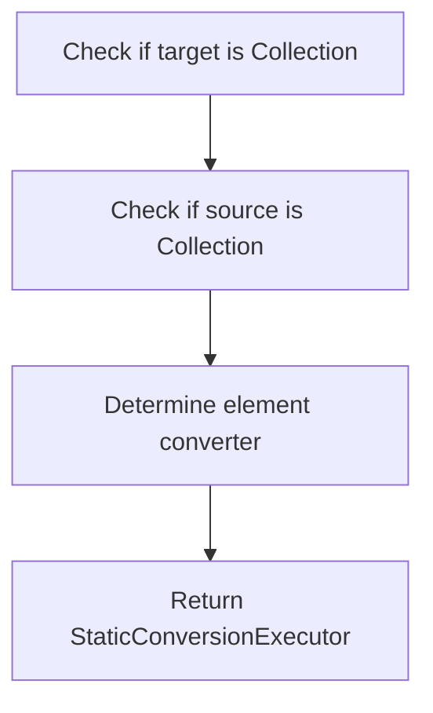

<SwmSnippet path="/spring-binding/src/main/java/org/springframework/binding/convert/service/GenericConversionService.java" line="288">

---

The function first checks if the <SwmToken path="spring-binding/src/main/java/org/springframework/binding/convert/service/GenericConversionService.java" pos="289:10:10" line-data="		if (Collection.class.isAssignableFrom(targetClass)) {">`targetClass`</SwmToken> is a collection by using <SwmToken path="spring-binding/src/main/java/org/springframework/binding/convert/service/GenericConversionService.java" pos="289:4:11" line-data="		if (Collection.class.isAssignableFrom(targetClass)) {">`Collection.class.isAssignableFrom(targetClass)`</SwmToken>.

```java
		}
		if (Collection.class.isAssignableFrom(targetClass)) {
```

---

</SwmSnippet>

## <SwmToken path="spring-binding/src/main/java/org/springframework/binding/convert/service/GenericConversionService.java" pos="176:5:5" line-data="				return parent.getConversionExecutor(id, sourceClass, targetClass);">`getConversionExecutor`</SwmToken> function - Final conversion check

Here is a diagram of this part:

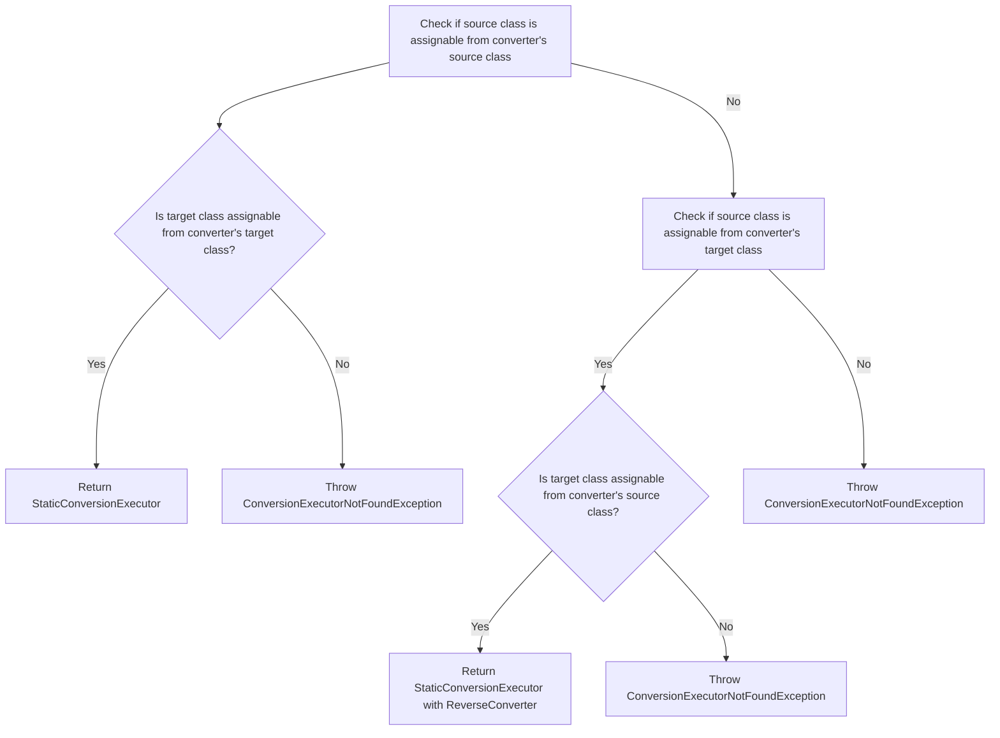

### Handling source and target class compatibility

The function first checks if the <SwmToken path="spring-binding/src/main/java/org/springframework/binding/convert/service/GenericConversionService.java" pos="149:5:5" line-data="		Assert.notNull(sourceClass, &quot;The source class to convert from is required&quot;);">`sourceClass`</SwmToken> (the class to convert from) is assignable from the converter's source class. This ensures that the conversion can proceed from the given source class.

<SwmSnippet path="/spring-binding/src/main/java/org/springframework/binding/convert/service/GenericConversionService.java" line="318">

---

If the <SwmToken path="spring-binding/src/main/java/org/springframework/binding/convert/service/GenericConversionService.java" pos="318:12:12" line-data="		if (converter.getSourceClass().isAssignableFrom(sourceClass)) {">`sourceClass`</SwmToken> is compatible, the function then checks if the <SwmToken path="spring-binding/src/main/java/org/springframework/binding/convert/service/GenericConversionService.java" pos="319:13:13" line-data="			if (!converter.getTargetClass().isAssignableFrom(targetClass)) {">`targetClass`</SwmToken> (the class to convert to) is assignable from the converter's target class. This step ensures that the conversion can proceed to the given target class.

```java
		if (converter.getSourceClass().isAssignableFrom(sourceClass)) {
			if (!converter.getTargetClass().isAssignableFrom(targetClass)) {
				throw new ConversionExecutorNotFoundException(sourceClass, targetClass,
						"Custom ConversionExecutor with id '" + id + "' cannot convert from sourceClass ["
								+ sourceClass.getName() + "] to targetClass [" + targetClass.getName() + "]");
			}
			return new StaticConversionExecutor(sourceClass, targetClass, converter);
```

---

</SwmSnippet>

&nbsp;

*This is an auto-generated document by Swimm 🌊 and has not yet been verified by a human*

<SwmMeta version="3.0.0" repo-id="Z2l0aHViJTNBJTNBc3ByaW5nLXdlYmZsb3ctZGVtbyUzQSUzQWdpbGFkbmF2b3Q=" repo-name="spring-webflow-demo"><sup>Powered by [Swimm](/)</sup></SwmMeta>
