This document explains the flow of converting property values to their string representations using the <SwmToken path="spring-webflow/src/main/java/org/springframework/webflow/mvc/view/ConvertingPropertyEditorAdapter.java" pos="56:5:5" line-data="	public String getAsText() {">`getAsText`</SwmToken> method. This method is part of the conversion process that ensures property values are appropriately transformed into strings for further processing.

For example, if a property value needs to be displayed as text in a user interface, the <SwmToken path="spring-webflow/src/main/java/org/springframework/webflow/mvc/view/ConvertingPropertyEditorAdapter.java" pos="56:5:5" line-data="	public String getAsText() {">`getAsText`</SwmToken> method will convert the property value to its string representation, ensuring it can be properly displayed.

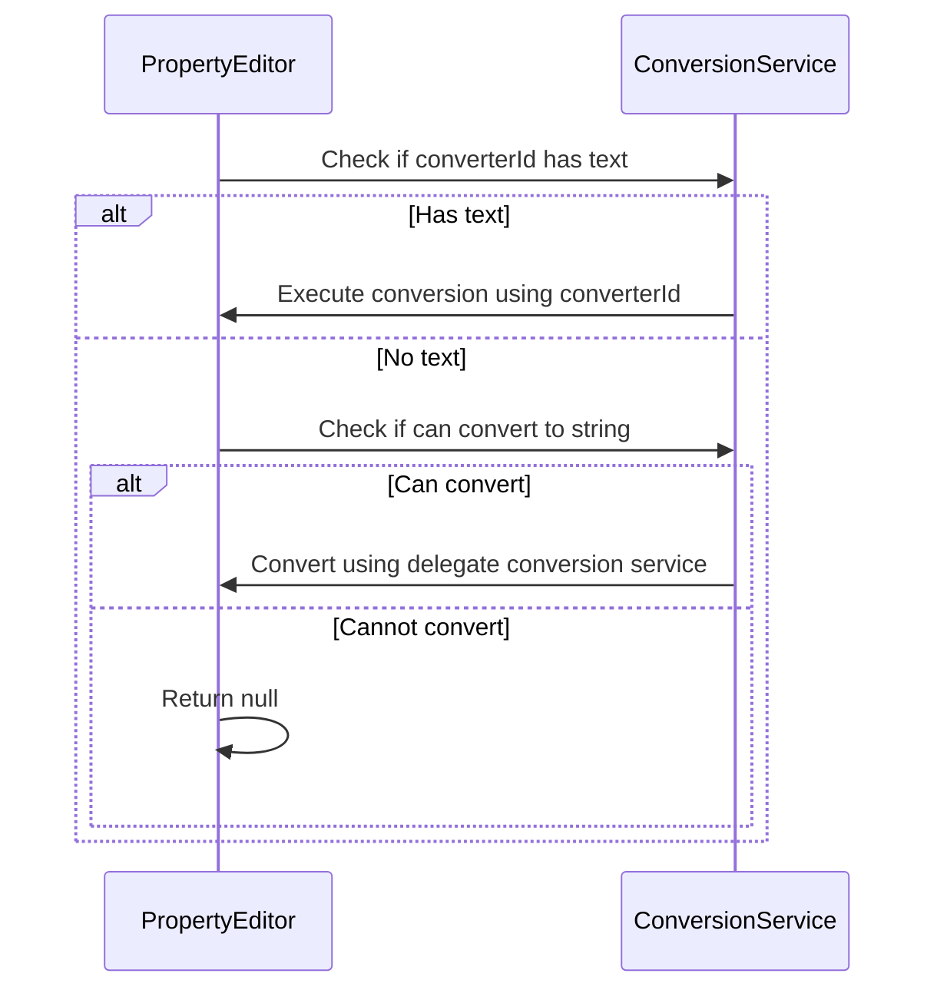

# Where is this flow used?

This flow is used multiple times in the codebase as represented in the following diagram:

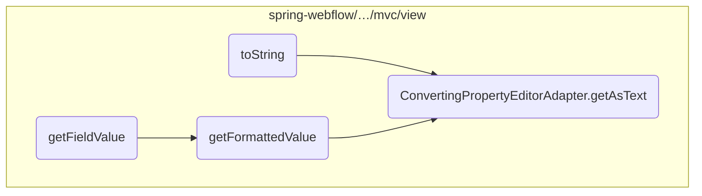

Here is a high level diagram of the flow, showing only the most important functions:

```mermaid
graph TD;
      subgraph springwebflowsrcmainjavaorgspringframeworkwebflow[spring-webflow/…/springframework/webflow]
fa0030213f933076119231abb4c9df33da918249655535dfcaf2f5a2e84cccd2(ConvertingPropertyEditorAdapter.getAsText) --> 3b3604b56ade765ec75522de315bbe175b9b88ea16106d6a22d7970691e303a6(WebFlowUpgrader.convert)
end

subgraph springwebflowsrcmainjavaorgspringframeworkwebflow[spring-webflow/…/springframework/webflow]
fa0030213f933076119231abb4c9df33da918249655535dfcaf2f5a2e84cccd2(ConvertingPropertyEditorAdapter.getAsText) --> b669ea012f4adb5f07b21c3f2bda4a38b3c39650cd3ec3ed1c56891852450793(ParentConversionServiceProxy.executeConversion)
end

subgraph springwebflowsrcmainjavaorgspringframeworkwebflow[spring-webflow/…/springframework/webflow]
fa0030213f933076119231abb4c9df33da918249655535dfcaf2f5a2e84cccd2(ConvertingPropertyEditorAdapter.getAsText) --> 6220794d2e896b575b94fcc6dabbb9748d99ae54e97b8fd42f300f4023ae2744(ParentConversionServiceProxy.getDelegateConversionService)
end

subgraph springwebflowsrcmainjavaorgspringframeworkwebflowmvcview[spring-webflow/…/mvc/view]
fa0030213f933076119231abb4c9df33da918249655535dfcaf2f5a2e84cccd2(ConvertingPropertyEditorAdapter.getAsText) --> 58c7ace1d45d588ab374e57ecc1d7da48157916f58131490076ac61535d1c63c(RequestParameterExpression.getValue)
end

subgraph springwebflowsrcmainjavaorgspringframeworkwebflow[spring-webflow/…/springframework/webflow]
3b3604b56ade765ec75522de315bbe175b9b88ea16106d6a22d7970691e303a6(WebFlowUpgrader.convert) --> 813b61d13630df5a0f88af44fb3a37431c69dba80babb90ba03be55acdc13d23(WebFlowUpgrader.transform)
end

subgraph springwebflowsrcmainjavaorgspringframeworkwebflow[spring-webflow/…/springframework/webflow]
813b61d13630df5a0f88af44fb3a37431c69dba80babb90ba03be55acdc13d23(WebFlowUpgrader.transform) --> 2db152dc9c5b756b2d301de836a0712b20fdd75276c3d2fedae159ac6b79e200(WebFlowUpgrader.getTransformer)
end

subgraph springfacessrcmainjavaorgspringframeworkfaceswebflow[spring-faces/…/faces/webflow]
2db152dc9c5b756b2d301de836a0712b20fdd75276c3d2fedae159ac6b79e200(WebFlowUpgrader.getTransformer) --> d52139121ec72cd4a68435bbb9d2946993a14647ad5fa104a913b78e2b2dd8da(FlowLifecycle.newInstance)
end

subgraph springfacessrcmainjavaorgspringframeworkfaceswebflow[spring-faces/…/faces/webflow]
d52139121ec72cd4a68435bbb9d2946993a14647ad5fa104a913b78e2b2dd8da(FlowLifecycle.newInstance) --> f68f2c2a1d4cfe6c2cda0918c7be0d9eee106a32bd807cfa7e0fcad8918de6d0(JsfUtils.findFactory)
end

subgraph springfacessrcmainjavaorgspringframeworkfaceswebflow[spring-faces/…/faces/webflow]
d52139121ec72cd4a68435bbb9d2946993a14647ad5fa104a913b78e2b2dd8da(FlowLifecycle.newInstance) --> fec993b8cb642d3ebae1cea4533c9680dd511a01a07d7fc3fb260b632787320a(JsfViewFactoryCreator.getLifecycle)
end

subgraph springwebflowsrcmainjavaorgspringframeworkwebflow[spring-webflow/…/springframework/webflow]
f68f2c2a1d4cfe6c2cda0918c7be0d9eee106a32bd807cfa7e0fcad8918de6d0(JsfUtils.findFactory) --> 70d51cc40cf0d7ca9651af13cc8e894ce873155e3dd39747a8a0c39f1519a058(ConversationParameters.getName)
end

subgraph springfacessrcmainjavaorgspringframeworkfaceswebflow[spring-faces/…/faces/webflow]
fec993b8cb642d3ebae1cea4533c9680dd511a01a07d7fc3fb260b632787320a(JsfViewFactoryCreator.getLifecycle) --> d52139121ec72cd4a68435bbb9d2946993a14647ad5fa104a913b78e2b2dd8da(FlowLifecycle.newInstance)
end

subgraph springwebflowsrcmainjavaorgspringframeworkwebflow[spring-webflow/…/springframework/webflow]
b669ea012f4adb5f07b21c3f2bda4a38b3c39650cd3ec3ed1c56891852450793(ParentConversionServiceProxy.executeConversion) --> b669ea012f4adb5f07b21c3f2bda4a38b3c39650cd3ec3ed1c56891852450793(ParentConversionServiceProxy.executeConversion)
end

subgraph springwebflowsrcmainjavaorgspringframeworkwebflow[spring-webflow/…/springframework/webflow]
b669ea012f4adb5f07b21c3f2bda4a38b3c39650cd3ec3ed1c56891852450793(ParentConversionServiceProxy.executeConversion) --> 66e092c7068d451d0c00eebb3e61281ed153810ffb8a056a648fbac2be581643(FlowBuilderContextImpl.getFlowBuilderServices)
end

subgraph springwebflowsrcmainjavaorgspringframeworkwebflow[spring-webflow/…/springframework/webflow]
b669ea012f4adb5f07b21c3f2bda4a38b3c39650cd3ec3ed1c56891852450793(ParentConversionServiceProxy.executeConversion) --> 89409caccea3e1f865325714d3435bc2710c709462b5c4b5d80cf132b18de966(FlowBuilderContextImpl.getConversionService)
end

subgraph springwebflowsrcmainjavaorgspringframeworkwebflow[spring-webflow/…/springframework/webflow]
b669ea012f4adb5f07b21c3f2bda4a38b3c39650cd3ec3ed1c56891852450793(ParentConversionServiceProxy.executeConversion) --> b669ea012f4adb5f07b21c3f2bda4a38b3c39650cd3ec3ed1c56891852450793(ParentConversionServiceProxy.executeConversion)
end

subgraph springwebflowsrcmainjavaorgspringframeworkwebflow[spring-webflow/…/springframework/webflow]
b669ea012f4adb5f07b21c3f2bda4a38b3c39650cd3ec3ed1c56891852450793(ParentConversionServiceProxy.executeConversion) --> 66e092c7068d451d0c00eebb3e61281ed153810ffb8a056a648fbac2be581643(FlowBuilderContextImpl.getFlowBuilderServices)
end

subgraph springwebflowsrcmainjavaorgspringframeworkwebflow[spring-webflow/…/springframework/webflow]
b669ea012f4adb5f07b21c3f2bda4a38b3c39650cd3ec3ed1c56891852450793(ParentConversionServiceProxy.executeConversion) --> 89409caccea3e1f865325714d3435bc2710c709462b5c4b5d80cf132b18de966(FlowBuilderContextImpl.getConversionService)
end

subgraph springwebflowsrcmainjavaorgspringframeworkwebflow[spring-webflow/…/springframework/webflow]
6220794d2e896b575b94fcc6dabbb9748d99ae54e97b8fd42f300f4023ae2744(ParentConversionServiceProxy.getDelegateConversionService) --> 66e092c7068d451d0c00eebb3e61281ed153810ffb8a056a648fbac2be581643(FlowBuilderContextImpl.getFlowBuilderServices)
end

subgraph springwebflowsrcmainjavaorgspringframeworkwebflow[spring-webflow/…/springframework/webflow]
6220794d2e896b575b94fcc6dabbb9748d99ae54e97b8fd42f300f4023ae2744(ParentConversionServiceProxy.getDelegateConversionService) --> 89409caccea3e1f865325714d3435bc2710c709462b5c4b5d80cf132b18de966(FlowBuilderContextImpl.getConversionService)
end

subgraph springwebflowsrcmainjavaorgspringframeworkwebflow[spring-webflow/…/springframework/webflow]
58c7ace1d45d588ab374e57ecc1d7da48157916f58131490076ac61535d1c63c(RequestParameterExpression.getValue) --> cfbc1a254ef7cdad1b3d463a5b2a923f3eed54464ff7129dd71d37058c01dc4c(LocalParameterMap.asMap)
end


      classDef mainFlowStyle color:#000000,fill:#7CB9F4
classDef rootsStyle color:#000000,fill:#00FFF4
classDef Style1 color:#000000,fill:#00FFAA
classDef Style2 color:#000000,fill:#FFFF00
classDef Style3 color:#000000,fill:#AA7CB9

%% Swimm:
%% graph TD;
%%       subgraph springwebflowsrcmainjavaorgspringframeworkwebflow[<SwmPath>[spring-webflow/…/springframework/webflow/](spring-webflow/src/main/java/org/springframework/webflow/)</SwmPath>]
%% fa0030213f933076119231abb4c9df33da918249655535dfcaf2f5a2e84cccd2(ConvertingPropertyEditorAdapter.getAsText) --> 3b3604b56ade765ec75522de315bbe175b9b88ea16106d6a22d7970691e303a6(WebFlowUpgrader.convert)
%% end
%% 
%% subgraph springwebflowsrcmainjavaorgspringframeworkwebflow[<SwmPath>[spring-webflow/…/springframework/webflow/](spring-webflow/src/main/java/org/springframework/webflow/)</SwmPath>]
%% fa0030213f933076119231abb4c9df33da918249655535dfcaf2f5a2e84cccd2(ConvertingPropertyEditorAdapter.getAsText) --> b669ea012f4adb5f07b21c3f2bda4a38b3c39650cd3ec3ed1c56891852450793(ParentConversionServiceProxy.executeConversion)
%% end
%% 
%% subgraph springwebflowsrcmainjavaorgspringframeworkwebflow[<SwmPath>[spring-webflow/…/springframework/webflow/](spring-webflow/src/main/java/org/springframework/webflow/)</SwmPath>]
%% fa0030213f933076119231abb4c9df33da918249655535dfcaf2f5a2e84cccd2(ConvertingPropertyEditorAdapter.getAsText) --> 6220794d2e896b575b94fcc6dabbb9748d99ae54e97b8fd42f300f4023ae2744(ParentConversionServiceProxy.getDelegateConversionService)
%% end
%% 
%% subgraph springwebflowsrcmainjavaorgspringframeworkwebflowmvcview[<SwmPath>[spring-webflow/…/mvc/view/](spring-webflow/src/main/java/org/springframework/webflow/mvc/view/)</SwmPath>]
%% fa0030213f933076119231abb4c9df33da918249655535dfcaf2f5a2e84cccd2(ConvertingPropertyEditorAdapter.getAsText) --> 58c7ace1d45d588ab374e57ecc1d7da48157916f58131490076ac61535d1c63c(RequestParameterExpression.getValue)
%% end
%% 
%% subgraph springwebflowsrcmainjavaorgspringframeworkwebflow[<SwmPath>[spring-webflow/…/springframework/webflow/](spring-webflow/src/main/java/org/springframework/webflow/)</SwmPath>]
%% 3b3604b56ade765ec75522de315bbe175b9b88ea16106d6a22d7970691e303a6(WebFlowUpgrader.convert) --> 813b61d13630df5a0f88af44fb3a37431c69dba80babb90ba03be55acdc13d23(WebFlowUpgrader.transform)
%% end
%% 
%% subgraph springwebflowsrcmainjavaorgspringframeworkwebflow[<SwmPath>[spring-webflow/…/springframework/webflow/](spring-webflow/src/main/java/org/springframework/webflow/)</SwmPath>]
%% 813b61d13630df5a0f88af44fb3a37431c69dba80babb90ba03be55acdc13d23(WebFlowUpgrader.transform) --> 2db152dc9c5b756b2d301de836a0712b20fdd75276c3d2fedae159ac6b79e200(WebFlowUpgrader.getTransformer)
%% end
%% 
%% subgraph springfacessrcmainjavaorgspringframeworkfaceswebflow[<SwmPath>[spring-faces/…/faces/webflow/](spring-faces/src/main/java/org/springframework/faces/webflow/)</SwmPath>]
%% 2db152dc9c5b756b2d301de836a0712b20fdd75276c3d2fedae159ac6b79e200(WebFlowUpgrader.getTransformer) --> d52139121ec72cd4a68435bbb9d2946993a14647ad5fa104a913b78e2b2dd8da(<SwmToken path="spring-faces/src/main/java/org/springframework/faces/webflow/JsfViewFactoryCreator.java" pos="52:7:9" line-data="			this.lifecycle = FlowLifecycle.newInstance();">`FlowLifecycle.newInstance`</SwmToken>)
%% end
%% 
%% subgraph springfacessrcmainjavaorgspringframeworkfaceswebflow[<SwmPath>[spring-faces/…/faces/webflow/](spring-faces/src/main/java/org/springframework/faces/webflow/)</SwmPath>]
%% d52139121ec72cd4a68435bbb9d2946993a14647ad5fa104a913b78e2b2dd8da(<SwmToken path="spring-faces/src/main/java/org/springframework/faces/webflow/JsfViewFactoryCreator.java" pos="52:7:9" line-data="			this.lifecycle = FlowLifecycle.newInstance();">`FlowLifecycle.newInstance`</SwmToken>) --> f68f2c2a1d4cfe6c2cda0918c7be0d9eee106a32bd807cfa7e0fcad8918de6d0(<SwmToken path="spring-faces/src/main/java/org/springframework/faces/webflow/FlowLifecycle.java" pos="46:7:9" line-data="		LifecycleFactory lifecycleFactory = JsfUtils.findFactory(LifecycleFactory.class);">`JsfUtils.findFactory`</SwmToken>)
%% end
%% 
%% subgraph springfacessrcmainjavaorgspringframeworkfaceswebflow[<SwmPath>[spring-faces/…/faces/webflow/](spring-faces/src/main/java/org/springframework/faces/webflow/)</SwmPath>]
%% d52139121ec72cd4a68435bbb9d2946993a14647ad5fa104a913b78e2b2dd8da(<SwmToken path="spring-faces/src/main/java/org/springframework/faces/webflow/JsfViewFactoryCreator.java" pos="52:7:9" line-data="			this.lifecycle = FlowLifecycle.newInstance();">`FlowLifecycle.newInstance`</SwmToken>) --> fec993b8cb642d3ebae1cea4533c9680dd511a01a07d7fc3fb260b632787320a(JsfViewFactoryCreator.getLifecycle)
%% end
%% 
%% subgraph springwebflowsrcmainjavaorgspringframeworkwebflow[<SwmPath>[spring-webflow/…/springframework/webflow/](spring-webflow/src/main/java/org/springframework/webflow/)</SwmPath>]
%% f68f2c2a1d4cfe6c2cda0918c7be0d9eee106a32bd807cfa7e0fcad8918de6d0(<SwmToken path="spring-faces/src/main/java/org/springframework/faces/webflow/FlowLifecycle.java" pos="46:7:9" line-data="		LifecycleFactory lifecycleFactory = JsfUtils.findFactory(LifecycleFactory.class);">`JsfUtils.findFactory`</SwmToken>) --> 70d51cc40cf0d7ca9651af13cc8e894ce873155e3dd39747a8a0c39f1519a058(ConversationParameters.getName)
%% end
%% 
%% subgraph springfacessrcmainjavaorgspringframeworkfaceswebflow[<SwmPath>[spring-faces/…/faces/webflow/](spring-faces/src/main/java/org/springframework/faces/webflow/)</SwmPath>]
%% fec993b8cb642d3ebae1cea4533c9680dd511a01a07d7fc3fb260b632787320a(JsfViewFactoryCreator.getLifecycle) --> d52139121ec72cd4a68435bbb9d2946993a14647ad5fa104a913b78e2b2dd8da(<SwmToken path="spring-faces/src/main/java/org/springframework/faces/webflow/JsfViewFactoryCreator.java" pos="52:7:9" line-data="			this.lifecycle = FlowLifecycle.newInstance();">`FlowLifecycle.newInstance`</SwmToken>)
%% end
%% 
%% subgraph springwebflowsrcmainjavaorgspringframeworkwebflow[<SwmPath>[spring-webflow/…/springframework/webflow/](spring-webflow/src/main/java/org/springframework/webflow/)</SwmPath>]
%% b669ea012f4adb5f07b21c3f2bda4a38b3c39650cd3ec3ed1c56891852450793(ParentConversionServiceProxy.executeConversion) --> b669ea012f4adb5f07b21c3f2bda4a38b3c39650cd3ec3ed1c56891852450793(ParentConversionServiceProxy.executeConversion)
%% end
%% 
%% subgraph springwebflowsrcmainjavaorgspringframeworkwebflow[<SwmPath>[spring-webflow/…/springframework/webflow/](spring-webflow/src/main/java/org/springframework/webflow/)</SwmPath>]
%% b669ea012f4adb5f07b21c3f2bda4a38b3c39650cd3ec3ed1c56891852450793(ParentConversionServiceProxy.executeConversion) --> 66e092c7068d451d0c00eebb3e61281ed153810ffb8a056a648fbac2be581643(FlowBuilderContextImpl.getFlowBuilderServices)
%% end
%% 
%% subgraph springwebflowsrcmainjavaorgspringframeworkwebflow[<SwmPath>[spring-webflow/…/springframework/webflow/](spring-webflow/src/main/java/org/springframework/webflow/)</SwmPath>]
%% b669ea012f4adb5f07b21c3f2bda4a38b3c39650cd3ec3ed1c56891852450793(ParentConversionServiceProxy.executeConversion) --> 89409caccea3e1f865325714d3435bc2710c709462b5c4b5d80cf132b18de966(FlowBuilderContextImpl.getConversionService)
%% end
%% 
%% subgraph springwebflowsrcmainjavaorgspringframeworkwebflow[<SwmPath>[spring-webflow/…/springframework/webflow/](spring-webflow/src/main/java/org/springframework/webflow/)</SwmPath>]
%% b669ea012f4adb5f07b21c3f2bda4a38b3c39650cd3ec3ed1c56891852450793(ParentConversionServiceProxy.executeConversion) --> b669ea012f4adb5f07b21c3f2bda4a38b3c39650cd3ec3ed1c56891852450793(ParentConversionServiceProxy.executeConversion)
%% end
%% 
%% subgraph springwebflowsrcmainjavaorgspringframeworkwebflow[<SwmPath>[spring-webflow/…/springframework/webflow/](spring-webflow/src/main/java/org/springframework/webflow/)</SwmPath>]
%% b669ea012f4adb5f07b21c3f2bda4a38b3c39650cd3ec3ed1c56891852450793(ParentConversionServiceProxy.executeConversion) --> 66e092c7068d451d0c00eebb3e61281ed153810ffb8a056a648fbac2be581643(FlowBuilderContextImpl.getFlowBuilderServices)
%% end
%% 
%% subgraph springwebflowsrcmainjavaorgspringframeworkwebflow[<SwmPath>[spring-webflow/…/springframework/webflow/](spring-webflow/src/main/java/org/springframework/webflow/)</SwmPath>]
%% b669ea012f4adb5f07b21c3f2bda4a38b3c39650cd3ec3ed1c56891852450793(ParentConversionServiceProxy.executeConversion) --> 89409caccea3e1f865325714d3435bc2710c709462b5c4b5d80cf132b18de966(FlowBuilderContextImpl.getConversionService)
%% end
%% 
%% subgraph springwebflowsrcmainjavaorgspringframeworkwebflow[<SwmPath>[spring-webflow/…/springframework/webflow/](spring-webflow/src/main/java/org/springframework/webflow/)</SwmPath>]
%% 6220794d2e896b575b94fcc6dabbb9748d99ae54e97b8fd42f300f4023ae2744(ParentConversionServiceProxy.getDelegateConversionService) --> 66e092c7068d451d0c00eebb3e61281ed153810ffb8a056a648fbac2be581643(FlowBuilderContextImpl.getFlowBuilderServices)
%% end
%% 
%% subgraph springwebflowsrcmainjavaorgspringframeworkwebflow[<SwmPath>[spring-webflow/…/springframework/webflow/](spring-webflow/src/main/java/org/springframework/webflow/)</SwmPath>]
%% 6220794d2e896b575b94fcc6dabbb9748d99ae54e97b8fd42f300f4023ae2744(ParentConversionServiceProxy.getDelegateConversionService) --> 89409caccea3e1f865325714d3435bc2710c709462b5c4b5d80cf132b18de966(FlowBuilderContextImpl.getConversionService)
%% end
%% 
%% subgraph springwebflowsrcmainjavaorgspringframeworkwebflow[<SwmPath>[spring-webflow/…/springframework/webflow/](spring-webflow/src/main/java/org/springframework/webflow/)</SwmPath>]
%% 58c7ace1d45d588ab374e57ecc1d7da48157916f58131490076ac61535d1c63c(RequestParameterExpression.getValue) --> cfbc1a254ef7cdad1b3d463a5b2a923f3eed54464ff7129dd71d37058c01dc4c(LocalParameterMap.asMap)
%% end
%% 
%% 
%%       classDef mainFlowStyle color:#000000,fill:#7CB9F4
%% classDef rootsStyle color:#000000,fill:#00FFF4
%% classDef Style1 color:#000000,fill:#00FFAA
%% classDef Style2 color:#000000,fill:#FFFF00
%% classDef Style3 color:#000000,fill:#AA7CB9
```

# Flow drill down

## Going into <SwmToken path="spring-webflow/src/main/java/org/springframework/webflow/mvc/view/ConvertingPropertyEditorAdapter.java" pos="56:5:5" line-data="	public String getAsText() {">`getAsText`</SwmToken>

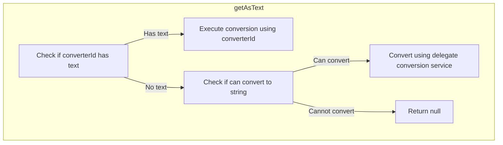

<SwmSnippet path="/spring-webflow/src/main/java/org/springframework/webflow/mvc/view/ConvertingPropertyEditorAdapter.java" line="57">

---

First, the <SwmToken path="spring-webflow/src/main/java/org/springframework/webflow/mvc/view/ConvertingPropertyEditorAdapter.java" pos="56:5:5" line-data="	public String getAsText() {">`getAsText`</SwmToken> method checks if a <SwmToken path="spring-webflow/src/main/java/org/springframework/webflow/mvc/view/ConvertingPropertyEditorAdapter.java" pos="57:8:8" line-data="		if (StringUtils.hasText(converterId)) {">`converterId`</SwmToken> is provided. If it is, the method uses the <SwmToken path="spring-webflow/src/main/java/org/springframework/webflow/mvc/view/ConvertingPropertyEditorAdapter.java" pos="58:7:7" line-data="			return (String) conversionService.executeConversion(converterId, getValue(), String.class);">`conversionService`</SwmToken> to execute the conversion of the property value to a string representation using the specified converter.

```java
		if (StringUtils.hasText(converterId)) {
			return (String) conversionService.executeConversion(converterId, getValue(), String.class);
```

---

</SwmSnippet>

<SwmSnippet path="/spring-webflow/src/main/java/org/springframework/webflow/mvc/view/ConvertingPropertyEditorAdapter.java" line="61">

---

Next, if no <SwmToken path="spring-webflow/src/main/java/org/springframework/webflow/mvc/view/ConvertingPropertyEditorAdapter.java" pos="57:8:8" line-data="		if (StringUtils.hasText(converterId)) {">`converterId`</SwmToken> is provided but the property can still be converted to a string, the method uses the <SwmToken path="spring-webflow/src/main/java/org/springframework/webflow/mvc/view/ConvertingPropertyEditorAdapter.java" pos="61:9:9" line-data="				return (String) conversionService.getDelegateConversionService().convert(getValue(), fieldType,">`getDelegateConversionService`</SwmToken> to perform the conversion. This ensures that even without a specific converter, the property value can still be appropriately transformed into a string.

```java
				return (String) conversionService.getDelegateConversionService().convert(getValue(), fieldType,
						TypeDescriptor.valueOf(String.class));
```

---

</SwmSnippet>

<SwmSnippet path="/spring-webflow/src/main/java/org/springframework/webflow/mvc/view/ConvertingPropertyEditorAdapter.java" line="64">

---

Finally, if neither condition is met, the method returns <SwmToken path="spring-webflow/src/main/java/org/springframework/webflow/mvc/view/ConvertingPropertyEditorAdapter.java" pos="64:3:3" line-data="				return null;">`null`</SwmToken>, indicating that the property value cannot be converted to a string. This ensures that only valid string representations are returned, maintaining data integrity.

```java
				return null;
			}
```

---

</SwmSnippet>

## Inside convert

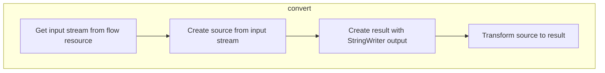

## Converting the Resource

First, the <SwmToken path="spring-webflow/src/main/java/org/springframework/webflow/mvc/view/ConvertingPropertyEditorAdapter.java" pos="61:13:13" line-data="				return (String) conversionService.getDelegateConversionService().convert(getValue(), fieldType,">`convert`</SwmToken> method is responsible for transforming the source data into a desired format. It takes a <SwmToken path="spring-webflow/src/main/java/org/springframework/webflow/upgrade/WebFlowUpgrader.java" pos="60:7:7" line-data="	public String convert(Resource flowResource) {">`Resource`</SwmToken> object as input and initializes a <SwmToken path="spring-webflow/src/main/java/org/springframework/webflow/upgrade/WebFlowUpgrader.java" pos="61:1:1" line-data="		StringWriter output = new StringWriter();">`StringWriter`</SwmToken> to capture the output.

Next, it attempts to read the input stream from the provided <SwmToken path="spring-webflow/src/main/java/org/springframework/webflow/upgrade/WebFlowUpgrader.java" pos="60:7:7" line-data="	public String convert(Resource flowResource) {">`Resource`</SwmToken> and sets up the transformation process by creating <SwmToken path="spring-webflow/src/main/java/org/springframework/webflow/upgrade/WebFlowUpgrader.java" pos="63:1:1" line-data="			Source source = new StreamSource(flowResource.getInputStream());">`Source`</SwmToken> and <SwmToken path="spring-webflow/src/main/java/org/springframework/webflow/upgrade/WebFlowUpgrader.java" pos="64:1:1" line-data="			Result result = new StreamResult(output);">`Result`</SwmToken> objects. The <SwmToken path="spring-webflow/src/main/java/org/springframework/webflow/upgrade/WebFlowUpgrader.java" pos="63:1:1" line-data="			Source source = new StreamSource(flowResource.getInputStream());">`Source`</SwmToken> object reads from the input stream, while the <SwmToken path="spring-webflow/src/main/java/org/springframework/webflow/upgrade/WebFlowUpgrader.java" pos="64:1:1" line-data="			Result result = new StreamResult(output);">`Result`</SwmToken> object writes to the <SwmToken path="spring-webflow/src/main/java/org/springframework/webflow/upgrade/WebFlowUpgrader.java" pos="61:1:1" line-data="		StringWriter output = new StringWriter();">`StringWriter`</SwmToken>.

Then, the <SwmToken path="spring-webflow/src/main/java/org/springframework/webflow/upgrade/WebFlowUpgrader.java" pos="65:1:1" line-data="			transform(source, result);">`transform`</SwmToken> method is called to perform the actual transformation. This method processes the source data and writes the transformed data to the result.

<SwmSnippet path="/spring-webflow/src/main/java/org/springframework/webflow/upgrade/WebFlowUpgrader.java" line="60">

---

If any exceptions occur during the transformation process, they are caught and printed to the console. Finally, the method returns the transformed data as a string.

```java
	public String convert(Resource flowResource) {
		StringWriter output = new StringWriter();
		try {
			Source source = new StreamSource(flowResource.getInputStream());
			Result result = new StreamResult(output);
			transform(source, result);
		} catch (TransformerException | IOException e) {
			e.printStackTrace();
		}
		return output.toString();
	}
```

---

</SwmSnippet>

## A closer look at transform

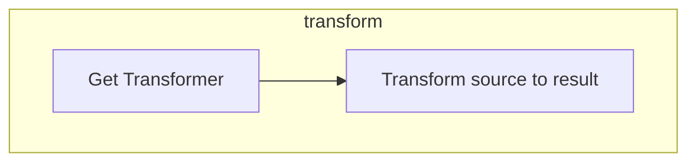

<SwmSnippet path="/spring-webflow/src/main/java/org/springframework/webflow/upgrade/WebFlowUpgrader.java" line="72">

---

First, the <SwmToken path="spring-webflow/src/main/java/org/springframework/webflow/upgrade/WebFlowUpgrader.java" pos="72:7:7" line-data="	public synchronized void transform(Source source, Result result) throws TransformerConfigurationException,">`transform`</SwmToken> method is responsible for transforming the source data into the desired result format. This is crucial for ensuring that the data is correctly processed and converted as needed for further operations.

```java
	public synchronized void transform(Source source, Result result) throws TransformerConfigurationException,
			TransformerException, IOException {
		getTransformer().transform(source, result);
	}
```

---

</SwmSnippet>

<SwmSnippet path="/spring-webflow/src/main/java/org/springframework/webflow/upgrade/WebFlowUpgrader.java" line="74">

---

Next, the <SwmToken path="spring-webflow/src/main/java/org/springframework/webflow/upgrade/WebFlowUpgrader.java" pos="74:5:5" line-data="		getTransformer().transform(source, result);">`transform`</SwmToken> method calls the <SwmToken path="spring-webflow/src/main/java/org/springframework/webflow/upgrade/WebFlowUpgrader.java" pos="74:1:1" line-data="		getTransformer().transform(source, result);">`getTransformer`</SwmToken> method to obtain an instance of the transformer. This step is essential as it ensures that the correct transformer is used for the conversion process.

```java
		getTransformer().transform(source, result);
```

---

</SwmSnippet>

## Diving into <SwmToken path="spring-webflow/src/main/java/org/springframework/webflow/upgrade/WebFlowUpgrader.java" pos="74:1:1" line-data="		getTransformer().transform(source, result);">`getTransformer`</SwmToken>

```mermaid
graph TD
  subgraph getTransformer
    getTransformer:A["Check if transformer is null"] --> |"is null"| getTransformer:B["Create Resource with XSL_NAME"]
    getTransformer:B --> getTransformer:C["Create TransformerFactory instance"]
    getTransformer:C --> getTransformer:D["Create Source from Resource"]
    getTransformer:D --> getTransformer:E["Create Transformer using Factory"]
    getTransformer:E --> getTransformer:F["Set indent amount"]
  end

%% Swimm:
%% graph TD
%%   subgraph <SwmToken path="spring-webflow/src/main/java/org/springframework/webflow/upgrade/WebFlowUpgrader.java" pos="74:1:1" line-data="		getTransformer().transform(source, result);">`getTransformer`</SwmToken>
%%     <SwmToken path="spring-webflow/src/main/java/org/springframework/webflow/upgrade/WebFlowUpgrader.java" pos="74:1:1" line-data="		getTransformer().transform(source, result);">`getTransformer`</SwmToken>:A["Check if transformer is null"] --> |"is null"| <SwmToken path="spring-webflow/src/main/java/org/springframework/webflow/upgrade/WebFlowUpgrader.java" pos="74:1:1" line-data="		getTransformer().transform(source, result);">`getTransformer`</SwmToken>:B["Create Resource with <SwmToken path="spring-webflow/src/main/java/org/springframework/webflow/upgrade/WebFlowUpgrader.java" pos="79:11:11" line-data="			Resource xslResource = new ClassPathResource(XSL_NAME, getClass());">`XSL_NAME`</SwmToken>"]
%%     <SwmToken path="spring-webflow/src/main/java/org/springframework/webflow/upgrade/WebFlowUpgrader.java" pos="74:1:1" line-data="		getTransformer().transform(source, result);">`getTransformer`</SwmToken>:B --> <SwmToken path="spring-webflow/src/main/java/org/springframework/webflow/upgrade/WebFlowUpgrader.java" pos="74:1:1" line-data="		getTransformer().transform(source, result);">`getTransformer`</SwmToken>:C["Create <SwmToken path="spring-webflow/src/main/java/org/springframework/webflow/upgrade/WebFlowUpgrader.java" pos="80:1:1" line-data="			TransformerFactory factory = TransformerFactory.newInstance();">`TransformerFactory`</SwmToken> instance"]
%%     <SwmToken path="spring-webflow/src/main/java/org/springframework/webflow/upgrade/WebFlowUpgrader.java" pos="74:1:1" line-data="		getTransformer().transform(source, result);">`getTransformer`</SwmToken>:C --> <SwmToken path="spring-webflow/src/main/java/org/springframework/webflow/upgrade/WebFlowUpgrader.java" pos="74:1:1" line-data="		getTransformer().transform(source, result);">`getTransformer`</SwmToken>:D["Create Source from Resource"]
%%     <SwmToken path="spring-webflow/src/main/java/org/springframework/webflow/upgrade/WebFlowUpgrader.java" pos="74:1:1" line-data="		getTransformer().transform(source, result);">`getTransformer`</SwmToken>:D --> <SwmToken path="spring-webflow/src/main/java/org/springframework/webflow/upgrade/WebFlowUpgrader.java" pos="74:1:1" line-data="		getTransformer().transform(source, result);">`getTransformer`</SwmToken>:E["Create Transformer using Factory"]
%%     <SwmToken path="spring-webflow/src/main/java/org/springframework/webflow/upgrade/WebFlowUpgrader.java" pos="74:1:1" line-data="		getTransformer().transform(source, result);">`getTransformer`</SwmToken>:E --> <SwmToken path="spring-webflow/src/main/java/org/springframework/webflow/upgrade/WebFlowUpgrader.java" pos="74:1:1" line-data="		getTransformer().transform(source, result);">`getTransformer`</SwmToken>:F["Set indent amount"]
%%   end
```

<SwmSnippet path="/spring-webflow/src/main/java/org/springframework/webflow/upgrade/WebFlowUpgrader.java" line="78">

---

First, the <SwmToken path="spring-webflow/src/main/java/org/springframework/webflow/upgrade/WebFlowUpgrader.java" pos="74:1:1" line-data="		getTransformer().transform(source, result);">`getTransformer`</SwmToken> method checks if the transformer instance is null. If it is, it proceeds to initialize a new transformer instance. This ensures that the transformer is only created once, optimizing resource usage.

```java
		if (transformer == null) {
```

---

</SwmSnippet>

<SwmSnippet path="/spring-webflow/src/main/java/org/springframework/webflow/upgrade/WebFlowUpgrader.java" line="79">

---

Next, the method loads the XSLT resource from the classpath using <SwmToken path="spring-webflow/src/main/java/org/springframework/webflow/upgrade/WebFlowUpgrader.java" pos="79:9:9" line-data="			Resource xslResource = new ClassPathResource(XSL_NAME, getClass());">`ClassPathResource`</SwmToken>. This resource contains the XSLT stylesheet that will be used to transform the XML data.

```java
			Resource xslResource = new ClassPathResource(XSL_NAME, getClass());
```

---

</SwmSnippet>

<SwmSnippet path="/spring-webflow/src/main/java/org/springframework/webflow/upgrade/WebFlowUpgrader.java" line="80">

---

Then, a new <SwmToken path="spring-webflow/src/main/java/org/springframework/webflow/upgrade/WebFlowUpgrader.java" pos="80:1:1" line-data="			TransformerFactory factory = TransformerFactory.newInstance();">`TransformerFactory`</SwmToken> instance is created, and the XSLT resource is converted into a <SwmToken path="spring-webflow/src/main/java/org/springframework/webflow/upgrade/WebFlowUpgrader.java" pos="81:9:9" line-data="			Source source = new StreamSource(xslResource.getInputStream());">`StreamSource`</SwmToken>. The transformer is then created using the factory's <SwmToken path="spring-webflow/src/main/java/org/springframework/webflow/upgrade/WebFlowUpgrader.java" pos="82:7:7" line-data="			transformer = factory.newTransformer(source);">`newTransformer`</SwmToken> method, which takes the <SwmToken path="spring-webflow/src/main/java/org/springframework/webflow/upgrade/WebFlowUpgrader.java" pos="81:9:9" line-data="			Source source = new StreamSource(xslResource.getInputStream());">`StreamSource`</SwmToken> as an argument.

```java
			TransformerFactory factory = TransformerFactory.newInstance();
			Source source = new StreamSource(xslResource.getInputStream());
			transformer = factory.newTransformer(source);
```

---

</SwmSnippet>

<SwmSnippet path="/spring-webflow/src/main/java/org/springframework/webflow/upgrade/WebFlowUpgrader.java" line="84">

---

Finally, the method sets an output property on the transformer to specify the indentation amount for the transformed XML output. This ensures that the output is properly formatted and readable.

```java
			transformer.setOutputProperty("{https://xml.apache.org/xalan}indent-amount", "4");
```

---

</SwmSnippet>

## Inside <SwmToken path="spring-webflow/src/main/java/org/springframework/webflow/upgrade/WebFlowUpgrader.java" pos="80:9:9" line-data="			TransformerFactory factory = TransformerFactory.newInstance();">`newInstance`</SwmToken>

```mermaid
graph TD
  subgraph newInstance
    newInstance:A["Find LifecycleFactory using JsfUtils"] --> newInstance:B["Get default Lifecycle"]
    newInstance:B --> newInstance:C["Return new FlowLifecycle with default Lifecycle"]
  end

%% Swimm:
%% graph TD
%%   subgraph <SwmToken path="spring-webflow/src/main/java/org/springframework/webflow/upgrade/WebFlowUpgrader.java" pos="80:9:9" line-data="			TransformerFactory factory = TransformerFactory.newInstance();">`newInstance`</SwmToken>
%%     <SwmToken path="spring-webflow/src/main/java/org/springframework/webflow/upgrade/WebFlowUpgrader.java" pos="80:9:9" line-data="			TransformerFactory factory = TransformerFactory.newInstance();">`newInstance`</SwmToken>:A["Find <SwmToken path="spring-faces/src/main/java/org/springframework/faces/webflow/FlowLifecycle.java" pos="46:1:1" line-data="		LifecycleFactory lifecycleFactory = JsfUtils.findFactory(LifecycleFactory.class);">`LifecycleFactory`</SwmToken> using <SwmToken path="spring-faces/src/main/java/org/springframework/faces/webflow/FlowLifecycle.java" pos="46:7:7" line-data="		LifecycleFactory lifecycleFactory = JsfUtils.findFactory(LifecycleFactory.class);">`JsfUtils`</SwmToken>"] --> <SwmToken path="spring-webflow/src/main/java/org/springframework/webflow/upgrade/WebFlowUpgrader.java" pos="80:9:9" line-data="			TransformerFactory factory = TransformerFactory.newInstance();">`newInstance`</SwmToken>:B["Get default Lifecycle"]
%%     <SwmToken path="spring-webflow/src/main/java/org/springframework/webflow/upgrade/WebFlowUpgrader.java" pos="80:9:9" line-data="			TransformerFactory factory = TransformerFactory.newInstance();">`newInstance`</SwmToken>:B --> <SwmToken path="spring-webflow/src/main/java/org/springframework/webflow/upgrade/WebFlowUpgrader.java" pos="80:9:9" line-data="			TransformerFactory factory = TransformerFactory.newInstance();">`newInstance`</SwmToken>:C["Return new <SwmToken path="spring-faces/src/main/java/org/springframework/faces/webflow/FlowLifecycle.java" pos="48:5:5" line-data="		return new FlowLifecycle(defaultLifecycle);">`FlowLifecycle`</SwmToken> with default Lifecycle"]
%%   end
```

<SwmSnippet path="/spring-faces/src/main/java/org/springframework/faces/webflow/FlowLifecycle.java" line="45">

---

First, the <SwmToken path="spring-faces/src/main/java/org/springframework/faces/webflow/FlowLifecycle.java" pos="45:7:7" line-data="	public static Lifecycle newInstance() {">`newInstance`</SwmToken> method is responsible for creating a new instance of the lifecycle. This is crucial for initializing the lifecycle that will manage the various phases of a JSF request processing lifecycle.

```java
	public static Lifecycle newInstance() {
		LifecycleFactory lifecycleFactory = JsfUtils.findFactory(LifecycleFactory.class);
		Lifecycle defaultLifecycle = lifecycleFactory.getLifecycle(LifecycleFactory.DEFAULT_LIFECYCLE);
		return new FlowLifecycle(defaultLifecycle);

	}
```

---

</SwmSnippet>

<SwmSnippet path="/spring-faces/src/main/java/org/springframework/faces/webflow/FlowLifecycle.java" line="46">

---

Next, the method calls <SwmToken path="spring-faces/src/main/java/org/springframework/faces/webflow/FlowLifecycle.java" pos="46:7:9" line-data="		LifecycleFactory lifecycleFactory = JsfUtils.findFactory(LifecycleFactory.class);">`JsfUtils.findFactory`</SwmToken> to find a factory instance of the specified class using <SwmToken path="spring-faces/src/main/java/org/springframework/faces/webflow/JsfUtils.java" pos="79:25:25" line-data="	 * Find a factory of the specified class using JSFs {@link FactoryFinder} class.">`FactoryFinder`</SwmToken>. This step ensures that the appropriate factory is located to create the lifecycle instance.

```java
		LifecycleFactory lifecycleFactory = JsfUtils.findFactory(LifecycleFactory.class);
```

---

</SwmSnippet>

<SwmSnippet path="/spring-faces/src/main/java/org/springframework/faces/webflow/FlowLifecycle.java" line="47">

---

Then, it retrieves the default lifecycle from the factory using <SwmToken path="spring-faces/src/main/java/org/springframework/faces/webflow/FlowLifecycle.java" pos="47:7:14" line-data="		Lifecycle defaultLifecycle = lifecycleFactory.getLifecycle(LifecycleFactory.DEFAULT_LIFECYCLE);">`lifecycleFactory.getLifecycle(LifecycleFactory.DEFAULT_LIFECYCLE)`</SwmToken>. This step is essential to ensure that the default lifecycle configuration is used.

```java
		Lifecycle defaultLifecycle = lifecycleFactory.getLifecycle(LifecycleFactory.DEFAULT_LIFECYCLE);
```

---

</SwmSnippet>

<SwmSnippet path="/spring-faces/src/main/java/org/springframework/faces/webflow/FlowLifecycle.java" line="48">

---

Finally, a new <SwmToken path="spring-faces/src/main/java/org/springframework/faces/webflow/FlowLifecycle.java" pos="48:5:5" line-data="		return new FlowLifecycle(defaultLifecycle);">`FlowLifecycle`</SwmToken> instance is created with the default lifecycle and returned. This new instance will be used to manage the lifecycle phases in the web flow.

```java
		return new FlowLifecycle(defaultLifecycle);

```

---

</SwmSnippet>

## Diving into <SwmToken path="spring-faces/src/main/java/org/springframework/faces/webflow/FlowLifecycle.java" pos="46:9:9" line-data="		LifecycleFactory lifecycleFactory = JsfUtils.findFactory(LifecycleFactory.class);">`findFactory`</SwmToken> & <SwmToken path="spring-faces/src/main/java/org/springframework/faces/webflow/JsfUtils.java" pos="87:25:25" line-data="		Assert.state(name != null, &quot;Unknown factory class &quot; + factoryClass.getName());">`getName`</SwmToken>

```mermaid
graph TD
  subgraph findFactory
    findFactory:A["Check if factoryClass is not null"] --> findFactory:B["Get factory name"]
    findFactory:B --> findFactory:C["Check if factory name is not null"]
    findFactory:C --> findFactory:D["Return factory instance"]
  end
  subgraph getName
    getName:A["Return the conversation name"]
  end

%% Swimm:
%% graph TD
%%   subgraph <SwmToken path="spring-faces/src/main/java/org/springframework/faces/webflow/FlowLifecycle.java" pos="46:9:9" line-data="		LifecycleFactory lifecycleFactory = JsfUtils.findFactory(LifecycleFactory.class);">`findFactory`</SwmToken>
%%     <SwmToken path="spring-faces/src/main/java/org/springframework/faces/webflow/FlowLifecycle.java" pos="46:9:9" line-data="		LifecycleFactory lifecycleFactory = JsfUtils.findFactory(LifecycleFactory.class);">`findFactory`</SwmToken>:A["Check if <SwmToken path="spring-faces/src/main/java/org/springframework/faces/webflow/JsfUtils.java" pos="80:6:6" line-data="	 * @param factoryClass the factory class to find">`factoryClass`</SwmToken> is not null"] --> <SwmToken path="spring-faces/src/main/java/org/springframework/faces/webflow/FlowLifecycle.java" pos="46:9:9" line-data="		LifecycleFactory lifecycleFactory = JsfUtils.findFactory(LifecycleFactory.class);">`findFactory`</SwmToken>:B["Get factory name"]
%%     <SwmToken path="spring-faces/src/main/java/org/springframework/faces/webflow/FlowLifecycle.java" pos="46:9:9" line-data="		LifecycleFactory lifecycleFactory = JsfUtils.findFactory(LifecycleFactory.class);">`findFactory`</SwmToken>:B --> <SwmToken path="spring-faces/src/main/java/org/springframework/faces/webflow/FlowLifecycle.java" pos="46:9:9" line-data="		LifecycleFactory lifecycleFactory = JsfUtils.findFactory(LifecycleFactory.class);">`findFactory`</SwmToken>:C["Check if factory name is not null"]
%%     <SwmToken path="spring-faces/src/main/java/org/springframework/faces/webflow/FlowLifecycle.java" pos="46:9:9" line-data="		LifecycleFactory lifecycleFactory = JsfUtils.findFactory(LifecycleFactory.class);">`findFactory`</SwmToken>:C --> <SwmToken path="spring-faces/src/main/java/org/springframework/faces/webflow/FlowLifecycle.java" pos="46:9:9" line-data="		LifecycleFactory lifecycleFactory = JsfUtils.findFactory(LifecycleFactory.class);">`findFactory`</SwmToken>:D["Return factory instance"]
%%   end
%%   subgraph <SwmToken path="spring-faces/src/main/java/org/springframework/faces/webflow/JsfUtils.java" pos="87:25:25" line-data="		Assert.state(name != null, &quot;Unknown factory class &quot; + factoryClass.getName());">`getName`</SwmToken>
%%     <SwmToken path="spring-faces/src/main/java/org/springframework/faces/webflow/JsfUtils.java" pos="87:25:25" line-data="		Assert.state(name != null, &quot;Unknown factory class &quot; + factoryClass.getName());">`getName`</SwmToken>:A["Return the conversation name"]
%%   end
```

<SwmSnippet path="/spring-faces/src/main/java/org/springframework/faces/webflow/JsfUtils.java" line="78">

---

First, the <SwmToken path="spring-faces/src/main/java/org/springframework/faces/webflow/JsfUtils.java" pos="84:11:11" line-data="	public static &lt;T&gt; T findFactory(Class&lt;T&gt; factoryClass) {">`findFactory`</SwmToken> method is responsible for locating a factory of the specified class using JSF's <SwmToken path="spring-faces/src/main/java/org/springframework/faces/webflow/JsfUtils.java" pos="79:25:25" line-data="	 * Find a factory of the specified class using JSFs {@link FactoryFinder} class.">`FactoryFinder`</SwmToken> class. This is crucial for ensuring that the correct factory instance is retrieved based on the provided factory class. The method checks if the factory class is not null and retrieves the factory name from a predefined map. If the factory name is found, it uses <SwmToken path="spring-faces/src/main/java/org/springframework/faces/webflow/JsfUtils.java" pos="88:7:9" line-data="		return (T) FactoryFinder.getFactory(name);">`FactoryFinder.getFactory`</SwmToken> to get the factory instance.

```java
	/**
	 * Find a factory of the specified class using JSFs {@link FactoryFinder} class.
	 * @param factoryClass the factory class to find
	 * @return the factory instance
	 */
	@SuppressWarnings("unchecked")
	public static <T> T findFactory(Class<T> factoryClass) {
		Assert.notNull(factoryClass, "FactoryClass must not be null");
		String name = FACTORY_NAMES.get(factoryClass);
		Assert.state(name != null, "Unknown factory class " + factoryClass.getName());
		return (T) FactoryFinder.getFactory(name);
	}
```

---

</SwmSnippet>

<SwmSnippet path="/spring-webflow/src/main/java/org/springframework/webflow/conversation/ConversationParameters.java" line="56">

---

Next, the <SwmToken path="spring-webflow/src/main/java/org/springframework/webflow/conversation/ConversationParameters.java" pos="60:5:5" line-data="	public String getName() {">`getName`</SwmToken> method in the <SwmToken path="spring-webflow/src/main/java/org/springframework/webflow/conversation/ConversationParameters.java" pos="27:4:4" line-data="public class ConversationParameters implements Serializable {">`ConversationParameters`</SwmToken> class is used to return the name of the conversation. This method simply returns the value of the <SwmToken path="spring-webflow/src/main/java/org/springframework/webflow/conversation/ConversationParameters.java" pos="57:7:7" line-data="	 * Returns the name of the conversation.">`name`</SwmToken> field, which represents the conversation name. This is important for identifying the specific conversation in the flow.

```java
	/**
	 * Returns the name of the conversation.
	 * @return the conversation name
	 */
	public String getName() {
		return name;
	}
```

---

</SwmSnippet>

## Breaking down <SwmToken path="spring-faces/src/main/java/org/springframework/faces/webflow/FlowLifecycle.java" pos="47:9:9" line-data="		Lifecycle defaultLifecycle = lifecycleFactory.getLifecycle(LifecycleFactory.DEFAULT_LIFECYCLE);">`getLifecycle`</SwmToken>

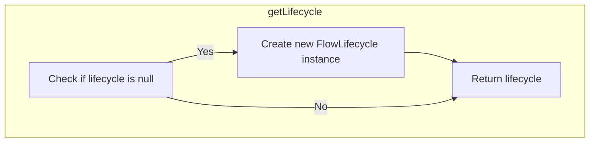

<SwmSnippet path="/spring-faces/src/main/java/org/springframework/faces/webflow/JsfViewFactoryCreator.java" line="51">

---

First, the <SwmToken path="spring-faces/src/main/java/org/springframework/faces/webflow/FlowLifecycle.java" pos="47:9:9" line-data="		Lifecycle defaultLifecycle = lifecycleFactory.getLifecycle(LifecycleFactory.DEFAULT_LIFECYCLE);">`getLifecycle`</SwmToken> method checks if the <SwmToken path="spring-faces/src/main/java/org/springframework/faces/webflow/JsfViewFactoryCreator.java" pos="51:6:6" line-data="		if (this.lifecycle == null) {">`lifecycle`</SwmToken> instance variable is null. This is crucial because it ensures that a new lifecycle is only created if one does not already exist.

```java
		if (this.lifecycle == null) {
			this.lifecycle = FlowLifecycle.newInstance();
```

---

</SwmSnippet>

<SwmSnippet path="/spring-faces/src/main/java/org/springframework/faces/webflow/JsfViewFactoryCreator.java" line="52">

---

Next, if the <SwmToken path="spring-faces/src/main/java/org/springframework/faces/webflow/JsfViewFactoryCreator.java" pos="52:3:3" line-data="			this.lifecycle = FlowLifecycle.newInstance();">`lifecycle`</SwmToken> is null, the method initializes it by calling <SwmToken path="spring-faces/src/main/java/org/springframework/faces/webflow/JsfViewFactoryCreator.java" pos="52:7:11" line-data="			this.lifecycle = FlowLifecycle.newInstance();">`FlowLifecycle.newInstance()`</SwmToken>. This step is important as it creates a new instance of <SwmToken path="spring-faces/src/main/java/org/springframework/faces/webflow/JsfViewFactoryCreator.java" pos="52:7:7" line-data="			this.lifecycle = FlowLifecycle.newInstance();">`FlowLifecycle`</SwmToken>, ensuring that the lifecycle is properly set up for the JSF view factory.

```java
			this.lifecycle = FlowLifecycle.newInstance();
```

---

</SwmSnippet>

<SwmSnippet path="/spring-faces/src/main/java/org/springframework/faces/webflow/JsfViewFactoryCreator.java" line="54">

---

Finally, the method returns the <SwmToken path="spring-faces/src/main/java/org/springframework/faces/webflow/JsfViewFactoryCreator.java" pos="54:5:5" line-data="		return this.lifecycle;">`lifecycle`</SwmToken> instance. This ensures that the lifecycle is available for subsequent operations within the JSF view factory, maintaining the flow's integrity and consistency.

```java
		return this.lifecycle;
	}
```

---

</SwmSnippet>

## Looking at <SwmToken path="spring-webflow/src/main/java/org/springframework/webflow/mvc/view/ConvertingPropertyEditorAdapter.java" pos="58:9:9" line-data="			return (String) conversionService.executeConversion(converterId, getValue(), String.class);">`executeConversion`</SwmToken> & <SwmToken path="spring-webflow/src/main/java/org/springframework/webflow/engine/builder/support/FlowBuilderContextImpl.java" pos="71:5:5" line-data="	public FlowBuilderServices getFlowBuilderServices() {">`getFlowBuilderServices`</SwmToken> & <SwmToken path="spring-webflow/src/main/java/org/springframework/webflow/engine/builder/support/FlowBuilderContextImpl.java" pos="93:5:5" line-data="	public ConversionService getConversionService() {">`getConversionService`</SwmToken>

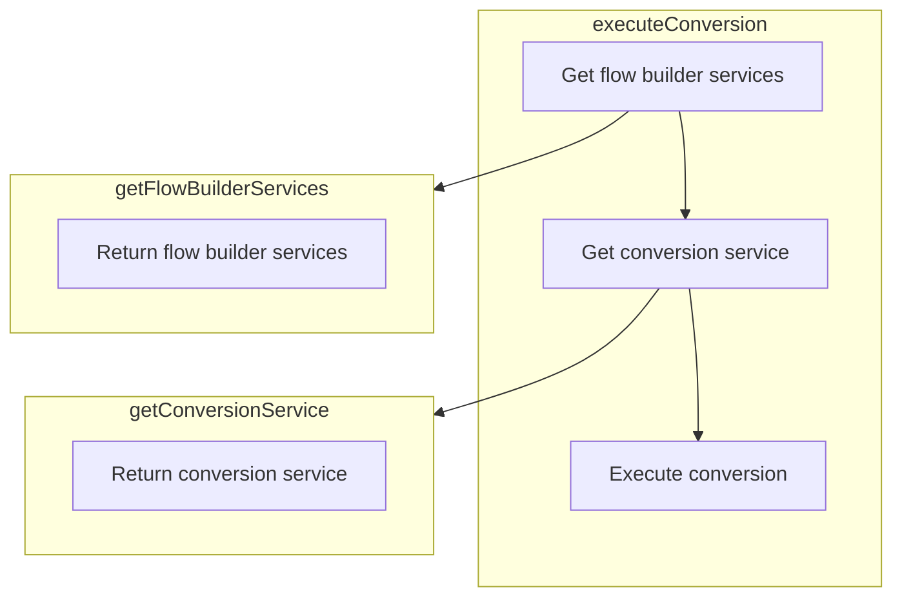

<SwmSnippet path="/spring-webflow/src/main/java/org/springframework/webflow/engine/builder/support/FlowBuilderContextImpl.java" line="144">

---

First, the <SwmToken path="spring-webflow/src/main/java/org/springframework/webflow/engine/builder/support/FlowBuilderContextImpl.java" pos="144:5:5" line-data="		public Object executeConversion(Object source, Class&lt;?&gt; targetClass) throws ConversionException {">`executeConversion`</SwmToken> method is responsible for converting an object from one type to another specified target class. This is crucial for ensuring that data types are compatible and can be processed correctly within the application.

```java
		public Object executeConversion(Object source, Class<?> targetClass) throws ConversionException {
			return getFlowBuilderServices().getConversionService().executeConversion(source, targetClass);
		}
```

---

</SwmSnippet>

<SwmSnippet path="/spring-webflow/src/main/java/org/springframework/webflow/engine/builder/support/FlowBuilderContextImpl.java" line="71">

---

Next, the <SwmToken path="spring-webflow/src/main/java/org/springframework/webflow/engine/builder/support/FlowBuilderContextImpl.java" pos="71:5:5" line-data="	public FlowBuilderServices getFlowBuilderServices() {">`getFlowBuilderServices`</SwmToken> method is called to retrieve the <SwmToken path="spring-webflow/src/main/java/org/springframework/webflow/engine/builder/support/FlowBuilderContextImpl.java" pos="71:3:3" line-data="	public FlowBuilderServices getFlowBuilderServices() {">`FlowBuilderServices`</SwmToken> instance. This service provides various utilities and configurations needed for building and managing flows.

```java
	public FlowBuilderServices getFlowBuilderServices() {
		return flowBuilderServices;
	}
```

---

</SwmSnippet>

<SwmSnippet path="/spring-webflow/src/main/java/org/springframework/webflow/engine/builder/support/FlowBuilderContextImpl.java" line="93">

---

Then, the <SwmToken path="spring-webflow/src/main/java/org/springframework/webflow/engine/builder/support/FlowBuilderContextImpl.java" pos="93:5:5" line-data="	public ConversionService getConversionService() {">`getConversionService`</SwmToken> method is used to access the <SwmToken path="spring-webflow/src/main/java/org/springframework/webflow/engine/builder/support/FlowBuilderContextImpl.java" pos="93:3:3" line-data="	public ConversionService getConversionService() {">`ConversionService`</SwmToken> instance. This service is responsible for performing the actual conversion logic, ensuring that the source object is transformed into the target class as required.

```java
	public ConversionService getConversionService() {
		return conversionService;
	}
```

---

</SwmSnippet>

## Exploring <SwmToken path="spring-webflow/src/main/java/org/springframework/webflow/mvc/view/ConvertingPropertyEditorAdapter.java" pos="58:9:9" line-data="			return (String) conversionService.executeConversion(converterId, getValue(), String.class);">`executeConversion`</SwmToken>

```mermaid
graph TD
  subgraph executeConversion
    executeConversion:A["Get FlowBuilderServices"] --> executeConversion:B["Get ConversionService"]
    executeConversion:B --> executeConversion:C["Execute conversion with converterId, source, and targetClass"]
  end

%% Swimm:
%% graph TD
%%   subgraph <SwmToken path="spring-webflow/src/main/java/org/springframework/webflow/mvc/view/ConvertingPropertyEditorAdapter.java" pos="58:9:9" line-data="			return (String) conversionService.executeConversion(converterId, getValue(), String.class);">`executeConversion`</SwmToken>
%%     <SwmToken path="spring-webflow/src/main/java/org/springframework/webflow/mvc/view/ConvertingPropertyEditorAdapter.java" pos="58:9:9" line-data="			return (String) conversionService.executeConversion(converterId, getValue(), String.class);">`executeConversion`</SwmToken>:A["Get <SwmToken path="spring-webflow/src/main/java/org/springframework/webflow/engine/builder/support/FlowBuilderContextImpl.java" pos="71:3:3" line-data="	public FlowBuilderServices getFlowBuilderServices() {">`FlowBuilderServices`</SwmToken>"] --> <SwmToken path="spring-webflow/src/main/java/org/springframework/webflow/mvc/view/ConvertingPropertyEditorAdapter.java" pos="58:9:9" line-data="			return (String) conversionService.executeConversion(converterId, getValue(), String.class);">`executeConversion`</SwmToken>:B["Get <SwmToken path="spring-webflow/src/main/java/org/springframework/webflow/engine/builder/support/FlowBuilderContextImpl.java" pos="93:3:3" line-data="	public ConversionService getConversionService() {">`ConversionService`</SwmToken>"]
%%     <SwmToken path="spring-webflow/src/main/java/org/springframework/webflow/mvc/view/ConvertingPropertyEditorAdapter.java" pos="58:9:9" line-data="			return (String) conversionService.executeConversion(converterId, getValue(), String.class);">`executeConversion`</SwmToken>:B --> <SwmToken path="spring-webflow/src/main/java/org/springframework/webflow/mvc/view/ConvertingPropertyEditorAdapter.java" pos="58:9:9" line-data="			return (String) conversionService.executeConversion(converterId, getValue(), String.class);">`executeConversion`</SwmToken>:C["Execute conversion with <SwmToken path="spring-webflow/src/main/java/org/springframework/webflow/mvc/view/ConvertingPropertyEditorAdapter.java" pos="57:8:8" line-data="		if (StringUtils.hasText(converterId)) {">`converterId`</SwmToken>, source, and <SwmToken path="spring-webflow/src/main/java/org/springframework/webflow/engine/builder/support/FlowBuilderContextImpl.java" pos="144:15:15" line-data="		public Object executeConversion(Object source, Class&lt;?&gt; targetClass) throws ConversionException {">`targetClass`</SwmToken>"]
%%   end
```

## Executing the Conversion Process

First, the <SwmToken path="spring-webflow/src/main/java/org/springframework/webflow/mvc/view/ConvertingPropertyEditorAdapter.java" pos="58:9:9" line-data="			return (String) conversionService.executeConversion(converterId, getValue(), String.class);">`executeConversion`</SwmToken> method is responsible for converting data from one type to another within the flow builder context. This is crucial for ensuring that data is in the correct format for further processing and operations.

<SwmSnippet path="/spring-webflow/src/main/java/org/springframework/webflow/engine/builder/support/FlowBuilderContextImpl.java" line="149">

---

Next, the method retrieves the <SwmToken path="spring-webflow/src/main/java/org/springframework/webflow/engine/builder/support/FlowBuilderContextImpl.java" pos="71:3:3" line-data="	public FlowBuilderServices getFlowBuilderServices() {">`FlowBuilderServices`</SwmToken> which provides various services required during the flow building process. This includes the conversion service that will perform the actual data type conversion.

```java
			return getFlowBuilderServices().getConversionService().executeConversion(converterId, source, targetClass);
		}
```

---

</SwmSnippet>

<SwmSnippet path="/spring-webflow/src/main/java/org/springframework/webflow/engine/builder/support/FlowBuilderContextImpl.java" line="149">

---

Then, the conversion service's <SwmToken path="spring-webflow/src/main/java/org/springframework/webflow/engine/builder/support/FlowBuilderContextImpl.java" pos="149:11:11" line-data="			return getFlowBuilderServices().getConversionService().executeConversion(converterId, source, targetClass);">`executeConversion`</SwmToken> method is called with the provided <SwmToken path="spring-webflow/src/main/java/org/springframework/webflow/engine/builder/support/FlowBuilderContextImpl.java" pos="149:13:13" line-data="			return getFlowBuilderServices().getConversionService().executeConversion(converterId, source, targetClass);">`converterId`</SwmToken>, <SwmToken path="spring-webflow/src/main/java/org/springframework/webflow/engine/builder/support/FlowBuilderContextImpl.java" pos="149:16:16" line-data="			return getFlowBuilderServices().getConversionService().executeConversion(converterId, source, targetClass);">`source`</SwmToken> object, and <SwmToken path="spring-webflow/src/main/java/org/springframework/webflow/engine/builder/support/FlowBuilderContextImpl.java" pos="149:19:19" line-data="			return getFlowBuilderServices().getConversionService().executeConversion(converterId, source, targetClass);">`targetClass`</SwmToken>. This step ensures that the source object is converted to the desired target class using the specified converter.

```java
			return getFlowBuilderServices().getConversionService().executeConversion(converterId, source, targetClass);
		}
```

---

</SwmSnippet>

## Breaking down <SwmToken path="spring-webflow/src/main/java/org/springframework/webflow/mvc/view/ConvertingPropertyEditorAdapter.java" pos="61:9:9" line-data="				return (String) conversionService.getDelegateConversionService().convert(getValue(), fieldType,">`getDelegateConversionService`</SwmToken>

```mermaid
graph TD
  subgraph getDelegateConversionService
    getDelegateConversionService:A["Call getFlowBuilderServices"] --> getDelegateConversionService:B["Call getConversionService"]
    getDelegateConversionService:B --> getDelegateConversionService:C["Call getDelegateConversionService"]
  end

%% Swimm:
%% graph TD
%%   subgraph <SwmToken path="spring-webflow/src/main/java/org/springframework/webflow/mvc/view/ConvertingPropertyEditorAdapter.java" pos="61:9:9" line-data="				return (String) conversionService.getDelegateConversionService().convert(getValue(), fieldType,">`getDelegateConversionService`</SwmToken>
%%     <SwmToken path="spring-webflow/src/main/java/org/springframework/webflow/mvc/view/ConvertingPropertyEditorAdapter.java" pos="61:9:9" line-data="				return (String) conversionService.getDelegateConversionService().convert(getValue(), fieldType,">`getDelegateConversionService`</SwmToken>:A["Call <SwmToken path="spring-webflow/src/main/java/org/springframework/webflow/engine/builder/support/FlowBuilderContextImpl.java" pos="71:5:5" line-data="	public FlowBuilderServices getFlowBuilderServices() {">`getFlowBuilderServices`</SwmToken>"] --> <SwmToken path="spring-webflow/src/main/java/org/springframework/webflow/mvc/view/ConvertingPropertyEditorAdapter.java" pos="61:9:9" line-data="				return (String) conversionService.getDelegateConversionService().convert(getValue(), fieldType,">`getDelegateConversionService`</SwmToken>:B["Call <SwmToken path="spring-webflow/src/main/java/org/springframework/webflow/engine/builder/support/FlowBuilderContextImpl.java" pos="93:5:5" line-data="	public ConversionService getConversionService() {">`getConversionService`</SwmToken>"]
%%     <SwmToken path="spring-webflow/src/main/java/org/springframework/webflow/mvc/view/ConvertingPropertyEditorAdapter.java" pos="61:9:9" line-data="				return (String) conversionService.getDelegateConversionService().convert(getValue(), fieldType,">`getDelegateConversionService`</SwmToken>:B --> <SwmToken path="spring-webflow/src/main/java/org/springframework/webflow/mvc/view/ConvertingPropertyEditorAdapter.java" pos="61:9:9" line-data="				return (String) conversionService.getDelegateConversionService().convert(getValue(), fieldType,">`getDelegateConversionService`</SwmToken>:C["Call <SwmToken path="spring-webflow/src/main/java/org/springframework/webflow/mvc/view/ConvertingPropertyEditorAdapter.java" pos="61:9:9" line-data="				return (String) conversionService.getDelegateConversionService().convert(getValue(), fieldType,">`getDelegateConversionService`</SwmToken>"]
%%   end
```

## Retrieving the Delegate Conversion Service

First, the <SwmToken path="spring-webflow/src/main/java/org/springframework/webflow/mvc/view/ConvertingPropertyEditorAdapter.java" pos="61:9:9" line-data="				return (String) conversionService.getDelegateConversionService().convert(getValue(), fieldType,">`getDelegateConversionService`</SwmToken> method is called to retrieve the delegate conversion service. This service is essential for converting values within the flow building process, ensuring that data types are correctly transformed as needed.

Moving to the next step, the method calls <SwmToken path="spring-webflow/src/main/java/org/springframework/webflow/engine/builder/support/FlowBuilderContextImpl.java" pos="71:5:5" line-data="	public FlowBuilderServices getFlowBuilderServices() {">`getFlowBuilderServices`</SwmToken> to access the flow builder services. These services provide various utilities and configurations required for building flows.

Then, the method retrieves the conversion service from the flow builder services. The conversion service is responsible for handling type conversions during the flow execution.

<SwmSnippet path="/spring-webflow/src/main/java/org/springframework/webflow/engine/builder/support/FlowBuilderContextImpl.java" line="166">

---

Finally, the method calls <SwmToken path="spring-webflow/src/main/java/org/springframework/webflow/engine/builder/support/FlowBuilderContextImpl.java" pos="166:13:13" line-data="		public org.springframework.core.convert.ConversionService getDelegateConversionService() {">`getDelegateConversionService`</SwmToken> on the conversion service to obtain the delegate conversion service. This delegate service is used to perform the actual type conversions, ensuring that all data transformations are handled correctly.

```java
		public org.springframework.core.convert.ConversionService getDelegateConversionService() {
			return getFlowBuilderServices().getConversionService().getDelegateConversionService();
		}
```

---

</SwmSnippet>

## Looking at <SwmToken path="spring-webflow/src/main/java/org/springframework/webflow/mvc/view/ConvertingPropertyEditorAdapter.java" pos="58:14:14" line-data="			return (String) conversionService.executeConversion(converterId, getValue(), String.class);">`getValue`</SwmToken> & <SwmToken path="spring-webflow/src/main/java/org/springframework/webflow/mvc/view/AbstractMvcView.java" pos="717:5:5" line-data="			return parameters.asMap().get(parameterName);">`asMap`</SwmToken>

```mermaid
graph TD
  subgraph getValue
    getValue:A["Cast context to ParameterMap"] --> getValue:B["Call asMap() method on parameters"] --> getValue:C["Return value associated with parameterName"]
  end
  subgraph asMap
    asMap:A["Call parameterAccessor.asMap()"] --> asMap:B["Convert the result to an unmodifiable map"] --> asMap:C["Return unmodifiable map"]
  end
  getValue:B --> asMap

%% Swimm:
%% graph TD
%%   subgraph <SwmToken path="spring-webflow/src/main/java/org/springframework/webflow/mvc/view/ConvertingPropertyEditorAdapter.java" pos="58:14:14" line-data="			return (String) conversionService.executeConversion(converterId, getValue(), String.class);">`getValue`</SwmToken>
%%     <SwmToken path="spring-webflow/src/main/java/org/springframework/webflow/mvc/view/ConvertingPropertyEditorAdapter.java" pos="58:14:14" line-data="			return (String) conversionService.executeConversion(converterId, getValue(), String.class);">`getValue`</SwmToken>:A["Cast context to <SwmToken path="spring-webflow/src/main/java/org/springframework/webflow/mvc/view/AbstractMvcView.java" pos="716:1:1" line-data="			ParameterMap parameters = (ParameterMap) context;">`ParameterMap`</SwmToken>"] --> <SwmToken path="spring-webflow/src/main/java/org/springframework/webflow/mvc/view/ConvertingPropertyEditorAdapter.java" pos="58:14:14" line-data="			return (String) conversionService.executeConversion(converterId, getValue(), String.class);">`getValue`</SwmToken>:B["Call <SwmToken path="spring-webflow/src/main/java/org/springframework/webflow/mvc/view/AbstractMvcView.java" pos="717:5:7" line-data="			return parameters.asMap().get(parameterName);">`asMap()`</SwmToken> method on parameters"] --> <SwmToken path="spring-webflow/src/main/java/org/springframework/webflow/mvc/view/ConvertingPropertyEditorAdapter.java" pos="58:14:14" line-data="			return (String) conversionService.executeConversion(converterId, getValue(), String.class);">`getValue`</SwmToken>:C["Return value associated with <SwmToken path="spring-webflow/src/main/java/org/springframework/webflow/mvc/view/AbstractMvcView.java" pos="717:11:11" line-data="			return parameters.asMap().get(parameterName);">`parameterName`</SwmToken>"]
%%   end
%%   subgraph <SwmToken path="spring-webflow/src/main/java/org/springframework/webflow/mvc/view/AbstractMvcView.java" pos="717:5:5" line-data="			return parameters.asMap().get(parameterName);">`asMap`</SwmToken>
%%     <SwmToken path="spring-webflow/src/main/java/org/springframework/webflow/mvc/view/AbstractMvcView.java" pos="717:5:5" line-data="			return parameters.asMap().get(parameterName);">`asMap`</SwmToken>:A["Call <SwmToken path="spring-webflow/src/main/java/org/springframework/webflow/core/collection/LocalParameterMap.java" pos="99:7:11" line-data="		return Collections.unmodifiableMap(parameterAccessor.asMap());">`parameterAccessor.asMap()`</SwmToken>"] --> <SwmToken path="spring-webflow/src/main/java/org/springframework/webflow/mvc/view/AbstractMvcView.java" pos="717:5:5" line-data="			return parameters.asMap().get(parameterName);">`asMap`</SwmToken>:B["Convert the result to an unmodifiable map"] --> <SwmToken path="spring-webflow/src/main/java/org/springframework/webflow/mvc/view/AbstractMvcView.java" pos="717:5:5" line-data="			return parameters.asMap().get(parameterName);">`asMap`</SwmToken>:C["Return unmodifiable map"]
%%   end
%%   <SwmToken path="spring-webflow/src/main/java/org/springframework/webflow/mvc/view/ConvertingPropertyEditorAdapter.java" pos="58:14:14" line-data="			return (String) conversionService.executeConversion(converterId, getValue(), String.class);">`getValue`</SwmToken>:B --> <SwmToken path="spring-webflow/src/main/java/org/springframework/webflow/mvc/view/AbstractMvcView.java" pos="717:5:5" line-data="			return parameters.asMap().get(parameterName);">`asMap`</SwmToken>
```

## Retrieving Parameter Values

First, the <SwmToken path="spring-webflow/src/main/java/org/springframework/webflow/mvc/view/ConvertingPropertyEditorAdapter.java" pos="58:14:14" line-data="			return (String) conversionService.executeConversion(converterId, getValue(), String.class);">`getValue`</SwmToken> method is responsible for retrieving a specific parameter value from the provided context. This context is expected to be a <SwmToken path="spring-webflow/src/main/java/org/springframework/webflow/mvc/view/AbstractMvcView.java" pos="716:1:1" line-data="			ParameterMap parameters = (ParameterMap) context;">`ParameterMap`</SwmToken>, which contains various parameters relevant to the current flow.

Moving to the next step, the <SwmToken path="spring-webflow/src/main/java/org/springframework/webflow/mvc/view/ConvertingPropertyEditorAdapter.java" pos="58:14:14" line-data="			return (String) conversionService.executeConversion(converterId, getValue(), String.class);">`getValue`</SwmToken> method calls the <SwmToken path="spring-webflow/src/main/java/org/springframework/webflow/mvc/view/AbstractMvcView.java" pos="717:5:5" line-data="			return parameters.asMap().get(parameterName);">`asMap`</SwmToken> method on the <SwmToken path="spring-webflow/src/main/java/org/springframework/webflow/mvc/view/AbstractMvcView.java" pos="716:1:1" line-data="			ParameterMap parameters = (ParameterMap) context;">`ParameterMap`</SwmToken> instance. This converts the parameters into an unmodifiable map, ensuring that the parameters cannot be altered during the flow.

<SwmSnippet path="/spring-webflow/src/main/java/org/springframework/webflow/mvc/view/AbstractMvcView.java" line="715">

---

Then, the <SwmToken path="spring-webflow/src/main/java/org/springframework/webflow/mvc/view/AbstractMvcView.java" pos="715:5:5" line-data="		public Object getValue(Object context) throws EvaluationException {">`getValue`</SwmToken> method retrieves the value associated with a specific parameter name from this map. This value is then returned for further processing in the flow.

```java
		public Object getValue(Object context) throws EvaluationException {
			ParameterMap parameters = (ParameterMap) context;
			return parameters.asMap().get(parameterName);
		}
```

---

</SwmSnippet>

<SwmSnippet path="/spring-webflow/src/main/java/org/springframework/webflow/core/collection/LocalParameterMap.java" line="98">

---

The <SwmToken path="spring-webflow/src/main/java/org/springframework/webflow/core/collection/LocalParameterMap.java" pos="98:11:11" line-data="	public Map&lt;String, Object&gt; asMap() {">`asMap`</SwmToken> method in the <SwmToken path="spring-webflow/src/main/java/org/springframework/webflow/core/collection/LocalParameterMap.java" pos="43:4:4" line-data="public class LocalParameterMap implements ParameterMap, Serializable {">`LocalParameterMap`</SwmToken> class is crucial for converting the parameters into an unmodifiable map. This method ensures that the parameters are securely encapsulated and cannot be modified once they are part of the flow.

```java
	public Map<String, Object> asMap() {
		return Collections.unmodifiableMap(parameterAccessor.asMap());
	}
```

---

</SwmSnippet>

&nbsp;

*This is an auto-generated document by Swimm 🌊 and has not yet been verified by a human*

<SwmMeta version="3.0.0" repo-id="Z2l0aHViJTNBJTNBc3ByaW5nLXdlYmZsb3ctZGVtbyUzQSUzQWdpbGFkbmF2b3Q=" repo-name="spring-webflow-demo"><sup>Powered by [Swimm](/)</sup></SwmMeta>
