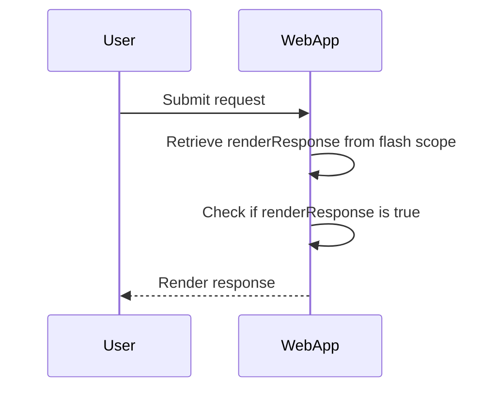
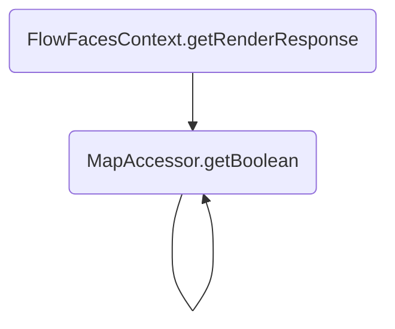
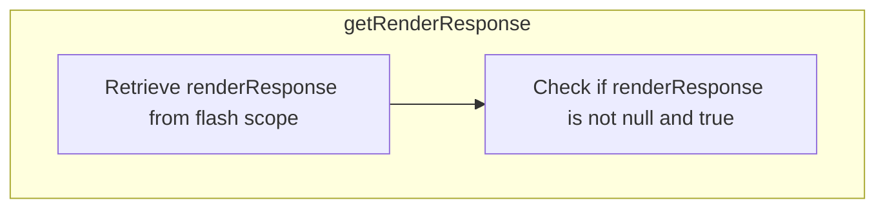

The <SwmToken path="spring-faces/src/main/java/org/springframework/faces/webflow/FlowFacesContext.java" pos="131:5:5" line-data="	public boolean getRenderResponse() {">`getRenderResponse`</SwmToken> flow is used to decide whether the current request should result in an immediate render response or if further processing is required. This decision is crucial for managing the rendering lifecycle in a web application.

For instance, if a user submits a form, the <SwmToken path="spring-faces/src/main/java/org/springframework/faces/webflow/FlowFacesContext.java" pos="131:5:5" line-data="	public boolean getRenderResponse() {">`getRenderResponse`</SwmToken> method checks if the response should be rendered immediately based on the state stored in the flash scope.



# Where is this flow used?

This flow is used multiple times in the codebase as represented in the following diagram:

```mermaid
graph TD;
      subgraph springfacessrcmainjavaorgspringframeworkfaceswebflow[spring-faces/…/faces/webflow]
77e3f4a2651a1d46bd9d8ab72e52f89823805f8a4aec336872c0f612d98a6137(skipPhase) --> 8834c34fb096f4942f1648f6de4e57d4d166a5f7e2edc49fef2368bd31926e35(FlowFacesContext.getRenderResponse)
end

subgraph springfacessrcmainjavaorgspringframeworkfaceswebflow[spring-faces/…/faces/webflow]
a7aadcec938e3f2bd77a30af9b6c6d1a73ba269789ed1b7f164ea4d84c4c7686(execute) --> 77e3f4a2651a1d46bd9d8ab72e52f89823805f8a4aec336872c0f612d98a6137(skipPhase)
end

subgraph springfacessrcmainjavaorgspringframeworkfaceswebflow[spring-faces/…/faces/webflow]
562b5bd44a756838d7d3de08c16ea399467454615a9311cc11a21cac92c81428(processUserEvent) --> a7aadcec938e3f2bd77a30af9b6c6d1a73ba269789ed1b7f164ea4d84c4c7686(execute)
end

subgraph springfacessrcmainjavaorgspringframeworkfaceswebflow[spring-faces/…/faces/webflow]
562b5bd44a756838d7d3de08c16ea399467454615a9311cc11a21cac92c81428(processUserEvent) --> 8834c34fb096f4942f1648f6de4e57d4d166a5f7e2edc49fef2368bd31926e35(FlowFacesContext.getRenderResponse)
end

subgraph springfacessrcmainjavaorgspringframeworkfaceswebflow[spring-faces/…/faces/webflow]
191797efa309099c60c3a30815686f4ec7b5a8884ca7ecbd1bcef42c492b55f2(getView) --> 8834c34fb096f4942f1648f6de4e57d4d166a5f7e2edc49fef2368bd31926e35(FlowFacesContext.getRenderResponse)
end

subgraph springfacessrcmainjavaorgspringframeworkfaceswebflow[spring-faces/…/faces/webflow]
191797efa309099c60c3a30815686f4ec7b5a8884ca7ecbd1bcef42c492b55f2(getView) --> cfbbeab93cc8fcac1d922d1ba58b2e4ef10efb1f778f5c64c46570a4d70f9af3(getViewRoot)
end

subgraph springfacessrcmainjavaorgspringframeworkfaceswebflow[spring-faces/…/faces/webflow]
191797efa309099c60c3a30815686f4ec7b5a8884ca7ecbd1bcef42c492b55f2(getView) --> 4f7e5d8a1df1d13533711f7819035de5416e6921acdc720a7c1ad3c3c0548aad(publishPostRestoreStateEvent)
end

subgraph springfacessrcmainjavaorgspringframeworkfaceswebflow[spring-faces/…/faces/webflow]
c93942b3f8313ed54923beb291660ff6db7de6e1632d4e89eaf6e1f3b66800ac(processTree) --> 8834c34fb096f4942f1648f6de4e57d4d166a5f7e2edc49fef2368bd31926e35(FlowFacesContext.getRenderResponse)
end

subgraph springfacessrcmainjavaorgspringframeworkfaceswebflow[spring-faces/…/faces/webflow]
c93942b3f8313ed54923beb291660ff6db7de6e1632d4e89eaf6e1f3b66800ac(processTree) --> c93942b3f8313ed54923beb291660ff6db7de6e1632d4e89eaf6e1f3b66800ac(processTree)
end

subgraph springfacessrcmainjavaorgspringframeworkfaceswebflow[spring-faces/…/faces/webflow]
839dc049fc1fc8ba5f4a832671517028859ea9826227d06103e1c9aa4c434abe(getViewRootForAlreadySetView) --> c93942b3f8313ed54923beb291660ff6db7de6e1632d4e89eaf6e1f3b66800ac(processTree)
end

subgraph springfacessrcmainjavaorgspringframeworkfaceswebflow[spring-faces/…/faces/webflow]
839dc049fc1fc8ba5f4a832671517028859ea9826227d06103e1c9aa4c434abe(getViewRootForAlreadySetView) --> cfbbeab93cc8fcac1d922d1ba58b2e4ef10efb1f778f5c64c46570a4d70f9af3(getViewRoot)
end

subgraph springfacessrcmainjavaorgspringframeworkfaceswebflow[spring-faces/…/faces/webflow]
cfbbeab93cc8fcac1d922d1ba58b2e4ef10efb1f778f5c64c46570a4d70f9af3(getViewRoot) --> 839dc049fc1fc8ba5f4a832671517028859ea9826227d06103e1c9aa4c434abe(getViewRootForAlreadySetView)
end

subgraph springfacessrcmainjavaorgspringframeworkfaceswebflow[spring-faces/…/faces/webflow]
cfbbeab93cc8fcac1d922d1ba58b2e4ef10efb1f778f5c64c46570a4d70f9af3(getViewRoot) --> 44e2be42912289731d5fbe97b86dd3d1965418ea57ccbdc7c409f0ca19131890(viewAlreadySet)
end

subgraph springfacessrcmainjavaorgspringframeworkfaceswebflow[spring-faces/…/faces/webflow]
cfbbeab93cc8fcac1d922d1ba58b2e4ef10efb1f778f5c64c46570a4d70f9af3(getViewRoot) --> 9660731028d10c7f230fb836a770e48dcf29669259b9c1606c114058bc072117(getViewStateViewRoot)
end

subgraph springfacessrcmainjavaorgspringframeworkfaceswebflow[spring-faces/…/faces/webflow]
44e2be42912289731d5fbe97b86dd3d1965418ea57ccbdc7c409f0ca19131890(viewAlreadySet) --> cfbbeab93cc8fcac1d922d1ba58b2e4ef10efb1f778f5c64c46570a4d70f9af3(getViewRoot)
end

subgraph springfacessrcmainjavaorgspringframeworkfaceswebflow[spring-faces/…/faces/webflow]
4f7e5d8a1df1d13533711f7819035de5416e6921acdc720a7c1ad3c3c0548aad(publishPostRestoreStateEvent) --> cfbbeab93cc8fcac1d922d1ba58b2e4ef10efb1f778f5c64c46570a4d70f9af3(getViewRoot)
end

subgraph springfacessrcmainjavaorgspringframeworkfaceswebflow[spring-faces/…/faces/webflow]
9660731028d10c7f230fb836a770e48dcf29669259b9c1606c114058bc072117(getViewStateViewRoot) --> c93942b3f8313ed54923beb291660ff6db7de6e1632d4e89eaf6e1f3b66800ac(processTree)
end


      classDef mainFlowStyle color:#000000,fill:#7CB9F4
classDef rootsStyle color:#000000,fill:#00FFF4
classDef Style1 color:#000000,fill:#00FFAA
classDef Style2 color:#000000,fill:#FFFF00
classDef Style3 color:#000000,fill:#AA7CB9

%% Swimm:
%% graph TD;
%%       subgraph springfacessrcmainjavaorgspringframeworkfaceswebflow[<SwmPath>[spring-faces/…/faces/webflow/](spring-faces/src/main/java/org/springframework/faces/webflow/)</SwmPath>]
%% 77e3f4a2651a1d46bd9d8ab72e52f89823805f8a4aec336872c0f612d98a6137(skipPhase) --> 8834c34fb096f4942f1648f6de4e57d4d166a5f7e2edc49fef2368bd31926e35(FlowFacesContext.getRenderResponse)
%% end
%% 
%% subgraph springfacessrcmainjavaorgspringframeworkfaceswebflow[<SwmPath>[spring-faces/…/faces/webflow/](spring-faces/src/main/java/org/springframework/faces/webflow/)</SwmPath>]
%% a7aadcec938e3f2bd77a30af9b6c6d1a73ba269789ed1b7f164ea4d84c4c7686(execute) --> 77e3f4a2651a1d46bd9d8ab72e52f89823805f8a4aec336872c0f612d98a6137(skipPhase)
%% end
%% 
%% subgraph springfacessrcmainjavaorgspringframeworkfaceswebflow[<SwmPath>[spring-faces/…/faces/webflow/](spring-faces/src/main/java/org/springframework/faces/webflow/)</SwmPath>]
%% 562b5bd44a756838d7d3de08c16ea399467454615a9311cc11a21cac92c81428(processUserEvent) --> a7aadcec938e3f2bd77a30af9b6c6d1a73ba269789ed1b7f164ea4d84c4c7686(execute)
%% end
%% 
%% subgraph springfacessrcmainjavaorgspringframeworkfaceswebflow[<SwmPath>[spring-faces/…/faces/webflow/](spring-faces/src/main/java/org/springframework/faces/webflow/)</SwmPath>]
%% 562b5bd44a756838d7d3de08c16ea399467454615a9311cc11a21cac92c81428(processUserEvent) --> 8834c34fb096f4942f1648f6de4e57d4d166a5f7e2edc49fef2368bd31926e35(FlowFacesContext.getRenderResponse)
%% end
%% 
%% subgraph springfacessrcmainjavaorgspringframeworkfaceswebflow[<SwmPath>[spring-faces/…/faces/webflow/](spring-faces/src/main/java/org/springframework/faces/webflow/)</SwmPath>]
%% 191797efa309099c60c3a30815686f4ec7b5a8884ca7ecbd1bcef42c492b55f2(getView) --> 8834c34fb096f4942f1648f6de4e57d4d166a5f7e2edc49fef2368bd31926e35(FlowFacesContext.getRenderResponse)
%% end
%% 
%% subgraph springfacessrcmainjavaorgspringframeworkfaceswebflow[<SwmPath>[spring-faces/…/faces/webflow/](spring-faces/src/main/java/org/springframework/faces/webflow/)</SwmPath>]
%% 191797efa309099c60c3a30815686f4ec7b5a8884ca7ecbd1bcef42c492b55f2(getView) --> cfbbeab93cc8fcac1d922d1ba58b2e4ef10efb1f778f5c64c46570a4d70f9af3(getViewRoot)
%% end
%% 
%% subgraph springfacessrcmainjavaorgspringframeworkfaceswebflow[<SwmPath>[spring-faces/…/faces/webflow/](spring-faces/src/main/java/org/springframework/faces/webflow/)</SwmPath>]
%% 191797efa309099c60c3a30815686f4ec7b5a8884ca7ecbd1bcef42c492b55f2(getView) --> 4f7e5d8a1df1d13533711f7819035de5416e6921acdc720a7c1ad3c3c0548aad(publishPostRestoreStateEvent)
%% end
%% 
%% subgraph springfacessrcmainjavaorgspringframeworkfaceswebflow[<SwmPath>[spring-faces/…/faces/webflow/](spring-faces/src/main/java/org/springframework/faces/webflow/)</SwmPath>]
%% c93942b3f8313ed54923beb291660ff6db7de6e1632d4e89eaf6e1f3b66800ac(processTree) --> 8834c34fb096f4942f1648f6de4e57d4d166a5f7e2edc49fef2368bd31926e35(FlowFacesContext.getRenderResponse)
%% end
%% 
%% subgraph springfacessrcmainjavaorgspringframeworkfaceswebflow[<SwmPath>[spring-faces/…/faces/webflow/](spring-faces/src/main/java/org/springframework/faces/webflow/)</SwmPath>]
%% c93942b3f8313ed54923beb291660ff6db7de6e1632d4e89eaf6e1f3b66800ac(processTree) --> c93942b3f8313ed54923beb291660ff6db7de6e1632d4e89eaf6e1f3b66800ac(processTree)
%% end
%% 
%% subgraph springfacessrcmainjavaorgspringframeworkfaceswebflow[<SwmPath>[spring-faces/…/faces/webflow/](spring-faces/src/main/java/org/springframework/faces/webflow/)</SwmPath>]
%% 839dc049fc1fc8ba5f4a832671517028859ea9826227d06103e1c9aa4c434abe(getViewRootForAlreadySetView) --> c93942b3f8313ed54923beb291660ff6db7de6e1632d4e89eaf6e1f3b66800ac(processTree)
%% end
%% 
%% subgraph springfacessrcmainjavaorgspringframeworkfaceswebflow[<SwmPath>[spring-faces/…/faces/webflow/](spring-faces/src/main/java/org/springframework/faces/webflow/)</SwmPath>]
%% 839dc049fc1fc8ba5f4a832671517028859ea9826227d06103e1c9aa4c434abe(getViewRootForAlreadySetView) --> cfbbeab93cc8fcac1d922d1ba58b2e4ef10efb1f778f5c64c46570a4d70f9af3(getViewRoot)
%% end
%% 
%% subgraph springfacessrcmainjavaorgspringframeworkfaceswebflow[<SwmPath>[spring-faces/…/faces/webflow/](spring-faces/src/main/java/org/springframework/faces/webflow/)</SwmPath>]
%% cfbbeab93cc8fcac1d922d1ba58b2e4ef10efb1f778f5c64c46570a4d70f9af3(getViewRoot) --> 839dc049fc1fc8ba5f4a832671517028859ea9826227d06103e1c9aa4c434abe(getViewRootForAlreadySetView)
%% end
%% 
%% subgraph springfacessrcmainjavaorgspringframeworkfaceswebflow[<SwmPath>[spring-faces/…/faces/webflow/](spring-faces/src/main/java/org/springframework/faces/webflow/)</SwmPath>]
%% cfbbeab93cc8fcac1d922d1ba58b2e4ef10efb1f778f5c64c46570a4d70f9af3(getViewRoot) --> 44e2be42912289731d5fbe97b86dd3d1965418ea57ccbdc7c409f0ca19131890(viewAlreadySet)
%% end
%% 
%% subgraph springfacessrcmainjavaorgspringframeworkfaceswebflow[<SwmPath>[spring-faces/…/faces/webflow/](spring-faces/src/main/java/org/springframework/faces/webflow/)</SwmPath>]
%% cfbbeab93cc8fcac1d922d1ba58b2e4ef10efb1f778f5c64c46570a4d70f9af3(getViewRoot) --> 9660731028d10c7f230fb836a770e48dcf29669259b9c1606c114058bc072117(getViewStateViewRoot)
%% end
%% 
%% subgraph springfacessrcmainjavaorgspringframeworkfaceswebflow[<SwmPath>[spring-faces/…/faces/webflow/](spring-faces/src/main/java/org/springframework/faces/webflow/)</SwmPath>]
%% 44e2be42912289731d5fbe97b86dd3d1965418ea57ccbdc7c409f0ca19131890(viewAlreadySet) --> cfbbeab93cc8fcac1d922d1ba58b2e4ef10efb1f778f5c64c46570a4d70f9af3(getViewRoot)
%% end
%% 
%% subgraph springfacessrcmainjavaorgspringframeworkfaceswebflow[<SwmPath>[spring-faces/…/faces/webflow/](spring-faces/src/main/java/org/springframework/faces/webflow/)</SwmPath>]
%% 4f7e5d8a1df1d13533711f7819035de5416e6921acdc720a7c1ad3c3c0548aad(publishPostRestoreStateEvent) --> cfbbeab93cc8fcac1d922d1ba58b2e4ef10efb1f778f5c64c46570a4d70f9af3(getViewRoot)
%% end
%% 
%% subgraph springfacessrcmainjavaorgspringframeworkfaceswebflow[<SwmPath>[spring-faces/…/faces/webflow/](spring-faces/src/main/java/org/springframework/faces/webflow/)</SwmPath>]
%% 9660731028d10c7f230fb836a770e48dcf29669259b9c1606c114058bc072117(getViewStateViewRoot) --> c93942b3f8313ed54923beb291660ff6db7de6e1632d4e89eaf6e1f3b66800ac(processTree)
%% end
%% 
%% 
%%       classDef mainFlowStyle color:#000000,fill:#7CB9F4
%% classDef rootsStyle color:#000000,fill:#00FFF4
%% classDef Style1 color:#000000,fill:#00FFAA
%% classDef Style2 color:#000000,fill:#FFFF00
%% classDef Style3 color:#000000,fill:#AA7CB9
```



Here is a high level diagram of the flow, showing only the most important functions:



# Flow drill down

## Diving into <SwmToken path="spring-faces/src/main/java/org/springframework/faces/webflow/FlowFacesContext.java" pos="131:5:5" line-data="	public boolean getRenderResponse() {">`getRenderResponse`</SwmToken>



<SwmSnippet path="/spring-faces/src/main/java/org/springframework/faces/webflow/FlowFacesContext.java" line="131">

---

First, the <SwmToken path="spring-faces/src/main/java/org/springframework/faces/webflow/FlowFacesContext.java" pos="131:5:5" line-data="	public boolean getRenderResponse() {">`getRenderResponse`</SwmToken> method is called to determine if the current request should trigger a render response. This is crucial for deciding whether the response should be rendered immediately or if further processing is needed.

```java
	public boolean getRenderResponse() {
		Boolean renderResponse = this.context.getFlashScope().getBoolean(RENDER_RESPONSE_KEY);
		return (renderResponse != null && renderResponse);
	}
```

---

</SwmSnippet>

<SwmSnippet path="/spring-binding/src/main/java/org/springframework/binding/collection/MapAccessor.java" line="351">

---

Next, within the <SwmToken path="spring-faces/src/main/java/org/springframework/faces/webflow/FlowFacesContext.java" pos="131:5:5" line-data="	public boolean getRenderResponse() {">`getRenderResponse`</SwmToken> method, the <SwmToken path="spring-binding/src/main/java/org/springframework/binding/collection/MapAccessor.java" pos="351:5:5" line-data="	public Boolean getBoolean(Object key) throws IllegalArgumentException {">`getBoolean`</SwmToken> method from <SwmToken path="spring-binding/src/main/java/org/springframework/binding/collection/MapAccessor.java" pos="29:4:4" line-data="public class MapAccessor&lt;K, V&gt; implements MapAdaptable&lt;K, V&gt; {">`MapAccessor`</SwmToken> is used to retrieve the <SwmToken path="spring-faces/src/main/java/org/springframework/faces/webflow/FlowFacesContext.java" pos="132:17:17" line-data="		Boolean renderResponse = this.context.getFlashScope().getBoolean(RENDER_RESPONSE_KEY);">`RENDER_RESPONSE_KEY`</SwmToken> from the flash scope. This key indicates whether a render response is required.

```java
	public Boolean getBoolean(Object key) throws IllegalArgumentException {
```

---

</SwmSnippet>

## Zooming into <SwmToken path="spring-faces/src/main/java/org/springframework/faces/webflow/FlowFacesContext.java" pos="132:15:15" line-data="		Boolean renderResponse = this.context.getFlashScope().getBoolean(RENDER_RESPONSE_KEY);">`getBoolean`</SwmToken> & <SwmToken path="spring-faces/src/main/java/org/springframework/faces/webflow/FlowFacesContext.java" pos="132:15:15" line-data="		Boolean renderResponse = this.context.getFlashScope().getBoolean(RENDER_RESPONSE_KEY);">`getBoolean`</SwmToken>

```mermaid
graph TD
  subgraph getBoolean(Object key)
    getBoolean1:A["Check if value for key exists in map"] -->|Exists| getBoolean1:B["Return boolean value"]
    getBoolean1:A -->|Does not exist| getBoolean1:C["Return null"]
  end
  subgraph getBoolean(Object key, Boolean defaultValue)
    getBoolean2:A["Check if value for key exists in map"] -->|Exists| getBoolean2:B["Return boolean value"]
    getBoolean2:A -->|Does not exist| getBoolean2:C["Return defaultValue"]
  end
  getBoolean1:A --> getBoolean2

%% Swimm:
%% graph TD
%%   subgraph <SwmToken path="spring-faces/src/main/java/org/springframework/faces/webflow/FlowFacesContext.java" pos="132:15:15" line-data="		Boolean renderResponse = this.context.getFlashScope().getBoolean(RENDER_RESPONSE_KEY);">`getBoolean`</SwmToken>(Object key)
%%     getBoolean1:A["Check if value for key exists in map"] -->|Exists| getBoolean1:B["Return boolean value"]
%%     getBoolean1:A -->|Does not exist| getBoolean1:C["Return null"]
%%   end
%%   subgraph <SwmToken path="spring-faces/src/main/java/org/springframework/faces/webflow/FlowFacesContext.java" pos="132:15:15" line-data="		Boolean renderResponse = this.context.getFlashScope().getBoolean(RENDER_RESPONSE_KEY);">`getBoolean`</SwmToken>(Object key, Boolean <SwmToken path="spring-binding/src/main/java/org/springframework/binding/collection/MapAccessor.java" pos="362:14:14" line-data="	public Boolean getBoolean(Object key, Boolean defaultValue) throws IllegalArgumentException {">`defaultValue`</SwmToken>)
%%     getBoolean2:A["Check if value for key exists in map"] -->|Exists| getBoolean2:B["Return boolean value"]
%%     getBoolean2:A -->|Does not exist| getBoolean2:C["Return <SwmToken path="spring-binding/src/main/java/org/springframework/binding/collection/MapAccessor.java" pos="362:14:14" line-data="	public Boolean getBoolean(Object key, Boolean defaultValue) throws IllegalArgumentException {">`defaultValue`</SwmToken>"]
%%   end
%%   getBoolean1:A --> getBoolean2
```

<SwmSnippet path="/spring-binding/src/main/java/org/springframework/binding/collection/MapAccessor.java" line="351">

---

First, the <SwmToken path="spring-binding/src/main/java/org/springframework/binding/collection/MapAccessor.java" pos="351:5:5" line-data="	public Boolean getBoolean(Object key) throws IllegalArgumentException {">`getBoolean`</SwmToken> method is called with a key to retrieve a boolean value from the map. If the key is present but the value is not a boolean, an <SwmToken path="spring-binding/src/main/java/org/springframework/binding/collection/MapAccessor.java" pos="351:14:14" line-data="	public Boolean getBoolean(Object key) throws IllegalArgumentException {">`IllegalArgumentException`</SwmToken> is thrown.

```java
	public Boolean getBoolean(Object key) throws IllegalArgumentException {
		return getBoolean(key, null);
	}
```

---

</SwmSnippet>

<SwmSnippet path="/spring-binding/src/main/java/org/springframework/binding/collection/MapAccessor.java" line="362">

---

Next, if the key is not found in the map, the method returns a default value. This ensures that the method can handle cases where the key might not be present in the map.

```java
	public Boolean getBoolean(Object key, Boolean defaultValue) throws IllegalArgumentException {
		if (!map.containsKey(key)) {
			return defaultValue;
		}
```

---

</SwmSnippet>

<SwmSnippet path="/spring-binding/src/main/java/org/springframework/binding/collection/MapAccessor.java" line="366">

---

Then, if the key is found, the method checks if the value associated with the key is of type boolean. This type assertion ensures that the value retrieved is indeed a boolean, maintaining data integrity.

```java
		return assertKeyValueOfType(key, Boolean.class);
	}
```

---

</SwmSnippet>

&nbsp;

*This is an auto-generated document by Swimm 🌊 and has not yet been verified by a human*

<SwmMeta version="3.0.0" repo-id="Z2l0aHViJTNBJTNBc3ByaW5nLXdlYmZsb3ctZGVtbyUzQSUzQWdpbGFkbmF2b3Q=" repo-name="spring-webflow-demo"><sup>Powered by [Swimm](/)</sup></SwmMeta>
