This document describes the process of ending an active flow session within the application. The flow ensures that the session is properly terminated, listeners are notified, and any necessary cleanup is performed.

For instance, when a user completes a multi-step form, the active flow session managing the form's state needs to be ended. This process involves notifying listeners, finalizing the session state, and updating the flow execution status.


Here is a high level diagram of the flow, showing only the most important functions:

```mermaid
graph TD;
      subgraph springwebflowsrcmainjavaorgspringframeworkwebflowengineimpl[spring-webflow/…/engine/impl]
9d96b0ac410e89c4a802103857136743ebd27deac97b1cd40c3e5d9e94f7aeea(FlowExecutionImpl.endActiveFlowSession) --> 162e44e34088dd67a517ab0aceb7e9b330a1b0ae729d5dd226cc0bf648b45a12(FlowExecutionListeners.fireSessionEnding)
end

subgraph springwebflowsrcmainjavaorgspringframeworkwebflowpersistenceJpaFlowExecutionListenerjava[spring-webflow/…/persistence/JpaFlowExecutionListener.java]
162e44e34088dd67a517ab0aceb7e9b330a1b0ae729d5dd226cc0bf648b45a12(FlowExecutionListeners.fireSessionEnding) --> 56d698f78afebe1c393247d5d15b1c3371cb079f6dcf76760e61abe80498d77d(JpaFlowExecutionListener.sessionEnding)
end


      classDef mainFlowStyle color:#000000,fill:#7CB9F4
classDef rootsStyle color:#000000,fill:#00FFF4
classDef Style1 color:#000000,fill:#00FFAA
classDef Style2 color:#000000,fill:#FFFF00
classDef Style3 color:#000000,fill:#AA7CB9

%% Swimm:
%% graph TD;
%%       subgraph springwebflowsrcmainjavaorgspringframeworkwebflowengineimpl[<SwmPath>[spring-webflow/…/engine/impl/](spring-webflow/src/main/java/org/springframework/webflow/engine/impl/)</SwmPath>]
%% 9d96b0ac410e89c4a802103857136743ebd27deac97b1cd40c3e5d9e94f7aeea(FlowExecutionImpl.endActiveFlowSession) --> 162e44e34088dd67a517ab0aceb7e9b330a1b0ae729d5dd226cc0bf648b45a12(FlowExecutionListeners.fireSessionEnding)
%% end
%% 
%% subgraph springwebflowsrcmainjavaorgspringframeworkwebflowpersistenceJpaFlowExecutionListenerjava[<SwmPath>[spring-webflow/…/persistence/JpaFlowExecutionListener.java](spring-webflow/src/main/java/org/springframework/webflow/persistence/JpaFlowExecutionListener.java)</SwmPath>]
%% 162e44e34088dd67a517ab0aceb7e9b330a1b0ae729d5dd226cc0bf648b45a12(FlowExecutionListeners.fireSessionEnding) --> 56d698f78afebe1c393247d5d15b1c3371cb079f6dcf76760e61abe80498d77d(JpaFlowExecutionListener.sessionEnding)
%% end
%% 
%% 
%%       classDef mainFlowStyle color:#000000,fill:#7CB9F4
%% classDef rootsStyle color:#000000,fill:#00FFF4
%% classDef Style1 color:#000000,fill:#00FFAA
%% classDef Style2 color:#000000,fill:#FFFF00
%% classDef Style3 color:#000000,fill:#AA7CB9
```



# Flow drill down

## Diving into <SwmToken path="spring-webflow/src/main/java/org/springframework/webflow/engine/impl/FlowExecutionImpl.java" pos="398:3:3" line-data="	void endActiveFlowSession(String outcome, MutableAttributeMap&lt;Object&gt; output, RequestControlContext context) {">`endActiveFlowSession`</SwmToken>


<SwmSnippet path="/spring-webflow/src/main/java/org/springframework/webflow/engine/impl/FlowExecutionImpl.java" line="399">

---

First, the method <SwmToken path="spring-webflow/src/main/java/org/springframework/webflow/engine/impl/FlowExecutionImpl.java" pos="398:3:3" line-data="	void endActiveFlowSession(String outcome, MutableAttributeMap&lt;Object&gt; output, RequestControlContext context) {">`endActiveFlowSession`</SwmToken> retrieves the current active session using <SwmToken path="spring-webflow/src/main/java/org/springframework/webflow/engine/impl/FlowExecutionImpl.java" pos="399:7:7" line-data="		FlowSessionImpl session = getActiveSessionInternal();">`getActiveSessionInternal`</SwmToken>. This step is crucial as it identifies the session that needs to be terminated.

```java
		FlowSessionImpl session = getActiveSessionInternal();
```

---

</SwmSnippet>

<SwmSnippet path="/spring-webflow/src/main/java/org/springframework/webflow/engine/impl/FlowExecutionImpl.java" line="400">

---

Next, the method <SwmToken path="spring-webflow/src/main/java/org/springframework/webflow/engine/impl/FlowExecutionImpl.java" pos="400:3:3" line-data="		listeners.fireSessionEnding(context, session, outcome, output);">`fireSessionEnding`</SwmToken> is called on the <SwmToken path="spring-webflow/src/main/java/org/springframework/webflow/engine/impl/FlowExecutionImpl.java" pos="400:1:1" line-data="		listeners.fireSessionEnding(context, session, outcome, output);">`listeners`</SwmToken> object. This notifies all registered listeners that the session is about to end, allowing them to perform any necessary cleanup or logging.

```java
		listeners.fireSessionEnding(context, session, outcome, output);
```

---

</SwmSnippet>

<SwmSnippet path="/spring-webflow/src/main/java/org/springframework/webflow/engine/impl/FlowExecutionImpl.java" line="401">

---

Then, the flow associated with the session is ended by calling the <SwmToken path="spring-webflow/src/main/java/org/springframework/webflow/engine/impl/FlowExecutionImpl.java" pos="401:7:7" line-data="		session.getFlow().end(context, outcome, output);">`end`</SwmToken> method on the flow object. This step finalizes the session's state and ensures that any end-of-session logic is executed.

```java
		session.getFlow().end(context, outcome, output);
```

---

</SwmSnippet>

<SwmSnippet path="/spring-webflow/src/main/java/org/springframework/webflow/engine/impl/FlowExecutionImpl.java" line="402">

---

Following this, the session is removed from the list of active sessions using <SwmToken path="spring-webflow/src/main/java/org/springframework/webflow/engine/impl/FlowExecutionImpl.java" pos="402:1:3" line-data="		flowSessions.removeLast();">`flowSessions.removeLast`</SwmToken>. This step updates the internal state to reflect that the session has been terminated.

```java
		flowSessions.removeLast();
```

---

</SwmSnippet>

<SwmSnippet path="/spring-webflow/src/main/java/org/springframework/webflow/engine/impl/FlowExecutionImpl.java" line="403">

---

Next, the method checks if there are no more active sessions by evaluating <SwmToken path="spring-webflow/src/main/java/org/springframework/webflow/engine/impl/FlowExecutionImpl.java" pos="403:7:9" line-data="		boolean executionEnded = flowSessions.isEmpty();">`flowSessions.isEmpty`</SwmToken>. If true, it sets the outcome of the flow execution and updates the status to <SwmToken path="spring-webflow/src/main/java/org/springframework/webflow/engine/impl/FlowExecutionImpl.java" pos="407:7:7" line-data="			status = FlowExecutionStatus.ENDED;">`ENDED`</SwmToken>, indicating that the entire flow execution has completed.

```java
		boolean executionEnded = flowSessions.isEmpty();
		if (executionEnded) {
			// set the root flow execution outcome for external clients to use
			this.outcome = new FlowExecutionOutcome(outcome, output);
			status = FlowExecutionStatus.ENDED;
		}
```

---

</SwmSnippet>

<SwmSnippet path="/spring-webflow/src/main/java/org/springframework/webflow/engine/impl/FlowExecutionImpl.java" line="409">

---

Finally, the method <SwmToken path="spring-webflow/src/main/java/org/springframework/webflow/engine/impl/FlowExecutionImpl.java" pos="409:3:3" line-data="		listeners.fireSessionEnded(context, session, outcome, output);">`fireSessionEnded`</SwmToken> is called to notify listeners that the session has ended. If there are still active sessions, it restores any transient variables and handles the outcome as an event against the current state of the new active flow.

```java
		listeners.fireSessionEnded(context, session, outcome, output);
		if (!executionEnded) {
			// restore any variables that may have transient references
			getActiveSessionInternal().getFlow().restoreVariables(context);
			// treat the outcome as an event against the current state of the new active flow
			context.handleEvent(new Event(session.getState(), outcome, output));
		}
```

---

</SwmSnippet>

## A closer look at <SwmToken path="spring-webflow/src/main/java/org/springframework/webflow/engine/impl/FlowExecutionImpl.java" pos="400:3:3" line-data="		listeners.fireSessionEnding(context, session, outcome, output);">`fireSessionEnding`</SwmToken> & <SwmToken path="spring-webflow/src/main/java/org/springframework/webflow/engine/impl/FlowExecutionListeners.java" pos="208:3:3" line-data="			listener.sessionEnding(context, session, outcomeId, output);">`sessionEnding`</SwmToken>


<SwmSnippet path="/spring-webflow/src/main/java/org/springframework/webflow/engine/impl/FlowExecutionListeners.java" line="202">

---

First, the <SwmToken path="spring-webflow/src/main/java/org/springframework/webflow/engine/impl/FlowExecutionListeners.java" pos="205:5:5" line-data="	public void fireSessionEnding(RequestContext context, FlowSession session, String outcomeId,">`fireSessionEnding`</SwmToken> method is responsible for notifying all registered listeners that the active flow execution session is ending. This ensures that any necessary cleanup or final actions can be performed by the listeners.

```java
	/**
	 * Notify all interested listeners that the active flow execution session is ending.
	 */
	public void fireSessionEnding(RequestContext context, FlowSession session, String outcomeId,
			MutableAttributeMap<?> output) {
		for (FlowExecutionListener listener : listeners) {
			listener.sessionEnding(context, session, outcomeId, output);
		}
	}
```

---

</SwmSnippet>

<SwmSnippet path="/spring-webflow/src/main/java/org/springframework/webflow/persistence/JpaFlowExecutionListener.java" line="123">

---

Next, the <SwmToken path="spring-webflow/src/main/java/org/springframework/webflow/persistence/JpaFlowExecutionListener.java" pos="123:5:5" line-data="	public void sessionEnding(RequestContext context, FlowSession session, String outcome, MutableAttributeMap&lt;?&gt; output) {">`sessionEnding`</SwmToken> method in <SwmToken path="spring-webflow/src/main/java/org/springframework/webflow/persistence/JpaFlowExecutionListener.java" pos="75:4:4" line-data="public class JpaFlowExecutionListener implements FlowExecutionListener {">`JpaFlowExecutionListener`</SwmToken> manages the persistence context when a session ends. It checks if the session is associated with a parent persistence context or if it has its own persistence context. If the session has its own persistence context, it retrieves the <SwmToken path="spring-webflow/src/main/java/org/springframework/webflow/persistence/JpaFlowExecutionListener.java" pos="128:3:3" line-data="			final EntityManager em = getEntityManager(session);">`EntityManager`</SwmToken> and checks the commit status. If the commit status is true, it joins the transaction and ensures that the transaction is properly handled. Finally, it unbinds and closes the <SwmToken path="spring-webflow/src/main/java/org/springframework/webflow/persistence/JpaFlowExecutionListener.java" pos="128:3:3" line-data="			final EntityManager em = getEntityManager(session);">`EntityManager`</SwmToken> to release resources.

```java
	public void sessionEnding(RequestContext context, FlowSession session, String outcome, MutableAttributeMap<?> output) {
		if (isParentPersistenceContext(session)) {
			return;
		}
		if (isPersistenceContext(session.getDefinition())) {
			final EntityManager em = getEntityManager(session);
			Boolean commitStatus = session.getState().getAttributes().getBoolean("commit");
			if (Boolean.TRUE.equals(commitStatus)) {
				transactionTemplate.execute(new TransactionCallbackWithoutResult() {
					protected void doInTransactionWithoutResult(TransactionStatus status) {
						em.joinTransaction();
					}
				});
			}
			unbind(em);
			em.close();
		}
	}
```

---

</SwmSnippet>

&nbsp;

*This is an auto-generated document by Swimm 🌊 and has not yet been verified by a human*

<SwmMeta version="3.0.0" repo-id="Z2l0aHViJTNBJTNBc3ByaW5nLXdlYmZsb3ctZGVtbyUzQSUzQWdpbGFkbmF2b3Q=" repo-name="spring-webflow-demo"><sup>Powered by [Swimm](/)</sup></SwmMeta>
