The <SwmToken path="spring-webflow/src/main/java/org/springframework/webflow/core/collection/LocalParameterMap.java" pos="171:5:5" line-data="	public String getRequired(String parameterName) throws IllegalArgumentException {">`getRequired`</SwmToken> method is responsible for ensuring that a specific parameter is present in the <SwmToken path="spring-webflow/src/main/java/org/springframework/webflow/core/collection/LocalParameterMap.java" pos="43:4:4" line-data="public class LocalParameterMap implements ParameterMap, Serializable {">`LocalParameterMap`</SwmToken>. This method is crucial for the flow as it guarantees that all necessary parameters are available for subsequent operations.

For instance, if a parameter named 'userId' is required for a particular operation, the <SwmToken path="spring-webflow/src/main/java/org/springframework/webflow/core/collection/LocalParameterMap.java" pos="171:5:5" line-data="	public String getRequired(String parameterName) throws IllegalArgumentException {">`getRequired`</SwmToken> method will check for its presence and retrieve its value, ensuring that the operation can proceed without errors.

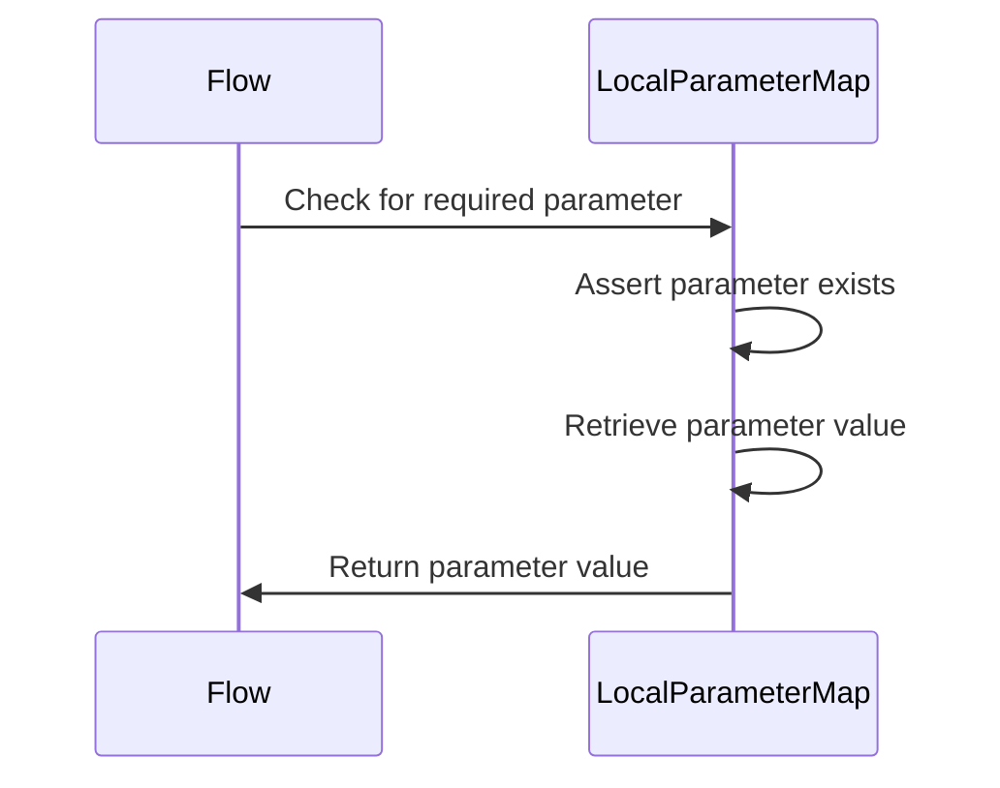

# Where is this flow used?

This flow is used multiple times in the codebase as represented in the following diagram:

(Note - these are only some of the entry points of this flow)

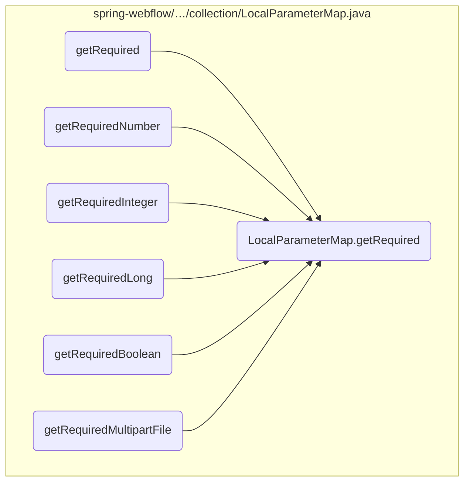

Here is a high level diagram of the flow, showing only the most important functions:

```mermaid
graph TD;
      subgraph springbindingsrcmainjavaorgspringframeworkbindingcollection[spring-binding/…/binding/collection]
00ed9e3d41decc7e61269119baadd641fa4909712d2fe145bab9a4906451ccb1(LocalParameterMap.getRequired) --> 6ee899f43c90e03bb4eb1a4da35b195b16d35696bc153c3dd449697ec41d86e2(MapAccessor.assertContainsKey)
end

subgraph springwebflowsrcmainjavaorgspringframeworkwebflowcorecollectionLocalParameterMapjava[spring-webflow/…/collection/LocalParameterMap.java]
00ed9e3d41decc7e61269119baadd641fa4909712d2fe145bab9a4906451ccb1(LocalParameterMap.getRequired) --> ab91978c37e084fb70248f7783576b9b3ff97f2e078f11bc238b57c97c6fbe11(LocalParameterMap.get)
end

subgraph springbindingsrcmainjavaorgspringframeworkbindingcollection[spring-binding/…/binding/collection]
6ee899f43c90e03bb4eb1a4da35b195b16d35696bc153c3dd449697ec41d86e2(MapAccessor.assertContainsKey) --> 653831f48884b74aebce498a65bfb6773bd495de5e8c353dcedebf3ec59b6bd1(MapAccessor.containsKey)
end

subgraph springbindingsrcmainjavaorgspringframeworkbindingcollection[spring-binding/…/binding/collection]
6ee899f43c90e03bb4eb1a4da35b195b16d35696bc153c3dd449697ec41d86e2(MapAccessor.assertContainsKey) --> 67643d58c4a89185477033a7d84d457c0413d3eec0b36c7eb0db604c174feec2(MapAccessor.asMap)
end

subgraph springbindingsrcmainjavaorgspringframeworkbindingcollection[spring-binding/…/binding/collection]
653831f48884b74aebce498a65bfb6773bd495de5e8c353dcedebf3ec59b6bd1(MapAccessor.containsKey) --> 5eec6364bfb158b547d1ac47c80412b089a73999b74b677740d065d279ee6953(MapAccessor.assertKeyValueOfType)
end

subgraph springbindingsrcmainjavaorgspringframeworkbindingcollection[spring-binding/…/binding/collection]
5eec6364bfb158b547d1ac47c80412b089a73999b74b677740d065d279ee6953(MapAccessor.assertKeyValueOfType) --> 91c82ad6a52191598992822d6b77ff27e818070807c0ab99ea9d77c1e980bb20(MapAccessor.assertKeyValueInstanceOf)
end

subgraph springbindingsrcmainjavaorgspringframeworkbindingcollection[spring-binding/…/binding/collection]
5eec6364bfb158b547d1ac47c80412b089a73999b74b677740d065d279ee6953(MapAccessor.assertKeyValueOfType) --> 423d2a4f7a18b0b9992dc160341990705b855edbdc9bbd6d571fdf2bd6ae4cf6(MapAccessor.get)
end

subgraph springbindingsrcmainjavaorgspringframeworkbindingexpressionExpressionVariablejava[spring-binding/…/expression/ExpressionVariable.java]
91c82ad6a52191598992822d6b77ff27e818070807c0ab99ea9d77c1e980bb20(MapAccessor.assertKeyValueInstanceOf) --> 3500726e0c49042d641271faa7ee523b360f832c4563885d68091ffac3acc656(ExpressionVariable.getName)
end

subgraph springbindingsrcmainjavaorgspringframeworkbindingcollection[spring-binding/…/binding/collection]
423d2a4f7a18b0b9992dc160341990705b855edbdc9bbd6d571fdf2bd6ae4cf6(MapAccessor.get) --> 423d2a4f7a18b0b9992dc160341990705b855edbdc9bbd6d571fdf2bd6ae4cf6(MapAccessor.get)
end

subgraph springbindingsrcmainjavaorgspringframeworkbindingcollection[spring-binding/…/binding/collection]
423d2a4f7a18b0b9992dc160341990705b855edbdc9bbd6d571fdf2bd6ae4cf6(MapAccessor.get) --> 653831f48884b74aebce498a65bfb6773bd495de5e8c353dcedebf3ec59b6bd1(MapAccessor.containsKey)
end

subgraph springbindingsrcmainjavaorgspringframeworkbindingcollection[spring-binding/…/binding/collection]
423d2a4f7a18b0b9992dc160341990705b855edbdc9bbd6d571fdf2bd6ae4cf6(MapAccessor.get) --> 423d2a4f7a18b0b9992dc160341990705b855edbdc9bbd6d571fdf2bd6ae4cf6(MapAccessor.get)
end

subgraph springwebflowsrcmainjavaorgspringframeworkwebflowcorecollectionLocalParameterMapjava[spring-webflow/…/collection/LocalParameterMap.java]
ab91978c37e084fb70248f7783576b9b3ff97f2e078f11bc238b57c97c6fbe11(LocalParameterMap.get) --> ab91978c37e084fb70248f7783576b9b3ff97f2e078f11bc238b57c97c6fbe11(LocalParameterMap.get)
end

subgraph springwebflowsrcmainjavaorgspringframeworkwebflowcorecollectionLocalParameterMapjava[spring-webflow/…/collection/LocalParameterMap.java]
ab91978c37e084fb70248f7783576b9b3ff97f2e078f11bc238b57c97c6fbe11(LocalParameterMap.get) --> ab91978c37e084fb70248f7783576b9b3ff97f2e078f11bc238b57c97c6fbe11(LocalParameterMap.get)
end

subgraph springbindingsrcmainjavaorgspringframeworkbindingcollection[spring-binding/…/binding/collection]
ab91978c37e084fb70248f7783576b9b3ff97f2e078f11bc238b57c97c6fbe11(LocalParameterMap.get) --> 91c82ad6a52191598992822d6b77ff27e818070807c0ab99ea9d77c1e980bb20(MapAccessor.assertKeyValueInstanceOf)
end

subgraph springbindingsrcmainjavaorgspringframeworkbindingcollection[spring-binding/…/binding/collection]
ab91978c37e084fb70248f7783576b9b3ff97f2e078f11bc238b57c97c6fbe11(LocalParameterMap.get) --> 9dcdc8d837a56621e7fa71143692173af675c9d663c3518cdcc0a4336f6b3299(SharedMapDecorator.containsKey)
end


      classDef mainFlowStyle color:#000000,fill:#7CB9F4
classDef rootsStyle color:#000000,fill:#00FFF4
classDef Style1 color:#000000,fill:#00FFAA
classDef Style2 color:#000000,fill:#FFFF00
classDef Style3 color:#000000,fill:#AA7CB9

%% Swimm:
%% graph TD;
%%       subgraph springbindingsrcmainjavaorgspringframeworkbindingcollection[<SwmPath>[spring-binding/…/binding/collection/](spring-binding/src/main/java/org/springframework/binding/collection/)</SwmPath>]
%% 00ed9e3d41decc7e61269119baadd641fa4909712d2fe145bab9a4906451ccb1(LocalParameterMap.getRequired) --> 6ee899f43c90e03bb4eb1a4da35b195b16d35696bc153c3dd449697ec41d86e2(MapAccessor.assertContainsKey)
%% end
%% 
%% subgraph springwebflowsrcmainjavaorgspringframeworkwebflowcorecollectionLocalParameterMapjava[<SwmPath>[spring-webflow/…/collection/LocalParameterMap.java](spring-webflow/src/main/java/org/springframework/webflow/core/collection/LocalParameterMap.java)</SwmPath>]
%% 00ed9e3d41decc7e61269119baadd641fa4909712d2fe145bab9a4906451ccb1(LocalParameterMap.getRequired) --> ab91978c37e084fb70248f7783576b9b3ff97f2e078f11bc238b57c97c6fbe11(LocalParameterMap.get)
%% end
%% 
%% subgraph springbindingsrcmainjavaorgspringframeworkbindingcollection[<SwmPath>[spring-binding/…/binding/collection/](spring-binding/src/main/java/org/springframework/binding/collection/)</SwmPath>]
%% 6ee899f43c90e03bb4eb1a4da35b195b16d35696bc153c3dd449697ec41d86e2(MapAccessor.assertContainsKey) --> 653831f48884b74aebce498a65bfb6773bd495de5e8c353dcedebf3ec59b6bd1(MapAccessor.containsKey)
%% end
%% 
%% subgraph springbindingsrcmainjavaorgspringframeworkbindingcollection[<SwmPath>[spring-binding/…/binding/collection/](spring-binding/src/main/java/org/springframework/binding/collection/)</SwmPath>]
%% 6ee899f43c90e03bb4eb1a4da35b195b16d35696bc153c3dd449697ec41d86e2(MapAccessor.assertContainsKey) --> 67643d58c4a89185477033a7d84d457c0413d3eec0b36c7eb0db604c174feec2(MapAccessor.asMap)
%% end
%% 
%% subgraph springbindingsrcmainjavaorgspringframeworkbindingcollection[<SwmPath>[spring-binding/…/binding/collection/](spring-binding/src/main/java/org/springframework/binding/collection/)</SwmPath>]
%% 653831f48884b74aebce498a65bfb6773bd495de5e8c353dcedebf3ec59b6bd1(MapAccessor.containsKey) --> 5eec6364bfb158b547d1ac47c80412b089a73999b74b677740d065d279ee6953(MapAccessor.assertKeyValueOfType)
%% end
%% 
%% subgraph springbindingsrcmainjavaorgspringframeworkbindingcollection[<SwmPath>[spring-binding/…/binding/collection/](spring-binding/src/main/java/org/springframework/binding/collection/)</SwmPath>]
%% 5eec6364bfb158b547d1ac47c80412b089a73999b74b677740d065d279ee6953(MapAccessor.assertKeyValueOfType) --> 91c82ad6a52191598992822d6b77ff27e818070807c0ab99ea9d77c1e980bb20(MapAccessor.assertKeyValueInstanceOf)
%% end
%% 
%% subgraph springbindingsrcmainjavaorgspringframeworkbindingcollection[<SwmPath>[spring-binding/…/binding/collection/](spring-binding/src/main/java/org/springframework/binding/collection/)</SwmPath>]
%% 5eec6364bfb158b547d1ac47c80412b089a73999b74b677740d065d279ee6953(MapAccessor.assertKeyValueOfType) --> 423d2a4f7a18b0b9992dc160341990705b855edbdc9bbd6d571fdf2bd6ae4cf6(MapAccessor.get)
%% end
%% 
%% subgraph springbindingsrcmainjavaorgspringframeworkbindingexpressionExpressionVariablejava[<SwmPath>[spring-binding/…/expression/ExpressionVariable.java](spring-binding/src/main/java/org/springframework/binding/expression/ExpressionVariable.java)</SwmPath>]
%% 91c82ad6a52191598992822d6b77ff27e818070807c0ab99ea9d77c1e980bb20(MapAccessor.assertKeyValueInstanceOf) --> 3500726e0c49042d641271faa7ee523b360f832c4563885d68091ffac3acc656(ExpressionVariable.getName)
%% end
%% 
%% subgraph springbindingsrcmainjavaorgspringframeworkbindingcollection[<SwmPath>[spring-binding/…/binding/collection/](spring-binding/src/main/java/org/springframework/binding/collection/)</SwmPath>]
%% 423d2a4f7a18b0b9992dc160341990705b855edbdc9bbd6d571fdf2bd6ae4cf6(MapAccessor.get) --> 423d2a4f7a18b0b9992dc160341990705b855edbdc9bbd6d571fdf2bd6ae4cf6(MapAccessor.get)
%% end
%% 
%% subgraph springbindingsrcmainjavaorgspringframeworkbindingcollection[<SwmPath>[spring-binding/…/binding/collection/](spring-binding/src/main/java/org/springframework/binding/collection/)</SwmPath>]
%% 423d2a4f7a18b0b9992dc160341990705b855edbdc9bbd6d571fdf2bd6ae4cf6(MapAccessor.get) --> 653831f48884b74aebce498a65bfb6773bd495de5e8c353dcedebf3ec59b6bd1(MapAccessor.containsKey)
%% end
%% 
%% subgraph springbindingsrcmainjavaorgspringframeworkbindingcollection[<SwmPath>[spring-binding/…/binding/collection/](spring-binding/src/main/java/org/springframework/binding/collection/)</SwmPath>]
%% 423d2a4f7a18b0b9992dc160341990705b855edbdc9bbd6d571fdf2bd6ae4cf6(MapAccessor.get) --> 423d2a4f7a18b0b9992dc160341990705b855edbdc9bbd6d571fdf2bd6ae4cf6(MapAccessor.get)
%% end
%% 
%% subgraph springwebflowsrcmainjavaorgspringframeworkwebflowcorecollectionLocalParameterMapjava[<SwmPath>[spring-webflow/…/collection/LocalParameterMap.java](spring-webflow/src/main/java/org/springframework/webflow/core/collection/LocalParameterMap.java)</SwmPath>]
%% ab91978c37e084fb70248f7783576b9b3ff97f2e078f11bc238b57c97c6fbe11(LocalParameterMap.get) --> ab91978c37e084fb70248f7783576b9b3ff97f2e078f11bc238b57c97c6fbe11(LocalParameterMap.get)
%% end
%% 
%% subgraph springwebflowsrcmainjavaorgspringframeworkwebflowcorecollectionLocalParameterMapjava[<SwmPath>[spring-webflow/…/collection/LocalParameterMap.java](spring-webflow/src/main/java/org/springframework/webflow/core/collection/LocalParameterMap.java)</SwmPath>]
%% ab91978c37e084fb70248f7783576b9b3ff97f2e078f11bc238b57c97c6fbe11(LocalParameterMap.get) --> ab91978c37e084fb70248f7783576b9b3ff97f2e078f11bc238b57c97c6fbe11(LocalParameterMap.get)
%% end
%% 
%% subgraph springbindingsrcmainjavaorgspringframeworkbindingcollection[<SwmPath>[spring-binding/…/binding/collection/](spring-binding/src/main/java/org/springframework/binding/collection/)</SwmPath>]
%% ab91978c37e084fb70248f7783576b9b3ff97f2e078f11bc238b57c97c6fbe11(LocalParameterMap.get) --> 91c82ad6a52191598992822d6b77ff27e818070807c0ab99ea9d77c1e980bb20(MapAccessor.assertKeyValueInstanceOf)
%% end
%% 
%% subgraph springbindingsrcmainjavaorgspringframeworkbindingcollection[<SwmPath>[spring-binding/…/binding/collection/](spring-binding/src/main/java/org/springframework/binding/collection/)</SwmPath>]
%% ab91978c37e084fb70248f7783576b9b3ff97f2e078f11bc238b57c97c6fbe11(LocalParameterMap.get) --> 9dcdc8d837a56621e7fa71143692173af675c9d663c3518cdcc0a4336f6b3299(SharedMapDecorator.containsKey)
%% end
%% 
%% 
%%       classDef mainFlowStyle color:#000000,fill:#7CB9F4
%% classDef rootsStyle color:#000000,fill:#00FFF4
%% classDef Style1 color:#000000,fill:#00FFAA
%% classDef Style2 color:#000000,fill:#FFFF00
%% classDef Style3 color:#000000,fill:#AA7CB9
```

# Flow drill down

## Looking at <SwmToken path="spring-webflow/src/main/java/org/springframework/webflow/core/collection/LocalParameterMap.java" pos="171:5:5" line-data="	public String getRequired(String parameterName) throws IllegalArgumentException {">`getRequired`</SwmToken>

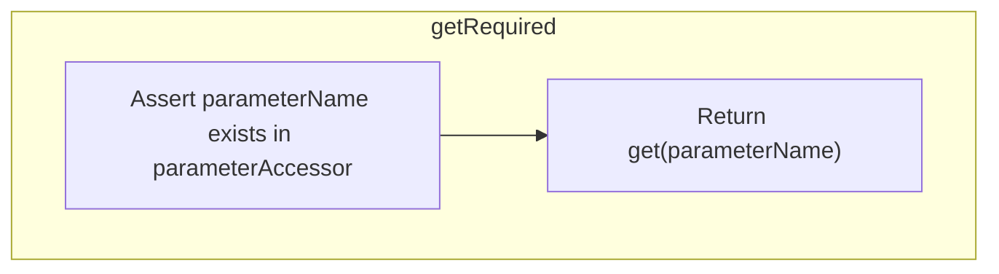

<SwmSnippet path="/spring-webflow/src/main/java/org/springframework/webflow/core/collection/LocalParameterMap.java" line="171">

---

First, the <SwmToken path="spring-webflow/src/main/java/org/springframework/webflow/core/collection/LocalParameterMap.java" pos="171:5:5" line-data="	public String getRequired(String parameterName) throws IllegalArgumentException {">`getRequired`</SwmToken> method is responsible for ensuring that a specific parameter is present in the <SwmToken path="spring-webflow/src/main/java/org/springframework/webflow/core/collection/LocalParameterMap.java" pos="43:4:4" line-data="public class LocalParameterMap implements ParameterMap, Serializable {">`LocalParameterMap`</SwmToken>. This is crucial for the flow as it guarantees that all necessary parameters are available for subsequent operations.

```java
	public String getRequired(String parameterName) throws IllegalArgumentException {
		parameterAccessor.assertContainsKey(parameterName);
		return get(parameterName);
	}
```

---

</SwmSnippet>

<SwmSnippet path="/spring-webflow/src/main/java/org/springframework/webflow/core/collection/LocalParameterMap.java" line="172">

---

Moving to the next step, the method calls <SwmToken path="spring-webflow/src/main/java/org/springframework/webflow/core/collection/LocalParameterMap.java" pos="172:3:3" line-data="		parameterAccessor.assertContainsKey(parameterName);">`assertContainsKey`</SwmToken> to check if the parameter exists in the map. This validation step is essential to prevent any missing parameter issues that could lead to errors in the flow.

```java
		parameterAccessor.assertContainsKey(parameterName);
```

---

</SwmSnippet>

<SwmSnippet path="/spring-webflow/src/main/java/org/springframework/webflow/core/collection/LocalParameterMap.java" line="173">

---

Next, if the parameter is present, the method retrieves its value using the <SwmToken path="spring-webflow/src/main/java/org/springframework/webflow/core/collection/LocalParameterMap.java" pos="173:3:3" line-data="		return get(parameterName);">`get`</SwmToken> method. This ensures that the flow can proceed with the required data, maintaining the integrity and correctness of the operations.

```java
		return get(parameterName);
```

---

</SwmSnippet>

## A closer look at <SwmToken path="spring-webflow/src/main/java/org/springframework/webflow/core/collection/LocalParameterMap.java" pos="172:3:3" line-data="		parameterAccessor.assertContainsKey(parameterName);">`assertContainsKey`</SwmToken> & <SwmToken path="spring-binding/src/main/java/org/springframework/binding/collection/MapAccessor.java" pos="388:28:28" line-data="					+ &quot;&#39; is not present in map; attributes present are [&quot; + asMap() + &quot;]&quot;);">`asMap`</SwmToken>

```mermaid
graph TD
  subgraph assertContainsKey
    assertContainsKey:A["Check if key is present in map"] -->|No| assertContainsKey:B["Throw IllegalArgumentException"]
    assertContainsKey:A -->|Yes| assertContainsKey:C["Obtain attributes using asMap"]
    assertContainsKey:C --> assertContainsKey:D["Return attributes"]
  end
  subgraph asMap
    asMap:A["Return the map"]
  end
  assertContainsKey:C --> asMap

%% Swimm:
%% graph TD
%%   subgraph <SwmToken path="spring-webflow/src/main/java/org/springframework/webflow/core/collection/LocalParameterMap.java" pos="172:3:3" line-data="		parameterAccessor.assertContainsKey(parameterName);">`assertContainsKey`</SwmToken>
%%     <SwmToken path="spring-webflow/src/main/java/org/springframework/webflow/core/collection/LocalParameterMap.java" pos="172:3:3" line-data="		parameterAccessor.assertContainsKey(parameterName);">`assertContainsKey`</SwmToken>:A["Check if key is present in map"] -->|No| <SwmToken path="spring-webflow/src/main/java/org/springframework/webflow/core/collection/LocalParameterMap.java" pos="172:3:3" line-data="		parameterAccessor.assertContainsKey(parameterName);">`assertContainsKey`</SwmToken>:B["Throw <SwmToken path="spring-webflow/src/main/java/org/springframework/webflow/core/collection/LocalParameterMap.java" pos="171:14:14" line-data="	public String getRequired(String parameterName) throws IllegalArgumentException {">`IllegalArgumentException`</SwmToken>"]
%%     <SwmToken path="spring-webflow/src/main/java/org/springframework/webflow/core/collection/LocalParameterMap.java" pos="172:3:3" line-data="		parameterAccessor.assertContainsKey(parameterName);">`assertContainsKey`</SwmToken>:A -->|Yes| <SwmToken path="spring-webflow/src/main/java/org/springframework/webflow/core/collection/LocalParameterMap.java" pos="172:3:3" line-data="		parameterAccessor.assertContainsKey(parameterName);">`assertContainsKey`</SwmToken>:C["Obtain attributes using <SwmToken path="spring-binding/src/main/java/org/springframework/binding/collection/MapAccessor.java" pos="388:28:28" line-data="					+ &quot;&#39; is not present in map; attributes present are [&quot; + asMap() + &quot;]&quot;);">`asMap`</SwmToken>"]
%%     <SwmToken path="spring-webflow/src/main/java/org/springframework/webflow/core/collection/LocalParameterMap.java" pos="172:3:3" line-data="		parameterAccessor.assertContainsKey(parameterName);">`assertContainsKey`</SwmToken>:C --> <SwmToken path="spring-webflow/src/main/java/org/springframework/webflow/core/collection/LocalParameterMap.java" pos="172:3:3" line-data="		parameterAccessor.assertContainsKey(parameterName);">`assertContainsKey`</SwmToken>:D["Return attributes"]
%%   end
%%   subgraph <SwmToken path="spring-binding/src/main/java/org/springframework/binding/collection/MapAccessor.java" pos="388:28:28" line-data="					+ &quot;&#39; is not present in map; attributes present are [&quot; + asMap() + &quot;]&quot;);">`asMap`</SwmToken>
%%     <SwmToken path="spring-binding/src/main/java/org/springframework/binding/collection/MapAccessor.java" pos="388:28:28" line-data="					+ &quot;&#39; is not present in map; attributes present are [&quot; + asMap() + &quot;]&quot;);">`asMap`</SwmToken>:A["Return the map"]
%%   end
%%   <SwmToken path="spring-webflow/src/main/java/org/springframework/webflow/core/collection/LocalParameterMap.java" pos="172:3:3" line-data="		parameterAccessor.assertContainsKey(parameterName);">`assertContainsKey`</SwmToken>:C --> <SwmToken path="spring-binding/src/main/java/org/springframework/binding/collection/MapAccessor.java" pos="388:28:28" line-data="					+ &quot;&#39; is not present in map; attributes present are [&quot; + asMap() + &quot;]&quot;);">`asMap`</SwmToken>
```

<SwmSnippet path="/spring-binding/src/main/java/org/springframework/binding/collection/MapAccessor.java" line="380">

---

First, the <SwmToken path="spring-binding/src/main/java/org/springframework/binding/collection/MapAccessor.java" pos="385:5:5" line-data="	public void assertContainsKey(Object key) throws IllegalArgumentException {">`assertContainsKey`</SwmToken> method is responsible for ensuring that a specific attribute is present in the attribute map. This is crucial for validating that the required data is available before proceeding with further operations. If the key is not present, an <SwmToken path="spring-binding/src/main/java/org/springframework/binding/collection/MapAccessor.java" pos="383:6:6" line-data="	 * @throws IllegalArgumentException if the key is not present">`IllegalArgumentException`</SwmToken> is thrown, which helps in catching errors early in the flow.

```java
	/**
	 * Asserts that the attribute is present in the attribute map.
	 * @param key the key
	 * @throws IllegalArgumentException if the key is not present
	 */
	public void assertContainsKey(Object key) throws IllegalArgumentException {
		if (!map.containsKey(key)) {
			throw new IllegalArgumentException("Required attribute '" + key
					+ "' is not present in map; attributes present are [" + asMap() + "]");
		}
	}
```

---

</SwmSnippet>

## Going into <SwmToken path="spring-webflow/src/main/java/org/springframework/webflow/core/collection/LocalParameterMap.java" pos="119:7:7" line-data="		if (!parameters.containsKey(parameterName)) {">`containsKey`</SwmToken>

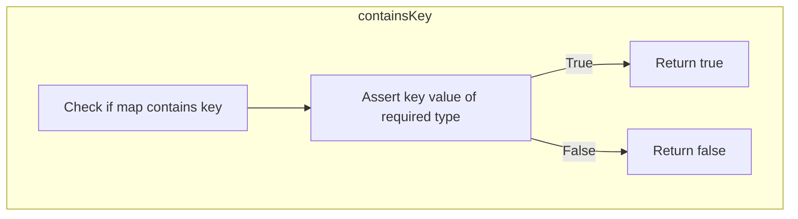

<SwmSnippet path="/spring-binding/src/main/java/org/springframework/binding/collection/MapAccessor.java" line="397">

---

First, the <SwmToken path="spring-binding/src/main/java/org/springframework/binding/collection/MapAccessor.java" pos="397:5:5" line-data="	public boolean containsKey(Object key, Class&lt;?&gt; requiredType) throws IllegalArgumentException {">`containsKey`</SwmToken> method checks if the attribute is present in the attribute map and if it is of the required type. This is crucial for ensuring that the attribute exists and meets the expected type criteria before proceeding with further operations.

```java
	public boolean containsKey(Object key, Class<?> requiredType) throws IllegalArgumentException {
		if (map.containsKey(key)) {
			assertKeyValueOfType(key, requiredType);
			return true;
		} else {
			return false;
		}
	}
```

---

</SwmSnippet>

## Inside <SwmToken path="spring-binding/src/main/java/org/springframework/binding/collection/MapAccessor.java" pos="399:1:1" line-data="			assertKeyValueOfType(key, requiredType);">`assertKeyValueOfType`</SwmToken>

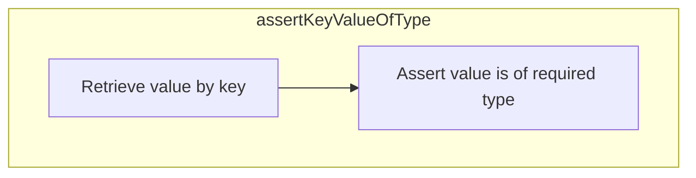

<SwmSnippet path="/spring-binding/src/main/java/org/springframework/binding/collection/MapAccessor.java" line="412">

---

First, the <SwmToken path="spring-binding/src/main/java/org/springframework/binding/collection/MapAccessor.java" pos="412:9:9" line-data="	public &lt;T&gt; T assertKeyValueOfType(Object key, Class&lt;T&gt; requiredType) {">`assertKeyValueOfType`</SwmToken> method is responsible for ensuring that the value associated with a given key in the map is of the required type. This is crucial for maintaining data integrity and preventing type-related errors during runtime.

```java
	public <T> T assertKeyValueOfType(Object key, Class<T> requiredType) {
		return assertKeyValueInstanceOf(key, map.get(key), requiredType);
	}
```

---

</SwmSnippet>

<SwmSnippet path="/spring-binding/src/main/java/org/springframework/binding/collection/MapAccessor.java" line="413">

---

Moving to the next step, the <SwmToken path="spring-binding/src/main/java/org/springframework/binding/collection/MapAccessor.java" pos="399:1:1" line-data="			assertKeyValueOfType(key, requiredType);">`assertKeyValueOfType`</SwmToken> method calls <SwmToken path="spring-binding/src/main/java/org/springframework/binding/collection/MapAccessor.java" pos="413:3:3" line-data="		return assertKeyValueInstanceOf(key, map.get(key), requiredType);">`assertKeyValueInstanceOf`</SwmToken>, which performs the actual type-checking. This method verifies that the value retrieved from the map is an instance of the required type, ensuring type safety.

```java
		return assertKeyValueInstanceOf(key, map.get(key), requiredType);
```

---

</SwmSnippet>

<SwmSnippet path="/spring-binding/src/main/java/org/springframework/binding/collection/MapAccessor.java" line="413">

---

Next, if the type check is successful, the value is retrieved from the map using the <SwmToken path="spring-binding/src/main/java/org/springframework/binding/collection/MapAccessor.java" pos="413:10:10" line-data="		return assertKeyValueInstanceOf(key, map.get(key), requiredType);">`get`</SwmToken> method. This ensures that the value returned is not only present but also of the correct type, which is essential for subsequent operations that depend on this value.

```java
		return assertKeyValueInstanceOf(key, map.get(key), requiredType);
```

---

</SwmSnippet>

## Breaking down <SwmToken path="spring-webflow/src/main/java/org/springframework/webflow/core/collection/LocalParameterMap.java" pos="124:3:3" line-data="			parameterAccessor.assertKeyValueInstanceOf(parameterName, value, String[].class);">`assertKeyValueInstanceOf`</SwmToken> & <SwmToken path="spring-binding/src/main/java/org/springframework/binding/collection/MapAccessor.java" pos="429:9:9" line-data="					+ value.getClass().getName() + &quot;]&quot;);">`getName`</SwmToken>

```mermaid
graph TD
 subgraph assertKeyValueInstanceOf
 assertKeyValueInstanceOf:A["Check required type is not null"] --> assertKeyValueInstanceOf:B["Check value is not null"]
 assertKeyValueInstanceOf:B -->|Value is not null| assertKeyValueInstanceOf:C["Check if value is instance of required type"]
 assertKeyValueInstanceOf:C -->|Value is not instance| assertKeyValueInstanceOf:D["Throw IllegalArgumentException"]
 end
 subgraph getName
 getName:A["Return the variable name"]
 end

%% Swimm:
%% graph TD
%%  subgraph <SwmToken path="spring-webflow/src/main/java/org/springframework/webflow/core/collection/LocalParameterMap.java" pos="124:3:3" line-data="			parameterAccessor.assertKeyValueInstanceOf(parameterName, value, String[].class);">`assertKeyValueInstanceOf`</SwmToken>
%%  <SwmToken path="spring-webflow/src/main/java/org/springframework/webflow/core/collection/LocalParameterMap.java" pos="124:3:3" line-data="			parameterAccessor.assertKeyValueInstanceOf(parameterName, value, String[].class);">`assertKeyValueInstanceOf`</SwmToken>:A["Check required type is not null"] --> <SwmToken path="spring-webflow/src/main/java/org/springframework/webflow/core/collection/LocalParameterMap.java" pos="124:3:3" line-data="			parameterAccessor.assertKeyValueInstanceOf(parameterName, value, String[].class);">`assertKeyValueInstanceOf`</SwmToken>:B["Check value is not null"]
%%  <SwmToken path="spring-webflow/src/main/java/org/springframework/webflow/core/collection/LocalParameterMap.java" pos="124:3:3" line-data="			parameterAccessor.assertKeyValueInstanceOf(parameterName, value, String[].class);">`assertKeyValueInstanceOf`</SwmToken>:B -->|Value is not null| <SwmToken path="spring-webflow/src/main/java/org/springframework/webflow/core/collection/LocalParameterMap.java" pos="124:3:3" line-data="			parameterAccessor.assertKeyValueInstanceOf(parameterName, value, String[].class);">`assertKeyValueInstanceOf`</SwmToken>:C["Check if value is instance of required type"]
%%  <SwmToken path="spring-webflow/src/main/java/org/springframework/webflow/core/collection/LocalParameterMap.java" pos="124:3:3" line-data="			parameterAccessor.assertKeyValueInstanceOf(parameterName, value, String[].class);">`assertKeyValueInstanceOf`</SwmToken>:C -->|Value is not instance| <SwmToken path="spring-webflow/src/main/java/org/springframework/webflow/core/collection/LocalParameterMap.java" pos="124:3:3" line-data="			parameterAccessor.assertKeyValueInstanceOf(parameterName, value, String[].class);">`assertKeyValueInstanceOf`</SwmToken>:D["Throw <SwmToken path="spring-webflow/src/main/java/org/springframework/webflow/core/collection/LocalParameterMap.java" pos="171:14:14" line-data="	public String getRequired(String parameterName) throws IllegalArgumentException {">`IllegalArgumentException`</SwmToken>"]
%%  end
%%  subgraph <SwmToken path="spring-binding/src/main/java/org/springframework/binding/collection/MapAccessor.java" pos="429:9:9" line-data="					+ value.getClass().getName() + &quot;]&quot;);">`getName`</SwmToken>
%%  <SwmToken path="spring-binding/src/main/java/org/springframework/binding/collection/MapAccessor.java" pos="429:9:9" line-data="					+ value.getClass().getName() + &quot;]&quot;);">`getName`</SwmToken>:A["Return the variable name"]
%%  end
```

<SwmSnippet path="/spring-binding/src/main/java/org/springframework/binding/collection/MapAccessor.java" line="416">

---

First, the <SwmToken path="spring-binding/src/main/java/org/springframework/binding/collection/MapAccessor.java" pos="424:9:9" line-data="	public &lt;T&gt; T assertKeyValueInstanceOf(Object key, Object value, Class&lt;T&gt; requiredType) {">`assertKeyValueInstanceOf`</SwmToken> method ensures that a value associated with a specific key in a map is of the required type. This validation is crucial for maintaining data integrity and preventing type-related errors during runtime. If the value is not of the expected type, an <SwmToken path="spring-binding/src/main/java/org/springframework/binding/collection/MapAccessor.java" pos="427:5:5" line-data="			throw new IllegalArgumentException(&quot;Map key &#39;&quot; + key + &quot;&#39; has value [&quot; + value">`IllegalArgumentException`</SwmToken> is thrown, providing a clear error message indicating the mismatch.

```java
	/**
	 * Assert that the key value, if non null, is an instance of the required type.
	 * @param key the key
	 * @param value the value
	 * @param requiredType the required type
	 * @return the value
	 */
	@SuppressWarnings("unchecked")
	public <T> T assertKeyValueInstanceOf(Object key, Object value, Class<T> requiredType) {
		Assert.notNull(requiredType, "The required type to assert is required");
		if (value != null && !requiredType.isInstance(value)) {
			throw new IllegalArgumentException("Map key '" + key + "' has value [" + value
					+ "] that is not of expected type [" + requiredType + "], instead it is of type ["
					+ value.getClass().getName() + "]");
		}
		return (T) value;
	}
```

---

</SwmSnippet>

## Going into get

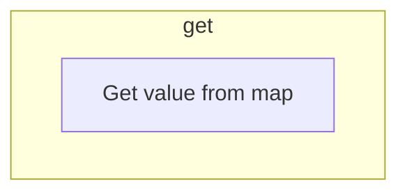

<SwmSnippet path="/spring-binding/src/main/java/org/springframework/binding/collection/MapAccessor.java" line="56">

---

First, the <SwmToken path="spring-binding/src/main/java/org/springframework/binding/collection/MapAccessor.java" pos="56:5:5" line-data="	public V get(Object key) {">`get`</SwmToken> method is called to retrieve a value from the map using a specified key. This method is essential for accessing stored data within the map, which is a common operation in many business logic flows.

```java
	public V get(Object key) {
		return map.get(key);
	}
```

---

</SwmSnippet>

Moving to the next step, the <SwmToken path="spring-webflow/src/main/java/org/springframework/webflow/core/collection/LocalParameterMap.java" pos="114:5:5" line-data="	public String get(String parameterName) {">`get`</SwmToken> method checks if the key exists in the map. If the key is present, it returns the corresponding value. This ensures that the correct data is retrieved based on the provided key, which is crucial for maintaining data integrity and consistency.

## A closer look at get

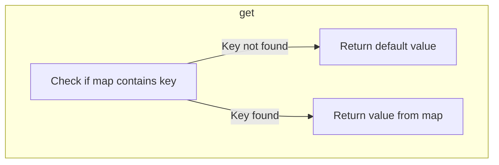

<SwmSnippet path="/spring-binding/src/main/java/org/springframework/binding/collection/MapAccessor.java" line="66">

---

First, the <SwmToken path="spring-binding/src/main/java/org/springframework/binding/collection/MapAccessor.java" pos="66:5:5" line-data="	public V get(Object key, V defaultValue) {">`get`</SwmToken> method is called to retrieve a value from the map using a specified key. If the key is not present in the map, the method returns a default value provided as a parameter.

```java
	public V get(Object key, V defaultValue) {
		if (!map.containsKey(key)) {
			return defaultValue;
		}
		return map.get(key);
	}
```

---

</SwmSnippet>

<SwmSnippet path="/spring-binding/src/main/java/org/springframework/binding/collection/MapAccessor.java" line="67">

---

Moving to the next step, the method checks if the map contains the specified key using the <SwmToken path="spring-binding/src/main/java/org/springframework/binding/collection/MapAccessor.java" pos="67:7:7" line-data="		if (!map.containsKey(key)) {">`containsKey`</SwmToken> method. If the key is not found, the default value is returned, ensuring that the method always provides a valid return value.

```java
		if (!map.containsKey(key)) {
			return defaultValue;
```

---

</SwmSnippet>

<SwmSnippet path="/spring-binding/src/main/java/org/springframework/binding/collection/MapAccessor.java" line="70">

---

Then, if the key is found in the map, the method retrieves the corresponding value using the <SwmToken path="spring-binding/src/main/java/org/springframework/binding/collection/MapAccessor.java" pos="70:5:5" line-data="		return map.get(key);">`get`</SwmToken> method of the map. This ensures that the correct value associated with the key is returned to the caller.

```java
		return map.get(key);
	}
```

---

</SwmSnippet>

## A closer look at get

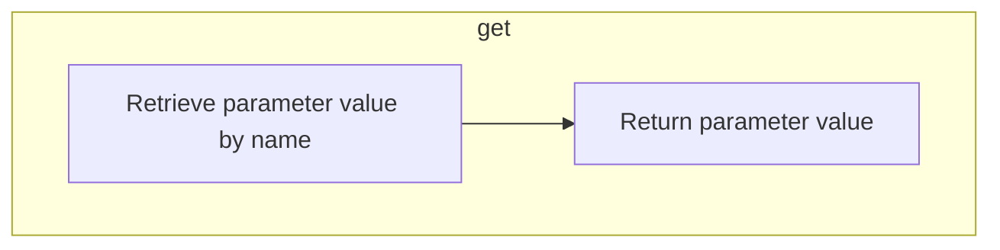

<SwmSnippet path="/spring-webflow/src/main/java/org/springframework/webflow/core/collection/LocalParameterMap.java" line="114">

---

First, the <SwmToken path="spring-webflow/src/main/java/org/springframework/webflow/core/collection/LocalParameterMap.java" pos="114:5:5" line-data="	public String get(String parameterName) {">`get`</SwmToken> method in the <SwmToken path="spring-webflow/src/main/java/org/springframework/webflow/core/collection/LocalParameterMap.java" pos="43:4:4" line-data="public class LocalParameterMap implements ParameterMap, Serializable {">`LocalParameterMap`</SwmToken> class is responsible for retrieving the value of a parameter given its name. This method is crucial for accessing specific parameters that are required for further processing in the flow.

```java
	public String get(String parameterName) {
		return get(parameterName, (String) null);
	}
```

---

</SwmSnippet>

## A closer look at get & <SwmToken path="spring-webflow/src/main/java/org/springframework/webflow/core/collection/LocalParameterMap.java" pos="119:7:7" line-data="		if (!parameters.containsKey(parameterName)) {">`containsKey`</SwmToken>

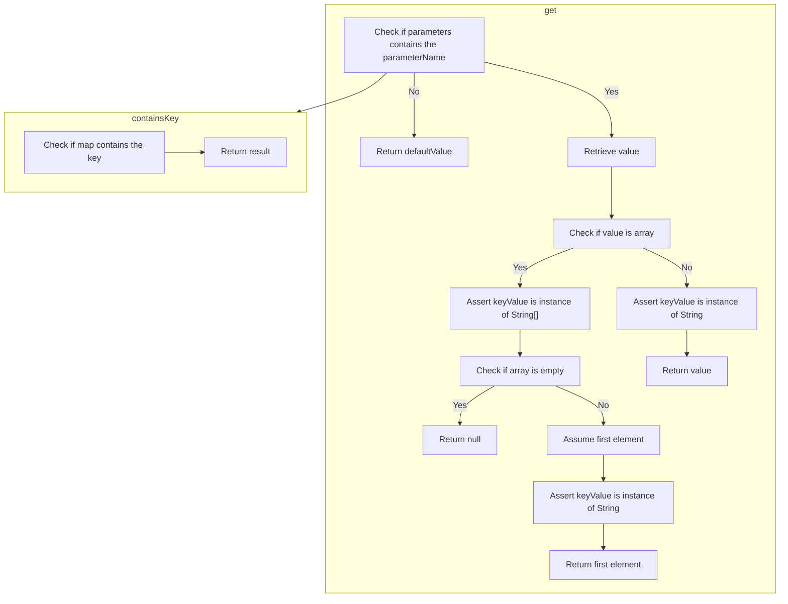

<SwmSnippet path="/spring-webflow/src/main/java/org/springframework/webflow/core/collection/LocalParameterMap.java" line="118">

---

First, the <SwmToken path="spring-webflow/src/main/java/org/springframework/webflow/core/collection/LocalParameterMap.java" pos="118:5:5" line-data="	public String get(String parameterName, String defaultValue) {">`get`</SwmToken> method in <SwmToken path="spring-webflow/src/main/java/org/springframework/webflow/core/collection/LocalParameterMap.java" pos="43:4:4" line-data="public class LocalParameterMap implements ParameterMap, Serializable {">`LocalParameterMap`</SwmToken> is responsible for retrieving the value of a specified parameter. If the parameter does not exist in the map, it returns a default value.

```java
	public String get(String parameterName, String defaultValue) {
		if (!parameters.containsKey(parameterName)) {
			return defaultValue;
		}
```

---

</SwmSnippet>

<SwmSnippet path="/spring-webflow/src/main/java/org/springframework/webflow/core/collection/LocalParameterMap.java" line="122">

---

Next, if the parameter exists, the method checks if the value is an array. If it is, it validates that the array contains instances of <SwmToken path="spring-webflow/src/main/java/org/springframework/webflow/core/collection/LocalParameterMap.java" pos="124:11:11" line-data="			parameterAccessor.assertKeyValueInstanceOf(parameterName, value, String[].class);">`String`</SwmToken> and returns the first element. If the array is empty, it returns null.

```java
		Object value = parameters.get(parameterName);
		if (value.getClass().isArray()) {
			parameterAccessor.assertKeyValueInstanceOf(parameterName, value, String[].class);
			String[] array = (String[]) value;
			if (array.length == 0) {
				return null;
			} else {
				Object first = ((String[]) value)[0];
				parameterAccessor.assertKeyValueInstanceOf(parameterName, first, String.class);
				return (String) first;
			}
```

---

</SwmSnippet>

<SwmSnippet path="/spring-webflow/src/main/java/org/springframework/webflow/core/collection/LocalParameterMap.java" line="134">

---

Then, if the value is not an array, the method validates that the value is an instance of <SwmToken path="spring-webflow/src/main/java/org/springframework/webflow/core/collection/LocalParameterMap.java" pos="135:11:11" line-data="			parameterAccessor.assertKeyValueInstanceOf(parameterName, value, String.class);">`String`</SwmToken> and returns it.

```java
		} else {
			parameterAccessor.assertKeyValueInstanceOf(parameterName, value, String.class);
			return (String) value;
		}
```

---

</SwmSnippet>

<SwmSnippet path="/spring-binding/src/main/java/org/springframework/binding/collection/SharedMapDecorator.java" line="52">

---

Moving to the <SwmToken path="spring-binding/src/main/java/org/springframework/binding/collection/SharedMapDecorator.java" pos="52:5:5" line-data="	public boolean containsKey(Object key) {">`containsKey`</SwmToken> method in <SwmToken path="spring-binding/src/main/java/org/springframework/binding/collection/SharedMapDecorator.java" pos="31:4:4" line-data="public class SharedMapDecorator&lt;K, V&gt; implements SharedMap&lt;K, V&gt;, Serializable {">`SharedMapDecorator`</SwmToken>, it checks if a specified key exists in the map. This is crucial for determining whether to return a default value or proceed with further validation.

```java
	public boolean containsKey(Object key) {
		return map.containsKey(key);
	}
```

---

</SwmSnippet>

&nbsp;

*This is an auto-generated document by Swimm 🌊 and has not yet been verified by a human*

<SwmMeta version="3.0.0" repo-id="Z2l0aHViJTNBJTNBc3ByaW5nLXdlYmZsb3ctZGVtbyUzQSUzQWdpbGFkbmF2b3Q=" repo-name="spring-webflow-demo"><sup>Powered by [Swimm](/)</sup></SwmMeta>
