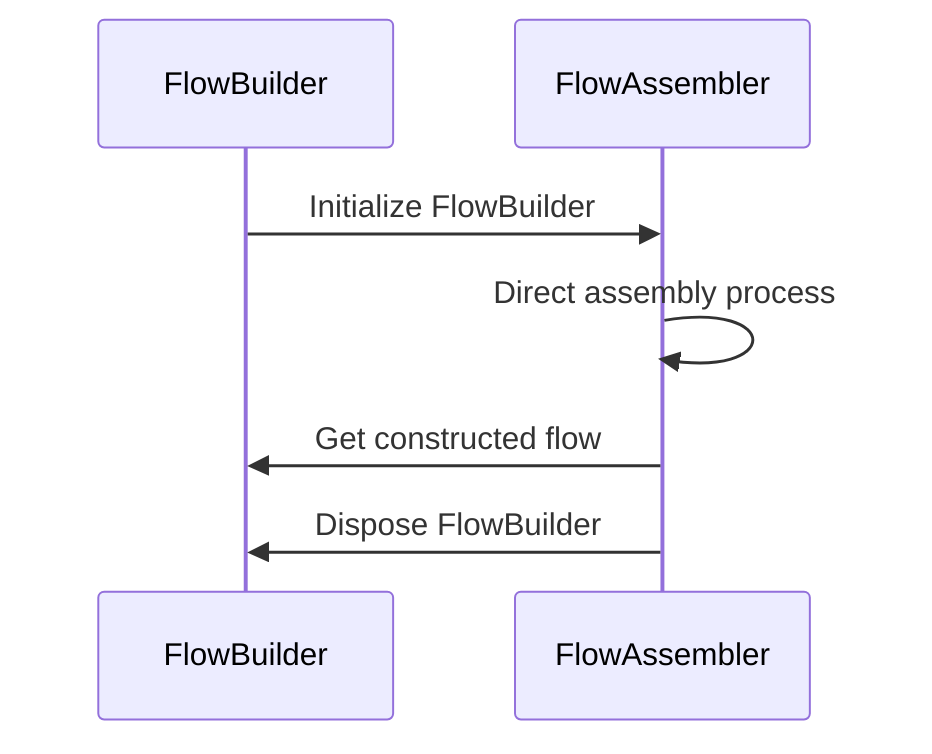
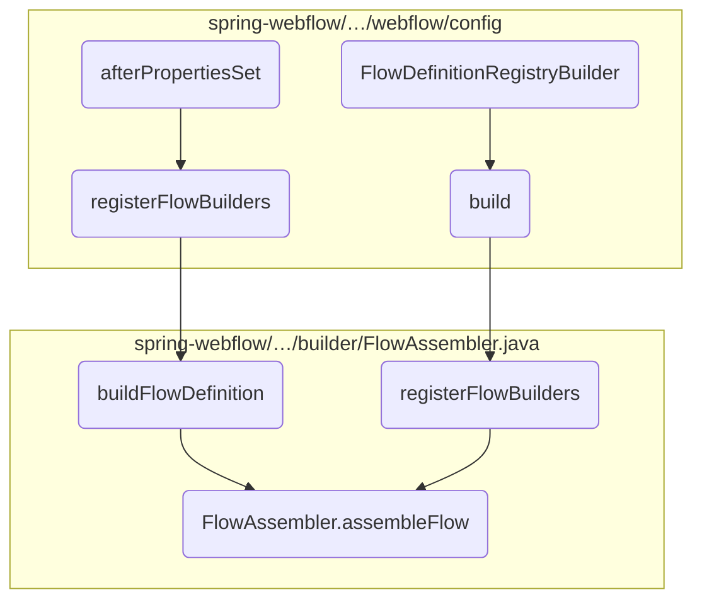

```mermaid
graph TD
  subgraph directAssembly
    directAssembly:A["Build variables"] --> directAssembly:B["Build input mapper"]
    directAssembly:B --> directAssembly:C["Build start actions"]
    directAssembly:C --> directAssembly:D["Build states"]
    directAssembly:D --> directAssembly:E["Build global transitions"]
    directAssembly:E --> directAssembly:F["Build end actions"]
    directAssembly:F --> directAssembly:G["Build output mapper"]
    directAssembly:G --> directAssembly:H["Build exception handlers"]
  end

%% Swimm:
%% graph TD
%%   subgraph <SwmToken path="spring-webflow/src/main/java/org/springframework/webflow/engine/builder/FlowAssembler.java" pos="91:1:1" line-data="			directAssembly();">`directAssembly`</SwmToken>
%%     <SwmToken path="spring-webflow/src/main/java/org/springframework/webflow/engine/builder/FlowAssembler.java" pos="91:1:1" line-data="			directAssembly();">`directAssembly`</SwmToken>:A["Build variables"] --> <SwmToken path="spring-webflow/src/main/java/org/springframework/webflow/engine/builder/FlowAssembler.java" pos="91:1:1" line-data="			directAssembly();">`directAssembly`</SwmToken>:B["Build input mapper"]
%%     <SwmToken path="spring-webflow/src/main/java/org/springframework/webflow/engine/builder/FlowAssembler.java" pos="91:1:1" line-data="			directAssembly();">`directAssembly`</SwmToken>:B --> <SwmToken path="spring-webflow/src/main/java/org/springframework/webflow/engine/builder/FlowAssembler.java" pos="91:1:1" line-data="			directAssembly();">`directAssembly`</SwmToken>:C["Build start actions"]
%%     <SwmToken path="spring-webflow/src/main/java/org/springframework/webflow/engine/builder/FlowAssembler.java" pos="91:1:1" line-data="			directAssembly();">`directAssembly`</SwmToken>:C --> <SwmToken path="spring-webflow/src/main/java/org/springframework/webflow/engine/builder/FlowAssembler.java" pos="91:1:1" line-data="			directAssembly();">`directAssembly`</SwmToken>:D["Build states"]
%%     <SwmToken path="spring-webflow/src/main/java/org/springframework/webflow/engine/builder/FlowAssembler.java" pos="91:1:1" line-data="			directAssembly();">`directAssembly`</SwmToken>:D --> <SwmToken path="spring-webflow/src/main/java/org/springframework/webflow/engine/builder/FlowAssembler.java" pos="91:1:1" line-data="			directAssembly();">`directAssembly`</SwmToken>:E["Build global transitions"]
%%     <SwmToken path="spring-webflow/src/main/java/org/springframework/webflow/engine/builder/FlowAssembler.java" pos="91:1:1" line-data="			directAssembly();">`directAssembly`</SwmToken>:E --> <SwmToken path="spring-webflow/src/main/java/org/springframework/webflow/engine/builder/FlowAssembler.java" pos="91:1:1" line-data="			directAssembly();">`directAssembly`</SwmToken>:F["Build end actions"]
%%     <SwmToken path="spring-webflow/src/main/java/org/springframework/webflow/engine/builder/FlowAssembler.java" pos="91:1:1" line-data="			directAssembly();">`directAssembly`</SwmToken>:F --> <SwmToken path="spring-webflow/src/main/java/org/springframework/webflow/engine/builder/FlowAssembler.java" pos="91:1:1" line-data="			directAssembly();">`directAssembly`</SwmToken>:G["Build output mapper"]
%%     <SwmToken path="spring-webflow/src/main/java/org/springframework/webflow/engine/builder/FlowAssembler.java" pos="91:1:1" line-data="			directAssembly();">`directAssembly`</SwmToken>:G --> <SwmToken path="spring-webflow/src/main/java/org/springframework/webflow/engine/builder/FlowAssembler.java" pos="91:1:1" line-data="			directAssembly();">`directAssembly`</SwmToken>:H["Build exception handlers"]
%%   end
```

The flow assembly process is a critical part of the application, responsible for constructing and organizing the various components of a flow. This process ensures that all necessary elements, such as states, transitions, and actions, are properly initialized and configured.

For instance, when a new flow is created, the flow assembly process initializes the flow builder, directs the assembly of the flow components, retrieves the constructed flow, and finally disposes of the flow builder to release resources.



# Where is this flow used?

This flow is used multiple times in the codebase as represented in the following diagram:



Here is a high level diagram of the flow, showing only the most important functions:

```mermaid
graph TD;
      subgraph springwebflowsrcmainjavaorgspringframeworkwebflowenginebuilder[spring-webflow/…/engine/builder]
beda375f427bf6aa88a86fd945ee9f0343de08fa3e123e7a21edacb4a918c862(FlowAssembler.assembleFlow) --> a23a7b61b5d04f5fb043e2fa1ea0b5674e135178db540b9d83b164cbf394346d(FlowAssembler.directAssembly)
end

subgraph springwebflowsrcmainjavaorgspringframeworkwebflowenginebuilder[spring-webflow/…/engine/builder]
a23a7b61b5d04f5fb043e2fa1ea0b5674e135178db540b9d83b164cbf394346d(FlowAssembler.directAssembly) --> c260c1a6db4466fee00d0729adbc0fa302b3ad6405d05ddba4e4e4fb9ee69b0f(FlowModelFlowBuilder.buildStates)
end

subgraph springwebflowsrcmainjavaorgspringframeworkwebflowenginebuilder[spring-webflow/…/engine/builder]
c260c1a6db4466fee00d0729adbc0fa302b3ad6405d05ddba4e4e4fb9ee69b0f(FlowModelFlowBuilder.buildStates) --> 980f6a9ce22205191d9f47ee7e9e21aa525ab87fcef4b9992b837e8093fb2f73(FlowModelFlowBuilder.parseAndAddSubflowState)
end

subgraph springwebflowsrcmainjavaorgspringframeworkwebflowenginebuilder[spring-webflow/…/engine/builder]
c260c1a6db4466fee00d0729adbc0fa302b3ad6405d05ddba4e4e4fb9ee69b0f(FlowModelFlowBuilder.buildStates) --> 38a45c9e0dcfe4ad2bbec0eacb501806eee87de6b81a1d9a426ac679634ab952(FlowModelFlowBuilder.parseAndAddViewState)
end

subgraph springwebflowsrcmainjavaorgspringframeworkwebflowenginebuilder[spring-webflow/…/engine/builder]
c260c1a6db4466fee00d0729adbc0fa302b3ad6405d05ddba4e4e4fb9ee69b0f(FlowModelFlowBuilder.buildStates) --> 504f00713ff43e6afd5669530e02d6c9f6abe9be90aa3389675f1278f7b7635c(FlowModelFlowBuilder.parseAndAddActionState)
end

subgraph springwebflowsrcmainjavaorgspringframeworkwebflowenginebuilder[spring-webflow/…/engine/builder]
c260c1a6db4466fee00d0729adbc0fa302b3ad6405d05ddba4e4e4fb9ee69b0f(FlowModelFlowBuilder.buildStates) --> e9bca2cac4d9dbd67180738ed41ed11e64164e883de585be76daebeb358cd6bd(FlowModelFlowBuilder.parseAndAddEndState)
end


      classDef mainFlowStyle color:#000000,fill:#7CB9F4
classDef rootsStyle color:#000000,fill:#00FFF4
classDef Style1 color:#000000,fill:#00FFAA
classDef Style2 color:#000000,fill:#FFFF00
classDef Style3 color:#000000,fill:#AA7CB9

%% Swimm:
%% graph TD;
%%       subgraph springwebflowsrcmainjavaorgspringframeworkwebflowenginebuilder[<SwmPath>[spring-webflow/…/engine/builder/](spring-webflow/src/main/java/org/springframework/webflow/engine/builder/)</SwmPath>]
%% beda375f427bf6aa88a86fd945ee9f0343de08fa3e123e7a21edacb4a918c862(FlowAssembler.assembleFlow) --> a23a7b61b5d04f5fb043e2fa1ea0b5674e135178db540b9d83b164cbf394346d(FlowAssembler.directAssembly)
%% end
%% 
%% subgraph springwebflowsrcmainjavaorgspringframeworkwebflowenginebuilder[<SwmPath>[spring-webflow/…/engine/builder/](spring-webflow/src/main/java/org/springframework/webflow/engine/builder/)</SwmPath>]
%% a23a7b61b5d04f5fb043e2fa1ea0b5674e135178db540b9d83b164cbf394346d(FlowAssembler.directAssembly) --> c260c1a6db4466fee00d0729adbc0fa302b3ad6405d05ddba4e4e4fb9ee69b0f(FlowModelFlowBuilder.buildStates)
%% end
%% 
%% subgraph springwebflowsrcmainjavaorgspringframeworkwebflowenginebuilder[<SwmPath>[spring-webflow/…/engine/builder/](spring-webflow/src/main/java/org/springframework/webflow/engine/builder/)</SwmPath>]
%% c260c1a6db4466fee00d0729adbc0fa302b3ad6405d05ddba4e4e4fb9ee69b0f(FlowModelFlowBuilder.buildStates) --> 980f6a9ce22205191d9f47ee7e9e21aa525ab87fcef4b9992b837e8093fb2f73(FlowModelFlowBuilder.parseAndAddSubflowState)
%% end
%% 
%% subgraph springwebflowsrcmainjavaorgspringframeworkwebflowenginebuilder[<SwmPath>[spring-webflow/…/engine/builder/](spring-webflow/src/main/java/org/springframework/webflow/engine/builder/)</SwmPath>]
%% c260c1a6db4466fee00d0729adbc0fa302b3ad6405d05ddba4e4e4fb9ee69b0f(FlowModelFlowBuilder.buildStates) --> 38a45c9e0dcfe4ad2bbec0eacb501806eee87de6b81a1d9a426ac679634ab952(FlowModelFlowBuilder.parseAndAddViewState)
%% end
%% 
%% subgraph springwebflowsrcmainjavaorgspringframeworkwebflowenginebuilder[<SwmPath>[spring-webflow/…/engine/builder/](spring-webflow/src/main/java/org/springframework/webflow/engine/builder/)</SwmPath>]
%% c260c1a6db4466fee00d0729adbc0fa302b3ad6405d05ddba4e4e4fb9ee69b0f(FlowModelFlowBuilder.buildStates) --> 504f00713ff43e6afd5669530e02d6c9f6abe9be90aa3389675f1278f7b7635c(FlowModelFlowBuilder.parseAndAddActionState)
%% end
%% 
%% subgraph springwebflowsrcmainjavaorgspringframeworkwebflowenginebuilder[<SwmPath>[spring-webflow/…/engine/builder/](spring-webflow/src/main/java/org/springframework/webflow/engine/builder/)</SwmPath>]
%% c260c1a6db4466fee00d0729adbc0fa302b3ad6405d05ddba4e4e4fb9ee69b0f(FlowModelFlowBuilder.buildStates) --> e9bca2cac4d9dbd67180738ed41ed11e64164e883de585be76daebeb358cd6bd(FlowModelFlowBuilder.parseAndAddEndState)
%% end
%% 
%% 
%%       classDef mainFlowStyle color:#000000,fill:#7CB9F4
%% classDef rootsStyle color:#000000,fill:#00FFF4
%% classDef Style1 color:#000000,fill:#00FFAA
%% classDef Style2 color:#000000,fill:#FFFF00
%% classDef Style3 color:#000000,fill:#AA7CB9
```



# Flow drill down

```mermaid
graph TD
  subgraph assembleFlow
    assembleFlow:A["Initialize FlowBuilder"] --> assembleFlow:B["Direct assembly process"]
    assembleFlow:B --> assembleFlow:C["Get constructed flow"]
    assembleFlow:C --> assembleFlow:D["Dispose FlowBuilder"]
  end

%% Swimm:
%% graph TD
%%   subgraph <SwmToken path="spring-webflow/src/main/java/org/springframework/webflow/engine/builder/FlowAssembler.java" pos="31:19:19" line-data=" *     Flow flow = new FlowAssembler(builder, builderContext).assembleFlow();">`assembleFlow`</SwmToken>
%%     <SwmToken path="spring-webflow/src/main/java/org/springframework/webflow/engine/builder/FlowAssembler.java" pos="31:19:19" line-data=" *     Flow flow = new FlowAssembler(builder, builderContext).assembleFlow();">`assembleFlow`</SwmToken>:A["Initialize <SwmToken path="spring-webflow/src/main/java/org/springframework/webflow/engine/builder/FlowAssembler.java" pos="22:24:24" line-data=" * A director for assembling flows, delegating to a {@link FlowBuilder} to construct a flow. This class encapsulates the">`FlowBuilder`</SwmToken>"] --> <SwmToken path="spring-webflow/src/main/java/org/springframework/webflow/engine/builder/FlowAssembler.java" pos="31:19:19" line-data=" *     Flow flow = new FlowAssembler(builder, builderContext).assembleFlow();">`assembleFlow`</SwmToken>:B["Direct assembly process"]
%%     <SwmToken path="spring-webflow/src/main/java/org/springframework/webflow/engine/builder/FlowAssembler.java" pos="31:19:19" line-data=" *     Flow flow = new FlowAssembler(builder, builderContext).assembleFlow();">`assembleFlow`</SwmToken>:B --> <SwmToken path="spring-webflow/src/main/java/org/springframework/webflow/engine/builder/FlowAssembler.java" pos="31:19:19" line-data=" *     Flow flow = new FlowAssembler(builder, builderContext).assembleFlow();">`assembleFlow`</SwmToken>:C["Get constructed flow"]
%%     <SwmToken path="spring-webflow/src/main/java/org/springframework/webflow/engine/builder/FlowAssembler.java" pos="31:19:19" line-data=" *     Flow flow = new FlowAssembler(builder, builderContext).assembleFlow();">`assembleFlow`</SwmToken>:C --> <SwmToken path="spring-webflow/src/main/java/org/springframework/webflow/engine/builder/FlowAssembler.java" pos="31:19:19" line-data=" *     Flow flow = new FlowAssembler(builder, builderContext).assembleFlow();">`assembleFlow`</SwmToken>:D["Dispose <SwmToken path="spring-webflow/src/main/java/org/springframework/webflow/engine/builder/FlowAssembler.java" pos="22:24:24" line-data=" * A director for assembling flows, delegating to a {@link FlowBuilder} to construct a flow. This class encapsulates the">`FlowBuilder`</SwmToken>"]
%%   end
```

## Diving into <SwmToken path="spring-webflow/src/main/java/org/springframework/webflow/engine/builder/FlowAssembler.java" pos="31:19:19" line-data=" *     Flow flow = new FlowAssembler(builder, builderContext).assembleFlow();">`assembleFlow`</SwmToken>



<SwmSnippet path="/spring-webflow/src/main/java/org/springframework/webflow/engine/builder/FlowAssembler.java" line="90">

---

First, the flow builder is initialized using the <SwmToken path="spring-webflow/src/main/java/org/springframework/webflow/engine/builder/FlowAssembler.java" pos="90:1:6" line-data="			flowBuilder.init(flowBuilderContext);">`flowBuilder.init(flowBuilderContext)`</SwmToken> method. This step sets up the necessary context and prepares the flow builder for the assembly process.

```java
			flowBuilder.init(flowBuilderContext);
```

---

</SwmSnippet>

<SwmSnippet path="/spring-webflow/src/main/java/org/springframework/webflow/engine/builder/FlowAssembler.java" line="91">

---

Next, the <SwmToken path="spring-webflow/src/main/java/org/springframework/webflow/engine/builder/FlowAssembler.java" pos="91:1:3" line-data="			directAssembly();">`directAssembly()`</SwmToken> method is called to guide the construction of all parts of the flow. This method delegates the construction tasks to the configured flow builder, ensuring that each part of the flow is assembled correctly.

```java
			directAssembly();
```

---

</SwmSnippet>

<SwmSnippet path="/spring-webflow/src/main/java/org/springframework/webflow/engine/builder/FlowAssembler.java" line="92">

---

Then, the constructed flow is retrieved using the <SwmToken path="spring-webflow/src/main/java/org/springframework/webflow/engine/builder/FlowAssembler.java" pos="92:3:7" line-data="			return flowBuilder.getFlow();">`flowBuilder.getFlow()`</SwmToken> method. This step finalizes the flow construction and returns the assembled flow instance.

```java
			return flowBuilder.getFlow();
```

---

</SwmSnippet>

<SwmSnippet path="/spring-webflow/src/main/java/org/springframework/webflow/engine/builder/FlowAssembler.java" line="94">

---

Finally, the flow builder is cleaned up with a call to <SwmToken path="spring-webflow/src/main/java/org/springframework/webflow/engine/builder/FlowAssembler.java" pos="94:1:5" line-data="			flowBuilder.dispose();">`flowBuilder.dispose()`</SwmToken>. This step ensures that any resources used during the flow assembly process are properly released.

```java
			flowBuilder.dispose();
```

---

</SwmSnippet>

## Breaking down <SwmToken path="spring-webflow/src/main/java/org/springframework/webflow/engine/builder/FlowAssembler.java" pos="91:1:1" line-data="			directAssembly();">`directAssembly`</SwmToken>



<SwmSnippet path="/spring-webflow/src/main/java/org/springframework/webflow/engine/builder/FlowAssembler.java" line="98">

---

The <SwmToken path="spring-webflow/src/main/java/org/springframework/webflow/engine/builder/FlowAssembler.java" pos="102:5:5" line-data="	protected void directAssembly() throws FlowBuilderException {">`directAssembly`</SwmToken> method is responsible for orchestrating the construction of all parts of a flow by directing the flow assembly process through the flow builder. This method ensures that each component of the flow is built in the correct order, facilitating a structured and organized flow creation process.

```java
	/**
	 * Build all parts of the flow by directing flow assembly by the flow builder.
	 * @throws FlowBuilderException when flow assembly fails
	 */
	protected void directAssembly() throws FlowBuilderException {
		flowBuilder.buildVariables();
		flowBuilder.buildInputMapper();
		flowBuilder.buildStartActions();
		flowBuilder.buildStates();
		flowBuilder.buildGlobalTransitions();
		flowBuilder.buildEndActions();
		flowBuilder.buildOutputMapper();
		flowBuilder.buildExceptionHandlers();
	}
```

---

</SwmSnippet>

### Building Variables

First, the <SwmToken path="spring-webflow/src/main/java/org/springframework/webflow/engine/builder/FlowAssembler.java" pos="91:1:1" line-data="			directAssembly();">`directAssembly`</SwmToken> method calls <SwmToken path="spring-webflow/src/main/java/org/springframework/webflow/engine/builder/FlowAssembler.java" pos="103:1:5" line-data="		flowBuilder.buildVariables();">`flowBuilder.buildVariables()`</SwmToken>. This step initializes any variables that will be used throughout the flow, ensuring that all necessary data structures are in place before the flow begins.

### Building Input Mapper

Next, <SwmToken path="spring-webflow/src/main/java/org/springframework/webflow/engine/builder/FlowAssembler.java" pos="104:1:5" line-data="		flowBuilder.buildInputMapper();">`flowBuilder.buildInputMapper()`</SwmToken> is invoked. This step sets up the input mapping for the flow, defining how input data will be received and processed by the flow.

### Building Start Actions

Then, <SwmToken path="spring-webflow/src/main/java/org/springframework/webflow/engine/builder/FlowAssembler.java" pos="105:1:5" line-data="		flowBuilder.buildStartActions();">`flowBuilder.buildStartActions()`</SwmToken> is called to define the actions that should be executed when the flow starts. These actions are crucial for initializing the flow's state and preparing it for execution.

<SwmSnippet path="/spring-webflow/src/main/java/org/springframework/webflow/engine/builder/model/FlowModelFlowBuilder.java" line="206">

---

Moving to the core part, <SwmToken path="spring-webflow/src/main/java/org/springframework/webflow/engine/builder/FlowAssembler.java" pos="106:1:5" line-data="		flowBuilder.buildStates();">`flowBuilder.buildStates()`</SwmToken> constructs the various states of the flow. This step is essential as it defines the different stages and transitions within the flow, based on their types such as action, view, decision, subflow, and end.

```java
	public void buildStates() throws FlowBuilderException {
```

---

</SwmSnippet>

### Building Global Transitions

Following the states, <SwmToken path="spring-webflow/src/main/java/org/springframework/webflow/engine/builder/FlowAssembler.java" pos="107:1:5" line-data="		flowBuilder.buildGlobalTransitions();">`flowBuilder.buildGlobalTransitions()`</SwmToken> is executed to set up any global transitions that apply across the entire flow. These transitions ensure that the flow can handle various events and conditions globally.

### Building End Actions

Next, <SwmToken path="spring-webflow/src/main/java/org/springframework/webflow/engine/builder/FlowAssembler.java" pos="108:1:5" line-data="		flowBuilder.buildEndActions();">`flowBuilder.buildEndActions()`</SwmToken> defines the actions to be performed when the flow ends. These actions are important for finalizing the flow and performing any necessary cleanup or follow-up tasks.

### Building Output Mapper

Then, <SwmToken path="spring-webflow/src/main/java/org/springframework/webflow/engine/builder/FlowAssembler.java" pos="109:1:5" line-data="		flowBuilder.buildOutputMapper();">`flowBuilder.buildOutputMapper()`</SwmToken> sets up the output mapping for the flow, determining how the flow's output data will be structured and delivered.

## Looking at <SwmToken path="spring-webflow/src/main/java/org/springframework/webflow/engine/builder/FlowAssembler.java" pos="106:3:3" line-data="		flowBuilder.buildStates();">`buildStates`</SwmToken> & <SwmToken path="spring-webflow/src/main/java/org/springframework/webflow/engine/builder/model/FlowModelFlowBuilder.java" pos="218:1:1" line-data="				parseAndAddSubflowState((SubflowStateModel) state, getFlow());">`parseAndAddSubflowState`</SwmToken> & <SwmToken path="spring-webflow/src/main/java/org/springframework/webflow/engine/builder/model/FlowModelFlowBuilder.java" pos="214:1:1" line-data="				parseAndAddViewState((ViewStateModel) state, getFlow());">`parseAndAddViewState`</SwmToken> & <SwmToken path="spring-webflow/src/main/java/org/springframework/webflow/engine/builder/model/FlowModelFlowBuilder.java" pos="212:1:1" line-data="				parseAndAddActionState((ActionStateModel) state, getFlow());">`parseAndAddActionState`</SwmToken> & <SwmToken path="spring-webflow/src/main/java/org/springframework/webflow/engine/builder/model/FlowModelFlowBuilder.java" pos="220:1:1" line-data="				parseAndAddEndState((EndStateModel) state, getFlow());">`parseAndAddEndState`</SwmToken>

```mermaid
graph TD
  subgraph buildStates
    buildStates:A["Check if there are states in flowModel"] -->|Yes| buildStates:B["Iterate over each state"]
    buildStates:B --> buildStates:C["Is state ActionStateModel?"]
    buildStates:C -->|Yes| buildStates:D["Call parseAndAddActionState"]
    buildStates:B --> buildStates:E["Is state ViewStateModel?"]
    buildStates:E -->|Yes| buildStates:F["Call parseAndAddViewState"]
    buildStates:B --> buildStates:G["Is state DecisionStateModel?"]
    buildStates:G -->|Yes| buildStates:H["Call parseAndAddDecisionState"]
    buildStates:B --> buildStates:I["Is state SubflowStateModel?"]
    buildStates:I -->|Yes| buildStates:J["Call parseAndAddSubflowState"]
    buildStates:B --> buildStates:K["Is state EndStateModel?"]
    buildStates:K -->|Yes| buildStates:L["Call parseAndAddEndState"]
    buildStates:A -->|No| buildStates:M["Throw FlowBuilderException"]
    buildStates:L --> buildStates:N["Check if start state ID is not null"]
    buildStates:N -->|Yes| buildStates:O["Set start state of the Flow"]
  end
  subgraph parseAndAddSubflowState
    parseAndAddSubflowState:A["Parse meta attributes"] --> parseAndAddSubflowState:B["Parse and put secured attributes"]
    parseAndAddSubflowState:B --> parseAndAddSubflowState:C["Create subflow state using parsed elements"]
  end
  subgraph parseAndAddViewState
    parseAndAddViewState:A["Parse view factory"] --> parseAndAddViewState:B["Check and parse redirect"]
    parseAndAddViewState:B --> parseAndAddViewState:C["Check and parse popup"]
    parseAndAddViewState:C --> parseAndAddViewState:D["Parse meta attributes"]
    parseAndAddViewState:D --> parseAndAddViewState:E["Check and parse model"]
    parseAndAddViewState:E --> parseAndAddViewState:F["Check and parse validation hints"]
    parseAndAddViewState:F --> parseAndAddViewState:G["Parse and put secured attributes"]
    parseAndAddViewState:G --> parseAndAddViewState:H["Create view state using parsed elements"]
  end
  subgraph parseAndAddActionState
    parseAndAddActionState:A["Parse meta attributes"] --> parseAndAddActionState:B["Parse and put secured attributes"]
    parseAndAddActionState:B --> parseAndAddActionState:C["Create action state using parsed elements"]
  end
  subgraph parseAndAddEndState
    parseAndAddEndState:A["Parse meta attributes"] --> parseAndAddEndState:B["Check and parse commit"]
    parseAndAddEndState:B --> parseAndAddEndState:C["Parse and put secured attributes"]
    parseAndAddEndState:C --> parseAndAddEndState:D["Parse view factory"]
    parseAndAddEndState:D --> parseAndAddEndState:E["Create final response action"]
    parseAndAddEndState:E --> parseAndAddEndState:F["Create end state using parsed elements"]
  end
  buildStates:D --> parseAndAddActionState
  buildStates:F --> parseAndAddViewState
  buildStates:H --> parseAndAddDecisionState
  buildStates:J --> parseAndAddSubflowState
  buildStates:L --> parseAndAddEndState

%% Swimm:
%% graph TD
%%   subgraph <SwmToken path="spring-webflow/src/main/java/org/springframework/webflow/engine/builder/FlowAssembler.java" pos="106:3:3" line-data="		flowBuilder.buildStates();">`buildStates`</SwmToken>
%%     <SwmToken path="spring-webflow/src/main/java/org/springframework/webflow/engine/builder/FlowAssembler.java" pos="106:3:3" line-data="		flowBuilder.buildStates();">`buildStates`</SwmToken>:A["Check if there are states in <SwmToken path="spring-webflow/src/main/java/org/springframework/webflow/engine/builder/model/FlowModelFlowBuilder.java" pos="207:4:4" line-data="		if (flowModel.getStates() == null) {">`flowModel`</SwmToken>"] -->|Yes| <SwmToken path="spring-webflow/src/main/java/org/springframework/webflow/engine/builder/FlowAssembler.java" pos="106:3:3" line-data="		flowBuilder.buildStates();">`buildStates`</SwmToken>:B["Iterate over each state"]
%%     <SwmToken path="spring-webflow/src/main/java/org/springframework/webflow/engine/builder/FlowAssembler.java" pos="106:3:3" line-data="		flowBuilder.buildStates();">`buildStates`</SwmToken>:B --> <SwmToken path="spring-webflow/src/main/java/org/springframework/webflow/engine/builder/FlowAssembler.java" pos="106:3:3" line-data="		flowBuilder.buildStates();">`buildStates`</SwmToken>:C["Is state <SwmToken path="spring-webflow/src/main/java/org/springframework/webflow/engine/builder/model/FlowModelFlowBuilder.java" pos="76:12:12" line-data="import org.springframework.webflow.engine.model.ActionStateModel;">`ActionStateModel`</SwmToken>?"]
%%     <SwmToken path="spring-webflow/src/main/java/org/springframework/webflow/engine/builder/FlowAssembler.java" pos="106:3:3" line-data="		flowBuilder.buildStates();">`buildStates`</SwmToken>:C -->|Yes| <SwmToken path="spring-webflow/src/main/java/org/springframework/webflow/engine/builder/FlowAssembler.java" pos="106:3:3" line-data="		flowBuilder.buildStates();">`buildStates`</SwmToken>:D["Call <SwmToken path="spring-webflow/src/main/java/org/springframework/webflow/engine/builder/model/FlowModelFlowBuilder.java" pos="212:1:1" line-data="				parseAndAddActionState((ActionStateModel) state, getFlow());">`parseAndAddActionState`</SwmToken>"]
%%     <SwmToken path="spring-webflow/src/main/java/org/springframework/webflow/engine/builder/FlowAssembler.java" pos="106:3:3" line-data="		flowBuilder.buildStates();">`buildStates`</SwmToken>:B --> <SwmToken path="spring-webflow/src/main/java/org/springframework/webflow/engine/builder/FlowAssembler.java" pos="106:3:3" line-data="		flowBuilder.buildStates();">`buildStates`</SwmToken>:E["Is state <SwmToken path="spring-webflow/src/main/java/org/springframework/webflow/engine/builder/model/FlowModelFlowBuilder.java" pos="96:12:12" line-data="import org.springframework.webflow.engine.model.ViewStateModel;">`ViewStateModel`</SwmToken>?"]
%%     <SwmToken path="spring-webflow/src/main/java/org/springframework/webflow/engine/builder/FlowAssembler.java" pos="106:3:3" line-data="		flowBuilder.buildStates();">`buildStates`</SwmToken>:E -->|Yes| <SwmToken path="spring-webflow/src/main/java/org/springframework/webflow/engine/builder/FlowAssembler.java" pos="106:3:3" line-data="		flowBuilder.buildStates();">`buildStates`</SwmToken>:F["Call <SwmToken path="spring-webflow/src/main/java/org/springframework/webflow/engine/builder/model/FlowModelFlowBuilder.java" pos="214:1:1" line-data="				parseAndAddViewState((ViewStateModel) state, getFlow());">`parseAndAddViewState`</SwmToken>"]
%%     <SwmToken path="spring-webflow/src/main/java/org/springframework/webflow/engine/builder/FlowAssembler.java" pos="106:3:3" line-data="		flowBuilder.buildStates();">`buildStates`</SwmToken>:B --> <SwmToken path="spring-webflow/src/main/java/org/springframework/webflow/engine/builder/FlowAssembler.java" pos="106:3:3" line-data="		flowBuilder.buildStates();">`buildStates`</SwmToken>:G["Is state <SwmToken path="spring-webflow/src/main/java/org/springframework/webflow/engine/builder/model/FlowModelFlowBuilder.java" pos="81:12:12" line-data="import org.springframework.webflow.engine.model.DecisionStateModel;">`DecisionStateModel`</SwmToken>?"]
%%     <SwmToken path="spring-webflow/src/main/java/org/springframework/webflow/engine/builder/FlowAssembler.java" pos="106:3:3" line-data="		flowBuilder.buildStates();">`buildStates`</SwmToken>:G -->|Yes| <SwmToken path="spring-webflow/src/main/java/org/springframework/webflow/engine/builder/FlowAssembler.java" pos="106:3:3" line-data="		flowBuilder.buildStates();">`buildStates`</SwmToken>:H["Call <SwmToken path="spring-webflow/src/main/java/org/springframework/webflow/engine/builder/model/FlowModelFlowBuilder.java" pos="216:1:1" line-data="				parseAndAddDecisionState((DecisionStateModel) state, getFlow());">`parseAndAddDecisionState`</SwmToken>"]
%%     <SwmToken path="spring-webflow/src/main/java/org/springframework/webflow/engine/builder/FlowAssembler.java" pos="106:3:3" line-data="		flowBuilder.buildStates();">`buildStates`</SwmToken>:B --> <SwmToken path="spring-webflow/src/main/java/org/springframework/webflow/engine/builder/FlowAssembler.java" pos="106:3:3" line-data="		flowBuilder.buildStates();">`buildStates`</SwmToken>:I["Is state <SwmToken path="spring-webflow/src/main/java/org/springframework/webflow/engine/builder/model/FlowModelFlowBuilder.java" pos="93:12:12" line-data="import org.springframework.webflow.engine.model.SubflowStateModel;">`SubflowStateModel`</SwmToken>?"]
%%     <SwmToken path="spring-webflow/src/main/java/org/springframework/webflow/engine/builder/FlowAssembler.java" pos="106:3:3" line-data="		flowBuilder.buildStates();">`buildStates`</SwmToken>:I -->|Yes| <SwmToken path="spring-webflow/src/main/java/org/springframework/webflow/engine/builder/FlowAssembler.java" pos="106:3:3" line-data="		flowBuilder.buildStates();">`buildStates`</SwmToken>:J["Call <SwmToken path="spring-webflow/src/main/java/org/springframework/webflow/engine/builder/model/FlowModelFlowBuilder.java" pos="218:1:1" line-data="				parseAndAddSubflowState((SubflowStateModel) state, getFlow());">`parseAndAddSubflowState`</SwmToken>"]
%%     <SwmToken path="spring-webflow/src/main/java/org/springframework/webflow/engine/builder/FlowAssembler.java" pos="106:3:3" line-data="		flowBuilder.buildStates();">`buildStates`</SwmToken>:B --> <SwmToken path="spring-webflow/src/main/java/org/springframework/webflow/engine/builder/FlowAssembler.java" pos="106:3:3" line-data="		flowBuilder.buildStates();">`buildStates`</SwmToken>:K["Is state <SwmToken path="spring-webflow/src/main/java/org/springframework/webflow/engine/builder/model/FlowModelFlowBuilder.java" pos="82:12:12" line-data="import org.springframework.webflow.engine.model.EndStateModel;">`EndStateModel`</SwmToken>?"]
%%     <SwmToken path="spring-webflow/src/main/java/org/springframework/webflow/engine/builder/FlowAssembler.java" pos="106:3:3" line-data="		flowBuilder.buildStates();">`buildStates`</SwmToken>:K -->|Yes| <SwmToken path="spring-webflow/src/main/java/org/springframework/webflow/engine/builder/FlowAssembler.java" pos="106:3:3" line-data="		flowBuilder.buildStates();">`buildStates`</SwmToken>:L["Call <SwmToken path="spring-webflow/src/main/java/org/springframework/webflow/engine/builder/model/FlowModelFlowBuilder.java" pos="220:1:1" line-data="				parseAndAddEndState((EndStateModel) state, getFlow());">`parseAndAddEndState`</SwmToken>"]
%%     <SwmToken path="spring-webflow/src/main/java/org/springframework/webflow/engine/builder/FlowAssembler.java" pos="106:3:3" line-data="		flowBuilder.buildStates();">`buildStates`</SwmToken>:A -->|No| <SwmToken path="spring-webflow/src/main/java/org/springframework/webflow/engine/builder/FlowAssembler.java" pos="106:3:3" line-data="		flowBuilder.buildStates();">`buildStates`</SwmToken>:M["Throw <SwmToken path="spring-webflow/src/main/java/org/springframework/webflow/engine/builder/FlowAssembler.java" pos="100:6:6" line-data="	 * @throws FlowBuilderException when flow assembly fails">`FlowBuilderException`</SwmToken>"]
%%     <SwmToken path="spring-webflow/src/main/java/org/springframework/webflow/engine/builder/FlowAssembler.java" pos="106:3:3" line-data="		flowBuilder.buildStates();">`buildStates`</SwmToken>:L --> <SwmToken path="spring-webflow/src/main/java/org/springframework/webflow/engine/builder/FlowAssembler.java" pos="106:3:3" line-data="		flowBuilder.buildStates();">`buildStates`</SwmToken>:N["Check if start state ID is not null"]
%%     <SwmToken path="spring-webflow/src/main/java/org/springframework/webflow/engine/builder/FlowAssembler.java" pos="106:3:3" line-data="		flowBuilder.buildStates();">`buildStates`</SwmToken>:N -->|Yes| <SwmToken path="spring-webflow/src/main/java/org/springframework/webflow/engine/builder/FlowAssembler.java" pos="106:3:3" line-data="		flowBuilder.buildStates();">`buildStates`</SwmToken>:O["Set start state of the Flow"]
%%   end
%%   subgraph <SwmToken path="spring-webflow/src/main/java/org/springframework/webflow/engine/builder/model/FlowModelFlowBuilder.java" pos="218:1:1" line-data="				parseAndAddSubflowState((SubflowStateModel) state, getFlow());">`parseAndAddSubflowState`</SwmToken>
%%     <SwmToken path="spring-webflow/src/main/java/org/springframework/webflow/engine/builder/model/FlowModelFlowBuilder.java" pos="218:1:1" line-data="				parseAndAddSubflowState((SubflowStateModel) state, getFlow());">`parseAndAddSubflowState`</SwmToken>:A["Parse meta attributes"] --> <SwmToken path="spring-webflow/src/main/java/org/springframework/webflow/engine/builder/model/FlowModelFlowBuilder.java" pos="218:1:1" line-data="				parseAndAddSubflowState((SubflowStateModel) state, getFlow());">`parseAndAddSubflowState`</SwmToken>:B["Parse and put secured attributes"]
%%     <SwmToken path="spring-webflow/src/main/java/org/springframework/webflow/engine/builder/model/FlowModelFlowBuilder.java" pos="218:1:1" line-data="				parseAndAddSubflowState((SubflowStateModel) state, getFlow());">`parseAndAddSubflowState`</SwmToken>:B --> <SwmToken path="spring-webflow/src/main/java/org/springframework/webflow/engine/builder/model/FlowModelFlowBuilder.java" pos="218:1:1" line-data="				parseAndAddSubflowState((SubflowStateModel) state, getFlow());">`parseAndAddSubflowState`</SwmToken>:C["Create subflow state using parsed elements"]
%%   end
%%   subgraph <SwmToken path="spring-webflow/src/main/java/org/springframework/webflow/engine/builder/model/FlowModelFlowBuilder.java" pos="214:1:1" line-data="				parseAndAddViewState((ViewStateModel) state, getFlow());">`parseAndAddViewState`</SwmToken>
%%     <SwmToken path="spring-webflow/src/main/java/org/springframework/webflow/engine/builder/model/FlowModelFlowBuilder.java" pos="214:1:1" line-data="				parseAndAddViewState((ViewStateModel) state, getFlow());">`parseAndAddViewState`</SwmToken>:A["Parse view factory"] --> <SwmToken path="spring-webflow/src/main/java/org/springframework/webflow/engine/builder/model/FlowModelFlowBuilder.java" pos="214:1:1" line-data="				parseAndAddViewState((ViewStateModel) state, getFlow());">`parseAndAddViewState`</SwmToken>:B["Check and parse redirect"]
%%     <SwmToken path="spring-webflow/src/main/java/org/springframework/webflow/engine/builder/model/FlowModelFlowBuilder.java" pos="214:1:1" line-data="				parseAndAddViewState((ViewStateModel) state, getFlow());">`parseAndAddViewState`</SwmToken>:B --> <SwmToken path="spring-webflow/src/main/java/org/springframework/webflow/engine/builder/model/FlowModelFlowBuilder.java" pos="214:1:1" line-data="				parseAndAddViewState((ViewStateModel) state, getFlow());">`parseAndAddViewState`</SwmToken>:C["Check and parse popup"]
%%     <SwmToken path="spring-webflow/src/main/java/org/springframework/webflow/engine/builder/model/FlowModelFlowBuilder.java" pos="214:1:1" line-data="				parseAndAddViewState((ViewStateModel) state, getFlow());">`parseAndAddViewState`</SwmToken>:C --> <SwmToken path="spring-webflow/src/main/java/org/springframework/webflow/engine/builder/model/FlowModelFlowBuilder.java" pos="214:1:1" line-data="				parseAndAddViewState((ViewStateModel) state, getFlow());">`parseAndAddViewState`</SwmToken>:D["Parse meta attributes"]
%%     <SwmToken path="spring-webflow/src/main/java/org/springframework/webflow/engine/builder/model/FlowModelFlowBuilder.java" pos="214:1:1" line-data="				parseAndAddViewState((ViewStateModel) state, getFlow());">`parseAndAddViewState`</SwmToken>:D --> <SwmToken path="spring-webflow/src/main/java/org/springframework/webflow/engine/builder/model/FlowModelFlowBuilder.java" pos="214:1:1" line-data="				parseAndAddViewState((ViewStateModel) state, getFlow());">`parseAndAddViewState`</SwmToken>:E["Check and parse model"]
%%     <SwmToken path="spring-webflow/src/main/java/org/springframework/webflow/engine/builder/model/FlowModelFlowBuilder.java" pos="214:1:1" line-data="				parseAndAddViewState((ViewStateModel) state, getFlow());">`parseAndAddViewState`</SwmToken>:E --> <SwmToken path="spring-webflow/src/main/java/org/springframework/webflow/engine/builder/model/FlowModelFlowBuilder.java" pos="214:1:1" line-data="				parseAndAddViewState((ViewStateModel) state, getFlow());">`parseAndAddViewState`</SwmToken>:F["Check and parse validation hints"]
%%     <SwmToken path="spring-webflow/src/main/java/org/springframework/webflow/engine/builder/model/FlowModelFlowBuilder.java" pos="214:1:1" line-data="				parseAndAddViewState((ViewStateModel) state, getFlow());">`parseAndAddViewState`</SwmToken>:F --> <SwmToken path="spring-webflow/src/main/java/org/springframework/webflow/engine/builder/model/FlowModelFlowBuilder.java" pos="214:1:1" line-data="				parseAndAddViewState((ViewStateModel) state, getFlow());">`parseAndAddViewState`</SwmToken>:G["Parse and put secured attributes"]
%%     <SwmToken path="spring-webflow/src/main/java/org/springframework/webflow/engine/builder/model/FlowModelFlowBuilder.java" pos="214:1:1" line-data="				parseAndAddViewState((ViewStateModel) state, getFlow());">`parseAndAddViewState`</SwmToken>:G --> <SwmToken path="spring-webflow/src/main/java/org/springframework/webflow/engine/builder/model/FlowModelFlowBuilder.java" pos="214:1:1" line-data="				parseAndAddViewState((ViewStateModel) state, getFlow());">`parseAndAddViewState`</SwmToken>:H["Create view state using parsed elements"]
%%   end
%%   subgraph <SwmToken path="spring-webflow/src/main/java/org/springframework/webflow/engine/builder/model/FlowModelFlowBuilder.java" pos="212:1:1" line-data="				parseAndAddActionState((ActionStateModel) state, getFlow());">`parseAndAddActionState`</SwmToken>
%%     <SwmToken path="spring-webflow/src/main/java/org/springframework/webflow/engine/builder/model/FlowModelFlowBuilder.java" pos="212:1:1" line-data="				parseAndAddActionState((ActionStateModel) state, getFlow());">`parseAndAddActionState`</SwmToken>:A["Parse meta attributes"] --> <SwmToken path="spring-webflow/src/main/java/org/springframework/webflow/engine/builder/model/FlowModelFlowBuilder.java" pos="212:1:1" line-data="				parseAndAddActionState((ActionStateModel) state, getFlow());">`parseAndAddActionState`</SwmToken>:B["Parse and put secured attributes"]
%%     <SwmToken path="spring-webflow/src/main/java/org/springframework/webflow/engine/builder/model/FlowModelFlowBuilder.java" pos="212:1:1" line-data="				parseAndAddActionState((ActionStateModel) state, getFlow());">`parseAndAddActionState`</SwmToken>:B --> <SwmToken path="spring-webflow/src/main/java/org/springframework/webflow/engine/builder/model/FlowModelFlowBuilder.java" pos="212:1:1" line-data="				parseAndAddActionState((ActionStateModel) state, getFlow());">`parseAndAddActionState`</SwmToken>:C["Create action state using parsed elements"]
%%   end
%%   subgraph <SwmToken path="spring-webflow/src/main/java/org/springframework/webflow/engine/builder/model/FlowModelFlowBuilder.java" pos="220:1:1" line-data="				parseAndAddEndState((EndStateModel) state, getFlow());">`parseAndAddEndState`</SwmToken>
%%     <SwmToken path="spring-webflow/src/main/java/org/springframework/webflow/engine/builder/model/FlowModelFlowBuilder.java" pos="220:1:1" line-data="				parseAndAddEndState((EndStateModel) state, getFlow());">`parseAndAddEndState`</SwmToken>:A["Parse meta attributes"] --> <SwmToken path="spring-webflow/src/main/java/org/springframework/webflow/engine/builder/model/FlowModelFlowBuilder.java" pos="220:1:1" line-data="				parseAndAddEndState((EndStateModel) state, getFlow());">`parseAndAddEndState`</SwmToken>:B["Check and parse commit"]
%%     <SwmToken path="spring-webflow/src/main/java/org/springframework/webflow/engine/builder/model/FlowModelFlowBuilder.java" pos="220:1:1" line-data="				parseAndAddEndState((EndStateModel) state, getFlow());">`parseAndAddEndState`</SwmToken>:B --> <SwmToken path="spring-webflow/src/main/java/org/springframework/webflow/engine/builder/model/FlowModelFlowBuilder.java" pos="220:1:1" line-data="				parseAndAddEndState((EndStateModel) state, getFlow());">`parseAndAddEndState`</SwmToken>:C["Parse and put secured attributes"]
%%     <SwmToken path="spring-webflow/src/main/java/org/springframework/webflow/engine/builder/model/FlowModelFlowBuilder.java" pos="220:1:1" line-data="				parseAndAddEndState((EndStateModel) state, getFlow());">`parseAndAddEndState`</SwmToken>:C --> <SwmToken path="spring-webflow/src/main/java/org/springframework/webflow/engine/builder/model/FlowModelFlowBuilder.java" pos="220:1:1" line-data="				parseAndAddEndState((EndStateModel) state, getFlow());">`parseAndAddEndState`</SwmToken>:D["Parse view factory"]
%%     <SwmToken path="spring-webflow/src/main/java/org/springframework/webflow/engine/builder/model/FlowModelFlowBuilder.java" pos="220:1:1" line-data="				parseAndAddEndState((EndStateModel) state, getFlow());">`parseAndAddEndState`</SwmToken>:D --> <SwmToken path="spring-webflow/src/main/java/org/springframework/webflow/engine/builder/model/FlowModelFlowBuilder.java" pos="220:1:1" line-data="				parseAndAddEndState((EndStateModel) state, getFlow());">`parseAndAddEndState`</SwmToken>:E["Create final response action"]
%%     <SwmToken path="spring-webflow/src/main/java/org/springframework/webflow/engine/builder/model/FlowModelFlowBuilder.java" pos="220:1:1" line-data="				parseAndAddEndState((EndStateModel) state, getFlow());">`parseAndAddEndState`</SwmToken>:E --> <SwmToken path="spring-webflow/src/main/java/org/springframework/webflow/engine/builder/model/FlowModelFlowBuilder.java" pos="220:1:1" line-data="				parseAndAddEndState((EndStateModel) state, getFlow());">`parseAndAddEndState`</SwmToken>:F["Create end state using parsed elements"]
%%   end
%%   <SwmToken path="spring-webflow/src/main/java/org/springframework/webflow/engine/builder/FlowAssembler.java" pos="106:3:3" line-data="		flowBuilder.buildStates();">`buildStates`</SwmToken>:D --> <SwmToken path="spring-webflow/src/main/java/org/springframework/webflow/engine/builder/model/FlowModelFlowBuilder.java" pos="212:1:1" line-data="				parseAndAddActionState((ActionStateModel) state, getFlow());">`parseAndAddActionState`</SwmToken>
%%   <SwmToken path="spring-webflow/src/main/java/org/springframework/webflow/engine/builder/FlowAssembler.java" pos="106:3:3" line-data="		flowBuilder.buildStates();">`buildStates`</SwmToken>:F --> <SwmToken path="spring-webflow/src/main/java/org/springframework/webflow/engine/builder/model/FlowModelFlowBuilder.java" pos="214:1:1" line-data="				parseAndAddViewState((ViewStateModel) state, getFlow());">`parseAndAddViewState`</SwmToken>
%%   <SwmToken path="spring-webflow/src/main/java/org/springframework/webflow/engine/builder/FlowAssembler.java" pos="106:3:3" line-data="		flowBuilder.buildStates();">`buildStates`</SwmToken>:H --> <SwmToken path="spring-webflow/src/main/java/org/springframework/webflow/engine/builder/model/FlowModelFlowBuilder.java" pos="216:1:1" line-data="				parseAndAddDecisionState((DecisionStateModel) state, getFlow());">`parseAndAddDecisionState`</SwmToken>
%%   <SwmToken path="spring-webflow/src/main/java/org/springframework/webflow/engine/builder/FlowAssembler.java" pos="106:3:3" line-data="		flowBuilder.buildStates();">`buildStates`</SwmToken>:J --> <SwmToken path="spring-webflow/src/main/java/org/springframework/webflow/engine/builder/model/FlowModelFlowBuilder.java" pos="218:1:1" line-data="				parseAndAddSubflowState((SubflowStateModel) state, getFlow());">`parseAndAddSubflowState`</SwmToken>
%%   <SwmToken path="spring-webflow/src/main/java/org/springframework/webflow/engine/builder/FlowAssembler.java" pos="106:3:3" line-data="		flowBuilder.buildStates();">`buildStates`</SwmToken>:L --> <SwmToken path="spring-webflow/src/main/java/org/springframework/webflow/engine/builder/model/FlowModelFlowBuilder.java" pos="220:1:1" line-data="				parseAndAddEndState((EndStateModel) state, getFlow());">`parseAndAddEndState`</SwmToken>
```

<SwmSnippet path="/spring-webflow/src/main/java/org/springframework/webflow/engine/builder/model/FlowModelFlowBuilder.java" line="206">

---

First, the <SwmToken path="spring-webflow/src/main/java/org/springframework/webflow/engine/builder/model/FlowModelFlowBuilder.java" pos="206:5:5" line-data="	public void buildStates() throws FlowBuilderException {">`buildStates`</SwmToken> method is responsible for constructing the states of the flow. It ensures that there is at least one state available to build a flow. If no states are found, it throws an exception to indicate that a flow cannot be built without states.

```java
	public void buildStates() throws FlowBuilderException {
		if (flowModel.getStates() == null) {
			throw new FlowBuilderException("At least one state is required to build a Flow");
		}
```

---

</SwmSnippet>

&nbsp;

*This is an auto-generated document by Swimm 🌊 and has not yet been verified by a human*

<SwmMeta version="3.0.0" repo-id="Z2l0aHViJTNBJTNBc3ByaW5nLXdlYmZsb3ctZGVtbyUzQSUzQWdpbGFkbmF2b3Q=" repo-name="spring-webflow-demo"><sup>Powered by [Swimm](/)</sup></SwmMeta>
