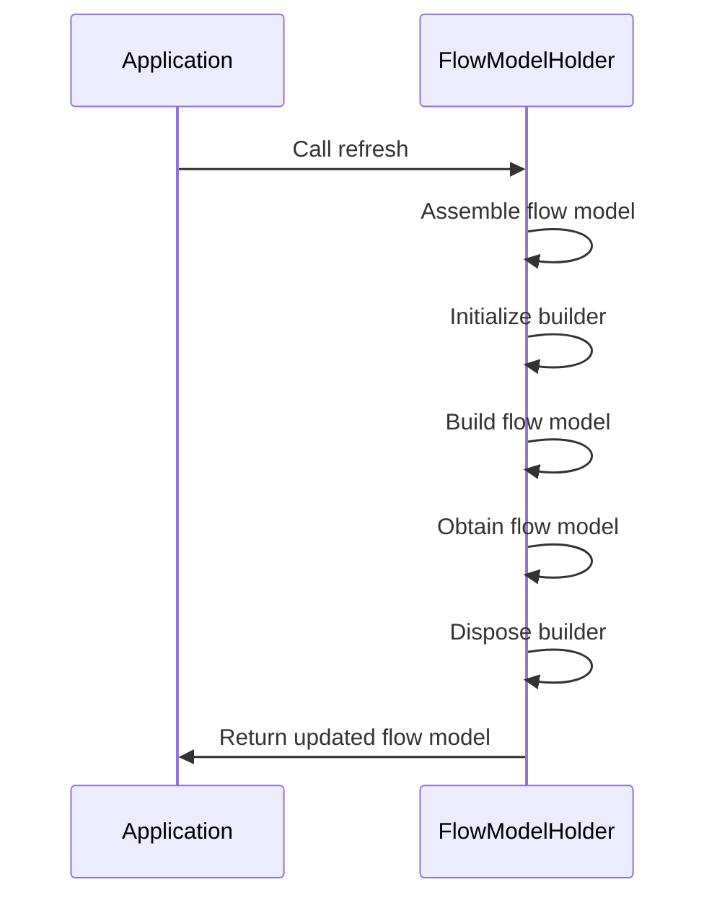
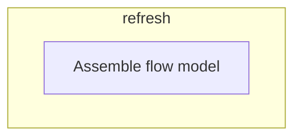
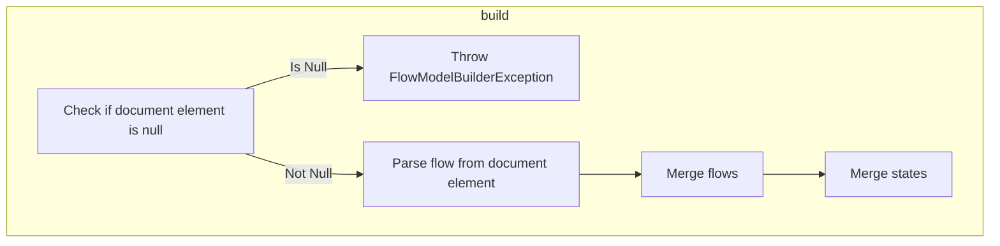

```mermaid
graph TD
  subgraph assembleFlowModel
    assembleFlowModel:A["Initialize flow model building"] --> assembleFlowModel:B["Build flow model"] --> assembleFlowModel:C["Obtain flow model"]
    assembleFlowModel:C --> assembleFlowModel:D["Dispose of builder"]
  end

%% Swimm:
%% graph TD
%%   subgraph <SwmToken path="spring-webflow/src/main/java/org/springframework/webflow/engine/model/builder/DefaultFlowModelHolder.java" pos="79:1:1" line-data="		assembleFlowModel();">`assembleFlowModel`</SwmToken>
%%     <SwmToken path="spring-webflow/src/main/java/org/springframework/webflow/engine/model/builder/DefaultFlowModelHolder.java" pos="79:1:1" line-data="		assembleFlowModel();">`assembleFlowModel`</SwmToken>:A["Initialize flow model building"] --> <SwmToken path="spring-webflow/src/main/java/org/springframework/webflow/engine/model/builder/DefaultFlowModelHolder.java" pos="79:1:1" line-data="		assembleFlowModel();">`assembleFlowModel`</SwmToken>:B["Build flow model"] --> <SwmToken path="spring-webflow/src/main/java/org/springframework/webflow/engine/model/builder/DefaultFlowModelHolder.java" pos="79:1:1" line-data="		assembleFlowModel();">`assembleFlowModel`</SwmToken>:C["Obtain flow model"]
%%     <SwmToken path="spring-webflow/src/main/java/org/springframework/webflow/engine/model/builder/DefaultFlowModelHolder.java" pos="79:1:1" line-data="		assembleFlowModel();">`assembleFlowModel`</SwmToken>:C --> <SwmToken path="spring-webflow/src/main/java/org/springframework/webflow/engine/model/builder/DefaultFlowModelHolder.java" pos="79:1:1" line-data="		assembleFlowModel();">`assembleFlowModel`</SwmToken>:D["Dispose of builder"]
%%   end
```

```mermaid
graph TD
  subgraph getFlowModel
    getFlowModel:A["Check if assembling"] -->|Yes| getFlowModel:B["Return early assembly result"]
    getFlowModel:A -->|No| getFlowModel:C["Check if flowModel is null"]
    getFlowModel:C -->|Yes| getFlowModel:D["Assemble Flow Model"]
    getFlowModel:C -->|No| getFlowModel:E["Check if flow model resource changed"]
    getFlowModel:E -->|Yes| getFlowModel:F["Assemble Flow Model"]
    getFlowModel:E -->|No| getFlowModel:G["Return flow model"]
  end

%% Swimm:
%% graph TD
%%   subgraph <SwmToken path="spring-webflow/src/main/java/org/springframework/webflow/engine/model/builder/DefaultFlowModelHolder.java" pos="55:7:7" line-data="	public synchronized FlowModel getFlowModel() {">`getFlowModel`</SwmToken>
%%     <SwmToken path="spring-webflow/src/main/java/org/springframework/webflow/engine/model/builder/DefaultFlowModelHolder.java" pos="55:7:7" line-data="	public synchronized FlowModel getFlowModel() {">`getFlowModel`</SwmToken>:A["Check if assembling"] -->|Yes| <SwmToken path="spring-webflow/src/main/java/org/springframework/webflow/engine/model/builder/DefaultFlowModelHolder.java" pos="55:7:7" line-data="	public synchronized FlowModel getFlowModel() {">`getFlowModel`</SwmToken>:B["Return early assembly result"]
%%     <SwmToken path="spring-webflow/src/main/java/org/springframework/webflow/engine/model/builder/DefaultFlowModelHolder.java" pos="55:7:7" line-data="	public synchronized FlowModel getFlowModel() {">`getFlowModel`</SwmToken>:A -->|No| <SwmToken path="spring-webflow/src/main/java/org/springframework/webflow/engine/model/builder/DefaultFlowModelHolder.java" pos="55:7:7" line-data="	public synchronized FlowModel getFlowModel() {">`getFlowModel`</SwmToken>:C["Check if <SwmToken path="spring-webflow/src/main/java/org/springframework/webflow/engine/model/builder/DefaultFlowModelHolder.java" pos="89:1:1" line-data="			flowModel = flowModelBuilder.getFlowModel();">`flowModel`</SwmToken> is null"]
%%     <SwmToken path="spring-webflow/src/main/java/org/springframework/webflow/engine/model/builder/DefaultFlowModelHolder.java" pos="55:7:7" line-data="	public synchronized FlowModel getFlowModel() {">`getFlowModel`</SwmToken>:C -->|Yes| <SwmToken path="spring-webflow/src/main/java/org/springframework/webflow/engine/model/builder/DefaultFlowModelHolder.java" pos="55:7:7" line-data="	public synchronized FlowModel getFlowModel() {">`getFlowModel`</SwmToken>:D["Assemble Flow Model"]
%%     <SwmToken path="spring-webflow/src/main/java/org/springframework/webflow/engine/model/builder/DefaultFlowModelHolder.java" pos="55:7:7" line-data="	public synchronized FlowModel getFlowModel() {">`getFlowModel`</SwmToken>:C -->|No| <SwmToken path="spring-webflow/src/main/java/org/springframework/webflow/engine/model/builder/DefaultFlowModelHolder.java" pos="55:7:7" line-data="	public synchronized FlowModel getFlowModel() {">`getFlowModel`</SwmToken>:E["Check if flow model resource changed"]
%%     <SwmToken path="spring-webflow/src/main/java/org/springframework/webflow/engine/model/builder/DefaultFlowModelHolder.java" pos="55:7:7" line-data="	public synchronized FlowModel getFlowModel() {">`getFlowModel`</SwmToken>:E -->|Yes| <SwmToken path="spring-webflow/src/main/java/org/springframework/webflow/engine/model/builder/DefaultFlowModelHolder.java" pos="55:7:7" line-data="	public synchronized FlowModel getFlowModel() {">`getFlowModel`</SwmToken>:F["Assemble Flow Model"]
%%     <SwmToken path="spring-webflow/src/main/java/org/springframework/webflow/engine/model/builder/DefaultFlowModelHolder.java" pos="55:7:7" line-data="	public synchronized FlowModel getFlowModel() {">`getFlowModel`</SwmToken>:E -->|No| <SwmToken path="spring-webflow/src/main/java/org/springframework/webflow/engine/model/builder/DefaultFlowModelHolder.java" pos="55:7:7" line-data="	public synchronized FlowModel getFlowModel() {">`getFlowModel`</SwmToken>:G["Return flow model"]
%%   end
```

```mermaid
graph TD
  subgraph parseFlow
    parseFlow:A["Create a new FlowModel"] --> parseFlow:B["Set whether flow is abstract from element attribute"]
    parseFlow:B --> parseFlow:C["Set parent from element attribute"]
    parseFlow:C --> parseFlow:D["Set start state id from element attribute"]
    parseFlow:D --> parseFlow:E["Set attributes by parsing element"]
    parseFlow:E --> parseFlow:F["Set security by parsing element"]
    parseFlow:F --> parseFlow:G["Set persistence context by parsing element"]
    parseFlow:G --> parseFlow:H["Set variables by parsing element"]
    parseFlow:H --> parseFlow:I["Set inputs by parsing element"]
    parseFlow:I --> parseFlow:J["Set onStart actions by parsing element"]
    parseFlow:J --> parseFlow:K["Set states by parsing element"]
    parseFlow:K --> parseFlow:L["Set global transitions by parsing element"]
    parseFlow:L --> parseFlow:M["Set onEnd actions by parsing element"]
    parseFlow:M --> parseFlow:N["Set outputs by parsing element"]
    parseFlow:N --> parseFlow:O["Set exception handlers by parsing element"]
    parseFlow:O --> parseFlow:P["Set bean imports by parsing element"]
  end

%% Swimm:
%% graph TD
%%   subgraph <SwmToken path="spring-webflow/src/main/java/org/springframework/webflow/engine/model/builder/xml/XmlFlowModelBuilder.java" pos="135:5:5" line-data="		flowModel = parseFlow(getDocumentElement());">`parseFlow`</SwmToken>
%%     <SwmToken path="spring-webflow/src/main/java/org/springframework/webflow/engine/model/builder/xml/XmlFlowModelBuilder.java" pos="135:5:5" line-data="		flowModel = parseFlow(getDocumentElement());">`parseFlow`</SwmToken>:A["Create a new <SwmToken path="spring-webflow/src/main/java/org/springframework/webflow/engine/model/builder/DefaultFlowModelHolder.java" pos="55:5:5" line-data="	public synchronized FlowModel getFlowModel() {">`FlowModel`</SwmToken>"] --> <SwmToken path="spring-webflow/src/main/java/org/springframework/webflow/engine/model/builder/xml/XmlFlowModelBuilder.java" pos="135:5:5" line-data="		flowModel = parseFlow(getDocumentElement());">`parseFlow`</SwmToken>:B["Set whether flow is abstract from element attribute"]
%%     <SwmToken path="spring-webflow/src/main/java/org/springframework/webflow/engine/model/builder/xml/XmlFlowModelBuilder.java" pos="135:5:5" line-data="		flowModel = parseFlow(getDocumentElement());">`parseFlow`</SwmToken>:B --> <SwmToken path="spring-webflow/src/main/java/org/springframework/webflow/engine/model/builder/xml/XmlFlowModelBuilder.java" pos="135:5:5" line-data="		flowModel = parseFlow(getDocumentElement());">`parseFlow`</SwmToken>:C["Set parent from element attribute"]
%%     <SwmToken path="spring-webflow/src/main/java/org/springframework/webflow/engine/model/builder/xml/XmlFlowModelBuilder.java" pos="135:5:5" line-data="		flowModel = parseFlow(getDocumentElement());">`parseFlow`</SwmToken>:C --> <SwmToken path="spring-webflow/src/main/java/org/springframework/webflow/engine/model/builder/xml/XmlFlowModelBuilder.java" pos="135:5:5" line-data="		flowModel = parseFlow(getDocumentElement());">`parseFlow`</SwmToken>:D["Set start state id from element attribute"]
%%     <SwmToken path="spring-webflow/src/main/java/org/springframework/webflow/engine/model/builder/xml/XmlFlowModelBuilder.java" pos="135:5:5" line-data="		flowModel = parseFlow(getDocumentElement());">`parseFlow`</SwmToken>:D --> <SwmToken path="spring-webflow/src/main/java/org/springframework/webflow/engine/model/builder/xml/XmlFlowModelBuilder.java" pos="135:5:5" line-data="		flowModel = parseFlow(getDocumentElement());">`parseFlow`</SwmToken>:E["Set attributes by parsing element"]
%%     <SwmToken path="spring-webflow/src/main/java/org/springframework/webflow/engine/model/builder/xml/XmlFlowModelBuilder.java" pos="135:5:5" line-data="		flowModel = parseFlow(getDocumentElement());">`parseFlow`</SwmToken>:E --> <SwmToken path="spring-webflow/src/main/java/org/springframework/webflow/engine/model/builder/xml/XmlFlowModelBuilder.java" pos="135:5:5" line-data="		flowModel = parseFlow(getDocumentElement());">`parseFlow`</SwmToken>:F["Set security by parsing element"]
%%     <SwmToken path="spring-webflow/src/main/java/org/springframework/webflow/engine/model/builder/xml/XmlFlowModelBuilder.java" pos="135:5:5" line-data="		flowModel = parseFlow(getDocumentElement());">`parseFlow`</SwmToken>:F --> <SwmToken path="spring-webflow/src/main/java/org/springframework/webflow/engine/model/builder/xml/XmlFlowModelBuilder.java" pos="135:5:5" line-data="		flowModel = parseFlow(getDocumentElement());">`parseFlow`</SwmToken>:G["Set persistence context by parsing element"]
%%     <SwmToken path="spring-webflow/src/main/java/org/springframework/webflow/engine/model/builder/xml/XmlFlowModelBuilder.java" pos="135:5:5" line-data="		flowModel = parseFlow(getDocumentElement());">`parseFlow`</SwmToken>:G --> <SwmToken path="spring-webflow/src/main/java/org/springframework/webflow/engine/model/builder/xml/XmlFlowModelBuilder.java" pos="135:5:5" line-data="		flowModel = parseFlow(getDocumentElement());">`parseFlow`</SwmToken>:H["Set variables by parsing element"]
%%     <SwmToken path="spring-webflow/src/main/java/org/springframework/webflow/engine/model/builder/xml/XmlFlowModelBuilder.java" pos="135:5:5" line-data="		flowModel = parseFlow(getDocumentElement());">`parseFlow`</SwmToken>:H --> <SwmToken path="spring-webflow/src/main/java/org/springframework/webflow/engine/model/builder/xml/XmlFlowModelBuilder.java" pos="135:5:5" line-data="		flowModel = parseFlow(getDocumentElement());">`parseFlow`</SwmToken>:I["Set inputs by parsing element"]
%%     <SwmToken path="spring-webflow/src/main/java/org/springframework/webflow/engine/model/builder/xml/XmlFlowModelBuilder.java" pos="135:5:5" line-data="		flowModel = parseFlow(getDocumentElement());">`parseFlow`</SwmToken>:I --> <SwmToken path="spring-webflow/src/main/java/org/springframework/webflow/engine/model/builder/xml/XmlFlowModelBuilder.java" pos="135:5:5" line-data="		flowModel = parseFlow(getDocumentElement());">`parseFlow`</SwmToken>:J["Set onStart actions by parsing element"]
%%     <SwmToken path="spring-webflow/src/main/java/org/springframework/webflow/engine/model/builder/xml/XmlFlowModelBuilder.java" pos="135:5:5" line-data="		flowModel = parseFlow(getDocumentElement());">`parseFlow`</SwmToken>:J --> <SwmToken path="spring-webflow/src/main/java/org/springframework/webflow/engine/model/builder/xml/XmlFlowModelBuilder.java" pos="135:5:5" line-data="		flowModel = parseFlow(getDocumentElement());">`parseFlow`</SwmToken>:K["Set states by parsing element"]
%%     <SwmToken path="spring-webflow/src/main/java/org/springframework/webflow/engine/model/builder/xml/XmlFlowModelBuilder.java" pos="135:5:5" line-data="		flowModel = parseFlow(getDocumentElement());">`parseFlow`</SwmToken>:K --> <SwmToken path="spring-webflow/src/main/java/org/springframework/webflow/engine/model/builder/xml/XmlFlowModelBuilder.java" pos="135:5:5" line-data="		flowModel = parseFlow(getDocumentElement());">`parseFlow`</SwmToken>:L["Set global transitions by parsing element"]
%%     <SwmToken path="spring-webflow/src/main/java/org/springframework/webflow/engine/model/builder/xml/XmlFlowModelBuilder.java" pos="135:5:5" line-data="		flowModel = parseFlow(getDocumentElement());">`parseFlow`</SwmToken>:L --> <SwmToken path="spring-webflow/src/main/java/org/springframework/webflow/engine/model/builder/xml/XmlFlowModelBuilder.java" pos="135:5:5" line-data="		flowModel = parseFlow(getDocumentElement());">`parseFlow`</SwmToken>:M["Set onEnd actions by parsing element"]
%%     <SwmToken path="spring-webflow/src/main/java/org/springframework/webflow/engine/model/builder/xml/XmlFlowModelBuilder.java" pos="135:5:5" line-data="		flowModel = parseFlow(getDocumentElement());">`parseFlow`</SwmToken>:M --> <SwmToken path="spring-webflow/src/main/java/org/springframework/webflow/engine/model/builder/xml/XmlFlowModelBuilder.java" pos="135:5:5" line-data="		flowModel = parseFlow(getDocumentElement());">`parseFlow`</SwmToken>:N["Set outputs by parsing element"]
%%     <SwmToken path="spring-webflow/src/main/java/org/springframework/webflow/engine/model/builder/xml/XmlFlowModelBuilder.java" pos="135:5:5" line-data="		flowModel = parseFlow(getDocumentElement());">`parseFlow`</SwmToken>:N --> <SwmToken path="spring-webflow/src/main/java/org/springframework/webflow/engine/model/builder/xml/XmlFlowModelBuilder.java" pos="135:5:5" line-data="		flowModel = parseFlow(getDocumentElement());">`parseFlow`</SwmToken>:O["Set exception handlers by parsing element"]
%%     <SwmToken path="spring-webflow/src/main/java/org/springframework/webflow/engine/model/builder/xml/XmlFlowModelBuilder.java" pos="135:5:5" line-data="		flowModel = parseFlow(getDocumentElement());">`parseFlow`</SwmToken>:O --> <SwmToken path="spring-webflow/src/main/java/org/springframework/webflow/engine/model/builder/xml/XmlFlowModelBuilder.java" pos="135:5:5" line-data="		flowModel = parseFlow(getDocumentElement());">`parseFlow`</SwmToken>:P["Set bean imports by parsing element"]
%%   end
```

The refresh process is responsible for ensuring that the flow model is up-to-date by reassembling it whenever necessary. This is achieved by calling the refresh method, which initiates the assembly of the flow model.

For instance, if there are changes in the flow model configuration, the refresh process will reassemble the flow model to incorporate these changes, ensuring that the application uses the latest configuration.



Here is a high level diagram of the flow, showing only the most important functions:

```mermaid
graph TD;
      subgraph springwebflowsrcmainjavaorgspringframeworkwebflowenginemodelbuilder[spring-webflow/…/model/builder]
7eb54c3e0ef0912175e3193f89112bdf98260dca23e44467f00d1c2b9f4509ca(DefaultFlowModelHolder.refresh) --> 9cbe075dbad097f0d8c3c0a6dbd4db0f538d5710727b8cd828bd73d6be81bf72(DefaultFlowModelHolder.assembleFlowModel)
end

subgraph springwebflowsrcmainjavaorgspringframeworkwebflowenginemodelbuilder[spring-webflow/…/model/builder]
9cbe075dbad097f0d8c3c0a6dbd4db0f538d5710727b8cd828bd73d6be81bf72(DefaultFlowModelHolder.assembleFlowModel) --> 81ef7806c34ace444454280ced69a806c27e98237ea8c39100e9ec8903123dd1(DefaultFlowModelHolder.getFlowModel)
end

subgraph springwebflowsrcmainjavaorgspringframeworkwebflowenginemodelbuilder[spring-webflow/…/model/builder]
9cbe075dbad097f0d8c3c0a6dbd4db0f538d5710727b8cd828bd73d6be81bf72(DefaultFlowModelHolder.assembleFlowModel) --> 6f700259415dc4a635d530dfcee17d8270662d777de6d1a433a135a04d5cbdec(XmlFlowModelBuilder.build)
end

subgraph springwebflowsrcmainjavaorgspringframeworkwebflowenginemodelbuilder[spring-webflow/…/model/builder]
81ef7806c34ace444454280ced69a806c27e98237ea8c39100e9ec8903123dd1(DefaultFlowModelHolder.getFlowModel) --> 9cbe075dbad097f0d8c3c0a6dbd4db0f538d5710727b8cd828bd73d6be81bf72(DefaultFlowModelHolder.assembleFlowModel)
end

subgraph springwebflowsrcmainjavaorgspringframeworkwebflowenginemodelbuilder[spring-webflow/…/model/builder]
6f700259415dc4a635d530dfcee17d8270662d777de6d1a433a135a04d5cbdec(XmlFlowModelBuilder.build) --> 51596cdc732affe80748caa3040940c25777992d2a50b926b2c645982009ba9c(XmlFlowModelBuilder.parseFlow)
end

subgraph springwebflowsrcmainjavaorgspringframeworkwebflowenginemodelbuilder[spring-webflow/…/model/builder]
51596cdc732affe80748caa3040940c25777992d2a50b926b2c645982009ba9c(XmlFlowModelBuilder.parseFlow) --> 206ef51e6746b5df879bd7c4cb2ac2d50ceb4b230c14da2c98b50983d22f4430(XmlFlowModelBuilder.parseStates)
end

subgraph springwebflowsrcmainjavaorgspringframeworkwebflowenginemodelbuilder[spring-webflow/…/model/builder]
206ef51e6746b5df879bd7c4cb2ac2d50ceb4b230c14da2c98b50983d22f4430(XmlFlowModelBuilder.parseStates) --> 05b4dfde799953f750e0244adcfa3b8865ad6aaa70d81cf4f695036d56bdae7f(XmlFlowModelBuilder.parseState)
end

subgraph springwebflowsrcmainjavaorgspringframeworkwebflowenginemodelbuilder[spring-webflow/…/model/builder]
05b4dfde799953f750e0244adcfa3b8865ad6aaa70d81cf4f695036d56bdae7f(XmlFlowModelBuilder.parseState) --> 45a99ee2f70fe2766680530554fcfae29ddf665a3930367a2ec341fa24872ff0(XmlFlowModelBuilder.parseViewState)
end

subgraph springwebflowsrcmainjavaorgspringframeworkwebflowenginemodelbuilder[spring-webflow/…/model/builder]
05b4dfde799953f750e0244adcfa3b8865ad6aaa70d81cf4f695036d56bdae7f(XmlFlowModelBuilder.parseState) --> f23fc3f07800f31b3b737b9f468e49726119ae270c8ff9f808050f8a10dbac0b(XmlFlowModelBuilder.parseActionState)
end

subgraph springwebflowsrcmainjavaorgspringframeworkwebflowenginemodelbuilder[spring-webflow/…/model/builder]
05b4dfde799953f750e0244adcfa3b8865ad6aaa70d81cf4f695036d56bdae7f(XmlFlowModelBuilder.parseState) --> ec153cc28498e4354eeaf9afee8937b82368d05ecdc18106b567acb821b7a239(XmlFlowModelBuilder.parseSubflowState)
end

subgraph springwebflowsrcmainjavaorgspringframeworkwebflowenginemodelbuilder[spring-webflow/…/model/builder]
05b4dfde799953f750e0244adcfa3b8865ad6aaa70d81cf4f695036d56bdae7f(XmlFlowModelBuilder.parseState) --> a4ab8a7d2430670a45f565d8fc1a0e6217772d889e05e83bf4d1d52d11e196cd(XmlFlowModelBuilder.parseDecisionState)
end


      classDef mainFlowStyle color:#000000,fill:#7CB9F4
classDef rootsStyle color:#000000,fill:#00FFF4
classDef Style1 color:#000000,fill:#00FFAA
classDef Style2 color:#000000,fill:#FFFF00
classDef Style3 color:#000000,fill:#AA7CB9

%% Swimm:
%% graph TD;
%%       subgraph springwebflowsrcmainjavaorgspringframeworkwebflowenginemodelbuilder[<SwmPath>[spring-webflow/…/model/builder/](spring-webflow/src/main/java/org/springframework/webflow/engine/model/builder/)</SwmPath>]
%% 7eb54c3e0ef0912175e3193f89112bdf98260dca23e44467f00d1c2b9f4509ca(DefaultFlowModelHolder.refresh) --> 9cbe075dbad097f0d8c3c0a6dbd4db0f538d5710727b8cd828bd73d6be81bf72(DefaultFlowModelHolder.assembleFlowModel)
%% end
%% 
%% subgraph springwebflowsrcmainjavaorgspringframeworkwebflowenginemodelbuilder[<SwmPath>[spring-webflow/…/model/builder/](spring-webflow/src/main/java/org/springframework/webflow/engine/model/builder/)</SwmPath>]
%% 9cbe075dbad097f0d8c3c0a6dbd4db0f538d5710727b8cd828bd73d6be81bf72(DefaultFlowModelHolder.assembleFlowModel) --> 81ef7806c34ace444454280ced69a806c27e98237ea8c39100e9ec8903123dd1(DefaultFlowModelHolder.getFlowModel)
%% end
%% 
%% subgraph springwebflowsrcmainjavaorgspringframeworkwebflowenginemodelbuilder[<SwmPath>[spring-webflow/…/model/builder/](spring-webflow/src/main/java/org/springframework/webflow/engine/model/builder/)</SwmPath>]
%% 9cbe075dbad097f0d8c3c0a6dbd4db0f538d5710727b8cd828bd73d6be81bf72(DefaultFlowModelHolder.assembleFlowModel) --> 6f700259415dc4a635d530dfcee17d8270662d777de6d1a433a135a04d5cbdec(XmlFlowModelBuilder.build)
%% end
%% 
%% subgraph springwebflowsrcmainjavaorgspringframeworkwebflowenginemodelbuilder[<SwmPath>[spring-webflow/…/model/builder/](spring-webflow/src/main/java/org/springframework/webflow/engine/model/builder/)</SwmPath>]
%% 81ef7806c34ace444454280ced69a806c27e98237ea8c39100e9ec8903123dd1(DefaultFlowModelHolder.getFlowModel) --> 9cbe075dbad097f0d8c3c0a6dbd4db0f538d5710727b8cd828bd73d6be81bf72(DefaultFlowModelHolder.assembleFlowModel)
%% end
%% 
%% subgraph springwebflowsrcmainjavaorgspringframeworkwebflowenginemodelbuilder[<SwmPath>[spring-webflow/…/model/builder/](spring-webflow/src/main/java/org/springframework/webflow/engine/model/builder/)</SwmPath>]
%% 6f700259415dc4a635d530dfcee17d8270662d777de6d1a433a135a04d5cbdec(XmlFlowModelBuilder.build) --> 51596cdc732affe80748caa3040940c25777992d2a50b926b2c645982009ba9c(XmlFlowModelBuilder.parseFlow)
%% end
%% 
%% subgraph springwebflowsrcmainjavaorgspringframeworkwebflowenginemodelbuilder[<SwmPath>[spring-webflow/…/model/builder/](spring-webflow/src/main/java/org/springframework/webflow/engine/model/builder/)</SwmPath>]
%% 51596cdc732affe80748caa3040940c25777992d2a50b926b2c645982009ba9c(XmlFlowModelBuilder.parseFlow) --> 206ef51e6746b5df879bd7c4cb2ac2d50ceb4b230c14da2c98b50983d22f4430(XmlFlowModelBuilder.parseStates)
%% end
%% 
%% subgraph springwebflowsrcmainjavaorgspringframeworkwebflowenginemodelbuilder[<SwmPath>[spring-webflow/…/model/builder/](spring-webflow/src/main/java/org/springframework/webflow/engine/model/builder/)</SwmPath>]
%% 206ef51e6746b5df879bd7c4cb2ac2d50ceb4b230c14da2c98b50983d22f4430(XmlFlowModelBuilder.parseStates) --> 05b4dfde799953f750e0244adcfa3b8865ad6aaa70d81cf4f695036d56bdae7f(XmlFlowModelBuilder.parseState)
%% end
%% 
%% subgraph springwebflowsrcmainjavaorgspringframeworkwebflowenginemodelbuilder[<SwmPath>[spring-webflow/…/model/builder/](spring-webflow/src/main/java/org/springframework/webflow/engine/model/builder/)</SwmPath>]
%% 05b4dfde799953f750e0244adcfa3b8865ad6aaa70d81cf4f695036d56bdae7f(XmlFlowModelBuilder.parseState) --> 45a99ee2f70fe2766680530554fcfae29ddf665a3930367a2ec341fa24872ff0(XmlFlowModelBuilder.parseViewState)
%% end
%% 
%% subgraph springwebflowsrcmainjavaorgspringframeworkwebflowenginemodelbuilder[<SwmPath>[spring-webflow/…/model/builder/](spring-webflow/src/main/java/org/springframework/webflow/engine/model/builder/)</SwmPath>]
%% 05b4dfde799953f750e0244adcfa3b8865ad6aaa70d81cf4f695036d56bdae7f(XmlFlowModelBuilder.parseState) --> f23fc3f07800f31b3b737b9f468e49726119ae270c8ff9f808050f8a10dbac0b(XmlFlowModelBuilder.parseActionState)
%% end
%% 
%% subgraph springwebflowsrcmainjavaorgspringframeworkwebflowenginemodelbuilder[<SwmPath>[spring-webflow/…/model/builder/](spring-webflow/src/main/java/org/springframework/webflow/engine/model/builder/)</SwmPath>]
%% 05b4dfde799953f750e0244adcfa3b8865ad6aaa70d81cf4f695036d56bdae7f(XmlFlowModelBuilder.parseState) --> ec153cc28498e4354eeaf9afee8937b82368d05ecdc18106b567acb821b7a239(XmlFlowModelBuilder.parseSubflowState)
%% end
%% 
%% subgraph springwebflowsrcmainjavaorgspringframeworkwebflowenginemodelbuilder[<SwmPath>[spring-webflow/…/model/builder/](spring-webflow/src/main/java/org/springframework/webflow/engine/model/builder/)</SwmPath>]
%% 05b4dfde799953f750e0244adcfa3b8865ad6aaa70d81cf4f695036d56bdae7f(XmlFlowModelBuilder.parseState) --> a4ab8a7d2430670a45f565d8fc1a0e6217772d889e05e83bf4d1d52d11e196cd(XmlFlowModelBuilder.parseDecisionState)
%% end
%% 
%% 
%%       classDef mainFlowStyle color:#000000,fill:#7CB9F4
%% classDef rootsStyle color:#000000,fill:#00FFF4
%% classDef Style1 color:#000000,fill:#00FFAA
%% classDef Style2 color:#000000,fill:#FFFF00
%% classDef Style3 color:#000000,fill:#AA7CB9
```



# Flow drill down

## Diving into refresh



<SwmSnippet path="/spring-webflow/src/main/java/org/springframework/webflow/engine/model/builder/DefaultFlowModelHolder.java" line="78">

---

First, the <SwmToken path="spring-webflow/src/main/java/org/springframework/webflow/engine/model/builder/DefaultFlowModelHolder.java" pos="78:7:7" line-data="	public synchronized void refresh() {">`refresh`</SwmToken> method is called to initiate the process of assembling the flow model. This method ensures that the flow model is up-to-date by reassembling it whenever necessary.

```java
	public synchronized void refresh() {
		assembleFlowModel();
	}
```

---

</SwmSnippet>

<SwmSnippet path="/spring-webflow/src/main/java/org/springframework/webflow/engine/model/builder/DefaultFlowModelHolder.java" line="84">

---

Moving to the <SwmToken path="spring-webflow/src/main/java/org/springframework/webflow/engine/model/builder/DefaultFlowModelHolder.java" pos="84:5:5" line-data="	private void assembleFlowModel() throws FlowModelBuilderException {">`assembleFlowModel`</SwmToken> method, it is responsible for the actual assembly of the flow model. This involves initializing, building, and disposing of the flow model builder to ensure that the flow model is correctly constructed and ready for use.

```java
	private void assembleFlowModel() throws FlowModelBuilderException {
```

---

</SwmSnippet>

## Inside <SwmToken path="spring-webflow/src/main/java/org/springframework/webflow/engine/model/builder/DefaultFlowModelHolder.java" pos="79:1:1" line-data="		assembleFlowModel();">`assembleFlowModel`</SwmToken>



<SwmSnippet path="/spring-webflow/src/main/java/org/springframework/webflow/engine/model/builder/DefaultFlowModelHolder.java" line="84">

---

First, the <SwmToken path="spring-webflow/src/main/java/org/springframework/webflow/engine/model/builder/DefaultFlowModelHolder.java" pos="84:5:5" line-data="	private void assembleFlowModel() throws FlowModelBuilderException {">`assembleFlowModel`</SwmToken> method is responsible for assembling the flow model. This is crucial for setting up the flow model that will be used throughout the application.

```java
	private void assembleFlowModel() throws FlowModelBuilderException {
		try {
			assembling = true;
			flowModelBuilder.init();
			flowModelBuilder.build();
			flowModel = flowModelBuilder.getFlowModel();
		} finally {
			try {
				flowModelBuilder.dispose();
			} finally {
				assembling = false;
			}
		}
	}
```

---

</SwmSnippet>

Next, the method sets the <SwmToken path="spring-webflow/src/main/java/org/springframework/webflow/engine/model/builder/DefaultFlowModelHolder.java" pos="56:4:4" line-data="		if (assembling) {">`assembling`</SwmToken> flag to true, indicating that the flow model assembly process has started. This helps in managing the state of the assembly process.

Then, the <SwmToken path="spring-webflow/src/main/java/org/springframework/webflow/engine/model/builder/DefaultFlowModelHolder.java" pos="87:1:5" line-data="			flowModelBuilder.init();">`flowModelBuilder.init()`</SwmToken> method is called to initialize the flow model builder. This step prepares the builder for constructing the flow model.

Moving to the next step, the <SwmToken path="spring-webflow/src/main/java/org/springframework/webflow/engine/model/builder/DefaultFlowModelHolder.java" pos="88:1:5" line-data="			flowModelBuilder.build();">`flowModelBuilder.build()`</SwmToken> method is invoked to build the flow model. This is where the actual construction of the flow model takes place, incorporating all necessary components and configurations.

After building the flow model, the <SwmToken path="spring-webflow/src/main/java/org/springframework/webflow/engine/model/builder/DefaultFlowModelHolder.java" pos="58:3:7" line-data="			return flowModelBuilder.getFlowModel();">`flowModelBuilder.getFlowModel()`</SwmToken> method retrieves the constructed flow model. This model is then assigned to the <SwmToken path="spring-webflow/src/main/java/org/springframework/webflow/engine/model/builder/DefaultFlowModelHolder.java" pos="89:1:1" line-data="			flowModel = flowModelBuilder.getFlowModel();">`flowModel`</SwmToken> variable, making it available for use in the application.

## A closer look at <SwmToken path="spring-webflow/src/main/java/org/springframework/webflow/engine/model/builder/DefaultFlowModelHolder.java" pos="55:7:7" line-data="	public synchronized FlowModel getFlowModel() {">`getFlowModel`</SwmToken>



<SwmSnippet path="/spring-webflow/src/main/java/org/springframework/webflow/engine/model/builder/DefaultFlowModelHolder.java" line="55">

---

First, the <SwmToken path="spring-webflow/src/main/java/org/springframework/webflow/engine/model/builder/DefaultFlowModelHolder.java" pos="55:7:7" line-data="	public synchronized FlowModel getFlowModel() {">`getFlowModel`</SwmToken> method checks if the flow model is currently being assembled. If it is, it returns the early assembly result to handle cases where a flow calls itself recursively.

```java
	public synchronized FlowModel getFlowModel() {
		if (assembling) {
			// must return early assembly result for when a flow calls itself recursively
			return flowModelBuilder.getFlowModel();
```

---

</SwmSnippet>

## A closer look at build



<SwmSnippet path="/spring-webflow/src/main/java/org/springframework/webflow/engine/model/builder/xml/XmlFlowModelBuilder.java" line="131">

---

First, the <SwmToken path="spring-webflow/src/main/java/org/springframework/webflow/engine/model/builder/xml/XmlFlowModelBuilder.java" pos="133:26:26" line-data="					&quot;The FlowModelBuilder must be initialized first -- called init() before calling build()&quot;);">`build`</SwmToken> method ensures that the flow model builder is properly initialized by checking if the document element is not null. If it is null, it throws a <SwmToken path="spring-webflow/src/main/java/org/springframework/webflow/engine/model/builder/xml/XmlFlowModelBuilder.java" pos="132:5:5" line-data="			throw new FlowModelBuilderException(">`FlowModelBuilderException`</SwmToken> to indicate that the initialization step was missed.

```java
		if (getDocumentElement() == null) {
			throw new FlowModelBuilderException(
					"The FlowModelBuilder must be initialized first -- called init() before calling build()");
```

---

</SwmSnippet>

<SwmSnippet path="/spring-webflow/src/main/java/org/springframework/webflow/engine/model/builder/xml/XmlFlowModelBuilder.java" line="135">

---

Next, the method proceeds to parse the flow model from the XML document. This is done by calling the <SwmToken path="spring-webflow/src/main/java/org/springframework/webflow/engine/model/builder/xml/XmlFlowModelBuilder.java" pos="135:5:5" line-data="		flowModel = parseFlow(getDocumentElement());">`parseFlow`</SwmToken> method with the document element, which processes the XML structure to create a flow model representation.

```java
		flowModel = parseFlow(getDocumentElement());
```

---

</SwmSnippet>

<SwmSnippet path="/spring-webflow/src/main/java/org/springframework/webflow/engine/model/builder/xml/XmlFlowModelBuilder.java" line="136">

---

Then, the <SwmToken path="spring-webflow/src/main/java/org/springframework/webflow/engine/model/builder/xml/XmlFlowModelBuilder.java" pos="136:1:1" line-data="		mergeFlows();">`mergeFlows`</SwmToken> method is called to integrate any additional flow definitions that might be part of the overall flow model. This step ensures that all related flows are combined into a single cohesive model.

```java
		mergeFlows();
```

---

</SwmSnippet>

<SwmSnippet path="/spring-webflow/src/main/java/org/springframework/webflow/engine/model/builder/xml/XmlFlowModelBuilder.java" line="137">

---

Finally, the <SwmToken path="spring-webflow/src/main/java/org/springframework/webflow/engine/model/builder/xml/XmlFlowModelBuilder.java" pos="137:1:1" line-data="		mergeStates();">`mergeStates`</SwmToken> method is invoked to consolidate the states within the flow model. This step is crucial for ensuring that all states are correctly integrated and any state-specific configurations are applied.

```java
		mergeStates();
```

---

</SwmSnippet>

## Going into <SwmToken path="spring-webflow/src/main/java/org/springframework/webflow/engine/model/builder/xml/XmlFlowModelBuilder.java" pos="135:5:5" line-data="		flowModel = parseFlow(getDocumentElement());">`parseFlow`</SwmToken>



<SwmSnippet path="/spring-webflow/src/main/java/org/springframework/webflow/engine/model/builder/xml/XmlFlowModelBuilder.java" line="207">

---

First, the <SwmToken path="spring-webflow/src/main/java/org/springframework/webflow/engine/model/builder/xml/XmlFlowModelBuilder.java" pos="135:5:5" line-data="		flowModel = parseFlow(getDocumentElement());">`parseFlow`</SwmToken> method initializes a new <SwmToken path="spring-webflow/src/main/java/org/springframework/webflow/engine/model/builder/xml/XmlFlowModelBuilder.java" pos="207:1:1" line-data="		FlowModel flow = new FlowModel();">`FlowModel`</SwmToken> object. This object will hold all the parsed data from the XML element representing the flow.

```java
		FlowModel flow = new FlowModel();
```

---

</SwmSnippet>

<SwmSnippet path="/spring-webflow/src/main/java/org/springframework/webflow/engine/model/builder/xml/XmlFlowModelBuilder.java" line="208">

---

Next, the method sets various attributes of the flow model such as <SwmToken path="spring-webflow/src/main/java/org/springframework/webflow/engine/model/builder/xml/XmlFlowModelBuilder.java" pos="208:10:10" line-data="		flow.setAbstract(element.getAttribute(&quot;abstract&quot;));">`abstract`</SwmToken>, <SwmToken path="spring-webflow/src/main/java/org/springframework/webflow/engine/model/builder/xml/XmlFlowModelBuilder.java" pos="209:10:10" line-data="		flow.setParent(element.getAttribute(&quot;parent&quot;));">`parent`</SwmToken>, and <SwmToken path="spring-webflow/src/main/java/org/springframework/webflow/engine/model/builder/xml/XmlFlowModelBuilder.java" pos="210:10:12" line-data="		flow.setStartStateId(element.getAttribute(&quot;start-state&quot;));">`start-state`</SwmToken> by extracting these values from the XML element. These attributes define the basic properties and behavior of the flow.

```java
		flow.setAbstract(element.getAttribute("abstract"));
		flow.setParent(element.getAttribute("parent"));
		flow.setStartStateId(element.getAttribute("start-state"));
```

---

</SwmSnippet>

<SwmSnippet path="/spring-webflow/src/main/java/org/springframework/webflow/engine/model/builder/xml/XmlFlowModelBuilder.java" line="211">

---

Moving to the next steps, the method parses additional elements like <SwmToken path="spring-webflow/src/main/java/org/springframework/webflow/engine/model/builder/xml/XmlFlowModelBuilder.java" pos="231:6:6" line-data="		LinkedList&lt;AttributeModel&gt; attributes = new LinkedList&lt;&gt;();">`attributes`</SwmToken>, <SwmToken path="spring-webflow/src/main/java/org/springframework/webflow/engine/model/builder/xml/XmlFlowModelBuilder.java" pos="405:13:13" line-data="		element = DomUtils.getChildElementByTagName(element, &quot;secured&quot;);">`secured`</SwmToken>, `persistenceContext`, <SwmToken path="spring-webflow/src/main/java/org/springframework/webflow/engine/model/builder/xml/XmlFlowModelBuilder.java" pos="243:6:6" line-data="		LinkedList&lt;VarModel&gt; vars = new LinkedList&lt;&gt;();">`vars`</SwmToken>, and <SwmToken path="spring-webflow/src/main/java/org/springframework/webflow/engine/model/builder/xml/XmlFlowModelBuilder.java" pos="255:6:6" line-data="		LinkedList&lt;InputModel&gt; inputs = new LinkedList&lt;&gt;();">`inputs`</SwmToken>. These elements provide more detailed configurations and security settings for the flow.

```java
		flow.setAttributes(parseAttributes(element));
		flow.setSecured(parseSecured(element));
		flow.setPersistenceContext(parsePersistenceContext(element));
		flow.setVars(parseVars(element));
		flow.setInputs(parseInputs(element));
```

---

</SwmSnippet>

<SwmSnippet path="/spring-webflow/src/main/java/org/springframework/webflow/engine/model/builder/xml/XmlFlowModelBuilder.java" line="217">

---

Then, the method calls <SwmToken path="spring-webflow/src/main/java/org/springframework/webflow/engine/model/builder/xml/XmlFlowModelBuilder.java" pos="217:5:5" line-data="		flow.setStates(parseStates(element));">`parseStates`</SwmToken> to parse the different states within the flow. Each state represents a distinct step or action within the flow, and parsing these states is crucial for defining the flow's behavior.

```java
		flow.setStates(parseStates(element));
```

---

</SwmSnippet>

<SwmSnippet path="/spring-webflow/src/main/java/org/springframework/webflow/engine/model/builder/xml/XmlFlowModelBuilder.java" line="218">

---

Next, the method parses global transitions and actions such as `globalTransitions`, `onStartActions`, `onEndActions`, <SwmToken path="spring-webflow/src/main/java/org/springframework/webflow/engine/model/builder/xml/XmlFlowModelBuilder.java" pos="267:6:6" line-data="		LinkedList&lt;OutputModel&gt; outputs = new LinkedList&lt;&gt;();">`outputs`</SwmToken>, <SwmToken path="spring-webflow/src/main/java/org/springframework/webflow/engine/model/builder/xml/XmlFlowModelBuilder.java" pos="317:6:6" line-data="		LinkedList&lt;ExceptionHandlerModel&gt; exceptionHandlers = new LinkedList&lt;&gt;();">`exceptionHandlers`</SwmToken>, and <SwmToken path="spring-webflow/src/main/java/org/springframework/webflow/engine/model/builder/xml/XmlFlowModelBuilder.java" pos="329:6:6" line-data="		LinkedList&lt;BeanImportModel&gt; beanImports = new LinkedList&lt;&gt;();">`beanImports`</SwmToken>. These elements define the flow's transitions, actions to be executed at different stages, and how exceptions are handled.

```java
		flow.setGlobalTransitions(parseGlobalTransitions(element));
		flow.setOnEndActions(parseOnEndActions(element));
		flow.setOutputs(parseOutputs(element));
		flow.setExceptionHandlers(parseExceptionHandlers(element));
		flow.setBeanImports(parseBeanImports(element));
```

---

</SwmSnippet>

<SwmSnippet path="/spring-webflow/src/main/java/org/springframework/webflow/engine/model/builder/xml/XmlFlowModelBuilder.java" line="223">

---

Finally, the method returns the fully initialized <SwmToken path="spring-webflow/src/main/java/org/springframework/webflow/engine/model/builder/DefaultFlowModelHolder.java" pos="55:5:5" line-data="	public synchronized FlowModel getFlowModel() {">`FlowModel`</SwmToken> object, which now contains all the parsed data from the XML element. This model is then used to manage the flow's execution.

```java
		return flow;
	}
```

---

</SwmSnippet>

## Exploring <SwmToken path="spring-webflow/src/main/java/org/springframework/webflow/engine/model/builder/xml/XmlFlowModelBuilder.java" pos="217:5:5" line-data="		flow.setStates(parseStates(element));">`parseStates`</SwmToken>



```mermaid
graph TD
  subgraph parseStates
    parseStates:A["Get child elements by tag name"] --> parseStates:B["Check if state elements are empty"]
    parseStates:B -->|Not empty| parseStates:C["Initialize states list"]
    parseStates:C --> parseStates:D["Parse each state element"]
    parseStates:D --> parseStates:E["Add parsed state to states list"]
  end

%% Swimm:
%% graph TD
%%   subgraph <SwmToken path="spring-webflow/src/main/java/org/springframework/webflow/engine/model/builder/xml/XmlFlowModelBuilder.java" pos="217:5:5" line-data="		flow.setStates(parseStates(element));">`parseStates`</SwmToken>
%%     <SwmToken path="spring-webflow/src/main/java/org/springframework/webflow/engine/model/builder/xml/XmlFlowModelBuilder.java" pos="217:5:5" line-data="		flow.setStates(parseStates(element));">`parseStates`</SwmToken>:A["Get child elements by tag name"] --> <SwmToken path="spring-webflow/src/main/java/org/springframework/webflow/engine/model/builder/xml/XmlFlowModelBuilder.java" pos="217:5:5" line-data="		flow.setStates(parseStates(element));">`parseStates`</SwmToken>:B["Check if state elements are empty"]
%%     <SwmToken path="spring-webflow/src/main/java/org/springframework/webflow/engine/model/builder/xml/XmlFlowModelBuilder.java" pos="217:5:5" line-data="		flow.setStates(parseStates(element));">`parseStates`</SwmToken>:B -->|Not empty| <SwmToken path="spring-webflow/src/main/java/org/springframework/webflow/engine/model/builder/xml/XmlFlowModelBuilder.java" pos="217:5:5" line-data="		flow.setStates(parseStates(element));">`parseStates`</SwmToken>:C["Initialize states list"]
%%     <SwmToken path="spring-webflow/src/main/java/org/springframework/webflow/engine/model/builder/xml/XmlFlowModelBuilder.java" pos="217:5:5" line-data="		flow.setStates(parseStates(element));">`parseStates`</SwmToken>:C --> <SwmToken path="spring-webflow/src/main/java/org/springframework/webflow/engine/model/builder/xml/XmlFlowModelBuilder.java" pos="217:5:5" line-data="		flow.setStates(parseStates(element));">`parseStates`</SwmToken>:D["Parse each state element"]
%%     <SwmToken path="spring-webflow/src/main/java/org/springframework/webflow/engine/model/builder/xml/XmlFlowModelBuilder.java" pos="217:5:5" line-data="		flow.setStates(parseStates(element));">`parseStates`</SwmToken>:D --> <SwmToken path="spring-webflow/src/main/java/org/springframework/webflow/engine/model/builder/xml/XmlFlowModelBuilder.java" pos="217:5:5" line-data="		flow.setStates(parseStates(element));">`parseStates`</SwmToken>:E["Add parsed state to states list"]
%%   end
```

## Parsing States

The <SwmToken path="spring-webflow/src/main/java/org/springframework/webflow/engine/model/builder/xml/XmlFlowModelBuilder.java" pos="217:5:5" line-data="		flow.setStates(parseStates(element));">`parseStates`</SwmToken> method is responsible for extracting various state elements from an XML configuration. This is crucial for setting up the flow model as it defines the different states the flow can be in.

<SwmSnippet path="/spring-webflow/src/main/java/org/springframework/webflow/engine/model/builder/xml/XmlFlowModelBuilder.java" line="288">

---

First, the method retrieves child elements from the provided XML element that match specific state tags such as <SwmToken path="spring-webflow/src/main/java/org/springframework/webflow/engine/model/builder/xml/XmlFlowModelBuilder.java" pos="288:26:28" line-data="		List&lt;Element&gt; stateElements = DomUtils.getChildElementsByTagName(element, new String[] { &quot;view-state&quot;,">`view-state`</SwmToken>, <SwmToken path="spring-webflow/src/main/java/org/springframework/webflow/engine/model/builder/xml/XmlFlowModelBuilder.java" pos="289:2:4" line-data="				&quot;action-state&quot;, &quot;decision-state&quot;, &quot;subflow-state&quot;, &quot;end-state&quot; });">`action-state`</SwmToken>, <SwmToken path="spring-webflow/src/main/java/org/springframework/webflow/engine/model/builder/xml/XmlFlowModelBuilder.java" pos="289:9:11" line-data="				&quot;action-state&quot;, &quot;decision-state&quot;, &quot;subflow-state&quot;, &quot;end-state&quot; });">`decision-state`</SwmToken>, <SwmToken path="spring-webflow/src/main/java/org/springframework/webflow/engine/model/builder/xml/XmlFlowModelBuilder.java" pos="289:16:18" line-data="				&quot;action-state&quot;, &quot;decision-state&quot;, &quot;subflow-state&quot;, &quot;end-state&quot; });">`subflow-state`</SwmToken>, and <SwmToken path="spring-webflow/src/main/java/org/springframework/webflow/engine/model/builder/xml/XmlFlowModelBuilder.java" pos="289:23:25" line-data="				&quot;action-state&quot;, &quot;decision-state&quot;, &quot;subflow-state&quot;, &quot;end-state&quot; });">`end-state`</SwmToken>. This ensures that only relevant state elements are processed.

```java
		List<Element> stateElements = DomUtils.getChildElementsByTagName(element, new String[] { "view-state",
				"action-state", "decision-state", "subflow-state", "end-state" });
```

---

</SwmSnippet>

<SwmSnippet path="/spring-webflow/src/main/java/org/springframework/webflow/engine/model/builder/xml/XmlFlowModelBuilder.java" line="290">

---

Next, it checks if the list of state elements is empty. If it is, the method returns null, indicating that there are no states to process. This is a safeguard to prevent unnecessary processing.

```java
		if (stateElements.isEmpty()) {
			return null;
```

---

</SwmSnippet>

<SwmSnippet path="/spring-webflow/src/main/java/org/springframework/webflow/engine/model/builder/xml/XmlFlowModelBuilder.java" line="293">

---

Then, it initializes a <SwmToken path="spring-webflow/src/main/java/org/springframework/webflow/engine/model/builder/xml/XmlFlowModelBuilder.java" pos="293:1:1" line-data="		LinkedList&lt;AbstractStateModel&gt; states = new LinkedList&lt;&gt;();">`LinkedList`</SwmToken> to hold the parsed state models. This list will store the state models that are created from the XML elements.

```java
		LinkedList<AbstractStateModel> states = new LinkedList<>();
```

---

</SwmSnippet>

<SwmSnippet path="/spring-webflow/src/main/java/org/springframework/webflow/engine/model/builder/xml/XmlFlowModelBuilder.java" line="294">

---

Moving to the loop, for each state element, the method calls <SwmToken path="spring-webflow/src/main/java/org/springframework/webflow/engine/model/builder/xml/XmlFlowModelBuilder.java" pos="295:5:5" line-data="			states.add(parseState(element2));">`parseState`</SwmToken> to convert the XML element into an <SwmToken path="spring-webflow/src/main/java/org/springframework/webflow/engine/model/builder/xml/XmlFlowModelBuilder.java" pos="293:3:3" line-data="		LinkedList&lt;AbstractStateModel&gt; states = new LinkedList&lt;&gt;();">`AbstractStateModel`</SwmToken> object. This step is essential as it transforms the raw XML data into a structured model that the flow engine can use.

```java
		for (Element element2 : stateElements) {
			states.add(parseState(element2));
```

---

</SwmSnippet>

<SwmSnippet path="/spring-webflow/src/main/java/org/springframework/webflow/engine/model/builder/xml/XmlFlowModelBuilder.java" line="297">

---

Finally, the method returns the list of parsed state models. This list is then used to build the flow model, defining the various states and transitions within the flow.

```java
		return states;
```

---

</SwmSnippet>

## Diving into <SwmToken path="spring-webflow/src/main/java/org/springframework/webflow/engine/model/builder/xml/XmlFlowModelBuilder.java" pos="295:5:5" line-data="			states.add(parseState(element2));">`parseState`</SwmToken> & <SwmToken path="spring-webflow/src/main/java/org/springframework/webflow/engine/model/builder/xml/XmlFlowModelBuilder.java" pos="362:3:3" line-data="			return parseViewState(element);">`parseViewState`</SwmToken> & <SwmToken path="spring-webflow/src/main/java/org/springframework/webflow/engine/model/builder/xml/XmlFlowModelBuilder.java" pos="364:3:3" line-data="			return parseActionState(element);">`parseActionState`</SwmToken> & <SwmToken path="spring-webflow/src/main/java/org/springframework/webflow/engine/model/builder/xml/XmlFlowModelBuilder.java" pos="368:3:3" line-data="			return parseSubflowState(element);">`parseSubflowState`</SwmToken> & <SwmToken path="spring-webflow/src/main/java/org/springframework/webflow/engine/model/builder/xml/XmlFlowModelBuilder.java" pos="366:3:3" line-data="			return parseDecisionState(element);">`parseDecisionState`</SwmToken>

```mermaid
graph TD
  subgraph parseState
    parseState:A["Check if element is view-state"] --> |Yes| parseState:B["Call parseViewState"]
    parseState:A --> |No| parseState:C["Check if element is action-state"]
    parseState:C --> |Yes| parseState:D["Call parseActionState"]
    parseState:C --> |No| parseState:E["Check if element is decision-state"]
    parseState:E --> |Yes| parseState:F["Call parseDecisionState"]
    parseState:E --> |No| parseState:G["Check if element is subflow-state"]
    parseState:G --> |Yes| parseState:H["Call parseSubflowState"]
    parseState:G --> |No| parseState:I["Check if element is end-state"]
    parseState:I --> |Yes| parseState:J["Call parseEndState"]
    parseState:I --> |No| parseState:K["Throw FlowModelBuilderException"]
  end
  subgraph parseViewState
    parseViewState:A["Instantiate ViewStateModel"] --> parseViewState:B["Set parent attribute"]
    parseViewState:B --> parseViewState:C["Set view attribute"]
    parseViewState:C --> parseViewState:D["Set redirect attribute"]
    parseViewState:D --> parseViewState:E["Set popup attribute"]
    parseViewState:E --> parseViewState:F["Set model attribute"]
    parseViewState:F --> parseViewState:G["Set validationHints attribute"]
    parseViewState:G --> parseViewState:H["Set vars using parseVars"]
    parseViewState:H --> parseViewState:I["Set binder using parseBinder"]
    parseViewState:I --> parseViewState:J["Set onRenderActions using parseOnRenderActions"]
    parseViewState:J --> parseViewState:K["Set attributes using parseAttributes"]
    parseViewState:K --> parseViewState:L["Set secured using parseSecured"]
    parseViewState:L --> parseViewState:M["Set onEntryActions using parseOnEntryActions"]
    parseViewState:M --> parseViewState:N["Set exceptionHandlers using parseExceptionHandlers"]
    parseViewState:N --> parseViewState:O["Set transitions using parseTransitions"]
    parseViewState:O --> parseViewState:P["Set onExitActions using parseOnExitActions"]
  end
  subgraph parseActionState
    parseActionState:A["Instantiate ActionStateModel"] --> parseActionState:B["Set parent attribute"]
    parseActionState:B --> parseActionState:C["Set attributes using parseAttributes"]
    parseActionState:C --> parseActionState:D["Set secured using parseSecured"]
    parseActionState:D --> parseActionState:E["Set onEntryActions using parseOnEntryActions"]
    parseActionState:E --> parseActionState:F["Set transitions using parseTransitions"]
    parseActionState:F --> parseActionState:G["Set onExitActions using parseOnExitActions"]
    parseActionState:G --> parseActionState:H["Set actions using parseActions"]
    parseActionState:H --> parseActionState:I["Set exceptionHandlers using parseExceptionHandlers"]
  end
  subgraph parseSubflowState
    parseSubflowState:A["Instantiate SubflowStateModel"] --> parseSubflowState:B["Set parent attribute"]
    parseSubflowState:B --> parseSubflowState:C["Set subflowAttributeMapper attribute"]
    parseSubflowState:C --> parseSubflowState:D["Set inputs using parseInputs"]
    parseSubflowState:D --> parseSubflowState:E["Set outputs using parseOutputs"]
    parseSubflowState:E --> parseSubflowState:F["Set attributes using parseAttributes"]
    parseSubflowState:F --> parseSubflowState:G["Set secured using parseSecured"]
    parseSubflowState:G --> parseSubflowState:H["Set onEntryActions using parseOnEntryActions"]
    parseSubflowState:H --> parseSubflowState:I["Set exceptionHandlers using parseExceptionHandlers"]
    parseSubflowState:I --> parseSubflowState:J["Set transitions using parseTransitions"]
    parseSubflowState:J --> parseSubflowState:K["Set onExitActions using parseOnExitActions"]
  end
  subgraph parseDecisionState
    parseDecisionState:A["Instantiate DecisionStateModel"] --> parseDecisionState:B["Set parent attribute"]
    parseDecisionState:B --> parseDecisionState:C["Set ifs using parseIfs"]
    parseDecisionState:C --> parseDecisionState:D["Set onExitActions using parseOnExitActions"]
    parseDecisionState:D --> parseDecisionState:E["Set attributes using parseAttributes"]
    parseDecisionState:E --> parseDecisionState:F["Set secured using parseSecured"]
    parseDecisionState:F --> parseDecisionState:G["Set onEntryActions using parseOnEntryActions"]
    parseDecisionState:G --> parseDecisionState:H["Set exceptionHandlers using parseExceptionHandlers"]
  end
  parseState:B --> parseViewState
  parseState:D --> parseActionState
  parseState:F --> parseDecisionState
  parseState:H --> parseSubflowState

%% Swimm:
%% graph TD
%%   subgraph <SwmToken path="spring-webflow/src/main/java/org/springframework/webflow/engine/model/builder/xml/XmlFlowModelBuilder.java" pos="295:5:5" line-data="			states.add(parseState(element2));">`parseState`</SwmToken>
%%     <SwmToken path="spring-webflow/src/main/java/org/springframework/webflow/engine/model/builder/xml/XmlFlowModelBuilder.java" pos="295:5:5" line-data="			states.add(parseState(element2));">`parseState`</SwmToken>:A["Check if element is <SwmToken path="spring-webflow/src/main/java/org/springframework/webflow/engine/model/builder/xml/XmlFlowModelBuilder.java" pos="288:26:28" line-data="		List&lt;Element&gt; stateElements = DomUtils.getChildElementsByTagName(element, new String[] { &quot;view-state&quot;,">`view-state`</SwmToken>"] --> |Yes| <SwmToken path="spring-webflow/src/main/java/org/springframework/webflow/engine/model/builder/xml/XmlFlowModelBuilder.java" pos="295:5:5" line-data="			states.add(parseState(element2));">`parseState`</SwmToken>:B["Call <SwmToken path="spring-webflow/src/main/java/org/springframework/webflow/engine/model/builder/xml/XmlFlowModelBuilder.java" pos="362:3:3" line-data="			return parseViewState(element);">`parseViewState`</SwmToken>"]
%%     <SwmToken path="spring-webflow/src/main/java/org/springframework/webflow/engine/model/builder/xml/XmlFlowModelBuilder.java" pos="295:5:5" line-data="			states.add(parseState(element2));">`parseState`</SwmToken>:A --> |No| <SwmToken path="spring-webflow/src/main/java/org/springframework/webflow/engine/model/builder/xml/XmlFlowModelBuilder.java" pos="295:5:5" line-data="			states.add(parseState(element2));">`parseState`</SwmToken>:C["Check if element is <SwmToken path="spring-webflow/src/main/java/org/springframework/webflow/engine/model/builder/xml/XmlFlowModelBuilder.java" pos="289:2:4" line-data="				&quot;action-state&quot;, &quot;decision-state&quot;, &quot;subflow-state&quot;, &quot;end-state&quot; });">`action-state`</SwmToken>"]
%%     <SwmToken path="spring-webflow/src/main/java/org/springframework/webflow/engine/model/builder/xml/XmlFlowModelBuilder.java" pos="295:5:5" line-data="			states.add(parseState(element2));">`parseState`</SwmToken>:C --> |Yes| <SwmToken path="spring-webflow/src/main/java/org/springframework/webflow/engine/model/builder/xml/XmlFlowModelBuilder.java" pos="295:5:5" line-data="			states.add(parseState(element2));">`parseState`</SwmToken>:D["Call <SwmToken path="spring-webflow/src/main/java/org/springframework/webflow/engine/model/builder/xml/XmlFlowModelBuilder.java" pos="364:3:3" line-data="			return parseActionState(element);">`parseActionState`</SwmToken>"]
%%     <SwmToken path="spring-webflow/src/main/java/org/springframework/webflow/engine/model/builder/xml/XmlFlowModelBuilder.java" pos="295:5:5" line-data="			states.add(parseState(element2));">`parseState`</SwmToken>:C --> |No| <SwmToken path="spring-webflow/src/main/java/org/springframework/webflow/engine/model/builder/xml/XmlFlowModelBuilder.java" pos="295:5:5" line-data="			states.add(parseState(element2));">`parseState`</SwmToken>:E["Check if element is <SwmToken path="spring-webflow/src/main/java/org/springframework/webflow/engine/model/builder/xml/XmlFlowModelBuilder.java" pos="289:9:11" line-data="				&quot;action-state&quot;, &quot;decision-state&quot;, &quot;subflow-state&quot;, &quot;end-state&quot; });">`decision-state`</SwmToken>"]
%%     <SwmToken path="spring-webflow/src/main/java/org/springframework/webflow/engine/model/builder/xml/XmlFlowModelBuilder.java" pos="295:5:5" line-data="			states.add(parseState(element2));">`parseState`</SwmToken>:E --> |Yes| <SwmToken path="spring-webflow/src/main/java/org/springframework/webflow/engine/model/builder/xml/XmlFlowModelBuilder.java" pos="295:5:5" line-data="			states.add(parseState(element2));">`parseState`</SwmToken>:F["Call <SwmToken path="spring-webflow/src/main/java/org/springframework/webflow/engine/model/builder/xml/XmlFlowModelBuilder.java" pos="366:3:3" line-data="			return parseDecisionState(element);">`parseDecisionState`</SwmToken>"]
%%     <SwmToken path="spring-webflow/src/main/java/org/springframework/webflow/engine/model/builder/xml/XmlFlowModelBuilder.java" pos="295:5:5" line-data="			states.add(parseState(element2));">`parseState`</SwmToken>:E --> |No| <SwmToken path="spring-webflow/src/main/java/org/springframework/webflow/engine/model/builder/xml/XmlFlowModelBuilder.java" pos="295:5:5" line-data="			states.add(parseState(element2));">`parseState`</SwmToken>:G["Check if element is <SwmToken path="spring-webflow/src/main/java/org/springframework/webflow/engine/model/builder/xml/XmlFlowModelBuilder.java" pos="289:16:18" line-data="				&quot;action-state&quot;, &quot;decision-state&quot;, &quot;subflow-state&quot;, &quot;end-state&quot; });">`subflow-state`</SwmToken>"]
%%     <SwmToken path="spring-webflow/src/main/java/org/springframework/webflow/engine/model/builder/xml/XmlFlowModelBuilder.java" pos="295:5:5" line-data="			states.add(parseState(element2));">`parseState`</SwmToken>:G --> |Yes| <SwmToken path="spring-webflow/src/main/java/org/springframework/webflow/engine/model/builder/xml/XmlFlowModelBuilder.java" pos="295:5:5" line-data="			states.add(parseState(element2));">`parseState`</SwmToken>:H["Call <SwmToken path="spring-webflow/src/main/java/org/springframework/webflow/engine/model/builder/xml/XmlFlowModelBuilder.java" pos="368:3:3" line-data="			return parseSubflowState(element);">`parseSubflowState`</SwmToken>"]
%%     <SwmToken path="spring-webflow/src/main/java/org/springframework/webflow/engine/model/builder/xml/XmlFlowModelBuilder.java" pos="295:5:5" line-data="			states.add(parseState(element2));">`parseState`</SwmToken>:G --> |No| <SwmToken path="spring-webflow/src/main/java/org/springframework/webflow/engine/model/builder/xml/XmlFlowModelBuilder.java" pos="295:5:5" line-data="			states.add(parseState(element2));">`parseState`</SwmToken>:I["Check if element is <SwmToken path="spring-webflow/src/main/java/org/springframework/webflow/engine/model/builder/xml/XmlFlowModelBuilder.java" pos="289:23:25" line-data="				&quot;action-state&quot;, &quot;decision-state&quot;, &quot;subflow-state&quot;, &quot;end-state&quot; });">`end-state`</SwmToken>"]
%%     <SwmToken path="spring-webflow/src/main/java/org/springframework/webflow/engine/model/builder/xml/XmlFlowModelBuilder.java" pos="295:5:5" line-data="			states.add(parseState(element2));">`parseState`</SwmToken>:I --> |Yes| <SwmToken path="spring-webflow/src/main/java/org/springframework/webflow/engine/model/builder/xml/XmlFlowModelBuilder.java" pos="295:5:5" line-data="			states.add(parseState(element2));">`parseState`</SwmToken>:J["Call <SwmToken path="spring-webflow/src/main/java/org/springframework/webflow/engine/model/builder/xml/XmlFlowModelBuilder.java" pos="370:3:3" line-data="			return parseEndState(element);">`parseEndState`</SwmToken>"]
%%     <SwmToken path="spring-webflow/src/main/java/org/springframework/webflow/engine/model/builder/xml/XmlFlowModelBuilder.java" pos="295:5:5" line-data="			states.add(parseState(element2));">`parseState`</SwmToken>:I --> |No| <SwmToken path="spring-webflow/src/main/java/org/springframework/webflow/engine/model/builder/xml/XmlFlowModelBuilder.java" pos="295:5:5" line-data="			states.add(parseState(element2));">`parseState`</SwmToken>:K["Throw <SwmToken path="spring-webflow/src/main/java/org/springframework/webflow/engine/model/builder/DefaultFlowModelHolder.java" pos="84:11:11" line-data="	private void assembleFlowModel() throws FlowModelBuilderException {">`FlowModelBuilderException`</SwmToken>"]
%%   end
%%   subgraph <SwmToken path="spring-webflow/src/main/java/org/springframework/webflow/engine/model/builder/xml/XmlFlowModelBuilder.java" pos="362:3:3" line-data="			return parseViewState(element);">`parseViewState`</SwmToken>
%%     <SwmToken path="spring-webflow/src/main/java/org/springframework/webflow/engine/model/builder/xml/XmlFlowModelBuilder.java" pos="362:3:3" line-data="			return parseViewState(element);">`parseViewState`</SwmToken>:A["Instantiate <SwmToken path="spring-webflow/src/main/java/org/springframework/webflow/engine/model/builder/xml/XmlFlowModelBuilder.java" pos="578:3:3" line-data="	private ViewStateModel parseViewState(Element element) {">`ViewStateModel`</SwmToken>"] --> <SwmToken path="spring-webflow/src/main/java/org/springframework/webflow/engine/model/builder/xml/XmlFlowModelBuilder.java" pos="362:3:3" line-data="			return parseViewState(element);">`parseViewState`</SwmToken>:B["Set parent attribute"]
%%     <SwmToken path="spring-webflow/src/main/java/org/springframework/webflow/engine/model/builder/xml/XmlFlowModelBuilder.java" pos="362:3:3" line-data="			return parseViewState(element);">`parseViewState`</SwmToken>:B --> <SwmToken path="spring-webflow/src/main/java/org/springframework/webflow/engine/model/builder/xml/XmlFlowModelBuilder.java" pos="362:3:3" line-data="			return parseViewState(element);">`parseViewState`</SwmToken>:C["Set view attribute"]
%%     <SwmToken path="spring-webflow/src/main/java/org/springframework/webflow/engine/model/builder/xml/XmlFlowModelBuilder.java" pos="362:3:3" line-data="			return parseViewState(element);">`parseViewState`</SwmToken>:C --> <SwmToken path="spring-webflow/src/main/java/org/springframework/webflow/engine/model/builder/xml/XmlFlowModelBuilder.java" pos="362:3:3" line-data="			return parseViewState(element);">`parseViewState`</SwmToken>:D["Set redirect attribute"]
%%     <SwmToken path="spring-webflow/src/main/java/org/springframework/webflow/engine/model/builder/xml/XmlFlowModelBuilder.java" pos="362:3:3" line-data="			return parseViewState(element);">`parseViewState`</SwmToken>:D --> <SwmToken path="spring-webflow/src/main/java/org/springframework/webflow/engine/model/builder/xml/XmlFlowModelBuilder.java" pos="362:3:3" line-data="			return parseViewState(element);">`parseViewState`</SwmToken>:E["Set popup attribute"]
%%     <SwmToken path="spring-webflow/src/main/java/org/springframework/webflow/engine/model/builder/xml/XmlFlowModelBuilder.java" pos="362:3:3" line-data="			return parseViewState(element);">`parseViewState`</SwmToken>:E --> <SwmToken path="spring-webflow/src/main/java/org/springframework/webflow/engine/model/builder/xml/XmlFlowModelBuilder.java" pos="362:3:3" line-data="			return parseViewState(element);">`parseViewState`</SwmToken>:F["Set model attribute"]
%%     <SwmToken path="spring-webflow/src/main/java/org/springframework/webflow/engine/model/builder/xml/XmlFlowModelBuilder.java" pos="362:3:3" line-data="			return parseViewState(element);">`parseViewState`</SwmToken>:F --> <SwmToken path="spring-webflow/src/main/java/org/springframework/webflow/engine/model/builder/xml/XmlFlowModelBuilder.java" pos="362:3:3" line-data="			return parseViewState(element);">`parseViewState`</SwmToken>:G["Set validationHints attribute"]
%%     <SwmToken path="spring-webflow/src/main/java/org/springframework/webflow/engine/model/builder/xml/XmlFlowModelBuilder.java" pos="362:3:3" line-data="			return parseViewState(element);">`parseViewState`</SwmToken>:G --> <SwmToken path="spring-webflow/src/main/java/org/springframework/webflow/engine/model/builder/xml/XmlFlowModelBuilder.java" pos="362:3:3" line-data="			return parseViewState(element);">`parseViewState`</SwmToken>:H["Set vars using <SwmToken path="spring-webflow/src/main/java/org/springframework/webflow/engine/model/builder/xml/XmlFlowModelBuilder.java" pos="214:5:5" line-data="		flow.setVars(parseVars(element));">`parseVars`</SwmToken>"]
%%     <SwmToken path="spring-webflow/src/main/java/org/springframework/webflow/engine/model/builder/xml/XmlFlowModelBuilder.java" pos="362:3:3" line-data="			return parseViewState(element);">`parseViewState`</SwmToken>:H --> <SwmToken path="spring-webflow/src/main/java/org/springframework/webflow/engine/model/builder/xml/XmlFlowModelBuilder.java" pos="362:3:3" line-data="			return parseViewState(element);">`parseViewState`</SwmToken>:I["Set binder using <SwmToken path="spring-webflow/src/main/java/org/springframework/webflow/engine/model/builder/xml/XmlFlowModelBuilder.java" pos="587:5:5" line-data="		state.setBinder(parseBinder(element));">`parseBinder`</SwmToken>"]
%%     <SwmToken path="spring-webflow/src/main/java/org/springframework/webflow/engine/model/builder/xml/XmlFlowModelBuilder.java" pos="362:3:3" line-data="			return parseViewState(element);">`parseViewState`</SwmToken>:I --> <SwmToken path="spring-webflow/src/main/java/org/springframework/webflow/engine/model/builder/xml/XmlFlowModelBuilder.java" pos="362:3:3" line-data="			return parseViewState(element);">`parseViewState`</SwmToken>:J["Set onRenderActions using <SwmToken path="spring-webflow/src/main/java/org/springframework/webflow/engine/model/builder/xml/XmlFlowModelBuilder.java" pos="588:5:5" line-data="		state.setOnRenderActions(parseOnRenderActions(element));">`parseOnRenderActions`</SwmToken>"]
%%     <SwmToken path="spring-webflow/src/main/java/org/springframework/webflow/engine/model/builder/xml/XmlFlowModelBuilder.java" pos="362:3:3" line-data="			return parseViewState(element);">`parseViewState`</SwmToken>:J --> <SwmToken path="spring-webflow/src/main/java/org/springframework/webflow/engine/model/builder/xml/XmlFlowModelBuilder.java" pos="362:3:3" line-data="			return parseViewState(element);">`parseViewState`</SwmToken>:K["Set attributes using <SwmToken path="spring-webflow/src/main/java/org/springframework/webflow/engine/model/builder/xml/XmlFlowModelBuilder.java" pos="211:5:5" line-data="		flow.setAttributes(parseAttributes(element));">`parseAttributes`</SwmToken>"]
%%     <SwmToken path="spring-webflow/src/main/java/org/springframework/webflow/engine/model/builder/xml/XmlFlowModelBuilder.java" pos="362:3:3" line-data="			return parseViewState(element);">`parseViewState`</SwmToken>:K --> <SwmToken path="spring-webflow/src/main/java/org/springframework/webflow/engine/model/builder/xml/XmlFlowModelBuilder.java" pos="362:3:3" line-data="			return parseViewState(element);">`parseViewState`</SwmToken>:L["Set secured using <SwmToken path="spring-webflow/src/main/java/org/springframework/webflow/engine/model/builder/xml/XmlFlowModelBuilder.java" pos="212:5:5" line-data="		flow.setSecured(parseSecured(element));">`parseSecured`</SwmToken>"]
%%     <SwmToken path="spring-webflow/src/main/java/org/springframework/webflow/engine/model/builder/xml/XmlFlowModelBuilder.java" pos="362:3:3" line-data="			return parseViewState(element);">`parseViewState`</SwmToken>:L --> <SwmToken path="spring-webflow/src/main/java/org/springframework/webflow/engine/model/builder/xml/XmlFlowModelBuilder.java" pos="362:3:3" line-data="			return parseViewState(element);">`parseViewState`</SwmToken>:M["Set onEntryActions using <SwmToken path="spring-webflow/src/main/java/org/springframework/webflow/engine/model/builder/xml/XmlFlowModelBuilder.java" pos="570:5:5" line-data="		state.setOnEntryActions(parseOnEntryActions(element));">`parseOnEntryActions`</SwmToken>"]
%%     <SwmToken path="spring-webflow/src/main/java/org/springframework/webflow/engine/model/builder/xml/XmlFlowModelBuilder.java" pos="362:3:3" line-data="			return parseViewState(element);">`parseViewState`</SwmToken>:M --> <SwmToken path="spring-webflow/src/main/java/org/springframework/webflow/engine/model/builder/xml/XmlFlowModelBuilder.java" pos="362:3:3" line-data="			return parseViewState(element);">`parseViewState`</SwmToken>:N["Set <SwmToken path="spring-webflow/src/main/java/org/springframework/webflow/engine/model/builder/xml/XmlFlowModelBuilder.java" pos="317:6:6" line-data="		LinkedList&lt;ExceptionHandlerModel&gt; exceptionHandlers = new LinkedList&lt;&gt;();">`exceptionHandlers`</SwmToken> using <SwmToken path="spring-webflow/src/main/java/org/springframework/webflow/engine/model/builder/xml/XmlFlowModelBuilder.java" pos="221:5:5" line-data="		flow.setExceptionHandlers(parseExceptionHandlers(element));">`parseExceptionHandlers`</SwmToken>"]
%%     <SwmToken path="spring-webflow/src/main/java/org/springframework/webflow/engine/model/builder/xml/XmlFlowModelBuilder.java" pos="362:3:3" line-data="			return parseViewState(element);">`parseViewState`</SwmToken>:N --> <SwmToken path="spring-webflow/src/main/java/org/springframework/webflow/engine/model/builder/xml/XmlFlowModelBuilder.java" pos="362:3:3" line-data="			return parseViewState(element);">`parseViewState`</SwmToken>:O["Set transitions using <SwmToken path="spring-webflow/src/main/java/org/springframework/webflow/engine/model/builder/xml/XmlFlowModelBuilder.java" pos="571:5:5" line-data="		state.setTransitions(parseTransitions(element));">`parseTransitions`</SwmToken>"]
%%     <SwmToken path="spring-webflow/src/main/java/org/springframework/webflow/engine/model/builder/xml/XmlFlowModelBuilder.java" pos="362:3:3" line-data="			return parseViewState(element);">`parseViewState`</SwmToken>:O --> <SwmToken path="spring-webflow/src/main/java/org/springframework/webflow/engine/model/builder/xml/XmlFlowModelBuilder.java" pos="362:3:3" line-data="			return parseViewState(element);">`parseViewState`</SwmToken>:P["Set onExitActions using <SwmToken path="spring-webflow/src/main/java/org/springframework/webflow/engine/model/builder/xml/XmlFlowModelBuilder.java" pos="572:5:5" line-data="		state.setOnExitActions(parseOnExitActions(element));">`parseOnExitActions`</SwmToken>"]
%%   end
%%   subgraph <SwmToken path="spring-webflow/src/main/java/org/springframework/webflow/engine/model/builder/xml/XmlFlowModelBuilder.java" pos="364:3:3" line-data="			return parseActionState(element);">`parseActionState`</SwmToken>
%%     <SwmToken path="spring-webflow/src/main/java/org/springframework/webflow/engine/model/builder/xml/XmlFlowModelBuilder.java" pos="364:3:3" line-data="			return parseActionState(element);">`parseActionState`</SwmToken>:A["Instantiate <SwmToken path="spring-webflow/src/main/java/org/springframework/webflow/engine/model/builder/xml/XmlFlowModelBuilder.java" pos="565:3:3" line-data="	private ActionStateModel parseActionState(Element element) {">`ActionStateModel`</SwmToken>"] --> <SwmToken path="spring-webflow/src/main/java/org/springframework/webflow/engine/model/builder/xml/XmlFlowModelBuilder.java" pos="364:3:3" line-data="			return parseActionState(element);">`parseActionState`</SwmToken>:B["Set parent attribute"]
%%     <SwmToken path="spring-webflow/src/main/java/org/springframework/webflow/engine/model/builder/xml/XmlFlowModelBuilder.java" pos="364:3:3" line-data="			return parseActionState(element);">`parseActionState`</SwmToken>:B --> <SwmToken path="spring-webflow/src/main/java/org/springframework/webflow/engine/model/builder/xml/XmlFlowModelBuilder.java" pos="364:3:3" line-data="			return parseActionState(element);">`parseActionState`</SwmToken>:C["Set attributes using <SwmToken path="spring-webflow/src/main/java/org/springframework/webflow/engine/model/builder/xml/XmlFlowModelBuilder.java" pos="211:5:5" line-data="		flow.setAttributes(parseAttributes(element));">`parseAttributes`</SwmToken>"]
%%     <SwmToken path="spring-webflow/src/main/java/org/springframework/webflow/engine/model/builder/xml/XmlFlowModelBuilder.java" pos="364:3:3" line-data="			return parseActionState(element);">`parseActionState`</SwmToken>:C --> <SwmToken path="spring-webflow/src/main/java/org/springframework/webflow/engine/model/builder/xml/XmlFlowModelBuilder.java" pos="364:3:3" line-data="			return parseActionState(element);">`parseActionState`</SwmToken>:D["Set secured using <SwmToken path="spring-webflow/src/main/java/org/springframework/webflow/engine/model/builder/xml/XmlFlowModelBuilder.java" pos="212:5:5" line-data="		flow.setSecured(parseSecured(element));">`parseSecured`</SwmToken>"]
%%     <SwmToken path="spring-webflow/src/main/java/org/springframework/webflow/engine/model/builder/xml/XmlFlowModelBuilder.java" pos="364:3:3" line-data="			return parseActionState(element);">`parseActionState`</SwmToken>:D --> <SwmToken path="spring-webflow/src/main/java/org/springframework/webflow/engine/model/builder/xml/XmlFlowModelBuilder.java" pos="364:3:3" line-data="			return parseActionState(element);">`parseActionState`</SwmToken>:E["Set onEntryActions using <SwmToken path="spring-webflow/src/main/java/org/springframework/webflow/engine/model/builder/xml/XmlFlowModelBuilder.java" pos="570:5:5" line-data="		state.setOnEntryActions(parseOnEntryActions(element));">`parseOnEntryActions`</SwmToken>"]
%%     <SwmToken path="spring-webflow/src/main/java/org/springframework/webflow/engine/model/builder/xml/XmlFlowModelBuilder.java" pos="364:3:3" line-data="			return parseActionState(element);">`parseActionState`</SwmToken>:E --> <SwmToken path="spring-webflow/src/main/java/org/springframework/webflow/engine/model/builder/xml/XmlFlowModelBuilder.java" pos="364:3:3" line-data="			return parseActionState(element);">`parseActionState`</SwmToken>:F["Set transitions using <SwmToken path="spring-webflow/src/main/java/org/springframework/webflow/engine/model/builder/xml/XmlFlowModelBuilder.java" pos="571:5:5" line-data="		state.setTransitions(parseTransitions(element));">`parseTransitions`</SwmToken>"]
%%     <SwmToken path="spring-webflow/src/main/java/org/springframework/webflow/engine/model/builder/xml/XmlFlowModelBuilder.java" pos="364:3:3" line-data="			return parseActionState(element);">`parseActionState`</SwmToken>:F --> <SwmToken path="spring-webflow/src/main/java/org/springframework/webflow/engine/model/builder/xml/XmlFlowModelBuilder.java" pos="364:3:3" line-data="			return parseActionState(element);">`parseActionState`</SwmToken>:G["Set onExitActions using <SwmToken path="spring-webflow/src/main/java/org/springframework/webflow/engine/model/builder/xml/XmlFlowModelBuilder.java" pos="572:5:5" line-data="		state.setOnExitActions(parseOnExitActions(element));">`parseOnExitActions`</SwmToken>"]
%%     <SwmToken path="spring-webflow/src/main/java/org/springframework/webflow/engine/model/builder/xml/XmlFlowModelBuilder.java" pos="364:3:3" line-data="			return parseActionState(element);">`parseActionState`</SwmToken>:G --> <SwmToken path="spring-webflow/src/main/java/org/springframework/webflow/engine/model/builder/xml/XmlFlowModelBuilder.java" pos="364:3:3" line-data="			return parseActionState(element);">`parseActionState`</SwmToken>:H["Set actions using <SwmToken path="spring-webflow/src/main/java/org/springframework/webflow/engine/model/builder/xml/XmlFlowModelBuilder.java" pos="573:5:5" line-data="		state.setActions(parseActions(element));">`parseActions`</SwmToken>"]
%%     <SwmToken path="spring-webflow/src/main/java/org/springframework/webflow/engine/model/builder/xml/XmlFlowModelBuilder.java" pos="364:3:3" line-data="			return parseActionState(element);">`parseActionState`</SwmToken>:H --> <SwmToken path="spring-webflow/src/main/java/org/springframework/webflow/engine/model/builder/xml/XmlFlowModelBuilder.java" pos="364:3:3" line-data="			return parseActionState(element);">`parseActionState`</SwmToken>:I["Set <SwmToken path="spring-webflow/src/main/java/org/springframework/webflow/engine/model/builder/xml/XmlFlowModelBuilder.java" pos="317:6:6" line-data="		LinkedList&lt;ExceptionHandlerModel&gt; exceptionHandlers = new LinkedList&lt;&gt;();">`exceptionHandlers`</SwmToken> using <SwmToken path="spring-webflow/src/main/java/org/springframework/webflow/engine/model/builder/xml/XmlFlowModelBuilder.java" pos="221:5:5" line-data="		flow.setExceptionHandlers(parseExceptionHandlers(element));">`parseExceptionHandlers`</SwmToken>"]
%%   end
%%   subgraph <SwmToken path="spring-webflow/src/main/java/org/springframework/webflow/engine/model/builder/xml/XmlFlowModelBuilder.java" pos="368:3:3" line-data="			return parseSubflowState(element);">`parseSubflowState`</SwmToken>
%%     <SwmToken path="spring-webflow/src/main/java/org/springframework/webflow/engine/model/builder/xml/XmlFlowModelBuilder.java" pos="368:3:3" line-data="			return parseSubflowState(element);">`parseSubflowState`</SwmToken>:A["Instantiate <SwmToken path="spring-webflow/src/main/java/org/springframework/webflow/engine/model/builder/xml/XmlFlowModelBuilder.java" pos="610:3:3" line-data="	private SubflowStateModel parseSubflowState(Element element) {">`SubflowStateModel`</SwmToken>"] --> <SwmToken path="spring-webflow/src/main/java/org/springframework/webflow/engine/model/builder/xml/XmlFlowModelBuilder.java" pos="368:3:3" line-data="			return parseSubflowState(element);">`parseSubflowState`</SwmToken>:B["Set parent attribute"]
%%     <SwmToken path="spring-webflow/src/main/java/org/springframework/webflow/engine/model/builder/xml/XmlFlowModelBuilder.java" pos="368:3:3" line-data="			return parseSubflowState(element);">`parseSubflowState`</SwmToken>:B --> <SwmToken path="spring-webflow/src/main/java/org/springframework/webflow/engine/model/builder/xml/XmlFlowModelBuilder.java" pos="368:3:3" line-data="			return parseSubflowState(element);">`parseSubflowState`</SwmToken>:C["Set subflowAttributeMapper attribute"]
%%     <SwmToken path="spring-webflow/src/main/java/org/springframework/webflow/engine/model/builder/xml/XmlFlowModelBuilder.java" pos="368:3:3" line-data="			return parseSubflowState(element);">`parseSubflowState`</SwmToken>:C --> <SwmToken path="spring-webflow/src/main/java/org/springframework/webflow/engine/model/builder/xml/XmlFlowModelBuilder.java" pos="368:3:3" line-data="			return parseSubflowState(element);">`parseSubflowState`</SwmToken>:D["Set inputs using <SwmToken path="spring-webflow/src/main/java/org/springframework/webflow/engine/model/builder/xml/XmlFlowModelBuilder.java" pos="215:5:5" line-data="		flow.setInputs(parseInputs(element));">`parseInputs`</SwmToken>"]
%%     <SwmToken path="spring-webflow/src/main/java/org/springframework/webflow/engine/model/builder/xml/XmlFlowModelBuilder.java" pos="368:3:3" line-data="			return parseSubflowState(element);">`parseSubflowState`</SwmToken>:D --> <SwmToken path="spring-webflow/src/main/java/org/springframework/webflow/engine/model/builder/xml/XmlFlowModelBuilder.java" pos="368:3:3" line-data="			return parseSubflowState(element);">`parseSubflowState`</SwmToken>:E["Set outputs using <SwmToken path="spring-webflow/src/main/java/org/springframework/webflow/engine/model/builder/xml/XmlFlowModelBuilder.java" pos="220:5:5" line-data="		flow.setOutputs(parseOutputs(element));">`parseOutputs`</SwmToken>"]
%%     <SwmToken path="spring-webflow/src/main/java/org/springframework/webflow/engine/model/builder/xml/XmlFlowModelBuilder.java" pos="368:3:3" line-data="			return parseSubflowState(element);">`parseSubflowState`</SwmToken>:E --> <SwmToken path="spring-webflow/src/main/java/org/springframework/webflow/engine/model/builder/xml/XmlFlowModelBuilder.java" pos="368:3:3" line-data="			return parseSubflowState(element);">`parseSubflowState`</SwmToken>:F["Set attributes using <SwmToken path="spring-webflow/src/main/java/org/springframework/webflow/engine/model/builder/xml/XmlFlowModelBuilder.java" pos="211:5:5" line-data="		flow.setAttributes(parseAttributes(element));">`parseAttributes`</SwmToken>"]
%%     <SwmToken path="spring-webflow/src/main/java/org/springframework/webflow/engine/model/builder/xml/XmlFlowModelBuilder.java" pos="368:3:3" line-data="			return parseSubflowState(element);">`parseSubflowState`</SwmToken>:F --> <SwmToken path="spring-webflow/src/main/java/org/springframework/webflow/engine/model/builder/xml/XmlFlowModelBuilder.java" pos="368:3:3" line-data="			return parseSubflowState(element);">`parseSubflowState`</SwmToken>:G["Set secured using <SwmToken path="spring-webflow/src/main/java/org/springframework/webflow/engine/model/builder/xml/XmlFlowModelBuilder.java" pos="212:5:5" line-data="		flow.setSecured(parseSecured(element));">`parseSecured`</SwmToken>"]
%%     <SwmToken path="spring-webflow/src/main/java/org/springframework/webflow/engine/model/builder/xml/XmlFlowModelBuilder.java" pos="368:3:3" line-data="			return parseSubflowState(element);">`parseSubflowState`</SwmToken>:G --> <SwmToken path="spring-webflow/src/main/java/org/springframework/webflow/engine/model/builder/xml/XmlFlowModelBuilder.java" pos="368:3:3" line-data="			return parseSubflowState(element);">`parseSubflowState`</SwmToken>:H["Set onEntryActions using <SwmToken path="spring-webflow/src/main/java/org/springframework/webflow/engine/model/builder/xml/XmlFlowModelBuilder.java" pos="570:5:5" line-data="		state.setOnEntryActions(parseOnEntryActions(element));">`parseOnEntryActions`</SwmToken>"]
%%     <SwmToken path="spring-webflow/src/main/java/org/springframework/webflow/engine/model/builder/xml/XmlFlowModelBuilder.java" pos="368:3:3" line-data="			return parseSubflowState(element);">`parseSubflowState`</SwmToken>:H --> <SwmToken path="spring-webflow/src/main/java/org/springframework/webflow/engine/model/builder/xml/XmlFlowModelBuilder.java" pos="368:3:3" line-data="			return parseSubflowState(element);">`parseSubflowState`</SwmToken>:I["Set <SwmToken path="spring-webflow/src/main/java/org/springframework/webflow/engine/model/builder/xml/XmlFlowModelBuilder.java" pos="317:6:6" line-data="		LinkedList&lt;ExceptionHandlerModel&gt; exceptionHandlers = new LinkedList&lt;&gt;();">`exceptionHandlers`</SwmToken> using <SwmToken path="spring-webflow/src/main/java/org/springframework/webflow/engine/model/builder/xml/XmlFlowModelBuilder.java" pos="221:5:5" line-data="		flow.setExceptionHandlers(parseExceptionHandlers(element));">`parseExceptionHandlers`</SwmToken>"]
%%     <SwmToken path="spring-webflow/src/main/java/org/springframework/webflow/engine/model/builder/xml/XmlFlowModelBuilder.java" pos="368:3:3" line-data="			return parseSubflowState(element);">`parseSubflowState`</SwmToken>:I --> <SwmToken path="spring-webflow/src/main/java/org/springframework/webflow/engine/model/builder/xml/XmlFlowModelBuilder.java" pos="368:3:3" line-data="			return parseSubflowState(element);">`parseSubflowState`</SwmToken>:J["Set transitions using <SwmToken path="spring-webflow/src/main/java/org/springframework/webflow/engine/model/builder/xml/XmlFlowModelBuilder.java" pos="571:5:5" line-data="		state.setTransitions(parseTransitions(element));">`parseTransitions`</SwmToken>"]
%%     <SwmToken path="spring-webflow/src/main/java/org/springframework/webflow/engine/model/builder/xml/XmlFlowModelBuilder.java" pos="368:3:3" line-data="			return parseSubflowState(element);">`parseSubflowState`</SwmToken>:J --> <SwmToken path="spring-webflow/src/main/java/org/springframework/webflow/engine/model/builder/xml/XmlFlowModelBuilder.java" pos="368:3:3" line-data="			return parseSubflowState(element);">`parseSubflowState`</SwmToken>:K["Set onExitActions using <SwmToken path="spring-webflow/src/main/java/org/springframework/webflow/engine/model/builder/xml/XmlFlowModelBuilder.java" pos="572:5:5" line-data="		state.setOnExitActions(parseOnExitActions(element));">`parseOnExitActions`</SwmToken>"]
%%   end
%%   subgraph <SwmToken path="spring-webflow/src/main/java/org/springframework/webflow/engine/model/builder/xml/XmlFlowModelBuilder.java" pos="366:3:3" line-data="			return parseDecisionState(element);">`parseDecisionState`</SwmToken>
%%     <SwmToken path="spring-webflow/src/main/java/org/springframework/webflow/engine/model/builder/xml/XmlFlowModelBuilder.java" pos="366:3:3" line-data="			return parseDecisionState(element);">`parseDecisionState`</SwmToken>:A["Instantiate <SwmToken path="spring-webflow/src/main/java/org/springframework/webflow/engine/model/builder/xml/XmlFlowModelBuilder.java" pos="598:3:3" line-data="	private DecisionStateModel parseDecisionState(Element element) {">`DecisionStateModel`</SwmToken>"] --> <SwmToken path="spring-webflow/src/main/java/org/springframework/webflow/engine/model/builder/xml/XmlFlowModelBuilder.java" pos="366:3:3" line-data="			return parseDecisionState(element);">`parseDecisionState`</SwmToken>:B["Set parent attribute"]
%%     <SwmToken path="spring-webflow/src/main/java/org/springframework/webflow/engine/model/builder/xml/XmlFlowModelBuilder.java" pos="366:3:3" line-data="			return parseDecisionState(element);">`parseDecisionState`</SwmToken>:B --> <SwmToken path="spring-webflow/src/main/java/org/springframework/webflow/engine/model/builder/xml/XmlFlowModelBuilder.java" pos="366:3:3" line-data="			return parseDecisionState(element);">`parseDecisionState`</SwmToken>:C["Set ifs using <SwmToken path="spring-webflow/src/main/java/org/springframework/webflow/engine/model/builder/xml/XmlFlowModelBuilder.java" pos="601:5:5" line-data="		state.setIfs(parseIfs(element));">`parseIfs`</SwmToken>"]
%%     <SwmToken path="spring-webflow/src/main/java/org/springframework/webflow/engine/model/builder/xml/XmlFlowModelBuilder.java" pos="366:3:3" line-data="			return parseDecisionState(element);">`parseDecisionState`</SwmToken>:C --> <SwmToken path="spring-webflow/src/main/java/org/springframework/webflow/engine/model/builder/xml/XmlFlowModelBuilder.java" pos="366:3:3" line-data="			return parseDecisionState(element);">`parseDecisionState`</SwmToken>:D["Set onExitActions using <SwmToken path="spring-webflow/src/main/java/org/springframework/webflow/engine/model/builder/xml/XmlFlowModelBuilder.java" pos="572:5:5" line-data="		state.setOnExitActions(parseOnExitActions(element));">`parseOnExitActions`</SwmToken>"]
%%     <SwmToken path="spring-webflow/src/main/java/org/springframework/webflow/engine/model/builder/xml/XmlFlowModelBuilder.java" pos="366:3:3" line-data="			return parseDecisionState(element);">`parseDecisionState`</SwmToken>:D --> <SwmToken path="spring-webflow/src/main/java/org/springframework/webflow/engine/model/builder/xml/XmlFlowModelBuilder.java" pos="366:3:3" line-data="			return parseDecisionState(element);">`parseDecisionState`</SwmToken>:E["Set attributes using <SwmToken path="spring-webflow/src/main/java/org/springframework/webflow/engine/model/builder/xml/XmlFlowModelBuilder.java" pos="211:5:5" line-data="		flow.setAttributes(parseAttributes(element));">`parseAttributes`</SwmToken>"]
%%     <SwmToken path="spring-webflow/src/main/java/org/springframework/webflow/engine/model/builder/xml/XmlFlowModelBuilder.java" pos="366:3:3" line-data="			return parseDecisionState(element);">`parseDecisionState`</SwmToken>:E --> <SwmToken path="spring-webflow/src/main/java/org/springframework/webflow/engine/model/builder/xml/XmlFlowModelBuilder.java" pos="366:3:3" line-data="			return parseDecisionState(element);">`parseDecisionState`</SwmToken>:F["Set secured using <SwmToken path="spring-webflow/src/main/java/org/springframework/webflow/engine/model/builder/xml/XmlFlowModelBuilder.java" pos="212:5:5" line-data="		flow.setSecured(parseSecured(element));">`parseSecured`</SwmToken>"]
%%     <SwmToken path="spring-webflow/src/main/java/org/springframework/webflow/engine/model/builder/xml/XmlFlowModelBuilder.java" pos="366:3:3" line-data="			return parseDecisionState(element);">`parseDecisionState`</SwmToken>:F --> <SwmToken path="spring-webflow/src/main/java/org/springframework/webflow/engine/model/builder/xml/XmlFlowModelBuilder.java" pos="366:3:3" line-data="			return parseDecisionState(element);">`parseDecisionState`</SwmToken>:G["Set onEntryActions using <SwmToken path="spring-webflow/src/main/java/org/springframework/webflow/engine/model/builder/xml/XmlFlowModelBuilder.java" pos="570:5:5" line-data="		state.setOnEntryActions(parseOnEntryActions(element));">`parseOnEntryActions`</SwmToken>"]
%%     <SwmToken path="spring-webflow/src/main/java/org/springframework/webflow/engine/model/builder/xml/XmlFlowModelBuilder.java" pos="366:3:3" line-data="			return parseDecisionState(element);">`parseDecisionState`</SwmToken>:G --> <SwmToken path="spring-webflow/src/main/java/org/springframework/webflow/engine/model/builder/xml/XmlFlowModelBuilder.java" pos="366:3:3" line-data="			return parseDecisionState(element);">`parseDecisionState`</SwmToken>:H["Set <SwmToken path="spring-webflow/src/main/java/org/springframework/webflow/engine/model/builder/xml/XmlFlowModelBuilder.java" pos="317:6:6" line-data="		LinkedList&lt;ExceptionHandlerModel&gt; exceptionHandlers = new LinkedList&lt;&gt;();">`exceptionHandlers`</SwmToken> using <SwmToken path="spring-webflow/src/main/java/org/springframework/webflow/engine/model/builder/xml/XmlFlowModelBuilder.java" pos="221:5:5" line-data="		flow.setExceptionHandlers(parseExceptionHandlers(element));">`parseExceptionHandlers`</SwmToken>"]
%%   end
%%   <SwmToken path="spring-webflow/src/main/java/org/springframework/webflow/engine/model/builder/xml/XmlFlowModelBuilder.java" pos="295:5:5" line-data="			states.add(parseState(element2));">`parseState`</SwmToken>:B --> <SwmToken path="spring-webflow/src/main/java/org/springframework/webflow/engine/model/builder/xml/XmlFlowModelBuilder.java" pos="362:3:3" line-data="			return parseViewState(element);">`parseViewState`</SwmToken>
%%   <SwmToken path="spring-webflow/src/main/java/org/springframework/webflow/engine/model/builder/xml/XmlFlowModelBuilder.java" pos="295:5:5" line-data="			states.add(parseState(element2));">`parseState`</SwmToken>:D --> <SwmToken path="spring-webflow/src/main/java/org/springframework/webflow/engine/model/builder/xml/XmlFlowModelBuilder.java" pos="364:3:3" line-data="			return parseActionState(element);">`parseActionState`</SwmToken>
%%   <SwmToken path="spring-webflow/src/main/java/org/springframework/webflow/engine/model/builder/xml/XmlFlowModelBuilder.java" pos="295:5:5" line-data="			states.add(parseState(element2));">`parseState`</SwmToken>:F --> <SwmToken path="spring-webflow/src/main/java/org/springframework/webflow/engine/model/builder/xml/XmlFlowModelBuilder.java" pos="366:3:3" line-data="			return parseDecisionState(element);">`parseDecisionState`</SwmToken>
%%   <SwmToken path="spring-webflow/src/main/java/org/springframework/webflow/engine/model/builder/xml/XmlFlowModelBuilder.java" pos="295:5:5" line-data="			states.add(parseState(element2));">`parseState`</SwmToken>:H --> <SwmToken path="spring-webflow/src/main/java/org/springframework/webflow/engine/model/builder/xml/XmlFlowModelBuilder.java" pos="368:3:3" line-data="			return parseSubflowState(element);">`parseSubflowState`</SwmToken>
```

<SwmSnippet path="/spring-webflow/src/main/java/org/springframework/webflow/engine/model/builder/xml/XmlFlowModelBuilder.java" line="360">

---

The <SwmToken path="spring-webflow/src/main/java/org/springframework/webflow/engine/model/builder/xml/XmlFlowModelBuilder.java" pos="360:5:5" line-data="	private AbstractStateModel parseState(Element element) {">`parseState`</SwmToken> method is responsible for interpreting XML state elements and delegating the parsing to specific methods based on the type of state. This ensures that each state type is handled appropriately and converted into its corresponding state model.

```java
	private AbstractStateModel parseState(Element element) {
		if (DomUtils.nodeNameEquals(element, "view-state")) {
			return parseViewState(element);
		} else if (DomUtils.nodeNameEquals(element, "action-state")) {
			return parseActionState(element);
		} else if (DomUtils.nodeNameEquals(element, "decision-state")) {
			return parseDecisionState(element);
		} else if (DomUtils.nodeNameEquals(element, "subflow-state")) {
			return parseSubflowState(element);
		} else if (DomUtils.nodeNameEquals(element, "end-state")) {
			return parseEndState(element);
		} else {
			throw new FlowModelBuilderException("Unknown state element encountered '" + element.getLocalName() + "'");
		}
	}
```

---

</SwmSnippet>

<SwmSnippet path="/spring-webflow/src/main/java/org/springframework/webflow/engine/model/builder/xml/XmlFlowModelBuilder.java" line="578">

---

First, if the state element is a <SwmToken path="spring-webflow/src/main/java/org/springframework/webflow/engine/model/builder/xml/XmlFlowModelBuilder.java" pos="288:26:28" line-data="		List&lt;Element&gt; stateElements = DomUtils.getChildElementsByTagName(element, new String[] { &quot;view-state&quot;,">`view-state`</SwmToken>, the <SwmToken path="spring-webflow/src/main/java/org/springframework/webflow/engine/model/builder/xml/XmlFlowModelBuilder.java" pos="578:5:5" line-data="	private ViewStateModel parseViewState(Element element) {">`parseViewState`</SwmToken> method is called. This method extracts attributes such as 'id', 'parent', 'view', and others to construct a <SwmToken path="spring-webflow/src/main/java/org/springframework/webflow/engine/model/builder/xml/XmlFlowModelBuilder.java" pos="578:3:3" line-data="	private ViewStateModel parseViewState(Element element) {">`ViewStateModel`</SwmToken>. This model represents a state where a view is rendered to the user.

```java
	private ViewStateModel parseViewState(Element element) {
		ViewStateModel state = new ViewStateModel(element.getAttribute("id"));
		state.setParent(element.getAttribute("parent"));
		state.setView(element.getAttribute("view"));
		state.setRedirect(element.getAttribute("redirect"));
		state.setPopup(element.getAttribute("popup"));
		state.setModel(element.getAttribute("model"));
		state.setValidationHints(element.getAttribute("validation-hints"));
		state.setVars(parseVars(element));
		state.setBinder(parseBinder(element));
		state.setOnRenderActions(parseOnRenderActions(element));
		state.setAttributes(parseAttributes(element));
		state.setSecured(parseSecured(element));
		state.setOnEntryActions(parseOnEntryActions(element));
		state.setExceptionHandlers(parseExceptionHandlers(element));
		state.setTransitions(parseTransitions(element));
		state.setOnExitActions(parseOnExitActions(element));
		return state;
	}
```

---

</SwmSnippet>

<SwmSnippet path="/spring-webflow/src/main/java/org/springframework/webflow/engine/model/builder/xml/XmlFlowModelBuilder.java" line="565">

---

Next, if the state element is an <SwmToken path="spring-webflow/src/main/java/org/springframework/webflow/engine/model/builder/xml/XmlFlowModelBuilder.java" pos="289:2:4" line-data="				&quot;action-state&quot;, &quot;decision-state&quot;, &quot;subflow-state&quot;, &quot;end-state&quot; });">`action-state`</SwmToken>, the <SwmToken path="spring-webflow/src/main/java/org/springframework/webflow/engine/model/builder/xml/XmlFlowModelBuilder.java" pos="565:5:5" line-data="	private ActionStateModel parseActionState(Element element) {">`parseActionState`</SwmToken> method is invoked. This method gathers attributes and actions to create an <SwmToken path="spring-webflow/src/main/java/org/springframework/webflow/engine/model/builder/xml/XmlFlowModelBuilder.java" pos="565:3:3" line-data="	private ActionStateModel parseActionState(Element element) {">`ActionStateModel`</SwmToken>, which represents a state where actions are executed.

```java
	private ActionStateModel parseActionState(Element element) {
		ActionStateModel state = new ActionStateModel(element.getAttribute("id"));
		state.setParent(element.getAttribute("parent"));
		state.setAttributes(parseAttributes(element));
		state.setSecured(parseSecured(element));
		state.setOnEntryActions(parseOnEntryActions(element));
		state.setTransitions(parseTransitions(element));
		state.setOnExitActions(parseOnExitActions(element));
		state.setActions(parseActions(element));
		state.setExceptionHandlers(parseExceptionHandlers(element));
		return state;
	}
```

---

</SwmSnippet>

<SwmSnippet path="/spring-webflow/src/main/java/org/springframework/webflow/engine/model/builder/xml/XmlFlowModelBuilder.java" line="610">

---

Then, if the state element is a <SwmToken path="spring-webflow/src/main/java/org/springframework/webflow/engine/model/builder/xml/XmlFlowModelBuilder.java" pos="289:16:18" line-data="				&quot;action-state&quot;, &quot;decision-state&quot;, &quot;subflow-state&quot;, &quot;end-state&quot; });">`subflow-state`</SwmToken>, the <SwmToken path="spring-webflow/src/main/java/org/springframework/webflow/engine/model/builder/xml/XmlFlowModelBuilder.java" pos="610:5:5" line-data="	private SubflowStateModel parseSubflowState(Element element) {">`parseSubflowState`</SwmToken> method is used. This method collects attributes and subflow details to form a <SwmToken path="spring-webflow/src/main/java/org/springframework/webflow/engine/model/builder/xml/XmlFlowModelBuilder.java" pos="610:3:3" line-data="	private SubflowStateModel parseSubflowState(Element element) {">`SubflowStateModel`</SwmToken>, representing a state that initiates a subflow.

```java
	private SubflowStateModel parseSubflowState(Element element) {
		SubflowStateModel state = new SubflowStateModel(element.getAttribute("id"), element.getAttribute("subflow"));
		state.setParent(element.getAttribute("parent"));
		state.setSubflowAttributeMapper(element.getAttribute("subflow-attribute-mapper"));
		state.setInputs(parseInputs(element));
		state.setOutputs(parseOutputs(element));
		state.setAttributes(parseAttributes(element));
		state.setSecured(parseSecured(element));
		state.setOnEntryActions(parseOnEntryActions(element));
		state.setExceptionHandlers(parseExceptionHandlers(element));
		state.setTransitions(parseTransitions(element));
		state.setOnExitActions(parseOnExitActions(element));
		return state;
	}
```

---

</SwmSnippet>

<SwmSnippet path="/spring-webflow/src/main/java/org/springframework/webflow/engine/model/builder/xml/XmlFlowModelBuilder.java" line="598">

---

Finally, if the state element is a <SwmToken path="spring-webflow/src/main/java/org/springframework/webflow/engine/model/builder/xml/XmlFlowModelBuilder.java" pos="289:9:11" line-data="				&quot;action-state&quot;, &quot;decision-state&quot;, &quot;subflow-state&quot;, &quot;end-state&quot; });">`decision-state`</SwmToken>, the <SwmToken path="spring-webflow/src/main/java/org/springframework/webflow/engine/model/builder/xml/XmlFlowModelBuilder.java" pos="598:5:5" line-data="	private DecisionStateModel parseDecisionState(Element element) {">`parseDecisionState`</SwmToken> method is called. This method compiles conditions and actions to build a <SwmToken path="spring-webflow/src/main/java/org/springframework/webflow/engine/model/builder/xml/XmlFlowModelBuilder.java" pos="598:3:3" line-data="	private DecisionStateModel parseDecisionState(Element element) {">`DecisionStateModel`</SwmToken>, which represents a state where decisions are made based on conditions.

```java
	private DecisionStateModel parseDecisionState(Element element) {
		DecisionStateModel state = new DecisionStateModel(element.getAttribute("id"));
		state.setParent(element.getAttribute("parent"));
		state.setIfs(parseIfs(element));
		state.setOnExitActions(parseOnExitActions(element));
		state.setAttributes(parseAttributes(element));
		state.setSecured(parseSecured(element));
		state.setOnEntryActions(parseOnEntryActions(element));
		state.setExceptionHandlers(parseExceptionHandlers(element));
		return state;
	}
```

---

</SwmSnippet>

&nbsp;

*This is an auto-generated document by Swimm 🌊 and has not yet been verified by a human*

<SwmMeta version="3.0.0" repo-id="Z2l0aHViJTNBJTNBc3ByaW5nLXdlYmZsb3ctZGVtbyUzQSUzQWdpbGFkbmF2b3Q=" repo-name="spring-webflow-demo"><sup>Powered by [Swimm](/)</sup></SwmMeta>
