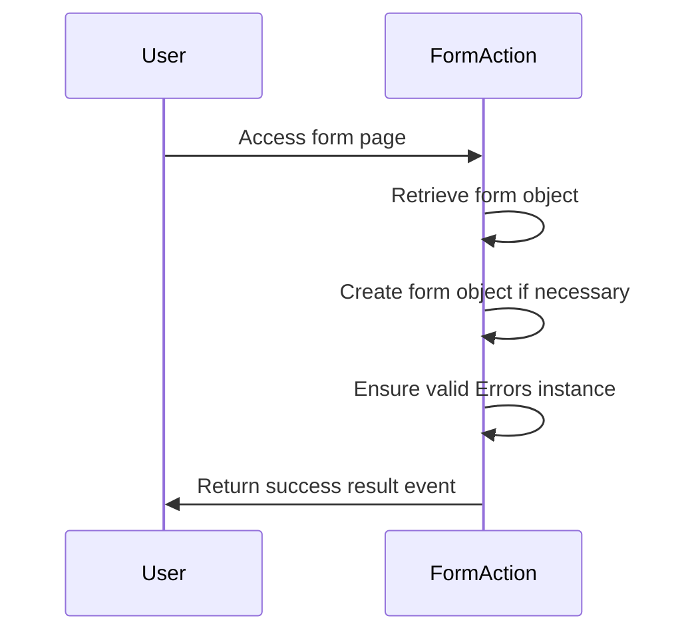
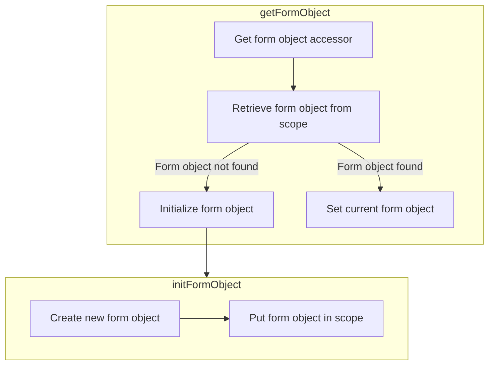

```mermaid
graph TD
  subgraph getFormErrors
    getFormErrors:A["Retrieve form object"] --> getFormErrors:B["Ensure form errors exposed"] --> getFormErrors:C["Get form object accessor"] --> getFormErrors:D["Fetch form errors"]
  end

%% Swimm:
%% graph TD
%%   subgraph <SwmToken path="spring-webflow/src/main/java/org/springframework/webflow/action/FormAction.java" pos="760:8:8" line-data="		return getFormObjectAccessor(context).getFormErrors(getFormObjectName(), getFormErrorsScope());">`getFormErrors`</SwmToken>
%%     <SwmToken path="spring-webflow/src/main/java/org/springframework/webflow/action/FormAction.java" pos="760:8:8" line-data="		return getFormObjectAccessor(context).getFormErrors(getFormObjectName(), getFormErrorsScope());">`getFormErrors`</SwmToken>:A["Retrieve form object"] --> <SwmToken path="spring-webflow/src/main/java/org/springframework/webflow/action/FormAction.java" pos="760:8:8" line-data="		return getFormObjectAccessor(context).getFormErrors(getFormObjectName(), getFormErrorsScope());">`getFormErrors`</SwmToken>:B["Ensure form errors exposed"] --> <SwmToken path="spring-webflow/src/main/java/org/springframework/webflow/action/FormAction.java" pos="760:8:8" line-data="		return getFormObjectAccessor(context).getFormErrors(getFormObjectName(), getFormErrorsScope());">`getFormErrors`</SwmToken>:C["Get form object accessor"] --> <SwmToken path="spring-webflow/src/main/java/org/springframework/webflow/action/FormAction.java" pos="760:8:8" line-data="		return getFormObjectAccessor(context).getFormErrors(getFormObjectName(), getFormErrorsScope());">`getFormErrors`</SwmToken>:D["Fetch form errors"]
%%   end
```

The <SwmToken path="spring-webflow/src/main/java/org/springframework/webflow/action/FormAction.java" pos="453:5:5" line-data="	public Event setupForm(RequestContext context) throws Exception {">`setupForm`</SwmToken> method is responsible for preparing a form object for display in a new form. This involves creating the form object and caching it if necessary, ensuring that the form object is always available for the form display.

For instance, when a user accesses a form page, the <SwmToken path="spring-webflow/src/main/java/org/springframework/webflow/action/FormAction.java" pos="453:5:5" line-data="	public Event setupForm(RequestContext context) throws Exception {">`setupForm`</SwmToken> method retrieves or creates the form object and ensures that any form validation errors are properly handled. This allows the form to be displayed with the necessary data and error handling mechanisms in place.



Here is a high level diagram of the flow, showing only the most important functions:

```mermaid
graph TD;
      subgraph springwebflowsrcmainjavaorgspringframeworkwebflowactionFormActionjava[spring-webflow/…/action/FormAction.java]
a830ee2210fee109fa9bb04a78f951413171fd7a2da50b9af32af63faf9259cd(FormAction.setupForm) --> 377b8e62607a0fc32afaf93c45d88df80ec99cb6aba5418b466fc30630932a0a(FormAction.ensureFormErrorsExposed)
end

subgraph springwebflowsrcmainjavaorgspringframeworkwebflowactionFormActionjava[spring-webflow/…/action/FormAction.java]
a830ee2210fee109fa9bb04a78f951413171fd7a2da50b9af32af63faf9259cd(FormAction.setupForm) --> 6c6ce227a63f1cd5a7d94e4f89ec1b9741689dc79e1670b01f2ef8577e2caf4b(FormAction.getFormObject)
end

subgraph springwebflowsrcmainjavaorgspringframeworkwebflowactionFormActionjava[spring-webflow/…/action/FormAction.java]
377b8e62607a0fc32afaf93c45d88df80ec99cb6aba5418b466fc30630932a0a(FormAction.ensureFormErrorsExposed) --> 141d34db928eb8434236af534960922eb1bb23b6960b20b6f6896ac5d6d51c39(FormAction.getFormErrors)
end

subgraph springwebflowsrcmainjavaorgspringframeworkwebflowactionFormActionjava[spring-webflow/…/action/FormAction.java]
377b8e62607a0fc32afaf93c45d88df80ec99cb6aba5418b466fc30630932a0a(FormAction.ensureFormErrorsExposed) --> 6d32fe9bd8413b9602ef96d0d00f4358afd2bbe9643f4b3f57f9a38b9c5ac13e(FormAction.initFormErrors)
end

subgraph springwebflowsrcmainjavaorgspringframeworkwebflowactionFormActionjava[spring-webflow/…/action/FormAction.java]
141d34db928eb8434236af534960922eb1bb23b6960b20b6f6896ac5d6d51c39(FormAction.getFormErrors) --> 377b8e62607a0fc32afaf93c45d88df80ec99cb6aba5418b466fc30630932a0a(FormAction.ensureFormErrorsExposed)
end

subgraph springwebflowsrcmainjavaorgspringframeworkwebflowactionFormActionjava[spring-webflow/…/action/FormAction.java]
141d34db928eb8434236af534960922eb1bb23b6960b20b6f6896ac5d6d51c39(FormAction.getFormErrors) --> 6c6ce227a63f1cd5a7d94e4f89ec1b9741689dc79e1670b01f2ef8577e2caf4b(FormAction.getFormObject)
end

subgraph springwebflowsrcmainjavaorgspringframeworkwebflowactionFormActionjava[spring-webflow/…/action/FormAction.java]
6c6ce227a63f1cd5a7d94e4f89ec1b9741689dc79e1670b01f2ef8577e2caf4b(FormAction.getFormObject) --> a9f23097a7e526f2fd739fc59db67a79e35c9acf3198c61ffaee09e645817e59(FormAction.initFormObject)
end


      classDef mainFlowStyle color:#000000,fill:#7CB9F4
classDef rootsStyle color:#000000,fill:#00FFF4
classDef Style1 color:#000000,fill:#00FFAA
classDef Style2 color:#000000,fill:#FFFF00
classDef Style3 color:#000000,fill:#AA7CB9

%% Swimm:
%% graph TD;
%%       subgraph springwebflowsrcmainjavaorgspringframeworkwebflowactionFormActionjava[<SwmPath>[spring-webflow/…/action/FormAction.java](spring-webflow/src/main/java/org/springframework/webflow/action/FormAction.java)</SwmPath>]
%% a830ee2210fee109fa9bb04a78f951413171fd7a2da50b9af32af63faf9259cd(FormAction.setupForm) --> 377b8e62607a0fc32afaf93c45d88df80ec99cb6aba5418b466fc30630932a0a(FormAction.ensureFormErrorsExposed)
%% end
%% 
%% subgraph springwebflowsrcmainjavaorgspringframeworkwebflowactionFormActionjava[<SwmPath>[spring-webflow/…/action/FormAction.java](spring-webflow/src/main/java/org/springframework/webflow/action/FormAction.java)</SwmPath>]
%% a830ee2210fee109fa9bb04a78f951413171fd7a2da50b9af32af63faf9259cd(FormAction.setupForm) --> 6c6ce227a63f1cd5a7d94e4f89ec1b9741689dc79e1670b01f2ef8577e2caf4b(FormAction.getFormObject)
%% end
%% 
%% subgraph springwebflowsrcmainjavaorgspringframeworkwebflowactionFormActionjava[<SwmPath>[spring-webflow/…/action/FormAction.java](spring-webflow/src/main/java/org/springframework/webflow/action/FormAction.java)</SwmPath>]
%% 377b8e62607a0fc32afaf93c45d88df80ec99cb6aba5418b466fc30630932a0a(FormAction.ensureFormErrorsExposed) --> 141d34db928eb8434236af534960922eb1bb23b6960b20b6f6896ac5d6d51c39(FormAction.getFormErrors)
%% end
%% 
%% subgraph springwebflowsrcmainjavaorgspringframeworkwebflowactionFormActionjava[<SwmPath>[spring-webflow/…/action/FormAction.java](spring-webflow/src/main/java/org/springframework/webflow/action/FormAction.java)</SwmPath>]
%% 377b8e62607a0fc32afaf93c45d88df80ec99cb6aba5418b466fc30630932a0a(FormAction.ensureFormErrorsExposed) --> 6d32fe9bd8413b9602ef96d0d00f4358afd2bbe9643f4b3f57f9a38b9c5ac13e(FormAction.initFormErrors)
%% end
%% 
%% subgraph springwebflowsrcmainjavaorgspringframeworkwebflowactionFormActionjava[<SwmPath>[spring-webflow/…/action/FormAction.java](spring-webflow/src/main/java/org/springframework/webflow/action/FormAction.java)</SwmPath>]
%% 141d34db928eb8434236af534960922eb1bb23b6960b20b6f6896ac5d6d51c39(FormAction.getFormErrors) --> 377b8e62607a0fc32afaf93c45d88df80ec99cb6aba5418b466fc30630932a0a(FormAction.ensureFormErrorsExposed)
%% end
%% 
%% subgraph springwebflowsrcmainjavaorgspringframeworkwebflowactionFormActionjava[<SwmPath>[spring-webflow/…/action/FormAction.java](spring-webflow/src/main/java/org/springframework/webflow/action/FormAction.java)</SwmPath>]
%% 141d34db928eb8434236af534960922eb1bb23b6960b20b6f6896ac5d6d51c39(FormAction.getFormErrors) --> 6c6ce227a63f1cd5a7d94e4f89ec1b9741689dc79e1670b01f2ef8577e2caf4b(FormAction.getFormObject)
%% end
%% 
%% subgraph springwebflowsrcmainjavaorgspringframeworkwebflowactionFormActionjava[<SwmPath>[spring-webflow/…/action/FormAction.java](spring-webflow/src/main/java/org/springframework/webflow/action/FormAction.java)</SwmPath>]
%% 6c6ce227a63f1cd5a7d94e4f89ec1b9741689dc79e1670b01f2ef8577e2caf4b(FormAction.getFormObject) --> a9f23097a7e526f2fd739fc59db67a79e35c9acf3198c61ffaee09e645817e59(FormAction.initFormObject)
%% end
%% 
%% 
%%       classDef mainFlowStyle color:#000000,fill:#7CB9F4
%% classDef rootsStyle color:#000000,fill:#00FFF4
%% classDef Style1 color:#000000,fill:#00FFAA
%% classDef Style2 color:#000000,fill:#FFFF00
%% classDef Style3 color:#000000,fill:#AA7CB9
```



# Flow drill down

```mermaid
graph TD
  subgraph setupForm
    setupForm:A["Retrieve the form object"] --> setupForm:B["Create form object if necessary"]
    setupForm:B --> setupForm:C["Ensure valid Errors instance"]
    setupForm:C --> setupForm:D["Return success result event"]
  end

%% Swimm:
%% graph TD
%%   subgraph <SwmToken path="spring-webflow/src/main/java/org/springframework/webflow/action/FormAction.java" pos="453:5:5" line-data="	public Event setupForm(RequestContext context) throws Exception {">`setupForm`</SwmToken>
%%     <SwmToken path="spring-webflow/src/main/java/org/springframework/webflow/action/FormAction.java" pos="453:5:5" line-data="	public Event setupForm(RequestContext context) throws Exception {">`setupForm`</SwmToken>:A["Retrieve the form object"] --> <SwmToken path="spring-webflow/src/main/java/org/springframework/webflow/action/FormAction.java" pos="453:5:5" line-data="	public Event setupForm(RequestContext context) throws Exception {">`setupForm`</SwmToken>:B["Create form object if necessary"]
%%     <SwmToken path="spring-webflow/src/main/java/org/springframework/webflow/action/FormAction.java" pos="453:5:5" line-data="	public Event setupForm(RequestContext context) throws Exception {">`setupForm`</SwmToken>:B --> <SwmToken path="spring-webflow/src/main/java/org/springframework/webflow/action/FormAction.java" pos="453:5:5" line-data="	public Event setupForm(RequestContext context) throws Exception {">`setupForm`</SwmToken>:C["Ensure valid Errors instance"]
%%     <SwmToken path="spring-webflow/src/main/java/org/springframework/webflow/action/FormAction.java" pos="453:5:5" line-data="	public Event setupForm(RequestContext context) throws Exception {">`setupForm`</SwmToken>:C --> <SwmToken path="spring-webflow/src/main/java/org/springframework/webflow/action/FormAction.java" pos="453:5:5" line-data="	public Event setupForm(RequestContext context) throws Exception {">`setupForm`</SwmToken>:D["Return success result event"]
%%   end
```

## Going into <SwmToken path="spring-webflow/src/main/java/org/springframework/webflow/action/FormAction.java" pos="453:5:5" line-data="	public Event setupForm(RequestContext context) throws Exception {">`setupForm`</SwmToken>



<SwmSnippet path="/spring-webflow/src/main/java/org/springframework/webflow/action/FormAction.java" line="453">

---

First, the <SwmToken path="spring-webflow/src/main/java/org/springframework/webflow/action/FormAction.java" pos="453:5:5" line-data="	public Event setupForm(RequestContext context) throws Exception {">`setupForm`</SwmToken> method is responsible for preparing a form object for display in a new form. This involves creating the form object and caching it if necessary. The method starts by logging the execution of the setup process for debugging purposes.

```java
	public Event setupForm(RequestContext context) throws Exception {
		if (logger.isDebugEnabled()) {
			logger.debug("Executing setupForm");
		}
```

---

</SwmSnippet>

<SwmSnippet path="/spring-webflow/src/main/java/org/springframework/webflow/action/FormAction.java" line="458">

---

Next, the method retrieves the form object by calling <SwmToken path="spring-webflow/src/main/java/org/springframework/webflow/action/FormAction.java" pos="458:7:7" line-data="		Object formObject = getFormObject(context);">`getFormObject`</SwmToken>. This function either returns the existing form object from the flow scope or creates a new instance if it is not found. This ensures that the form object is always available for the form display.

```java
		Object formObject = getFormObject(context);
```

---

</SwmSnippet>

<SwmSnippet path="/spring-webflow/src/main/java/org/springframework/webflow/action/FormAction.java" line="459">

---

Then, the method calls <SwmToken path="spring-webflow/src/main/java/org/springframework/webflow/action/FormAction.java" pos="459:1:1" line-data="		ensureFormErrorsExposed(context, formObject);">`ensureFormErrorsExposed`</SwmToken> to ensure that a valid <SwmToken path="spring-webflow/src/main/java/org/springframework/webflow/action/FormAction.java" pos="602:17:17" line-data="	 * Initialize a new form object {@link Errors errors} instance in the configured {@link #getFormErrorsScope() scope}">`Errors`</SwmToken> instance is available for the form object in the given context. This step is crucial for handling any form validation errors that might occur during user input.

```java
		ensureFormErrorsExposed(context, formObject);
```

---

</SwmSnippet>

<SwmSnippet path="/spring-webflow/src/main/java/org/springframework/webflow/action/FormAction.java" line="460">

---

Finally, the method returns a success event, indicating that the form setup process has been completed successfully. This allows the flow to proceed to the next step, confident that the form object and error handling mechanisms are in place.

```java
		return success();
	}
```

---

</SwmSnippet>

## Breaking down <SwmToken path="spring-webflow/src/main/java/org/springframework/webflow/action/FormAction.java" pos="459:1:1" line-data="		ensureFormErrorsExposed(context, formObject);">`ensureFormErrorsExposed`</SwmToken> & <SwmToken path="spring-webflow/src/main/java/org/springframework/webflow/action/FormAction.java" pos="608:5:5" line-data="	private Errors initFormErrors(RequestContext context, Object formObject) throws Exception {">`initFormErrors`</SwmToken>



```mermaid
graph TD
  subgraph ensureFormErrorsExposed
    ensureFormErrorsExposed:A["Check if form errors are exposed"] -->|No| ensureFormErrorsExposed:B["Initialize and expose form errors"]
    ensureFormErrorsExposed:A -->|Yes| ensureFormErrorsExposed:C["Check if form errors are valid"]
    ensureFormErrorsExposed:C -->|Yes| ensureFormErrorsExposed:D["Reapply property editors"]
    ensureFormErrorsExposed:C -->|No| ensureFormErrorsExposed:E["Log inconsistency"]
    ensureFormErrorsExposed:E --> ensureFormErrorsExposed:F["Get existing invalid errors"]
    ensureFormErrorsExposed:F --> ensureFormErrorsExposed:G["Initialize new form errors"]
    ensureFormErrorsExposed:G --> ensureFormErrorsExposed:H["Copy existing error information"]
  end
  subgraph initFormErrors
    initFormErrors:A["Log creation of new form errors"] --> initFormErrors:B["Create form errors"]
    initFormErrors:B --> initFormErrors:C["Store form errors"]
  end
  ensureFormErrorsExposed:B --> initFormErrors
  ensureFormErrorsExposed:G --> initFormErrors

%% Swimm:
%% graph TD
%%   subgraph <SwmToken path="spring-webflow/src/main/java/org/springframework/webflow/action/FormAction.java" pos="459:1:1" line-data="		ensureFormErrorsExposed(context, formObject);">`ensureFormErrorsExposed`</SwmToken>
%%     <SwmToken path="spring-webflow/src/main/java/org/springframework/webflow/action/FormAction.java" pos="459:1:1" line-data="		ensureFormErrorsExposed(context, formObject);">`ensureFormErrorsExposed`</SwmToken>:A["Check if form errors are exposed"] -->|No| <SwmToken path="spring-webflow/src/main/java/org/springframework/webflow/action/FormAction.java" pos="459:1:1" line-data="		ensureFormErrorsExposed(context, formObject);">`ensureFormErrorsExposed`</SwmToken>:B["Initialize and expose form errors"]
%%     <SwmToken path="spring-webflow/src/main/java/org/springframework/webflow/action/FormAction.java" pos="459:1:1" line-data="		ensureFormErrorsExposed(context, formObject);">`ensureFormErrorsExposed`</SwmToken>:A -->|Yes| <SwmToken path="spring-webflow/src/main/java/org/springframework/webflow/action/FormAction.java" pos="459:1:1" line-data="		ensureFormErrorsExposed(context, formObject);">`ensureFormErrorsExposed`</SwmToken>:C["Check if form errors are valid"]
%%     <SwmToken path="spring-webflow/src/main/java/org/springframework/webflow/action/FormAction.java" pos="459:1:1" line-data="		ensureFormErrorsExposed(context, formObject);">`ensureFormErrorsExposed`</SwmToken>:C -->|Yes| <SwmToken path="spring-webflow/src/main/java/org/springframework/webflow/action/FormAction.java" pos="459:1:1" line-data="		ensureFormErrorsExposed(context, formObject);">`ensureFormErrorsExposed`</SwmToken>:D["Reapply property editors"]
%%     <SwmToken path="spring-webflow/src/main/java/org/springframework/webflow/action/FormAction.java" pos="459:1:1" line-data="		ensureFormErrorsExposed(context, formObject);">`ensureFormErrorsExposed`</SwmToken>:C -->|No| <SwmToken path="spring-webflow/src/main/java/org/springframework/webflow/action/FormAction.java" pos="459:1:1" line-data="		ensureFormErrorsExposed(context, formObject);">`ensureFormErrorsExposed`</SwmToken>:E["Log inconsistency"]
%%     <SwmToken path="spring-webflow/src/main/java/org/springframework/webflow/action/FormAction.java" pos="459:1:1" line-data="		ensureFormErrorsExposed(context, formObject);">`ensureFormErrorsExposed`</SwmToken>:E --> <SwmToken path="spring-webflow/src/main/java/org/springframework/webflow/action/FormAction.java" pos="459:1:1" line-data="		ensureFormErrorsExposed(context, formObject);">`ensureFormErrorsExposed`</SwmToken>:F["Get existing invalid errors"]
%%     <SwmToken path="spring-webflow/src/main/java/org/springframework/webflow/action/FormAction.java" pos="459:1:1" line-data="		ensureFormErrorsExposed(context, formObject);">`ensureFormErrorsExposed`</SwmToken>:F --> <SwmToken path="spring-webflow/src/main/java/org/springframework/webflow/action/FormAction.java" pos="459:1:1" line-data="		ensureFormErrorsExposed(context, formObject);">`ensureFormErrorsExposed`</SwmToken>:G["Initialize new form errors"]
%%     <SwmToken path="spring-webflow/src/main/java/org/springframework/webflow/action/FormAction.java" pos="459:1:1" line-data="		ensureFormErrorsExposed(context, formObject);">`ensureFormErrorsExposed`</SwmToken>:G --> <SwmToken path="spring-webflow/src/main/java/org/springframework/webflow/action/FormAction.java" pos="459:1:1" line-data="		ensureFormErrorsExposed(context, formObject);">`ensureFormErrorsExposed`</SwmToken>:H["Copy existing error information"]
%%   end
%%   subgraph <SwmToken path="spring-webflow/src/main/java/org/springframework/webflow/action/FormAction.java" pos="608:5:5" line-data="	private Errors initFormErrors(RequestContext context, Object formObject) throws Exception {">`initFormErrors`</SwmToken>
%%     <SwmToken path="spring-webflow/src/main/java/org/springframework/webflow/action/FormAction.java" pos="608:5:5" line-data="	private Errors initFormErrors(RequestContext context, Object formObject) throws Exception {">`initFormErrors`</SwmToken>:A["Log creation of new form errors"] --> <SwmToken path="spring-webflow/src/main/java/org/springframework/webflow/action/FormAction.java" pos="608:5:5" line-data="	private Errors initFormErrors(RequestContext context, Object formObject) throws Exception {">`initFormErrors`</SwmToken>:B["Create form errors"]
%%     <SwmToken path="spring-webflow/src/main/java/org/springframework/webflow/action/FormAction.java" pos="608:5:5" line-data="	private Errors initFormErrors(RequestContext context, Object formObject) throws Exception {">`initFormErrors`</SwmToken>:B --> <SwmToken path="spring-webflow/src/main/java/org/springframework/webflow/action/FormAction.java" pos="608:5:5" line-data="	private Errors initFormErrors(RequestContext context, Object formObject) throws Exception {">`initFormErrors`</SwmToken>:C["Store form errors"]
%%   end
%%   <SwmToken path="spring-webflow/src/main/java/org/springframework/webflow/action/FormAction.java" pos="459:1:1" line-data="		ensureFormErrorsExposed(context, formObject);">`ensureFormErrorsExposed`</SwmToken>:B --> <SwmToken path="spring-webflow/src/main/java/org/springframework/webflow/action/FormAction.java" pos="608:5:5" line-data="	private Errors initFormErrors(RequestContext context, Object formObject) throws Exception {">`initFormErrors`</SwmToken>
%%   <SwmToken path="spring-webflow/src/main/java/org/springframework/webflow/action/FormAction.java" pos="459:1:1" line-data="		ensureFormErrorsExposed(context, formObject);">`ensureFormErrorsExposed`</SwmToken>:G --> <SwmToken path="spring-webflow/src/main/java/org/springframework/webflow/action/FormAction.java" pos="608:5:5" line-data="	private Errors initFormErrors(RequestContext context, Object formObject) throws Exception {">`initFormErrors`</SwmToken>
```

## Ensuring Form Errors Exposed

First, the <SwmToken path="spring-webflow/src/main/java/org/springframework/webflow/action/FormAction.java" pos="459:1:1" line-data="		ensureFormErrorsExposed(context, formObject);">`ensureFormErrorsExposed`</SwmToken> method ensures that a valid <SwmToken path="spring-webflow/src/main/java/org/springframework/webflow/action/FormAction.java" pos="602:17:17" line-data="	 * Initialize a new form object {@link Errors errors} instance in the configured {@link #getFormErrorsScope() scope}">`Errors`</SwmToken> instance for the given form object is exposed in the current request context. This is crucial for maintaining the integrity of form validation throughout the flow. If no errors are currently exposed, it initializes and exposes a fresh errors instance.

### Checking for Existing Errors

Moving to the next step, the method checks if form errors are already exposed using <SwmToken path="spring-webflow/src/main/java/org/springframework/webflow/action/FormAction.java" pos="631:5:5" line-data="		if (!formErrorsExposed(context)) {">`formErrorsExposed`</SwmToken>. If errors are not exposed, it calls <SwmToken path="spring-webflow/src/main/java/org/springframework/webflow/action/FormAction.java" pos="608:5:5" line-data="	private Errors initFormErrors(RequestContext context, Object formObject) throws Exception {">`initFormErrors`</SwmToken> to initialize a new errors instance.

### Validating Existing Errors

Next, if errors are already exposed, the method validates the existing errors instance with <SwmToken path="spring-webflow/src/main/java/org/springframework/webflow/action/FormAction.java" pos="637:4:4" line-data="			if (formErrorsValid(context, formObject)) {">`formErrorsValid`</SwmToken>. If the existing errors instance is valid, it re-applies property editors using <SwmToken path="spring-webflow/src/main/java/org/springframework/webflow/action/FormAction.java" pos="639:1:1" line-data="				reinstallPropertyEditors(context);">`reinstallPropertyEditors`</SwmToken>.

### Handling Invalid Errors

Then, if the existing errors instance is invalid, the method logs an informational message and initializes a new errors instance while copying over all existing error information. This ensures that any previous errors are not lost and the new instance is consistent.

<SwmSnippet path="/spring-webflow/src/main/java/org/springframework/webflow/action/FormAction.java" line="601">

---

Diving into the <SwmToken path="spring-webflow/src/main/java/org/springframework/webflow/action/FormAction.java" pos="608:5:5" line-data="	private Errors initFormErrors(RequestContext context, Object formObject) throws Exception {">`initFormErrors`</SwmToken> method, it initializes a new <SwmToken path="spring-webflow/src/main/java/org/springframework/webflow/action/FormAction.java" pos="602:17:17" line-data="	 * Initialize a new form object {@link Errors errors} instance in the configured {@link #getFormErrorsScope() scope}">`Errors`</SwmToken> instance for the given form object in the configured scope. This method also registers any property editors used to format form object property values, ensuring that the form data is correctly bound and validated.

```java
	/**
	 * Initialize a new form object {@link Errors errors} instance in the configured {@link #getFormErrorsScope() scope}
	 * . This method also registers any {@link PropertiesEditor property editors} used to format form object property
	 * values.
	 * @param context the current flow execution request context
	 * @param formObject the form object for which errors will be tracked
	 */
	private Errors initFormErrors(RequestContext context, Object formObject) throws Exception {
		if (logger.isDebugEnabled()) {
			logger.debug("Creating new form errors for object with name '" + getFormObjectName() + "'");
		}
		Errors errors = createBinder(context, formObject).getBindingResult();
		putFormErrors(context, errors);
		return errors;
	}
```

---

</SwmSnippet>

## Looking at <SwmToken path="spring-webflow/src/main/java/org/springframework/webflow/action/FormAction.java" pos="760:8:8" line-data="		return getFormObjectAccessor(context).getFormErrors(getFormObjectName(), getFormErrorsScope());">`getFormErrors`</SwmToken>



<SwmSnippet path="/spring-webflow/src/main/java/org/springframework/webflow/action/FormAction.java" line="746">

---

First, the <SwmToken path="spring-webflow/src/main/java/org/springframework/webflow/action/FormAction.java" pos="760:8:8" line-data="		return getFormObjectAccessor(context).getFormErrors(getFormObjectName(), getFormErrorsScope());">`getFormErrors`</SwmToken> method is responsible for retrieving the form object errors for a given form action. If the errors are not found in the configured scope, a new form object errors instance will be created, initialized, and exposed in the configured scope.

```java
	/**
	 * Convenience method that returns the form object errors for this form action. If not found in the configured
	 * scope, a new form object errors will be created, initialized, and exposed in the confgured
	 * {@link #getFormErrorsScope() scope}.
	 * <p>
	 * Keep in mind that an Errors instance wraps a form object, so a form object will also be created if required (see
	 * {@link #getFormObject(RequestContext)}).
	 * @param context the flow request context
	 * @return the form errors
	 * @throws Exception when an unrecoverable exception occurs
	 */
```

---

</SwmSnippet>

<SwmSnippet path="/spring-webflow/src/main/java/org/springframework/webflow/action/FormAction.java" line="758">

---

Next, the method calls <SwmToken path="spring-webflow/src/main/java/org/springframework/webflow/action/FormAction.java" pos="758:7:7" line-data="		Object formObject = getFormObject(context);">`getFormObject`</SwmToken> to return the form object from the flow scope or create a new instance if not found. This ensures that the form object is always available for error handling.

```java
		Object formObject = getFormObject(context);
```

---

</SwmSnippet>

<SwmSnippet path="/spring-webflow/src/main/java/org/springframework/webflow/action/FormAction.java" line="759">

---

Then, the <SwmToken path="spring-webflow/src/main/java/org/springframework/webflow/action/FormAction.java" pos="759:1:1" line-data="		ensureFormErrorsExposed(context, formObject);">`ensureFormErrorsExposed`</SwmToken> method is called to ensure that a valid <SwmToken path="spring-webflow/src/main/java/org/springframework/webflow/action/FormAction.java" pos="602:17:17" line-data="	 * Initialize a new form object {@link Errors errors} instance in the configured {@link #getFormErrorsScope() scope}">`Errors`</SwmToken> instance is available for the form object in the given context. This step is crucial for maintaining the integrity of form validation.

```java
		ensureFormErrorsExposed(context, formObject);
```

---

</SwmSnippet>

<SwmSnippet path="/spring-webflow/src/main/java/org/springframework/webflow/action/FormAction.java" line="760">

---

Finally, the method retrieves the form errors using the <SwmToken path="spring-webflow/src/main/java/org/springframework/webflow/action/FormAction.java" pos="760:3:3" line-data="		return getFormObjectAccessor(context).getFormErrors(getFormObjectName(), getFormErrorsScope());">`getFormObjectAccessor`</SwmToken>, which creates and returns an accessor for form objects in the provided request context. This accessor is then used to get the form errors from the configured scope.

```java
		return getFormObjectAccessor(context).getFormErrors(getFormObjectName(), getFormErrorsScope());
	}
```

---

</SwmSnippet>

## Looking at <SwmToken path="spring-webflow/src/main/java/org/springframework/webflow/action/FormAction.java" pos="458:7:7" line-data="		Object formObject = getFormObject(context);">`getFormObject`</SwmToken> & <SwmToken path="spring-webflow/src/main/java/org/springframework/webflow/action/FormAction.java" pos="735:5:5" line-data="			formObject = initFormObject(context);">`initFormObject`</SwmToken>



<SwmSnippet path="/spring-webflow/src/main/java/org/springframework/webflow/action/FormAction.java" line="731">

---

First, the <SwmToken path="spring-webflow/src/main/java/org/springframework/webflow/action/FormAction.java" pos="731:5:5" line-data="	protected Object getFormObject(RequestContext context) throws Exception {">`getFormObject`</SwmToken> method is responsible for retrieving the form object from the flow scope. If the form object is not found, it proceeds to create a new instance. This ensures that the form object is always available for the user session.

```java
	protected Object getFormObject(RequestContext context) throws Exception {
		FormObjectAccessor accessor = getFormObjectAccessor(context);
		Object formObject = accessor.getFormObject(getFormObjectName(), getFormObjectScope());
		if (formObject == null) {
			formObject = initFormObject(context);
		} else {
			if (logger.isDebugEnabled()) {
				logger.debug("Found existing form object with name '" + getFormObjectName() + "' of type ["
						+ formObject.getClass() + "] in scope " + getFormObjectScope());
			}
			accessor.setCurrentFormObject(formObject, getFormObjectScope());
		}
		return formObject;
	}
```

---

</SwmSnippet>

&nbsp;

*This is an auto-generated document by Swimm 🌊 and has not yet been verified by a human*

<SwmMeta version="3.0.0" repo-id="Z2l0aHViJTNBJTNBc3ByaW5nLXdlYmZsb3ctZGVtbyUzQSUzQWdpbGFkbmF2b3Q=" repo-name="spring-webflow-demo"><sup>Powered by [Swimm](/)</sup></SwmMeta>
