This document explains the flow of handling actions within a state in a web flow. The <SwmToken path="spring-webflow/src/main/java/org/springframework/webflow/engine/ActionState.java" pos="85:14:14" line-data="	 * Specialization of State&#39;s &lt;code&gt;doEnter&lt;/code&gt; template method that executes behavior specific to this state type">`doEnter`</SwmToken> method is responsible for executing a series of actions associated with a state and determining the next state based on the results of these actions.

For example, if a user initiates a checkout process, the <SwmToken path="spring-webflow/src/main/java/org/springframework/webflow/engine/ActionState.java" pos="85:14:14" line-data="	 * Specialization of State&#39;s &lt;code&gt;doEnter&lt;/code&gt; template method that executes behavior specific to this state type">`doEnter`</SwmToken> method will execute actions such as validating the user's cart, checking inventory, and processing payment. Each action's result will determine the next step in the flow, such as moving to a confirmation page or displaying an error message.


Here is a high level diagram of the flow, showing only the most important functions:

```mermaid
graph TD;
      subgraph springwebflowsrcmainjavaorgspringframeworkwebflowengine[spring-webflow/…/webflow/engine]
b4ba369b79f2c6711e66e834ffb6bbc39070b63f15356a8e982f24366baf2b02(ActionState.doEnter) --> 09ddc03021736b74a90ad6759e2b84ddb67c85045ed89dcc4574f8c832493798(SubflowState.handleEvent)
end

subgraph springwebflowsrcmainjavaorgspringframeworkwebflowengine[spring-webflow/…/webflow/engine]
09ddc03021736b74a90ad6759e2b84ddb67c85045ed89dcc4574f8c832493798(SubflowState.handleEvent) --> 84cb84d946ddd7004196bda2d0b62ad3160adc7a3f3cbab3270ba93fd3ebd9f1(GenericSubflowAttributeMapper.mapSubflowOutput)
end


      classDef mainFlowStyle color:#000000,fill:#7CB9F4
classDef rootsStyle color:#000000,fill:#00FFF4
classDef Style1 color:#000000,fill:#00FFAA
classDef Style2 color:#000000,fill:#FFFF00
classDef Style3 color:#000000,fill:#AA7CB9

%% Swimm:
%% graph TD;
%%       subgraph springwebflowsrcmainjavaorgspringframeworkwebflowengine[<SwmPath>[spring-webflow/…/webflow/engine/](spring-webflow/src/main/java/org/springframework/webflow/engine/)</SwmPath>]
%% b4ba369b79f2c6711e66e834ffb6bbc39070b63f15356a8e982f24366baf2b02(ActionState.doEnter) --> 09ddc03021736b74a90ad6759e2b84ddb67c85045ed89dcc4574f8c832493798(SubflowState.handleEvent)
%% end
%% 
%% subgraph springwebflowsrcmainjavaorgspringframeworkwebflowengine[<SwmPath>[spring-webflow/…/webflow/engine/](spring-webflow/src/main/java/org/springframework/webflow/engine/)</SwmPath>]
%% 09ddc03021736b74a90ad6759e2b84ddb67c85045ed89dcc4574f8c832493798(SubflowState.handleEvent) --> 84cb84d946ddd7004196bda2d0b62ad3160adc7a3f3cbab3270ba93fd3ebd9f1(GenericSubflowAttributeMapper.mapSubflowOutput)
%% end
%% 
%% 
%%       classDef mainFlowStyle color:#000000,fill:#7CB9F4
%% classDef rootsStyle color:#000000,fill:#00FFF4
%% classDef Style1 color:#000000,fill:#00FFAA
%% classDef Style2 color:#000000,fill:#FFFF00
%% classDef Style3 color:#000000,fill:#AA7CB9
```



# Flow drill down

## Breaking down <SwmToken path="spring-webflow/src/main/java/org/springframework/webflow/engine/ActionState.java" pos="85:14:14" line-data="	 * Specialization of State&#39;s &lt;code&gt;doEnter&lt;/code&gt; template method that executes behavior specific to this state type">`doEnter`</SwmToken>


<SwmSnippet path="/spring-webflow/src/main/java/org/springframework/webflow/engine/ActionState.java" line="99">

---

First, the <SwmToken path="spring-webflow/src/main/java/org/springframework/webflow/engine/ActionState.java" pos="85:14:14" line-data="	 * Specialization of State&#39;s &lt;code&gt;doEnter&lt;/code&gt; template method that executes behavior specific to this state type">`doEnter`</SwmToken> method iterates over each configured action instance. This is crucial as it ensures that all actions associated with the current state are executed in sequence. Each action is executed until one returns a result event that matches a transition in the current request context or until all actions are exhausted.

```java
		while (it.hasNext()) {
			Action action = it.next();
```

---

</SwmSnippet>

<SwmSnippet path="/spring-webflow/src/main/java/org/springframework/webflow/engine/ActionState.java" line="101">

---

Next, if an action returns a non-null event, the method attempts to handle this event by calling <SwmToken path="spring-webflow/src/main/java/org/springframework/webflow/engine/ActionState.java" pos="105:1:6" line-data="					context.handleEvent(event);">`context.handleEvent(event)`</SwmToken>. This step is critical as it determines the flow's next state based on the event returned by the action. If no matching transition is found for the event, the method logs this and proceeds to the next action.

```java
			Event event = ActionExecutor.execute(action, context);
			if (event != null) {
				eventIds[executionCount] = event.getId();
				try {
					context.handleEvent(event);
					return;
```

---

</SwmSnippet>

<SwmSnippet path="/spring-webflow/src/main/java/org/springframework/webflow/engine/ActionState.java" line="118">

---

Then, if an action returns a null event, the method logs this occurrence and proceeds to the next action in the list. This ensures that the flow does not halt unexpectedly and continues to evaluate subsequent actions.

```java
			} else {
				if (logger.isDebugEnabled()) {
					logger.debug("Action execution ["
							+ (executionCount + 1)
							+ "] returned a [null] event"
							+ (it.hasNext() ? ": proceeding to the next action in the list" : ": action list exhausted"));
				}
				eventIds[executionCount] = null;
			}
```

---

</SwmSnippet>

<SwmSnippet path="/spring-webflow/src/main/java/org/springframework/webflow/engine/ActionState.java" line="129">

---

Finally, if no actions result in a matching transition, the method throws a <SwmToken path="spring-webflow/src/main/java/org/springframework/webflow/engine/ActionState.java" pos="130:5:5" line-data="			throw new NoMatchingTransitionException(getFlow().getId(), getId(), context.getCurrentEvent(),">`NoMatchingTransitionException`</SwmToken>. This exception indicates a potential configuration error in the flow, as transitions must be defined to handle the outcomes of actions. This step ensures that the flow's configuration is validated and any issues are promptly identified.

```java
		if (executionCount > 0) {
			throw new NoMatchingTransitionException(getFlow().getId(), getId(), context.getCurrentEvent(),
					"No transition was matched on the event(s) signaled by the [" + executionCount
							+ "] action(s) that executed in this action state '" + getId() + "' of flow '"
							+ getFlow().getId() + "'; transitions must be defined to handle action result outcomes -- "
							+ "possible flow configuration error? Note: the eventIds signaled were: '"
							+ StylerUtils.style(eventIds)
							+ "', while the supported set of transitional criteria for this action state is '"
							+ StylerUtils.style(getTransitionSet().getTransitionCriterias()) + "'");
```

---

</SwmSnippet>

## Going into <SwmToken path="spring-webflow/src/main/java/org/springframework/webflow/engine/ActionState.java" pos="105:3:3" line-data="					context.handleEvent(event);">`handleEvent`</SwmToken> & <SwmToken path="spring-webflow/src/main/java/org/springframework/webflow/engine/SubflowState.java" pos="114:3:3" line-data="			subflowAttributeMapper.mapSubflowOutput(subflowOutput, context);">`mapSubflowOutput`</SwmToken>


<SwmSnippet path="/spring-webflow/src/main/java/org/springframework/webflow/engine/SubflowState.java" line="108">

---

First, the <SwmToken path="spring-webflow/src/main/java/org/springframework/webflow/engine/SubflowState.java" pos="108:5:5" line-data="	public boolean handleEvent(RequestControlContext context) {">`handleEvent`</SwmToken> method is called upon the completion of a subflow. This method is responsible for handling the subflow result event based on the end state reached by the subflow.

```java
	public boolean handleEvent(RequestControlContext context) {
		if (subflowAttributeMapper != null) {
			AttributeMap<Object> subflowOutput = context.getCurrentEvent().getAttributes();
			if (logger.isDebugEnabled()) {
				logger.debug("Mapping subflow output " + subflowOutput);
			}
			subflowAttributeMapper.mapSubflowOutput(subflowOutput, context);
		}
		return super.handleEvent(context);
	}
```

---

</SwmSnippet>

<SwmSnippet path="/spring-webflow/src/main/java/org/springframework/webflow/engine/SubflowState.java" line="109">

---

Next, within the <SwmToken path="spring-webflow/src/main/java/org/springframework/webflow/engine/ActionState.java" pos="105:3:3" line-data="					context.handleEvent(event);">`handleEvent`</SwmToken> method, if a subflow attribute mapper is present, the method retrieves the attributes of the current event and maps the subflow output to the context. This ensures that the results of the subflow are correctly integrated into the parent flow.

```java
		if (subflowAttributeMapper != null) {
			AttributeMap<Object> subflowOutput = context.getCurrentEvent().getAttributes();
			if (logger.isDebugEnabled()) {
				logger.debug("Mapping subflow output " + subflowOutput);
			}
			subflowAttributeMapper.mapSubflowOutput(subflowOutput, context);
		}
```

---

</SwmSnippet>

<SwmSnippet path="/spring-webflow/src/main/java/org/springframework/webflow/engine/support/GenericSubflowAttributeMapper.java" line="66">

---

Then, the <SwmToken path="spring-webflow/src/main/java/org/springframework/webflow/engine/support/GenericSubflowAttributeMapper.java" pos="66:5:5" line-data="	public void mapSubflowOutput(AttributeMap&lt;?&gt; output, RequestContext context) {">`mapSubflowOutput`</SwmToken> method in the <SwmToken path="spring-webflow/src/main/java/org/springframework/webflow/engine/support/GenericSubflowAttributeMapper.java" pos="36:6:6" line-data="public final class GenericSubflowAttributeMapper implements SubflowAttributeMapper, Serializable {">`GenericSubflowAttributeMapper`</SwmToken> class is invoked to map the subflow output to the context. This method checks for any errors during the mapping process and throws a <SwmToken path="spring-webflow/src/main/java/org/springframework/webflow/engine/support/GenericSubflowAttributeMapper.java" pos="70:5:5" line-data="				throw new FlowOutputMappingException(context.getActiveFlow().getId(),">`FlowOutputMappingException`</SwmToken> if any errors are found, ensuring that the flow can handle such issues gracefully.

```java
	public void mapSubflowOutput(AttributeMap<?> output, RequestContext context) {
		if (outputMapper != null && output != null) {
			MappingResults results = outputMapper.map(output, context);
			if (results != null && results.hasErrorResults()) {
				throw new FlowOutputMappingException(context.getActiveFlow().getId(),
						context.getCurrentState().getId(), results);
			}
		}
	}
```

---

</SwmSnippet>

&nbsp;

*This is an auto-generated document by Swimm 🌊 and has not yet been verified by a human*

<SwmMeta version="3.0.0" repo-id="Z2l0aHViJTNBJTNBc3ByaW5nLXdlYmZsb3ctZGVtbyUzQSUzQWdpbGFkbmF2b3Q=" repo-name="spring-webflow-demo"><sup>Powered by [Swimm](/)</sup></SwmMeta>
