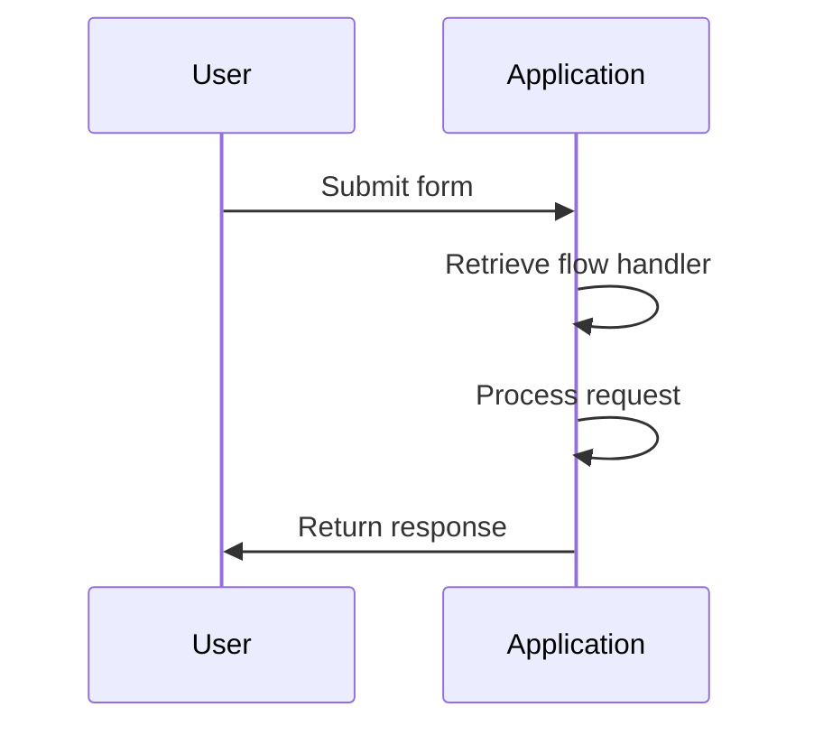
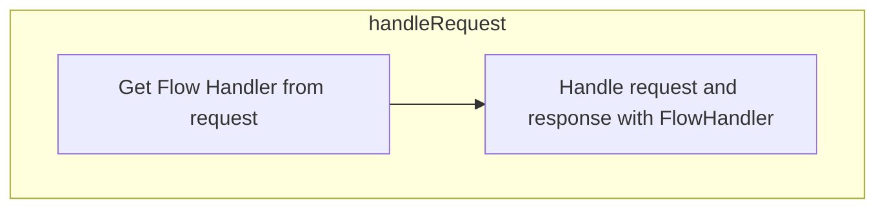
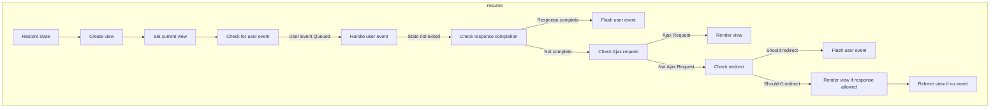

This document explains the flow of handling HTTP requests within the application. The <SwmToken path="spring-webflow/src/main/java/org/springframework/webflow/mvc/servlet/FlowController.java" pos="172:5:5" line-data="	public ModelAndView handleRequest(HttpServletRequest request, HttpServletResponse response) throws Exception {">`handleRequest`</SwmToken> method is responsible for managing incoming HTTP requests by retrieving the appropriate flow handler and delegating the request processing to the <SwmToken path="spring-webflow/src/main/java/org/springframework/webflow/mvc/servlet/FlowController.java" pos="174:3:3" line-data="		return flowHandlerAdapter.handle(request, response, handler);">`flowHandlerAdapter`</SwmToken>.

For example, when a user submits a form, the <SwmToken path="spring-webflow/src/main/java/org/springframework/webflow/mvc/servlet/FlowController.java" pos="172:5:5" line-data="	public ModelAndView handleRequest(HttpServletRequest request, HttpServletResponse response) throws Exception {">`handleRequest`</SwmToken> method retrieves the corresponding flow handler and processes the request, either resuming an existing flow or starting a new one.



Here is a high level diagram of the flow, showing only the most important functions:

```mermaid
graph TD;
      subgraph springwebflowsrcmainjavaorgspringframeworkwebflowmvcservlet[spring-webflow/…/mvc/servlet]
d622d0d89996d09f9ea5920841d868d1d4daf94d36b868296ae0656016cb3a0c(FlowController.handleRequest) --> ba8bb96f325863428b63563cdf7c3ae6d1a50f3c1f91a68263946b3e474a2c19(FlowHandlerAdapter.handle)
end

subgraph springwebflowsrcmainjavaorgspringframeworkwebflowmvcservlet[spring-webflow/…/mvc/servlet]
ba8bb96f325863428b63563cdf7c3ae6d1a50f3c1f91a68263946b3e474a2c19(FlowHandlerAdapter.handle) --> 46b2b7bc8d3d51a1665865e92b25805e777d509309ccf53700628413b8a7f4b5(FlowHandlerAdapter.handleFlowExecutionResult)
end

subgraph springwebflowsrcmainjavaorgspringframeworkwebflow[spring-webflow/…/springframework/webflow]
ba8bb96f325863428b63563cdf7c3ae6d1a50f3c1f91a68263946b3e474a2c19(FlowHandlerAdapter.handle) --> 4ee67cd0c3763b2985bd8df81cc68107a6c25b748fd9104aede47214bf21ec9d(FlowExecutorImpl.resumeExecution)
end

subgraph springwebflowsrcmainjavaorgspringframeworkwebflowmvcservlet[spring-webflow/…/mvc/servlet]
ba8bb96f325863428b63563cdf7c3ae6d1a50f3c1f91a68263946b3e474a2c19(FlowHandlerAdapter.handle) --> ea97985d7749b08bc02da6974aefad34becf200d9c523f9e4a4cf539a8c39446(FlowHandlerAdapter.handleFlowException)
end

subgraph springwebflowsrcmainjavaorgspringframeworkwebflowmvcservlet[spring-webflow/…/mvc/servlet]
46b2b7bc8d3d51a1665865e92b25805e777d509309ccf53700628413b8a7f4b5(FlowHandlerAdapter.handleFlowExecutionResult) --> 9d1b94ca299d0c4d9f18b11e172d23582012ca6c780cfa29d5b5ee2814bc4150(FlowHandlerAdapter.sendExternalRedirect)
end

subgraph springwebflowsrcmainjavaorgspringframeworkwebflowmvcservlet[spring-webflow/…/mvc/servlet]
46b2b7bc8d3d51a1665865e92b25805e777d509309ccf53700628413b8a7f4b5(FlowHandlerAdapter.handleFlowExecutionResult) --> 9813660db4d889007621d60ee154e315ebf4f199123d47ffbb0c897e0c9c8701(FlowHandlerAdapter.sendFlowDefinitionRedirect)
end

subgraph springwebflowsrcmainjavaorgspringframeworkwebflowmvcservlet[spring-webflow/…/mvc/servlet]
9d1b94ca299d0c4d9f18b11e172d23582012ca6c780cfa29d5b5ee2814bc4150(FlowHandlerAdapter.sendExternalRedirect) --> 9d1b94ca299d0c4d9f18b11e172d23582012ca6c780cfa29d5b5ee2814bc4150(FlowHandlerAdapter.sendExternalRedirect)
end

subgraph springwebflowsrcmainjavaorgspringframeworkwebflow[spring-webflow/…/springframework/webflow]
4ee67cd0c3763b2985bd8df81cc68107a6c25b748fd9104aede47214bf21ec9d(FlowExecutorImpl.resumeExecution) --> 5e10350017bed4c54b27cdb841d3b1a99c82cd02ac6a9a81b61b508e00076b70(ViewState.resume)
end

subgraph springwebflowsrcmainjavaorgspringframeworkwebflowmvcservlet[spring-webflow/…/mvc/servlet]
ea97985d7749b08bc02da6974aefad34becf200d9c523f9e4a4cf539a8c39446(FlowHandlerAdapter.handleFlowException) --> 9d1b94ca299d0c4d9f18b11e172d23582012ca6c780cfa29d5b5ee2814bc4150(FlowHandlerAdapter.sendExternalRedirect)
end


      classDef mainFlowStyle color:#000000,fill:#7CB9F4
classDef rootsStyle color:#000000,fill:#00FFF4
classDef Style1 color:#000000,fill:#00FFAA
classDef Style2 color:#000000,fill:#FFFF00
classDef Style3 color:#000000,fill:#AA7CB9

%% Swimm:
%% graph TD;
%%       subgraph springwebflowsrcmainjavaorgspringframeworkwebflowmvcservlet[<SwmPath>[spring-webflow/…/mvc/servlet/](spring-webflow/src/main/java/org/springframework/webflow/mvc/servlet/)</SwmPath>]
%% d622d0d89996d09f9ea5920841d868d1d4daf94d36b868296ae0656016cb3a0c(FlowController.handleRequest) --> ba8bb96f325863428b63563cdf7c3ae6d1a50f3c1f91a68263946b3e474a2c19(FlowHandlerAdapter.handle)
%% end
%% 
%% subgraph springwebflowsrcmainjavaorgspringframeworkwebflowmvcservlet[<SwmPath>[spring-webflow/…/mvc/servlet/](spring-webflow/src/main/java/org/springframework/webflow/mvc/servlet/)</SwmPath>]
%% ba8bb96f325863428b63563cdf7c3ae6d1a50f3c1f91a68263946b3e474a2c19(FlowHandlerAdapter.handle) --> 46b2b7bc8d3d51a1665865e92b25805e777d509309ccf53700628413b8a7f4b5(FlowHandlerAdapter.handleFlowExecutionResult)
%% end
%% 
%% subgraph springwebflowsrcmainjavaorgspringframeworkwebflow[<SwmPath>[spring-webflow/…/springframework/webflow/](spring-webflow/src/main/java/org/springframework/webflow/)</SwmPath>]
%% ba8bb96f325863428b63563cdf7c3ae6d1a50f3c1f91a68263946b3e474a2c19(FlowHandlerAdapter.handle) --> 4ee67cd0c3763b2985bd8df81cc68107a6c25b748fd9104aede47214bf21ec9d(FlowExecutorImpl.resumeExecution)
%% end
%% 
%% subgraph springwebflowsrcmainjavaorgspringframeworkwebflowmvcservlet[<SwmPath>[spring-webflow/…/mvc/servlet/](spring-webflow/src/main/java/org/springframework/webflow/mvc/servlet/)</SwmPath>]
%% ba8bb96f325863428b63563cdf7c3ae6d1a50f3c1f91a68263946b3e474a2c19(FlowHandlerAdapter.handle) --> ea97985d7749b08bc02da6974aefad34becf200d9c523f9e4a4cf539a8c39446(FlowHandlerAdapter.handleFlowException)
%% end
%% 
%% subgraph springwebflowsrcmainjavaorgspringframeworkwebflowmvcservlet[<SwmPath>[spring-webflow/…/mvc/servlet/](spring-webflow/src/main/java/org/springframework/webflow/mvc/servlet/)</SwmPath>]
%% 46b2b7bc8d3d51a1665865e92b25805e777d509309ccf53700628413b8a7f4b5(FlowHandlerAdapter.handleFlowExecutionResult) --> 9d1b94ca299d0c4d9f18b11e172d23582012ca6c780cfa29d5b5ee2814bc4150(FlowHandlerAdapter.sendExternalRedirect)
%% end
%% 
%% subgraph springwebflowsrcmainjavaorgspringframeworkwebflowmvcservlet[<SwmPath>[spring-webflow/…/mvc/servlet/](spring-webflow/src/main/java/org/springframework/webflow/mvc/servlet/)</SwmPath>]
%% 46b2b7bc8d3d51a1665865e92b25805e777d509309ccf53700628413b8a7f4b5(FlowHandlerAdapter.handleFlowExecutionResult) --> 9813660db4d889007621d60ee154e315ebf4f199123d47ffbb0c897e0c9c8701(FlowHandlerAdapter.sendFlowDefinitionRedirect)
%% end
%% 
%% subgraph springwebflowsrcmainjavaorgspringframeworkwebflowmvcservlet[<SwmPath>[spring-webflow/…/mvc/servlet/](spring-webflow/src/main/java/org/springframework/webflow/mvc/servlet/)</SwmPath>]
%% 9d1b94ca299d0c4d9f18b11e172d23582012ca6c780cfa29d5b5ee2814bc4150(FlowHandlerAdapter.sendExternalRedirect) --> 9d1b94ca299d0c4d9f18b11e172d23582012ca6c780cfa29d5b5ee2814bc4150(FlowHandlerAdapter.sendExternalRedirect)
%% end
%% 
%% subgraph springwebflowsrcmainjavaorgspringframeworkwebflow[<SwmPath>[spring-webflow/…/springframework/webflow/](spring-webflow/src/main/java/org/springframework/webflow/)</SwmPath>]
%% 4ee67cd0c3763b2985bd8df81cc68107a6c25b748fd9104aede47214bf21ec9d(FlowExecutorImpl.resumeExecution) --> 5e10350017bed4c54b27cdb841d3b1a99c82cd02ac6a9a81b61b508e00076b70(ViewState.resume)
%% end
%% 
%% subgraph springwebflowsrcmainjavaorgspringframeworkwebflowmvcservlet[<SwmPath>[spring-webflow/…/mvc/servlet/](spring-webflow/src/main/java/org/springframework/webflow/mvc/servlet/)</SwmPath>]
%% ea97985d7749b08bc02da6974aefad34becf200d9c523f9e4a4cf539a8c39446(FlowHandlerAdapter.handleFlowException) --> 9d1b94ca299d0c4d9f18b11e172d23582012ca6c780cfa29d5b5ee2814bc4150(FlowHandlerAdapter.sendExternalRedirect)
%% end
%% 
%% 
%%       classDef mainFlowStyle color:#000000,fill:#7CB9F4
%% classDef rootsStyle color:#000000,fill:#00FFF4
%% classDef Style1 color:#000000,fill:#00FFAA
%% classDef Style2 color:#000000,fill:#FFFF00
%% classDef Style3 color:#000000,fill:#AA7CB9
```



# Flow drill down

## Going into <SwmToken path="spring-webflow/src/main/java/org/springframework/webflow/mvc/servlet/FlowController.java" pos="172:5:5" line-data="	public ModelAndView handleRequest(HttpServletRequest request, HttpServletResponse response) throws Exception {">`handleRequest`</SwmToken>



<SwmSnippet path="/spring-webflow/src/main/java/org/springframework/webflow/mvc/servlet/FlowController.java" line="172">

---

First, the <SwmToken path="spring-webflow/src/main/java/org/springframework/webflow/mvc/servlet/FlowController.java" pos="172:5:5" line-data="	public ModelAndView handleRequest(HttpServletRequest request, HttpServletResponse response) throws Exception {">`handleRequest`</SwmToken> method is responsible for managing incoming HTTP requests. It retrieves the appropriate flow handler for the request, which is essential for determining how the request should be processed.

```java
	public ModelAndView handleRequest(HttpServletRequest request, HttpServletResponse response) throws Exception {
		FlowHandler handler = getFlowHandler(request);
```

---

</SwmSnippet>

<SwmSnippet path="/spring-webflow/src/main/java/org/springframework/webflow/mvc/servlet/FlowController.java" line="174">

---

Next, the method delegates the handling of the request to the <SwmToken path="spring-webflow/src/main/java/org/springframework/webflow/mvc/servlet/FlowController.java" pos="174:3:5" line-data="		return flowHandlerAdapter.handle(request, response, handler);">`flowHandlerAdapter.handle`</SwmToken> method. This step is crucial as it decides whether to resume an existing flow execution or to launch a new one based on the presence of a flow execution key in the request.

```java
		return flowHandlerAdapter.handle(request, response, handler);
	}
```

---

</SwmSnippet>

## Breaking down handle

```mermaid
graph TD
  subgraph handle
    handle:A["Cast handler to FlowHandler"] --> handle:B["Check the request"]
    handle:B --> handle:C["Prepare the response"]
    handle:C --> handle:D["Get flow execution key from URL handler"]
    handle:D --> handle:E{flowExecutionKey != null}
    handle:E -->|Yes| handle:F["Create ServletExternalContext"]
    handle:F --> handle:G["Resume Flow Execution"]
    handle:G --> handle:H["Handle Flow Execution Result"]
    handle:E -->|No| handle:I["Get flow id"]
    handle:I --> handle:J["Get input map"]
    handle:J --> handle:K["Create ServletExternalContext"]
    handle:K --> handle:L["Launch flow execution"]
    handle:L --> handle:H["Handle Flow Execution Result"]
  end

%% Swimm:
%% graph TD
%%   subgraph handle
%%     handle:A["Cast handler to <SwmToken path="spring-webflow/src/main/java/org/springframework/webflow/mvc/servlet/FlowController.java" pos="173:1:1" line-data="		FlowHandler handler = getFlowHandler(request);">`FlowHandler`</SwmToken>"] --> handle:B["Check the request"]
%%     handle:B --> handle:C["Prepare the response"]
%%     handle:C --> handle:D["Get flow execution key from URL handler"]
%%     handle:D --> handle:E{flowExecutionKey != null}
%%     handle:E -->|Yes| handle:F["Create <SwmToken path="spring-webflow/src/main/java/org/springframework/webflow/mvc/servlet/FlowHandlerAdapter.java" pos="253:1:1" line-data="				ServletExternalContext context = createServletExternalContext(request, response);">`ServletExternalContext`</SwmToken>"]
%%     handle:F --> handle:G["Resume Flow Execution"]
%%     handle:G --> handle:H["Handle Flow Execution Result"]
%%     handle:E -->|No| handle:I["Get flow id"]
%%     handle:I --> handle:J["Get input map"]
%%     handle:J --> handle:K["Create <SwmToken path="spring-webflow/src/main/java/org/springframework/webflow/mvc/servlet/FlowHandlerAdapter.java" pos="253:1:1" line-data="				ServletExternalContext context = createServletExternalContext(request, response);">`ServletExternalContext`</SwmToken>"]
%%     handle:K --> handle:L["Launch flow execution"]
%%     handle:L --> handle:H["Handle Flow Execution Result"]
%%   end
```



<SwmSnippet path="/spring-webflow/src/main/java/org/springframework/webflow/mvc/servlet/FlowHandlerAdapter.java" line="250">

---

First, the <SwmToken path="spring-webflow/src/main/java/org/springframework/webflow/mvc/servlet/FlowController.java" pos="174:5:5" line-data="		return flowHandlerAdapter.handle(request, response, handler);">`handle`</SwmToken> method checks if there is a flow execution key in the request. If a key is present, it attempts to resume the flow execution using the <SwmToken path="spring-webflow/src/main/java/org/springframework/webflow/mvc/servlet/FlowHandlerAdapter.java" pos="254:7:9" line-data="				FlowExecutionResult result = flowExecutor.resumeExecution(flowExecutionKey, context);">`flowExecutor.resumeExecution`</SwmToken> method. This step is crucial as it allows the continuation of an ongoing flow, ensuring that the user's progress is not lost.

```java
		String flowExecutionKey = flowUrlHandler.getFlowExecutionKey(request);
		if (flowExecutionKey != null) {
			try {
				ServletExternalContext context = createServletExternalContext(request, response);
				FlowExecutionResult result = flowExecutor.resumeExecution(flowExecutionKey, context);
				handleFlowExecutionResult(result, context, request, response, flowHandler);
```

---

</SwmSnippet>

<SwmSnippet path="/spring-webflow/src/main/java/org/springframework/webflow/mvc/servlet/FlowHandlerAdapter.java" line="256">

---

Next, if an exception occurs during the flow execution, the <SwmToken path="spring-webflow/src/main/java/org/springframework/webflow/mvc/servlet/FlowHandlerAdapter.java" pos="257:1:1" line-data="				handleFlowException(e, request, response, flowHandler);">`handleFlowException`</SwmToken> method is called. This method is responsible for managing any errors that arise, ensuring that the user is informed of the issue and that the application can recover gracefully.

```java
			} catch (FlowException e) {
				handleFlowException(e, request, response, flowHandler);
			}
```

---

</SwmSnippet>

<SwmSnippet path="/spring-webflow/src/main/java/org/springframework/webflow/mvc/servlet/FlowHandlerAdapter.java" line="260">

---

If there is no flow execution key, the method proceeds to launch a new flow execution. It retrieves the flow ID and input map, creates a new <SwmToken path="spring-webflow/src/main/java/org/springframework/webflow/mvc/servlet/FlowHandlerAdapter.java" pos="263:1:1" line-data="				ServletExternalContext context = createServletExternalContext(request, response);">`ServletExternalContext`</SwmToken>, and then calls <SwmToken path="spring-webflow/src/main/java/org/springframework/webflow/mvc/servlet/FlowHandlerAdapter.java" pos="264:7:9" line-data="				FlowExecutionResult result = flowExecutor.launchExecution(flowId, input, context);">`flowExecutor.launchExecution`</SwmToken>. This step is essential for initiating new user interactions within the application.

```java
			try {
				String flowId = getFlowId(flowHandler, request);
				MutableAttributeMap<Object> input = getInputMap(flowHandler, request);
				ServletExternalContext context = createServletExternalContext(request, response);
				FlowExecutionResult result = flowExecutor.launchExecution(flowId, input, context);
				handleFlowExecutionResult(result, context, request, response, flowHandler);
```

---

</SwmSnippet>

<SwmSnippet path="/spring-webflow/src/main/java/org/springframework/webflow/mvc/servlet/FlowHandlerAdapter.java" line="266">

---

Finally, similar to the resumption process, if an exception occurs during the launch of a new flow, the <SwmToken path="spring-webflow/src/main/java/org/springframework/webflow/mvc/servlet/FlowHandlerAdapter.java" pos="267:1:1" line-data="				handleFlowException(e, request, response, flowHandler);">`handleFlowException`</SwmToken> method is invoked to manage the error. This ensures that any issues are handled consistently, providing a robust user experience.

```java
			} catch (FlowException e) {
				handleFlowException(e, request, response, flowHandler);
			}
```

---

</SwmSnippet>

## Looking at <SwmToken path="spring-webflow/src/main/java/org/springframework/webflow/mvc/servlet/FlowHandlerAdapter.java" pos="255:1:1" line-data="				handleFlowExecutionResult(result, context, request, response, flowHandler);">`handleFlowExecutionResult`</SwmToken> & <SwmToken path="spring-webflow/src/main/java/org/springframework/webflow/mvc/servlet/FlowHandlerAdapter.java" pos="439:1:1" line-data="				sendFlowDefinitionRedirect(result, context, request, response);">`sendFlowDefinitionRedirect`</SwmToken>

```mermaid
graph TD
  subgraph handleFlowExecutionResult
    handleFlowExecutionResult:A["Check if result is paused"] -->|Yes| handleFlowExecutionResult:B["Check if flow execution redirect is requested"]
    handleFlowExecutionResult:B -->|Yes| handleFlowExecutionResult:C["Call sendFlowExecutionRedirect"]
    handleFlowExecutionResult:B -->|No| handleFlowExecutionResult:D["Check if flow definition redirect is requested"]
    handleFlowExecutionResult:D -->|Yes| handleFlowExecutionResult:E["Call sendFlowDefinitionRedirect"]
    handleFlowExecutionResult:D -->|No| handleFlowExecutionResult:F["Check if external redirect is requested"]
    handleFlowExecutionResult:F -->|Yes| handleFlowExecutionResult:G["Call sendExternalRedirect"]
    handleFlowExecutionResult:A -->|No| handleFlowExecutionResult:H["Check if result is ended"]
    handleFlowExecutionResult:H -->|Yes| handleFlowExecutionResult:I["Check if flow definition redirect is requested"]
    handleFlowExecutionResult:I -->|Yes| handleFlowExecutionResult:J["Call sendFlowDefinitionRedirect"]
    handleFlowExecutionResult:I -->|No| handleFlowExecutionResult:K["Check if external redirect is requested"]
    handleFlowExecutionResult:K -->|Yes| handleFlowExecutionResult:L["Call sendExternalRedirect with result"]
    handleFlowExecutionResult:K -->|No| handleFlowExecutionResult:M["Handle execution outcome"] --> handleFlowExecutionResult:N["Check if location is provided"]
    handleFlowExecutionResult:N -->|Yes| handleFlowExecutionResult:O["Call sendExternalRedirect with location"]
    handleFlowExecutionResult:N -->|No| handleFlowExecutionResult:P["Call defaultHandleExecutionOutcome"]
  end
  subgraph sendFlowDefinitionRedirect
    sendFlowDefinitionRedirect:A["Get flow redirect flow ID"] --> sendFlowDefinitionRedirect:B["Get flow redirect flow input"]
    sendFlowDefinitionRedirect:B --> sendFlowDefinitionRedirect:C["Check if result is paused"]
    sendFlowDefinitionRedirect:C -->|Yes| sendFlowDefinitionRedirect:D["Add paused key to input"]
    sendFlowDefinitionRedirect:D --> sendFlowDefinitionRedirect:E["Create flow definition URL"]
    sendFlowDefinitionRedirect:C -->|No| sendFlowDefinitionRedirect:E
    sendFlowDefinitionRedirect:E --> sendFlowDefinitionRedirect:F["Log debug message"]
    sendFlowDefinitionRedirect:F --> sendFlowDefinitionRedirect:G["Call sendRedirect"]
  end
  handleFlowExecutionResult:E --> sendFlowDefinitionRedirect
  handleFlowExecutionResult:J --> sendFlowDefinitionRedirect

%% Swimm:
%% graph TD
%%   subgraph <SwmToken path="spring-webflow/src/main/java/org/springframework/webflow/mvc/servlet/FlowHandlerAdapter.java" pos="255:1:1" line-data="				handleFlowExecutionResult(result, context, request, response, flowHandler);">`handleFlowExecutionResult`</SwmToken>
%%     <SwmToken path="spring-webflow/src/main/java/org/springframework/webflow/mvc/servlet/FlowHandlerAdapter.java" pos="255:1:1" line-data="				handleFlowExecutionResult(result, context, request, response, flowHandler);">`handleFlowExecutionResult`</SwmToken>:A["Check if result is paused"] -->|Yes| <SwmToken path="spring-webflow/src/main/java/org/springframework/webflow/mvc/servlet/FlowHandlerAdapter.java" pos="255:1:1" line-data="				handleFlowExecutionResult(result, context, request, response, flowHandler);">`handleFlowExecutionResult`</SwmToken>:B["Check if flow execution redirect is requested"]
%%     <SwmToken path="spring-webflow/src/main/java/org/springframework/webflow/mvc/servlet/FlowHandlerAdapter.java" pos="255:1:1" line-data="				handleFlowExecutionResult(result, context, request, response, flowHandler);">`handleFlowExecutionResult`</SwmToken>:B -->|Yes| <SwmToken path="spring-webflow/src/main/java/org/springframework/webflow/mvc/servlet/FlowHandlerAdapter.java" pos="255:1:1" line-data="				handleFlowExecutionResult(result, context, request, response, flowHandler);">`handleFlowExecutionResult`</SwmToken>:C["Call <SwmToken path="spring-webflow/src/main/java/org/springframework/webflow/mvc/servlet/FlowHandlerAdapter.java" pos="437:1:1" line-data="				sendFlowExecutionRedirect(result, context, request, response);">`sendFlowExecutionRedirect`</SwmToken>"]
%%     <SwmToken path="spring-webflow/src/main/java/org/springframework/webflow/mvc/servlet/FlowHandlerAdapter.java" pos="255:1:1" line-data="				handleFlowExecutionResult(result, context, request, response, flowHandler);">`handleFlowExecutionResult`</SwmToken>:B -->|No| <SwmToken path="spring-webflow/src/main/java/org/springframework/webflow/mvc/servlet/FlowHandlerAdapter.java" pos="255:1:1" line-data="				handleFlowExecutionResult(result, context, request, response, flowHandler);">`handleFlowExecutionResult`</SwmToken>:D["Check if flow definition redirect is requested"]
%%     <SwmToken path="spring-webflow/src/main/java/org/springframework/webflow/mvc/servlet/FlowHandlerAdapter.java" pos="255:1:1" line-data="				handleFlowExecutionResult(result, context, request, response, flowHandler);">`handleFlowExecutionResult`</SwmToken>:D -->|Yes| <SwmToken path="spring-webflow/src/main/java/org/springframework/webflow/mvc/servlet/FlowHandlerAdapter.java" pos="255:1:1" line-data="				handleFlowExecutionResult(result, context, request, response, flowHandler);">`handleFlowExecutionResult`</SwmToken>:E["Call <SwmToken path="spring-webflow/src/main/java/org/springframework/webflow/mvc/servlet/FlowHandlerAdapter.java" pos="439:1:1" line-data="				sendFlowDefinitionRedirect(result, context, request, response);">`sendFlowDefinitionRedirect`</SwmToken>"]
%%     <SwmToken path="spring-webflow/src/main/java/org/springframework/webflow/mvc/servlet/FlowHandlerAdapter.java" pos="255:1:1" line-data="				handleFlowExecutionResult(result, context, request, response, flowHandler);">`handleFlowExecutionResult`</SwmToken>:D -->|No| <SwmToken path="spring-webflow/src/main/java/org/springframework/webflow/mvc/servlet/FlowHandlerAdapter.java" pos="255:1:1" line-data="				handleFlowExecutionResult(result, context, request, response, flowHandler);">`handleFlowExecutionResult`</SwmToken>:F["Check if external redirect is requested"]
%%     <SwmToken path="spring-webflow/src/main/java/org/springframework/webflow/mvc/servlet/FlowHandlerAdapter.java" pos="255:1:1" line-data="				handleFlowExecutionResult(result, context, request, response, flowHandler);">`handleFlowExecutionResult`</SwmToken>:F -->|Yes| <SwmToken path="spring-webflow/src/main/java/org/springframework/webflow/mvc/servlet/FlowHandlerAdapter.java" pos="255:1:1" line-data="				handleFlowExecutionResult(result, context, request, response, flowHandler);">`handleFlowExecutionResult`</SwmToken>:G["Call <SwmToken path="spring-webflow/src/main/java/org/springframework/webflow/mvc/servlet/FlowHandlerAdapter.java" pos="441:1:1" line-data="				sendExternalRedirect(context.getExternalRedirectUrl(), request, response);">`sendExternalRedirect`</SwmToken>"]
%%     <SwmToken path="spring-webflow/src/main/java/org/springframework/webflow/mvc/servlet/FlowHandlerAdapter.java" pos="255:1:1" line-data="				handleFlowExecutionResult(result, context, request, response, flowHandler);">`handleFlowExecutionResult`</SwmToken>:A -->|No| <SwmToken path="spring-webflow/src/main/java/org/springframework/webflow/mvc/servlet/FlowHandlerAdapter.java" pos="255:1:1" line-data="				handleFlowExecutionResult(result, context, request, response, flowHandler);">`handleFlowExecutionResult`</SwmToken>:H["Check if result is ended"]
%%     <SwmToken path="spring-webflow/src/main/java/org/springframework/webflow/mvc/servlet/FlowHandlerAdapter.java" pos="255:1:1" line-data="				handleFlowExecutionResult(result, context, request, response, flowHandler);">`handleFlowExecutionResult`</SwmToken>:H -->|Yes| <SwmToken path="spring-webflow/src/main/java/org/springframework/webflow/mvc/servlet/FlowHandlerAdapter.java" pos="255:1:1" line-data="				handleFlowExecutionResult(result, context, request, response, flowHandler);">`handleFlowExecutionResult`</SwmToken>:I["Check if flow definition redirect is requested"]
%%     <SwmToken path="spring-webflow/src/main/java/org/springframework/webflow/mvc/servlet/FlowHandlerAdapter.java" pos="255:1:1" line-data="				handleFlowExecutionResult(result, context, request, response, flowHandler);">`handleFlowExecutionResult`</SwmToken>:I -->|Yes| <SwmToken path="spring-webflow/src/main/java/org/springframework/webflow/mvc/servlet/FlowHandlerAdapter.java" pos="255:1:1" line-data="				handleFlowExecutionResult(result, context, request, response, flowHandler);">`handleFlowExecutionResult`</SwmToken>:J["Call <SwmToken path="spring-webflow/src/main/java/org/springframework/webflow/mvc/servlet/FlowHandlerAdapter.java" pos="439:1:1" line-data="				sendFlowDefinitionRedirect(result, context, request, response);">`sendFlowDefinitionRedirect`</SwmToken>"]
%%     <SwmToken path="spring-webflow/src/main/java/org/springframework/webflow/mvc/servlet/FlowHandlerAdapter.java" pos="255:1:1" line-data="				handleFlowExecutionResult(result, context, request, response, flowHandler);">`handleFlowExecutionResult`</SwmToken>:I -->|No| <SwmToken path="spring-webflow/src/main/java/org/springframework/webflow/mvc/servlet/FlowHandlerAdapter.java" pos="255:1:1" line-data="				handleFlowExecutionResult(result, context, request, response, flowHandler);">`handleFlowExecutionResult`</SwmToken>:K["Check if external redirect is requested"]
%%     <SwmToken path="spring-webflow/src/main/java/org/springframework/webflow/mvc/servlet/FlowHandlerAdapter.java" pos="255:1:1" line-data="				handleFlowExecutionResult(result, context, request, response, flowHandler);">`handleFlowExecutionResult`</SwmToken>:K -->|Yes| <SwmToken path="spring-webflow/src/main/java/org/springframework/webflow/mvc/servlet/FlowHandlerAdapter.java" pos="255:1:1" line-data="				handleFlowExecutionResult(result, context, request, response, flowHandler);">`handleFlowExecutionResult`</SwmToken>:L["Call <SwmToken path="spring-webflow/src/main/java/org/springframework/webflow/mvc/servlet/FlowHandlerAdapter.java" pos="441:1:1" line-data="				sendExternalRedirect(context.getExternalRedirectUrl(), request, response);">`sendExternalRedirect`</SwmToken> with result"]
%%     <SwmToken path="spring-webflow/src/main/java/org/springframework/webflow/mvc/servlet/FlowHandlerAdapter.java" pos="255:1:1" line-data="				handleFlowExecutionResult(result, context, request, response, flowHandler);">`handleFlowExecutionResult`</SwmToken>:K -->|No| <SwmToken path="spring-webflow/src/main/java/org/springframework/webflow/mvc/servlet/FlowHandlerAdapter.java" pos="255:1:1" line-data="				handleFlowExecutionResult(result, context, request, response, flowHandler);">`handleFlowExecutionResult`</SwmToken>:M["Handle execution outcome"] --> <SwmToken path="spring-webflow/src/main/java/org/springframework/webflow/mvc/servlet/FlowHandlerAdapter.java" pos="255:1:1" line-data="				handleFlowExecutionResult(result, context, request, response, flowHandler);">`handleFlowExecutionResult`</SwmToken>:N["Check if location is provided"]
%%     <SwmToken path="spring-webflow/src/main/java/org/springframework/webflow/mvc/servlet/FlowHandlerAdapter.java" pos="255:1:1" line-data="				handleFlowExecutionResult(result, context, request, response, flowHandler);">`handleFlowExecutionResult`</SwmToken>:N -->|Yes| <SwmToken path="spring-webflow/src/main/java/org/springframework/webflow/mvc/servlet/FlowHandlerAdapter.java" pos="255:1:1" line-data="				handleFlowExecutionResult(result, context, request, response, flowHandler);">`handleFlowExecutionResult`</SwmToken>:O["Call <SwmToken path="spring-webflow/src/main/java/org/springframework/webflow/mvc/servlet/FlowHandlerAdapter.java" pos="441:1:1" line-data="				sendExternalRedirect(context.getExternalRedirectUrl(), request, response);">`sendExternalRedirect`</SwmToken> with location"]
%%     <SwmToken path="spring-webflow/src/main/java/org/springframework/webflow/mvc/servlet/FlowHandlerAdapter.java" pos="255:1:1" line-data="				handleFlowExecutionResult(result, context, request, response, flowHandler);">`handleFlowExecutionResult`</SwmToken>:N -->|No| <SwmToken path="spring-webflow/src/main/java/org/springframework/webflow/mvc/servlet/FlowHandlerAdapter.java" pos="255:1:1" line-data="				handleFlowExecutionResult(result, context, request, response, flowHandler);">`handleFlowExecutionResult`</SwmToken>:P["Call <SwmToken path="spring-webflow/src/main/java/org/springframework/webflow/mvc/servlet/FlowHandlerAdapter.java" pos="453:1:1" line-data="					defaultHandleExecutionOutcome(result.getFlowId(), result.getOutcome(), context, request, response);">`defaultHandleExecutionOutcome`</SwmToken>"]
%%   end
%%   subgraph <SwmToken path="spring-webflow/src/main/java/org/springframework/webflow/mvc/servlet/FlowHandlerAdapter.java" pos="439:1:1" line-data="				sendFlowDefinitionRedirect(result, context, request, response);">`sendFlowDefinitionRedirect`</SwmToken>
%%     <SwmToken path="spring-webflow/src/main/java/org/springframework/webflow/mvc/servlet/FlowHandlerAdapter.java" pos="439:1:1" line-data="				sendFlowDefinitionRedirect(result, context, request, response);">`sendFlowDefinitionRedirect`</SwmToken>:A["Get flow redirect flow ID"] --> <SwmToken path="spring-webflow/src/main/java/org/springframework/webflow/mvc/servlet/FlowHandlerAdapter.java" pos="439:1:1" line-data="				sendFlowDefinitionRedirect(result, context, request, response);">`sendFlowDefinitionRedirect`</SwmToken>:B["Get flow redirect flow input"]
%%     <SwmToken path="spring-webflow/src/main/java/org/springframework/webflow/mvc/servlet/FlowHandlerAdapter.java" pos="439:1:1" line-data="				sendFlowDefinitionRedirect(result, context, request, response);">`sendFlowDefinitionRedirect`</SwmToken>:B --> <SwmToken path="spring-webflow/src/main/java/org/springframework/webflow/mvc/servlet/FlowHandlerAdapter.java" pos="439:1:1" line-data="				sendFlowDefinitionRedirect(result, context, request, response);">`sendFlowDefinitionRedirect`</SwmToken>:C["Check if result is paused"]
%%     <SwmToken path="spring-webflow/src/main/java/org/springframework/webflow/mvc/servlet/FlowHandlerAdapter.java" pos="439:1:1" line-data="				sendFlowDefinitionRedirect(result, context, request, response);">`sendFlowDefinitionRedirect`</SwmToken>:C -->|Yes| <SwmToken path="spring-webflow/src/main/java/org/springframework/webflow/mvc/servlet/FlowHandlerAdapter.java" pos="439:1:1" line-data="				sendFlowDefinitionRedirect(result, context, request, response);">`sendFlowDefinitionRedirect`</SwmToken>:D["Add paused key to input"]
%%     <SwmToken path="spring-webflow/src/main/java/org/springframework/webflow/mvc/servlet/FlowHandlerAdapter.java" pos="439:1:1" line-data="				sendFlowDefinitionRedirect(result, context, request, response);">`sendFlowDefinitionRedirect`</SwmToken>:D --> <SwmToken path="spring-webflow/src/main/java/org/springframework/webflow/mvc/servlet/FlowHandlerAdapter.java" pos="439:1:1" line-data="				sendFlowDefinitionRedirect(result, context, request, response);">`sendFlowDefinitionRedirect`</SwmToken>:E["Create flow definition URL"]
%%     <SwmToken path="spring-webflow/src/main/java/org/springframework/webflow/mvc/servlet/FlowHandlerAdapter.java" pos="439:1:1" line-data="				sendFlowDefinitionRedirect(result, context, request, response);">`sendFlowDefinitionRedirect`</SwmToken>:C -->|No| <SwmToken path="spring-webflow/src/main/java/org/springframework/webflow/mvc/servlet/FlowHandlerAdapter.java" pos="439:1:1" line-data="				sendFlowDefinitionRedirect(result, context, request, response);">`sendFlowDefinitionRedirect`</SwmToken>:E
%%     <SwmToken path="spring-webflow/src/main/java/org/springframework/webflow/mvc/servlet/FlowHandlerAdapter.java" pos="439:1:1" line-data="				sendFlowDefinitionRedirect(result, context, request, response);">`sendFlowDefinitionRedirect`</SwmToken>:E --> <SwmToken path="spring-webflow/src/main/java/org/springframework/webflow/mvc/servlet/FlowHandlerAdapter.java" pos="439:1:1" line-data="				sendFlowDefinitionRedirect(result, context, request, response);">`sendFlowDefinitionRedirect`</SwmToken>:F["Log debug message"]
%%     <SwmToken path="spring-webflow/src/main/java/org/springframework/webflow/mvc/servlet/FlowHandlerAdapter.java" pos="439:1:1" line-data="				sendFlowDefinitionRedirect(result, context, request, response);">`sendFlowDefinitionRedirect`</SwmToken>:F --> <SwmToken path="spring-webflow/src/main/java/org/springframework/webflow/mvc/servlet/FlowHandlerAdapter.java" pos="439:1:1" line-data="				sendFlowDefinitionRedirect(result, context, request, response);">`sendFlowDefinitionRedirect`</SwmToken>:G["Call <SwmToken path="spring-webflow/src/main/java/org/springframework/webflow/mvc/servlet/FlowHandlerAdapter.java" pos="485:1:1" line-data="		sendRedirect(url, request, response);">`sendRedirect`</SwmToken>"]
%%   end
%%   <SwmToken path="spring-webflow/src/main/java/org/springframework/webflow/mvc/servlet/FlowHandlerAdapter.java" pos="255:1:1" line-data="				handleFlowExecutionResult(result, context, request, response, flowHandler);">`handleFlowExecutionResult`</SwmToken>:E --> <SwmToken path="spring-webflow/src/main/java/org/springframework/webflow/mvc/servlet/FlowHandlerAdapter.java" pos="439:1:1" line-data="				sendFlowDefinitionRedirect(result, context, request, response);">`sendFlowDefinitionRedirect`</SwmToken>
%%   <SwmToken path="spring-webflow/src/main/java/org/springframework/webflow/mvc/servlet/FlowHandlerAdapter.java" pos="255:1:1" line-data="				handleFlowExecutionResult(result, context, request, response, flowHandler);">`handleFlowExecutionResult`</SwmToken>:J --> <SwmToken path="spring-webflow/src/main/java/org/springframework/webflow/mvc/servlet/FlowHandlerAdapter.java" pos="439:1:1" line-data="				sendFlowDefinitionRedirect(result, context, request, response);">`sendFlowDefinitionRedirect`</SwmToken>
```

## Handling Flow Execution Results

First, the <SwmToken path="spring-webflow/src/main/java/org/springframework/webflow/mvc/servlet/FlowHandlerAdapter.java" pos="255:1:1" line-data="				handleFlowExecutionResult(result, context, request, response, flowHandler);">`handleFlowExecutionResult`</SwmToken> method is responsible for managing the redirection logic based on the state of the flow execution. It checks if the flow execution is paused or ended and then decides the appropriate redirection action.

Moving to the paused state, if the flow execution is paused, the method checks if a flow execution redirect is requested. If so, it calls the <SwmToken path="spring-webflow/src/main/java/org/springframework/webflow/mvc/servlet/FlowHandlerAdapter.java" pos="437:1:1" line-data="				sendFlowExecutionRedirect(result, context, request, response);">`sendFlowExecutionRedirect`</SwmToken> method to handle the redirection.

Next, if a flow definition redirect is requested, it calls the <SwmToken path="spring-webflow/src/main/java/org/springframework/webflow/mvc/servlet/FlowHandlerAdapter.java" pos="439:1:1" line-data="				sendFlowDefinitionRedirect(result, context, request, response);">`sendFlowDefinitionRedirect`</SwmToken> method to handle the redirection.

<SwmSnippet path="/spring-webflow/src/main/java/org/springframework/webflow/mvc/servlet/FlowHandlerAdapter.java" line="433">

---

Then, if an external redirect is requested, it calls the <SwmToken path="spring-webflow/src/main/java/org/springframework/webflow/mvc/servlet/FlowHandlerAdapter.java" pos="441:1:1" line-data="				sendExternalRedirect(context.getExternalRedirectUrl(), request, response);">`sendExternalRedirect`</SwmToken> method with the external redirect URL to handle the redirection.

```java
	private void handleFlowExecutionResult(FlowExecutionResult result, ServletExternalContext context,
			HttpServletRequest request, HttpServletResponse response, FlowHandler handler) throws IOException {
		if (result.isPaused()) {
			if (context.getFlowExecutionRedirectRequested()) {
				sendFlowExecutionRedirect(result, context, request, response);
			} else if (context.getFlowDefinitionRedirectRequested()) {
				sendFlowDefinitionRedirect(result, context, request, response);
			} else if (context.getExternalRedirectRequested()) {
				sendExternalRedirect(context.getExternalRedirectUrl(), request, response);
			}
```

---

</SwmSnippet>

Going into the ended state, if the flow execution is ended, the method checks if a flow definition redirect is requested and calls the <SwmToken path="spring-webflow/src/main/java/org/springframework/webflow/mvc/servlet/FlowHandlerAdapter.java" pos="439:1:1" line-data="				sendFlowDefinitionRedirect(result, context, request, response);">`sendFlowDefinitionRedirect`</SwmToken> method.

<SwmSnippet path="/spring-webflow/src/main/java/org/springframework/webflow/mvc/servlet/FlowHandlerAdapter.java" line="443">

---

Next, if an external redirect is requested, it calls the <SwmToken path="spring-webflow/src/main/java/org/springframework/webflow/mvc/servlet/FlowHandlerAdapter.java" pos="447:1:1" line-data="				sendExternalRedirect(context.getExternalRedirectUrl(), request, response, result);">`sendExternalRedirect`</SwmToken> method with the external redirect URL and the flow execution result.

```java
		} else if (result.isEnded()) {
			if (context.getFlowDefinitionRedirectRequested()) {
				sendFlowDefinitionRedirect(result, context, request, response);
			} else if (context.getExternalRedirectRequested()) {
				sendExternalRedirect(context.getExternalRedirectUrl(), request, response, result);
```

---

</SwmSnippet>

If no specific redirect is requested, it calls the handler's <SwmToken path="spring-webflow/src/main/java/org/springframework/webflow/mvc/servlet/FlowHandlerAdapter.java" pos="449:9:9" line-data="				String location = handler.handleExecutionOutcome(result.getOutcome(), request, response);">`handleExecutionOutcome`</SwmToken> method to determine the location for redirection. If a location is provided, it calls the <SwmToken path="spring-webflow/src/main/java/org/springframework/webflow/mvc/servlet/FlowHandlerAdapter.java" pos="441:1:1" line-data="				sendExternalRedirect(context.getExternalRedirectUrl(), request, response);">`sendExternalRedirect`</SwmToken> method with the location and the flow execution result.

<SwmSnippet path="/spring-webflow/src/main/java/org/springframework/webflow/mvc/servlet/FlowHandlerAdapter.java" line="448">

---

Finally, if no location is provided, it calls the <SwmToken path="spring-webflow/src/main/java/org/springframework/webflow/mvc/servlet/FlowHandlerAdapter.java" pos="453:1:1" line-data="					defaultHandleExecutionOutcome(result.getFlowId(), result.getOutcome(), context, request, response);">`defaultHandleExecutionOutcome`</SwmToken> method to handle the execution outcome by default.

```java
			} else {
				String location = handler.handleExecutionOutcome(result.getOutcome(), request, response);
				if (location != null) {
					sendExternalRedirect(location, request, response, result);
				} else {
					defaultHandleExecutionOutcome(result.getFlowId(), result.getOutcome(), context, request, response);
				}
			}
```

---

</SwmSnippet>

## Sending Flow Definition Redirects

Diving into the <SwmToken path="spring-webflow/src/main/java/org/springframework/webflow/mvc/servlet/FlowHandlerAdapter.java" pos="439:1:1" line-data="				sendFlowDefinitionRedirect(result, context, request, response);">`sendFlowDefinitionRedirect`</SwmToken> method, it is responsible for creating and sending a redirect URL based on the flow definition. It retrieves the flow ID and input attributes for the redirect from the context.

<SwmSnippet path="/spring-webflow/src/main/java/org/springframework/webflow/mvc/servlet/FlowHandlerAdapter.java" line="474">

---

If the flow execution is paused, it adds the paused key to the input attributes to maintain the flow state.

```java
	private void sendFlowDefinitionRedirect(FlowExecutionResult result, ServletExternalContext context,
			HttpServletRequest request, HttpServletResponse response) throws IOException {
		String flowId = context.getFlowRedirectFlowId();
		MutableAttributeMap<Object> input = context.getFlowRedirectFlowInput();
		if (result.isPaused()) {
			input.put(REFERER_FLOW_EXECUTION_ATTRIBUTE, result.getPausedKey());
		}
```

---

</SwmSnippet>

<SwmSnippet path="/spring-webflow/src/main/java/org/springframework/webflow/mvc/servlet/FlowHandlerAdapter.java" line="481">

---

Next, it creates the flow definition URL using the flow ID and input attributes, and logs the URL if debugging is enabled.

```java
		String url = flowUrlHandler.createFlowDefinitionUrl(flowId, input, request);
		if (logger.isDebugEnabled()) {
			logger.debug("Sending flow definition redirect to '" + url + "'");
		}
```

---

</SwmSnippet>

<SwmSnippet path="/spring-webflow/src/main/java/org/springframework/webflow/mvc/servlet/FlowHandlerAdapter.java" line="485">

---

Finally, it sends the redirect to the created URL using the <SwmToken path="spring-webflow/src/main/java/org/springframework/webflow/mvc/servlet/FlowHandlerAdapter.java" pos="485:1:1" line-data="		sendRedirect(url, request, response);">`sendRedirect`</SwmToken> method.

```java
		sendRedirect(url, request, response);
	}
```

---

</SwmSnippet>

## Exploring <SwmToken path="spring-webflow/src/main/java/org/springframework/webflow/mvc/servlet/FlowHandlerAdapter.java" pos="441:1:1" line-data="				sendExternalRedirect(context.getExternalRedirectUrl(), request, response);">`sendExternalRedirect`</SwmToken> & <SwmToken path="spring-webflow/src/main/java/org/springframework/webflow/mvc/servlet/FlowHandlerAdapter.java" pos="441:1:1" line-data="				sendExternalRedirect(context.getExternalRedirectUrl(), request, response);">`sendExternalRedirect`</SwmToken>

```mermaid
graph TD
  subgraph sendExternalRedirect (String, HttpServletRequest, HttpServletResponse)
    sendExternalRedirect_STRING_HTTPServletRequest_HTTPServletResponse:A["Invoke sendExternalRedirect with null FlowExecutionResult"]
  end
  subgraph sendExternalRedirect (String, HttpServletRequest, HttpServletResponse, FlowExecutionResult)
    sendExternalRedirect_STRING_HTTPServletRequest_HTTPServletResponse_FlowExecutionResult:A["Check if location starts with SERVLET_RELATIVE_LOCATION_PREFIX"] -->|True| sendExternalRedirect_STRING_HTTPServletRequest_HTTPServletResponse_FlowExecutionResult_B["Send servlet relative redirect"]
    sendExternalRedirect_STRING_HTTPServletRequest_HTTPServletResponse_FlowExecutionResult:A -->|False| sendExternalRedirect_STRING_HTTPServletRequest_HTTPServletResponse_FlowExecutionResult_C["Check if location starts with CONTEXT_RELATIVE_LOCATION_PREFIX"]
    sendExternalRedirect_STRING_HTTPServletRequest_HTTPServletResponse_FlowExecutionResult_C --> |True| sendExternalRedirect_STRING_HTTPServletRequest_HTTPServletResponse_FlowExecutionResult_D["Send context relative redirect"]
    sendExternalRedirect_STRING_HTTPServletRequest_HTTPServletResponse_FlowExecutionResult_C --> |False| sendExternalRedirect_STRING_HTTPServletRequest_HTTPServletResponse_FlowExecutionResult_E["Check if location starts with SERVER_RELATIVE_LOCATION_PREFIX"]
    sendExternalRedirect_STRING_HTTPServletRequest_HTTPServletResponse_FlowExecutionResult_E --> |True| sendExternalRedirect_STRING_HTTPServletRequest_HTTPServletResponse_FlowExecutionResult_F["Ensure url starts with '/' and send redirect"]
    sendExternalRedirect_STRING_HTTPServletRequest_HTTPServletResponse_FlowExecutionResult_E --> |False| sendExternalRedirect_STRING_HTTPServletRequest_HTTPServletResponse_FlowExecutionResult_G["Check if location is an absolute URL"]
    sendExternalRedirect_STRING_HTTPServletRequest_HTTPServletResponse_FlowExecutionResult_G --> |True| sendExternalRedirect_STRING_HTTPServletRequest_HTTPServletResponse_FlowExecutionResult_H["Send redirect"]
    sendExternalRedirect_STRING_HTTPServletRequest_HTTPServletResponse_FlowExecutionResult_G --> |False| sendExternalRedirect_STRING_HTTPServletRequest_HTTPServletResponse_FlowExecutionResult_I["Check if redirect should be servlet relative"]
    sendExternalRedirect_STRING_HTTPServletRequest_HTTPServletResponse_FlowExecutionResult_I --> |True| sendExternalRedirect_STRING_HTTPServletRequest_HTTPServletResponse_FlowExecutionResult_B
    sendExternalRedirect_STRING_HTTPServletRequest_HTTPServletResponse_FlowExecutionResult_I --> |False| sendExternalRedirect_STRING_HTTPServletRequest_HTTPServletResponse_FlowExecutionResult_D
  end
  sendExternalRedirect_STRING_HTTPServletRequest_HTTPServletResponse:A --> sendExternalRedirect_STRING_HTTPServletRequest_HTTPServletResponse_FlowExecutionResult:B

%% Swimm:
%% graph TD
%%   subgraph <SwmToken path="spring-webflow/src/main/java/org/springframework/webflow/mvc/servlet/FlowHandlerAdapter.java" pos="441:1:1" line-data="				sendExternalRedirect(context.getExternalRedirectUrl(), request, response);">`sendExternalRedirect`</SwmToken> (String, <SwmToken path="spring-webflow/src/main/java/org/springframework/webflow/mvc/servlet/FlowController.java" pos="172:7:7" line-data="	public ModelAndView handleRequest(HttpServletRequest request, HttpServletResponse response) throws Exception {">`HttpServletRequest`</SwmToken>, <SwmToken path="spring-webflow/src/main/java/org/springframework/webflow/mvc/servlet/FlowController.java" pos="172:12:12" line-data="	public ModelAndView handleRequest(HttpServletRequest request, HttpServletResponse response) throws Exception {">`HttpServletResponse`</SwmToken>)
%%     sendExternalRedirect_STRING_HTTPServletRequest_HTTPServletResponse:A["Invoke <SwmToken path="spring-webflow/src/main/java/org/springframework/webflow/mvc/servlet/FlowHandlerAdapter.java" pos="441:1:1" line-data="				sendExternalRedirect(context.getExternalRedirectUrl(), request, response);">`sendExternalRedirect`</SwmToken> with null <SwmToken path="spring-webflow/src/main/java/org/springframework/webflow/mvc/servlet/FlowHandlerAdapter.java" pos="254:1:1" line-data="				FlowExecutionResult result = flowExecutor.resumeExecution(flowExecutionKey, context);">`FlowExecutionResult`</SwmToken>"]
%%   end
%%   subgraph <SwmToken path="spring-webflow/src/main/java/org/springframework/webflow/mvc/servlet/FlowHandlerAdapter.java" pos="441:1:1" line-data="				sendExternalRedirect(context.getExternalRedirectUrl(), request, response);">`sendExternalRedirect`</SwmToken> (String, <SwmToken path="spring-webflow/src/main/java/org/springframework/webflow/mvc/servlet/FlowController.java" pos="172:7:7" line-data="	public ModelAndView handleRequest(HttpServletRequest request, HttpServletResponse response) throws Exception {">`HttpServletRequest`</SwmToken>, <SwmToken path="spring-webflow/src/main/java/org/springframework/webflow/mvc/servlet/FlowController.java" pos="172:12:12" line-data="	public ModelAndView handleRequest(HttpServletRequest request, HttpServletResponse response) throws Exception {">`HttpServletResponse`</SwmToken>, <SwmToken path="spring-webflow/src/main/java/org/springframework/webflow/mvc/servlet/FlowHandlerAdapter.java" pos="254:1:1" line-data="				FlowExecutionResult result = flowExecutor.resumeExecution(flowExecutionKey, context);">`FlowExecutionResult`</SwmToken>)
%%     sendExternalRedirect_STRING_HTTPServletRequest_HTTPServletResponse_FlowExecutionResult:A["Check if location starts with <SwmToken path="spring-webflow/src/main/java/org/springframework/webflow/mvc/servlet/FlowHandlerAdapter.java" pos="498:8:8" line-data="		if (location.startsWith(SERVLET_RELATIVE_LOCATION_PREFIX)) {">`SERVLET_RELATIVE_LOCATION_PREFIX`</SwmToken>"] -->|True| sendExternalRedirect_STRING_HTTPServletRequest_HTTPServletResponse_FlowExecutionResult_B["Send servlet relative redirect"]
%%     sendExternalRedirect_STRING_HTTPServletRequest_HTTPServletResponse_FlowExecutionResult:A -->|False| sendExternalRedirect_STRING_HTTPServletRequest_HTTPServletResponse_FlowExecutionResult_C["Check if location starts with <SwmToken path="spring-webflow/src/main/java/org/springframework/webflow/mvc/servlet/FlowHandlerAdapter.java" pos="501:12:12" line-data="		} else if (location.startsWith(CONTEXT_RELATIVE_LOCATION_PREFIX)) {">`CONTEXT_RELATIVE_LOCATION_PREFIX`</SwmToken>"]
%%     sendExternalRedirect_STRING_HTTPServletRequest_HTTPServletResponse_FlowExecutionResult_C --> |True| sendExternalRedirect_STRING_HTTPServletRequest_HTTPServletResponse_FlowExecutionResult_D["Send context relative redirect"]
%%     sendExternalRedirect_STRING_HTTPServletRequest_HTTPServletResponse_FlowExecutionResult_C --> |False| sendExternalRedirect_STRING_HTTPServletRequest_HTTPServletResponse_FlowExecutionResult_E["Check if location starts with <SwmToken path="spring-webflow/src/main/java/org/springframework/webflow/mvc/servlet/FlowHandlerAdapter.java" pos="504:12:12" line-data="		} else if (location.startsWith(SERVER_RELATIVE_LOCATION_PREFIX)) {">`SERVER_RELATIVE_LOCATION_PREFIX`</SwmToken>"]
%%     sendExternalRedirect_STRING_HTTPServletRequest_HTTPServletResponse_FlowExecutionResult_E --> |True| sendExternalRedirect_STRING_HTTPServletRequest_HTTPServletResponse_FlowExecutionResult_F["Ensure url starts with '/' and send redirect"]
%%     sendExternalRedirect_STRING_HTTPServletRequest_HTTPServletResponse_FlowExecutionResult_E --> |False| sendExternalRedirect_STRING_HTTPServletRequest_HTTPServletResponse_FlowExecutionResult_G["Check if location is an absolute URL"]
%%     sendExternalRedirect_STRING_HTTPServletRequest_HTTPServletResponse_FlowExecutionResult_G --> |True| sendExternalRedirect_STRING_HTTPServletRequest_HTTPServletResponse_FlowExecutionResult_H["Send redirect"]
%%     sendExternalRedirect_STRING_HTTPServletRequest_HTTPServletResponse_FlowExecutionResult_G --> |False| sendExternalRedirect_STRING_HTTPServletRequest_HTTPServletResponse_FlowExecutionResult_I["Check if redirect should be servlet relative"]
%%     sendExternalRedirect_STRING_HTTPServletRequest_HTTPServletResponse_FlowExecutionResult_I --> |True| sendExternalRedirect_STRING_HTTPServletRequest_HTTPServletResponse_FlowExecutionResult_B
%%     sendExternalRedirect_STRING_HTTPServletRequest_HTTPServletResponse_FlowExecutionResult_I --> |False| sendExternalRedirect_STRING_HTTPServletRequest_HTTPServletResponse_FlowExecutionResult_D
%%   end
%%   sendExternalRedirect_STRING_HTTPServletRequest_HTTPServletResponse:A --> sendExternalRedirect_STRING_HTTPServletRequest_HTTPServletResponse_FlowExecutionResult:B
```

<SwmSnippet path="/spring-webflow/src/main/java/org/springframework/webflow/mvc/servlet/FlowHandlerAdapter.java" line="488">

---

First, the <SwmToken path="spring-webflow/src/main/java/org/springframework/webflow/mvc/servlet/FlowHandlerAdapter.java" pos="488:5:5" line-data="	private void sendExternalRedirect(String location, HttpServletRequest request, HttpServletResponse response)">`sendExternalRedirect`</SwmToken> method is responsible for sending an external redirect to a specified location. This is crucial for guiding users to different parts of the application or external sites based on certain conditions.

```java
	private void sendExternalRedirect(String location, HttpServletRequest request, HttpServletResponse response)
			throws IOException {
		sendExternalRedirect(location, request, response, null);
	}
```

---

</SwmSnippet>

<SwmSnippet path="/spring-webflow/src/main/java/org/springframework/webflow/mvc/servlet/FlowHandlerAdapter.java" line="498">

---

Moving to the detailed implementation, the method checks the prefix of the location string to determine the type of redirect. If the location starts with <SwmToken path="spring-webflow/src/main/java/org/springframework/webflow/mvc/servlet/FlowHandlerAdapter.java" pos="498:8:8" line-data="		if (location.startsWith(SERVLET_RELATIVE_LOCATION_PREFIX)) {">`SERVLET_RELATIVE_LOCATION_PREFIX`</SwmToken>, it sends a servlet-relative redirect.

```java
		if (location.startsWith(SERVLET_RELATIVE_LOCATION_PREFIX)) {
			sendServletRelativeRedirect(location.substring(SERVLET_RELATIVE_LOCATION_PREFIX.length()), request,
					response, result);
		} else if (location.startsWith(CONTEXT_RELATIVE_LOCATION_PREFIX)) {
```

---

</SwmSnippet>

<SwmSnippet path="/spring-webflow/src/main/java/org/springframework/webflow/mvc/servlet/FlowHandlerAdapter.java" line="501">

---

Next, if the location starts with <SwmToken path="spring-webflow/src/main/java/org/springframework/webflow/mvc/servlet/FlowHandlerAdapter.java" pos="501:12:12" line-data="		} else if (location.startsWith(CONTEXT_RELATIVE_LOCATION_PREFIX)) {">`CONTEXT_RELATIVE_LOCATION_PREFIX`</SwmToken>, it sends a context-relative redirect. This ensures that the redirect is handled within the context of the current web application.

```java
		} else if (location.startsWith(CONTEXT_RELATIVE_LOCATION_PREFIX)) {
			sendContextRelativeRedirect(location.substring(CONTEXT_RELATIVE_LOCATION_PREFIX.length()), request,
					response, result);
		} else if (location.startsWith(SERVER_RELATIVE_LOCATION_PREFIX)) {
```

---

</SwmSnippet>

<SwmSnippet path="/spring-webflow/src/main/java/org/springframework/webflow/mvc/servlet/FlowHandlerAdapter.java" line="504">

---

Then, if the location starts with <SwmToken path="spring-webflow/src/main/java/org/springframework/webflow/mvc/servlet/FlowHandlerAdapter.java" pos="504:12:12" line-data="		} else if (location.startsWith(SERVER_RELATIVE_LOCATION_PREFIX)) {">`SERVER_RELATIVE_LOCATION_PREFIX`</SwmToken>, it sends a server-relative redirect. This type of redirect is used to navigate to a different path on the same server.

```java
		} else if (location.startsWith(SERVER_RELATIVE_LOCATION_PREFIX)) {
			String url = location.substring(SERVER_RELATIVE_LOCATION_PREFIX.length());
			if (!url.startsWith("/")) {
				url = "/" + url;
			}
			sendRedirect(url, request, response);
		} else if (location.startsWith("http://") || location.startsWith("https://")) {
```

---

</SwmSnippet>

<SwmSnippet path="/spring-webflow/src/main/java/org/springframework/webflow/mvc/servlet/FlowHandlerAdapter.java" line="510">

---

Additionally, if the location starts with <SwmToken path="spring-webflow/src/main/java/org/springframework/webflow/mvc/servlet/FlowHandlerAdapter.java" pos="510:13:14" line-data="		} else if (location.startsWith(&quot;http://&quot;) || location.startsWith(&quot;https://&quot;)) {">`http://`</SwmToken> or <SwmToken path="spring-webflow/src/main/java/org/springframework/webflow/mvc/servlet/FlowHandlerAdapter.java" pos="510:25:26" line-data="		} else if (location.startsWith(&quot;http://&quot;) || location.startsWith(&quot;https://&quot;)) {">`https://`</SwmToken>, it sends a redirect to an absolute URL. This is useful for navigating to external websites.

```java
		} else if (location.startsWith("http://") || location.startsWith("https://")) {
			sendRedirect(location, request, response);
		} else {
```

---

</SwmSnippet>

<SwmSnippet path="/spring-webflow/src/main/java/org/springframework/webflow/mvc/servlet/FlowHandlerAdapter.java" line="513">

---

Finally, if none of the specific prefixes are found, it checks whether to send a servlet-relative or context-relative redirect based on the request. This ensures that the redirect logic is flexible and can handle various scenarios.

```java
			if (isRedirectServletRelative(request)) {
				sendServletRelativeRedirect(location, request, response, result);
			} else {
				sendContextRelativeRedirect(location, request, response, result);
			}
		}
```

---

</SwmSnippet>

## Diving into <SwmToken path="spring-webflow/src/main/java/org/springframework/webflow/mvc/servlet/FlowHandlerAdapter.java" pos="254:9:9" line-data="				FlowExecutionResult result = flowExecutor.resumeExecution(flowExecutionKey, context);">`resumeExecution`</SwmToken> & resume



<SwmSnippet path="/spring-webflow/src/main/java/org/springframework/webflow/executor/FlowExecutorImpl.java" line="157">

---

First, the <SwmToken path="spring-webflow/src/main/java/org/springframework/webflow/executor/FlowExecutorImpl.java" pos="157:5:5" line-data="	public FlowExecutionResult resumeExecution(String flowExecutionKey, ExternalContext context) throws FlowException {">`resumeExecution`</SwmToken> method is responsible for resuming a paused flow execution. It starts by setting the external context and parsing the flow execution key to retrieve the corresponding lock and flow execution instance.

```java
	public FlowExecutionResult resumeExecution(String flowExecutionKey, ExternalContext context) throws FlowException {
		try {
			if (logger.isDebugEnabled()) {
				logger.debug("Resuming flow execution with key '" + flowExecutionKey);
			}
			ExternalContextHolder.setExternalContext(context);
			FlowExecutionKey key = executionRepository.parseFlowExecutionKey(flowExecutionKey);
			FlowExecutionLock lock = executionRepository.getLock(key);
			lock.lock();
```

---

</SwmSnippet>

<SwmSnippet path="/spring-webflow/src/main/java/org/springframework/webflow/executor/FlowExecutorImpl.java" line="166">

---

Next, the method locks the flow execution to ensure thread safety and resumes the flow execution with the provided external context. If the flow execution has not ended, it updates the repository with the current state; otherwise, it removes the flow execution from the repository.

```java
			try {
				FlowExecution flowExecution = executionRepository.getFlowExecution(key);
				flowExecution.resume(context);
				if (!flowExecution.hasEnded()) {
					executionRepository.putFlowExecution(flowExecution);
					return createPausedResult(flowExecution);
				} else {
					executionRepository.removeFlowExecution(flowExecution);
					return createEndResult(flowExecution);
				}
```

---

</SwmSnippet>

<SwmSnippet path="/spring-webflow/src/main/java/org/springframework/webflow/engine/ViewState.java" line="190">

---

Moving to the <SwmToken path="spring-webflow/src/main/java/org/springframework/webflow/engine/ViewState.java" pos="190:5:5" line-data="	public void resume(RequestControlContext context) {">`resume`</SwmToken> method in the <SwmToken path="spring-webflow/src/main/java/org/springframework/webflow/engine/ViewState.java" pos="34:11:11" line-data=" * this, a &lt;code&gt;ViewState&lt;/code&gt; delegates to a {@link ViewFactory}.">`ViewState`</SwmToken> class, it handles the continuation of user interactions within a specific view state. It begins by restoring any necessary variables and setting the current view.

```java
	public void resume(RequestControlContext context) {
		restoreVariables(context);
		View view = viewFactory.getView(context);
		context.setCurrentView(view);
```

---

</SwmSnippet>

<SwmSnippet path="/spring-webflow/src/main/java/org/springframework/webflow/engine/ViewState.java" line="194">

---

Then, it checks if there are any user events queued. If there are, it processes the event and determines whether the state has exited. If the state has not exited, it handles various response scenarios, including AJAX requests and redirects.

```java
		if (view.userEventQueued()) {
			boolean stateExited = handleEvent(view, context);
			if (!stateExited) {
				ExternalContext externalContext = context.getExternalContext();
				if (externalContext.isResponseComplete()) {
					if (externalContext.isResponseCompleteFlowExecutionRedirect()) {
						context.getFlashScope().put(View.USER_EVENT_STATE_ATTRIBUTE, view.getUserEventState());
					} else {
						clearFlash(context);
					}
				} else {
					if (externalContext.isAjaxRequest()) {
						render(context, view);
					} else {
						if (shouldRedirectInSameState(context)) {
							context.getFlashScope().put(View.USER_EVENT_STATE_ATTRIBUTE, view.getUserEventState());
							externalContext.requestFlowExecutionRedirect();
						} else {
							if (externalContext.isResponseAllowed()) {
								render(context, view);
							}
						}
					}
```

---

</SwmSnippet>

<SwmSnippet path="/spring-webflow/src/main/java/org/springframework/webflow/engine/ViewState.java" line="219">

---

Finally, if no user events are queued, it refreshes the view to ensure the user sees the most up-to-date information.

```java
		} else {
			refresh(view, context);
		}
	}
```

---

</SwmSnippet>

## Going into <SwmToken path="spring-webflow/src/main/java/org/springframework/webflow/mvc/servlet/FlowHandlerAdapter.java" pos="257:1:1" line-data="				handleFlowException(e, request, response, flowHandler);">`handleFlowException`</SwmToken>



```mermaid
graph TD
  subgraph handleFlowException
    handleFlowException:A["Invoke handler.handleException"] --> handleFlowException:B["Check if location is not null"]
handleFlowException:B -->|True| handleFlowException:C["Send external redirect"]
handleFlowException:B -->|False| handleFlowException:D["Call defaultHandleException"]
  end

%% Swimm:
%% graph TD
%%   subgraph <SwmToken path="spring-webflow/src/main/java/org/springframework/webflow/mvc/servlet/FlowHandlerAdapter.java" pos="257:1:1" line-data="				handleFlowException(e, request, response, flowHandler);">`handleFlowException`</SwmToken>
%%     <SwmToken path="spring-webflow/src/main/java/org/springframework/webflow/mvc/servlet/FlowHandlerAdapter.java" pos="257:1:1" line-data="				handleFlowException(e, request, response, flowHandler);">`handleFlowException`</SwmToken>:A["Invoke <SwmToken path="spring-webflow/src/main/java/org/springframework/webflow/mvc/servlet/FlowHandlerAdapter.java" pos="587:7:9" line-data="		String location = handler.handleException(e, request, response);">`handler.handleException`</SwmToken>"] --> <SwmToken path="spring-webflow/src/main/java/org/springframework/webflow/mvc/servlet/FlowHandlerAdapter.java" pos="257:1:1" line-data="				handleFlowException(e, request, response, flowHandler);">`handleFlowException`</SwmToken>:B["Check if location is not null"]
%% <SwmToken path="spring-webflow/src/main/java/org/springframework/webflow/mvc/servlet/FlowHandlerAdapter.java" pos="257:1:1" line-data="				handleFlowException(e, request, response, flowHandler);">`handleFlowException`</SwmToken>:B -->|True| <SwmToken path="spring-webflow/src/main/java/org/springframework/webflow/mvc/servlet/FlowHandlerAdapter.java" pos="257:1:1" line-data="				handleFlowException(e, request, response, flowHandler);">`handleFlowException`</SwmToken>:C["Send external redirect"]
%% <SwmToken path="spring-webflow/src/main/java/org/springframework/webflow/mvc/servlet/FlowHandlerAdapter.java" pos="257:1:1" line-data="				handleFlowException(e, request, response, flowHandler);">`handleFlowException`</SwmToken>:B -->|False| <SwmToken path="spring-webflow/src/main/java/org/springframework/webflow/mvc/servlet/FlowHandlerAdapter.java" pos="257:1:1" line-data="				handleFlowException(e, request, response, flowHandler);">`handleFlowException`</SwmToken>:D["Call <SwmToken path="spring-webflow/src/main/java/org/springframework/webflow/mvc/servlet/FlowHandlerAdapter.java" pos="591:1:1" line-data="			defaultHandleException(getFlowId(handler, request), e, request, response);">`defaultHandleException`</SwmToken>"]
%%   end
```

## Handling Flow Exception

First, the <SwmToken path="spring-webflow/src/main/java/org/springframework/webflow/mvc/servlet/FlowHandlerAdapter.java" pos="257:1:1" line-data="				handleFlowException(e, request, response, flowHandler);">`handleFlowException`</SwmToken> method is invoked when an exception occurs during the flow execution. This method is responsible for managing the error and determining the appropriate response.

Next, the method calls <SwmToken path="spring-webflow/src/main/java/org/springframework/webflow/mvc/servlet/FlowHandlerAdapter.java" pos="587:7:9" line-data="		String location = handler.handleException(e, request, response);">`handler.handleException`</SwmToken> to process the exception and obtain a redirect location. This step is crucial as it allows the handler to decide how to handle the specific exception and where to redirect the user.

<SwmSnippet path="/spring-webflow/src/main/java/org/springframework/webflow/mvc/servlet/FlowHandlerAdapter.java" line="588">

---

Then, if a redirect location is provided, the method calls <SwmToken path="spring-webflow/src/main/java/org/springframework/webflow/mvc/servlet/FlowHandlerAdapter.java" pos="589:1:1" line-data="			sendExternalRedirect(location, request, response);">`sendExternalRedirect`</SwmToken> to redirect the user to the specified location. This ensures that the user is navigated to the appropriate page based on the exception handling logic.

```java
		if (location != null) {
			sendExternalRedirect(location, request, response);
```

---

</SwmSnippet>

<SwmSnippet path="/spring-webflow/src/main/java/org/springframework/webflow/mvc/servlet/FlowHandlerAdapter.java" line="590">

---

If no redirect location is provided, the method calls <SwmToken path="spring-webflow/src/main/java/org/springframework/webflow/mvc/servlet/FlowHandlerAdapter.java" pos="591:1:1" line-data="			defaultHandleException(getFlowId(handler, request), e, request, response);">`defaultHandleException`</SwmToken> to handle the exception using a default mechanism. This fallback ensures that all exceptions are managed appropriately, even if a specific redirect location is not available.

```java
		} else {
			defaultHandleException(getFlowId(handler, request), e, request, response);
		}
```

---

</SwmSnippet>

&nbsp;

*This is an auto-generated document by Swimm 🌊 and has not yet been verified by a human*

<SwmMeta version="3.0.0" repo-id="Z2l0aHViJTNBJTNBc3ByaW5nLXdlYmZsb3ctZGVtbyUzQSUzQWdpbGFkbmF2b3Q=" repo-name="spring-webflow-demo"><sup>Powered by [Swimm](/)</sup></SwmMeta>
