This document explains the flow of handling a view state entry in a web application. When a user navigates to a new view, the system needs to manage the transition and rendering of the view appropriately.

For example, when a user navigates to a new page, the system checks if the response is complete, determines if a redirect is necessary, and then renders the view accordingly.



# Flow drill down

```mermaid
graph TD
subgraph doEnter
doEnter:A["Assign Flow Execution Key"] --> doEnter:B["Check if response is complete"]
doEnter:B -->|Response complete| doEnter:C["Check if response is complete flow execution redirect"]
doEnter:C -->|No| doEnter:D["Clear Flash Context"]
doEnter:B -->|Response not complete| doEnter:E["Invoke shouldRedirect"]
doEnter:E -->|Redirect required| doEnter:F["Request Flow Execution Redirect"]
doEnter:F -->|Popup true| doEnter:G["Request Redirect in Popup"]
doEnter:E -->|Redirect not required| doEnter:H["Get view from ViewFactory"]
doEnter:H --> doEnter:I["Set Current View"]
doEnter:I --> doEnter:J["Invoke render"]
end
subgraph shouldRedirect
shouldRedirect:A["Check if redirect is not null"] --> |Not null| shouldRedirect:B["Return redirect"]
shouldRedirect:A -->|Null| shouldRedirect:C["Check if request is Ajax and embedded mode"]
shouldRedirect:C -->|True| shouldRedirect:D["Return false"]
shouldRedirect:C -->|False| shouldRedirect:E["Return redirect on pause"]
end
subgraph render
render:A["Log rendering details"] --> render:B["Invoke viewRendering"]
render:B --> render:C["Execute render actions"]
render:C --> render:D["Render view"]
render:D --> render:E["Clear Flash Context"]
render:E --> render:F["Record response complete"]
render:F --> render:G["Invoke viewRendered"]
end
doEnter:J --> render
doEnter:E --> shouldRedirect

%% Swimm:
%% graph TD
%% subgraph <SwmToken path="spring-webflow/src/main/java/org/springframework/webflow/engine/ViewState.java" pos="169:5:5" line-data="	protected void doEnter(RequestControlContext context) throws FlowExecutionException {">`doEnter`</SwmToken>
%% <SwmToken path="spring-webflow/src/main/java/org/springframework/webflow/engine/ViewState.java" pos="169:5:5" line-data="	protected void doEnter(RequestControlContext context) throws FlowExecutionException {">`doEnter`</SwmToken>:A["Assign Flow Execution Key"] --> <SwmToken path="spring-webflow/src/main/java/org/springframework/webflow/engine/ViewState.java" pos="169:5:5" line-data="	protected void doEnter(RequestControlContext context) throws FlowExecutionException {">`doEnter`</SwmToken>:B["Check if response is complete"]
%% <SwmToken path="spring-webflow/src/main/java/org/springframework/webflow/engine/ViewState.java" pos="169:5:5" line-data="	protected void doEnter(RequestControlContext context) throws FlowExecutionException {">`doEnter`</SwmToken>:B -->|Response complete| <SwmToken path="spring-webflow/src/main/java/org/springframework/webflow/engine/ViewState.java" pos="169:5:5" line-data="	protected void doEnter(RequestControlContext context) throws FlowExecutionException {">`doEnter`</SwmToken>:C["Check if response is complete flow execution redirect"]
%% <SwmToken path="spring-webflow/src/main/java/org/springframework/webflow/engine/ViewState.java" pos="169:5:5" line-data="	protected void doEnter(RequestControlContext context) throws FlowExecutionException {">`doEnter`</SwmToken>:C -->|No| <SwmToken path="spring-webflow/src/main/java/org/springframework/webflow/engine/ViewState.java" pos="169:5:5" line-data="	protected void doEnter(RequestControlContext context) throws FlowExecutionException {">`doEnter`</SwmToken>:D["Clear Flash Context"]
%% <SwmToken path="spring-webflow/src/main/java/org/springframework/webflow/engine/ViewState.java" pos="169:5:5" line-data="	protected void doEnter(RequestControlContext context) throws FlowExecutionException {">`doEnter`</SwmToken>:B -->|Response not complete| <SwmToken path="spring-webflow/src/main/java/org/springframework/webflow/engine/ViewState.java" pos="169:5:5" line-data="	protected void doEnter(RequestControlContext context) throws FlowExecutionException {">`doEnter`</SwmToken>:E["Invoke <SwmToken path="spring-webflow/src/main/java/org/springframework/webflow/engine/ViewState.java" pos="264:5:5" line-data="	private boolean shouldRedirect(RequestControlContext context) {">`shouldRedirect`</SwmToken>"]
%% <SwmToken path="spring-webflow/src/main/java/org/springframework/webflow/engine/ViewState.java" pos="169:5:5" line-data="	protected void doEnter(RequestControlContext context) throws FlowExecutionException {">`doEnter`</SwmToken>:E -->|Redirect required| <SwmToken path="spring-webflow/src/main/java/org/springframework/webflow/engine/ViewState.java" pos="169:5:5" line-data="	protected void doEnter(RequestControlContext context) throws FlowExecutionException {">`doEnter`</SwmToken>:F["Request Flow Execution Redirect"]
%% <SwmToken path="spring-webflow/src/main/java/org/springframework/webflow/engine/ViewState.java" pos="169:5:5" line-data="	protected void doEnter(RequestControlContext context) throws FlowExecutionException {">`doEnter`</SwmToken>:F -->|Popup true| <SwmToken path="spring-webflow/src/main/java/org/springframework/webflow/engine/ViewState.java" pos="169:5:5" line-data="	protected void doEnter(RequestControlContext context) throws FlowExecutionException {">`doEnter`</SwmToken>:G["Request Redirect in Popup"]
%% <SwmToken path="spring-webflow/src/main/java/org/springframework/webflow/engine/ViewState.java" pos="169:5:5" line-data="	protected void doEnter(RequestControlContext context) throws FlowExecutionException {">`doEnter`</SwmToken>:E -->|Redirect not required| <SwmToken path="spring-webflow/src/main/java/org/springframework/webflow/engine/ViewState.java" pos="169:5:5" line-data="	protected void doEnter(RequestControlContext context) throws FlowExecutionException {">`doEnter`</SwmToken>:H["Get view from <SwmToken path="spring-webflow/src/main/java/org/springframework/webflow/engine/ViewState.java" pos="30:10:10" line-data="import org.springframework.webflow.execution.ViewFactory;">`ViewFactory`</SwmToken>"]
%% <SwmToken path="spring-webflow/src/main/java/org/springframework/webflow/engine/ViewState.java" pos="169:5:5" line-data="	protected void doEnter(RequestControlContext context) throws FlowExecutionException {">`doEnter`</SwmToken>:H --> <SwmToken path="spring-webflow/src/main/java/org/springframework/webflow/engine/ViewState.java" pos="169:5:5" line-data="	protected void doEnter(RequestControlContext context) throws FlowExecutionException {">`doEnter`</SwmToken>:I["Set Current View"]
%% <SwmToken path="spring-webflow/src/main/java/org/springframework/webflow/engine/ViewState.java" pos="169:5:5" line-data="	protected void doEnter(RequestControlContext context) throws FlowExecutionException {">`doEnter`</SwmToken>:I --> <SwmToken path="spring-webflow/src/main/java/org/springframework/webflow/engine/ViewState.java" pos="169:5:5" line-data="	protected void doEnter(RequestControlContext context) throws FlowExecutionException {">`doEnter`</SwmToken>:J["Invoke render"]
%% end
%% subgraph <SwmToken path="spring-webflow/src/main/java/org/springframework/webflow/engine/ViewState.java" pos="264:5:5" line-data="	private boolean shouldRedirect(RequestControlContext context) {">`shouldRedirect`</SwmToken>
%% <SwmToken path="spring-webflow/src/main/java/org/springframework/webflow/engine/ViewState.java" pos="264:5:5" line-data="	private boolean shouldRedirect(RequestControlContext context) {">`shouldRedirect`</SwmToken>:A["Check if redirect is not null"] --> |Not null| <SwmToken path="spring-webflow/src/main/java/org/springframework/webflow/engine/ViewState.java" pos="264:5:5" line-data="	private boolean shouldRedirect(RequestControlContext context) {">`shouldRedirect`</SwmToken>:B["Return redirect"]
%% <SwmToken path="spring-webflow/src/main/java/org/springframework/webflow/engine/ViewState.java" pos="264:5:5" line-data="	private boolean shouldRedirect(RequestControlContext context) {">`shouldRedirect`</SwmToken>:A -->|Null| <SwmToken path="spring-webflow/src/main/java/org/springframework/webflow/engine/ViewState.java" pos="264:5:5" line-data="	private boolean shouldRedirect(RequestControlContext context) {">`shouldRedirect`</SwmToken>:C["Check if request is Ajax and embedded mode"]
%% <SwmToken path="spring-webflow/src/main/java/org/springframework/webflow/engine/ViewState.java" pos="264:5:5" line-data="	private boolean shouldRedirect(RequestControlContext context) {">`shouldRedirect`</SwmToken>:C -->|True| <SwmToken path="spring-webflow/src/main/java/org/springframework/webflow/engine/ViewState.java" pos="264:5:5" line-data="	private boolean shouldRedirect(RequestControlContext context) {">`shouldRedirect`</SwmToken>:D["Return false"]
%% <SwmToken path="spring-webflow/src/main/java/org/springframework/webflow/engine/ViewState.java" pos="264:5:5" line-data="	private boolean shouldRedirect(RequestControlContext context) {">`shouldRedirect`</SwmToken>:C -->|False| <SwmToken path="spring-webflow/src/main/java/org/springframework/webflow/engine/ViewState.java" pos="264:5:5" line-data="	private boolean shouldRedirect(RequestControlContext context) {">`shouldRedirect`</SwmToken>:E["Return redirect on pause"]
%% end
%% subgraph render
%% render:A["Log rendering details"] --> render:B["Invoke <SwmToken path="spring-webflow/src/main/java/org/springframework/webflow/engine/ViewState.java" pos="290:3:3" line-data="		context.viewRendering(view);">`viewRendering`</SwmToken>"]
%% render:B --> render:C["Execute render actions"]
%% render:C --> render:D["Render view"]
%% render:D --> render:E["Clear Flash Context"]
%% render:E --> render:F["Record response complete"]
%% render:F --> render:G["Invoke <SwmToken path="spring-webflow/src/main/java/org/springframework/webflow/engine/ViewState.java" pos="299:3:3" line-data="		context.viewRendered(view);">`viewRendered`</SwmToken>"]
%% end
%% <SwmToken path="spring-webflow/src/main/java/org/springframework/webflow/engine/ViewState.java" pos="169:5:5" line-data="	protected void doEnter(RequestControlContext context) throws FlowExecutionException {">`doEnter`</SwmToken>:J --> render
%% <SwmToken path="spring-webflow/src/main/java/org/springframework/webflow/engine/ViewState.java" pos="169:5:5" line-data="	protected void doEnter(RequestControlContext context) throws FlowExecutionException {">`doEnter`</SwmToken>:E --> <SwmToken path="spring-webflow/src/main/java/org/springframework/webflow/engine/ViewState.java" pos="264:5:5" line-data="	private boolean shouldRedirect(RequestControlContext context) {">`shouldRedirect`</SwmToken>
```


<SwmSnippet path="/spring-webflow/src/main/java/org/springframework/webflow/engine/ViewState.java" line="264">

---

First, the <SwmToken path="spring-webflow/src/main/java/org/springframework/webflow/engine/ViewState.java" pos="169:5:5" line-data="	protected void doEnter(RequestControlContext context) throws FlowExecutionException {">`doEnter`</SwmToken> method checks if the response is complete. If the response is not complete, it then calls the <SwmToken path="spring-webflow/src/main/java/org/springframework/webflow/engine/ViewState.java" pos="264:5:5" line-data="	private boolean shouldRedirect(RequestControlContext context) {">`shouldRedirect`</SwmToken> method to determine if a redirection is necessary. This decision is based on several conditions, such as whether a redirect flag is set, if the request is an Ajax request, and if the context is in embedded mode. If any of these conditions are met, the method will return a boolean indicating whether to redirect or not.

```java
	private boolean shouldRedirect(RequestControlContext context) {
		if (redirect != null) {
			return redirect;
		}
		if (context.getExternalContext().isAjaxRequest() && context.getEmbeddedMode()) {
			return false;
		}
		return context.getRedirectOnPause();
	}
```

---

</SwmSnippet>

&nbsp;

*This is an auto-generated document by Swimm 🌊 and has not yet been verified by a human*

<SwmMeta version="3.0.0" repo-id="Z2l0aHViJTNBJTNBc3ByaW5nLXdlYmZsb3ctZGVtbyUzQSUzQWdpbGFkbmF2b3Q=" repo-name="spring-webflow-demo"><sup>Powered by [Swimm](/)</sup></SwmMeta>
