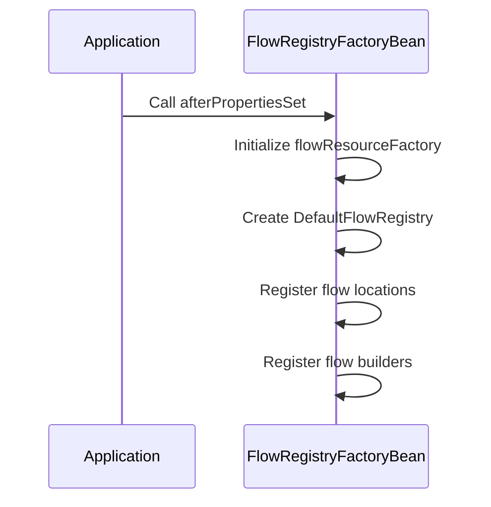

```mermaid
graph TD
  subgraph registerFlowBuilders
    registerFlowBuilders:A["Check for flowBuilders"] --> registerFlowBuilders:B["Iterate over flowBuilders"]
    registerFlowBuilders:B --> registerFlowBuilders:C["Build flow definition"]
    registerFlowBuilders:C --> registerFlowBuilders:D["Register flow definition"]
  end

%% Swimm:
%% graph TD
%%   subgraph <SwmToken path="spring-webflow/src/main/java/org/springframework/webflow/config/FlowRegistryFactoryBean.java" pos="192:5:5" line-data="	private void registerFlowBuilders() {">`registerFlowBuilders`</SwmToken>
%%     <SwmToken path="spring-webflow/src/main/java/org/springframework/webflow/config/FlowRegistryFactoryBean.java" pos="192:5:5" line-data="	private void registerFlowBuilders() {">`registerFlowBuilders`</SwmToken>:A["Check for <SwmToken path="spring-webflow/src/main/java/org/springframework/webflow/config/FlowRegistryFactoryBean.java" pos="193:4:4" line-data="		if (flowBuilders != null) {">`flowBuilders`</SwmToken>"] --> <SwmToken path="spring-webflow/src/main/java/org/springframework/webflow/config/FlowRegistryFactoryBean.java" pos="192:5:5" line-data="	private void registerFlowBuilders() {">`registerFlowBuilders`</SwmToken>:B["Iterate over <SwmToken path="spring-webflow/src/main/java/org/springframework/webflow/config/FlowRegistryFactoryBean.java" pos="193:4:4" line-data="		if (flowBuilders != null) {">`flowBuilders`</SwmToken>"]
%%     <SwmToken path="spring-webflow/src/main/java/org/springframework/webflow/config/FlowRegistryFactoryBean.java" pos="192:5:5" line-data="	private void registerFlowBuilders() {">`registerFlowBuilders`</SwmToken>:B --> <SwmToken path="spring-webflow/src/main/java/org/springframework/webflow/config/FlowRegistryFactoryBean.java" pos="192:5:5" line-data="	private void registerFlowBuilders() {">`registerFlowBuilders`</SwmToken>:C["Build flow definition"]
%%     <SwmToken path="spring-webflow/src/main/java/org/springframework/webflow/config/FlowRegistryFactoryBean.java" pos="192:5:5" line-data="	private void registerFlowBuilders() {">`registerFlowBuilders`</SwmToken>:C --> <SwmToken path="spring-webflow/src/main/java/org/springframework/webflow/config/FlowRegistryFactoryBean.java" pos="192:5:5" line-data="	private void registerFlowBuilders() {">`registerFlowBuilders`</SwmToken>:D["Register flow definition"]
%%   end
```

```mermaid
graph TD
  subgraph buildFlowDefinition
    buildFlowDefinition:A["Load FlowBuilder class"] --> buildFlowDefinition:B["Instantiate FlowBuilder"]
    buildFlowDefinition:B --> buildFlowDefinition:C["Get flow attributes"]
    buildFlowDefinition:C --> buildFlowDefinition:D["Create FlowBuilderContext"]
    buildFlowDefinition:D --> buildFlowDefinition:E["Create FlowAssembler"]
    buildFlowDefinition:E --> buildFlowDefinition:F["Assemble flow"]
  end

%% Swimm:
%% graph TD
%%   subgraph <SwmToken path="spring-webflow/src/main/java/org/springframework/webflow/config/FlowRegistryFactoryBean.java" pos="195:5:5" line-data="				flowRegistry.registerFlowDefinition(buildFlowDefinition(builderInfo));">`buildFlowDefinition`</SwmToken>
%%     <SwmToken path="spring-webflow/src/main/java/org/springframework/webflow/config/FlowRegistryFactoryBean.java" pos="195:5:5" line-data="				flowRegistry.registerFlowDefinition(buildFlowDefinition(builderInfo));">`buildFlowDefinition`</SwmToken>:A["Load <SwmToken path="spring-webflow/src/main/java/org/springframework/webflow/config/FlowRegistryFactoryBean.java" pos="286:1:1" line-data="			FlowBuilder builder = (FlowBuilder) flowBuilderClass.newInstance();">`FlowBuilder`</SwmToken> class"] --> <SwmToken path="spring-webflow/src/main/java/org/springframework/webflow/config/FlowRegistryFactoryBean.java" pos="195:5:5" line-data="				flowRegistry.registerFlowDefinition(buildFlowDefinition(builderInfo));">`buildFlowDefinition`</SwmToken>:B["Instantiate <SwmToken path="spring-webflow/src/main/java/org/springframework/webflow/config/FlowRegistryFactoryBean.java" pos="286:1:1" line-data="			FlowBuilder builder = (FlowBuilder) flowBuilderClass.newInstance();">`FlowBuilder`</SwmToken>"]
%%     <SwmToken path="spring-webflow/src/main/java/org/springframework/webflow/config/FlowRegistryFactoryBean.java" pos="195:5:5" line-data="				flowRegistry.registerFlowDefinition(buildFlowDefinition(builderInfo));">`buildFlowDefinition`</SwmToken>:B --> <SwmToken path="spring-webflow/src/main/java/org/springframework/webflow/config/FlowRegistryFactoryBean.java" pos="195:5:5" line-data="				flowRegistry.registerFlowDefinition(buildFlowDefinition(builderInfo));">`buildFlowDefinition`</SwmToken>:C["Get flow attributes"]
%%     <SwmToken path="spring-webflow/src/main/java/org/springframework/webflow/config/FlowRegistryFactoryBean.java" pos="195:5:5" line-data="				flowRegistry.registerFlowDefinition(buildFlowDefinition(builderInfo));">`buildFlowDefinition`</SwmToken>:C --> <SwmToken path="spring-webflow/src/main/java/org/springframework/webflow/config/FlowRegistryFactoryBean.java" pos="195:5:5" line-data="				flowRegistry.registerFlowDefinition(buildFlowDefinition(builderInfo));">`buildFlowDefinition`</SwmToken>:D["Create <SwmToken path="spring-webflow/src/main/java/org/springframework/webflow/config/FlowRegistryFactoryBean.java" pos="288:1:1" line-data="			FlowBuilderContext builderContext = new FlowBuilderContextImpl(builderInfo.getId(), flowAttributes,">`FlowBuilderContext`</SwmToken>"]
%%     <SwmToken path="spring-webflow/src/main/java/org/springframework/webflow/config/FlowRegistryFactoryBean.java" pos="195:5:5" line-data="				flowRegistry.registerFlowDefinition(buildFlowDefinition(builderInfo));">`buildFlowDefinition`</SwmToken>:D --> <SwmToken path="spring-webflow/src/main/java/org/springframework/webflow/config/FlowRegistryFactoryBean.java" pos="195:5:5" line-data="				flowRegistry.registerFlowDefinition(buildFlowDefinition(builderInfo));">`buildFlowDefinition`</SwmToken>:E["Create <SwmToken path="spring-webflow/src/main/java/org/springframework/webflow/config/FlowRegistryFactoryBean.java" pos="290:1:1" line-data="			FlowAssembler assembler = new FlowAssembler(builder, builderContext);">`FlowAssembler`</SwmToken>"]
%%     <SwmToken path="spring-webflow/src/main/java/org/springframework/webflow/config/FlowRegistryFactoryBean.java" pos="195:5:5" line-data="				flowRegistry.registerFlowDefinition(buildFlowDefinition(builderInfo));">`buildFlowDefinition`</SwmToken>:E --> <SwmToken path="spring-webflow/src/main/java/org/springframework/webflow/config/FlowRegistryFactoryBean.java" pos="195:5:5" line-data="				flowRegistry.registerFlowDefinition(buildFlowDefinition(builderInfo));">`buildFlowDefinition`</SwmToken>:F["Assemble flow"]
%%   end
```

```mermaid
graph TD
  subgraph assembleFlow
    assembleFlow:A["Initialize flow builder"] --> assembleFlow:B["Direct assembly"]
    assembleFlow:B --> assembleFlow:C["Get flow"]
    assembleFlow:C --> assembleFlow:D["Dispose flow builder"]
  end

%% Swimm:
%% graph TD
%%   subgraph <SwmToken path="spring-webflow/src/main/java/org/springframework/webflow/config/FlowRegistryFactoryBean.java" pos="291:5:5" line-data="			return assembler.assembleFlow();">`assembleFlow`</SwmToken>
%%     <SwmToken path="spring-webflow/src/main/java/org/springframework/webflow/config/FlowRegistryFactoryBean.java" pos="291:5:5" line-data="			return assembler.assembleFlow();">`assembleFlow`</SwmToken>:A["Initialize flow builder"] --> <SwmToken path="spring-webflow/src/main/java/org/springframework/webflow/config/FlowRegistryFactoryBean.java" pos="291:5:5" line-data="			return assembler.assembleFlow();">`assembleFlow`</SwmToken>:B["Direct assembly"]
%%     <SwmToken path="spring-webflow/src/main/java/org/springframework/webflow/config/FlowRegistryFactoryBean.java" pos="291:5:5" line-data="			return assembler.assembleFlow();">`assembleFlow`</SwmToken>:B --> <SwmToken path="spring-webflow/src/main/java/org/springframework/webflow/config/FlowRegistryFactoryBean.java" pos="291:5:5" line-data="			return assembler.assembleFlow();">`assembleFlow`</SwmToken>:C["Get flow"]
%%     <SwmToken path="spring-webflow/src/main/java/org/springframework/webflow/config/FlowRegistryFactoryBean.java" pos="291:5:5" line-data="			return assembler.assembleFlow();">`assembleFlow`</SwmToken>:C --> <SwmToken path="spring-webflow/src/main/java/org/springframework/webflow/config/FlowRegistryFactoryBean.java" pos="291:5:5" line-data="			return assembler.assembleFlow();">`assembleFlow`</SwmToken>:D["Dispose flow builder"]
%%   end
```

This document explains the initialization process of flow definitions within the application. The <SwmToken path="spring-webflow/src/main/java/org/springframework/webflow/config/FlowRegistryFactoryBean.java" pos="134:5:5" line-data="	public void afterPropertiesSet() {">`afterPropertiesSet`</SwmToken> method is responsible for setting up the necessary resources and registering flow locations and builders to ensure that all flow definitions are properly initialized and available for use.

For instance, if a base path is provided, the method sets this base path in the <SwmToken path="spring-webflow/src/main/java/org/springframework/webflow/config/FlowRegistryFactoryBean.java" pos="135:1:1" line-data="		flowResourceFactory = new FlowDefinitionResourceFactory(flowBuilderServices.getApplicationContext());">`flowResourceFactory`</SwmToken>. It then creates a new <SwmToken path="spring-webflow/src/main/java/org/springframework/webflow/config/FlowRegistryFactoryBean.java" pos="139:7:7" line-data="		flowRegistry = new DefaultFlowRegistry();">`DefaultFlowRegistry`</SwmToken> and registers flow locations and builders, making the flow definitions ready for the application.



Here is a high level diagram of the flow, showing only the most important functions:

```mermaid
graph TD;
      subgraph springwebflowsrcmainjavaorgspringframeworkwebflowconfigFlowRegistryFactoryBeanjava[spring-webflow/…/config/FlowRegistryFactoryBean.java]
e23b11d3a4354091086d12e477e1a29295b89f0575275788a568de300e5c8624(FlowRegistryFactoryBean.afterPropertiesSet) --> de43d77e645dca971bf91ed1dc01004c8cf78f204353f7d52ad2f810c0bed008(FlowRegistryFactoryBean.registerFlowBuilders)
end

subgraph springwebflowsrcmainjavaorgspringframeworkwebflowconfigFlowRegistryFactoryBeanjava[spring-webflow/…/config/FlowRegistryFactoryBean.java]
e23b11d3a4354091086d12e477e1a29295b89f0575275788a568de300e5c8624(FlowRegistryFactoryBean.afterPropertiesSet) --> 37398092e13314efe21961768762496fb776a00b0b9a134ad32b7dc70b8c613a(FlowRegistryFactoryBean.registerFlowLocationPatterns)
end

subgraph springwebflowsrcmainjavaorgspringframeworkwebflowconfigFlowRegistryFactoryBeanjava[spring-webflow/…/config/FlowRegistryFactoryBean.java]
de43d77e645dca971bf91ed1dc01004c8cf78f204353f7d52ad2f810c0bed008(FlowRegistryFactoryBean.registerFlowBuilders) --> 35f3ee0a3e1b17ca6056d9c28cb5da830610e8d06a08093d076beac2f2d17e5d(FlowRegistryFactoryBean.buildFlowDefinition)
end

subgraph springwebflowsrcmainjavaorgspringframeworkwebflowenginebuilder[spring-webflow/…/engine/builder]
35f3ee0a3e1b17ca6056d9c28cb5da830610e8d06a08093d076beac2f2d17e5d(FlowRegistryFactoryBean.buildFlowDefinition) --> beda375f427bf6aa88a86fd945ee9f0343de08fa3e123e7a21edacb4a918c862(FlowAssembler.assembleFlow)
end

subgraph springwebflowsrcmainjavaorgspringframeworkwebflowenginebuilder[spring-webflow/…/engine/builder]
beda375f427bf6aa88a86fd945ee9f0343de08fa3e123e7a21edacb4a918c862(FlowAssembler.assembleFlow) --> a23a7b61b5d04f5fb043e2fa1ea0b5674e135178db540b9d83b164cbf394346d(FlowAssembler.directAssembly)
end

subgraph springwebflowsrcmainjavaorgspringframeworkwebflowenginebuilder[spring-webflow/…/engine/builder]
a23a7b61b5d04f5fb043e2fa1ea0b5674e135178db540b9d83b164cbf394346d(FlowAssembler.directAssembly) --> c260c1a6db4466fee00d0729adbc0fa302b3ad6405d05ddba4e4e4fb9ee69b0f(FlowModelFlowBuilder.buildStates)
end

subgraph springwebflowsrcmainjavaorgspringframeworkwebflowenginebuilder[spring-webflow/…/engine/builder]
c260c1a6db4466fee00d0729adbc0fa302b3ad6405d05ddba4e4e4fb9ee69b0f(FlowModelFlowBuilder.buildStates) --> 980f6a9ce22205191d9f47ee7e9e21aa525ab87fcef4b9992b837e8093fb2f73(FlowModelFlowBuilder.parseAndAddSubflowState)
end

subgraph springwebflowsrcmainjavaorgspringframeworkwebflowenginebuilder[spring-webflow/…/engine/builder]
c260c1a6db4466fee00d0729adbc0fa302b3ad6405d05ddba4e4e4fb9ee69b0f(FlowModelFlowBuilder.buildStates) --> 38a45c9e0dcfe4ad2bbec0eacb501806eee87de6b81a1d9a426ac679634ab952(FlowModelFlowBuilder.parseAndAddViewState)
end

subgraph springwebflowsrcmainjavaorgspringframeworkwebflowenginebuilder[spring-webflow/…/engine/builder]
c260c1a6db4466fee00d0729adbc0fa302b3ad6405d05ddba4e4e4fb9ee69b0f(FlowModelFlowBuilder.buildStates) --> 504f00713ff43e6afd5669530e02d6c9f6abe9be90aa3389675f1278f7b7635c(FlowModelFlowBuilder.parseAndAddActionState)
end

subgraph springwebflowsrcmainjavaorgspringframeworkwebflowenginebuilder[spring-webflow/…/engine/builder]
c260c1a6db4466fee00d0729adbc0fa302b3ad6405d05ddba4e4e4fb9ee69b0f(FlowModelFlowBuilder.buildStates) --> e9bca2cac4d9dbd67180738ed41ed11e64164e883de585be76daebeb358cd6bd(FlowModelFlowBuilder.parseAndAddEndState)
end


      classDef mainFlowStyle color:#000000,fill:#7CB9F4
classDef rootsStyle color:#000000,fill:#00FFF4
classDef Style1 color:#000000,fill:#00FFAA
classDef Style2 color:#000000,fill:#FFFF00
classDef Style3 color:#000000,fill:#AA7CB9

%% Swimm:
%% graph TD;
%%       subgraph springwebflowsrcmainjavaorgspringframeworkwebflowconfigFlowRegistryFactoryBeanjava[<SwmPath>[spring-webflow/…/config/FlowRegistryFactoryBean.java](spring-webflow/src/main/java/org/springframework/webflow/config/FlowRegistryFactoryBean.java)</SwmPath>]
%% e23b11d3a4354091086d12e477e1a29295b89f0575275788a568de300e5c8624(FlowRegistryFactoryBean.afterPropertiesSet) --> de43d77e645dca971bf91ed1dc01004c8cf78f204353f7d52ad2f810c0bed008(FlowRegistryFactoryBean.registerFlowBuilders)
%% end
%% 
%% subgraph springwebflowsrcmainjavaorgspringframeworkwebflowconfigFlowRegistryFactoryBeanjava[<SwmPath>[spring-webflow/…/config/FlowRegistryFactoryBean.java](spring-webflow/src/main/java/org/springframework/webflow/config/FlowRegistryFactoryBean.java)</SwmPath>]
%% e23b11d3a4354091086d12e477e1a29295b89f0575275788a568de300e5c8624(FlowRegistryFactoryBean.afterPropertiesSet) --> 37398092e13314efe21961768762496fb776a00b0b9a134ad32b7dc70b8c613a(FlowRegistryFactoryBean.registerFlowLocationPatterns)
%% end
%% 
%% subgraph springwebflowsrcmainjavaorgspringframeworkwebflowconfigFlowRegistryFactoryBeanjava[<SwmPath>[spring-webflow/…/config/FlowRegistryFactoryBean.java](spring-webflow/src/main/java/org/springframework/webflow/config/FlowRegistryFactoryBean.java)</SwmPath>]
%% de43d77e645dca971bf91ed1dc01004c8cf78f204353f7d52ad2f810c0bed008(FlowRegistryFactoryBean.registerFlowBuilders) --> 35f3ee0a3e1b17ca6056d9c28cb5da830610e8d06a08093d076beac2f2d17e5d(FlowRegistryFactoryBean.buildFlowDefinition)
%% end
%% 
%% subgraph springwebflowsrcmainjavaorgspringframeworkwebflowenginebuilder[<SwmPath>[spring-webflow/…/engine/builder/](spring-webflow/src/main/java/org/springframework/webflow/engine/builder/)</SwmPath>]
%% 35f3ee0a3e1b17ca6056d9c28cb5da830610e8d06a08093d076beac2f2d17e5d(FlowRegistryFactoryBean.buildFlowDefinition) --> beda375f427bf6aa88a86fd945ee9f0343de08fa3e123e7a21edacb4a918c862(FlowAssembler.assembleFlow)
%% end
%% 
%% subgraph springwebflowsrcmainjavaorgspringframeworkwebflowenginebuilder[<SwmPath>[spring-webflow/…/engine/builder/](spring-webflow/src/main/java/org/springframework/webflow/engine/builder/)</SwmPath>]
%% beda375f427bf6aa88a86fd945ee9f0343de08fa3e123e7a21edacb4a918c862(FlowAssembler.assembleFlow) --> a23a7b61b5d04f5fb043e2fa1ea0b5674e135178db540b9d83b164cbf394346d(FlowAssembler.directAssembly)
%% end
%% 
%% subgraph springwebflowsrcmainjavaorgspringframeworkwebflowenginebuilder[<SwmPath>[spring-webflow/…/engine/builder/](spring-webflow/src/main/java/org/springframework/webflow/engine/builder/)</SwmPath>]
%% a23a7b61b5d04f5fb043e2fa1ea0b5674e135178db540b9d83b164cbf394346d(FlowAssembler.directAssembly) --> c260c1a6db4466fee00d0729adbc0fa302b3ad6405d05ddba4e4e4fb9ee69b0f(FlowModelFlowBuilder.buildStates)
%% end
%% 
%% subgraph springwebflowsrcmainjavaorgspringframeworkwebflowenginebuilder[<SwmPath>[spring-webflow/…/engine/builder/](spring-webflow/src/main/java/org/springframework/webflow/engine/builder/)</SwmPath>]
%% c260c1a6db4466fee00d0729adbc0fa302b3ad6405d05ddba4e4e4fb9ee69b0f(FlowModelFlowBuilder.buildStates) --> 980f6a9ce22205191d9f47ee7e9e21aa525ab87fcef4b9992b837e8093fb2f73(FlowModelFlowBuilder.parseAndAddSubflowState)
%% end
%% 
%% subgraph springwebflowsrcmainjavaorgspringframeworkwebflowenginebuilder[<SwmPath>[spring-webflow/…/engine/builder/](spring-webflow/src/main/java/org/springframework/webflow/engine/builder/)</SwmPath>]
%% c260c1a6db4466fee00d0729adbc0fa302b3ad6405d05ddba4e4e4fb9ee69b0f(FlowModelFlowBuilder.buildStates) --> 38a45c9e0dcfe4ad2bbec0eacb501806eee87de6b81a1d9a426ac679634ab952(FlowModelFlowBuilder.parseAndAddViewState)
%% end
%% 
%% subgraph springwebflowsrcmainjavaorgspringframeworkwebflowenginebuilder[<SwmPath>[spring-webflow/…/engine/builder/](spring-webflow/src/main/java/org/springframework/webflow/engine/builder/)</SwmPath>]
%% c260c1a6db4466fee00d0729adbc0fa302b3ad6405d05ddba4e4e4fb9ee69b0f(FlowModelFlowBuilder.buildStates) --> 504f00713ff43e6afd5669530e02d6c9f6abe9be90aa3389675f1278f7b7635c(FlowModelFlowBuilder.parseAndAddActionState)
%% end
%% 
%% subgraph springwebflowsrcmainjavaorgspringframeworkwebflowenginebuilder[<SwmPath>[spring-webflow/…/engine/builder/](spring-webflow/src/main/java/org/springframework/webflow/engine/builder/)</SwmPath>]
%% c260c1a6db4466fee00d0729adbc0fa302b3ad6405d05ddba4e4e4fb9ee69b0f(FlowModelFlowBuilder.buildStates) --> e9bca2cac4d9dbd67180738ed41ed11e64164e883de585be76daebeb358cd6bd(FlowModelFlowBuilder.parseAndAddEndState)
%% end
%% 
%% 
%%       classDef mainFlowStyle color:#000000,fill:#7CB9F4
%% classDef rootsStyle color:#000000,fill:#00FFF4
%% classDef Style1 color:#000000,fill:#00FFAA
%% classDef Style2 color:#000000,fill:#FFFF00
%% classDef Style3 color:#000000,fill:#AA7CB9
```



# Flow drill down

```mermaid
graph TD
subgraph afterPropertiesSet
  afterPropertiesSet:A["Create FlowDefinitionResourceFactory"] --> afterPropertiesSet:B["Check if basePath is provided"]
  afterPropertiesSet:B -->|basePath provided| afterPropertiesSet:C["Set basePath for FlowResourceFactory"]
  afterPropertiesSet:B -->|basePath not provided| afterPropertiesSet:D["Initialize DefaultFlowRegistry"]
  afterPropertiesSet:D --> afterPropertiesSet:E["Set parent for FlowRegistry"]
  afterPropertiesSet:E --> afterPropertiesSet:F["Register flow locations"]
  afterPropertiesSet:E --> afterPropertiesSet:G["Register flow location patterns"]
  afterPropertiesSet:E --> afterPropertiesSet:H["Register flow builders"]
end
subgraph registerFlowLocationPatterns
  registerFlowLocationPatterns:A["Check if flow location patterns are not null"] --> registerFlowLocationPatterns:B["Iterate over flow location patterns"]
  registerFlowLocationPatterns:B --> registerFlowLocationPatterns:C["Resolve flow location pattern"]
  registerFlowLocationPatterns:C --> registerFlowLocationPatterns:D["Create resources for the pattern"]
  registerFlowLocationPatterns:D --> registerFlowLocationPatterns:E["Register each resource to flow registry"]
end
afterPropertiesSet:G --> registerFlowLocationPatterns

%% Swimm:
%% graph TD
%% subgraph <SwmToken path="spring-webflow/src/main/java/org/springframework/webflow/config/FlowRegistryFactoryBean.java" pos="134:5:5" line-data="	public void afterPropertiesSet() {">`afterPropertiesSet`</SwmToken>
%%   <SwmToken path="spring-webflow/src/main/java/org/springframework/webflow/config/FlowRegistryFactoryBean.java" pos="134:5:5" line-data="	public void afterPropertiesSet() {">`afterPropertiesSet`</SwmToken>:A["Create <SwmToken path="spring-webflow/src/main/java/org/springframework/webflow/config/FlowRegistryFactoryBean.java" pos="135:7:7" line-data="		flowResourceFactory = new FlowDefinitionResourceFactory(flowBuilderServices.getApplicationContext());">`FlowDefinitionResourceFactory`</SwmToken>"] --> <SwmToken path="spring-webflow/src/main/java/org/springframework/webflow/config/FlowRegistryFactoryBean.java" pos="134:5:5" line-data="	public void afterPropertiesSet() {">`afterPropertiesSet`</SwmToken>:B["Check if <SwmToken path="spring-webflow/src/main/java/org/springframework/webflow/config/FlowRegistryFactoryBean.java" pos="136:4:4" line-data="		if (basePath != null) {">`basePath`</SwmToken> is provided"]
%%   <SwmToken path="spring-webflow/src/main/java/org/springframework/webflow/config/FlowRegistryFactoryBean.java" pos="134:5:5" line-data="	public void afterPropertiesSet() {">`afterPropertiesSet`</SwmToken>:B -->|<SwmToken path="spring-webflow/src/main/java/org/springframework/webflow/config/FlowRegistryFactoryBean.java" pos="136:4:4" line-data="		if (basePath != null) {">`basePath`</SwmToken> provided| <SwmToken path="spring-webflow/src/main/java/org/springframework/webflow/config/FlowRegistryFactoryBean.java" pos="134:5:5" line-data="	public void afterPropertiesSet() {">`afterPropertiesSet`</SwmToken>:C["Set <SwmToken path="spring-webflow/src/main/java/org/springframework/webflow/config/FlowRegistryFactoryBean.java" pos="136:4:4" line-data="		if (basePath != null) {">`basePath`</SwmToken> for FlowResourceFactory"]
%%   <SwmToken path="spring-webflow/src/main/java/org/springframework/webflow/config/FlowRegistryFactoryBean.java" pos="134:5:5" line-data="	public void afterPropertiesSet() {">`afterPropertiesSet`</SwmToken>:B -->|<SwmToken path="spring-webflow/src/main/java/org/springframework/webflow/config/FlowRegistryFactoryBean.java" pos="136:4:4" line-data="		if (basePath != null) {">`basePath`</SwmToken> not provided| <SwmToken path="spring-webflow/src/main/java/org/springframework/webflow/config/FlowRegistryFactoryBean.java" pos="134:5:5" line-data="	public void afterPropertiesSet() {">`afterPropertiesSet`</SwmToken>:D["Initialize <SwmToken path="spring-webflow/src/main/java/org/springframework/webflow/config/FlowRegistryFactoryBean.java" pos="139:7:7" line-data="		flowRegistry = new DefaultFlowRegistry();">`DefaultFlowRegistry`</SwmToken>"]
%%   <SwmToken path="spring-webflow/src/main/java/org/springframework/webflow/config/FlowRegistryFactoryBean.java" pos="134:5:5" line-data="	public void afterPropertiesSet() {">`afterPropertiesSet`</SwmToken>:D --> <SwmToken path="spring-webflow/src/main/java/org/springframework/webflow/config/FlowRegistryFactoryBean.java" pos="134:5:5" line-data="	public void afterPropertiesSet() {">`afterPropertiesSet`</SwmToken>:E["Set parent for FlowRegistry"]
%%   <SwmToken path="spring-webflow/src/main/java/org/springframework/webflow/config/FlowRegistryFactoryBean.java" pos="134:5:5" line-data="	public void afterPropertiesSet() {">`afterPropertiesSet`</SwmToken>:E --> <SwmToken path="spring-webflow/src/main/java/org/springframework/webflow/config/FlowRegistryFactoryBean.java" pos="134:5:5" line-data="	public void afterPropertiesSet() {">`afterPropertiesSet`</SwmToken>:F["Register flow locations"]
%%   <SwmToken path="spring-webflow/src/main/java/org/springframework/webflow/config/FlowRegistryFactoryBean.java" pos="134:5:5" line-data="	public void afterPropertiesSet() {">`afterPropertiesSet`</SwmToken>:E --> <SwmToken path="spring-webflow/src/main/java/org/springframework/webflow/config/FlowRegistryFactoryBean.java" pos="134:5:5" line-data="	public void afterPropertiesSet() {">`afterPropertiesSet`</SwmToken>:G["Register flow location patterns"]
%%   <SwmToken path="spring-webflow/src/main/java/org/springframework/webflow/config/FlowRegistryFactoryBean.java" pos="134:5:5" line-data="	public void afterPropertiesSet() {">`afterPropertiesSet`</SwmToken>:E --> <SwmToken path="spring-webflow/src/main/java/org/springframework/webflow/config/FlowRegistryFactoryBean.java" pos="134:5:5" line-data="	public void afterPropertiesSet() {">`afterPropertiesSet`</SwmToken>:H["Register flow builders"]
%% end
%% subgraph <SwmToken path="spring-webflow/src/main/java/org/springframework/webflow/config/FlowRegistryFactoryBean.java" pos="172:5:5" line-data="	private void registerFlowLocationPatterns() {">`registerFlowLocationPatterns`</SwmToken>
%%   <SwmToken path="spring-webflow/src/main/java/org/springframework/webflow/config/FlowRegistryFactoryBean.java" pos="172:5:5" line-data="	private void registerFlowLocationPatterns() {">`registerFlowLocationPatterns`</SwmToken>:A["Check if flow location patterns are not null"] --> <SwmToken path="spring-webflow/src/main/java/org/springframework/webflow/config/FlowRegistryFactoryBean.java" pos="172:5:5" line-data="	private void registerFlowLocationPatterns() {">`registerFlowLocationPatterns`</SwmToken>:B["Iterate over flow location patterns"]
%%   <SwmToken path="spring-webflow/src/main/java/org/springframework/webflow/config/FlowRegistryFactoryBean.java" pos="172:5:5" line-data="	private void registerFlowLocationPatterns() {">`registerFlowLocationPatterns`</SwmToken>:B --> <SwmToken path="spring-webflow/src/main/java/org/springframework/webflow/config/FlowRegistryFactoryBean.java" pos="172:5:5" line-data="	private void registerFlowLocationPatterns() {">`registerFlowLocationPatterns`</SwmToken>:C["Resolve flow location pattern"]
%%   <SwmToken path="spring-webflow/src/main/java/org/springframework/webflow/config/FlowRegistryFactoryBean.java" pos="172:5:5" line-data="	private void registerFlowLocationPatterns() {">`registerFlowLocationPatterns`</SwmToken>:C --> <SwmToken path="spring-webflow/src/main/java/org/springframework/webflow/config/FlowRegistryFactoryBean.java" pos="172:5:5" line-data="	private void registerFlowLocationPatterns() {">`registerFlowLocationPatterns`</SwmToken>:D["Create resources for the pattern"]
%%   <SwmToken path="spring-webflow/src/main/java/org/springframework/webflow/config/FlowRegistryFactoryBean.java" pos="172:5:5" line-data="	private void registerFlowLocationPatterns() {">`registerFlowLocationPatterns`</SwmToken>:D --> <SwmToken path="spring-webflow/src/main/java/org/springframework/webflow/config/FlowRegistryFactoryBean.java" pos="172:5:5" line-data="	private void registerFlowLocationPatterns() {">`registerFlowLocationPatterns`</SwmToken>:E["Register each resource to flow registry"]
%% end
%% <SwmToken path="spring-webflow/src/main/java/org/springframework/webflow/config/FlowRegistryFactoryBean.java" pos="134:5:5" line-data="	public void afterPropertiesSet() {">`afterPropertiesSet`</SwmToken>:G --> <SwmToken path="spring-webflow/src/main/java/org/springframework/webflow/config/FlowRegistryFactoryBean.java" pos="172:5:5" line-data="	private void registerFlowLocationPatterns() {">`registerFlowLocationPatterns`</SwmToken>
```

## Inside <SwmToken path="spring-webflow/src/main/java/org/springframework/webflow/config/FlowRegistryFactoryBean.java" pos="134:5:5" line-data="	public void afterPropertiesSet() {">`afterPropertiesSet`</SwmToken> & <SwmToken path="spring-webflow/src/main/java/org/springframework/webflow/config/FlowRegistryFactoryBean.java" pos="172:5:5" line-data="	private void registerFlowLocationPatterns() {">`registerFlowLocationPatterns`</SwmToken>



## Initializing Flow Definitions

The <SwmToken path="spring-webflow/src/main/java/org/springframework/webflow/config/FlowRegistryFactoryBean.java" pos="134:5:5" line-data="	public void afterPropertiesSet() {">`afterPropertiesSet`</SwmToken> method is responsible for initializing the flow definitions in the application. This method sets up the necessary resources and registers the flow locations and builders.

<SwmSnippet path="/spring-webflow/src/main/java/org/springframework/webflow/config/FlowRegistryFactoryBean.java" line="135">

---

First, the method initializes the <SwmToken path="spring-webflow/src/main/java/org/springframework/webflow/config/FlowRegistryFactoryBean.java" pos="135:1:1" line-data="		flowResourceFactory = new FlowDefinitionResourceFactory(flowBuilderServices.getApplicationContext());">`flowResourceFactory`</SwmToken> with the application context from <SwmToken path="spring-webflow/src/main/java/org/springframework/webflow/config/FlowRegistryFactoryBean.java" pos="135:9:9" line-data="		flowResourceFactory = new FlowDefinitionResourceFactory(flowBuilderServices.getApplicationContext());">`flowBuilderServices`</SwmToken>. If a <SwmToken path="spring-webflow/src/main/java/org/springframework/webflow/config/FlowRegistryFactoryBean.java" pos="136:4:4" line-data="		if (basePath != null) {">`basePath`</SwmToken> is provided, it sets this base path in the <SwmToken path="spring-webflow/src/main/java/org/springframework/webflow/config/FlowRegistryFactoryBean.java" pos="135:1:1" line-data="		flowResourceFactory = new FlowDefinitionResourceFactory(flowBuilderServices.getApplicationContext());">`flowResourceFactory`</SwmToken>.

```java
		flowResourceFactory = new FlowDefinitionResourceFactory(flowBuilderServices.getApplicationContext());
		if (basePath != null) {
			flowResourceFactory.setBasePath(basePath);
		}
```

---

</SwmSnippet>

<SwmSnippet path="/spring-webflow/src/main/java/org/springframework/webflow/config/FlowRegistryFactoryBean.java" line="139">

---

Next, a new <SwmToken path="spring-webflow/src/main/java/org/springframework/webflow/config/FlowRegistryFactoryBean.java" pos="139:7:7" line-data="		flowRegistry = new DefaultFlowRegistry();">`DefaultFlowRegistry`</SwmToken> is created and its parent is set if available. This registry will hold all the flow definitions.

```java
		flowRegistry = new DefaultFlowRegistry();
		flowRegistry.setParent(parent);
```

---

</SwmSnippet>

### Registering Flow Locations

The method then calls <SwmToken path="spring-webflow/src/main/java/org/springframework/webflow/config/FlowRegistryFactoryBean.java" pos="141:1:1" line-data="		registerFlowLocations();">`registerFlowLocations`</SwmToken> to register specific flow locations. This step is crucial for identifying where the flow definitions are located.

## Registering Flow Location Patterns

The <SwmToken path="spring-webflow/src/main/java/org/springframework/webflow/config/FlowRegistryFactoryBean.java" pos="172:5:5" line-data="	private void registerFlowLocationPatterns() {">`registerFlowLocationPatterns`</SwmToken> method is responsible for registering flow definitions based on location patterns. It iterates over the provided <SwmToken path="spring-webflow/src/main/java/org/springframework/webflow/config/FlowRegistryFactoryBean.java" pos="173:4:4" line-data="		if (flowLocationPatterns != null) {">`flowLocationPatterns`</SwmToken> and creates resources for each pattern.

<SwmSnippet path="/spring-webflow/src/main/java/org/springframework/webflow/config/FlowRegistryFactoryBean.java" line="172">

---

For each pattern, it creates <SwmToken path="spring-webflow/src/main/java/org/springframework/webflow/config/FlowRegistryFactoryBean.java" pos="175:1:1" line-data="				FlowDefinitionResource[] resources;">`FlowDefinitionResource`</SwmToken> objects using the <SwmToken path="spring-webflow/src/main/java/org/springframework/webflow/config/FlowRegistryFactoryBean.java" pos="178:5:5" line-data="					resources = flowResourceFactory.createResources(pattern, attributes);">`flowResourceFactory`</SwmToken>. If an <SwmToken path="spring-webflow/src/main/java/org/springframework/webflow/config/FlowRegistryFactoryBean.java" pos="181:4:6" line-data="							&quot;An I/O Exception occurred resolving the flow location pattern &#39;&quot; + pattern + &quot;&#39;&quot;);">`I/O`</SwmToken> exception occurs during this process, it throws an <SwmToken path="spring-webflow/src/main/java/org/springframework/webflow/config/FlowRegistryFactoryBean.java" pos="180:1:1" line-data="					IllegalStateException ise = new IllegalStateException(">`IllegalStateException`</SwmToken>.

```java
	private void registerFlowLocationPatterns() {
		if (flowLocationPatterns != null) {
			for (String pattern : flowLocationPatterns) {
				FlowDefinitionResource[] resources;
				AttributeMap<Object> attributes = getFlowAttributes(Collections.emptySet());
				try {
					resources = flowResourceFactory.createResources(pattern, attributes);
				} catch (IOException e) {
					IllegalStateException ise = new IllegalStateException(
							"An I/O Exception occurred resolving the flow location pattern '" + pattern + "'");
					ise.initCause(e);
					throw ise;
				}
```

---

</SwmSnippet>

<SwmSnippet path="/spring-webflow/src/main/java/org/springframework/webflow/config/FlowRegistryFactoryBean.java" line="185">

---

Finally, it registers each <SwmToken path="spring-webflow/src/main/java/org/springframework/webflow/config/FlowRegistryFactoryBean.java" pos="185:4:4" line-data="				for (FlowDefinitionResource resource : resources) {">`FlowDefinitionResource`</SwmToken> with the <SwmToken path="spring-webflow/src/main/java/org/springframework/webflow/config/FlowRegistryFactoryBean.java" pos="186:1:1" line-data="					flowRegistry.registerFlowDefinition(createFlowDefinitionHolder(resource));">`flowRegistry`</SwmToken> by creating a <SwmToken path="spring-webflow/src/main/java/org/springframework/webflow/config/FlowRegistryFactoryBean.java" pos="34:12:12" line-data="import org.springframework.webflow.definition.registry.FlowDefinitionHolder;">`FlowDefinitionHolder`</SwmToken> for each resource. This ensures that all flow definitions are properly registered and available for use.

```java
				for (FlowDefinitionResource resource : resources) {
					flowRegistry.registerFlowDefinition(createFlowDefinitionHolder(resource));
				}
```

---

</SwmSnippet>

## Diving into <SwmToken path="spring-webflow/src/main/java/org/springframework/webflow/config/FlowRegistryFactoryBean.java" pos="192:5:5" line-data="	private void registerFlowBuilders() {">`registerFlowBuilders`</SwmToken>



<SwmSnippet path="/spring-webflow/src/main/java/org/springframework/webflow/config/FlowRegistryFactoryBean.java" line="192">

---

The <SwmToken path="spring-webflow/src/main/java/org/springframework/webflow/config/FlowRegistryFactoryBean.java" pos="192:5:5" line-data="	private void registerFlowBuilders() {">`registerFlowBuilders`</SwmToken> method is responsible for iterating over a collection of <SwmToken path="spring-webflow/src/main/java/org/springframework/webflow/config/FlowRegistryFactoryBean.java" pos="194:4:4" line-data="			for (FlowBuilderInfo builderInfo : flowBuilders) {">`FlowBuilderInfo`</SwmToken> objects and registering each flow definition into the flow registry. This ensures that all the necessary flow definitions are built and available for use within the application.

```java
	private void registerFlowBuilders() {
		if (flowBuilders != null) {
			for (FlowBuilderInfo builderInfo : flowBuilders) {
				flowRegistry.registerFlowDefinition(buildFlowDefinition(builderInfo));
			}
		}
	}
```

---

</SwmSnippet>

<SwmSnippet path="/spring-webflow/src/main/java/org/springframework/webflow/config/FlowRegistryFactoryBean.java" line="193">

---

First, the method checks if the <SwmToken path="spring-webflow/src/main/java/org/springframework/webflow/config/FlowRegistryFactoryBean.java" pos="193:4:4" line-data="		if (flowBuilders != null) {">`flowBuilders`</SwmToken> collection is not null. This is crucial because it ensures that there are flow builders available to process. If the collection is null, the method simply exits without performing any actions.

```java
		if (flowBuilders != null) {
```

---

</SwmSnippet>

<SwmSnippet path="/spring-webflow/src/main/java/org/springframework/webflow/config/FlowRegistryFactoryBean.java" line="194">

---

Next, the method iterates over each <SwmToken path="spring-webflow/src/main/java/org/springframework/webflow/config/FlowRegistryFactoryBean.java" pos="194:4:4" line-data="			for (FlowBuilderInfo builderInfo : flowBuilders) {">`FlowBuilderInfo`</SwmToken> object in the <SwmToken path="spring-webflow/src/main/java/org/springframework/webflow/config/FlowRegistryFactoryBean.java" pos="194:10:10" line-data="			for (FlowBuilderInfo builderInfo : flowBuilders) {">`flowBuilders`</SwmToken> collection. For each builder, it calls the <SwmToken path="spring-webflow/src/main/java/org/springframework/webflow/config/FlowRegistryFactoryBean.java" pos="195:5:5" line-data="				flowRegistry.registerFlowDefinition(buildFlowDefinition(builderInfo));">`buildFlowDefinition`</SwmToken> method, which constructs a flow definition using the provided builder information. This step is essential as it transforms the builder information into a concrete flow definition that can be registered and used within the application.

```java
			for (FlowBuilderInfo builderInfo : flowBuilders) {
				flowRegistry.registerFlowDefinition(buildFlowDefinition(builderInfo));
```

---

</SwmSnippet>

<SwmSnippet path="/spring-webflow/src/main/java/org/springframework/webflow/config/FlowRegistryFactoryBean.java" line="195">

---

Finally, the constructed flow definition is registered into the flow registry using the <SwmToken path="spring-webflow/src/main/java/org/springframework/webflow/config/FlowRegistryFactoryBean.java" pos="195:3:3" line-data="				flowRegistry.registerFlowDefinition(buildFlowDefinition(builderInfo));">`registerFlowDefinition`</SwmToken> method. This registration step is critical because it makes the flow definition available for the application to use, enabling the defined flows to be executed as part of the application's workflow.

```java
				flowRegistry.registerFlowDefinition(buildFlowDefinition(builderInfo));
```

---

</SwmSnippet>

## Diving into <SwmToken path="spring-webflow/src/main/java/org/springframework/webflow/config/FlowRegistryFactoryBean.java" pos="195:5:5" line-data="				flowRegistry.registerFlowDefinition(buildFlowDefinition(builderInfo));">`buildFlowDefinition`</SwmToken>



<SwmSnippet path="/spring-webflow/src/main/java/org/springframework/webflow/config/FlowRegistryFactoryBean.java" line="285">

---

First, the <SwmToken path="spring-webflow/src/main/java/org/springframework/webflow/config/FlowRegistryFactoryBean.java" pos="195:5:5" line-data="				flowRegistry.registerFlowDefinition(buildFlowDefinition(builderInfo));">`buildFlowDefinition`</SwmToken> method begins by loading the class specified in the <SwmToken path="spring-webflow/src/main/java/org/springframework/webflow/config/FlowRegistryFactoryBean.java" pos="194:4:4" line-data="			for (FlowBuilderInfo builderInfo : flowBuilders) {">`FlowBuilderInfo`</SwmToken> object. This class is expected to implement the <SwmToken path="spring-webflow/src/main/java/org/springframework/webflow/config/FlowRegistryFactoryBean.java" pos="286:1:1" line-data="			FlowBuilder builder = (FlowBuilder) flowBuilderClass.newInstance();">`FlowBuilder`</SwmToken> interface, which is responsible for defining the structure and behavior of the flow.

```java
			Class<?> flowBuilderClass = loadClass(builderInfo.getClassName());
			FlowBuilder builder = (FlowBuilder) flowBuilderClass.newInstance();
```

---

</SwmSnippet>

<SwmSnippet path="/spring-webflow/src/main/java/org/springframework/webflow/config/FlowRegistryFactoryBean.java" line="287">

---

Next, the method creates a <SwmToken path="spring-webflow/src/main/java/org/springframework/webflow/config/FlowRegistryFactoryBean.java" pos="288:1:1" line-data="			FlowBuilderContext builderContext = new FlowBuilderContextImpl(builderInfo.getId(), flowAttributes,">`FlowBuilderContext`</SwmToken> object. This context includes the flow's unique identifier, attributes, and services required for building the flow. The context is essential for providing the necessary environment and resources to the <SwmToken path="spring-webflow/src/main/java/org/springframework/webflow/config/FlowRegistryFactoryBean.java" pos="286:1:1" line-data="			FlowBuilder builder = (FlowBuilder) flowBuilderClass.newInstance();">`FlowBuilder`</SwmToken> during the flow assembly process.

```java
			AttributeMap<Object> flowAttributes = getFlowAttributes(builderInfo.getAttributes());
			FlowBuilderContext builderContext = new FlowBuilderContextImpl(builderInfo.getId(), flowAttributes,
					flowRegistry, flowBuilderServices);
```

---

</SwmSnippet>

<SwmSnippet path="/spring-webflow/src/main/java/org/springframework/webflow/config/FlowRegistryFactoryBean.java" line="290">

---

Then, a <SwmToken path="spring-webflow/src/main/java/org/springframework/webflow/config/FlowRegistryFactoryBean.java" pos="290:1:1" line-data="			FlowAssembler assembler = new FlowAssembler(builder, builderContext);">`FlowAssembler`</SwmToken> is instantiated with the <SwmToken path="spring-webflow/src/main/java/org/springframework/webflow/config/FlowRegistryFactoryBean.java" pos="286:1:1" line-data="			FlowBuilder builder = (FlowBuilder) flowBuilderClass.newInstance();">`FlowBuilder`</SwmToken> and <SwmToken path="spring-webflow/src/main/java/org/springframework/webflow/config/FlowRegistryFactoryBean.java" pos="288:1:1" line-data="			FlowBuilderContext builderContext = new FlowBuilderContextImpl(builderInfo.getId(), flowAttributes,">`FlowBuilderContext`</SwmToken>. The <SwmToken path="spring-webflow/src/main/java/org/springframework/webflow/config/FlowRegistryFactoryBean.java" pos="290:1:1" line-data="			FlowAssembler assembler = new FlowAssembler(builder, builderContext);">`FlowAssembler`</SwmToken> is responsible for driving the flow assembly process. It initializes the <SwmToken path="spring-webflow/src/main/java/org/springframework/webflow/config/FlowRegistryFactoryBean.java" pos="286:1:1" line-data="			FlowBuilder builder = (FlowBuilder) flowBuilderClass.newInstance();">`FlowBuilder`</SwmToken>, orchestrates the construction of the flow, and ensures that all necessary components are correctly set up.

```java
			FlowAssembler assembler = new FlowAssembler(builder, builderContext);
			return assembler.assembleFlow();
```

---

</SwmSnippet>

<SwmSnippet path="/spring-webflow/src/main/java/org/springframework/webflow/config/FlowRegistryFactoryBean.java" line="292">

---

Finally, the method includes exception handling to catch any issues that may arise during the flow definition construction. If an exception occurs, it throws a <SwmToken path="spring-webflow/src/main/java/org/springframework/webflow/config/FlowRegistryFactoryBean.java" pos="293:5:5" line-data="			throw new FlowDefinitionConstructionException(builderInfo.getId(), e);">`FlowDefinitionConstructionException`</SwmToken> with the relevant flow identifier and the original exception, ensuring that any errors are properly reported and managed.

```java
		} catch (IllegalArgumentException | IllegalAccessException | InstantiationException e) {
			throw new FlowDefinitionConstructionException(builderInfo.getId(), e);
		}
```

---

</SwmSnippet>

## Looking at <SwmToken path="spring-webflow/src/main/java/org/springframework/webflow/config/FlowRegistryFactoryBean.java" pos="291:5:5" line-data="			return assembler.assembleFlow();">`assembleFlow`</SwmToken>



<SwmSnippet path="/spring-webflow/src/main/java/org/springframework/webflow/engine/builder/FlowAssembler.java" line="90">

---

First, the flow builder is initialized using the <SwmToken path="spring-webflow/src/main/java/org/springframework/webflow/engine/builder/FlowAssembler.java" pos="90:1:6" line-data="			flowBuilder.init(flowBuilderContext);">`flowBuilder.init(flowBuilderContext)`</SwmToken> method. This step sets up the necessary context and prepares the flow builder for the assembly process.

```java
			flowBuilder.init(flowBuilderContext);
```

---

</SwmSnippet>

<SwmSnippet path="/spring-webflow/src/main/java/org/springframework/webflow/engine/builder/FlowAssembler.java" line="91">

---

Next, the <SwmToken path="spring-webflow/src/main/java/org/springframework/webflow/engine/builder/FlowAssembler.java" pos="91:1:3" line-data="			directAssembly();">`directAssembly()`</SwmToken> method is called to guide the construction of all parts of the flow using the flow builder. This method orchestrates the assembly process, ensuring that each component of the flow is correctly built and integrated.

```java
			directAssembly();
```

---

</SwmSnippet>

<SwmSnippet path="/spring-webflow/src/main/java/org/springframework/webflow/engine/builder/FlowAssembler.java" line="92">

---

Then, the constructed flow instance is retrieved using the <SwmToken path="spring-webflow/src/main/java/org/springframework/webflow/engine/builder/FlowAssembler.java" pos="92:3:7" line-data="			return flowBuilder.getFlow();">`flowBuilder.getFlow()`</SwmToken> method. This step finalizes the flow construction process by obtaining the fully assembled flow instance.

```java
			return flowBuilder.getFlow();
```

---

</SwmSnippet>

<SwmSnippet path="/spring-webflow/src/main/java/org/springframework/webflow/engine/builder/FlowAssembler.java" line="94">

---

Finally, the flow builder is cleaned up with a call to <SwmToken path="spring-webflow/src/main/java/org/springframework/webflow/engine/builder/FlowAssembler.java" pos="94:1:5" line-data="			flowBuilder.dispose();">`flowBuilder.dispose()`</SwmToken>. This step ensures that any resources used during the assembly process are properly released, maintaining the efficiency and stability of the system.

```java
			flowBuilder.dispose();
```

---

</SwmSnippet>

## Breaking down <SwmToken path="spring-webflow/src/main/java/org/springframework/webflow/engine/builder/FlowAssembler.java" pos="91:1:1" line-data="			directAssembly();">`directAssembly`</SwmToken>



```mermaid
graph TD
subgraph directAssembly
directAssembly:A["Call buildVariables"] --> directAssembly:B["Call buildInputMapper"] --> directAssembly:C["Call buildStartActions"] --> directAssembly:D["Call buildStates"] --> directAssembly:E["Call buildGlobalTransitions"] --> directAssembly:F["Call buildEndActions"] --> directAssembly:G["Call buildOutputMapper"] --> directAssembly:H["Call buildExceptionHandlers"]
end

%% Swimm:
%% graph TD
%% subgraph <SwmToken path="spring-webflow/src/main/java/org/springframework/webflow/engine/builder/FlowAssembler.java" pos="91:1:1" line-data="			directAssembly();">`directAssembly`</SwmToken>
%% <SwmToken path="spring-webflow/src/main/java/org/springframework/webflow/engine/builder/FlowAssembler.java" pos="91:1:1" line-data="			directAssembly();">`directAssembly`</SwmToken>:A["Call <SwmToken path="spring-webflow/src/main/java/org/springframework/webflow/engine/builder/FlowAssembler.java" pos="103:3:3" line-data="		flowBuilder.buildVariables();">`buildVariables`</SwmToken>"] --> <SwmToken path="spring-webflow/src/main/java/org/springframework/webflow/engine/builder/FlowAssembler.java" pos="91:1:1" line-data="			directAssembly();">`directAssembly`</SwmToken>:B["Call <SwmToken path="spring-webflow/src/main/java/org/springframework/webflow/engine/builder/FlowAssembler.java" pos="104:3:3" line-data="		flowBuilder.buildInputMapper();">`buildInputMapper`</SwmToken>"] --> <SwmToken path="spring-webflow/src/main/java/org/springframework/webflow/engine/builder/FlowAssembler.java" pos="91:1:1" line-data="			directAssembly();">`directAssembly`</SwmToken>:C["Call <SwmToken path="spring-webflow/src/main/java/org/springframework/webflow/engine/builder/FlowAssembler.java" pos="105:3:3" line-data="		flowBuilder.buildStartActions();">`buildStartActions`</SwmToken>"] --> <SwmToken path="spring-webflow/src/main/java/org/springframework/webflow/engine/builder/FlowAssembler.java" pos="91:1:1" line-data="			directAssembly();">`directAssembly`</SwmToken>:D["Call <SwmToken path="spring-webflow/src/main/java/org/springframework/webflow/engine/builder/FlowAssembler.java" pos="106:3:3" line-data="		flowBuilder.buildStates();">`buildStates`</SwmToken>"] --> <SwmToken path="spring-webflow/src/main/java/org/springframework/webflow/engine/builder/FlowAssembler.java" pos="91:1:1" line-data="			directAssembly();">`directAssembly`</SwmToken>:E["Call <SwmToken path="spring-webflow/src/main/java/org/springframework/webflow/engine/builder/FlowAssembler.java" pos="107:3:3" line-data="		flowBuilder.buildGlobalTransitions();">`buildGlobalTransitions`</SwmToken>"] --> <SwmToken path="spring-webflow/src/main/java/org/springframework/webflow/engine/builder/FlowAssembler.java" pos="91:1:1" line-data="			directAssembly();">`directAssembly`</SwmToken>:F["Call <SwmToken path="spring-webflow/src/main/java/org/springframework/webflow/engine/builder/FlowAssembler.java" pos="108:3:3" line-data="		flowBuilder.buildEndActions();">`buildEndActions`</SwmToken>"] --> <SwmToken path="spring-webflow/src/main/java/org/springframework/webflow/engine/builder/FlowAssembler.java" pos="91:1:1" line-data="			directAssembly();">`directAssembly`</SwmToken>:G["Call <SwmToken path="spring-webflow/src/main/java/org/springframework/webflow/engine/builder/FlowAssembler.java" pos="109:3:3" line-data="		flowBuilder.buildOutputMapper();">`buildOutputMapper`</SwmToken>"] --> <SwmToken path="spring-webflow/src/main/java/org/springframework/webflow/engine/builder/FlowAssembler.java" pos="91:1:1" line-data="			directAssembly();">`directAssembly`</SwmToken>:H["Call <SwmToken path="spring-webflow/src/main/java/org/springframework/webflow/engine/builder/FlowAssembler.java" pos="110:3:3" line-data="		flowBuilder.buildExceptionHandlers();">`buildExceptionHandlers`</SwmToken>"]
%% end
```

## Direct Assembly

The <SwmToken path="spring-webflow/src/main/java/org/springframework/webflow/engine/builder/FlowAssembler.java" pos="91:1:1" line-data="			directAssembly();">`directAssembly`</SwmToken> method is responsible for building all parts of the flow by directing the flow assembly through the flow builder. This method ensures that each component of the flow is constructed and configured correctly.

<SwmSnippet path="/spring-webflow/src/main/java/org/springframework/webflow/engine/builder/FlowAssembler.java" line="103">

---

First, the method calls <SwmToken path="spring-webflow/src/main/java/org/springframework/webflow/engine/builder/FlowAssembler.java" pos="103:1:5" line-data="		flowBuilder.buildVariables();">`flowBuilder.buildVariables()`</SwmToken>, which initializes and sets up the variables required for the flow. These variables are essential for maintaining state and passing data between different parts of the flow.

```java
		flowBuilder.buildVariables();
```

---

</SwmSnippet>

<SwmSnippet path="/spring-webflow/src/main/java/org/springframework/webflow/engine/builder/FlowAssembler.java" line="104">

---

Next, <SwmToken path="spring-webflow/src/main/java/org/springframework/webflow/engine/builder/FlowAssembler.java" pos="104:1:5" line-data="		flowBuilder.buildInputMapper();">`flowBuilder.buildInputMapper()`</SwmToken> is invoked to create the input mapper. This component is responsible for mapping input data into the flow, ensuring that the flow receives the necessary data to operate correctly.

```java
		flowBuilder.buildInputMapper();
```

---

</SwmSnippet>

<SwmSnippet path="/spring-webflow/src/main/java/org/springframework/webflow/engine/builder/FlowAssembler.java" line="105">

---

Then, <SwmToken path="spring-webflow/src/main/java/org/springframework/webflow/engine/builder/FlowAssembler.java" pos="105:1:5" line-data="		flowBuilder.buildStartActions();">`flowBuilder.buildStartActions()`</SwmToken> is called to define the actions that should be executed when the flow starts. These actions can include initializing resources, setting up initial conditions, or performing any necessary setup tasks.

```java
		flowBuilder.buildStartActions();
```

---

</SwmSnippet>

<SwmSnippet path="/spring-webflow/src/main/java/org/springframework/webflow/engine/builder/FlowAssembler.java" line="106">

---

Moving to the next step, <SwmToken path="spring-webflow/src/main/java/org/springframework/webflow/engine/builder/FlowAssembler.java" pos="106:1:5" line-data="		flowBuilder.buildStates();">`flowBuilder.buildStates()`</SwmToken> constructs the various states of the flow. States represent different stages or steps in the flow, such as actions, views, decisions, subflows, and end states. Each state is configured to handle specific tasks and transitions within the flow.

```java
		flowBuilder.buildStates();
```

---

</SwmSnippet>

<SwmSnippet path="/spring-webflow/src/main/java/org/springframework/webflow/engine/builder/FlowAssembler.java" line="107">

---

Next, <SwmToken path="spring-webflow/src/main/java/org/springframework/webflow/engine/builder/FlowAssembler.java" pos="107:1:5" line-data="		flowBuilder.buildGlobalTransitions();">`flowBuilder.buildGlobalTransitions()`</SwmToken> is used to define transitions that are applicable globally across the flow. These transitions determine how the flow moves from one state to another based on specific conditions or events.

```java
		flowBuilder.buildGlobalTransitions();
```

---

</SwmSnippet>

<SwmSnippet path="/spring-webflow/src/main/java/org/springframework/webflow/engine/builder/FlowAssembler.java" line="108">

---

Then, <SwmToken path="spring-webflow/src/main/java/org/springframework/webflow/engine/builder/FlowAssembler.java" pos="108:1:5" line-data="		flowBuilder.buildEndActions();">`flowBuilder.buildEndActions()`</SwmToken> specifies the actions to be executed when the flow reaches its end. These actions can include cleanup tasks, finalizing resources, or any other necessary operations to conclude the flow.

```java
		flowBuilder.buildEndActions();
```

---

</SwmSnippet>

<SwmSnippet path="/spring-webflow/src/main/java/org/springframework/webflow/engine/builder/FlowAssembler.java" line="109">

---

Following that, <SwmToken path="spring-webflow/src/main/java/org/springframework/webflow/engine/builder/FlowAssembler.java" pos="109:1:5" line-data="		flowBuilder.buildOutputMapper();">`flowBuilder.buildOutputMapper()`</SwmToken> is called to create the output mapper. This component is responsible for mapping the flow's output data to the appropriate destinations, ensuring that the results of the flow are correctly communicated.

```java
		flowBuilder.buildOutputMapper();
```

---

</SwmSnippet>

<SwmSnippet path="/spring-webflow/src/main/java/org/springframework/webflow/engine/builder/FlowAssembler.java" line="110">

---

Finally, <SwmToken path="spring-webflow/src/main/java/org/springframework/webflow/engine/builder/FlowAssembler.java" pos="110:1:5" line-data="		flowBuilder.buildExceptionHandlers();">`flowBuilder.buildExceptionHandlers()`</SwmToken> is invoked to set up the exception handlers. These handlers manage any errors or exceptions that occur during the flow, ensuring that the flow can handle unexpected situations gracefully.

```java
		flowBuilder.buildExceptionHandlers();
```

---

</SwmSnippet>

## Looking at <SwmToken path="spring-webflow/src/main/java/org/springframework/webflow/engine/builder/FlowAssembler.java" pos="106:3:3" line-data="		flowBuilder.buildStates();">`buildStates`</SwmToken> & <SwmToken path="spring-webflow/src/main/java/org/springframework/webflow/engine/builder/model/FlowModelFlowBuilder.java" pos="218:1:1" line-data="				parseAndAddSubflowState((SubflowStateModel) state, getFlow());">`parseAndAddSubflowState`</SwmToken> & <SwmToken path="spring-webflow/src/main/java/org/springframework/webflow/engine/builder/model/FlowModelFlowBuilder.java" pos="214:1:1" line-data="				parseAndAddViewState((ViewStateModel) state, getFlow());">`parseAndAddViewState`</SwmToken> & <SwmToken path="spring-webflow/src/main/java/org/springframework/webflow/engine/builder/model/FlowModelFlowBuilder.java" pos="212:1:1" line-data="				parseAndAddActionState((ActionStateModel) state, getFlow());">`parseAndAddActionState`</SwmToken> & <SwmToken path="spring-webflow/src/main/java/org/springframework/webflow/engine/builder/model/FlowModelFlowBuilder.java" pos="220:1:1" line-data="				parseAndAddEndState((EndStateModel) state, getFlow());">`parseAndAddEndState`</SwmToken>

```mermaid
graph TD
  subgraph buildStates
    buildStates:A["Check if states are null"] -->|False| buildStates:B["Iterate over states"]
    buildStates:B --> buildStates:C["Check if ActionStateModel"]
    buildStates:C -->|Yes| buildStates:D["Call parseAndAddActionState"]
    buildStates:C -->|No| buildStates:E["Check if ViewStateModel"]
    buildStates:E -->|Yes| buildStates:F["Call parseAndAddViewState"]
    buildStates:E -->|No| buildStates:G["Check if SubflowStateModel"]
    buildStates:G -->|Yes| buildStates:H["Call parseAndAddSubflowState"]
    buildStates:G -->|No| buildStates:I["Check if EndStateModel"]
    buildStates:I -->|Yes| buildStates:J["Call parseAndAddEndState"]
    buildStates:B --> buildStates:K["Set start state of flow if start state id is not null"]
  end

  subgraph parseAndAddSubflowState
    parseAndAddSubflowState:A["Parse meta attributes"] --> parseAndAddSubflowState:B["Parse and put secured attributes"]
    parseAndAddSubflowState:B --> parseAndAddSubflowState:C["Call createSubflowState"]
  end
  buildStates:H --> parseAndAddSubflowState

  subgraph parseAndAddViewState
    parseAndAddViewState:A["Parse view factory"] --> parseAndAddViewState:B["Check if redirect is not null"]
    parseAndAddViewState:B -->|True| parseAndAddViewState:C["Execute redirect"]
    parseAndAddViewState:B -->|False| parseAndAddViewState:D["Check if popup is not null"]
    parseAndAddViewState:D -->|True| parseAndAddViewState:E["Execute popup"]
    parseAndAddViewState:D -->|False| parseAndAddViewState:F["Parse meta attributes"]
    parseAndAddViewState:F --> parseAndAddViewState:G["Parse model"]
    parseAndAddViewState:G --> parseAndAddViewState:H["Parse validation hints"]
    parseAndAddViewState:H --> parseAndAddViewState:I["Parse and put secured attributes"]
    parseAndAddViewState:I --> parseAndAddViewState:J["Call createViewState"]
  end
  buildStates:F --> parseAndAddViewState

  subgraph parseAndAddActionState
    parseAndAddActionState:A["Parse meta attributes"] --> parseAndAddActionState:B["Parse and put secured attributes"]
    parseAndAddActionState:B --> parseAndAddActionState:C["Call createActionState"]
  end
  buildStates:D --> parseAndAddActionState

  subgraph parseAndAddEndState
    parseAndAddEndState:A["Parse meta attributes"] --> parseAndAddEndState:B["Check if commit is not null"]
    parseAndAddEndState:B -->|Yes| parseAndAddEndState:C["Execute commit"]
    parseAndAddEndState:B -->|No| parseAndAddEndState:D["Parse and put secured attributes"]
    parseAndAddEndState:D --> parseAndAddEndState:E["Check if viewFactory is not null"]
    parseAndAddEndState:E -->|Yes| parseAndAddEndState:F["Create ViewFactoryActionAdapter"]
    parseAndAddEndState:E -->|No| parseAndAddEndState:G["Create finalResponseAction as null"]
    parseAndAddEndState:F --> parseAndAddEndState:H["Call createEndState"]
  end
  buildStates:J --> parseAndAddEndState

%% Swimm:
%% graph TD
%%   subgraph <SwmToken path="spring-webflow/src/main/java/org/springframework/webflow/engine/builder/FlowAssembler.java" pos="106:3:3" line-data="		flowBuilder.buildStates();">`buildStates`</SwmToken>
%%     <SwmToken path="spring-webflow/src/main/java/org/springframework/webflow/engine/builder/FlowAssembler.java" pos="106:3:3" line-data="		flowBuilder.buildStates();">`buildStates`</SwmToken>:A["Check if states are null"] -->|False| <SwmToken path="spring-webflow/src/main/java/org/springframework/webflow/engine/builder/FlowAssembler.java" pos="106:3:3" line-data="		flowBuilder.buildStates();">`buildStates`</SwmToken>:B["Iterate over states"]
%%     <SwmToken path="spring-webflow/src/main/java/org/springframework/webflow/engine/builder/FlowAssembler.java" pos="106:3:3" line-data="		flowBuilder.buildStates();">`buildStates`</SwmToken>:B --> <SwmToken path="spring-webflow/src/main/java/org/springframework/webflow/engine/builder/FlowAssembler.java" pos="106:3:3" line-data="		flowBuilder.buildStates();">`buildStates`</SwmToken>:C["Check if <SwmToken path="spring-webflow/src/main/java/org/springframework/webflow/engine/builder/model/FlowModelFlowBuilder.java" pos="211:8:8" line-data="			if (state instanceof ActionStateModel) {">`ActionStateModel`</SwmToken>"]
%%     <SwmToken path="spring-webflow/src/main/java/org/springframework/webflow/engine/builder/FlowAssembler.java" pos="106:3:3" line-data="		flowBuilder.buildStates();">`buildStates`</SwmToken>:C -->|Yes| <SwmToken path="spring-webflow/src/main/java/org/springframework/webflow/engine/builder/FlowAssembler.java" pos="106:3:3" line-data="		flowBuilder.buildStates();">`buildStates`</SwmToken>:D["Call <SwmToken path="spring-webflow/src/main/java/org/springframework/webflow/engine/builder/model/FlowModelFlowBuilder.java" pos="212:1:1" line-data="				parseAndAddActionState((ActionStateModel) state, getFlow());">`parseAndAddActionState`</SwmToken>"]
%%     <SwmToken path="spring-webflow/src/main/java/org/springframework/webflow/engine/builder/FlowAssembler.java" pos="106:3:3" line-data="		flowBuilder.buildStates();">`buildStates`</SwmToken>:C -->|No| <SwmToken path="spring-webflow/src/main/java/org/springframework/webflow/engine/builder/FlowAssembler.java" pos="106:3:3" line-data="		flowBuilder.buildStates();">`buildStates`</SwmToken>:E["Check if <SwmToken path="spring-webflow/src/main/java/org/springframework/webflow/engine/builder/model/FlowModelFlowBuilder.java" pos="213:12:12" line-data="			} else if (state instanceof ViewStateModel) {">`ViewStateModel`</SwmToken>"]
%%     <SwmToken path="spring-webflow/src/main/java/org/springframework/webflow/engine/builder/FlowAssembler.java" pos="106:3:3" line-data="		flowBuilder.buildStates();">`buildStates`</SwmToken>:E -->|Yes| <SwmToken path="spring-webflow/src/main/java/org/springframework/webflow/engine/builder/FlowAssembler.java" pos="106:3:3" line-data="		flowBuilder.buildStates();">`buildStates`</SwmToken>:F["Call <SwmToken path="spring-webflow/src/main/java/org/springframework/webflow/engine/builder/model/FlowModelFlowBuilder.java" pos="214:1:1" line-data="				parseAndAddViewState((ViewStateModel) state, getFlow());">`parseAndAddViewState`</SwmToken>"]
%%     <SwmToken path="spring-webflow/src/main/java/org/springframework/webflow/engine/builder/FlowAssembler.java" pos="106:3:3" line-data="		flowBuilder.buildStates();">`buildStates`</SwmToken>:E -->|No| <SwmToken path="spring-webflow/src/main/java/org/springframework/webflow/engine/builder/FlowAssembler.java" pos="106:3:3" line-data="		flowBuilder.buildStates();">`buildStates`</SwmToken>:G["Check if <SwmToken path="spring-webflow/src/main/java/org/springframework/webflow/engine/builder/model/FlowModelFlowBuilder.java" pos="217:12:12" line-data="			} else if (state instanceof SubflowStateModel) {">`SubflowStateModel`</SwmToken>"]
%%     <SwmToken path="spring-webflow/src/main/java/org/springframework/webflow/engine/builder/FlowAssembler.java" pos="106:3:3" line-data="		flowBuilder.buildStates();">`buildStates`</SwmToken>:G -->|Yes| <SwmToken path="spring-webflow/src/main/java/org/springframework/webflow/engine/builder/FlowAssembler.java" pos="106:3:3" line-data="		flowBuilder.buildStates();">`buildStates`</SwmToken>:H["Call <SwmToken path="spring-webflow/src/main/java/org/springframework/webflow/engine/builder/model/FlowModelFlowBuilder.java" pos="218:1:1" line-data="				parseAndAddSubflowState((SubflowStateModel) state, getFlow());">`parseAndAddSubflowState`</SwmToken>"]
%%     <SwmToken path="spring-webflow/src/main/java/org/springframework/webflow/engine/builder/FlowAssembler.java" pos="106:3:3" line-data="		flowBuilder.buildStates();">`buildStates`</SwmToken>:G -->|No| <SwmToken path="spring-webflow/src/main/java/org/springframework/webflow/engine/builder/FlowAssembler.java" pos="106:3:3" line-data="		flowBuilder.buildStates();">`buildStates`</SwmToken>:I["Check if <SwmToken path="spring-webflow/src/main/java/org/springframework/webflow/engine/builder/model/FlowModelFlowBuilder.java" pos="219:12:12" line-data="			} else if (state instanceof EndStateModel) {">`EndStateModel`</SwmToken>"]
%%     <SwmToken path="spring-webflow/src/main/java/org/springframework/webflow/engine/builder/FlowAssembler.java" pos="106:3:3" line-data="		flowBuilder.buildStates();">`buildStates`</SwmToken>:I -->|Yes| <SwmToken path="spring-webflow/src/main/java/org/springframework/webflow/engine/builder/FlowAssembler.java" pos="106:3:3" line-data="		flowBuilder.buildStates();">`buildStates`</SwmToken>:J["Call <SwmToken path="spring-webflow/src/main/java/org/springframework/webflow/engine/builder/model/FlowModelFlowBuilder.java" pos="220:1:1" line-data="				parseAndAddEndState((EndStateModel) state, getFlow());">`parseAndAddEndState`</SwmToken>"]
%%     <SwmToken path="spring-webflow/src/main/java/org/springframework/webflow/engine/builder/FlowAssembler.java" pos="106:3:3" line-data="		flowBuilder.buildStates();">`buildStates`</SwmToken>:B --> <SwmToken path="spring-webflow/src/main/java/org/springframework/webflow/engine/builder/FlowAssembler.java" pos="106:3:3" line-data="		flowBuilder.buildStates();">`buildStates`</SwmToken>:K["Set start state of flow if start state id is not null"]
%%   end
%% 
%%   subgraph <SwmToken path="spring-webflow/src/main/java/org/springframework/webflow/engine/builder/model/FlowModelFlowBuilder.java" pos="218:1:1" line-data="				parseAndAddSubflowState((SubflowStateModel) state, getFlow());">`parseAndAddSubflowState`</SwmToken>
%%     <SwmToken path="spring-webflow/src/main/java/org/springframework/webflow/engine/builder/model/FlowModelFlowBuilder.java" pos="218:1:1" line-data="				parseAndAddSubflowState((SubflowStateModel) state, getFlow());">`parseAndAddSubflowState`</SwmToken>:A["Parse meta attributes"] --> <SwmToken path="spring-webflow/src/main/java/org/springframework/webflow/engine/builder/model/FlowModelFlowBuilder.java" pos="218:1:1" line-data="				parseAndAddSubflowState((SubflowStateModel) state, getFlow());">`parseAndAddSubflowState`</SwmToken>:B["Parse and put secured attributes"]
%%     <SwmToken path="spring-webflow/src/main/java/org/springframework/webflow/engine/builder/model/FlowModelFlowBuilder.java" pos="218:1:1" line-data="				parseAndAddSubflowState((SubflowStateModel) state, getFlow());">`parseAndAddSubflowState`</SwmToken>:B --> <SwmToken path="spring-webflow/src/main/java/org/springframework/webflow/engine/builder/model/FlowModelFlowBuilder.java" pos="218:1:1" line-data="				parseAndAddSubflowState((SubflowStateModel) state, getFlow());">`parseAndAddSubflowState`</SwmToken>:C["Call <SwmToken path="spring-webflow/src/main/java/org/springframework/webflow/engine/builder/model/FlowModelFlowBuilder.java" pos="613:9:9" line-data="		getLocalContext().getFlowArtifactFactory().createSubflowState(state.getId(), flow,">`createSubflowState`</SwmToken>"]
%%   end
%%   <SwmToken path="spring-webflow/src/main/java/org/springframework/webflow/engine/builder/FlowAssembler.java" pos="106:3:3" line-data="		flowBuilder.buildStates();">`buildStates`</SwmToken>:H --> <SwmToken path="spring-webflow/src/main/java/org/springframework/webflow/engine/builder/model/FlowModelFlowBuilder.java" pos="218:1:1" line-data="				parseAndAddSubflowState((SubflowStateModel) state, getFlow());">`parseAndAddSubflowState`</SwmToken>
%% 
%%   subgraph <SwmToken path="spring-webflow/src/main/java/org/springframework/webflow/engine/builder/model/FlowModelFlowBuilder.java" pos="214:1:1" line-data="				parseAndAddViewState((ViewStateModel) state, getFlow());">`parseAndAddViewState`</SwmToken>
%%     <SwmToken path="spring-webflow/src/main/java/org/springframework/webflow/engine/builder/model/FlowModelFlowBuilder.java" pos="214:1:1" line-data="				parseAndAddViewState((ViewStateModel) state, getFlow());">`parseAndAddViewState`</SwmToken>:A["Parse view factory"] --> <SwmToken path="spring-webflow/src/main/java/org/springframework/webflow/engine/builder/model/FlowModelFlowBuilder.java" pos="214:1:1" line-data="				parseAndAddViewState((ViewStateModel) state, getFlow());">`parseAndAddViewState`</SwmToken>:B["Check if redirect is not null"]
%%     <SwmToken path="spring-webflow/src/main/java/org/springframework/webflow/engine/builder/model/FlowModelFlowBuilder.java" pos="214:1:1" line-data="				parseAndAddViewState((ViewStateModel) state, getFlow());">`parseAndAddViewState`</SwmToken>:B -->|True| <SwmToken path="spring-webflow/src/main/java/org/springframework/webflow/engine/builder/model/FlowModelFlowBuilder.java" pos="214:1:1" line-data="				parseAndAddViewState((ViewStateModel) state, getFlow());">`parseAndAddViewState`</SwmToken>:C["Execute redirect"]
%%     <SwmToken path="spring-webflow/src/main/java/org/springframework/webflow/engine/builder/model/FlowModelFlowBuilder.java" pos="214:1:1" line-data="				parseAndAddViewState((ViewStateModel) state, getFlow());">`parseAndAddViewState`</SwmToken>:B -->|False| <SwmToken path="spring-webflow/src/main/java/org/springframework/webflow/engine/builder/model/FlowModelFlowBuilder.java" pos="214:1:1" line-data="				parseAndAddViewState((ViewStateModel) state, getFlow());">`parseAndAddViewState`</SwmToken>:D["Check if popup is not null"]
%%     <SwmToken path="spring-webflow/src/main/java/org/springframework/webflow/engine/builder/model/FlowModelFlowBuilder.java" pos="214:1:1" line-data="				parseAndAddViewState((ViewStateModel) state, getFlow());">`parseAndAddViewState`</SwmToken>:D -->|True| <SwmToken path="spring-webflow/src/main/java/org/springframework/webflow/engine/builder/model/FlowModelFlowBuilder.java" pos="214:1:1" line-data="				parseAndAddViewState((ViewStateModel) state, getFlow());">`parseAndAddViewState`</SwmToken>:E["Execute popup"]
%%     <SwmToken path="spring-webflow/src/main/java/org/springframework/webflow/engine/builder/model/FlowModelFlowBuilder.java" pos="214:1:1" line-data="				parseAndAddViewState((ViewStateModel) state, getFlow());">`parseAndAddViewState`</SwmToken>:D -->|False| <SwmToken path="spring-webflow/src/main/java/org/springframework/webflow/engine/builder/model/FlowModelFlowBuilder.java" pos="214:1:1" line-data="				parseAndAddViewState((ViewStateModel) state, getFlow());">`parseAndAddViewState`</SwmToken>:F["Parse meta attributes"]
%%     <SwmToken path="spring-webflow/src/main/java/org/springframework/webflow/engine/builder/model/FlowModelFlowBuilder.java" pos="214:1:1" line-data="				parseAndAddViewState((ViewStateModel) state, getFlow());">`parseAndAddViewState`</SwmToken>:F --> <SwmToken path="spring-webflow/src/main/java/org/springframework/webflow/engine/builder/model/FlowModelFlowBuilder.java" pos="214:1:1" line-data="				parseAndAddViewState((ViewStateModel) state, getFlow());">`parseAndAddViewState`</SwmToken>:G["Parse model"]
%%     <SwmToken path="spring-webflow/src/main/java/org/springframework/webflow/engine/builder/model/FlowModelFlowBuilder.java" pos="214:1:1" line-data="				parseAndAddViewState((ViewStateModel) state, getFlow());">`parseAndAddViewState`</SwmToken>:G --> <SwmToken path="spring-webflow/src/main/java/org/springframework/webflow/engine/builder/model/FlowModelFlowBuilder.java" pos="214:1:1" line-data="				parseAndAddViewState((ViewStateModel) state, getFlow());">`parseAndAddViewState`</SwmToken>:H["Parse validation hints"]
%%     <SwmToken path="spring-webflow/src/main/java/org/springframework/webflow/engine/builder/model/FlowModelFlowBuilder.java" pos="214:1:1" line-data="				parseAndAddViewState((ViewStateModel) state, getFlow());">`parseAndAddViewState`</SwmToken>:H --> <SwmToken path="spring-webflow/src/main/java/org/springframework/webflow/engine/builder/model/FlowModelFlowBuilder.java" pos="214:1:1" line-data="				parseAndAddViewState((ViewStateModel) state, getFlow());">`parseAndAddViewState`</SwmToken>:I["Parse and put secured attributes"]
%%     <SwmToken path="spring-webflow/src/main/java/org/springframework/webflow/engine/builder/model/FlowModelFlowBuilder.java" pos="214:1:1" line-data="				parseAndAddViewState((ViewStateModel) state, getFlow());">`parseAndAddViewState`</SwmToken>:I --> <SwmToken path="spring-webflow/src/main/java/org/springframework/webflow/engine/builder/model/FlowModelFlowBuilder.java" pos="214:1:1" line-data="				parseAndAddViewState((ViewStateModel) state, getFlow());">`parseAndAddViewState`</SwmToken>:J["Call <SwmToken path="spring-webflow/src/main/java/org/springframework/webflow/engine/builder/model/FlowModelFlowBuilder.java" pos="584:9:9" line-data="		getLocalContext().getFlowArtifactFactory().createViewState(state.getId(), flow,">`createViewState`</SwmToken>"]
%%   end
%%   <SwmToken path="spring-webflow/src/main/java/org/springframework/webflow/engine/builder/FlowAssembler.java" pos="106:3:3" line-data="		flowBuilder.buildStates();">`buildStates`</SwmToken>:F --> <SwmToken path="spring-webflow/src/main/java/org/springframework/webflow/engine/builder/model/FlowModelFlowBuilder.java" pos="214:1:1" line-data="				parseAndAddViewState((ViewStateModel) state, getFlow());">`parseAndAddViewState`</SwmToken>
%% 
%%   subgraph <SwmToken path="spring-webflow/src/main/java/org/springframework/webflow/engine/builder/model/FlowModelFlowBuilder.java" pos="212:1:1" line-data="				parseAndAddActionState((ActionStateModel) state, getFlow());">`parseAndAddActionState`</SwmToken>
%%     <SwmToken path="spring-webflow/src/main/java/org/springframework/webflow/engine/builder/model/FlowModelFlowBuilder.java" pos="212:1:1" line-data="				parseAndAddActionState((ActionStateModel) state, getFlow());">`parseAndAddActionState`</SwmToken>:A["Parse meta attributes"] --> <SwmToken path="spring-webflow/src/main/java/org/springframework/webflow/engine/builder/model/FlowModelFlowBuilder.java" pos="212:1:1" line-data="				parseAndAddActionState((ActionStateModel) state, getFlow());">`parseAndAddActionState`</SwmToken>:B["Parse and put secured attributes"]
%%     <SwmToken path="spring-webflow/src/main/java/org/springframework/webflow/engine/builder/model/FlowModelFlowBuilder.java" pos="212:1:1" line-data="				parseAndAddActionState((ActionStateModel) state, getFlow());">`parseAndAddActionState`</SwmToken>:B --> <SwmToken path="spring-webflow/src/main/java/org/springframework/webflow/engine/builder/model/FlowModelFlowBuilder.java" pos="212:1:1" line-data="				parseAndAddActionState((ActionStateModel) state, getFlow());">`parseAndAddActionState`</SwmToken>:C["Call <SwmToken path="spring-webflow/src/main/java/org/springframework/webflow/engine/builder/model/FlowModelFlowBuilder.java" pos="594:9:9" line-data="		getLocalContext().getFlowArtifactFactory().createActionState(state.getId(), flow,">`createActionState`</SwmToken>"]
%%   end
%%   <SwmToken path="spring-webflow/src/main/java/org/springframework/webflow/engine/builder/FlowAssembler.java" pos="106:3:3" line-data="		flowBuilder.buildStates();">`buildStates`</SwmToken>:D --> <SwmToken path="spring-webflow/src/main/java/org/springframework/webflow/engine/builder/model/FlowModelFlowBuilder.java" pos="212:1:1" line-data="				parseAndAddActionState((ActionStateModel) state, getFlow());">`parseAndAddActionState`</SwmToken>
%% 
%%   subgraph <SwmToken path="spring-webflow/src/main/java/org/springframework/webflow/engine/builder/model/FlowModelFlowBuilder.java" pos="220:1:1" line-data="				parseAndAddEndState((EndStateModel) state, getFlow());">`parseAndAddEndState`</SwmToken>
%%     <SwmToken path="spring-webflow/src/main/java/org/springframework/webflow/engine/builder/model/FlowModelFlowBuilder.java" pos="220:1:1" line-data="				parseAndAddEndState((EndStateModel) state, getFlow());">`parseAndAddEndState`</SwmToken>:A["Parse meta attributes"] --> <SwmToken path="spring-webflow/src/main/java/org/springframework/webflow/engine/builder/model/FlowModelFlowBuilder.java" pos="220:1:1" line-data="				parseAndAddEndState((EndStateModel) state, getFlow());">`parseAndAddEndState`</SwmToken>:B["Check if commit is not null"]
%%     <SwmToken path="spring-webflow/src/main/java/org/springframework/webflow/engine/builder/model/FlowModelFlowBuilder.java" pos="220:1:1" line-data="				parseAndAddEndState((EndStateModel) state, getFlow());">`parseAndAddEndState`</SwmToken>:B -->|Yes| <SwmToken path="spring-webflow/src/main/java/org/springframework/webflow/engine/builder/model/FlowModelFlowBuilder.java" pos="220:1:1" line-data="				parseAndAddEndState((EndStateModel) state, getFlow());">`parseAndAddEndState`</SwmToken>:C["Execute commit"]
%%     <SwmToken path="spring-webflow/src/main/java/org/springframework/webflow/engine/builder/model/FlowModelFlowBuilder.java" pos="220:1:1" line-data="				parseAndAddEndState((EndStateModel) state, getFlow());">`parseAndAddEndState`</SwmToken>:B -->|No| <SwmToken path="spring-webflow/src/main/java/org/springframework/webflow/engine/builder/model/FlowModelFlowBuilder.java" pos="220:1:1" line-data="				parseAndAddEndState((EndStateModel) state, getFlow());">`parseAndAddEndState`</SwmToken>:D["Parse and put secured attributes"]
%%     <SwmToken path="spring-webflow/src/main/java/org/springframework/webflow/engine/builder/model/FlowModelFlowBuilder.java" pos="220:1:1" line-data="				parseAndAddEndState((EndStateModel) state, getFlow());">`parseAndAddEndState`</SwmToken>:D --> <SwmToken path="spring-webflow/src/main/java/org/springframework/webflow/engine/builder/model/FlowModelFlowBuilder.java" pos="220:1:1" line-data="				parseAndAddEndState((EndStateModel) state, getFlow());">`parseAndAddEndState`</SwmToken>:E["Check if <SwmToken path="spring-webflow/src/main/java/org/springframework/webflow/engine/builder/model/FlowModelFlowBuilder.java" pos="562:3:3" line-data="		ViewFactory viewFactory = parseViewFactory(state.getView(), state.getId(), false, state.getBinder());">`viewFactory`</SwmToken> is not null"]
%%     <SwmToken path="spring-webflow/src/main/java/org/springframework/webflow/engine/builder/model/FlowModelFlowBuilder.java" pos="220:1:1" line-data="				parseAndAddEndState((EndStateModel) state, getFlow());">`parseAndAddEndState`</SwmToken>:E -->|Yes| <SwmToken path="spring-webflow/src/main/java/org/springframework/webflow/engine/builder/model/FlowModelFlowBuilder.java" pos="220:1:1" line-data="				parseAndAddEndState((EndStateModel) state, getFlow());">`parseAndAddEndState`</SwmToken>:F["Create <SwmToken path="spring-webflow/src/main/java/org/springframework/webflow/engine/builder/model/FlowModelFlowBuilder.java" pos="54:10:10" line-data="import org.springframework.webflow.action.ViewFactoryActionAdapter;">`ViewFactoryActionAdapter`</SwmToken>"]
%%     <SwmToken path="spring-webflow/src/main/java/org/springframework/webflow/engine/builder/model/FlowModelFlowBuilder.java" pos="220:1:1" line-data="				parseAndAddEndState((EndStateModel) state, getFlow());">`parseAndAddEndState`</SwmToken>:E -->|No| <SwmToken path="spring-webflow/src/main/java/org/springframework/webflow/engine/builder/model/FlowModelFlowBuilder.java" pos="220:1:1" line-data="				parseAndAddEndState((EndStateModel) state, getFlow());">`parseAndAddEndState`</SwmToken>:G["Create <SwmToken path="spring-webflow/src/main/java/org/springframework/webflow/engine/builder/model/FlowModelFlowBuilder.java" pos="626:3:3" line-data="		Action finalResponseAction;">`finalResponseAction`</SwmToken> as null"]
%%     <SwmToken path="spring-webflow/src/main/java/org/springframework/webflow/engine/builder/model/FlowModelFlowBuilder.java" pos="220:1:1" line-data="				parseAndAddEndState((EndStateModel) state, getFlow());">`parseAndAddEndState`</SwmToken>:F --> <SwmToken path="spring-webflow/src/main/java/org/springframework/webflow/engine/builder/model/FlowModelFlowBuilder.java" pos="220:1:1" line-data="				parseAndAddEndState((EndStateModel) state, getFlow());">`parseAndAddEndState`</SwmToken>:H["Call <SwmToken path="spring-webflow/src/main/java/org/springframework/webflow/engine/builder/model/FlowModelFlowBuilder.java" pos="633:9:9" line-data="		getLocalContext().getFlowArtifactFactory().createEndState(state.getId(), flow,">`createEndState`</SwmToken>"]
%%   end
%%   <SwmToken path="spring-webflow/src/main/java/org/springframework/webflow/engine/builder/FlowAssembler.java" pos="106:3:3" line-data="		flowBuilder.buildStates();">`buildStates`</SwmToken>:J --> <SwmToken path="spring-webflow/src/main/java/org/springframework/webflow/engine/builder/model/FlowModelFlowBuilder.java" pos="220:1:1" line-data="				parseAndAddEndState((EndStateModel) state, getFlow());">`parseAndAddEndState`</SwmToken>
```

<SwmSnippet path="/spring-webflow/src/main/java/org/springframework/webflow/engine/builder/model/FlowModelFlowBuilder.java" line="202">

---

First, the <SwmToken path="spring-webflow/src/main/java/org/springframework/webflow/engine/builder/model/FlowModelFlowBuilder.java" pos="206:5:5" line-data="	public void buildStates() throws FlowBuilderException {">`buildStates`</SwmToken> method is responsible for constructing the states of the flow. It ensures that at least one state is present; otherwise, it throws an exception. This method iterates over each state in the flow model and delegates the parsing and addition of each state to specific methods based on the state type.

```java
	/**
	 * Builds the states of the flow.
	 * @throws FlowBuilderException an exception occurred building the flow
	 */
	public void buildStates() throws FlowBuilderException {
		if (flowModel.getStates() == null) {
			throw new FlowBuilderException("At least one state is required to build a Flow");
		}
		for (AbstractStateModel state : flowModel.getStates()) {
			if (state instanceof ActionStateModel) {
				parseAndAddActionState((ActionStateModel) state, getFlow());
			} else if (state instanceof ViewStateModel) {
				parseAndAddViewState((ViewStateModel) state, getFlow());
			} else if (state instanceof DecisionStateModel) {
				parseAndAddDecisionState((DecisionStateModel) state, getFlow());
			} else if (state instanceof SubflowStateModel) {
				parseAndAddSubflowState((SubflowStateModel) state, getFlow());
			} else if (state instanceof EndStateModel) {
				parseAndAddEndState((EndStateModel) state, getFlow());
			}
		}
		if (flowModel.getStartStateId() != null) {
			getFlow().setStartState(flowModel.getStartStateId());
		}
	}
```

---

</SwmSnippet>

&nbsp;

*This is an auto-generated document by Swimm 🌊 and has not yet been verified by a human*

<SwmMeta version="3.0.0" repo-id="Z2l0aHViJTNBJTNBc3ByaW5nLXdlYmZsb3ctZGVtbyUzQSUzQWdpbGFkbmF2b3Q=" repo-name="spring-webflow-demo"><sup>Powered by [Swimm](/)</sup></SwmMeta>
