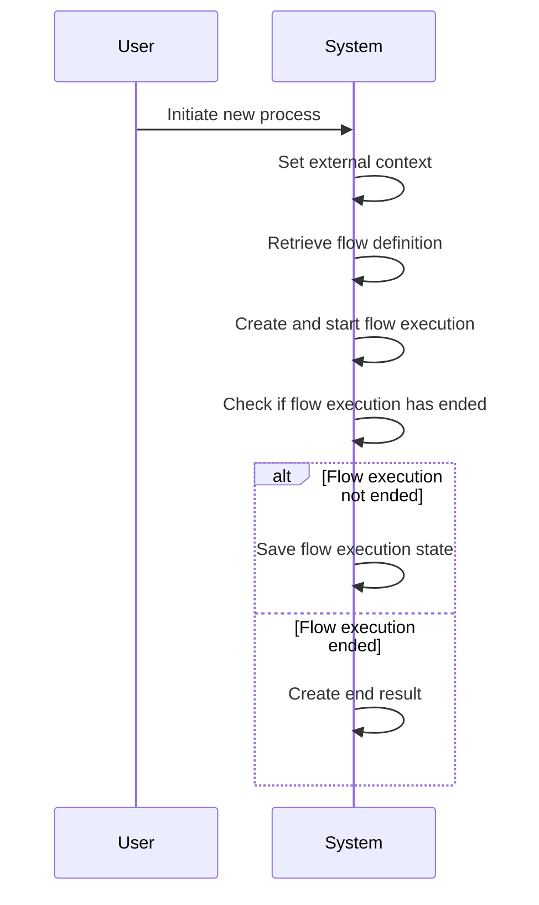

This document describes the flow of launching a new execution within the system. The process involves setting the external context, retrieving the flow definition, creating and starting the flow execution, and managing its state.

For instance, when a user initiates a new process, the system sets the external context, retrieves the appropriate flow definition, and starts the flow execution with the provided input. If the flow execution is not complete, it is saved to the repository for future continuation.



# Flow drill down

```mermaid
graph TD
  subgraph launchExecution
    launchExecution:A["Log and set external context"] --> launchExecution:B["Get Flow Definition"]
    launchExecution:B --> launchExecution:C["Create Flow Execution"]
    launchExecution:C --> launchExecution:D["Start Flow Execution"]
    launchExecution:D --> launchExecution:E["Check if Flow Execution has ended"]
    launchExecution:E -->|No| launchExecution:F["Get Lock for Flow Execution"]
    launchExecution:F --> launchExecution:G["Put Flow Execution in Repository"]
    launchExecution:E -->|Yes| launchExecution:H["Create End Result"]
    launchExecution:G --> launchExecution:I["Create Paused Result"]
  end
  subgraph putFlowExecution
    putFlowExecution:A["Assert key set for Flow Execution"] --> putFlowExecution:B["Get Conversation"]
    putFlowExecution:B --> putFlowExecution:C["Get Snapshot Group"]
    putFlowExecution:C --> putFlowExecution:D["Create Snapshot"]
    putFlowExecution:D --> putFlowExecution:E["Add Snapshot to Group"]
    putFlowExecution:E --> putFlowExecution:F["Put Conversation Scope"]
  end
  subgraph start
    start:A["Assert start state set"] --> start:B["Create Variables"]
    start:B --> start:C["Map Input Data"]
    start:C --> start:D["Execute Start Actions"]
    start:D --> start:E["Enter Start State"]
  end
  launchExecution:D --> start
  launchExecution:G --> putFlowExecution

%% Swimm:
%% graph TD
%%   subgraph <SwmToken path="spring-webflow/src/main/java/org/springframework/webflow/executor/FlowExecutorImpl.java" pos="130:5:5" line-data="	public FlowExecutionResult launchExecution(String flowId, MutableAttributeMap&lt;?&gt; input, ExternalContext context)">`launchExecution`</SwmToken>
%%     <SwmToken path="spring-webflow/src/main/java/org/springframework/webflow/executor/FlowExecutorImpl.java" pos="130:5:5" line-data="	public FlowExecutionResult launchExecution(String flowId, MutableAttributeMap&lt;?&gt; input, ExternalContext context)">`launchExecution`</SwmToken>:A["Log and set external context"] --> <SwmToken path="spring-webflow/src/main/java/org/springframework/webflow/executor/FlowExecutorImpl.java" pos="130:5:5" line-data="	public FlowExecutionResult launchExecution(String flowId, MutableAttributeMap&lt;?&gt; input, ExternalContext context)">`launchExecution`</SwmToken>:B["Get Flow Definition"]
%%     <SwmToken path="spring-webflow/src/main/java/org/springframework/webflow/executor/FlowExecutorImpl.java" pos="130:5:5" line-data="	public FlowExecutionResult launchExecution(String flowId, MutableAttributeMap&lt;?&gt; input, ExternalContext context)">`launchExecution`</SwmToken>:B --> <SwmToken path="spring-webflow/src/main/java/org/springframework/webflow/executor/FlowExecutorImpl.java" pos="130:5:5" line-data="	public FlowExecutionResult launchExecution(String flowId, MutableAttributeMap&lt;?&gt; input, ExternalContext context)">`launchExecution`</SwmToken>:C["Create Flow Execution"]
%%     <SwmToken path="spring-webflow/src/main/java/org/springframework/webflow/executor/FlowExecutorImpl.java" pos="130:5:5" line-data="	public FlowExecutionResult launchExecution(String flowId, MutableAttributeMap&lt;?&gt; input, ExternalContext context)">`launchExecution`</SwmToken>:C --> <SwmToken path="spring-webflow/src/main/java/org/springframework/webflow/executor/FlowExecutorImpl.java" pos="130:5:5" line-data="	public FlowExecutionResult launchExecution(String flowId, MutableAttributeMap&lt;?&gt; input, ExternalContext context)">`launchExecution`</SwmToken>:D["Start Flow Execution"]
%%     <SwmToken path="spring-webflow/src/main/java/org/springframework/webflow/executor/FlowExecutorImpl.java" pos="130:5:5" line-data="	public FlowExecutionResult launchExecution(String flowId, MutableAttributeMap&lt;?&gt; input, ExternalContext context)">`launchExecution`</SwmToken>:D --> <SwmToken path="spring-webflow/src/main/java/org/springframework/webflow/executor/FlowExecutorImpl.java" pos="130:5:5" line-data="	public FlowExecutionResult launchExecution(String flowId, MutableAttributeMap&lt;?&gt; input, ExternalContext context)">`launchExecution`</SwmToken>:E["Check if Flow Execution has ended"]
%%     <SwmToken path="spring-webflow/src/main/java/org/springframework/webflow/executor/FlowExecutorImpl.java" pos="130:5:5" line-data="	public FlowExecutionResult launchExecution(String flowId, MutableAttributeMap&lt;?&gt; input, ExternalContext context)">`launchExecution`</SwmToken>:E -->|No| <SwmToken path="spring-webflow/src/main/java/org/springframework/webflow/executor/FlowExecutorImpl.java" pos="130:5:5" line-data="	public FlowExecutionResult launchExecution(String flowId, MutableAttributeMap&lt;?&gt; input, ExternalContext context)">`launchExecution`</SwmToken>:F["Get Lock for Flow Execution"]
%%     <SwmToken path="spring-webflow/src/main/java/org/springframework/webflow/executor/FlowExecutorImpl.java" pos="130:5:5" line-data="	public FlowExecutionResult launchExecution(String flowId, MutableAttributeMap&lt;?&gt; input, ExternalContext context)">`launchExecution`</SwmToken>:F --> <SwmToken path="spring-webflow/src/main/java/org/springframework/webflow/executor/FlowExecutorImpl.java" pos="130:5:5" line-data="	public FlowExecutionResult launchExecution(String flowId, MutableAttributeMap&lt;?&gt; input, ExternalContext context)">`launchExecution`</SwmToken>:G["Put Flow Execution in Repository"]
%%     <SwmToken path="spring-webflow/src/main/java/org/springframework/webflow/executor/FlowExecutorImpl.java" pos="130:5:5" line-data="	public FlowExecutionResult launchExecution(String flowId, MutableAttributeMap&lt;?&gt; input, ExternalContext context)">`launchExecution`</SwmToken>:E -->|Yes| <SwmToken path="spring-webflow/src/main/java/org/springframework/webflow/executor/FlowExecutorImpl.java" pos="130:5:5" line-data="	public FlowExecutionResult launchExecution(String flowId, MutableAttributeMap&lt;?&gt; input, ExternalContext context)">`launchExecution`</SwmToken>:H["Create End Result"]
%%     <SwmToken path="spring-webflow/src/main/java/org/springframework/webflow/executor/FlowExecutorImpl.java" pos="130:5:5" line-data="	public FlowExecutionResult launchExecution(String flowId, MutableAttributeMap&lt;?&gt; input, ExternalContext context)">`launchExecution`</SwmToken>:G --> <SwmToken path="spring-webflow/src/main/java/org/springframework/webflow/executor/FlowExecutorImpl.java" pos="130:5:5" line-data="	public FlowExecutionResult launchExecution(String flowId, MutableAttributeMap&lt;?&gt; input, ExternalContext context)">`launchExecution`</SwmToken>:I["Create Paused Result"]
%%   end
%%   subgraph <SwmToken path="spring-webflow/src/main/java/org/springframework/webflow/executor/FlowExecutorImpl.java" pos="144:3:3" line-data="					executionRepository.putFlowExecution(flowExecution);">`putFlowExecution`</SwmToken>
%%     <SwmToken path="spring-webflow/src/main/java/org/springframework/webflow/executor/FlowExecutorImpl.java" pos="144:3:3" line-data="					executionRepository.putFlowExecution(flowExecution);">`putFlowExecution`</SwmToken>:A["Assert key set for Flow Execution"] --> <SwmToken path="spring-webflow/src/main/java/org/springframework/webflow/executor/FlowExecutorImpl.java" pos="144:3:3" line-data="					executionRepository.putFlowExecution(flowExecution);">`putFlowExecution`</SwmToken>:B["Get Conversation"]
%%     <SwmToken path="spring-webflow/src/main/java/org/springframework/webflow/executor/FlowExecutorImpl.java" pos="144:3:3" line-data="					executionRepository.putFlowExecution(flowExecution);">`putFlowExecution`</SwmToken>:B --> <SwmToken path="spring-webflow/src/main/java/org/springframework/webflow/executor/FlowExecutorImpl.java" pos="144:3:3" line-data="					executionRepository.putFlowExecution(flowExecution);">`putFlowExecution`</SwmToken>:C["Get Snapshot Group"]
%%     <SwmToken path="spring-webflow/src/main/java/org/springframework/webflow/executor/FlowExecutorImpl.java" pos="144:3:3" line-data="					executionRepository.putFlowExecution(flowExecution);">`putFlowExecution`</SwmToken>:C --> <SwmToken path="spring-webflow/src/main/java/org/springframework/webflow/executor/FlowExecutorImpl.java" pos="144:3:3" line-data="					executionRepository.putFlowExecution(flowExecution);">`putFlowExecution`</SwmToken>:D["Create Snapshot"]
%%     <SwmToken path="spring-webflow/src/main/java/org/springframework/webflow/executor/FlowExecutorImpl.java" pos="144:3:3" line-data="					executionRepository.putFlowExecution(flowExecution);">`putFlowExecution`</SwmToken>:D --> <SwmToken path="spring-webflow/src/main/java/org/springframework/webflow/executor/FlowExecutorImpl.java" pos="144:3:3" line-data="					executionRepository.putFlowExecution(flowExecution);">`putFlowExecution`</SwmToken>:E["Add Snapshot to Group"]
%%     <SwmToken path="spring-webflow/src/main/java/org/springframework/webflow/executor/FlowExecutorImpl.java" pos="144:3:3" line-data="					executionRepository.putFlowExecution(flowExecution);">`putFlowExecution`</SwmToken>:E --> <SwmToken path="spring-webflow/src/main/java/org/springframework/webflow/executor/FlowExecutorImpl.java" pos="144:3:3" line-data="					executionRepository.putFlowExecution(flowExecution);">`putFlowExecution`</SwmToken>:F["Put Conversation Scope"]
%%   end
%%   subgraph start
%%     start:A["Assert start state set"] --> start:B["Create Variables"]
%%     start:B --> start:C["Map Input Data"]
%%     start:C --> start:D["Execute Start Actions"]
%%     start:D --> start:E["Enter Start State"]
%%   end
%%   <SwmToken path="spring-webflow/src/main/java/org/springframework/webflow/executor/FlowExecutorImpl.java" pos="130:5:5" line-data="	public FlowExecutionResult launchExecution(String flowId, MutableAttributeMap&lt;?&gt; input, ExternalContext context)">`launchExecution`</SwmToken>:D --> start
%%   <SwmToken path="spring-webflow/src/main/java/org/springframework/webflow/executor/FlowExecutorImpl.java" pos="130:5:5" line-data="	public FlowExecutionResult launchExecution(String flowId, MutableAttributeMap&lt;?&gt; input, ExternalContext context)">`launchExecution`</SwmToken>:G --> <SwmToken path="spring-webflow/src/main/java/org/springframework/webflow/executor/FlowExecutorImpl.java" pos="144:3:3" line-data="					executionRepository.putFlowExecution(flowExecution);">`putFlowExecution`</SwmToken>
```



<SwmSnippet path="/spring-webflow/src/main/java/org/springframework/webflow/executor/FlowExecutorImpl.java" line="136">

---

First, the <SwmToken path="spring-webflow/src/main/java/org/springframework/webflow/executor/FlowExecutorImpl.java" pos="130:5:5" line-data="	public FlowExecutionResult launchExecution(String flowId, MutableAttributeMap&lt;?&gt; input, ExternalContext context)">`launchExecution`</SwmToken> method is responsible for initiating a new flow execution. It begins by setting the external context and retrieving the flow definition. This ensures that the flow execution is based on the correct flow configuration.

```java
			ExternalContextHolder.setExternalContext(context);
			FlowDefinition flowDefinition = definitionLocator.getFlowDefinition(flowId);
			FlowExecution flowExecution = executionFactory.createFlowExecution(flowDefinition);
```

---

</SwmSnippet>

<SwmSnippet path="/spring-webflow/src/main/java/org/springframework/webflow/executor/FlowExecutorImpl.java" line="138">

---

Next, the flow execution is created and started with the provided input and context. This step involves mapping the input data into the flow and executing any start actions defined for the flow.

```java
			FlowExecution flowExecution = executionFactory.createFlowExecution(flowDefinition);
			flowExecution.start(input, context);
```

---

</SwmSnippet>

<SwmSnippet path="/spring-webflow/src/main/java/org/springframework/webflow/execution/repository/impl/DefaultFlowExecutionRepository.java" line="118">

---

Then, if the flow execution has not ended, a lock is obtained to ensure thread safety while saving the flow execution state. The <SwmToken path="spring-webflow/src/main/java/org/springframework/webflow/execution/repository/impl/DefaultFlowExecutionRepository.java" pos="118:5:5" line-data="	public void putFlowExecution(FlowExecution flowExecution) {">`putFlowExecution`</SwmToken> method is called to save the current state of the flow execution to the repository. This involves creating a snapshot of the flow execution and adding it to the snapshot group associated with the conversation.

```java
	public void putFlowExecution(FlowExecution flowExecution) {
		assertKeySet(flowExecution);
		if (logger.isDebugEnabled()) {
			logger.debug("Putting flow execution '" + flowExecution + "' into repository");
		}
		FlowExecutionKey key = flowExecution.getKey();
		Conversation conversation = getConversation(key);
		FlowExecutionSnapshotGroup snapshotGroup = getSnapshotGroup(conversation);
		FlowExecutionSnapshot snapshot = snapshot(flowExecution);
		if (logger.isDebugEnabled()) {
			logger.debug("Adding snapshot to group with id " + getSnapshotId(key));
		}
		snapshotGroup.addSnapshot(getSnapshotId(key), snapshot);
```

---

</SwmSnippet>

<SwmSnippet path="/spring-webflow/src/main/java/org/springframework/webflow/executor/FlowExecutorImpl.java" line="142">

---

Finally, the lock is released, and the method returns a result indicating whether the flow execution is paused or has ended. This ensures that the flow execution state is consistently saved and can be resumed or completed as needed.

```java
				lock.lock();
				try {
					executionRepository.putFlowExecution(flowExecution);
				} finally {
					lock.unlock();
				}
				return createPausedResult(flowExecution);
			} else {
				return createEndResult(flowExecution);
			}
```

---

</SwmSnippet>

&nbsp;

*This is an auto-generated document by Swimm 🌊 and has not yet been verified by a human*

<SwmMeta version="3.0.0" repo-id="Z2l0aHViJTNBJTNBc3ByaW5nLXdlYmZsb3ctZGVtbyUzQSUzQWdpbGFkbmF2b3Q=" repo-name="spring-webflow-demo"><sup>Powered by [Swimm](/)</sup></SwmMeta>
