This document explains the process of locating the appropriate scope for a given attribute within the Spring Web Flow framework. The <SwmToken path="spring-webflow/src/main/java/org/springframework/webflow/expression/spel/ScopeSearchingPropertyAccessor.java" pos="37:4:4" line-data="		return (findScopeForAttribute((RequestContext) target, name) != null);">`findScopeForAttribute`</SwmToken> method is responsible for searching through various scopes to find where a specific attribute is defined.

For instance, if an attribute named 'user' is being searched, the method will check the request scope, flash scope, view scope, flow scope, and conversation scope in that order until it finds the attribute or returns null if the attribute is not found in any scope.

```mermaid
graph TD
 subgraph findScopeForAttribute
 findScopeForAttribute:A["Check request scope"] -->|Contains name| findScopeForAttribute:B["Return request scope"]
 findScopeForAttribute:A -->|Does not contain name| findScopeForAttribute:C["Check flash scope"]
 findScopeForAttribute:C -->|Contains name| findScopeForAttribute:D["Return flash scope"]
 findScopeForAttribute:C -->|Does not contain name| findScopeForAttribute:E["Check view scope"]
 findScopeForAttribute:E -->|Contains name| findScopeForAttribute:F["Return view scope"]
 findScopeForAttribute:E -->|Does not contain name| findScopeForAttribute:G["Check flow scope"]
 findScopeForAttribute:G -->|Contains name| findScopeForAttribute:H["Return flow scope"]
 findScopeForAttribute:G -->|Does not contain name| findScopeForAttribute:I["Check conversation scope"]
 findScopeForAttribute:I -->|Contains name| findScopeForAttribute:J["Return conversation scope"]
 findScopeForAttribute:I -->|Does not contain name| findScopeForAttribute:K["Return null"]
 end

%% Swimm:
%% graph TD
%%  subgraph <SwmToken path="spring-webflow/src/main/java/org/springframework/webflow/expression/spel/ScopeSearchingPropertyAccessor.java" pos="37:4:4" line-data="		return (findScopeForAttribute((RequestContext) target, name) != null);">`findScopeForAttribute`</SwmToken>
%%  <SwmToken path="spring-webflow/src/main/java/org/springframework/webflow/expression/spel/ScopeSearchingPropertyAccessor.java" pos="37:4:4" line-data="		return (findScopeForAttribute((RequestContext) target, name) != null);">`findScopeForAttribute`</SwmToken>:A["Check request scope"] -->|Contains name| <SwmToken path="spring-webflow/src/main/java/org/springframework/webflow/expression/spel/ScopeSearchingPropertyAccessor.java" pos="37:4:4" line-data="		return (findScopeForAttribute((RequestContext) target, name) != null);">`findScopeForAttribute`</SwmToken>:B["Return request scope"]
%%  <SwmToken path="spring-webflow/src/main/java/org/springframework/webflow/expression/spel/ScopeSearchingPropertyAccessor.java" pos="37:4:4" line-data="		return (findScopeForAttribute((RequestContext) target, name) != null);">`findScopeForAttribute`</SwmToken>:A -->|Does not contain name| <SwmToken path="spring-webflow/src/main/java/org/springframework/webflow/expression/spel/ScopeSearchingPropertyAccessor.java" pos="37:4:4" line-data="		return (findScopeForAttribute((RequestContext) target, name) != null);">`findScopeForAttribute`</SwmToken>:C["Check flash scope"]
%%  <SwmToken path="spring-webflow/src/main/java/org/springframework/webflow/expression/spel/ScopeSearchingPropertyAccessor.java" pos="37:4:4" line-data="		return (findScopeForAttribute((RequestContext) target, name) != null);">`findScopeForAttribute`</SwmToken>:C -->|Contains name| <SwmToken path="spring-webflow/src/main/java/org/springframework/webflow/expression/spel/ScopeSearchingPropertyAccessor.java" pos="37:4:4" line-data="		return (findScopeForAttribute((RequestContext) target, name) != null);">`findScopeForAttribute`</SwmToken>:D["Return flash scope"]
%%  <SwmToken path="spring-webflow/src/main/java/org/springframework/webflow/expression/spel/ScopeSearchingPropertyAccessor.java" pos="37:4:4" line-data="		return (findScopeForAttribute((RequestContext) target, name) != null);">`findScopeForAttribute`</SwmToken>:C -->|Does not contain name| <SwmToken path="spring-webflow/src/main/java/org/springframework/webflow/expression/spel/ScopeSearchingPropertyAccessor.java" pos="37:4:4" line-data="		return (findScopeForAttribute((RequestContext) target, name) != null);">`findScopeForAttribute`</SwmToken>:E["Check view scope"]
%%  <SwmToken path="spring-webflow/src/main/java/org/springframework/webflow/expression/spel/ScopeSearchingPropertyAccessor.java" pos="37:4:4" line-data="		return (findScopeForAttribute((RequestContext) target, name) != null);">`findScopeForAttribute`</SwmToken>:E -->|Contains name| <SwmToken path="spring-webflow/src/main/java/org/springframework/webflow/expression/spel/ScopeSearchingPropertyAccessor.java" pos="37:4:4" line-data="		return (findScopeForAttribute((RequestContext) target, name) != null);">`findScopeForAttribute`</SwmToken>:F["Return view scope"]
%%  <SwmToken path="spring-webflow/src/main/java/org/springframework/webflow/expression/spel/ScopeSearchingPropertyAccessor.java" pos="37:4:4" line-data="		return (findScopeForAttribute((RequestContext) target, name) != null);">`findScopeForAttribute`</SwmToken>:E -->|Does not contain name| <SwmToken path="spring-webflow/src/main/java/org/springframework/webflow/expression/spel/ScopeSearchingPropertyAccessor.java" pos="37:4:4" line-data="		return (findScopeForAttribute((RequestContext) target, name) != null);">`findScopeForAttribute`</SwmToken>:G["Check flow scope"]
%%  <SwmToken path="spring-webflow/src/main/java/org/springframework/webflow/expression/spel/ScopeSearchingPropertyAccessor.java" pos="37:4:4" line-data="		return (findScopeForAttribute((RequestContext) target, name) != null);">`findScopeForAttribute`</SwmToken>:G -->|Contains name| <SwmToken path="spring-webflow/src/main/java/org/springframework/webflow/expression/spel/ScopeSearchingPropertyAccessor.java" pos="37:4:4" line-data="		return (findScopeForAttribute((RequestContext) target, name) != null);">`findScopeForAttribute`</SwmToken>:H["Return flow scope"]
%%  <SwmToken path="spring-webflow/src/main/java/org/springframework/webflow/expression/spel/ScopeSearchingPropertyAccessor.java" pos="37:4:4" line-data="		return (findScopeForAttribute((RequestContext) target, name) != null);">`findScopeForAttribute`</SwmToken>:G -->|Does not contain name| <SwmToken path="spring-webflow/src/main/java/org/springframework/webflow/expression/spel/ScopeSearchingPropertyAccessor.java" pos="37:4:4" line-data="		return (findScopeForAttribute((RequestContext) target, name) != null);">`findScopeForAttribute`</SwmToken>:I["Check conversation scope"]
%%  <SwmToken path="spring-webflow/src/main/java/org/springframework/webflow/expression/spel/ScopeSearchingPropertyAccessor.java" pos="37:4:4" line-data="		return (findScopeForAttribute((RequestContext) target, name) != null);">`findScopeForAttribute`</SwmToken>:I -->|Contains name| <SwmToken path="spring-webflow/src/main/java/org/springframework/webflow/expression/spel/ScopeSearchingPropertyAccessor.java" pos="37:4:4" line-data="		return (findScopeForAttribute((RequestContext) target, name) != null);">`findScopeForAttribute`</SwmToken>:J["Return conversation scope"]
%%  <SwmToken path="spring-webflow/src/main/java/org/springframework/webflow/expression/spel/ScopeSearchingPropertyAccessor.java" pos="37:4:4" line-data="		return (findScopeForAttribute((RequestContext) target, name) != null);">`findScopeForAttribute`</SwmToken>:I -->|Does not contain name| <SwmToken path="spring-webflow/src/main/java/org/springframework/webflow/expression/spel/ScopeSearchingPropertyAccessor.java" pos="37:4:4" line-data="		return (findScopeForAttribute((RequestContext) target, name) != null);">`findScopeForAttribute`</SwmToken>:K["Return null"]
%%  end
```

# Where is this flow used?

This flow is used multiple times in the codebase as represented in the following diagram:

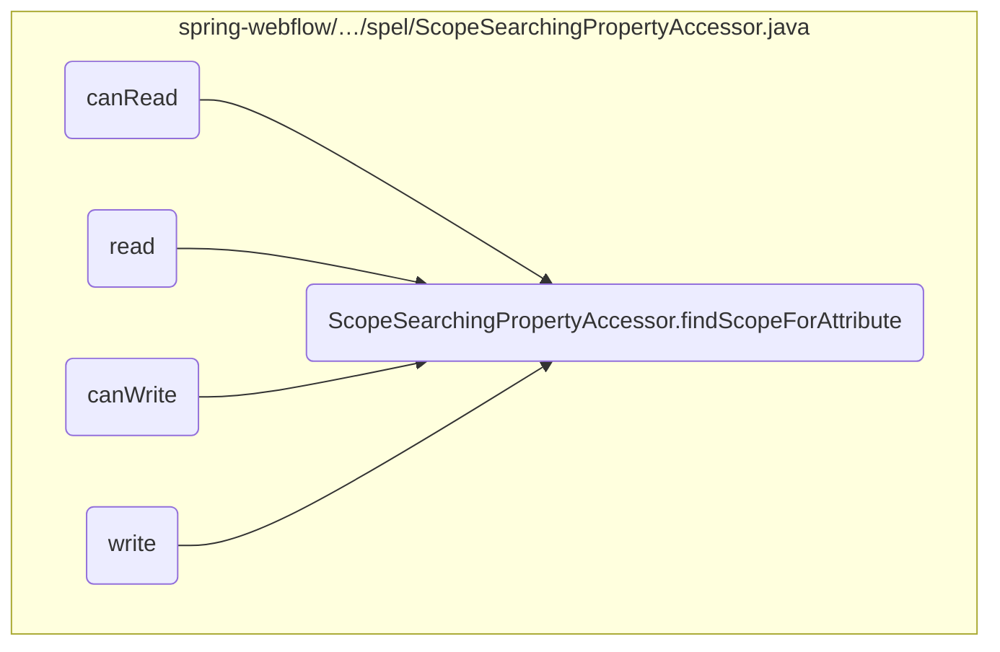

Here is a high level diagram of the flow, showing only the most important functions:

```mermaid
graph TD;
      subgraph springwebflowsrcmainjavaorgspringframeworkwebflowengineimpl[spring-webflow/…/engine/impl]
3c0f6eec8b48713ba0c72258e20fa1da3cda947a579dd391808124724c04e8e5(ScopeSearchingPropertyAccessor.findScopeForAttribute) --> 36cd0f06bf2b53883de9e27686e2946cfdb42a56eb864613f705f30aa43a381f(RequestControlContextImpl.inViewState)
end

subgraph springwebflowsrcmainjavaorgspringframeworkwebflowengineimpl[spring-webflow/…/engine/impl]
3c0f6eec8b48713ba0c72258e20fa1da3cda947a579dd391808124724c04e8e5(ScopeSearchingPropertyAccessor.findScopeForAttribute) --> fc24bdc8d6c87b55168a8b80d3031935b3cdeedf934343fd858bc9728f617657(FlowSessionImpl.getViewScope)
end

subgraph springwebflowsrcmainjavaorgspringframeworkwebflowengineimpl[spring-webflow/…/engine/impl]
3c0f6eec8b48713ba0c72258e20fa1da3cda947a579dd391808124724c04e8e5(ScopeSearchingPropertyAccessor.findScopeForAttribute) --> 30ae5db1b586d84599d6f0090af8e62db35226253da9699484086b1b6216ace9(RequestControlContextImpl.getFlowScope)
end

subgraph springwebflowsrcmainjavaorgspringframeworkwebflowengine[spring-webflow/…/webflow/engine]
3c0f6eec8b48713ba0c72258e20fa1da3cda947a579dd391808124724c04e8e5(ScopeSearchingPropertyAccessor.findScopeForAttribute) --> 77524e5ec67db4c8b2e9d8a3ada00561d283c212265cc0114fa8f0909ff40ef0(ActionList.contains)
end

subgraph springwebflowsrcmainjavaorgspringframeworkwebflowengineimpl[spring-webflow/…/engine/impl]
36cd0f06bf2b53883de9e27686e2946cfdb42a56eb864613f705f30aa43a381f(RequestControlContextImpl.inViewState) --> d7bbae802f3a8b92568ca9012e4817bea49ff2b7103d2211d0bb7e177268e8de(RequestControlContextImpl.getCurrentState)
end

subgraph springwebflowsrcmainjavaorgspringframeworkwebflowengineimpl[spring-webflow/…/engine/impl]
36cd0f06bf2b53883de9e27686e2946cfdb42a56eb864613f705f30aa43a381f(RequestControlContextImpl.inViewState) --> 15bc4c8a2c3be0445cf76b9dd3cecbb675e9e1941ccf47b0a01f43ea3edf480c(FlowExecutionImpl.isActive)
end

subgraph springwebflowsrcmainjavaorgspringframeworkwebflowengine[spring-webflow/…/webflow/engine]
36cd0f06bf2b53883de9e27686e2946cfdb42a56eb864613f705f30aa43a381f(RequestControlContextImpl.inViewState) --> 8bd8b6ef3618a52cb2c4ffc5faddb450d560ede5ec878b7a98ab47170c91ef6e(State.isViewState)
end

subgraph springwebflowsrcmainjavaorgspringframeworkwebflowengineimpl[spring-webflow/…/engine/impl]
d7bbae802f3a8b92568ca9012e4817bea49ff2b7103d2211d0bb7e177268e8de(RequestControlContextImpl.getCurrentState) --> 10bbbfd98dce465898fb3f595fd4ff030182370708eb4707e1e202cda2d53fb2(FlowExecutionImpl.getActiveSession)
end

subgraph springwebflowsrcmainjavaorgspringframeworkwebflowengineimpl[spring-webflow/…/engine/impl]
d7bbae802f3a8b92568ca9012e4817bea49ff2b7103d2211d0bb7e177268e8de(RequestControlContextImpl.getCurrentState) --> 80f7a48d7f4da1bc925f33d2c02081d81670c7c86b15ff88ff376b21b5a5f665(FlowSessionImpl.getState)
end

subgraph springwebflowsrcmainjavaorgspringframeworkwebflowengineimpl[spring-webflow/…/engine/impl]
10bbbfd98dce465898fb3f595fd4ff030182370708eb4707e1e202cda2d53fb2(FlowExecutionImpl.getActiveSession) --> ef7d21868df0748f2857c0aced9ac12257ad53bf3a435c27b3a5f9bef01ffefd(FlowExecutionImpl.getActiveSessionInternal)
end

subgraph springwebflowsrcmainjavaorgspringframeworkwebflowengineimpl[spring-webflow/…/engine/impl]
10bbbfd98dce465898fb3f595fd4ff030182370708eb4707e1e202cda2d53fb2(FlowExecutionImpl.getActiveSession) --> 15bc4c8a2c3be0445cf76b9dd3cecbb675e9e1941ccf47b0a01f43ea3edf480c(FlowExecutionImpl.isActive)
end

subgraph springwebflowsrcmainjavaorgspringframeworkwebflow[spring-webflow/…/springframework/webflow]
ef7d21868df0748f2857c0aced9ac12257ad53bf3a435c27b3a5f9bef01ffefd(FlowExecutionImpl.getActiveSessionInternal) --> 439b4d42c1ffd24551e88ee2d091ec292718d8850d9e9dd469b609adec6be041(LocalParameterMap.isEmpty)
end

subgraph springwebflowsrcmainjavaorgspringframeworkwebflowengine[spring-webflow/…/webflow/engine]
fc24bdc8d6c87b55168a8b80d3031935b3cdeedf934343fd858bc9728f617657(FlowSessionImpl.getViewScope) --> 7a0757f91c6232ab35c9f41f6ec69c1f2f5042f977bfa4cf7dd624df60851d2b(Transition.getId)
end

subgraph springwebflowsrcmainjavaorgspringframeworkwebflowengine[spring-webflow/…/webflow/engine]
fc24bdc8d6c87b55168a8b80d3031935b3cdeedf934343fd858bc9728f617657(FlowSessionImpl.getViewScope) --> 8bd8b6ef3618a52cb2c4ffc5faddb450d560ede5ec878b7a98ab47170c91ef6e(State.isViewState)
end

subgraph springwebflowsrcmainjavaorgspringframeworkwebflowengine[spring-webflow/…/webflow/engine]
7a0757f91c6232ab35c9f41f6ec69c1f2f5042f977bfa4cf7dd624df60851d2b(Transition.getId) --> 74eb8a8a48dd875071dc7551d2cff7c41412c659a255552c7f3228dc41a752a8(Transition.toString)
end

subgraph springwebflowsrcmainjavaorgspringframeworkwebflowengine[spring-webflow/…/webflow/engine]
74eb8a8a48dd875071dc7551d2cff7c41412c659a255552c7f3228dc41a752a8(Transition.toString) --> d26c17ce993cb6d4c6fa454b0c0fc965158150d086e420d97abec77be2447fca(Transition.getMatchingCriteria)
end

subgraph springwebflowsrcmainjavaorgspringframeworkwebflowengine[spring-webflow/…/webflow/engine]
74eb8a8a48dd875071dc7551d2cff7c41412c659a255552c7f3228dc41a752a8(Transition.toString) --> 162e538641b4f7f3ac1999dd848bab505358bac5c2d086a6421d1a15b57c3f0f(Transition.getTargetStateResolver)
end

subgraph springwebflowsrcmainjavaorgspringframeworkwebflowengineimpl[spring-webflow/…/engine/impl]
30ae5db1b586d84599d6f0090af8e62db35226253da9699484086b1b6216ace9(RequestControlContextImpl.getFlowScope) --> 10bbbfd98dce465898fb3f595fd4ff030182370708eb4707e1e202cda2d53fb2(FlowExecutionImpl.getActiveSession)
end

subgraph springwebflowsrcmainjavaorgspringframeworkwebflowengineimpl[spring-webflow/…/engine/impl]
30ae5db1b586d84599d6f0090af8e62db35226253da9699484086b1b6216ace9(RequestControlContextImpl.getFlowScope) --> e792b9ca36c479c9720ebf1da0cb8c0986605bff289f60dfc3e8c8f8b1f9bbd5(FlowSessionImpl.getScope)
end


      classDef mainFlowStyle color:#000000,fill:#7CB9F4
classDef rootsStyle color:#000000,fill:#00FFF4
classDef Style1 color:#000000,fill:#00FFAA
classDef Style2 color:#000000,fill:#FFFF00
classDef Style3 color:#000000,fill:#AA7CB9

%% Swimm:
%% graph TD;
%%       subgraph springwebflowsrcmainjavaorgspringframeworkwebflowengineimpl[<SwmPath>[spring-webflow/…/engine/impl/](spring-webflow/src/main/java/org/springframework/webflow/engine/impl/)</SwmPath>]
%% 3c0f6eec8b48713ba0c72258e20fa1da3cda947a579dd391808124724c04e8e5(ScopeSearchingPropertyAccessor.findScopeForAttribute) --> 36cd0f06bf2b53883de9e27686e2946cfdb42a56eb864613f705f30aa43a381f(RequestControlContextImpl.inViewState)
%% end
%% 
%% subgraph springwebflowsrcmainjavaorgspringframeworkwebflowengineimpl[<SwmPath>[spring-webflow/…/engine/impl/](spring-webflow/src/main/java/org/springframework/webflow/engine/impl/)</SwmPath>]
%% 3c0f6eec8b48713ba0c72258e20fa1da3cda947a579dd391808124724c04e8e5(ScopeSearchingPropertyAccessor.findScopeForAttribute) --> fc24bdc8d6c87b55168a8b80d3031935b3cdeedf934343fd858bc9728f617657(FlowSessionImpl.getViewScope)
%% end
%% 
%% subgraph springwebflowsrcmainjavaorgspringframeworkwebflowengineimpl[<SwmPath>[spring-webflow/…/engine/impl/](spring-webflow/src/main/java/org/springframework/webflow/engine/impl/)</SwmPath>]
%% 3c0f6eec8b48713ba0c72258e20fa1da3cda947a579dd391808124724c04e8e5(ScopeSearchingPropertyAccessor.findScopeForAttribute) --> 30ae5db1b586d84599d6f0090af8e62db35226253da9699484086b1b6216ace9(RequestControlContextImpl.getFlowScope)
%% end
%% 
%% subgraph springwebflowsrcmainjavaorgspringframeworkwebflowengine[<SwmPath>[spring-webflow/…/webflow/engine/](spring-webflow/src/main/java/org/springframework/webflow/engine/)</SwmPath>]
%% 3c0f6eec8b48713ba0c72258e20fa1da3cda947a579dd391808124724c04e8e5(ScopeSearchingPropertyAccessor.findScopeForAttribute) --> 77524e5ec67db4c8b2e9d8a3ada00561d283c212265cc0114fa8f0909ff40ef0(ActionList.contains)
%% end
%% 
%% subgraph springwebflowsrcmainjavaorgspringframeworkwebflowengineimpl[<SwmPath>[spring-webflow/…/engine/impl/](spring-webflow/src/main/java/org/springframework/webflow/engine/impl/)</SwmPath>]
%% 36cd0f06bf2b53883de9e27686e2946cfdb42a56eb864613f705f30aa43a381f(RequestControlContextImpl.inViewState) --> d7bbae802f3a8b92568ca9012e4817bea49ff2b7103d2211d0bb7e177268e8de(RequestControlContextImpl.getCurrentState)
%% end
%% 
%% subgraph springwebflowsrcmainjavaorgspringframeworkwebflowengineimpl[<SwmPath>[spring-webflow/…/engine/impl/](spring-webflow/src/main/java/org/springframework/webflow/engine/impl/)</SwmPath>]
%% 36cd0f06bf2b53883de9e27686e2946cfdb42a56eb864613f705f30aa43a381f(RequestControlContextImpl.inViewState) --> 15bc4c8a2c3be0445cf76b9dd3cecbb675e9e1941ccf47b0a01f43ea3edf480c(FlowExecutionImpl.isActive)
%% end
%% 
%% subgraph springwebflowsrcmainjavaorgspringframeworkwebflowengine[<SwmPath>[spring-webflow/…/webflow/engine/](spring-webflow/src/main/java/org/springframework/webflow/engine/)</SwmPath>]
%% 36cd0f06bf2b53883de9e27686e2946cfdb42a56eb864613f705f30aa43a381f(RequestControlContextImpl.inViewState) --> 8bd8b6ef3618a52cb2c4ffc5faddb450d560ede5ec878b7a98ab47170c91ef6e(State.isViewState)
%% end
%% 
%% subgraph springwebflowsrcmainjavaorgspringframeworkwebflowengineimpl[<SwmPath>[spring-webflow/…/engine/impl/](spring-webflow/src/main/java/org/springframework/webflow/engine/impl/)</SwmPath>]
%% d7bbae802f3a8b92568ca9012e4817bea49ff2b7103d2211d0bb7e177268e8de(RequestControlContextImpl.getCurrentState) --> 10bbbfd98dce465898fb3f595fd4ff030182370708eb4707e1e202cda2d53fb2(FlowExecutionImpl.getActiveSession)
%% end
%% 
%% subgraph springwebflowsrcmainjavaorgspringframeworkwebflowengineimpl[<SwmPath>[spring-webflow/…/engine/impl/](spring-webflow/src/main/java/org/springframework/webflow/engine/impl/)</SwmPath>]
%% d7bbae802f3a8b92568ca9012e4817bea49ff2b7103d2211d0bb7e177268e8de(RequestControlContextImpl.getCurrentState) --> 80f7a48d7f4da1bc925f33d2c02081d81670c7c86b15ff88ff376b21b5a5f665(FlowSessionImpl.getState)
%% end
%% 
%% subgraph springwebflowsrcmainjavaorgspringframeworkwebflowengineimpl[<SwmPath>[spring-webflow/…/engine/impl/](spring-webflow/src/main/java/org/springframework/webflow/engine/impl/)</SwmPath>]
%% 10bbbfd98dce465898fb3f595fd4ff030182370708eb4707e1e202cda2d53fb2(FlowExecutionImpl.getActiveSession) --> ef7d21868df0748f2857c0aced9ac12257ad53bf3a435c27b3a5f9bef01ffefd(FlowExecutionImpl.getActiveSessionInternal)
%% end
%% 
%% subgraph springwebflowsrcmainjavaorgspringframeworkwebflowengineimpl[<SwmPath>[spring-webflow/…/engine/impl/](spring-webflow/src/main/java/org/springframework/webflow/engine/impl/)</SwmPath>]
%% 10bbbfd98dce465898fb3f595fd4ff030182370708eb4707e1e202cda2d53fb2(FlowExecutionImpl.getActiveSession) --> 15bc4c8a2c3be0445cf76b9dd3cecbb675e9e1941ccf47b0a01f43ea3edf480c(FlowExecutionImpl.isActive)
%% end
%% 
%% subgraph springwebflowsrcmainjavaorgspringframeworkwebflow[<SwmPath>[spring-webflow/…/springframework/webflow/](spring-webflow/src/main/java/org/springframework/webflow/)</SwmPath>]
%% ef7d21868df0748f2857c0aced9ac12257ad53bf3a435c27b3a5f9bef01ffefd(FlowExecutionImpl.getActiveSessionInternal) --> 439b4d42c1ffd24551e88ee2d091ec292718d8850d9e9dd469b609adec6be041(LocalParameterMap.isEmpty)
%% end
%% 
%% subgraph springwebflowsrcmainjavaorgspringframeworkwebflowengine[<SwmPath>[spring-webflow/…/webflow/engine/](spring-webflow/src/main/java/org/springframework/webflow/engine/)</SwmPath>]
%% fc24bdc8d6c87b55168a8b80d3031935b3cdeedf934343fd858bc9728f617657(FlowSessionImpl.getViewScope) --> 7a0757f91c6232ab35c9f41f6ec69c1f2f5042f977bfa4cf7dd624df60851d2b(Transition.getId)
%% end
%% 
%% subgraph springwebflowsrcmainjavaorgspringframeworkwebflowengine[<SwmPath>[spring-webflow/…/webflow/engine/](spring-webflow/src/main/java/org/springframework/webflow/engine/)</SwmPath>]
%% fc24bdc8d6c87b55168a8b80d3031935b3cdeedf934343fd858bc9728f617657(FlowSessionImpl.getViewScope) --> 8bd8b6ef3618a52cb2c4ffc5faddb450d560ede5ec878b7a98ab47170c91ef6e(State.isViewState)
%% end
%% 
%% subgraph springwebflowsrcmainjavaorgspringframeworkwebflowengine[<SwmPath>[spring-webflow/…/webflow/engine/](spring-webflow/src/main/java/org/springframework/webflow/engine/)</SwmPath>]
%% 7a0757f91c6232ab35c9f41f6ec69c1f2f5042f977bfa4cf7dd624df60851d2b(Transition.getId) --> 74eb8a8a48dd875071dc7551d2cff7c41412c659a255552c7f3228dc41a752a8(Transition.toString)
%% end
%% 
%% subgraph springwebflowsrcmainjavaorgspringframeworkwebflowengine[<SwmPath>[spring-webflow/…/webflow/engine/](spring-webflow/src/main/java/org/springframework/webflow/engine/)</SwmPath>]
%% 74eb8a8a48dd875071dc7551d2cff7c41412c659a255552c7f3228dc41a752a8(Transition.toString) --> d26c17ce993cb6d4c6fa454b0c0fc965158150d086e420d97abec77be2447fca(Transition.getMatchingCriteria)
%% end
%% 
%% subgraph springwebflowsrcmainjavaorgspringframeworkwebflowengine[<SwmPath>[spring-webflow/…/webflow/engine/](spring-webflow/src/main/java/org/springframework/webflow/engine/)</SwmPath>]
%% 74eb8a8a48dd875071dc7551d2cff7c41412c659a255552c7f3228dc41a752a8(Transition.toString) --> 162e538641b4f7f3ac1999dd848bab505358bac5c2d086a6421d1a15b57c3f0f(Transition.getTargetStateResolver)
%% end
%% 
%% subgraph springwebflowsrcmainjavaorgspringframeworkwebflowengineimpl[<SwmPath>[spring-webflow/…/engine/impl/](spring-webflow/src/main/java/org/springframework/webflow/engine/impl/)</SwmPath>]
%% 30ae5db1b586d84599d6f0090af8e62db35226253da9699484086b1b6216ace9(RequestControlContextImpl.getFlowScope) --> 10bbbfd98dce465898fb3f595fd4ff030182370708eb4707e1e202cda2d53fb2(FlowExecutionImpl.getActiveSession)
%% end
%% 
%% subgraph springwebflowsrcmainjavaorgspringframeworkwebflowengineimpl[<SwmPath>[spring-webflow/…/engine/impl/](spring-webflow/src/main/java/org/springframework/webflow/engine/impl/)</SwmPath>]
%% 30ae5db1b586d84599d6f0090af8e62db35226253da9699484086b1b6216ace9(RequestControlContextImpl.getFlowScope) --> e792b9ca36c479c9720ebf1da0cb8c0986605bff289f60dfc3e8c8f8b1f9bbd5(FlowSessionImpl.getScope)
%% end
%% 
%% 
%%       classDef mainFlowStyle color:#000000,fill:#7CB9F4
%% classDef rootsStyle color:#000000,fill:#00FFF4
%% classDef Style1 color:#000000,fill:#00FFAA
%% classDef Style2 color:#000000,fill:#FFFF00
%% classDef Style3 color:#000000,fill:#AA7CB9
```

# Flow drill down

## Diving into <SwmToken path="spring-webflow/src/main/java/org/springframework/webflow/expression/spel/ScopeSearchingPropertyAccessor.java" pos="37:4:4" line-data="		return (findScopeForAttribute((RequestContext) target, name) != null);">`findScopeForAttribute`</SwmToken> & contains

```mermaid
graph TD
  subgraph findScopeForAttribute
    findScopeForAttribute:A["Check request scope"] -->|Contains name| findScopeForAttribute:B["Return request scope"]
    findScopeForAttribute:A -->|Does not contain name| findScopeForAttribute:C["Check flash scope"]
    findScopeForAttribute:C -->|Contains name| findScopeForAttribute:D["Return flash scope"]
    findScopeForAttribute:C -->|Does not contain name| findScopeForAttribute:E["Check view scope"]
    findScopeForAttribute:E -->|Contains name| findScopeForAttribute:F["Return view scope"]
    findScopeForAttribute:E -->|Does not contain name| findScopeForAttribute:G["Check flow scope"]
    findScopeForAttribute:G -->|Contains name| findScopeForAttribute:H["Return flow scope"]
    findScopeForAttribute:G -->|Does not contain name| findScopeForAttribute:I["Check conversation scope"]
    findScopeForAttribute:I -->|Contains name| findScopeForAttribute:J["Return conversation scope"]
    findScopeForAttribute:I -->|Does not contain name| findScopeForAttribute:K["Return null"]
  end
  subgraph contains
    contains:A["Check if action is in the list"] --> contains:B["Return true or false"]
  end

%% Swimm:
%% graph TD
%%   subgraph <SwmToken path="spring-webflow/src/main/java/org/springframework/webflow/expression/spel/ScopeSearchingPropertyAccessor.java" pos="37:4:4" line-data="		return (findScopeForAttribute((RequestContext) target, name) != null);">`findScopeForAttribute`</SwmToken>
%%     <SwmToken path="spring-webflow/src/main/java/org/springframework/webflow/expression/spel/ScopeSearchingPropertyAccessor.java" pos="37:4:4" line-data="		return (findScopeForAttribute((RequestContext) target, name) != null);">`findScopeForAttribute`</SwmToken>:A["Check request scope"] -->|Contains name| <SwmToken path="spring-webflow/src/main/java/org/springframework/webflow/expression/spel/ScopeSearchingPropertyAccessor.java" pos="37:4:4" line-data="		return (findScopeForAttribute((RequestContext) target, name) != null);">`findScopeForAttribute`</SwmToken>:B["Return request scope"]
%%     <SwmToken path="spring-webflow/src/main/java/org/springframework/webflow/expression/spel/ScopeSearchingPropertyAccessor.java" pos="37:4:4" line-data="		return (findScopeForAttribute((RequestContext) target, name) != null);">`findScopeForAttribute`</SwmToken>:A -->|Does not contain name| <SwmToken path="spring-webflow/src/main/java/org/springframework/webflow/expression/spel/ScopeSearchingPropertyAccessor.java" pos="37:4:4" line-data="		return (findScopeForAttribute((RequestContext) target, name) != null);">`findScopeForAttribute`</SwmToken>:C["Check flash scope"]
%%     <SwmToken path="spring-webflow/src/main/java/org/springframework/webflow/expression/spel/ScopeSearchingPropertyAccessor.java" pos="37:4:4" line-data="		return (findScopeForAttribute((RequestContext) target, name) != null);">`findScopeForAttribute`</SwmToken>:C -->|Contains name| <SwmToken path="spring-webflow/src/main/java/org/springframework/webflow/expression/spel/ScopeSearchingPropertyAccessor.java" pos="37:4:4" line-data="		return (findScopeForAttribute((RequestContext) target, name) != null);">`findScopeForAttribute`</SwmToken>:D["Return flash scope"]
%%     <SwmToken path="spring-webflow/src/main/java/org/springframework/webflow/expression/spel/ScopeSearchingPropertyAccessor.java" pos="37:4:4" line-data="		return (findScopeForAttribute((RequestContext) target, name) != null);">`findScopeForAttribute`</SwmToken>:C -->|Does not contain name| <SwmToken path="spring-webflow/src/main/java/org/springframework/webflow/expression/spel/ScopeSearchingPropertyAccessor.java" pos="37:4:4" line-data="		return (findScopeForAttribute((RequestContext) target, name) != null);">`findScopeForAttribute`</SwmToken>:E["Check view scope"]
%%     <SwmToken path="spring-webflow/src/main/java/org/springframework/webflow/expression/spel/ScopeSearchingPropertyAccessor.java" pos="37:4:4" line-data="		return (findScopeForAttribute((RequestContext) target, name) != null);">`findScopeForAttribute`</SwmToken>:E -->|Contains name| <SwmToken path="spring-webflow/src/main/java/org/springframework/webflow/expression/spel/ScopeSearchingPropertyAccessor.java" pos="37:4:4" line-data="		return (findScopeForAttribute((RequestContext) target, name) != null);">`findScopeForAttribute`</SwmToken>:F["Return view scope"]
%%     <SwmToken path="spring-webflow/src/main/java/org/springframework/webflow/expression/spel/ScopeSearchingPropertyAccessor.java" pos="37:4:4" line-data="		return (findScopeForAttribute((RequestContext) target, name) != null);">`findScopeForAttribute`</SwmToken>:E -->|Does not contain name| <SwmToken path="spring-webflow/src/main/java/org/springframework/webflow/expression/spel/ScopeSearchingPropertyAccessor.java" pos="37:4:4" line-data="		return (findScopeForAttribute((RequestContext) target, name) != null);">`findScopeForAttribute`</SwmToken>:G["Check flow scope"]
%%     <SwmToken path="spring-webflow/src/main/java/org/springframework/webflow/expression/spel/ScopeSearchingPropertyAccessor.java" pos="37:4:4" line-data="		return (findScopeForAttribute((RequestContext) target, name) != null);">`findScopeForAttribute`</SwmToken>:G -->|Contains name| <SwmToken path="spring-webflow/src/main/java/org/springframework/webflow/expression/spel/ScopeSearchingPropertyAccessor.java" pos="37:4:4" line-data="		return (findScopeForAttribute((RequestContext) target, name) != null);">`findScopeForAttribute`</SwmToken>:H["Return flow scope"]
%%     <SwmToken path="spring-webflow/src/main/java/org/springframework/webflow/expression/spel/ScopeSearchingPropertyAccessor.java" pos="37:4:4" line-data="		return (findScopeForAttribute((RequestContext) target, name) != null);">`findScopeForAttribute`</SwmToken>:G -->|Does not contain name| <SwmToken path="spring-webflow/src/main/java/org/springframework/webflow/expression/spel/ScopeSearchingPropertyAccessor.java" pos="37:4:4" line-data="		return (findScopeForAttribute((RequestContext) target, name) != null);">`findScopeForAttribute`</SwmToken>:I["Check conversation scope"]
%%     <SwmToken path="spring-webflow/src/main/java/org/springframework/webflow/expression/spel/ScopeSearchingPropertyAccessor.java" pos="37:4:4" line-data="		return (findScopeForAttribute((RequestContext) target, name) != null);">`findScopeForAttribute`</SwmToken>:I -->|Contains name| <SwmToken path="spring-webflow/src/main/java/org/springframework/webflow/expression/spel/ScopeSearchingPropertyAccessor.java" pos="37:4:4" line-data="		return (findScopeForAttribute((RequestContext) target, name) != null);">`findScopeForAttribute`</SwmToken>:J["Return conversation scope"]
%%     <SwmToken path="spring-webflow/src/main/java/org/springframework/webflow/expression/spel/ScopeSearchingPropertyAccessor.java" pos="37:4:4" line-data="		return (findScopeForAttribute((RequestContext) target, name) != null);">`findScopeForAttribute`</SwmToken>:I -->|Does not contain name| <SwmToken path="spring-webflow/src/main/java/org/springframework/webflow/expression/spel/ScopeSearchingPropertyAccessor.java" pos="37:4:4" line-data="		return (findScopeForAttribute((RequestContext) target, name) != null);">`findScopeForAttribute`</SwmToken>:K["Return null"]
%%   end
%%   subgraph contains
%%     contains:A["Check if action is in the list"] --> contains:B["Return true or false"]
%%   end
```

<SwmSnippet path="/spring-webflow/src/main/java/org/springframework/webflow/expression/spel/ScopeSearchingPropertyAccessor.java" line="57">

---

First, the <SwmToken path="spring-webflow/src/main/java/org/springframework/webflow/expression/spel/ScopeSearchingPropertyAccessor.java" pos="37:4:4" line-data="		return (findScopeForAttribute((RequestContext) target, name) != null);">`findScopeForAttribute`</SwmToken> method checks if the attribute is present in the request scope. If the attribute is found, it returns the request scope.

```java
		if (requestContext.getRequestScope().contains(name)) {
			return requestContext.getRequestScope();
		}
```

---

</SwmSnippet>

## Zooming into <SwmToken path="spring-webflow/src/main/java/org/springframework/webflow/expression/spel/ScopeSearchingPropertyAccessor.java" pos="63:6:6" line-data="		if (requestContext.inViewState() &amp;&amp; requestContext.getViewScope().contains(name)) {">`inViewState`</SwmToken> & <SwmToken path="spring-webflow/src/main/java/org/springframework/webflow/engine/impl/FlowExecutionImpl.java" pos="173:5:5" line-data="	public boolean isActive() {">`isActive`</SwmToken> & <SwmToken path="spring-webflow/src/main/java/org/springframework/webflow/engine/impl/FlowSessionImpl.java" pos="118:7:7" line-data="		if (!state.isViewState()) {">`isViewState`</SwmToken>

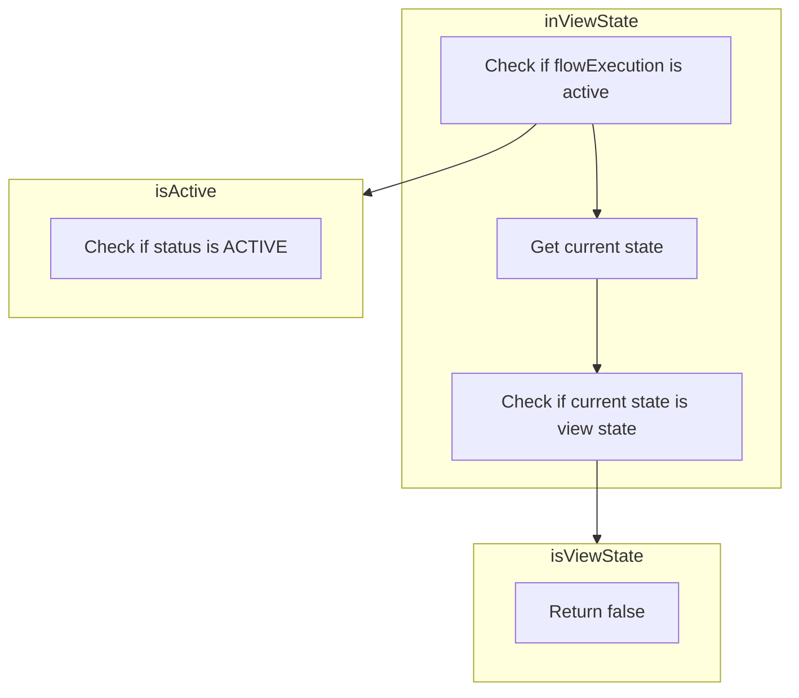

<SwmSnippet path="/spring-webflow/src/main/java/org/springframework/webflow/engine/impl/FlowExecutionImpl.java" line="173">

---

First, the <SwmToken path="spring-webflow/src/main/java/org/springframework/webflow/expression/spel/ScopeSearchingPropertyAccessor.java" pos="63:6:6" line-data="		if (requestContext.inViewState() &amp;&amp; requestContext.getViewScope().contains(name)) {">`inViewState`</SwmToken> method checks if the flow execution is active. This ensures that the flow is currently running and has not been paused or terminated.

```java
	public boolean isActive() {
		return status == FlowExecutionStatus.ACTIVE;
	}
```

---

</SwmSnippet>

## Looking at <SwmToken path="spring-webflow/src/main/java/org/springframework/webflow/engine/impl/RequestControlContextImpl.java" pos="109:5:5" line-data="	public StateDefinition getCurrentState() {">`getCurrentState`</SwmToken> & <SwmToken path="spring-webflow/src/main/java/org/springframework/webflow/engine/impl/RequestControlContextImpl.java" pos="110:9:9" line-data="		return flowExecution.getActiveSession().getState();">`getState`</SwmToken>

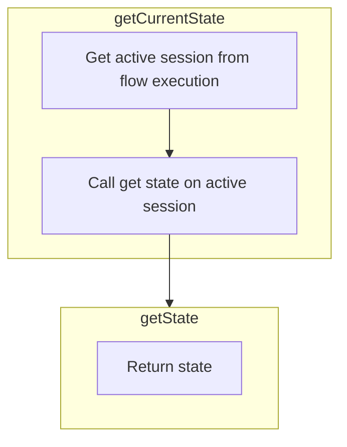

## Retrieving the Current State

First, the <SwmToken path="spring-webflow/src/main/java/org/springframework/webflow/engine/impl/RequestControlContextImpl.java" pos="109:5:5" line-data="	public StateDefinition getCurrentState() {">`getCurrentState`</SwmToken> method is responsible for retrieving the current state of the flow session. This is crucial for determining the exact point within the flow where the user currently is, which helps in managing the flow's progression and ensuring the correct state transitions.

<SwmSnippet path="/spring-webflow/src/main/java/org/springframework/webflow/engine/impl/RequestControlContextImpl.java" line="109">

---

Moving to the implementation, the <SwmToken path="spring-webflow/src/main/java/org/springframework/webflow/engine/impl/RequestControlContextImpl.java" pos="109:5:5" line-data="	public StateDefinition getCurrentState() {">`getCurrentState`</SwmToken> method calls <SwmToken path="spring-webflow/src/main/java/org/springframework/webflow/engine/impl/RequestControlContextImpl.java" pos="110:5:5" line-data="		return flowExecution.getActiveSession().getState();">`getActiveSession`</SwmToken> on the <SwmToken path="spring-webflow/src/main/java/org/springframework/webflow/engine/impl/RequestControlContextImpl.java" pos="110:3:3" line-data="		return flowExecution.getActiveSession().getState();">`flowExecution`</SwmToken> object. This step ensures that the active session of the flow execution is retrieved, which is necessary to access the current state.

```java
	public StateDefinition getCurrentState() {
		return flowExecution.getActiveSession().getState();
	}
```

---

</SwmSnippet>

<SwmSnippet path="/spring-webflow/src/main/java/org/springframework/webflow/engine/impl/FlowSessionImpl.java" line="104">

---

Next, the <SwmToken path="spring-webflow/src/main/java/org/springframework/webflow/engine/impl/RequestControlContextImpl.java" pos="110:5:5" line-data="		return flowExecution.getActiveSession().getState();">`getActiveSession`</SwmToken> method returns the active session, which is then used to call the <SwmToken path="spring-webflow/src/main/java/org/springframework/webflow/engine/impl/FlowSessionImpl.java" pos="104:5:5" line-data="	public StateDefinition getState() {">`getState`</SwmToken> method. This method fetches the current state definition from the active session, ensuring that the flow has the correct state information to proceed.

```java
	public StateDefinition getState() {
		return state;
	}
```

---

</SwmSnippet>

## Exploring <SwmToken path="spring-webflow/src/main/java/org/springframework/webflow/engine/impl/RequestControlContextImpl.java" pos="110:5:5" line-data="		return flowExecution.getActiveSession().getState();">`getActiveSession`</SwmToken>

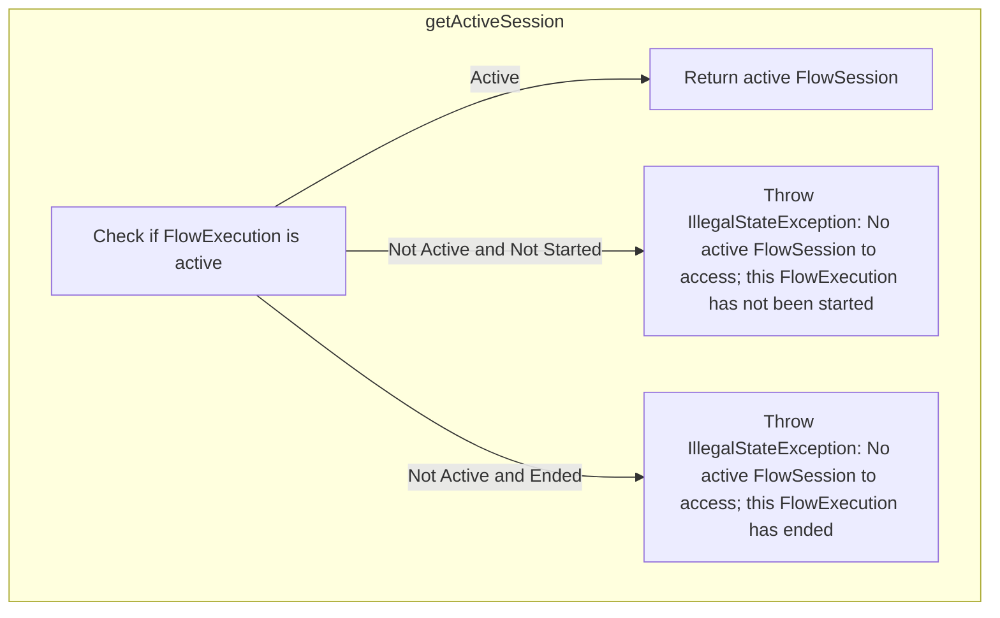

<SwmSnippet path="/spring-webflow/src/main/java/org/springframework/webflow/engine/impl/FlowExecutionImpl.java" line="186">

---

First, the <SwmToken path="spring-webflow/src/main/java/org/springframework/webflow/engine/impl/RequestControlContextImpl.java" pos="110:5:5" line-data="		return flowExecution.getActiveSession().getState();">`getActiveSession`</SwmToken> method checks if the session is active by calling the <SwmToken path="spring-webflow/src/main/java/org/springframework/webflow/engine/impl/FlowExecutionImpl.java" pos="186:5:5" line-data="		if (!isActive()) {">`isActive`</SwmToken> method. This is crucial because it ensures that any operations performed are on a valid and active session. If the session is not active, it throws an <SwmToken path="spring-webflow/src/main/java/org/springframework/webflow/engine/impl/FlowExecutionImpl.java" pos="188:5:5" line-data="				throw new IllegalStateException(">`IllegalStateException`</SwmToken> with a message indicating whether the flow execution has not started or has ended.

```java
		if (!isActive()) {
			if (status == FlowExecutionStatus.NOT_STARTED) {
				throw new IllegalStateException(
						"No active FlowSession to access; this FlowExecution has not been started");
			} else {
				throw new IllegalStateException("No active FlowSession to access; this FlowExecution has ended");
			}
```

---

</SwmSnippet>

<SwmSnippet path="/spring-webflow/src/main/java/org/springframework/webflow/engine/impl/FlowExecutionImpl.java" line="194">

---

Next, if the session is active, the method proceeds to retrieve the active session internally by calling <SwmToken path="spring-webflow/src/main/java/org/springframework/webflow/engine/impl/FlowExecutionImpl.java" pos="194:3:3" line-data="		return getActiveSessionInternal();">`getActiveSessionInternal`</SwmToken>. This step is essential as it fetches the current active session, allowing the flow execution to continue with the correct session context.

```java
		return getActiveSessionInternal();
	}
```

---

</SwmSnippet>

## Breaking down <SwmToken path="spring-webflow/src/main/java/org/springframework/webflow/engine/impl/FlowExecutionImpl.java" pos="194:3:3" line-data="		return getActiveSessionInternal();">`getActiveSessionInternal`</SwmToken> & <SwmToken path="spring-webflow/src/main/java/org/springframework/webflow/engine/impl/FlowExecutionImpl.java" pos="556:6:6" line-data="		if (flowSessions.isEmpty()) {">`isEmpty`</SwmToken>

```mermaid
graph TD
  subgraph getActiveSessionInternal
    getActiveSessionInternal:A["Check if flowSessions is empty"] -->|Yes| getActiveSessionInternal:B["Return null"]
    getActiveSessionInternal:A -->|No| getActiveSessionInternal:C["Return last session"]
  end
  subgraph isEmpty
    isEmpty:A["Check if parameters are empty"] --> isEmpty:B["Return the result"]
  end

%% Swimm:
%% graph TD
%%   subgraph <SwmToken path="spring-webflow/src/main/java/org/springframework/webflow/engine/impl/FlowExecutionImpl.java" pos="194:3:3" line-data="		return getActiveSessionInternal();">`getActiveSessionInternal`</SwmToken>
%%     <SwmToken path="spring-webflow/src/main/java/org/springframework/webflow/engine/impl/FlowExecutionImpl.java" pos="194:3:3" line-data="		return getActiveSessionInternal();">`getActiveSessionInternal`</SwmToken>:A["Check if <SwmToken path="spring-webflow/src/main/java/org/springframework/webflow/engine/impl/FlowExecutionImpl.java" pos="556:4:4" line-data="		if (flowSessions.isEmpty()) {">`flowSessions`</SwmToken> is empty"] -->|Yes| <SwmToken path="spring-webflow/src/main/java/org/springframework/webflow/engine/impl/FlowExecutionImpl.java" pos="194:3:3" line-data="		return getActiveSessionInternal();">`getActiveSessionInternal`</SwmToken>:B["Return null"]
%%     <SwmToken path="spring-webflow/src/main/java/org/springframework/webflow/engine/impl/FlowExecutionImpl.java" pos="194:3:3" line-data="		return getActiveSessionInternal();">`getActiveSessionInternal`</SwmToken>:A -->|No| <SwmToken path="spring-webflow/src/main/java/org/springframework/webflow/engine/impl/FlowExecutionImpl.java" pos="194:3:3" line-data="		return getActiveSessionInternal();">`getActiveSessionInternal`</SwmToken>:C["Return last session"]
%%   end
%%   subgraph <SwmToken path="spring-webflow/src/main/java/org/springframework/webflow/engine/impl/FlowExecutionImpl.java" pos="556:6:6" line-data="		if (flowSessions.isEmpty()) {">`isEmpty`</SwmToken>
%%     <SwmToken path="spring-webflow/src/main/java/org/springframework/webflow/engine/impl/FlowExecutionImpl.java" pos="556:6:6" line-data="		if (flowSessions.isEmpty()) {">`isEmpty`</SwmToken>:A["Check if parameters are empty"] --> <SwmToken path="spring-webflow/src/main/java/org/springframework/webflow/engine/impl/FlowExecutionImpl.java" pos="556:6:6" line-data="		if (flowSessions.isEmpty()) {">`isEmpty`</SwmToken>:B["Return the result"]
%%   end
```

<SwmSnippet path="/spring-webflow/src/main/java/org/springframework/webflow/engine/impl/FlowExecutionImpl.java" line="555">

---

First, the <SwmToken path="spring-webflow/src/main/java/org/springframework/webflow/engine/impl/FlowExecutionImpl.java" pos="555:5:5" line-data="	private FlowSessionImpl getActiveSessionInternal() {">`getActiveSessionInternal`</SwmToken> method is responsible for managing the retrieval of the active flow session. This is crucial for ensuring that the application can correctly track and manage the user's current state within a flow.

```java
	private FlowSessionImpl getActiveSessionInternal() {
		if (flowSessions.isEmpty()) {
			return null;
		}
		return flowSessions.getLast();
	}
```

---

</SwmSnippet>

<SwmSnippet path="/spring-webflow/src/main/java/org/springframework/webflow/engine/impl/FlowExecutionImpl.java" line="556">

---

Moving to the first step within <SwmToken path="spring-webflow/src/main/java/org/springframework/webflow/engine/impl/FlowExecutionImpl.java" pos="194:3:3" line-data="		return getActiveSessionInternal();">`getActiveSessionInternal`</SwmToken>, the method checks if the <SwmToken path="spring-webflow/src/main/java/org/springframework/webflow/engine/impl/FlowExecutionImpl.java" pos="556:4:4" line-data="		if (flowSessions.isEmpty()) {">`flowSessions`</SwmToken> list is empty using the <SwmToken path="spring-webflow/src/main/java/org/springframework/webflow/engine/impl/FlowExecutionImpl.java" pos="556:6:6" line-data="		if (flowSessions.isEmpty()) {">`isEmpty`</SwmToken> method. This is important because if there are no active sessions, the method should return <SwmToken path="spring-webflow/src/main/java/org/springframework/webflow/engine/impl/FlowExecutionImpl.java" pos="557:3:3" line-data="			return null;">`null`</SwmToken>, indicating that there is no active session to manage.

```java
		if (flowSessions.isEmpty()) {
			return null;
```

---

</SwmSnippet>

<SwmSnippet path="/spring-webflow/src/main/java/org/springframework/webflow/engine/impl/FlowExecutionImpl.java" line="559">

---

Next, if the <SwmToken path="spring-webflow/src/main/java/org/springframework/webflow/engine/impl/FlowExecutionImpl.java" pos="559:3:3" line-data="		return flowSessions.getLast();">`flowSessions`</SwmToken> list is not empty, the method retrieves the last session in the list using <SwmToken path="spring-webflow/src/main/java/org/springframework/webflow/engine/impl/FlowExecutionImpl.java" pos="559:5:5" line-data="		return flowSessions.getLast();">`getLast`</SwmToken>. This ensures that the most recent session is returned, which is essential for maintaining the correct state of the user's flow.

```java
		return flowSessions.getLast();
	}
```

---

</SwmSnippet>

## Looking at <SwmToken path="spring-webflow/src/main/java/org/springframework/webflow/expression/spel/ScopeSearchingPropertyAccessor.java" pos="63:14:14" line-data="		if (requestContext.inViewState() &amp;&amp; requestContext.getViewScope().contains(name)) {">`getViewScope`</SwmToken>

```mermaid
graph TD
  subgraph getViewScope
    getViewScope:A["Check if state is null"] --> |Not null| getViewScope:B["Check if state is a view state"]
    getViewScope:B --> |Is view state| getViewScope:C["Return view scope from scope attribute"]
  end

%% Swimm:
%% graph TD
%%   subgraph <SwmToken path="spring-webflow/src/main/java/org/springframework/webflow/expression/spel/ScopeSearchingPropertyAccessor.java" pos="63:14:14" line-data="		if (requestContext.inViewState() &amp;&amp; requestContext.getViewScope().contains(name)) {">`getViewScope`</SwmToken>
%%     <SwmToken path="spring-webflow/src/main/java/org/springframework/webflow/expression/spel/ScopeSearchingPropertyAccessor.java" pos="63:14:14" line-data="		if (requestContext.inViewState() &amp;&amp; requestContext.getViewScope().contains(name)) {">`getViewScope`</SwmToken>:A["Check if state is null"] --> |Not null| <SwmToken path="spring-webflow/src/main/java/org/springframework/webflow/expression/spel/ScopeSearchingPropertyAccessor.java" pos="63:14:14" line-data="		if (requestContext.inViewState() &amp;&amp; requestContext.getViewScope().contains(name)) {">`getViewScope`</SwmToken>:B["Check if state is a view state"]
%%     <SwmToken path="spring-webflow/src/main/java/org/springframework/webflow/expression/spel/ScopeSearchingPropertyAccessor.java" pos="63:14:14" line-data="		if (requestContext.inViewState() &amp;&amp; requestContext.getViewScope().contains(name)) {">`getViewScope`</SwmToken>:B --> |Is view state| <SwmToken path="spring-webflow/src/main/java/org/springframework/webflow/expression/spel/ScopeSearchingPropertyAccessor.java" pos="63:14:14" line-data="		if (requestContext.inViewState() &amp;&amp; requestContext.getViewScope().contains(name)) {">`getViewScope`</SwmToken>:C["Return view scope from scope attribute"]
%%   end
```

<SwmSnippet path="/spring-webflow/src/main/java/org/springframework/webflow/engine/impl/FlowSessionImpl.java" line="114">

---

First, the <SwmToken path="spring-webflow/src/main/java/org/springframework/webflow/expression/spel/ScopeSearchingPropertyAccessor.java" pos="63:14:14" line-data="		if (requestContext.inViewState() &amp;&amp; requestContext.getViewScope().contains(name)) {">`getViewScope`</SwmToken> method checks if the current state of the flow is null. If it is, an <SwmToken path="spring-webflow/src/main/java/org/springframework/webflow/engine/impl/FlowSessionImpl.java" pos="115:5:5" line-data="			throw new IllegalStateException(&quot;The current state of this flow &#39;&quot; + flow.getId()">`IllegalStateException`</SwmToken> is thrown, indicating that the view scope cannot be accessed because the current state is not defined.

```java
		if (state == null) {
			throw new IllegalStateException("The current state of this flow '" + flow.getId()
					+ "' is [null] - cannot access view scope");
```

---

</SwmSnippet>

<SwmSnippet path="/spring-webflow/src/main/java/org/springframework/webflow/engine/impl/FlowSessionImpl.java" line="118">

---

Next, the method verifies if the current state is a view state by calling <SwmToken path="spring-webflow/src/main/java/org/springframework/webflow/engine/impl/FlowSessionImpl.java" pos="118:5:9" line-data="		if (!state.isViewState()) {">`state.isViewState()`</SwmToken>. If the state is not a view state, another <SwmToken path="spring-webflow/src/main/java/org/springframework/webflow/engine/impl/FlowSessionImpl.java" pos="119:5:5" line-data="			throw new IllegalStateException(&quot;The current state &#39;&quot; + state.getId() + &quot;&#39; of this flow &#39;&quot; + flow.getId()">`IllegalStateException`</SwmToken> is thrown, specifying that the view scope is not accessible in the current state.

```java
		if (!state.isViewState()) {
			throw new IllegalStateException("The current state '" + state.getId() + "' of this flow '" + flow.getId()
					+ "' is not a view state - view scope not accessible");
```

---

</SwmSnippet>

<SwmSnippet path="/spring-webflow/src/main/java/org/springframework/webflow/engine/impl/FlowSessionImpl.java" line="122">

---

Then, if both checks pass, the method returns the view scope by accessing the <SwmToken path="spring-webflow/src/main/java/org/springframework/webflow/engine/impl/FlowSessionImpl.java" pos="122:10:10" line-data="		return (MutableAttributeMap&lt;Object&gt;) scope.get(VIEW_SCOPE_ATTRIBUTE);">`scope`</SwmToken> map with the key <SwmToken path="spring-webflow/src/main/java/org/springframework/webflow/engine/impl/FlowSessionImpl.java" pos="122:14:14" line-data="		return (MutableAttributeMap&lt;Object&gt;) scope.get(VIEW_SCOPE_ATTRIBUTE);">`VIEW_SCOPE_ATTRIBUTE`</SwmToken>. This allows the flow to retrieve and manipulate attributes specific to the view scope.

```java
		return (MutableAttributeMap<Object>) scope.get(VIEW_SCOPE_ATTRIBUTE);
```

---

</SwmSnippet>

## Going into <SwmToken path="spring-webflow/src/main/java/org/springframework/webflow/engine/impl/FlowSessionImpl.java" pos="115:27:27" line-data="			throw new IllegalStateException(&quot;The current state of this flow &#39;&quot; + flow.getId()">`getId`</SwmToken>

```mermaid
graph TD
  subgraph getId
    getId:A["Return matching criteria as string"]
  end

%% Swimm:
%% graph TD
%%   subgraph <SwmToken path="spring-webflow/src/main/java/org/springframework/webflow/engine/impl/FlowSessionImpl.java" pos="115:27:27" line-data="			throw new IllegalStateException(&quot;The current state of this flow &#39;&quot; + flow.getId()">`getId`</SwmToken>
%%     <SwmToken path="spring-webflow/src/main/java/org/springframework/webflow/engine/impl/FlowSessionImpl.java" pos="115:27:27" line-data="			throw new IllegalStateException(&quot;The current state of this flow &#39;&quot; + flow.getId()">`getId`</SwmToken>:A["Return matching criteria as string"]
%%   end
```

<SwmSnippet path="/spring-webflow/src/main/java/org/springframework/webflow/engine/Transition.java" line="115">

---

First, the <SwmToken path="spring-webflow/src/main/java/org/springframework/webflow/engine/Transition.java" pos="115:5:5" line-data="	public String getId() {">`getId`</SwmToken> method is called to retrieve the identifier of the transition. This identifier is crucial for distinguishing between different transitions within the flow. The method returns the string representation of the matching criteria, which uniquely defines the transition.

```java
	public String getId() {
		return matchingCriteria.toString();
	}
```

---

</SwmSnippet>

## Diving into <SwmToken path="spring-webflow/src/main/java/org/springframework/webflow/engine/Transition.java" pos="116:5:5" line-data="		return matchingCriteria.toString();">`toString`</SwmToken> & <SwmToken path="spring-webflow/src/main/java/org/springframework/webflow/engine/Transition.java" pos="246:17:17" line-data="		return new ToStringCreator(this).append(&quot;on&quot;, getMatchingCriteria()).append(&quot;to&quot;, getTargetStateResolver())">`getMatchingCriteria`</SwmToken> & <SwmToken path="spring-webflow/src/main/java/org/springframework/webflow/engine/Transition.java" pos="246:29:29" line-data="		return new ToStringCreator(this).append(&quot;on&quot;, getMatchingCriteria()).append(&quot;to&quot;, getTargetStateResolver())">`getTargetStateResolver`</SwmToken>

```mermaid
graph TD
subgraph toString
  toString:A["Create ToStringCreator with current instance"] --> toString:B["Append matching criteria"]
  toString:B --> getMatchingCriteria
  getMatchingCriteria --> toString:C["Append target state resolver"]
  toString:C --> getTargetStateResolver
  getTargetStateResolver --> toString:D["Invoke toString of ToStringCreator"]
end
subgraph getMatchingCriteria
  getMatchingCriteria:A["Return matchingCriteria"]
end
subgraph getTargetStateResolver
  getTargetStateResolver:A["Return targetStateResolver"]
end
toString:B --> getMatchingCriteria
getMatchingCriteria --> toString:C
toString:C --> getTargetStateResolver
getTargetStateResolver --> toString:D

%% Swimm:
%% graph TD
%% subgraph <SwmToken path="spring-webflow/src/main/java/org/springframework/webflow/engine/Transition.java" pos="116:5:5" line-data="		return matchingCriteria.toString();">`toString`</SwmToken>
%%   <SwmToken path="spring-webflow/src/main/java/org/springframework/webflow/engine/Transition.java" pos="116:5:5" line-data="		return matchingCriteria.toString();">`toString`</SwmToken>:A["Create <SwmToken path="spring-webflow/src/main/java/org/springframework/webflow/engine/Transition.java" pos="246:5:5" line-data="		return new ToStringCreator(this).append(&quot;on&quot;, getMatchingCriteria()).append(&quot;to&quot;, getTargetStateResolver())">`ToStringCreator`</SwmToken> with current instance"] --> <SwmToken path="spring-webflow/src/main/java/org/springframework/webflow/engine/Transition.java" pos="116:5:5" line-data="		return matchingCriteria.toString();">`toString`</SwmToken>:B["Append matching criteria"]
%%   <SwmToken path="spring-webflow/src/main/java/org/springframework/webflow/engine/Transition.java" pos="116:5:5" line-data="		return matchingCriteria.toString();">`toString`</SwmToken>:B --> <SwmToken path="spring-webflow/src/main/java/org/springframework/webflow/engine/Transition.java" pos="246:17:17" line-data="		return new ToStringCreator(this).append(&quot;on&quot;, getMatchingCriteria()).append(&quot;to&quot;, getTargetStateResolver())">`getMatchingCriteria`</SwmToken>
%%   <SwmToken path="spring-webflow/src/main/java/org/springframework/webflow/engine/Transition.java" pos="246:17:17" line-data="		return new ToStringCreator(this).append(&quot;on&quot;, getMatchingCriteria()).append(&quot;to&quot;, getTargetStateResolver())">`getMatchingCriteria`</SwmToken> --> <SwmToken path="spring-webflow/src/main/java/org/springframework/webflow/engine/Transition.java" pos="116:5:5" line-data="		return matchingCriteria.toString();">`toString`</SwmToken>:C["Append target state resolver"]
%%   <SwmToken path="spring-webflow/src/main/java/org/springframework/webflow/engine/Transition.java" pos="116:5:5" line-data="		return matchingCriteria.toString();">`toString`</SwmToken>:C --> <SwmToken path="spring-webflow/src/main/java/org/springframework/webflow/engine/Transition.java" pos="246:29:29" line-data="		return new ToStringCreator(this).append(&quot;on&quot;, getMatchingCriteria()).append(&quot;to&quot;, getTargetStateResolver())">`getTargetStateResolver`</SwmToken>
%%   <SwmToken path="spring-webflow/src/main/java/org/springframework/webflow/engine/Transition.java" pos="246:29:29" line-data="		return new ToStringCreator(this).append(&quot;on&quot;, getMatchingCriteria()).append(&quot;to&quot;, getTargetStateResolver())">`getTargetStateResolver`</SwmToken> --> <SwmToken path="spring-webflow/src/main/java/org/springframework/webflow/engine/Transition.java" pos="116:5:5" line-data="		return matchingCriteria.toString();">`toString`</SwmToken>:D["Invoke <SwmToken path="spring-webflow/src/main/java/org/springframework/webflow/engine/Transition.java" pos="116:5:5" line-data="		return matchingCriteria.toString();">`toString`</SwmToken> of <SwmToken path="spring-webflow/src/main/java/org/springframework/webflow/engine/Transition.java" pos="246:5:5" line-data="		return new ToStringCreator(this).append(&quot;on&quot;, getMatchingCriteria()).append(&quot;to&quot;, getTargetStateResolver())">`ToStringCreator`</SwmToken>"]
%% end
%% subgraph <SwmToken path="spring-webflow/src/main/java/org/springframework/webflow/engine/Transition.java" pos="246:17:17" line-data="		return new ToStringCreator(this).append(&quot;on&quot;, getMatchingCriteria()).append(&quot;to&quot;, getTargetStateResolver())">`getMatchingCriteria`</SwmToken>
%%   <SwmToken path="spring-webflow/src/main/java/org/springframework/webflow/engine/Transition.java" pos="246:17:17" line-data="		return new ToStringCreator(this).append(&quot;on&quot;, getMatchingCriteria()).append(&quot;to&quot;, getTargetStateResolver())">`getMatchingCriteria`</SwmToken>:A["Return <SwmToken path="spring-webflow/src/main/java/org/springframework/webflow/engine/Transition.java" pos="116:3:3" line-data="		return matchingCriteria.toString();">`matchingCriteria`</SwmToken>"]
%% end
%% subgraph <SwmToken path="spring-webflow/src/main/java/org/springframework/webflow/engine/Transition.java" pos="246:29:29" line-data="		return new ToStringCreator(this).append(&quot;on&quot;, getMatchingCriteria()).append(&quot;to&quot;, getTargetStateResolver())">`getTargetStateResolver`</SwmToken>
%%   <SwmToken path="spring-webflow/src/main/java/org/springframework/webflow/engine/Transition.java" pos="246:29:29" line-data="		return new ToStringCreator(this).append(&quot;on&quot;, getMatchingCriteria()).append(&quot;to&quot;, getTargetStateResolver())">`getTargetStateResolver`</SwmToken>:A["Return <SwmToken path="spring-webflow/src/main/java/org/springframework/webflow/engine/Transition.java" pos="78:5:5" line-data="	private TargetStateResolver targetStateResolver;">`targetStateResolver`</SwmToken>"]
%% end
%% <SwmToken path="spring-webflow/src/main/java/org/springframework/webflow/engine/Transition.java" pos="116:5:5" line-data="		return matchingCriteria.toString();">`toString`</SwmToken>:B --> <SwmToken path="spring-webflow/src/main/java/org/springframework/webflow/engine/Transition.java" pos="246:17:17" line-data="		return new ToStringCreator(this).append(&quot;on&quot;, getMatchingCriteria()).append(&quot;to&quot;, getTargetStateResolver())">`getMatchingCriteria`</SwmToken>
%% <SwmToken path="spring-webflow/src/main/java/org/springframework/webflow/engine/Transition.java" pos="246:17:17" line-data="		return new ToStringCreator(this).append(&quot;on&quot;, getMatchingCriteria()).append(&quot;to&quot;, getTargetStateResolver())">`getMatchingCriteria`</SwmToken> --> <SwmToken path="spring-webflow/src/main/java/org/springframework/webflow/engine/Transition.java" pos="116:5:5" line-data="		return matchingCriteria.toString();">`toString`</SwmToken>:C
%% <SwmToken path="spring-webflow/src/main/java/org/springframework/webflow/engine/Transition.java" pos="116:5:5" line-data="		return matchingCriteria.toString();">`toString`</SwmToken>:C --> <SwmToken path="spring-webflow/src/main/java/org/springframework/webflow/engine/Transition.java" pos="246:29:29" line-data="		return new ToStringCreator(this).append(&quot;on&quot;, getMatchingCriteria()).append(&quot;to&quot;, getTargetStateResolver())">`getTargetStateResolver`</SwmToken>
%% <SwmToken path="spring-webflow/src/main/java/org/springframework/webflow/engine/Transition.java" pos="246:29:29" line-data="		return new ToStringCreator(this).append(&quot;on&quot;, getMatchingCriteria()).append(&quot;to&quot;, getTargetStateResolver())">`getTargetStateResolver`</SwmToken> --> <SwmToken path="spring-webflow/src/main/java/org/springframework/webflow/engine/Transition.java" pos="116:5:5" line-data="		return matchingCriteria.toString();">`toString`</SwmToken>:D
```

<SwmSnippet path="/spring-webflow/src/main/java/org/springframework/webflow/engine/Transition.java" line="245">

---

First, the <SwmToken path="spring-webflow/src/main/java/org/springframework/webflow/engine/Transition.java" pos="245:5:5" line-data="	public String toString() {">`toString`</SwmToken> method provides a string representation of the transition. This is useful for logging and debugging purposes, as it allows developers to easily understand the transition details. The method constructs a string that includes the matching criteria and the target state resolver, giving a clear overview of the transition's conditions and destination.

```java
	public String toString() {
		return new ToStringCreator(this).append("on", getMatchingCriteria()).append("to", getTargetStateResolver())
				.toString();
	}
```

---

</SwmSnippet>

## Going into <SwmToken path="spring-webflow/src/main/java/org/springframework/webflow/engine/impl/RequestControlContextImpl.java" pos="133:8:8" line-data="	public MutableAttributeMap&lt;Object&gt; getFlowScope() {">`getFlowScope`</SwmToken> & <SwmToken path="spring-webflow/src/main/java/org/springframework/webflow/engine/impl/RequestControlContextImpl.java" pos="134:9:9" line-data="		return flowExecution.getActiveSession().getScope();">`getScope`</SwmToken>

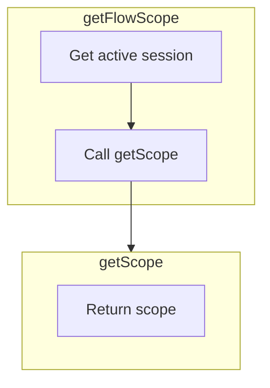

## Retrieving the Flow Scope

First, the <SwmToken path="spring-webflow/src/main/java/org/springframework/webflow/engine/impl/RequestControlContextImpl.java" pos="133:8:8" line-data="	public MutableAttributeMap&lt;Object&gt; getFlowScope() {">`getFlowScope`</SwmToken> method in <SwmToken path="spring-webflow/src/main/java/org/springframework/webflow/engine/impl/FlowExecutionImpl.java" pos="60:30:30" line-data=" * class is closely coupled with package-private &lt;code&gt;FlowSessionImpl&lt;/code&gt; and &lt;code&gt;RequestControlContextImpl&lt;/code&gt;">`RequestControlContextImpl`</SwmToken> is responsible for retrieving the flow scope. This method calls <SwmToken path="spring-webflow/src/main/java/org/springframework/webflow/engine/impl/RequestControlContextImpl.java" pos="110:5:5" line-data="		return flowExecution.getActiveSession().getState();">`getActiveSession`</SwmToken> on the <SwmToken path="spring-webflow/src/main/java/org/springframework/webflow/engine/impl/RequestControlContextImpl.java" pos="110:3:3" line-data="		return flowExecution.getActiveSession().getState();">`flowExecution`</SwmToken> object to get the current active session.

Next, the <SwmToken path="spring-webflow/src/main/java/org/springframework/webflow/engine/impl/RequestControlContextImpl.java" pos="110:5:5" line-data="		return flowExecution.getActiveSession().getState();">`getActiveSession`</SwmToken> method returns the active session, which is then used to call the <SwmToken path="spring-webflow/src/main/java/org/springframework/webflow/engine/impl/RequestControlContextImpl.java" pos="134:9:9" line-data="		return flowExecution.getActiveSession().getScope();">`getScope`</SwmToken> method on the <SwmToken path="spring-webflow/src/main/java/org/springframework/webflow/engine/impl/FlowExecutionImpl.java" pos="555:3:3" line-data="	private FlowSessionImpl getActiveSessionInternal() {">`FlowSessionImpl`</SwmToken> object.

<SwmSnippet path="/spring-webflow/src/main/java/org/springframework/webflow/engine/impl/FlowSessionImpl.java" line="108">

---

Then, the <SwmToken path="spring-webflow/src/main/java/org/springframework/webflow/engine/impl/FlowSessionImpl.java" pos="108:8:8" line-data="	public MutableAttributeMap&lt;Object&gt; getScope() {">`getScope`</SwmToken> method in <SwmToken path="spring-webflow/src/main/java/org/springframework/webflow/engine/impl/FlowExecutionImpl.java" pos="555:3:3" line-data="	private FlowSessionImpl getActiveSessionInternal() {">`FlowSessionImpl`</SwmToken> returns the scope associated with the current flow session. This scope contains all the attributes and data relevant to the current flow execution.

```java
	public MutableAttributeMap<Object> getScope() {
		return scope;
	}
```

---

</SwmSnippet>

<SwmSnippet path="/spring-webflow/src/main/java/org/springframework/webflow/engine/impl/RequestControlContextImpl.java" line="133">

---

Finally, the <SwmToken path="spring-webflow/src/main/java/org/springframework/webflow/engine/impl/RequestControlContextImpl.java" pos="133:8:8" line-data="	public MutableAttributeMap&lt;Object&gt; getFlowScope() {">`getFlowScope`</SwmToken> method returns this scope, making it available for use in the flow execution context.

```java
	public MutableAttributeMap<Object> getFlowScope() {
		return flowExecution.getActiveSession().getScope();
	}
```

---

</SwmSnippet>

&nbsp;

*This is an auto-generated document by Swimm 🌊 and has not yet been verified by a human*

<SwmMeta version="3.0.0" repo-id="Z2l0aHViJTNBJTNBc3ByaW5nLXdlYmZsb3ctZGVtbyUzQSUzQWdpbGFkbmF2b3Q=" repo-name="spring-webflow-demo"><sup>Powered by [Swimm](/)</sup></SwmMeta>
