This document explains the 'managed-root-flow on finish' process, which is responsible for handling the transition and actions when the 'finish' event is triggered in the application. This flow ensures that the user is directed to the appropriate next page and that specific actions are executed to maintain the application's state.

For example, when a user completes a form and triggers the 'finish' event, the flow transitions to the next view, increments a counter, and validates that the counter has reached a specific value.



# Flow drill down

```mermaid
graph TD
subgraph managed-root-flow on finish
  managedRootFlowOnFinish:A["Trigger finish event"] --> managedRootFlowOnFinish:B["Evaluate incrementCountAction"]
  managedRootFlowOnFinish:B --> managedRootFlowOnFinish:C["Evaluate assertCountAction.execute"]
end
subgraph execute
  execute:A["Iterate over each action"] --> execute:B["Call ActionExecutor.execute on action"]
end

%% Swimm:
%% graph TD
%% subgraph managed-root-flow on finish
%%   managedRootFlowOnFinish:A["Trigger finish event"] --> managedRootFlowOnFinish:B["Evaluate <SwmToken path="spring-webflow/src/test/java/org/springframework/webflow/persistence/managed-root-flow.xml" pos="27:7:7" line-data="			&lt;evaluate expression=&quot;incrementCountAction&quot; /&gt;">`incrementCountAction`</SwmToken>"]
%%   managedRootFlowOnFinish:B --> managedRootFlowOnFinish:C["Evaluate <SwmToken path="spring-webflow/src/test/java/org/springframework/webflow/persistence/managed-root-flow.xml" pos="28:7:9" line-data="			&lt;evaluate expression=&quot;assertCountAction.execute(flowRequestContext,2)&quot; /&gt;">`assertCountAction.execute`</SwmToken>"]
%% end
%% subgraph execute
%%   execute:A["Iterate over each action"] --> execute:B["Call <SwmToken path="spring-webflow/src/main/java/org/springframework/webflow/engine/ActionList.java" pos="154:1:3" line-data="			ActionExecutor.execute(action, context);">`ActionExecutor.execute`</SwmToken> on action"]
%% end
```


<SwmSnippet path="/spring-webflow/src/test/java/org/springframework/webflow/persistence/managed-root-flow.xml" line="26">

---

First, the flow transitions to the next view, which is defined as <SwmToken path="spring-webflow/src/test/java/org/springframework/webflow/persistence/managed-root-flow.xml" pos="26:13:13" line-data="		&lt;transition on=&quot;finish&quot; to=&quot;view2&quot;&gt;">`view2`</SwmToken>. This step is crucial as it directs the user to the appropriate next page in the application, ensuring a smooth user experience.

```xml
		<transition on="finish" to="view2">
```

---

</SwmSnippet>

<SwmSnippet path="/spring-webflow/src/test/java/org/springframework/webflow/persistence/managed-root-flow.xml" line="27">

---

Next, the <SwmToken path="spring-webflow/src/test/java/org/springframework/webflow/persistence/managed-root-flow.xml" pos="27:7:7" line-data="			&lt;evaluate expression=&quot;incrementCountAction&quot; /&gt;">`incrementCountAction`</SwmToken> is evaluated. This action likely increments a counter, which could be used for tracking the number of times a certain event has occurred or for pagination purposes.

```xml
			<evaluate expression="incrementCountAction" />
```

---

</SwmSnippet>

<SwmSnippet path="/spring-webflow/src/test/java/org/springframework/webflow/persistence/managed-root-flow.xml" line="28">

---

Then, the <SwmToken path="spring-webflow/src/test/java/org/springframework/webflow/persistence/managed-root-flow.xml" pos="28:7:14" line-data="			&lt;evaluate expression=&quot;assertCountAction.execute(flowRequestContext,2)&quot; /&gt;">`assertCountAction.execute(flowRequestContext,2)`</SwmToken> is evaluated. This step ensures that the count has reached a specific value, in this case, 2. This is important for validating that the previous actions have been executed correctly and the application is in the expected state.

```xml
			<evaluate expression="assertCountAction.execute(flowRequestContext,2)" />
```

---

</SwmSnippet>

<SwmSnippet path="/spring-webflow/src/main/java/org/springframework/webflow/engine/ActionList.java" line="152">

---

Finally, the <SwmToken path="spring-webflow/src/main/java/org/springframework/webflow/engine/ActionList.java" pos="152:5:5" line-data="	public void execute(RequestContext context) {">`execute`</SwmToken> method in the <SwmToken path="spring-webflow/src/main/java/org/springframework/webflow/engine/ActionList.java" pos="41:4:4" line-data="public class ActionList implements Iterable&lt;Action&gt; {">`ActionList`</SwmToken> class iterates over each action in the list and calls their <SwmToken path="spring-webflow/src/main/java/org/springframework/webflow/engine/ActionList.java" pos="152:5:5" line-data="	public void execute(RequestContext context) {">`execute`</SwmToken> method. This ensures that all actions are performed in sequence, maintaining the flow's integrity and ensuring that all necessary operations are completed.

```java
	public void execute(RequestContext context) {
		for (Action action : actions) {
			ActionExecutor.execute(action, context);
		}
	}
```

---

</SwmSnippet>

&nbsp;

*This is an auto-generated document by Swimm 🌊 and has not yet been verified by a human*

<SwmMeta version="3.0.0" repo-id="Z2l0aHViJTNBJTNBc3ByaW5nLXdlYmZsb3ctZGVtbyUzQSUzQWdpbGFkbmF2b3Q=" repo-name="spring-webflow-demo"><sup>Powered by [Swimm](/)</sup></SwmMeta>
