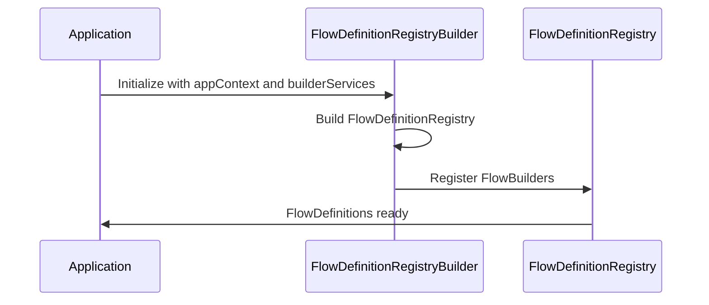
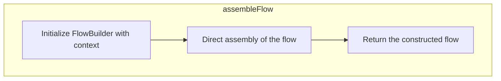

```mermaid
graph TD
  subgraph registerFlowBuilders
    registerFlowBuilders:A["Iterate over flowBuilderInfos"] --> registerFlowBuilders:B["Get attributes from flow builder info"]
    registerFlowBuilders:B --> registerFlowBuilders:C["Update flow attributes"]
    registerFlowBuilders:C --> registerFlowBuilders:D["Create FlowBuilderContext"]
    registerFlowBuilders:D --> registerFlowBuilders:E["Create FlowAssembler"]
    registerFlowBuilders:E --> registerFlowBuilders:F["Assemble and register flow definition"]
  end

%% Swimm:
%% graph TD
%%   subgraph <SwmToken path="spring-webflow/src/main/java/org/springframework/webflow/config/FlowDefinitionRegistryBuilder.java" pos="231:1:1" line-data="		registerFlowBuilders(flowRegistry);">`registerFlowBuilders`</SwmToken>
%%     <SwmToken path="spring-webflow/src/main/java/org/springframework/webflow/config/FlowDefinitionRegistryBuilder.java" pos="231:1:1" line-data="		registerFlowBuilders(flowRegistry);">`registerFlowBuilders`</SwmToken>:A["Iterate over <SwmToken path="spring-webflow/src/main/java/org/springframework/webflow/config/FlowDefinitionRegistryBuilder.java" pos="286:12:12" line-data="		for (FlowBuilderInfo info : this.flowBuilderInfos) {">`flowBuilderInfos`</SwmToken>"] --> <SwmToken path="spring-webflow/src/main/java/org/springframework/webflow/config/FlowDefinitionRegistryBuilder.java" pos="231:1:1" line-data="		registerFlowBuilders(flowRegistry);">`registerFlowBuilders`</SwmToken>:B["Get attributes from flow builder info"]
%%     <SwmToken path="spring-webflow/src/main/java/org/springframework/webflow/config/FlowDefinitionRegistryBuilder.java" pos="231:1:1" line-data="		registerFlowBuilders(flowRegistry);">`registerFlowBuilders`</SwmToken>:B --> <SwmToken path="spring-webflow/src/main/java/org/springframework/webflow/config/FlowDefinitionRegistryBuilder.java" pos="231:1:1" line-data="		registerFlowBuilders(flowRegistry);">`registerFlowBuilders`</SwmToken>:C["Update flow attributes"]
%%     <SwmToken path="spring-webflow/src/main/java/org/springframework/webflow/config/FlowDefinitionRegistryBuilder.java" pos="231:1:1" line-data="		registerFlowBuilders(flowRegistry);">`registerFlowBuilders`</SwmToken>:C --> <SwmToken path="spring-webflow/src/main/java/org/springframework/webflow/config/FlowDefinitionRegistryBuilder.java" pos="231:1:1" line-data="		registerFlowBuilders(flowRegistry);">`registerFlowBuilders`</SwmToken>:D["Create <SwmToken path="spring-webflow/src/main/java/org/springframework/webflow/config/FlowDefinitionRegistryBuilder.java" pos="289:1:1" line-data="			FlowBuilderContext builderContext = new FlowBuilderContextImpl(">`FlowBuilderContext`</SwmToken>"]
%%     <SwmToken path="spring-webflow/src/main/java/org/springframework/webflow/config/FlowDefinitionRegistryBuilder.java" pos="231:1:1" line-data="		registerFlowBuilders(flowRegistry);">`registerFlowBuilders`</SwmToken>:D --> <SwmToken path="spring-webflow/src/main/java/org/springframework/webflow/config/FlowDefinitionRegistryBuilder.java" pos="231:1:1" line-data="		registerFlowBuilders(flowRegistry);">`registerFlowBuilders`</SwmToken>:E["Create <SwmToken path="spring-webflow/src/main/java/org/springframework/webflow/config/FlowDefinitionRegistryBuilder.java" pos="291:1:1" line-data="			FlowAssembler assembler = new FlowAssembler(info.getBuilder(), builderContext);">`FlowAssembler`</SwmToken>"]
%%     <SwmToken path="spring-webflow/src/main/java/org/springframework/webflow/config/FlowDefinitionRegistryBuilder.java" pos="231:1:1" line-data="		registerFlowBuilders(flowRegistry);">`registerFlowBuilders`</SwmToken>:E --> <SwmToken path="spring-webflow/src/main/java/org/springframework/webflow/config/FlowDefinitionRegistryBuilder.java" pos="231:1:1" line-data="		registerFlowBuilders(flowRegistry);">`registerFlowBuilders`</SwmToken>:F["Assemble and register flow definition"]
%%   end
```

```mermaid
graph TD
subgraph directAssembly
 directAssembly:A["Build variables"] --> directAssembly:B["Build input mapper"] --> directAssembly:C["Build start actions"] --> directAssembly:D["Build states"] --> directAssembly:E["Build global transitions"] --> directAssembly:F["Build end actions"] --> directAssembly:G["Build output mapper"] --> directAssembly:H["Build exception handlers"]
end

%% Swimm:
%% graph TD
%% subgraph <SwmToken path="spring-webflow/src/main/java/org/springframework/webflow/engine/builder/FlowAssembler.java" pos="91:1:1" line-data="			directAssembly();">`directAssembly`</SwmToken>
%%  <SwmToken path="spring-webflow/src/main/java/org/springframework/webflow/engine/builder/FlowAssembler.java" pos="91:1:1" line-data="			directAssembly();">`directAssembly`</SwmToken>:A["Build variables"] --> <SwmToken path="spring-webflow/src/main/java/org/springframework/webflow/engine/builder/FlowAssembler.java" pos="91:1:1" line-data="			directAssembly();">`directAssembly`</SwmToken>:B["Build input mapper"] --> <SwmToken path="spring-webflow/src/main/java/org/springframework/webflow/engine/builder/FlowAssembler.java" pos="91:1:1" line-data="			directAssembly();">`directAssembly`</SwmToken>:C["Build start actions"] --> <SwmToken path="spring-webflow/src/main/java/org/springframework/webflow/engine/builder/FlowAssembler.java" pos="91:1:1" line-data="			directAssembly();">`directAssembly`</SwmToken>:D["Build states"] --> <SwmToken path="spring-webflow/src/main/java/org/springframework/webflow/engine/builder/FlowAssembler.java" pos="91:1:1" line-data="			directAssembly();">`directAssembly`</SwmToken>:E["Build global transitions"] --> <SwmToken path="spring-webflow/src/main/java/org/springframework/webflow/engine/builder/FlowAssembler.java" pos="91:1:1" line-data="			directAssembly();">`directAssembly`</SwmToken>:F["Build end actions"] --> <SwmToken path="spring-webflow/src/main/java/org/springframework/webflow/engine/builder/FlowAssembler.java" pos="91:1:1" line-data="			directAssembly();">`directAssembly`</SwmToken>:G["Build output mapper"] --> <SwmToken path="spring-webflow/src/main/java/org/springframework/webflow/engine/builder/FlowAssembler.java" pos="91:1:1" line-data="			directAssembly();">`directAssembly`</SwmToken>:H["Build exception handlers"]
%% end
```

The <SwmToken path="spring-webflow/src/main/java/org/springframework/webflow/config/FlowDefinitionRegistryBuilder.java" pos="84:3:3" line-data="	public FlowDefinitionRegistryBuilder(ApplicationContext appContext, FlowBuilderServices builderServices) {">`FlowDefinitionRegistryBuilder`</SwmToken> is responsible for constructing and managing the <SwmToken path="spring-webflow/src/main/java/org/springframework/webflow/config/FlowDefinitionRegistryBuilder.java" pos="82:7:7" line-data="	 * 	on the FlowDefinitionRegistry">`FlowDefinitionRegistry`</SwmToken>, which is essential for handling flow definitions in the application. This builder ensures that the flow resource factory and builder services are properly configured, and it orchestrates the registration and assembly of flow definitions.

For instance, when a new flow definition needs to be added to the application, the <SwmToken path="spring-webflow/src/main/java/org/springframework/webflow/config/FlowDefinitionRegistryBuilder.java" pos="84:3:3" line-data="	public FlowDefinitionRegistryBuilder(ApplicationContext appContext, FlowBuilderServices builderServices) {">`FlowDefinitionRegistryBuilder`</SwmToken> will initialize the necessary services, register the flow builders, and assemble the flow definitions, making them available for use within the application.



Here is a high level diagram of the flow, showing only the most important functions:

```mermaid
graph TD;
      subgraph springwebflowsrcmainjavaorgspringframeworkwebflowconfigFlowDefinitionRegistryBuilderjava[spring-webflow/…/config/FlowDefinitionRegistryBuilder.java]
a02ff87900594cacd0c4a734353fc82adfda380e1edfcc82452590b94ea3cbbf(FlowDefinitionRegistryBuilder.FlowDefinitionRegistryBuilder) --> f7abb3f2fce39c17c517b7fa8f4bbf979772bec7281505f34709cf90d0b00421(FlowDefinitionRegistryBuilder.build)
end

subgraph springwebflowsrcmainjavaorgspringframeworkwebflowconfigFlowDefinitionRegistryBuilderjava[spring-webflow/…/config/FlowDefinitionRegistryBuilder.java]
f7abb3f2fce39c17c517b7fa8f4bbf979772bec7281505f34709cf90d0b00421(FlowDefinitionRegistryBuilder.build) --> dacf4dca4cd78c434a752a752c5dcd50025f3a22252804d85bd18100ff1debf4(FlowDefinitionRegistryBuilder.registerFlowBuilders)
end

subgraph springwebflowsrcmainjavaorgspringframeworkwebflowenginebuilder[spring-webflow/…/engine/builder]
dacf4dca4cd78c434a752a752c5dcd50025f3a22252804d85bd18100ff1debf4(FlowDefinitionRegistryBuilder.registerFlowBuilders) --> beda375f427bf6aa88a86fd945ee9f0343de08fa3e123e7a21edacb4a918c862(FlowAssembler.assembleFlow)
end

subgraph springwebflowsrcmainjavaorgspringframeworkwebflowenginebuilder[spring-webflow/…/engine/builder]
beda375f427bf6aa88a86fd945ee9f0343de08fa3e123e7a21edacb4a918c862(FlowAssembler.assembleFlow) --> a23a7b61b5d04f5fb043e2fa1ea0b5674e135178db540b9d83b164cbf394346d(FlowAssembler.directAssembly)
end

subgraph springwebflowsrcmainjavaorgspringframeworkwebflowenginebuilder[spring-webflow/…/engine/builder]
a23a7b61b5d04f5fb043e2fa1ea0b5674e135178db540b9d83b164cbf394346d(FlowAssembler.directAssembly) --> c260c1a6db4466fee00d0729adbc0fa302b3ad6405d05ddba4e4e4fb9ee69b0f(FlowModelFlowBuilder.buildStates)
end

subgraph springwebflowsrcmainjavaorgspringframeworkwebflowenginebuilder[spring-webflow/…/engine/builder]
c260c1a6db4466fee00d0729adbc0fa302b3ad6405d05ddba4e4e4fb9ee69b0f(FlowModelFlowBuilder.buildStates) --> 980f6a9ce22205191d9f47ee7e9e21aa525ab87fcef4b9992b837e8093fb2f73(FlowModelFlowBuilder.parseAndAddSubflowState)
end

subgraph springwebflowsrcmainjavaorgspringframeworkwebflowenginebuilder[spring-webflow/…/engine/builder]
c260c1a6db4466fee00d0729adbc0fa302b3ad6405d05ddba4e4e4fb9ee69b0f(FlowModelFlowBuilder.buildStates) --> 38a45c9e0dcfe4ad2bbec0eacb501806eee87de6b81a1d9a426ac679634ab952(FlowModelFlowBuilder.parseAndAddViewState)
end

subgraph springwebflowsrcmainjavaorgspringframeworkwebflowenginebuilder[spring-webflow/…/engine/builder]
c260c1a6db4466fee00d0729adbc0fa302b3ad6405d05ddba4e4e4fb9ee69b0f(FlowModelFlowBuilder.buildStates) --> 504f00713ff43e6afd5669530e02d6c9f6abe9be90aa3389675f1278f7b7635c(FlowModelFlowBuilder.parseAndAddActionState)
end

subgraph springwebflowsrcmainjavaorgspringframeworkwebflowenginebuilder[spring-webflow/…/engine/builder]
c260c1a6db4466fee00d0729adbc0fa302b3ad6405d05ddba4e4e4fb9ee69b0f(FlowModelFlowBuilder.buildStates) --> e9bca2cac4d9dbd67180738ed41ed11e64164e883de585be76daebeb358cd6bd(FlowModelFlowBuilder.parseAndAddEndState)
end


      classDef mainFlowStyle color:#000000,fill:#7CB9F4
classDef rootsStyle color:#000000,fill:#00FFF4
classDef Style1 color:#000000,fill:#00FFAA
classDef Style2 color:#000000,fill:#FFFF00
classDef Style3 color:#000000,fill:#AA7CB9

%% Swimm:
%% graph TD;
%%       subgraph springwebflowsrcmainjavaorgspringframeworkwebflowconfigFlowDefinitionRegistryBuilderjava[<SwmPath>[spring-webflow/…/config/FlowDefinitionRegistryBuilder.java](spring-webflow/src/main/java/org/springframework/webflow/config/FlowDefinitionRegistryBuilder.java)</SwmPath>]
%% a02ff87900594cacd0c4a734353fc82adfda380e1edfcc82452590b94ea3cbbf(FlowDefinitionRegistryBuilder.FlowDefinitionRegistryBuilder) --> f7abb3f2fce39c17c517b7fa8f4bbf979772bec7281505f34709cf90d0b00421(FlowDefinitionRegistryBuilder.build)
%% end
%% 
%% subgraph springwebflowsrcmainjavaorgspringframeworkwebflowconfigFlowDefinitionRegistryBuilderjava[<SwmPath>[spring-webflow/…/config/FlowDefinitionRegistryBuilder.java](spring-webflow/src/main/java/org/springframework/webflow/config/FlowDefinitionRegistryBuilder.java)</SwmPath>]
%% f7abb3f2fce39c17c517b7fa8f4bbf979772bec7281505f34709cf90d0b00421(FlowDefinitionRegistryBuilder.build) --> dacf4dca4cd78c434a752a752c5dcd50025f3a22252804d85bd18100ff1debf4(FlowDefinitionRegistryBuilder.registerFlowBuilders)
%% end
%% 
%% subgraph springwebflowsrcmainjavaorgspringframeworkwebflowenginebuilder[<SwmPath>[spring-webflow/…/engine/builder/](spring-webflow/src/main/java/org/springframework/webflow/engine/builder/)</SwmPath>]
%% dacf4dca4cd78c434a752a752c5dcd50025f3a22252804d85bd18100ff1debf4(FlowDefinitionRegistryBuilder.registerFlowBuilders) --> beda375f427bf6aa88a86fd945ee9f0343de08fa3e123e7a21edacb4a918c862(FlowAssembler.assembleFlow)
%% end
%% 
%% subgraph springwebflowsrcmainjavaorgspringframeworkwebflowenginebuilder[<SwmPath>[spring-webflow/…/engine/builder/](spring-webflow/src/main/java/org/springframework/webflow/engine/builder/)</SwmPath>]
%% beda375f427bf6aa88a86fd945ee9f0343de08fa3e123e7a21edacb4a918c862(FlowAssembler.assembleFlow) --> a23a7b61b5d04f5fb043e2fa1ea0b5674e135178db540b9d83b164cbf394346d(FlowAssembler.directAssembly)
%% end
%% 
%% subgraph springwebflowsrcmainjavaorgspringframeworkwebflowenginebuilder[<SwmPath>[spring-webflow/…/engine/builder/](spring-webflow/src/main/java/org/springframework/webflow/engine/builder/)</SwmPath>]
%% a23a7b61b5d04f5fb043e2fa1ea0b5674e135178db540b9d83b164cbf394346d(FlowAssembler.directAssembly) --> c260c1a6db4466fee00d0729adbc0fa302b3ad6405d05ddba4e4e4fb9ee69b0f(FlowModelFlowBuilder.buildStates)
%% end
%% 
%% subgraph springwebflowsrcmainjavaorgspringframeworkwebflowenginebuilder[<SwmPath>[spring-webflow/…/engine/builder/](spring-webflow/src/main/java/org/springframework/webflow/engine/builder/)</SwmPath>]
%% c260c1a6db4466fee00d0729adbc0fa302b3ad6405d05ddba4e4e4fb9ee69b0f(FlowModelFlowBuilder.buildStates) --> 980f6a9ce22205191d9f47ee7e9e21aa525ab87fcef4b9992b837e8093fb2f73(FlowModelFlowBuilder.parseAndAddSubflowState)
%% end
%% 
%% subgraph springwebflowsrcmainjavaorgspringframeworkwebflowenginebuilder[<SwmPath>[spring-webflow/…/engine/builder/](spring-webflow/src/main/java/org/springframework/webflow/engine/builder/)</SwmPath>]
%% c260c1a6db4466fee00d0729adbc0fa302b3ad6405d05ddba4e4e4fb9ee69b0f(FlowModelFlowBuilder.buildStates) --> 38a45c9e0dcfe4ad2bbec0eacb501806eee87de6b81a1d9a426ac679634ab952(FlowModelFlowBuilder.parseAndAddViewState)
%% end
%% 
%% subgraph springwebflowsrcmainjavaorgspringframeworkwebflowenginebuilder[<SwmPath>[spring-webflow/…/engine/builder/](spring-webflow/src/main/java/org/springframework/webflow/engine/builder/)</SwmPath>]
%% c260c1a6db4466fee00d0729adbc0fa302b3ad6405d05ddba4e4e4fb9ee69b0f(FlowModelFlowBuilder.buildStates) --> 504f00713ff43e6afd5669530e02d6c9f6abe9be90aa3389675f1278f7b7635c(FlowModelFlowBuilder.parseAndAddActionState)
%% end
%% 
%% subgraph springwebflowsrcmainjavaorgspringframeworkwebflowenginebuilder[<SwmPath>[spring-webflow/…/engine/builder/](spring-webflow/src/main/java/org/springframework/webflow/engine/builder/)</SwmPath>]
%% c260c1a6db4466fee00d0729adbc0fa302b3ad6405d05ddba4e4e4fb9ee69b0f(FlowModelFlowBuilder.buildStates) --> e9bca2cac4d9dbd67180738ed41ed11e64164e883de585be76daebeb358cd6bd(FlowModelFlowBuilder.parseAndAddEndState)
%% end
%% 
%% 
%%       classDef mainFlowStyle color:#000000,fill:#7CB9F4
%% classDef rootsStyle color:#000000,fill:#00FFF4
%% classDef Style1 color:#000000,fill:#00FFAA
%% classDef Style2 color:#000000,fill:#FFFF00
%% classDef Style3 color:#000000,fill:#AA7CB9
```



# Flow drill down

```mermaid
graph TD
  subgraph FlowDefinitionRegistryBuilder
    FlowDefinitionRegistryBuilder:A["Check if appContext is not null"] --> FlowDefinitionRegistryBuilder:B["Initialize flowResourceFactory with appContext"]
    FlowDefinitionRegistryBuilder:B --> FlowDefinitionRegistryBuilder:C["Check if builderServices is not null"]
    FlowDefinitionRegistryBuilder:C -->|Not null| FlowDefinitionRegistryBuilder:D["Set flowBuilderServices to builderServices"]
    FlowDefinitionRegistryBuilder:C -->|Null| FlowDefinitionRegistryBuilder:E["Build new FlowBuilderServices"]
  end

%% Swimm:
%% graph TD
%%   subgraph <SwmToken path="spring-webflow/src/main/java/org/springframework/webflow/config/FlowDefinitionRegistryBuilder.java" pos="84:3:3" line-data="	public FlowDefinitionRegistryBuilder(ApplicationContext appContext, FlowBuilderServices builderServices) {">`FlowDefinitionRegistryBuilder`</SwmToken>
%%     <SwmToken path="spring-webflow/src/main/java/org/springframework/webflow/config/FlowDefinitionRegistryBuilder.java" pos="84:3:3" line-data="	public FlowDefinitionRegistryBuilder(ApplicationContext appContext, FlowBuilderServices builderServices) {">`FlowDefinitionRegistryBuilder`</SwmToken>:A["Check if <SwmToken path="spring-webflow/src/main/java/org/springframework/webflow/config/FlowDefinitionRegistryBuilder.java" pos="79:6:6" line-data="	 * @param appContext the ApplicationContext to use for initializing the">`appContext`</SwmToken> is not null"] --> <SwmToken path="spring-webflow/src/main/java/org/springframework/webflow/config/FlowDefinitionRegistryBuilder.java" pos="84:3:3" line-data="	public FlowDefinitionRegistryBuilder(ApplicationContext appContext, FlowBuilderServices builderServices) {">`FlowDefinitionRegistryBuilder`</SwmToken>:B["Initialize <SwmToken path="spring-webflow/src/main/java/org/springframework/webflow/config/FlowDefinitionRegistryBuilder.java" pos="86:3:3" line-data="		this.flowResourceFactory = new FlowDefinitionResourceFactory(appContext);">`flowResourceFactory`</SwmToken> with <SwmToken path="spring-webflow/src/main/java/org/springframework/webflow/config/FlowDefinitionRegistryBuilder.java" pos="79:6:6" line-data="	 * @param appContext the ApplicationContext to use for initializing the">`appContext`</SwmToken>"]
%%     <SwmToken path="spring-webflow/src/main/java/org/springframework/webflow/config/FlowDefinitionRegistryBuilder.java" pos="84:3:3" line-data="	public FlowDefinitionRegistryBuilder(ApplicationContext appContext, FlowBuilderServices builderServices) {">`FlowDefinitionRegistryBuilder`</SwmToken>:B --> <SwmToken path="spring-webflow/src/main/java/org/springframework/webflow/config/FlowDefinitionRegistryBuilder.java" pos="84:3:3" line-data="	public FlowDefinitionRegistryBuilder(ApplicationContext appContext, FlowBuilderServices builderServices) {">`FlowDefinitionRegistryBuilder`</SwmToken>:C["Check if <SwmToken path="spring-webflow/src/main/java/org/springframework/webflow/config/FlowDefinitionRegistryBuilder.java" pos="81:6:6" line-data="	 * @param builderServices a {@link FlowBuilderServices} instance to configure">`builderServices`</SwmToken> is not null"]
%%     <SwmToken path="spring-webflow/src/main/java/org/springframework/webflow/config/FlowDefinitionRegistryBuilder.java" pos="84:3:3" line-data="	public FlowDefinitionRegistryBuilder(ApplicationContext appContext, FlowBuilderServices builderServices) {">`FlowDefinitionRegistryBuilder`</SwmToken>:C -->|Not null| <SwmToken path="spring-webflow/src/main/java/org/springframework/webflow/config/FlowDefinitionRegistryBuilder.java" pos="84:3:3" line-data="	public FlowDefinitionRegistryBuilder(ApplicationContext appContext, FlowBuilderServices builderServices) {">`FlowDefinitionRegistryBuilder`</SwmToken>:D["Set <SwmToken path="spring-webflow/src/main/java/org/springframework/webflow/config/FlowDefinitionRegistryBuilder.java" pos="88:3:3" line-data="			this.flowBuilderServices = builderServices;">`flowBuilderServices`</SwmToken> to <SwmToken path="spring-webflow/src/main/java/org/springframework/webflow/config/FlowDefinitionRegistryBuilder.java" pos="81:6:6" line-data="	 * @param builderServices a {@link FlowBuilderServices} instance to configure">`builderServices`</SwmToken>"]
%%     <SwmToken path="spring-webflow/src/main/java/org/springframework/webflow/config/FlowDefinitionRegistryBuilder.java" pos="84:3:3" line-data="	public FlowDefinitionRegistryBuilder(ApplicationContext appContext, FlowBuilderServices builderServices) {">`FlowDefinitionRegistryBuilder`</SwmToken>:C -->|Null| <SwmToken path="spring-webflow/src/main/java/org/springframework/webflow/config/FlowDefinitionRegistryBuilder.java" pos="84:3:3" line-data="	public FlowDefinitionRegistryBuilder(ApplicationContext appContext, FlowBuilderServices builderServices) {">`FlowDefinitionRegistryBuilder`</SwmToken>:E["Build new <SwmToken path="spring-webflow/src/main/java/org/springframework/webflow/config/FlowDefinitionRegistryBuilder.java" pos="77:25:25" line-data="	 * Create a new instance with the given ApplicationContext and {@link FlowBuilderServices}.">`FlowBuilderServices`</SwmToken>"]
%%   end
```

## Breaking down <SwmToken path="spring-webflow/src/main/java/org/springframework/webflow/config/FlowDefinitionRegistryBuilder.java" pos="84:3:3" line-data="	public FlowDefinitionRegistryBuilder(ApplicationContext appContext, FlowBuilderServices builderServices) {">`FlowDefinitionRegistryBuilder`</SwmToken>



## Building the <SwmToken path="spring-webflow/src/main/java/org/springframework/webflow/config/FlowDefinitionRegistryBuilder.java" pos="82:7:7" line-data="	 * 	on the FlowDefinitionRegistry">`FlowDefinitionRegistry`</SwmToken>

First, the <SwmToken path="spring-webflow/src/main/java/org/springframework/webflow/config/FlowDefinitionRegistryBuilder.java" pos="84:3:3" line-data="	public FlowDefinitionRegistryBuilder(ApplicationContext appContext, FlowBuilderServices builderServices) {">`FlowDefinitionRegistryBuilder`</SwmToken> constructor initializes the builder with the given <SwmToken path="spring-webflow/src/main/java/org/springframework/webflow/config/FlowDefinitionRegistryBuilder.java" pos="77:17:17" line-data="	 * Create a new instance with the given ApplicationContext and {@link FlowBuilderServices}.">`ApplicationContext`</SwmToken> and <SwmToken path="spring-webflow/src/main/java/org/springframework/webflow/config/FlowDefinitionRegistryBuilder.java" pos="77:25:25" line-data="	 * Create a new instance with the given ApplicationContext and {@link FlowBuilderServices}.">`FlowBuilderServices`</SwmToken>. This setup is crucial as it ensures that the flow resource factory and builder services are properly configured.

Moving to the <SwmToken path="spring-webflow/src/main/java/org/springframework/webflow/config/FlowDefinitionRegistryBuilder.java" pos="91:13:13" line-data="			this.flowBuilderServices = new FlowBuilderServicesBuilder().build();">`build`</SwmToken> method, it constructs and returns a <SwmToken path="spring-webflow/src/main/java/org/springframework/webflow/config/FlowDefinitionRegistryBuilder.java" pos="82:7:7" line-data="	 * 	on the FlowDefinitionRegistry">`FlowDefinitionRegistry`</SwmToken> instance. This registry is essential for managing the flow definitions within the application, allowing for the registration and retrieval of flow definitions.

Next, the <SwmToken path="spring-webflow/src/main/java/org/springframework/webflow/config/FlowDefinitionRegistryBuilder.java" pos="231:1:1" line-data="		registerFlowBuilders(flowRegistry);">`registerFlowBuilders`</SwmToken> method is called within the <SwmToken path="spring-webflow/src/main/java/org/springframework/webflow/config/FlowDefinitionRegistryBuilder.java" pos="91:13:13" line-data="			this.flowBuilderServices = new FlowBuilderServicesBuilder().build();">`build`</SwmToken> process. This method is responsible for registering the flow builders that will be used to construct the flow definitions. It ensures that all necessary builders are in place before the flow definitions are assembled.

Then, the <SwmToken path="spring-webflow/src/main/java/org/springframework/webflow/config/FlowDefinitionRegistryBuilder.java" pos="292:7:7" line-data="			flowRegistry.registerFlowDefinition(assembler.assembleFlow());">`assembleFlow`</SwmToken> method is invoked to start the assembly of the flow definitions. This method orchestrates the overall process of putting together the flow definitions from the registered builders.

Diving into the <SwmToken path="spring-webflow/src/main/java/org/springframework/webflow/engine/builder/FlowAssembler.java" pos="91:1:1" line-data="			directAssembly();">`directAssembly`</SwmToken> method, it handles the direct assembly of the flow definitions. This involves parsing and adding various states such as subflow states, view states, action states, and end states to the flow definition.

<SwmSnippet path="/spring-webflow/src/main/java/org/springframework/webflow/config/FlowDefinitionRegistryBuilder.java" line="76">

---

Finally, the methods <SwmToken path="spring-webflow/src/main/java/org/springframework/webflow/engine/builder/model/FlowModelFlowBuilder.java" pos="218:1:1" line-data="				parseAndAddSubflowState((SubflowStateModel) state, getFlow());">`parseAndAddSubflowState`</SwmToken>, <SwmToken path="spring-webflow/src/main/java/org/springframework/webflow/engine/builder/model/FlowModelFlowBuilder.java" pos="214:1:1" line-data="				parseAndAddViewState((ViewStateModel) state, getFlow());">`parseAndAddViewState`</SwmToken>, <SwmToken path="spring-webflow/src/main/java/org/springframework/webflow/engine/builder/model/FlowModelFlowBuilder.java" pos="212:1:1" line-data="				parseAndAddActionState((ActionStateModel) state, getFlow());">`parseAndAddActionState`</SwmToken>, and <SwmToken path="spring-webflow/src/main/java/org/springframework/webflow/engine/builder/model/FlowModelFlowBuilder.java" pos="220:1:1" line-data="				parseAndAddEndState((EndStateModel) state, getFlow());">`parseAndAddEndState`</SwmToken> are used to parse and add specific types of states to the flow definition. Each of these methods ensures that the respective state is correctly integrated into the flow, contributing to the overall functionality and behavior of the flow.

```java
	/**
	 * Create a new instance with the given ApplicationContext and {@link FlowBuilderServices}.
	 *
	 * @param appContext the ApplicationContext to use for initializing the
	 * 	FlowDefinitionResourceFactory and FlowBuilderServices instances with
	 * @param builderServices a {@link FlowBuilderServices} instance to configure
	 * 	on the FlowDefinitionRegistry
	 */
	public FlowDefinitionRegistryBuilder(ApplicationContext appContext, FlowBuilderServices builderServices) {
		Assert.notNull(appContext, "applicationContext is required");
		this.flowResourceFactory = new FlowDefinitionResourceFactory(appContext);
		if (builderServices != null) {
			this.flowBuilderServices = builderServices;
		}
		else {
			this.flowBuilderServices = new FlowBuilderServicesBuilder().build();
			this.flowBuilderServices.setApplicationContext(appContext);
		}
	}
```

---

</SwmSnippet>

## Diving into build

```mermaid
graph TD
  subgraph build
    build:A["Create DefaultFlowRegistry instance"] --> build:B["Set parent for DefaultFlowRegistry"]
    build:B --> build:C["Register FlowLocations"]
    build:C --> build:D["Register FlowLocationPatterns"]
    build:D --> build:E["Register FlowBuilders"]
    build:E --> build:F["Return flowRegistry"]
  end

%% Swimm:
%% graph TD
%%   subgraph build
%%     build:A["Create <SwmToken path="spring-webflow/src/main/java/org/springframework/webflow/config/FlowDefinitionRegistryBuilder.java" pos="226:1:1" line-data="		DefaultFlowRegistry flowRegistry = new DefaultFlowRegistry();">`DefaultFlowRegistry`</SwmToken> instance"] --> build:B["Set parent for <SwmToken path="spring-webflow/src/main/java/org/springframework/webflow/config/FlowDefinitionRegistryBuilder.java" pos="226:1:1" line-data="		DefaultFlowRegistry flowRegistry = new DefaultFlowRegistry();">`DefaultFlowRegistry`</SwmToken>"]
%%     build:B --> build:C["Register FlowLocations"]
%%     build:C --> build:D["Register FlowLocationPatterns"]
%%     build:D --> build:E["Register FlowBuilders"]
%%     build:E --> build:F["Return <SwmToken path="spring-webflow/src/main/java/org/springframework/webflow/config/FlowDefinitionRegistryBuilder.java" pos="226:3:3" line-data="		DefaultFlowRegistry flowRegistry = new DefaultFlowRegistry();">`flowRegistry`</SwmToken>"]
%%   end
```



## Building the Flow Definition Registry

The <SwmToken path="spring-webflow/src/main/java/org/springframework/webflow/config/FlowDefinitionRegistryBuilder.java" pos="91:13:13" line-data="			this.flowBuilderServices = new FlowBuilderServicesBuilder().build();">`build`</SwmToken> method is responsible for creating and returning a <SwmToken path="spring-webflow/src/main/java/org/springframework/webflow/config/FlowDefinitionRegistryBuilder.java" pos="82:7:7" line-data="	 * 	on the FlowDefinitionRegistry">`FlowDefinitionRegistry`</SwmToken> instance. This registry is essential for managing the flow definitions within the application.

<SwmSnippet path="/spring-webflow/src/main/java/org/springframework/webflow/config/FlowDefinitionRegistryBuilder.java" line="226">

---

First, the method initializes a <SwmToken path="spring-webflow/src/main/java/org/springframework/webflow/config/FlowDefinitionRegistryBuilder.java" pos="226:1:1" line-data="		DefaultFlowRegistry flowRegistry = new DefaultFlowRegistry();">`DefaultFlowRegistry`</SwmToken> instance and sets its parent. This step ensures that the flow registry has a hierarchical structure, allowing it to inherit properties and behaviors from its parent registry.

```java
		DefaultFlowRegistry flowRegistry = new DefaultFlowRegistry();
		flowRegistry.setParent(this.parent);

```

---

</SwmSnippet>

<SwmSnippet path="/spring-webflow/src/main/java/org/springframework/webflow/config/FlowDefinitionRegistryBuilder.java" line="229">

---

Next, the method calls <SwmToken path="spring-webflow/src/main/java/org/springframework/webflow/config/FlowDefinitionRegistryBuilder.java" pos="229:1:1" line-data="		registerFlowLocations(flowRegistry);">`registerFlowLocations`</SwmToken> to add specific flow locations to the registry. This step is crucial for defining where the flow definitions are located, enabling the registry to load and manage them effectively.

```java
		registerFlowLocations(flowRegistry);
```

---

</SwmSnippet>

<SwmSnippet path="/spring-webflow/src/main/java/org/springframework/webflow/config/FlowDefinitionRegistryBuilder.java" line="230">

---

Then, the method invokes <SwmToken path="spring-webflow/src/main/java/org/springframework/webflow/config/FlowDefinitionRegistryBuilder.java" pos="230:1:1" line-data="		registerFlowLocationPatterns(flowRegistry);">`registerFlowLocationPatterns`</SwmToken> to add patterns for flow locations. This allows the registry to recognize and include multiple flow definitions that match the specified patterns, enhancing its flexibility and scalability.

```java
		registerFlowLocationPatterns(flowRegistry);
```

---

</SwmSnippet>

<SwmSnippet path="/spring-webflow/src/main/java/org/springframework/webflow/config/FlowDefinitionRegistryBuilder.java" line="231">

---

Finally, the method calls <SwmToken path="spring-webflow/src/main/java/org/springframework/webflow/config/FlowDefinitionRegistryBuilder.java" pos="231:1:1" line-data="		registerFlowBuilders(flowRegistry);">`registerFlowBuilders`</SwmToken> to register the flow builders with the registry. Flow builders are responsible for constructing the flow definitions, and this step ensures that the registry is equipped with the necessary builders to create and manage the flows.

```java
		registerFlowBuilders(flowRegistry);
```

---

</SwmSnippet>

<SwmSnippet path="/spring-webflow/src/main/java/org/springframework/webflow/config/FlowDefinitionRegistryBuilder.java" line="233">

---

After registering the flow locations, patterns, and builders, the method returns the fully constructed <SwmToken path="spring-webflow/src/main/java/org/springframework/webflow/config/FlowDefinitionRegistryBuilder.java" pos="82:7:7" line-data="	 * 	on the FlowDefinitionRegistry">`FlowDefinitionRegistry`</SwmToken>. This registry is now ready to be used for managing the application's flow definitions.

```java
		return flowRegistry;
	}
```

---

</SwmSnippet>

## Looking at <SwmToken path="spring-webflow/src/main/java/org/springframework/webflow/config/FlowDefinitionRegistryBuilder.java" pos="231:1:1" line-data="		registerFlowBuilders(flowRegistry);">`registerFlowBuilders`</SwmToken>



<SwmSnippet path="/spring-webflow/src/main/java/org/springframework/webflow/config/FlowDefinitionRegistryBuilder.java" line="286">

---

First, the <SwmToken path="spring-webflow/src/main/java/org/springframework/webflow/config/FlowDefinitionRegistryBuilder.java" pos="231:1:1" line-data="		registerFlowBuilders(flowRegistry);">`registerFlowBuilders`</SwmToken> method iterates over the collection of <SwmToken path="spring-webflow/src/main/java/org/springframework/webflow/config/FlowDefinitionRegistryBuilder.java" pos="286:4:4" line-data="		for (FlowBuilderInfo info : this.flowBuilderInfos) {">`FlowBuilderInfo`</SwmToken> objects. Each <SwmToken path="spring-webflow/src/main/java/org/springframework/webflow/config/FlowDefinitionRegistryBuilder.java" pos="286:4:4" line-data="		for (FlowBuilderInfo info : this.flowBuilderInfos) {">`FlowBuilderInfo`</SwmToken> contains the necessary information to build a flow, such as its ID and attributes.

```java
		for (FlowBuilderInfo info : this.flowBuilderInfos) {
```

---

</SwmSnippet>

<SwmSnippet path="/spring-webflow/src/main/java/org/springframework/webflow/config/FlowDefinitionRegistryBuilder.java" line="287">

---

Next, the method retrieves the attributes for each flow builder and updates them as needed. This ensures that the flow has the correct configuration before it is built.

```java
			AttributeMap<Object> attributes = info.getAttributes();
			updateFlowAttributes(attributes);
```

---

</SwmSnippet>

<SwmSnippet path="/spring-webflow/src/main/java/org/springframework/webflow/config/FlowDefinitionRegistryBuilder.java" line="289">

---

Then, a <SwmToken path="spring-webflow/src/main/java/org/springframework/webflow/config/FlowDefinitionRegistryBuilder.java" pos="289:1:1" line-data="			FlowBuilderContext builderContext = new FlowBuilderContextImpl(">`FlowBuilderContext`</SwmToken> is created for each flow. This context includes the flow's ID, attributes, the flow registry, and the flow builder services. The context is essential for providing the necessary environment and services for building the flow.

```java
			FlowBuilderContext builderContext = new FlowBuilderContextImpl(
					info.getId(), attributes, flowRegistry, this.flowBuilderServices);
```

---

</SwmSnippet>

<SwmSnippet path="/spring-webflow/src/main/java/org/springframework/webflow/config/FlowDefinitionRegistryBuilder.java" line="291">

---

Moving to the next step, a <SwmToken path="spring-webflow/src/main/java/org/springframework/webflow/config/FlowDefinitionRegistryBuilder.java" pos="291:1:1" line-data="			FlowAssembler assembler = new FlowAssembler(info.getBuilder(), builderContext);">`FlowAssembler`</SwmToken> is instantiated with the flow builder and the builder context. The assembler is responsible for driving the flow assembly process.

```java
			FlowAssembler assembler = new FlowAssembler(info.getBuilder(), builderContext);
```

---

</SwmSnippet>

<SwmSnippet path="/spring-webflow/src/main/java/org/springframework/webflow/config/FlowDefinitionRegistryBuilder.java" line="292">

---

Finally, the assembled flow is registered in the flow registry. This step ensures that the flow is available for use within the application.

```java
			flowRegistry.registerFlowDefinition(assembler.assembleFlow());
```

---

</SwmSnippet>

## Going into <SwmToken path="spring-webflow/src/main/java/org/springframework/webflow/config/FlowDefinitionRegistryBuilder.java" pos="292:7:7" line-data="			flowRegistry.registerFlowDefinition(assembler.assembleFlow());">`assembleFlow`</SwmToken>



<SwmSnippet path="/spring-webflow/src/main/java/org/springframework/webflow/engine/builder/FlowAssembler.java" line="90">

---

First, the <SwmToken path="spring-webflow/src/main/java/org/springframework/webflow/config/FlowDefinitionRegistryBuilder.java" pos="292:7:7" line-data="			flowRegistry.registerFlowDefinition(assembler.assembleFlow());">`assembleFlow`</SwmToken> method initializes the flow builder using the <SwmToken path="spring-webflow/src/main/java/org/springframework/webflow/engine/builder/FlowAssembler.java" pos="90:1:6" line-data="			flowBuilder.init(flowBuilderContext);">`flowBuilder.init(flowBuilderContext)`</SwmToken> call. This step sets up the necessary context and prepares the flow builder for the construction process.

```java
			flowBuilder.init(flowBuilderContext);
```

---

</SwmSnippet>

<SwmSnippet path="/spring-webflow/src/main/java/org/springframework/webflow/engine/builder/FlowAssembler.java" line="91">

---

Next, the method calls <SwmToken path="spring-webflow/src/main/java/org/springframework/webflow/engine/builder/FlowAssembler.java" pos="91:1:3" line-data="			directAssembly();">`directAssembly()`</SwmToken>, which guides the construction of all parts of the flow using the flow builder. This step ensures that each component of the flow is correctly assembled according to the defined logic.

```java
			directAssembly();
```

---

</SwmSnippet>

<SwmSnippet path="/spring-webflow/src/main/java/org/springframework/webflow/engine/builder/FlowAssembler.java" line="92">

---

Finally, the constructed flow instance is returned by calling <SwmToken path="spring-webflow/src/main/java/org/springframework/webflow/engine/builder/FlowAssembler.java" pos="92:3:7" line-data="			return flowBuilder.getFlow();">`flowBuilder.getFlow()`</SwmToken>. This step provides the fully assembled flow instance, ready for use in the application.

```java
			return flowBuilder.getFlow();
```

---

</SwmSnippet>

<SwmSnippet path="/spring-webflow/src/main/java/org/springframework/webflow/engine/builder/FlowAssembler.java" line="94">

---

After the flow is constructed, the method ensures proper cleanup by calling <SwmToken path="spring-webflow/src/main/java/org/springframework/webflow/engine/builder/FlowAssembler.java" pos="94:1:5" line-data="			flowBuilder.dispose();">`flowBuilder.dispose()`</SwmToken>. This step releases any resources held by the flow builder and finalizes the assembly process.

```java
			flowBuilder.dispose();
```

---

</SwmSnippet>

## Diving into <SwmToken path="spring-webflow/src/main/java/org/springframework/webflow/engine/builder/FlowAssembler.java" pos="91:1:1" line-data="			directAssembly();">`directAssembly`</SwmToken>



<SwmSnippet path="/spring-webflow/src/main/java/org/springframework/webflow/engine/builder/FlowAssembler.java" line="98">

---

The <SwmToken path="spring-webflow/src/main/java/org/springframework/webflow/engine/builder/FlowAssembler.java" pos="102:5:5" line-data="	protected void directAssembly() throws FlowBuilderException {">`directAssembly`</SwmToken> method is responsible for building all parts of the flow by directing the flow assembly through the flow builder. This method ensures that each component of the flow is constructed and configured properly to enable the flow to function as intended.

```java
	/**
	 * Build all parts of the flow by directing flow assembly by the flow builder.
	 * @throws FlowBuilderException when flow assembly fails
	 */
	protected void directAssembly() throws FlowBuilderException {
		flowBuilder.buildVariables();
		flowBuilder.buildInputMapper();
		flowBuilder.buildStartActions();
		flowBuilder.buildStates();
		flowBuilder.buildGlobalTransitions();
		flowBuilder.buildEndActions();
		flowBuilder.buildOutputMapper();
		flowBuilder.buildExceptionHandlers();
	}
```

---

</SwmSnippet>

### Building Flow Variables

First, the <SwmToken path="spring-webflow/src/main/java/org/springframework/webflow/engine/builder/FlowAssembler.java" pos="91:1:1" line-data="			directAssembly();">`directAssembly`</SwmToken> method calls <SwmToken path="spring-webflow/src/main/java/org/springframework/webflow/engine/builder/FlowAssembler.java" pos="103:1:5" line-data="		flowBuilder.buildVariables();">`flowBuilder.buildVariables()`</SwmToken>. This step initializes and configures the variables that will be used throughout the flow. These variables are essential for maintaining state and passing data between different parts of the flow.

### Building Input Mapper

Next, the method invokes <SwmToken path="spring-webflow/src/main/java/org/springframework/webflow/engine/builder/FlowAssembler.java" pos="104:1:5" line-data="		flowBuilder.buildInputMapper();">`flowBuilder.buildInputMapper()`</SwmToken>. This step sets up the input mapper, which is responsible for mapping input data into the flow. This ensures that the flow receives the correct data it needs to operate.

### Building Start Actions

Then, <SwmToken path="spring-webflow/src/main/java/org/springframework/webflow/engine/builder/FlowAssembler.java" pos="105:1:5" line-data="		flowBuilder.buildStartActions();">`flowBuilder.buildStartActions()`</SwmToken> is called. This step defines the actions that should be executed when the flow starts. These actions are crucial for initializing the flow and preparing it for execution.

### Building States

Moving to the next step, <SwmToken path="spring-webflow/src/main/java/org/springframework/webflow/engine/builder/FlowAssembler.java" pos="106:1:5" line-data="		flowBuilder.buildStates();">`flowBuilder.buildStates()`</SwmToken> constructs the various states of the flow. These states can include action states, view states, decision states, subflow states, and end states. Each state represents a distinct part of the flow's execution logic.

### Building Global Transitions

After building the states, <SwmToken path="spring-webflow/src/main/java/org/springframework/webflow/engine/builder/FlowAssembler.java" pos="107:1:5" line-data="		flowBuilder.buildGlobalTransitions();">`flowBuilder.buildGlobalTransitions()`</SwmToken> is called. This step sets up global transitions, which define how the flow can move from one state to another based on certain conditions.

### Building End Actions

Next, <SwmToken path="spring-webflow/src/main/java/org/springframework/webflow/engine/builder/FlowAssembler.java" pos="108:1:5" line-data="		flowBuilder.buildEndActions();">`flowBuilder.buildEndActions()`</SwmToken> is invoked. This step defines the actions that should be executed when the flow ends. These actions are important for cleaning up resources and finalizing the flow's execution.

### Building Output Mapper

Then, <SwmToken path="spring-webflow/src/main/java/org/springframework/webflow/engine/builder/FlowAssembler.java" pos="109:1:5" line-data="		flowBuilder.buildOutputMapper();">`flowBuilder.buildOutputMapper()`</SwmToken> is called. This step sets up the output mapper, which is responsible for mapping the flow's output data to the appropriate destinations. This ensures that the flow's results are correctly communicated.

## Looking at <SwmToken path="spring-webflow/src/main/java/org/springframework/webflow/engine/builder/FlowAssembler.java" pos="106:3:3" line-data="		flowBuilder.buildStates();">`buildStates`</SwmToken> & <SwmToken path="spring-webflow/src/main/java/org/springframework/webflow/engine/builder/model/FlowModelFlowBuilder.java" pos="218:1:1" line-data="				parseAndAddSubflowState((SubflowStateModel) state, getFlow());">`parseAndAddSubflowState`</SwmToken> & <SwmToken path="spring-webflow/src/main/java/org/springframework/webflow/engine/builder/model/FlowModelFlowBuilder.java" pos="214:1:1" line-data="				parseAndAddViewState((ViewStateModel) state, getFlow());">`parseAndAddViewState`</SwmToken> & <SwmToken path="spring-webflow/src/main/java/org/springframework/webflow/engine/builder/model/FlowModelFlowBuilder.java" pos="212:1:1" line-data="				parseAndAddActionState((ActionStateModel) state, getFlow());">`parseAndAddActionState`</SwmToken> & <SwmToken path="spring-webflow/src/main/java/org/springframework/webflow/engine/builder/model/FlowModelFlowBuilder.java" pos="220:1:1" line-data="				parseAndAddEndState((EndStateModel) state, getFlow());">`parseAndAddEndState`</SwmToken>

```mermaid
graph TD
  subgraph buildStates
    buildStates:A["Check if states exist"] -->|States exist| buildStates:B["Loop through states"]
    buildStates:B --> buildStates:C["Check state type: ActionState"]
    buildStates:C -->|ActionState| buildStates:D["Call parseAndAddActionState"]
    buildStates:C -->|ViewState| buildStates:E["Call parseAndAddViewState"]
    buildStates:C -->|DecisionState| buildStates:F["Call parseAndAddDecisionState"]
    buildStates:C -->|SubflowState| buildStates:G["Call parseAndAddSubflowState"]
    buildStates:C -->|EndState| buildStates:H["Call parseAndAddEndState"]
    buildStates:B --> buildStates:I["Set start state if exists"]
  end
  subgraph parseAndAddSubflowState
    parseAndAddSubflowState:A["Parse meta attributes"] --> parseAndAddSubflowState:B["Parse security settings"]
    parseAndAddSubflowState:B --> parseAndAddSubflowState:C["Create subflow state with parsed data"]
  end
  subgraph parseAndAddViewState
    parseAndAddViewState:A["Parse view factory"] --> parseAndAddViewState:B["Check and parse redirect"]
    parseAndAddViewState:B --> parseAndAddViewState:C["Check and parse popup"]
    parseAndAddViewState:C --> parseAndAddViewState:D["Parse meta attributes"]
    parseAndAddViewState:D --> parseAndAddViewState:E["Add model to attributes if exists"]
    parseAndAddViewState:E --> parseAndAddViewState:F["Add validation hints to attributes if exists"]
    parseAndAddViewState:F --> parseAndAddViewState:G["Parse security settings"]
    parseAndAddViewState:G --> parseAndAddViewState:H["Create view state with parsed data"]
  end
  subgraph parseAndAddActionState
    parseAndAddActionState:A["Parse meta attributes"] --> parseAndAddActionState:B["Parse security settings"]
    parseAndAddActionState:B --> parseAndAddActionState:C["Create action state with parsed data"]
  end
  subgraph parseAndAddEndState
    parseAndAddEndState:A["Parse meta attributes"] --> parseAndAddEndState:B["Check and parse commit"]
    parseAndAddEndState:B --> parseAndAddEndState:C["Parse security settings"]
    parseAndAddEndState:C --> parseAndAddEndState:D["Parse view factory"]
    parseAndAddEndState:D --> parseAndAddEndState:E["Check and create final response action"]
    parseAndAddEndState:E --> parseAndAddEndState:F["Create end state with parsed data"]
  end
  buildStates:D --> parseAndAddActionState
  buildStates:E --> parseAndAddViewState
  buildStates:G --> parseAndAddSubflowState
  buildStates:H --> parseAndAddEndState

%% Swimm:
%% graph TD
%%   subgraph <SwmToken path="spring-webflow/src/main/java/org/springframework/webflow/engine/builder/FlowAssembler.java" pos="106:3:3" line-data="		flowBuilder.buildStates();">`buildStates`</SwmToken>
%%     <SwmToken path="spring-webflow/src/main/java/org/springframework/webflow/engine/builder/FlowAssembler.java" pos="106:3:3" line-data="		flowBuilder.buildStates();">`buildStates`</SwmToken>:A["Check if states exist"] -->|States exist| <SwmToken path="spring-webflow/src/main/java/org/springframework/webflow/engine/builder/FlowAssembler.java" pos="106:3:3" line-data="		flowBuilder.buildStates();">`buildStates`</SwmToken>:B["Loop through states"]
%%     <SwmToken path="spring-webflow/src/main/java/org/springframework/webflow/engine/builder/FlowAssembler.java" pos="106:3:3" line-data="		flowBuilder.buildStates();">`buildStates`</SwmToken>:B --> <SwmToken path="spring-webflow/src/main/java/org/springframework/webflow/engine/builder/FlowAssembler.java" pos="106:3:3" line-data="		flowBuilder.buildStates();">`buildStates`</SwmToken>:C["Check state type: ActionState"]
%%     <SwmToken path="spring-webflow/src/main/java/org/springframework/webflow/engine/builder/FlowAssembler.java" pos="106:3:3" line-data="		flowBuilder.buildStates();">`buildStates`</SwmToken>:C -->|ActionState| <SwmToken path="spring-webflow/src/main/java/org/springframework/webflow/engine/builder/FlowAssembler.java" pos="106:3:3" line-data="		flowBuilder.buildStates();">`buildStates`</SwmToken>:D["Call <SwmToken path="spring-webflow/src/main/java/org/springframework/webflow/engine/builder/model/FlowModelFlowBuilder.java" pos="212:1:1" line-data="				parseAndAddActionState((ActionStateModel) state, getFlow());">`parseAndAddActionState`</SwmToken>"]
%%     <SwmToken path="spring-webflow/src/main/java/org/springframework/webflow/engine/builder/FlowAssembler.java" pos="106:3:3" line-data="		flowBuilder.buildStates();">`buildStates`</SwmToken>:C -->|ViewState| <SwmToken path="spring-webflow/src/main/java/org/springframework/webflow/engine/builder/FlowAssembler.java" pos="106:3:3" line-data="		flowBuilder.buildStates();">`buildStates`</SwmToken>:E["Call <SwmToken path="spring-webflow/src/main/java/org/springframework/webflow/engine/builder/model/FlowModelFlowBuilder.java" pos="214:1:1" line-data="				parseAndAddViewState((ViewStateModel) state, getFlow());">`parseAndAddViewState`</SwmToken>"]
%%     <SwmToken path="spring-webflow/src/main/java/org/springframework/webflow/engine/builder/FlowAssembler.java" pos="106:3:3" line-data="		flowBuilder.buildStates();">`buildStates`</SwmToken>:C -->|DecisionState| <SwmToken path="spring-webflow/src/main/java/org/springframework/webflow/engine/builder/FlowAssembler.java" pos="106:3:3" line-data="		flowBuilder.buildStates();">`buildStates`</SwmToken>:F["Call <SwmToken path="spring-webflow/src/main/java/org/springframework/webflow/engine/builder/model/FlowModelFlowBuilder.java" pos="216:1:1" line-data="				parseAndAddDecisionState((DecisionStateModel) state, getFlow());">`parseAndAddDecisionState`</SwmToken>"]
%%     <SwmToken path="spring-webflow/src/main/java/org/springframework/webflow/engine/builder/FlowAssembler.java" pos="106:3:3" line-data="		flowBuilder.buildStates();">`buildStates`</SwmToken>:C -->|SubflowState| <SwmToken path="spring-webflow/src/main/java/org/springframework/webflow/engine/builder/FlowAssembler.java" pos="106:3:3" line-data="		flowBuilder.buildStates();">`buildStates`</SwmToken>:G["Call <SwmToken path="spring-webflow/src/main/java/org/springframework/webflow/engine/builder/model/FlowModelFlowBuilder.java" pos="218:1:1" line-data="				parseAndAddSubflowState((SubflowStateModel) state, getFlow());">`parseAndAddSubflowState`</SwmToken>"]
%%     <SwmToken path="spring-webflow/src/main/java/org/springframework/webflow/engine/builder/FlowAssembler.java" pos="106:3:3" line-data="		flowBuilder.buildStates();">`buildStates`</SwmToken>:C -->|EndState| <SwmToken path="spring-webflow/src/main/java/org/springframework/webflow/engine/builder/FlowAssembler.java" pos="106:3:3" line-data="		flowBuilder.buildStates();">`buildStates`</SwmToken>:H["Call <SwmToken path="spring-webflow/src/main/java/org/springframework/webflow/engine/builder/model/FlowModelFlowBuilder.java" pos="220:1:1" line-data="				parseAndAddEndState((EndStateModel) state, getFlow());">`parseAndAddEndState`</SwmToken>"]
%%     <SwmToken path="spring-webflow/src/main/java/org/springframework/webflow/engine/builder/FlowAssembler.java" pos="106:3:3" line-data="		flowBuilder.buildStates();">`buildStates`</SwmToken>:B --> <SwmToken path="spring-webflow/src/main/java/org/springframework/webflow/engine/builder/FlowAssembler.java" pos="106:3:3" line-data="		flowBuilder.buildStates();">`buildStates`</SwmToken>:I["Set start state if exists"]
%%   end
%%   subgraph <SwmToken path="spring-webflow/src/main/java/org/springframework/webflow/engine/builder/model/FlowModelFlowBuilder.java" pos="218:1:1" line-data="				parseAndAddSubflowState((SubflowStateModel) state, getFlow());">`parseAndAddSubflowState`</SwmToken>
%%     <SwmToken path="spring-webflow/src/main/java/org/springframework/webflow/engine/builder/model/FlowModelFlowBuilder.java" pos="218:1:1" line-data="				parseAndAddSubflowState((SubflowStateModel) state, getFlow());">`parseAndAddSubflowState`</SwmToken>:A["Parse meta attributes"] --> <SwmToken path="spring-webflow/src/main/java/org/springframework/webflow/engine/builder/model/FlowModelFlowBuilder.java" pos="218:1:1" line-data="				parseAndAddSubflowState((SubflowStateModel) state, getFlow());">`parseAndAddSubflowState`</SwmToken>:B["Parse security settings"]
%%     <SwmToken path="spring-webflow/src/main/java/org/springframework/webflow/engine/builder/model/FlowModelFlowBuilder.java" pos="218:1:1" line-data="				parseAndAddSubflowState((SubflowStateModel) state, getFlow());">`parseAndAddSubflowState`</SwmToken>:B --> <SwmToken path="spring-webflow/src/main/java/org/springframework/webflow/engine/builder/model/FlowModelFlowBuilder.java" pos="218:1:1" line-data="				parseAndAddSubflowState((SubflowStateModel) state, getFlow());">`parseAndAddSubflowState`</SwmToken>:C["Create subflow state with parsed data"]
%%   end
%%   subgraph <SwmToken path="spring-webflow/src/main/java/org/springframework/webflow/engine/builder/model/FlowModelFlowBuilder.java" pos="214:1:1" line-data="				parseAndAddViewState((ViewStateModel) state, getFlow());">`parseAndAddViewState`</SwmToken>
%%     <SwmToken path="spring-webflow/src/main/java/org/springframework/webflow/engine/builder/model/FlowModelFlowBuilder.java" pos="214:1:1" line-data="				parseAndAddViewState((ViewStateModel) state, getFlow());">`parseAndAddViewState`</SwmToken>:A["Parse view factory"] --> <SwmToken path="spring-webflow/src/main/java/org/springframework/webflow/engine/builder/model/FlowModelFlowBuilder.java" pos="214:1:1" line-data="				parseAndAddViewState((ViewStateModel) state, getFlow());">`parseAndAddViewState`</SwmToken>:B["Check and parse redirect"]
%%     <SwmToken path="spring-webflow/src/main/java/org/springframework/webflow/engine/builder/model/FlowModelFlowBuilder.java" pos="214:1:1" line-data="				parseAndAddViewState((ViewStateModel) state, getFlow());">`parseAndAddViewState`</SwmToken>:B --> <SwmToken path="spring-webflow/src/main/java/org/springframework/webflow/engine/builder/model/FlowModelFlowBuilder.java" pos="214:1:1" line-data="				parseAndAddViewState((ViewStateModel) state, getFlow());">`parseAndAddViewState`</SwmToken>:C["Check and parse popup"]
%%     <SwmToken path="spring-webflow/src/main/java/org/springframework/webflow/engine/builder/model/FlowModelFlowBuilder.java" pos="214:1:1" line-data="				parseAndAddViewState((ViewStateModel) state, getFlow());">`parseAndAddViewState`</SwmToken>:C --> <SwmToken path="spring-webflow/src/main/java/org/springframework/webflow/engine/builder/model/FlowModelFlowBuilder.java" pos="214:1:1" line-data="				parseAndAddViewState((ViewStateModel) state, getFlow());">`parseAndAddViewState`</SwmToken>:D["Parse meta attributes"]
%%     <SwmToken path="spring-webflow/src/main/java/org/springframework/webflow/engine/builder/model/FlowModelFlowBuilder.java" pos="214:1:1" line-data="				parseAndAddViewState((ViewStateModel) state, getFlow());">`parseAndAddViewState`</SwmToken>:D --> <SwmToken path="spring-webflow/src/main/java/org/springframework/webflow/engine/builder/model/FlowModelFlowBuilder.java" pos="214:1:1" line-data="				parseAndAddViewState((ViewStateModel) state, getFlow());">`parseAndAddViewState`</SwmToken>:E["Add model to attributes if exists"]
%%     <SwmToken path="spring-webflow/src/main/java/org/springframework/webflow/engine/builder/model/FlowModelFlowBuilder.java" pos="214:1:1" line-data="				parseAndAddViewState((ViewStateModel) state, getFlow());">`parseAndAddViewState`</SwmToken>:E --> <SwmToken path="spring-webflow/src/main/java/org/springframework/webflow/engine/builder/model/FlowModelFlowBuilder.java" pos="214:1:1" line-data="				parseAndAddViewState((ViewStateModel) state, getFlow());">`parseAndAddViewState`</SwmToken>:F["Add validation hints to attributes if exists"]
%%     <SwmToken path="spring-webflow/src/main/java/org/springframework/webflow/engine/builder/model/FlowModelFlowBuilder.java" pos="214:1:1" line-data="				parseAndAddViewState((ViewStateModel) state, getFlow());">`parseAndAddViewState`</SwmToken>:F --> <SwmToken path="spring-webflow/src/main/java/org/springframework/webflow/engine/builder/model/FlowModelFlowBuilder.java" pos="214:1:1" line-data="				parseAndAddViewState((ViewStateModel) state, getFlow());">`parseAndAddViewState`</SwmToken>:G["Parse security settings"]
%%     <SwmToken path="spring-webflow/src/main/java/org/springframework/webflow/engine/builder/model/FlowModelFlowBuilder.java" pos="214:1:1" line-data="				parseAndAddViewState((ViewStateModel) state, getFlow());">`parseAndAddViewState`</SwmToken>:G --> <SwmToken path="spring-webflow/src/main/java/org/springframework/webflow/engine/builder/model/FlowModelFlowBuilder.java" pos="214:1:1" line-data="				parseAndAddViewState((ViewStateModel) state, getFlow());">`parseAndAddViewState`</SwmToken>:H["Create view state with parsed data"]
%%   end
%%   subgraph <SwmToken path="spring-webflow/src/main/java/org/springframework/webflow/engine/builder/model/FlowModelFlowBuilder.java" pos="212:1:1" line-data="				parseAndAddActionState((ActionStateModel) state, getFlow());">`parseAndAddActionState`</SwmToken>
%%     <SwmToken path="spring-webflow/src/main/java/org/springframework/webflow/engine/builder/model/FlowModelFlowBuilder.java" pos="212:1:1" line-data="				parseAndAddActionState((ActionStateModel) state, getFlow());">`parseAndAddActionState`</SwmToken>:A["Parse meta attributes"] --> <SwmToken path="spring-webflow/src/main/java/org/springframework/webflow/engine/builder/model/FlowModelFlowBuilder.java" pos="212:1:1" line-data="				parseAndAddActionState((ActionStateModel) state, getFlow());">`parseAndAddActionState`</SwmToken>:B["Parse security settings"]
%%     <SwmToken path="spring-webflow/src/main/java/org/springframework/webflow/engine/builder/model/FlowModelFlowBuilder.java" pos="212:1:1" line-data="				parseAndAddActionState((ActionStateModel) state, getFlow());">`parseAndAddActionState`</SwmToken>:B --> <SwmToken path="spring-webflow/src/main/java/org/springframework/webflow/engine/builder/model/FlowModelFlowBuilder.java" pos="212:1:1" line-data="				parseAndAddActionState((ActionStateModel) state, getFlow());">`parseAndAddActionState`</SwmToken>:C["Create action state with parsed data"]
%%   end
%%   subgraph <SwmToken path="spring-webflow/src/main/java/org/springframework/webflow/engine/builder/model/FlowModelFlowBuilder.java" pos="220:1:1" line-data="				parseAndAddEndState((EndStateModel) state, getFlow());">`parseAndAddEndState`</SwmToken>
%%     <SwmToken path="spring-webflow/src/main/java/org/springframework/webflow/engine/builder/model/FlowModelFlowBuilder.java" pos="220:1:1" line-data="				parseAndAddEndState((EndStateModel) state, getFlow());">`parseAndAddEndState`</SwmToken>:A["Parse meta attributes"] --> <SwmToken path="spring-webflow/src/main/java/org/springframework/webflow/engine/builder/model/FlowModelFlowBuilder.java" pos="220:1:1" line-data="				parseAndAddEndState((EndStateModel) state, getFlow());">`parseAndAddEndState`</SwmToken>:B["Check and parse commit"]
%%     <SwmToken path="spring-webflow/src/main/java/org/springframework/webflow/engine/builder/model/FlowModelFlowBuilder.java" pos="220:1:1" line-data="				parseAndAddEndState((EndStateModel) state, getFlow());">`parseAndAddEndState`</SwmToken>:B --> <SwmToken path="spring-webflow/src/main/java/org/springframework/webflow/engine/builder/model/FlowModelFlowBuilder.java" pos="220:1:1" line-data="				parseAndAddEndState((EndStateModel) state, getFlow());">`parseAndAddEndState`</SwmToken>:C["Parse security settings"]
%%     <SwmToken path="spring-webflow/src/main/java/org/springframework/webflow/engine/builder/model/FlowModelFlowBuilder.java" pos="220:1:1" line-data="				parseAndAddEndState((EndStateModel) state, getFlow());">`parseAndAddEndState`</SwmToken>:C --> <SwmToken path="spring-webflow/src/main/java/org/springframework/webflow/engine/builder/model/FlowModelFlowBuilder.java" pos="220:1:1" line-data="				parseAndAddEndState((EndStateModel) state, getFlow());">`parseAndAddEndState`</SwmToken>:D["Parse view factory"]
%%     <SwmToken path="spring-webflow/src/main/java/org/springframework/webflow/engine/builder/model/FlowModelFlowBuilder.java" pos="220:1:1" line-data="				parseAndAddEndState((EndStateModel) state, getFlow());">`parseAndAddEndState`</SwmToken>:D --> <SwmToken path="spring-webflow/src/main/java/org/springframework/webflow/engine/builder/model/FlowModelFlowBuilder.java" pos="220:1:1" line-data="				parseAndAddEndState((EndStateModel) state, getFlow());">`parseAndAddEndState`</SwmToken>:E["Check and create final response action"]
%%     <SwmToken path="spring-webflow/src/main/java/org/springframework/webflow/engine/builder/model/FlowModelFlowBuilder.java" pos="220:1:1" line-data="				parseAndAddEndState((EndStateModel) state, getFlow());">`parseAndAddEndState`</SwmToken>:E --> <SwmToken path="spring-webflow/src/main/java/org/springframework/webflow/engine/builder/model/FlowModelFlowBuilder.java" pos="220:1:1" line-data="				parseAndAddEndState((EndStateModel) state, getFlow());">`parseAndAddEndState`</SwmToken>:F["Create end state with parsed data"]
%%   end
%%   <SwmToken path="spring-webflow/src/main/java/org/springframework/webflow/engine/builder/FlowAssembler.java" pos="106:3:3" line-data="		flowBuilder.buildStates();">`buildStates`</SwmToken>:D --> <SwmToken path="spring-webflow/src/main/java/org/springframework/webflow/engine/builder/model/FlowModelFlowBuilder.java" pos="212:1:1" line-data="				parseAndAddActionState((ActionStateModel) state, getFlow());">`parseAndAddActionState`</SwmToken>
%%   <SwmToken path="spring-webflow/src/main/java/org/springframework/webflow/engine/builder/FlowAssembler.java" pos="106:3:3" line-data="		flowBuilder.buildStates();">`buildStates`</SwmToken>:E --> <SwmToken path="spring-webflow/src/main/java/org/springframework/webflow/engine/builder/model/FlowModelFlowBuilder.java" pos="214:1:1" line-data="				parseAndAddViewState((ViewStateModel) state, getFlow());">`parseAndAddViewState`</SwmToken>
%%   <SwmToken path="spring-webflow/src/main/java/org/springframework/webflow/engine/builder/FlowAssembler.java" pos="106:3:3" line-data="		flowBuilder.buildStates();">`buildStates`</SwmToken>:G --> <SwmToken path="spring-webflow/src/main/java/org/springframework/webflow/engine/builder/model/FlowModelFlowBuilder.java" pos="218:1:1" line-data="				parseAndAddSubflowState((SubflowStateModel) state, getFlow());">`parseAndAddSubflowState`</SwmToken>
%%   <SwmToken path="spring-webflow/src/main/java/org/springframework/webflow/engine/builder/FlowAssembler.java" pos="106:3:3" line-data="		flowBuilder.buildStates();">`buildStates`</SwmToken>:H --> <SwmToken path="spring-webflow/src/main/java/org/springframework/webflow/engine/builder/model/FlowModelFlowBuilder.java" pos="220:1:1" line-data="				parseAndAddEndState((EndStateModel) state, getFlow());">`parseAndAddEndState`</SwmToken>
```

<SwmSnippet path="/spring-webflow/src/main/java/org/springframework/webflow/engine/builder/model/FlowModelFlowBuilder.java" line="206">

---

First, the <SwmToken path="spring-webflow/src/main/java/org/springframework/webflow/engine/builder/model/FlowModelFlowBuilder.java" pos="206:5:5" line-data="	public void buildStates() throws FlowBuilderException {">`buildStates`</SwmToken> method is responsible for constructing the various states of a flow. It ensures that at least one state is present; otherwise, it throws an exception. The method iterates over each state in the flow model and delegates the parsing and addition of each state type to specific methods based on the state instance.

```java
	public void buildStates() throws FlowBuilderException {
		if (flowModel.getStates() == null) {
			throw new FlowBuilderException("At least one state is required to build a Flow");
		}
		for (AbstractStateModel state : flowModel.getStates()) {
			if (state instanceof ActionStateModel) {
				parseAndAddActionState((ActionStateModel) state, getFlow());
			} else if (state instanceof ViewStateModel) {
				parseAndAddViewState((ViewStateModel) state, getFlow());
			} else if (state instanceof DecisionStateModel) {
				parseAndAddDecisionState((DecisionStateModel) state, getFlow());
			} else if (state instanceof SubflowStateModel) {
				parseAndAddSubflowState((SubflowStateModel) state, getFlow());
			} else if (state instanceof EndStateModel) {
				parseAndAddEndState((EndStateModel) state, getFlow());
			}
		}
		if (flowModel.getStartStateId() != null) {
			getFlow().setStartState(flowModel.getStartStateId());
		}
	}
```

---

</SwmSnippet>

<SwmSnippet path="/spring-webflow/src/main/java/org/springframework/webflow/engine/builder/model/FlowModelFlowBuilder.java" line="610">

---

Next, the <SwmToken path="spring-webflow/src/main/java/org/springframework/webflow/engine/builder/model/FlowModelFlowBuilder.java" pos="610:5:5" line-data="	private void parseAndAddSubflowState(SubflowStateModel state, Flow flow) {">`parseAndAddSubflowState`</SwmToken> method adds a subflow state to the flow. This involves parsing meta attributes, security configurations, and various actions associated with the subflow state. The method then creates the subflow state using the parsed data.

```java
	private void parseAndAddSubflowState(SubflowStateModel state, Flow flow) {
		MutableAttributeMap<Object> attributes = parseMetaAttributes(state.getAttributes());
		parseAndPutSecured(state.getSecured(), attributes);
		getLocalContext().getFlowArtifactFactory().createSubflowState(state.getId(), flow,
				parseActions(state.getOnEntryActions()), parseSubflowExpression(state.getSubflow()),
				parseSubflowAttributeMapper(state), parseTransitions(state.getTransitions()),
				parseExceptionHandlers(state.getExceptionHandlers(), state.getTransitions()),
				parseActions(state.getOnExitActions()), attributes);
	}
```

---

</SwmSnippet>

<SwmSnippet path="/spring-webflow/src/main/java/org/springframework/webflow/engine/builder/model/FlowModelFlowBuilder.java" line="561">

---

Moving to the <SwmToken path="spring-webflow/src/main/java/org/springframework/webflow/engine/builder/model/FlowModelFlowBuilder.java" pos="561:5:5" line-data="	private void parseAndAddViewState(ViewStateModel state, Flow flow) {">`parseAndAddViewState`</SwmToken> method, it handles the addition of view states. This method parses the view factory, redirect and popup configurations, meta attributes, and validation hints. It then creates the view state with the parsed data and associates it with the flow.

```java
	private void parseAndAddViewState(ViewStateModel state, Flow flow) {
		ViewFactory viewFactory = parseViewFactory(state.getView(), state.getId(), false, state.getBinder());
		Boolean redirect = null;
		if (StringUtils.hasText(state.getRedirect())) {
			redirect = (Boolean) fromStringTo(Boolean.class).execute(state.getRedirect());
		}
		boolean popup = false;
		if (StringUtils.hasText(state.getPopup())) {
			popup = ((Boolean) fromStringTo(Boolean.class).execute(state.getPopup()));
		}
		MutableAttributeMap<Object> attributes = parseMetaAttributes(state.getAttributes());
		if (state.getModel() != null) {
			attributes.put(
					"model",
					getLocalContext().getExpressionParser().parseExpression(state.getModel(),
							new FluentParserContext().evaluate(RequestContext.class)));
		}
		if (state.getValidationHints() != null) {
			attributes.put("validationHints",
					getLocalContext().getExpressionParser().parseExpression(state.getValidationHints(),
							new FluentParserContext().evaluate(RequestContext.class)));
		}
		parseAndPutSecured(state.getSecured(), attributes);
		getLocalContext().getFlowArtifactFactory().createViewState(state.getId(), flow,
				parseViewVariables(state.getVars()), parseActions(state.getOnEntryActions()), viewFactory, redirect,
				popup, parseActions(state.getOnRenderActions()), parseTransitions(state.getTransitions()),
				parseExceptionHandlers(state.getExceptionHandlers(), state.getTransitions()),
				parseActions(state.getOnExitActions()), attributes);
	}
```

---

</SwmSnippet>

<SwmSnippet path="/spring-webflow/src/main/java/org/springframework/webflow/engine/builder/model/FlowModelFlowBuilder.java" line="591">

---

Then, the <SwmToken path="spring-webflow/src/main/java/org/springframework/webflow/engine/builder/model/FlowModelFlowBuilder.java" pos="591:5:5" line-data="	private void parseAndAddActionState(ActionStateModel state, Flow flow) {">`parseAndAddActionState`</SwmToken> method is responsible for adding action states to the flow. It parses meta attributes, security configurations, entry actions, main actions, transitions, exception handlers, and exit actions. The method then creates the action state using the parsed data.

```java
	private void parseAndAddActionState(ActionStateModel state, Flow flow) {
		MutableAttributeMap<Object> attributes = parseMetaAttributes(state.getAttributes());
		parseAndPutSecured(state.getSecured(), attributes);
		getLocalContext().getFlowArtifactFactory().createActionState(state.getId(), flow,
				parseActions(state.getOnEntryActions()), parseActions(state.getActions()),
				parseTransitions(state.getTransitions()),
				parseExceptionHandlers(state.getExceptionHandlers(), state.getTransitions()),
				parseActions(state.getOnExitActions()), attributes);
	}
```

---

</SwmSnippet>

<SwmSnippet path="/spring-webflow/src/main/java/org/springframework/webflow/engine/builder/model/FlowModelFlowBuilder.java" line="620">

---

Finally, the <SwmToken path="spring-webflow/src/main/java/org/springframework/webflow/engine/builder/model/FlowModelFlowBuilder.java" pos="620:5:5" line-data="	private void parseAndAddEndState(EndStateModel state, Flow flow) {">`parseAndAddEndState`</SwmToken> method adds end states to the flow. It parses meta attributes, commit configurations, security settings, and final response actions. The method then creates the end state using the parsed data and associates it with the flow.

```java
	private void parseAndAddEndState(EndStateModel state, Flow flow) {
		MutableAttributeMap<Object> attributes = parseMetaAttributes(state.getAttributes());
		if (StringUtils.hasText(state.getCommit())) {
			attributes.put("commit", fromStringTo(Boolean.class).execute(state.getCommit()));
		}
		parseAndPutSecured(state.getSecured(), attributes);
		Action finalResponseAction;
		ViewFactory viewFactory = parseViewFactory(state.getView(), state.getId(), true, null);
		if (viewFactory != null) {
			finalResponseAction = new ViewFactoryActionAdapter(viewFactory);
		} else {
			finalResponseAction = null;
		}
		getLocalContext().getFlowArtifactFactory().createEndState(state.getId(), flow,
				parseActions(state.getOnEntryActions()), finalResponseAction,
				parseFlowOutputMapper(state.getOutputs()), parseExceptionHandlers(state.getExceptionHandlers(), null),
				attributes);
	}
```

---

</SwmSnippet>

&nbsp;

*This is an auto-generated document by Swimm 🌊 and has not yet been verified by a human*

<SwmMeta version="3.0.0" repo-id="Z2l0aHViJTNBJTNBc3ByaW5nLXdlYmZsb3ctZGVtbyUzQSUzQWdpbGFkbmF2b3Q=" repo-name="spring-webflow-demo"><sup>Powered by [Swimm](/)</sup></SwmMeta>
