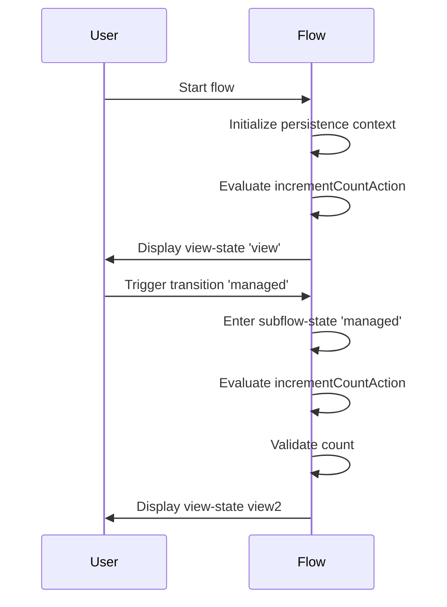
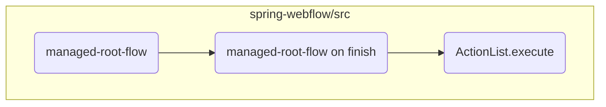
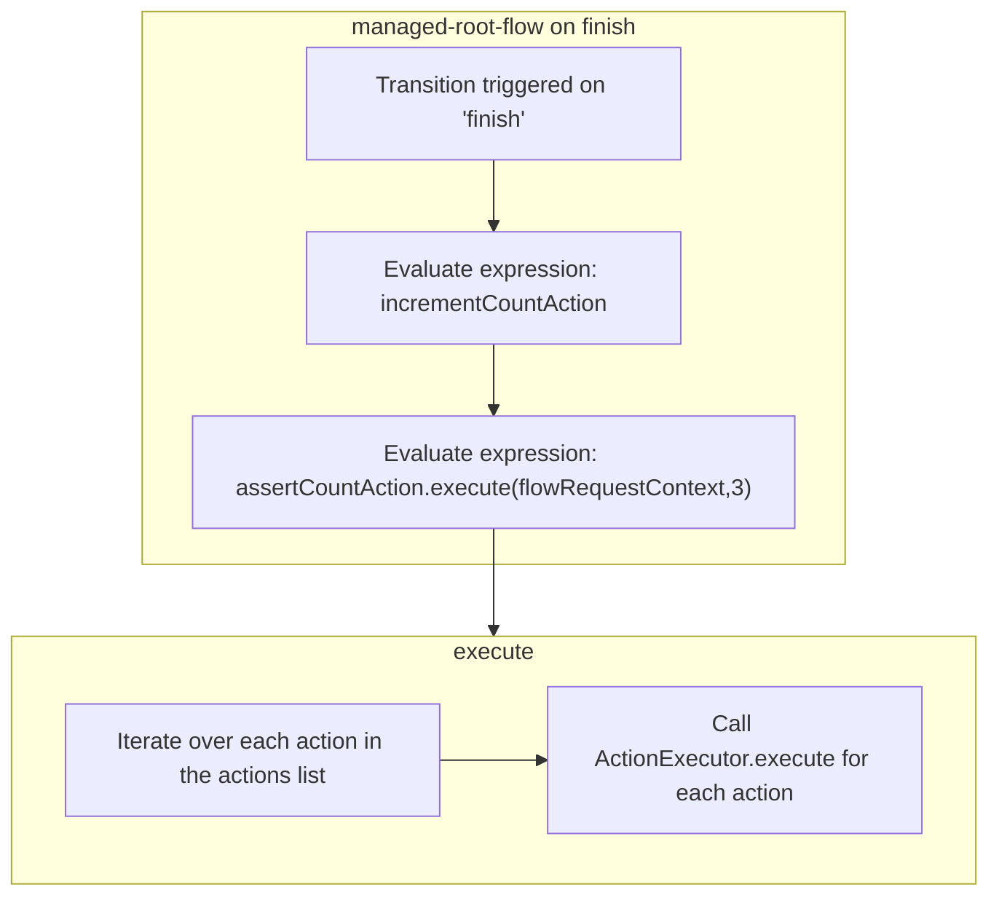

The `managed-root-flow` is responsible for managing the persistence context and handling user interactions through various states and transitions. It starts by initializing the persistence context and evaluating actions that increment a count value, ensuring the flow's state is correctly maintained.

For instance, when a user triggers a transition to the <SwmToken path="spring-webflow/src/test/java/org/springframework/webflow/persistence/managed-root-flow.xml" pos="14:7:7" line-data="		&lt;transition on=&quot;managed&quot; to=&quot;managed&quot;/&gt;">`managed`</SwmToken> subflow, the flow increments the count and validates it to ensure consistency. Upon finishing the subflow, the user is directed to the <SwmToken path="spring-webflow/src/test/java/org/springframework/webflow/persistence/managed-root-flow.xml" pos="13:7:7" line-data="		&lt;transition on=&quot;view2&quot; to=&quot;view2&quot;/&gt;">`view2`</SwmToken> state, where further actions can be taken based on the updated count.



Here is a high level diagram of the flow, showing only the most important functions:



# Flow drill down

## Exploring managed-root-flow

```mermaid
graph TD
  subgraph managed-root-flow
    managed-root-flow:A["Start flow with on-start"] --> managed-root-flow:B["Evaluate incrementCountAction"]
    managed-root-flow:B --> managed-root-flow:C["view-state 'view'"]
    managed-root-flow:C --> managed-root-flow:D["Transition on view2 to view2"]
    managed-root-flow:C --> managed-root-flow:E["Transition on 'managed' to 'managed'"]
    managed-root-flow:C --> managed-root-flow:F["Transition on 'notmanaged' to 'notmanaged'"]
    managed-root-flow:E --> managed-root-flow:G["Enter subflow-state 'managed'"]
    managed-root-flow:G --> managed-root-flow:H["Transition on 'finish' to view2"]
    managed-root-flow:H --> managed-root-flow:I["Evaluate incrementCountAction"]
    managed-root-flow:I --> managed-root-flow:J["Evaluate assertCountAction.execute(flowRequestContext,3)"]
    managed-root-flow:F --> managed-root-flow:K["Enter subflow-state 'notmanaged'"]
    managed-root-flow:K --> managed-root-flow:L["Transition on 'finish' to view2"]
    managed-root-flow:L --> managed-root-flow:M["Evaluate incrementCountAction"]
    managed-root-flow:M --> managed-root-flow:N["Evaluate assertCountAction.execute(flowRequestContext,2)"]
    managed-root-flow:D --> managed-root-flow:O["view-state view2"]
  end

%% Swimm:
%% graph TD
%%   subgraph managed-root-flow
%%     managed-root-flow:A["Start flow with <SwmToken path="spring-webflow/src/test/java/org/springframework/webflow/persistence/managed-root-flow.xml" pos="8:2:4" line-data="	&lt;on-start&gt;">`on-start`</SwmToken>"] --> managed-root-flow:B["Evaluate <SwmToken path="spring-webflow/src/test/java/org/springframework/webflow/persistence/managed-root-flow.xml" pos="9:7:7" line-data="		&lt;evaluate expression=&quot;incrementCountAction&quot; /&gt;">`incrementCountAction`</SwmToken>"]
%%     managed-root-flow:B --> managed-root-flow:C["<SwmToken path="spring-webflow/src/test/java/org/springframework/webflow/persistence/managed-root-flow.xml" pos="12:2:4" line-data="	&lt;view-state id=&quot;view&quot;&gt;">`view-state`</SwmToken> 'view'"]
%%     managed-root-flow:C --> managed-root-flow:D["Transition on <SwmToken path="spring-webflow/src/test/java/org/springframework/webflow/persistence/managed-root-flow.xml" pos="13:7:7" line-data="		&lt;transition on=&quot;view2&quot; to=&quot;view2&quot;/&gt;">`view2`</SwmToken> to <SwmToken path="spring-webflow/src/test/java/org/springframework/webflow/persistence/managed-root-flow.xml" pos="13:7:7" line-data="		&lt;transition on=&quot;view2&quot; to=&quot;view2&quot;/&gt;">`view2`</SwmToken>"]
%%     managed-root-flow:C --> managed-root-flow:E["Transition on 'managed' to 'managed'"]
%%     managed-root-flow:C --> managed-root-flow:F["Transition on 'notmanaged' to 'notmanaged'"]
%%     managed-root-flow:E --> managed-root-flow:G["Enter <SwmToken path="spring-webflow/src/test/java/org/springframework/webflow/persistence/managed-root-flow.xml" pos="18:2:4" line-data="	&lt;subflow-state id=&quot;managed&quot; subflow=&quot;managed-child-flow&quot;&gt;">`subflow-state`</SwmToken> 'managed'"]
%%     managed-root-flow:G --> managed-root-flow:H["Transition on 'finish' to <SwmToken path="spring-webflow/src/test/java/org/springframework/webflow/persistence/managed-root-flow.xml" pos="13:7:7" line-data="		&lt;transition on=&quot;view2&quot; to=&quot;view2&quot;/&gt;">`view2`</SwmToken>"]
%%     managed-root-flow:H --> managed-root-flow:I["Evaluate <SwmToken path="spring-webflow/src/test/java/org/springframework/webflow/persistence/managed-root-flow.xml" pos="9:7:7" line-data="		&lt;evaluate expression=&quot;incrementCountAction&quot; /&gt;">`incrementCountAction`</SwmToken>"]
%%     managed-root-flow:I --> managed-root-flow:J["Evaluate <SwmToken path="spring-webflow/src/test/java/org/springframework/webflow/persistence/managed-root-flow.xml" pos="21:7:9" line-data="			&lt;evaluate expression=&quot;assertCountAction.execute(flowRequestContext,3)&quot; /&gt;">`assertCountAction.execute`</SwmToken>(<SwmToken path="spring-webflow/src/test/java/org/springframework/webflow/persistence/managed-root-flow.xml" pos="21:11:11" line-data="			&lt;evaluate expression=&quot;assertCountAction.execute(flowRequestContext,3)&quot; /&gt;">`flowRequestContext`</SwmToken>,3)"]
%%     managed-root-flow:F --> managed-root-flow:K["Enter <SwmToken path="spring-webflow/src/test/java/org/springframework/webflow/persistence/managed-root-flow.xml" pos="18:2:4" line-data="	&lt;subflow-state id=&quot;managed&quot; subflow=&quot;managed-child-flow&quot;&gt;">`subflow-state`</SwmToken> 'notmanaged'"]
%%     managed-root-flow:K --> managed-root-flow:L["Transition on 'finish' to <SwmToken path="spring-webflow/src/test/java/org/springframework/webflow/persistence/managed-root-flow.xml" pos="13:7:7" line-data="		&lt;transition on=&quot;view2&quot; to=&quot;view2&quot;/&gt;">`view2`</SwmToken>"]
%%     managed-root-flow:L --> managed-root-flow:M["Evaluate <SwmToken path="spring-webflow/src/test/java/org/springframework/webflow/persistence/managed-root-flow.xml" pos="9:7:7" line-data="		&lt;evaluate expression=&quot;incrementCountAction&quot; /&gt;">`incrementCountAction`</SwmToken>"]
%%     managed-root-flow:M --> managed-root-flow:N["Evaluate <SwmToken path="spring-webflow/src/test/java/org/springframework/webflow/persistence/managed-root-flow.xml" pos="21:7:9" line-data="			&lt;evaluate expression=&quot;assertCountAction.execute(flowRequestContext,3)&quot; /&gt;">`assertCountAction.execute`</SwmToken>(<SwmToken path="spring-webflow/src/test/java/org/springframework/webflow/persistence/managed-root-flow.xml" pos="21:11:11" line-data="			&lt;evaluate expression=&quot;assertCountAction.execute(flowRequestContext,3)&quot; /&gt;">`flowRequestContext`</SwmToken>,2)"]
%%     managed-root-flow:D --> managed-root-flow:O["<SwmToken path="spring-webflow/src/test/java/org/springframework/webflow/persistence/managed-root-flow.xml" pos="12:2:4" line-data="	&lt;view-state id=&quot;view&quot;&gt;">`view-state`</SwmToken> <SwmToken path="spring-webflow/src/test/java/org/springframework/webflow/persistence/managed-root-flow.xml" pos="13:7:7" line-data="		&lt;transition on=&quot;view2&quot; to=&quot;view2&quot;/&gt;">`view2`</SwmToken>"]
%%   end
```



<SwmSnippet path="/spring-webflow/src/test/java/org/springframework/webflow/persistence/managed-root-flow.xml" line="6">

---

First, the `managed-root-flow` initializes the persistence context and starts by evaluating the <SwmToken path="spring-webflow/src/test/java/org/springframework/webflow/persistence/managed-root-flow.xml" pos="9:7:7" line-data="		&lt;evaluate expression=&quot;incrementCountAction&quot; /&gt;">`incrementCountAction`</SwmToken>. This action is crucial as it ensures that the count is incremented at the beginning of the flow, setting the stage for subsequent actions.

```xml
	<persistence-context/>

	<on-start>
		<evaluate expression="incrementCountAction" />
	</on-start>
```

---

</SwmSnippet>

<SwmSnippet path="/spring-webflow/src/test/java/org/springframework/webflow/persistence/managed-root-flow.xml" line="12">

---

Next, the flow defines a <SwmToken path="spring-webflow/src/test/java/org/springframework/webflow/persistence/managed-root-flow.xml" pos="12:2:4" line-data="	&lt;view-state id=&quot;view&quot;&gt;">`view-state`</SwmToken> with transitions to other views or subflows based on user actions. For instance, transitioning to <SwmToken path="spring-webflow/src/test/java/org/springframework/webflow/persistence/managed-root-flow.xml" pos="13:7:7" line-data="		&lt;transition on=&quot;view2&quot; to=&quot;view2&quot;/&gt;">`view2`</SwmToken>, <SwmToken path="spring-webflow/src/test/java/org/springframework/webflow/persistence/managed-root-flow.xml" pos="14:7:7" line-data="		&lt;transition on=&quot;managed&quot; to=&quot;managed&quot;/&gt;">`managed`</SwmToken>, or <SwmToken path="spring-webflow/src/test/java/org/springframework/webflow/persistence/managed-root-flow.xml" pos="15:7:7" line-data="		&lt;transition on=&quot;notmanaged&quot; to=&quot;notmanaged&quot;/&gt;">`notmanaged`</SwmToken> states based on specific triggers. This setup allows the flow to dynamically change views based on user interactions.

```xml
	<view-state id="view">
		<transition on="view2" to="view2"/>
		<transition on="managed" to="managed"/>
		<transition on="notmanaged" to="notmanaged"/>
	</view-state>
```

---

</SwmSnippet>

<SwmSnippet path="/spring-webflow/src/test/java/org/springframework/webflow/persistence/managed-root-flow.xml" line="18">

---

Moving to the subflow transitions, the <SwmToken path="spring-webflow/src/test/java/org/springframework/webflow/persistence/managed-root-flow.xml" pos="18:9:9" line-data="	&lt;subflow-state id=&quot;managed&quot; subflow=&quot;managed-child-flow&quot;&gt;">`managed`</SwmToken> subflow transitions to <SwmToken path="spring-webflow/src/test/java/org/springframework/webflow/persistence/managed-root-flow.xml" pos="19:13:13" line-data="		&lt;transition on=&quot;finish&quot; to=&quot;view2&quot;&gt;">`view2`</SwmToken> upon finishing, while evaluating the <SwmToken path="spring-webflow/src/test/java/org/springframework/webflow/persistence/managed-root-flow.xml" pos="20:7:7" line-data="			&lt;evaluate expression=&quot;incrementCountAction&quot; /&gt;">`incrementCountAction`</SwmToken> and asserting the count to be 3. This ensures that the count is correctly incremented and validated during the transition.

```xml
	<subflow-state id="managed" subflow="managed-child-flow">
		<transition on="finish" to="view2">
			<evaluate expression="incrementCountAction" />
			<evaluate expression="assertCountAction.execute(flowRequestContext,3)" />
		</transition>
```

---

</SwmSnippet>

<SwmSnippet path="/spring-webflow/src/test/java/org/springframework/webflow/persistence/managed-root-flow.xml" line="25">

---

Similarly, the <SwmToken path="spring-webflow/src/test/java/org/springframework/webflow/persistence/managed-root-flow.xml" pos="25:9:9" line-data="	&lt;subflow-state id=&quot;notmanaged&quot; subflow=&quot;notmanaged-child-flow&quot;&gt;">`notmanaged`</SwmToken> subflow transitions to <SwmToken path="spring-webflow/src/test/java/org/springframework/webflow/persistence/managed-root-flow.xml" pos="26:13:13" line-data="		&lt;transition on=&quot;finish&quot; to=&quot;view2&quot;&gt;">`view2`</SwmToken> upon finishing, evaluating the <SwmToken path="spring-webflow/src/test/java/org/springframework/webflow/persistence/managed-root-flow.xml" pos="27:7:7" line-data="			&lt;evaluate expression=&quot;incrementCountAction&quot; /&gt;">`incrementCountAction`</SwmToken> and asserting the count to be 2. This ensures that even in the not managed subflow, the count is correctly handled and validated.

```xml
	<subflow-state id="notmanaged" subflow="notmanaged-child-flow">
		<transition on="finish" to="view2">
			<evaluate expression="incrementCountAction" />
			<evaluate expression="assertCountAction.execute(flowRequestContext,2)" />
		</transition>
```

---

</SwmSnippet>

## Zooming into managed-root-flow on finish & execute



<SwmSnippet path="/spring-webflow/src/test/java/org/springframework/webflow/persistence/managed-root-flow.xml" line="19">

---

First, the flow transitions to the next view, which is defined as <SwmToken path="spring-webflow/src/test/java/org/springframework/webflow/persistence/managed-root-flow.xml" pos="19:13:13" line-data="		&lt;transition on=&quot;finish&quot; to=&quot;view2&quot;&gt;">`view2`</SwmToken>. This transition is triggered by the <SwmToken path="spring-webflow/src/test/java/org/springframework/webflow/persistence/managed-root-flow.xml" pos="19:7:7" line-data="		&lt;transition on=&quot;finish&quot; to=&quot;view2&quot;&gt;">`finish`</SwmToken> event, indicating that the current process has completed and the user should be directed to the next step in the flow.

```xml
		<transition on="finish" to="view2">
```

---

</SwmSnippet>

<SwmSnippet path="/spring-webflow/src/test/java/org/springframework/webflow/persistence/managed-root-flow.xml" line="20">

---

Next, the flow evaluates two actions. The first action, <SwmToken path="spring-webflow/src/test/java/org/springframework/webflow/persistence/managed-root-flow.xml" pos="20:7:7" line-data="			&lt;evaluate expression=&quot;incrementCountAction&quot; /&gt;">`incrementCountAction`</SwmToken>, is responsible for incrementing a count value. This action ensures that the count is updated as part of the flow's business logic.

```xml
			<evaluate expression="incrementCountAction" />
```

---

</SwmSnippet>

<SwmSnippet path="/spring-webflow/src/test/java/org/springframework/webflow/persistence/managed-root-flow.xml" line="21">

---

Then, the second action, <SwmToken path="spring-webflow/src/test/java/org/springframework/webflow/persistence/managed-root-flow.xml" pos="21:7:14" line-data="			&lt;evaluate expression=&quot;assertCountAction.execute(flowRequestContext,3)&quot; /&gt;">`assertCountAction.execute(flowRequestContext,3)`</SwmToken>, verifies that the count has reached the expected value of 3. This step is crucial for ensuring that the flow's state is consistent and that the count has been correctly incremented through the previous actions.

```xml
			<evaluate expression="assertCountAction.execute(flowRequestContext,3)" />
```

---

</SwmSnippet>

<SwmSnippet path="/spring-webflow/src/main/java/org/springframework/webflow/engine/ActionList.java" line="152">

---

Moving to the <SwmToken path="spring-webflow/src/main/java/org/springframework/webflow/engine/ActionList.java" pos="152:5:5" line-data="	public void execute(RequestContext context) {">`execute`</SwmToken> method in the <SwmToken path="spring-webflow/src/main/java/org/springframework/webflow/engine/ActionList.java" pos="41:4:4" line-data="public class ActionList implements Iterable&lt;Action&gt; {">`ActionList`</SwmToken> class, this method iterates over a list of actions and calls the <SwmToken path="spring-webflow/src/main/java/org/springframework/webflow/engine/ActionList.java" pos="152:5:5" line-data="	public void execute(RequestContext context) {">`execute`</SwmToken> method on each action. This ensures that all actions in the list are executed in sequence, contributing to the overall flow logic.

```java
	public void execute(RequestContext context) {
		for (Action action : actions) {
			ActionExecutor.execute(action, context);
		}
	}
```

---

</SwmSnippet>

&nbsp;

*This is an auto-generated document by Swimm 🌊 and has not yet been verified by a human*

<SwmMeta version="3.0.0" repo-id="Z2l0aHViJTNBJTNBc3ByaW5nLXdlYmZsb3ctZGVtbyUzQSUzQWdpbGFkbmF2b3Q=" repo-name="spring-webflow-demo"><sup>Powered by [Swimm](/)</sup></SwmMeta>
