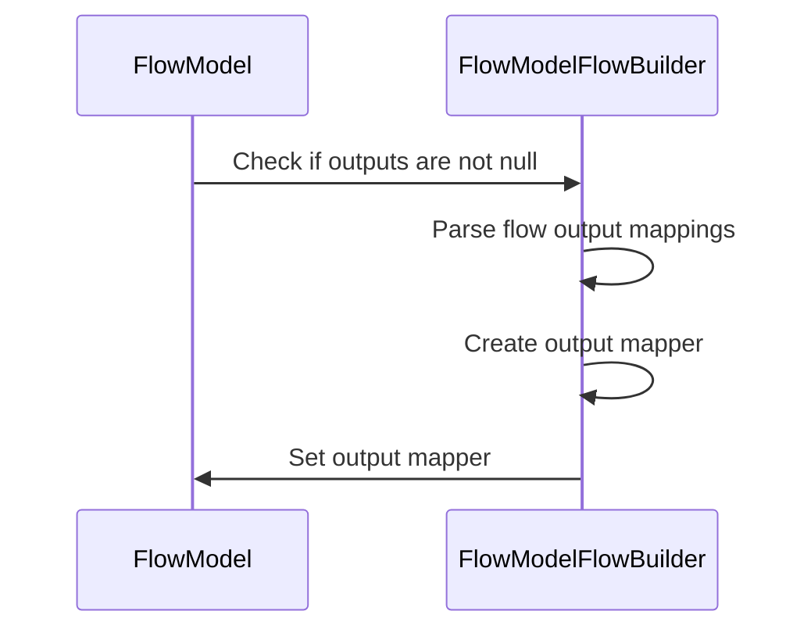

```mermaid
graph TD
  subgraph parseFlowOutputMapper
    parseFlowOutputMapper:A["Check if outputs are provided"] -->|Yes| parseFlowOutputMapper:B["Instantiate DefaultMapper"]
    parseFlowOutputMapper:B --> parseFlowOutputMapper:C["Iterate over outputs"]
    parseFlowOutputMapper:C --> parseFlowOutputMapper:D["Add parsed output mapping to DefaultMapper"]
    parseFlowOutputMapper:C -->|No| parseFlowOutputMapper:E["Return null"]
  end
  subgraph addMapping
    addMapping:A["Create source Expression"] --> addMapping:B["Create parserContext"]
    addMapping:B --> addMapping:C["Parse target Expression"]
    addMapping:C --> addMapping:D["Instantiate DefaultMapping"]
    addMapping:D --> addMapping:E["Set if mapping is required"]
    addMapping:E --> addMapping:F["Check if converter is provided"]
    addMapping:F -->|Yes| addMapping:G["Ensure ConversionService is configured"]
    addMapping:G --> addMapping:H["Get ConversionExecutor for binding converter"]
    addMapping:H --> addMapping:I["Set type converter in DefaultMapping"]
    addMapping:F -->|No| addMapping:J["Log debug information"]
    addMapping:J --> addMapping:K["Add mapping to mapper"]
  end

%% Swimm:
%% graph TD
%%   subgraph <SwmToken path="spring-webflow/src/main/java/org/springframework/webflow/engine/builder/model/FlowModelFlowBuilder.java" pos="250:7:7" line-data="			getFlow().setOutputMapper(parseFlowOutputMapper(flowModel.getOutputs()));">`parseFlowOutputMapper`</SwmToken>
%%     <SwmToken path="spring-webflow/src/main/java/org/springframework/webflow/engine/builder/model/FlowModelFlowBuilder.java" pos="250:7:7" line-data="			getFlow().setOutputMapper(parseFlowOutputMapper(flowModel.getOutputs()));">`parseFlowOutputMapper`</SwmToken>:A["Check if outputs are provided"] -->|Yes| <SwmToken path="spring-webflow/src/main/java/org/springframework/webflow/engine/builder/model/FlowModelFlowBuilder.java" pos="250:7:7" line-data="			getFlow().setOutputMapper(parseFlowOutputMapper(flowModel.getOutputs()));">`parseFlowOutputMapper`</SwmToken>:B["Instantiate <SwmToken path="spring-webflow/src/main/java/org/springframework/webflow/engine/builder/model/FlowModelFlowBuilder.java" pos="489:1:1" line-data="			DefaultMapper outputMapper = new DefaultMapper();">`DefaultMapper`</SwmToken>"]
%%     <SwmToken path="spring-webflow/src/main/java/org/springframework/webflow/engine/builder/model/FlowModelFlowBuilder.java" pos="250:7:7" line-data="			getFlow().setOutputMapper(parseFlowOutputMapper(flowModel.getOutputs()));">`parseFlowOutputMapper`</SwmToken>:B --> <SwmToken path="spring-webflow/src/main/java/org/springframework/webflow/engine/builder/model/FlowModelFlowBuilder.java" pos="250:7:7" line-data="			getFlow().setOutputMapper(parseFlowOutputMapper(flowModel.getOutputs()));">`parseFlowOutputMapper`</SwmToken>:C["Iterate over outputs"]
%%     <SwmToken path="spring-webflow/src/main/java/org/springframework/webflow/engine/builder/model/FlowModelFlowBuilder.java" pos="250:7:7" line-data="			getFlow().setOutputMapper(parseFlowOutputMapper(flowModel.getOutputs()));">`parseFlowOutputMapper`</SwmToken>:C --> <SwmToken path="spring-webflow/src/main/java/org/springframework/webflow/engine/builder/model/FlowModelFlowBuilder.java" pos="250:7:7" line-data="			getFlow().setOutputMapper(parseFlowOutputMapper(flowModel.getOutputs()));">`parseFlowOutputMapper`</SwmToken>:D["Add parsed output mapping to <SwmToken path="spring-webflow/src/main/java/org/springframework/webflow/engine/builder/model/FlowModelFlowBuilder.java" pos="489:1:1" line-data="			DefaultMapper outputMapper = new DefaultMapper();">`DefaultMapper`</SwmToken>"]
%%     <SwmToken path="spring-webflow/src/main/java/org/springframework/webflow/engine/builder/model/FlowModelFlowBuilder.java" pos="250:7:7" line-data="			getFlow().setOutputMapper(parseFlowOutputMapper(flowModel.getOutputs()));">`parseFlowOutputMapper`</SwmToken>:C -->|No| <SwmToken path="spring-webflow/src/main/java/org/springframework/webflow/engine/builder/model/FlowModelFlowBuilder.java" pos="250:7:7" line-data="			getFlow().setOutputMapper(parseFlowOutputMapper(flowModel.getOutputs()));">`parseFlowOutputMapper`</SwmToken>:E["Return null"]
%%   end
%%   subgraph <SwmToken path="spring-webflow/src/main/java/org/springframework/webflow/engine/builder/model/FlowModelFlowBuilder.java" pos="491:3:3" line-data="				outputMapper.addMapping(parseFlowOutputMapping(outputModel));">`addMapping`</SwmToken>
%%     <SwmToken path="spring-webflow/src/main/java/org/springframework/webflow/engine/builder/model/FlowModelFlowBuilder.java" pos="491:3:3" line-data="				outputMapper.addMapping(parseFlowOutputMapping(outputModel));">`addMapping`</SwmToken>:A["Create source Expression"] --> <SwmToken path="spring-webflow/src/main/java/org/springframework/webflow/engine/builder/model/FlowModelFlowBuilder.java" pos="491:3:3" line-data="				outputMapper.addMapping(parseFlowOutputMapping(outputModel));">`addMapping`</SwmToken>:B["Create <SwmToken path="spring-webflow/src/main/java/org/springframework/webflow/mvc/view/AbstractMvcView.java" pos="445:3:3" line-data="		ParserContext parserContext = new SimpleParserContext(model.getClass());">`parserContext`</SwmToken>"]
%%     <SwmToken path="spring-webflow/src/main/java/org/springframework/webflow/engine/builder/model/FlowModelFlowBuilder.java" pos="491:3:3" line-data="				outputMapper.addMapping(parseFlowOutputMapping(outputModel));">`addMapping`</SwmToken>:B --> <SwmToken path="spring-webflow/src/main/java/org/springframework/webflow/engine/builder/model/FlowModelFlowBuilder.java" pos="491:3:3" line-data="				outputMapper.addMapping(parseFlowOutputMapping(outputModel));">`addMapping`</SwmToken>:C["Parse target Expression"]
%%     <SwmToken path="spring-webflow/src/main/java/org/springframework/webflow/engine/builder/model/FlowModelFlowBuilder.java" pos="491:3:3" line-data="				outputMapper.addMapping(parseFlowOutputMapping(outputModel));">`addMapping`</SwmToken>:C --> <SwmToken path="spring-webflow/src/main/java/org/springframework/webflow/engine/builder/model/FlowModelFlowBuilder.java" pos="491:3:3" line-data="				outputMapper.addMapping(parseFlowOutputMapping(outputModel));">`addMapping`</SwmToken>:D["Instantiate <SwmToken path="spring-webflow/src/main/java/org/springframework/webflow/engine/builder/model/FlowModelFlowBuilder.java" pos="499:3:3" line-data="	private DefaultMapping parseFlowOutputMapping(OutputModel output) {">`DefaultMapping`</SwmToken>"]
%%     <SwmToken path="spring-webflow/src/main/java/org/springframework/webflow/engine/builder/model/FlowModelFlowBuilder.java" pos="491:3:3" line-data="				outputMapper.addMapping(parseFlowOutputMapping(outputModel));">`addMapping`</SwmToken>:D --> <SwmToken path="spring-webflow/src/main/java/org/springframework/webflow/engine/builder/model/FlowModelFlowBuilder.java" pos="491:3:3" line-data="				outputMapper.addMapping(parseFlowOutputMapping(outputModel));">`addMapping`</SwmToken>:E["Set if mapping is required"]
%%     <SwmToken path="spring-webflow/src/main/java/org/springframework/webflow/engine/builder/model/FlowModelFlowBuilder.java" pos="491:3:3" line-data="				outputMapper.addMapping(parseFlowOutputMapping(outputModel));">`addMapping`</SwmToken>:E --> <SwmToken path="spring-webflow/src/main/java/org/springframework/webflow/engine/builder/model/FlowModelFlowBuilder.java" pos="491:3:3" line-data="				outputMapper.addMapping(parseFlowOutputMapping(outputModel));">`addMapping`</SwmToken>:F["Check if converter is provided"]
%%     <SwmToken path="spring-webflow/src/main/java/org/springframework/webflow/engine/builder/model/FlowModelFlowBuilder.java" pos="491:3:3" line-data="				outputMapper.addMapping(parseFlowOutputMapping(outputModel));">`addMapping`</SwmToken>:F -->|Yes| <SwmToken path="spring-webflow/src/main/java/org/springframework/webflow/engine/builder/model/FlowModelFlowBuilder.java" pos="491:3:3" line-data="				outputMapper.addMapping(parseFlowOutputMapping(outputModel));">`addMapping`</SwmToken>:G["Ensure <SwmToken path="spring-webflow/src/main/java/org/springframework/webflow/mvc/view/AbstractMvcView.java" pos="451:4:4" line-data="					&quot;A ConversionService must be configured to use resolve custom converters to use during binding&quot;);">`ConversionService`</SwmToken> is configured"]
%%     <SwmToken path="spring-webflow/src/main/java/org/springframework/webflow/engine/builder/model/FlowModelFlowBuilder.java" pos="491:3:3" line-data="				outputMapper.addMapping(parseFlowOutputMapping(outputModel));">`addMapping`</SwmToken>:G --> <SwmToken path="spring-webflow/src/main/java/org/springframework/webflow/engine/builder/model/FlowModelFlowBuilder.java" pos="491:3:3" line-data="				outputMapper.addMapping(parseFlowOutputMapping(outputModel));">`addMapping`</SwmToken>:H["Get <SwmToken path="spring-webflow/src/main/java/org/springframework/webflow/engine/builder/model/FlowModelFlowBuilder.java" pos="548:1:1" line-data="			ConversionExecutor typeConverter = new RuntimeBindingConversionExecutor(type, getLocalContext()">`ConversionExecutor`</SwmToken> for binding converter"]
%%     <SwmToken path="spring-webflow/src/main/java/org/springframework/webflow/engine/builder/model/FlowModelFlowBuilder.java" pos="491:3:3" line-data="				outputMapper.addMapping(parseFlowOutputMapping(outputModel));">`addMapping`</SwmToken>:H --> <SwmToken path="spring-webflow/src/main/java/org/springframework/webflow/engine/builder/model/FlowModelFlowBuilder.java" pos="491:3:3" line-data="				outputMapper.addMapping(parseFlowOutputMapping(outputModel));">`addMapping`</SwmToken>:I["Set type converter in <SwmToken path="spring-webflow/src/main/java/org/springframework/webflow/engine/builder/model/FlowModelFlowBuilder.java" pos="499:3:3" line-data="	private DefaultMapping parseFlowOutputMapping(OutputModel output) {">`DefaultMapping`</SwmToken>"]
%%     <SwmToken path="spring-webflow/src/main/java/org/springframework/webflow/engine/builder/model/FlowModelFlowBuilder.java" pos="491:3:3" line-data="				outputMapper.addMapping(parseFlowOutputMapping(outputModel));">`addMapping`</SwmToken>:F -->|No| <SwmToken path="spring-webflow/src/main/java/org/springframework/webflow/engine/builder/model/FlowModelFlowBuilder.java" pos="491:3:3" line-data="				outputMapper.addMapping(parseFlowOutputMapping(outputModel));">`addMapping`</SwmToken>:J["Log debug information"]
%%     <SwmToken path="spring-webflow/src/main/java/org/springframework/webflow/engine/builder/model/FlowModelFlowBuilder.java" pos="491:3:3" line-data="				outputMapper.addMapping(parseFlowOutputMapping(outputModel));">`addMapping`</SwmToken>:J --> <SwmToken path="spring-webflow/src/main/java/org/springframework/webflow/engine/builder/model/FlowModelFlowBuilder.java" pos="491:3:3" line-data="				outputMapper.addMapping(parseFlowOutputMapping(outputModel));">`addMapping`</SwmToken>:K["Add mapping to mapper"]
%%   end
```

```mermaid
graph TD
  subgraph getValue
    getValue:A["Get subflow ID from context"] --> getValue:B["Retrieve flow definition using subflow ID"]
  end
  subgraph getFlowDefinition
    getFlowDefinition:A["Check if flow is assembling"] -->|Yes| getFlowDefinition:B["Return early assembly result"]
    getFlowDefinition:A -->|No| getFlowDefinition:C["Check if flow definition is null"]
    getFlowDefinition:C -->|Yes| getFlowDefinition:D["Assemble flow"]
    getFlowDefinition:C -->|No| getFlowDefinition:E["Check if flow is in development and has changed"]
    getFlowDefinition:E -->|Yes| getFlowDefinition:D
    getFlowDefinition:E -->|No| getFlowDefinition:F["Return flow definition"]
  end

%% Swimm:
%% graph TD
%%   subgraph <SwmToken path="spring-webflow/src/main/java/org/springframework/webflow/engine/builder/model/FlowModelFlowBuilder.java" pos="503:10:10" line-data="		if (StringUtils.hasText(output.getValue())) {">`getValue`</SwmToken>
%%     <SwmToken path="spring-webflow/src/main/java/org/springframework/webflow/engine/builder/model/FlowModelFlowBuilder.java" pos="503:10:10" line-data="		if (StringUtils.hasText(output.getValue())) {">`getValue`</SwmToken>:A["Get subflow ID from context"] --> <SwmToken path="spring-webflow/src/main/java/org/springframework/webflow/engine/builder/model/FlowModelFlowBuilder.java" pos="503:10:10" line-data="		if (StringUtils.hasText(output.getValue())) {">`getValue`</SwmToken>:B["Retrieve flow definition using subflow ID"]
%%   end
%%   subgraph <SwmToken path="spring-webflow/src/main/java/org/springframework/webflow/engine/builder/model/SubflowExpression.java" pos="35:5:5" line-data="		return flowDefinitionLocator.getFlowDefinition(subflowId);">`getFlowDefinition`</SwmToken>
%%     <SwmToken path="spring-webflow/src/main/java/org/springframework/webflow/engine/builder/model/SubflowExpression.java" pos="35:5:5" line-data="		return flowDefinitionLocator.getFlowDefinition(subflowId);">`getFlowDefinition`</SwmToken>:A["Check if flow is assembling"] -->|Yes| <SwmToken path="spring-webflow/src/main/java/org/springframework/webflow/engine/builder/model/SubflowExpression.java" pos="35:5:5" line-data="		return flowDefinitionLocator.getFlowDefinition(subflowId);">`getFlowDefinition`</SwmToken>:B["Return early assembly result"]
%%     <SwmToken path="spring-webflow/src/main/java/org/springframework/webflow/engine/builder/model/SubflowExpression.java" pos="35:5:5" line-data="		return flowDefinitionLocator.getFlowDefinition(subflowId);">`getFlowDefinition`</SwmToken>:A -->|No| <SwmToken path="spring-webflow/src/main/java/org/springframework/webflow/engine/builder/model/SubflowExpression.java" pos="35:5:5" line-data="		return flowDefinitionLocator.getFlowDefinition(subflowId);">`getFlowDefinition`</SwmToken>:C["Check if flow definition is null"]
%%     <SwmToken path="spring-webflow/src/main/java/org/springframework/webflow/engine/builder/model/SubflowExpression.java" pos="35:5:5" line-data="		return flowDefinitionLocator.getFlowDefinition(subflowId);">`getFlowDefinition`</SwmToken>:C -->|Yes| <SwmToken path="spring-webflow/src/main/java/org/springframework/webflow/engine/builder/model/SubflowExpression.java" pos="35:5:5" line-data="		return flowDefinitionLocator.getFlowDefinition(subflowId);">`getFlowDefinition`</SwmToken>:D["Assemble flow"]
%%     <SwmToken path="spring-webflow/src/main/java/org/springframework/webflow/engine/builder/model/SubflowExpression.java" pos="35:5:5" line-data="		return flowDefinitionLocator.getFlowDefinition(subflowId);">`getFlowDefinition`</SwmToken>:C -->|No| <SwmToken path="spring-webflow/src/main/java/org/springframework/webflow/engine/builder/model/SubflowExpression.java" pos="35:5:5" line-data="		return flowDefinitionLocator.getFlowDefinition(subflowId);">`getFlowDefinition`</SwmToken>:E["Check if flow is in development and has changed"]
%%     <SwmToken path="spring-webflow/src/main/java/org/springframework/webflow/engine/builder/model/SubflowExpression.java" pos="35:5:5" line-data="		return flowDefinitionLocator.getFlowDefinition(subflowId);">`getFlowDefinition`</SwmToken>:E -->|Yes| <SwmToken path="spring-webflow/src/main/java/org/springframework/webflow/engine/builder/model/SubflowExpression.java" pos="35:5:5" line-data="		return flowDefinitionLocator.getFlowDefinition(subflowId);">`getFlowDefinition`</SwmToken>:D
%%     <SwmToken path="spring-webflow/src/main/java/org/springframework/webflow/engine/builder/model/SubflowExpression.java" pos="35:5:5" line-data="		return flowDefinitionLocator.getFlowDefinition(subflowId);">`getFlowDefinition`</SwmToken>:E -->|No| <SwmToken path="spring-webflow/src/main/java/org/springframework/webflow/engine/builder/model/SubflowExpression.java" pos="35:5:5" line-data="		return flowDefinitionLocator.getFlowDefinition(subflowId);">`getFlowDefinition`</SwmToken>:F["Return flow definition"]
%%   end
```

The <SwmToken path="spring-webflow/src/main/java/org/springframework/webflow/engine/builder/model/FlowModelFlowBuilder.java" pos="248:5:5" line-data="	public void buildOutputMapper() throws FlowBuilderException {">`buildOutputMapper`</SwmToken> method is responsible for constructing the output mapper, which maps the flow output when the flow execution ends. This ensures that the outputs of the flow are correctly mapped and available for further processing or for returning to the caller.

For instance, if a flow generates a user profile as output, the <SwmToken path="spring-webflow/src/main/java/org/springframework/webflow/engine/builder/model/FlowModelFlowBuilder.java" pos="248:5:5" line-data="	public void buildOutputMapper() throws FlowBuilderException {">`buildOutputMapper`</SwmToken> will ensure that this profile is mapped correctly and can be accessed by subsequent processes or returned to the user.



Here is a high level diagram of the flow, showing only the most important functions:

```mermaid
graph TD;
      subgraph springwebflowsrcmainjavaorgspringframeworkwebflowenginebuildermodel[spring-webflow/…/builder/model]
27dae4a8a1c3237fa5d64d458cd7a249f1a715ba52855b7fdc9a3e393b8817d9(FlowModelFlowBuilder.buildOutputMapper) --> d172963117eb51c81eb500e3bccde8bdd8cc7420fb9214b0af651a19835488c0(FlowModelFlowBuilder.parseFlowOutputMapper)
end

subgraph springwebflowsrcmainjavaorgspringframeworkwebflowenginebuildermodel[spring-webflow/…/builder/model]
d172963117eb51c81eb500e3bccde8bdd8cc7420fb9214b0af651a19835488c0(FlowModelFlowBuilder.parseFlowOutputMapper) --> 2784a42f98cd29bca5fc4f854b3ea322f7e3d0589a5f8d38b453fb6c779b1728(FlowModelFlowBuilder.parseFlowOutputMapping)
end

subgraph springwebflowsrcmainjavaorgspringframeworkwebflowmvcviewAbstractMvcViewjava[spring-webflow/…/view/AbstractMvcView.java]
d172963117eb51c81eb500e3bccde8bdd8cc7420fb9214b0af651a19835488c0(FlowModelFlowBuilder.parseFlowOutputMapper) --> ee2726de36db92795bd2a2e99ae53eb84a6402a7d1becdd27f7a4d1495c0babb(AbstractMvcView.addMapping)
end

subgraph springwebflowsrcmainjavaorgspringframeworkwebflowenginebuildermodel[spring-webflow/…/builder/model]
2784a42f98cd29bca5fc4f854b3ea322f7e3d0589a5f8d38b453fb6c779b1728(FlowModelFlowBuilder.parseFlowOutputMapping) --> 220e55aa095ef43cfade7e36fa6c5638ad32472f2bd6f9596009be75d80d7a1f(SubflowExpression.getValue)
end

subgraph springwebflowsrcmainjavaorgspringframeworkwebflowenginebuildermodel[spring-webflow/…/builder/model]
2784a42f98cd29bca5fc4f854b3ea322f7e3d0589a5f8d38b453fb6c779b1728(FlowModelFlowBuilder.parseFlowOutputMapping) --> edf49af0a322df59fb671f1bdb5b1b91ee1a8d2c0b272acb67e3ac933c57a6f8(FlowModelFlowBuilder.parseAndSetMappingConversionExecutor)
end

subgraph springwebflowsrcmainjavaorgspringframeworkwebflowenginebuilderDefaultFlowHolderjava[spring-webflow/…/builder/DefaultFlowHolder.java]
220e55aa095ef43cfade7e36fa6c5638ad32472f2bd6f9596009be75d80d7a1f(SubflowExpression.getValue) --> 80b7a63b4ecf5c25b7d9897b4b4723d53841a226c726a8ded944576e0e6166a0(DefaultFlowHolder.getFlowDefinition)
end


      classDef mainFlowStyle color:#000000,fill:#7CB9F4
classDef rootsStyle color:#000000,fill:#00FFF4
classDef Style1 color:#000000,fill:#00FFAA
classDef Style2 color:#000000,fill:#FFFF00
classDef Style3 color:#000000,fill:#AA7CB9

%% Swimm:
%% graph TD;
%%       subgraph springwebflowsrcmainjavaorgspringframeworkwebflowenginebuildermodel[<SwmPath>[spring-webflow/…/builder/model/](spring-webflow/src/main/java/org/springframework/webflow/engine/builder/model/)</SwmPath>]
%% 27dae4a8a1c3237fa5d64d458cd7a249f1a715ba52855b7fdc9a3e393b8817d9(FlowModelFlowBuilder.buildOutputMapper) --> d172963117eb51c81eb500e3bccde8bdd8cc7420fb9214b0af651a19835488c0(FlowModelFlowBuilder.parseFlowOutputMapper)
%% end
%% 
%% subgraph springwebflowsrcmainjavaorgspringframeworkwebflowenginebuildermodel[<SwmPath>[spring-webflow/…/builder/model/](spring-webflow/src/main/java/org/springframework/webflow/engine/builder/model/)</SwmPath>]
%% d172963117eb51c81eb500e3bccde8bdd8cc7420fb9214b0af651a19835488c0(FlowModelFlowBuilder.parseFlowOutputMapper) --> 2784a42f98cd29bca5fc4f854b3ea322f7e3d0589a5f8d38b453fb6c779b1728(FlowModelFlowBuilder.parseFlowOutputMapping)
%% end
%% 
%% subgraph springwebflowsrcmainjavaorgspringframeworkwebflowmvcviewAbstractMvcViewjava[<SwmPath>[spring-webflow/…/view/AbstractMvcView.java](spring-webflow/src/main/java/org/springframework/webflow/mvc/view/AbstractMvcView.java)</SwmPath>]
%% d172963117eb51c81eb500e3bccde8bdd8cc7420fb9214b0af651a19835488c0(FlowModelFlowBuilder.parseFlowOutputMapper) --> ee2726de36db92795bd2a2e99ae53eb84a6402a7d1becdd27f7a4d1495c0babb(AbstractMvcView.addMapping)
%% end
%% 
%% subgraph springwebflowsrcmainjavaorgspringframeworkwebflowenginebuildermodel[<SwmPath>[spring-webflow/…/builder/model/](spring-webflow/src/main/java/org/springframework/webflow/engine/builder/model/)</SwmPath>]
%% 2784a42f98cd29bca5fc4f854b3ea322f7e3d0589a5f8d38b453fb6c779b1728(FlowModelFlowBuilder.parseFlowOutputMapping) --> 220e55aa095ef43cfade7e36fa6c5638ad32472f2bd6f9596009be75d80d7a1f(SubflowExpression.getValue)
%% end
%% 
%% subgraph springwebflowsrcmainjavaorgspringframeworkwebflowenginebuildermodel[<SwmPath>[spring-webflow/…/builder/model/](spring-webflow/src/main/java/org/springframework/webflow/engine/builder/model/)</SwmPath>]
%% 2784a42f98cd29bca5fc4f854b3ea322f7e3d0589a5f8d38b453fb6c779b1728(FlowModelFlowBuilder.parseFlowOutputMapping) --> edf49af0a322df59fb671f1bdb5b1b91ee1a8d2c0b272acb67e3ac933c57a6f8(FlowModelFlowBuilder.parseAndSetMappingConversionExecutor)
%% end
%% 
%% subgraph springwebflowsrcmainjavaorgspringframeworkwebflowenginebuilderDefaultFlowHolderjava[<SwmPath>[spring-webflow/…/builder/DefaultFlowHolder.java](spring-webflow/src/main/java/org/springframework/webflow/engine/builder/DefaultFlowHolder.java)</SwmPath>]
%% 220e55aa095ef43cfade7e36fa6c5638ad32472f2bd6f9596009be75d80d7a1f(SubflowExpression.getValue) --> 80b7a63b4ecf5c25b7d9897b4b4723d53841a226c726a8ded944576e0e6166a0(DefaultFlowHolder.getFlowDefinition)
%% end
%% 
%% 
%%       classDef mainFlowStyle color:#000000,fill:#7CB9F4
%% classDef rootsStyle color:#000000,fill:#00FFF4
%% classDef Style1 color:#000000,fill:#00FFAA
%% classDef Style2 color:#000000,fill:#FFFF00
%% classDef Style3 color:#000000,fill:#AA7CB9
```



# Flow drill down

```mermaid
graph TD
  subgraph buildOutputMapper
    buildOutputMapper:A["Check if flow model outputs are not null"] -->|Not null| buildOutputMapper:B["Parse flow output mappings and create a mapper"]
    buildOutputMapper:B --> buildOutputMapper:C["Set this mapper to flow output"]
  end
  subgraph parseFlowOutputMapper
    parseFlowOutputMapper:A["Receive list of flow output models"] --> parseFlowOutputMapper:B["Parse the output models"]
    parseFlowOutputMapper:B --> parseFlowOutputMapper:C["Create flow output mapper"]
    parseFlowOutputMapper:C --> parseFlowOutputMapper:D["Return mapper"]
  end

%% Swimm:
%% graph TD
%%   subgraph <SwmToken path="spring-webflow/src/main/java/org/springframework/webflow/engine/builder/model/FlowModelFlowBuilder.java" pos="248:5:5" line-data="	public void buildOutputMapper() throws FlowBuilderException {">`buildOutputMapper`</SwmToken>
%%     <SwmToken path="spring-webflow/src/main/java/org/springframework/webflow/engine/builder/model/FlowModelFlowBuilder.java" pos="248:5:5" line-data="	public void buildOutputMapper() throws FlowBuilderException {">`buildOutputMapper`</SwmToken>:A["Check if flow model outputs are not null"] -->|Not null| <SwmToken path="spring-webflow/src/main/java/org/springframework/webflow/engine/builder/model/FlowModelFlowBuilder.java" pos="248:5:5" line-data="	public void buildOutputMapper() throws FlowBuilderException {">`buildOutputMapper`</SwmToken>:B["Parse flow output mappings and create a mapper"]
%%     <SwmToken path="spring-webflow/src/main/java/org/springframework/webflow/engine/builder/model/FlowModelFlowBuilder.java" pos="248:5:5" line-data="	public void buildOutputMapper() throws FlowBuilderException {">`buildOutputMapper`</SwmToken>:B --> <SwmToken path="spring-webflow/src/main/java/org/springframework/webflow/engine/builder/model/FlowModelFlowBuilder.java" pos="248:5:5" line-data="	public void buildOutputMapper() throws FlowBuilderException {">`buildOutputMapper`</SwmToken>:C["Set this mapper to flow output"]
%%   end
%%   subgraph <SwmToken path="spring-webflow/src/main/java/org/springframework/webflow/engine/builder/model/FlowModelFlowBuilder.java" pos="250:7:7" line-data="			getFlow().setOutputMapper(parseFlowOutputMapper(flowModel.getOutputs()));">`parseFlowOutputMapper`</SwmToken>
%%     <SwmToken path="spring-webflow/src/main/java/org/springframework/webflow/engine/builder/model/FlowModelFlowBuilder.java" pos="250:7:7" line-data="			getFlow().setOutputMapper(parseFlowOutputMapper(flowModel.getOutputs()));">`parseFlowOutputMapper`</SwmToken>:A["Receive list of flow output models"] --> <SwmToken path="spring-webflow/src/main/java/org/springframework/webflow/engine/builder/model/FlowModelFlowBuilder.java" pos="250:7:7" line-data="			getFlow().setOutputMapper(parseFlowOutputMapper(flowModel.getOutputs()));">`parseFlowOutputMapper`</SwmToken>:B["Parse the output models"]
%%     <SwmToken path="spring-webflow/src/main/java/org/springframework/webflow/engine/builder/model/FlowModelFlowBuilder.java" pos="250:7:7" line-data="			getFlow().setOutputMapper(parseFlowOutputMapper(flowModel.getOutputs()));">`parseFlowOutputMapper`</SwmToken>:B --> <SwmToken path="spring-webflow/src/main/java/org/springframework/webflow/engine/builder/model/FlowModelFlowBuilder.java" pos="250:7:7" line-data="			getFlow().setOutputMapper(parseFlowOutputMapper(flowModel.getOutputs()));">`parseFlowOutputMapper`</SwmToken>:C["Create flow output mapper"]
%%     <SwmToken path="spring-webflow/src/main/java/org/springframework/webflow/engine/builder/model/FlowModelFlowBuilder.java" pos="250:7:7" line-data="			getFlow().setOutputMapper(parseFlowOutputMapper(flowModel.getOutputs()));">`parseFlowOutputMapper`</SwmToken>:C --> <SwmToken path="spring-webflow/src/main/java/org/springframework/webflow/engine/builder/model/FlowModelFlowBuilder.java" pos="250:7:7" line-data="			getFlow().setOutputMapper(parseFlowOutputMapper(flowModel.getOutputs()));">`parseFlowOutputMapper`</SwmToken>:D["Return mapper"]
%%   end
```

## Breaking down <SwmToken path="spring-webflow/src/main/java/org/springframework/webflow/engine/builder/model/FlowModelFlowBuilder.java" pos="248:5:5" line-data="	public void buildOutputMapper() throws FlowBuilderException {">`buildOutputMapper`</SwmToken>



<SwmSnippet path="/spring-webflow/src/main/java/org/springframework/webflow/engine/builder/model/FlowModelFlowBuilder.java" line="244">

---

First, the <SwmToken path="spring-webflow/src/main/java/org/springframework/webflow/engine/builder/model/FlowModelFlowBuilder.java" pos="248:5:5" line-data="	public void buildOutputMapper() throws FlowBuilderException {">`buildOutputMapper`</SwmToken> method is responsible for constructing the output mapper, which maps the flow output when the flow execution ends. This ensures that the outputs of the flow are correctly mapped and available for further processing or for returning to the caller.

```java
	/**
	 * Builds the output mapper responsible for mapping flow output on end.
	 * @throws FlowBuilderException an exception occurred building the flow
	 */
	public void buildOutputMapper() throws FlowBuilderException {
		if (flowModel.getOutputs() != null) {
			getFlow().setOutputMapper(parseFlowOutputMapper(flowModel.getOutputs()));
		}
	}
```

---

</SwmSnippet>

<SwmSnippet path="/spring-webflow/src/main/java/org/springframework/webflow/engine/builder/model/FlowModelFlowBuilder.java" line="487">

---

Next, the <SwmToken path="spring-webflow/src/main/java/org/springframework/webflow/engine/builder/model/FlowModelFlowBuilder.java" pos="487:5:5" line-data="	private Mapper parseFlowOutputMapper(List&lt;OutputModel&gt; outputs) {">`parseFlowOutputMapper`</SwmToken> method is invoked within <SwmToken path="spring-webflow/src/main/java/org/springframework/webflow/engine/builder/model/FlowModelFlowBuilder.java" pos="248:5:5" line-data="	public void buildOutputMapper() throws FlowBuilderException {">`buildOutputMapper`</SwmToken> to parse the flow output mappings. This method takes a list of flow output models and creates a corresponding output mapper. This step is crucial as it translates the defined outputs into a format that can be used by the flow execution.

```java
	private Mapper parseFlowOutputMapper(List<OutputModel> outputs) {
```

---

</SwmSnippet>

## Exploring <SwmToken path="spring-webflow/src/main/java/org/springframework/webflow/engine/builder/model/FlowModelFlowBuilder.java" pos="250:7:7" line-data="			getFlow().setOutputMapper(parseFlowOutputMapper(flowModel.getOutputs()));">`parseFlowOutputMapper`</SwmToken> & <SwmToken path="spring-webflow/src/main/java/org/springframework/webflow/engine/builder/model/FlowModelFlowBuilder.java" pos="491:3:3" line-data="				outputMapper.addMapping(parseFlowOutputMapping(outputModel));">`addMapping`</SwmToken>



<SwmSnippet path="/spring-webflow/src/main/java/org/springframework/webflow/engine/builder/model/FlowModelFlowBuilder.java" line="487">

---

First, the <SwmToken path="spring-webflow/src/main/java/org/springframework/webflow/engine/builder/model/FlowModelFlowBuilder.java" pos="487:5:5" line-data="	private Mapper parseFlowOutputMapper(List&lt;OutputModel&gt; outputs) {">`parseFlowOutputMapper`</SwmToken> method is responsible for creating a <SwmToken path="spring-webflow/src/main/java/org/springframework/webflow/engine/builder/model/FlowModelFlowBuilder.java" pos="489:1:1" line-data="			DefaultMapper outputMapper = new DefaultMapper();">`DefaultMapper`</SwmToken> instance if the provided list of <SwmToken path="spring-webflow/src/main/java/org/springframework/webflow/engine/builder/model/FlowModelFlowBuilder.java" pos="487:9:9" line-data="	private Mapper parseFlowOutputMapper(List&lt;OutputModel&gt; outputs) {">`OutputModel`</SwmToken> is not empty. This method iterates over each <SwmToken path="spring-webflow/src/main/java/org/springframework/webflow/engine/builder/model/FlowModelFlowBuilder.java" pos="487:9:9" line-data="	private Mapper parseFlowOutputMapper(List&lt;OutputModel&gt; outputs) {">`OutputModel`</SwmToken> in the list and adds a mapping by calling the <SwmToken path="spring-webflow/src/main/java/org/springframework/webflow/engine/builder/model/FlowModelFlowBuilder.java" pos="491:5:5" line-data="				outputMapper.addMapping(parseFlowOutputMapping(outputModel));">`parseFlowOutputMapping`</SwmToken> method.

```java
	private Mapper parseFlowOutputMapper(List<OutputModel> outputs) {
		if (outputs != null && !outputs.isEmpty()) {
			DefaultMapper outputMapper = new DefaultMapper();
			for (OutputModel outputModel : outputs) {
				outputMapper.addMapping(parseFlowOutputMapping(outputModel));
			}
			return outputMapper;
		} else {
			return null;
		}
	}
```

---

</SwmSnippet>

<SwmSnippet path="/spring-webflow/src/main/java/org/springframework/webflow/mvc/view/AbstractMvcView.java" line="443">

---

Next, the <SwmToken path="spring-webflow/src/main/java/org/springframework/webflow/mvc/view/AbstractMvcView.java" pos="443:5:5" line-data="	protected void addMapping(DefaultMapper mapper, Binding binding, Object model) {">`addMapping`</SwmToken> method in the <SwmToken path="spring-webflow/src/main/java/org/springframework/webflow/mvc/view/AbstractMvcView.java" pos="73:6:6" line-data="public abstract class AbstractMvcView implements View {">`AbstractMvcView`</SwmToken> class creates and adds a <SwmToken path="spring-webflow/src/main/java/org/springframework/webflow/mvc/view/AbstractMvcView.java" pos="447:1:1" line-data="		DefaultMapping mapping = new DefaultMapping(source, target);">`DefaultMapping`</SwmToken> for a given <SwmToken path="spring-webflow/src/main/java/org/springframework/webflow/mvc/view/AbstractMvcView.java" pos="443:12:12" line-data="	protected void addMapping(DefaultMapper mapper, Binding binding, Object model) {">`Binding`</SwmToken>. This method constructs expressions for the source and target based on the binding's property and model. It also sets whether the mapping is required and handles type conversion if a converter is specified.

```java
	protected void addMapping(DefaultMapper mapper, Binding binding, Object model) {
		Expression source = new RequestParameterExpression(binding.getProperty());
		ParserContext parserContext = new SimpleParserContext(model.getClass());
		Expression target = expressionParser.parseExpression(binding.getProperty(), parserContext);
		DefaultMapping mapping = new DefaultMapping(source, target);
		mapping.setRequired(binding.getRequired());
		if (binding.getConverter() != null) {
			Assert.notNull(conversionService,
					"A ConversionService must be configured to use resolve custom converters to use during binding");
			ConversionExecutor conversionExecutor = conversionService.getConversionExecutor(binding.getConverter(),
					String.class, target.getValueType(model));
			mapping.setTypeConverter(conversionExecutor);
		}
		if (logger.isDebugEnabled()) {
			logger.debug("Adding mapping for parameter '" + binding.getProperty() + "'");
		}
		mapper.addMapping(mapping);
	}
```

---

</SwmSnippet>

## Inside <SwmToken path="spring-webflow/src/main/java/org/springframework/webflow/engine/builder/model/FlowModelFlowBuilder.java" pos="491:5:5" line-data="				outputMapper.addMapping(parseFlowOutputMapping(outputModel));">`parseFlowOutputMapping`</SwmToken> & <SwmToken path="spring-webflow/src/main/java/org/springframework/webflow/engine/builder/model/FlowModelFlowBuilder.java" pos="545:5:5" line-data="	private void parseAndSetMappingConversionExecutor(AbstractMappingModel mappingModel, DefaultMapping mapping) {">`parseAndSetMappingConversionExecutor`</SwmToken>



```mermaid
graph TD
subgraph parseFlowOutputMapping
parseFlowOutputMapping:A["Get expression parser"] --> parseFlowOutputMapping:B["Parse output name"]
parseFlowOutputMapping:B --> parseFlowOutputMapping:C["Check if output value is present"]
parseFlowOutputMapping:C -->|Yes| parseFlowOutputMapping:D["Parse output value"]
parseFlowOutputMapping:C -->|No| parseFlowOutputMapping:E["Use output name as value"]
parseFlowOutputMapping:D --> parseFlowOutputMapping:F["Parse source expression"]
parseFlowOutputMapping:E --> parseFlowOutputMapping:F["Parse source expression"]
parseFlowOutputMapping:F --> parseFlowOutputMapping:G["Parse target expression"]
parseFlowOutputMapping:G --> parseFlowOutputMapping:H["Create DefaultMapping"]
parseFlowOutputMapping:H --> parseFlowOutputMapping:I["Call parseAndSetMappingConversionExecutor"]
parseFlowOutputMapping:I --> parseFlowOutputMapping:J["Call parseAndSetMappingRequired"]
end
subgraph parseAndSetMappingConversionExecutor
parseAndSetMappingConversionExecutor:A["Check if mapping type is specified"] -->|Yes| parseAndSetMappingConversionExecutor:B["Convert type to Class"]
parseAndSetMappingConversionExecutor:B --> parseAndSetMappingConversionExecutor:C["Create type converter"]
parseAndSetMappingConversionExecutor:C --> parseAndSetMappingConversionExecutor:D["Set type converter to mapping"]
end
parseFlowOutputMapping:I --> parseAndSetMappingConversionExecutor

%% Swimm:
%% graph TD
%% subgraph <SwmToken path="spring-webflow/src/main/java/org/springframework/webflow/engine/builder/model/FlowModelFlowBuilder.java" pos="491:5:5" line-data="				outputMapper.addMapping(parseFlowOutputMapping(outputModel));">`parseFlowOutputMapping`</SwmToken>
%% <SwmToken path="spring-webflow/src/main/java/org/springframework/webflow/engine/builder/model/FlowModelFlowBuilder.java" pos="491:5:5" line-data="				outputMapper.addMapping(parseFlowOutputMapping(outputModel));">`parseFlowOutputMapping`</SwmToken>:A["Get expression parser"] --> <SwmToken path="spring-webflow/src/main/java/org/springframework/webflow/engine/builder/model/FlowModelFlowBuilder.java" pos="491:5:5" line-data="				outputMapper.addMapping(parseFlowOutputMapping(outputModel));">`parseFlowOutputMapping`</SwmToken>:B["Parse output name"]
%% <SwmToken path="spring-webflow/src/main/java/org/springframework/webflow/engine/builder/model/FlowModelFlowBuilder.java" pos="491:5:5" line-data="				outputMapper.addMapping(parseFlowOutputMapping(outputModel));">`parseFlowOutputMapping`</SwmToken>:B --> <SwmToken path="spring-webflow/src/main/java/org/springframework/webflow/engine/builder/model/FlowModelFlowBuilder.java" pos="491:5:5" line-data="				outputMapper.addMapping(parseFlowOutputMapping(outputModel));">`parseFlowOutputMapping`</SwmToken>:C["Check if output value is present"]
%% <SwmToken path="spring-webflow/src/main/java/org/springframework/webflow/engine/builder/model/FlowModelFlowBuilder.java" pos="491:5:5" line-data="				outputMapper.addMapping(parseFlowOutputMapping(outputModel));">`parseFlowOutputMapping`</SwmToken>:C -->|Yes| <SwmToken path="spring-webflow/src/main/java/org/springframework/webflow/engine/builder/model/FlowModelFlowBuilder.java" pos="491:5:5" line-data="				outputMapper.addMapping(parseFlowOutputMapping(outputModel));">`parseFlowOutputMapping`</SwmToken>:D["Parse output value"]
%% <SwmToken path="spring-webflow/src/main/java/org/springframework/webflow/engine/builder/model/FlowModelFlowBuilder.java" pos="491:5:5" line-data="				outputMapper.addMapping(parseFlowOutputMapping(outputModel));">`parseFlowOutputMapping`</SwmToken>:C -->|No| <SwmToken path="spring-webflow/src/main/java/org/springframework/webflow/engine/builder/model/FlowModelFlowBuilder.java" pos="491:5:5" line-data="				outputMapper.addMapping(parseFlowOutputMapping(outputModel));">`parseFlowOutputMapping`</SwmToken>:E["Use output name as value"]
%% <SwmToken path="spring-webflow/src/main/java/org/springframework/webflow/engine/builder/model/FlowModelFlowBuilder.java" pos="491:5:5" line-data="				outputMapper.addMapping(parseFlowOutputMapping(outputModel));">`parseFlowOutputMapping`</SwmToken>:D --> <SwmToken path="spring-webflow/src/main/java/org/springframework/webflow/engine/builder/model/FlowModelFlowBuilder.java" pos="491:5:5" line-data="				outputMapper.addMapping(parseFlowOutputMapping(outputModel));">`parseFlowOutputMapping`</SwmToken>:F["Parse source expression"]
%% <SwmToken path="spring-webflow/src/main/java/org/springframework/webflow/engine/builder/model/FlowModelFlowBuilder.java" pos="491:5:5" line-data="				outputMapper.addMapping(parseFlowOutputMapping(outputModel));">`parseFlowOutputMapping`</SwmToken>:E --> <SwmToken path="spring-webflow/src/main/java/org/springframework/webflow/engine/builder/model/FlowModelFlowBuilder.java" pos="491:5:5" line-data="				outputMapper.addMapping(parseFlowOutputMapping(outputModel));">`parseFlowOutputMapping`</SwmToken>:F["Parse source expression"]
%% <SwmToken path="spring-webflow/src/main/java/org/springframework/webflow/engine/builder/model/FlowModelFlowBuilder.java" pos="491:5:5" line-data="				outputMapper.addMapping(parseFlowOutputMapping(outputModel));">`parseFlowOutputMapping`</SwmToken>:F --> <SwmToken path="spring-webflow/src/main/java/org/springframework/webflow/engine/builder/model/FlowModelFlowBuilder.java" pos="491:5:5" line-data="				outputMapper.addMapping(parseFlowOutputMapping(outputModel));">`parseFlowOutputMapping`</SwmToken>:G["Parse target expression"]
%% <SwmToken path="spring-webflow/src/main/java/org/springframework/webflow/engine/builder/model/FlowModelFlowBuilder.java" pos="491:5:5" line-data="				outputMapper.addMapping(parseFlowOutputMapping(outputModel));">`parseFlowOutputMapping`</SwmToken>:G --> <SwmToken path="spring-webflow/src/main/java/org/springframework/webflow/engine/builder/model/FlowModelFlowBuilder.java" pos="491:5:5" line-data="				outputMapper.addMapping(parseFlowOutputMapping(outputModel));">`parseFlowOutputMapping`</SwmToken>:H["Create <SwmToken path="spring-webflow/src/main/java/org/springframework/webflow/engine/builder/model/FlowModelFlowBuilder.java" pos="499:3:3" line-data="	private DefaultMapping parseFlowOutputMapping(OutputModel output) {">`DefaultMapping`</SwmToken>"]
%% <SwmToken path="spring-webflow/src/main/java/org/springframework/webflow/engine/builder/model/FlowModelFlowBuilder.java" pos="491:5:5" line-data="				outputMapper.addMapping(parseFlowOutputMapping(outputModel));">`parseFlowOutputMapping`</SwmToken>:H --> <SwmToken path="spring-webflow/src/main/java/org/springframework/webflow/engine/builder/model/FlowModelFlowBuilder.java" pos="491:5:5" line-data="				outputMapper.addMapping(parseFlowOutputMapping(outputModel));">`parseFlowOutputMapping`</SwmToken>:I["Call <SwmToken path="spring-webflow/src/main/java/org/springframework/webflow/engine/builder/model/FlowModelFlowBuilder.java" pos="545:5:5" line-data="	private void parseAndSetMappingConversionExecutor(AbstractMappingModel mappingModel, DefaultMapping mapping) {">`parseAndSetMappingConversionExecutor`</SwmToken>"]
%% <SwmToken path="spring-webflow/src/main/java/org/springframework/webflow/engine/builder/model/FlowModelFlowBuilder.java" pos="491:5:5" line-data="				outputMapper.addMapping(parseFlowOutputMapping(outputModel));">`parseFlowOutputMapping`</SwmToken>:I --> <SwmToken path="spring-webflow/src/main/java/org/springframework/webflow/engine/builder/model/FlowModelFlowBuilder.java" pos="491:5:5" line-data="				outputMapper.addMapping(parseFlowOutputMapping(outputModel));">`parseFlowOutputMapping`</SwmToken>:J["Call <SwmToken path="spring-webflow/src/main/java/org/springframework/webflow/engine/builder/model/FlowModelFlowBuilder.java" pos="454:1:1" line-data="		parseAndSetMappingRequired(input, mapping);">`parseAndSetMappingRequired`</SwmToken>"]
%% end
%% subgraph <SwmToken path="spring-webflow/src/main/java/org/springframework/webflow/engine/builder/model/FlowModelFlowBuilder.java" pos="545:5:5" line-data="	private void parseAndSetMappingConversionExecutor(AbstractMappingModel mappingModel, DefaultMapping mapping) {">`parseAndSetMappingConversionExecutor`</SwmToken>
%% <SwmToken path="spring-webflow/src/main/java/org/springframework/webflow/engine/builder/model/FlowModelFlowBuilder.java" pos="545:5:5" line-data="	private void parseAndSetMappingConversionExecutor(AbstractMappingModel mappingModel, DefaultMapping mapping) {">`parseAndSetMappingConversionExecutor`</SwmToken>:A["Check if mapping type is specified"] -->|Yes| <SwmToken path="spring-webflow/src/main/java/org/springframework/webflow/engine/builder/model/FlowModelFlowBuilder.java" pos="545:5:5" line-data="	private void parseAndSetMappingConversionExecutor(AbstractMappingModel mappingModel, DefaultMapping mapping) {">`parseAndSetMappingConversionExecutor`</SwmToken>:B["Convert type to Class"]
%% <SwmToken path="spring-webflow/src/main/java/org/springframework/webflow/engine/builder/model/FlowModelFlowBuilder.java" pos="545:5:5" line-data="	private void parseAndSetMappingConversionExecutor(AbstractMappingModel mappingModel, DefaultMapping mapping) {">`parseAndSetMappingConversionExecutor`</SwmToken>:B --> <SwmToken path="spring-webflow/src/main/java/org/springframework/webflow/engine/builder/model/FlowModelFlowBuilder.java" pos="545:5:5" line-data="	private void parseAndSetMappingConversionExecutor(AbstractMappingModel mappingModel, DefaultMapping mapping) {">`parseAndSetMappingConversionExecutor`</SwmToken>:C["Create type converter"]
%% <SwmToken path="spring-webflow/src/main/java/org/springframework/webflow/engine/builder/model/FlowModelFlowBuilder.java" pos="545:5:5" line-data="	private void parseAndSetMappingConversionExecutor(AbstractMappingModel mappingModel, DefaultMapping mapping) {">`parseAndSetMappingConversionExecutor`</SwmToken>:C --> <SwmToken path="spring-webflow/src/main/java/org/springframework/webflow/engine/builder/model/FlowModelFlowBuilder.java" pos="545:5:5" line-data="	private void parseAndSetMappingConversionExecutor(AbstractMappingModel mappingModel, DefaultMapping mapping) {">`parseAndSetMappingConversionExecutor`</SwmToken>:D["Set type converter to mapping"]
%% end
%% <SwmToken path="spring-webflow/src/main/java/org/springframework/webflow/engine/builder/model/FlowModelFlowBuilder.java" pos="491:5:5" line-data="				outputMapper.addMapping(parseFlowOutputMapping(outputModel));">`parseFlowOutputMapping`</SwmToken>:I --> <SwmToken path="spring-webflow/src/main/java/org/springframework/webflow/engine/builder/model/FlowModelFlowBuilder.java" pos="545:5:5" line-data="	private void parseAndSetMappingConversionExecutor(AbstractMappingModel mappingModel, DefaultMapping mapping) {">`parseAndSetMappingConversionExecutor`</SwmToken>
```

## Parsing Flow Output Mapping

First, the <SwmToken path="spring-webflow/src/main/java/org/springframework/webflow/engine/builder/model/FlowModelFlowBuilder.java" pos="491:5:5" line-data="				outputMapper.addMapping(parseFlowOutputMapping(outputModel));">`parseFlowOutputMapping`</SwmToken> method is responsible for mapping the output values of a flow to their corresponding expressions. It begins by retrieving the expression parser from the local context and extracting the name and value from the output model. If the value is not provided, it defaults to using the name.

<SwmSnippet path="/spring-webflow/src/main/java/org/springframework/webflow/engine/builder/model/FlowModelFlowBuilder.java" line="499">

---

Next, the method parses the source and target expressions using the expression parser. The source expression is evaluated in the context of the <SwmToken path="spring-webflow/src/main/java/org/springframework/webflow/engine/builder/model/FlowModelFlowBuilder.java" pos="508:22:22" line-data="		Expression source = parser.parseExpression(value, new FluentParserContext().evaluate(RequestContext.class));">`RequestContext`</SwmToken> class, while the target expression is evaluated in the context of the <SwmToken path="spring-webflow/src/main/java/org/springframework/webflow/engine/builder/model/FlowModelFlowBuilder.java" pos="509:22:22" line-data="		Expression target = parser.parseExpression(name, new FluentParserContext().evaluate(MutableAttributeMap.class));">`MutableAttributeMap`</SwmToken> class. This ensures that the expressions are correctly interpreted within the flow's execution context.

```java
	private DefaultMapping parseFlowOutputMapping(OutputModel output) {
		ExpressionParser parser = getLocalContext().getExpressionParser();
		String name = output.getName();
		String value = null;
		if (StringUtils.hasText(output.getValue())) {
			value = output.getValue();
		} else {
			value = name;
		}
		Expression source = parser.parseExpression(value, new FluentParserContext().evaluate(RequestContext.class));
		Expression target = parser.parseExpression(name, new FluentParserContext().evaluate(MutableAttributeMap.class));
		DefaultMapping mapping = new DefaultMapping(source, target);
```

---

</SwmSnippet>

Then, a <SwmToken path="spring-webflow/src/main/java/org/springframework/webflow/engine/builder/model/FlowModelFlowBuilder.java" pos="499:3:3" line-data="	private DefaultMapping parseFlowOutputMapping(OutputModel output) {">`DefaultMapping`</SwmToken> object is created using the parsed source and target expressions. This object represents the mapping between the flow's output value and its corresponding expression.

<SwmSnippet path="/spring-webflow/src/main/java/org/springframework/webflow/engine/builder/model/FlowModelFlowBuilder.java" line="545">

---

Moving to the <SwmToken path="spring-webflow/src/main/java/org/springframework/webflow/engine/builder/model/FlowModelFlowBuilder.java" pos="545:5:5" line-data="	private void parseAndSetMappingConversionExecutor(AbstractMappingModel mappingModel, DefaultMapping mapping) {">`parseAndSetMappingConversionExecutor`</SwmToken> method, it sets the type converter for the mapping if a type is specified in the mapping model. This is crucial for ensuring that the output value is correctly converted to the desired type during the flow execution.

```java
	private void parseAndSetMappingConversionExecutor(AbstractMappingModel mappingModel, DefaultMapping mapping) {
		if (StringUtils.hasText(mappingModel.getType())) {
			Class<?> type = toClass(mappingModel.getType());
			ConversionExecutor typeConverter = new RuntimeBindingConversionExecutor(type, getLocalContext()
					.getConversionService());
			mapping.setTypeConverter(typeConverter);
		}
	}
```

---

</SwmSnippet>

## Breaking down <SwmToken path="spring-webflow/src/main/java/org/springframework/webflow/engine/builder/model/FlowModelFlowBuilder.java" pos="503:10:10" line-data="		if (StringUtils.hasText(output.getValue())) {">`getValue`</SwmToken> & <SwmToken path="spring-webflow/src/main/java/org/springframework/webflow/engine/builder/model/SubflowExpression.java" pos="35:5:5" line-data="		return flowDefinitionLocator.getFlowDefinition(subflowId);">`getFlowDefinition`</SwmToken>



<SwmSnippet path="/spring-webflow/src/main/java/org/springframework/webflow/engine/builder/model/SubflowExpression.java" line="33">

---

First, the <SwmToken path="spring-webflow/src/main/java/org/springframework/webflow/engine/builder/model/SubflowExpression.java" pos="33:5:5" line-data="	public Object getValue(Object context) throws EvaluationException {">`getValue`</SwmToken> method retrieves a flow definition based on the provided context. This method extracts the subflow ID from the context and uses it to locate the corresponding flow definition.

```java
	public Object getValue(Object context) throws EvaluationException {
		String subflowId = (String) this.subflowId.getValue(context);
		return flowDefinitionLocator.getFlowDefinition(subflowId);
```

---

</SwmSnippet>

<SwmSnippet path="/spring-webflow/src/main/java/org/springframework/webflow/engine/builder/DefaultFlowHolder.java" line="77">

---

Next, the <SwmToken path="spring-webflow/src/main/java/org/springframework/webflow/engine/builder/DefaultFlowHolder.java" pos="77:7:7" line-data="	public synchronized FlowDefinition getFlowDefinition() throws FlowDefinitionConstructionException {">`getFlowDefinition`</SwmToken> method ensures that the latest flow definition is returned. If the flow is being assembled for the first time or if it has changed during development, the method assembles the flow definition accordingly.

```java
	public synchronized FlowDefinition getFlowDefinition() throws FlowDefinitionConstructionException {
		if (assembling) {
			// must return early assembly result for when a flow calls itself recursively
			return getFlowBuilder().getFlow();
		}
		if (flowDefinition == null) {
			logger.debug("Assembling the flow for the first time");
			assembleFlow();
		} else {
			if (flowDefinition.inDevelopment() && getFlowBuilder().hasFlowChanged()) {
				logger.debug("The flow under development has changed; reassembling...");
				assembleFlow();
			}
		}
		return flowDefinition;
```

---

</SwmSnippet>

&nbsp;

*This is an auto-generated document by Swimm 🌊 and has not yet been verified by a human*

<SwmMeta version="3.0.0" repo-id="Z2l0aHViJTNBJTNBc3ByaW5nLXdlYmZsb3ctZGVtbyUzQSUzQWdpbGFkbmF2b3Q=" repo-name="spring-webflow-demo"><sup>Powered by [Swimm](/)</sup></SwmMeta>
