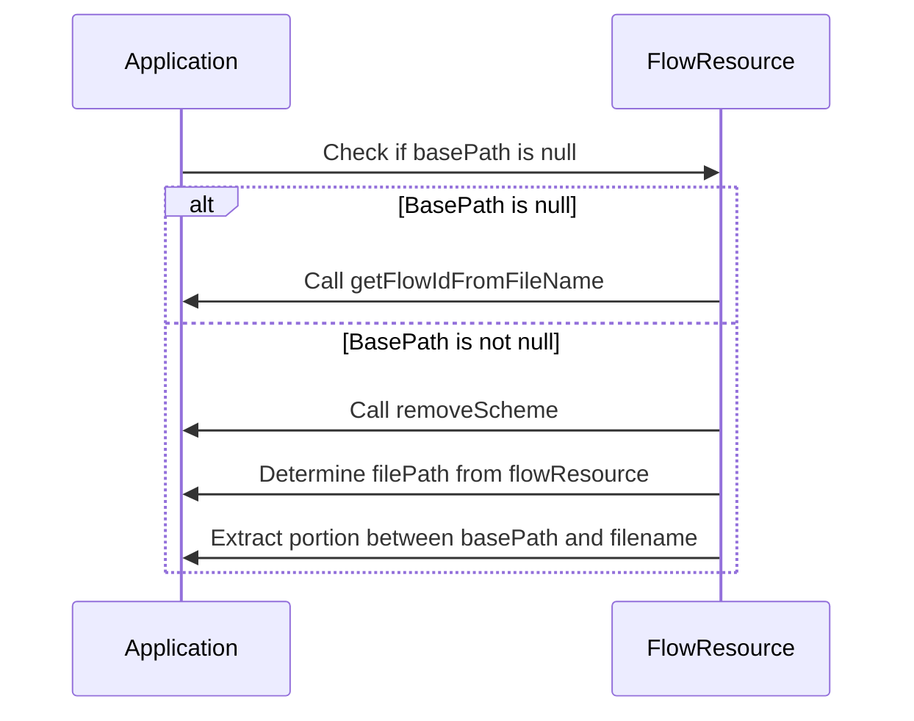

```mermaid
graph TD
  subgraph getMessage
    getMessage:A["Cast target to MessageSource"] --> getMessage:B["Call getMessage on MessageSource"]
    getMessage:B --> getMessage:C["Return message"]
  end

%% Swimm:
%% graph TD
%%   subgraph <SwmToken path="spring-webflow/src/main/java/org/springframework/webflow/expression/spel/MessageSourcePropertyAccessor.java" pos="66:5:5" line-data="	private String getMessage(Object target, String name) {">`getMessage`</SwmToken>
%%     <SwmToken path="spring-webflow/src/main/java/org/springframework/webflow/expression/spel/MessageSourcePropertyAccessor.java" pos="66:5:5" line-data="	private String getMessage(Object target, String name) {">`getMessage`</SwmToken>:A["Cast target to <SwmToken path="spring-webflow/src/main/java/org/springframework/webflow/expression/spel/MessageSourcePropertyAccessor.java" pos="67:5:5" line-data="		return ((MessageSource) target).getMessage(name, null, null, getLocale());">`MessageSource`</SwmToken>"] --> <SwmToken path="spring-webflow/src/main/java/org/springframework/webflow/expression/spel/MessageSourcePropertyAccessor.java" pos="66:5:5" line-data="	private String getMessage(Object target, String name) {">`getMessage`</SwmToken>:B["Call <SwmToken path="spring-webflow/src/main/java/org/springframework/webflow/expression/spel/MessageSourcePropertyAccessor.java" pos="66:5:5" line-data="	private String getMessage(Object target, String name) {">`getMessage`</SwmToken> on <SwmToken path="spring-webflow/src/main/java/org/springframework/webflow/expression/spel/MessageSourcePropertyAccessor.java" pos="67:5:5" line-data="		return ((MessageSource) target).getMessage(name, null, null, getLocale());">`MessageSource`</SwmToken>"]
%%     <SwmToken path="spring-webflow/src/main/java/org/springframework/webflow/expression/spel/MessageSourcePropertyAccessor.java" pos="66:5:5" line-data="	private String getMessage(Object target, String name) {">`getMessage`</SwmToken>:B --> <SwmToken path="spring-webflow/src/main/java/org/springframework/webflow/expression/spel/MessageSourcePropertyAccessor.java" pos="66:5:5" line-data="	private String getMessage(Object target, String name) {">`getMessage`</SwmToken>:C["Return message"]
%%   end
```

```mermaid
graph TD
  subgraph getLocale
    getLocale:A["Fetch RequestContext"] --> getLocale:B["Check if RequestContext is not null"]
    getLocale:B -->|Not null| getLocale:C["Fetch ExternalContext from RequestContext"]
    getLocale:B -->|Null| getLocale:D["Fetch Locale from LocaleContextHolder"]
  end
  subgraph getExternalContext
    getExternalContext:A["Fetch ExternalContext from externalContextHolder"]
  end
  subgraph getRequestContext
    getRequestContext:A["Check if requestContext is not null"] -->|Not null| getRequestContext:B["Return requestContext"]
    getRequestContext:A -->|Null| getRequestContext:C["Fetch RequestContext from RequestContextHolder"]
  end
  getLocale:A --> getRequestContext
  getLocale:C --> getExternalContext

%% Swimm:
%% graph TD
%%   subgraph <SwmToken path="spring-webflow/src/main/java/org/springframework/webflow/expression/spel/MessageSourcePropertyAccessor.java" pos="67:22:22" line-data="		return ((MessageSource) target).getMessage(name, null, null, getLocale());">`getLocale`</SwmToken>
%%     <SwmToken path="spring-webflow/src/main/java/org/springframework/webflow/expression/spel/MessageSourcePropertyAccessor.java" pos="67:22:22" line-data="		return ((MessageSource) target).getMessage(name, null, null, getLocale());">`getLocale`</SwmToken>:A["Fetch <SwmToken path="spring-webflow/src/main/java/org/springframework/webflow/expression/spel/MessageSourcePropertyAccessor.java" pos="71:1:1" line-data="		RequestContext requestContext = RequestContextHolder.getRequestContext();">`RequestContext`</SwmToken>"] --> <SwmToken path="spring-webflow/src/main/java/org/springframework/webflow/expression/spel/MessageSourcePropertyAccessor.java" pos="67:22:22" line-data="		return ((MessageSource) target).getMessage(name, null, null, getLocale());">`getLocale`</SwmToken>:B["Check if <SwmToken path="spring-webflow/src/main/java/org/springframework/webflow/expression/spel/MessageSourcePropertyAccessor.java" pos="71:1:1" line-data="		RequestContext requestContext = RequestContextHolder.getRequestContext();">`RequestContext`</SwmToken> is not null"]
%%     <SwmToken path="spring-webflow/src/main/java/org/springframework/webflow/expression/spel/MessageSourcePropertyAccessor.java" pos="67:22:22" line-data="		return ((MessageSource) target).getMessage(name, null, null, getLocale());">`getLocale`</SwmToken>:B -->|Not null| <SwmToken path="spring-webflow/src/main/java/org/springframework/webflow/expression/spel/MessageSourcePropertyAccessor.java" pos="67:22:22" line-data="		return ((MessageSource) target).getMessage(name, null, null, getLocale());">`getLocale`</SwmToken>:C["Fetch <SwmToken path="spring-webflow/src/main/java/org/springframework/webflow/context/ExternalContextHolder.java" pos="48:5:5" line-data="	public static ExternalContext getExternalContext() {">`ExternalContext`</SwmToken> from <SwmToken path="spring-webflow/src/main/java/org/springframework/webflow/expression/spel/MessageSourcePropertyAccessor.java" pos="71:1:1" line-data="		RequestContext requestContext = RequestContextHolder.getRequestContext();">`RequestContext`</SwmToken>"]
%%     <SwmToken path="spring-webflow/src/main/java/org/springframework/webflow/expression/spel/MessageSourcePropertyAccessor.java" pos="67:22:22" line-data="		return ((MessageSource) target).getMessage(name, null, null, getLocale());">`getLocale`</SwmToken>:B -->|Null| <SwmToken path="spring-webflow/src/main/java/org/springframework/webflow/expression/spel/MessageSourcePropertyAccessor.java" pos="67:22:22" line-data="		return ((MessageSource) target).getMessage(name, null, null, getLocale());">`getLocale`</SwmToken>:D["Fetch Locale from <SwmToken path="spring-webflow/src/main/java/org/springframework/webflow/expression/spel/MessageSourcePropertyAccessor.java" pos="72:25:25" line-data="		return (requestContext != null) ? requestContext.getExternalContext().getLocale() : LocaleContextHolder">`LocaleContextHolder`</SwmToken>"]
%%   end
%%   subgraph <SwmToken path="spring-webflow/src/main/java/org/springframework/webflow/expression/spel/MessageSourcePropertyAccessor.java" pos="72:15:15" line-data="		return (requestContext != null) ? requestContext.getExternalContext().getLocale() : LocaleContextHolder">`getExternalContext`</SwmToken>
%%     <SwmToken path="spring-webflow/src/main/java/org/springframework/webflow/expression/spel/MessageSourcePropertyAccessor.java" pos="72:15:15" line-data="		return (requestContext != null) ? requestContext.getExternalContext().getLocale() : LocaleContextHolder">`getExternalContext`</SwmToken>:A["Fetch <SwmToken path="spring-webflow/src/main/java/org/springframework/webflow/context/ExternalContextHolder.java" pos="48:5:5" line-data="	public static ExternalContext getExternalContext() {">`ExternalContext`</SwmToken> from <SwmToken path="spring-webflow/src/main/java/org/springframework/webflow/context/ExternalContextHolder.java" pos="49:3:3" line-data="		return externalContextHolder.get();">`externalContextHolder`</SwmToken>"]
%%   end
%%   subgraph <SwmToken path="spring-webflow/src/main/java/org/springframework/webflow/expression/spel/MessageSourcePropertyAccessor.java" pos="71:9:9" line-data="		RequestContext requestContext = RequestContextHolder.getRequestContext();">`getRequestContext`</SwmToken>
%%     <SwmToken path="spring-webflow/src/main/java/org/springframework/webflow/expression/spel/MessageSourcePropertyAccessor.java" pos="71:9:9" line-data="		RequestContext requestContext = RequestContextHolder.getRequestContext();">`getRequestContext`</SwmToken>:A["Check if <SwmToken path="spring-webflow/src/main/java/org/springframework/webflow/expression/spel/MessageSourcePropertyAccessor.java" pos="71:3:3" line-data="		RequestContext requestContext = RequestContextHolder.getRequestContext();">`requestContext`</SwmToken> is not null"] -->|Not null| <SwmToken path="spring-webflow/src/main/java/org/springframework/webflow/expression/spel/MessageSourcePropertyAccessor.java" pos="71:9:9" line-data="		RequestContext requestContext = RequestContextHolder.getRequestContext();">`getRequestContext`</SwmToken>:B["Return <SwmToken path="spring-webflow/src/main/java/org/springframework/webflow/expression/spel/MessageSourcePropertyAccessor.java" pos="71:3:3" line-data="		RequestContext requestContext = RequestContextHolder.getRequestContext();">`requestContext`</SwmToken>"]
%%     <SwmToken path="spring-webflow/src/main/java/org/springframework/webflow/expression/spel/MessageSourcePropertyAccessor.java" pos="71:9:9" line-data="		RequestContext requestContext = RequestContextHolder.getRequestContext();">`getRequestContext`</SwmToken>:A -->|Null| <SwmToken path="spring-webflow/src/main/java/org/springframework/webflow/expression/spel/MessageSourcePropertyAccessor.java" pos="71:9:9" line-data="		RequestContext requestContext = RequestContextHolder.getRequestContext();">`getRequestContext`</SwmToken>:C["Fetch <SwmToken path="spring-webflow/src/main/java/org/springframework/webflow/expression/spel/MessageSourcePropertyAccessor.java" pos="71:1:1" line-data="		RequestContext requestContext = RequestContextHolder.getRequestContext();">`RequestContext`</SwmToken> from <SwmToken path="spring-webflow/src/main/java/org/springframework/webflow/expression/spel/MessageSourcePropertyAccessor.java" pos="71:7:7" line-data="		RequestContext requestContext = RequestContextHolder.getRequestContext();">`RequestContextHolder`</SwmToken>"]
%%   end
%%   <SwmToken path="spring-webflow/src/main/java/org/springframework/webflow/expression/spel/MessageSourcePropertyAccessor.java" pos="67:22:22" line-data="		return ((MessageSource) target).getMessage(name, null, null, getLocale());">`getLocale`</SwmToken>:A --> <SwmToken path="spring-webflow/src/main/java/org/springframework/webflow/expression/spel/MessageSourcePropertyAccessor.java" pos="71:9:9" line-data="		RequestContext requestContext = RequestContextHolder.getRequestContext();">`getRequestContext`</SwmToken>
%%   <SwmToken path="spring-webflow/src/main/java/org/springframework/webflow/expression/spel/MessageSourcePropertyAccessor.java" pos="67:22:22" line-data="		return ((MessageSource) target).getMessage(name, null, null, getLocale());">`getLocale`</SwmToken>:C --> <SwmToken path="spring-webflow/src/main/java/org/springframework/webflow/expression/spel/MessageSourcePropertyAccessor.java" pos="72:15:15" line-data="		return (requestContext != null) ? requestContext.getExternalContext().getLocale() : LocaleContextHolder">`getExternalContext`</SwmToken>
```

This document explains the process of obtaining a flow ID from a flow resource. The flow ID is essential for identifying and managing different flows within the application.

For instance, when a new flow resource is added, the <SwmToken path="spring-webflow/src/main/java/org/springframework/webflow/config/FlowDefinitionResourceFactory.java" pos="195:5:5" line-data="	protected String getFlowId(Resource flowResource) {">`getFlowId`</SwmToken> method extracts the relevant portion of the file path to generate a unique flow ID, ensuring that the flow can be correctly identified and utilized within the application.



# Where is this flow used?

This flow is used multiple times in the codebase as represented in the following diagram:

```mermaid
graph TD;
      subgraph springwebflowsrcmainjavaorgspringframeworkwebflowconfig[spring-webflow/…/webflow/config]
47c5fed4dc6987cc95c902361d4b57733ea7e0a1436152042a94ff071db513a4(createResource) --> d57d0c4cd9d521db8d0bf98584016e5e173a292e3f217266a49f095bdc92ee74(FlowDefinitionResourceFactory.getFlowId)
end

subgraph springwebflowsrcmainjavaorgspringframeworkwebflowconfig[spring-webflow/…/webflow/config]
14856599cb297e19d5ef769f77ddfc8ccb8de733e9f1ee0374208d99c57882e7(createResources) --> d57d0c4cd9d521db8d0bf98584016e5e173a292e3f217266a49f095bdc92ee74(FlowDefinitionResourceFactory.getFlowId)
end

subgraph springwebflowsrcmainjavaorgspringframeworkwebflowconfig[spring-webflow/…/webflow/config]
73fbc45a1a16fa38ca2fa1449c4da5bc23a85886dd3ed2396fd540e8e946c9d3(registerFlowLocationPatterns) --> 14856599cb297e19d5ef769f77ddfc8ccb8de733e9f1ee0374208d99c57882e7(createResources)
end

subgraph springwebflowsrcmainjavaorgspringframeworkwebflowconfig[spring-webflow/…/webflow/config]
1b90ecf800bbc7530a7fa1ce5da86edf43748f2181cd61cce0354fd86270baa3(afterPropertiesSet) --> 73fbc45a1a16fa38ca2fa1449c4da5bc23a85886dd3ed2396fd540e8e946c9d3(registerFlowLocationPatterns)
end

subgraph springwebflowsrcmainjavaorgspringframeworkwebflowconfig[spring-webflow/…/webflow/config]
62f64636bad84a3c7d419c7af4fab9a74438c9bf8c8a546978ad534394ab3a48(registerFlowLocationPatterns) --> 14856599cb297e19d5ef769f77ddfc8ccb8de733e9f1ee0374208d99c57882e7(createResources)
end

subgraph springwebflowsrcmainjavaorgspringframeworkwebflowconfig[spring-webflow/…/webflow/config]
5ea9a3feeed8ad6d34de42f261caa9230b8ece470b9be1cfb63b5ac3dff9a97c(build) --> 62f64636bad84a3c7d419c7af4fab9a74438c9bf8c8a546978ad534394ab3a48(registerFlowLocationPatterns)
end

subgraph springwebflowsrcmainjavaorgspringframeworkwebflowconfig[spring-webflow/…/webflow/config]
e8cc0123680495888518bed32ace4fc20e41ea6ec58363164584f8c1c181a00b(FlowDefinitionRegistryBuilder) --> 5ea9a3feeed8ad6d34de42f261caa9230b8ece470b9be1cfb63b5ac3dff9a97c(build)
end

subgraph springwebflowsrcmainjavaorgspringframeworkwebflowconfig[spring-webflow/…/webflow/config]
afcd19a00ce34bc9bc6e67572b84081b666a60ee402ed2fe62622c56f6f4f94b(createFileResource) --> d57d0c4cd9d521db8d0bf98584016e5e173a292e3f217266a49f095bdc92ee74(FlowDefinitionResourceFactory.getFlowId)
end

subgraph springwebflowsrcmainjavaorgspringframeworkwebflowconfig[spring-webflow/…/webflow/config]
ed4b171c5958d52011bc8ce10f7b591831f20e6afa0246172a1e8c14c30562a7(createClassPathResource) --> d57d0c4cd9d521db8d0bf98584016e5e173a292e3f217266a49f095bdc92ee74(FlowDefinitionResourceFactory.getFlowId)
end


      classDef mainFlowStyle color:#000000,fill:#7CB9F4
classDef rootsStyle color:#000000,fill:#00FFF4
classDef Style1 color:#000000,fill:#00FFAA
classDef Style2 color:#000000,fill:#FFFF00
classDef Style3 color:#000000,fill:#AA7CB9

%% Swimm:
%% graph TD;
%%       subgraph springwebflowsrcmainjavaorgspringframeworkwebflowconfig[<SwmPath>[spring-webflow/…/webflow/config/](spring-webflow/src/main/java/org/springframework/webflow/config/)</SwmPath>]
%% 47c5fed4dc6987cc95c902361d4b57733ea7e0a1436152042a94ff071db513a4(<SwmToken path="spring-webflow/src/main/java/org/springframework/webflow/config/FlowDefinitionResourceFactory.java" pos="85:5:5" line-data="	public FlowDefinitionResource createResource(String path) {">`createResource`</SwmToken>) --> d57d0c4cd9d521db8d0bf98584016e5e173a292e3f217266a49f095bdc92ee74(FlowDefinitionResourceFactory.getFlowId)
%% end
%% 
%% subgraph springwebflowsrcmainjavaorgspringframeworkwebflowconfig[<SwmPath>[spring-webflow/…/webflow/config/](spring-webflow/src/main/java/org/springframework/webflow/config/)</SwmPath>]
%% 14856599cb297e19d5ef769f77ddfc8ccb8de733e9f1ee0374208d99c57882e7(<SwmToken path="spring-webflow/src/main/java/org/springframework/webflow/config/FlowDefinitionResourceFactory.java" pos="137:7:7" line-data="	public FlowDefinitionResource[] createResources(String pattern, AttributeMap&lt;Object&gt; attributes) throws IOException {">`createResources`</SwmToken>) --> d57d0c4cd9d521db8d0bf98584016e5e173a292e3f217266a49f095bdc92ee74(FlowDefinitionResourceFactory.getFlowId)
%% end
%% 
%% subgraph springwebflowsrcmainjavaorgspringframeworkwebflowconfig[<SwmPath>[spring-webflow/…/webflow/config/](spring-webflow/src/main/java/org/springframework/webflow/config/)</SwmPath>]
%% 73fbc45a1a16fa38ca2fa1449c4da5bc23a85886dd3ed2396fd540e8e946c9d3(registerFlowLocationPatterns) --> 14856599cb297e19d5ef769f77ddfc8ccb8de733e9f1ee0374208d99c57882e7(<SwmToken path="spring-webflow/src/main/java/org/springframework/webflow/config/FlowDefinitionResourceFactory.java" pos="137:7:7" line-data="	public FlowDefinitionResource[] createResources(String pattern, AttributeMap&lt;Object&gt; attributes) throws IOException {">`createResources`</SwmToken>)
%% end
%% 
%% subgraph springwebflowsrcmainjavaorgspringframeworkwebflowconfig[<SwmPath>[spring-webflow/…/webflow/config/](spring-webflow/src/main/java/org/springframework/webflow/config/)</SwmPath>]
%% 1b90ecf800bbc7530a7fa1ce5da86edf43748f2181cd61cce0354fd86270baa3(afterPropertiesSet) --> 73fbc45a1a16fa38ca2fa1449c4da5bc23a85886dd3ed2396fd540e8e946c9d3(registerFlowLocationPatterns)
%% end
%% 
%% subgraph springwebflowsrcmainjavaorgspringframeworkwebflowconfig[<SwmPath>[spring-webflow/…/webflow/config/](spring-webflow/src/main/java/org/springframework/webflow/config/)</SwmPath>]
%% 62f64636bad84a3c7d419c7af4fab9a74438c9bf8c8a546978ad534394ab3a48(registerFlowLocationPatterns) --> 14856599cb297e19d5ef769f77ddfc8ccb8de733e9f1ee0374208d99c57882e7(<SwmToken path="spring-webflow/src/main/java/org/springframework/webflow/config/FlowDefinitionResourceFactory.java" pos="137:7:7" line-data="	public FlowDefinitionResource[] createResources(String pattern, AttributeMap&lt;Object&gt; attributes) throws IOException {">`createResources`</SwmToken>)
%% end
%% 
%% subgraph springwebflowsrcmainjavaorgspringframeworkwebflowconfig[<SwmPath>[spring-webflow/…/webflow/config/](spring-webflow/src/main/java/org/springframework/webflow/config/)</SwmPath>]
%% 5ea9a3feeed8ad6d34de42f261caa9230b8ece470b9be1cfb63b5ac3dff9a97c(build) --> 62f64636bad84a3c7d419c7af4fab9a74438c9bf8c8a546978ad534394ab3a48(registerFlowLocationPatterns)
%% end
%% 
%% subgraph springwebflowsrcmainjavaorgspringframeworkwebflowconfig[<SwmPath>[spring-webflow/…/webflow/config/](spring-webflow/src/main/java/org/springframework/webflow/config/)</SwmPath>]
%% e8cc0123680495888518bed32ace4fc20e41ea6ec58363164584f8c1c181a00b(FlowDefinitionRegistryBuilder) --> 5ea9a3feeed8ad6d34de42f261caa9230b8ece470b9be1cfb63b5ac3dff9a97c(build)
%% end
%% 
%% subgraph springwebflowsrcmainjavaorgspringframeworkwebflowconfig[<SwmPath>[spring-webflow/…/webflow/config/](spring-webflow/src/main/java/org/springframework/webflow/config/)</SwmPath>]
%% afcd19a00ce34bc9bc6e67572b84081b666a60ee402ed2fe62622c56f6f4f94b(<SwmToken path="spring-webflow/src/main/java/org/springframework/webflow/config/FlowDefinitionResourceFactory.java" pos="167:5:5" line-data="	public FlowDefinitionResource createFileResource(String path) {">`createFileResource`</SwmToken>) --> d57d0c4cd9d521db8d0bf98584016e5e173a292e3f217266a49f095bdc92ee74(FlowDefinitionResourceFactory.getFlowId)
%% end
%% 
%% subgraph springwebflowsrcmainjavaorgspringframeworkwebflowconfig[<SwmPath>[spring-webflow/…/webflow/config/](spring-webflow/src/main/java/org/springframework/webflow/config/)</SwmPath>]
%% ed4b171c5958d52011bc8ce10f7b591831f20e6afa0246172a1e8c14c30562a7(<SwmToken path="spring-webflow/src/main/java/org/springframework/webflow/config/FlowDefinitionResourceFactory.java" pos="178:5:5" line-data="	public FlowDefinitionResource createClassPathResource(String path, Class&lt;?&gt; clazz) {">`createClassPathResource`</SwmToken>) --> d57d0c4cd9d521db8d0bf98584016e5e173a292e3f217266a49f095bdc92ee74(FlowDefinitionResourceFactory.getFlowId)
%% end
%% 
%% 
%%       classDef mainFlowStyle color:#000000,fill:#7CB9F4
%% classDef rootsStyle color:#000000,fill:#00FFF4
%% classDef Style1 color:#000000,fill:#00FFAA
%% classDef Style2 color:#000000,fill:#FFFF00
%% classDef Style3 color:#000000,fill:#AA7CB9
```



Here is a high level diagram of the flow, showing only the most important functions:

```mermaid
graph TD;
      subgraph springwebflowsrcmainjavaorgspringframeworkwebflowexpression[spring-webflow/…/webflow/expression]
d57d0c4cd9d521db8d0bf98584016e5e173a292e3f217266a49f095bdc92ee74(FlowDefinitionResourceFactory.getFlowId) --> 28ea3aae04b649276b117d1a284d00f2804a19ae3a827eefcae5d6b7f0a729f0(MessageSourcePropertyAccessor.getMessage)
end

subgraph springwebflowsrcmainjavaorgspringframeworkwebflowconfig[spring-webflow/…/webflow/config]
d57d0c4cd9d521db8d0bf98584016e5e173a292e3f217266a49f095bdc92ee74(FlowDefinitionResourceFactory.getFlowId) --> d9bd4b9ab2d36514bf02a56a9cd745426b021d6f506d26ecfec3a028b66aef34(FlowDefinitionResourceFactory.removeScheme)
end

subgraph springwebflowsrcmainjavaorgspringframeworkwebflowconfig[spring-webflow/…/webflow/config]
d57d0c4cd9d521db8d0bf98584016e5e173a292e3f217266a49f095bdc92ee74(FlowDefinitionResourceFactory.getFlowId) --> c5701121d513e86c5474294374a37ac7307e994243178d6fca6b5e38f3fc5c25(FlowDefinitionResourceFactory.truncateFilePath)
end

subgraph springwebflowsrcmainjavaorgspringframeworkwebflowconfig[spring-webflow/…/webflow/config]
d57d0c4cd9d521db8d0bf98584016e5e173a292e3f217266a49f095bdc92ee74(FlowDefinitionResourceFactory.getFlowId) --> fad5e5b4a95d085e6c843f83608f164e6c32f4aa4ca00c45943aa55377c8c1b9(FlowDefinitionResource.getPath)
end

subgraph springwebflowsrcmainjavaorgspringframeworkwebflowexpression[spring-webflow/…/webflow/expression]
28ea3aae04b649276b117d1a284d00f2804a19ae3a827eefcae5d6b7f0a729f0(MessageSourcePropertyAccessor.getMessage) --> fb9e05d9d4cdb395d6379a7c5c3d454c299012a42149fd359a5242910270d5c4(MessageSourcePropertyAccessor.getLocale)
end

subgraph springwebflowsrcmainjavaorgspringframeworkwebflowcontextExternalContextHolderjava[spring-webflow/…/context/ExternalContextHolder.java]
fb9e05d9d4cdb395d6379a7c5c3d454c299012a42149fd359a5242910270d5c4(MessageSourcePropertyAccessor.getLocale) --> 74899b25b479424f4de83f83f111efb7eec43c1b63318b0cbf88feb8958bce68(ExternalContextHolder.getExternalContext)
end

subgraph springwebflowsrcmainjavaorgspringframeworkwebflowexpression[spring-webflow/…/webflow/expression]
fb9e05d9d4cdb395d6379a7c5c3d454c299012a42149fd359a5242910270d5c4(MessageSourcePropertyAccessor.getLocale) --> 292dbbae281f6ad2bf4cf0704ef99d9bc9e4cf9827a8de3881bedff15991f4b4(ScopeSearchingELResolver.getRequestContext)
end


      classDef mainFlowStyle color:#000000,fill:#7CB9F4
classDef rootsStyle color:#000000,fill:#00FFF4
classDef Style1 color:#000000,fill:#00FFAA
classDef Style2 color:#000000,fill:#FFFF00
classDef Style3 color:#000000,fill:#AA7CB9

%% Swimm:
%% graph TD;
%%       subgraph springwebflowsrcmainjavaorgspringframeworkwebflowexpression[<SwmPath>[spring-webflow/…/webflow/expression/](spring-webflow/src/main/java/org/springframework/webflow/expression/)</SwmPath>]
%% d57d0c4cd9d521db8d0bf98584016e5e173a292e3f217266a49f095bdc92ee74(FlowDefinitionResourceFactory.getFlowId) --> 28ea3aae04b649276b117d1a284d00f2804a19ae3a827eefcae5d6b7f0a729f0(MessageSourcePropertyAccessor.getMessage)
%% end
%% 
%% subgraph springwebflowsrcmainjavaorgspringframeworkwebflowconfig[<SwmPath>[spring-webflow/…/webflow/config/](spring-webflow/src/main/java/org/springframework/webflow/config/)</SwmPath>]
%% d57d0c4cd9d521db8d0bf98584016e5e173a292e3f217266a49f095bdc92ee74(FlowDefinitionResourceFactory.getFlowId) --> d9bd4b9ab2d36514bf02a56a9cd745426b021d6f506d26ecfec3a028b66aef34(FlowDefinitionResourceFactory.removeScheme)
%% end
%% 
%% subgraph springwebflowsrcmainjavaorgspringframeworkwebflowconfig[<SwmPath>[spring-webflow/…/webflow/config/](spring-webflow/src/main/java/org/springframework/webflow/config/)</SwmPath>]
%% d57d0c4cd9d521db8d0bf98584016e5e173a292e3f217266a49f095bdc92ee74(FlowDefinitionResourceFactory.getFlowId) --> c5701121d513e86c5474294374a37ac7307e994243178d6fca6b5e38f3fc5c25(FlowDefinitionResourceFactory.truncateFilePath)
%% end
%% 
%% subgraph springwebflowsrcmainjavaorgspringframeworkwebflowconfig[<SwmPath>[spring-webflow/…/webflow/config/](spring-webflow/src/main/java/org/springframework/webflow/config/)</SwmPath>]
%% d57d0c4cd9d521db8d0bf98584016e5e173a292e3f217266a49f095bdc92ee74(FlowDefinitionResourceFactory.getFlowId) --> fad5e5b4a95d085e6c843f83608f164e6c32f4aa4ca00c45943aa55377c8c1b9(FlowDefinitionResource.getPath)
%% end
%% 
%% subgraph springwebflowsrcmainjavaorgspringframeworkwebflowexpression[<SwmPath>[spring-webflow/…/webflow/expression/](spring-webflow/src/main/java/org/springframework/webflow/expression/)</SwmPath>]
%% 28ea3aae04b649276b117d1a284d00f2804a19ae3a827eefcae5d6b7f0a729f0(MessageSourcePropertyAccessor.getMessage) --> fb9e05d9d4cdb395d6379a7c5c3d454c299012a42149fd359a5242910270d5c4(MessageSourcePropertyAccessor.getLocale)
%% end
%% 
%% subgraph springwebflowsrcmainjavaorgspringframeworkwebflowcontextExternalContextHolderjava[<SwmPath>[spring-webflow/…/context/ExternalContextHolder.java](spring-webflow/src/main/java/org/springframework/webflow/context/ExternalContextHolder.java)</SwmPath>]
%% fb9e05d9d4cdb395d6379a7c5c3d454c299012a42149fd359a5242910270d5c4(MessageSourcePropertyAccessor.getLocale) --> 74899b25b479424f4de83f83f111efb7eec43c1b63318b0cbf88feb8958bce68(ExternalContextHolder.getExternalContext)
%% end
%% 
%% subgraph springwebflowsrcmainjavaorgspringframeworkwebflowexpression[<SwmPath>[spring-webflow/…/webflow/expression/](spring-webflow/src/main/java/org/springframework/webflow/expression/)</SwmPath>]
%% fb9e05d9d4cdb395d6379a7c5c3d454c299012a42149fd359a5242910270d5c4(MessageSourcePropertyAccessor.getLocale) --> 292dbbae281f6ad2bf4cf0704ef99d9bc9e4cf9827a8de3881bedff15991f4b4(ScopeSearchingELResolver.getRequestContext)
%% end
%% 
%% 
%%       classDef mainFlowStyle color:#000000,fill:#7CB9F4
%% classDef rootsStyle color:#000000,fill:#00FFF4
%% classDef Style1 color:#000000,fill:#00FFAA
%% classDef Style2 color:#000000,fill:#FFFF00
%% classDef Style3 color:#000000,fill:#AA7CB9
```



# Flow drill down

```mermaid
graph TD
  subgraph getFlowId
    getFlowId:A["Check if basePath is null"] -->|BasePath is null| getFlowId:B["Call getFlowIdFromFileName"]
    getFlowId:A -->|BasePath is not null| getFlowId:C["Call removeScheme"]
    getFlowId:C --> getFlowId:D["Determine filePath from flowResource"]
    getFlowId:D --> getFlowId:E["Extract portion between basePath and filename"]
  end
  subgraph removeScheme
    removeScheme:A["Check if basePath starts with CLASSPATH_SCHEME"] -->|Yes| removeScheme:B["Remove CLASSPATH_SCHEME"]
    removeScheme:A -->|No| removeScheme:C["Check if basePath starts with FILESYSTEM_SCHEME"]
    removeScheme:C -->|Yes| removeScheme:D["Remove FILESYSTEM_SCHEME"]
    removeScheme:C -->|No| removeScheme:E["Check if basePath starts with CLASSPATH_STAR_SCHEME"]
    removeScheme:E -->|Yes| removeScheme:F["Remove CLASSPATH_STAR_SCHEME"]
    removeScheme:E -->|No| removeScheme:G["Return basePath"]
  end
  subgraph truncateFilePath
    truncateFilePath:A["Find last index of basePath in filePath"] --> truncateFilePath:B["Check if basePathIndex is not -1"]
    truncateFilePath:B -->|Yes| truncateFilePath:C["Extract portion starting from basePathIndex"]
    truncateFilePath:B -->|No| truncateFilePath:D["Return filePath"]
  end
  subgraph getPath
    getPath:A["Return path to flow definition resource"]
  end
  getFlowId:C --> removeScheme
  getFlowId:D --> truncateFilePath

%% Swimm:
%% graph TD
%%   subgraph <SwmToken path="spring-webflow/src/main/java/org/springframework/webflow/config/FlowDefinitionResourceFactory.java" pos="195:5:5" line-data="	protected String getFlowId(Resource flowResource) {">`getFlowId`</SwmToken>
%%     <SwmToken path="spring-webflow/src/main/java/org/springframework/webflow/config/FlowDefinitionResourceFactory.java" pos="195:5:5" line-data="	protected String getFlowId(Resource flowResource) {">`getFlowId`</SwmToken>:A["Check if <SwmToken path="spring-webflow/src/main/java/org/springframework/webflow/config/FlowDefinitionResourceFactory.java" pos="196:4:4" line-data="		if (basePath == null) {">`basePath`</SwmToken> is null"] -->|BasePath is null| <SwmToken path="spring-webflow/src/main/java/org/springframework/webflow/config/FlowDefinitionResourceFactory.java" pos="195:5:5" line-data="	protected String getFlowId(Resource flowResource) {">`getFlowId`</SwmToken>:B["Call <SwmToken path="spring-webflow/src/main/java/org/springframework/webflow/config/FlowDefinitionResourceFactory.java" pos="197:3:3" line-data="			return getFlowIdFromFileName(flowResource);">`getFlowIdFromFileName`</SwmToken>"]
%%     <SwmToken path="spring-webflow/src/main/java/org/springframework/webflow/config/FlowDefinitionResourceFactory.java" pos="195:5:5" line-data="	protected String getFlowId(Resource flowResource) {">`getFlowId`</SwmToken>:A -->|BasePath is not null| <SwmToken path="spring-webflow/src/main/java/org/springframework/webflow/config/FlowDefinitionResourceFactory.java" pos="195:5:5" line-data="	protected String getFlowId(Resource flowResource) {">`getFlowId`</SwmToken>:C["Call <SwmToken path="spring-webflow/src/main/java/org/springframework/webflow/config/FlowDefinitionResourceFactory.java" pos="199:7:7" line-data="		String basePath = removeScheme(this.basePath);">`removeScheme`</SwmToken>"]
%%     <SwmToken path="spring-webflow/src/main/java/org/springframework/webflow/config/FlowDefinitionResourceFactory.java" pos="195:5:5" line-data="	protected String getFlowId(Resource flowResource) {">`getFlowId`</SwmToken>:C --> <SwmToken path="spring-webflow/src/main/java/org/springframework/webflow/config/FlowDefinitionResourceFactory.java" pos="195:5:5" line-data="	protected String getFlowId(Resource flowResource) {">`getFlowId`</SwmToken>:D["Determine <SwmToken path="spring-webflow/src/main/java/org/springframework/webflow/config/FlowDefinitionResourceFactory.java" pos="200:3:3" line-data="		String filePath;">`filePath`</SwmToken> from <SwmToken path="spring-webflow/src/main/java/org/springframework/webflow/config/FlowDefinitionResourceFactory.java" pos="195:9:9" line-data="	protected String getFlowId(Resource flowResource) {">`flowResource`</SwmToken>"]
%%     <SwmToken path="spring-webflow/src/main/java/org/springframework/webflow/config/FlowDefinitionResourceFactory.java" pos="195:5:5" line-data="	protected String getFlowId(Resource flowResource) {">`getFlowId`</SwmToken>:D --> <SwmToken path="spring-webflow/src/main/java/org/springframework/webflow/config/FlowDefinitionResourceFactory.java" pos="195:5:5" line-data="	protected String getFlowId(Resource flowResource) {">`getFlowId`</SwmToken>:E["Extract portion between <SwmToken path="spring-webflow/src/main/java/org/springframework/webflow/config/FlowDefinitionResourceFactory.java" pos="196:4:4" line-data="		if (basePath == null) {">`basePath`</SwmToken> and filename"]
%%   end
%%   subgraph <SwmToken path="spring-webflow/src/main/java/org/springframework/webflow/config/FlowDefinitionResourceFactory.java" pos="199:7:7" line-data="		String basePath = removeScheme(this.basePath);">`removeScheme`</SwmToken>
%%     <SwmToken path="spring-webflow/src/main/java/org/springframework/webflow/config/FlowDefinitionResourceFactory.java" pos="199:7:7" line-data="		String basePath = removeScheme(this.basePath);">`removeScheme`</SwmToken>:A["Check if <SwmToken path="spring-webflow/src/main/java/org/springframework/webflow/config/FlowDefinitionResourceFactory.java" pos="196:4:4" line-data="		if (basePath == null) {">`basePath`</SwmToken> starts with <SwmToken path="spring-webflow/src/main/java/org/springframework/webflow/config/FlowDefinitionResourceFactory.java" pos="42:9:9" line-data="	private static final String CLASSPATH_SCHEME = &quot;classpath:&quot;;">`CLASSPATH_SCHEME`</SwmToken>"] -->|Yes| <SwmToken path="spring-webflow/src/main/java/org/springframework/webflow/config/FlowDefinitionResourceFactory.java" pos="199:7:7" line-data="		String basePath = removeScheme(this.basePath);">`removeScheme`</SwmToken>:B["Remove <SwmToken path="spring-webflow/src/main/java/org/springframework/webflow/config/FlowDefinitionResourceFactory.java" pos="42:9:9" line-data="	private static final String CLASSPATH_SCHEME = &quot;classpath:&quot;;">`CLASSPATH_SCHEME`</SwmToken>"]
%%     <SwmToken path="spring-webflow/src/main/java/org/springframework/webflow/config/FlowDefinitionResourceFactory.java" pos="199:7:7" line-data="		String basePath = removeScheme(this.basePath);">`removeScheme`</SwmToken>:A -->|No| <SwmToken path="spring-webflow/src/main/java/org/springframework/webflow/config/FlowDefinitionResourceFactory.java" pos="199:7:7" line-data="		String basePath = removeScheme(this.basePath);">`removeScheme`</SwmToken>:C["Check if <SwmToken path="spring-webflow/src/main/java/org/springframework/webflow/config/FlowDefinitionResourceFactory.java" pos="196:4:4" line-data="		if (basePath == null) {">`basePath`</SwmToken> starts with <SwmToken path="spring-webflow/src/main/java/org/springframework/webflow/config/FlowDefinitionResourceFactory.java" pos="46:9:9" line-data="	private static final String FILESYSTEM_SCHEME = &quot;file:&quot;;">`FILESYSTEM_SCHEME`</SwmToken>"]
%%     <SwmToken path="spring-webflow/src/main/java/org/springframework/webflow/config/FlowDefinitionResourceFactory.java" pos="199:7:7" line-data="		String basePath = removeScheme(this.basePath);">`removeScheme`</SwmToken>:C -->|Yes| <SwmToken path="spring-webflow/src/main/java/org/springframework/webflow/config/FlowDefinitionResourceFactory.java" pos="199:7:7" line-data="		String basePath = removeScheme(this.basePath);">`removeScheme`</SwmToken>:D["Remove <SwmToken path="spring-webflow/src/main/java/org/springframework/webflow/config/FlowDefinitionResourceFactory.java" pos="46:9:9" line-data="	private static final String FILESYSTEM_SCHEME = &quot;file:&quot;;">`FILESYSTEM_SCHEME`</SwmToken>"]
%%     <SwmToken path="spring-webflow/src/main/java/org/springframework/webflow/config/FlowDefinitionResourceFactory.java" pos="199:7:7" line-data="		String basePath = removeScheme(this.basePath);">`removeScheme`</SwmToken>:C -->|No| <SwmToken path="spring-webflow/src/main/java/org/springframework/webflow/config/FlowDefinitionResourceFactory.java" pos="199:7:7" line-data="		String basePath = removeScheme(this.basePath);">`removeScheme`</SwmToken>:E["Check if <SwmToken path="spring-webflow/src/main/java/org/springframework/webflow/config/FlowDefinitionResourceFactory.java" pos="196:4:4" line-data="		if (basePath == null) {">`basePath`</SwmToken> starts with <SwmToken path="spring-webflow/src/main/java/org/springframework/webflow/config/FlowDefinitionResourceFactory.java" pos="44:9:9" line-data="	private static final String CLASSPATH_STAR_SCHEME = &quot;classpath*:&quot;;">`CLASSPATH_STAR_SCHEME`</SwmToken>"]
%%     <SwmToken path="spring-webflow/src/main/java/org/springframework/webflow/config/FlowDefinitionResourceFactory.java" pos="199:7:7" line-data="		String basePath = removeScheme(this.basePath);">`removeScheme`</SwmToken>:E -->|Yes| <SwmToken path="spring-webflow/src/main/java/org/springframework/webflow/config/FlowDefinitionResourceFactory.java" pos="199:7:7" line-data="		String basePath = removeScheme(this.basePath);">`removeScheme`</SwmToken>:F["Remove <SwmToken path="spring-webflow/src/main/java/org/springframework/webflow/config/FlowDefinitionResourceFactory.java" pos="44:9:9" line-data="	private static final String CLASSPATH_STAR_SCHEME = &quot;classpath*:&quot;;">`CLASSPATH_STAR_SCHEME`</SwmToken>"]
%%     <SwmToken path="spring-webflow/src/main/java/org/springframework/webflow/config/FlowDefinitionResourceFactory.java" pos="199:7:7" line-data="		String basePath = removeScheme(this.basePath);">`removeScheme`</SwmToken>:E -->|No| <SwmToken path="spring-webflow/src/main/java/org/springframework/webflow/config/FlowDefinitionResourceFactory.java" pos="199:7:7" line-data="		String basePath = removeScheme(this.basePath);">`removeScheme`</SwmToken>:G["Return <SwmToken path="spring-webflow/src/main/java/org/springframework/webflow/config/FlowDefinitionResourceFactory.java" pos="196:4:4" line-data="		if (basePath == null) {">`basePath`</SwmToken>"]
%%   end
%%   subgraph <SwmToken path="spring-webflow/src/main/java/org/springframework/webflow/config/FlowDefinitionResourceFactory.java" pos="206:5:5" line-data="			filePath = truncateFilePath(((FileSystemResource) flowResource).getPath(), basePath);">`truncateFilePath`</SwmToken>
%%     <SwmToken path="spring-webflow/src/main/java/org/springframework/webflow/config/FlowDefinitionResourceFactory.java" pos="206:5:5" line-data="			filePath = truncateFilePath(((FileSystemResource) flowResource).getPath(), basePath);">`truncateFilePath`</SwmToken>:A["Find last index of <SwmToken path="spring-webflow/src/main/java/org/springframework/webflow/config/FlowDefinitionResourceFactory.java" pos="196:4:4" line-data="		if (basePath == null) {">`basePath`</SwmToken> in <SwmToken path="spring-webflow/src/main/java/org/springframework/webflow/config/FlowDefinitionResourceFactory.java" pos="200:3:3" line-data="		String filePath;">`filePath`</SwmToken>"] --> <SwmToken path="spring-webflow/src/main/java/org/springframework/webflow/config/FlowDefinitionResourceFactory.java" pos="206:5:5" line-data="			filePath = truncateFilePath(((FileSystemResource) flowResource).getPath(), basePath);">`truncateFilePath`</SwmToken>:B["Check if <SwmToken path="spring-webflow/src/main/java/org/springframework/webflow/config/FlowDefinitionResourceFactory.java" pos="244:3:3" line-data="		int basePathIndex = filePath.lastIndexOf(basePath);">`basePathIndex`</SwmToken> is not -1"]
%%     <SwmToken path="spring-webflow/src/main/java/org/springframework/webflow/config/FlowDefinitionResourceFactory.java" pos="206:5:5" line-data="			filePath = truncateFilePath(((FileSystemResource) flowResource).getPath(), basePath);">`truncateFilePath`</SwmToken>:B -->|Yes| <SwmToken path="spring-webflow/src/main/java/org/springframework/webflow/config/FlowDefinitionResourceFactory.java" pos="206:5:5" line-data="			filePath = truncateFilePath(((FileSystemResource) flowResource).getPath(), basePath);">`truncateFilePath`</SwmToken>:C["Extract portion starting from <SwmToken path="spring-webflow/src/main/java/org/springframework/webflow/config/FlowDefinitionResourceFactory.java" pos="244:3:3" line-data="		int basePathIndex = filePath.lastIndexOf(basePath);">`basePathIndex`</SwmToken>"]
%%     <SwmToken path="spring-webflow/src/main/java/org/springframework/webflow/config/FlowDefinitionResourceFactory.java" pos="206:5:5" line-data="			filePath = truncateFilePath(((FileSystemResource) flowResource).getPath(), basePath);">`truncateFilePath`</SwmToken>:B -->|No| <SwmToken path="spring-webflow/src/main/java/org/springframework/webflow/config/FlowDefinitionResourceFactory.java" pos="206:5:5" line-data="			filePath = truncateFilePath(((FileSystemResource) flowResource).getPath(), basePath);">`truncateFilePath`</SwmToken>:D["Return <SwmToken path="spring-webflow/src/main/java/org/springframework/webflow/config/FlowDefinitionResourceFactory.java" pos="200:3:3" line-data="		String filePath;">`filePath`</SwmToken>"]
%%   end
%%   subgraph <SwmToken path="spring-webflow/src/main/java/org/springframework/webflow/config/FlowDefinitionResourceFactory.java" pos="204:13:13" line-data="			filePath = ((ClassPathResource) flowResource).getPath();">`getPath`</SwmToken>
%%     <SwmToken path="spring-webflow/src/main/java/org/springframework/webflow/config/FlowDefinitionResourceFactory.java" pos="204:13:13" line-data="			filePath = ((ClassPathResource) flowResource).getPath();">`getPath`</SwmToken>:A["Return path to flow definition resource"]
%%   end
%%   <SwmToken path="spring-webflow/src/main/java/org/springframework/webflow/config/FlowDefinitionResourceFactory.java" pos="195:5:5" line-data="	protected String getFlowId(Resource flowResource) {">`getFlowId`</SwmToken>:C --> <SwmToken path="spring-webflow/src/main/java/org/springframework/webflow/config/FlowDefinitionResourceFactory.java" pos="199:7:7" line-data="		String basePath = removeScheme(this.basePath);">`removeScheme`</SwmToken>
%%   <SwmToken path="spring-webflow/src/main/java/org/springframework/webflow/config/FlowDefinitionResourceFactory.java" pos="195:5:5" line-data="	protected String getFlowId(Resource flowResource) {">`getFlowId`</SwmToken>:D --> <SwmToken path="spring-webflow/src/main/java/org/springframework/webflow/config/FlowDefinitionResourceFactory.java" pos="206:5:5" line-data="			filePath = truncateFilePath(((FileSystemResource) flowResource).getPath(), basePath);">`truncateFilePath`</SwmToken>
```

## Diving into <SwmToken path="spring-webflow/src/main/java/org/springframework/webflow/config/FlowDefinitionResourceFactory.java" pos="195:5:5" line-data="	protected String getFlowId(Resource flowResource) {">`getFlowId`</SwmToken> & <SwmToken path="spring-webflow/src/main/java/org/springframework/webflow/config/FlowDefinitionResourceFactory.java" pos="199:7:7" line-data="		String basePath = removeScheme(this.basePath);">`removeScheme`</SwmToken> & <SwmToken path="spring-webflow/src/main/java/org/springframework/webflow/config/FlowDefinitionResourceFactory.java" pos="206:5:5" line-data="			filePath = truncateFilePath(((FileSystemResource) flowResource).getPath(), basePath);">`truncateFilePath`</SwmToken> & <SwmToken path="spring-webflow/src/main/java/org/springframework/webflow/config/FlowDefinitionResourceFactory.java" pos="204:13:13" line-data="			filePath = ((ClassPathResource) flowResource).getPath();">`getPath`</SwmToken>



<SwmSnippet path="/spring-webflow/src/main/java/org/springframework/webflow/config/FlowDefinitionResourceFactory.java" line="195">

---

The <SwmToken path="spring-webflow/src/main/java/org/springframework/webflow/config/FlowDefinitionResourceFactory.java" pos="195:5:5" line-data="	protected String getFlowId(Resource flowResource) {">`getFlowId`</SwmToken> method is responsible for obtaining the flow ID from the flow resource. This ID is crucial for identifying the flow within the application. The method first checks if a base path is defined. If not, it defaults to obtaining the flow ID from the file name.

```java
	protected String getFlowId(Resource flowResource) {
		if (basePath == null) {
			return getFlowIdFromFileName(flowResource);
		}
```

---

</SwmSnippet>

<SwmSnippet path="/spring-webflow/src/main/java/org/springframework/webflow/config/FlowDefinitionResourceFactory.java" line="199">

---

Next, the <SwmToken path="spring-webflow/src/main/java/org/springframework/webflow/config/FlowDefinitionResourceFactory.java" pos="199:7:7" line-data="		String basePath = removeScheme(this.basePath);">`removeScheme`</SwmToken> method is called to strip any scheme (like 'classpath:' or 'file:') from the base path. This ensures that the path is in a standard format for further processing.

```java
		String basePath = removeScheme(this.basePath);
		String filePath;
```

---

</SwmSnippet>

<SwmSnippet path="/spring-webflow/src/main/java/org/springframework/webflow/config/FlowDefinitionResourceFactory.java" line="201">

---

The method then handles different types of resources such as <SwmToken path="spring-webflow/src/main/java/org/springframework/webflow/config/FlowDefinitionResourceFactory.java" pos="201:8:8" line-data="		if (flowResource instanceof ContextResource) {">`ContextResource`</SwmToken>, <SwmToken path="spring-webflow/src/main/java/org/springframework/webflow/config/FlowDefinitionResourceFactory.java" pos="203:12:12" line-data="		} else if (flowResource instanceof ClassPathResource) {">`ClassPathResource`</SwmToken>, <SwmToken path="spring-webflow/src/main/java/org/springframework/webflow/config/FlowDefinitionResourceFactory.java" pos="205:12:12" line-data="		} else if (flowResource instanceof FileSystemResource) {">`FileSystemResource`</SwmToken>, <SwmToken path="spring-webflow/src/main/java/org/springframework/webflow/config/FlowDefinitionResourceFactory.java" pos="207:12:12" line-data="		} else if (flowResource instanceof UrlResource || flowResource instanceof VfsResource) {">`UrlResource`</SwmToken>, and <SwmToken path="spring-webflow/src/main/java/org/springframework/webflow/config/FlowDefinitionResourceFactory.java" pos="207:20:20" line-data="		} else if (flowResource instanceof UrlResource || flowResource instanceof VfsResource) {">`VfsResource`</SwmToken>. For each type, it retrieves the appropriate file path.

```java
		if (flowResource instanceof ContextResource) {
			filePath = ((ContextResource) flowResource).getPathWithinContext();
		} else if (flowResource instanceof ClassPathResource) {
			filePath = ((ClassPathResource) flowResource).getPath();
		} else if (flowResource instanceof FileSystemResource) {
			filePath = truncateFilePath(((FileSystemResource) flowResource).getPath(), basePath);
		} else if (flowResource instanceof UrlResource || flowResource instanceof VfsResource) {
			try {
				filePath = truncateFilePath(flowResource.getURL().getPath(), basePath);
			} catch (IOException e) {
```

---

</SwmSnippet>

<SwmSnippet path="/spring-webflow/src/main/java/org/springframework/webflow/config/FlowDefinitionResourceFactory.java" line="206">

---

For <SwmToken path="spring-webflow/src/main/java/org/springframework/webflow/config/FlowDefinitionResourceFactory.java" pos="206:9:9" line-data="			filePath = truncateFilePath(((FileSystemResource) flowResource).getPath(), basePath);">`FileSystemResource`</SwmToken>, <SwmToken path="spring-webflow/src/main/java/org/springframework/webflow/config/FlowDefinitionResourceFactory.java" pos="207:12:12" line-data="		} else if (flowResource instanceof UrlResource || flowResource instanceof VfsResource) {">`UrlResource`</SwmToken>, and <SwmToken path="spring-webflow/src/main/java/org/springframework/webflow/config/FlowDefinitionResourceFactory.java" pos="207:20:20" line-data="		} else if (flowResource instanceof UrlResource || flowResource instanceof VfsResource) {">`VfsResource`</SwmToken>, the <SwmToken path="spring-webflow/src/main/java/org/springframework/webflow/config/FlowDefinitionResourceFactory.java" pos="206:5:5" line-data="			filePath = truncateFilePath(((FileSystemResource) flowResource).getPath(), basePath);">`truncateFilePath`</SwmToken> method is used to truncate the file path based on the base path. This helps in isolating the relevant part of the path that represents the flow ID.

```java
			filePath = truncateFilePath(((FileSystemResource) flowResource).getPath(), basePath);
		} else if (flowResource instanceof UrlResource || flowResource instanceof VfsResource) {
			try {
				filePath = truncateFilePath(flowResource.getURL().getPath(), basePath);
			} catch (IOException e) {
```

---

</SwmSnippet>

<SwmSnippet path="/spring-webflow/src/main/java/org/springframework/webflow/config/FlowDefinitionResourceFactory.java" line="218">

---

Finally, the method calculates the indices to extract the flow ID from the file path. It ensures that any leading slashes are ignored and that the filename is excluded from the flow ID. If no path information is available, it defaults to using the filename as the flow ID.

```java
		int beginIndex = 0;
		int endIndex = filePath.length();
		if (filePath.startsWith(basePath)) {
			beginIndex = basePath.length();
		} else if (filePath.startsWith(SLASH + basePath)) {
			beginIndex = basePath.length() + 1;
		}
		if (filePath.startsWith(SLASH, beginIndex)) {
			// ignore a leading slash
			beginIndex++;
		}
		if (filePath.lastIndexOf(SLASH) >= beginIndex) {
			// ignore the filename
			endIndex = filePath.lastIndexOf(SLASH);
		} else {
			// there is no path info, default to the filename
			return getFlowIdFromFileName(flowResource);
		}
		return filePath.substring(beginIndex, endIndex);
```

---

</SwmSnippet>

## Going into <SwmToken path="spring-webflow/src/main/java/org/springframework/webflow/expression/spel/MessageSourcePropertyAccessor.java" pos="66:5:5" line-data="	private String getMessage(Object target, String name) {">`getMessage`</SwmToken>



<SwmSnippet path="/spring-webflow/src/main/java/org/springframework/webflow/expression/spel/MessageSourcePropertyAccessor.java" line="66">

---

First, the <SwmToken path="spring-webflow/src/main/java/org/springframework/webflow/expression/spel/MessageSourcePropertyAccessor.java" pos="66:5:5" line-data="	private String getMessage(Object target, String name) {">`getMessage`</SwmToken> method is responsible for retrieving a message based on a given name. This is crucial for displaying the correct message to the user, especially in a multi-language application.

```java
	private String getMessage(Object target, String name) {
		return ((MessageSource) target).getMessage(name, null, null, getLocale());
	}
```

---

</SwmSnippet>

<SwmSnippet path="/spring-webflow/src/main/java/org/springframework/webflow/expression/spel/MessageSourcePropertyAccessor.java" line="67">

---

Next, the <SwmToken path="spring-webflow/src/main/java/org/springframework/webflow/expression/spel/MessageSourcePropertyAccessor.java" pos="67:22:22" line-data="		return ((MessageSource) target).getMessage(name, null, null, getLocale());">`getLocale`</SwmToken> method is called within <SwmToken path="spring-webflow/src/main/java/org/springframework/webflow/expression/spel/MessageSourcePropertyAccessor.java" pos="67:11:11" line-data="		return ((MessageSource) target).getMessage(name, null, null, getLocale());">`getMessage`</SwmToken> to determine the appropriate locale for the message. This ensures that the message is presented in the correct language and format for the user.

```java
		return ((MessageSource) target).getMessage(name, null, null, getLocale());
```

---

</SwmSnippet>

## Exploring <SwmToken path="spring-webflow/src/main/java/org/springframework/webflow/expression/spel/MessageSourcePropertyAccessor.java" pos="67:22:22" line-data="		return ((MessageSource) target).getMessage(name, null, null, getLocale());">`getLocale`</SwmToken> & <SwmToken path="spring-webflow/src/main/java/org/springframework/webflow/expression/spel/MessageSourcePropertyAccessor.java" pos="72:15:15" line-data="		return (requestContext != null) ? requestContext.getExternalContext().getLocale() : LocaleContextHolder">`getExternalContext`</SwmToken> & <SwmToken path="spring-webflow/src/main/java/org/springframework/webflow/expression/spel/MessageSourcePropertyAccessor.java" pos="71:9:9" line-data="		RequestContext requestContext = RequestContextHolder.getRequestContext();">`getRequestContext`</SwmToken>



<SwmSnippet path="/spring-webflow/src/main/java/org/springframework/webflow/expression/spel/MessageSourcePropertyAccessor.java" line="70">

---

First, the <SwmToken path="spring-webflow/src/main/java/org/springframework/webflow/expression/spel/MessageSourcePropertyAccessor.java" pos="70:5:5" line-data="	private Locale getLocale() {">`getLocale`</SwmToken> method is called to determine the locale for the current request. This is essential for ensuring that the application can provide localized responses based on the user's preferences.

```java
	private Locale getLocale() {
		RequestContext requestContext = RequestContextHolder.getRequestContext();
		return (requestContext != null) ? requestContext.getExternalContext().getLocale() : LocaleContextHolder
				.getLocale();
	}
```

---

</SwmSnippet>

<SwmSnippet path="/spring-webflow/src/main/java/org/springframework/webflow/expression/spel/MessageSourcePropertyAccessor.java" line="71">

---

Next, the <SwmToken path="spring-webflow/src/main/java/org/springframework/webflow/expression/spel/MessageSourcePropertyAccessor.java" pos="67:22:22" line-data="		return ((MessageSource) target).getMessage(name, null, null, getLocale());">`getLocale`</SwmToken> method attempts to obtain the <SwmToken path="spring-webflow/src/main/java/org/springframework/webflow/expression/spel/MessageSourcePropertyAccessor.java" pos="71:1:1" line-data="		RequestContext requestContext = RequestContextHolder.getRequestContext();">`RequestContext`</SwmToken> using <SwmToken path="spring-webflow/src/main/java/org/springframework/webflow/expression/spel/MessageSourcePropertyAccessor.java" pos="71:7:11" line-data="		RequestContext requestContext = RequestContextHolder.getRequestContext();">`RequestContextHolder.getRequestContext()`</SwmToken>. The <SwmToken path="spring-webflow/src/main/java/org/springframework/webflow/expression/spel/MessageSourcePropertyAccessor.java" pos="71:1:1" line-data="		RequestContext requestContext = RequestContextHolder.getRequestContext();">`RequestContext`</SwmToken> holds information about the current request, including the external context and locale.

```java
		RequestContext requestContext = RequestContextHolder.getRequestContext();
```

---

</SwmSnippet>

<SwmSnippet path="/spring-webflow/src/main/java/org/springframework/webflow/expression/spel/MessageSourcePropertyAccessor.java" line="72">

---

Then, the method checks if the <SwmToken path="spring-webflow/src/main/java/org/springframework/webflow/expression/spel/MessageSourcePropertyAccessor.java" pos="71:1:1" line-data="		RequestContext requestContext = RequestContextHolder.getRequestContext();">`RequestContext`</SwmToken> is not null. If it is not null, it retrieves the locale from the <SwmToken path="spring-webflow/src/main/java/org/springframework/webflow/context/ExternalContextHolder.java" pos="48:5:5" line-data="	public static ExternalContext getExternalContext() {">`ExternalContext`</SwmToken> associated with the <SwmToken path="spring-webflow/src/main/java/org/springframework/webflow/expression/spel/MessageSourcePropertyAccessor.java" pos="71:1:1" line-data="		RequestContext requestContext = RequestContextHolder.getRequestContext();">`RequestContext`</SwmToken>. This ensures that the locale is specific to the current request.

```java
		return (requestContext != null) ? requestContext.getExternalContext().getLocale() : LocaleContextHolder
```

---

</SwmSnippet>

<SwmSnippet path="/spring-webflow/src/main/java/org/springframework/webflow/expression/spel/MessageSourcePropertyAccessor.java" line="73">

---

If the <SwmToken path="spring-webflow/src/main/java/org/springframework/webflow/expression/spel/MessageSourcePropertyAccessor.java" pos="71:1:1" line-data="		RequestContext requestContext = RequestContextHolder.getRequestContext();">`RequestContext`</SwmToken> is null, the method falls back to using the default locale from `LocaleContextHolder.getLocale()`. This ensures that there is always a locale available, even if the request context is not present.

```java
				.getLocale();
```

---

</SwmSnippet>

<SwmSnippet path="/spring-webflow/src/main/java/org/springframework/webflow/context/ExternalContextHolder.java" line="48">

---

Moving to the <SwmToken path="spring-webflow/src/main/java/org/springframework/webflow/context/ExternalContextHolder.java" pos="48:7:7" line-data="	public static ExternalContext getExternalContext() {">`getExternalContext`</SwmToken> method, it retrieves the <SwmToken path="spring-webflow/src/main/java/org/springframework/webflow/context/ExternalContextHolder.java" pos="48:5:5" line-data="	public static ExternalContext getExternalContext() {">`ExternalContext`</SwmToken> associated with the current thread. This context provides access to external resources and environment information related to the current request.

```java
	public static ExternalContext getExternalContext() {
		return externalContextHolder.get();
	}
```

---

</SwmSnippet>

<SwmSnippet path="/spring-webflow/src/main/java/org/springframework/webflow/expression/el/ScopeSearchingELResolver.java" line="161">

---

Finally, the <SwmToken path="spring-webflow/src/main/java/org/springframework/webflow/expression/el/ScopeSearchingELResolver.java" pos="161:5:5" line-data="	protected RequestContext getRequestContext() {">`getRequestContext`</SwmToken> method is used to access the <SwmToken path="spring-webflow/src/main/java/org/springframework/webflow/expression/el/ScopeSearchingELResolver.java" pos="161:3:3" line-data="	protected RequestContext getRequestContext() {">`RequestContext`</SwmToken>. If the <SwmToken path="spring-webflow/src/main/java/org/springframework/webflow/expression/el/ScopeSearchingELResolver.java" pos="162:3:3" line-data="		return requestContext != null ? requestContext : RequestContextHolder.getRequestContext();">`requestContext`</SwmToken> is not already set, it retrieves it from <SwmToken path="spring-webflow/src/main/java/org/springframework/webflow/expression/el/ScopeSearchingELResolver.java" pos="162:15:19" line-data="		return requestContext != null ? requestContext : RequestContextHolder.getRequestContext();">`RequestContextHolder.getRequestContext()`</SwmToken>. This ensures that the request context is always available when needed.

```java
	protected RequestContext getRequestContext() {
		return requestContext != null ? requestContext : RequestContextHolder.getRequestContext();
	}
```

---

</SwmSnippet>

&nbsp;

*This is an auto-generated document by Swimm 🌊 and has not yet been verified by a human*

<SwmMeta version="3.0.0" repo-id="Z2l0aHViJTNBJTNBc3ByaW5nLXdlYmZsb3ctZGVtbyUzQSUzQWdpbGFkbmF2b3Q=" repo-name="spring-webflow-demo"><sup>Powered by [Swimm](/)</sup></SwmMeta>
