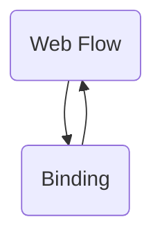

The `spring-webflow-demo` repository demonstrates how to use Spring Web Flow and Spring Faces together to manage the navigation and state of web applications.

# Main Components

### Web Flow (<SwmPath>[spring-webflow/](spring-webflow/)</SwmPath>)

Web Flow refers to the ability to define a flow definition consisting of states, transitions, and data, enabling the modeling of long conversations in web applications. It encapsulates navigation rules and ensures that the same URL used to start the flow is also used to step through it, with an execution key uniquely identifying the current flow instance.

- **Conversation**
  - <SwmLink doc-title="Introduction to conversations in web flow">[Introduction to conversations in web flow](/.swm/introduction-to-conversations-in-web-flow.wmpvdryd.sw.md)</SwmLink>
  - **Impl**
    - <SwmLink doc-title="Overview of conversation implementation">[Overview of conversation implementation](/.swm/overview-of-conversation-implementation.4kd91vpx.sw.md)</SwmLink>
- **Validation**
  - <SwmLink doc-title="Getting started with validation in web flow">[Getting started with validation in web flow](/.swm/getting-started-with-validation-in-web-flow.bld7689q.sw.md)</SwmLink>
  - **Validation helper**
    - **Classes**
      - <SwmLink doc-title="The validationhelper class">[The validationhelper class](/.swm/the-validationhelper-class.c0dis.sw.md)</SwmLink>
- **Engine**
  - **Transition Management**
    - <SwmLink doc-title="Introduction to transition management in engine">[Introduction to transition management in engine](/.swm/introduction-to-transition-management-in-engine.462s3ycy.sw.md)</SwmLink>
    - **Classes**
      - <SwmLink doc-title="The transition class">[The transition class](/.swm/the-transition-class.6tsq4.sw.md)</SwmLink>
  - **Impl**
    - <SwmLink doc-title="Getting started with flow execution implementation">[Getting started with flow execution implementation](/.swm/getting-started-with-flow-execution-implementation.q9ysur41.sw.md)</SwmLink>
    - **Flow execution impl**
      - **Classes**
        - <SwmLink doc-title="The flowexecutionimpl class">[The flowexecutionimpl class](/.swm/the-flowexecutionimpl-class.62zlk.sw.md)</SwmLink>
  - **Model**
    - <SwmLink doc-title="Exploring model in engine">[Exploring model in engine](/.swm/exploring-model-in-engine.bkjvo7qq.sw.md)</SwmLink>
    - **Flow model**
      - **Classes**
        - <SwmLink doc-title="The flowmodel class">[The flowmodel class](/.swm/the-flowmodel-class.qrzz0.sw.md)</SwmLink>
    - **Flows**
      - <SwmLink doc-title="Flow model refresh process">[Flow model refresh process](/.swm/flow-model-refresh-process.4memiyzz.sw.md)</SwmLink>
    - **Classes**
      - <SwmLink doc-title="The abstractmodel class">[The abstractmodel class](/.swm/the-abstractmodel-class.hhhwk.sw.md)</SwmLink>
      - <SwmLink doc-title="The securedmodel class">[The securedmodel class](/.swm/the-securedmodel-class.1aleb.sw.md)</SwmLink>
  - **Support**
    - <SwmLink doc-title="Introduction to support implementations">[Introduction to support implementations](/.swm/introduction-to-support-implementations.udt0gtcq.sw.md)</SwmLink>
  - **View state**
    - **Flows**
      - <SwmLink doc-title="Handling view state entry">[Handling view state entry](/.swm/handling-view-state-entry.3rwehefu.sw.md)</SwmLink>
  - **Flow**
    - **Classes**
      - <SwmLink doc-title="The flow class">[The flow class](/.swm/the-flow-class.ylbom.sw.md)</SwmLink>
  - **Flows**
    - <SwmLink doc-title="Flow assembly process">[Flow assembly process](/.swm/flow-assembly-process.v5ol3j9m.sw.md)</SwmLink>
    - <SwmLink doc-title="Parsing transition models flow">[Parsing transition models flow](/.swm/parsing-transition-models-flow.nrex7xj0.sw.md)</SwmLink>
    - <SwmLink doc-title="Parsing actions flow">[Parsing actions flow](/.swm/parsing-actions-flow.431k2fsk.sw.md)</SwmLink>
    - <SwmLink doc-title="Parsing and setting mapping conversion executor">[Parsing and setting mapping conversion executor](/.swm/parsing-and-setting-mapping-conversion-executor.tzl6skb3.sw.md)</SwmLink>
    - <SwmLink doc-title="Initializing flow definitions">[Initializing flow definitions](/.swm/initializing-flow-definitions.p2er82qk.sw.md)</SwmLink>
    - <SwmLink doc-title="Mapping flow outputs">[Mapping flow outputs](/.swm/mapping-flow-outputs.ku1wbh0g.sw.md)</SwmLink>
    - <SwmLink doc-title="Setting up the input mapper for a flow">[Setting up the input mapper for a flow](/.swm/setting-up-the-input-mapper-for-a-flow.yk698cxx.sw.md)</SwmLink>
    - <SwmLink doc-title="Handling actions in a state">[Handling actions in a state](/.swm/handling-actions-in-a-state.20jv27eo.sw.md)</SwmLink>
    - <SwmLink doc-title="Managing flow definitions">[Managing flow definitions](/.swm/managing-flow-definitions.4w3ofvwt.sw.md)</SwmLink>
    - <SwmLink doc-title="Managed root flow on finish">[Managed root flow on finish](/.swm/managed-root-flow-on-finish.6x0w8otv.sw.md)</SwmLink>
    - <SwmLink doc-title="Managing persistence and user interactions flow">[Managing persistence and user interactions flow](/.swm/managing-persistence-and-user-interactions-flow.t6nmdjf9.sw.md)</SwmLink>
  - **Classes**
    - <SwmLink doc-title="The binderconfiguration class">[The binderconfiguration class](/.swm/the-binderconfiguration-class.1ej7l.sw.md)</SwmLink>
    - <SwmLink doc-title="The flowbuilderservices class">[The flowbuilderservices class](/.swm/the-flowbuilderservices-class.540ui.sw.md)</SwmLink>
    - <SwmLink doc-title="The state class">[The state class](/.swm/the-state-class.kc7e4.sw.md)</SwmLink>
    - <SwmLink doc-title="The requestcontrolcontext interface">[The requestcontrolcontext interface](/.swm/the-requestcontrolcontext-interface.72bda.sw.md)</SwmLink>
    - <SwmLink doc-title="The transitionablestate class">[The transitionablestate class](/.swm/the-transitionablestate-class.mkr5a.sw.md)</SwmLink>
- **Expression**
  - <SwmLink doc-title="Expression in web flow">[Expression in web flow](/.swm/expression-in-web-flow.o6nv4hy6.sw.md)</SwmLink>
  - **El**
    - <SwmLink doc-title="Basic concepts of expression language el">[Basic concepts of expression language el](/.swm/basic-concepts-of-expression-language-el.6j2dxwk1.sw.md)</SwmLink>
- **Persistence**
  - <SwmLink doc-title="Getting started with persistence in web flow">[Getting started with persistence in web flow](/.swm/getting-started-with-persistence-in-web-flow.6afy64wy.sw.md)</SwmLink>
- **Execution**
  - <SwmLink doc-title="Exploring flow execution">[Exploring flow execution](/.swm/exploring-flow-execution.p3i6qrx8.sw.md)</SwmLink>
  - **Repository**
    - **Support**
      - <SwmLink doc-title="Introduction to support utilities">[Introduction to support utilities](/.swm/introduction-to-support-utilities.u6yzu40g.sw.md)</SwmLink>
    - **Snapshot**
      - <SwmLink doc-title="Snapshot management in repository">[Snapshot management in repository](/.swm/snapshot-management-in-repository.7w7jkq3i.sw.md)</SwmLink>
- **Config**
  - <SwmLink doc-title="Exploring web flow configuration">[Exploring web flow configuration](/.swm/exploring-web-flow-configuration.sa7847aq.sw.md)</SwmLink>
  - **Flows**
    - <SwmLink doc-title="Obtaining flow id from flow resource">[Obtaining flow id from flow resource](/.swm/obtaining-flow-id-from-flow-resource.yimqxxgh.sw.md)</SwmLink>
- **Context**
  - <SwmLink doc-title="Overview of web flow context">[Overview of web flow context](/.swm/overview-of-web-flow-context.v8vyzbqy.sw.md)</SwmLink>
  - **Servlet external context**
    - **Classes**
      - <SwmLink doc-title="The servletexternalcontext class">[The servletexternalcontext class](/.swm/the-servletexternalcontext-class.jmnkf.sw.md)</SwmLink>
- **Core**
  - <SwmLink doc-title="Basic concepts of core components">[Basic concepts of core components](/.swm/basic-concepts-of-core-components.8i3p45dc.sw.md)</SwmLink>
  - **Local parameter map**
    - **Classes**
      - <SwmLink doc-title="The localparametermap class">[The localparametermap class](/.swm/the-localparametermap-class.tejzn.sw.md)</SwmLink>
  - **Classes**
    - <SwmLink doc-title="The attributemap interface">[The attributemap interface](/.swm/the-attributemap-interface.lz8ht.sw.md)</SwmLink>
- **Definition**
  - <SwmLink doc-title="Overview of flow definition">[Overview of flow definition](/.swm/overview-of-flow-definition.6ldjmgi4.sw.md)</SwmLink>
- **Mvc**
  - **View**
    - <SwmLink doc-title="Getting started with mvc view">[Getting started with mvc view](/.swm/getting-started-with-mvc-view.exs5qy2g.sw.md)</SwmLink>
    - **Abstract mvc view**
      - **Classes**
        - <SwmLink doc-title="The abstractmvcview class">[The abstractmvcview class](/.swm/the-abstractmvcview-class.wnnh7.sw.md)</SwmLink>
    - **Binding model**
      - **Classes**
        - <SwmLink doc-title="The bindingmodel class">[The bindingmodel class](/.swm/the-bindingmodel-class.jgqn1.sw.md)</SwmLink>
  - **Servlet**
    - <SwmLink doc-title="Understanding servlet in mvc">[Understanding servlet in mvc](/.swm/understanding-servlet-in-mvc.0mo1jjh0.sw.md)</SwmLink>
    - **Flow handler adapter**
      - **Classes**
        - <SwmLink doc-title="The flowhandleradapter class">[The flowhandleradapter class](/.swm/the-flowhandleradapter-class.g8ql7.sw.md)</SwmLink>
    - **Flows**
      - <SwmLink doc-title="Handling http requests flow">[Handling http requests flow](/.swm/handling-http-requests-flow.3u5xjhbw.sw.md)</SwmLink>
- **Action**
  - <SwmLink doc-title="Overview of action in web flow">[Overview of action in web flow](/.swm/overview-of-action-in-web-flow.9rojqsoq.sw.md)</SwmLink>
  - **Form action**
    - **Flows**
      - <SwmLink doc-title="Form setup process">[Form setup process](/.swm/form-setup-process.85kxdx0s.sw.md)</SwmLink>
- **Flows**
  - <SwmLink doc-title="Launching a new flow execution">[Launching a new flow execution](/.swm/launching-a-new-flow-execution.mh7zylxy.sw.md)</SwmLink>
  - <SwmLink doc-title="Ending an active flow session">[Ending an active flow session](/.swm/ending-an-active-flow-session.m7unvnhc.sw.md)</SwmLink>

### Binding (<SwmPath>[spring-binding/](spring-binding/)</SwmPath>)

- **Convert**
  - **Service**
    - <SwmLink doc-title="Overview of conversion service">[Overview of conversion service](/.swm/overview-of-conversion-service.g77zf0re.sw.md)</SwmLink>
    - **Generic conversion service**
      - **Flows**
        - <SwmLink doc-title="Conversion execution flow">[Conversion execution flow](/.swm/conversion-execution-flow.p3620at7.sw.md)</SwmLink>
  - **Converters**
    - **Collection Converters**
      - **Array to collection**
        - **Classes**
          - <SwmLink doc-title="The arraytocollection class">[The arraytocollection class](/.swm/the-arraytocollection-class.jajbc.sw.md)</SwmLink>
    - **String Converters**
      - **String to date**
        - **Classes**
          - <SwmLink doc-title="The stringtodate class">[The stringtodate class](/.swm/the-stringtodate-class.xi62v.sw.md)</SwmLink>
- **Message**
  - **Default message context**
    - **Classes**
      - <SwmLink doc-title="The defaultmessagecontext class">[The defaultmessagecontext class](/.swm/the-defaultmessagecontext-class.u1k3o.sw.md)</SwmLink>
  - **Classes**
    - <SwmLink doc-title="The message class">[The message class](/.swm/the-message-class.uhb40.sw.md)</SwmLink>
- **Collection**
  - **String keyed map adapter**
    - **Classes**
      - <SwmLink doc-title="The stringkeyedmapadapter class">[The stringkeyedmapadapter class](/.swm/the-stringkeyedmapadapter-class.wh5aw.sw.md)</SwmLink>
  - **Shared map decorator**
    - **Classes**
      - <SwmLink doc-title="The sharedmapdecorator class">[The sharedmapdecorator class](/.swm/the-sharedmapdecorator-class.h3qu9.sw.md)</SwmLink>
  - **Map accessor**
    - **Flows**
      - <SwmLink doc-title="Determining render response flow">[Determining render response flow](/.swm/determining-render-response-flow.0legk7i3.sw.md)</SwmLink>
      - <SwmLink doc-title="Retrieving a required number from a map">[Retrieving a required number from a map](/.swm/retrieving-a-required-number-from-a-map.j737nzjg.sw.md)</SwmLink>
      - <SwmLink doc-title="Retrieving and validating number values">[Retrieving and validating number values](/.swm/retrieving-and-validating-number-values.568reyv1.sw.md)</SwmLink>
  - **Abstract caching map decorator**
    - **Classes**
      - <SwmLink doc-title="The abstractcachingmapdecorator class">[The abstractcachingmapdecorator class](/.swm/the-abstractcachingmapdecorator-class.j2twm.sw.md)</SwmLink>
  - **Flows**
    - <SwmLink doc-title="Ensuring required parameters in localparametermap">[Ensuring required parameters in localparametermap](/.swm/ensuring-required-parameters-in-localparametermap.lt4yw900.sw.md)</SwmLink>
- **Method**
  - **Parameters**
    - **Classes**
      - <SwmLink doc-title="The parameters class">[The parameters class](/.swm/the-parameters-class.wapjb.sw.md)</SwmLink>
  - **Method key**
    - **Classes**
      - <SwmLink doc-title="The methodkey class">[The methodkey class](/.swm/the-methodkey-class.3mxmg.sw.md)</SwmLink>
- **Expression**
  - **Beanwrapper**
    - <SwmLink doc-title="Overview of beanwrapperexpression">[Overview of beanwrapperexpression](/.swm/overview-of-beanwrapperexpression.o55ki0am.sw.md)</SwmLink>
    - **Bean wrapper expression**
      - **Classes**
        - <SwmLink doc-title="The beanwrapperexpression class">[The beanwrapperexpression class](/.swm/the-beanwrapperexpression-class.f4xk2.sw.md)</SwmLink>
  - **Support**
    - <SwmLink doc-title="Getting started with expression support">[Getting started with expression support](/.swm/getting-started-with-expression-support.6zo93j4c.sw.md)</SwmLink>
    - **Abstract expression parser**
      - **Classes**
        - <SwmLink doc-title="The abstractexpressionparser class">[The abstractexpressionparser class](/.swm/the-abstractexpressionparser-class.veuyj.sw.md)</SwmLink>
  - **Spel**
    - <SwmLink doc-title="Getting started with spel in expressions">[Getting started with spel in expressions](/.swm/getting-started-with-spel-in-expressions.qvpylciu.sw.md)</SwmLink>
    - **Springel expression**
      - **Classes**
        - <SwmLink doc-title="The springelexpression class">[The springelexpression class](/.swm/the-springelexpression-class.vk6dj.sw.md)</SwmLink>
  - **El**
    - **El expression**
      - **Classes**
        - <SwmLink doc-title="The elexpression class">[The elexpression class](/.swm/the-elexpression-class.uid47.sw.md)</SwmLink>
    - **El expression parser**
      - **Classes**
        - <SwmLink doc-title="The elexpressionparser class">[The elexpressionparser class](/.swm/the-elexpressionparser-class.vzjeh.sw.md)</SwmLink>
  - **Classes**
    - <SwmLink doc-title="The expressionvariable class">[The expressionvariable class](/.swm/the-expressionvariable-class.zjecd.sw.md)</SwmLink>
- **Mapping**
  - **Impl**
    - **Default mapping context**
      - **Classes**
        - <SwmLink doc-title="The defaultmappingcontext class">[The defaultmappingcontext class](/.swm/the-defaultmappingcontext-class.dqldg.sw.md)</SwmLink>
    - **Default mapping**
      - **Classes**
        - <SwmLink doc-title="The defaultmapping class">[The defaultmapping class](/.swm/the-defaultmapping-class.kjy8l.sw.md)</SwmLink>

### Search (<SwmPath>[spring-webflow/…/test/search-flow.xml](spring-webflow/src/test/java/org/springframework/webflow/test/search-flow.xml)</SwmPath>, <SwmPath>[spring-webflow/…/impl/RequestControlContextImpl.java](spring-webflow/src/main/java/org/springframework/webflow/engine/impl/RequestControlContextImpl.java)</SwmPath>, <SwmPath>[spring-webflow/…/webflow/action/](spring-webflow/src/main/java/org/springframework/webflow/action/)</SwmPath>, ...)

Search refers to the process of binding and validating incoming request parameters to a form object, and then transitioning to display the search results.

- <SwmLink doc-title="Search overview">[Search overview](/.swm/search-overview.kmk7f4k8.sw.md)</SwmLink>
- **Webflow**
  - <SwmLink doc-title="Search functionality in webflow">[Search functionality in webflow](/.swm/search-functionality-in-webflow.svi7zrxy.sw.md)</SwmLink>
  - **Flows**
    - <SwmLink doc-title="Processing user events flow">[Processing user events flow](/.swm/processing-user-events-flow.oxdcqqwd.sw.md)</SwmLink>
  - **Classes**
    - <SwmLink doc-title="The localattributemap class">[The localattributemap class](/.swm/the-localattributemap-class.jcptt.sw.md)</SwmLink>
- **Spring Binding**
  - <SwmLink doc-title="Search functionality in spring binding">[Search functionality in spring binding](/.swm/search-functionality-in-spring-binding.1894pn1e.sw.md)</SwmLink>

### Flows

- <SwmLink doc-title="Retrieving flow definition process">[Retrieving flow definition process](/.swm/retrieving-flow-definition-process.0d1ash0r.sw.md)</SwmLink>
- <SwmLink doc-title="Retrieving and constructing flow definitions">[Retrieving and constructing flow definitions](/.swm/retrieving-and-constructing-flow-definitions.xbafw5tv.sw.md)</SwmLink>
- <SwmLink doc-title="Property editor conversion flow">[Property editor conversion flow](/.swm/property-editor-conversion-flow.kh29mtym.sw.md)</SwmLink>
- <SwmLink doc-title="Converting property values to text">[Converting property values to text](/.swm/converting-property-values-to-text.d58y8pou.sw.md)</SwmLink>
- <SwmLink doc-title="Locating attribute scope">[Locating attribute scope](/.swm/locating-attribute-scope.tzoqdk5u.sw.md)</SwmLink>
- <SwmLink doc-title="Search flow process">[Search flow process](/.swm/search-flow-process.i1bmbk7u.sw.md)</SwmLink>
- <SwmLink doc-title="Rendering mvc views">[Rendering mvc views](/.swm/rendering-mvc-views.xucv5665.sw.md)</SwmLink>
- <SwmLink doc-title="Retrieving and formatting field values">[Retrieving and formatting field values](/.swm/retrieving-and-formatting-field-values.9nqui1lv.sw.md)</SwmLink>

&nbsp;

*This is an auto-generated document by Swimm 🌊 and has not yet been verified by a human*

<SwmMeta version="3.0.0" repo-id="Z2l0aHViJTNBJTNBc3ByaW5nLXdlYmZsb3ctZGVtbyUzQSUzQWdpbGFkbmF2b3Q=" repo-name="spring-webflow-demo">Powered by [Swimm](/)</SwmMeta>
