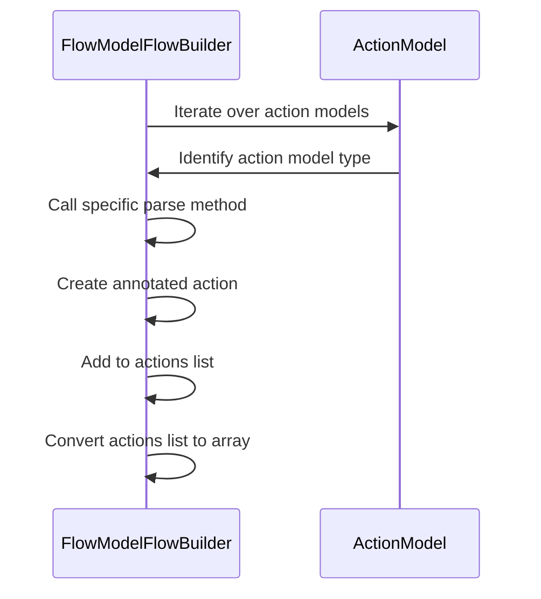
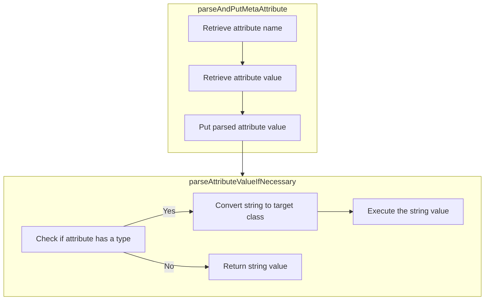

```mermaid
graph TD
  subgraph getValue
    getValue:A["Retrieve subflow ID"] --> getValue:B["Retrieve flow definition based on subflow ID"]
  end
  subgraph getFlowDefinition
    getFlowDefinition:A["Check if currently assembling"] -->|Yes| getFlowDefinition:B["Return current flow"]
    getFlowDefinition:A -->|No| getFlowDefinition:C["Check if flowDefinition is null"]
    getFlowDefinition:C -->|Yes| getFlowDefinition:D["Assemble flow"]
    getFlowDefinition:C -->|No| getFlowDefinition:E["Check if flow is in development and has changed"]
    getFlowDefinition:E -->|Yes| getFlowDefinition:D
  end

%% Swimm:
%% graph TD
%%   subgraph <SwmToken path="spring-webflow/src/main/java/org/springframework/webflow/engine/builder/model/FlowModelFlowBuilder.java" pos="929:19:19" line-data="		Expression valueExpression = getLocalContext().getExpressionParser().parseExpression(set.getValue(),">`getValue`</SwmToken>
%%     <SwmToken path="spring-webflow/src/main/java/org/springframework/webflow/engine/builder/model/FlowModelFlowBuilder.java" pos="929:19:19" line-data="		Expression valueExpression = getLocalContext().getExpressionParser().parseExpression(set.getValue(),">`getValue`</SwmToken>:A["Retrieve subflow ID"] --> <SwmToken path="spring-webflow/src/main/java/org/springframework/webflow/engine/builder/model/FlowModelFlowBuilder.java" pos="929:19:19" line-data="		Expression valueExpression = getLocalContext().getExpressionParser().parseExpression(set.getValue(),">`getValue`</SwmToken>:B["Retrieve flow definition based on subflow ID"]
%%   end
%%   subgraph <SwmToken path="spring-webflow/src/main/java/org/springframework/webflow/engine/builder/model/SubflowExpression.java" pos="35:5:5" line-data="		return flowDefinitionLocator.getFlowDefinition(subflowId);">`getFlowDefinition`</SwmToken>
%%     <SwmToken path="spring-webflow/src/main/java/org/springframework/webflow/engine/builder/model/SubflowExpression.java" pos="35:5:5" line-data="		return flowDefinitionLocator.getFlowDefinition(subflowId);">`getFlowDefinition`</SwmToken>:A["Check if currently assembling"] -->|Yes| <SwmToken path="spring-webflow/src/main/java/org/springframework/webflow/engine/builder/model/SubflowExpression.java" pos="35:5:5" line-data="		return flowDefinitionLocator.getFlowDefinition(subflowId);">`getFlowDefinition`</SwmToken>:B["Return current flow"]
%%     <SwmToken path="spring-webflow/src/main/java/org/springframework/webflow/engine/builder/model/SubflowExpression.java" pos="35:5:5" line-data="		return flowDefinitionLocator.getFlowDefinition(subflowId);">`getFlowDefinition`</SwmToken>:A -->|No| <SwmToken path="spring-webflow/src/main/java/org/springframework/webflow/engine/builder/model/SubflowExpression.java" pos="35:5:5" line-data="		return flowDefinitionLocator.getFlowDefinition(subflowId);">`getFlowDefinition`</SwmToken>:C["Check if <SwmToken path="spring-webflow/src/main/java/org/springframework/webflow/engine/builder/DefaultFlowHolder.java" pos="82:4:4" line-data="		if (flowDefinition == null) {">`flowDefinition`</SwmToken> is null"]
%%     <SwmToken path="spring-webflow/src/main/java/org/springframework/webflow/engine/builder/model/SubflowExpression.java" pos="35:5:5" line-data="		return flowDefinitionLocator.getFlowDefinition(subflowId);">`getFlowDefinition`</SwmToken>:C -->|Yes| <SwmToken path="spring-webflow/src/main/java/org/springframework/webflow/engine/builder/model/SubflowExpression.java" pos="35:5:5" line-data="		return flowDefinitionLocator.getFlowDefinition(subflowId);">`getFlowDefinition`</SwmToken>:D["Assemble flow"]
%%     <SwmToken path="spring-webflow/src/main/java/org/springframework/webflow/engine/builder/model/SubflowExpression.java" pos="35:5:5" line-data="		return flowDefinitionLocator.getFlowDefinition(subflowId);">`getFlowDefinition`</SwmToken>:C -->|No| <SwmToken path="spring-webflow/src/main/java/org/springframework/webflow/engine/builder/model/SubflowExpression.java" pos="35:5:5" line-data="		return flowDefinitionLocator.getFlowDefinition(subflowId);">`getFlowDefinition`</SwmToken>:E["Check if flow is in development and has changed"]
%%     <SwmToken path="spring-webflow/src/main/java/org/springframework/webflow/engine/builder/model/SubflowExpression.java" pos="35:5:5" line-data="		return flowDefinitionLocator.getFlowDefinition(subflowId);">`getFlowDefinition`</SwmToken>:E -->|Yes| <SwmToken path="spring-webflow/src/main/java/org/springframework/webflow/engine/builder/model/SubflowExpression.java" pos="35:5:5" line-data="		return flowDefinitionLocator.getFlowDefinition(subflowId);">`getFlowDefinition`</SwmToken>:D
%%   end
```

This document explains the flow of parsing actions within a flow definition. The <SwmToken path="spring-webflow/src/main/java/org/springframework/webflow/engine/builder/model/FlowModelFlowBuilder.java" pos="868:7:7" line-data="	private Action[] parseActions(List&lt;AbstractActionModel&gt; actionModels) {">`parseActions`</SwmToken> method is responsible for iterating over a list of action models, determining their types, and delegating the parsing to specific methods based on the action model type.

For example, if an action model is identified as an <SwmToken path="spring-webflow/src/main/java/org/springframework/webflow/engine/builder/model/FlowModelFlowBuilder.java" pos="873:8:8" line-data="				if (actionModel instanceof EvaluateModel) {">`EvaluateModel`</SwmToken>, the <SwmToken path="spring-webflow/src/main/java/org/springframework/webflow/engine/builder/model/FlowModelFlowBuilder.java" pos="874:5:5" line-data="					action = parseEvaluateAction((EvaluateModel) actionModel);">`parseEvaluateAction`</SwmToken> method is called to parse the expression defined in the <SwmToken path="spring-webflow/src/main/java/org/springframework/webflow/engine/builder/model/FlowModelFlowBuilder.java" pos="873:8:8" line-data="				if (actionModel instanceof EvaluateModel) {">`EvaluateModel`</SwmToken> and create an <SwmToken path="spring-webflow/src/main/java/org/springframework/webflow/engine/builder/model/FlowModelFlowBuilder.java" pos="906:5:5" line-data="		return new EvaluateAction(evaluateExpression, resultExpression);">`EvaluateAction`</SwmToken> object.



# Where is this flow used?

This flow is used multiple times in the codebase as represented in the following diagram:

(Note - these are only some of the entry points of this flow)

```mermaid
graph TD;
      subgraph springwebflowsrcmainjavaorgspringframeworkwebflowenginebuilder[spring-webflow/…/engine/builder]
db05c4e073fc7adc9ac6c97ec7213eb6445850aca5f2a059f1ec5bd9d6a95013(buildStartActions) --> f67ff99c1056139b511edf6bf35dac7fc6378f0ced18c034c0bead948d36539c(FlowModelFlowBuilder.parseActions)
end

subgraph springwebflowsrcmainjavaorgspringframeworkwebflowenginebuilder[spring-webflow/…/engine/builder]
e8298b856574ac9f33168f6cd2d0a5c1e2f46338422f3e15528045a90ee2fa76(buildEndActions) --> f67ff99c1056139b511edf6bf35dac7fc6378f0ced18c034c0bead948d36539c(FlowModelFlowBuilder.parseActions)
end

subgraph springwebflowsrcmainjavaorgspringframeworkwebflowenginebuilder[spring-webflow/…/engine/builder]
b922f3f8059d1568b2222593691e9a43b2e699599d5225e3d5c8deb8ba023976(parseAndAddViewState) --> f67ff99c1056139b511edf6bf35dac7fc6378f0ced18c034c0bead948d36539c(FlowModelFlowBuilder.parseActions)
end

subgraph springwebflowsrcmainjavaorgspringframeworkwebflowenginebuilder[spring-webflow/…/engine/builder]
b922f3f8059d1568b2222593691e9a43b2e699599d5225e3d5c8deb8ba023976(parseAndAddViewState) --> de5b3eddca6e2a99352d93468bf0f4c0593c418654d8c72b0bc260032ce0e0f1(parseExceptionHandlers)
end

subgraph springwebflowsrcmainjavaorgspringframeworkwebflowenginebuilder[spring-webflow/…/engine/builder]
b922f3f8059d1568b2222593691e9a43b2e699599d5225e3d5c8deb8ba023976(parseAndAddViewState) --> e8410e3b541ed84cf93d3cf313823226363a4ae835feff87091d6e7e47fa3163(parseTransitions)
end

subgraph springwebflowsrcmainjavaorgspringframeworkwebflowenginebuilder[spring-webflow/…/engine/builder]
80d714d24669a6d98648cb807f43932b2ad32db2684e3fd188cea80062eb1604(buildStates) --> b922f3f8059d1568b2222593691e9a43b2e699599d5225e3d5c8deb8ba023976(parseAndAddViewState)
end

subgraph springwebflowsrcmainjavaorgspringframeworkwebflowenginebuilder[spring-webflow/…/engine/builder]
80d714d24669a6d98648cb807f43932b2ad32db2684e3fd188cea80062eb1604(buildStates) --> bb32a9c3d4535d6be419bc8217ed62afa164f3b728bfed06ba1f00f6874fd79d(parseAndAddActionState)
end

subgraph springwebflowsrcmainjavaorgspringframeworkwebflowenginebuilder[spring-webflow/…/engine/builder]
80d714d24669a6d98648cb807f43932b2ad32db2684e3fd188cea80062eb1604(buildStates) --> 482009177c92fca2128b523813ac3579e693d0b371473b9d436e20624b85039f(parseAndAddDecisionState)
end

subgraph springwebflowsrcmainjavaorgspringframeworkwebflowenginebuilder[spring-webflow/…/engine/builder]
80d714d24669a6d98648cb807f43932b2ad32db2684e3fd188cea80062eb1604(buildStates) --> e1f5d334a044786e4a4cb53ecd3cbd5ee18181025b5d82616afd24f0b2deeb17(parseAndAddSubflowState)
end

subgraph springwebflowsrcmainjavaorgspringframeworkwebflowenginebuilder[spring-webflow/…/engine/builder]
80d714d24669a6d98648cb807f43932b2ad32db2684e3fd188cea80062eb1604(buildStates) --> 0cab62e221f6f1870a5650ab697221b63fe822409850f88ca5dcac0bd1535c43(parseAndAddEndState)
end

subgraph springwebflowsrcmainjavaorgspringframeworkwebflowenginebuilder[spring-webflow/…/engine/builder]
2f179427de9ff5829f2fe810c39b13981e127d43d0dd12ffc8c00d73310e2ca5(directAssembly) --> 80d714d24669a6d98648cb807f43932b2ad32db2684e3fd188cea80062eb1604(buildStates)
end

subgraph springwebflowsrcmainjavaorgspringframeworkwebflowenginebuilder[spring-webflow/…/engine/builder]
98c055c9b71322fa06a3f80b548fc9ac3bba717c9bc5f7729bedda3b5053efba(assembleFlow) --> 2f179427de9ff5829f2fe810c39b13981e127d43d0dd12ffc8c00d73310e2ca5(directAssembly)
end

subgraph springwebflowsrcmainjavaorgspringframeworkwebflowenginebuilder[spring-webflow/…/engine/builder]
b61d14bc393f7b95415127363fcb9967656809bc62cdaa5ae06d9f081f7afde0(buildFlowDefinition) --> 98c055c9b71322fa06a3f80b548fc9ac3bba717c9bc5f7729bedda3b5053efba(assembleFlow)
end

subgraph springwebflowsrcmainjavaorgspringframeworkwebflowconfig[spring-webflow/…/webflow/config]
ad93a501c5167d5f44320fc4f5bf79429a0a8fa379e0d876b13e591781d40b86(registerFlowBuilders) --> b61d14bc393f7b95415127363fcb9967656809bc62cdaa5ae06d9f081f7afde0(buildFlowDefinition)
end

subgraph springwebflowsrcmainjavaorgspringframeworkwebflowconfig[spring-webflow/…/webflow/config]
1b90ecf800bbc7530a7fa1ce5da86edf43748f2181cd61cce0354fd86270baa3(afterPropertiesSet) --> ad93a501c5167d5f44320fc4f5bf79429a0a8fa379e0d876b13e591781d40b86(registerFlowBuilders)
end

subgraph springwebflowsrcmainjavaorgspringframeworkwebflowenginebuilder[spring-webflow/…/engine/builder]
55b04cc845d25b7e0c21126e49b46672d760a40484ba2a0968c13813c003e13f(registerFlowBuilders) --> 98c055c9b71322fa06a3f80b548fc9ac3bba717c9bc5f7729bedda3b5053efba(assembleFlow)
end

subgraph springwebflowsrcmainjavaorgspringframeworkwebflowconfig[spring-webflow/…/webflow/config]
5ea9a3feeed8ad6d34de42f261caa9230b8ece470b9be1cfb63b5ac3dff9a97c(build) --> 55b04cc845d25b7e0c21126e49b46672d760a40484ba2a0968c13813c003e13f(registerFlowBuilders)
end

subgraph springwebflowsrcmainjavaorgspringframeworkwebflowconfig[spring-webflow/…/webflow/config]
e8cc0123680495888518bed32ace4fc20e41ea6ec58363164584f8c1c181a00b(FlowDefinitionRegistryBuilder) --> 5ea9a3feeed8ad6d34de42f261caa9230b8ece470b9be1cfb63b5ac3dff9a97c(build)
end

subgraph springwebflowsrcmainjavaorgspringframeworkwebflowenginebuilder[spring-webflow/…/engine/builder]
bb32a9c3d4535d6be419bc8217ed62afa164f3b728bfed06ba1f00f6874fd79d(parseAndAddActionState) --> f67ff99c1056139b511edf6bf35dac7fc6378f0ced18c034c0bead948d36539c(FlowModelFlowBuilder.parseActions)
end

subgraph springwebflowsrcmainjavaorgspringframeworkwebflowenginebuilder[spring-webflow/…/engine/builder]
bb32a9c3d4535d6be419bc8217ed62afa164f3b728bfed06ba1f00f6874fd79d(parseAndAddActionState) --> de5b3eddca6e2a99352d93468bf0f4c0593c418654d8c72b0bc260032ce0e0f1(parseExceptionHandlers)
end

subgraph springwebflowsrcmainjavaorgspringframeworkwebflowenginebuilder[spring-webflow/…/engine/builder]
bb32a9c3d4535d6be419bc8217ed62afa164f3b728bfed06ba1f00f6874fd79d(parseAndAddActionState) --> e8410e3b541ed84cf93d3cf313823226363a4ae835feff87091d6e7e47fa3163(parseTransitions)
end

subgraph springwebflowsrcmainjavaorgspringframeworkwebflowenginebuilder[spring-webflow/…/engine/builder]
482009177c92fca2128b523813ac3579e693d0b371473b9d436e20624b85039f(parseAndAddDecisionState) --> f67ff99c1056139b511edf6bf35dac7fc6378f0ced18c034c0bead948d36539c(FlowModelFlowBuilder.parseActions)
end

subgraph springwebflowsrcmainjavaorgspringframeworkwebflowenginebuilder[spring-webflow/…/engine/builder]
482009177c92fca2128b523813ac3579e693d0b371473b9d436e20624b85039f(parseAndAddDecisionState) --> de5b3eddca6e2a99352d93468bf0f4c0593c418654d8c72b0bc260032ce0e0f1(parseExceptionHandlers)
end

subgraph springwebflowsrcmainjavaorgspringframeworkwebflowenginebuilder[spring-webflow/…/engine/builder]
e1f5d334a044786e4a4cb53ecd3cbd5ee18181025b5d82616afd24f0b2deeb17(parseAndAddSubflowState) --> f67ff99c1056139b511edf6bf35dac7fc6378f0ced18c034c0bead948d36539c(FlowModelFlowBuilder.parseActions)
end

subgraph springwebflowsrcmainjavaorgspringframeworkwebflowenginebuilder[spring-webflow/…/engine/builder]
e1f5d334a044786e4a4cb53ecd3cbd5ee18181025b5d82616afd24f0b2deeb17(parseAndAddSubflowState) --> de5b3eddca6e2a99352d93468bf0f4c0593c418654d8c72b0bc260032ce0e0f1(parseExceptionHandlers)
end

subgraph springwebflowsrcmainjavaorgspringframeworkwebflowenginebuilder[spring-webflow/…/engine/builder]
e1f5d334a044786e4a4cb53ecd3cbd5ee18181025b5d82616afd24f0b2deeb17(parseAndAddSubflowState) --> e8410e3b541ed84cf93d3cf313823226363a4ae835feff87091d6e7e47fa3163(parseTransitions)
end

subgraph springwebflowsrcmainjavaorgspringframeworkwebflowenginebuilder[spring-webflow/…/engine/builder]
0cab62e221f6f1870a5650ab697221b63fe822409850f88ca5dcac0bd1535c43(parseAndAddEndState) --> f67ff99c1056139b511edf6bf35dac7fc6378f0ced18c034c0bead948d36539c(FlowModelFlowBuilder.parseActions)
end

subgraph springwebflowsrcmainjavaorgspringframeworkwebflowenginebuilder[spring-webflow/…/engine/builder]
0cab62e221f6f1870a5650ab697221b63fe822409850f88ca5dcac0bd1535c43(parseAndAddEndState) --> de5b3eddca6e2a99352d93468bf0f4c0593c418654d8c72b0bc260032ce0e0f1(parseExceptionHandlers)
end

subgraph springwebflowsrcmainjavaorgspringframeworkwebflowenginebuilder[spring-webflow/…/engine/builder]
6ef62679ea6c5d7b1d339b5fd374ec478ed8a66d60ccb4c5e2b8ae25d971e660(parseTransitionExecutingExceptionHandler) --> f67ff99c1056139b511edf6bf35dac7fc6378f0ced18c034c0bead948d36539c(FlowModelFlowBuilder.parseActions)
end

subgraph springwebflowsrcmainjavaorgspringframeworkwebflowenginebuilder[spring-webflow/…/engine/builder]
6c255f7d2531ba8470bf806f2dd526279f0a73de4ef975792be433f325f28046(parseTransitionExecutingExceptionHandlers) --> 6ef62679ea6c5d7b1d339b5fd374ec478ed8a66d60ccb4c5e2b8ae25d971e660(parseTransitionExecutingExceptionHandler)
end

subgraph springwebflowsrcmainjavaorgspringframeworkwebflowenginebuilder[spring-webflow/…/engine/builder]
de5b3eddca6e2a99352d93468bf0f4c0593c418654d8c72b0bc260032ce0e0f1(parseExceptionHandlers) --> 6c255f7d2531ba8470bf806f2dd526279f0a73de4ef975792be433f325f28046(parseTransitionExecutingExceptionHandlers)
end

subgraph springwebflowsrcmainjavaorgspringframeworkwebflowenginebuilder[spring-webflow/…/engine/builder]
4dc620f1d328175a30900792746e542ac6d86346d524ac58853c3e7c8fabdb7e(buildExceptionHandlers) --> de5b3eddca6e2a99352d93468bf0f4c0593c418654d8c72b0bc260032ce0e0f1(parseExceptionHandlers)
end

subgraph springwebflowsrcmainjavaorgspringframeworkwebflowenginebuilder[spring-webflow/…/engine/builder]
1bbc9fe60a8d0446fa804ad425d685cada8f5e118367cc0bae629f7a86ea551a(parseTransition) --> f67ff99c1056139b511edf6bf35dac7fc6378f0ced18c034c0bead948d36539c(FlowModelFlowBuilder.parseActions)
end

subgraph springwebflowsrcmainjavaorgspringframeworkwebflowenginebuilder[spring-webflow/…/engine/builder]
e8410e3b541ed84cf93d3cf313823226363a4ae835feff87091d6e7e47fa3163(parseTransitions) --> 1bbc9fe60a8d0446fa804ad425d685cada8f5e118367cc0bae629f7a86ea551a(parseTransition)
end

subgraph springwebflowsrcmainjavaorgspringframeworkwebflowenginebuilder[spring-webflow/…/engine/builder]
9ff35a0f5ef811ba5664f22e8c6f19aa98eab3bc988feb6941d5ad8080fe3189(buildGlobalTransitions) --> e8410e3b541ed84cf93d3cf313823226363a4ae835feff87091d6e7e47fa3163(parseTransitions)
end


      classDef mainFlowStyle color:#000000,fill:#7CB9F4
classDef rootsStyle color:#000000,fill:#00FFF4
classDef Style1 color:#000000,fill:#00FFAA
classDef Style2 color:#000000,fill:#FFFF00
classDef Style3 color:#000000,fill:#AA7CB9

%% Swimm:
%% graph TD;
%%       subgraph springwebflowsrcmainjavaorgspringframeworkwebflowenginebuilder[<SwmPath>[spring-webflow/…/engine/builder/](spring-webflow/src/main/java/org/springframework/webflow/engine/builder/)</SwmPath>]
%% db05c4e073fc7adc9ac6c97ec7213eb6445850aca5f2a059f1ec5bd9d6a95013(<SwmToken path="spring-webflow/src/main/java/org/springframework/webflow/engine/builder/model/FlowModelFlowBuilder.java" pos="198:5:5" line-data="	public void buildStartActions() throws FlowBuilderException {">`buildStartActions`</SwmToken>) --> f67ff99c1056139b511edf6bf35dac7fc6378f0ced18c034c0bead948d36539c(FlowModelFlowBuilder.parseActions)
%% end
%% 
%% subgraph springwebflowsrcmainjavaorgspringframeworkwebflowenginebuilder[<SwmPath>[spring-webflow/…/engine/builder/](spring-webflow/src/main/java/org/springframework/webflow/engine/builder/)</SwmPath>]
%% e8298b856574ac9f33168f6cd2d0a5c1e2f46338422f3e15528045a90ee2fa76(<SwmToken path="spring-webflow/src/main/java/org/springframework/webflow/engine/builder/model/FlowModelFlowBuilder.java" pos="240:5:5" line-data="	public void buildEndActions() throws FlowBuilderException {">`buildEndActions`</SwmToken>) --> f67ff99c1056139b511edf6bf35dac7fc6378f0ced18c034c0bead948d36539c(FlowModelFlowBuilder.parseActions)
%% end
%% 
%% subgraph springwebflowsrcmainjavaorgspringframeworkwebflowenginebuilder[<SwmPath>[spring-webflow/…/engine/builder/](spring-webflow/src/main/java/org/springframework/webflow/engine/builder/)</SwmPath>]
%% b922f3f8059d1568b2222593691e9a43b2e699599d5225e3d5c8deb8ba023976(<SwmToken path="spring-webflow/src/main/java/org/springframework/webflow/engine/builder/model/FlowModelFlowBuilder.java" pos="214:1:1" line-data="				parseAndAddViewState((ViewStateModel) state, getFlow());">`parseAndAddViewState`</SwmToken>) --> f67ff99c1056139b511edf6bf35dac7fc6378f0ced18c034c0bead948d36539c(FlowModelFlowBuilder.parseActions)
%% end
%% 
%% subgraph springwebflowsrcmainjavaorgspringframeworkwebflowenginebuilder[<SwmPath>[spring-webflow/…/engine/builder/](spring-webflow/src/main/java/org/springframework/webflow/engine/builder/)</SwmPath>]
%% b922f3f8059d1568b2222593691e9a43b2e699599d5225e3d5c8deb8ba023976(<SwmToken path="spring-webflow/src/main/java/org/springframework/webflow/engine/builder/model/FlowModelFlowBuilder.java" pos="214:1:1" line-data="				parseAndAddViewState((ViewStateModel) state, getFlow());">`parseAndAddViewState`</SwmToken>) --> de5b3eddca6e2a99352d93468bf0f4c0593c418654d8c72b0bc260032ce0e0f1(<SwmToken path="spring-webflow/src/main/java/org/springframework/webflow/engine/builder/model/FlowModelFlowBuilder.java" pos="260:1:1" line-data="				parseExceptionHandlers(flowModel.getExceptionHandlers(), flowModel.getGlobalTransitions()));">`parseExceptionHandlers`</SwmToken>)
%% end
%% 
%% subgraph springwebflowsrcmainjavaorgspringframeworkwebflowenginebuilder[<SwmPath>[spring-webflow/…/engine/builder/](spring-webflow/src/main/java/org/springframework/webflow/engine/builder/)</SwmPath>]
%% b922f3f8059d1568b2222593691e9a43b2e699599d5225e3d5c8deb8ba023976(<SwmToken path="spring-webflow/src/main/java/org/springframework/webflow/engine/builder/model/FlowModelFlowBuilder.java" pos="214:1:1" line-data="				parseAndAddViewState((ViewStateModel) state, getFlow());">`parseAndAddViewState`</SwmToken>) --> e8410e3b541ed84cf93d3cf313823226363a4ae835feff87091d6e7e47fa3163(<SwmToken path="spring-webflow/src/main/java/org/springframework/webflow/engine/builder/model/FlowModelFlowBuilder.java" pos="233:11:11" line-data="		getFlow().getGlobalTransitionSet().addAll(parseTransitions(flowModel.getGlobalTransitions()));">`parseTransitions`</SwmToken>)
%% end
%% 
%% subgraph springwebflowsrcmainjavaorgspringframeworkwebflowenginebuilder[<SwmPath>[spring-webflow/…/engine/builder/](spring-webflow/src/main/java/org/springframework/webflow/engine/builder/)</SwmPath>]
%% 80d714d24669a6d98648cb807f43932b2ad32db2684e3fd188cea80062eb1604(<SwmToken path="spring-webflow/src/main/java/org/springframework/webflow/engine/builder/model/FlowModelFlowBuilder.java" pos="206:5:5" line-data="	public void buildStates() throws FlowBuilderException {">`buildStates`</SwmToken>) --> b922f3f8059d1568b2222593691e9a43b2e699599d5225e3d5c8deb8ba023976(<SwmToken path="spring-webflow/src/main/java/org/springframework/webflow/engine/builder/model/FlowModelFlowBuilder.java" pos="214:1:1" line-data="				parseAndAddViewState((ViewStateModel) state, getFlow());">`parseAndAddViewState`</SwmToken>)
%% end
%% 
%% subgraph springwebflowsrcmainjavaorgspringframeworkwebflowenginebuilder[<SwmPath>[spring-webflow/…/engine/builder/](spring-webflow/src/main/java/org/springframework/webflow/engine/builder/)</SwmPath>]
%% 80d714d24669a6d98648cb807f43932b2ad32db2684e3fd188cea80062eb1604(<SwmToken path="spring-webflow/src/main/java/org/springframework/webflow/engine/builder/model/FlowModelFlowBuilder.java" pos="206:5:5" line-data="	public void buildStates() throws FlowBuilderException {">`buildStates`</SwmToken>) --> bb32a9c3d4535d6be419bc8217ed62afa164f3b728bfed06ba1f00f6874fd79d(<SwmToken path="spring-webflow/src/main/java/org/springframework/webflow/engine/builder/model/FlowModelFlowBuilder.java" pos="212:1:1" line-data="				parseAndAddActionState((ActionStateModel) state, getFlow());">`parseAndAddActionState`</SwmToken>)
%% end
%% 
%% subgraph springwebflowsrcmainjavaorgspringframeworkwebflowenginebuilder[<SwmPath>[spring-webflow/…/engine/builder/](spring-webflow/src/main/java/org/springframework/webflow/engine/builder/)</SwmPath>]
%% 80d714d24669a6d98648cb807f43932b2ad32db2684e3fd188cea80062eb1604(<SwmToken path="spring-webflow/src/main/java/org/springframework/webflow/engine/builder/model/FlowModelFlowBuilder.java" pos="206:5:5" line-data="	public void buildStates() throws FlowBuilderException {">`buildStates`</SwmToken>) --> 482009177c92fca2128b523813ac3579e693d0b371473b9d436e20624b85039f(<SwmToken path="spring-webflow/src/main/java/org/springframework/webflow/engine/builder/model/FlowModelFlowBuilder.java" pos="216:1:1" line-data="				parseAndAddDecisionState((DecisionStateModel) state, getFlow());">`parseAndAddDecisionState`</SwmToken>)
%% end
%% 
%% subgraph springwebflowsrcmainjavaorgspringframeworkwebflowenginebuilder[<SwmPath>[spring-webflow/…/engine/builder/](spring-webflow/src/main/java/org/springframework/webflow/engine/builder/)</SwmPath>]
%% 80d714d24669a6d98648cb807f43932b2ad32db2684e3fd188cea80062eb1604(<SwmToken path="spring-webflow/src/main/java/org/springframework/webflow/engine/builder/model/FlowModelFlowBuilder.java" pos="206:5:5" line-data="	public void buildStates() throws FlowBuilderException {">`buildStates`</SwmToken>) --> e1f5d334a044786e4a4cb53ecd3cbd5ee18181025b5d82616afd24f0b2deeb17(<SwmToken path="spring-webflow/src/main/java/org/springframework/webflow/engine/builder/model/FlowModelFlowBuilder.java" pos="218:1:1" line-data="				parseAndAddSubflowState((SubflowStateModel) state, getFlow());">`parseAndAddSubflowState`</SwmToken>)
%% end
%% 
%% subgraph springwebflowsrcmainjavaorgspringframeworkwebflowenginebuilder[<SwmPath>[spring-webflow/…/engine/builder/](spring-webflow/src/main/java/org/springframework/webflow/engine/builder/)</SwmPath>]
%% 80d714d24669a6d98648cb807f43932b2ad32db2684e3fd188cea80062eb1604(<SwmToken path="spring-webflow/src/main/java/org/springframework/webflow/engine/builder/model/FlowModelFlowBuilder.java" pos="206:5:5" line-data="	public void buildStates() throws FlowBuilderException {">`buildStates`</SwmToken>) --> 0cab62e221f6f1870a5650ab697221b63fe822409850f88ca5dcac0bd1535c43(<SwmToken path="spring-webflow/src/main/java/org/springframework/webflow/engine/builder/model/FlowModelFlowBuilder.java" pos="220:1:1" line-data="				parseAndAddEndState((EndStateModel) state, getFlow());">`parseAndAddEndState`</SwmToken>)
%% end
%% 
%% subgraph springwebflowsrcmainjavaorgspringframeworkwebflowenginebuilder[<SwmPath>[spring-webflow/…/engine/builder/](spring-webflow/src/main/java/org/springframework/webflow/engine/builder/)</SwmPath>]
%% 2f179427de9ff5829f2fe810c39b13981e127d43d0dd12ffc8c00d73310e2ca5(directAssembly) --> 80d714d24669a6d98648cb807f43932b2ad32db2684e3fd188cea80062eb1604(<SwmToken path="spring-webflow/src/main/java/org/springframework/webflow/engine/builder/model/FlowModelFlowBuilder.java" pos="206:5:5" line-data="	public void buildStates() throws FlowBuilderException {">`buildStates`</SwmToken>)
%% end
%% 
%% subgraph springwebflowsrcmainjavaorgspringframeworkwebflowenginebuilder[<SwmPath>[spring-webflow/…/engine/builder/](spring-webflow/src/main/java/org/springframework/webflow/engine/builder/)</SwmPath>]
%% 98c055c9b71322fa06a3f80b548fc9ac3bba717c9bc5f7729bedda3b5053efba(<SwmToken path="spring-webflow/src/main/java/org/springframework/webflow/engine/builder/DefaultFlowHolder.java" pos="84:1:1" line-data="			assembleFlow();">`assembleFlow`</SwmToken>) --> 2f179427de9ff5829f2fe810c39b13981e127d43d0dd12ffc8c00d73310e2ca5(directAssembly)
%% end
%% 
%% subgraph springwebflowsrcmainjavaorgspringframeworkwebflowenginebuilder[<SwmPath>[spring-webflow/…/engine/builder/](spring-webflow/src/main/java/org/springframework/webflow/engine/builder/)</SwmPath>]
%% b61d14bc393f7b95415127363fcb9967656809bc62cdaa5ae06d9f081f7afde0(buildFlowDefinition) --> 98c055c9b71322fa06a3f80b548fc9ac3bba717c9bc5f7729bedda3b5053efba(<SwmToken path="spring-webflow/src/main/java/org/springframework/webflow/engine/builder/DefaultFlowHolder.java" pos="84:1:1" line-data="			assembleFlow();">`assembleFlow`</SwmToken>)
%% end
%% 
%% subgraph springwebflowsrcmainjavaorgspringframeworkwebflowconfig[<SwmPath>[spring-webflow/…/webflow/config/](spring-webflow/src/main/java/org/springframework/webflow/config/)</SwmPath>]
%% ad93a501c5167d5f44320fc4f5bf79429a0a8fa379e0d876b13e591781d40b86(registerFlowBuilders) --> b61d14bc393f7b95415127363fcb9967656809bc62cdaa5ae06d9f081f7afde0(buildFlowDefinition)
%% end
%% 
%% subgraph springwebflowsrcmainjavaorgspringframeworkwebflowconfig[<SwmPath>[spring-webflow/…/webflow/config/](spring-webflow/src/main/java/org/springframework/webflow/config/)</SwmPath>]
%% 1b90ecf800bbc7530a7fa1ce5da86edf43748f2181cd61cce0354fd86270baa3(afterPropertiesSet) --> ad93a501c5167d5f44320fc4f5bf79429a0a8fa379e0d876b13e591781d40b86(registerFlowBuilders)
%% end
%% 
%% subgraph springwebflowsrcmainjavaorgspringframeworkwebflowenginebuilder[<SwmPath>[spring-webflow/…/engine/builder/](spring-webflow/src/main/java/org/springframework/webflow/engine/builder/)</SwmPath>]
%% 55b04cc845d25b7e0c21126e49b46672d760a40484ba2a0968c13813c003e13f(registerFlowBuilders) --> 98c055c9b71322fa06a3f80b548fc9ac3bba717c9bc5f7729bedda3b5053efba(<SwmToken path="spring-webflow/src/main/java/org/springframework/webflow/engine/builder/DefaultFlowHolder.java" pos="84:1:1" line-data="			assembleFlow();">`assembleFlow`</SwmToken>)
%% end
%% 
%% subgraph springwebflowsrcmainjavaorgspringframeworkwebflowconfig[<SwmPath>[spring-webflow/…/webflow/config/](spring-webflow/src/main/java/org/springframework/webflow/config/)</SwmPath>]
%% 5ea9a3feeed8ad6d34de42f261caa9230b8ece470b9be1cfb63b5ac3dff9a97c(build) --> 55b04cc845d25b7e0c21126e49b46672d760a40484ba2a0968c13813c003e13f(registerFlowBuilders)
%% end
%% 
%% subgraph springwebflowsrcmainjavaorgspringframeworkwebflowconfig[<SwmPath>[spring-webflow/…/webflow/config/](spring-webflow/src/main/java/org/springframework/webflow/config/)</SwmPath>]
%% e8cc0123680495888518bed32ace4fc20e41ea6ec58363164584f8c1c181a00b(FlowDefinitionRegistryBuilder) --> 5ea9a3feeed8ad6d34de42f261caa9230b8ece470b9be1cfb63b5ac3dff9a97c(build)
%% end
%% 
%% subgraph springwebflowsrcmainjavaorgspringframeworkwebflowenginebuilder[<SwmPath>[spring-webflow/…/engine/builder/](spring-webflow/src/main/java/org/springframework/webflow/engine/builder/)</SwmPath>]
%% bb32a9c3d4535d6be419bc8217ed62afa164f3b728bfed06ba1f00f6874fd79d(<SwmToken path="spring-webflow/src/main/java/org/springframework/webflow/engine/builder/model/FlowModelFlowBuilder.java" pos="212:1:1" line-data="				parseAndAddActionState((ActionStateModel) state, getFlow());">`parseAndAddActionState`</SwmToken>) --> f67ff99c1056139b511edf6bf35dac7fc6378f0ced18c034c0bead948d36539c(FlowModelFlowBuilder.parseActions)
%% end
%% 
%% subgraph springwebflowsrcmainjavaorgspringframeworkwebflowenginebuilder[<SwmPath>[spring-webflow/…/engine/builder/](spring-webflow/src/main/java/org/springframework/webflow/engine/builder/)</SwmPath>]
%% bb32a9c3d4535d6be419bc8217ed62afa164f3b728bfed06ba1f00f6874fd79d(<SwmToken path="spring-webflow/src/main/java/org/springframework/webflow/engine/builder/model/FlowModelFlowBuilder.java" pos="212:1:1" line-data="				parseAndAddActionState((ActionStateModel) state, getFlow());">`parseAndAddActionState`</SwmToken>) --> de5b3eddca6e2a99352d93468bf0f4c0593c418654d8c72b0bc260032ce0e0f1(<SwmToken path="spring-webflow/src/main/java/org/springframework/webflow/engine/builder/model/FlowModelFlowBuilder.java" pos="260:1:1" line-data="				parseExceptionHandlers(flowModel.getExceptionHandlers(), flowModel.getGlobalTransitions()));">`parseExceptionHandlers`</SwmToken>)
%% end
%% 
%% subgraph springwebflowsrcmainjavaorgspringframeworkwebflowenginebuilder[<SwmPath>[spring-webflow/…/engine/builder/](spring-webflow/src/main/java/org/springframework/webflow/engine/builder/)</SwmPath>]
%% bb32a9c3d4535d6be419bc8217ed62afa164f3b728bfed06ba1f00f6874fd79d(<SwmToken path="spring-webflow/src/main/java/org/springframework/webflow/engine/builder/model/FlowModelFlowBuilder.java" pos="212:1:1" line-data="				parseAndAddActionState((ActionStateModel) state, getFlow());">`parseAndAddActionState`</SwmToken>) --> e8410e3b541ed84cf93d3cf313823226363a4ae835feff87091d6e7e47fa3163(<SwmToken path="spring-webflow/src/main/java/org/springframework/webflow/engine/builder/model/FlowModelFlowBuilder.java" pos="233:11:11" line-data="		getFlow().getGlobalTransitionSet().addAll(parseTransitions(flowModel.getGlobalTransitions()));">`parseTransitions`</SwmToken>)
%% end
%% 
%% subgraph springwebflowsrcmainjavaorgspringframeworkwebflowenginebuilder[<SwmPath>[spring-webflow/…/engine/builder/](spring-webflow/src/main/java/org/springframework/webflow/engine/builder/)</SwmPath>]
%% 482009177c92fca2128b523813ac3579e693d0b371473b9d436e20624b85039f(<SwmToken path="spring-webflow/src/main/java/org/springframework/webflow/engine/builder/model/FlowModelFlowBuilder.java" pos="216:1:1" line-data="				parseAndAddDecisionState((DecisionStateModel) state, getFlow());">`parseAndAddDecisionState`</SwmToken>) --> f67ff99c1056139b511edf6bf35dac7fc6378f0ced18c034c0bead948d36539c(FlowModelFlowBuilder.parseActions)
%% end
%% 
%% subgraph springwebflowsrcmainjavaorgspringframeworkwebflowenginebuilder[<SwmPath>[spring-webflow/…/engine/builder/](spring-webflow/src/main/java/org/springframework/webflow/engine/builder/)</SwmPath>]
%% 482009177c92fca2128b523813ac3579e693d0b371473b9d436e20624b85039f(<SwmToken path="spring-webflow/src/main/java/org/springframework/webflow/engine/builder/model/FlowModelFlowBuilder.java" pos="216:1:1" line-data="				parseAndAddDecisionState((DecisionStateModel) state, getFlow());">`parseAndAddDecisionState`</SwmToken>) --> de5b3eddca6e2a99352d93468bf0f4c0593c418654d8c72b0bc260032ce0e0f1(<SwmToken path="spring-webflow/src/main/java/org/springframework/webflow/engine/builder/model/FlowModelFlowBuilder.java" pos="260:1:1" line-data="				parseExceptionHandlers(flowModel.getExceptionHandlers(), flowModel.getGlobalTransitions()));">`parseExceptionHandlers`</SwmToken>)
%% end
%% 
%% subgraph springwebflowsrcmainjavaorgspringframeworkwebflowenginebuilder[<SwmPath>[spring-webflow/…/engine/builder/](spring-webflow/src/main/java/org/springframework/webflow/engine/builder/)</SwmPath>]
%% e1f5d334a044786e4a4cb53ecd3cbd5ee18181025b5d82616afd24f0b2deeb17(<SwmToken path="spring-webflow/src/main/java/org/springframework/webflow/engine/builder/model/FlowModelFlowBuilder.java" pos="218:1:1" line-data="				parseAndAddSubflowState((SubflowStateModel) state, getFlow());">`parseAndAddSubflowState`</SwmToken>) --> f67ff99c1056139b511edf6bf35dac7fc6378f0ced18c034c0bead948d36539c(FlowModelFlowBuilder.parseActions)
%% end
%% 
%% subgraph springwebflowsrcmainjavaorgspringframeworkwebflowenginebuilder[<SwmPath>[spring-webflow/…/engine/builder/](spring-webflow/src/main/java/org/springframework/webflow/engine/builder/)</SwmPath>]
%% e1f5d334a044786e4a4cb53ecd3cbd5ee18181025b5d82616afd24f0b2deeb17(<SwmToken path="spring-webflow/src/main/java/org/springframework/webflow/engine/builder/model/FlowModelFlowBuilder.java" pos="218:1:1" line-data="				parseAndAddSubflowState((SubflowStateModel) state, getFlow());">`parseAndAddSubflowState`</SwmToken>) --> de5b3eddca6e2a99352d93468bf0f4c0593c418654d8c72b0bc260032ce0e0f1(<SwmToken path="spring-webflow/src/main/java/org/springframework/webflow/engine/builder/model/FlowModelFlowBuilder.java" pos="260:1:1" line-data="				parseExceptionHandlers(flowModel.getExceptionHandlers(), flowModel.getGlobalTransitions()));">`parseExceptionHandlers`</SwmToken>)
%% end
%% 
%% subgraph springwebflowsrcmainjavaorgspringframeworkwebflowenginebuilder[<SwmPath>[spring-webflow/…/engine/builder/](spring-webflow/src/main/java/org/springframework/webflow/engine/builder/)</SwmPath>]
%% e1f5d334a044786e4a4cb53ecd3cbd5ee18181025b5d82616afd24f0b2deeb17(<SwmToken path="spring-webflow/src/main/java/org/springframework/webflow/engine/builder/model/FlowModelFlowBuilder.java" pos="218:1:1" line-data="				parseAndAddSubflowState((SubflowStateModel) state, getFlow());">`parseAndAddSubflowState`</SwmToken>) --> e8410e3b541ed84cf93d3cf313823226363a4ae835feff87091d6e7e47fa3163(<SwmToken path="spring-webflow/src/main/java/org/springframework/webflow/engine/builder/model/FlowModelFlowBuilder.java" pos="233:11:11" line-data="		getFlow().getGlobalTransitionSet().addAll(parseTransitions(flowModel.getGlobalTransitions()));">`parseTransitions`</SwmToken>)
%% end
%% 
%% subgraph springwebflowsrcmainjavaorgspringframeworkwebflowenginebuilder[<SwmPath>[spring-webflow/…/engine/builder/](spring-webflow/src/main/java/org/springframework/webflow/engine/builder/)</SwmPath>]
%% 0cab62e221f6f1870a5650ab697221b63fe822409850f88ca5dcac0bd1535c43(<SwmToken path="spring-webflow/src/main/java/org/springframework/webflow/engine/builder/model/FlowModelFlowBuilder.java" pos="220:1:1" line-data="				parseAndAddEndState((EndStateModel) state, getFlow());">`parseAndAddEndState`</SwmToken>) --> f67ff99c1056139b511edf6bf35dac7fc6378f0ced18c034c0bead948d36539c(FlowModelFlowBuilder.parseActions)
%% end
%% 
%% subgraph springwebflowsrcmainjavaorgspringframeworkwebflowenginebuilder[<SwmPath>[spring-webflow/…/engine/builder/](spring-webflow/src/main/java/org/springframework/webflow/engine/builder/)</SwmPath>]
%% 0cab62e221f6f1870a5650ab697221b63fe822409850f88ca5dcac0bd1535c43(<SwmToken path="spring-webflow/src/main/java/org/springframework/webflow/engine/builder/model/FlowModelFlowBuilder.java" pos="220:1:1" line-data="				parseAndAddEndState((EndStateModel) state, getFlow());">`parseAndAddEndState`</SwmToken>) --> de5b3eddca6e2a99352d93468bf0f4c0593c418654d8c72b0bc260032ce0e0f1(<SwmToken path="spring-webflow/src/main/java/org/springframework/webflow/engine/builder/model/FlowModelFlowBuilder.java" pos="260:1:1" line-data="				parseExceptionHandlers(flowModel.getExceptionHandlers(), flowModel.getGlobalTransitions()));">`parseExceptionHandlers`</SwmToken>)
%% end
%% 
%% subgraph springwebflowsrcmainjavaorgspringframeworkwebflowenginebuilder[<SwmPath>[spring-webflow/…/engine/builder/](spring-webflow/src/main/java/org/springframework/webflow/engine/builder/)</SwmPath>]
%% 6ef62679ea6c5d7b1d339b5fd374ec478ed8a66d60ccb4c5e2b8ae25d971e660(<SwmToken path="spring-webflow/src/main/java/org/springframework/webflow/engine/builder/model/FlowModelFlowBuilder.java" pos="787:5:5" line-data="					exceptionHandlers.add(parseTransitionExecutingExceptionHandler(model));">`parseTransitionExecutingExceptionHandler`</SwmToken>) --> f67ff99c1056139b511edf6bf35dac7fc6378f0ced18c034c0bead948d36539c(FlowModelFlowBuilder.parseActions)
%% end
%% 
%% subgraph springwebflowsrcmainjavaorgspringframeworkwebflowenginebuilder[<SwmPath>[spring-webflow/…/engine/builder/](spring-webflow/src/main/java/org/springframework/webflow/engine/builder/)</SwmPath>]
%% 6c255f7d2531ba8470bf806f2dd526279f0a73de4ef975792be433f325f28046(<SwmToken path="spring-webflow/src/main/java/org/springframework/webflow/engine/builder/model/FlowModelFlowBuilder.java" pos="767:9:9" line-data="		FlowExecutionExceptionHandler[] transitionExecutingHandlers = parseTransitionExecutingExceptionHandlers(modelTransitions);">`parseTransitionExecutingExceptionHandlers`</SwmToken>) --> 6ef62679ea6c5d7b1d339b5fd374ec478ed8a66d60ccb4c5e2b8ae25d971e660(<SwmToken path="spring-webflow/src/main/java/org/springframework/webflow/engine/builder/model/FlowModelFlowBuilder.java" pos="787:5:5" line-data="					exceptionHandlers.add(parseTransitionExecutingExceptionHandler(model));">`parseTransitionExecutingExceptionHandler`</SwmToken>)
%% end
%% 
%% subgraph springwebflowsrcmainjavaorgspringframeworkwebflowenginebuilder[<SwmPath>[spring-webflow/…/engine/builder/](spring-webflow/src/main/java/org/springframework/webflow/engine/builder/)</SwmPath>]
%% de5b3eddca6e2a99352d93468bf0f4c0593c418654d8c72b0bc260032ce0e0f1(<SwmToken path="spring-webflow/src/main/java/org/springframework/webflow/engine/builder/model/FlowModelFlowBuilder.java" pos="260:1:1" line-data="				parseExceptionHandlers(flowModel.getExceptionHandlers(), flowModel.getGlobalTransitions()));">`parseExceptionHandlers`</SwmToken>) --> 6c255f7d2531ba8470bf806f2dd526279f0a73de4ef975792be433f325f28046(<SwmToken path="spring-webflow/src/main/java/org/springframework/webflow/engine/builder/model/FlowModelFlowBuilder.java" pos="767:9:9" line-data="		FlowExecutionExceptionHandler[] transitionExecutingHandlers = parseTransitionExecutingExceptionHandlers(modelTransitions);">`parseTransitionExecutingExceptionHandlers`</SwmToken>)
%% end
%% 
%% subgraph springwebflowsrcmainjavaorgspringframeworkwebflowenginebuilder[<SwmPath>[spring-webflow/…/engine/builder/](spring-webflow/src/main/java/org/springframework/webflow/engine/builder/)</SwmPath>]
%% 4dc620f1d328175a30900792746e542ac6d86346d524ac58853c3e7c8fabdb7e(<SwmToken path="spring-webflow/src/main/java/org/springframework/webflow/engine/builder/model/FlowModelFlowBuilder.java" pos="258:5:5" line-data="	public void buildExceptionHandlers() throws FlowBuilderException {">`buildExceptionHandlers`</SwmToken>) --> de5b3eddca6e2a99352d93468bf0f4c0593c418654d8c72b0bc260032ce0e0f1(<SwmToken path="spring-webflow/src/main/java/org/springframework/webflow/engine/builder/model/FlowModelFlowBuilder.java" pos="260:1:1" line-data="				parseExceptionHandlers(flowModel.getExceptionHandlers(), flowModel.getGlobalTransitions()));">`parseExceptionHandlers`</SwmToken>)
%% end
%% 
%% subgraph springwebflowsrcmainjavaorgspringframeworkwebflowenginebuilder[<SwmPath>[spring-webflow/…/engine/builder/](spring-webflow/src/main/java/org/springframework/webflow/engine/builder/)</SwmPath>]
%% 1bbc9fe60a8d0446fa804ad425d685cada8f5e118367cc0bae629f7a86ea551a(<SwmToken path="spring-webflow/src/main/java/org/springframework/webflow/engine/builder/model/FlowModelFlowBuilder.java" pos="831:5:5" line-data="						transitions.add(parseTransition(transition));">`parseTransition`</SwmToken>) --> f67ff99c1056139b511edf6bf35dac7fc6378f0ced18c034c0bead948d36539c(FlowModelFlowBuilder.parseActions)
%% end
%% 
%% subgraph springwebflowsrcmainjavaorgspringframeworkwebflowenginebuilder[<SwmPath>[spring-webflow/…/engine/builder/](spring-webflow/src/main/java/org/springframework/webflow/engine/builder/)</SwmPath>]
%% e8410e3b541ed84cf93d3cf313823226363a4ae835feff87091d6e7e47fa3163(<SwmToken path="spring-webflow/src/main/java/org/springframework/webflow/engine/builder/model/FlowModelFlowBuilder.java" pos="233:11:11" line-data="		getFlow().getGlobalTransitionSet().addAll(parseTransitions(flowModel.getGlobalTransitions()));">`parseTransitions`</SwmToken>) --> 1bbc9fe60a8d0446fa804ad425d685cada8f5e118367cc0bae629f7a86ea551a(<SwmToken path="spring-webflow/src/main/java/org/springframework/webflow/engine/builder/model/FlowModelFlowBuilder.java" pos="831:5:5" line-data="						transitions.add(parseTransition(transition));">`parseTransition`</SwmToken>)
%% end
%% 
%% subgraph springwebflowsrcmainjavaorgspringframeworkwebflowenginebuilder[<SwmPath>[spring-webflow/…/engine/builder/](spring-webflow/src/main/java/org/springframework/webflow/engine/builder/)</SwmPath>]
%% 9ff35a0f5ef811ba5664f22e8c6f19aa98eab3bc988feb6941d5ad8080fe3189(<SwmToken path="spring-webflow/src/main/java/org/springframework/webflow/engine/builder/model/FlowModelFlowBuilder.java" pos="232:5:5" line-data="	public void buildGlobalTransitions() throws FlowBuilderException {">`buildGlobalTransitions`</SwmToken>) --> e8410e3b541ed84cf93d3cf313823226363a4ae835feff87091d6e7e47fa3163(<SwmToken path="spring-webflow/src/main/java/org/springframework/webflow/engine/builder/model/FlowModelFlowBuilder.java" pos="233:11:11" line-data="		getFlow().getGlobalTransitionSet().addAll(parseTransitions(flowModel.getGlobalTransitions()));">`parseTransitions`</SwmToken>)
%% end
%% 
%% 
%%       classDef mainFlowStyle color:#000000,fill:#7CB9F4
%% classDef rootsStyle color:#000000,fill:#00FFF4
%% classDef Style1 color:#000000,fill:#00FFAA
%% classDef Style2 color:#000000,fill:#FFFF00
%% classDef Style3 color:#000000,fill:#AA7CB9
```

Here is a high level diagram of the flow, showing only the most important functions:

```mermaid
graph TD;
      subgraph springwebflowsrcmainjavaorgspringframeworkwebflowenginebuildermodel[spring-webflow/…/builder/model]
f67ff99c1056139b511edf6bf35dac7fc6378f0ced18c034c0bead948d36539c(FlowModelFlowBuilder.parseActions) --> 588e951b792ce7456c828a85abb8e9d7aae2df43e3202c735ed63ef46162b434(FlowModelFlowBuilder.parseSetAction)
end

subgraph springwebflowsrcmainjavaorgspringframeworkwebflowenginebuildermodel[spring-webflow/…/builder/model]
f67ff99c1056139b511edf6bf35dac7fc6378f0ced18c034c0bead948d36539c(FlowModelFlowBuilder.parseActions) --> 57f1e35f68744f0d42215e7e57851850c1d026eb5e5f4a5770f5a17e8e9068b2(FlowModelFlowBuilder.parseMetaAttributes)
end

subgraph springwebflowsrcmainjavaorgspringframeworkwebflowenginebuildermodel[spring-webflow/…/builder/model]
f67ff99c1056139b511edf6bf35dac7fc6378f0ced18c034c0bead948d36539c(FlowModelFlowBuilder.parseActions) --> 592637888326efe35076ce1bc86dcbc36a6b52349b869ff38b58eae1d3ab28e2(FlowModelFlowBuilder.parseEvaluateAction)
end

subgraph springwebflowsrcmainjavaorgspringframeworkwebflowenginebuildermodel[spring-webflow/…/builder/model]
588e951b792ce7456c828a85abb8e9d7aae2df43e3202c735ed63ef46162b434(FlowModelFlowBuilder.parseSetAction) --> 220e55aa095ef43cfade7e36fa6c5638ad32472f2bd6f9596009be75d80d7a1f(SubflowExpression.getValue)
end

subgraph springwebflowsrcmainjavaorgspringframeworkwebflowenginebuilderDefaultFlowHolderjava[spring-webflow/…/builder/DefaultFlowHolder.java]
220e55aa095ef43cfade7e36fa6c5638ad32472f2bd6f9596009be75d80d7a1f(SubflowExpression.getValue) --> 80b7a63b4ecf5c25b7d9897b4b4723d53841a226c726a8ded944576e0e6166a0(DefaultFlowHolder.getFlowDefinition)
end

subgraph springwebflowsrcmainjavaorgspringframeworkwebflowenginebuildermodel[spring-webflow/…/builder/model]
57f1e35f68744f0d42215e7e57851850c1d026eb5e5f4a5770f5a17e8e9068b2(FlowModelFlowBuilder.parseMetaAttributes) --> 402fd2dd8c1d953bd655e1b3ee6399bc0dedf9c5b8cb0f935e19b4073cdeaf9b(FlowModelFlowBuilder.parseAndPutMetaAttribute)
end

subgraph springwebflowsrcmainjavaorgspringframeworkwebflowenginebuildermodel[spring-webflow/…/builder/model]
402fd2dd8c1d953bd655e1b3ee6399bc0dedf9c5b8cb0f935e19b4073cdeaf9b(FlowModelFlowBuilder.parseAndPutMetaAttribute) --> bf37e8a584d8c137a8b4f1ed139d2b81d53b4df394b02772ee8554ff98c24478(FlowModelFlowBuilder.parseAttributeValueIfNecessary)
end

subgraph springwebflowsrcmainjavaorgspringframeworkwebflowenginebuildermodel[spring-webflow/…/builder/model]
402fd2dd8c1d953bd655e1b3ee6399bc0dedf9c5b8cb0f935e19b4073cdeaf9b(FlowModelFlowBuilder.parseAndPutMetaAttribute) --> 220e55aa095ef43cfade7e36fa6c5638ad32472f2bd6f9596009be75d80d7a1f(SubflowExpression.getValue)
end


      classDef mainFlowStyle color:#000000,fill:#7CB9F4
classDef rootsStyle color:#000000,fill:#00FFF4
classDef Style1 color:#000000,fill:#00FFAA
classDef Style2 color:#000000,fill:#FFFF00
classDef Style3 color:#000000,fill:#AA7CB9

%% Swimm:
%% graph TD;
%%       subgraph springwebflowsrcmainjavaorgspringframeworkwebflowenginebuildermodel[<SwmPath>[spring-webflow/…/builder/model/](spring-webflow/src/main/java/org/springframework/webflow/engine/builder/model/)</SwmPath>]
%% f67ff99c1056139b511edf6bf35dac7fc6378f0ced18c034c0bead948d36539c(FlowModelFlowBuilder.parseActions) --> 588e951b792ce7456c828a85abb8e9d7aae2df43e3202c735ed63ef46162b434(FlowModelFlowBuilder.parseSetAction)
%% end
%% 
%% subgraph springwebflowsrcmainjavaorgspringframeworkwebflowenginebuildermodel[<SwmPath>[spring-webflow/…/builder/model/](spring-webflow/src/main/java/org/springframework/webflow/engine/builder/model/)</SwmPath>]
%% f67ff99c1056139b511edf6bf35dac7fc6378f0ced18c034c0bead948d36539c(FlowModelFlowBuilder.parseActions) --> 57f1e35f68744f0d42215e7e57851850c1d026eb5e5f4a5770f5a17e8e9068b2(FlowModelFlowBuilder.parseMetaAttributes)
%% end
%% 
%% subgraph springwebflowsrcmainjavaorgspringframeworkwebflowenginebuildermodel[<SwmPath>[spring-webflow/…/builder/model/](spring-webflow/src/main/java/org/springframework/webflow/engine/builder/model/)</SwmPath>]
%% f67ff99c1056139b511edf6bf35dac7fc6378f0ced18c034c0bead948d36539c(FlowModelFlowBuilder.parseActions) --> 592637888326efe35076ce1bc86dcbc36a6b52349b869ff38b58eae1d3ab28e2(FlowModelFlowBuilder.parseEvaluateAction)
%% end
%% 
%% subgraph springwebflowsrcmainjavaorgspringframeworkwebflowenginebuildermodel[<SwmPath>[spring-webflow/…/builder/model/](spring-webflow/src/main/java/org/springframework/webflow/engine/builder/model/)</SwmPath>]
%% 588e951b792ce7456c828a85abb8e9d7aae2df43e3202c735ed63ef46162b434(FlowModelFlowBuilder.parseSetAction) --> 220e55aa095ef43cfade7e36fa6c5638ad32472f2bd6f9596009be75d80d7a1f(SubflowExpression.getValue)
%% end
%% 
%% subgraph springwebflowsrcmainjavaorgspringframeworkwebflowenginebuilderDefaultFlowHolderjava[<SwmPath>[spring-webflow/…/builder/DefaultFlowHolder.java](spring-webflow/src/main/java/org/springframework/webflow/engine/builder/DefaultFlowHolder.java)</SwmPath>]
%% 220e55aa095ef43cfade7e36fa6c5638ad32472f2bd6f9596009be75d80d7a1f(SubflowExpression.getValue) --> 80b7a63b4ecf5c25b7d9897b4b4723d53841a226c726a8ded944576e0e6166a0(DefaultFlowHolder.getFlowDefinition)
%% end
%% 
%% subgraph springwebflowsrcmainjavaorgspringframeworkwebflowenginebuildermodel[<SwmPath>[spring-webflow/…/builder/model/](spring-webflow/src/main/java/org/springframework/webflow/engine/builder/model/)</SwmPath>]
%% 57f1e35f68744f0d42215e7e57851850c1d026eb5e5f4a5770f5a17e8e9068b2(FlowModelFlowBuilder.parseMetaAttributes) --> 402fd2dd8c1d953bd655e1b3ee6399bc0dedf9c5b8cb0f935e19b4073cdeaf9b(FlowModelFlowBuilder.parseAndPutMetaAttribute)
%% end
%% 
%% subgraph springwebflowsrcmainjavaorgspringframeworkwebflowenginebuildermodel[<SwmPath>[spring-webflow/…/builder/model/](spring-webflow/src/main/java/org/springframework/webflow/engine/builder/model/)</SwmPath>]
%% 402fd2dd8c1d953bd655e1b3ee6399bc0dedf9c5b8cb0f935e19b4073cdeaf9b(FlowModelFlowBuilder.parseAndPutMetaAttribute) --> bf37e8a584d8c137a8b4f1ed139d2b81d53b4df394b02772ee8554ff98c24478(FlowModelFlowBuilder.parseAttributeValueIfNecessary)
%% end
%% 
%% subgraph springwebflowsrcmainjavaorgspringframeworkwebflowenginebuildermodel[<SwmPath>[spring-webflow/…/builder/model/](spring-webflow/src/main/java/org/springframework/webflow/engine/builder/model/)</SwmPath>]
%% 402fd2dd8c1d953bd655e1b3ee6399bc0dedf9c5b8cb0f935e19b4073cdeaf9b(FlowModelFlowBuilder.parseAndPutMetaAttribute) --> 220e55aa095ef43cfade7e36fa6c5638ad32472f2bd6f9596009be75d80d7a1f(SubflowExpression.getValue)
%% end
%% 
%% 
%%       classDef mainFlowStyle color:#000000,fill:#7CB9F4
%% classDef rootsStyle color:#000000,fill:#00FFF4
%% classDef Style1 color:#000000,fill:#00FFAA
%% classDef Style2 color:#000000,fill:#FFFF00
%% classDef Style3 color:#000000,fill:#AA7CB9
```



# Flow drill down

```mermaid
graph TD
 subgraph parseActions
 parseActions:A["Check if actionModels is not null and not empty"] --> parseActions:B["Initialize actions list"] 
 parseActions:B --> parseActions:C["Iterate over actionModels"]
 parseActions:C --> parseActions:D["Check actionModel type"]
 parseActions:D -->|EvaluateModel| parseActions:E["Call parseEvaluateAction"]
 parseActions:D -->|RenderModel| parseActions:F["Call parseRenderAction"]
 parseActions:D -->|SetModel| parseActions:G["Call parseSetAction"]
 parseActions:E --> parseActions:H["Create annotated action and add to list"]
 parseActions:F --> parseActions:H
 parseActions:G --> parseActions:H
 parseActions:H --> parseActions:I["Convert actions list to array"]
 end
 subgraph parseEvaluateAction
 parseEvaluateAction:A["Create parser context for evaluation"] --> parseEvaluateAction:B["Check if resultType is present"]
 parseEvaluateAction:B -->|Yes| parseEvaluateAction:C["Expect result type in parser context"]
 parseEvaluateAction:B -->|No| parseEvaluateAction:D["Parse evaluate expression"]
 parseEvaluateAction:C --> parseEvaluateAction:D
 parseEvaluateAction:D --> parseEvaluateAction:E["Check if result is present"]
 parseEvaluateAction:E -->|Yes| parseEvaluateAction:F["Parse result expression"]
 parseEvaluateAction:E -->|No| parseEvaluateAction:G["Create new EvaluateAction with parsed expressions"]
 parseEvaluateAction:F --> parseEvaluateAction:G
 end
 parseActions:E --> parseEvaluateAction

%% Swimm:
%% graph TD
%%  subgraph <SwmToken path="spring-webflow/src/main/java/org/springframework/webflow/engine/builder/model/FlowModelFlowBuilder.java" pos="868:7:7" line-data="	private Action[] parseActions(List&lt;AbstractActionModel&gt; actionModels) {">`parseActions`</SwmToken>
%%  <SwmToken path="spring-webflow/src/main/java/org/springframework/webflow/engine/builder/model/FlowModelFlowBuilder.java" pos="868:7:7" line-data="	private Action[] parseActions(List&lt;AbstractActionModel&gt; actionModels) {">`parseActions`</SwmToken>:A["Check if <SwmToken path="spring-webflow/src/main/java/org/springframework/webflow/engine/builder/model/FlowModelFlowBuilder.java" pos="868:14:14" line-data="	private Action[] parseActions(List&lt;AbstractActionModel&gt; actionModels) {">`actionModels`</SwmToken> is not null and not empty"] --> <SwmToken path="spring-webflow/src/main/java/org/springframework/webflow/engine/builder/model/FlowModelFlowBuilder.java" pos="868:7:7" line-data="	private Action[] parseActions(List&lt;AbstractActionModel&gt; actionModels) {">`parseActions`</SwmToken>:B["Initialize actions list"] 
%%  <SwmToken path="spring-webflow/src/main/java/org/springframework/webflow/engine/builder/model/FlowModelFlowBuilder.java" pos="868:7:7" line-data="	private Action[] parseActions(List&lt;AbstractActionModel&gt; actionModels) {">`parseActions`</SwmToken>:B --> <SwmToken path="spring-webflow/src/main/java/org/springframework/webflow/engine/builder/model/FlowModelFlowBuilder.java" pos="868:7:7" line-data="	private Action[] parseActions(List&lt;AbstractActionModel&gt; actionModels) {">`parseActions`</SwmToken>:C["Iterate over <SwmToken path="spring-webflow/src/main/java/org/springframework/webflow/engine/builder/model/FlowModelFlowBuilder.java" pos="868:14:14" line-data="	private Action[] parseActions(List&lt;AbstractActionModel&gt; actionModels) {">`actionModels`</SwmToken>"]
%%  <SwmToken path="spring-webflow/src/main/java/org/springframework/webflow/engine/builder/model/FlowModelFlowBuilder.java" pos="868:7:7" line-data="	private Action[] parseActions(List&lt;AbstractActionModel&gt; actionModels) {">`parseActions`</SwmToken>:C --> <SwmToken path="spring-webflow/src/main/java/org/springframework/webflow/engine/builder/model/FlowModelFlowBuilder.java" pos="868:7:7" line-data="	private Action[] parseActions(List&lt;AbstractActionModel&gt; actionModels) {">`parseActions`</SwmToken>:D["Check <SwmToken path="spring-webflow/src/main/java/org/springframework/webflow/engine/builder/model/FlowModelFlowBuilder.java" pos="871:6:6" line-data="			for (AbstractActionModel actionModel : actionModels) {">`actionModel`</SwmToken> type"]
%%  <SwmToken path="spring-webflow/src/main/java/org/springframework/webflow/engine/builder/model/FlowModelFlowBuilder.java" pos="868:7:7" line-data="	private Action[] parseActions(List&lt;AbstractActionModel&gt; actionModels) {">`parseActions`</SwmToken>:D -->|<SwmToken path="spring-webflow/src/main/java/org/springframework/webflow/engine/builder/model/FlowModelFlowBuilder.java" pos="873:8:8" line-data="				if (actionModel instanceof EvaluateModel) {">`EvaluateModel`</SwmToken>| <SwmToken path="spring-webflow/src/main/java/org/springframework/webflow/engine/builder/model/FlowModelFlowBuilder.java" pos="868:7:7" line-data="	private Action[] parseActions(List&lt;AbstractActionModel&gt; actionModels) {">`parseActions`</SwmToken>:E["Call <SwmToken path="spring-webflow/src/main/java/org/springframework/webflow/engine/builder/model/FlowModelFlowBuilder.java" pos="874:5:5" line-data="					action = parseEvaluateAction((EvaluateModel) actionModel);">`parseEvaluateAction`</SwmToken>"]
%%  <SwmToken path="spring-webflow/src/main/java/org/springframework/webflow/engine/builder/model/FlowModelFlowBuilder.java" pos="868:7:7" line-data="	private Action[] parseActions(List&lt;AbstractActionModel&gt; actionModels) {">`parseActions`</SwmToken>:D -->|<SwmToken path="spring-webflow/src/main/java/org/springframework/webflow/engine/builder/model/FlowModelFlowBuilder.java" pos="875:12:12" line-data="				} else if (actionModel instanceof RenderModel) {">`RenderModel`</SwmToken>| <SwmToken path="spring-webflow/src/main/java/org/springframework/webflow/engine/builder/model/FlowModelFlowBuilder.java" pos="868:7:7" line-data="	private Action[] parseActions(List&lt;AbstractActionModel&gt; actionModels) {">`parseActions`</SwmToken>:F["Call <SwmToken path="spring-webflow/src/main/java/org/springframework/webflow/engine/builder/model/FlowModelFlowBuilder.java" pos="876:5:5" line-data="					action = parseRenderAction((RenderModel) actionModel);">`parseRenderAction`</SwmToken>"]
%%  <SwmToken path="spring-webflow/src/main/java/org/springframework/webflow/engine/builder/model/FlowModelFlowBuilder.java" pos="868:7:7" line-data="	private Action[] parseActions(List&lt;AbstractActionModel&gt; actionModels) {">`parseActions`</SwmToken>:D -->|<SwmToken path="spring-webflow/src/main/java/org/springframework/webflow/engine/builder/model/FlowModelFlowBuilder.java" pos="877:12:12" line-data="				} else if (actionModel instanceof SetModel) {">`SetModel`</SwmToken>| <SwmToken path="spring-webflow/src/main/java/org/springframework/webflow/engine/builder/model/FlowModelFlowBuilder.java" pos="868:7:7" line-data="	private Action[] parseActions(List&lt;AbstractActionModel&gt; actionModels) {">`parseActions`</SwmToken>:G["Call <SwmToken path="spring-webflow/src/main/java/org/springframework/webflow/engine/builder/model/FlowModelFlowBuilder.java" pos="878:5:5" line-data="					action = parseSetAction((SetModel) actionModel);">`parseSetAction`</SwmToken>"]
%%  <SwmToken path="spring-webflow/src/main/java/org/springframework/webflow/engine/builder/model/FlowModelFlowBuilder.java" pos="868:7:7" line-data="	private Action[] parseActions(List&lt;AbstractActionModel&gt; actionModels) {">`parseActions`</SwmToken>:E --> <SwmToken path="spring-webflow/src/main/java/org/springframework/webflow/engine/builder/model/FlowModelFlowBuilder.java" pos="868:7:7" line-data="	private Action[] parseActions(List&lt;AbstractActionModel&gt; actionModels) {">`parseActions`</SwmToken>:H["Create annotated action and add to list"]
%%  <SwmToken path="spring-webflow/src/main/java/org/springframework/webflow/engine/builder/model/FlowModelFlowBuilder.java" pos="868:7:7" line-data="	private Action[] parseActions(List&lt;AbstractActionModel&gt; actionModels) {">`parseActions`</SwmToken>:F --> <SwmToken path="spring-webflow/src/main/java/org/springframework/webflow/engine/builder/model/FlowModelFlowBuilder.java" pos="868:7:7" line-data="	private Action[] parseActions(List&lt;AbstractActionModel&gt; actionModels) {">`parseActions`</SwmToken>:H
%%  <SwmToken path="spring-webflow/src/main/java/org/springframework/webflow/engine/builder/model/FlowModelFlowBuilder.java" pos="868:7:7" line-data="	private Action[] parseActions(List&lt;AbstractActionModel&gt; actionModels) {">`parseActions`</SwmToken>:G --> <SwmToken path="spring-webflow/src/main/java/org/springframework/webflow/engine/builder/model/FlowModelFlowBuilder.java" pos="868:7:7" line-data="	private Action[] parseActions(List&lt;AbstractActionModel&gt; actionModels) {">`parseActions`</SwmToken>:H
%%  <SwmToken path="spring-webflow/src/main/java/org/springframework/webflow/engine/builder/model/FlowModelFlowBuilder.java" pos="868:7:7" line-data="	private Action[] parseActions(List&lt;AbstractActionModel&gt; actionModels) {">`parseActions`</SwmToken>:H --> <SwmToken path="spring-webflow/src/main/java/org/springframework/webflow/engine/builder/model/FlowModelFlowBuilder.java" pos="868:7:7" line-data="	private Action[] parseActions(List&lt;AbstractActionModel&gt; actionModels) {">`parseActions`</SwmToken>:I["Convert actions list to array"]
%%  end
%%  subgraph <SwmToken path="spring-webflow/src/main/java/org/springframework/webflow/engine/builder/model/FlowModelFlowBuilder.java" pos="874:5:5" line-data="					action = parseEvaluateAction((EvaluateModel) actionModel);">`parseEvaluateAction`</SwmToken>
%%  <SwmToken path="spring-webflow/src/main/java/org/springframework/webflow/engine/builder/model/FlowModelFlowBuilder.java" pos="874:5:5" line-data="					action = parseEvaluateAction((EvaluateModel) actionModel);">`parseEvaluateAction`</SwmToken>:A["Create parser context for evaluation"] --> <SwmToken path="spring-webflow/src/main/java/org/springframework/webflow/engine/builder/model/FlowModelFlowBuilder.java" pos="874:5:5" line-data="					action = parseEvaluateAction((EvaluateModel) actionModel);">`parseEvaluateAction`</SwmToken>:B["Check if resultType is present"]
%%  <SwmToken path="spring-webflow/src/main/java/org/springframework/webflow/engine/builder/model/FlowModelFlowBuilder.java" pos="874:5:5" line-data="					action = parseEvaluateAction((EvaluateModel) actionModel);">`parseEvaluateAction`</SwmToken>:B -->|Yes| <SwmToken path="spring-webflow/src/main/java/org/springframework/webflow/engine/builder/model/FlowModelFlowBuilder.java" pos="874:5:5" line-data="					action = parseEvaluateAction((EvaluateModel) actionModel);">`parseEvaluateAction`</SwmToken>:C["Expect result type in parser context"]
%%  <SwmToken path="spring-webflow/src/main/java/org/springframework/webflow/engine/builder/model/FlowModelFlowBuilder.java" pos="874:5:5" line-data="					action = parseEvaluateAction((EvaluateModel) actionModel);">`parseEvaluateAction`</SwmToken>:B -->|No| <SwmToken path="spring-webflow/src/main/java/org/springframework/webflow/engine/builder/model/FlowModelFlowBuilder.java" pos="874:5:5" line-data="					action = parseEvaluateAction((EvaluateModel) actionModel);">`parseEvaluateAction`</SwmToken>:D["Parse evaluate expression"]
%%  <SwmToken path="spring-webflow/src/main/java/org/springframework/webflow/engine/builder/model/FlowModelFlowBuilder.java" pos="874:5:5" line-data="					action = parseEvaluateAction((EvaluateModel) actionModel);">`parseEvaluateAction`</SwmToken>:C --> <SwmToken path="spring-webflow/src/main/java/org/springframework/webflow/engine/builder/model/FlowModelFlowBuilder.java" pos="874:5:5" line-data="					action = parseEvaluateAction((EvaluateModel) actionModel);">`parseEvaluateAction`</SwmToken>:D
%%  <SwmToken path="spring-webflow/src/main/java/org/springframework/webflow/engine/builder/model/FlowModelFlowBuilder.java" pos="874:5:5" line-data="					action = parseEvaluateAction((EvaluateModel) actionModel);">`parseEvaluateAction`</SwmToken>:D --> <SwmToken path="spring-webflow/src/main/java/org/springframework/webflow/engine/builder/model/FlowModelFlowBuilder.java" pos="874:5:5" line-data="					action = parseEvaluateAction((EvaluateModel) actionModel);">`parseEvaluateAction`</SwmToken>:E["Check if result is present"]
%%  <SwmToken path="spring-webflow/src/main/java/org/springframework/webflow/engine/builder/model/FlowModelFlowBuilder.java" pos="874:5:5" line-data="					action = parseEvaluateAction((EvaluateModel) actionModel);">`parseEvaluateAction`</SwmToken>:E -->|Yes| <SwmToken path="spring-webflow/src/main/java/org/springframework/webflow/engine/builder/model/FlowModelFlowBuilder.java" pos="874:5:5" line-data="					action = parseEvaluateAction((EvaluateModel) actionModel);">`parseEvaluateAction`</SwmToken>:F["Parse result expression"]
%%  <SwmToken path="spring-webflow/src/main/java/org/springframework/webflow/engine/builder/model/FlowModelFlowBuilder.java" pos="874:5:5" line-data="					action = parseEvaluateAction((EvaluateModel) actionModel);">`parseEvaluateAction`</SwmToken>:E -->|No| <SwmToken path="spring-webflow/src/main/java/org/springframework/webflow/engine/builder/model/FlowModelFlowBuilder.java" pos="874:5:5" line-data="					action = parseEvaluateAction((EvaluateModel) actionModel);">`parseEvaluateAction`</SwmToken>:G["Create new <SwmToken path="spring-webflow/src/main/java/org/springframework/webflow/engine/builder/model/FlowModelFlowBuilder.java" pos="906:5:5" line-data="		return new EvaluateAction(evaluateExpression, resultExpression);">`EvaluateAction`</SwmToken> with parsed expressions"]
%%  <SwmToken path="spring-webflow/src/main/java/org/springframework/webflow/engine/builder/model/FlowModelFlowBuilder.java" pos="874:5:5" line-data="					action = parseEvaluateAction((EvaluateModel) actionModel);">`parseEvaluateAction`</SwmToken>:F --> <SwmToken path="spring-webflow/src/main/java/org/springframework/webflow/engine/builder/model/FlowModelFlowBuilder.java" pos="874:5:5" line-data="					action = parseEvaluateAction((EvaluateModel) actionModel);">`parseEvaluateAction`</SwmToken>:G
%%  end
%%  <SwmToken path="spring-webflow/src/main/java/org/springframework/webflow/engine/builder/model/FlowModelFlowBuilder.java" pos="868:7:7" line-data="	private Action[] parseActions(List&lt;AbstractActionModel&gt; actionModels) {">`parseActions`</SwmToken>:E --> <SwmToken path="spring-webflow/src/main/java/org/springframework/webflow/engine/builder/model/FlowModelFlowBuilder.java" pos="874:5:5" line-data="					action = parseEvaluateAction((EvaluateModel) actionModel);">`parseEvaluateAction`</SwmToken>
```

## Inside <SwmToken path="spring-webflow/src/main/java/org/springframework/webflow/engine/builder/model/FlowModelFlowBuilder.java" pos="868:7:7" line-data="	private Action[] parseActions(List&lt;AbstractActionModel&gt; actionModels) {">`parseActions`</SwmToken> & <SwmToken path="spring-webflow/src/main/java/org/springframework/webflow/engine/builder/model/FlowModelFlowBuilder.java" pos="874:5:5" line-data="					action = parseEvaluateAction((EvaluateModel) actionModel);">`parseEvaluateAction`</SwmToken>



<SwmSnippet path="/spring-webflow/src/main/java/org/springframework/webflow/engine/builder/model/FlowModelFlowBuilder.java" line="868">

---

First, the <SwmToken path="spring-webflow/src/main/java/org/springframework/webflow/engine/builder/model/FlowModelFlowBuilder.java" pos="868:7:7" line-data="	private Action[] parseActions(List&lt;AbstractActionModel&gt; actionModels) {">`parseActions`</SwmToken> method is responsible for iterating over a list of action models and determining the type of each action model. Depending on the type, it delegates the parsing to specific methods such as <SwmToken path="spring-webflow/src/main/java/org/springframework/webflow/engine/builder/model/FlowModelFlowBuilder.java" pos="874:5:5" line-data="					action = parseEvaluateAction((EvaluateModel) actionModel);">`parseEvaluateAction`</SwmToken>, <SwmToken path="spring-webflow/src/main/java/org/springframework/webflow/engine/builder/model/FlowModelFlowBuilder.java" pos="876:5:5" line-data="					action = parseRenderAction((RenderModel) actionModel);">`parseRenderAction`</SwmToken>, or <SwmToken path="spring-webflow/src/main/java/org/springframework/webflow/engine/builder/model/FlowModelFlowBuilder.java" pos="878:5:5" line-data="					action = parseSetAction((SetModel) actionModel);">`parseSetAction`</SwmToken>.

```java
	private Action[] parseActions(List<AbstractActionModel> actionModels) {
		if (actionModels != null && !actionModels.isEmpty()) {
			List<AnnotatedAction> actions = new ArrayList<>(actionModels.size());
			for (AbstractActionModel actionModel : actionModels) {
				Action action;
				if (actionModel instanceof EvaluateModel) {
					action = parseEvaluateAction((EvaluateModel) actionModel);
				} else if (actionModel instanceof RenderModel) {
					action = parseRenderAction((RenderModel) actionModel);
				} else if (actionModel instanceof SetModel) {
					action = parseSetAction((SetModel) actionModel);
				} else {
					action = null;
				}
				if (action != null) {
					AnnotatedAction annotatedAction = new AnnotatedAction(action);
					annotatedAction.getAttributes().putAll(parseMetaAttributes(actionModel.getAttributes()));
					actions.add(annotatedAction);
				}
			}
			return actions.toArray(new Action[actions.size()]);
		} else {
			return new Action[0];
		}
	}
```

---

</SwmSnippet>

<SwmSnippet path="/spring-webflow/src/main/java/org/springframework/webflow/engine/builder/model/FlowModelFlowBuilder.java" line="894">

---

Next, when an action model is identified as an <SwmToken path="spring-webflow/src/main/java/org/springframework/webflow/engine/builder/model/FlowModelFlowBuilder.java" pos="894:7:7" line-data="	private Action parseEvaluateAction(EvaluateModel evaluate) {">`EvaluateModel`</SwmToken>, the <SwmToken path="spring-webflow/src/main/java/org/springframework/webflow/engine/builder/model/FlowModelFlowBuilder.java" pos="894:5:5" line-data="	private Action parseEvaluateAction(EvaluateModel evaluate) {">`parseEvaluateAction`</SwmToken> method is called. This method parses the expression defined in the <SwmToken path="spring-webflow/src/main/java/org/springframework/webflow/engine/builder/model/FlowModelFlowBuilder.java" pos="894:7:7" line-data="	private Action parseEvaluateAction(EvaluateModel evaluate) {">`EvaluateModel`</SwmToken> and creates an <SwmToken path="spring-webflow/src/main/java/org/springframework/webflow/engine/builder/model/FlowModelFlowBuilder.java" pos="906:5:5" line-data="		return new EvaluateAction(evaluateExpression, resultExpression);">`EvaluateAction`</SwmToken> object. It also handles the result expression if it is specified.

```java
	private Action parseEvaluateAction(EvaluateModel evaluate) {
		FluentParserContext evaluateExpressionParserContext = new FluentParserContext().evaluate(RequestContext.class);
		if (StringUtils.hasText(evaluate.getResultType())) {
			evaluateExpressionParserContext.expectResult(toClass(evaluate.getResultType()));
		}
		Expression evaluateExpression = getLocalContext().getExpressionParser().parseExpression(
				evaluate.getExpression(), evaluateExpressionParserContext);
		Expression resultExpression = null;
		if (StringUtils.hasText(evaluate.getResult())) {
			resultExpression = getLocalContext().getExpressionParser().parseExpression(evaluate.getResult(),
					new FluentParserContext().evaluate(RequestContext.class));
		}
		return new EvaluateAction(evaluateExpression, resultExpression);
	}
```

---

</SwmSnippet>

<SwmSnippet path="/spring-webflow/src/main/java/org/springframework/webflow/engine/builder/model/FlowModelFlowBuilder.java" line="883">

---

Then, after parsing each action model, the method creates an <SwmToken path="spring-webflow/src/main/java/org/springframework/webflow/engine/builder/model/FlowModelFlowBuilder.java" pos="883:1:1" line-data="					AnnotatedAction annotatedAction = new AnnotatedAction(action);">`AnnotatedAction`</SwmToken> object. This object includes the parsed action and any meta attributes associated with the action model. These attributes are parsed using the <SwmToken path="spring-webflow/src/main/java/org/springframework/webflow/engine/builder/model/FlowModelFlowBuilder.java" pos="884:9:9" line-data="					annotatedAction.getAttributes().putAll(parseMetaAttributes(actionModel.getAttributes()));">`parseMetaAttributes`</SwmToken> method.

```java
					AnnotatedAction annotatedAction = new AnnotatedAction(action);
					annotatedAction.getAttributes().putAll(parseMetaAttributes(actionModel.getAttributes()));
					actions.add(annotatedAction);
```

---

</SwmSnippet>

<SwmSnippet path="/spring-webflow/src/main/java/org/springframework/webflow/engine/builder/model/FlowModelFlowBuilder.java" line="888">

---

Finally, the method collects all the annotated actions into a list and converts this list into an array before returning it. This array represents all the parsed actions for the given flow definition.

```java
			return actions.toArray(new Action[actions.size()]);
		} else {
			return new Action[0];
		}
```

---

</SwmSnippet>

## Breaking down <SwmToken path="spring-webflow/src/main/java/org/springframework/webflow/engine/builder/model/FlowModelFlowBuilder.java" pos="878:5:5" line-data="					action = parseSetAction((SetModel) actionModel);">`parseSetAction`</SwmToken>



```mermaid
graph TD
  subgraph parseSetAction
    parseSetAction:A["Parse name expression"] --> parseSetAction:B["Create value parser context"]
    parseSetAction:B --> parseSetAction:C["Check if type is provided"]
    parseSetAction:C -->|Type provided| parseSetAction:D["Expect result type"]
    parseSetAction:C -->|Type not provided| parseSetAction:E["Parse value expression"]
    parseSetAction:D --> parseSetAction:E
    parseSetAction:E --> parseSetAction:F["Return SetAction instance"]
  end

%% Swimm:
%% graph TD
%%   subgraph <SwmToken path="spring-webflow/src/main/java/org/springframework/webflow/engine/builder/model/FlowModelFlowBuilder.java" pos="878:5:5" line-data="					action = parseSetAction((SetModel) actionModel);">`parseSetAction`</SwmToken>
%%     <SwmToken path="spring-webflow/src/main/java/org/springframework/webflow/engine/builder/model/FlowModelFlowBuilder.java" pos="878:5:5" line-data="					action = parseSetAction((SetModel) actionModel);">`parseSetAction`</SwmToken>:A["Parse name expression"] --> <SwmToken path="spring-webflow/src/main/java/org/springframework/webflow/engine/builder/model/FlowModelFlowBuilder.java" pos="878:5:5" line-data="					action = parseSetAction((SetModel) actionModel);">`parseSetAction`</SwmToken>:B["Create value parser context"]
%%     <SwmToken path="spring-webflow/src/main/java/org/springframework/webflow/engine/builder/model/FlowModelFlowBuilder.java" pos="878:5:5" line-data="					action = parseSetAction((SetModel) actionModel);">`parseSetAction`</SwmToken>:B --> <SwmToken path="spring-webflow/src/main/java/org/springframework/webflow/engine/builder/model/FlowModelFlowBuilder.java" pos="878:5:5" line-data="					action = parseSetAction((SetModel) actionModel);">`parseSetAction`</SwmToken>:C["Check if type is provided"]
%%     <SwmToken path="spring-webflow/src/main/java/org/springframework/webflow/engine/builder/model/FlowModelFlowBuilder.java" pos="878:5:5" line-data="					action = parseSetAction((SetModel) actionModel);">`parseSetAction`</SwmToken>:C -->|Type provided| <SwmToken path="spring-webflow/src/main/java/org/springframework/webflow/engine/builder/model/FlowModelFlowBuilder.java" pos="878:5:5" line-data="					action = parseSetAction((SetModel) actionModel);">`parseSetAction`</SwmToken>:D["Expect result type"]
%%     <SwmToken path="spring-webflow/src/main/java/org/springframework/webflow/engine/builder/model/FlowModelFlowBuilder.java" pos="878:5:5" line-data="					action = parseSetAction((SetModel) actionModel);">`parseSetAction`</SwmToken>:C -->|Type not provided| <SwmToken path="spring-webflow/src/main/java/org/springframework/webflow/engine/builder/model/FlowModelFlowBuilder.java" pos="878:5:5" line-data="					action = parseSetAction((SetModel) actionModel);">`parseSetAction`</SwmToken>:E["Parse value expression"]
%%     <SwmToken path="spring-webflow/src/main/java/org/springframework/webflow/engine/builder/model/FlowModelFlowBuilder.java" pos="878:5:5" line-data="					action = parseSetAction((SetModel) actionModel);">`parseSetAction`</SwmToken>:D --> <SwmToken path="spring-webflow/src/main/java/org/springframework/webflow/engine/builder/model/FlowModelFlowBuilder.java" pos="878:5:5" line-data="					action = parseSetAction((SetModel) actionModel);">`parseSetAction`</SwmToken>:E
%%     <SwmToken path="spring-webflow/src/main/java/org/springframework/webflow/engine/builder/model/FlowModelFlowBuilder.java" pos="878:5:5" line-data="					action = parseSetAction((SetModel) actionModel);">`parseSetAction`</SwmToken>:E --> <SwmToken path="spring-webflow/src/main/java/org/springframework/webflow/engine/builder/model/FlowModelFlowBuilder.java" pos="878:5:5" line-data="					action = parseSetAction((SetModel) actionModel);">`parseSetAction`</SwmToken>:F["Return <SwmToken path="spring-webflow/src/main/java/org/springframework/webflow/engine/builder/model/FlowModelFlowBuilder.java" pos="931:5:5" line-data="		return new SetAction(nameExpression, valueExpression);">`SetAction`</SwmToken> instance"]
%%   end
```

## Parsing and Evaluating Expressions

First, the <SwmToken path="spring-webflow/src/main/java/org/springframework/webflow/engine/builder/model/FlowModelFlowBuilder.java" pos="878:5:5" line-data="					action = parseSetAction((SetModel) actionModel);">`parseSetAction`</SwmToken> method is responsible for parsing a set action within the flow. This involves interpreting the expressions for the name and value of the set action.

<SwmSnippet path="/spring-webflow/src/main/java/org/springframework/webflow/engine/builder/model/FlowModelFlowBuilder.java" line="923">

---

Moving to the next step, the method retrieves the expression parser from the local context and parses the name expression using the provided set model's name. This is done to ensure that the name is correctly interpreted within the flow's context.

```java
		Expression nameExpression = getLocalContext().getExpressionParser().parseExpression(set.getName(),
				new FluentParserContext().evaluate(RequestContext.class));
```

---

</SwmSnippet>

<SwmSnippet path="/spring-webflow/src/main/java/org/springframework/webflow/engine/builder/model/FlowModelFlowBuilder.java" line="925">

---

Next, the method prepares a parser context for evaluating the value expression. If the set model specifies a type, the parser context is configured to expect a result of that type. This ensures that the value expression is evaluated correctly according to the expected type.

```java
		FluentParserContext valueParserContext = new FluentParserContext().evaluate(RequestContext.class);
		if (StringUtils.hasText(set.getType())) {
			valueParserContext.expectResult(toClass(set.getType()));
		}
```

---

</SwmSnippet>

<SwmSnippet path="/spring-webflow/src/main/java/org/springframework/webflow/engine/builder/model/FlowModelFlowBuilder.java" line="929">

---

Then, the value expression is parsed using the prepared parser context. This step is crucial as it interprets the value to be set within the flow, ensuring it aligns with the expected type and context.

```java
		Expression valueExpression = getLocalContext().getExpressionParser().parseExpression(set.getValue(),
				valueParserContext);
```

---

</SwmSnippet>

<SwmSnippet path="/spring-webflow/src/main/java/org/springframework/webflow/engine/builder/model/FlowModelFlowBuilder.java" line="931">

---

Finally, a new <SwmToken path="spring-webflow/src/main/java/org/springframework/webflow/engine/builder/model/FlowModelFlowBuilder.java" pos="931:5:5" line-data="		return new SetAction(nameExpression, valueExpression);">`SetAction`</SwmToken> is created using the parsed name and value expressions. This action is then returned, ready to be executed within the flow, effectively setting the specified value in the flow's context.

```java
		return new SetAction(nameExpression, valueExpression);
	}
```

---

</SwmSnippet>

## Looking at <SwmToken path="spring-webflow/src/main/java/org/springframework/webflow/engine/builder/model/FlowModelFlowBuilder.java" pos="929:19:19" line-data="		Expression valueExpression = getLocalContext().getExpressionParser().parseExpression(set.getValue(),">`getValue`</SwmToken> & <SwmToken path="spring-webflow/src/main/java/org/springframework/webflow/engine/builder/model/SubflowExpression.java" pos="35:5:5" line-data="		return flowDefinitionLocator.getFlowDefinition(subflowId);">`getFlowDefinition`</SwmToken>



<SwmSnippet path="/spring-webflow/src/main/java/org/springframework/webflow/engine/builder/model/SubflowExpression.java" line="33">

---

First, the <SwmToken path="spring-webflow/src/main/java/org/springframework/webflow/engine/builder/model/SubflowExpression.java" pos="33:5:5" line-data="	public Object getValue(Object context) throws EvaluationException {">`getValue`</SwmToken> method retrieves a flow definition based on the provided context. This involves extracting the subflow ID from the context and using it to locate the corresponding flow definition.

```java
	public Object getValue(Object context) throws EvaluationException {
		String subflowId = (String) this.subflowId.getValue(context);
		return flowDefinitionLocator.getFlowDefinition(subflowId);
```

---

</SwmSnippet>

<SwmSnippet path="/spring-webflow/src/main/java/org/springframework/webflow/engine/builder/DefaultFlowHolder.java" line="77">

---

Next, the <SwmToken path="spring-webflow/src/main/java/org/springframework/webflow/engine/builder/DefaultFlowHolder.java" pos="77:7:7" line-data="	public synchronized FlowDefinition getFlowDefinition() throws FlowDefinitionConstructionException {">`getFlowDefinition`</SwmToken> method ensures that the latest flow definition is returned. If the flow is being assembled for the first time or has changed during development, it assembles the flow definition accordingly.

```java
	public synchronized FlowDefinition getFlowDefinition() throws FlowDefinitionConstructionException {
		if (assembling) {
			// must return early assembly result for when a flow calls itself recursively
			return getFlowBuilder().getFlow();
		}
		if (flowDefinition == null) {
			logger.debug("Assembling the flow for the first time");
			assembleFlow();
		} else {
			if (flowDefinition.inDevelopment() && getFlowBuilder().hasFlowChanged()) {
				logger.debug("The flow under development has changed; reassembling...");
				assembleFlow();
			}
		}
		return flowDefinition;
```

---

</SwmSnippet>

## Going into <SwmToken path="spring-webflow/src/main/java/org/springframework/webflow/engine/builder/model/FlowModelFlowBuilder.java" pos="884:9:9" line-data="					annotatedAction.getAttributes().putAll(parseMetaAttributes(actionModel.getAttributes()));">`parseMetaAttributes`</SwmToken>



```mermaid
graph TD
  subgraph parseMetaAttributes
    parseMetaAttributes:A["Check if attributeModels is not null and not empty"] -->|True| parseMetaAttributes:B["Create LocalAttributeMap"]
    parseMetaAttributes:B --> parseMetaAttributes:C["Iterate through attributeModels"]
    parseMetaAttributes:C --> parseMetaAttributes:D["Call parseAndPutMetaAttribute"]
    parseMetaAttributes:D --> parseMetaAttributes:E["Return attributes"]
    parseMetaAttributes:A -->|False| parseMetaAttributes:F["Return new LocalAttributeMap"]
  end

%% Swimm:
%% graph TD
%%   subgraph <SwmToken path="spring-webflow/src/main/java/org/springframework/webflow/engine/builder/model/FlowModelFlowBuilder.java" pos="884:9:9" line-data="					annotatedAction.getAttributes().putAll(parseMetaAttributes(actionModel.getAttributes()));">`parseMetaAttributes`</SwmToken>
%%     <SwmToken path="spring-webflow/src/main/java/org/springframework/webflow/engine/builder/model/FlowModelFlowBuilder.java" pos="884:9:9" line-data="					annotatedAction.getAttributes().putAll(parseMetaAttributes(actionModel.getAttributes()));">`parseMetaAttributes`</SwmToken>:A["Check if <SwmToken path="spring-webflow/src/main/java/org/springframework/webflow/engine/builder/model/FlowModelFlowBuilder.java" pos="935:4:4" line-data="		if (attributeModels != null &amp;&amp; !attributeModels.isEmpty()) {">`attributeModels`</SwmToken> is not null and not empty"] -->|True| <SwmToken path="spring-webflow/src/main/java/org/springframework/webflow/engine/builder/model/FlowModelFlowBuilder.java" pos="884:9:9" line-data="					annotatedAction.getAttributes().putAll(parseMetaAttributes(actionModel.getAttributes()));">`parseMetaAttributes`</SwmToken>:B["Create <SwmToken path="spring-webflow/src/main/java/org/springframework/webflow/engine/builder/model/FlowModelFlowBuilder.java" pos="936:1:1" line-data="			LocalAttributeMap&lt;Object&gt; attributes = new LocalAttributeMap&lt;&gt;();">`LocalAttributeMap`</SwmToken>"]
%%     <SwmToken path="spring-webflow/src/main/java/org/springframework/webflow/engine/builder/model/FlowModelFlowBuilder.java" pos="884:9:9" line-data="					annotatedAction.getAttributes().putAll(parseMetaAttributes(actionModel.getAttributes()));">`parseMetaAttributes`</SwmToken>:B --> <SwmToken path="spring-webflow/src/main/java/org/springframework/webflow/engine/builder/model/FlowModelFlowBuilder.java" pos="884:9:9" line-data="					annotatedAction.getAttributes().putAll(parseMetaAttributes(actionModel.getAttributes()));">`parseMetaAttributes`</SwmToken>:C["Iterate through <SwmToken path="spring-webflow/src/main/java/org/springframework/webflow/engine/builder/model/FlowModelFlowBuilder.java" pos="935:4:4" line-data="		if (attributeModels != null &amp;&amp; !attributeModels.isEmpty()) {">`attributeModels`</SwmToken>"]
%%     <SwmToken path="spring-webflow/src/main/java/org/springframework/webflow/engine/builder/model/FlowModelFlowBuilder.java" pos="884:9:9" line-data="					annotatedAction.getAttributes().putAll(parseMetaAttributes(actionModel.getAttributes()));">`parseMetaAttributes`</SwmToken>:C --> <SwmToken path="spring-webflow/src/main/java/org/springframework/webflow/engine/builder/model/FlowModelFlowBuilder.java" pos="884:9:9" line-data="					annotatedAction.getAttributes().putAll(parseMetaAttributes(actionModel.getAttributes()));">`parseMetaAttributes`</SwmToken>:D["Call <SwmToken path="spring-webflow/src/main/java/org/springframework/webflow/engine/builder/model/FlowModelFlowBuilder.java" pos="938:1:1" line-data="				parseAndPutMetaAttribute(attributeModel, attributes);">`parseAndPutMetaAttribute`</SwmToken>"]
%%     <SwmToken path="spring-webflow/src/main/java/org/springframework/webflow/engine/builder/model/FlowModelFlowBuilder.java" pos="884:9:9" line-data="					annotatedAction.getAttributes().putAll(parseMetaAttributes(actionModel.getAttributes()));">`parseMetaAttributes`</SwmToken>:D --> <SwmToken path="spring-webflow/src/main/java/org/springframework/webflow/engine/builder/model/FlowModelFlowBuilder.java" pos="884:9:9" line-data="					annotatedAction.getAttributes().putAll(parseMetaAttributes(actionModel.getAttributes()));">`parseMetaAttributes`</SwmToken>:E["Return attributes"]
%%     <SwmToken path="spring-webflow/src/main/java/org/springframework/webflow/engine/builder/model/FlowModelFlowBuilder.java" pos="884:9:9" line-data="					annotatedAction.getAttributes().putAll(parseMetaAttributes(actionModel.getAttributes()));">`parseMetaAttributes`</SwmToken>:A -->|False| <SwmToken path="spring-webflow/src/main/java/org/springframework/webflow/engine/builder/model/FlowModelFlowBuilder.java" pos="884:9:9" line-data="					annotatedAction.getAttributes().putAll(parseMetaAttributes(actionModel.getAttributes()));">`parseMetaAttributes`</SwmToken>:F["Return new <SwmToken path="spring-webflow/src/main/java/org/springframework/webflow/engine/builder/model/FlowModelFlowBuilder.java" pos="936:1:1" line-data="			LocalAttributeMap&lt;Object&gt; attributes = new LocalAttributeMap&lt;&gt;();">`LocalAttributeMap`</SwmToken>"]
%%   end
```

## Parsing Meta Attributes

First, the <SwmToken path="spring-webflow/src/main/java/org/springframework/webflow/engine/builder/model/FlowModelFlowBuilder.java" pos="884:9:9" line-data="					annotatedAction.getAttributes().putAll(parseMetaAttributes(actionModel.getAttributes()));">`parseMetaAttributes`</SwmToken> method is responsible for parsing a list of <SwmToken path="spring-webflow/src/main/java/org/springframework/webflow/engine/builder/model/FlowModelFlowBuilder.java" pos="937:4:4" line-data="			for (AttributeModel attributeModel : attributeModels) {">`AttributeModel`</SwmToken> objects and storing them in a <SwmToken path="spring-webflow/src/main/java/org/springframework/webflow/engine/builder/model/FlowModelFlowBuilder.java" pos="936:1:1" line-data="			LocalAttributeMap&lt;Object&gt; attributes = new LocalAttributeMap&lt;&gt;();">`LocalAttributeMap`</SwmToken>. This method ensures that all provided attribute models are processed and included in the flow definition.

<SwmSnippet path="/spring-webflow/src/main/java/org/springframework/webflow/engine/builder/model/FlowModelFlowBuilder.java" line="935">

---

Moving to the implementation, the method checks if the provided list of attribute models is not null and not empty. If the list is valid, it initializes a new <SwmToken path="spring-webflow/src/main/java/org/springframework/webflow/engine/builder/model/FlowModelFlowBuilder.java" pos="936:1:1" line-data="			LocalAttributeMap&lt;Object&gt; attributes = new LocalAttributeMap&lt;&gt;();">`LocalAttributeMap`</SwmToken> to store the parsed attributes.

```java
		if (attributeModels != null && !attributeModels.isEmpty()) {
			LocalAttributeMap<Object> attributes = new LocalAttributeMap<>();
```

---

</SwmSnippet>

<SwmSnippet path="/spring-webflow/src/main/java/org/springframework/webflow/engine/builder/model/FlowModelFlowBuilder.java" line="937">

---

Next, the method iterates over each <SwmToken path="spring-webflow/src/main/java/org/springframework/webflow/engine/builder/model/FlowModelFlowBuilder.java" pos="937:4:4" line-data="			for (AttributeModel attributeModel : attributeModels) {">`AttributeModel`</SwmToken> in the list and calls the <SwmToken path="spring-webflow/src/main/java/org/springframework/webflow/engine/builder/model/FlowModelFlowBuilder.java" pos="938:1:1" line-data="				parseAndPutMetaAttribute(attributeModel, attributes);">`parseAndPutMetaAttribute`</SwmToken> method. This step ensures that each attribute model is parsed and added to the attribute map.

```java
			for (AttributeModel attributeModel : attributeModels) {
				parseAndPutMetaAttribute(attributeModel, attributes);
```

---

</SwmSnippet>

<SwmSnippet path="/spring-webflow/src/main/java/org/springframework/webflow/engine/builder/model/FlowModelFlowBuilder.java" line="940">

---

Then, after all attribute models have been processed, the method returns the populated <SwmToken path="spring-webflow/src/main/java/org/springframework/webflow/engine/builder/model/FlowModelFlowBuilder.java" pos="942:5:5" line-data="			return new LocalAttributeMap&lt;&gt;();">`LocalAttributeMap`</SwmToken>. If the provided list of attribute models is null or empty, it returns an empty <SwmToken path="spring-webflow/src/main/java/org/springframework/webflow/engine/builder/model/FlowModelFlowBuilder.java" pos="942:5:5" line-data="			return new LocalAttributeMap&lt;&gt;();">`LocalAttributeMap`</SwmToken>.

```java
			return attributes;
		} else {
			return new LocalAttributeMap<>();
		}
	}
```

---

</SwmSnippet>

## Looking at <SwmToken path="spring-webflow/src/main/java/org/springframework/webflow/engine/builder/model/FlowModelFlowBuilder.java" pos="938:1:1" line-data="				parseAndPutMetaAttribute(attributeModel, attributes);">`parseAndPutMetaAttribute`</SwmToken> & <SwmToken path="spring-webflow/src/main/java/org/springframework/webflow/engine/builder/model/FlowModelFlowBuilder.java" pos="949:8:8" line-data="		attributes.put(name, parseAttributeValueIfNecessary(attribute, value));">`parseAttributeValueIfNecessary`</SwmToken>



<SwmSnippet path="/spring-webflow/src/main/java/org/springframework/webflow/engine/builder/model/FlowModelFlowBuilder.java" line="946">

---

First, the <SwmToken path="spring-webflow/src/main/java/org/springframework/webflow/engine/builder/model/FlowModelFlowBuilder.java" pos="946:5:5" line-data="	private void parseAndPutMetaAttribute(AttributeModel attribute, MutableAttributeMap&lt;Object&gt; attributes) {">`parseAndPutMetaAttribute`</SwmToken> method is responsible for extracting the name and value from an <SwmToken path="spring-webflow/src/main/java/org/springframework/webflow/engine/builder/model/FlowModelFlowBuilder.java" pos="946:7:7" line-data="	private void parseAndPutMetaAttribute(AttributeModel attribute, MutableAttributeMap&lt;Object&gt; attributes) {">`AttributeModel`</SwmToken> and storing it in a <SwmToken path="spring-webflow/src/main/java/org/springframework/webflow/engine/builder/model/FlowModelFlowBuilder.java" pos="946:12:12" line-data="	private void parseAndPutMetaAttribute(AttributeModel attribute, MutableAttributeMap&lt;Object&gt; attributes) {">`MutableAttributeMap`</SwmToken>. This is crucial for ensuring that all necessary meta attributes are correctly parsed and available for the flow definition.

```java
	private void parseAndPutMetaAttribute(AttributeModel attribute, MutableAttributeMap<Object> attributes) {
		String name = attribute.getName();
		String value = attribute.getValue();
		attributes.put(name, parseAttributeValueIfNecessary(attribute, value));
	}
```

---

</SwmSnippet>

<SwmSnippet path="/spring-webflow/src/main/java/org/springframework/webflow/engine/builder/model/FlowModelFlowBuilder.java" line="952">

---

Next, the <SwmToken path="spring-webflow/src/main/java/org/springframework/webflow/engine/builder/model/FlowModelFlowBuilder.java" pos="952:5:5" line-data="	private Object parseAttributeValueIfNecessary(AttributeModel attribute, String stringValue) {">`parseAttributeValueIfNecessary`</SwmToken> method checks if the attribute has a specific type. If it does, it converts the string value to the appropriate type. Otherwise, it returns the string value as is. This step ensures that attribute values are correctly typed, which is essential for the accurate execution of the flow.

```java
	private Object parseAttributeValueIfNecessary(AttributeModel attribute, String stringValue) {
		if (StringUtils.hasText(attribute.getType())) {
			Class<?> targetClass = toClass(attribute.getType());
			return fromStringTo(targetClass).execute(stringValue);
		} else {
			return stringValue;
		}
	}
```

---

</SwmSnippet>

&nbsp;

*This is an auto-generated document by Swimm 🌊 and has not yet been verified by a human*

<SwmMeta version="3.0.0" repo-id="Z2l0aHViJTNBJTNBc3ByaW5nLXdlYmZsb3ctZGVtbyUzQSUzQWdpbGFkbmF2b3Q=" repo-name="spring-webflow-demo"><sup>Powered by [Swimm](/)</sup></SwmMeta>
