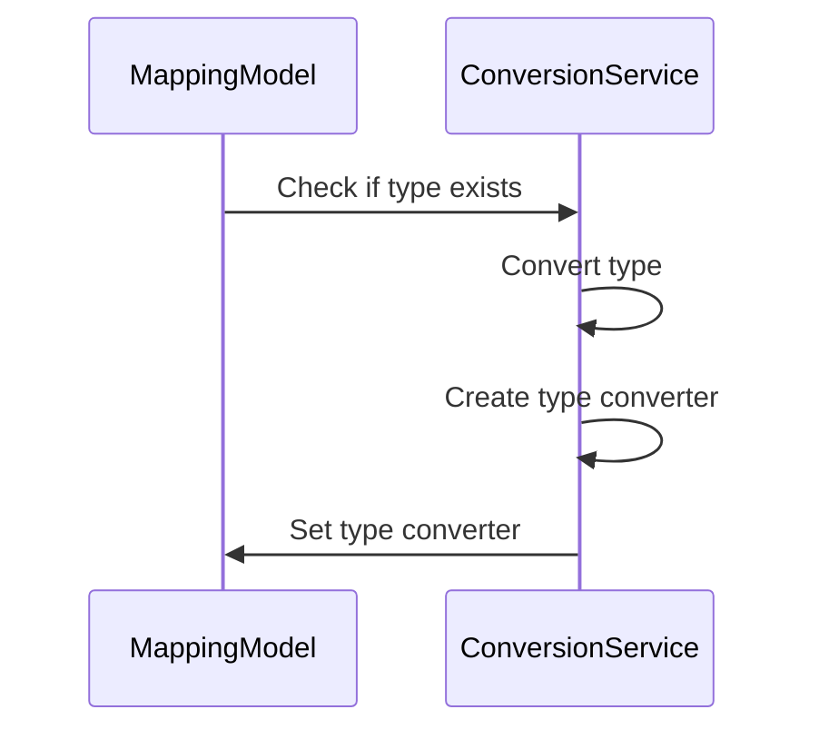
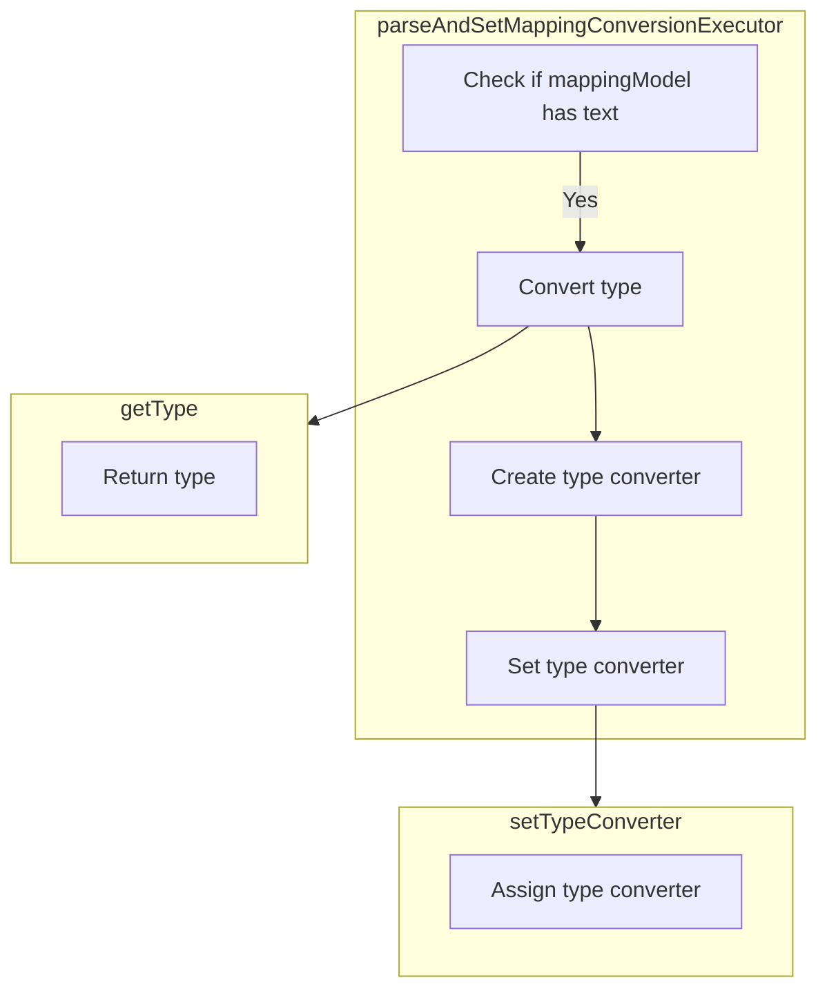
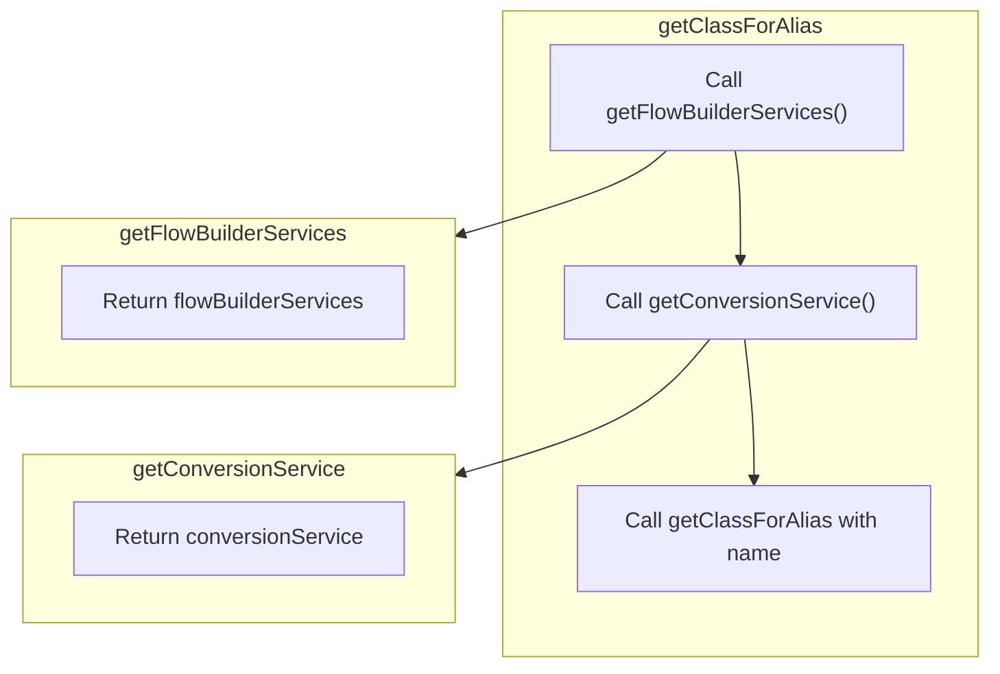

```mermaid
graph TD
subgraph toClass
toClass:A["Get Local Context"] --> toClass:B["Get Conversion Service"] --> toClass:C["Get Class for Alias"]
toClass:C -->|Class exists| toClass:D["Return Class"]
toClass:C -->|Class not exists| toClass:E["Get Application Context"] --> toClass:F["Get ClassLoader"] --> toClass:G["Load Class using ClassUtils"]
toClass:G -->|Class not found| toClass:H["Throw IllegalArgumentException"]
end
subgraph getLocalContext
getLocalContext:A["Return localFlowBuilderContext"]
end
toClass:A --> getLocalContext
subgraph getApplicationContext
getApplicationContext:A["Return localFlowContext"]
end
toClass:E --> getApplicationContext

%% Swimm:
%% graph TD
%% subgraph <SwmToken path="spring-webflow/src/main/java/org/springframework/webflow/engine/builder/model/FlowModelFlowBuilder.java" pos="547:8:8" line-data="			Class&lt;?&gt; type = toClass(mappingModel.getType());">`toClass`</SwmToken>
%% <SwmToken path="spring-webflow/src/main/java/org/springframework/webflow/engine/builder/model/FlowModelFlowBuilder.java" pos="547:8:8" line-data="			Class&lt;?&gt; type = toClass(mappingModel.getType());">`toClass`</SwmToken>:A["Get Local Context"] --> <SwmToken path="spring-webflow/src/main/java/org/springframework/webflow/engine/builder/model/FlowModelFlowBuilder.java" pos="547:8:8" line-data="			Class&lt;?&gt; type = toClass(mappingModel.getType());">`toClass`</SwmToken>:B["Get Conversion Service"] --> <SwmToken path="spring-webflow/src/main/java/org/springframework/webflow/engine/builder/model/FlowModelFlowBuilder.java" pos="547:8:8" line-data="			Class&lt;?&gt; type = toClass(mappingModel.getType());">`toClass`</SwmToken>:C["Get Class for Alias"]
%% <SwmToken path="spring-webflow/src/main/java/org/springframework/webflow/engine/builder/model/FlowModelFlowBuilder.java" pos="547:8:8" line-data="			Class&lt;?&gt; type = toClass(mappingModel.getType());">`toClass`</SwmToken>:C -->|Class exists| <SwmToken path="spring-webflow/src/main/java/org/springframework/webflow/engine/builder/model/FlowModelFlowBuilder.java" pos="547:8:8" line-data="			Class&lt;?&gt; type = toClass(mappingModel.getType());">`toClass`</SwmToken>:D["Return Class"]
%% <SwmToken path="spring-webflow/src/main/java/org/springframework/webflow/engine/builder/model/FlowModelFlowBuilder.java" pos="547:8:8" line-data="			Class&lt;?&gt; type = toClass(mappingModel.getType());">`toClass`</SwmToken>:C -->|Class not exists| <SwmToken path="spring-webflow/src/main/java/org/springframework/webflow/engine/builder/model/FlowModelFlowBuilder.java" pos="547:8:8" line-data="			Class&lt;?&gt; type = toClass(mappingModel.getType());">`toClass`</SwmToken>:E["Get Application Context"] --> <SwmToken path="spring-webflow/src/main/java/org/springframework/webflow/engine/builder/model/FlowModelFlowBuilder.java" pos="547:8:8" line-data="			Class&lt;?&gt; type = toClass(mappingModel.getType());">`toClass`</SwmToken>:F["Get <SwmToken path="spring-webflow/src/main/java/org/springframework/webflow/engine/builder/model/FlowModelFlowBuilder.java" pos="995:1:1" line-data="				ClassLoader classLoader = getLocalContext().getApplicationContext().getClassLoader();">`ClassLoader`</SwmToken>"] --> <SwmToken path="spring-webflow/src/main/java/org/springframework/webflow/engine/builder/model/FlowModelFlowBuilder.java" pos="547:8:8" line-data="			Class&lt;?&gt; type = toClass(mappingModel.getType());">`toClass`</SwmToken>:G["Load Class using <SwmToken path="spring-webflow/src/main/java/org/springframework/webflow/engine/builder/model/FlowModelFlowBuilder.java" pos="996:3:3" line-data="				return ClassUtils.forName(name, classLoader);">`ClassUtils`</SwmToken>"]
%% <SwmToken path="spring-webflow/src/main/java/org/springframework/webflow/engine/builder/model/FlowModelFlowBuilder.java" pos="547:8:8" line-data="			Class&lt;?&gt; type = toClass(mappingModel.getType());">`toClass`</SwmToken>:G -->|Class not found| <SwmToken path="spring-webflow/src/main/java/org/springframework/webflow/engine/builder/model/FlowModelFlowBuilder.java" pos="547:8:8" line-data="			Class&lt;?&gt; type = toClass(mappingModel.getType());">`toClass`</SwmToken>:H["Throw <SwmToken path="spring-webflow/src/main/java/org/springframework/webflow/engine/builder/model/FlowModelFlowBuilder.java" pos="998:5:5" line-data="				throw new IllegalArgumentException(&quot;Unable to load class &#39;&quot; + name + &quot;&#39;&quot;);">`IllegalArgumentException`</SwmToken>"]
%% end
%% subgraph <SwmToken path="spring-webflow/src/main/java/org/springframework/webflow/engine/builder/model/FlowModelFlowBuilder.java" pos="295:5:5" line-data="	protected LocalFlowBuilderContext getLocalContext() {">`getLocalContext`</SwmToken>
%% <SwmToken path="spring-webflow/src/main/java/org/springframework/webflow/engine/builder/model/FlowModelFlowBuilder.java" pos="295:5:5" line-data="	protected LocalFlowBuilderContext getLocalContext() {">`getLocalContext`</SwmToken>:A["Return <SwmToken path="spring-webflow/src/main/java/org/springframework/webflow/engine/builder/model/FlowModelFlowBuilder.java" pos="296:3:3" line-data="		return localFlowBuilderContext;">`localFlowBuilderContext`</SwmToken>"]
%% end
%% <SwmToken path="spring-webflow/src/main/java/org/springframework/webflow/engine/builder/model/FlowModelFlowBuilder.java" pos="547:8:8" line-data="			Class&lt;?&gt; type = toClass(mappingModel.getType());">`toClass`</SwmToken>:A --> <SwmToken path="spring-webflow/src/main/java/org/springframework/webflow/engine/builder/model/FlowModelFlowBuilder.java" pos="295:5:5" line-data="	protected LocalFlowBuilderContext getLocalContext() {">`getLocalContext`</SwmToken>
%% subgraph <SwmToken path="spring-webflow/src/main/java/org/springframework/webflow/engine/builder/model/FlowModelFlowBuilder.java" pos="995:11:11" line-data="				ClassLoader classLoader = getLocalContext().getApplicationContext().getClassLoader();">`getApplicationContext`</SwmToken>
%% <SwmToken path="spring-webflow/src/main/java/org/springframework/webflow/engine/builder/model/FlowModelFlowBuilder.java" pos="995:11:11" line-data="				ClassLoader classLoader = getLocalContext().getApplicationContext().getClassLoader();">`getApplicationContext`</SwmToken>:A["Return <SwmToken path="spring-webflow/src/main/java/org/springframework/webflow/engine/builder/model/LocalFlowBuilderContext.java" pos="47:3:3" line-data="		return localFlowContext;">`localFlowContext`</SwmToken>"]
%% end
%% <SwmToken path="spring-webflow/src/main/java/org/springframework/webflow/engine/builder/model/FlowModelFlowBuilder.java" pos="547:8:8" line-data="			Class&lt;?&gt; type = toClass(mappingModel.getType());">`toClass`</SwmToken>:E --> <SwmToken path="spring-webflow/src/main/java/org/springframework/webflow/engine/builder/model/FlowModelFlowBuilder.java" pos="995:11:11" line-data="				ClassLoader classLoader = getLocalContext().getApplicationContext().getClassLoader();">`getApplicationContext`</SwmToken>
```

```mermaid
graph TD
  subgraph getConversionService
    getConversionService:A["Check if local bean conversionService exists"] -->|Yes| getConversionService:B["Return local bean conversionService"]
    getConversionService:A -->|No| getConversionService:C["Return conversionService from parent"]
  end
  subgraph getBean
    getBean:A["Return 'bean' property"]
  end

%% Swimm:
%% graph TD
%%   subgraph <SwmToken path="spring-webflow/src/main/java/org/springframework/webflow/engine/builder/model/FlowModelFlowBuilder.java" pos="549:2:2" line-data="					.getConversionService());">`getConversionService`</SwmToken>
%%     <SwmToken path="spring-webflow/src/main/java/org/springframework/webflow/engine/builder/model/FlowModelFlowBuilder.java" pos="549:2:2" line-data="					.getConversionService());">`getConversionService`</SwmToken>:A["Check if local bean <SwmToken path="spring-webflow/src/main/java/org/springframework/webflow/engine/builder/model/LocalFlowBuilderContext.java" pos="75:9:9" line-data="		if (localFlowContext.containsLocalBean(&quot;conversionService&quot;)) {">`conversionService`</SwmToken> exists"] -->|Yes| <SwmToken path="spring-webflow/src/main/java/org/springframework/webflow/engine/builder/model/FlowModelFlowBuilder.java" pos="549:2:2" line-data="					.getConversionService());">`getConversionService`</SwmToken>:B["Return local bean <SwmToken path="spring-webflow/src/main/java/org/springframework/webflow/engine/builder/model/LocalFlowBuilderContext.java" pos="75:9:9" line-data="		if (localFlowContext.containsLocalBean(&quot;conversionService&quot;)) {">`conversionService`</SwmToken>"]
%%     <SwmToken path="spring-webflow/src/main/java/org/springframework/webflow/engine/builder/model/FlowModelFlowBuilder.java" pos="549:2:2" line-data="					.getConversionService());">`getConversionService`</SwmToken>:A -->|No| <SwmToken path="spring-webflow/src/main/java/org/springframework/webflow/engine/builder/model/FlowModelFlowBuilder.java" pos="549:2:2" line-data="					.getConversionService());">`getConversionService`</SwmToken>:C["Return <SwmToken path="spring-webflow/src/main/java/org/springframework/webflow/engine/builder/model/LocalFlowBuilderContext.java" pos="75:9:9" line-data="		if (localFlowContext.containsLocalBean(&quot;conversionService&quot;)) {">`conversionService`</SwmToken> from parent"]
%%   end
%%   subgraph <SwmToken path="spring-webflow/src/main/java/org/springframework/webflow/engine/builder/model/LocalFlowBuilderContext.java" pos="76:5:5" line-data="			return localFlowContext.getBean(&quot;conversionService&quot;, ConversionService.class);">`getBean`</SwmToken>
%%     <SwmToken path="spring-webflow/src/main/java/org/springframework/webflow/engine/builder/model/LocalFlowBuilderContext.java" pos="76:5:5" line-data="			return localFlowContext.getBean(&quot;conversionService&quot;, ConversionService.class);">`getBean`</SwmToken>:A["Return 'bean' property"]
%%   end
```

This document explains the process of parsing and setting the mapping conversion executor within the application. This flow is essential for ensuring that data types are correctly converted during the mapping process, which is a critical aspect of the application's data handling capabilities.

For instance, when a mapping model specifies a type, this flow converts the type and sets the appropriate type conversion executor, ensuring that the data is accurately transformed according to the specified type.



# Where is this flow used?

This flow is used multiple times in the codebase as represented in the following diagram:

```mermaid
graph TD;
      subgraph springwebflowsrcmainjavaorgspringframeworkwebflowenginebuilder[spring-webflow/…/engine/builder]
387071bce3784df0ea7a19728f499d1c435933f20b4a167c8cc1fedca6204315(parseFlowInputMapping) --> edf49af0a322df59fb671f1bdb5b1b91ee1a8d2c0b272acb67e3ac933c57a6f8(FlowModelFlowBuilder.parseAndSetMappingConversionExecutor)
end

subgraph springwebflowsrcmainjavaorgspringframeworkwebflowenginebuilder[spring-webflow/…/engine/builder]
f63b9efcab06b3607d0b6987a03a892b8781397e899614c01b7d7254680472db(parseFlowInputMapper) --> 387071bce3784df0ea7a19728f499d1c435933f20b4a167c8cc1fedca6204315(parseFlowInputMapping)
end

subgraph springwebflowsrcmainjavaorgspringframeworkwebflowenginebuilder[spring-webflow/…/engine/builder]
49b1ccc3c1b8fa3198436303ff06a5c15d074e48f78e9703c9c0ea93289a81c0(buildInputMapper) --> f63b9efcab06b3607d0b6987a03a892b8781397e899614c01b7d7254680472db(parseFlowInputMapper)
end

subgraph springwebflowsrcmainjavaorgspringframeworkwebflowenginebuilder[spring-webflow/…/engine/builder]
bcf7d04f200577b40e0b7b535490bb15600fd695cc4744ce27bd877350dc114d(parseSubflowInputMapping) --> edf49af0a322df59fb671f1bdb5b1b91ee1a8d2c0b272acb67e3ac933c57a6f8(FlowModelFlowBuilder.parseAndSetMappingConversionExecutor)
end

subgraph springwebflowsrcmainjavaorgspringframeworkwebflowenginebuilder[spring-webflow/…/engine/builder]
556cae6e67cda19644017f7c93aa4102bea14d9cf63e1fa290b3b0a0cfc364a9(parseSubflowInputMapper) --> bcf7d04f200577b40e0b7b535490bb15600fd695cc4744ce27bd877350dc114d(parseSubflowInputMapping)
end

subgraph springwebflowsrcmainjavaorgspringframeworkwebflowenginebuilder[spring-webflow/…/engine/builder]
d638420117f61b40548ce22530bcd24bf8dde83c8fb60ce1950323cef10e416a(parseSubflowAttributeMapper) --> 556cae6e67cda19644017f7c93aa4102bea14d9cf63e1fa290b3b0a0cfc364a9(parseSubflowInputMapper)
end

subgraph springwebflowsrcmainjavaorgspringframeworkwebflowenginebuilder[spring-webflow/…/engine/builder]
d638420117f61b40548ce22530bcd24bf8dde83c8fb60ce1950323cef10e416a(parseSubflowAttributeMapper) --> 9ea4aa8de487562a61f6e1683b65a5b41e541b5feaa874d614beb898f8481eb4(parseSubflowOutputMapper)
end

subgraph springwebflowsrcmainjavaorgspringframeworkwebflowenginebuilder[spring-webflow/…/engine/builder]
e1f5d334a044786e4a4cb53ecd3cbd5ee18181025b5d82616afd24f0b2deeb17(parseAndAddSubflowState) --> d638420117f61b40548ce22530bcd24bf8dde83c8fb60ce1950323cef10e416a(parseSubflowAttributeMapper)
end

subgraph springwebflowsrcmainjavaorgspringframeworkwebflowenginebuilder[spring-webflow/…/engine/builder]
80d714d24669a6d98648cb807f43932b2ad32db2684e3fd188cea80062eb1604(buildStates) --> e1f5d334a044786e4a4cb53ecd3cbd5ee18181025b5d82616afd24f0b2deeb17(parseAndAddSubflowState)
end

subgraph springwebflowsrcmainjavaorgspringframeworkwebflowenginebuilder[spring-webflow/…/engine/builder]
80d714d24669a6d98648cb807f43932b2ad32db2684e3fd188cea80062eb1604(buildStates) --> 0cab62e221f6f1870a5650ab697221b63fe822409850f88ca5dcac0bd1535c43(parseAndAddEndState)
end

subgraph springwebflowsrcmainjavaorgspringframeworkwebflowenginebuilder[spring-webflow/…/engine/builder]
2f179427de9ff5829f2fe810c39b13981e127d43d0dd12ffc8c00d73310e2ca5(directAssembly) --> 80d714d24669a6d98648cb807f43932b2ad32db2684e3fd188cea80062eb1604(buildStates)
end

subgraph springwebflowsrcmainjavaorgspringframeworkwebflowenginebuilder[spring-webflow/…/engine/builder]
98c055c9b71322fa06a3f80b548fc9ac3bba717c9bc5f7729bedda3b5053efba(assembleFlow) --> 2f179427de9ff5829f2fe810c39b13981e127d43d0dd12ffc8c00d73310e2ca5(directAssembly)
end

subgraph springwebflowsrcmainjavaorgspringframeworkwebflowenginebuilder[spring-webflow/…/engine/builder]
b61d14bc393f7b95415127363fcb9967656809bc62cdaa5ae06d9f081f7afde0(buildFlowDefinition) --> 98c055c9b71322fa06a3f80b548fc9ac3bba717c9bc5f7729bedda3b5053efba(assembleFlow)
end

subgraph springwebflowsrcmainjavaorgspringframeworkwebflowconfig[spring-webflow/…/webflow/config]
ad93a501c5167d5f44320fc4f5bf79429a0a8fa379e0d876b13e591781d40b86(registerFlowBuilders) --> b61d14bc393f7b95415127363fcb9967656809bc62cdaa5ae06d9f081f7afde0(buildFlowDefinition)
end

subgraph springwebflowsrcmainjavaorgspringframeworkwebflowconfig[spring-webflow/…/webflow/config]
1b90ecf800bbc7530a7fa1ce5da86edf43748f2181cd61cce0354fd86270baa3(afterPropertiesSet) --> ad93a501c5167d5f44320fc4f5bf79429a0a8fa379e0d876b13e591781d40b86(registerFlowBuilders)
end

subgraph springwebflowsrcmainjavaorgspringframeworkwebflowenginebuilder[spring-webflow/…/engine/builder]
55b04cc845d25b7e0c21126e49b46672d760a40484ba2a0968c13813c003e13f(registerFlowBuilders) --> 98c055c9b71322fa06a3f80b548fc9ac3bba717c9bc5f7729bedda3b5053efba(assembleFlow)
end

subgraph springwebflowsrcmainjavaorgspringframeworkwebflowconfig[spring-webflow/…/webflow/config]
5ea9a3feeed8ad6d34de42f261caa9230b8ece470b9be1cfb63b5ac3dff9a97c(build) --> 55b04cc845d25b7e0c21126e49b46672d760a40484ba2a0968c13813c003e13f(registerFlowBuilders)
end

subgraph springwebflowsrcmainjavaorgspringframeworkwebflowconfig[spring-webflow/…/webflow/config]
e8cc0123680495888518bed32ace4fc20e41ea6ec58363164584f8c1c181a00b(FlowDefinitionRegistryBuilder) --> 5ea9a3feeed8ad6d34de42f261caa9230b8ece470b9be1cfb63b5ac3dff9a97c(build)
end

subgraph springwebflowsrcmainjavaorgspringframeworkwebflowenginebuilder[spring-webflow/…/engine/builder]
0207403ab85551fc7273c1ce26425378adac0cd6340973a20db710e4e64b4bc5(parseFlowOutputMapping) --> edf49af0a322df59fb671f1bdb5b1b91ee1a8d2c0b272acb67e3ac933c57a6f8(FlowModelFlowBuilder.parseAndSetMappingConversionExecutor)
end

subgraph springwebflowsrcmainjavaorgspringframeworkwebflowenginebuilder[spring-webflow/…/engine/builder]
c9b9ad019049190fbd9f7a4787ab123a14dc030d6f47190a8d7be29ed4c65925(parseFlowOutputMapper) --> 0207403ab85551fc7273c1ce26425378adac0cd6340973a20db710e4e64b4bc5(parseFlowOutputMapping)
end

subgraph springwebflowsrcmainjavaorgspringframeworkwebflowenginebuilder[spring-webflow/…/engine/builder]
5459077bd95ac8612d11d46cf3f8adb2116e715211feb455e1cf92552df081f7(buildOutputMapper) --> c9b9ad019049190fbd9f7a4787ab123a14dc030d6f47190a8d7be29ed4c65925(parseFlowOutputMapper)
end

subgraph springwebflowsrcmainjavaorgspringframeworkwebflowenginebuilder[spring-webflow/…/engine/builder]
0cab62e221f6f1870a5650ab697221b63fe822409850f88ca5dcac0bd1535c43(parseAndAddEndState) --> c9b9ad019049190fbd9f7a4787ab123a14dc030d6f47190a8d7be29ed4c65925(parseFlowOutputMapper)
end

subgraph springwebflowsrcmainjavaorgspringframeworkwebflowenginebuilder[spring-webflow/…/engine/builder]
a3601179b0f84faf5f6046ac84985a84a5892508e478e00828735a1e51b88d99(parseSubflowOutputMapping) --> edf49af0a322df59fb671f1bdb5b1b91ee1a8d2c0b272acb67e3ac933c57a6f8(FlowModelFlowBuilder.parseAndSetMappingConversionExecutor)
end

subgraph springwebflowsrcmainjavaorgspringframeworkwebflowenginebuilder[spring-webflow/…/engine/builder]
9ea4aa8de487562a61f6e1683b65a5b41e541b5feaa874d614beb898f8481eb4(parseSubflowOutputMapper) --> a3601179b0f84faf5f6046ac84985a84a5892508e478e00828735a1e51b88d99(parseSubflowOutputMapping)
end


      classDef mainFlowStyle color:#000000,fill:#7CB9F4
classDef rootsStyle color:#000000,fill:#00FFF4
classDef Style1 color:#000000,fill:#00FFAA
classDef Style2 color:#000000,fill:#FFFF00
classDef Style3 color:#000000,fill:#AA7CB9

%% Swimm:
%% graph TD;
%%       subgraph springwebflowsrcmainjavaorgspringframeworkwebflowenginebuilder[<SwmPath>[spring-webflow/…/engine/builder/](spring-webflow/src/main/java/org/springframework/webflow/engine/builder/)</SwmPath>]
%% 387071bce3784df0ea7a19728f499d1c435933f20b4a167c8cc1fedca6204315(<SwmToken path="spring-webflow/src/main/java/org/springframework/webflow/engine/builder/model/FlowModelFlowBuilder.java" pos="433:5:5" line-data="				inputMapper.addMapping(parseFlowInputMapping(inputModel));">`parseFlowInputMapping`</SwmToken>) --> edf49af0a322df59fb671f1bdb5b1b91ee1a8d2c0b272acb67e3ac933c57a6f8(FlowModelFlowBuilder.parseAndSetMappingConversionExecutor)
%% end
%% 
%% subgraph springwebflowsrcmainjavaorgspringframeworkwebflowenginebuilder[<SwmPath>[spring-webflow/…/engine/builder/](spring-webflow/src/main/java/org/springframework/webflow/engine/builder/)</SwmPath>]
%% f63b9efcab06b3607d0b6987a03a892b8781397e899614c01b7d7254680472db(<SwmToken path="spring-webflow/src/main/java/org/springframework/webflow/engine/builder/model/FlowModelFlowBuilder.java" pos="191:7:7" line-data="		getFlow().setInputMapper(parseFlowInputMapper(flowModel.getInputs()));">`parseFlowInputMapper`</SwmToken>) --> 387071bce3784df0ea7a19728f499d1c435933f20b4a167c8cc1fedca6204315(<SwmToken path="spring-webflow/src/main/java/org/springframework/webflow/engine/builder/model/FlowModelFlowBuilder.java" pos="433:5:5" line-data="				inputMapper.addMapping(parseFlowInputMapping(inputModel));">`parseFlowInputMapping`</SwmToken>)
%% end
%% 
%% subgraph springwebflowsrcmainjavaorgspringframeworkwebflowenginebuilder[<SwmPath>[spring-webflow/…/engine/builder/](spring-webflow/src/main/java/org/springframework/webflow/engine/builder/)</SwmPath>]
%% 49b1ccc3c1b8fa3198436303ff06a5c15d074e48f78e9703c9c0ea93289a81c0(<SwmToken path="spring-webflow/src/main/java/org/springframework/webflow/engine/builder/model/FlowModelFlowBuilder.java" pos="190:5:5" line-data="	public void buildInputMapper() throws FlowBuilderException {">`buildInputMapper`</SwmToken>) --> f63b9efcab06b3607d0b6987a03a892b8781397e899614c01b7d7254680472db(<SwmToken path="spring-webflow/src/main/java/org/springframework/webflow/engine/builder/model/FlowModelFlowBuilder.java" pos="191:7:7" line-data="		getFlow().setInputMapper(parseFlowInputMapper(flowModel.getInputs()));">`parseFlowInputMapper`</SwmToken>)
%% end
%% 
%% subgraph springwebflowsrcmainjavaorgspringframeworkwebflowenginebuilder[<SwmPath>[spring-webflow/…/engine/builder/](spring-webflow/src/main/java/org/springframework/webflow/engine/builder/)</SwmPath>]
%% bcf7d04f200577b40e0b7b535490bb15600fd695cc4744ce27bd877350dc114d(<SwmToken path="spring-webflow/src/main/java/org/springframework/webflow/engine/builder/model/FlowModelFlowBuilder.java" pos="462:5:5" line-data="				inputMapper.addMapping(parseSubflowInputMapping(inputModel));">`parseSubflowInputMapping`</SwmToken>) --> edf49af0a322df59fb671f1bdb5b1b91ee1a8d2c0b272acb67e3ac933c57a6f8(FlowModelFlowBuilder.parseAndSetMappingConversionExecutor)
%% end
%% 
%% subgraph springwebflowsrcmainjavaorgspringframeworkwebflowenginebuilder[<SwmPath>[spring-webflow/…/engine/builder/](spring-webflow/src/main/java/org/springframework/webflow/engine/builder/)</SwmPath>]
%% 556cae6e67cda19644017f7c93aa4102bea14d9cf63e1fa290b3b0a0cfc364a9(<SwmToken path="spring-webflow/src/main/java/org/springframework/webflow/engine/builder/model/FlowModelFlowBuilder.java" pos="458:5:5" line-data="	private Mapper parseSubflowInputMapper(List&lt;InputModel&gt; inputs) {">`parseSubflowInputMapper`</SwmToken>) --> bcf7d04f200577b40e0b7b535490bb15600fd695cc4744ce27bd877350dc114d(<SwmToken path="spring-webflow/src/main/java/org/springframework/webflow/engine/builder/model/FlowModelFlowBuilder.java" pos="462:5:5" line-data="				inputMapper.addMapping(parseSubflowInputMapping(inputModel));">`parseSubflowInputMapping`</SwmToken>)
%% end
%% 
%% subgraph springwebflowsrcmainjavaorgspringframeworkwebflowenginebuilder[<SwmPath>[spring-webflow/…/engine/builder/](spring-webflow/src/main/java/org/springframework/webflow/engine/builder/)</SwmPath>]
%% d638420117f61b40548ce22530bcd24bf8dde83c8fb60ce1950323cef10e416a(<SwmToken path="spring-webflow/src/main/java/org/springframework/webflow/engine/builder/model/FlowModelFlowBuilder.java" pos="615:1:1" line-data="				parseSubflowAttributeMapper(state), parseTransitions(state.getTransitions()),">`parseSubflowAttributeMapper`</SwmToken>) --> 556cae6e67cda19644017f7c93aa4102bea14d9cf63e1fa290b3b0a0cfc364a9(<SwmToken path="spring-webflow/src/main/java/org/springframework/webflow/engine/builder/model/FlowModelFlowBuilder.java" pos="458:5:5" line-data="	private Mapper parseSubflowInputMapper(List&lt;InputModel&gt; inputs) {">`parseSubflowInputMapper`</SwmToken>)
%% end
%% 
%% subgraph springwebflowsrcmainjavaorgspringframeworkwebflowenginebuilder[<SwmPath>[spring-webflow/…/engine/builder/](spring-webflow/src/main/java/org/springframework/webflow/engine/builder/)</SwmPath>]
%% d638420117f61b40548ce22530bcd24bf8dde83c8fb60ce1950323cef10e416a(<SwmToken path="spring-webflow/src/main/java/org/springframework/webflow/engine/builder/model/FlowModelFlowBuilder.java" pos="615:1:1" line-data="				parseSubflowAttributeMapper(state), parseTransitions(state.getTransitions()),">`parseSubflowAttributeMapper`</SwmToken>) --> 9ea4aa8de487562a61f6e1683b65a5b41e541b5feaa874d614beb898f8481eb4(<SwmToken path="spring-webflow/src/main/java/org/springframework/webflow/engine/builder/model/FlowModelFlowBuilder.java" pos="516:5:5" line-data="	private Mapper parseSubflowOutputMapper(List&lt;OutputModel&gt; outputs) {">`parseSubflowOutputMapper`</SwmToken>)
%% end
%% 
%% subgraph springwebflowsrcmainjavaorgspringframeworkwebflowenginebuilder[<SwmPath>[spring-webflow/…/engine/builder/](spring-webflow/src/main/java/org/springframework/webflow/engine/builder/)</SwmPath>]
%% e1f5d334a044786e4a4cb53ecd3cbd5ee18181025b5d82616afd24f0b2deeb17(<SwmToken path="spring-webflow/src/main/java/org/springframework/webflow/engine/builder/model/FlowModelFlowBuilder.java" pos="218:1:1" line-data="				parseAndAddSubflowState((SubflowStateModel) state, getFlow());">`parseAndAddSubflowState`</SwmToken>) --> d638420117f61b40548ce22530bcd24bf8dde83c8fb60ce1950323cef10e416a(<SwmToken path="spring-webflow/src/main/java/org/springframework/webflow/engine/builder/model/FlowModelFlowBuilder.java" pos="615:1:1" line-data="				parseSubflowAttributeMapper(state), parseTransitions(state.getTransitions()),">`parseSubflowAttributeMapper`</SwmToken>)
%% end
%% 
%% subgraph springwebflowsrcmainjavaorgspringframeworkwebflowenginebuilder[<SwmPath>[spring-webflow/…/engine/builder/](spring-webflow/src/main/java/org/springframework/webflow/engine/builder/)</SwmPath>]
%% 80d714d24669a6d98648cb807f43932b2ad32db2684e3fd188cea80062eb1604(<SwmToken path="spring-webflow/src/main/java/org/springframework/webflow/engine/builder/model/FlowModelFlowBuilder.java" pos="206:5:5" line-data="	public void buildStates() throws FlowBuilderException {">`buildStates`</SwmToken>) --> e1f5d334a044786e4a4cb53ecd3cbd5ee18181025b5d82616afd24f0b2deeb17(<SwmToken path="spring-webflow/src/main/java/org/springframework/webflow/engine/builder/model/FlowModelFlowBuilder.java" pos="218:1:1" line-data="				parseAndAddSubflowState((SubflowStateModel) state, getFlow());">`parseAndAddSubflowState`</SwmToken>)
%% end
%% 
%% subgraph springwebflowsrcmainjavaorgspringframeworkwebflowenginebuilder[<SwmPath>[spring-webflow/…/engine/builder/](spring-webflow/src/main/java/org/springframework/webflow/engine/builder/)</SwmPath>]
%% 80d714d24669a6d98648cb807f43932b2ad32db2684e3fd188cea80062eb1604(<SwmToken path="spring-webflow/src/main/java/org/springframework/webflow/engine/builder/model/FlowModelFlowBuilder.java" pos="206:5:5" line-data="	public void buildStates() throws FlowBuilderException {">`buildStates`</SwmToken>) --> 0cab62e221f6f1870a5650ab697221b63fe822409850f88ca5dcac0bd1535c43(<SwmToken path="spring-webflow/src/main/java/org/springframework/webflow/engine/builder/model/FlowModelFlowBuilder.java" pos="220:1:1" line-data="				parseAndAddEndState((EndStateModel) state, getFlow());">`parseAndAddEndState`</SwmToken>)
%% end
%% 
%% subgraph springwebflowsrcmainjavaorgspringframeworkwebflowenginebuilder[<SwmPath>[spring-webflow/…/engine/builder/](spring-webflow/src/main/java/org/springframework/webflow/engine/builder/)</SwmPath>]
%% 2f179427de9ff5829f2fe810c39b13981e127d43d0dd12ffc8c00d73310e2ca5(directAssembly) --> 80d714d24669a6d98648cb807f43932b2ad32db2684e3fd188cea80062eb1604(<SwmToken path="spring-webflow/src/main/java/org/springframework/webflow/engine/builder/model/FlowModelFlowBuilder.java" pos="206:5:5" line-data="	public void buildStates() throws FlowBuilderException {">`buildStates`</SwmToken>)
%% end
%% 
%% subgraph springwebflowsrcmainjavaorgspringframeworkwebflowenginebuilder[<SwmPath>[spring-webflow/…/engine/builder/](spring-webflow/src/main/java/org/springframework/webflow/engine/builder/)</SwmPath>]
%% 98c055c9b71322fa06a3f80b548fc9ac3bba717c9bc5f7729bedda3b5053efba(assembleFlow) --> 2f179427de9ff5829f2fe810c39b13981e127d43d0dd12ffc8c00d73310e2ca5(directAssembly)
%% end
%% 
%% subgraph springwebflowsrcmainjavaorgspringframeworkwebflowenginebuilder[<SwmPath>[spring-webflow/…/engine/builder/](spring-webflow/src/main/java/org/springframework/webflow/engine/builder/)</SwmPath>]
%% b61d14bc393f7b95415127363fcb9967656809bc62cdaa5ae06d9f081f7afde0(buildFlowDefinition) --> 98c055c9b71322fa06a3f80b548fc9ac3bba717c9bc5f7729bedda3b5053efba(assembleFlow)
%% end
%% 
%% subgraph springwebflowsrcmainjavaorgspringframeworkwebflowconfig[<SwmPath>[spring-webflow/…/webflow/config/](spring-webflow/src/main/java/org/springframework/webflow/config/)</SwmPath>]
%% ad93a501c5167d5f44320fc4f5bf79429a0a8fa379e0d876b13e591781d40b86(registerFlowBuilders) --> b61d14bc393f7b95415127363fcb9967656809bc62cdaa5ae06d9f081f7afde0(buildFlowDefinition)
%% end
%% 
%% subgraph springwebflowsrcmainjavaorgspringframeworkwebflowconfig[<SwmPath>[spring-webflow/…/webflow/config/](spring-webflow/src/main/java/org/springframework/webflow/config/)</SwmPath>]
%% 1b90ecf800bbc7530a7fa1ce5da86edf43748f2181cd61cce0354fd86270baa3(afterPropertiesSet) --> ad93a501c5167d5f44320fc4f5bf79429a0a8fa379e0d876b13e591781d40b86(registerFlowBuilders)
%% end
%% 
%% subgraph springwebflowsrcmainjavaorgspringframeworkwebflowenginebuilder[<SwmPath>[spring-webflow/…/engine/builder/](spring-webflow/src/main/java/org/springframework/webflow/engine/builder/)</SwmPath>]
%% 55b04cc845d25b7e0c21126e49b46672d760a40484ba2a0968c13813c003e13f(registerFlowBuilders) --> 98c055c9b71322fa06a3f80b548fc9ac3bba717c9bc5f7729bedda3b5053efba(assembleFlow)
%% end
%% 
%% subgraph springwebflowsrcmainjavaorgspringframeworkwebflowconfig[<SwmPath>[spring-webflow/…/webflow/config/](spring-webflow/src/main/java/org/springframework/webflow/config/)</SwmPath>]
%% 5ea9a3feeed8ad6d34de42f261caa9230b8ece470b9be1cfb63b5ac3dff9a97c(build) --> 55b04cc845d25b7e0c21126e49b46672d760a40484ba2a0968c13813c003e13f(registerFlowBuilders)
%% end
%% 
%% subgraph springwebflowsrcmainjavaorgspringframeworkwebflowconfig[<SwmPath>[spring-webflow/…/webflow/config/](spring-webflow/src/main/java/org/springframework/webflow/config/)</SwmPath>]
%% e8cc0123680495888518bed32ace4fc20e41ea6ec58363164584f8c1c181a00b(FlowDefinitionRegistryBuilder) --> 5ea9a3feeed8ad6d34de42f261caa9230b8ece470b9be1cfb63b5ac3dff9a97c(build)
%% end
%% 
%% subgraph springwebflowsrcmainjavaorgspringframeworkwebflowenginebuilder[<SwmPath>[spring-webflow/…/engine/builder/](spring-webflow/src/main/java/org/springframework/webflow/engine/builder/)</SwmPath>]
%% 0207403ab85551fc7273c1ce26425378adac0cd6340973a20db710e4e64b4bc5(<SwmToken path="spring-webflow/src/main/java/org/springframework/webflow/engine/builder/model/FlowModelFlowBuilder.java" pos="491:5:5" line-data="				outputMapper.addMapping(parseFlowOutputMapping(outputModel));">`parseFlowOutputMapping`</SwmToken>) --> edf49af0a322df59fb671f1bdb5b1b91ee1a8d2c0b272acb67e3ac933c57a6f8(FlowModelFlowBuilder.parseAndSetMappingConversionExecutor)
%% end
%% 
%% subgraph springwebflowsrcmainjavaorgspringframeworkwebflowenginebuilder[<SwmPath>[spring-webflow/…/engine/builder/](spring-webflow/src/main/java/org/springframework/webflow/engine/builder/)</SwmPath>]
%% c9b9ad019049190fbd9f7a4787ab123a14dc030d6f47190a8d7be29ed4c65925(<SwmToken path="spring-webflow/src/main/java/org/springframework/webflow/engine/builder/model/FlowModelFlowBuilder.java" pos="250:7:7" line-data="			getFlow().setOutputMapper(parseFlowOutputMapper(flowModel.getOutputs()));">`parseFlowOutputMapper`</SwmToken>) --> 0207403ab85551fc7273c1ce26425378adac0cd6340973a20db710e4e64b4bc5(<SwmToken path="spring-webflow/src/main/java/org/springframework/webflow/engine/builder/model/FlowModelFlowBuilder.java" pos="491:5:5" line-data="				outputMapper.addMapping(parseFlowOutputMapping(outputModel));">`parseFlowOutputMapping`</SwmToken>)
%% end
%% 
%% subgraph springwebflowsrcmainjavaorgspringframeworkwebflowenginebuilder[<SwmPath>[spring-webflow/…/engine/builder/](spring-webflow/src/main/java/org/springframework/webflow/engine/builder/)</SwmPath>]
%% 5459077bd95ac8612d11d46cf3f8adb2116e715211feb455e1cf92552df081f7(<SwmToken path="spring-webflow/src/main/java/org/springframework/webflow/engine/builder/model/FlowModelFlowBuilder.java" pos="248:5:5" line-data="	public void buildOutputMapper() throws FlowBuilderException {">`buildOutputMapper`</SwmToken>) --> c9b9ad019049190fbd9f7a4787ab123a14dc030d6f47190a8d7be29ed4c65925(<SwmToken path="spring-webflow/src/main/java/org/springframework/webflow/engine/builder/model/FlowModelFlowBuilder.java" pos="250:7:7" line-data="			getFlow().setOutputMapper(parseFlowOutputMapper(flowModel.getOutputs()));">`parseFlowOutputMapper`</SwmToken>)
%% end
%% 
%% subgraph springwebflowsrcmainjavaorgspringframeworkwebflowenginebuilder[<SwmPath>[spring-webflow/…/engine/builder/](spring-webflow/src/main/java/org/springframework/webflow/engine/builder/)</SwmPath>]
%% 0cab62e221f6f1870a5650ab697221b63fe822409850f88ca5dcac0bd1535c43(<SwmToken path="spring-webflow/src/main/java/org/springframework/webflow/engine/builder/model/FlowModelFlowBuilder.java" pos="220:1:1" line-data="				parseAndAddEndState((EndStateModel) state, getFlow());">`parseAndAddEndState`</SwmToken>) --> c9b9ad019049190fbd9f7a4787ab123a14dc030d6f47190a8d7be29ed4c65925(<SwmToken path="spring-webflow/src/main/java/org/springframework/webflow/engine/builder/model/FlowModelFlowBuilder.java" pos="250:7:7" line-data="			getFlow().setOutputMapper(parseFlowOutputMapper(flowModel.getOutputs()));">`parseFlowOutputMapper`</SwmToken>)
%% end
%% 
%% subgraph springwebflowsrcmainjavaorgspringframeworkwebflowenginebuilder[<SwmPath>[spring-webflow/…/engine/builder/](spring-webflow/src/main/java/org/springframework/webflow/engine/builder/)</SwmPath>]
%% a3601179b0f84faf5f6046ac84985a84a5892508e478e00828735a1e51b88d99(<SwmToken path="spring-webflow/src/main/java/org/springframework/webflow/engine/builder/model/FlowModelFlowBuilder.java" pos="520:5:5" line-data="				outputMapper.addMapping(parseSubflowOutputMapping(outputModel));">`parseSubflowOutputMapping`</SwmToken>) --> edf49af0a322df59fb671f1bdb5b1b91ee1a8d2c0b272acb67e3ac933c57a6f8(FlowModelFlowBuilder.parseAndSetMappingConversionExecutor)
%% end
%% 
%% subgraph springwebflowsrcmainjavaorgspringframeworkwebflowenginebuilder[<SwmPath>[spring-webflow/…/engine/builder/](spring-webflow/src/main/java/org/springframework/webflow/engine/builder/)</SwmPath>]
%% 9ea4aa8de487562a61f6e1683b65a5b41e541b5feaa874d614beb898f8481eb4(<SwmToken path="spring-webflow/src/main/java/org/springframework/webflow/engine/builder/model/FlowModelFlowBuilder.java" pos="516:5:5" line-data="	private Mapper parseSubflowOutputMapper(List&lt;OutputModel&gt; outputs) {">`parseSubflowOutputMapper`</SwmToken>) --> a3601179b0f84faf5f6046ac84985a84a5892508e478e00828735a1e51b88d99(<SwmToken path="spring-webflow/src/main/java/org/springframework/webflow/engine/builder/model/FlowModelFlowBuilder.java" pos="520:5:5" line-data="				outputMapper.addMapping(parseSubflowOutputMapping(outputModel));">`parseSubflowOutputMapping`</SwmToken>)
%% end
%% 
%% 
%%       classDef mainFlowStyle color:#000000,fill:#7CB9F4
%% classDef rootsStyle color:#000000,fill:#00FFF4
%% classDef Style1 color:#000000,fill:#00FFAA
%% classDef Style2 color:#000000,fill:#FFFF00
%% classDef Style3 color:#000000,fill:#AA7CB9
```

Here is a high level diagram of the flow, showing only the most important functions:

```mermaid
graph TD;
      subgraph springwebflowsrcmainjavaorgspringframeworkwebflowenginebuildermodel[spring-webflow/…/builder/model]
edf49af0a322df59fb671f1bdb5b1b91ee1a8d2c0b272acb67e3ac933c57a6f8(FlowModelFlowBuilder.parseAndSetMappingConversionExecutor) --> fcf88217f68897b767167ec703e6ee8a155c29c52a24a3df31cc39cf96032a70(FlowModelFlowBuilder.toClass)
end

subgraph springwebflowsrcmainjavaorgspringframeworkwebflowenginebuildermodel[spring-webflow/…/builder/model]
edf49af0a322df59fb671f1bdb5b1b91ee1a8d2c0b272acb67e3ac933c57a6f8(FlowModelFlowBuilder.parseAndSetMappingConversionExecutor) --> f511a560019cd6bcea296748a2952538c0ed8dae335422f1c1c1be9978532992(LocalFlowBuilderContext.getConversionService)
end

subgraph springwebflowsrcmainjavaorgspringframeworkwebflowenginemodel[spring-webflow/…/engine/model]
edf49af0a322df59fb671f1bdb5b1b91ee1a8d2c0b272acb67e3ac933c57a6f8(FlowModelFlowBuilder.parseAndSetMappingConversionExecutor) --> 4b1b0e421bcd17956a44ddbe304c18de57ce6865b3e0f60ee9a45040c6574648(AttributeModel.getType)
end

subgraph springbindingsrcmainjavaorgspringframeworkbindingmappingimplDefaultMappingjava[spring-binding/…/impl/DefaultMapping.java]
edf49af0a322df59fb671f1bdb5b1b91ee1a8d2c0b272acb67e3ac933c57a6f8(FlowModelFlowBuilder.parseAndSetMappingConversionExecutor) --> 5b257853952325e65c92690079448ab9387961d359de985cf81f25632d76b2d3(DefaultMapping.setTypeConverter)
end

subgraph springwebflowsrcmainjavaorgspringframeworkwebflowenginebuildermodel[spring-webflow/…/builder/model]
fcf88217f68897b767167ec703e6ee8a155c29c52a24a3df31cc39cf96032a70(FlowModelFlowBuilder.toClass) --> f511a560019cd6bcea296748a2952538c0ed8dae335422f1c1c1be9978532992(LocalFlowBuilderContext.getConversionService)
end

subgraph springwebflowsrcmainjavaorgspringframeworkwebflowenginebuildersupportFlowBuilderContextImpljava[spring-webflow/…/support/FlowBuilderContextImpl.java]
fcf88217f68897b767167ec703e6ee8a155c29c52a24a3df31cc39cf96032a70(FlowModelFlowBuilder.toClass) --> d00ccc2d377b0c75a24b208f998b10a149aceed4840f280748950666303b0919(ParentConversionServiceProxy.getClassForAlias)
end

subgraph springwebflowsrcmainjavaorgspringframeworkwebflowenginebuildermodel[spring-webflow/…/builder/model]
fcf88217f68897b767167ec703e6ee8a155c29c52a24a3df31cc39cf96032a70(FlowModelFlowBuilder.toClass) --> 8d33f6374a13157cf1f86eb02d64e472e5fd147e529d2feab3a30dd2c4d2894e(FlowModelFlowBuilder.getLocalContext)
end

subgraph springwebflowsrcmainjavaorgspringframeworkwebflowenginebuildermodel[spring-webflow/…/builder/model]
fcf88217f68897b767167ec703e6ee8a155c29c52a24a3df31cc39cf96032a70(FlowModelFlowBuilder.toClass) --> fac040deb0d36582ea50563f02e3b16bd2d44a268280e16ac3d617bd4f080ec6(LocalFlowBuilderContext.getApplicationContext)
end

subgraph springwebflowsrcmainjavaorgspringframeworkwebflowenginemodel[spring-webflow/…/engine/model]
f511a560019cd6bcea296748a2952538c0ed8dae335422f1c1c1be9978532992(LocalFlowBuilderContext.getConversionService) --> a4ae8c9598cb555f464ebc351490244484c7778300f08ffb0b4983a211b77d33(ExceptionHandlerModel.getBean)
end

subgraph springwebflowsrcmainjavaorgspringframeworkwebflowenginebuildersupportFlowBuilderContextImpljava[spring-webflow/…/support/FlowBuilderContextImpl.java]
d00ccc2d377b0c75a24b208f998b10a149aceed4840f280748950666303b0919(ParentConversionServiceProxy.getClassForAlias) --> 66e092c7068d451d0c00eebb3e61281ed153810ffb8a056a648fbac2be581643(FlowBuilderContextImpl.getFlowBuilderServices)
end

subgraph springwebflowsrcmainjavaorgspringframeworkwebflowenginebuildersupportFlowBuilderContextImpljava[spring-webflow/…/support/FlowBuilderContextImpl.java]
d00ccc2d377b0c75a24b208f998b10a149aceed4840f280748950666303b0919(ParentConversionServiceProxy.getClassForAlias) --> 89409caccea3e1f865325714d3435bc2710c709462b5c4b5d80cf132b18de966(FlowBuilderContextImpl.getConversionService)
end


      classDef mainFlowStyle color:#000000,fill:#7CB9F4
classDef rootsStyle color:#000000,fill:#00FFF4
classDef Style1 color:#000000,fill:#00FFAA
classDef Style2 color:#000000,fill:#FFFF00
classDef Style3 color:#000000,fill:#AA7CB9

%% Swimm:
%% graph TD;
%%       subgraph springwebflowsrcmainjavaorgspringframeworkwebflowenginebuildermodel[<SwmPath>[spring-webflow/…/builder/model/](spring-webflow/src/main/java/org/springframework/webflow/engine/builder/model/)</SwmPath>]
%% edf49af0a322df59fb671f1bdb5b1b91ee1a8d2c0b272acb67e3ac933c57a6f8(FlowModelFlowBuilder.parseAndSetMappingConversionExecutor) --> fcf88217f68897b767167ec703e6ee8a155c29c52a24a3df31cc39cf96032a70(FlowModelFlowBuilder.toClass)
%% end
%% 
%% subgraph springwebflowsrcmainjavaorgspringframeworkwebflowenginebuildermodel[<SwmPath>[spring-webflow/…/builder/model/](spring-webflow/src/main/java/org/springframework/webflow/engine/builder/model/)</SwmPath>]
%% edf49af0a322df59fb671f1bdb5b1b91ee1a8d2c0b272acb67e3ac933c57a6f8(FlowModelFlowBuilder.parseAndSetMappingConversionExecutor) --> f511a560019cd6bcea296748a2952538c0ed8dae335422f1c1c1be9978532992(LocalFlowBuilderContext.getConversionService)
%% end
%% 
%% subgraph springwebflowsrcmainjavaorgspringframeworkwebflowenginemodel[<SwmPath>[spring-webflow/…/engine/model/](spring-webflow/src/main/java/org/springframework/webflow/engine/model/)</SwmPath>]
%% edf49af0a322df59fb671f1bdb5b1b91ee1a8d2c0b272acb67e3ac933c57a6f8(FlowModelFlowBuilder.parseAndSetMappingConversionExecutor) --> 4b1b0e421bcd17956a44ddbe304c18de57ce6865b3e0f60ee9a45040c6574648(AttributeModel.getType)
%% end
%% 
%% subgraph springbindingsrcmainjavaorgspringframeworkbindingmappingimplDefaultMappingjava[<SwmPath>[spring-binding/…/impl/DefaultMapping.java](spring-binding/src/main/java/org/springframework/binding/mapping/impl/DefaultMapping.java)</SwmPath>]
%% edf49af0a322df59fb671f1bdb5b1b91ee1a8d2c0b272acb67e3ac933c57a6f8(FlowModelFlowBuilder.parseAndSetMappingConversionExecutor) --> 5b257853952325e65c92690079448ab9387961d359de985cf81f25632d76b2d3(DefaultMapping.setTypeConverter)
%% end
%% 
%% subgraph springwebflowsrcmainjavaorgspringframeworkwebflowenginebuildermodel[<SwmPath>[spring-webflow/…/builder/model/](spring-webflow/src/main/java/org/springframework/webflow/engine/builder/model/)</SwmPath>]
%% fcf88217f68897b767167ec703e6ee8a155c29c52a24a3df31cc39cf96032a70(FlowModelFlowBuilder.toClass) --> f511a560019cd6bcea296748a2952538c0ed8dae335422f1c1c1be9978532992(LocalFlowBuilderContext.getConversionService)
%% end
%% 
%% subgraph springwebflowsrcmainjavaorgspringframeworkwebflowenginebuildersupportFlowBuilderContextImpljava[<SwmPath>[spring-webflow/…/support/FlowBuilderContextImpl.java](spring-webflow/src/main/java/org/springframework/webflow/engine/builder/support/FlowBuilderContextImpl.java)</SwmPath>]
%% fcf88217f68897b767167ec703e6ee8a155c29c52a24a3df31cc39cf96032a70(FlowModelFlowBuilder.toClass) --> d00ccc2d377b0c75a24b208f998b10a149aceed4840f280748950666303b0919(ParentConversionServiceProxy.getClassForAlias)
%% end
%% 
%% subgraph springwebflowsrcmainjavaorgspringframeworkwebflowenginebuildermodel[<SwmPath>[spring-webflow/…/builder/model/](spring-webflow/src/main/java/org/springframework/webflow/engine/builder/model/)</SwmPath>]
%% fcf88217f68897b767167ec703e6ee8a155c29c52a24a3df31cc39cf96032a70(FlowModelFlowBuilder.toClass) --> 8d33f6374a13157cf1f86eb02d64e472e5fd147e529d2feab3a30dd2c4d2894e(FlowModelFlowBuilder.getLocalContext)
%% end
%% 
%% subgraph springwebflowsrcmainjavaorgspringframeworkwebflowenginebuildermodel[<SwmPath>[spring-webflow/…/builder/model/](spring-webflow/src/main/java/org/springframework/webflow/engine/builder/model/)</SwmPath>]
%% fcf88217f68897b767167ec703e6ee8a155c29c52a24a3df31cc39cf96032a70(FlowModelFlowBuilder.toClass) --> fac040deb0d36582ea50563f02e3b16bd2d44a268280e16ac3d617bd4f080ec6(LocalFlowBuilderContext.getApplicationContext)
%% end
%% 
%% subgraph springwebflowsrcmainjavaorgspringframeworkwebflowenginemodel[<SwmPath>[spring-webflow/…/engine/model/](spring-webflow/src/main/java/org/springframework/webflow/engine/model/)</SwmPath>]
%% f511a560019cd6bcea296748a2952538c0ed8dae335422f1c1c1be9978532992(LocalFlowBuilderContext.getConversionService) --> a4ae8c9598cb555f464ebc351490244484c7778300f08ffb0b4983a211b77d33(ExceptionHandlerModel.getBean)
%% end
%% 
%% subgraph springwebflowsrcmainjavaorgspringframeworkwebflowenginebuildersupportFlowBuilderContextImpljava[<SwmPath>[spring-webflow/…/support/FlowBuilderContextImpl.java](spring-webflow/src/main/java/org/springframework/webflow/engine/builder/support/FlowBuilderContextImpl.java)</SwmPath>]
%% d00ccc2d377b0c75a24b208f998b10a149aceed4840f280748950666303b0919(ParentConversionServiceProxy.getClassForAlias) --> 66e092c7068d451d0c00eebb3e61281ed153810ffb8a056a648fbac2be581643(FlowBuilderContextImpl.getFlowBuilderServices)
%% end
%% 
%% subgraph springwebflowsrcmainjavaorgspringframeworkwebflowenginebuildersupportFlowBuilderContextImpljava[<SwmPath>[spring-webflow/…/support/FlowBuilderContextImpl.java](spring-webflow/src/main/java/org/springframework/webflow/engine/builder/support/FlowBuilderContextImpl.java)</SwmPath>]
%% d00ccc2d377b0c75a24b208f998b10a149aceed4840f280748950666303b0919(ParentConversionServiceProxy.getClassForAlias) --> 89409caccea3e1f865325714d3435bc2710c709462b5c4b5d80cf132b18de966(FlowBuilderContextImpl.getConversionService)
%% end
%% 
%% 
%%       classDef mainFlowStyle color:#000000,fill:#7CB9F4
%% classDef rootsStyle color:#000000,fill:#00FFF4
%% classDef Style1 color:#000000,fill:#00FFAA
%% classDef Style2 color:#000000,fill:#FFFF00
%% classDef Style3 color:#000000,fill:#AA7CB9
```



# Flow drill down

## Exploring <SwmToken path="spring-webflow/src/main/java/org/springframework/webflow/engine/builder/model/FlowModelFlowBuilder.java" pos="545:5:5" line-data="	private void parseAndSetMappingConversionExecutor(AbstractMappingModel mappingModel, DefaultMapping mapping) {">`parseAndSetMappingConversionExecutor`</SwmToken> & <SwmToken path="spring-webflow/src/main/java/org/springframework/webflow/engine/builder/model/FlowModelFlowBuilder.java" pos="546:10:10" line-data="		if (StringUtils.hasText(mappingModel.getType())) {">`getType`</SwmToken> & <SwmToken path="spring-webflow/src/main/java/org/springframework/webflow/engine/builder/model/FlowModelFlowBuilder.java" pos="550:3:3" line-data="			mapping.setTypeConverter(typeConverter);">`setTypeConverter`</SwmToken>



<SwmSnippet path="/spring-webflow/src/main/java/org/springframework/webflow/engine/builder/model/FlowModelFlowBuilder.java" line="545">

---

First, the <SwmToken path="spring-webflow/src/main/java/org/springframework/webflow/engine/builder/model/FlowModelFlowBuilder.java" pos="545:5:5" line-data="	private void parseAndSetMappingConversionExecutor(AbstractMappingModel mappingModel, DefaultMapping mapping) {">`parseAndSetMappingConversionExecutor`</SwmToken> method is responsible for parsing the type from the mapping model and setting the appropriate type conversion executor for the mapping. This ensures that the data types are correctly converted during the mapping process.

```java
	private void parseAndSetMappingConversionExecutor(AbstractMappingModel mappingModel, DefaultMapping mapping) {
		if (StringUtils.hasText(mappingModel.getType())) {
			Class<?> type = toClass(mappingModel.getType());
			ConversionExecutor typeConverter = new RuntimeBindingConversionExecutor(type, getLocalContext()
					.getConversionService());
			mapping.setTypeConverter(typeConverter);
		}
	}
```

---

</SwmSnippet>

<SwmSnippet path="/spring-webflow/src/main/java/org/springframework/webflow/engine/model/AttributeModel.java" line="87">

---

Next, the <SwmToken path="spring-webflow/src/main/java/org/springframework/webflow/engine/model/AttributeModel.java" pos="87:5:5" line-data="	public String getType() {">`getType`</SwmToken> method in the <SwmToken path="spring-webflow/src/main/java/org/springframework/webflow/engine/builder/model/FlowModelFlowBuilder.java" pos="77:12:12" line-data="import org.springframework.webflow.engine.model.AttributeModel;">`AttributeModel`</SwmToken> class retrieves the type of the attribute. This type information is crucial for determining the appropriate conversion logic.

```java
	public String getType() {
		return type;
	}
```

---

</SwmSnippet>

<SwmSnippet path="/spring-binding/src/main/java/org/springframework/binding/mapping/impl/DefaultMapping.java" line="93">

---

Then, the <SwmToken path="spring-binding/src/main/java/org/springframework/binding/mapping/impl/DefaultMapping.java" pos="93:5:5" line-data="	public void setTypeConverter(ConversionExecutor typeConverter) {">`setTypeConverter`</SwmToken> method in the <SwmToken path="spring-webflow/src/main/java/org/springframework/webflow/engine/builder/model/FlowModelFlowBuilder.java" pos="545:12:12" line-data="	private void parseAndSetMappingConversionExecutor(AbstractMappingModel mappingModel, DefaultMapping mapping) {">`DefaultMapping`</SwmToken> class sets the specific type conversion executor to be used during the mapping execution. This step ensures that the mapping process uses the correct conversion logic based on the type information retrieved earlier.

```java
	public void setTypeConverter(ConversionExecutor typeConverter) {
		this.typeConverter = typeConverter;
	}
```

---

</SwmSnippet>

## A closer look at <SwmToken path="spring-webflow/src/main/java/org/springframework/webflow/engine/builder/model/FlowModelFlowBuilder.java" pos="547:8:8" line-data="			Class&lt;?&gt; type = toClass(mappingModel.getType());">`toClass`</SwmToken> & <SwmToken path="spring-webflow/src/main/java/org/springframework/webflow/engine/builder/model/FlowModelFlowBuilder.java" pos="295:5:5" line-data="	protected LocalFlowBuilderContext getLocalContext() {">`getLocalContext`</SwmToken> & <SwmToken path="spring-webflow/src/main/java/org/springframework/webflow/engine/builder/model/FlowModelFlowBuilder.java" pos="995:11:11" line-data="				ClassLoader classLoader = getLocalContext().getApplicationContext().getClassLoader();">`getApplicationContext`</SwmToken>



<SwmSnippet path="/spring-webflow/src/main/java/org/springframework/webflow/engine/builder/model/FlowModelFlowBuilder.java" line="989">

---

First, the <SwmToken path="spring-webflow/src/main/java/org/springframework/webflow/engine/builder/model/FlowModelFlowBuilder.java" pos="989:6:6" line-data="	private Class&lt;?&gt; toClass(String name) {">`toClass`</SwmToken> method is responsible for converting a given class name into its corresponding `Class` object. This is crucial for dynamically loading classes based on their names during the flow execution.

```java
	private Class<?> toClass(String name) {
		Class<?> clazz = getLocalContext().getConversionService().getClassForAlias(name);
		if (clazz != null) {
			return clazz;
		} else {
			try {
				ClassLoader classLoader = getLocalContext().getApplicationContext().getClassLoader();
				return ClassUtils.forName(name, classLoader);
			} catch (ClassNotFoundException e) {
				throw new IllegalArgumentException("Unable to load class '" + name + "'");
			}
		}
	}
```

---

</SwmSnippet>

<SwmSnippet path="/spring-webflow/src/main/java/org/springframework/webflow/engine/builder/model/FlowModelFlowBuilder.java" line="295">

---

Next, the method retrieves the local context using the <SwmToken path="spring-webflow/src/main/java/org/springframework/webflow/engine/builder/model/FlowModelFlowBuilder.java" pos="295:5:5" line-data="	protected LocalFlowBuilderContext getLocalContext() {">`getLocalContext`</SwmToken> method. This context provides access to the conversion service needed to resolve the class name.

```java
	protected LocalFlowBuilderContext getLocalContext() {
		return localFlowBuilderContext;
	}
```

---

</SwmSnippet>

<SwmSnippet path="/spring-webflow/src/main/java/org/springframework/webflow/engine/builder/model/FlowModelFlowBuilder.java" line="990">

---

Then, the conversion service is used to attempt to resolve the class name to a class object. If the conversion service can resolve the name, the class object is returned.

```java
		Class<?> clazz = getLocalContext().getConversionService().getClassForAlias(name);
		if (clazz != null) {
			return clazz;
```

---

</SwmSnippet>

<SwmSnippet path="/spring-webflow/src/main/java/org/springframework/webflow/engine/builder/model/FlowModelFlowBuilder.java" line="994">

---

If the conversion service cannot resolve the class name, the method attempts to load the class using the application context's class loader. If the class cannot be found, an <SwmToken path="spring-webflow/src/main/java/org/springframework/webflow/engine/builder/model/FlowModelFlowBuilder.java" pos="998:5:5" line-data="				throw new IllegalArgumentException(&quot;Unable to load class &#39;&quot; + name + &quot;&#39;&quot;);">`IllegalArgumentException`</SwmToken> is thrown.

```java
			try {
				ClassLoader classLoader = getLocalContext().getApplicationContext().getClassLoader();
				return ClassUtils.forName(name, classLoader);
			} catch (ClassNotFoundException e) {
				throw new IllegalArgumentException("Unable to load class '" + name + "'");
			}
```

---

</SwmSnippet>

<SwmSnippet path="/spring-webflow/src/main/java/org/springframework/webflow/engine/builder/model/LocalFlowBuilderContext.java" line="46">

---

Finally, the <SwmToken path="spring-webflow/src/main/java/org/springframework/webflow/engine/builder/model/LocalFlowBuilderContext.java" pos="46:5:5" line-data="	public ApplicationContext getApplicationContext() {">`getApplicationContext`</SwmToken> method is used to retrieve the application context, which provides the class loader needed to load the class if it is not found by the conversion service.

```java
	public ApplicationContext getApplicationContext() {
		return localFlowContext;
	}
```

---

</SwmSnippet>

## Breaking down <SwmToken path="spring-webflow/src/main/java/org/springframework/webflow/engine/builder/model/FlowModelFlowBuilder.java" pos="549:2:2" line-data="					.getConversionService());">`getConversionService`</SwmToken> & <SwmToken path="spring-webflow/src/main/java/org/springframework/webflow/engine/builder/model/LocalFlowBuilderContext.java" pos="76:5:5" line-data="			return localFlowContext.getBean(&quot;conversionService&quot;, ConversionService.class);">`getBean`</SwmToken>



<SwmSnippet path="/spring-webflow/src/main/java/org/springframework/webflow/engine/builder/model/LocalFlowBuilderContext.java" line="74">

---

First, the <SwmToken path="spring-webflow/src/main/java/org/springframework/webflow/engine/builder/model/LocalFlowBuilderContext.java" pos="74:5:5" line-data="	public ConversionService getConversionService() {">`getConversionService`</SwmToken> method is responsible for retrieving the conversion service. This method checks if the local flow context contains a bean named <SwmToken path="spring-webflow/src/main/java/org/springframework/webflow/engine/builder/model/LocalFlowBuilderContext.java" pos="75:9:9" line-data="		if (localFlowContext.containsLocalBean(&quot;conversionService&quot;)) {">`conversionService`</SwmToken>. If it does, it retrieves this bean; otherwise, it delegates the retrieval to the parent context.

```java
	public ConversionService getConversionService() {
		if (localFlowContext.containsLocalBean("conversionService")) {
			return localFlowContext.getBean("conversionService", ConversionService.class);
		} else {
			return parent.getConversionService();
		}
	}
```

---

</SwmSnippet>

<SwmSnippet path="/spring-webflow/src/main/java/org/springframework/webflow/engine/model/ExceptionHandlerModel.java" line="50">

---

Next, the <SwmToken path="spring-webflow/src/main/java/org/springframework/webflow/engine/model/ExceptionHandlerModel.java" pos="50:5:5" line-data="	public String getBean() {">`getBean`</SwmToken> method in the <SwmToken path="spring-webflow/src/main/java/org/springframework/webflow/engine/builder/model/FlowModelFlowBuilder.java" pos="84:12:12" line-data="import org.springframework.webflow.engine.model.ExceptionHandlerModel;">`ExceptionHandlerModel`</SwmToken> class is used to fetch the bean. This method simply returns the bean name stored in the <SwmToken path="spring-webflow/src/main/java/org/springframework/webflow/engine/model/ExceptionHandlerModel.java" pos="51:3:3" line-data="		return bean;">`bean`</SwmToken> variable, which is used later in the flow to handle exceptions.

```java
	public String getBean() {
		return bean;
	}
```

---

</SwmSnippet>

## Going into <SwmToken path="spring-webflow/src/main/java/org/springframework/webflow/engine/builder/model/FlowModelFlowBuilder.java" pos="990:16:16" line-data="		Class&lt;?&gt; clazz = getLocalContext().getConversionService().getClassForAlias(name);">`getClassForAlias`</SwmToken> & <SwmToken path="spring-webflow/src/main/java/org/springframework/webflow/engine/builder/support/FlowBuilderContextImpl.java" pos="163:3:3" line-data="			return getFlowBuilderServices().getConversionService().getClassForAlias(name);">`getFlowBuilderServices`</SwmToken> & <SwmToken path="spring-webflow/src/main/java/org/springframework/webflow/engine/builder/model/FlowModelFlowBuilder.java" pos="549:2:2" line-data="					.getConversionService());">`getConversionService`</SwmToken>



<SwmSnippet path="/spring-webflow/src/main/java/org/springframework/webflow/engine/builder/support/FlowBuilderContextImpl.java" line="162">

---

First, the <SwmToken path="spring-webflow/src/main/java/org/springframework/webflow/engine/builder/support/FlowBuilderContextImpl.java" pos="162:6:6" line-data="		public Class&lt;?&gt; getClassForAlias(String name) {">`getClassForAlias`</SwmToken> method is responsible for retrieving the class associated with a given alias. This is crucial for ensuring that the correct class is used during the flow execution based on the alias provided.

```java
		public Class<?> getClassForAlias(String name) {
			return getFlowBuilderServices().getConversionService().getClassForAlias(name);
		}
```

---

</SwmSnippet>

&nbsp;

*This is an auto-generated document by Swimm 🌊 and has not yet been verified by a human*

<SwmMeta version="3.0.0" repo-id="Z2l0aHViJTNBJTNBc3ByaW5nLXdlYmZsb3ctZGVtbyUzQSUzQWdpbGFkbmF2b3Q=" repo-name="spring-webflow-demo"><sup>Powered by [Swimm](/)</sup></SwmMeta>
