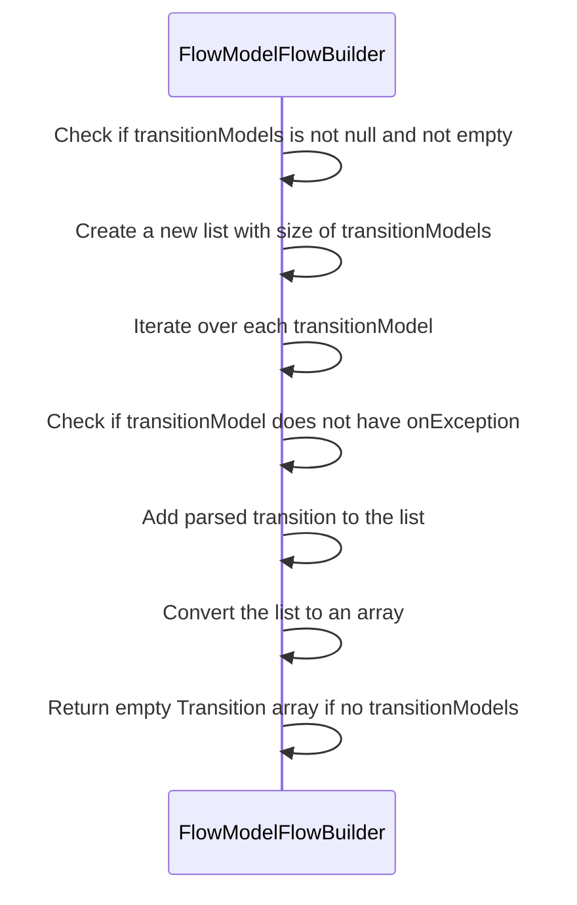

```mermaid
graph TD
 subgraph parseTransition
  parseTransition:A["Convert transition 'on' to TransitionCriteria"] --> parseTransition:B["Convert transition 'to' to TargetStateResolver"]
  parseTransition:B --> parseTransition:C["Create TransitionCriteriaChain from parsed actions"]
  parseTransition:C --> parseTransition:D["Parse meta attributes"]
  parseTransition:D --> parseTransition:E["Check if 'bind' attribute is present and convert to Boolean"]
  parseTransition:E --> parseTransition:F["Check if 'validate' attribute is present and convert to Boolean"]
  parseTransition:F --> parseTransition:G["Check if validationHints attribute is present and parse expression"]
  parseTransition:G --> parseTransition:H["Check if 'history' attribute is present and convert to History"]
  parseTransition:H --> parseTransition:I["Parse and put secured attributes"]
  parseTransition:I --> parseTransition:J["Create Transition with stateResolver, matchingCriteria, executionCriteria, and attributes"]
 end

%% Swimm:
%% graph TD
%%  subgraph <SwmToken path="spring-webflow/src/main/java/org/springframework/webflow/engine/builder/model/FlowModelFlowBuilder.java" pos="831:5:5" line-data="						transitions.add(parseTransition(transition));">`parseTransition`</SwmToken>
%%   <SwmToken path="spring-webflow/src/main/java/org/springframework/webflow/engine/builder/model/FlowModelFlowBuilder.java" pos="831:5:5" line-data="						transitions.add(parseTransition(transition));">`parseTransition`</SwmToken>:A["Convert transition 'on' to <SwmToken path="spring-webflow/src/main/java/org/springframework/webflow/engine/builder/model/FlowModelFlowBuilder.java" pos="842:1:1" line-data="		TransitionCriteria matchingCriteria = (TransitionCriteria) fromStringTo(TransitionCriteria.class).execute(">`TransitionCriteria`</SwmToken>"] --> <SwmToken path="spring-webflow/src/main/java/org/springframework/webflow/engine/builder/model/FlowModelFlowBuilder.java" pos="831:5:5" line-data="						transitions.add(parseTransition(transition));">`parseTransition`</SwmToken>:B["Convert transition 'to' to <SwmToken path="spring-webflow/src/main/java/org/springframework/webflow/engine/builder/model/FlowModelFlowBuilder.java" pos="844:1:1" line-data="		TargetStateResolver stateResolver = (TargetStateResolver) fromStringTo(TargetStateResolver.class).execute(">`TargetStateResolver`</SwmToken>"]
%%   <SwmToken path="spring-webflow/src/main/java/org/springframework/webflow/engine/builder/model/FlowModelFlowBuilder.java" pos="831:5:5" line-data="						transitions.add(parseTransition(transition));">`parseTransition`</SwmToken>:B --> <SwmToken path="spring-webflow/src/main/java/org/springframework/webflow/engine/builder/model/FlowModelFlowBuilder.java" pos="831:5:5" line-data="						transitions.add(parseTransition(transition));">`parseTransition`</SwmToken>:C["Create <SwmToken path="spring-webflow/src/main/java/org/springframework/webflow/engine/builder/model/FlowModelFlowBuilder.java" pos="846:7:7" line-data="		TransitionCriteria executionCriteria = TransitionCriteriaChain.criteriaChainFor(parseActions(transition">`TransitionCriteriaChain`</SwmToken> from parsed actions"]
%%   <SwmToken path="spring-webflow/src/main/java/org/springframework/webflow/engine/builder/model/FlowModelFlowBuilder.java" pos="831:5:5" line-data="						transitions.add(parseTransition(transition));">`parseTransition`</SwmToken>:C --> <SwmToken path="spring-webflow/src/main/java/org/springframework/webflow/engine/builder/model/FlowModelFlowBuilder.java" pos="831:5:5" line-data="						transitions.add(parseTransition(transition));">`parseTransition`</SwmToken>:D["Parse meta attributes"]
%%   <SwmToken path="spring-webflow/src/main/java/org/springframework/webflow/engine/builder/model/FlowModelFlowBuilder.java" pos="831:5:5" line-data="						transitions.add(parseTransition(transition));">`parseTransition`</SwmToken>:D --> <SwmToken path="spring-webflow/src/main/java/org/springframework/webflow/engine/builder/model/FlowModelFlowBuilder.java" pos="831:5:5" line-data="						transitions.add(parseTransition(transition));">`parseTransition`</SwmToken>:E["Check if 'bind' attribute is present and convert to Boolean"]
%%   <SwmToken path="spring-webflow/src/main/java/org/springframework/webflow/engine/builder/model/FlowModelFlowBuilder.java" pos="831:5:5" line-data="						transitions.add(parseTransition(transition));">`parseTransition`</SwmToken>:E --> <SwmToken path="spring-webflow/src/main/java/org/springframework/webflow/engine/builder/model/FlowModelFlowBuilder.java" pos="831:5:5" line-data="						transitions.add(parseTransition(transition));">`parseTransition`</SwmToken>:F["Check if 'validate' attribute is present and convert to Boolean"]
%%   <SwmToken path="spring-webflow/src/main/java/org/springframework/webflow/engine/builder/model/FlowModelFlowBuilder.java" pos="831:5:5" line-data="						transitions.add(parseTransition(transition));">`parseTransition`</SwmToken>:F --> <SwmToken path="spring-webflow/src/main/java/org/springframework/webflow/engine/builder/model/FlowModelFlowBuilder.java" pos="831:5:5" line-data="						transitions.add(parseTransition(transition));">`parseTransition`</SwmToken>:G["Check if <SwmToken path="spring-webflow/src/main/java/org/springframework/webflow/engine/builder/model/FlowModelFlowBuilder.java" pos="856:6:6" line-data="			attributes.put(&quot;validationHints&quot;,">`validationHints`</SwmToken> attribute is present and parse expression"]
%%   <SwmToken path="spring-webflow/src/main/java/org/springframework/webflow/engine/builder/model/FlowModelFlowBuilder.java" pos="831:5:5" line-data="						transitions.add(parseTransition(transition));">`parseTransition`</SwmToken>:G --> <SwmToken path="spring-webflow/src/main/java/org/springframework/webflow/engine/builder/model/FlowModelFlowBuilder.java" pos="831:5:5" line-data="						transitions.add(parseTransition(transition));">`parseTransition`</SwmToken>:H["Check if 'history' attribute is present and convert to History"]
%%   <SwmToken path="spring-webflow/src/main/java/org/springframework/webflow/engine/builder/model/FlowModelFlowBuilder.java" pos="831:5:5" line-data="						transitions.add(parseTransition(transition));">`parseTransition`</SwmToken>:H --> <SwmToken path="spring-webflow/src/main/java/org/springframework/webflow/engine/builder/model/FlowModelFlowBuilder.java" pos="831:5:5" line-data="						transitions.add(parseTransition(transition));">`parseTransition`</SwmToken>:I["Parse and put secured attributes"]
%%   <SwmToken path="spring-webflow/src/main/java/org/springframework/webflow/engine/builder/model/FlowModelFlowBuilder.java" pos="831:5:5" line-data="						transitions.add(parseTransition(transition));">`parseTransition`</SwmToken>:I --> <SwmToken path="spring-webflow/src/main/java/org/springframework/webflow/engine/builder/model/FlowModelFlowBuilder.java" pos="831:5:5" line-data="						transitions.add(parseTransition(transition));">`parseTransition`</SwmToken>:J["Create Transition with <SwmToken path="spring-webflow/src/main/java/org/springframework/webflow/engine/builder/model/FlowModelFlowBuilder.java" pos="844:3:3" line-data="		TargetStateResolver stateResolver = (TargetStateResolver) fromStringTo(TargetStateResolver.class).execute(">`stateResolver`</SwmToken>, <SwmToken path="spring-webflow/src/main/java/org/springframework/webflow/engine/builder/model/FlowModelFlowBuilder.java" pos="842:3:3" line-data="		TransitionCriteria matchingCriteria = (TransitionCriteria) fromStringTo(TransitionCriteria.class).execute(">`matchingCriteria`</SwmToken>, <SwmToken path="spring-webflow/src/main/java/org/springframework/webflow/engine/builder/model/FlowModelFlowBuilder.java" pos="846:3:3" line-data="		TransitionCriteria executionCriteria = TransitionCriteriaChain.criteriaChainFor(parseActions(transition">`executionCriteria`</SwmToken>, and attributes"]
%%  end
```

The <SwmToken path="spring-webflow/src/main/java/org/springframework/webflow/engine/builder/model/FlowModelFlowBuilder.java" pos="825:7:7" line-data="	private Transition[] parseTransitions(List&lt;TransitionModel&gt; transitionModels) {">`parseTransitions`</SwmToken> method is responsible for converting a list of <SwmToken path="spring-webflow/src/main/java/org/springframework/webflow/engine/builder/model/FlowModelFlowBuilder.java" pos="825:11:11" line-data="	private Transition[] parseTransitions(List&lt;TransitionModel&gt; transitionModels) {">`TransitionModel`</SwmToken> objects into an array of <SwmToken path="spring-webflow/src/main/java/org/springframework/webflow/engine/builder/model/FlowModelFlowBuilder.java" pos="825:3:3" line-data="	private Transition[] parseTransitions(List&lt;TransitionModel&gt; transitionModels) {">`Transition`</SwmToken> objects. This method ensures that each transition model is properly parsed and converted, facilitating the flow transitions within the application.

For instance, if there are multiple transition models defined for a flow, the <SwmToken path="spring-webflow/src/main/java/org/springframework/webflow/engine/builder/model/FlowModelFlowBuilder.java" pos="825:7:7" line-data="	private Transition[] parseTransitions(List&lt;TransitionModel&gt; transitionModels) {">`parseTransitions`</SwmToken> method will iterate over each model, parse it, and create corresponding <SwmToken path="spring-webflow/src/main/java/org/springframework/webflow/engine/builder/model/FlowModelFlowBuilder.java" pos="825:3:3" line-data="	private Transition[] parseTransitions(List&lt;TransitionModel&gt; transitionModels) {">`Transition`</SwmToken> objects. These objects are then used to manage the flow transitions based on the defined criteria and actions.



# Where is this flow used?

This flow is used multiple times in the codebase as represented in the following diagram:

```mermaid
graph TD;
      subgraph springwebflowsrcmainjavaorgspringframeworkwebflowenginebuilder[spring-webflow/…/engine/builder]
9ff35a0f5ef811ba5664f22e8c6f19aa98eab3bc988feb6941d5ad8080fe3189(buildGlobalTransitions) --> 36df4596e7f1e68031b7f660576d83f2da30b1f05b8880b29488b0dc6fe460ab(FlowModelFlowBuilder.parseTransitions)
end

subgraph springwebflowsrcmainjavaorgspringframeworkwebflowenginebuilder[spring-webflow/…/engine/builder]
b922f3f8059d1568b2222593691e9a43b2e699599d5225e3d5c8deb8ba023976(parseAndAddViewState) --> 36df4596e7f1e68031b7f660576d83f2da30b1f05b8880b29488b0dc6fe460ab(FlowModelFlowBuilder.parseTransitions)
end

subgraph springwebflowsrcmainjavaorgspringframeworkwebflowenginebuilder[spring-webflow/…/engine/builder]
80d714d24669a6d98648cb807f43932b2ad32db2684e3fd188cea80062eb1604(buildStates) --> b922f3f8059d1568b2222593691e9a43b2e699599d5225e3d5c8deb8ba023976(parseAndAddViewState)
end

subgraph springwebflowsrcmainjavaorgspringframeworkwebflowenginebuilder[spring-webflow/…/engine/builder]
80d714d24669a6d98648cb807f43932b2ad32db2684e3fd188cea80062eb1604(buildStates) --> bb32a9c3d4535d6be419bc8217ed62afa164f3b728bfed06ba1f00f6874fd79d(parseAndAddActionState)
end

subgraph springwebflowsrcmainjavaorgspringframeworkwebflowenginebuilder[spring-webflow/…/engine/builder]
80d714d24669a6d98648cb807f43932b2ad32db2684e3fd188cea80062eb1604(buildStates) --> e1f5d334a044786e4a4cb53ecd3cbd5ee18181025b5d82616afd24f0b2deeb17(parseAndAddSubflowState)
end

subgraph springwebflowsrcmainjavaorgspringframeworkwebflowenginebuilder[spring-webflow/…/engine/builder]
2f179427de9ff5829f2fe810c39b13981e127d43d0dd12ffc8c00d73310e2ca5(directAssembly) --> 80d714d24669a6d98648cb807f43932b2ad32db2684e3fd188cea80062eb1604(buildStates)
end

subgraph springwebflowsrcmainjavaorgspringframeworkwebflowenginebuilder[spring-webflow/…/engine/builder]
98c055c9b71322fa06a3f80b548fc9ac3bba717c9bc5f7729bedda3b5053efba(assembleFlow) --> 2f179427de9ff5829f2fe810c39b13981e127d43d0dd12ffc8c00d73310e2ca5(directAssembly)
end

subgraph springwebflowsrcmainjavaorgspringframeworkwebflowenginebuilder[spring-webflow/…/engine/builder]
b61d14bc393f7b95415127363fcb9967656809bc62cdaa5ae06d9f081f7afde0(buildFlowDefinition) --> 98c055c9b71322fa06a3f80b548fc9ac3bba717c9bc5f7729bedda3b5053efba(assembleFlow)
end

subgraph springwebflowsrcmainjavaorgspringframeworkwebflowconfig[spring-webflow/…/webflow/config]
ad93a501c5167d5f44320fc4f5bf79429a0a8fa379e0d876b13e591781d40b86(registerFlowBuilders) --> b61d14bc393f7b95415127363fcb9967656809bc62cdaa5ae06d9f081f7afde0(buildFlowDefinition)
end

subgraph springwebflowsrcmainjavaorgspringframeworkwebflowconfig[spring-webflow/…/webflow/config]
1b90ecf800bbc7530a7fa1ce5da86edf43748f2181cd61cce0354fd86270baa3(afterPropertiesSet) --> ad93a501c5167d5f44320fc4f5bf79429a0a8fa379e0d876b13e591781d40b86(registerFlowBuilders)
end

subgraph springwebflowsrcmainjavaorgspringframeworkwebflowenginebuilder[spring-webflow/…/engine/builder]
55b04cc845d25b7e0c21126e49b46672d760a40484ba2a0968c13813c003e13f(registerFlowBuilders) --> 98c055c9b71322fa06a3f80b548fc9ac3bba717c9bc5f7729bedda3b5053efba(assembleFlow)
end

subgraph springwebflowsrcmainjavaorgspringframeworkwebflowconfig[spring-webflow/…/webflow/config]
5ea9a3feeed8ad6d34de42f261caa9230b8ece470b9be1cfb63b5ac3dff9a97c(build) --> 55b04cc845d25b7e0c21126e49b46672d760a40484ba2a0968c13813c003e13f(registerFlowBuilders)
end

subgraph springwebflowsrcmainjavaorgspringframeworkwebflowconfig[spring-webflow/…/webflow/config]
e8cc0123680495888518bed32ace4fc20e41ea6ec58363164584f8c1c181a00b(FlowDefinitionRegistryBuilder) --> 5ea9a3feeed8ad6d34de42f261caa9230b8ece470b9be1cfb63b5ac3dff9a97c(build)
end

subgraph springwebflowsrcmainjavaorgspringframeworkwebflowenginebuilder[spring-webflow/…/engine/builder]
bb32a9c3d4535d6be419bc8217ed62afa164f3b728bfed06ba1f00f6874fd79d(parseAndAddActionState) --> 36df4596e7f1e68031b7f660576d83f2da30b1f05b8880b29488b0dc6fe460ab(FlowModelFlowBuilder.parseTransitions)
end

subgraph springwebflowsrcmainjavaorgspringframeworkwebflowenginebuilder[spring-webflow/…/engine/builder]
e1f5d334a044786e4a4cb53ecd3cbd5ee18181025b5d82616afd24f0b2deeb17(parseAndAddSubflowState) --> 36df4596e7f1e68031b7f660576d83f2da30b1f05b8880b29488b0dc6fe460ab(FlowModelFlowBuilder.parseTransitions)
end


      classDef mainFlowStyle color:#000000,fill:#7CB9F4
classDef rootsStyle color:#000000,fill:#00FFF4
classDef Style1 color:#000000,fill:#00FFAA
classDef Style2 color:#000000,fill:#FFFF00
classDef Style3 color:#000000,fill:#AA7CB9

%% Swimm:
%% graph TD;
%%       subgraph springwebflowsrcmainjavaorgspringframeworkwebflowenginebuilder[<SwmPath>[spring-webflow/…/engine/builder/](spring-webflow/src/main/java/org/springframework/webflow/engine/builder/)</SwmPath>]
%% 9ff35a0f5ef811ba5664f22e8c6f19aa98eab3bc988feb6941d5ad8080fe3189(<SwmToken path="spring-webflow/src/main/java/org/springframework/webflow/engine/builder/model/FlowModelFlowBuilder.java" pos="232:5:5" line-data="	public void buildGlobalTransitions() throws FlowBuilderException {">`buildGlobalTransitions`</SwmToken>) --> 36df4596e7f1e68031b7f660576d83f2da30b1f05b8880b29488b0dc6fe460ab(FlowModelFlowBuilder.parseTransitions)
%% end
%% 
%% subgraph springwebflowsrcmainjavaorgspringframeworkwebflowenginebuilder[<SwmPath>[spring-webflow/…/engine/builder/](spring-webflow/src/main/java/org/springframework/webflow/engine/builder/)</SwmPath>]
%% b922f3f8059d1568b2222593691e9a43b2e699599d5225e3d5c8deb8ba023976(<SwmToken path="spring-webflow/src/main/java/org/springframework/webflow/engine/builder/model/FlowModelFlowBuilder.java" pos="214:1:1" line-data="				parseAndAddViewState((ViewStateModel) state, getFlow());">`parseAndAddViewState`</SwmToken>) --> 36df4596e7f1e68031b7f660576d83f2da30b1f05b8880b29488b0dc6fe460ab(FlowModelFlowBuilder.parseTransitions)
%% end
%% 
%% subgraph springwebflowsrcmainjavaorgspringframeworkwebflowenginebuilder[<SwmPath>[spring-webflow/…/engine/builder/](spring-webflow/src/main/java/org/springframework/webflow/engine/builder/)</SwmPath>]
%% 80d714d24669a6d98648cb807f43932b2ad32db2684e3fd188cea80062eb1604(<SwmToken path="spring-webflow/src/main/java/org/springframework/webflow/engine/builder/model/FlowModelFlowBuilder.java" pos="206:5:5" line-data="	public void buildStates() throws FlowBuilderException {">`buildStates`</SwmToken>) --> b922f3f8059d1568b2222593691e9a43b2e699599d5225e3d5c8deb8ba023976(<SwmToken path="spring-webflow/src/main/java/org/springframework/webflow/engine/builder/model/FlowModelFlowBuilder.java" pos="214:1:1" line-data="				parseAndAddViewState((ViewStateModel) state, getFlow());">`parseAndAddViewState`</SwmToken>)
%% end
%% 
%% subgraph springwebflowsrcmainjavaorgspringframeworkwebflowenginebuilder[<SwmPath>[spring-webflow/…/engine/builder/](spring-webflow/src/main/java/org/springframework/webflow/engine/builder/)</SwmPath>]
%% 80d714d24669a6d98648cb807f43932b2ad32db2684e3fd188cea80062eb1604(<SwmToken path="spring-webflow/src/main/java/org/springframework/webflow/engine/builder/model/FlowModelFlowBuilder.java" pos="206:5:5" line-data="	public void buildStates() throws FlowBuilderException {">`buildStates`</SwmToken>) --> bb32a9c3d4535d6be419bc8217ed62afa164f3b728bfed06ba1f00f6874fd79d(<SwmToken path="spring-webflow/src/main/java/org/springframework/webflow/engine/builder/model/FlowModelFlowBuilder.java" pos="212:1:1" line-data="				parseAndAddActionState((ActionStateModel) state, getFlow());">`parseAndAddActionState`</SwmToken>)
%% end
%% 
%% subgraph springwebflowsrcmainjavaorgspringframeworkwebflowenginebuilder[<SwmPath>[spring-webflow/…/engine/builder/](spring-webflow/src/main/java/org/springframework/webflow/engine/builder/)</SwmPath>]
%% 80d714d24669a6d98648cb807f43932b2ad32db2684e3fd188cea80062eb1604(<SwmToken path="spring-webflow/src/main/java/org/springframework/webflow/engine/builder/model/FlowModelFlowBuilder.java" pos="206:5:5" line-data="	public void buildStates() throws FlowBuilderException {">`buildStates`</SwmToken>) --> e1f5d334a044786e4a4cb53ecd3cbd5ee18181025b5d82616afd24f0b2deeb17(<SwmToken path="spring-webflow/src/main/java/org/springframework/webflow/engine/builder/model/FlowModelFlowBuilder.java" pos="218:1:1" line-data="				parseAndAddSubflowState((SubflowStateModel) state, getFlow());">`parseAndAddSubflowState`</SwmToken>)
%% end
%% 
%% subgraph springwebflowsrcmainjavaorgspringframeworkwebflowenginebuilder[<SwmPath>[spring-webflow/…/engine/builder/](spring-webflow/src/main/java/org/springframework/webflow/engine/builder/)</SwmPath>]
%% 2f179427de9ff5829f2fe810c39b13981e127d43d0dd12ffc8c00d73310e2ca5(directAssembly) --> 80d714d24669a6d98648cb807f43932b2ad32db2684e3fd188cea80062eb1604(<SwmToken path="spring-webflow/src/main/java/org/springframework/webflow/engine/builder/model/FlowModelFlowBuilder.java" pos="206:5:5" line-data="	public void buildStates() throws FlowBuilderException {">`buildStates`</SwmToken>)
%% end
%% 
%% subgraph springwebflowsrcmainjavaorgspringframeworkwebflowenginebuilder[<SwmPath>[spring-webflow/…/engine/builder/](spring-webflow/src/main/java/org/springframework/webflow/engine/builder/)</SwmPath>]
%% 98c055c9b71322fa06a3f80b548fc9ac3bba717c9bc5f7729bedda3b5053efba(assembleFlow) --> 2f179427de9ff5829f2fe810c39b13981e127d43d0dd12ffc8c00d73310e2ca5(directAssembly)
%% end
%% 
%% subgraph springwebflowsrcmainjavaorgspringframeworkwebflowenginebuilder[<SwmPath>[spring-webflow/…/engine/builder/](spring-webflow/src/main/java/org/springframework/webflow/engine/builder/)</SwmPath>]
%% b61d14bc393f7b95415127363fcb9967656809bc62cdaa5ae06d9f081f7afde0(buildFlowDefinition) --> 98c055c9b71322fa06a3f80b548fc9ac3bba717c9bc5f7729bedda3b5053efba(assembleFlow)
%% end
%% 
%% subgraph springwebflowsrcmainjavaorgspringframeworkwebflowconfig[<SwmPath>[spring-webflow/…/webflow/config/](spring-webflow/src/main/java/org/springframework/webflow/config/)</SwmPath>]
%% ad93a501c5167d5f44320fc4f5bf79429a0a8fa379e0d876b13e591781d40b86(registerFlowBuilders) --> b61d14bc393f7b95415127363fcb9967656809bc62cdaa5ae06d9f081f7afde0(buildFlowDefinition)
%% end
%% 
%% subgraph springwebflowsrcmainjavaorgspringframeworkwebflowconfig[<SwmPath>[spring-webflow/…/webflow/config/](spring-webflow/src/main/java/org/springframework/webflow/config/)</SwmPath>]
%% 1b90ecf800bbc7530a7fa1ce5da86edf43748f2181cd61cce0354fd86270baa3(afterPropertiesSet) --> ad93a501c5167d5f44320fc4f5bf79429a0a8fa379e0d876b13e591781d40b86(registerFlowBuilders)
%% end
%% 
%% subgraph springwebflowsrcmainjavaorgspringframeworkwebflowenginebuilder[<SwmPath>[spring-webflow/…/engine/builder/](spring-webflow/src/main/java/org/springframework/webflow/engine/builder/)</SwmPath>]
%% 55b04cc845d25b7e0c21126e49b46672d760a40484ba2a0968c13813c003e13f(registerFlowBuilders) --> 98c055c9b71322fa06a3f80b548fc9ac3bba717c9bc5f7729bedda3b5053efba(assembleFlow)
%% end
%% 
%% subgraph springwebflowsrcmainjavaorgspringframeworkwebflowconfig[<SwmPath>[spring-webflow/…/webflow/config/](spring-webflow/src/main/java/org/springframework/webflow/config/)</SwmPath>]
%% 5ea9a3feeed8ad6d34de42f261caa9230b8ece470b9be1cfb63b5ac3dff9a97c(build) --> 55b04cc845d25b7e0c21126e49b46672d760a40484ba2a0968c13813c003e13f(registerFlowBuilders)
%% end
%% 
%% subgraph springwebflowsrcmainjavaorgspringframeworkwebflowconfig[<SwmPath>[spring-webflow/…/webflow/config/](spring-webflow/src/main/java/org/springframework/webflow/config/)</SwmPath>]
%% e8cc0123680495888518bed32ace4fc20e41ea6ec58363164584f8c1c181a00b(FlowDefinitionRegistryBuilder) --> 5ea9a3feeed8ad6d34de42f261caa9230b8ece470b9be1cfb63b5ac3dff9a97c(build)
%% end
%% 
%% subgraph springwebflowsrcmainjavaorgspringframeworkwebflowenginebuilder[<SwmPath>[spring-webflow/…/engine/builder/](spring-webflow/src/main/java/org/springframework/webflow/engine/builder/)</SwmPath>]
%% bb32a9c3d4535d6be419bc8217ed62afa164f3b728bfed06ba1f00f6874fd79d(<SwmToken path="spring-webflow/src/main/java/org/springframework/webflow/engine/builder/model/FlowModelFlowBuilder.java" pos="212:1:1" line-data="				parseAndAddActionState((ActionStateModel) state, getFlow());">`parseAndAddActionState`</SwmToken>) --> 36df4596e7f1e68031b7f660576d83f2da30b1f05b8880b29488b0dc6fe460ab(FlowModelFlowBuilder.parseTransitions)
%% end
%% 
%% subgraph springwebflowsrcmainjavaorgspringframeworkwebflowenginebuilder[<SwmPath>[spring-webflow/…/engine/builder/](spring-webflow/src/main/java/org/springframework/webflow/engine/builder/)</SwmPath>]
%% e1f5d334a044786e4a4cb53ecd3cbd5ee18181025b5d82616afd24f0b2deeb17(<SwmToken path="spring-webflow/src/main/java/org/springframework/webflow/engine/builder/model/FlowModelFlowBuilder.java" pos="218:1:1" line-data="				parseAndAddSubflowState((SubflowStateModel) state, getFlow());">`parseAndAddSubflowState`</SwmToken>) --> 36df4596e7f1e68031b7f660576d83f2da30b1f05b8880b29488b0dc6fe460ab(FlowModelFlowBuilder.parseTransitions)
%% end
%% 
%% 
%%       classDef mainFlowStyle color:#000000,fill:#7CB9F4
%% classDef rootsStyle color:#000000,fill:#00FFF4
%% classDef Style1 color:#000000,fill:#00FFAA
%% classDef Style2 color:#000000,fill:#FFFF00
%% classDef Style3 color:#000000,fill:#AA7CB9
```



Here is a high level diagram of the flow, showing only the most important functions:

```mermaid
graph TD;
      subgraph springwebflowsrcmainjavaorgspringframeworkwebflowenginebuildermodelFlowModelFlowBuilderjava[spring-webflow/…/model/FlowModelFlowBuilder.java]
36df4596e7f1e68031b7f660576d83f2da30b1f05b8880b29488b0dc6fe460ab(FlowModelFlowBuilder.parseTransitions) --> d33d79dc6a5c6b10289bca0ffd844fb68ddcb6c0eb3bf312668dbfded9195246(FlowModelFlowBuilder.parseTransition)
end

subgraph springwebflowsrcmainjavaorgspringframeworkwebflowenginebuildermodelFlowModelFlowBuilderjava[spring-webflow/…/model/FlowModelFlowBuilder.java]
d33d79dc6a5c6b10289bca0ffd844fb68ddcb6c0eb3bf312668dbfded9195246(FlowModelFlowBuilder.parseTransition) --> f67ff99c1056139b511edf6bf35dac7fc6378f0ced18c034c0bead948d36539c(FlowModelFlowBuilder.parseActions)
end

subgraph springwebflowsrcmainjavaorgspringframeworkwebflowenginebuildermodelFlowModelFlowBuilderjava[spring-webflow/…/model/FlowModelFlowBuilder.java]
f67ff99c1056139b511edf6bf35dac7fc6378f0ced18c034c0bead948d36539c(FlowModelFlowBuilder.parseActions) --> 588e951b792ce7456c828a85abb8e9d7aae2df43e3202c735ed63ef46162b434(FlowModelFlowBuilder.parseSetAction)
end

subgraph springwebflowsrcmainjavaorgspringframeworkwebflowenginebuildermodelFlowModelFlowBuilderjava[spring-webflow/…/model/FlowModelFlowBuilder.java]
f67ff99c1056139b511edf6bf35dac7fc6378f0ced18c034c0bead948d36539c(FlowModelFlowBuilder.parseActions) --> 57f1e35f68744f0d42215e7e57851850c1d026eb5e5f4a5770f5a17e8e9068b2(FlowModelFlowBuilder.parseMetaAttributes)
end

subgraph springwebflowsrcmainjavaorgspringframeworkwebflowenginebuildermodelFlowModelFlowBuilderjava[spring-webflow/…/model/FlowModelFlowBuilder.java]
f67ff99c1056139b511edf6bf35dac7fc6378f0ced18c034c0bead948d36539c(FlowModelFlowBuilder.parseActions) --> 592637888326efe35076ce1bc86dcbc36a6b52349b869ff38b58eae1d3ab28e2(FlowModelFlowBuilder.parseEvaluateAction)
end

subgraph springwebflowsrcmainjavaorgspringframeworkwebflowenginebuildermodelFlowModelFlowBuilderjava[spring-webflow/…/model/FlowModelFlowBuilder.java]
57f1e35f68744f0d42215e7e57851850c1d026eb5e5f4a5770f5a17e8e9068b2(FlowModelFlowBuilder.parseMetaAttributes) --> 402fd2dd8c1d953bd655e1b3ee6399bc0dedf9c5b8cb0f935e19b4073cdeaf9b(FlowModelFlowBuilder.parseAndPutMetaAttribute)
end


      classDef mainFlowStyle color:#000000,fill:#7CB9F4
classDef rootsStyle color:#000000,fill:#00FFF4
classDef Style1 color:#000000,fill:#00FFAA
classDef Style2 color:#000000,fill:#FFFF00
classDef Style3 color:#000000,fill:#AA7CB9

%% Swimm:
%% graph TD;
%%       subgraph springwebflowsrcmainjavaorgspringframeworkwebflowenginebuildermodelFlowModelFlowBuilderjava[<SwmPath>[spring-webflow/…/model/FlowModelFlowBuilder.java](spring-webflow/src/main/java/org/springframework/webflow/engine/builder/model/FlowModelFlowBuilder.java)</SwmPath>]
%% 36df4596e7f1e68031b7f660576d83f2da30b1f05b8880b29488b0dc6fe460ab(FlowModelFlowBuilder.parseTransitions) --> d33d79dc6a5c6b10289bca0ffd844fb68ddcb6c0eb3bf312668dbfded9195246(FlowModelFlowBuilder.parseTransition)
%% end
%% 
%% subgraph springwebflowsrcmainjavaorgspringframeworkwebflowenginebuildermodelFlowModelFlowBuilderjava[<SwmPath>[spring-webflow/…/model/FlowModelFlowBuilder.java](spring-webflow/src/main/java/org/springframework/webflow/engine/builder/model/FlowModelFlowBuilder.java)</SwmPath>]
%% d33d79dc6a5c6b10289bca0ffd844fb68ddcb6c0eb3bf312668dbfded9195246(FlowModelFlowBuilder.parseTransition) --> f67ff99c1056139b511edf6bf35dac7fc6378f0ced18c034c0bead948d36539c(FlowModelFlowBuilder.parseActions)
%% end
%% 
%% subgraph springwebflowsrcmainjavaorgspringframeworkwebflowenginebuildermodelFlowModelFlowBuilderjava[<SwmPath>[spring-webflow/…/model/FlowModelFlowBuilder.java](spring-webflow/src/main/java/org/springframework/webflow/engine/builder/model/FlowModelFlowBuilder.java)</SwmPath>]
%% f67ff99c1056139b511edf6bf35dac7fc6378f0ced18c034c0bead948d36539c(FlowModelFlowBuilder.parseActions) --> 588e951b792ce7456c828a85abb8e9d7aae2df43e3202c735ed63ef46162b434(FlowModelFlowBuilder.parseSetAction)
%% end
%% 
%% subgraph springwebflowsrcmainjavaorgspringframeworkwebflowenginebuildermodelFlowModelFlowBuilderjava[<SwmPath>[spring-webflow/…/model/FlowModelFlowBuilder.java](spring-webflow/src/main/java/org/springframework/webflow/engine/builder/model/FlowModelFlowBuilder.java)</SwmPath>]
%% f67ff99c1056139b511edf6bf35dac7fc6378f0ced18c034c0bead948d36539c(FlowModelFlowBuilder.parseActions) --> 57f1e35f68744f0d42215e7e57851850c1d026eb5e5f4a5770f5a17e8e9068b2(FlowModelFlowBuilder.parseMetaAttributes)
%% end
%% 
%% subgraph springwebflowsrcmainjavaorgspringframeworkwebflowenginebuildermodelFlowModelFlowBuilderjava[<SwmPath>[spring-webflow/…/model/FlowModelFlowBuilder.java](spring-webflow/src/main/java/org/springframework/webflow/engine/builder/model/FlowModelFlowBuilder.java)</SwmPath>]
%% f67ff99c1056139b511edf6bf35dac7fc6378f0ced18c034c0bead948d36539c(FlowModelFlowBuilder.parseActions) --> 592637888326efe35076ce1bc86dcbc36a6b52349b869ff38b58eae1d3ab28e2(FlowModelFlowBuilder.parseEvaluateAction)
%% end
%% 
%% subgraph springwebflowsrcmainjavaorgspringframeworkwebflowenginebuildermodelFlowModelFlowBuilderjava[<SwmPath>[spring-webflow/…/model/FlowModelFlowBuilder.java](spring-webflow/src/main/java/org/springframework/webflow/engine/builder/model/FlowModelFlowBuilder.java)</SwmPath>]
%% 57f1e35f68744f0d42215e7e57851850c1d026eb5e5f4a5770f5a17e8e9068b2(FlowModelFlowBuilder.parseMetaAttributes) --> 402fd2dd8c1d953bd655e1b3ee6399bc0dedf9c5b8cb0f935e19b4073cdeaf9b(FlowModelFlowBuilder.parseAndPutMetaAttribute)
%% end
%% 
%% 
%%       classDef mainFlowStyle color:#000000,fill:#7CB9F4
%% classDef rootsStyle color:#000000,fill:#00FFF4
%% classDef Style1 color:#000000,fill:#00FFAA
%% classDef Style2 color:#000000,fill:#FFFF00
%% classDef Style3 color:#000000,fill:#AA7CB9
```



# Flow drill down

```mermaid
graph TD
  subgraph parseTransitions
    parseTransitions:A["Check if transitionModels is not null and not empty"] -->|True| parseTransitions:B["Create a new list with size of transitionModels"]
    parseTransitions:B --> parseTransitions:C["Iterate over each transitionModel"]
    parseTransitions:C --> parseTransitions:D["Check if transitionModel does not have onException"]
    parseTransitions:D -->|True| parseTransitions:E["Add parsed transition to the list"]
    parseTransitions:E --> parseTransitions:F["Convert the list to an array"]
    parseTransitions:A -->|False| parseTransitions:G["Return empty Transition array"]
  end

%% Swimm:
%% graph TD
%%   subgraph <SwmToken path="spring-webflow/src/main/java/org/springframework/webflow/engine/builder/model/FlowModelFlowBuilder.java" pos="825:7:7" line-data="	private Transition[] parseTransitions(List&lt;TransitionModel&gt; transitionModels) {">`parseTransitions`</SwmToken>
%%     <SwmToken path="spring-webflow/src/main/java/org/springframework/webflow/engine/builder/model/FlowModelFlowBuilder.java" pos="825:7:7" line-data="	private Transition[] parseTransitions(List&lt;TransitionModel&gt; transitionModels) {">`parseTransitions`</SwmToken>:A["Check if <SwmToken path="spring-webflow/src/main/java/org/springframework/webflow/engine/builder/model/FlowModelFlowBuilder.java" pos="825:14:14" line-data="	private Transition[] parseTransitions(List&lt;TransitionModel&gt; transitionModels) {">`transitionModels`</SwmToken> is not null and not empty"] -->|True| <SwmToken path="spring-webflow/src/main/java/org/springframework/webflow/engine/builder/model/FlowModelFlowBuilder.java" pos="825:7:7" line-data="	private Transition[] parseTransitions(List&lt;TransitionModel&gt; transitionModels) {">`parseTransitions`</SwmToken>:B["Create a new list with size of <SwmToken path="spring-webflow/src/main/java/org/springframework/webflow/engine/builder/model/FlowModelFlowBuilder.java" pos="825:14:14" line-data="	private Transition[] parseTransitions(List&lt;TransitionModel&gt; transitionModels) {">`transitionModels`</SwmToken>"]
%%     <SwmToken path="spring-webflow/src/main/java/org/springframework/webflow/engine/builder/model/FlowModelFlowBuilder.java" pos="825:7:7" line-data="	private Transition[] parseTransitions(List&lt;TransitionModel&gt; transitionModels) {">`parseTransitions`</SwmToken>:B --> <SwmToken path="spring-webflow/src/main/java/org/springframework/webflow/engine/builder/model/FlowModelFlowBuilder.java" pos="825:7:7" line-data="	private Transition[] parseTransitions(List&lt;TransitionModel&gt; transitionModels) {">`parseTransitions`</SwmToken>:C["Iterate over each transitionModel"]
%%     <SwmToken path="spring-webflow/src/main/java/org/springframework/webflow/engine/builder/model/FlowModelFlowBuilder.java" pos="825:7:7" line-data="	private Transition[] parseTransitions(List&lt;TransitionModel&gt; transitionModels) {">`parseTransitions`</SwmToken>:C --> <SwmToken path="spring-webflow/src/main/java/org/springframework/webflow/engine/builder/model/FlowModelFlowBuilder.java" pos="825:7:7" line-data="	private Transition[] parseTransitions(List&lt;TransitionModel&gt; transitionModels) {">`parseTransitions`</SwmToken>:D["Check if transitionModel does not have onException"]
%%     <SwmToken path="spring-webflow/src/main/java/org/springframework/webflow/engine/builder/model/FlowModelFlowBuilder.java" pos="825:7:7" line-data="	private Transition[] parseTransitions(List&lt;TransitionModel&gt; transitionModels) {">`parseTransitions`</SwmToken>:D -->|True| <SwmToken path="spring-webflow/src/main/java/org/springframework/webflow/engine/builder/model/FlowModelFlowBuilder.java" pos="825:7:7" line-data="	private Transition[] parseTransitions(List&lt;TransitionModel&gt; transitionModels) {">`parseTransitions`</SwmToken>:E["Add parsed transition to the list"]
%%     <SwmToken path="spring-webflow/src/main/java/org/springframework/webflow/engine/builder/model/FlowModelFlowBuilder.java" pos="825:7:7" line-data="	private Transition[] parseTransitions(List&lt;TransitionModel&gt; transitionModels) {">`parseTransitions`</SwmToken>:E --> <SwmToken path="spring-webflow/src/main/java/org/springframework/webflow/engine/builder/model/FlowModelFlowBuilder.java" pos="825:7:7" line-data="	private Transition[] parseTransitions(List&lt;TransitionModel&gt; transitionModels) {">`parseTransitions`</SwmToken>:F["Convert the list to an array"]
%%     <SwmToken path="spring-webflow/src/main/java/org/springframework/webflow/engine/builder/model/FlowModelFlowBuilder.java" pos="825:7:7" line-data="	private Transition[] parseTransitions(List&lt;TransitionModel&gt; transitionModels) {">`parseTransitions`</SwmToken>:A -->|False| <SwmToken path="spring-webflow/src/main/java/org/springframework/webflow/engine/builder/model/FlowModelFlowBuilder.java" pos="825:7:7" line-data="	private Transition[] parseTransitions(List&lt;TransitionModel&gt; transitionModels) {">`parseTransitions`</SwmToken>:G["Return empty Transition array"]
%%   end
```

## Inside <SwmToken path="spring-webflow/src/main/java/org/springframework/webflow/engine/builder/model/FlowModelFlowBuilder.java" pos="825:7:7" line-data="	private Transition[] parseTransitions(List&lt;TransitionModel&gt; transitionModels) {">`parseTransitions`</SwmToken>



## Parsing Transition Models

First, the <SwmToken path="spring-webflow/src/main/java/org/springframework/webflow/engine/builder/model/FlowModelFlowBuilder.java" pos="825:7:7" line-data="	private Transition[] parseTransitions(List&lt;TransitionModel&gt; transitionModels) {">`parseTransitions`</SwmToken> method checks if the provided list of <SwmToken path="spring-webflow/src/main/java/org/springframework/webflow/engine/builder/model/FlowModelFlowBuilder.java" pos="825:14:14" line-data="	private Transition[] parseTransitions(List&lt;TransitionModel&gt; transitionModels) {">`transitionModels`</SwmToken> is not null and not empty. This ensures that there are transition models to process.

Next, it initializes a new list of <SwmToken path="spring-webflow/src/main/java/org/springframework/webflow/engine/builder/model/FlowModelFlowBuilder.java" pos="825:3:3" line-data="	private Transition[] parseTransitions(List&lt;TransitionModel&gt; transitionModels) {">`Transition`</SwmToken> objects with the same size as the <SwmToken path="spring-webflow/src/main/java/org/springframework/webflow/engine/builder/model/FlowModelFlowBuilder.java" pos="825:14:14" line-data="	private Transition[] parseTransitions(List&lt;TransitionModel&gt; transitionModels) {">`transitionModels`</SwmToken> list. This list will store the parsed transition objects.

Then, it iterates over each <SwmToken path="spring-webflow/src/main/java/org/springframework/webflow/engine/builder/model/FlowModelFlowBuilder.java" pos="825:11:11" line-data="	private Transition[] parseTransitions(List&lt;TransitionModel&gt; transitionModels) {">`TransitionModel`</SwmToken> in the <SwmToken path="spring-webflow/src/main/java/org/springframework/webflow/engine/builder/model/FlowModelFlowBuilder.java" pos="825:14:14" line-data="	private Transition[] parseTransitions(List&lt;TransitionModel&gt; transitionModels) {">`transitionModels`</SwmToken> list. For each model, it checks if the `onException` property is not set. This condition filters out transition models that are meant to handle exceptions.

<SwmSnippet path="/spring-webflow/src/main/java/org/springframework/webflow/engine/builder/model/FlowModelFlowBuilder.java" line="825">

---

If the `onException` property is not set, the method calls <SwmToken path="spring-webflow/src/main/java/org/springframework/webflow/engine/builder/model/FlowModelFlowBuilder.java" pos="831:5:5" line-data="						transitions.add(parseTransition(transition));">`parseTransition`</SwmToken> to parse the transition model and create a <SwmToken path="spring-webflow/src/main/java/org/springframework/webflow/engine/builder/model/FlowModelFlowBuilder.java" pos="825:3:3" line-data="	private Transition[] parseTransitions(List&lt;TransitionModel&gt; transitionModels) {">`Transition`</SwmToken> object. This object is then added to the list of transitions.

```java
	private Transition[] parseTransitions(List<TransitionModel> transitionModels) {
		if (transitionModels != null && !transitionModels.isEmpty()) {
			List<Transition> transitions = new ArrayList<>(transitionModels.size());
			if (transitionModels != null) {
				for (TransitionModel transition : transitionModels) {
					if (!StringUtils.hasText(transition.getOnException())) {
						transitions.add(parseTransition(transition));
					}
```

---

</SwmSnippet>

<SwmSnippet path="/spring-webflow/src/main/java/org/springframework/webflow/engine/builder/model/FlowModelFlowBuilder.java" line="835">

---

Finally, the method converts the list of <SwmToken path="spring-webflow/src/main/java/org/springframework/webflow/engine/builder/model/FlowModelFlowBuilder.java" pos="835:9:9" line-data="			return transitions.toArray(new Transition[transitions.size()]);">`Transition`</SwmToken> objects to an array and returns it. If the <SwmToken path="spring-webflow/src/main/java/org/springframework/webflow/engine/builder/model/FlowModelFlowBuilder.java" pos="825:14:14" line-data="	private Transition[] parseTransitions(List&lt;TransitionModel&gt; transitionModels) {">`transitionModels`</SwmToken> list was null or empty, it returns an empty array instead.

```java
			return transitions.toArray(new Transition[transitions.size()]);
		} else {
			return new Transition[0];
		}
	}
```

---

</SwmSnippet>

## Zooming into <SwmToken path="spring-webflow/src/main/java/org/springframework/webflow/engine/builder/model/FlowModelFlowBuilder.java" pos="831:5:5" line-data="						transitions.add(parseTransition(transition));">`parseTransition`</SwmToken>



<SwmSnippet path="/spring-webflow/src/main/java/org/springframework/webflow/engine/builder/model/FlowModelFlowBuilder.java" line="841">

---

First, the <SwmToken path="spring-webflow/src/main/java/org/springframework/webflow/engine/builder/model/FlowModelFlowBuilder.java" pos="841:5:5" line-data="	private Transition parseTransition(TransitionModel transition) {">`parseTransition`</SwmToken> method begins by parsing the transition criteria. This involves converting the transition's 'on' attribute into a <SwmToken path="spring-webflow/src/main/java/org/springframework/webflow/engine/builder/model/FlowModelFlowBuilder.java" pos="842:1:1" line-data="		TransitionCriteria matchingCriteria = (TransitionCriteria) fromStringTo(TransitionCriteria.class).execute(">`TransitionCriteria`</SwmToken> object. This step is crucial as it determines the conditions under which the transition will be triggered.

```java
	private Transition parseTransition(TransitionModel transition) {
		TransitionCriteria matchingCriteria = (TransitionCriteria) fromStringTo(TransitionCriteria.class).execute(
				transition.getOn());
```

---

</SwmSnippet>

<SwmSnippet path="/spring-webflow/src/main/java/org/springframework/webflow/engine/builder/model/FlowModelFlowBuilder.java" line="844">

---

Next, the method resolves the target state by converting the transition's 'to' attribute into a <SwmToken path="spring-webflow/src/main/java/org/springframework/webflow/engine/builder/model/FlowModelFlowBuilder.java" pos="844:1:1" line-data="		TargetStateResolver stateResolver = (TargetStateResolver) fromStringTo(TargetStateResolver.class).execute(">`TargetStateResolver`</SwmToken> object. This step defines the state to which the flow will transition when the criteria are met.

```java
		TargetStateResolver stateResolver = (TargetStateResolver) fromStringTo(TargetStateResolver.class).execute(
				transition.getTo());
```

---

</SwmSnippet>

<SwmSnippet path="/spring-webflow/src/main/java/org/springframework/webflow/engine/builder/model/FlowModelFlowBuilder.java" line="846">

---

Moving to the next step, the method parses the execution criteria by converting the transition's actions into a <SwmToken path="spring-webflow/src/main/java/org/springframework/webflow/engine/builder/model/FlowModelFlowBuilder.java" pos="846:7:7" line-data="		TransitionCriteria executionCriteria = TransitionCriteriaChain.criteriaChainFor(parseActions(transition">`TransitionCriteriaChain`</SwmToken>. This chain represents the sequence of actions that need to be executed during the transition.

```java
		TransitionCriteria executionCriteria = TransitionCriteriaChain.criteriaChainFor(parseActions(transition
				.getActions()));
```

---

</SwmSnippet>

<SwmSnippet path="/spring-webflow/src/main/java/org/springframework/webflow/engine/builder/model/FlowModelFlowBuilder.java" line="848">

---

Then, the method parses the meta attributes of the transition. These attributes provide additional information and configurations for the transition, such as binding, validation, and history settings.

```java
		MutableAttributeMap<Object> attributes = parseMetaAttributes(transition.getAttributes());
		if (StringUtils.hasText(transition.getBind())) {
			attributes.put("bind", fromStringTo(Boolean.class).execute(transition.getBind()));
		}
		if (StringUtils.hasText(transition.getValidate())) {
			attributes.put("validate", fromStringTo(Boolean.class).execute(transition.getValidate()));
		}
		if (StringUtils.hasText(transition.getValidationHints())) {
			attributes.put("validationHints",
					getLocalContext().getExpressionParser().parseExpression(transition.getValidationHints(),
							new FluentParserContext().evaluate(RequestContext.class)));
		}
		if (StringUtils.hasText(transition.getHistory())) {
			attributes.put("history", fromStringTo(History.class).execute(transition.getHistory().toUpperCase()));
		}
```

---

</SwmSnippet>

<SwmSnippet path="/spring-webflow/src/main/java/org/springframework/webflow/engine/builder/model/FlowModelFlowBuilder.java" line="863">

---

Finally, the method creates and returns a <SwmToken path="spring-webflow/src/main/java/org/springframework/webflow/engine/builder/model/FlowModelFlowBuilder.java" pos="825:3:3" line-data="	private Transition[] parseTransitions(List&lt;TransitionModel&gt; transitionModels) {">`Transition`</SwmToken> object using the parsed criteria, state resolver, execution criteria, and attributes. This object encapsulates all the necessary information for the transition within the flow.

```java
		parseAndPutSecured(transition.getSecured(), attributes);
		return getLocalContext().getFlowArtifactFactory().createTransition(stateResolver, matchingCriteria,
				executionCriteria, attributes);
	}
```

---

</SwmSnippet>

## A closer look at <SwmToken path="spring-webflow/src/main/java/org/springframework/webflow/engine/builder/model/FlowModelFlowBuilder.java" pos="846:11:11" line-data="		TransitionCriteria executionCriteria = TransitionCriteriaChain.criteriaChainFor(parseActions(transition">`parseActions`</SwmToken> & <SwmToken path="spring-webflow/src/main/java/org/springframework/webflow/engine/builder/model/FlowModelFlowBuilder.java" pos="878:5:5" line-data="					action = parseSetAction((SetModel) actionModel);">`parseSetAction`</SwmToken> & <SwmToken path="spring-webflow/src/main/java/org/springframework/webflow/engine/builder/model/FlowModelFlowBuilder.java" pos="874:5:5" line-data="					action = parseEvaluateAction((EvaluateModel) actionModel);">`parseEvaluateAction`</SwmToken>

```mermaid
graph TD
  subgraph parseActions
    parseActions:A["Check if actionModels is not null and not empty"] --> parseActions:B["Initialize an empty actions list with the size of actionModels"]
    parseActions:B --> parseActions:C["Iterate over each actionModel"]
    parseActions:C --> parseActions:D{"Is actionModel an instance of EvaluateModel?"}
    parseActions:D -->|Yes| parseActions:E["Parse EvaluateModel using parseEvaluateAction"]
    parseActions:D -->|No| parseActions:F{"Is actionModel an instance of RenderModel?"]
    parseActions:F -->|Yes| parseActions:G["Parse RenderModel using parseRenderAction"]
    parseActions:F -->|No| parseActions:H{"Is actionModel an instance of SetModel?"]
    parseActions:H -->|Yes| parseActions:I["Parse SetModel using parseSetAction"]
    parseActions:H -->|No| parseActions:J["Set action to null"]
    parseActions:I --> parseActions:K["Check if action is not null"]
    parseActions:K -->|Yes| parseActions:L["Create AnnotatedAction with action"]
    parseActions:L --> parseActions:M["Add meta attributes to AnnotatedAction"]
    parseActions:M --> parseActions:N["Add AnnotatedAction to actions list"]
    parseActions:N --> parseActions:O["Convert actions list to array and return"]
  end
  subgraph parseSetAction
    parseSetAction:A["Parse name expression from set model"] --> parseSetAction:B["Create value parser context"]
    parseSetAction:B --> parseSetAction:C["Check if set model has type"]
    parseSetAction:C -->|Yes| parseSetAction:D["Expect result type in value parser context"]
    parseSetAction:D --> parseSetAction:E["Parse value expression from set model"]
    parseSetAction:E --> parseSetAction:F["Create and return SetAction with name and value expressions"]
    parseSetAction:C -->|No| parseSetAction:E
  end
  subgraph parseEvaluateAction
    parseEvaluateAction:A["Create evaluate expression parser context"] --> parseEvaluateAction:B["Check if evaluate model has result type"]
    parseEvaluateAction:B -->|Yes| parseEvaluateAction:C["Expect result type in evaluate expression parser context"]
    parseEvaluateAction:C --> parseEvaluateAction:D["Parse evaluate expression from evaluate model"]
    parseEvaluateAction:D --> parseEvaluateAction:E["Check if evaluate model has result"]
    parseEvaluateAction:E -->|Yes| parseEvaluateAction:F["Parse result expression from evaluate model"]
    parseEvaluateAction:F --> parseEvaluateAction:G["Create and return EvaluateAction with evaluate and result expressions"]
    parseEvaluateAction:E -->|No| parseEvaluateAction:H["Create and return EvaluateAction with evaluate expression and null result expression"]
    parseEvaluateAction:B -->|No| parseEvaluateAction:D
  end
  subgraph parseRenderAction
    parseRenderAction:A["The render action diagram is not provided"]
  end
  parseActions:E --> parseEvaluateAction
  parseActions:I --> parseSetAction
  parseActions:G --> parseRenderAction

%% Swimm:
%% graph TD
%%   subgraph <SwmToken path="spring-webflow/src/main/java/org/springframework/webflow/engine/builder/model/FlowModelFlowBuilder.java" pos="846:11:11" line-data="		TransitionCriteria executionCriteria = TransitionCriteriaChain.criteriaChainFor(parseActions(transition">`parseActions`</SwmToken>
%%     <SwmToken path="spring-webflow/src/main/java/org/springframework/webflow/engine/builder/model/FlowModelFlowBuilder.java" pos="846:11:11" line-data="		TransitionCriteria executionCriteria = TransitionCriteriaChain.criteriaChainFor(parseActions(transition">`parseActions`</SwmToken>:A["Check if <SwmToken path="spring-webflow/src/main/java/org/springframework/webflow/engine/builder/model/FlowModelFlowBuilder.java" pos="868:14:14" line-data="	private Action[] parseActions(List&lt;AbstractActionModel&gt; actionModels) {">`actionModels`</SwmToken> is not null and not empty"] --> <SwmToken path="spring-webflow/src/main/java/org/springframework/webflow/engine/builder/model/FlowModelFlowBuilder.java" pos="846:11:11" line-data="		TransitionCriteria executionCriteria = TransitionCriteriaChain.criteriaChainFor(parseActions(transition">`parseActions`</SwmToken>:B["Initialize an empty actions list with the size of <SwmToken path="spring-webflow/src/main/java/org/springframework/webflow/engine/builder/model/FlowModelFlowBuilder.java" pos="868:14:14" line-data="	private Action[] parseActions(List&lt;AbstractActionModel&gt; actionModels) {">`actionModels`</SwmToken>"]
%%     <SwmToken path="spring-webflow/src/main/java/org/springframework/webflow/engine/builder/model/FlowModelFlowBuilder.java" pos="846:11:11" line-data="		TransitionCriteria executionCriteria = TransitionCriteriaChain.criteriaChainFor(parseActions(transition">`parseActions`</SwmToken>:B --> <SwmToken path="spring-webflow/src/main/java/org/springframework/webflow/engine/builder/model/FlowModelFlowBuilder.java" pos="846:11:11" line-data="		TransitionCriteria executionCriteria = TransitionCriteriaChain.criteriaChainFor(parseActions(transition">`parseActions`</SwmToken>:C["Iterate over each <SwmToken path="spring-webflow/src/main/java/org/springframework/webflow/engine/builder/model/FlowModelFlowBuilder.java" pos="871:6:6" line-data="			for (AbstractActionModel actionModel : actionModels) {">`actionModel`</SwmToken>"]
%%     <SwmToken path="spring-webflow/src/main/java/org/springframework/webflow/engine/builder/model/FlowModelFlowBuilder.java" pos="846:11:11" line-data="		TransitionCriteria executionCriteria = TransitionCriteriaChain.criteriaChainFor(parseActions(transition">`parseActions`</SwmToken>:C --> <SwmToken path="spring-webflow/src/main/java/org/springframework/webflow/engine/builder/model/FlowModelFlowBuilder.java" pos="846:11:11" line-data="		TransitionCriteria executionCriteria = TransitionCriteriaChain.criteriaChainFor(parseActions(transition">`parseActions`</SwmToken>:D{"Is <SwmToken path="spring-webflow/src/main/java/org/springframework/webflow/engine/builder/model/FlowModelFlowBuilder.java" pos="871:6:6" line-data="			for (AbstractActionModel actionModel : actionModels) {">`actionModel`</SwmToken> an instance of <SwmToken path="spring-webflow/src/main/java/org/springframework/webflow/engine/builder/model/FlowModelFlowBuilder.java" pos="873:8:8" line-data="				if (actionModel instanceof EvaluateModel) {">`EvaluateModel`</SwmToken>?"}
%%     <SwmToken path="spring-webflow/src/main/java/org/springframework/webflow/engine/builder/model/FlowModelFlowBuilder.java" pos="846:11:11" line-data="		TransitionCriteria executionCriteria = TransitionCriteriaChain.criteriaChainFor(parseActions(transition">`parseActions`</SwmToken>:D -->|Yes| <SwmToken path="spring-webflow/src/main/java/org/springframework/webflow/engine/builder/model/FlowModelFlowBuilder.java" pos="846:11:11" line-data="		TransitionCriteria executionCriteria = TransitionCriteriaChain.criteriaChainFor(parseActions(transition">`parseActions`</SwmToken>:E["Parse <SwmToken path="spring-webflow/src/main/java/org/springframework/webflow/engine/builder/model/FlowModelFlowBuilder.java" pos="873:8:8" line-data="				if (actionModel instanceof EvaluateModel) {">`EvaluateModel`</SwmToken> using <SwmToken path="spring-webflow/src/main/java/org/springframework/webflow/engine/builder/model/FlowModelFlowBuilder.java" pos="874:5:5" line-data="					action = parseEvaluateAction((EvaluateModel) actionModel);">`parseEvaluateAction`</SwmToken>"]
%%     <SwmToken path="spring-webflow/src/main/java/org/springframework/webflow/engine/builder/model/FlowModelFlowBuilder.java" pos="846:11:11" line-data="		TransitionCriteria executionCriteria = TransitionCriteriaChain.criteriaChainFor(parseActions(transition">`parseActions`</SwmToken>:D -->|No| <SwmToken path="spring-webflow/src/main/java/org/springframework/webflow/engine/builder/model/FlowModelFlowBuilder.java" pos="846:11:11" line-data="		TransitionCriteria executionCriteria = TransitionCriteriaChain.criteriaChainFor(parseActions(transition">`parseActions`</SwmToken>:F{"Is <SwmToken path="spring-webflow/src/main/java/org/springframework/webflow/engine/builder/model/FlowModelFlowBuilder.java" pos="871:6:6" line-data="			for (AbstractActionModel actionModel : actionModels) {">`actionModel`</SwmToken> an instance of <SwmToken path="spring-webflow/src/main/java/org/springframework/webflow/engine/builder/model/FlowModelFlowBuilder.java" pos="875:12:12" line-data="				} else if (actionModel instanceof RenderModel) {">`RenderModel`</SwmToken>?"]
%%     <SwmToken path="spring-webflow/src/main/java/org/springframework/webflow/engine/builder/model/FlowModelFlowBuilder.java" pos="846:11:11" line-data="		TransitionCriteria executionCriteria = TransitionCriteriaChain.criteriaChainFor(parseActions(transition">`parseActions`</SwmToken>:F -->|Yes| <SwmToken path="spring-webflow/src/main/java/org/springframework/webflow/engine/builder/model/FlowModelFlowBuilder.java" pos="846:11:11" line-data="		TransitionCriteria executionCriteria = TransitionCriteriaChain.criteriaChainFor(parseActions(transition">`parseActions`</SwmToken>:G["Parse <SwmToken path="spring-webflow/src/main/java/org/springframework/webflow/engine/builder/model/FlowModelFlowBuilder.java" pos="875:12:12" line-data="				} else if (actionModel instanceof RenderModel) {">`RenderModel`</SwmToken> using <SwmToken path="spring-webflow/src/main/java/org/springframework/webflow/engine/builder/model/FlowModelFlowBuilder.java" pos="876:5:5" line-data="					action = parseRenderAction((RenderModel) actionModel);">`parseRenderAction`</SwmToken>"]
%%     <SwmToken path="spring-webflow/src/main/java/org/springframework/webflow/engine/builder/model/FlowModelFlowBuilder.java" pos="846:11:11" line-data="		TransitionCriteria executionCriteria = TransitionCriteriaChain.criteriaChainFor(parseActions(transition">`parseActions`</SwmToken>:F -->|No| <SwmToken path="spring-webflow/src/main/java/org/springframework/webflow/engine/builder/model/FlowModelFlowBuilder.java" pos="846:11:11" line-data="		TransitionCriteria executionCriteria = TransitionCriteriaChain.criteriaChainFor(parseActions(transition">`parseActions`</SwmToken>:H{"Is <SwmToken path="spring-webflow/src/main/java/org/springframework/webflow/engine/builder/model/FlowModelFlowBuilder.java" pos="871:6:6" line-data="			for (AbstractActionModel actionModel : actionModels) {">`actionModel`</SwmToken> an instance of <SwmToken path="spring-webflow/src/main/java/org/springframework/webflow/engine/builder/model/FlowModelFlowBuilder.java" pos="877:12:12" line-data="				} else if (actionModel instanceof SetModel) {">`SetModel`</SwmToken>?"]
%%     <SwmToken path="spring-webflow/src/main/java/org/springframework/webflow/engine/builder/model/FlowModelFlowBuilder.java" pos="846:11:11" line-data="		TransitionCriteria executionCriteria = TransitionCriteriaChain.criteriaChainFor(parseActions(transition">`parseActions`</SwmToken>:H -->|Yes| <SwmToken path="spring-webflow/src/main/java/org/springframework/webflow/engine/builder/model/FlowModelFlowBuilder.java" pos="846:11:11" line-data="		TransitionCriteria executionCriteria = TransitionCriteriaChain.criteriaChainFor(parseActions(transition">`parseActions`</SwmToken>:I["Parse <SwmToken path="spring-webflow/src/main/java/org/springframework/webflow/engine/builder/model/FlowModelFlowBuilder.java" pos="877:12:12" line-data="				} else if (actionModel instanceof SetModel) {">`SetModel`</SwmToken> using <SwmToken path="spring-webflow/src/main/java/org/springframework/webflow/engine/builder/model/FlowModelFlowBuilder.java" pos="878:5:5" line-data="					action = parseSetAction((SetModel) actionModel);">`parseSetAction`</SwmToken>"]
%%     <SwmToken path="spring-webflow/src/main/java/org/springframework/webflow/engine/builder/model/FlowModelFlowBuilder.java" pos="846:11:11" line-data="		TransitionCriteria executionCriteria = TransitionCriteriaChain.criteriaChainFor(parseActions(transition">`parseActions`</SwmToken>:H -->|No| <SwmToken path="spring-webflow/src/main/java/org/springframework/webflow/engine/builder/model/FlowModelFlowBuilder.java" pos="846:11:11" line-data="		TransitionCriteria executionCriteria = TransitionCriteriaChain.criteriaChainFor(parseActions(transition">`parseActions`</SwmToken>:J["Set action to null"]
%%     <SwmToken path="spring-webflow/src/main/java/org/springframework/webflow/engine/builder/model/FlowModelFlowBuilder.java" pos="846:11:11" line-data="		TransitionCriteria executionCriteria = TransitionCriteriaChain.criteriaChainFor(parseActions(transition">`parseActions`</SwmToken>:I --> <SwmToken path="spring-webflow/src/main/java/org/springframework/webflow/engine/builder/model/FlowModelFlowBuilder.java" pos="846:11:11" line-data="		TransitionCriteria executionCriteria = TransitionCriteriaChain.criteriaChainFor(parseActions(transition">`parseActions`</SwmToken>:K["Check if action is not null"]
%%     <SwmToken path="spring-webflow/src/main/java/org/springframework/webflow/engine/builder/model/FlowModelFlowBuilder.java" pos="846:11:11" line-data="		TransitionCriteria executionCriteria = TransitionCriteriaChain.criteriaChainFor(parseActions(transition">`parseActions`</SwmToken>:K -->|Yes| <SwmToken path="spring-webflow/src/main/java/org/springframework/webflow/engine/builder/model/FlowModelFlowBuilder.java" pos="846:11:11" line-data="		TransitionCriteria executionCriteria = TransitionCriteriaChain.criteriaChainFor(parseActions(transition">`parseActions`</SwmToken>:L["Create <SwmToken path="spring-webflow/src/main/java/org/springframework/webflow/engine/builder/model/FlowModelFlowBuilder.java" pos="870:3:3" line-data="			List&lt;AnnotatedAction&gt; actions = new ArrayList&lt;&gt;(actionModels.size());">`AnnotatedAction`</SwmToken> with action"]
%%     <SwmToken path="spring-webflow/src/main/java/org/springframework/webflow/engine/builder/model/FlowModelFlowBuilder.java" pos="846:11:11" line-data="		TransitionCriteria executionCriteria = TransitionCriteriaChain.criteriaChainFor(parseActions(transition">`parseActions`</SwmToken>:L --> <SwmToken path="spring-webflow/src/main/java/org/springframework/webflow/engine/builder/model/FlowModelFlowBuilder.java" pos="846:11:11" line-data="		TransitionCriteria executionCriteria = TransitionCriteriaChain.criteriaChainFor(parseActions(transition">`parseActions`</SwmToken>:M["Add meta attributes to <SwmToken path="spring-webflow/src/main/java/org/springframework/webflow/engine/builder/model/FlowModelFlowBuilder.java" pos="870:3:3" line-data="			List&lt;AnnotatedAction&gt; actions = new ArrayList&lt;&gt;(actionModels.size());">`AnnotatedAction`</SwmToken>"]
%%     <SwmToken path="spring-webflow/src/main/java/org/springframework/webflow/engine/builder/model/FlowModelFlowBuilder.java" pos="846:11:11" line-data="		TransitionCriteria executionCriteria = TransitionCriteriaChain.criteriaChainFor(parseActions(transition">`parseActions`</SwmToken>:M --> <SwmToken path="spring-webflow/src/main/java/org/springframework/webflow/engine/builder/model/FlowModelFlowBuilder.java" pos="846:11:11" line-data="		TransitionCriteria executionCriteria = TransitionCriteriaChain.criteriaChainFor(parseActions(transition">`parseActions`</SwmToken>:N["Add <SwmToken path="spring-webflow/src/main/java/org/springframework/webflow/engine/builder/model/FlowModelFlowBuilder.java" pos="870:3:3" line-data="			List&lt;AnnotatedAction&gt; actions = new ArrayList&lt;&gt;(actionModels.size());">`AnnotatedAction`</SwmToken> to actions list"]
%%     <SwmToken path="spring-webflow/src/main/java/org/springframework/webflow/engine/builder/model/FlowModelFlowBuilder.java" pos="846:11:11" line-data="		TransitionCriteria executionCriteria = TransitionCriteriaChain.criteriaChainFor(parseActions(transition">`parseActions`</SwmToken>:N --> <SwmToken path="spring-webflow/src/main/java/org/springframework/webflow/engine/builder/model/FlowModelFlowBuilder.java" pos="846:11:11" line-data="		TransitionCriteria executionCriteria = TransitionCriteriaChain.criteriaChainFor(parseActions(transition">`parseActions`</SwmToken>:O["Convert actions list to array and return"]
%%   end
%%   subgraph <SwmToken path="spring-webflow/src/main/java/org/springframework/webflow/engine/builder/model/FlowModelFlowBuilder.java" pos="878:5:5" line-data="					action = parseSetAction((SetModel) actionModel);">`parseSetAction`</SwmToken>
%%     <SwmToken path="spring-webflow/src/main/java/org/springframework/webflow/engine/builder/model/FlowModelFlowBuilder.java" pos="878:5:5" line-data="					action = parseSetAction((SetModel) actionModel);">`parseSetAction`</SwmToken>:A["Parse name expression from set model"] --> <SwmToken path="spring-webflow/src/main/java/org/springframework/webflow/engine/builder/model/FlowModelFlowBuilder.java" pos="878:5:5" line-data="					action = parseSetAction((SetModel) actionModel);">`parseSetAction`</SwmToken>:B["Create value parser context"]
%%     <SwmToken path="spring-webflow/src/main/java/org/springframework/webflow/engine/builder/model/FlowModelFlowBuilder.java" pos="878:5:5" line-data="					action = parseSetAction((SetModel) actionModel);">`parseSetAction`</SwmToken>:B --> <SwmToken path="spring-webflow/src/main/java/org/springframework/webflow/engine/builder/model/FlowModelFlowBuilder.java" pos="878:5:5" line-data="					action = parseSetAction((SetModel) actionModel);">`parseSetAction`</SwmToken>:C["Check if set model has type"]
%%     <SwmToken path="spring-webflow/src/main/java/org/springframework/webflow/engine/builder/model/FlowModelFlowBuilder.java" pos="878:5:5" line-data="					action = parseSetAction((SetModel) actionModel);">`parseSetAction`</SwmToken>:C -->|Yes| <SwmToken path="spring-webflow/src/main/java/org/springframework/webflow/engine/builder/model/FlowModelFlowBuilder.java" pos="878:5:5" line-data="					action = parseSetAction((SetModel) actionModel);">`parseSetAction`</SwmToken>:D["Expect result type in value parser context"]
%%     <SwmToken path="spring-webflow/src/main/java/org/springframework/webflow/engine/builder/model/FlowModelFlowBuilder.java" pos="878:5:5" line-data="					action = parseSetAction((SetModel) actionModel);">`parseSetAction`</SwmToken>:D --> <SwmToken path="spring-webflow/src/main/java/org/springframework/webflow/engine/builder/model/FlowModelFlowBuilder.java" pos="878:5:5" line-data="					action = parseSetAction((SetModel) actionModel);">`parseSetAction`</SwmToken>:E["Parse value expression from set model"]
%%     <SwmToken path="spring-webflow/src/main/java/org/springframework/webflow/engine/builder/model/FlowModelFlowBuilder.java" pos="878:5:5" line-data="					action = parseSetAction((SetModel) actionModel);">`parseSetAction`</SwmToken>:E --> <SwmToken path="spring-webflow/src/main/java/org/springframework/webflow/engine/builder/model/FlowModelFlowBuilder.java" pos="878:5:5" line-data="					action = parseSetAction((SetModel) actionModel);">`parseSetAction`</SwmToken>:F["Create and return <SwmToken path="spring-webflow/src/main/java/org/springframework/webflow/engine/builder/model/FlowModelFlowBuilder.java" pos="931:5:5" line-data="		return new SetAction(nameExpression, valueExpression);">`SetAction`</SwmToken> with name and value expressions"]
%%     <SwmToken path="spring-webflow/src/main/java/org/springframework/webflow/engine/builder/model/FlowModelFlowBuilder.java" pos="878:5:5" line-data="					action = parseSetAction((SetModel) actionModel);">`parseSetAction`</SwmToken>:C -->|No| <SwmToken path="spring-webflow/src/main/java/org/springframework/webflow/engine/builder/model/FlowModelFlowBuilder.java" pos="878:5:5" line-data="					action = parseSetAction((SetModel) actionModel);">`parseSetAction`</SwmToken>:E
%%   end
%%   subgraph <SwmToken path="spring-webflow/src/main/java/org/springframework/webflow/engine/builder/model/FlowModelFlowBuilder.java" pos="874:5:5" line-data="					action = parseEvaluateAction((EvaluateModel) actionModel);">`parseEvaluateAction`</SwmToken>
%%     <SwmToken path="spring-webflow/src/main/java/org/springframework/webflow/engine/builder/model/FlowModelFlowBuilder.java" pos="874:5:5" line-data="					action = parseEvaluateAction((EvaluateModel) actionModel);">`parseEvaluateAction`</SwmToken>:A["Create evaluate expression parser context"] --> <SwmToken path="spring-webflow/src/main/java/org/springframework/webflow/engine/builder/model/FlowModelFlowBuilder.java" pos="874:5:5" line-data="					action = parseEvaluateAction((EvaluateModel) actionModel);">`parseEvaluateAction`</SwmToken>:B["Check if evaluate model has result type"]
%%     <SwmToken path="spring-webflow/src/main/java/org/springframework/webflow/engine/builder/model/FlowModelFlowBuilder.java" pos="874:5:5" line-data="					action = parseEvaluateAction((EvaluateModel) actionModel);">`parseEvaluateAction`</SwmToken>:B -->|Yes| <SwmToken path="spring-webflow/src/main/java/org/springframework/webflow/engine/builder/model/FlowModelFlowBuilder.java" pos="874:5:5" line-data="					action = parseEvaluateAction((EvaluateModel) actionModel);">`parseEvaluateAction`</SwmToken>:C["Expect result type in evaluate expression parser context"]
%%     <SwmToken path="spring-webflow/src/main/java/org/springframework/webflow/engine/builder/model/FlowModelFlowBuilder.java" pos="874:5:5" line-data="					action = parseEvaluateAction((EvaluateModel) actionModel);">`parseEvaluateAction`</SwmToken>:C --> <SwmToken path="spring-webflow/src/main/java/org/springframework/webflow/engine/builder/model/FlowModelFlowBuilder.java" pos="874:5:5" line-data="					action = parseEvaluateAction((EvaluateModel) actionModel);">`parseEvaluateAction`</SwmToken>:D["Parse evaluate expression from evaluate model"]
%%     <SwmToken path="spring-webflow/src/main/java/org/springframework/webflow/engine/builder/model/FlowModelFlowBuilder.java" pos="874:5:5" line-data="					action = parseEvaluateAction((EvaluateModel) actionModel);">`parseEvaluateAction`</SwmToken>:D --> <SwmToken path="spring-webflow/src/main/java/org/springframework/webflow/engine/builder/model/FlowModelFlowBuilder.java" pos="874:5:5" line-data="					action = parseEvaluateAction((EvaluateModel) actionModel);">`parseEvaluateAction`</SwmToken>:E["Check if evaluate model has result"]
%%     <SwmToken path="spring-webflow/src/main/java/org/springframework/webflow/engine/builder/model/FlowModelFlowBuilder.java" pos="874:5:5" line-data="					action = parseEvaluateAction((EvaluateModel) actionModel);">`parseEvaluateAction`</SwmToken>:E -->|Yes| <SwmToken path="spring-webflow/src/main/java/org/springframework/webflow/engine/builder/model/FlowModelFlowBuilder.java" pos="874:5:5" line-data="					action = parseEvaluateAction((EvaluateModel) actionModel);">`parseEvaluateAction`</SwmToken>:F["Parse result expression from evaluate model"]
%%     <SwmToken path="spring-webflow/src/main/java/org/springframework/webflow/engine/builder/model/FlowModelFlowBuilder.java" pos="874:5:5" line-data="					action = parseEvaluateAction((EvaluateModel) actionModel);">`parseEvaluateAction`</SwmToken>:F --> <SwmToken path="spring-webflow/src/main/java/org/springframework/webflow/engine/builder/model/FlowModelFlowBuilder.java" pos="874:5:5" line-data="					action = parseEvaluateAction((EvaluateModel) actionModel);">`parseEvaluateAction`</SwmToken>:G["Create and return <SwmToken path="spring-webflow/src/main/java/org/springframework/webflow/engine/builder/model/FlowModelFlowBuilder.java" pos="906:5:5" line-data="		return new EvaluateAction(evaluateExpression, resultExpression);">`EvaluateAction`</SwmToken> with evaluate and result expressions"]
%%     <SwmToken path="spring-webflow/src/main/java/org/springframework/webflow/engine/builder/model/FlowModelFlowBuilder.java" pos="874:5:5" line-data="					action = parseEvaluateAction((EvaluateModel) actionModel);">`parseEvaluateAction`</SwmToken>:E -->|No| <SwmToken path="spring-webflow/src/main/java/org/springframework/webflow/engine/builder/model/FlowModelFlowBuilder.java" pos="874:5:5" line-data="					action = parseEvaluateAction((EvaluateModel) actionModel);">`parseEvaluateAction`</SwmToken>:H["Create and return <SwmToken path="spring-webflow/src/main/java/org/springframework/webflow/engine/builder/model/FlowModelFlowBuilder.java" pos="906:5:5" line-data="		return new EvaluateAction(evaluateExpression, resultExpression);">`EvaluateAction`</SwmToken> with evaluate expression and null result expression"]
%%     <SwmToken path="spring-webflow/src/main/java/org/springframework/webflow/engine/builder/model/FlowModelFlowBuilder.java" pos="874:5:5" line-data="					action = parseEvaluateAction((EvaluateModel) actionModel);">`parseEvaluateAction`</SwmToken>:B -->|No| <SwmToken path="spring-webflow/src/main/java/org/springframework/webflow/engine/builder/model/FlowModelFlowBuilder.java" pos="874:5:5" line-data="					action = parseEvaluateAction((EvaluateModel) actionModel);">`parseEvaluateAction`</SwmToken>:D
%%   end
%%   subgraph <SwmToken path="spring-webflow/src/main/java/org/springframework/webflow/engine/builder/model/FlowModelFlowBuilder.java" pos="876:5:5" line-data="					action = parseRenderAction((RenderModel) actionModel);">`parseRenderAction`</SwmToken>
%%     <SwmToken path="spring-webflow/src/main/java/org/springframework/webflow/engine/builder/model/FlowModelFlowBuilder.java" pos="876:5:5" line-data="					action = parseRenderAction((RenderModel) actionModel);">`parseRenderAction`</SwmToken>:A["The render action diagram is not provided"]
%%   end
%%   <SwmToken path="spring-webflow/src/main/java/org/springframework/webflow/engine/builder/model/FlowModelFlowBuilder.java" pos="846:11:11" line-data="		TransitionCriteria executionCriteria = TransitionCriteriaChain.criteriaChainFor(parseActions(transition">`parseActions`</SwmToken>:E --> <SwmToken path="spring-webflow/src/main/java/org/springframework/webflow/engine/builder/model/FlowModelFlowBuilder.java" pos="874:5:5" line-data="					action = parseEvaluateAction((EvaluateModel) actionModel);">`parseEvaluateAction`</SwmToken>
%%   <SwmToken path="spring-webflow/src/main/java/org/springframework/webflow/engine/builder/model/FlowModelFlowBuilder.java" pos="846:11:11" line-data="		TransitionCriteria executionCriteria = TransitionCriteriaChain.criteriaChainFor(parseActions(transition">`parseActions`</SwmToken>:I --> <SwmToken path="spring-webflow/src/main/java/org/springframework/webflow/engine/builder/model/FlowModelFlowBuilder.java" pos="878:5:5" line-data="					action = parseSetAction((SetModel) actionModel);">`parseSetAction`</SwmToken>
%%   <SwmToken path="spring-webflow/src/main/java/org/springframework/webflow/engine/builder/model/FlowModelFlowBuilder.java" pos="846:11:11" line-data="		TransitionCriteria executionCriteria = TransitionCriteriaChain.criteriaChainFor(parseActions(transition">`parseActions`</SwmToken>:G --> <SwmToken path="spring-webflow/src/main/java/org/springframework/webflow/engine/builder/model/FlowModelFlowBuilder.java" pos="876:5:5" line-data="					action = parseRenderAction((RenderModel) actionModel);">`parseRenderAction`</SwmToken>
```

<SwmSnippet path="/spring-webflow/src/main/java/org/springframework/webflow/engine/builder/model/FlowModelFlowBuilder.java" line="868">

---

First, the <SwmToken path="spring-webflow/src/main/java/org/springframework/webflow/engine/builder/model/FlowModelFlowBuilder.java" pos="868:7:7" line-data="	private Action[] parseActions(List&lt;AbstractActionModel&gt; actionModels) {">`parseActions`</SwmToken> method is responsible for iterating over a list of action models and determining the type of each model. Depending on the type, it delegates the parsing to specific methods like <SwmToken path="spring-webflow/src/main/java/org/springframework/webflow/engine/builder/model/FlowModelFlowBuilder.java" pos="874:5:5" line-data="					action = parseEvaluateAction((EvaluateModel) actionModel);">`parseEvaluateAction`</SwmToken>, <SwmToken path="spring-webflow/src/main/java/org/springframework/webflow/engine/builder/model/FlowModelFlowBuilder.java" pos="876:5:5" line-data="					action = parseRenderAction((RenderModel) actionModel);">`parseRenderAction`</SwmToken>, or <SwmToken path="spring-webflow/src/main/java/org/springframework/webflow/engine/builder/model/FlowModelFlowBuilder.java" pos="878:5:5" line-data="					action = parseSetAction((SetModel) actionModel);">`parseSetAction`</SwmToken>. This ensures that each action model is correctly interpreted and converted into an actionable format.

```java
	private Action[] parseActions(List<AbstractActionModel> actionModels) {
		if (actionModels != null && !actionModels.isEmpty()) {
			List<AnnotatedAction> actions = new ArrayList<>(actionModels.size());
			for (AbstractActionModel actionModel : actionModels) {
				Action action;
				if (actionModel instanceof EvaluateModel) {
					action = parseEvaluateAction((EvaluateModel) actionModel);
				} else if (actionModel instanceof RenderModel) {
					action = parseRenderAction((RenderModel) actionModel);
				} else if (actionModel instanceof SetModel) {
					action = parseSetAction((SetModel) actionModel);
				} else {
					action = null;
				}
				if (action != null) {
					AnnotatedAction annotatedAction = new AnnotatedAction(action);
					annotatedAction.getAttributes().putAll(parseMetaAttributes(actionModel.getAttributes()));
					actions.add(annotatedAction);
				}
			}
			return actions.toArray(new Action[actions.size()]);
		} else {
			return new Action[0];
		}
	}
```

---

</SwmSnippet>

<SwmSnippet path="/spring-webflow/src/main/java/org/springframework/webflow/engine/builder/model/FlowModelFlowBuilder.java" line="922">

---

Next, the <SwmToken path="spring-webflow/src/main/java/org/springframework/webflow/engine/builder/model/FlowModelFlowBuilder.java" pos="922:5:5" line-data="	private Action parseSetAction(SetModel set) {">`parseSetAction`</SwmToken> method takes a <SwmToken path="spring-webflow/src/main/java/org/springframework/webflow/engine/builder/model/FlowModelFlowBuilder.java" pos="922:7:7" line-data="	private Action parseSetAction(SetModel set) {">`SetModel`</SwmToken> and parses it to create a <SwmToken path="spring-webflow/src/main/java/org/springframework/webflow/engine/builder/model/FlowModelFlowBuilder.java" pos="931:5:5" line-data="		return new SetAction(nameExpression, valueExpression);">`SetAction`</SwmToken>. This involves parsing the name and value expressions of the set model, which are then used to create the set action. This step is crucial for handling actions that involve setting values within the flow context.

```java
	private Action parseSetAction(SetModel set) {
		Expression nameExpression = getLocalContext().getExpressionParser().parseExpression(set.getName(),
				new FluentParserContext().evaluate(RequestContext.class));
		FluentParserContext valueParserContext = new FluentParserContext().evaluate(RequestContext.class);
		if (StringUtils.hasText(set.getType())) {
			valueParserContext.expectResult(toClass(set.getType()));
		}
		Expression valueExpression = getLocalContext().getExpressionParser().parseExpression(set.getValue(),
				valueParserContext);
		return new SetAction(nameExpression, valueExpression);
	}
```

---

</SwmSnippet>

<SwmSnippet path="/spring-webflow/src/main/java/org/springframework/webflow/engine/builder/model/FlowModelFlowBuilder.java" line="894">

---

Then, the <SwmToken path="spring-webflow/src/main/java/org/springframework/webflow/engine/builder/model/FlowModelFlowBuilder.java" pos="894:5:5" line-data="	private Action parseEvaluateAction(EvaluateModel evaluate) {">`parseEvaluateAction`</SwmToken> method is used to parse <SwmToken path="spring-webflow/src/main/java/org/springframework/webflow/engine/builder/model/FlowModelFlowBuilder.java" pos="894:7:7" line-data="	private Action parseEvaluateAction(EvaluateModel evaluate) {">`EvaluateModel`</SwmToken> instances. It creates an <SwmToken path="spring-webflow/src/main/java/org/springframework/webflow/engine/builder/model/FlowModelFlowBuilder.java" pos="906:5:5" line-data="		return new EvaluateAction(evaluateExpression, resultExpression);">`EvaluateAction`</SwmToken> by parsing the expression to be evaluated and, if provided, the result expression. This step is essential for actions that involve evaluating expressions and potentially storing the results.

```java
	private Action parseEvaluateAction(EvaluateModel evaluate) {
		FluentParserContext evaluateExpressionParserContext = new FluentParserContext().evaluate(RequestContext.class);
		if (StringUtils.hasText(evaluate.getResultType())) {
			evaluateExpressionParserContext.expectResult(toClass(evaluate.getResultType()));
		}
		Expression evaluateExpression = getLocalContext().getExpressionParser().parseExpression(
				evaluate.getExpression(), evaluateExpressionParserContext);
		Expression resultExpression = null;
		if (StringUtils.hasText(evaluate.getResult())) {
			resultExpression = getLocalContext().getExpressionParser().parseExpression(evaluate.getResult(),
					new FluentParserContext().evaluate(RequestContext.class));
		}
		return new EvaluateAction(evaluateExpression, resultExpression);
	}
```

---

</SwmSnippet>

## Inside <SwmToken path="spring-webflow/src/main/java/org/springframework/webflow/engine/builder/model/FlowModelFlowBuilder.java" pos="848:10:10" line-data="		MutableAttributeMap&lt;Object&gt; attributes = parseMetaAttributes(transition.getAttributes());">`parseMetaAttributes`</SwmToken> & <SwmToken path="spring-webflow/src/main/java/org/springframework/webflow/engine/builder/model/FlowModelFlowBuilder.java" pos="938:1:1" line-data="				parseAndPutMetaAttribute(attributeModel, attributes);">`parseAndPutMetaAttribute`</SwmToken>



```mermaid
graph TD
  subgraph parseMetaAttributes
    parseMetaAttributes:A["Check if attributeModels is not null and not empty"] -->|true| parseMetaAttributes:B["Create a LocalAttributeMap"]
    parseMetaAttributes:B --> parseMetaAttributes:C["Iterate over attributeModels"]
    parseMetaAttributes:C --> parseMetaAttributes:D["Call parseAndPutMetaAttribute for each attributeModel"]
    parseMetaAttributes:D --> parseMetaAttributes:E["Return the attributes"]
    parseMetaAttributes:A -->|false| parseMetaAttributes:F["Return a new LocalAttributeMap"]
  end
  subgraph parseAndPutMetaAttribute
    parseAndPutMetaAttribute:A["Get attribute name"] --> parseAndPutMetaAttribute:B["Get attribute value"]
    parseAndPutMetaAttribute:B --> parseAndPutMetaAttribute:C["Parse attribute value if necessary"]
    parseAndPutMetaAttribute:C --> parseAndPutMetaAttribute:D["Put attribute name and parsed value into attributes"]
  end
  parseMetaAttributes:D --> parseAndPutMetaAttribute

%% Swimm:
%% graph TD
%%   subgraph <SwmToken path="spring-webflow/src/main/java/org/springframework/webflow/engine/builder/model/FlowModelFlowBuilder.java" pos="848:10:10" line-data="		MutableAttributeMap&lt;Object&gt; attributes = parseMetaAttributes(transition.getAttributes());">`parseMetaAttributes`</SwmToken>
%%     <SwmToken path="spring-webflow/src/main/java/org/springframework/webflow/engine/builder/model/FlowModelFlowBuilder.java" pos="848:10:10" line-data="		MutableAttributeMap&lt;Object&gt; attributes = parseMetaAttributes(transition.getAttributes());">`parseMetaAttributes`</SwmToken>:A["Check if <SwmToken path="spring-webflow/src/main/java/org/springframework/webflow/engine/builder/model/FlowModelFlowBuilder.java" pos="934:15:15" line-data="	private MutableAttributeMap&lt;Object&gt; parseMetaAttributes(List&lt;AttributeModel&gt; attributeModels) {">`attributeModels`</SwmToken> is not null and not empty"] -->|true| <SwmToken path="spring-webflow/src/main/java/org/springframework/webflow/engine/builder/model/FlowModelFlowBuilder.java" pos="848:10:10" line-data="		MutableAttributeMap&lt;Object&gt; attributes = parseMetaAttributes(transition.getAttributes());">`parseMetaAttributes`</SwmToken>:B["Create a <SwmToken path="spring-webflow/src/main/java/org/springframework/webflow/engine/builder/model/FlowModelFlowBuilder.java" pos="936:1:1" line-data="			LocalAttributeMap&lt;Object&gt; attributes = new LocalAttributeMap&lt;&gt;();">`LocalAttributeMap`</SwmToken>"]
%%     <SwmToken path="spring-webflow/src/main/java/org/springframework/webflow/engine/builder/model/FlowModelFlowBuilder.java" pos="848:10:10" line-data="		MutableAttributeMap&lt;Object&gt; attributes = parseMetaAttributes(transition.getAttributes());">`parseMetaAttributes`</SwmToken>:B --> <SwmToken path="spring-webflow/src/main/java/org/springframework/webflow/engine/builder/model/FlowModelFlowBuilder.java" pos="848:10:10" line-data="		MutableAttributeMap&lt;Object&gt; attributes = parseMetaAttributes(transition.getAttributes());">`parseMetaAttributes`</SwmToken>:C["Iterate over <SwmToken path="spring-webflow/src/main/java/org/springframework/webflow/engine/builder/model/FlowModelFlowBuilder.java" pos="934:15:15" line-data="	private MutableAttributeMap&lt;Object&gt; parseMetaAttributes(List&lt;AttributeModel&gt; attributeModels) {">`attributeModels`</SwmToken>"]
%%     <SwmToken path="spring-webflow/src/main/java/org/springframework/webflow/engine/builder/model/FlowModelFlowBuilder.java" pos="848:10:10" line-data="		MutableAttributeMap&lt;Object&gt; attributes = parseMetaAttributes(transition.getAttributes());">`parseMetaAttributes`</SwmToken>:C --> <SwmToken path="spring-webflow/src/main/java/org/springframework/webflow/engine/builder/model/FlowModelFlowBuilder.java" pos="848:10:10" line-data="		MutableAttributeMap&lt;Object&gt; attributes = parseMetaAttributes(transition.getAttributes());">`parseMetaAttributes`</SwmToken>:D["Call <SwmToken path="spring-webflow/src/main/java/org/springframework/webflow/engine/builder/model/FlowModelFlowBuilder.java" pos="938:1:1" line-data="				parseAndPutMetaAttribute(attributeModel, attributes);">`parseAndPutMetaAttribute`</SwmToken> for each <SwmToken path="spring-webflow/src/main/java/org/springframework/webflow/engine/builder/model/FlowModelFlowBuilder.java" pos="937:6:6" line-data="			for (AttributeModel attributeModel : attributeModels) {">`attributeModel`</SwmToken>"]
%%     <SwmToken path="spring-webflow/src/main/java/org/springframework/webflow/engine/builder/model/FlowModelFlowBuilder.java" pos="848:10:10" line-data="		MutableAttributeMap&lt;Object&gt; attributes = parseMetaAttributes(transition.getAttributes());">`parseMetaAttributes`</SwmToken>:D --> <SwmToken path="spring-webflow/src/main/java/org/springframework/webflow/engine/builder/model/FlowModelFlowBuilder.java" pos="848:10:10" line-data="		MutableAttributeMap&lt;Object&gt; attributes = parseMetaAttributes(transition.getAttributes());">`parseMetaAttributes`</SwmToken>:E["Return the attributes"]
%%     <SwmToken path="spring-webflow/src/main/java/org/springframework/webflow/engine/builder/model/FlowModelFlowBuilder.java" pos="848:10:10" line-data="		MutableAttributeMap&lt;Object&gt; attributes = parseMetaAttributes(transition.getAttributes());">`parseMetaAttributes`</SwmToken>:A -->|false| <SwmToken path="spring-webflow/src/main/java/org/springframework/webflow/engine/builder/model/FlowModelFlowBuilder.java" pos="848:10:10" line-data="		MutableAttributeMap&lt;Object&gt; attributes = parseMetaAttributes(transition.getAttributes());">`parseMetaAttributes`</SwmToken>:F["Return a new <SwmToken path="spring-webflow/src/main/java/org/springframework/webflow/engine/builder/model/FlowModelFlowBuilder.java" pos="936:1:1" line-data="			LocalAttributeMap&lt;Object&gt; attributes = new LocalAttributeMap&lt;&gt;();">`LocalAttributeMap`</SwmToken>"]
%%   end
%%   subgraph <SwmToken path="spring-webflow/src/main/java/org/springframework/webflow/engine/builder/model/FlowModelFlowBuilder.java" pos="938:1:1" line-data="				parseAndPutMetaAttribute(attributeModel, attributes);">`parseAndPutMetaAttribute`</SwmToken>
%%     <SwmToken path="spring-webflow/src/main/java/org/springframework/webflow/engine/builder/model/FlowModelFlowBuilder.java" pos="938:1:1" line-data="				parseAndPutMetaAttribute(attributeModel, attributes);">`parseAndPutMetaAttribute`</SwmToken>:A["Get attribute name"] --> <SwmToken path="spring-webflow/src/main/java/org/springframework/webflow/engine/builder/model/FlowModelFlowBuilder.java" pos="938:1:1" line-data="				parseAndPutMetaAttribute(attributeModel, attributes);">`parseAndPutMetaAttribute`</SwmToken>:B["Get attribute value"]
%%     <SwmToken path="spring-webflow/src/main/java/org/springframework/webflow/engine/builder/model/FlowModelFlowBuilder.java" pos="938:1:1" line-data="				parseAndPutMetaAttribute(attributeModel, attributes);">`parseAndPutMetaAttribute`</SwmToken>:B --> <SwmToken path="spring-webflow/src/main/java/org/springframework/webflow/engine/builder/model/FlowModelFlowBuilder.java" pos="938:1:1" line-data="				parseAndPutMetaAttribute(attributeModel, attributes);">`parseAndPutMetaAttribute`</SwmToken>:C["Parse attribute value if necessary"]
%%     <SwmToken path="spring-webflow/src/main/java/org/springframework/webflow/engine/builder/model/FlowModelFlowBuilder.java" pos="938:1:1" line-data="				parseAndPutMetaAttribute(attributeModel, attributes);">`parseAndPutMetaAttribute`</SwmToken>:C --> <SwmToken path="spring-webflow/src/main/java/org/springframework/webflow/engine/builder/model/FlowModelFlowBuilder.java" pos="938:1:1" line-data="				parseAndPutMetaAttribute(attributeModel, attributes);">`parseAndPutMetaAttribute`</SwmToken>:D["Put attribute name and parsed value into attributes"]
%%   end
%%   <SwmToken path="spring-webflow/src/main/java/org/springframework/webflow/engine/builder/model/FlowModelFlowBuilder.java" pos="848:10:10" line-data="		MutableAttributeMap&lt;Object&gt; attributes = parseMetaAttributes(transition.getAttributes());">`parseMetaAttributes`</SwmToken>:D --> <SwmToken path="spring-webflow/src/main/java/org/springframework/webflow/engine/builder/model/FlowModelFlowBuilder.java" pos="938:1:1" line-data="				parseAndPutMetaAttribute(attributeModel, attributes);">`parseAndPutMetaAttribute`</SwmToken>
```

## Parsing Meta Attributes

First, the <SwmToken path="spring-webflow/src/main/java/org/springframework/webflow/engine/builder/model/FlowModelFlowBuilder.java" pos="848:10:10" line-data="		MutableAttributeMap&lt;Object&gt; attributes = parseMetaAttributes(transition.getAttributes());">`parseMetaAttributes`</SwmToken> method is responsible for extracting meta attributes from a list of <SwmToken path="spring-webflow/src/main/java/org/springframework/webflow/engine/builder/model/FlowModelFlowBuilder.java" pos="934:12:12" line-data="	private MutableAttributeMap&lt;Object&gt; parseMetaAttributes(List&lt;AttributeModel&gt; attributeModels) {">`AttributeModel`</SwmToken> objects. This method checks if the provided list is not null and not empty. If the list contains elements, it initializes a <SwmToken path="spring-webflow/src/main/java/org/springframework/webflow/engine/builder/model/FlowModelFlowBuilder.java" pos="936:1:1" line-data="			LocalAttributeMap&lt;Object&gt; attributes = new LocalAttributeMap&lt;&gt;();">`LocalAttributeMap`</SwmToken> to store the parsed attributes.

<SwmSnippet path="/spring-webflow/src/main/java/org/springframework/webflow/engine/builder/model/FlowModelFlowBuilder.java" line="934">

---

Next, the method iterates over each <SwmToken path="spring-webflow/src/main/java/org/springframework/webflow/engine/builder/model/FlowModelFlowBuilder.java" pos="934:12:12" line-data="	private MutableAttributeMap&lt;Object&gt; parseMetaAttributes(List&lt;AttributeModel&gt; attributeModels) {">`AttributeModel`</SwmToken> in the list and calls the <SwmToken path="spring-webflow/src/main/java/org/springframework/webflow/engine/builder/model/FlowModelFlowBuilder.java" pos="938:1:1" line-data="				parseAndPutMetaAttribute(attributeModel, attributes);">`parseAndPutMetaAttribute`</SwmToken> method to process and store each attribute in the <SwmToken path="spring-webflow/src/main/java/org/springframework/webflow/engine/builder/model/FlowModelFlowBuilder.java" pos="936:1:1" line-data="			LocalAttributeMap&lt;Object&gt; attributes = new LocalAttributeMap&lt;&gt;();">`LocalAttributeMap`</SwmToken>.

```java
	private MutableAttributeMap<Object> parseMetaAttributes(List<AttributeModel> attributeModels) {
		if (attributeModels != null && !attributeModels.isEmpty()) {
			LocalAttributeMap<Object> attributes = new LocalAttributeMap<>();
			for (AttributeModel attributeModel : attributeModels) {
				parseAndPutMetaAttribute(attributeModel, attributes);
			}
			return attributes;
		} else {
			return new LocalAttributeMap<>();
		}
	}
```

---

</SwmSnippet>

## Parsing and Putting Meta Attributes

Moving to the <SwmToken path="spring-webflow/src/main/java/org/springframework/webflow/engine/builder/model/FlowModelFlowBuilder.java" pos="938:1:1" line-data="				parseAndPutMetaAttribute(attributeModel, attributes);">`parseAndPutMetaAttribute`</SwmToken> method, this function takes an <SwmToken path="spring-webflow/src/main/java/org/springframework/webflow/engine/builder/model/FlowModelFlowBuilder.java" pos="934:12:12" line-data="	private MutableAttributeMap&lt;Object&gt; parseMetaAttributes(List&lt;AttributeModel&gt; attributeModels) {">`AttributeModel`</SwmToken> and a <SwmToken path="spring-webflow/src/main/java/org/springframework/webflow/engine/builder/model/FlowModelFlowBuilder.java" pos="848:1:1" line-data="		MutableAttributeMap&lt;Object&gt; attributes = parseMetaAttributes(transition.getAttributes());">`MutableAttributeMap`</SwmToken> as parameters. It retrieves the name and value of the attribute and then stores the attribute in the map after parsing its value if necessary.

<SwmSnippet path="/spring-webflow/src/main/java/org/springframework/webflow/engine/builder/model/FlowModelFlowBuilder.java" line="946">

---

This step ensures that each meta attribute is correctly parsed and stored, making them available for further processing or usage within the flow model.

```java
	private void parseAndPutMetaAttribute(AttributeModel attribute, MutableAttributeMap<Object> attributes) {
		String name = attribute.getName();
		String value = attribute.getValue();
		attributes.put(name, parseAttributeValueIfNecessary(attribute, value));
	}
```

---

</SwmSnippet>

&nbsp;

*This is an auto-generated document by Swimm 🌊 and has not yet been verified by a human*

<SwmMeta version="3.0.0" repo-id="Z2l0aHViJTNBJTNBc3ByaW5nLXdlYmZsb3ctZGVtbyUzQSUzQWdpbGFkbmF2b3Q=" repo-name="spring-webflow-demo"><sup>Powered by [Swimm](/)</sup></SwmMeta>
