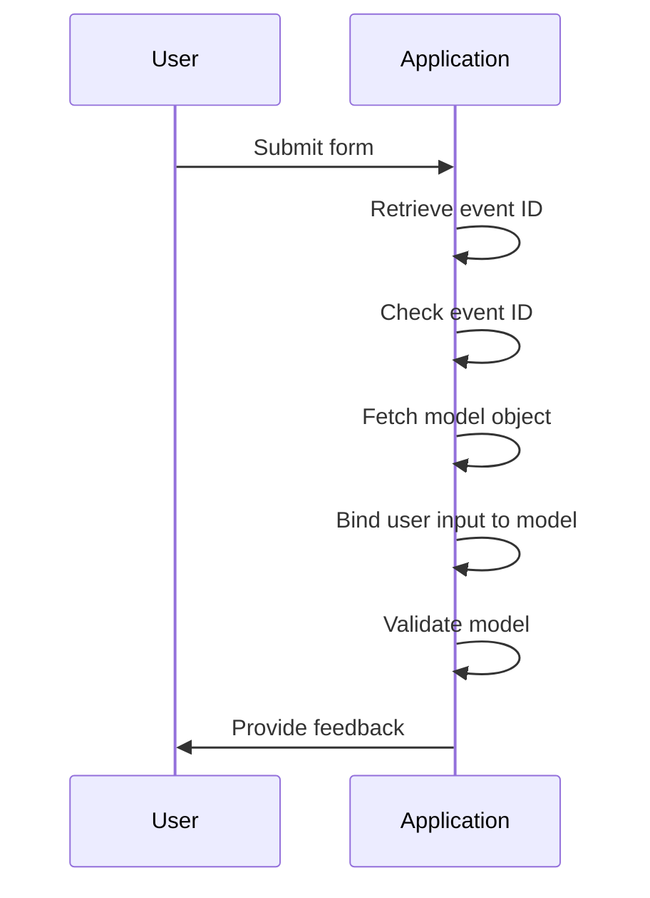

```mermaid
graph TD
  subgraph addDefaultMappings
    addDefaultMappings:A["Loop through parameter names"] --> addDefaultMappings:B["Check if parameter name starts with field marker prefix"]
    addDefaultMappings:B -->|Yes| addDefaultMappings:C["Extract field"]
    addDefaultMappings:C --> addDefaultMappings:D["Check if parameters contain field"]
    addDefaultMappings:D -->|No| addDefaultMappings:E["Call addEmptyValueMapping"]
    addDefaultMappings:B -->|No| addDefaultMappings:F["Call addDefaultMapping"]
  end
  subgraph addEmptyValueMapping
    addEmptyValueMapping:A["Create parser context"] --> addEmptyValueMapping:B["Parse empty value expression"]
    addEmptyValueMapping:B --> addEmptyValueMapping:C["Get property type"]
    addEmptyValueMapping:C --> addEmptyValueMapping:D["Create source expression"]
    addEmptyValueMapping:D --> addEmptyValueMapping:E["Create mapping"]
    addEmptyValueMapping:E --> addEmptyValueMapping:F["Add mapping"]
  end
  subgraph addDefaultMapping
    addDefaultMapping:A["Create source expression"] --> addDefaultMapping:B["Create parser context"]
    addDefaultMapping:B --> addDefaultMapping:C["Check model property"]
    addDefaultMapping:C -->|Yes| addDefaultMapping:D["Parse expression"]
    addDefaultMapping:D --> addDefaultMapping:E["Create mapping"]
    addDefaultMapping:E --> addDefaultMapping:F["Add mapping"]
  end
  addDefaultMappings:E --> addEmptyValueMapping
  addDefaultMappings:F --> addDefaultMapping

%% Swimm:
%% graph TD
%%   subgraph <SwmToken path="spring-webflow/src/main/java/org/springframework/webflow/mvc/view/AbstractMvcView.java" pos="397:1:1" line-data="			addDefaultMappings(mapper, requestParameters.asMap().keySet(), model);">`addDefaultMappings`</SwmToken>
%%     <SwmToken path="spring-webflow/src/main/java/org/springframework/webflow/mvc/view/AbstractMvcView.java" pos="397:1:1" line-data="			addDefaultMappings(mapper, requestParameters.asMap().keySet(), model);">`addDefaultMappings`</SwmToken>:A["Loop through parameter names"] --> <SwmToken path="spring-webflow/src/main/java/org/springframework/webflow/mvc/view/AbstractMvcView.java" pos="397:1:1" line-data="			addDefaultMappings(mapper, requestParameters.asMap().keySet(), model);">`addDefaultMappings`</SwmToken>:B["Check if parameter name starts with field marker prefix"]
%%     <SwmToken path="spring-webflow/src/main/java/org/springframework/webflow/mvc/view/AbstractMvcView.java" pos="397:1:1" line-data="			addDefaultMappings(mapper, requestParameters.asMap().keySet(), model);">`addDefaultMappings`</SwmToken>:B -->|Yes| <SwmToken path="spring-webflow/src/main/java/org/springframework/webflow/mvc/view/AbstractMvcView.java" pos="397:1:1" line-data="			addDefaultMappings(mapper, requestParameters.asMap().keySet(), model);">`addDefaultMappings`</SwmToken>:C["Extract field"]
%%     <SwmToken path="spring-webflow/src/main/java/org/springframework/webflow/mvc/view/AbstractMvcView.java" pos="397:1:1" line-data="			addDefaultMappings(mapper, requestParameters.asMap().keySet(), model);">`addDefaultMappings`</SwmToken>:C --> <SwmToken path="spring-webflow/src/main/java/org/springframework/webflow/mvc/view/AbstractMvcView.java" pos="397:1:1" line-data="			addDefaultMappings(mapper, requestParameters.asMap().keySet(), model);">`addDefaultMappings`</SwmToken>:D["Check if parameters contain field"]
%%     <SwmToken path="spring-webflow/src/main/java/org/springframework/webflow/mvc/view/AbstractMvcView.java" pos="397:1:1" line-data="			addDefaultMappings(mapper, requestParameters.asMap().keySet(), model);">`addDefaultMappings`</SwmToken>:D -->|No| <SwmToken path="spring-webflow/src/main/java/org/springframework/webflow/mvc/view/AbstractMvcView.java" pos="397:1:1" line-data="			addDefaultMappings(mapper, requestParameters.asMap().keySet(), model);">`addDefaultMappings`</SwmToken>:E["Call <SwmToken path="spring-webflow/src/main/java/org/springframework/webflow/mvc/view/AbstractMvcView.java" pos="420:1:1" line-data="					addEmptyValueMapping(mapper, parameterName, model);">`addEmptyValueMapping`</SwmToken>"]
%%     <SwmToken path="spring-webflow/src/main/java/org/springframework/webflow/mvc/view/AbstractMvcView.java" pos="397:1:1" line-data="			addDefaultMappings(mapper, requestParameters.asMap().keySet(), model);">`addDefaultMappings`</SwmToken>:B -->|No| <SwmToken path="spring-webflow/src/main/java/org/springframework/webflow/mvc/view/AbstractMvcView.java" pos="397:1:1" line-data="			addDefaultMappings(mapper, requestParameters.asMap().keySet(), model);">`addDefaultMappings`</SwmToken>:F["Call <SwmToken path="spring-webflow/src/main/java/org/springframework/webflow/mvc/view/AbstractMvcView.java" pos="478:1:1" line-data="				addDefaultMapping(mapper, parameterName, model);">`addDefaultMapping`</SwmToken>"]
%%   end
%%   subgraph <SwmToken path="spring-webflow/src/main/java/org/springframework/webflow/mvc/view/AbstractMvcView.java" pos="420:1:1" line-data="					addEmptyValueMapping(mapper, parameterName, model);">`addEmptyValueMapping`</SwmToken>
%%     <SwmToken path="spring-webflow/src/main/java/org/springframework/webflow/mvc/view/AbstractMvcView.java" pos="420:1:1" line-data="					addEmptyValueMapping(mapper, parameterName, model);">`addEmptyValueMapping`</SwmToken>:A["Create parser context"] --> <SwmToken path="spring-webflow/src/main/java/org/springframework/webflow/mvc/view/AbstractMvcView.java" pos="420:1:1" line-data="					addEmptyValueMapping(mapper, parameterName, model);">`addEmptyValueMapping`</SwmToken>:B["Parse empty value expression"]
%%     <SwmToken path="spring-webflow/src/main/java/org/springframework/webflow/mvc/view/AbstractMvcView.java" pos="420:1:1" line-data="					addEmptyValueMapping(mapper, parameterName, model);">`addEmptyValueMapping`</SwmToken>:B --> <SwmToken path="spring-webflow/src/main/java/org/springframework/webflow/mvc/view/AbstractMvcView.java" pos="420:1:1" line-data="					addEmptyValueMapping(mapper, parameterName, model);">`addEmptyValueMapping`</SwmToken>:C["Get property type"]
%%     <SwmToken path="spring-webflow/src/main/java/org/springframework/webflow/mvc/view/AbstractMvcView.java" pos="420:1:1" line-data="					addEmptyValueMapping(mapper, parameterName, model);">`addEmptyValueMapping`</SwmToken>:C --> <SwmToken path="spring-webflow/src/main/java/org/springframework/webflow/mvc/view/AbstractMvcView.java" pos="420:1:1" line-data="					addEmptyValueMapping(mapper, parameterName, model);">`addEmptyValueMapping`</SwmToken>:D["Create source expression"]
%%     <SwmToken path="spring-webflow/src/main/java/org/springframework/webflow/mvc/view/AbstractMvcView.java" pos="420:1:1" line-data="					addEmptyValueMapping(mapper, parameterName, model);">`addEmptyValueMapping`</SwmToken>:D --> <SwmToken path="spring-webflow/src/main/java/org/springframework/webflow/mvc/view/AbstractMvcView.java" pos="420:1:1" line-data="					addEmptyValueMapping(mapper, parameterName, model);">`addEmptyValueMapping`</SwmToken>:E["Create mapping"]
%%     <SwmToken path="spring-webflow/src/main/java/org/springframework/webflow/mvc/view/AbstractMvcView.java" pos="420:1:1" line-data="					addEmptyValueMapping(mapper, parameterName, model);">`addEmptyValueMapping`</SwmToken>:E --> <SwmToken path="spring-webflow/src/main/java/org/springframework/webflow/mvc/view/AbstractMvcView.java" pos="420:1:1" line-data="					addEmptyValueMapping(mapper, parameterName, model);">`addEmptyValueMapping`</SwmToken>:F["Add mapping"]
%%   end
%%   subgraph <SwmToken path="spring-webflow/src/main/java/org/springframework/webflow/mvc/view/AbstractMvcView.java" pos="478:1:1" line-data="				addDefaultMapping(mapper, parameterName, model);">`addDefaultMapping`</SwmToken>
%%     <SwmToken path="spring-webflow/src/main/java/org/springframework/webflow/mvc/view/AbstractMvcView.java" pos="478:1:1" line-data="				addDefaultMapping(mapper, parameterName, model);">`addDefaultMapping`</SwmToken>:A["Create source expression"] --> <SwmToken path="spring-webflow/src/main/java/org/springframework/webflow/mvc/view/AbstractMvcView.java" pos="478:1:1" line-data="				addDefaultMapping(mapper, parameterName, model);">`addDefaultMapping`</SwmToken>:B["Create parser context"]
%%     <SwmToken path="spring-webflow/src/main/java/org/springframework/webflow/mvc/view/AbstractMvcView.java" pos="478:1:1" line-data="				addDefaultMapping(mapper, parameterName, model);">`addDefaultMapping`</SwmToken>:B --> <SwmToken path="spring-webflow/src/main/java/org/springframework/webflow/mvc/view/AbstractMvcView.java" pos="478:1:1" line-data="				addDefaultMapping(mapper, parameterName, model);">`addDefaultMapping`</SwmToken>:C["Check model property"]
%%     <SwmToken path="spring-webflow/src/main/java/org/springframework/webflow/mvc/view/AbstractMvcView.java" pos="478:1:1" line-data="				addDefaultMapping(mapper, parameterName, model);">`addDefaultMapping`</SwmToken>:C -->|Yes| <SwmToken path="spring-webflow/src/main/java/org/springframework/webflow/mvc/view/AbstractMvcView.java" pos="478:1:1" line-data="				addDefaultMapping(mapper, parameterName, model);">`addDefaultMapping`</SwmToken>:D["Parse expression"]
%%     <SwmToken path="spring-webflow/src/main/java/org/springframework/webflow/mvc/view/AbstractMvcView.java" pos="478:1:1" line-data="				addDefaultMapping(mapper, parameterName, model);">`addDefaultMapping`</SwmToken>:D --> <SwmToken path="spring-webflow/src/main/java/org/springframework/webflow/mvc/view/AbstractMvcView.java" pos="478:1:1" line-data="				addDefaultMapping(mapper, parameterName, model);">`addDefaultMapping`</SwmToken>:E["Create mapping"]
%%     <SwmToken path="spring-webflow/src/main/java/org/springframework/webflow/mvc/view/AbstractMvcView.java" pos="478:1:1" line-data="				addDefaultMapping(mapper, parameterName, model);">`addDefaultMapping`</SwmToken>:E --> <SwmToken path="spring-webflow/src/main/java/org/springframework/webflow/mvc/view/AbstractMvcView.java" pos="478:1:1" line-data="				addDefaultMapping(mapper, parameterName, model);">`addDefaultMapping`</SwmToken>:F["Add mapping"]
%%   end
%%   <SwmToken path="spring-webflow/src/main/java/org/springframework/webflow/mvc/view/AbstractMvcView.java" pos="397:1:1" line-data="			addDefaultMappings(mapper, requestParameters.asMap().keySet(), model);">`addDefaultMappings`</SwmToken>:E --> <SwmToken path="spring-webflow/src/main/java/org/springframework/webflow/mvc/view/AbstractMvcView.java" pos="420:1:1" line-data="					addEmptyValueMapping(mapper, parameterName, model);">`addEmptyValueMapping`</SwmToken>
%%   <SwmToken path="spring-webflow/src/main/java/org/springframework/webflow/mvc/view/AbstractMvcView.java" pos="397:1:1" line-data="			addDefaultMappings(mapper, requestParameters.asMap().keySet(), model);">`addDefaultMappings`</SwmToken>:F --> <SwmToken path="spring-webflow/src/main/java/org/springframework/webflow/mvc/view/AbstractMvcView.java" pos="478:1:1" line-data="				addDefaultMapping(mapper, parameterName, model);">`addDefaultMapping`</SwmToken>
```

```mermaid
graph TD
  subgraph addModelBindings
    addModelBindings:A["Iterate through bindings"] --> addModelBindings:B["Get property of binding"]
    addModelBindings:B --> addModelBindings:C["Check if parameter name exists"]
    addModelBindings:C -->|Exists| addModelBindings:D["Add mapping"]
    addModelBindings:C -->|Does not exist| addModelBindings:E["Check if field marker prefix is set"]
    addModelBindings:E -->|Field marker prefix set| addModelBindings:F["Check if parameter name with prefix exists"]
    addModelBindings:F -->|Exists| addModelBindings:G["Add empty value mapping"]
  end

%% Swimm:
%% graph TD
%%   subgraph <SwmToken path="spring-webflow/src/main/java/org/springframework/webflow/mvc/view/AbstractMvcView.java" pos="395:1:1" line-data="			addModelBindings(mapper, requestParameters.asMap().keySet(), model);">`addModelBindings`</SwmToken>
%%     <SwmToken path="spring-webflow/src/main/java/org/springframework/webflow/mvc/view/AbstractMvcView.java" pos="395:1:1" line-data="			addModelBindings(mapper, requestParameters.asMap().keySet(), model);">`addModelBindings`</SwmToken>:A["Iterate through bindings"] --> <SwmToken path="spring-webflow/src/main/java/org/springframework/webflow/mvc/view/AbstractMvcView.java" pos="395:1:1" line-data="			addModelBindings(mapper, requestParameters.asMap().keySet(), model);">`addModelBindings`</SwmToken>:B["Get property of binding"]
%%     <SwmToken path="spring-webflow/src/main/java/org/springframework/webflow/mvc/view/AbstractMvcView.java" pos="395:1:1" line-data="			addModelBindings(mapper, requestParameters.asMap().keySet(), model);">`addModelBindings`</SwmToken>:B --> <SwmToken path="spring-webflow/src/main/java/org/springframework/webflow/mvc/view/AbstractMvcView.java" pos="395:1:1" line-data="			addModelBindings(mapper, requestParameters.asMap().keySet(), model);">`addModelBindings`</SwmToken>:C["Check if parameter name exists"]
%%     <SwmToken path="spring-webflow/src/main/java/org/springframework/webflow/mvc/view/AbstractMvcView.java" pos="395:1:1" line-data="			addModelBindings(mapper, requestParameters.asMap().keySet(), model);">`addModelBindings`</SwmToken>:C -->|Exists| <SwmToken path="spring-webflow/src/main/java/org/springframework/webflow/mvc/view/AbstractMvcView.java" pos="395:1:1" line-data="			addModelBindings(mapper, requestParameters.asMap().keySet(), model);">`addModelBindings`</SwmToken>:D["Add mapping"]
%%     <SwmToken path="spring-webflow/src/main/java/org/springframework/webflow/mvc/view/AbstractMvcView.java" pos="395:1:1" line-data="			addModelBindings(mapper, requestParameters.asMap().keySet(), model);">`addModelBindings`</SwmToken>:C -->|Does not exist| <SwmToken path="spring-webflow/src/main/java/org/springframework/webflow/mvc/view/AbstractMvcView.java" pos="395:1:1" line-data="			addModelBindings(mapper, requestParameters.asMap().keySet(), model);">`addModelBindings`</SwmToken>:E["Check if field marker prefix is set"]
%%     <SwmToken path="spring-webflow/src/main/java/org/springframework/webflow/mvc/view/AbstractMvcView.java" pos="395:1:1" line-data="			addModelBindings(mapper, requestParameters.asMap().keySet(), model);">`addModelBindings`</SwmToken>:E -->|Field marker prefix set| <SwmToken path="spring-webflow/src/main/java/org/springframework/webflow/mvc/view/AbstractMvcView.java" pos="395:1:1" line-data="			addModelBindings(mapper, requestParameters.asMap().keySet(), model);">`addModelBindings`</SwmToken>:F["Check if parameter name with prefix exists"]
%%     <SwmToken path="spring-webflow/src/main/java/org/springframework/webflow/mvc/view/AbstractMvcView.java" pos="395:1:1" line-data="			addModelBindings(mapper, requestParameters.asMap().keySet(), model);">`addModelBindings`</SwmToken>:F -->|Exists| <SwmToken path="spring-webflow/src/main/java/org/springframework/webflow/mvc/view/AbstractMvcView.java" pos="395:1:1" line-data="			addModelBindings(mapper, requestParameters.asMap().keySet(), model);">`addModelBindings`</SwmToken>:G["Add empty value mapping"]
%%   end
```

```mermaid
graph TD
  subgraph addErrorMessages
    addErrorMessages:A["Retrieve a list of mapping results that meet criteria"] --> addErrorMessages:B["Iterate over each error"]
    addErrorMessages:B --> addErrorMessages:C["Add message to request context"]
    addErrorMessages:C --> addErrorMessages:D["Call createMessageResolver"]
  end
  subgraph createMessageResolver
    createMessageResolver:A["Get model expression"] --> createMessageResolver:B["Get field from error mapping"]
    createMessageResolver:B --> createMessageResolver:C["Get field type"]
    createMessageResolver:C --> createMessageResolver:D["Resolve message codes"]
    createMessageResolver:D --> createMessageResolver:E["Build and return error message"]
  end
  addErrorMessages:D --> createMessageResolver

%% Swimm:
%% graph TD
%%   subgraph <SwmToken path="spring-webflow/src/main/java/org/springframework/webflow/mvc/view/AbstractMvcView.java" pos="238:1:1" line-data="					addErrorMessages(mappingResults);">`addErrorMessages`</SwmToken>
%%     <SwmToken path="spring-webflow/src/main/java/org/springframework/webflow/mvc/view/AbstractMvcView.java" pos="238:1:1" line-data="					addErrorMessages(mappingResults);">`addErrorMessages`</SwmToken>:A["Retrieve a list of mapping results that meet criteria"] --> <SwmToken path="spring-webflow/src/main/java/org/springframework/webflow/mvc/view/AbstractMvcView.java" pos="238:1:1" line-data="					addErrorMessages(mappingResults);">`addErrorMessages`</SwmToken>:B["Iterate over each error"]
%%     <SwmToken path="spring-webflow/src/main/java/org/springframework/webflow/mvc/view/AbstractMvcView.java" pos="238:1:1" line-data="					addErrorMessages(mappingResults);">`addErrorMessages`</SwmToken>:B --> <SwmToken path="spring-webflow/src/main/java/org/springframework/webflow/mvc/view/AbstractMvcView.java" pos="238:1:1" line-data="					addErrorMessages(mappingResults);">`addErrorMessages`</SwmToken>:C["Add message to request context"]
%%     <SwmToken path="spring-webflow/src/main/java/org/springframework/webflow/mvc/view/AbstractMvcView.java" pos="238:1:1" line-data="					addErrorMessages(mappingResults);">`addErrorMessages`</SwmToken>:C --> <SwmToken path="spring-webflow/src/main/java/org/springframework/webflow/mvc/view/AbstractMvcView.java" pos="238:1:1" line-data="					addErrorMessages(mappingResults);">`addErrorMessages`</SwmToken>:D["Call <SwmToken path="spring-webflow/src/main/java/org/springframework/webflow/mvc/view/AbstractMvcView.java" pos="660:9:9" line-data="			requestContext.getMessageContext().addMessage(createMessageResolver(error));">`createMessageResolver`</SwmToken>"]
%%   end
%%   subgraph <SwmToken path="spring-webflow/src/main/java/org/springframework/webflow/mvc/view/AbstractMvcView.java" pos="660:9:9" line-data="			requestContext.getMessageContext().addMessage(createMessageResolver(error));">`createMessageResolver`</SwmToken>
%%     <SwmToken path="spring-webflow/src/main/java/org/springframework/webflow/mvc/view/AbstractMvcView.java" pos="660:9:9" line-data="			requestContext.getMessageContext().addMessage(createMessageResolver(error));">`createMessageResolver`</SwmToken>:A["Get model expression"] --> <SwmToken path="spring-webflow/src/main/java/org/springframework/webflow/mvc/view/AbstractMvcView.java" pos="660:9:9" line-data="			requestContext.getMessageContext().addMessage(createMessageResolver(error));">`createMessageResolver`</SwmToken>:B["Get field from error mapping"]
%%     <SwmToken path="spring-webflow/src/main/java/org/springframework/webflow/mvc/view/AbstractMvcView.java" pos="660:9:9" line-data="			requestContext.getMessageContext().addMessage(createMessageResolver(error));">`createMessageResolver`</SwmToken>:B --> <SwmToken path="spring-webflow/src/main/java/org/springframework/webflow/mvc/view/AbstractMvcView.java" pos="660:9:9" line-data="			requestContext.getMessageContext().addMessage(createMessageResolver(error));">`createMessageResolver`</SwmToken>:C["Get field type"]
%%     <SwmToken path="spring-webflow/src/main/java/org/springframework/webflow/mvc/view/AbstractMvcView.java" pos="660:9:9" line-data="			requestContext.getMessageContext().addMessage(createMessageResolver(error));">`createMessageResolver`</SwmToken>:C --> <SwmToken path="spring-webflow/src/main/java/org/springframework/webflow/mvc/view/AbstractMvcView.java" pos="660:9:9" line-data="			requestContext.getMessageContext().addMessage(createMessageResolver(error));">`createMessageResolver`</SwmToken>:D["Resolve message codes"]
%%     <SwmToken path="spring-webflow/src/main/java/org/springframework/webflow/mvc/view/AbstractMvcView.java" pos="660:9:9" line-data="			requestContext.getMessageContext().addMessage(createMessageResolver(error));">`createMessageResolver`</SwmToken>:D --> <SwmToken path="spring-webflow/src/main/java/org/springframework/webflow/mvc/view/AbstractMvcView.java" pos="660:9:9" line-data="			requestContext.getMessageContext().addMessage(createMessageResolver(error));">`createMessageResolver`</SwmToken>:E["Build and return error message"]
%%   end
%%   <SwmToken path="spring-webflow/src/main/java/org/springframework/webflow/mvc/view/AbstractMvcView.java" pos="238:1:1" line-data="					addErrorMessages(mappingResults);">`addErrorMessages`</SwmToken>:D --> <SwmToken path="spring-webflow/src/main/java/org/springframework/webflow/mvc/view/AbstractMvcView.java" pos="660:9:9" line-data="			requestContext.getMessageContext().addMessage(createMessageResolver(error));">`createMessageResolver`</SwmToken>
```

The flow of processing user events is essential for managing user interactions within the application. This flow ensures that user inputs are correctly handled, validated, and bound to the appropriate model objects.

For instance, when a user submits a form, the event ID is retrieved and checked for validity. If valid, the model object is fetched and updated with the user's input, ensuring the application state reflects the latest user actions.



Here is a high level diagram of the flow, showing only the most important functions:

```mermaid
graph TD;
      subgraph springwebflowsrcmainjavaorgspringframeworkwebflowmvcviewAbstractMvcViewjava[spring-webflow/…/view/AbstractMvcView.java]
0d24624810614a3e923e439b30424e097ba274ad34e82578c4cb3757b51390db(AbstractMvcView.processUserEvent) --> d50c54fca967d0e9b2d2b82c7720b56ead205745018f8da110ce8c89eb9ca1ba(AbstractMvcView.bind)
end

subgraph springwebflowsrcmainjavaorgspringframeworkwebflowmvcviewAbstractMvcViewjava[spring-webflow/…/view/AbstractMvcView.java]
0d24624810614a3e923e439b30424e097ba274ad34e82578c4cb3757b51390db(AbstractMvcView.processUserEvent) --> 77aa459f9f0990f9759e29e511e3807b2b49a0cd45018a50c72698d4142dd8a2(AbstractMvcView.addErrorMessages)
end

subgraph springwebflowsrcmainjavaorgspringframeworkwebflowmvcviewAbstractMvcViewjava[spring-webflow/…/view/AbstractMvcView.java]
d50c54fca967d0e9b2d2b82c7720b56ead205745018f8da110ce8c89eb9ca1ba(AbstractMvcView.bind) --> e1f41f4bb1ee131c7c2f8e36b8641422d3230d9caba4cf6c47b4a29683558072(AbstractMvcView.addDefaultMappings)
end

subgraph springwebflowsrcmainjavaorgspringframeworkwebflowmvcviewAbstractMvcViewjava[spring-webflow/…/view/AbstractMvcView.java]
d50c54fca967d0e9b2d2b82c7720b56ead205745018f8da110ce8c89eb9ca1ba(AbstractMvcView.bind) --> 7b173d3f7bc9da3af62803db63a0ec5792d4cefec88c1e989b8a38ea098836bd(AbstractMvcView.addModelBindings)
end

subgraph springwebflowsrcmainjavaorgspringframeworkwebflowmvcviewAbstractMvcViewjava[spring-webflow/…/view/AbstractMvcView.java]
e1f41f4bb1ee131c7c2f8e36b8641422d3230d9caba4cf6c47b4a29683558072(AbstractMvcView.addDefaultMappings) --> 743db0ce289250c7ad33928a21a6c03b8465bd650ed15e084f92052496bdc617(AbstractMvcView.addEmptyValueMapping)
end

subgraph springwebflowsrcmainjavaorgspringframeworkwebflowmvcviewAbstractMvcViewjava[spring-webflow/…/view/AbstractMvcView.java]
e1f41f4bb1ee131c7c2f8e36b8641422d3230d9caba4cf6c47b4a29683558072(AbstractMvcView.addDefaultMappings) --> e96d00a461278e47d8c09249bd6ea889b227a00e757b9ff8b35dc72568804976(AbstractMvcView.addDefaultMapping)
end

subgraph springwebflowsrcmainjavaorgspringframeworkwebflowmvcviewAbstractMvcViewjava[spring-webflow/…/view/AbstractMvcView.java]
7b173d3f7bc9da3af62803db63a0ec5792d4cefec88c1e989b8a38ea098836bd(AbstractMvcView.addModelBindings) --> 743db0ce289250c7ad33928a21a6c03b8465bd650ed15e084f92052496bdc617(AbstractMvcView.addEmptyValueMapping)
end

subgraph springwebflowsrcmainjavaorgspringframeworkwebflowmvcviewAbstractMvcViewjava[spring-webflow/…/view/AbstractMvcView.java]
77aa459f9f0990f9759e29e511e3807b2b49a0cd45018a50c72698d4142dd8a2(AbstractMvcView.addErrorMessages) --> 3ee2a2d13f72562d59b713eef6bfe591ce8df025915d5d2a0f3fd4d0a0039829(AbstractMvcView.createMessageResolver)
end


      classDef mainFlowStyle color:#000000,fill:#7CB9F4
classDef rootsStyle color:#000000,fill:#00FFF4
classDef Style1 color:#000000,fill:#00FFAA
classDef Style2 color:#000000,fill:#FFFF00
classDef Style3 color:#000000,fill:#AA7CB9

%% Swimm:
%% graph TD;
%%       subgraph springwebflowsrcmainjavaorgspringframeworkwebflowmvcviewAbstractMvcViewjava[<SwmPath>[spring-webflow/…/view/AbstractMvcView.java](spring-webflow/src/main/java/org/springframework/webflow/mvc/view/AbstractMvcView.java)</SwmPath>]
%% 0d24624810614a3e923e439b30424e097ba274ad34e82578c4cb3757b51390db(AbstractMvcView.processUserEvent) --> d50c54fca967d0e9b2d2b82c7720b56ead205745018f8da110ce8c89eb9ca1ba(AbstractMvcView.bind)
%% end
%% 
%% subgraph springwebflowsrcmainjavaorgspringframeworkwebflowmvcviewAbstractMvcViewjava[<SwmPath>[spring-webflow/…/view/AbstractMvcView.java](spring-webflow/src/main/java/org/springframework/webflow/mvc/view/AbstractMvcView.java)</SwmPath>]
%% 0d24624810614a3e923e439b30424e097ba274ad34e82578c4cb3757b51390db(AbstractMvcView.processUserEvent) --> 77aa459f9f0990f9759e29e511e3807b2b49a0cd45018a50c72698d4142dd8a2(AbstractMvcView.addErrorMessages)
%% end
%% 
%% subgraph springwebflowsrcmainjavaorgspringframeworkwebflowmvcviewAbstractMvcViewjava[<SwmPath>[spring-webflow/…/view/AbstractMvcView.java](spring-webflow/src/main/java/org/springframework/webflow/mvc/view/AbstractMvcView.java)</SwmPath>]
%% d50c54fca967d0e9b2d2b82c7720b56ead205745018f8da110ce8c89eb9ca1ba(AbstractMvcView.bind) --> e1f41f4bb1ee131c7c2f8e36b8641422d3230d9caba4cf6c47b4a29683558072(AbstractMvcView.addDefaultMappings)
%% end
%% 
%% subgraph springwebflowsrcmainjavaorgspringframeworkwebflowmvcviewAbstractMvcViewjava[<SwmPath>[spring-webflow/…/view/AbstractMvcView.java](spring-webflow/src/main/java/org/springframework/webflow/mvc/view/AbstractMvcView.java)</SwmPath>]
%% d50c54fca967d0e9b2d2b82c7720b56ead205745018f8da110ce8c89eb9ca1ba(AbstractMvcView.bind) --> 7b173d3f7bc9da3af62803db63a0ec5792d4cefec88c1e989b8a38ea098836bd(AbstractMvcView.addModelBindings)
%% end
%% 
%% subgraph springwebflowsrcmainjavaorgspringframeworkwebflowmvcviewAbstractMvcViewjava[<SwmPath>[spring-webflow/…/view/AbstractMvcView.java](spring-webflow/src/main/java/org/springframework/webflow/mvc/view/AbstractMvcView.java)</SwmPath>]
%% e1f41f4bb1ee131c7c2f8e36b8641422d3230d9caba4cf6c47b4a29683558072(AbstractMvcView.addDefaultMappings) --> 743db0ce289250c7ad33928a21a6c03b8465bd650ed15e084f92052496bdc617(AbstractMvcView.addEmptyValueMapping)
%% end
%% 
%% subgraph springwebflowsrcmainjavaorgspringframeworkwebflowmvcviewAbstractMvcViewjava[<SwmPath>[spring-webflow/…/view/AbstractMvcView.java](spring-webflow/src/main/java/org/springframework/webflow/mvc/view/AbstractMvcView.java)</SwmPath>]
%% e1f41f4bb1ee131c7c2f8e36b8641422d3230d9caba4cf6c47b4a29683558072(AbstractMvcView.addDefaultMappings) --> e96d00a461278e47d8c09249bd6ea889b227a00e757b9ff8b35dc72568804976(AbstractMvcView.addDefaultMapping)
%% end
%% 
%% subgraph springwebflowsrcmainjavaorgspringframeworkwebflowmvcviewAbstractMvcViewjava[<SwmPath>[spring-webflow/…/view/AbstractMvcView.java](spring-webflow/src/main/java/org/springframework/webflow/mvc/view/AbstractMvcView.java)</SwmPath>]
%% 7b173d3f7bc9da3af62803db63a0ec5792d4cefec88c1e989b8a38ea098836bd(AbstractMvcView.addModelBindings) --> 743db0ce289250c7ad33928a21a6c03b8465bd650ed15e084f92052496bdc617(AbstractMvcView.addEmptyValueMapping)
%% end
%% 
%% subgraph springwebflowsrcmainjavaorgspringframeworkwebflowmvcviewAbstractMvcViewjava[<SwmPath>[spring-webflow/…/view/AbstractMvcView.java](spring-webflow/src/main/java/org/springframework/webflow/mvc/view/AbstractMvcView.java)</SwmPath>]
%% 77aa459f9f0990f9759e29e511e3807b2b49a0cd45018a50c72698d4142dd8a2(AbstractMvcView.addErrorMessages) --> 3ee2a2d13f72562d59b713eef6bfe591ce8df025915d5d2a0f3fd4d0a0039829(AbstractMvcView.createMessageResolver)
%% end
%% 
%% 
%%       classDef mainFlowStyle color:#000000,fill:#7CB9F4
%% classDef rootsStyle color:#000000,fill:#00FFF4
%% classDef Style1 color:#000000,fill:#00FFAA
%% classDef Style2 color:#000000,fill:#FFFF00
%% classDef Style3 color:#000000,fill:#AA7CB9
```



# Flow drill down

```mermaid
graph TD
  subgraph processUserEvent
    processUserEvent:A["Get event ID"] --> processUserEvent:B["Check if event ID is null"]
    processUserEvent:B -->|Not Null| processUserEvent:C["Logging user event ID"]
    processUserEvent:C --> processUserEvent:D["Get model object"]
    processUserEvent:D --> processUserEvent:E["Check if model object is null"]
    processUserEvent:E -->|Not Null| processUserEvent:F["Logging resolved model"]
    processUserEvent:F --> processUserEvent:G["Get matching transition"]
    processUserEvent:G --> processUserEvent:H["Check if should bind model"]
    processUserEvent:H -->|Should Bind| processUserEvent:I["Bind model"]
    processUserEvent:I --> processUserEvent:J["Check if has errors"]
    processUserEvent:J -->|Has Errors| processUserEvent:K["Logging and adding error messages"]
    processUserEvent:I --> processUserEvent:L["Check if should validate model"]
    processUserEvent:L -->|Should Validate| processUserEvent:M["Validate model"]
    processUserEvent:I --> processUserEvent:N["Set user event processed to true"]
  end

%% Swimm:
%% graph TD
%%   subgraph <SwmToken path="spring-webflow/src/main/java/org/springframework/webflow/mvc/view/AbstractMvcView.java" pos="218:5:5" line-data="	public void processUserEvent() {">`processUserEvent`</SwmToken>
%%     <SwmToken path="spring-webflow/src/main/java/org/springframework/webflow/mvc/view/AbstractMvcView.java" pos="218:5:5" line-data="	public void processUserEvent() {">`processUserEvent`</SwmToken>:A["Get event ID"] --> <SwmToken path="spring-webflow/src/main/java/org/springframework/webflow/mvc/view/AbstractMvcView.java" pos="218:5:5" line-data="	public void processUserEvent() {">`processUserEvent`</SwmToken>:B["Check if event ID is null"]
%%     <SwmToken path="spring-webflow/src/main/java/org/springframework/webflow/mvc/view/AbstractMvcView.java" pos="218:5:5" line-data="	public void processUserEvent() {">`processUserEvent`</SwmToken>:B -->|Not Null| <SwmToken path="spring-webflow/src/main/java/org/springframework/webflow/mvc/view/AbstractMvcView.java" pos="218:5:5" line-data="	public void processUserEvent() {">`processUserEvent`</SwmToken>:C["Logging user event ID"]
%%     <SwmToken path="spring-webflow/src/main/java/org/springframework/webflow/mvc/view/AbstractMvcView.java" pos="218:5:5" line-data="	public void processUserEvent() {">`processUserEvent`</SwmToken>:C --> <SwmToken path="spring-webflow/src/main/java/org/springframework/webflow/mvc/view/AbstractMvcView.java" pos="218:5:5" line-data="	public void processUserEvent() {">`processUserEvent`</SwmToken>:D["Get model object"]
%%     <SwmToken path="spring-webflow/src/main/java/org/springframework/webflow/mvc/view/AbstractMvcView.java" pos="218:5:5" line-data="	public void processUserEvent() {">`processUserEvent`</SwmToken>:D --> <SwmToken path="spring-webflow/src/main/java/org/springframework/webflow/mvc/view/AbstractMvcView.java" pos="218:5:5" line-data="	public void processUserEvent() {">`processUserEvent`</SwmToken>:E["Check if model object is null"]
%%     <SwmToken path="spring-webflow/src/main/java/org/springframework/webflow/mvc/view/AbstractMvcView.java" pos="218:5:5" line-data="	public void processUserEvent() {">`processUserEvent`</SwmToken>:E -->|Not Null| <SwmToken path="spring-webflow/src/main/java/org/springframework/webflow/mvc/view/AbstractMvcView.java" pos="218:5:5" line-data="	public void processUserEvent() {">`processUserEvent`</SwmToken>:F["Logging resolved model"]
%%     <SwmToken path="spring-webflow/src/main/java/org/springframework/webflow/mvc/view/AbstractMvcView.java" pos="218:5:5" line-data="	public void processUserEvent() {">`processUserEvent`</SwmToken>:F --> <SwmToken path="spring-webflow/src/main/java/org/springframework/webflow/mvc/view/AbstractMvcView.java" pos="218:5:5" line-data="	public void processUserEvent() {">`processUserEvent`</SwmToken>:G["Get matching transition"]
%%     <SwmToken path="spring-webflow/src/main/java/org/springframework/webflow/mvc/view/AbstractMvcView.java" pos="218:5:5" line-data="	public void processUserEvent() {">`processUserEvent`</SwmToken>:G --> <SwmToken path="spring-webflow/src/main/java/org/springframework/webflow/mvc/view/AbstractMvcView.java" pos="218:5:5" line-data="	public void processUserEvent() {">`processUserEvent`</SwmToken>:H["Check if should bind model"]
%%     <SwmToken path="spring-webflow/src/main/java/org/springframework/webflow/mvc/view/AbstractMvcView.java" pos="218:5:5" line-data="	public void processUserEvent() {">`processUserEvent`</SwmToken>:H -->|Should Bind| <SwmToken path="spring-webflow/src/main/java/org/springframework/webflow/mvc/view/AbstractMvcView.java" pos="218:5:5" line-data="	public void processUserEvent() {">`processUserEvent`</SwmToken>:I["Bind model"]
%%     <SwmToken path="spring-webflow/src/main/java/org/springframework/webflow/mvc/view/AbstractMvcView.java" pos="218:5:5" line-data="	public void processUserEvent() {">`processUserEvent`</SwmToken>:I --> <SwmToken path="spring-webflow/src/main/java/org/springframework/webflow/mvc/view/AbstractMvcView.java" pos="218:5:5" line-data="	public void processUserEvent() {">`processUserEvent`</SwmToken>:J["Check if has errors"]
%%     <SwmToken path="spring-webflow/src/main/java/org/springframework/webflow/mvc/view/AbstractMvcView.java" pos="218:5:5" line-data="	public void processUserEvent() {">`processUserEvent`</SwmToken>:J -->|Has Errors| <SwmToken path="spring-webflow/src/main/java/org/springframework/webflow/mvc/view/AbstractMvcView.java" pos="218:5:5" line-data="	public void processUserEvent() {">`processUserEvent`</SwmToken>:K["Logging and adding error messages"]
%%     <SwmToken path="spring-webflow/src/main/java/org/springframework/webflow/mvc/view/AbstractMvcView.java" pos="218:5:5" line-data="	public void processUserEvent() {">`processUserEvent`</SwmToken>:I --> <SwmToken path="spring-webflow/src/main/java/org/springframework/webflow/mvc/view/AbstractMvcView.java" pos="218:5:5" line-data="	public void processUserEvent() {">`processUserEvent`</SwmToken>:L["Check if should validate model"]
%%     <SwmToken path="spring-webflow/src/main/java/org/springframework/webflow/mvc/view/AbstractMvcView.java" pos="218:5:5" line-data="	public void processUserEvent() {">`processUserEvent`</SwmToken>:L -->|Should Validate| <SwmToken path="spring-webflow/src/main/java/org/springframework/webflow/mvc/view/AbstractMvcView.java" pos="218:5:5" line-data="	public void processUserEvent() {">`processUserEvent`</SwmToken>:M["Validate model"]
%%     <SwmToken path="spring-webflow/src/main/java/org/springframework/webflow/mvc/view/AbstractMvcView.java" pos="218:5:5" line-data="	public void processUserEvent() {">`processUserEvent`</SwmToken>:I --> <SwmToken path="spring-webflow/src/main/java/org/springframework/webflow/mvc/view/AbstractMvcView.java" pos="218:5:5" line-data="	public void processUserEvent() {">`processUserEvent`</SwmToken>:N["Set user event processed to true"]
%%   end
```

## Breaking down <SwmToken path="spring-webflow/src/main/java/org/springframework/webflow/mvc/view/AbstractMvcView.java" pos="218:5:5" line-data="	public void processUserEvent() {">`processUserEvent`</SwmToken>



## Binding the Model

First, the <SwmToken path="spring-webflow/src/main/java/org/springframework/webflow/mvc/view/AbstractMvcView.java" pos="218:5:5" line-data="	public void processUserEvent() {">`processUserEvent`</SwmToken> method retrieves the event ID and checks if it is null. If the event ID is null, the method returns immediately, indicating that there is no user event to process. This ensures that only valid events are processed.

Next, the method retrieves the model object. If the model object is not null, it proceeds to resolve the model and log the resolved model for debugging purposes. This step is crucial as it ensures that there is a valid model to bind the user event data to.

<SwmSnippet path="/spring-webflow/src/main/java/org/springframework/webflow/mvc/view/AbstractMvcView.java" line="218">

---

Then, the method checks if the model should be bound to the event by evaluating the transition definition. If binding is required, it calls the <SwmToken path="spring-webflow/src/main/java/org/springframework/webflow/mvc/view/AbstractMvcView.java" pos="233:5:5" line-data="				mappingResults = bind(model);">`bind`</SwmToken> method to update the model from the request parameters, considering the binding configuration. This step ensures that the model is updated with the latest user input.

```java
	public void processUserEvent() {
		String eventId = getEventId();
		if (eventId == null) {
			return;
		}
		if (logger.isDebugEnabled()) {
			logger.debug("Processing user event '" + eventId + "'");
		}
		Object model = getModelObject();
		if (model != null) {
			if (logger.isDebugEnabled()) {
				logger.debug("Resolved model " + model);
			}
			TransitionDefinition transition = requestContext.getMatchingTransition(eventId);
			if (shouldBind(model, transition)) {
				mappingResults = bind(model);
```

---

</SwmSnippet>

<SwmSnippet path="/spring-webflow/src/main/java/org/springframework/webflow/mvc/view/AbstractMvcView.java" line="234">

---

Moving to the next step, the method checks if there are any errors in the mapping results. If errors are found, it logs the errors and calls the <SwmToken path="spring-webflow/src/main/java/org/springframework/webflow/mvc/view/AbstractMvcView.java" pos="238:1:1" line-data="					addErrorMessages(mappingResults);">`addErrorMessages`</SwmToken> method to add the error messages to the context. This step is important as it provides feedback to the user about any issues with their input.

```java
				if (hasErrors(mappingResults)) {
					if (logger.isDebugEnabled()) {
						logger.debug("Model binding resulted in errors; adding error messages to context");
					}
					addErrorMessages(mappingResults);
				}
```

---

</SwmSnippet>

## Diving into bind

```mermaid
graph TD
  subgraph bind
    bind:A["Log 'Binding to model'"] --> bind:B["Create DefaultMapper"]
    bind:B --> bind:C["Get request parameters"]
    bind:C --> bind:D{Is binder configured?}
    bind:D -->|Yes| bind:E["Use model bindings for mapping"]
    bind:D -->|No| bind:F["Use default mappings for mapping"]
    bind:E --> bind:G["Map request parameters to model"]
    bind:F --> bind:G
  end
  subgraph addModelBindings
    addModelBindings:A["Add model specific mappings"]
  end
  subgraph addDefaultMappings
    addDefaultMappings:A["Add default mappings for request parameters"]
  end

%% Swimm:
%% graph TD
%%   subgraph bind
%%     bind:A["Log 'Binding to model'"] --> bind:B["Create <SwmToken path="spring-webflow/src/main/java/org/springframework/webflow/mvc/view/AbstractMvcView.java" pos="470:7:7" line-data="	protected void addDefaultMappings(DefaultMapper mapper, Set&lt;String&gt; parameterNames, Object model) {">`DefaultMapper`</SwmToken>"]
%%     bind:B --> bind:C["Get request parameters"]
%%     bind:C --> bind:D{Is binder configured?}
%%     bind:D -->|Yes| bind:E["Use model bindings for mapping"]
%%     bind:D -->|No| bind:F["Use default mappings for mapping"]
%%     bind:E --> bind:G["Map request parameters to model"]
%%     bind:F --> bind:G
%%   end
%%   subgraph <SwmToken path="spring-webflow/src/main/java/org/springframework/webflow/mvc/view/AbstractMvcView.java" pos="395:1:1" line-data="			addModelBindings(mapper, requestParameters.asMap().keySet(), model);">`addModelBindings`</SwmToken>
%%     <SwmToken path="spring-webflow/src/main/java/org/springframework/webflow/mvc/view/AbstractMvcView.java" pos="395:1:1" line-data="			addModelBindings(mapper, requestParameters.asMap().keySet(), model);">`addModelBindings`</SwmToken>:A["Add model specific mappings"]
%%   end
%%   subgraph <SwmToken path="spring-webflow/src/main/java/org/springframework/webflow/mvc/view/AbstractMvcView.java" pos="397:1:1" line-data="			addDefaultMappings(mapper, requestParameters.asMap().keySet(), model);">`addDefaultMappings`</SwmToken>
%%     <SwmToken path="spring-webflow/src/main/java/org/springframework/webflow/mvc/view/AbstractMvcView.java" pos="397:1:1" line-data="			addDefaultMappings(mapper, requestParameters.asMap().keySet(), model);">`addDefaultMappings`</SwmToken>:A["Add default mappings for request parameters"]
%%   end
```



## Binding Request Parameters to Model

The <SwmToken path="spring-webflow/src/main/java/org/springframework/webflow/mvc/view/AbstractMvcView.java" pos="233:5:5" line-data="				mappingResults = bind(model);">`bind`</SwmToken> method is responsible for populating the model with information from request parameters. This ensures that the model reflects the current state of the request data, which is crucial for processing user inputs and maintaining state consistency.

<SwmSnippet path="/spring-webflow/src/main/java/org/springframework/webflow/mvc/view/AbstractMvcView.java" line="394">

---

First, the method checks if there is a binding configuration. If there is no binding configuration, it calls <SwmToken path="spring-webflow/src/main/java/org/springframework/webflow/mvc/view/AbstractMvcView.java" pos="397:1:1" line-data="			addDefaultMappings(mapper, requestParameters.asMap().keySet(), model);">`addDefaultMappings`</SwmToken> to add default mappings for all request parameters to the model. This step ensures that all relevant request parameters are considered for updating the model.

```java
		if (binderConfiguration != null) {
			addModelBindings(mapper, requestParameters.asMap().keySet(), model);
		} else {
			addDefaultMappings(mapper, requestParameters.asMap().keySet(), model);
		}
```

---

</SwmSnippet>

<SwmSnippet path="/spring-webflow/src/main/java/org/springframework/webflow/mvc/view/AbstractMvcView.java" line="394">

---

Next, if a binding configuration is present, the method calls <SwmToken path="spring-webflow/src/main/java/org/springframework/webflow/mvc/view/AbstractMvcView.java" pos="395:1:1" line-data="			addModelBindings(mapper, requestParameters.asMap().keySet(), model);">`addModelBindings`</SwmToken> to add specific model bindings based on the configuration. This allows for more granular control over which request parameters are used to update the model, ensuring that only the specified fields are considered.

```java
		if (binderConfiguration != null) {
			addModelBindings(mapper, requestParameters.asMap().keySet(), model);
		} else {
```

---

</SwmSnippet>

<SwmSnippet path="/spring-webflow/src/main/java/org/springframework/webflow/mvc/view/AbstractMvcView.java" line="399">

---

Finally, the method uses the <SwmToken path="spring-webflow/src/main/java/org/springframework/webflow/mvc/view/AbstractMvcView.java" pos="470:7:7" line-data="	protected void addDefaultMappings(DefaultMapper mapper, Set&lt;String&gt; parameterNames, Object model) {">`DefaultMapper`</SwmToken> to map the request parameters to the model. This step completes the binding process by applying the mappings and updating the model with the request data.

```java
		return mapper.map(requestParameters, model);
	}
```

---

</SwmSnippet>

## Zooming into <SwmToken path="spring-webflow/src/main/java/org/springframework/webflow/mvc/view/AbstractMvcView.java" pos="397:1:1" line-data="			addDefaultMappings(mapper, requestParameters.asMap().keySet(), model);">`addDefaultMappings`</SwmToken> & <SwmToken path="spring-webflow/src/main/java/org/springframework/webflow/mvc/view/AbstractMvcView.java" pos="420:1:1" line-data="					addEmptyValueMapping(mapper, parameterName, model);">`addEmptyValueMapping`</SwmToken> & <SwmToken path="spring-webflow/src/main/java/org/springframework/webflow/mvc/view/AbstractMvcView.java" pos="478:1:1" line-data="				addDefaultMapping(mapper, parameterName, model);">`addDefaultMapping`</SwmToken>



<SwmSnippet path="/spring-webflow/src/main/java/org/springframework/webflow/mvc/view/AbstractMvcView.java" line="470">

---

First, the <SwmToken path="spring-webflow/src/main/java/org/springframework/webflow/mvc/view/AbstractMvcView.java" pos="470:5:5" line-data="	protected void addDefaultMappings(DefaultMapper mapper, Set&lt;String&gt; parameterNames, Object model) {">`addDefaultMappings`</SwmToken> method iterates over all incoming request parameters. It checks if each parameter has a special field marker prefix. If a parameter has this prefix, it extracts the field name and checks if the field is not already present in the parameter names. If the field is not present, it calls the <SwmToken path="spring-webflow/src/main/java/org/springframework/webflow/mvc/view/AbstractMvcView.java" pos="475:1:1" line-data="					addEmptyValueMapping(mapper, field, model);">`addEmptyValueMapping`</SwmToken> method to add a mapping that sets the target field in the model to an empty value.

```java
	protected void addDefaultMappings(DefaultMapper mapper, Set<String> parameterNames, Object model) {
		for (String parameterName : parameterNames) {
			if (fieldMarkerPrefix != null && parameterName.startsWith(fieldMarkerPrefix)) {
				String field = parameterName.substring(fieldMarkerPrefix.length());
				if (!parameterNames.contains(field)) {
					addEmptyValueMapping(mapper, field, model);
				}
```

---

</SwmSnippet>

<SwmSnippet path="/spring-webflow/src/main/java/org/springframework/webflow/mvc/view/AbstractMvcView.java" line="478">

---

Next, if the parameter does not have the special field marker prefix, the <SwmToken path="spring-webflow/src/main/java/org/springframework/webflow/mvc/view/AbstractMvcView.java" pos="397:1:1" line-data="			addDefaultMappings(mapper, requestParameters.asMap().keySet(), model);">`addDefaultMappings`</SwmToken> method calls the <SwmToken path="spring-webflow/src/main/java/org/springframework/webflow/mvc/view/AbstractMvcView.java" pos="478:1:1" line-data="				addDefaultMapping(mapper, parameterName, model);">`addDefaultMapping`</SwmToken> method. This method adds a mapping between the request parameter name and a matching model field. It creates an expression for the request parameter and parses it to match the model field, then adds this mapping to the mapper.

```java
				addDefaultMapping(mapper, parameterName, model);
			}
```

---

</SwmSnippet>

<SwmSnippet path="/spring-webflow/src/main/java/org/springframework/webflow/mvc/view/AbstractMvcView.java" line="491">

---

Moving to the <SwmToken path="spring-webflow/src/main/java/org/springframework/webflow/mvc/view/AbstractMvcView.java" pos="491:5:5" line-data="	protected void addEmptyValueMapping(DefaultMapper mapper, String field, Object model) {">`addEmptyValueMapping`</SwmToken> method, it adds a special mapping that sets the target field on the model to an empty value, typically null. This is useful for handling cases where a request parameter is expected but not provided, ensuring the model field is explicitly set to an empty value.

```java
	protected void addEmptyValueMapping(DefaultMapper mapper, String field, Object model) {
		ParserContext parserContext = new SimpleParserContext(model.getClass());
		Expression target = emptyValueExpressionParser.parseExpression(field, parserContext);
		try {
			Class<?> propertyType = target.getValueType(model);
			Expression source = new StaticExpression(getEmptyValue(propertyType));
			DefaultMapping mapping = new DefaultMapping(source, target);
			if (logger.isDebugEnabled()) {
				logger.debug("Adding empty value mapping for parameter '" + field + "'");
			}
			mapper.addMapping(mapping);
```

---

</SwmSnippet>

<SwmSnippet path="/spring-webflow/src/main/java/org/springframework/webflow/mvc/view/AbstractMvcView.java" line="513">

---

Then, the <SwmToken path="spring-webflow/src/main/java/org/springframework/webflow/mvc/view/AbstractMvcView.java" pos="513:5:5" line-data="	protected void addDefaultMapping(DefaultMapper mapper, String parameter, Object model) {">`addDefaultMapping`</SwmToken> method adds a mapping between the given request parameter name and a matching model field. It creates an expression for the request parameter and parses it to match the model field. This ensures that the incoming request parameters are correctly mapped to the corresponding fields in the model, facilitating data binding and validation.

```java
	protected void addDefaultMapping(DefaultMapper mapper, String parameter, Object model) {
		Expression source = new RequestParameterExpression(parameter);
		ParserContext parserContext = new SimpleParserContext(model.getClass());
		if (expressionParser instanceof BeanWrapperExpressionParser || checkModelProperty(parameter, model)) {
			Expression target = expressionParser.parseExpression(parameter, parserContext);
			DefaultMapping mapping = new DefaultMapping(source, target);
			if (logger.isDebugEnabled()) {
				logger.debug("Adding default mapping for parameter '" + parameter + "'");
			}
			mapper.addMapping(mapping);
```

---

</SwmSnippet>

## A closer look at <SwmToken path="spring-webflow/src/main/java/org/springframework/webflow/mvc/view/AbstractMvcView.java" pos="395:1:1" line-data="			addModelBindings(mapper, requestParameters.asMap().keySet(), model);">`addModelBindings`</SwmToken>



<SwmSnippet path="/spring-webflow/src/main/java/org/springframework/webflow/mvc/view/AbstractMvcView.java" line="414">

---

First, the <SwmToken path="spring-webflow/src/main/java/org/springframework/webflow/mvc/view/AbstractMvcView.java" pos="395:1:1" line-data="			addModelBindings(mapper, requestParameters.asMap().keySet(), model);">`addModelBindings`</SwmToken> method iterates over each configured view binding. This step ensures that every binding is checked against the incoming request parameters.

```java
		for (Binding binding : binderConfiguration.getBindings()) {
```

---

</SwmSnippet>

<SwmSnippet path="/spring-webflow/src/main/java/org/springframework/webflow/mvc/view/AbstractMvcView.java" line="416">

---

Next, if an incoming request parameter matches a binding property, a mapping is added to bind the parameter to the model. This ensures that the model is populated with the correct values from the request.

```java
			if (parameterNames.contains(parameterName)) {
				addMapping(mapper, binding, model);
```

---

</SwmSnippet>

<SwmSnippet path="/spring-webflow/src/main/java/org/springframework/webflow/mvc/view/AbstractMvcView.java" line="418">

---

Then, if there is no matching incoming request parameter, the method checks for a special field marker prefix. If found, it adds a mapping to set the target field on the model to an empty value, typically null. This step ensures that fields without corresponding request parameters are correctly handled and set to empty values.

```java
			} else {
				if (fieldMarkerPrefix != null && parameterNames.contains(fieldMarkerPrefix + parameterName)) {
					addEmptyValueMapping(mapper, parameterName, model);
				}
```

---

</SwmSnippet>

## Inside <SwmToken path="spring-webflow/src/main/java/org/springframework/webflow/mvc/view/AbstractMvcView.java" pos="238:1:1" line-data="					addErrorMessages(mappingResults);">`addErrorMessages`</SwmToken> & <SwmToken path="spring-webflow/src/main/java/org/springframework/webflow/mvc/view/AbstractMvcView.java" pos="660:9:9" line-data="			requestContext.getMessageContext().addMessage(createMessageResolver(error));">`createMessageResolver`</SwmToken>



<SwmSnippet path="/spring-webflow/src/main/java/org/springframework/webflow/mvc/view/AbstractMvcView.java" line="657">

---

First, the <SwmToken path="spring-webflow/src/main/java/org/springframework/webflow/mvc/view/AbstractMvcView.java" pos="657:5:5" line-data="	private void addErrorMessages(MappingResults results) {">`addErrorMessages`</SwmToken> method is responsible for collecting all the mapping errors that occurred during the binding process. It retrieves these errors by calling <SwmToken path="spring-webflow/src/main/java/org/springframework/webflow/mvc/view/AbstractMvcView.java" pos="658:10:15" line-data="		List&lt;MappingResult&gt; errors = results.getResults(MAPPING_ERROR);">`results.getResults(MAPPING_ERROR)`</SwmToken>, which returns a list of mapping results that meet the error criteria.

```java
	private void addErrorMessages(MappingResults results) {
		List<MappingResult> errors = results.getResults(MAPPING_ERROR);
		for (MappingResult error : errors) {
```

---

</SwmSnippet>

<SwmSnippet path="/spring-webflow/src/main/java/org/springframework/webflow/mvc/view/AbstractMvcView.java" line="659">

---

Next, for each error in the list, the method adds a corresponding error message to the `MessageContext` of the <SwmToken path="spring-webflow/src/main/java/org/springframework/webflow/mvc/view/AbstractMvcView.java" pos="660:1:1" line-data="			requestContext.getMessageContext().addMessage(createMessageResolver(error));">`requestContext`</SwmToken>. This is done by calling <SwmToken path="spring-webflow/src/main/java/org/springframework/webflow/mvc/view/AbstractMvcView.java" pos="660:1:13" line-data="			requestContext.getMessageContext().addMessage(createMessageResolver(error));">`requestContext.getMessageContext().addMessage(createMessageResolver(error))`</SwmToken>, which uses the <SwmToken path="spring-webflow/src/main/java/org/springframework/webflow/mvc/view/AbstractMvcView.java" pos="660:9:9" line-data="			requestContext.getMessageContext().addMessage(createMessageResolver(error));">`createMessageResolver`</SwmToken> method to generate the appropriate message resolver for each error.

```java
		for (MappingResult error : errors) {
			requestContext.getMessageContext().addMessage(createMessageResolver(error));
		}
```

---

</SwmSnippet>

<SwmSnippet path="/spring-webflow/src/main/java/org/springframework/webflow/mvc/view/AbstractMvcView.java" line="664">

---

Moving to the <SwmToken path="spring-webflow/src/main/java/org/springframework/webflow/mvc/view/AbstractMvcView.java" pos="664:5:5" line-data="	protected MessageResolver createMessageResolver(MappingResult error) {">`createMessageResolver`</SwmToken> method, it constructs a <SwmToken path="spring-webflow/src/main/java/org/springframework/webflow/mvc/view/AbstractMvcView.java" pos="664:3:3" line-data="	protected MessageResolver createMessageResolver(MappingResult error) {">`MessageResolver`</SwmToken> object for a given mapping error. This method first extracts the model expression, field expression, and field type from the error object. It then resolves the message codes using the <SwmToken path="spring-webflow/src/main/java/org/springframework/webflow/mvc/view/AbstractMvcView.java" pos="668:9:9" line-data="		String[] messageCodes = messageCodesResolver.resolveMessageCodes(error.getCode(), model, field, fieldType);">`messageCodesResolver`</SwmToken>.

```java
	protected MessageResolver createMessageResolver(MappingResult error) {
		String model = getModelExpression().getExpressionString();
		String field = error.getMapping().getTargetExpression().getExpressionString();
		Class<?> fieldType = error.getMapping().getTargetExpression().getValueType(getModelObject());
		String[] messageCodes = messageCodesResolver.resolveMessageCodes(error.getCode(), model, field, fieldType);
```

---

</SwmSnippet>

<SwmSnippet path="/spring-webflow/src/main/java/org/springframework/webflow/mvc/view/AbstractMvcView.java" line="669">

---

Then, it builds the error message using the <SwmToken path="spring-webflow/src/main/java/org/springframework/webflow/mvc/view/AbstractMvcView.java" pos="669:5:5" line-data="		return new MessageBuilder().error().source(field).codes(messageCodes).resolvableArg(field)">`MessageBuilder`</SwmToken> class. The message includes the error code, the source field, and a default text that describes the error. This constructed message is then returned as a <SwmToken path="spring-webflow/src/main/java/org/springframework/webflow/mvc/view/AbstractMvcView.java" pos="664:3:3" line-data="	protected MessageResolver createMessageResolver(MappingResult error) {">`MessageResolver`</SwmToken> object.

```java
		return new MessageBuilder().error().source(field).codes(messageCodes).resolvableArg(field)
				.defaultText(error.getCode() + " on " + field).build();
	}
```

---

</SwmSnippet>

&nbsp;

*This is an auto-generated document by Swimm 🌊 and has not yet been verified by a human*

<SwmMeta version="3.0.0" repo-id="Z2l0aHViJTNBJTNBc3ByaW5nLXdlYmZsb3ctZGVtbyUzQSUzQWdpbGFkbmF2b3Q=" repo-name="spring-webflow-demo"><sup>Powered by [Swimm](/)</sup></SwmMeta>
