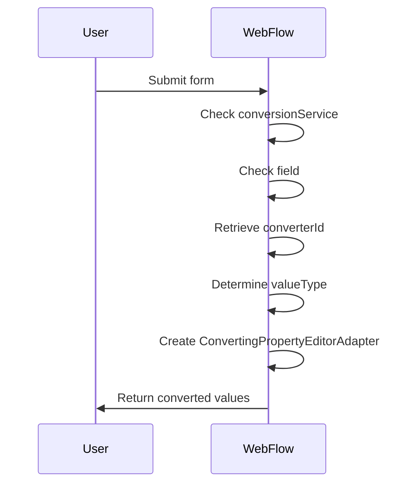
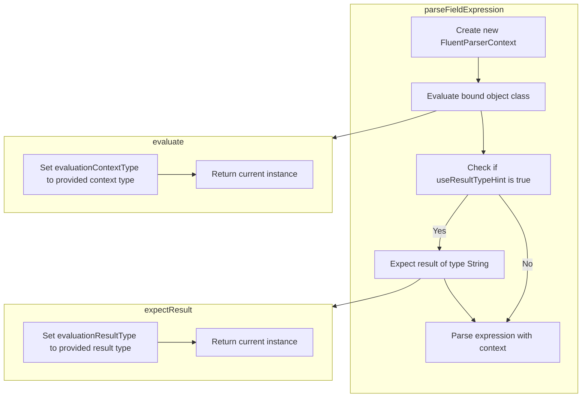
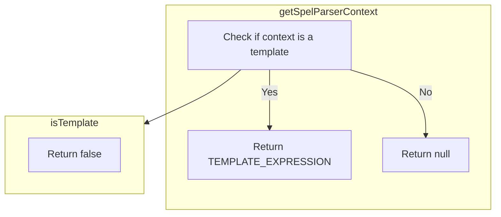
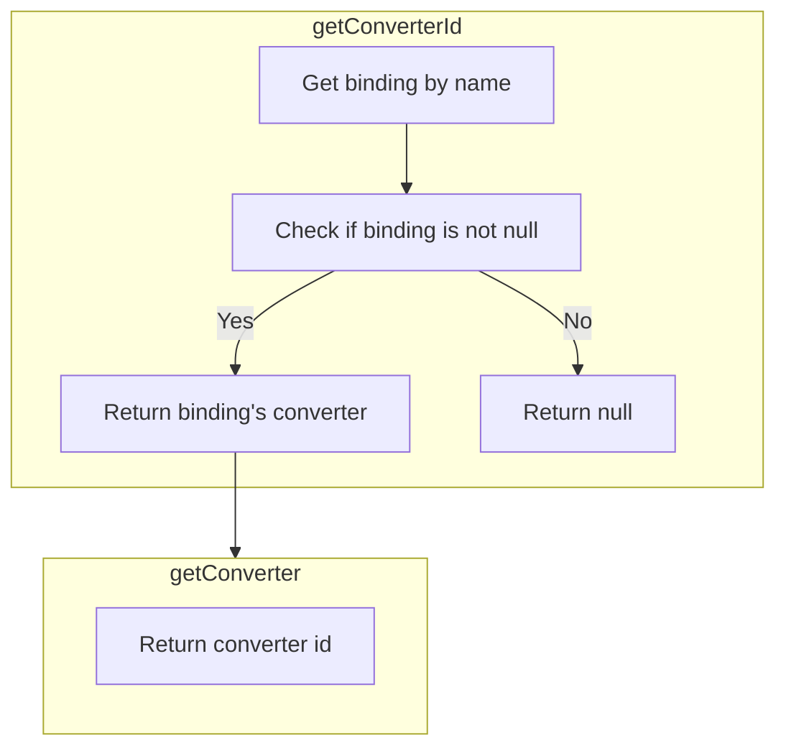

```mermaid
graph TD
  subgraph parseExpression
    parseExpression:A["Ensure expression is not empty"] --> parseExpression:B["Determine ParserContext"]
    parseExpression:B --> parseExpression:C["Parse spel expression variables"]
    parseExpression:C --> parseExpression:D["Parse spel expression"]
    parseExpression:D --> parseExpression:E["Get expected evaluation result type"]
    parseExpression:E --> parseExpression:F["Get delegate conversion service"]
    parseExpression:F --> parseExpression:G["Create or return SpringELExpression"]
  end
  subgraph createSpringELExpression
    createSpringELExpression:A["Receive expression variables"] --> createSpringELExpression:B["Return new SpringELExpression with properties"]
  end
  subgraph getDelegateConversionService
    getDelegateConversionService:A["Return delegate ConversionService"]
  end
  parseExpression:F --> getDelegateConversionService
  parseExpression:G --> createSpringELExpression

%% Swimm:
%% graph TD
%%   subgraph <SwmToken path="spring-webflow/src/main/java/org/springframework/webflow/mvc/view/BindingModel.java" pos="224:5:5" line-data="		return expressionParser.parseExpression(field, parserContext);">`parseExpression`</SwmToken>
%%     <SwmToken path="spring-webflow/src/main/java/org/springframework/webflow/mvc/view/BindingModel.java" pos="224:5:5" line-data="		return expressionParser.parseExpression(field, parserContext);">`parseExpression`</SwmToken>:A["Ensure expression is not empty"] --> <SwmToken path="spring-webflow/src/main/java/org/springframework/webflow/mvc/view/BindingModel.java" pos="224:5:5" line-data="		return expressionParser.parseExpression(field, parserContext);">`parseExpression`</SwmToken>:B["Determine <SwmToken path="spring-binding/src/main/java/org/springframework/binding/expression/spel/SpringELExpressionParser.java" pos="75:12:12" line-data="	public Expression parseExpression(String expression, ParserContext context) throws ParserException {">`ParserContext`</SwmToken>"]
%%     <SwmToken path="spring-webflow/src/main/java/org/springframework/webflow/mvc/view/BindingModel.java" pos="224:5:5" line-data="		return expressionParser.parseExpression(field, parserContext);">`parseExpression`</SwmToken>:B --> <SwmToken path="spring-webflow/src/main/java/org/springframework/webflow/mvc/view/BindingModel.java" pos="224:5:5" line-data="		return expressionParser.parseExpression(field, parserContext);">`parseExpression`</SwmToken>:C["Parse spel expression variables"]
%%     <SwmToken path="spring-webflow/src/main/java/org/springframework/webflow/mvc/view/BindingModel.java" pos="224:5:5" line-data="		return expressionParser.parseExpression(field, parserContext);">`parseExpression`</SwmToken>:C --> <SwmToken path="spring-webflow/src/main/java/org/springframework/webflow/mvc/view/BindingModel.java" pos="224:5:5" line-data="		return expressionParser.parseExpression(field, parserContext);">`parseExpression`</SwmToken>:D["Parse spel expression"]
%%     <SwmToken path="spring-webflow/src/main/java/org/springframework/webflow/mvc/view/BindingModel.java" pos="224:5:5" line-data="		return expressionParser.parseExpression(field, parserContext);">`parseExpression`</SwmToken>:D --> <SwmToken path="spring-webflow/src/main/java/org/springframework/webflow/mvc/view/BindingModel.java" pos="224:5:5" line-data="		return expressionParser.parseExpression(field, parserContext);">`parseExpression`</SwmToken>:E["Get expected evaluation result type"]
%%     <SwmToken path="spring-webflow/src/main/java/org/springframework/webflow/mvc/view/BindingModel.java" pos="224:5:5" line-data="		return expressionParser.parseExpression(field, parserContext);">`parseExpression`</SwmToken>:E --> <SwmToken path="spring-webflow/src/main/java/org/springframework/webflow/mvc/view/BindingModel.java" pos="224:5:5" line-data="		return expressionParser.parseExpression(field, parserContext);">`parseExpression`</SwmToken>:F["Get delegate conversion service"]
%%     <SwmToken path="spring-webflow/src/main/java/org/springframework/webflow/mvc/view/BindingModel.java" pos="224:5:5" line-data="		return expressionParser.parseExpression(field, parserContext);">`parseExpression`</SwmToken>:F --> <SwmToken path="spring-webflow/src/main/java/org/springframework/webflow/mvc/view/BindingModel.java" pos="224:5:5" line-data="		return expressionParser.parseExpression(field, parserContext);">`parseExpression`</SwmToken>:G["Create or return <SwmToken path="spring-binding/src/main/java/org/springframework/binding/expression/spel/SpringELExpressionParser.java" pos="98:3:3" line-data="	protected SpringELExpression createSpringELExpression(Map&lt;String, Expression&gt; expressionVars,">`SpringELExpression`</SwmToken>"]
%%   end
%%   subgraph <SwmToken path="spring-binding/src/main/java/org/springframework/binding/expression/spel/SpringELExpressionParser.java" pos="98:5:5" line-data="	protected SpringELExpression createSpringELExpression(Map&lt;String, Expression&gt; expressionVars,">`createSpringELExpression`</SwmToken>
%%     <SwmToken path="spring-binding/src/main/java/org/springframework/binding/expression/spel/SpringELExpressionParser.java" pos="98:5:5" line-data="	protected SpringELExpression createSpringELExpression(Map&lt;String, Expression&gt; expressionVars,">`createSpringELExpression`</SwmToken>:A["Receive expression variables"] --> <SwmToken path="spring-binding/src/main/java/org/springframework/binding/expression/spel/SpringELExpressionParser.java" pos="98:5:5" line-data="	protected SpringELExpression createSpringELExpression(Map&lt;String, Expression&gt; expressionVars,">`createSpringELExpression`</SwmToken>:B["Return new <SwmToken path="spring-binding/src/main/java/org/springframework/binding/expression/spel/SpringELExpressionParser.java" pos="98:3:3" line-data="	protected SpringELExpression createSpringELExpression(Map&lt;String, Expression&gt; expressionVars,">`SpringELExpression`</SwmToken> with properties"]
%%   end
%%   subgraph <SwmToken path="spring-binding/src/main/java/org/springframework/binding/expression/spel/SpringELExpressionParser.java" pos="84:17:17" line-data="		org.springframework.core.convert.ConversionService cs = conversionService.getDelegateConversionService();">`getDelegateConversionService`</SwmToken>
%%     <SwmToken path="spring-binding/src/main/java/org/springframework/binding/expression/spel/SpringELExpressionParser.java" pos="84:17:17" line-data="		org.springframework.core.convert.ConversionService cs = conversionService.getDelegateConversionService();">`getDelegateConversionService`</SwmToken>:A["Return delegate <SwmToken path="spring-binding/src/main/java/org/springframework/binding/expression/spel/SpringELExpressionParser.java" pos="84:9:9" line-data="		org.springframework.core.convert.ConversionService cs = conversionService.getDelegateConversionService();">`ConversionService`</SwmToken>"]
%%   end
%%   <SwmToken path="spring-webflow/src/main/java/org/springframework/webflow/mvc/view/BindingModel.java" pos="224:5:5" line-data="		return expressionParser.parseExpression(field, parserContext);">`parseExpression`</SwmToken>:F --> <SwmToken path="spring-binding/src/main/java/org/springframework/binding/expression/spel/SpringELExpressionParser.java" pos="84:17:17" line-data="		org.springframework.core.convert.ConversionService cs = conversionService.getDelegateConversionService();">`getDelegateConversionService`</SwmToken>
%%   <SwmToken path="spring-webflow/src/main/java/org/springframework/webflow/mvc/view/BindingModel.java" pos="224:5:5" line-data="		return expressionParser.parseExpression(field, parserContext);">`parseExpression`</SwmToken>:G --> <SwmToken path="spring-binding/src/main/java/org/springframework/binding/expression/spel/SpringELExpressionParser.java" pos="98:5:5" line-data="	protected SpringELExpression createSpringELExpression(Map&lt;String, Expression&gt; expressionVars,">`createSpringELExpression`</SwmToken>
```

```mermaid
graph TD
  subgraph parseSpelExpressionVariables
    parseSpelExpressionVariables:A["Check if array is empty"] -->|No| parseSpelExpressionVariables:B["Create result map"]
    parseSpelExpressionVariables:B --> parseSpelExpressionVariables:C["Iterate over ExpressionVariable array"]
    parseSpelExpressionVariables:C --> parseSpelExpressionVariables:D["Get variable name"]
    parseSpelExpressionVariables:D --> parseSpelExpressionVariables:E["Parse expression"]
    parseSpelExpressionVariables:E --> parseSpelExpressionVariables:F["Store in map"]
  end

  subgraph getName
    getName:A["Return the variable name"]
  end

  subgraph getValueExpression
    getValueExpression:A["Return the expression value"]
  end

  subgraph getParserContext
    getParserContext:A["Return the parser context"]
  end

  parseSpelExpressionVariables:D --> getName
  parseSpelExpressionVariables:E --> getValueExpression
  parseSpelExpressionVariables:E --> getParserContext

%% Swimm:
%% graph TD
%%   subgraph <SwmToken path="spring-binding/src/main/java/org/springframework/binding/expression/spel/SpringELExpressionParser.java" pos="80:13:13" line-data="		Map&lt;String, Expression&gt; expressionVars = parseSpelExpressionVariables(context.getExpressionVariables());">`parseSpelExpressionVariables`</SwmToken>
%%     <SwmToken path="spring-binding/src/main/java/org/springframework/binding/expression/spel/SpringELExpressionParser.java" pos="80:13:13" line-data="		Map&lt;String, Expression&gt; expressionVars = parseSpelExpressionVariables(context.getExpressionVariables());">`parseSpelExpressionVariables`</SwmToken>:A["Check if array is empty"] -->|No| <SwmToken path="spring-binding/src/main/java/org/springframework/binding/expression/spel/SpringELExpressionParser.java" pos="80:13:13" line-data="		Map&lt;String, Expression&gt; expressionVars = parseSpelExpressionVariables(context.getExpressionVariables());">`parseSpelExpressionVariables`</SwmToken>:B["Create result map"]
%%     <SwmToken path="spring-binding/src/main/java/org/springframework/binding/expression/spel/SpringELExpressionParser.java" pos="80:13:13" line-data="		Map&lt;String, Expression&gt; expressionVars = parseSpelExpressionVariables(context.getExpressionVariables());">`parseSpelExpressionVariables`</SwmToken>:B --> <SwmToken path="spring-binding/src/main/java/org/springframework/binding/expression/spel/SpringELExpressionParser.java" pos="80:13:13" line-data="		Map&lt;String, Expression&gt; expressionVars = parseSpelExpressionVariables(context.getExpressionVariables());">`parseSpelExpressionVariables`</SwmToken>:C["Iterate over <SwmToken path="spring-binding/src/main/java/org/springframework/binding/expression/spel/SpringELExpressionParser.java" pos="119:9:9" line-data="	 * Turn {@link ExpressionVariable}&#39;s (pairs of variable names and string expressions)">`ExpressionVariable`</SwmToken> array"]
%%     <SwmToken path="spring-binding/src/main/java/org/springframework/binding/expression/spel/SpringELExpressionParser.java" pos="80:13:13" line-data="		Map&lt;String, Expression&gt; expressionVars = parseSpelExpressionVariables(context.getExpressionVariables());">`parseSpelExpressionVariables`</SwmToken>:C --> <SwmToken path="spring-binding/src/main/java/org/springframework/binding/expression/spel/SpringELExpressionParser.java" pos="80:13:13" line-data="		Map&lt;String, Expression&gt; expressionVars = parseSpelExpressionVariables(context.getExpressionVariables());">`parseSpelExpressionVariables`</SwmToken>:D["Get variable name"]
%%     <SwmToken path="spring-binding/src/main/java/org/springframework/binding/expression/spel/SpringELExpressionParser.java" pos="80:13:13" line-data="		Map&lt;String, Expression&gt; expressionVars = parseSpelExpressionVariables(context.getExpressionVariables());">`parseSpelExpressionVariables`</SwmToken>:D --> <SwmToken path="spring-binding/src/main/java/org/springframework/binding/expression/spel/SpringELExpressionParser.java" pos="80:13:13" line-data="		Map&lt;String, Expression&gt; expressionVars = parseSpelExpressionVariables(context.getExpressionVariables());">`parseSpelExpressionVariables`</SwmToken>:E["Parse expression"]
%%     <SwmToken path="spring-binding/src/main/java/org/springframework/binding/expression/spel/SpringELExpressionParser.java" pos="80:13:13" line-data="		Map&lt;String, Expression&gt; expressionVars = parseSpelExpressionVariables(context.getExpressionVariables());">`parseSpelExpressionVariables`</SwmToken>:E --> <SwmToken path="spring-binding/src/main/java/org/springframework/binding/expression/spel/SpringELExpressionParser.java" pos="80:13:13" line-data="		Map&lt;String, Expression&gt; expressionVars = parseSpelExpressionVariables(context.getExpressionVariables());">`parseSpelExpressionVariables`</SwmToken>:F["Store in map"]
%%   end
%% 
%%   subgraph <SwmToken path="spring-binding/src/main/java/org/springframework/binding/expression/spel/SpringELExpressionParser.java" pos="132:7:7" line-data="			result.put(var.getName(), parseExpression(var.getValueExpression(), var.getParserContext()));">`getName`</SwmToken>
%%     <SwmToken path="spring-binding/src/main/java/org/springframework/binding/expression/spel/SpringELExpressionParser.java" pos="132:7:7" line-data="			result.put(var.getName(), parseExpression(var.getValueExpression(), var.getParserContext()));">`getName`</SwmToken>:A["Return the variable name"]
%%   end
%% 
%%   subgraph <SwmToken path="spring-binding/src/main/java/org/springframework/binding/expression/spel/SpringELExpressionParser.java" pos="132:16:16" line-data="			result.put(var.getName(), parseExpression(var.getValueExpression(), var.getParserContext()));">`getValueExpression`</SwmToken>
%%     <SwmToken path="spring-binding/src/main/java/org/springframework/binding/expression/spel/SpringELExpressionParser.java" pos="132:16:16" line-data="			result.put(var.getName(), parseExpression(var.getValueExpression(), var.getParserContext()));">`getValueExpression`</SwmToken>:A["Return the expression value"]
%%   end
%% 
%%   subgraph <SwmToken path="spring-binding/src/main/java/org/springframework/binding/expression/spel/SpringELExpressionParser.java" pos="132:23:23" line-data="			result.put(var.getName(), parseExpression(var.getValueExpression(), var.getParserContext()));">`getParserContext`</SwmToken>
%%     <SwmToken path="spring-binding/src/main/java/org/springframework/binding/expression/spel/SpringELExpressionParser.java" pos="132:23:23" line-data="			result.put(var.getName(), parseExpression(var.getValueExpression(), var.getParserContext()));">`getParserContext`</SwmToken>:A["Return the parser context"]
%%   end
%% 
%%   <SwmToken path="spring-binding/src/main/java/org/springframework/binding/expression/spel/SpringELExpressionParser.java" pos="80:13:13" line-data="		Map&lt;String, Expression&gt; expressionVars = parseSpelExpressionVariables(context.getExpressionVariables());">`parseSpelExpressionVariables`</SwmToken>:D --> <SwmToken path="spring-binding/src/main/java/org/springframework/binding/expression/spel/SpringELExpressionParser.java" pos="132:7:7" line-data="			result.put(var.getName(), parseExpression(var.getValueExpression(), var.getParserContext()));">`getName`</SwmToken>
%%   <SwmToken path="spring-binding/src/main/java/org/springframework/binding/expression/spel/SpringELExpressionParser.java" pos="80:13:13" line-data="		Map&lt;String, Expression&gt; expressionVars = parseSpelExpressionVariables(context.getExpressionVariables());">`parseSpelExpressionVariables`</SwmToken>:E --> <SwmToken path="spring-binding/src/main/java/org/springframework/binding/expression/spel/SpringELExpressionParser.java" pos="132:16:16" line-data="			result.put(var.getName(), parseExpression(var.getValueExpression(), var.getParserContext()));">`getValueExpression`</SwmToken>
%%   <SwmToken path="spring-binding/src/main/java/org/springframework/binding/expression/spel/SpringELExpressionParser.java" pos="80:13:13" line-data="		Map&lt;String, Expression&gt; expressionVars = parseSpelExpressionVariables(context.getExpressionVariables());">`parseSpelExpressionVariables`</SwmToken>:E --> <SwmToken path="spring-binding/src/main/java/org/springframework/binding/expression/spel/SpringELExpressionParser.java" pos="132:23:23" line-data="			result.put(var.getName(), parseExpression(var.getValueExpression(), var.getParserContext()));">`getParserContext`</SwmToken>
```

```mermaid
graph TD
  subgraph parseSpelExpression
    parseSpelExpression:A["Get Spel ParserContext"] --> parseSpelExpression:B["Check if Spel ParserContext is not null"]
    parseSpelExpression:B -->|Is not null| parseSpelExpression:C["Parse expression with Spel ParserContext"]
    parseSpelExpression:B -->|Is null| parseSpelExpression:D["Parse expression without Spel ParserContext"]
  end

%% Swimm:
%% graph TD
%%   subgraph <SwmToken path="spring-binding/src/main/java/org/springframework/binding/expression/spel/SpringELExpressionParser.java" pos="82:13:13" line-data="		org.springframework.expression.Expression spelExpression = parseSpelExpression(expression, context);">`parseSpelExpression`</SwmToken>
%%     <SwmToken path="spring-binding/src/main/java/org/springframework/binding/expression/spel/SpringELExpressionParser.java" pos="82:13:13" line-data="		org.springframework.expression.Expression spelExpression = parseSpelExpression(expression, context);">`parseSpelExpression`</SwmToken>:A["Get Spel <SwmToken path="spring-binding/src/main/java/org/springframework/binding/expression/spel/SpringELExpressionParser.java" pos="75:12:12" line-data="	public Expression parseExpression(String expression, ParserContext context) throws ParserException {">`ParserContext`</SwmToken>"] --> <SwmToken path="spring-binding/src/main/java/org/springframework/binding/expression/spel/SpringELExpressionParser.java" pos="82:13:13" line-data="		org.springframework.expression.Expression spelExpression = parseSpelExpression(expression, context);">`parseSpelExpression`</SwmToken>:B["Check if Spel <SwmToken path="spring-binding/src/main/java/org/springframework/binding/expression/spel/SpringELExpressionParser.java" pos="75:12:12" line-data="	public Expression parseExpression(String expression, ParserContext context) throws ParserException {">`ParserContext`</SwmToken> is not null"]
%%     <SwmToken path="spring-binding/src/main/java/org/springframework/binding/expression/spel/SpringELExpressionParser.java" pos="82:13:13" line-data="		org.springframework.expression.Expression spelExpression = parseSpelExpression(expression, context);">`parseSpelExpression`</SwmToken>:B -->|Is not null| <SwmToken path="spring-binding/src/main/java/org/springframework/binding/expression/spel/SpringELExpressionParser.java" pos="82:13:13" line-data="		org.springframework.expression.Expression spelExpression = parseSpelExpression(expression, context);">`parseSpelExpression`</SwmToken>:C["Parse expression with Spel <SwmToken path="spring-binding/src/main/java/org/springframework/binding/expression/spel/SpringELExpressionParser.java" pos="75:12:12" line-data="	public Expression parseExpression(String expression, ParserContext context) throws ParserException {">`ParserContext`</SwmToken>"]
%%     <SwmToken path="spring-binding/src/main/java/org/springframework/binding/expression/spel/SpringELExpressionParser.java" pos="82:13:13" line-data="		org.springframework.expression.Expression spelExpression = parseSpelExpression(expression, context);">`parseSpelExpression`</SwmToken>:B -->|Is null| <SwmToken path="spring-binding/src/main/java/org/springframework/binding/expression/spel/SpringELExpressionParser.java" pos="82:13:13" line-data="		org.springframework.expression.Expression spelExpression = parseSpelExpression(expression, context);">`parseSpelExpression`</SwmToken>:D["Parse expression without Spel <SwmToken path="spring-binding/src/main/java/org/springframework/binding/expression/spel/SpringELExpressionParser.java" pos="75:12:12" line-data="	public Expression parseExpression(String expression, ParserContext context) throws ParserException {">`ParserContext`</SwmToken>"]
%%   end
```

```mermaid
graph TD
  subgraph getBinding
    getBinding:A["Iterate through bindings"] --> getBinding:B["Check if binding name matches"]
    getBinding:B -->|Match| getBinding:C["Return binding"]
    getBinding:B -->|No match| getBinding:A
    getBinding:A -->|Binding not found| getBinding:D["Return null"]
  end
  subgraph equals
    equals:A["Check if object is instance of Binding"] -->|No| equals:B["Return false"]
    equals:A -->|Yes| equals:C["Cast to Binding"] --> equals:D["Compare properties"] --> equals:E["Return comparison result"]
  end
  subgraph getProperty
    getProperty:A["Return property"]
  end
  getBinding:B --> getProperty

%% Swimm:
%% graph TD
%%   subgraph <SwmToken path="spring-webflow/src/main/java/org/springframework/webflow/engine/builder/BinderConfiguration.java" pos="41:5:5" line-data="	public Binding getBinding(String name) {">`getBinding`</SwmToken>
%%     <SwmToken path="spring-webflow/src/main/java/org/springframework/webflow/engine/builder/BinderConfiguration.java" pos="41:5:5" line-data="	public Binding getBinding(String name) {">`getBinding`</SwmToken>:A["Iterate through bindings"] --> <SwmToken path="spring-webflow/src/main/java/org/springframework/webflow/engine/builder/BinderConfiguration.java" pos="41:5:5" line-data="	public Binding getBinding(String name) {">`getBinding`</SwmToken>:B["Check if binding name matches"]
%%     <SwmToken path="spring-webflow/src/main/java/org/springframework/webflow/engine/builder/BinderConfiguration.java" pos="41:5:5" line-data="	public Binding getBinding(String name) {">`getBinding`</SwmToken>:B -->|Match| <SwmToken path="spring-webflow/src/main/java/org/springframework/webflow/engine/builder/BinderConfiguration.java" pos="41:5:5" line-data="	public Binding getBinding(String name) {">`getBinding`</SwmToken>:C["Return binding"]
%%     <SwmToken path="spring-webflow/src/main/java/org/springframework/webflow/engine/builder/BinderConfiguration.java" pos="41:5:5" line-data="	public Binding getBinding(String name) {">`getBinding`</SwmToken>:B -->|No match| <SwmToken path="spring-webflow/src/main/java/org/springframework/webflow/engine/builder/BinderConfiguration.java" pos="41:5:5" line-data="	public Binding getBinding(String name) {">`getBinding`</SwmToken>:A
%%     <SwmToken path="spring-webflow/src/main/java/org/springframework/webflow/engine/builder/BinderConfiguration.java" pos="41:5:5" line-data="	public Binding getBinding(String name) {">`getBinding`</SwmToken>:A -->|Binding not found| <SwmToken path="spring-webflow/src/main/java/org/springframework/webflow/engine/builder/BinderConfiguration.java" pos="41:5:5" line-data="	public Binding getBinding(String name) {">`getBinding`</SwmToken>:D["Return null"]
%%   end
%%   subgraph equals
%%     equals:A["Check if object is instance of Binding"] -->|No| equals:B["Return false"]
%%     equals:A -->|Yes| equals:C["Cast to Binding"] --> equals:D["Compare properties"] --> equals:E["Return comparison result"]
%%   end
%%   subgraph <SwmToken path="spring-webflow/src/main/java/org/springframework/webflow/engine/builder/BinderConfiguration.java" pos="43:10:10" line-data="			if (name.equals(binding.getProperty())) {">`getProperty`</SwmToken>
%%     <SwmToken path="spring-webflow/src/main/java/org/springframework/webflow/engine/builder/BinderConfiguration.java" pos="43:10:10" line-data="			if (name.equals(binding.getProperty())) {">`getProperty`</SwmToken>:A["Return property"]
%%   end
%%   <SwmToken path="spring-webflow/src/main/java/org/springframework/webflow/engine/builder/BinderConfiguration.java" pos="41:5:5" line-data="	public Binding getBinding(String name) {">`getBinding`</SwmToken>:B --> <SwmToken path="spring-webflow/src/main/java/org/springframework/webflow/engine/builder/BinderConfiguration.java" pos="43:10:10" line-data="			if (name.equals(binding.getProperty())) {">`getProperty`</SwmToken>
```

The <SwmToken path="spring-webflow/src/main/java/org/springframework/webflow/mvc/view/BindingModel.java" pos="184:3:3" line-data="		return findSpringConvertingPropertyEditor(field, valueType);">`findSpringConvertingPropertyEditor`</SwmToken> method is responsible for locating and returning a property editor that can convert property values during the binding process in a Spring Web Flow application. This method ensures that the correct type conversions are applied to property values, facilitating seamless data binding in web views.

For instance, when a user submits a form with various input fields, the <SwmToken path="spring-webflow/src/main/java/org/springframework/webflow/mvc/view/BindingModel.java" pos="184:3:3" line-data="		return findSpringConvertingPropertyEditor(field, valueType);">`findSpringConvertingPropertyEditor`</SwmToken> method helps convert these input values into the appropriate types expected by the backend model, ensuring data consistency and integrity.



# Where is this flow used?

This flow is used multiple times in the codebase as represented in the following diagram:

```mermaid
graph TD;
      subgraph springwebflowsrcmainjavaorgspringframeworkwebflowmvcviewBindingModeljava[spring-webflow/…/view/BindingModel.java]
dde1dafb1890c4903d3f7f87a0157d09e5ec269736a176ce4f4aecc37ff36726(findEditor) --> b23e6129a8ed6a251932f246cb9bccb985ee7c2bbce15261474da38439a9ccca(BindingModel.findSpringConvertingPropertyEditor)
end

subgraph springwebflowsrcmainjavaorgspringframeworkwebflowmvcviewBindingModeljava[spring-webflow/…/view/BindingModel.java]
63d776f1ddbce188e697986c971e9c2b89d575b1e2f0d3213a92c29166ea85e2(getFormattedValue) --> b23e6129a8ed6a251932f246cb9bccb985ee7c2bbce15261474da38439a9ccca(BindingModel.findSpringConvertingPropertyEditor)
end

subgraph springwebflowsrcmainjavaorgspringframeworkwebflowmvcviewBindingModeljava[spring-webflow/…/view/BindingModel.java]
43a5192f479390e6866e07af1d3f0a4e73f09d9fb0ed5369ddfce501f5c8db33(getFieldValue) --> 63d776f1ddbce188e697986c971e9c2b89d575b1e2f0d3213a92c29166ea85e2(getFormattedValue)
end


      classDef mainFlowStyle color:#000000,fill:#7CB9F4
classDef rootsStyle color:#000000,fill:#00FFF4
classDef Style1 color:#000000,fill:#00FFAA
classDef Style2 color:#000000,fill:#FFFF00
classDef Style3 color:#000000,fill:#AA7CB9

%% Swimm:
%% graph TD;
%%       subgraph springwebflowsrcmainjavaorgspringframeworkwebflowmvcviewBindingModeljava[<SwmPath>[spring-webflow/…/view/BindingModel.java](spring-webflow/src/main/java/org/springframework/webflow/mvc/view/BindingModel.java)</SwmPath>]
%% dde1dafb1890c4903d3f7f87a0157d09e5ec269736a176ce4f4aecc37ff36726(<SwmToken path="spring-webflow/src/main/java/org/springframework/webflow/mvc/view/BindingModel.java" pos="180:5:5" line-data="	public PropertyEditor findEditor(String field, Class&lt;?&gt; valueType) {">`findEditor`</SwmToken>) --> b23e6129a8ed6a251932f246cb9bccb985ee7c2bbce15261474da38439a9ccca(BindingModel.findSpringConvertingPropertyEditor)
%% end
%% 
%% subgraph springwebflowsrcmainjavaorgspringframeworkwebflowmvcviewBindingModeljava[<SwmPath>[spring-webflow/…/view/BindingModel.java](spring-webflow/src/main/java/org/springframework/webflow/mvc/view/BindingModel.java)</SwmPath>]
%% 63d776f1ddbce188e697986c971e9c2b89d575b1e2f0d3213a92c29166ea85e2(<SwmToken path="spring-webflow/src/main/java/org/springframework/webflow/mvc/view/BindingModel.java" pos="143:3:3" line-data="		return getFormattedValue(field);">`getFormattedValue`</SwmToken>) --> b23e6129a8ed6a251932f246cb9bccb985ee7c2bbce15261474da38439a9ccca(BindingModel.findSpringConvertingPropertyEditor)
%% end
%% 
%% subgraph springwebflowsrcmainjavaorgspringframeworkwebflowmvcviewBindingModeljava[<SwmPath>[spring-webflow/…/view/BindingModel.java](spring-webflow/src/main/java/org/springframework/webflow/mvc/view/BindingModel.java)</SwmPath>]
%% 43a5192f479390e6866e07af1d3f0a4e73f09d9fb0ed5369ddfce501f5c8db33(<SwmToken path="spring-webflow/src/main/java/org/springframework/webflow/mvc/view/BindingModel.java" pos="134:5:5" line-data="	public Object getFieldValue(String field) {">`getFieldValue`</SwmToken>) --> 63d776f1ddbce188e697986c971e9c2b89d575b1e2f0d3213a92c29166ea85e2(<SwmToken path="spring-webflow/src/main/java/org/springframework/webflow/mvc/view/BindingModel.java" pos="143:3:3" line-data="		return getFormattedValue(field);">`getFormattedValue`</SwmToken>)
%% end
%% 
%% 
%%       classDef mainFlowStyle color:#000000,fill:#7CB9F4
%% classDef rootsStyle color:#000000,fill:#00FFF4
%% classDef Style1 color:#000000,fill:#00FFAA
%% classDef Style2 color:#000000,fill:#FFFF00
%% classDef Style3 color:#000000,fill:#AA7CB9
```



Here is a high level diagram of the flow, showing only the most important functions:

```mermaid
graph TD;
      subgraph springwebflowsrcmainjavaorgspringframeworkwebflowmvcview[spring-webflow/…/mvc/view]
b23e6129a8ed6a251932f246cb9bccb985ee7c2bbce15261474da38439a9ccca(BindingModel.findSpringConvertingPropertyEditor) --> f657b61dfc08af91a4e2a9e1abd3e1876a91adbc88a87786a8aa4acc0154049a(BindingModel.parseFieldExpression)
end

subgraph springwebflowsrcmainjavaorgspringframeworkwebflowenginebuilderBinderConfigurationjava[spring-webflow/…/builder/BinderConfiguration.java]
b23e6129a8ed6a251932f246cb9bccb985ee7c2bbce15261474da38439a9ccca(BindingModel.findSpringConvertingPropertyEditor) --> 33a2e7a381fa7487961cd82f9fc4763ab85c535ab7876e63ebe81f48a771f480(BinderConfiguration.getConverterId)
end

subgraph springwebflowsrcmainjavaorgspringframeworkwebflowmvcview[spring-webflow/…/mvc/view]
b23e6129a8ed6a251932f246cb9bccb985ee7c2bbce15261474da38439a9ccca(BindingModel.findSpringConvertingPropertyEditor) --> c9e9e4a1eecb93b8d15923d89368449f062e7d706198069d4d93f7faf3407941(RequestParameterExpression.getValueType)
end

subgraph springbindingsrcmainjavaorgspringframeworkbindingexpression[spring-binding/…/binding/expression]
f657b61dfc08af91a4e2a9e1abd3e1876a91adbc88a87786a8aa4acc0154049a(BindingModel.parseFieldExpression) --> 45ddef35e07099b4b23158a56c8e4f57600050321b38d4e9a096deadcbd5b197(SpringELExpressionParser.parseExpression)
end

subgraph springbindingsrcmainjavaorgspringframeworkbindingexpressionsupport[spring-binding/…/expression/support]
f657b61dfc08af91a4e2a9e1abd3e1876a91adbc88a87786a8aa4acc0154049a(BindingModel.parseFieldExpression) --> 988b429e04c3d288080fa9dcfaecaed48e9c2809b91afdbd563874b37b0ce34b(FluentParserContext.evaluate)
end

subgraph springbindingsrcmainjavaorgspringframeworkbindingexpressionsupport[spring-binding/…/expression/support]
f657b61dfc08af91a4e2a9e1abd3e1876a91adbc88a87786a8aa4acc0154049a(BindingModel.parseFieldExpression) --> 6dad04ab61d2d65225df9b61b6a8060627c80319934df73578d8bf5aecab57fa(FluentParserContext.expectResult)
end

subgraph springbindingsrcmainjavaorgspringframeworkbindingexpression[spring-binding/…/binding/expression]
45ddef35e07099b4b23158a56c8e4f57600050321b38d4e9a096deadcbd5b197(SpringELExpressionParser.parseExpression) --> 182a40b9c0aee99688bb01bfe70f0045b2983393d79850b3bc97d26ba9b3e94c(SpringELExpressionParser.parseSpelExpressionVariables)
end

subgraph springbindingsrcmainjavaorgspringframeworkbindingexpression[spring-binding/…/binding/expression]
45ddef35e07099b4b23158a56c8e4f57600050321b38d4e9a096deadcbd5b197(SpringELExpressionParser.parseExpression) --> 72e5bae6acdf8db84ec41f6c80d0fed91d5aef1fdadc9097ff23102126507594(SpringELExpressionParser.parseSpelExpression)
end

subgraph springbindingsrcmainjavaorgspringframeworkbindingexpression[spring-binding/…/binding/expression]
45ddef35e07099b4b23158a56c8e4f57600050321b38d4e9a096deadcbd5b197(SpringELExpressionParser.parseExpression) --> 629c9c4899abe611a693fd18e7bb723b801221ef8600273eb503c6e213ec2060(SpringELExpressionParser.createSpringELExpression)
end

subgraph springbindingsrcmainjavaorgspringframeworkbindingconvertserviceGenericConversionServicejava[spring-binding/…/service/GenericConversionService.java]
45ddef35e07099b4b23158a56c8e4f57600050321b38d4e9a096deadcbd5b197(SpringELExpressionParser.parseExpression) --> bfdfc7ea2184b6fe32a2a58c31c1aef23058bd1b5ffdfdb1022782bd3850fbbf(GenericConversionService.getDelegateConversionService)
end

subgraph springbindingsrcmainjavaorgspringframeworkbindingexpression[spring-binding/…/binding/expression]
182a40b9c0aee99688bb01bfe70f0045b2983393d79850b3bc97d26ba9b3e94c(SpringELExpressionParser.parseSpelExpressionVariables) --> 45ddef35e07099b4b23158a56c8e4f57600050321b38d4e9a096deadcbd5b197(SpringELExpressionParser.parseExpression)
end

subgraph springbindingsrcmainjavaorgspringframeworkbindingexpression[spring-binding/…/binding/expression]
182a40b9c0aee99688bb01bfe70f0045b2983393d79850b3bc97d26ba9b3e94c(SpringELExpressionParser.parseSpelExpressionVariables) --> 3500726e0c49042d641271faa7ee523b360f832c4563885d68091ffac3acc656(ExpressionVariable.getName)
end

subgraph springbindingsrcmainjavaorgspringframeworkbindingexpression[spring-binding/…/binding/expression]
182a40b9c0aee99688bb01bfe70f0045b2983393d79850b3bc97d26ba9b3e94c(SpringELExpressionParser.parseSpelExpressionVariables) --> 3bd4fbba6872a37eb8c82135a72d575d3d22773de3442e6e2defd773d2dc4671(ExpressionVariable.getValueExpression)
end

subgraph springbindingsrcmainjavaorgspringframeworkbindingexpression[spring-binding/…/binding/expression]
182a40b9c0aee99688bb01bfe70f0045b2983393d79850b3bc97d26ba9b3e94c(SpringELExpressionParser.parseSpelExpressionVariables) --> 0e828f8e4fc98cae10ebd173597f2fbefabb7a857a08c5c1b6cc348737d8051b(ExpressionVariable.getParserContext)
end

subgraph springbindingsrcmainjavaorgspringframeworkbindingexpression[spring-binding/…/binding/expression]
72e5bae6acdf8db84ec41f6c80d0fed91d5aef1fdadc9097ff23102126507594(SpringELExpressionParser.parseSpelExpression) --> 45ddef35e07099b4b23158a56c8e4f57600050321b38d4e9a096deadcbd5b197(SpringELExpressionParser.parseExpression)
end

subgraph springbindingsrcmainjavaorgspringframeworkbindingexpression[spring-binding/…/binding/expression]
72e5bae6acdf8db84ec41f6c80d0fed91d5aef1fdadc9097ff23102126507594(SpringELExpressionParser.parseSpelExpression) --> 013c1987501995cb2b65bea967f952b277ce897e42d7dc65e894d9288c1c5f93(SpringELExpressionParser.getSpelParserContext)
end

subgraph springbindingsrcmainjavaorgspringframeworkbindingexpressionsupport[spring-binding/…/expression/support]
013c1987501995cb2b65bea967f952b277ce897e42d7dc65e894d9288c1c5f93(SpringELExpressionParser.getSpelParserContext) --> cbdfb8f0891656e8002e94758855d640c31b3ed25bebd98d2d9617e55010e0f0(SimpleParserContext.isTemplate)
end

subgraph springwebflowsrcmainjavaorgspringframeworkwebflowenginebuilderBinderConfigurationjava[spring-webflow/…/builder/BinderConfiguration.java]
33a2e7a381fa7487961cd82f9fc4763ab85c535ab7876e63ebe81f48a771f480(BinderConfiguration.getConverterId) --> aa8827daf1eb836fbce2d45549f4df87ef5e39b6b82e4bd8ec3e43c98f2e3a5f(BinderConfiguration.getBinding)
end

subgraph springwebflowsrcmainjavaorgspringframeworkwebflowenginebuilderBinderConfigurationjava[spring-webflow/…/builder/BinderConfiguration.java]
33a2e7a381fa7487961cd82f9fc4763ab85c535ab7876e63ebe81f48a771f480(BinderConfiguration.getConverterId) --> 713e7ea640111eb23ddea4addf8e97c00940b9cb112c6366edec4246ca01d20d(Binding.getConverter)
end

subgraph springwebflowsrcmainjavaorgspringframeworkwebflowenginebuilderBinderConfigurationjava[spring-webflow/…/builder/BinderConfiguration.java]
aa8827daf1eb836fbce2d45549f4df87ef5e39b6b82e4bd8ec3e43c98f2e3a5f(BinderConfiguration.getBinding) --> 668b728acba3a725afe0779a6296a33d4ad13d2cbed190c8e5d5398469957f4c(Binding.equals)
end

subgraph springwebflowsrcmainjavaorgspringframeworkwebflowenginebuilderBinderConfigurationjava[spring-webflow/…/builder/BinderConfiguration.java]
aa8827daf1eb836fbce2d45549f4df87ef5e39b6b82e4bd8ec3e43c98f2e3a5f(BinderConfiguration.getBinding) --> a6dc74ebef4715ebd5993744012360282dd5cdbd3b059817c4f58f94a94c9f8d(Binding.getProperty)
end


      classDef mainFlowStyle color:#000000,fill:#7CB9F4
classDef rootsStyle color:#000000,fill:#00FFF4
classDef Style1 color:#000000,fill:#00FFAA
classDef Style2 color:#000000,fill:#FFFF00
classDef Style3 color:#000000,fill:#AA7CB9

%% Swimm:
%% graph TD;
%%       subgraph springwebflowsrcmainjavaorgspringframeworkwebflowmvcview[<SwmPath>[spring-webflow/…/mvc/view/](spring-webflow/src/main/java/org/springframework/webflow/mvc/view/)</SwmPath>]
%% b23e6129a8ed6a251932f246cb9bccb985ee7c2bbce15261474da38439a9ccca(BindingModel.findSpringConvertingPropertyEditor) --> f657b61dfc08af91a4e2a9e1abd3e1876a91adbc88a87786a8aa4acc0154049a(BindingModel.parseFieldExpression)
%% end
%% 
%% subgraph springwebflowsrcmainjavaorgspringframeworkwebflowenginebuilderBinderConfigurationjava[<SwmPath>[spring-webflow/…/builder/BinderConfiguration.java](spring-webflow/src/main/java/org/springframework/webflow/engine/builder/BinderConfiguration.java)</SwmPath>]
%% b23e6129a8ed6a251932f246cb9bccb985ee7c2bbce15261474da38439a9ccca(BindingModel.findSpringConvertingPropertyEditor) --> 33a2e7a381fa7487961cd82f9fc4763ab85c535ab7876e63ebe81f48a771f480(BinderConfiguration.getConverterId)
%% end
%% 
%% subgraph springwebflowsrcmainjavaorgspringframeworkwebflowmvcview[<SwmPath>[spring-webflow/…/mvc/view/](spring-webflow/src/main/java/org/springframework/webflow/mvc/view/)</SwmPath>]
%% b23e6129a8ed6a251932f246cb9bccb985ee7c2bbce15261474da38439a9ccca(BindingModel.findSpringConvertingPropertyEditor) --> c9e9e4a1eecb93b8d15923d89368449f062e7d706198069d4d93f7faf3407941(RequestParameterExpression.getValueType)
%% end
%% 
%% subgraph springbindingsrcmainjavaorgspringframeworkbindingexpression[<SwmPath>[spring-binding/…/binding/expression/](spring-binding/src/main/java/org/springframework/binding/expression/)</SwmPath>]
%% f657b61dfc08af91a4e2a9e1abd3e1876a91adbc88a87786a8aa4acc0154049a(BindingModel.parseFieldExpression) --> 45ddef35e07099b4b23158a56c8e4f57600050321b38d4e9a096deadcbd5b197(SpringELExpressionParser.parseExpression)
%% end
%% 
%% subgraph springbindingsrcmainjavaorgspringframeworkbindingexpressionsupport[<SwmPath>[spring-binding/…/expression/support/](spring-binding/src/main/java/org/springframework/binding/expression/support/)</SwmPath>]
%% f657b61dfc08af91a4e2a9e1abd3e1876a91adbc88a87786a8aa4acc0154049a(BindingModel.parseFieldExpression) --> 988b429e04c3d288080fa9dcfaecaed48e9c2809b91afdbd563874b37b0ce34b(FluentParserContext.evaluate)
%% end
%% 
%% subgraph springbindingsrcmainjavaorgspringframeworkbindingexpressionsupport[<SwmPath>[spring-binding/…/expression/support/](spring-binding/src/main/java/org/springframework/binding/expression/support/)</SwmPath>]
%% f657b61dfc08af91a4e2a9e1abd3e1876a91adbc88a87786a8aa4acc0154049a(BindingModel.parseFieldExpression) --> 6dad04ab61d2d65225df9b61b6a8060627c80319934df73578d8bf5aecab57fa(FluentParserContext.expectResult)
%% end
%% 
%% subgraph springbindingsrcmainjavaorgspringframeworkbindingexpression[<SwmPath>[spring-binding/…/binding/expression/](spring-binding/src/main/java/org/springframework/binding/expression/)</SwmPath>]
%% 45ddef35e07099b4b23158a56c8e4f57600050321b38d4e9a096deadcbd5b197(SpringELExpressionParser.parseExpression) --> 182a40b9c0aee99688bb01bfe70f0045b2983393d79850b3bc97d26ba9b3e94c(SpringELExpressionParser.parseSpelExpressionVariables)
%% end
%% 
%% subgraph springbindingsrcmainjavaorgspringframeworkbindingexpression[<SwmPath>[spring-binding/…/binding/expression/](spring-binding/src/main/java/org/springframework/binding/expression/)</SwmPath>]
%% 45ddef35e07099b4b23158a56c8e4f57600050321b38d4e9a096deadcbd5b197(SpringELExpressionParser.parseExpression) --> 72e5bae6acdf8db84ec41f6c80d0fed91d5aef1fdadc9097ff23102126507594(SpringELExpressionParser.parseSpelExpression)
%% end
%% 
%% subgraph springbindingsrcmainjavaorgspringframeworkbindingexpression[<SwmPath>[spring-binding/…/binding/expression/](spring-binding/src/main/java/org/springframework/binding/expression/)</SwmPath>]
%% 45ddef35e07099b4b23158a56c8e4f57600050321b38d4e9a096deadcbd5b197(SpringELExpressionParser.parseExpression) --> 629c9c4899abe611a693fd18e7bb723b801221ef8600273eb503c6e213ec2060(SpringELExpressionParser.createSpringELExpression)
%% end
%% 
%% subgraph springbindingsrcmainjavaorgspringframeworkbindingconvertserviceGenericConversionServicejava[<SwmPath>[spring-binding/…/service/GenericConversionService.java](spring-binding/src/main/java/org/springframework/binding/convert/service/GenericConversionService.java)</SwmPath>]
%% 45ddef35e07099b4b23158a56c8e4f57600050321b38d4e9a096deadcbd5b197(SpringELExpressionParser.parseExpression) --> bfdfc7ea2184b6fe32a2a58c31c1aef23058bd1b5ffdfdb1022782bd3850fbbf(GenericConversionService.getDelegateConversionService)
%% end
%% 
%% subgraph springbindingsrcmainjavaorgspringframeworkbindingexpression[<SwmPath>[spring-binding/…/binding/expression/](spring-binding/src/main/java/org/springframework/binding/expression/)</SwmPath>]
%% 182a40b9c0aee99688bb01bfe70f0045b2983393d79850b3bc97d26ba9b3e94c(SpringELExpressionParser.parseSpelExpressionVariables) --> 45ddef35e07099b4b23158a56c8e4f57600050321b38d4e9a096deadcbd5b197(SpringELExpressionParser.parseExpression)
%% end
%% 
%% subgraph springbindingsrcmainjavaorgspringframeworkbindingexpression[<SwmPath>[spring-binding/…/binding/expression/](spring-binding/src/main/java/org/springframework/binding/expression/)</SwmPath>]
%% 182a40b9c0aee99688bb01bfe70f0045b2983393d79850b3bc97d26ba9b3e94c(SpringELExpressionParser.parseSpelExpressionVariables) --> 3500726e0c49042d641271faa7ee523b360f832c4563885d68091ffac3acc656(ExpressionVariable.getName)
%% end
%% 
%% subgraph springbindingsrcmainjavaorgspringframeworkbindingexpression[<SwmPath>[spring-binding/…/binding/expression/](spring-binding/src/main/java/org/springframework/binding/expression/)</SwmPath>]
%% 182a40b9c0aee99688bb01bfe70f0045b2983393d79850b3bc97d26ba9b3e94c(SpringELExpressionParser.parseSpelExpressionVariables) --> 3bd4fbba6872a37eb8c82135a72d575d3d22773de3442e6e2defd773d2dc4671(ExpressionVariable.getValueExpression)
%% end
%% 
%% subgraph springbindingsrcmainjavaorgspringframeworkbindingexpression[<SwmPath>[spring-binding/…/binding/expression/](spring-binding/src/main/java/org/springframework/binding/expression/)</SwmPath>]
%% 182a40b9c0aee99688bb01bfe70f0045b2983393d79850b3bc97d26ba9b3e94c(SpringELExpressionParser.parseSpelExpressionVariables) --> 0e828f8e4fc98cae10ebd173597f2fbefabb7a857a08c5c1b6cc348737d8051b(ExpressionVariable.getParserContext)
%% end
%% 
%% subgraph springbindingsrcmainjavaorgspringframeworkbindingexpression[<SwmPath>[spring-binding/…/binding/expression/](spring-binding/src/main/java/org/springframework/binding/expression/)</SwmPath>]
%% 72e5bae6acdf8db84ec41f6c80d0fed91d5aef1fdadc9097ff23102126507594(SpringELExpressionParser.parseSpelExpression) --> 45ddef35e07099b4b23158a56c8e4f57600050321b38d4e9a096deadcbd5b197(SpringELExpressionParser.parseExpression)
%% end
%% 
%% subgraph springbindingsrcmainjavaorgspringframeworkbindingexpression[<SwmPath>[spring-binding/…/binding/expression/](spring-binding/src/main/java/org/springframework/binding/expression/)</SwmPath>]
%% 72e5bae6acdf8db84ec41f6c80d0fed91d5aef1fdadc9097ff23102126507594(SpringELExpressionParser.parseSpelExpression) --> 013c1987501995cb2b65bea967f952b277ce897e42d7dc65e894d9288c1c5f93(SpringELExpressionParser.getSpelParserContext)
%% end
%% 
%% subgraph springbindingsrcmainjavaorgspringframeworkbindingexpressionsupport[<SwmPath>[spring-binding/…/expression/support/](spring-binding/src/main/java/org/springframework/binding/expression/support/)</SwmPath>]
%% 013c1987501995cb2b65bea967f952b277ce897e42d7dc65e894d9288c1c5f93(SpringELExpressionParser.getSpelParserContext) --> cbdfb8f0891656e8002e94758855d640c31b3ed25bebd98d2d9617e55010e0f0(SimpleParserContext.isTemplate)
%% end
%% 
%% subgraph springwebflowsrcmainjavaorgspringframeworkwebflowenginebuilderBinderConfigurationjava[<SwmPath>[spring-webflow/…/builder/BinderConfiguration.java](spring-webflow/src/main/java/org/springframework/webflow/engine/builder/BinderConfiguration.java)</SwmPath>]
%% 33a2e7a381fa7487961cd82f9fc4763ab85c535ab7876e63ebe81f48a771f480(BinderConfiguration.getConverterId) --> aa8827daf1eb836fbce2d45549f4df87ef5e39b6b82e4bd8ec3e43c98f2e3a5f(BinderConfiguration.getBinding)
%% end
%% 
%% subgraph springwebflowsrcmainjavaorgspringframeworkwebflowenginebuilderBinderConfigurationjava[<SwmPath>[spring-webflow/…/builder/BinderConfiguration.java](spring-webflow/src/main/java/org/springframework/webflow/engine/builder/BinderConfiguration.java)</SwmPath>]
%% 33a2e7a381fa7487961cd82f9fc4763ab85c535ab7876e63ebe81f48a771f480(BinderConfiguration.getConverterId) --> 713e7ea640111eb23ddea4addf8e97c00940b9cb112c6366edec4246ca01d20d(Binding.getConverter)
%% end
%% 
%% subgraph springwebflowsrcmainjavaorgspringframeworkwebflowenginebuilderBinderConfigurationjava[<SwmPath>[spring-webflow/…/builder/BinderConfiguration.java](spring-webflow/src/main/java/org/springframework/webflow/engine/builder/BinderConfiguration.java)</SwmPath>]
%% aa8827daf1eb836fbce2d45549f4df87ef5e39b6b82e4bd8ec3e43c98f2e3a5f(BinderConfiguration.getBinding) --> 668b728acba3a725afe0779a6296a33d4ad13d2cbed190c8e5d5398469957f4c(Binding.equals)
%% end
%% 
%% subgraph springwebflowsrcmainjavaorgspringframeworkwebflowenginebuilderBinderConfigurationjava[<SwmPath>[spring-webflow/…/builder/BinderConfiguration.java](spring-webflow/src/main/java/org/springframework/webflow/engine/builder/BinderConfiguration.java)</SwmPath>]
%% aa8827daf1eb836fbce2d45549f4df87ef5e39b6b82e4bd8ec3e43c98f2e3a5f(BinderConfiguration.getBinding) --> a6dc74ebef4715ebd5993744012360282dd5cdbd3b059817c4f58f94a94c9f8d(Binding.getProperty)
%% end
%% 
%% 
%%       classDef mainFlowStyle color:#000000,fill:#7CB9F4
%% classDef rootsStyle color:#000000,fill:#00FFF4
%% classDef Style1 color:#000000,fill:#00FFAA
%% classDef Style2 color:#000000,fill:#FFFF00
%% classDef Style3 color:#000000,fill:#AA7CB9
```

# Flow drill down

```mermaid
graph TD
  subgraph findSpringConvertingPropertyEditor
    findSpringConvertingPropertyEditor:A["Check if conversionService is not null"] --> findSpringConvertingPropertyEditor:B["Check if field is not null"]
    findSpringConvertingPropertyEditor:B -->|field is not null| findSpringConvertingPropertyEditor:C["Check if binderConfiguration is not null"]
    findSpringConvertingPropertyEditor:C -->|binderConfiguration is not null| findSpringConvertingPropertyEditor:D["Get converterId from binderConfiguration"]
    findSpringConvertingPropertyEditor:B -->|field is null| findSpringConvertingPropertyEditor:E["Check if valueType is null"]
    findSpringConvertingPropertyEditor:E -->|valueType is null| findSpringConvertingPropertyEditor:F["Parse field expression"]
    findSpringConvertingPropertyEditor:F --> findSpringConvertingPropertyEditor:G["Set valueType from parsed expression"]
    findSpringConvertingPropertyEditor:E -->|valueType is not null| findSpringConvertingPropertyEditor:H["Create BeanWrapper accessor"]
    findSpringConvertingPropertyEditor:H --> findSpringConvertingPropertyEditor:I["Get property type descriptor"]
    findSpringConvertingPropertyEditor:I --> findSpringConvertingPropertyEditor:J["Return new ConvertingPropertyEditorAdapter"]
  end

%% Swimm:
%% graph TD
%%   subgraph <SwmToken path="spring-webflow/src/main/java/org/springframework/webflow/mvc/view/BindingModel.java" pos="184:3:3" line-data="		return findSpringConvertingPropertyEditor(field, valueType);">`findSpringConvertingPropertyEditor`</SwmToken>
%%     <SwmToken path="spring-webflow/src/main/java/org/springframework/webflow/mvc/view/BindingModel.java" pos="184:3:3" line-data="		return findSpringConvertingPropertyEditor(field, valueType);">`findSpringConvertingPropertyEditor`</SwmToken>:A["Check if <SwmToken path="spring-webflow/src/main/java/org/springframework/webflow/mvc/view/BindingModel.java" pos="278:7:7" line-data="				return new ConvertingPropertyEditorAdapter(conversionService, converterId, typeDescriptor);">`conversionService`</SwmToken> is not null"] --> <SwmToken path="spring-webflow/src/main/java/org/springframework/webflow/mvc/view/BindingModel.java" pos="184:3:3" line-data="		return findSpringConvertingPropertyEditor(field, valueType);">`findSpringConvertingPropertyEditor`</SwmToken>:B["Check if field is not null"]
%%     <SwmToken path="spring-webflow/src/main/java/org/springframework/webflow/mvc/view/BindingModel.java" pos="184:3:3" line-data="		return findSpringConvertingPropertyEditor(field, valueType);">`findSpringConvertingPropertyEditor`</SwmToken>:B -->|field is not null| <SwmToken path="spring-webflow/src/main/java/org/springframework/webflow/mvc/view/BindingModel.java" pos="184:3:3" line-data="		return findSpringConvertingPropertyEditor(field, valueType);">`findSpringConvertingPropertyEditor`</SwmToken>:C["Check if <SwmToken path="spring-webflow/src/main/java/org/springframework/webflow/mvc/view/BindingModel.java" pos="269:5:5" line-data="					converterId = binderConfiguration.getConverterId(field);">`binderConfiguration`</SwmToken> is not null"]
%%     <SwmToken path="spring-webflow/src/main/java/org/springframework/webflow/mvc/view/BindingModel.java" pos="184:3:3" line-data="		return findSpringConvertingPropertyEditor(field, valueType);">`findSpringConvertingPropertyEditor`</SwmToken>:C -->|<SwmToken path="spring-webflow/src/main/java/org/springframework/webflow/mvc/view/BindingModel.java" pos="269:5:5" line-data="					converterId = binderConfiguration.getConverterId(field);">`binderConfiguration`</SwmToken> is not null| <SwmToken path="spring-webflow/src/main/java/org/springframework/webflow/mvc/view/BindingModel.java" pos="184:3:3" line-data="		return findSpringConvertingPropertyEditor(field, valueType);">`findSpringConvertingPropertyEditor`</SwmToken>:D["Get <SwmToken path="spring-webflow/src/main/java/org/springframework/webflow/mvc/view/BindingModel.java" pos="269:1:1" line-data="					converterId = binderConfiguration.getConverterId(field);">`converterId`</SwmToken> from <SwmToken path="spring-webflow/src/main/java/org/springframework/webflow/mvc/view/BindingModel.java" pos="269:5:5" line-data="					converterId = binderConfiguration.getConverterId(field);">`binderConfiguration`</SwmToken>"]
%%     <SwmToken path="spring-webflow/src/main/java/org/springframework/webflow/mvc/view/BindingModel.java" pos="184:3:3" line-data="		return findSpringConvertingPropertyEditor(field, valueType);">`findSpringConvertingPropertyEditor`</SwmToken>:B -->|field is null| <SwmToken path="spring-webflow/src/main/java/org/springframework/webflow/mvc/view/BindingModel.java" pos="184:3:3" line-data="		return findSpringConvertingPropertyEditor(field, valueType);">`findSpringConvertingPropertyEditor`</SwmToken>:E["Check if <SwmToken path="spring-webflow/src/main/java/org/springframework/webflow/mvc/view/BindingModel.java" pos="271:4:4" line-data="				if (valueType == null) {">`valueType`</SwmToken> is null"]
%%     <SwmToken path="spring-webflow/src/main/java/org/springframework/webflow/mvc/view/BindingModel.java" pos="184:3:3" line-data="		return findSpringConvertingPropertyEditor(field, valueType);">`findSpringConvertingPropertyEditor`</SwmToken>:E -->|<SwmToken path="spring-webflow/src/main/java/org/springframework/webflow/mvc/view/BindingModel.java" pos="271:4:4" line-data="				if (valueType == null) {">`valueType`</SwmToken> is null| <SwmToken path="spring-webflow/src/main/java/org/springframework/webflow/mvc/view/BindingModel.java" pos="184:3:3" line-data="		return findSpringConvertingPropertyEditor(field, valueType);">`findSpringConvertingPropertyEditor`</SwmToken>:F["Parse field expression"]
%%     <SwmToken path="spring-webflow/src/main/java/org/springframework/webflow/mvc/view/BindingModel.java" pos="184:3:3" line-data="		return findSpringConvertingPropertyEditor(field, valueType);">`findSpringConvertingPropertyEditor`</SwmToken>:F --> <SwmToken path="spring-webflow/src/main/java/org/springframework/webflow/mvc/view/BindingModel.java" pos="184:3:3" line-data="		return findSpringConvertingPropertyEditor(field, valueType);">`findSpringConvertingPropertyEditor`</SwmToken>:G["Set <SwmToken path="spring-webflow/src/main/java/org/springframework/webflow/mvc/view/BindingModel.java" pos="271:4:4" line-data="				if (valueType == null) {">`valueType`</SwmToken> from parsed expression"]
%%     <SwmToken path="spring-webflow/src/main/java/org/springframework/webflow/mvc/view/BindingModel.java" pos="184:3:3" line-data="		return findSpringConvertingPropertyEditor(field, valueType);">`findSpringConvertingPropertyEditor`</SwmToken>:E -->|<SwmToken path="spring-webflow/src/main/java/org/springframework/webflow/mvc/view/BindingModel.java" pos="271:4:4" line-data="				if (valueType == null) {">`valueType`</SwmToken> is not null| <SwmToken path="spring-webflow/src/main/java/org/springframework/webflow/mvc/view/BindingModel.java" pos="184:3:3" line-data="		return findSpringConvertingPropertyEditor(field, valueType);">`findSpringConvertingPropertyEditor`</SwmToken>:H["Create <SwmToken path="spring-webflow/src/main/java/org/springframework/webflow/mvc/view/BindingModel.java" pos="25:8:8" line-data="import org.springframework.beans.BeanWrapper;">`BeanWrapper`</SwmToken> accessor"]
%%     <SwmToken path="spring-webflow/src/main/java/org/springframework/webflow/mvc/view/BindingModel.java" pos="184:3:3" line-data="		return findSpringConvertingPropertyEditor(field, valueType);">`findSpringConvertingPropertyEditor`</SwmToken>:H --> <SwmToken path="spring-webflow/src/main/java/org/springframework/webflow/mvc/view/BindingModel.java" pos="184:3:3" line-data="		return findSpringConvertingPropertyEditor(field, valueType);">`findSpringConvertingPropertyEditor`</SwmToken>:I["Get property type descriptor"]
%%     <SwmToken path="spring-webflow/src/main/java/org/springframework/webflow/mvc/view/BindingModel.java" pos="184:3:3" line-data="		return findSpringConvertingPropertyEditor(field, valueType);">`findSpringConvertingPropertyEditor`</SwmToken>:I --> <SwmToken path="spring-webflow/src/main/java/org/springframework/webflow/mvc/view/BindingModel.java" pos="184:3:3" line-data="		return findSpringConvertingPropertyEditor(field, valueType);">`findSpringConvertingPropertyEditor`</SwmToken>:J["Return new <SwmToken path="spring-webflow/src/main/java/org/springframework/webflow/mvc/view/BindingModel.java" pos="278:5:5" line-data="				return new ConvertingPropertyEditorAdapter(conversionService, converterId, typeDescriptor);">`ConvertingPropertyEditorAdapter`</SwmToken>"]
%%   end
```

## Diving into <SwmToken path="spring-webflow/src/main/java/org/springframework/webflow/mvc/view/BindingModel.java" pos="184:3:3" line-data="		return findSpringConvertingPropertyEditor(field, valueType);">`findSpringConvertingPropertyEditor`</SwmToken> & <SwmToken path="spring-webflow/src/main/java/org/springframework/webflow/mvc/view/BindingModel.java" pos="272:13:13" line-data="					valueType = parseFieldExpression(field, false).getValueType(boundObject);">`getValueType`</SwmToken>



<SwmSnippet path="/spring-webflow/src/main/java/org/springframework/webflow/mvc/view/BindingModel.java" line="271">

---

First, the <SwmToken path="spring-webflow/src/main/java/org/springframework/webflow/mvc/view/BindingModel.java" pos="184:3:3" line-data="		return findSpringConvertingPropertyEditor(field, valueType);">`findSpringConvertingPropertyEditor`</SwmToken> method parses the field expression to determine the value type if it is not provided. This is done using the <SwmToken path="spring-webflow/src/main/java/org/springframework/webflow/mvc/view/BindingModel.java" pos="272:5:5" line-data="					valueType = parseFieldExpression(field, false).getValueType(boundObject);">`parseFieldExpression`</SwmToken> method, which evaluates the field expression and returns the value type associated with the bound object.

```java
				if (valueType == null) {
					valueType = parseFieldExpression(field, false).getValueType(boundObject);
```

---

</SwmSnippet>

<SwmSnippet path="/spring-webflow/src/main/java/org/springframework/webflow/mvc/view/BindingModel.java" line="269">

---

Next, the method retrieves the converter ID for the specified field from the binder configuration. This is crucial for identifying the appropriate converter to use for the property value transformation.

```java
					converterId = binderConfiguration.getConverterId(field);
```

---

</SwmSnippet>

<SwmSnippet path="/spring-webflow/src/main/java/org/springframework/webflow/mvc/view/AbstractMvcView.java" line="720">

---

Then, the method determines the value type of the property by calling the <SwmToken path="spring-webflow/src/main/java/org/springframework/webflow/mvc/view/AbstractMvcView.java" pos="720:6:6" line-data="		public Class&lt;?&gt; getValueType(Object context) {">`getValueType`</SwmToken> method. This method returns the class type of the value, which is essential for creating the correct type descriptor for the property.

```java
		public Class<?> getValueType(Object context) {
			return String.class;
```

---

</SwmSnippet>

<SwmSnippet path="/spring-webflow/src/main/java/org/springframework/webflow/mvc/view/BindingModel.java" line="278">

---

Finally, the method creates a <SwmToken path="spring-webflow/src/main/java/org/springframework/webflow/mvc/view/BindingModel.java" pos="278:5:5" line-data="				return new ConvertingPropertyEditorAdapter(conversionService, converterId, typeDescriptor);">`ConvertingPropertyEditorAdapter`</SwmToken> using the conversion service, converter ID, and type descriptor. This adapter is responsible for converting the property values during the binding process in the web flow view.

```java
				return new ConvertingPropertyEditorAdapter(conversionService, converterId, typeDescriptor);
```

---

</SwmSnippet>

## A closer look at <SwmToken path="spring-webflow/src/main/java/org/springframework/webflow/mvc/view/BindingModel.java" pos="219:5:5" line-data="	private Expression parseFieldExpression(String field, boolean useResultTypeHint) {">`parseFieldExpression`</SwmToken> & evaluate & <SwmToken path="spring-webflow/src/main/java/org/springframework/webflow/mvc/view/BindingModel.java" pos="222:3:3" line-data="			parserContext.expectResult(String.class);">`expectResult`</SwmToken>



<SwmSnippet path="/spring-webflow/src/main/java/org/springframework/webflow/mvc/view/BindingModel.java" line="219">

---

First, the <SwmToken path="spring-webflow/src/main/java/org/springframework/webflow/mvc/view/BindingModel.java" pos="219:5:5" line-data="	private Expression parseFieldExpression(String field, boolean useResultTypeHint) {">`parseFieldExpression`</SwmToken> method is responsible for parsing a given field expression within the context of a binding model. This method initializes a <SwmToken path="spring-webflow/src/main/java/org/springframework/webflow/mvc/view/BindingModel.java" pos="220:1:1" line-data="		FluentParserContext parserContext = new FluentParserContext().evaluate(boundObject.getClass());">`FluentParserContext`</SwmToken> and configures it based on the provided parameters.

```java
	private Expression parseFieldExpression(String field, boolean useResultTypeHint) {
		FluentParserContext parserContext = new FluentParserContext().evaluate(boundObject.getClass());
		if (useResultTypeHint) {
			parserContext.expectResult(String.class);
		}
		return expressionParser.parseExpression(field, parserContext);
	}
```

---

</SwmSnippet>

<SwmSnippet path="/spring-binding/src/main/java/org/springframework/binding/expression/support/FluentParserContext.java" line="72">

---

Moving to the <SwmToken path="spring-binding/src/main/java/org/springframework/binding/expression/support/FluentParserContext.java" pos="72:5:5" line-data="	public FluentParserContext evaluate(Class&lt;?&gt; contextType) {">`evaluate`</SwmToken> method, it configures the <SwmToken path="spring-binding/src/main/java/org/springframework/binding/expression/support/FluentParserContext.java" pos="73:1:1" line-data="		evaluationContextType = contextType;">`evaluationContextType`</SwmToken> attribute of the <SwmToken path="spring-binding/src/main/java/org/springframework/binding/expression/support/FluentParserContext.java" pos="72:3:3" line-data="	public FluentParserContext evaluate(Class&lt;?&gt; contextType) {">`FluentParserContext`</SwmToken> with the type of the context object that the parsed expression will evaluate in. This ensures that the expression is evaluated within the correct context.

```java
	public FluentParserContext evaluate(Class<?> contextType) {
		evaluationContextType = contextType;
		return this;
	}
```

---

</SwmSnippet>

<SwmSnippet path="/spring-binding/src/main/java/org/springframework/binding/expression/support/FluentParserContext.java" line="82">

---

Next, the <SwmToken path="spring-binding/src/main/java/org/springframework/binding/expression/support/FluentParserContext.java" pos="82:5:5" line-data="	public FluentParserContext expectResult(Class&lt;?&gt; resultType) {">`expectResult`</SwmToken> method sets the <SwmToken path="spring-binding/src/main/java/org/springframework/binding/expression/support/FluentParserContext.java" pos="78:7:7" line-data="	 * Configure the expectedEvaluationResult attribute with the value provided.">`expectedEvaluationResult`</SwmToken> attribute with the type of result object that the parsed expression should return when evaluated. This step is crucial when the <SwmToken path="spring-webflow/src/main/java/org/springframework/webflow/mvc/view/BindingModel.java" pos="219:14:14" line-data="	private Expression parseFieldExpression(String field, boolean useResultTypeHint) {">`useResultTypeHint`</SwmToken> parameter is true, ensuring that the expression returns the expected type.

```java
	public FluentParserContext expectResult(Class<?> resultType) {
		evaluationResultType = resultType;
		return this;
	}
```

---

</SwmSnippet>

## Diving into <SwmToken path="spring-webflow/src/main/java/org/springframework/webflow/mvc/view/BindingModel.java" pos="224:5:5" line-data="		return expressionParser.parseExpression(field, parserContext);">`parseExpression`</SwmToken> & <SwmToken path="spring-binding/src/main/java/org/springframework/binding/expression/spel/SpringELExpressionParser.java" pos="98:5:5" line-data="	protected SpringELExpression createSpringELExpression(Map&lt;String, Expression&gt; expressionVars,">`createSpringELExpression`</SwmToken> & <SwmToken path="spring-binding/src/main/java/org/springframework/binding/expression/spel/SpringELExpressionParser.java" pos="84:17:17" line-data="		org.springframework.core.convert.ConversionService cs = conversionService.getDelegateConversionService();">`getDelegateConversionService`</SwmToken>



<SwmSnippet path="/spring-binding/src/main/java/org/springframework/binding/expression/spel/SpringELExpressionParser.java" line="75">

---

First, the <SwmToken path="spring-binding/src/main/java/org/springframework/binding/expression/spel/SpringELExpressionParser.java" pos="75:5:5" line-data="	public Expression parseExpression(String expression, ParserContext context) throws ParserException {">`parseExpression`</SwmToken> method is responsible for parsing the provided expression string. It ensures that the expression string is not empty and retrieves the expression variables from the context.

```java
	public Expression parseExpression(String expression, ParserContext context) throws ParserException {

		Assert.hasText(expression, "The expression string to parse is required and must not be empty");

		context = (context == null) ? NullParserContext.INSTANCE : context;
		Map<String, Expression> expressionVars = parseSpelExpressionVariables(context.getExpressionVariables());
```

---

</SwmSnippet>

<SwmSnippet path="/spring-binding/src/main/java/org/springframework/binding/expression/spel/SpringELExpressionParser.java" line="82">

---

Next, it parses the <SwmToken path="spring-binding/src/main/java/org/springframework/binding/expression/spel/SpringELExpressionParser.java" pos="95:3:3" line-data="	 * SpEL for data binding. In those scenarios, the configuration options are">`SpEL`</SwmToken> (Spring Expression Language) expression using the provided context. This step is crucial for interpreting the expression correctly based on the context's configuration.

```java
		org.springframework.expression.Expression spelExpression = parseSpelExpression(expression, context);
```

---

</SwmSnippet>

<SwmSnippet path="/spring-binding/src/main/java/org/springframework/binding/expression/spel/SpringELExpressionParser.java" line="83">

---

Then, it retrieves the expected result type from the context and the delegate conversion service. These are used to ensure that the expression evaluation returns the correct type and that any necessary type conversions are handled.

```java
		Class<?> expectedResultType = context.getExpectedEvaluationResultType();
		org.springframework.core.convert.ConversionService cs = conversionService.getDelegateConversionService();
```

---

</SwmSnippet>

<SwmSnippet path="/spring-binding/src/main/java/org/springframework/binding/expression/spel/SpringELExpressionParser.java" line="98">

---

Moving to the <SwmToken path="spring-binding/src/main/java/org/springframework/binding/expression/spel/SpringELExpressionParser.java" pos="98:5:5" line-data="	protected SpringELExpression createSpringELExpression(Map&lt;String, Expression&gt; expressionVars,">`createSpringELExpression`</SwmToken> method, this method constructs a <SwmToken path="spring-binding/src/main/java/org/springframework/binding/expression/spel/SpringELExpressionParser.java" pos="98:3:3" line-data="	protected SpringELExpression createSpringELExpression(Map&lt;String, Expression&gt; expressionVars,">`SpringELExpression`</SwmToken> object. It takes the parsed <SwmToken path="spring-binding/src/main/java/org/springframework/binding/expression/spel/SpringELExpressionParser.java" pos="95:3:3" line-data="	 * SpEL for data binding. In those scenarios, the configuration options are">`SpEL`</SwmToken> expression, expression variables, expected result type, and conversion service as parameters.

```java
	protected SpringELExpression createSpringELExpression(Map<String, Expression> expressionVars,
			org.springframework.expression.Expression spelExpression, Class<?> expectedResultType,
			org.springframework.core.convert.ConversionService conversionService) {
```

---

</SwmSnippet>

<SwmSnippet path="/spring-binding/src/main/java/org/springframework/binding/expression/spel/SpringELExpressionParser.java" line="102">

---

This method ensures that the created <SwmToken path="spring-binding/src/main/java/org/springframework/binding/expression/spel/SpringELExpressionParser.java" pos="102:5:5" line-data="		return new SpringELExpression(spelExpression, expressionVars,">`SpringELExpression`</SwmToken> is configured with the necessary property accessors and conversion service, which are essential for data binding scenarios.

```java
		return new SpringELExpression(spelExpression, expressionVars,
				expectedResultType, conversionService, propertyAccessors);
	}
```

---

</SwmSnippet>

<SwmSnippet path="/spring-binding/src/main/java/org/springframework/binding/convert/service/GenericConversionService.java" line="103">

---

Finally, the <SwmToken path="spring-binding/src/main/java/org/springframework/binding/convert/service/GenericConversionService.java" pos="103:13:13" line-data="	public org.springframework.core.convert.ConversionService getDelegateConversionService() {">`getDelegateConversionService`</SwmToken> method in the <SwmToken path="spring-binding/src/main/java/org/springframework/binding/convert/service/GenericConversionService.java" pos="45:4:4" line-data="public class GenericConversionService implements ConversionService {">`GenericConversionService`</SwmToken> class returns the delegate conversion service. This service is used to handle type conversions during the expression evaluation process.

```java
	public org.springframework.core.convert.ConversionService getDelegateConversionService() {
		return delegate;
```

---

</SwmSnippet>

## Diving into <SwmToken path="spring-binding/src/main/java/org/springframework/binding/expression/spel/SpringELExpressionParser.java" pos="80:13:13" line-data="		Map&lt;String, Expression&gt; expressionVars = parseSpelExpressionVariables(context.getExpressionVariables());">`parseSpelExpressionVariables`</SwmToken> & <SwmToken path="spring-binding/src/main/java/org/springframework/binding/expression/spel/SpringELExpressionParser.java" pos="132:7:7" line-data="			result.put(var.getName(), parseExpression(var.getValueExpression(), var.getParserContext()));">`getName`</SwmToken> & <SwmToken path="spring-binding/src/main/java/org/springframework/binding/expression/spel/SpringELExpressionParser.java" pos="132:16:16" line-data="			result.put(var.getName(), parseExpression(var.getValueExpression(), var.getParserContext()));">`getValueExpression`</SwmToken> & <SwmToken path="spring-binding/src/main/java/org/springframework/binding/expression/spel/SpringELExpressionParser.java" pos="132:23:23" line-data="			result.put(var.getName(), parseExpression(var.getValueExpression(), var.getParserContext()));">`getParserContext`</SwmToken>



<SwmSnippet path="/spring-binding/src/main/java/org/springframework/binding/expression/spel/SpringELExpressionParser.java" line="118">

---

First, the <SwmToken path="spring-binding/src/main/java/org/springframework/binding/expression/spel/SpringELExpressionParser.java" pos="126:11:11" line-data="	private Map&lt;String, Expression&gt; parseSpelExpressionVariables(ExpressionVariable[] expressionVars) {">`parseSpelExpressionVariables`</SwmToken> method is responsible for converting pairs of variable names and string expressions into a map of variable names and parsed Spring EL expressions. This map is then saved in a Spring EL <SwmToken path="spring-binding/src/main/java/org/springframework/binding/expression/spel/SpringELExpressionParser.java" pos="121:15:15" line-data="	 * in a Spring EL {@link EvaluationContext} for later use at evaluation time.">`EvaluationContext`</SwmToken> for later use during evaluation.

```java
	/**
	 * Turn {@link ExpressionVariable}'s (pairs of variable names and string expressions)
	 * into a map of variable names and parsed Spring EL expressions. The map will be saved
	 * in a Spring EL {@link EvaluationContext} for later use at evaluation time.
	 *
	 * @param expressionVars an array of ExpressionVariable instances.
	 * @return a Map or null if the input array is empty.
	 */
	private Map<String, Expression> parseSpelExpressionVariables(ExpressionVariable[] expressionVars) {
		if (expressionVars == null || expressionVars.length == 0) {
			return null;
		}
		Map<String, Expression> result = new HashMap<>(expressionVars.length);
		for (ExpressionVariable var : expressionVars) {
			result.put(var.getName(), parseExpression(var.getValueExpression(), var.getParserContext()));
		}
		return result;
	}
```

---

</SwmSnippet>

<SwmSnippet path="/spring-binding/src/main/java/org/springframework/binding/expression/ExpressionVariable.java" line="51">

---

Next, the <SwmToken path="spring-binding/src/main/java/org/springframework/binding/expression/ExpressionVariable.java" pos="55:5:5" line-data="	public String getName() {">`getName`</SwmToken> method retrieves the name of each variable. This is crucial as it ensures that each variable can be correctly identified and referenced in the map.

```java
	/**
	 * Returns the variable name.
	 * @return the variable name
	 */
	public String getName() {
		return name;
	}
```

---

</SwmSnippet>

<SwmSnippet path="/spring-binding/src/main/java/org/springframework/binding/expression/ExpressionVariable.java" line="59">

---

Then, the <SwmToken path="spring-binding/src/main/java/org/springframework/binding/expression/ExpressionVariable.java" pos="63:5:5" line-data="	public String getValueExpression() {">`getValueExpression`</SwmToken> method retrieves the expression that will be evaluated when the variable is referenced by its name in another expression. This step is essential for ensuring that the correct expression is associated with each variable name.

```java
	/**
	 * Returns the expression that will be evaluated when the variable is referenced by its name in another expression.
	 * @return the expression value.
	 */
	public String getValueExpression() {
		return valueExpression;
	}
```

---

</SwmSnippet>

<SwmSnippet path="/spring-binding/src/main/java/org/springframework/binding/expression/ExpressionVariable.java" line="67">

---

Finally, the <SwmToken path="spring-binding/src/main/java/org/springframework/binding/expression/ExpressionVariable.java" pos="71:5:5" line-data="	public ParserContext getParserContext() {">`getParserContext`</SwmToken> method retrieves the parser context to use for parsing the variable's value expression. This context is necessary for correctly interpreting the expression syntax and semantics.

```java
	/**
	 * Returns the parser context to use to parse the variable's value expression.
	 * @return the value expression parser context
	 */
	public ParserContext getParserContext() {
		return parserContext;
	}
```

---

</SwmSnippet>

## Breaking down <SwmToken path="spring-binding/src/main/java/org/springframework/binding/expression/spel/SpringELExpressionParser.java" pos="82:13:13" line-data="		org.springframework.expression.Expression spelExpression = parseSpelExpression(expression, context);">`parseSpelExpression`</SwmToken>



## Parsing the Spring Expression Language (<SwmToken path="spring-binding/src/main/java/org/springframework/binding/expression/spel/SpringELExpressionParser.java" pos="95:3:3" line-data="	 * SpEL for data binding. In those scenarios, the configuration options are">`SpEL`</SwmToken>) expression

First, the <SwmToken path="spring-binding/src/main/java/org/springframework/binding/expression/spel/SpringELExpressionParser.java" pos="82:13:13" line-data="		org.springframework.expression.Expression spelExpression = parseSpelExpression(expression, context);">`parseSpelExpression`</SwmToken> method is responsible for parsing a given <SwmToken path="spring-binding/src/main/java/org/springframework/binding/expression/spel/SpringELExpressionParser.java" pos="95:3:3" line-data="	 * SpEL for data binding. In those scenarios, the configuration options are">`SpEL`</SwmToken> expression. This method takes an expression string and a parser context as inputs and returns a parsed expression object.

<SwmSnippet path="/spring-binding/src/main/java/org/springframework/binding/expression/spel/SpringELExpressionParser.java" line="107">

---

Moving to the first step, the method retrieves the <SwmToken path="spring-binding/src/main/java/org/springframework/binding/expression/spel/SpringELExpressionParser.java" pos="95:3:3" line-data="	 * SpEL for data binding. In those scenarios, the configuration options are">`SpEL`</SwmToken> parser context by calling <SwmToken path="spring-binding/src/main/java/org/springframework/binding/expression/spel/SpringELExpressionParser.java" pos="107:13:13" line-data="		org.springframework.expression.ParserContext spelParserContext = getSpelParserContext(context);">`getSpelParserContext`</SwmToken> with the provided context. This context is essential for understanding the structure and rules of the expression being parsed.

```java
		org.springframework.expression.ParserContext spelParserContext = getSpelParserContext(context);
```

---

</SwmSnippet>

<SwmSnippet path="/spring-binding/src/main/java/org/springframework/binding/expression/spel/SpringELExpressionParser.java" line="108">

---

Next, the method checks if the retrieved <SwmToken path="spring-binding/src/main/java/org/springframework/binding/expression/spel/SpringELExpressionParser.java" pos="95:3:3" line-data="	 * SpEL for data binding. In those scenarios, the configuration options are">`SpEL`</SwmToken> parser context is not null. If it is not null, it proceeds to parse the expression using this context. This ensures that the expression is parsed according to the specific rules and structure defined in the context.

```java
		if (spelParserContext != null) {
			return expressionParser.parseExpression(expression, spelParserContext);
```

---

</SwmSnippet>

<SwmSnippet path="/spring-binding/src/main/java/org/springframework/binding/expression/spel/SpringELExpressionParser.java" line="111">

---

Then, if the <SwmToken path="spring-binding/src/main/java/org/springframework/binding/expression/spel/SpringELExpressionParser.java" pos="95:3:3" line-data="	 * SpEL for data binding. In those scenarios, the configuration options are">`SpEL`</SwmToken> parser context is null, the method parses the expression without any specific context. This allows for a more general parsing of the expression, which might be necessary in cases where no specific context is provided.

```java
		return expressionParser.parseExpression(expression);
	}
```

---

</SwmSnippet>

## A closer look at <SwmToken path="spring-binding/src/main/java/org/springframework/binding/expression/spel/SpringELExpressionParser.java" pos="107:13:13" line-data="		org.springframework.expression.ParserContext spelParserContext = getSpelParserContext(context);">`getSpelParserContext`</SwmToken> & <SwmToken path="spring-binding/src/main/java/org/springframework/binding/expression/spel/SpringELExpressionParser.java" pos="115:5:5" line-data="		return context.isTemplate() ? org.springframework.expression.ParserContext.TEMPLATE_EXPRESSION : null;">`isTemplate`</SwmToken>



## Evaluating the Template Context

First, the <SwmToken path="spring-binding/src/main/java/org/springframework/binding/expression/spel/SpringELExpressionParser.java" pos="107:13:13" line-data="		org.springframework.expression.ParserContext spelParserContext = getSpelParserContext(context);">`getSpelParserContext`</SwmToken> method is responsible for determining the parser context for a given expression. This method checks if the provided context is a template by calling the <SwmToken path="spring-binding/src/main/java/org/springframework/binding/expression/spel/SpringELExpressionParser.java" pos="115:5:5" line-data="		return context.isTemplate() ? org.springframework.expression.ParserContext.TEMPLATE_EXPRESSION : null;">`isTemplate`</SwmToken> method.

Moving to the <SwmToken path="spring-binding/src/main/java/org/springframework/binding/expression/spel/SpringELExpressionParser.java" pos="115:5:5" line-data="		return context.isTemplate() ? org.springframework.expression.ParserContext.TEMPLATE_EXPRESSION : null;">`isTemplate`</SwmToken> method, it returns a boolean value indicating whether the context is a template. In this specific implementation, it always returns `false`, meaning the context is not considered a template.

Next, based on the result from <SwmToken path="spring-binding/src/main/java/org/springframework/binding/expression/spel/SpringELExpressionParser.java" pos="115:5:5" line-data="		return context.isTemplate() ? org.springframework.expression.ParserContext.TEMPLATE_EXPRESSION : null;">`isTemplate`</SwmToken>, the <SwmToken path="spring-binding/src/main/java/org/springframework/binding/expression/spel/SpringELExpressionParser.java" pos="107:13:13" line-data="		org.springframework.expression.ParserContext spelParserContext = getSpelParserContext(context);">`getSpelParserContext`</SwmToken> method either returns a <SwmToken path="spring-binding/src/main/java/org/springframework/binding/expression/spel/SpringELExpressionParser.java" pos="115:19:19" line-data="		return context.isTemplate() ? org.springframework.expression.ParserContext.TEMPLATE_EXPRESSION : null;">`TEMPLATE_EXPRESSION`</SwmToken> if the context is a template or <SwmToken path="spring-webflow/src/main/java/org/springframework/webflow/mvc/view/BindingModel.java" pos="271:8:8" line-data="				if (valueType == null) {">`null`</SwmToken> if it is not.

<SwmSnippet path="/spring-binding/src/main/java/org/springframework/binding/expression/spel/SpringELExpressionParser.java" line="114">

---

This decision affects how expressions are parsed and evaluated, ensuring that template expressions are handled appropriately while non-template expressions follow a different path.

```java
	private org.springframework.expression.ParserContext getSpelParserContext(ParserContext context) {
		return context.isTemplate() ? org.springframework.expression.ParserContext.TEMPLATE_EXPRESSION : null;
	}
```

---

</SwmSnippet>

<SwmSnippet path="/spring-binding/src/main/java/org/springframework/binding/expression/support/SimpleParserContext.java" line="54">

---

By evaluating the template context, the flow ensures that expressions are parsed correctly based on their context, providing accurate and expected results for the end user.

```java
	public boolean isTemplate() {
		return false;
	}
}
```

---

</SwmSnippet>

## Diving into <SwmToken path="spring-webflow/src/main/java/org/springframework/webflow/mvc/view/BindingModel.java" pos="269:7:7" line-data="					converterId = binderConfiguration.getConverterId(field);">`getConverterId`</SwmToken> & <SwmToken path="spring-webflow/src/main/java/org/springframework/webflow/engine/builder/BinderConfiguration.java" pos="60:5:5" line-data="			return binding.getConverter();">`getConverter`</SwmToken>



## Retrieving the converter ID

First, the <SwmToken path="spring-webflow/src/main/java/org/springframework/webflow/mvc/view/BindingModel.java" pos="269:7:7" line-data="					converterId = binderConfiguration.getConverterId(field);">`getConverterId`</SwmToken> method is responsible for retrieving the converter ID associated with a specific binding name. This is crucial for ensuring that the correct converter is used for data binding operations.

<SwmSnippet path="/spring-webflow/src/main/java/org/springframework/webflow/engine/builder/BinderConfiguration.java" line="57">

---

Moving to the implementation, the method first attempts to get the binding for the given name using the <SwmToken path="spring-webflow/src/main/java/org/springframework/webflow/engine/builder/BinderConfiguration.java" pos="58:7:7" line-data="		Binding binding = getBinding(name);">`getBinding`</SwmToken> method. If a binding is found, it proceeds to retrieve the converter ID from the binding.

```java
	public String getConverterId(String name) {
		Binding binding = getBinding(name);
		if (binding != null) {
			return binding.getConverter();
		} else {
			return null;
		}
	}
```

---

</SwmSnippet>

## Retrieving the binding

Next, the <SwmToken path="spring-webflow/src/main/java/org/springframework/webflow/engine/builder/BinderConfiguration.java" pos="41:5:5" line-data="	public Binding getBinding(String name) {">`getBinding`</SwmToken> method is called to fetch the binding object associated with the specified name. This step is essential as it determines whether a binding exists for the given name.

<SwmSnippet path="/spring-webflow/src/main/java/org/springframework/webflow/engine/builder/BinderConfiguration.java" line="116">

---

If the binding is found, the <SwmToken path="spring-webflow/src/main/java/org/springframework/webflow/engine/builder/BinderConfiguration.java" pos="116:5:5" line-data="		public String getConverter() {">`getConverter`</SwmToken> method of the <SwmToken path="spring-webflow/src/main/java/org/springframework/webflow/engine/builder/BinderConfiguration.java" pos="41:3:3" line-data="	public Binding getBinding(String name) {">`Binding`</SwmToken> class is called to retrieve the converter ID. This ID is then returned by the <SwmToken path="spring-webflow/src/main/java/org/springframework/webflow/mvc/view/BindingModel.java" pos="269:7:7" line-data="					converterId = binderConfiguration.getConverterId(field);">`getConverterId`</SwmToken> method.

```java
		public String getConverter() {
			return converter;
		}
```

---

</SwmSnippet>

## Looking at <SwmToken path="spring-webflow/src/main/java/org/springframework/webflow/engine/builder/BinderConfiguration.java" pos="41:5:5" line-data="	public Binding getBinding(String name) {">`getBinding`</SwmToken> & equals & <SwmToken path="spring-webflow/src/main/java/org/springframework/webflow/engine/builder/BinderConfiguration.java" pos="43:10:10" line-data="			if (name.equals(binding.getProperty())) {">`getProperty`</SwmToken>



<SwmSnippet path="/spring-webflow/src/main/java/org/springframework/webflow/engine/builder/BinderConfiguration.java" line="41">

---

First, the <SwmToken path="spring-webflow/src/main/java/org/springframework/webflow/engine/builder/BinderConfiguration.java" pos="41:5:5" line-data="	public Binding getBinding(String name) {">`getBinding`</SwmToken> method is responsible for retrieving a binding with a specified name. It iterates through the list of bindings and checks if the name matches the property of any binding. If a match is found, it returns the corresponding binding; otherwise, it returns null.

```java
	public Binding getBinding(String name) {
		for (Binding binding : bindings) {
			if (name.equals(binding.getProperty())) {
				return binding;
			}
		}
		return null;
```

---

</SwmSnippet>

&nbsp;

*This is an auto-generated document by Swimm 🌊 and has not yet been verified by a human*

<SwmMeta version="3.0.0" repo-id="Z2l0aHViJTNBJTNBc3ByaW5nLXdlYmZsb3ctZGVtbyUzQSUzQWdpbGFkbmF2b3Q=" repo-name="spring-webflow-demo"><sup>Powered by [Swimm](/)</sup></SwmMeta>
