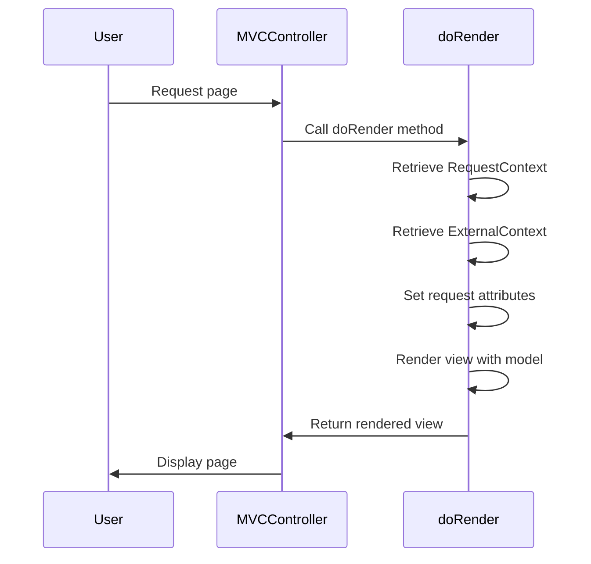

```mermaid
graph TD
 subgraph render
 render:A["Create model map"] --> render:B["Populate model with flow scopes"]
 render:B --> render:C["Expose binding model to map"]
 render:C --> render:D["Add flow request context to model"]
 render:D --> render:E["Check if flow execution key is present"]
 render:E -->|Yes| render:F["Add flow execution key and URL to model"]
 render:E -->|No| render:G["Add current user to model"]
 render:F --> render:H["Add current user to model"]
 render:H --> render:I["Render view with model"]
 render:G --> render:I["Render view with model"]
 end
 subgraph flowScopes
 flowScopes:A["Check if current state is view state"] -->|View state| flowScopes:B["Combine conversation, flow, view, flash, and request scopes into map"]
 flowScopes:A -->|Not view state| flowScopes:C["Combine conversation, flow, flash, and request scopes into map"]
 end
 subgraph exposeBindingModel
 exposeBindingModel:A["Get model object"] --> exposeBindingModel:B["Check if model object is not null"]
 exposeBindingModel:B -->|Not null| exposeBindingModel:C["Create BindingModel with parameters"]
 exposeBindingModel:C --> exposeBindingModel:D["Set binder configuration"]
 exposeBindingModel:D --> exposeBindingModel:E["Set mapping results"]
 exposeBindingModel:E --> exposeBindingModel:F["Add BindingModel to provided map"]
 end
 render:B --> flowScopes
 render:C --> exposeBindingModel

%% Swimm:
%% graph TD
%%  subgraph render
%%  render:A["Create model map"] --> render:B["Populate model with flow scopes"]
%%  render:B --> render:C["Expose binding model to map"]
%%  render:C --> render:D["Add flow request context to model"]
%%  render:D --> render:E["Check if flow execution key is present"]
%%  render:E -->|Yes| render:F["Add flow execution key and URL to model"]
%%  render:E -->|No| render:G["Add current user to model"]
%%  render:F --> render:H["Add current user to model"]
%%  render:H --> render:I["Render view with model"]
%%  render:G --> render:I["Render view with model"]
%%  end
%%  subgraph <SwmToken path="spring-webflow/src/main/java/org/springframework/webflow/mvc/view/AbstractMvcView.java" pos="191:5:5" line-data="		model.putAll(flowScopes());">`flowScopes`</SwmToken>
%%  <SwmToken path="spring-webflow/src/main/java/org/springframework/webflow/mvc/view/AbstractMvcView.java" pos="191:5:5" line-data="		model.putAll(flowScopes());">`flowScopes`</SwmToken>:A["Check if current state is view state"] -->|View state| <SwmToken path="spring-webflow/src/main/java/org/springframework/webflow/mvc/view/AbstractMvcView.java" pos="191:5:5" line-data="		model.putAll(flowScopes());">`flowScopes`</SwmToken>:B["Combine conversation, flow, view, flash, and request scopes into map"]
%%  <SwmToken path="spring-webflow/src/main/java/org/springframework/webflow/mvc/view/AbstractMvcView.java" pos="191:5:5" line-data="		model.putAll(flowScopes());">`flowScopes`</SwmToken>:A -->|Not view state| <SwmToken path="spring-webflow/src/main/java/org/springframework/webflow/mvc/view/AbstractMvcView.java" pos="191:5:5" line-data="		model.putAll(flowScopes());">`flowScopes`</SwmToken>:C["Combine conversation, flow, flash, and request scopes into map"]
%%  end
%%  subgraph <SwmToken path="spring-webflow/src/main/java/org/springframework/webflow/mvc/view/AbstractMvcView.java" pos="608:5:5" line-data="	private void exposeBindingModel(Map&lt;String, Object&gt; model) {">`exposeBindingModel`</SwmToken>
%%  <SwmToken path="spring-webflow/src/main/java/org/springframework/webflow/mvc/view/AbstractMvcView.java" pos="608:5:5" line-data="	private void exposeBindingModel(Map&lt;String, Object&gt; model) {">`exposeBindingModel`</SwmToken>:A["Get model object"] --> <SwmToken path="spring-webflow/src/main/java/org/springframework/webflow/mvc/view/AbstractMvcView.java" pos="608:5:5" line-data="	private void exposeBindingModel(Map&lt;String, Object&gt; model) {">`exposeBindingModel`</SwmToken>:B["Check if model object is not null"]
%%  <SwmToken path="spring-webflow/src/main/java/org/springframework/webflow/mvc/view/AbstractMvcView.java" pos="608:5:5" line-data="	private void exposeBindingModel(Map&lt;String, Object&gt; model) {">`exposeBindingModel`</SwmToken>:B -->|Not null| <SwmToken path="spring-webflow/src/main/java/org/springframework/webflow/mvc/view/AbstractMvcView.java" pos="608:5:5" line-data="	private void exposeBindingModel(Map&lt;String, Object&gt; model) {">`exposeBindingModel`</SwmToken>:C["Create <SwmToken path="spring-webflow/src/main/java/org/springframework/webflow/mvc/view/AbstractMvcView.java" pos="611:1:1" line-data="			BindingModel bindingModel = new BindingModel(getModelExpression().getExpressionString(), modelObject,">`BindingModel`</SwmToken> with parameters"]
%%  <SwmToken path="spring-webflow/src/main/java/org/springframework/webflow/mvc/view/AbstractMvcView.java" pos="608:5:5" line-data="	private void exposeBindingModel(Map&lt;String, Object&gt; model) {">`exposeBindingModel`</SwmToken>:C --> <SwmToken path="spring-webflow/src/main/java/org/springframework/webflow/mvc/view/AbstractMvcView.java" pos="608:5:5" line-data="	private void exposeBindingModel(Map&lt;String, Object&gt; model) {">`exposeBindingModel`</SwmToken>:D["Set binder configuration"]
%%  <SwmToken path="spring-webflow/src/main/java/org/springframework/webflow/mvc/view/AbstractMvcView.java" pos="608:5:5" line-data="	private void exposeBindingModel(Map&lt;String, Object&gt; model) {">`exposeBindingModel`</SwmToken>:D --> <SwmToken path="spring-webflow/src/main/java/org/springframework/webflow/mvc/view/AbstractMvcView.java" pos="608:5:5" line-data="	private void exposeBindingModel(Map&lt;String, Object&gt; model) {">`exposeBindingModel`</SwmToken>:E["Set mapping results"]
%%  <SwmToken path="spring-webflow/src/main/java/org/springframework/webflow/mvc/view/AbstractMvcView.java" pos="608:5:5" line-data="	private void exposeBindingModel(Map&lt;String, Object&gt; model) {">`exposeBindingModel`</SwmToken>:E --> <SwmToken path="spring-webflow/src/main/java/org/springframework/webflow/mvc/view/AbstractMvcView.java" pos="608:5:5" line-data="	private void exposeBindingModel(Map&lt;String, Object&gt; model) {">`exposeBindingModel`</SwmToken>:F["Add <SwmToken path="spring-webflow/src/main/java/org/springframework/webflow/mvc/view/AbstractMvcView.java" pos="611:1:1" line-data="			BindingModel bindingModel = new BindingModel(getModelExpression().getExpressionString(), modelObject,">`BindingModel`</SwmToken> to provided map"]
%%  end
%%  render:B --> <SwmToken path="spring-webflow/src/main/java/org/springframework/webflow/mvc/view/AbstractMvcView.java" pos="191:5:5" line-data="		model.putAll(flowScopes());">`flowScopes`</SwmToken>
%%  render:C --> <SwmToken path="spring-webflow/src/main/java/org/springframework/webflow/mvc/view/AbstractMvcView.java" pos="608:5:5" line-data="	private void exposeBindingModel(Map&lt;String, Object&gt; model) {">`exposeBindingModel`</SwmToken>
```

This document explains the process of rendering an MVC view using the <SwmToken path="spring-webflow/src/main/java/org/springframework/webflow/mvc/servlet/ServletMvcView.java" pos="44:5:5" line-data="	protected void doRender(Map&lt;String, ?&gt; model) throws Exception {">`doRender`</SwmToken> method. The <SwmToken path="spring-webflow/src/main/java/org/springframework/webflow/mvc/servlet/ServletMvcView.java" pos="44:5:5" line-data="	protected void doRender(Map&lt;String, ?&gt; model) throws Exception {">`doRender`</SwmToken> method is responsible for obtaining the current request context and external context, setting request attributes, and rendering the view with the provided model data.

For instance, when a user requests a page, the <SwmToken path="spring-webflow/src/main/java/org/springframework/webflow/mvc/servlet/ServletMvcView.java" pos="44:5:5" line-data="	protected void doRender(Map&lt;String, ?&gt; model) throws Exception {">`doRender`</SwmToken> method retrieves the necessary contexts, sets attributes, and renders the view, ensuring that the user sees the correct data on the page.



Here is a high level diagram of the flow, showing only the most important functions:

```mermaid
graph TD;
      subgraph springwebflowsrcmainjavaorgspringframeworkwebflowmvcview[spring-webflow/…/mvc/view]
d858309b09fe14c30f53e36407c2485c632991ed1b8677bd88229a9008b48a72(ServletMvcView.doRender) --> ba93eeafb81f7cf3f23fc78dd1c4a5f03ccf4a6276f9ec8695b367324ee3878f(AbstractMvcView.render)
end

subgraph springwebflowsrcmainjavaorgspringframeworkwebflowmvcview[spring-webflow/…/mvc/view]
d858309b09fe14c30f53e36407c2485c632991ed1b8677bd88229a9008b48a72(ServletMvcView.doRender) --> 751898612eb9c9830014af0ebce733a8dbad065e90af3eb34f439d8112c0b4ac(AbstractMvcViewFactory.getView)
end

subgraph springwebflowsrcmainjavaorgspringframeworkwebflowmvcview[spring-webflow/…/mvc/view]
ba93eeafb81f7cf3f23fc78dd1c4a5f03ccf4a6276f9ec8695b367324ee3878f(AbstractMvcView.render) --> 8bad86ada66b4f17c2f2880ab6eaf42897bd55f60904bb71373504432764be93(AbstractMvcView.flowScopes)
end

subgraph springwebflowsrcmainjavaorgspringframeworkwebflowmvcview[spring-webflow/…/mvc/view]
ba93eeafb81f7cf3f23fc78dd1c4a5f03ccf4a6276f9ec8695b367324ee3878f(AbstractMvcView.render) --> d868e4faebae3df75853342aa1270a63ef41dc864755a23520420e96dd09b541(AbstractMvcView.exposeBindingModel)
end


      classDef mainFlowStyle color:#000000,fill:#7CB9F4
classDef rootsStyle color:#000000,fill:#00FFF4
classDef Style1 color:#000000,fill:#00FFAA
classDef Style2 color:#000000,fill:#FFFF00
classDef Style3 color:#000000,fill:#AA7CB9

%% Swimm:
%% graph TD;
%%       subgraph springwebflowsrcmainjavaorgspringframeworkwebflowmvcview[<SwmPath>[spring-webflow/…/mvc/view/](spring-webflow/src/main/java/org/springframework/webflow/mvc/view/)</SwmPath>]
%% d858309b09fe14c30f53e36407c2485c632991ed1b8677bd88229a9008b48a72(ServletMvcView.doRender) --> ba93eeafb81f7cf3f23fc78dd1c4a5f03ccf4a6276f9ec8695b367324ee3878f(AbstractMvcView.render)
%% end
%% 
%% subgraph springwebflowsrcmainjavaorgspringframeworkwebflowmvcview[<SwmPath>[spring-webflow/…/mvc/view/](spring-webflow/src/main/java/org/springframework/webflow/mvc/view/)</SwmPath>]
%% d858309b09fe14c30f53e36407c2485c632991ed1b8677bd88229a9008b48a72(ServletMvcView.doRender) --> 751898612eb9c9830014af0ebce733a8dbad065e90af3eb34f439d8112c0b4ac(AbstractMvcViewFactory.getView)
%% end
%% 
%% subgraph springwebflowsrcmainjavaorgspringframeworkwebflowmvcview[<SwmPath>[spring-webflow/…/mvc/view/](spring-webflow/src/main/java/org/springframework/webflow/mvc/view/)</SwmPath>]
%% ba93eeafb81f7cf3f23fc78dd1c4a5f03ccf4a6276f9ec8695b367324ee3878f(AbstractMvcView.render) --> 8bad86ada66b4f17c2f2880ab6eaf42897bd55f60904bb71373504432764be93(AbstractMvcView.flowScopes)
%% end
%% 
%% subgraph springwebflowsrcmainjavaorgspringframeworkwebflowmvcview[<SwmPath>[spring-webflow/…/mvc/view/](spring-webflow/src/main/java/org/springframework/webflow/mvc/view/)</SwmPath>]
%% ba93eeafb81f7cf3f23fc78dd1c4a5f03ccf4a6276f9ec8695b367324ee3878f(AbstractMvcView.render) --> d868e4faebae3df75853342aa1270a63ef41dc864755a23520420e96dd09b541(AbstractMvcView.exposeBindingModel)
%% end
%% 
%% 
%%       classDef mainFlowStyle color:#000000,fill:#7CB9F4
%% classDef rootsStyle color:#000000,fill:#00FFF4
%% classDef Style1 color:#000000,fill:#00FFAA
%% classDef Style2 color:#000000,fill:#FFFF00
%% classDef Style3 color:#000000,fill:#AA7CB9
```



# Flow drill down

```mermaid
graph TD
  subgraph doRender
    doRender:A["Retrieve RequestContext"] --> doRender:B["Retrieve ExternalContext"]
    doRender:B --> doRender:C["Set request attributes"]
    doRender:C --> doRender:D["Check if ConversionService is set"]
    doRender:D -->|Yes| doRender:E["Set ConversionService attribute"]
    doRender:D -->|No| doRender:F["Render view with model, request, response"]
  end
  subgraph getView
    getView:A["Fetch viewId from context"] --> getView:B["Resolve view using viewResolver"]
    getView:B --> getView:C["Create AbstractMvcView"]
    getView:C --> getView:D["Set various properties on mvcView"]
    getView:D --> getView:E["Restore state if available"]
    getView:E --> getView:F["Return mvcView"]
  end
doRender:F --> getView

%% Swimm:
%% graph TD
%%   subgraph <SwmToken path="spring-webflow/src/main/java/org/springframework/webflow/mvc/servlet/ServletMvcView.java" pos="44:5:5" line-data="	protected void doRender(Map&lt;String, ?&gt; model) throws Exception {">`doRender`</SwmToken>
%%     <SwmToken path="spring-webflow/src/main/java/org/springframework/webflow/mvc/servlet/ServletMvcView.java" pos="44:5:5" line-data="	protected void doRender(Map&lt;String, ?&gt; model) throws Exception {">`doRender`</SwmToken>:A["Retrieve <SwmToken path="spring-webflow/src/main/java/org/springframework/webflow/mvc/servlet/ServletMvcView.java" pos="45:1:1" line-data="		RequestContext context = getRequestContext();">`RequestContext`</SwmToken>"] --> <SwmToken path="spring-webflow/src/main/java/org/springframework/webflow/mvc/servlet/ServletMvcView.java" pos="44:5:5" line-data="	protected void doRender(Map&lt;String, ?&gt; model) throws Exception {">`doRender`</SwmToken>:B["Retrieve <SwmToken path="spring-webflow/src/main/java/org/springframework/webflow/mvc/servlet/ServletMvcView.java" pos="46:1:1" line-data="		ExternalContext externalContext = context.getExternalContext();">`ExternalContext`</SwmToken>"]
%%     <SwmToken path="spring-webflow/src/main/java/org/springframework/webflow/mvc/servlet/ServletMvcView.java" pos="44:5:5" line-data="	protected void doRender(Map&lt;String, ?&gt; model) throws Exception {">`doRender`</SwmToken>:B --> <SwmToken path="spring-webflow/src/main/java/org/springframework/webflow/mvc/servlet/ServletMvcView.java" pos="44:5:5" line-data="	protected void doRender(Map&lt;String, ?&gt; model) throws Exception {">`doRender`</SwmToken>:C["Set request attributes"]
%%     <SwmToken path="spring-webflow/src/main/java/org/springframework/webflow/mvc/servlet/ServletMvcView.java" pos="44:5:5" line-data="	protected void doRender(Map&lt;String, ?&gt; model) throws Exception {">`doRender`</SwmToken>:C --> <SwmToken path="spring-webflow/src/main/java/org/springframework/webflow/mvc/servlet/ServletMvcView.java" pos="44:5:5" line-data="	protected void doRender(Map&lt;String, ?&gt; model) throws Exception {">`doRender`</SwmToken>:D["Check if <SwmToken path="spring-webflow/src/main/java/org/springframework/webflow/mvc/servlet/ServletMvcView.java" pos="23:10:10" line-data="import org.springframework.core.convert.ConversionService;">`ConversionService`</SwmToken> is set"]
%%     <SwmToken path="spring-webflow/src/main/java/org/springframework/webflow/mvc/servlet/ServletMvcView.java" pos="44:5:5" line-data="	protected void doRender(Map&lt;String, ?&gt; model) throws Exception {">`doRender`</SwmToken>:D -->|Yes| <SwmToken path="spring-webflow/src/main/java/org/springframework/webflow/mvc/servlet/ServletMvcView.java" pos="44:5:5" line-data="	protected void doRender(Map&lt;String, ?&gt; model) throws Exception {">`doRender`</SwmToken>:E["Set <SwmToken path="spring-webflow/src/main/java/org/springframework/webflow/mvc/servlet/ServletMvcView.java" pos="23:10:10" line-data="import org.springframework.core.convert.ConversionService;">`ConversionService`</SwmToken> attribute"]
%%     <SwmToken path="spring-webflow/src/main/java/org/springframework/webflow/mvc/servlet/ServletMvcView.java" pos="44:5:5" line-data="	protected void doRender(Map&lt;String, ?&gt; model) throws Exception {">`doRender`</SwmToken>:D -->|No| <SwmToken path="spring-webflow/src/main/java/org/springframework/webflow/mvc/servlet/ServletMvcView.java" pos="44:5:5" line-data="	protected void doRender(Map&lt;String, ?&gt; model) throws Exception {">`doRender`</SwmToken>:F["Render view with model, request, response"]
%%   end
%%   subgraph <SwmToken path="spring-webflow/src/main/java/org/springframework/webflow/mvc/servlet/ServletMvcView.java" pos="55:1:1" line-data="		getView().render(model, request, response);">`getView`</SwmToken>
%%     <SwmToken path="spring-webflow/src/main/java/org/springframework/webflow/mvc/servlet/ServletMvcView.java" pos="55:1:1" line-data="		getView().render(model, request, response);">`getView`</SwmToken>:A["Fetch viewId from context"] --> <SwmToken path="spring-webflow/src/main/java/org/springframework/webflow/mvc/servlet/ServletMvcView.java" pos="55:1:1" line-data="		getView().render(model, request, response);">`getView`</SwmToken>:B["Resolve view using viewResolver"]
%%     <SwmToken path="spring-webflow/src/main/java/org/springframework/webflow/mvc/servlet/ServletMvcView.java" pos="55:1:1" line-data="		getView().render(model, request, response);">`getView`</SwmToken>:B --> <SwmToken path="spring-webflow/src/main/java/org/springframework/webflow/mvc/servlet/ServletMvcView.java" pos="55:1:1" line-data="		getView().render(model, request, response);">`getView`</SwmToken>:C["Create <SwmToken path="spring-webflow/src/main/java/org/springframework/webflow/mvc/servlet/ServletMvcView.java" pos="26:12:12" line-data="import org.springframework.webflow.mvc.view.AbstractMvcView;">`AbstractMvcView`</SwmToken>"]
%%     <SwmToken path="spring-webflow/src/main/java/org/springframework/webflow/mvc/servlet/ServletMvcView.java" pos="55:1:1" line-data="		getView().render(model, request, response);">`getView`</SwmToken>:C --> <SwmToken path="spring-webflow/src/main/java/org/springframework/webflow/mvc/servlet/ServletMvcView.java" pos="55:1:1" line-data="		getView().render(model, request, response);">`getView`</SwmToken>:D["Set various properties on mvcView"]
%%     <SwmToken path="spring-webflow/src/main/java/org/springframework/webflow/mvc/servlet/ServletMvcView.java" pos="55:1:1" line-data="		getView().render(model, request, response);">`getView`</SwmToken>:D --> <SwmToken path="spring-webflow/src/main/java/org/springframework/webflow/mvc/servlet/ServletMvcView.java" pos="55:1:1" line-data="		getView().render(model, request, response);">`getView`</SwmToken>:E["Restore state if available"]
%%     <SwmToken path="spring-webflow/src/main/java/org/springframework/webflow/mvc/servlet/ServletMvcView.java" pos="55:1:1" line-data="		getView().render(model, request, response);">`getView`</SwmToken>:E --> <SwmToken path="spring-webflow/src/main/java/org/springframework/webflow/mvc/servlet/ServletMvcView.java" pos="55:1:1" line-data="		getView().render(model, request, response);">`getView`</SwmToken>:F["Return mvcView"]
%%   end
%% <SwmToken path="spring-webflow/src/main/java/org/springframework/webflow/mvc/servlet/ServletMvcView.java" pos="44:5:5" line-data="	protected void doRender(Map&lt;String, ?&gt; model) throws Exception {">`doRender`</SwmToken>:F --> <SwmToken path="spring-webflow/src/main/java/org/springframework/webflow/mvc/servlet/ServletMvcView.java" pos="55:1:1" line-data="		getView().render(model, request, response);">`getView`</SwmToken>
```

## A closer look at <SwmToken path="spring-webflow/src/main/java/org/springframework/webflow/mvc/servlet/ServletMvcView.java" pos="44:5:5" line-data="	protected void doRender(Map&lt;String, ?&gt; model) throws Exception {">`doRender`</SwmToken> & <SwmToken path="spring-webflow/src/main/java/org/springframework/webflow/mvc/servlet/ServletMvcView.java" pos="55:1:1" line-data="		getView().render(model, request, response);">`getView`</SwmToken>



<SwmSnippet path="/spring-webflow/src/main/java/org/springframework/webflow/mvc/servlet/ServletMvcView.java" line="44">

---

First, the <SwmToken path="spring-webflow/src/main/java/org/springframework/webflow/mvc/servlet/ServletMvcView.java" pos="44:5:5" line-data="	protected void doRender(Map&lt;String, ?&gt; model) throws Exception {">`doRender`</SwmToken> method is responsible for rendering the MVC view. It begins by obtaining the current request context and external context, which includes the native HTTP request and response objects.

```java
	protected void doRender(Map<String, ?> model) throws Exception {
		RequestContext context = getRequestContext();
		ExternalContext externalContext = context.getExternalContext();
		HttpServletRequest request = (HttpServletRequest) externalContext.getNativeRequest();
		HttpServletResponse response = (HttpServletResponse) externalContext.getNativeResponse();
```

---

</SwmSnippet>

## A closer look at render & <SwmToken path="spring-webflow/src/main/java/org/springframework/webflow/mvc/view/AbstractMvcView.java" pos="191:5:5" line-data="		model.putAll(flowScopes());">`flowScopes`</SwmToken> & <SwmToken path="spring-webflow/src/main/java/org/springframework/webflow/mvc/view/AbstractMvcView.java" pos="608:5:5" line-data="	private void exposeBindingModel(Map&lt;String, Object&gt; model) {">`exposeBindingModel`</SwmToken>



<SwmSnippet path="/spring-webflow/src/main/java/org/springframework/webflow/mvc/view/AbstractMvcView.java" line="189">

---

First, the <SwmToken path="spring-webflow/src/main/java/org/springframework/webflow/mvc/view/AbstractMvcView.java" pos="189:5:5" line-data="	public void render() throws IOException {">`render`</SwmToken> method is responsible for preparing the model data and rendering the view. It starts by creating a new <SwmToken path="spring-webflow/src/main/java/org/springframework/webflow/mvc/view/AbstractMvcView.java" pos="190:15:15" line-data="		Map&lt;String, Object&gt; model = new HashMap&lt;&gt;();">`HashMap`</SwmToken> to hold the model data and populates it with various scopes by calling the <SwmToken path="spring-webflow/src/main/java/org/springframework/webflow/mvc/view/AbstractMvcView.java" pos="191:5:5" line-data="		model.putAll(flowScopes());">`flowScopes`</SwmToken> method.

```java
	public void render() throws IOException {
		Map<String, Object> model = new HashMap<>();
		model.putAll(flowScopes());
```

---

</SwmSnippet>

<SwmSnippet path="/spring-webflow/src/main/java/org/springframework/webflow/mvc/view/AbstractMvcView.java" line="597">

---

Moving to the <SwmToken path="spring-webflow/src/main/java/org/springframework/webflow/mvc/view/AbstractMvcView.java" pos="597:11:11" line-data="	private Map&lt;String, Object&gt; flowScopes() {">`flowScopes`</SwmToken> method, it combines different scopes such as conversation, flow, view, flash, and request scopes into a single map. This ensures that all relevant data from these scopes is available in the model.

```java
	private Map<String, Object> flowScopes() {
		if (requestContext.getCurrentState().isViewState()) {
			return requestContext.getConversationScope().union(requestContext.getFlowScope())
					.union(requestContext.getViewScope()).union(requestContext.getFlashScope())
					.union(requestContext.getRequestScope()).asMap();
```

---

</SwmSnippet>

<SwmSnippet path="/spring-webflow/src/main/java/org/springframework/webflow/mvc/view/AbstractMvcView.java" line="608">

---

Next, the <SwmToken path="spring-webflow/src/main/java/org/springframework/webflow/mvc/view/AbstractMvcView.java" pos="608:5:5" line-data="	private void exposeBindingModel(Map&lt;String, Object&gt; model) {">`exposeBindingModel`</SwmToken> method is called to add the binding model to the map. This method retrieves the model object and creates a <SwmToken path="spring-webflow/src/main/java/org/springframework/webflow/mvc/view/AbstractMvcView.java" pos="611:1:1" line-data="			BindingModel bindingModel = new BindingModel(getModelExpression().getExpressionString(), modelObject,">`BindingModel`</SwmToken> instance, which is then added to the model map. This step is crucial for binding form data to the model.

```java
	private void exposeBindingModel(Map<String, Object> model) {
		Object modelObject = getModelObject();
		if (modelObject != null) {
			BindingModel bindingModel = new BindingModel(getModelExpression().getExpressionString(), modelObject,
					expressionParser, conversionService, requestContext.getMessageContext());
			bindingModel.setBinderConfiguration(binderConfiguration);
			bindingModel.setMappingResults(mappingResults);
			model.put(BindingResult.MODEL_KEY_PREFIX + getModelExpression().getExpressionString(), bindingModel);
		}
```

---

</SwmSnippet>

<SwmSnippet path="/spring-webflow/src/main/java/org/springframework/webflow/mvc/view/AbstractMvcView.java" line="193">

---

Then, additional data such as the <SwmToken path="spring-webflow/src/main/java/org/springframework/webflow/mvc/view/AbstractMvcView.java" pos="193:6:6" line-data="		model.put(&quot;flowRequestContext&quot;, requestContext);">`flowRequestContext`</SwmToken>, <SwmToken path="spring-webflow/src/main/java/org/springframework/webflow/mvc/view/AbstractMvcView.java" pos="196:6:6" line-data="			model.put(&quot;flowExecutionKey&quot;, requestContext.getFlowExecutionContext().getKey().toString());">`flowExecutionKey`</SwmToken>, <SwmToken path="spring-webflow/src/main/java/org/springframework/webflow/mvc/view/AbstractMvcView.java" pos="197:6:6" line-data="			model.put(&quot;flowExecutionUrl&quot;, requestContext.getFlowExecutionUrl());">`flowExecutionUrl`</SwmToken>, and <SwmToken path="spring-webflow/src/main/java/org/springframework/webflow/mvc/view/AbstractMvcView.java" pos="199:6:6" line-data="		model.put(&quot;currentUser&quot;, requestContext.getExternalContext().getCurrentUser());">`currentUser`</SwmToken> are added to the model. This data is essential for the view to render correctly and provide the necessary context to the user.

```java
		model.put("flowRequestContext", requestContext);
		FlowExecutionKey key = requestContext.getFlowExecutionContext().getKey();
		if (key != null) {
			model.put("flowExecutionKey", requestContext.getFlowExecutionContext().getKey().toString());
			model.put("flowExecutionUrl", requestContext.getFlowExecutionUrl());
		}
		model.put("currentUser", requestContext.getExternalContext().getCurrentUser());
```

---

</SwmSnippet>

<SwmSnippet path="/spring-webflow/src/main/java/org/springframework/webflow/mvc/view/AbstractMvcView.java" line="204">

---

Finally, the <SwmToken path="spring-webflow/src/main/java/org/springframework/webflow/mvc/view/AbstractMvcView.java" pos="204:1:1" line-data="			doRender(model);">`doRender`</SwmToken> method is called with the prepared model to render the view. This method handles the actual rendering process, ensuring that the view is displayed to the user with the correct data.

```java
			doRender(model);
```

---

</SwmSnippet>

&nbsp;

*This is an auto-generated document by Swimm 🌊 and has not yet been verified by a human*

<SwmMeta version="3.0.0" repo-id="Z2l0aHViJTNBJTNBc3ByaW5nLXdlYmZsb3ctZGVtbyUzQSUzQWdpbGFkbmF2b3Q=" repo-name="spring-webflow-demo"><sup>Powered by [Swimm](/)</sup></SwmMeta>
