This document explains the flow of retrieving a required number from a map. In our application, we often need to ensure that certain keys in a map have values of a specific type, such as a number. The <SwmToken path="spring-binding/src/main/java/org/springframework/binding/collection/MapAccessor.java" pos="278:13:13" line-data="	public &lt;T extends Number&gt; T getRequiredNumber(Object key, Class&lt;T&gt; requiredType) throws IllegalArgumentException {">`getRequiredNumber`</SwmToken> method facilitates this by validating the presence and type of the value associated with a given key.

For example, if we need to retrieve the age of a user from a map, the <SwmToken path="spring-binding/src/main/java/org/springframework/binding/collection/MapAccessor.java" pos="278:13:13" line-data="	public &lt;T extends Number&gt; T getRequiredNumber(Object key, Class&lt;T&gt; requiredType) throws IllegalArgumentException {">`getRequiredNumber`</SwmToken> method ensures that the 'age' key is present and that its value is a number.


# Where is this flow used?

This flow is used multiple times in the codebase as represented in the following diagram:

```mermaid
graph TD;
      subgraph springbindingsrcmainjavaorgspringframeworkbindingcollectionMapAccessorjava[spring-binding/…/collection/MapAccessor.java]
10bbc554f26d42369acd743b7ca641fe7488a585e55e977cffd1d73a512838cc(getRequiredInteger) --> c91738290738e51e7f3d22b9417b10861f26ce9cf342e32efa9a2e63f7869f05(MapAccessor.getRequiredNumber)
end

subgraph springbindingsrcmainjavaorgspringframeworkbindingcollectionMapAccessorjava[spring-binding/…/collection/MapAccessor.java]
c52d4e4f87775e4fb8f71a958765e208b4e1aba8db7278cdfe2ee99b1ce3df5d(getRequiredLong) --> c91738290738e51e7f3d22b9417b10861f26ce9cf342e32efa9a2e63f7869f05(MapAccessor.getRequiredNumber)
end


      classDef mainFlowStyle color:#000000,fill:#7CB9F4
classDef rootsStyle color:#000000,fill:#00FFF4
classDef Style1 color:#000000,fill:#00FFAA
classDef Style2 color:#000000,fill:#FFFF00
classDef Style3 color:#000000,fill:#AA7CB9

%% Swimm:
%% graph TD;
%%       subgraph springbindingsrcmainjavaorgspringframeworkbindingcollectionMapAccessorjava[<SwmPath>[spring-binding/…/collection/MapAccessor.java](spring-binding/src/main/java/org/springframework/binding/collection/MapAccessor.java)</SwmPath>]
%% 10bbc554f26d42369acd743b7ca641fe7488a585e55e977cffd1d73a512838cc(<SwmToken path="spring-binding/src/main/java/org/springframework/binding/collection/MapAccessor.java" pos="310:5:5" line-data="	public Integer getRequiredInteger(Object key) throws IllegalArgumentException {">`getRequiredInteger`</SwmToken>) --> c91738290738e51e7f3d22b9417b10861f26ce9cf342e32efa9a2e63f7869f05(MapAccessor.getRequiredNumber)
%% end
%% 
%% subgraph springbindingsrcmainjavaorgspringframeworkbindingcollectionMapAccessorjava[<SwmPath>[spring-binding/…/collection/MapAccessor.java](spring-binding/src/main/java/org/springframework/binding/collection/MapAccessor.java)</SwmPath>]
%% c52d4e4f87775e4fb8f71a958765e208b4e1aba8db7278cdfe2ee99b1ce3df5d(<SwmToken path="spring-binding/src/main/java/org/springframework/binding/collection/MapAccessor.java" pos="341:5:5" line-data="	public Long getRequiredLong(Object key) throws IllegalArgumentException {">`getRequiredLong`</SwmToken>) --> c91738290738e51e7f3d22b9417b10861f26ce9cf342e32efa9a2e63f7869f05(MapAccessor.getRequiredNumber)
%% end
%% 
%% 
%%       classDef mainFlowStyle color:#000000,fill:#7CB9F4
%% classDef rootsStyle color:#000000,fill:#00FFF4
%% classDef Style1 color:#000000,fill:#00FFAA
%% classDef Style2 color:#000000,fill:#FFFF00
%% classDef Style3 color:#000000,fill:#AA7CB9
```



Here is a high level diagram of the flow, showing only the most important functions:


# Flow drill down

## Breaking down <SwmToken path="spring-binding/src/main/java/org/springframework/binding/collection/MapAccessor.java" pos="278:13:13" line-data="	public &lt;T extends Number&gt; T getRequiredNumber(Object key, Class&lt;T&gt; requiredType) throws IllegalArgumentException {">`getRequiredNumber`</SwmToken>


<SwmSnippet path="/spring-binding/src/main/java/org/springframework/binding/collection/MapAccessor.java" line="279">

---

First, the <SwmToken path="spring-binding/src/main/java/org/springframework/binding/collection/MapAccessor.java" pos="278:13:13" line-data="	public &lt;T extends Number&gt; T getRequiredNumber(Object key, Class&lt;T&gt; requiredType) throws IllegalArgumentException {">`getRequiredNumber`</SwmToken> method calls <SwmToken path="spring-binding/src/main/java/org/springframework/binding/collection/MapAccessor.java" pos="279:1:1" line-data="		assertContainsKey(key);">`assertContainsKey`</SwmToken> to ensure that the specified key exists in the map. This step is crucial because it prevents any further operations on a non-existent key, which could lead to errors or unexpected behavior.

```java
		assertContainsKey(key);
```

---

</SwmSnippet>

<SwmSnippet path="/spring-binding/src/main/java/org/springframework/binding/collection/MapAccessor.java" line="280">

---

Next, the method calls <SwmToken path="spring-binding/src/main/java/org/springframework/binding/collection/MapAccessor.java" pos="280:3:3" line-data="		return assertKeyValueOfType(key, requiredType);">`assertKeyValueOfType`</SwmToken> to verify that the value associated with the key is of the required type. This validation ensures that the value can be safely cast to the expected number type, preventing type-related errors during runtime.

```java
		return assertKeyValueOfType(key, requiredType);
```

---

</SwmSnippet>

## Diving into <SwmToken path="spring-binding/src/main/java/org/springframework/binding/collection/MapAccessor.java" pos="279:1:1" line-data="		assertContainsKey(key);">`assertContainsKey`</SwmToken> & <SwmToken path="spring-binding/src/main/java/org/springframework/binding/collection/MapAccessor.java" pos="47:11:11" line-data="	public Map&lt;K, V&gt; asMap() {">`asMap`</SwmToken>


<SwmSnippet path="/spring-binding/src/main/java/org/springframework/binding/collection/MapAccessor.java" line="385">

---

First, the <SwmToken path="spring-binding/src/main/java/org/springframework/binding/collection/MapAccessor.java" pos="385:5:5" line-data="	public void assertContainsKey(Object key) throws IllegalArgumentException {">`assertContainsKey`</SwmToken> method is responsible for ensuring that a specific key is present in the map. This is crucial for validating that all required attributes are available before proceeding with further operations. If the key is not found, an <SwmToken path="spring-binding/src/main/java/org/springframework/binding/collection/MapAccessor.java" pos="385:14:14" line-data="	public void assertContainsKey(Object key) throws IllegalArgumentException {">`IllegalArgumentException`</SwmToken> is thrown, indicating the absence of the required attribute.

```java
	public void assertContainsKey(Object key) throws IllegalArgumentException {
		if (!map.containsKey(key)) {
			throw new IllegalArgumentException("Required attribute '" + key
					+ "' is not present in map; attributes present are [" + asMap() + "]");
		}
	}
```

---

</SwmSnippet>

<SwmSnippet path="/spring-binding/src/main/java/org/springframework/binding/collection/MapAccessor.java" line="47">

---

Next, the <SwmToken path="spring-binding/src/main/java/org/springframework/binding/collection/MapAccessor.java" pos="47:11:11" line-data="	public Map&lt;K, V&gt; asMap() {">`asMap`</SwmToken> method is used to retrieve the map itself. This method returns the underlying map, which can then be used for various operations, including checking for the presence of keys or iterating over the map entries.

```java
	public Map<K, V> asMap() {
		return map;
	}
```

---

</SwmSnippet>

## Inside <SwmToken path="spring-binding/src/main/java/org/springframework/binding/collection/MapAccessor.java" pos="67:7:7" line-data="		if (!map.containsKey(key)) {">`containsKey`</SwmToken>


<SwmSnippet path="/spring-binding/src/main/java/org/springframework/binding/collection/MapAccessor.java" line="398">

---

First, the <SwmToken path="spring-binding/src/main/java/org/springframework/binding/collection/MapAccessor.java" pos="398:6:6" line-data="		if (map.containsKey(key)) {">`containsKey`</SwmToken> method checks if the specified key is present in the map. This is crucial for ensuring that the attribute we are looking for actually exists before proceeding with further operations.

```java
		if (map.containsKey(key)) {
```

---

</SwmSnippet>

<SwmSnippet path="/spring-binding/src/main/java/org/springframework/binding/collection/MapAccessor.java" line="399">

---

Next, if the key is present, the method calls <SwmToken path="spring-binding/src/main/java/org/springframework/binding/collection/MapAccessor.java" pos="399:1:1" line-data="			assertKeyValueOfType(key, requiredType);">`assertKeyValueOfType`</SwmToken> to verify that the value associated with the key is of the required type. This step ensures type safety and prevents runtime errors that could occur if the value is not of the expected type.

```java
			assertKeyValueOfType(key, requiredType);
```

---

</SwmSnippet>

<SwmSnippet path="/spring-binding/src/main/java/org/springframework/binding/collection/MapAccessor.java" line="400">

---

If both conditions are met, the method returns `true`, indicating that the key is present and the value is of the required type. Otherwise, it returns `false`, signaling that either the key is not present or the value is not of the required type.

```java
			return true;
		} else {
			return false;
		}
```

---

</SwmSnippet>

## Going into <SwmToken path="spring-binding/src/main/java/org/springframework/binding/collection/MapAccessor.java" pos="280:3:3" line-data="		return assertKeyValueOfType(key, requiredType);">`assertKeyValueOfType`</SwmToken>


<SwmSnippet path="/spring-binding/src/main/java/org/springframework/binding/collection/MapAccessor.java" line="406">

---

First, the <SwmToken path="spring-binding/src/main/java/org/springframework/binding/collection/MapAccessor.java" pos="412:9:9" line-data="	public &lt;T&gt; T assertKeyValueOfType(Object key, Class&lt;T&gt; requiredType) {">`assertKeyValueOfType`</SwmToken> method is responsible for ensuring that the value associated with a specific key in a map is of the expected type. This is crucial for maintaining data integrity and preventing type-related errors during runtime.

```java
	/**
	 * Assert that value of the map key, if non-null, is of the required type.
	 * @param key the attribute name
	 * @param requiredType the required attribute value type
	 * @return the attribute value
	 */
	public <T> T assertKeyValueOfType(Object key, Class<T> requiredType) {
		return assertKeyValueInstanceOf(key, map.get(key), requiredType);
	}
```

---

</SwmSnippet>

<SwmSnippet path="/spring-binding/src/main/java/org/springframework/binding/collection/MapAccessor.java" line="413">

---

Moving to the next step, the <SwmToken path="spring-binding/src/main/java/org/springframework/binding/collection/MapAccessor.java" pos="280:3:3" line-data="		return assertKeyValueOfType(key, requiredType);">`assertKeyValueOfType`</SwmToken> method calls <SwmToken path="spring-binding/src/main/java/org/springframework/binding/collection/MapAccessor.java" pos="413:3:3" line-data="		return assertKeyValueInstanceOf(key, map.get(key), requiredType);">`assertKeyValueInstanceOf`</SwmToken> to verify that the value associated with the key is an instance of the required type. This ensures that the value can be safely cast to the expected type without causing a `ClassCastException`.

```java
		return assertKeyValueInstanceOf(key, map.get(key), requiredType);
	}
```

---

</SwmSnippet>

<SwmSnippet path="/spring-binding/src/main/java/org/springframework/binding/collection/MapAccessor.java" line="413">

---

Next, the method retrieves the value associated with the key from the map using the <SwmToken path="spring-binding/src/main/java/org/springframework/binding/collection/MapAccessor.java" pos="413:10:10" line-data="		return assertKeyValueInstanceOf(key, map.get(key), requiredType);">`get`</SwmToken> method. This step is essential to obtain the actual value that needs to be validated.

```java
		return assertKeyValueInstanceOf(key, map.get(key), requiredType);
	}
```

---

</SwmSnippet>

## Going into <SwmToken path="spring-binding/src/main/java/org/springframework/binding/collection/MapAccessor.java" pos="413:3:3" line-data="		return assertKeyValueInstanceOf(key, map.get(key), requiredType);">`assertKeyValueInstanceOf`</SwmToken> & <SwmToken path="spring-binding/src/main/java/org/springframework/binding/collection/MapAccessor.java" pos="429:9:9" line-data="					+ value.getClass().getName() + &quot;]&quot;);">`getName`</SwmToken>


<SwmSnippet path="/spring-binding/src/main/java/org/springframework/binding/collection/MapAccessor.java" line="424">

---

First, the <SwmToken path="spring-binding/src/main/java/org/springframework/binding/collection/MapAccessor.java" pos="424:9:9" line-data="	public &lt;T&gt; T assertKeyValueInstanceOf(Object key, Object value, Class&lt;T&gt; requiredType) {">`assertKeyValueInstanceOf`</SwmToken> method ensures that the value associated with a given key in the map is of the expected type. This validation is crucial to prevent type-related errors during runtime. If the value is not of the required type, an <SwmToken path="spring-binding/src/main/java/org/springframework/binding/collection/MapAccessor.java" pos="427:5:5" line-data="			throw new IllegalArgumentException(&quot;Map key &#39;&quot; + key + &quot;&#39; has value [&quot; + value">`IllegalArgumentException`</SwmToken> is thrown, indicating the mismatch.

```java
	public <T> T assertKeyValueInstanceOf(Object key, Object value, Class<T> requiredType) {
		Assert.notNull(requiredType, "The required type to assert is required");
		if (value != null && !requiredType.isInstance(value)) {
			throw new IllegalArgumentException("Map key '" + key + "' has value [" + value
					+ "] that is not of expected type [" + requiredType + "], instead it is of type ["
					+ value.getClass().getName() + "]");
		}
		return (T) value;
```

---

</SwmSnippet>

<SwmSnippet path="/spring-binding/src/main/java/org/springframework/binding/expression/ExpressionVariable.java" line="55">

---

Next, the <SwmToken path="spring-binding/src/main/java/org/springframework/binding/expression/ExpressionVariable.java" pos="55:5:5" line-data="	public String getName() {">`getName`</SwmToken> method retrieves the name of the variable. This name is used in subsequent operations to identify and manipulate the variable within the flow. Ensuring the correct retrieval of the variable name is essential for the accurate execution of the flow logic.

```java
	public String getName() {
		return name;
```

---

</SwmSnippet>

## Inside get


<SwmSnippet path="/spring-binding/src/main/java/org/springframework/binding/collection/MapAccessor.java" line="51">

---

The <SwmToken path="spring-binding/src/main/java/org/springframework/binding/collection/MapAccessor.java" pos="56:5:5" line-data="	public V get(Object key) {">`get`</SwmToken> method is responsible for retrieving a value from the map based on the provided key. If the key is not present in the map, it returns null.

```java
	/**
	 * Returns a value in the map, returning null if the attribute is not present.
	 * @param key the key
	 * @return the value
	 */
	public V get(Object key) {
		return map.get(key);
	}
```

---

</SwmSnippet>

## A closer look at get


<SwmSnippet path="/spring-binding/src/main/java/org/springframework/binding/collection/MapAccessor.java" line="67">

---

First, the <SwmToken path="spring-binding/src/main/java/org/springframework/binding/collection/MapAccessor.java" pos="56:5:5" line-data="	public V get(Object key) {">`get`</SwmToken> method checks if the specified key exists in the map. This is crucial because it determines whether the method should return the associated value or the provided default value.

```java
		if (!map.containsKey(key)) {
			return defaultValue;
```

---

</SwmSnippet>

<SwmSnippet path="/spring-binding/src/main/java/org/springframework/binding/collection/MapAccessor.java" line="68">

---

Next, if the key does not exist in the map, the method returns the default value provided. This ensures that the method always returns a meaningful value, even if the key is not found.

```java
			return defaultValue;
		}
```

---

</SwmSnippet>

<SwmSnippet path="/spring-binding/src/main/java/org/springframework/binding/collection/MapAccessor.java" line="70">

---

Then, if the key is found in the map, the method retrieves and returns the value associated with the key. This allows the caller to access the stored value directly.

```java
		return map.get(key);
	}
```

---

</SwmSnippet>

&nbsp;

*This is an auto-generated document by Swimm 🌊 and has not yet been verified by a human*

<SwmMeta version="3.0.0" repo-id="Z2l0aHViJTNBJTNBc3ByaW5nLXdlYmZsb3ctZGVtbyUzQSUzQWdpbGFkbmF2b3Q=" repo-name="spring-webflow-demo"><sup>Powered by [Swimm](/)</sup></SwmMeta>
