This document explains the process of retrieving and formatting field values within the application. The <SwmToken path="spring-webflow/src/main/java/org/springframework/webflow/mvc/view/BindingModel.java" pos="134:5:5" line-data="	public Object getFieldValue(String field) {">`getFieldValue`</SwmToken> method is responsible for obtaining the value of a specified field, ensuring it is correctly formatted for display purposes.

For example, if a user inputs data into a form, the <SwmToken path="spring-webflow/src/main/java/org/springframework/webflow/mvc/view/BindingModel.java" pos="134:5:5" line-data="	public Object getFieldValue(String field) {">`getFieldValue`</SwmToken> method retrieves the value of a specific field, checks for any mapping results, and formats the value appropriately for display.


Here is a high level diagram of the flow, showing only the most important functions:

```mermaid
graph TD;
      subgraph springwebflowsrcmainjavaorgspringframeworkwebflowmvcview[spring-webflow/…/mvc/view]
12d323236dbb5288d76222d8c92f69680b47903b19c55ee05822101eb0f77134(BindingModel.getFieldValue) --> 655d56e871ab38491f9606e6ac42e1837c39b2207416c0e3bcc758086e85e4e5(BindingModel.getFormattedValue)
end

subgraph springwebflowsrcmainjavaorgspringframeworkwebflowmvcview[spring-webflow/…/mvc/view]
655d56e871ab38491f9606e6ac42e1837c39b2207416c0e3bcc758086e85e4e5(BindingModel.getFormattedValue) --> b23e6129a8ed6a251932f246cb9bccb985ee7c2bbce15261474da38439a9ccca(BindingModel.findSpringConvertingPropertyEditor)
end

subgraph springwebflowsrcmainjavaorgspringframeworkwebflowmvcview[spring-webflow/…/mvc/view]
655d56e871ab38491f9606e6ac42e1837c39b2207416c0e3bcc758086e85e4e5(BindingModel.getFormattedValue) --> fa0030213f933076119231abb4c9df33da918249655535dfcaf2f5a2e84cccd2(ConvertingPropertyEditorAdapter.getAsText)
end

subgraph springwebflowsrcmainjavaorgspringframeworkwebflowmvcview[spring-webflow/…/mvc/view]
655d56e871ab38491f9606e6ac42e1837c39b2207416c0e3bcc758086e85e4e5(BindingModel.getFormattedValue) --> f657b61dfc08af91a4e2a9e1abd3e1876a91adbc88a87786a8aa4acc0154049a(BindingModel.parseFieldExpression)
end

subgraph springwebflowsrcmainjavaorgspringframeworkwebflowmvcview[spring-webflow/…/mvc/view]
b23e6129a8ed6a251932f246cb9bccb985ee7c2bbce15261474da38439a9ccca(BindingModel.findSpringConvertingPropertyEditor) --> f657b61dfc08af91a4e2a9e1abd3e1876a91adbc88a87786a8aa4acc0154049a(BindingModel.parseFieldExpression)
end


      classDef mainFlowStyle color:#000000,fill:#7CB9F4
classDef rootsStyle color:#000000,fill:#00FFF4
classDef Style1 color:#000000,fill:#00FFAA
classDef Style2 color:#000000,fill:#FFFF00
classDef Style3 color:#000000,fill:#AA7CB9

%% Swimm:
%% graph TD;
%%       subgraph springwebflowsrcmainjavaorgspringframeworkwebflowmvcview[<SwmPath>[spring-webflow/…/mvc/view/](spring-webflow/src/main/java/org/springframework/webflow/mvc/view/)</SwmPath>]
%% 12d323236dbb5288d76222d8c92f69680b47903b19c55ee05822101eb0f77134(BindingModel.getFieldValue) --> 655d56e871ab38491f9606e6ac42e1837c39b2207416c0e3bcc758086e85e4e5(BindingModel.getFormattedValue)
%% end
%% 
%% subgraph springwebflowsrcmainjavaorgspringframeworkwebflowmvcview[<SwmPath>[spring-webflow/…/mvc/view/](spring-webflow/src/main/java/org/springframework/webflow/mvc/view/)</SwmPath>]
%% 655d56e871ab38491f9606e6ac42e1837c39b2207416c0e3bcc758086e85e4e5(BindingModel.getFormattedValue) --> b23e6129a8ed6a251932f246cb9bccb985ee7c2bbce15261474da38439a9ccca(BindingModel.findSpringConvertingPropertyEditor)
%% end
%% 
%% subgraph springwebflowsrcmainjavaorgspringframeworkwebflowmvcview[<SwmPath>[spring-webflow/…/mvc/view/](spring-webflow/src/main/java/org/springframework/webflow/mvc/view/)</SwmPath>]
%% 655d56e871ab38491f9606e6ac42e1837c39b2207416c0e3bcc758086e85e4e5(BindingModel.getFormattedValue) --> fa0030213f933076119231abb4c9df33da918249655535dfcaf2f5a2e84cccd2(ConvertingPropertyEditorAdapter.getAsText)
%% end
%% 
%% subgraph springwebflowsrcmainjavaorgspringframeworkwebflowmvcview[<SwmPath>[spring-webflow/…/mvc/view/](spring-webflow/src/main/java/org/springframework/webflow/mvc/view/)</SwmPath>]
%% 655d56e871ab38491f9606e6ac42e1837c39b2207416c0e3bcc758086e85e4e5(BindingModel.getFormattedValue) --> f657b61dfc08af91a4e2a9e1abd3e1876a91adbc88a87786a8aa4acc0154049a(BindingModel.parseFieldExpression)
%% end
%% 
%% subgraph springwebflowsrcmainjavaorgspringframeworkwebflowmvcview[<SwmPath>[spring-webflow/…/mvc/view/](spring-webflow/src/main/java/org/springframework/webflow/mvc/view/)</SwmPath>]
%% b23e6129a8ed6a251932f246cb9bccb985ee7c2bbce15261474da38439a9ccca(BindingModel.findSpringConvertingPropertyEditor) --> f657b61dfc08af91a4e2a9e1abd3e1876a91adbc88a87786a8aa4acc0154049a(BindingModel.parseFieldExpression)
%% end
%% 
%% 
%%       classDef mainFlowStyle color:#000000,fill:#7CB9F4
%% classDef rootsStyle color:#000000,fill:#00FFF4
%% classDef Style1 color:#000000,fill:#00FFAA
%% classDef Style2 color:#000000,fill:#FFFF00
%% classDef Style3 color:#000000,fill:#AA7CB9
```



# Flow drill down

## Inside <SwmToken path="spring-webflow/src/main/java/org/springframework/webflow/mvc/view/BindingModel.java" pos="134:5:5" line-data="	public Object getFieldValue(String field) {">`getFieldValue`</SwmToken>


## Retrieving and Formatting Field Values

First, the <SwmToken path="spring-webflow/src/main/java/org/springframework/webflow/mvc/view/BindingModel.java" pos="134:5:5" line-data="	public Object getFieldValue(String field) {">`getFieldValue`</SwmToken> method is responsible for retrieving the value of a specified field. It starts by fixing the field name to ensure it is in the correct format.

Next, it checks if there are any mapping results available. If mapping results are present, it retrieves a list of mapping results that meet certain criteria using the <SwmToken path="spring-webflow/src/main/java/org/springframework/webflow/mvc/view/BindingModel.java" pos="137:12:12" line-data="			List&lt;MappingResult&gt; results = mappingResults.getResults(new FieldErrorResult(field));">`getResults`</SwmToken> method.

Then, it checks if the list of mapping results is not empty. If there are results, it retrieves the original value of the field from the first mapping result.

<SwmSnippet path="/spring-webflow/src/main/java/org/springframework/webflow/mvc/view/BindingModel.java" line="134">

---

If no mapping results are found, the method proceeds to retrieve and format the value of the specified field using the <SwmToken path="spring-webflow/src/main/java/org/springframework/webflow/mvc/view/BindingModel.java" pos="143:3:3" line-data="		return getFormattedValue(field);">`getFormattedValue`</SwmToken> method. This ensures that the field value is properly formatted for display purposes.

```java
	public Object getFieldValue(String field) {
		field = fixedField(field);
		if (mappingResults != null) {
			List<MappingResult> results = mappingResults.getResults(new FieldErrorResult(field));
			if (!results.isEmpty()) {
				MappingResult fieldError = results.get(0);
				return fieldError.getOriginalValue();
			}
		}
		return getFormattedValue(field);
	}
```

---

</SwmSnippet>

## Looking at <SwmToken path="spring-webflow/src/main/java/org/springframework/webflow/mvc/view/BindingModel.java" pos="143:3:3" line-data="		return getFormattedValue(field);">`getFormattedValue`</SwmToken> & <SwmToken path="spring-webflow/src/main/java/org/springframework/webflow/mvc/view/BindingModel.java" pos="239:7:7" line-data="					value = editor.getAsText();">`getAsText`</SwmToken> & <SwmToken path="spring-webflow/src/main/java/org/springframework/webflow/mvc/view/BindingModel.java" pos="228:7:7" line-data="		Expression fieldExpression = parseFieldExpression(field, true);">`parseFieldExpression`</SwmToken>


<SwmSnippet path="/spring-webflow/src/main/java/org/springframework/webflow/mvc/view/BindingModel.java" line="227">

---

First, the <SwmToken path="spring-webflow/src/main/java/org/springframework/webflow/mvc/view/BindingModel.java" pos="227:5:5" line-data="	private Object getFormattedValue(String field) {">`getFormattedValue`</SwmToken> method parses the field expression using the <SwmToken path="spring-webflow/src/main/java/org/springframework/webflow/mvc/view/BindingModel.java" pos="228:7:7" line-data="		Expression fieldExpression = parseFieldExpression(field, true);">`parseFieldExpression`</SwmToken> method. This step is crucial as it interprets the field string into an expression that can be evaluated against the bound object.

```java
	private Object getFormattedValue(String field) {
		Expression fieldExpression = parseFieldExpression(field, true);
```

---

</SwmSnippet>

<SwmSnippet path="/spring-webflow/src/main/java/org/springframework/webflow/mvc/view/BindingModel.java" line="230">

---

Next, if a custom converter is configured or conversion should be avoided, the method re-parses the field expression without the result type hint. It then finds a suitable property editor using the <SwmToken path="spring-webflow/src/main/java/org/springframework/webflow/mvc/view/BindingModel.java" pos="236:7:7" line-data="				PropertyEditor editor = findSpringConvertingPropertyEditor(field, valueType);">`findSpringConvertingPropertyEditor`</SwmToken> method. This step ensures that the value can be properly converted to a string representation if necessary.

```java
		if (isCustomConverterConfigured(field) || avoidConversion(valueType)) {
			fieldExpression = parseFieldExpression(fieldExpression.getExpressionString(), false);
		}
		Object value = fieldExpression.getValue(boundObject);
		if ((value instanceof String) == false) {
			if (avoidConversion(valueType) == false) {
				PropertyEditor editor = findSpringConvertingPropertyEditor(field, valueType);
```

---

</SwmSnippet>

<SwmSnippet path="/spring-webflow/src/main/java/org/springframework/webflow/mvc/view/BindingModel.java" line="237">

---

Then, the method retrieves the value of the field expression. If the value is not already a string and conversion is not to be avoided, it uses the property editor to convert the value to its text representation by calling the <SwmToken path="spring-webflow/src/main/java/org/springframework/webflow/mvc/view/BindingModel.java" pos="239:7:7" line-data="					value = editor.getAsText();">`getAsText`</SwmToken> method. This step is essential for ensuring that the value is in a displayable format.

```java
				if (editor != null) {
					editor.setValue(value);
					value = editor.getAsText();
```

---

</SwmSnippet>

## A closer look at <SwmToken path="spring-webflow/src/main/java/org/springframework/webflow/mvc/view/BindingModel.java" pos="236:7:7" line-data="				PropertyEditor editor = findSpringConvertingPropertyEditor(field, valueType);">`findSpringConvertingPropertyEditor`</SwmToken>


<SwmSnippet path="/spring-webflow/src/main/java/org/springframework/webflow/mvc/view/BindingModel.java" line="265">

---

First, the method checks if a conversion service is available. If not, it returns null, indicating that no <SwmToken path="spring-webflow/src/main/java/org/springframework/webflow/mvc/view/BindingModel.java" pos="236:1:1" line-data="				PropertyEditor editor = findSpringConvertingPropertyEditor(field, valueType);">`PropertyEditor`</SwmToken> can be found.

```java
		if (conversionService != null) {
```

---

</SwmSnippet>

<SwmSnippet path="/spring-webflow/src/main/java/org/springframework/webflow/mvc/view/BindingModel.java" line="268">

---

Next, it attempts to retrieve a converter ID from the binder configuration if a field is provided. This converter ID is used to identify the specific converter needed for the field.

```java
				if (binderConfiguration != null) {
					converterId = binderConfiguration.getConverterId(field);
```

---

</SwmSnippet>

<SwmSnippet path="/spring-webflow/src/main/java/org/springframework/webflow/mvc/view/BindingModel.java" line="271">

---

If the value type is not provided, it parses the field expression to determine the value type. This step ensures that the correct type is used for conversion.

```java
				if (valueType == null) {
					valueType = parseFieldExpression(field, false).getValueType(boundObject);
```

---

</SwmSnippet>

<SwmSnippet path="/spring-webflow/src/main/java/org/springframework/webflow/mvc/view/BindingModel.java" line="276">

---

Then, if a value type is determined, it creates a <SwmToken path="spring-webflow/src/main/java/org/springframework/webflow/mvc/view/BindingModel.java" pos="276:1:1" line-data="				BeanWrapper accessor = PropertyAccessorFactory.forBeanPropertyAccess(boundObject);">`BeanWrapper`</SwmToken> to access the property type descriptor of the field. This descriptor provides metadata about the property, such as its type.

```java
				BeanWrapper accessor = PropertyAccessorFactory.forBeanPropertyAccess(boundObject);
				TypeDescriptor typeDescriptor = accessor.getPropertyTypeDescriptor(field);
```

---

</SwmSnippet>

<SwmSnippet path="/spring-webflow/src/main/java/org/springframework/webflow/mvc/view/BindingModel.java" line="278">

---

Finally, it returns a new <SwmToken path="spring-webflow/src/main/java/org/springframework/webflow/mvc/view/BindingModel.java" pos="278:5:5" line-data="				return new ConvertingPropertyEditorAdapter(conversionService, converterId, typeDescriptor);">`ConvertingPropertyEditorAdapter`</SwmToken>, which adapts the conversion service to the property editor interface, using the converter ID and type descriptor. If no value type is determined, it returns null.

```java
				return new ConvertingPropertyEditorAdapter(conversionService, converterId, typeDescriptor);
			} else {
				return null;
			}
```

---

</SwmSnippet>

&nbsp;

*This is an auto-generated document by Swimm 🌊 and has not yet been verified by a human*

<SwmMeta version="3.0.0" repo-id="Z2l0aHViJTNBJTNBc3ByaW5nLXdlYmZsb3ctZGVtbyUzQSUzQWdpbGFkbmF2b3Q=" repo-name="spring-webflow-demo"><sup>Powered by [Swimm](/)</sup></SwmMeta>
