This document explains the flow of retrieving and validating a number value from a map using the <SwmToken path="spring-binding/src/main/java/org/springframework/binding/collection/MapAccessor.java" pos="250:13:13" line-data="	public &lt;T extends Number&gt; T getNumber(Object key, Class&lt;T&gt; requiredType) throws IllegalArgumentException {">`getNumber`</SwmToken> method. The method ensures that the value associated with a specified key is of the required number type, returning <SwmToken path="spring-binding/src/main/java/org/springframework/binding/collection/MapAccessor.java" pos="52:18:18" line-data="	 * Returns a value in the map, returning null if the attribute is not present.">`null`</SwmToken> if no such value is found.

For example, if the map contains a key 'age' with a value of 25, the <SwmToken path="spring-binding/src/main/java/org/springframework/binding/collection/MapAccessor.java" pos="250:13:13" line-data="	public &lt;T extends Number&gt; T getNumber(Object key, Class&lt;T&gt; requiredType) throws IllegalArgumentException {">`getNumber`</SwmToken> method can be used to retrieve this value and ensure it is of the required number type, such as <SwmToken path="spring-binding/src/main/java/org/springframework/binding/collection/MapAccessor.java" pos="289:3:3" line-data="	public Integer getInteger(Object key) throws IllegalArgumentException {">`Integer`</SwmToken>.


# Where is this flow used?

This flow is used multiple times in the codebase as represented in the following diagram:

```mermaid
graph TD;
      subgraph springbindingsrcmainjavaorgspringframeworkbindingcollectionMapAccessorjava[spring-binding/…/collection/MapAccessor.java]
089919d566adb756b8bd00b1f97db575f5255a3b10b3542cb5c3ad346b26166a(getInteger) --> a434041af20b3726cfa675ff6966839c40210301acd546bfe9a6bcad87553459(MapAccessor.getNumber)
end

subgraph springbindingsrcmainjavaorgspringframeworkbindingcollectionMapAccessorjava[spring-binding/…/collection/MapAccessor.java]
089919d566adb756b8bd00b1f97db575f5255a3b10b3542cb5c3ad346b26166a(getInteger) --> 089919d566adb756b8bd00b1f97db575f5255a3b10b3542cb5c3ad346b26166a(getInteger)
end

subgraph springbindingsrcmainjavaorgspringframeworkbindingcollectionMapAccessorjava[spring-binding/…/collection/MapAccessor.java]
41dd082a27327781bf90fb51161e469892f710a23c0b42a40e59723627a2b5b3(getLong) --> a434041af20b3726cfa675ff6966839c40210301acd546bfe9a6bcad87553459(MapAccessor.getNumber)
end

subgraph springbindingsrcmainjavaorgspringframeworkbindingcollectionMapAccessorjava[spring-binding/…/collection/MapAccessor.java]
41dd082a27327781bf90fb51161e469892f710a23c0b42a40e59723627a2b5b3(getLong) --> 41dd082a27327781bf90fb51161e469892f710a23c0b42a40e59723627a2b5b3(getLong)
end


      classDef mainFlowStyle color:#000000,fill:#7CB9F4
classDef rootsStyle color:#000000,fill:#00FFF4
classDef Style1 color:#000000,fill:#00FFAA
classDef Style2 color:#000000,fill:#FFFF00
classDef Style3 color:#000000,fill:#AA7CB9

%% Swimm:
%% graph TD;
%%       subgraph springbindingsrcmainjavaorgspringframeworkbindingcollectionMapAccessorjava[<SwmPath>[spring-binding/…/collection/MapAccessor.java](spring-binding/src/main/java/org/springframework/binding/collection/MapAccessor.java)</SwmPath>]
%% 089919d566adb756b8bd00b1f97db575f5255a3b10b3542cb5c3ad346b26166a(<SwmToken path="spring-binding/src/main/java/org/springframework/binding/collection/MapAccessor.java" pos="289:5:5" line-data="	public Integer getInteger(Object key) throws IllegalArgumentException {">`getInteger`</SwmToken>) --> a434041af20b3726cfa675ff6966839c40210301acd546bfe9a6bcad87553459(MapAccessor.getNumber)
%% end
%% 
%% subgraph springbindingsrcmainjavaorgspringframeworkbindingcollectionMapAccessorjava[<SwmPath>[spring-binding/…/collection/MapAccessor.java](spring-binding/src/main/java/org/springframework/binding/collection/MapAccessor.java)</SwmPath>]
%% 089919d566adb756b8bd00b1f97db575f5255a3b10b3542cb5c3ad346b26166a(<SwmToken path="spring-binding/src/main/java/org/springframework/binding/collection/MapAccessor.java" pos="289:5:5" line-data="	public Integer getInteger(Object key) throws IllegalArgumentException {">`getInteger`</SwmToken>) --> 089919d566adb756b8bd00b1f97db575f5255a3b10b3542cb5c3ad346b26166a(<SwmToken path="spring-binding/src/main/java/org/springframework/binding/collection/MapAccessor.java" pos="289:5:5" line-data="	public Integer getInteger(Object key) throws IllegalArgumentException {">`getInteger`</SwmToken>)
%% end
%% 
%% subgraph springbindingsrcmainjavaorgspringframeworkbindingcollectionMapAccessorjava[<SwmPath>[spring-binding/…/collection/MapAccessor.java](spring-binding/src/main/java/org/springframework/binding/collection/MapAccessor.java)</SwmPath>]
%% 41dd082a27327781bf90fb51161e469892f710a23c0b42a40e59723627a2b5b3(<SwmToken path="spring-binding/src/main/java/org/springframework/binding/collection/MapAccessor.java" pos="320:5:5" line-data="	public Long getLong(Object key) throws IllegalArgumentException {">`getLong`</SwmToken>) --> a434041af20b3726cfa675ff6966839c40210301acd546bfe9a6bcad87553459(MapAccessor.getNumber)
%% end
%% 
%% subgraph springbindingsrcmainjavaorgspringframeworkbindingcollectionMapAccessorjava[<SwmPath>[spring-binding/…/collection/MapAccessor.java](spring-binding/src/main/java/org/springframework/binding/collection/MapAccessor.java)</SwmPath>]
%% 41dd082a27327781bf90fb51161e469892f710a23c0b42a40e59723627a2b5b3(<SwmToken path="spring-binding/src/main/java/org/springframework/binding/collection/MapAccessor.java" pos="320:5:5" line-data="	public Long getLong(Object key) throws IllegalArgumentException {">`getLong`</SwmToken>) --> 41dd082a27327781bf90fb51161e469892f710a23c0b42a40e59723627a2b5b3(<SwmToken path="spring-binding/src/main/java/org/springframework/binding/collection/MapAccessor.java" pos="320:5:5" line-data="	public Long getLong(Object key) throws IllegalArgumentException {">`getLong`</SwmToken>)
%% end
%% 
%% 
%%       classDef mainFlowStyle color:#000000,fill:#7CB9F4
%% classDef rootsStyle color:#000000,fill:#00FFF4
%% classDef Style1 color:#000000,fill:#00FFAA
%% classDef Style2 color:#000000,fill:#FFFF00
%% classDef Style3 color:#000000,fill:#AA7CB9
```



Here is a high level diagram of the flow, showing only the most important functions:


# Flow drill down

## Exploring <SwmToken path="spring-binding/src/main/java/org/springframework/binding/collection/MapAccessor.java" pos="250:13:13" line-data="	public &lt;T extends Number&gt; T getNumber(Object key, Class&lt;T&gt; requiredType) throws IllegalArgumentException {">`getNumber`</SwmToken>


## Retrieving and validating the number value

First, the <SwmToken path="spring-binding/src/main/java/org/springframework/binding/collection/MapAccessor.java" pos="250:13:13" line-data="	public &lt;T extends Number&gt; T getNumber(Object key, Class&lt;T&gt; requiredType) throws IllegalArgumentException {">`getNumber`</SwmToken> method is called to retrieve a number value from a map based on a specified key and required type. This method ensures that the value associated with the key is of the required number type, returning <SwmToken path="spring-binding/src/main/java/org/springframework/binding/collection/MapAccessor.java" pos="52:18:18" line-data="	 * Returns a value in the map, returning null if the attribute is not present.">`null`</SwmToken> if no such value is found. This is crucial for scenarios where the presence of a specific numeric value is optional, and the absence of the value should not cause an error.

Moving to the next step, the method checks if the key is present in the map. If the key is not found, the method returns <SwmToken path="spring-binding/src/main/java/org/springframework/binding/collection/MapAccessor.java" pos="52:18:18" line-data="	 * Returns a value in the map, returning null if the attribute is not present.">`null`</SwmToken>, indicating that there is no value associated with the given key. This allows the flow to handle cases where the key might be missing gracefully.

Then, if the key is found, the method proceeds to validate the type of the value associated with the key. It ensures that the value is an instance of the required number type. If the value is not of the required type, an <SwmToken path="spring-binding/src/main/java/org/springframework/binding/collection/MapAccessor.java" pos="248:6:6" line-data="	 * @throws IllegalArgumentException if the key is present but the value is not a number of the required type">`IllegalArgumentException`</SwmToken> is thrown. This validation step is critical to maintain data integrity and ensure that the retrieved value can be safely used in subsequent operations.

<SwmSnippet path="/spring-binding/src/main/java/org/springframework/binding/collection/MapAccessor.java" line="242">

---

Finally, if the value passes the type check, it is returned as the result of the <SwmToken path="spring-binding/src/main/java/org/springframework/binding/collection/MapAccessor.java" pos="250:13:13" line-data="	public &lt;T extends Number&gt; T getNumber(Object key, Class&lt;T&gt; requiredType) throws IllegalArgumentException {">`getNumber`</SwmToken> method. This allows the flow to continue with a valid number value, ensuring that any further processing that depends on this value can proceed without issues.

```java
	/**
	 * Returns a number value in the map that is of the specified type, returning <code>null</code> if no value was
	 * found.
	 * @param key the key
	 * @param requiredType the required number type
	 * @return the number value
	 * @throws IllegalArgumentException if the key is present but the value is not a number of the required type
	 */
	public <T extends Number> T getNumber(Object key, Class<T> requiredType) throws IllegalArgumentException {
		return getNumber(key, requiredType, null);
	}
```

---

</SwmSnippet>

## Exploring <SwmToken path="spring-binding/src/main/java/org/springframework/binding/collection/MapAccessor.java" pos="250:13:13" line-data="	public &lt;T extends Number&gt; T getNumber(Object key, Class&lt;T&gt; requiredType) throws IllegalArgumentException {">`getNumber`</SwmToken> & <SwmToken path="spring-binding/src/main/java/org/springframework/binding/collection/MapAccessor.java" pos="181:1:1" line-data="		assertAssignableTo(Collection.class, requiredType);">`assertAssignableTo`</SwmToken>


<SwmSnippet path="/spring-binding/src/main/java/org/springframework/binding/collection/MapAccessor.java" line="264">

---

First, the <SwmToken path="spring-binding/src/main/java/org/springframework/binding/collection/MapAccessor.java" pos="250:13:13" line-data="	public &lt;T extends Number&gt; T getNumber(Object key, Class&lt;T&gt; requiredType) throws IllegalArgumentException {">`getNumber`</SwmToken> method checks if the specified key exists in the map. If the key does not exist, it returns the provided default value. This ensures that the method can handle cases where the key might be missing without causing an error.

```java
		if (!map.containsKey(key)) {
			return defaultValue;
```

---

</SwmSnippet>

## Zooming into <SwmToken path="spring-binding/src/main/java/org/springframework/binding/collection/MapAccessor.java" pos="67:7:7" line-data="		if (!map.containsKey(key)) {">`containsKey`</SwmToken>


<SwmSnippet path="/spring-binding/src/main/java/org/springframework/binding/collection/MapAccessor.java" line="398">

---

First, the <SwmToken path="spring-binding/src/main/java/org/springframework/binding/collection/MapAccessor.java" pos="398:6:6" line-data="		if (map.containsKey(key)) {">`containsKey`</SwmToken> method checks if the specified key is present in the map. This is crucial for ensuring that the map contains the necessary attribute before proceeding with further operations.

```java
		if (map.containsKey(key)) {
```

---

</SwmSnippet>

<SwmSnippet path="/spring-binding/src/main/java/org/springframework/binding/collection/MapAccessor.java" line="399">

---

Next, if the key is present, the method calls <SwmToken path="spring-binding/src/main/java/org/springframework/binding/collection/MapAccessor.java" pos="399:1:1" line-data="			assertKeyValueOfType(key, requiredType);">`assertKeyValueOfType`</SwmToken> to verify that the value associated with the key is of the required type. This step ensures type safety and prevents potential runtime errors.

```java
			assertKeyValueOfType(key, requiredType);
```

---

</SwmSnippet>

<SwmSnippet path="/spring-binding/src/main/java/org/springframework/binding/collection/MapAccessor.java" line="400">

---

If the key is present and the value is of the required type, the method returns `true`, indicating that the attribute is valid and can be used safely in subsequent operations.

```java
			return true;
```

---

</SwmSnippet>

<SwmSnippet path="/spring-binding/src/main/java/org/springframework/binding/collection/MapAccessor.java" line="402">

---

If the key is not present in the map, the method returns `false`, signaling that the attribute is either missing or not of the required type, and thus cannot be used.

```java
			return false;
```

---

</SwmSnippet>

## Looking at <SwmToken path="spring-binding/src/main/java/org/springframework/binding/collection/MapAccessor.java" pos="399:1:1" line-data="			assertKeyValueOfType(key, requiredType);">`assertKeyValueOfType`</SwmToken>


<SwmSnippet path="/spring-binding/src/main/java/org/springframework/binding/collection/MapAccessor.java" line="412">

---

First, the <SwmToken path="spring-binding/src/main/java/org/springframework/binding/collection/MapAccessor.java" pos="412:9:9" line-data="	public &lt;T&gt; T assertKeyValueOfType(Object key, Class&lt;T&gt; requiredType) {">`assertKeyValueOfType`</SwmToken> method is responsible for ensuring that the value associated with a given key in a map is of the required type. This is crucial for maintaining data integrity and preventing type-related errors during runtime.

```java
	public <T> T assertKeyValueOfType(Object key, Class<T> requiredType) {
		return assertKeyValueInstanceOf(key, map.get(key), requiredType);
	}
```

---

</SwmSnippet>

## Looking at <SwmToken path="spring-binding/src/main/java/org/springframework/binding/collection/MapAccessor.java" pos="413:3:3" line-data="		return assertKeyValueInstanceOf(key, map.get(key), requiredType);">`assertKeyValueInstanceOf`</SwmToken> & <SwmToken path="spring-binding/src/main/java/org/springframework/binding/collection/MapAccessor.java" pos="429:9:9" line-data="					+ value.getClass().getName() + &quot;]&quot;);">`getName`</SwmToken>


<SwmSnippet path="/spring-binding/src/main/java/org/springframework/binding/collection/MapAccessor.java" line="416">

---

First, the <SwmToken path="spring-binding/src/main/java/org/springframework/binding/collection/MapAccessor.java" pos="424:9:9" line-data="	public &lt;T&gt; T assertKeyValueInstanceOf(Object key, Object value, Class&lt;T&gt; requiredType) {">`assertKeyValueInstanceOf`</SwmToken> function ensures that the value associated with a given key in a map is of the expected type. This validation is crucial for maintaining data integrity and preventing type-related errors during runtime. If the value is not of the required type, an <SwmToken path="spring-binding/src/main/java/org/springframework/binding/collection/MapAccessor.java" pos="427:5:5" line-data="			throw new IllegalArgumentException(&quot;Map key &#39;&quot; + key + &quot;&#39; has value [&quot; + value">`IllegalArgumentException`</SwmToken> is thrown, indicating the mismatch and providing details about the expected and actual types.

```java
	/**
	 * Assert that the key value, if non null, is an instance of the required type.
	 * @param key the key
	 * @param value the value
	 * @param requiredType the required type
	 * @return the value
	 */
	@SuppressWarnings("unchecked")
	public <T> T assertKeyValueInstanceOf(Object key, Object value, Class<T> requiredType) {
		Assert.notNull(requiredType, "The required type to assert is required");
		if (value != null && !requiredType.isInstance(value)) {
			throw new IllegalArgumentException("Map key '" + key + "' has value [" + value
					+ "] that is not of expected type [" + requiredType + "], instead it is of type ["
					+ value.getClass().getName() + "]");
		}
		return (T) value;
```

---

</SwmSnippet>

<SwmSnippet path="/spring-binding/src/main/java/org/springframework/binding/expression/ExpressionVariable.java" line="51">

---

Next, the <SwmToken path="spring-binding/src/main/java/org/springframework/binding/expression/ExpressionVariable.java" pos="55:5:5" line-data="	public String getName() {">`getName`</SwmToken> function retrieves the name of a variable. This function is straightforward but essential for accessing the variable's name, which can be used in various parts of the application where the variable's identity is required.

```java
	/**
	 * Returns the variable name.
	 * @return the variable name
	 */
	public String getName() {
		return name;
	}
```

---

</SwmSnippet>

## Looking at get


<SwmSnippet path="/spring-binding/src/main/java/org/springframework/binding/collection/MapAccessor.java" line="51">

---

First, the <SwmToken path="spring-binding/src/main/java/org/springframework/binding/collection/MapAccessor.java" pos="56:5:5" line-data="	public V get(Object key) {">`get`</SwmToken> method is called to retrieve a value from the map. This method takes a key as a parameter and returns the corresponding value from the map. If the key is not present in the map, it returns null.

```java
	/**
	 * Returns a value in the map, returning null if the attribute is not present.
	 * @param key the key
	 * @return the value
	 */
	public V get(Object key) {
		return map.get(key);
	}
```

---

</SwmSnippet>

## Exploring get


<SwmSnippet path="/spring-binding/src/main/java/org/springframework/binding/collection/MapAccessor.java" line="60">

---

First, the <SwmToken path="spring-binding/src/main/java/org/springframework/binding/collection/MapAccessor.java" pos="66:5:5" line-data="	public V get(Object key, V defaultValue) {">`get`</SwmToken> method is used to retrieve a value from the map based on a provided key. If the key is not present in the map, the method returns a default value instead. This ensures that the application can handle cases where certain keys might be missing without causing errors.

```java
	/**
	 * Returns a value in the map, returning the defaultValue if no value was found.
	 * @param key the key
	 * @param defaultValue the default
	 * @return the attribute value
	 */
	public V get(Object key, V defaultValue) {
		if (!map.containsKey(key)) {
			return defaultValue;
		}
		return map.get(key);
	}
```

---

</SwmSnippet>

&nbsp;

*This is an auto-generated document by Swimm 🌊 and has not yet been verified by a human*

<SwmMeta version="3.0.0" repo-id="Z2l0aHViJTNBJTNBc3ByaW5nLXdlYmZsb3ctZGVtbyUzQSUzQWdpbGFkbmF2b3Q=" repo-name="spring-webflow-demo"><sup>Powered by [Swimm](/)</sup></SwmMeta>
