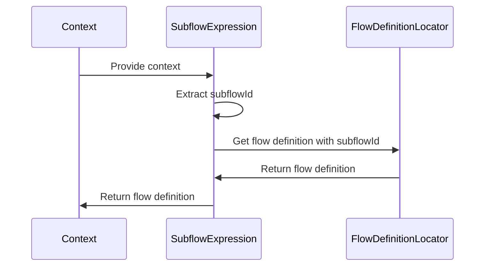
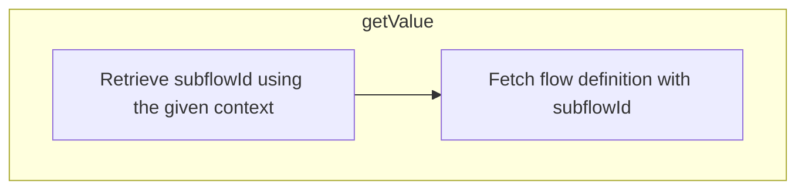
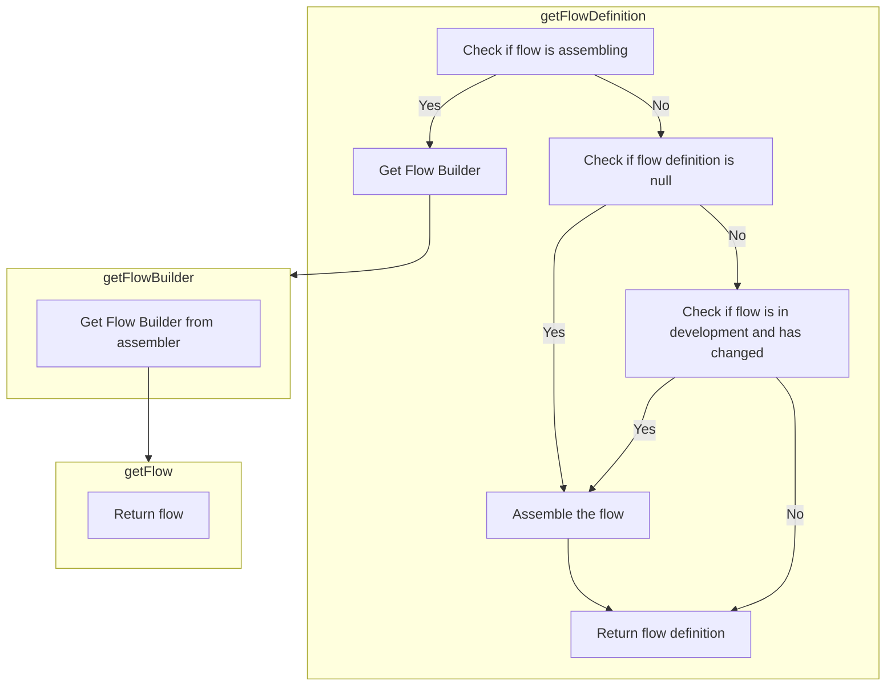
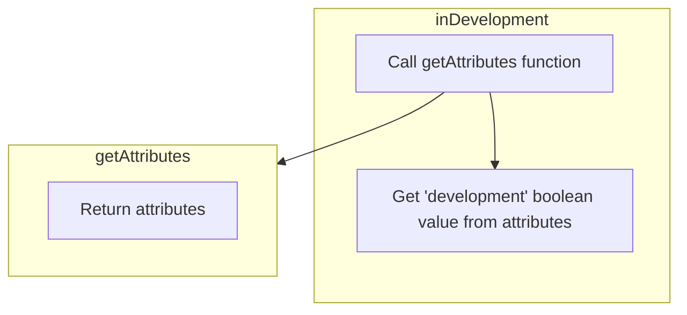
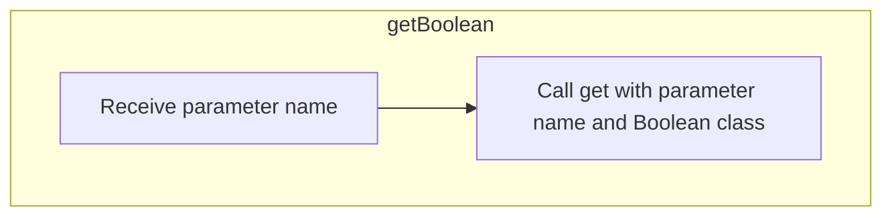
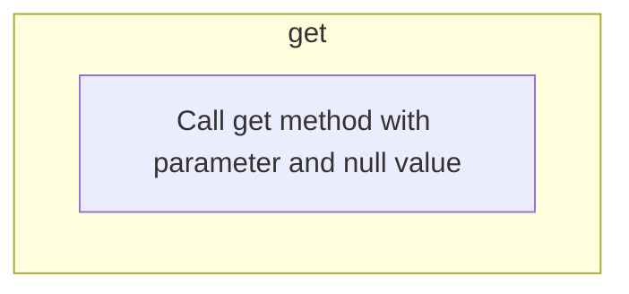
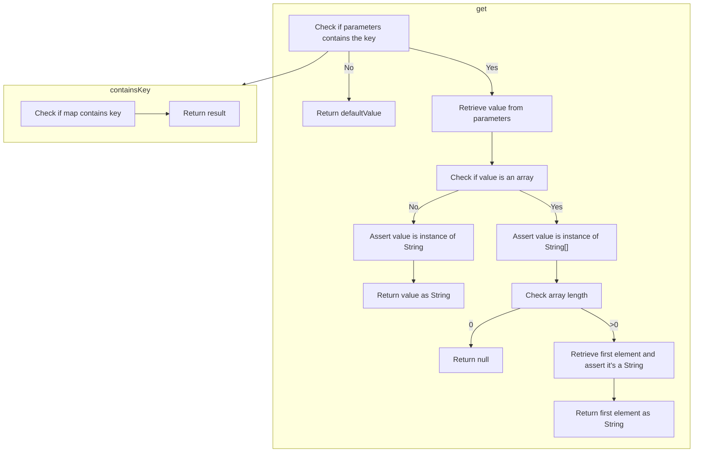
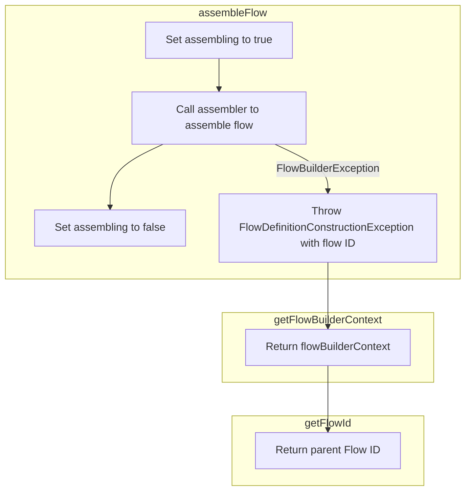

```mermaid
graph TD
  subgraph assertKeyValueInstanceOf
    assertKeyValueInstanceOf:A["Check if requiredType is not null"] --> assertKeyValueInstanceOf:B["Check if value is not null and not instance of requiredType"]
    assertKeyValueInstanceOf:B -->|Yes| assertKeyValueInstanceOf:C["Throw IllegalArgumentException"]
    assertKeyValueInstanceOf:B -->|No| assertKeyValueInstanceOf:D["Return value"]
  end
  subgraph getName
    getName:A["Return variable name"]
  end

%% Swimm:
%% graph TD
%%   subgraph <SwmToken path="spring-webflow/src/main/java/org/springframework/webflow/core/collection/LocalParameterMap.java" pos="124:3:3" line-data="			parameterAccessor.assertKeyValueInstanceOf(parameterName, value, String[].class);">`assertKeyValueInstanceOf`</SwmToken>
%%     <SwmToken path="spring-webflow/src/main/java/org/springframework/webflow/core/collection/LocalParameterMap.java" pos="124:3:3" line-data="			parameterAccessor.assertKeyValueInstanceOf(parameterName, value, String[].class);">`assertKeyValueInstanceOf`</SwmToken>:A["Check if <SwmToken path="spring-binding/src/main/java/org/springframework/binding/collection/MapAccessor.java" pos="420:6:6" line-data="	 * @param requiredType the required type">`requiredType`</SwmToken> is not null"] --> <SwmToken path="spring-webflow/src/main/java/org/springframework/webflow/core/collection/LocalParameterMap.java" pos="124:3:3" line-data="			parameterAccessor.assertKeyValueInstanceOf(parameterName, value, String[].class);">`assertKeyValueInstanceOf`</SwmToken>:B["Check if value is not null and not instance of <SwmToken path="spring-binding/src/main/java/org/springframework/binding/collection/MapAccessor.java" pos="420:6:6" line-data="	 * @param requiredType the required type">`requiredType`</SwmToken>"]
%%     <SwmToken path="spring-webflow/src/main/java/org/springframework/webflow/core/collection/LocalParameterMap.java" pos="124:3:3" line-data="			parameterAccessor.assertKeyValueInstanceOf(parameterName, value, String[].class);">`assertKeyValueInstanceOf`</SwmToken>:B -->|Yes| <SwmToken path="spring-webflow/src/main/java/org/springframework/webflow/core/collection/LocalParameterMap.java" pos="124:3:3" line-data="			parameterAccessor.assertKeyValueInstanceOf(parameterName, value, String[].class);">`assertKeyValueInstanceOf`</SwmToken>:C["Throw <SwmToken path="spring-binding/src/main/java/org/springframework/binding/collection/MapAccessor.java" pos="427:5:5" line-data="			throw new IllegalArgumentException(&quot;Map key &#39;&quot; + key + &quot;&#39; has value [&quot; + value">`IllegalArgumentException`</SwmToken>"]
%%     <SwmToken path="spring-webflow/src/main/java/org/springframework/webflow/core/collection/LocalParameterMap.java" pos="124:3:3" line-data="			parameterAccessor.assertKeyValueInstanceOf(parameterName, value, String[].class);">`assertKeyValueInstanceOf`</SwmToken>:B -->|No| <SwmToken path="spring-webflow/src/main/java/org/springframework/webflow/core/collection/LocalParameterMap.java" pos="124:3:3" line-data="			parameterAccessor.assertKeyValueInstanceOf(parameterName, value, String[].class);">`assertKeyValueInstanceOf`</SwmToken>:D["Return value"]
%%   end
%%   subgraph <SwmToken path="spring-binding/src/main/java/org/springframework/binding/collection/MapAccessor.java" pos="429:9:9" line-data="					+ value.getClass().getName() + &quot;]&quot;);">`getName`</SwmToken>
%%     <SwmToken path="spring-binding/src/main/java/org/springframework/binding/collection/MapAccessor.java" pos="429:9:9" line-data="					+ value.getClass().getName() + &quot;]&quot;);">`getName`</SwmToken>:A["Return variable name"]
%%   end
```

This document explains the process of retrieving a flow definition using the <SwmToken path="spring-webflow/src/main/java/org/springframework/webflow/engine/builder/model/SubflowExpression.java" pos="33:5:5" line-data="	public Object getValue(Object context) throws EvaluationException {">`getValue`</SwmToken> method. This method is essential for determining which flow definition to use based on the provided context, ensuring that the correct flow is executed.

For instance, when a specific subflow needs to be executed, the <SwmToken path="spring-webflow/src/main/java/org/springframework/webflow/engine/builder/model/SubflowExpression.java" pos="33:5:5" line-data="	public Object getValue(Object context) throws EvaluationException {">`getValue`</SwmToken> method extracts the <SwmToken path="spring-webflow/src/main/java/org/springframework/webflow/engine/builder/model/SubflowExpression.java" pos="34:3:3" line-data="		String subflowId = (String) this.subflowId.getValue(context);">`subflowId`</SwmToken> from the context and retrieves the corresponding flow definition. This ensures that the application can dynamically determine and execute the appropriate flow based on the current context.



# Where is this flow used?

This flow is used multiple times in the codebase as represented in the following diagram:

(Note - these are only some of the entry points of this flow)

```mermaid
graph TD;
      subgraph springwebflowsrcmainjavaorgspringframeworkwebflowenginebuildermodel[spring-webflow/…/builder/model]
220e55aa095ef43cfade7e36fa6c5638ad32472f2bd6f9596009be75d80d7a1f(SubflowExpression.getValue) --> 220e55aa095ef43cfade7e36fa6c5638ad32472f2bd6f9596009be75d80d7a1f(SubflowExpression.getValue)
end

subgraph springwebflowsrcmainjavaorgspringframeworkwebflowenginebuildermodel[spring-webflow/…/builder/model]
387071bce3784df0ea7a19728f499d1c435933f20b4a167c8cc1fedca6204315(parseFlowInputMapping) --> 220e55aa095ef43cfade7e36fa6c5638ad32472f2bd6f9596009be75d80d7a1f(SubflowExpression.getValue)
end

subgraph springwebflowsrcmainjavaorgspringframeworkwebflowenginebuildermodel[spring-webflow/…/builder/model]
f63b9efcab06b3607d0b6987a03a892b8781397e899614c01b7d7254680472db(parseFlowInputMapper) --> 387071bce3784df0ea7a19728f499d1c435933f20b4a167c8cc1fedca6204315(parseFlowInputMapping)
end

subgraph springwebflowsrcmainjavaorgspringframeworkwebflowenginebuildermodel[spring-webflow/…/builder/model]
49b1ccc3c1b8fa3198436303ff06a5c15d074e48f78e9703c9c0ea93289a81c0(buildInputMapper) --> f63b9efcab06b3607d0b6987a03a892b8781397e899614c01b7d7254680472db(parseFlowInputMapper)
end

subgraph springwebflowsrcmainjavaorgspringframeworkwebflowenginebuildermodel[spring-webflow/…/builder/model]
bcf7d04f200577b40e0b7b535490bb15600fd695cc4744ce27bd877350dc114d(parseSubflowInputMapping) --> 220e55aa095ef43cfade7e36fa6c5638ad32472f2bd6f9596009be75d80d7a1f(SubflowExpression.getValue)
end

subgraph springwebflowsrcmainjavaorgspringframeworkwebflowenginebuildermodel[spring-webflow/…/builder/model]
556cae6e67cda19644017f7c93aa4102bea14d9cf63e1fa290b3b0a0cfc364a9(parseSubflowInputMapper) --> bcf7d04f200577b40e0b7b535490bb15600fd695cc4744ce27bd877350dc114d(parseSubflowInputMapping)
end

subgraph springwebflowsrcmainjavaorgspringframeworkwebflowenginebuildermodel[spring-webflow/…/builder/model]
d638420117f61b40548ce22530bcd24bf8dde83c8fb60ce1950323cef10e416a(parseSubflowAttributeMapper) --> 556cae6e67cda19644017f7c93aa4102bea14d9cf63e1fa290b3b0a0cfc364a9(parseSubflowInputMapper)
end

subgraph springwebflowsrcmainjavaorgspringframeworkwebflowenginebuildermodel[spring-webflow/…/builder/model]
d638420117f61b40548ce22530bcd24bf8dde83c8fb60ce1950323cef10e416a(parseSubflowAttributeMapper) --> 9ea4aa8de487562a61f6e1683b65a5b41e541b5feaa874d614beb898f8481eb4(parseSubflowOutputMapper)
end

subgraph springwebflowsrcmainjavaorgspringframeworkwebflowenginebuildermodel[spring-webflow/…/builder/model]
e1f5d334a044786e4a4cb53ecd3cbd5ee18181025b5d82616afd24f0b2deeb17(parseAndAddSubflowState) --> d638420117f61b40548ce22530bcd24bf8dde83c8fb60ce1950323cef10e416a(parseSubflowAttributeMapper)
end

subgraph springwebflowsrcmainjavaorgspringframeworkwebflowenginebuildermodel[spring-webflow/…/builder/model]
e1f5d334a044786e4a4cb53ecd3cbd5ee18181025b5d82616afd24f0b2deeb17(parseAndAddSubflowState) --> d3facd470e16c34d6307594c98edf473886bf3b7accdc03109d550cd71d872c9(parseActions)
end

subgraph springwebflowsrcmainjavaorgspringframeworkwebflowenginebuildermodel[spring-webflow/…/builder/model]
e1f5d334a044786e4a4cb53ecd3cbd5ee18181025b5d82616afd24f0b2deeb17(parseAndAddSubflowState) --> de5b3eddca6e2a99352d93468bf0f4c0593c418654d8c72b0bc260032ce0e0f1(parseExceptionHandlers)
end

subgraph springwebflowsrcmainjavaorgspringframeworkwebflowenginebuildermodel[spring-webflow/…/builder/model]
e1f5d334a044786e4a4cb53ecd3cbd5ee18181025b5d82616afd24f0b2deeb17(parseAndAddSubflowState) --> e8410e3b541ed84cf93d3cf313823226363a4ae835feff87091d6e7e47fa3163(parseTransitions)
end

subgraph springwebflowsrcmainjavaorgspringframeworkwebflowenginebuildermodel[spring-webflow/…/builder/model]
e1f5d334a044786e4a4cb53ecd3cbd5ee18181025b5d82616afd24f0b2deeb17(parseAndAddSubflowState) --> 878f12a5f11889a915a25a51f23d1ab4a14461f3434220ad2f375fe32b78aad1(parseMetaAttributes)
end

subgraph springwebflowsrcmainjavaorgspringframeworkwebflowenginebuildermodel[spring-webflow/…/builder/model]
80d714d24669a6d98648cb807f43932b2ad32db2684e3fd188cea80062eb1604(buildStates) --> e1f5d334a044786e4a4cb53ecd3cbd5ee18181025b5d82616afd24f0b2deeb17(parseAndAddSubflowState)
end

subgraph springwebflowsrcmainjavaorgspringframeworkwebflowenginebuildermodel[spring-webflow/…/builder/model]
80d714d24669a6d98648cb807f43932b2ad32db2684e3fd188cea80062eb1604(buildStates) --> 0cab62e221f6f1870a5650ab697221b63fe822409850f88ca5dcac0bd1535c43(parseAndAddEndState)
end

subgraph springwebflowsrcmainjavaorgspringframeworkwebflowenginebuildermodel[spring-webflow/…/builder/model]
80d714d24669a6d98648cb807f43932b2ad32db2684e3fd188cea80062eb1604(buildStates) --> b922f3f8059d1568b2222593691e9a43b2e699599d5225e3d5c8deb8ba023976(parseAndAddViewState)
end

subgraph springwebflowsrcmainjavaorgspringframeworkwebflowenginebuildermodel[spring-webflow/…/builder/model]
80d714d24669a6d98648cb807f43932b2ad32db2684e3fd188cea80062eb1604(buildStates) --> bb32a9c3d4535d6be419bc8217ed62afa164f3b728bfed06ba1f00f6874fd79d(parseAndAddActionState)
end

subgraph springwebflowsrcmainjavaorgspringframeworkwebflowenginebuildermodel[spring-webflow/…/builder/model]
80d714d24669a6d98648cb807f43932b2ad32db2684e3fd188cea80062eb1604(buildStates) --> 482009177c92fca2128b523813ac3579e693d0b371473b9d436e20624b85039f(parseAndAddDecisionState)
end

subgraph springwebflowsrcmainjavaorgspringframeworkwebflowenginebuildermodel[spring-webflow/…/builder/model]
2f179427de9ff5829f2fe810c39b13981e127d43d0dd12ffc8c00d73310e2ca5(directAssembly) --> 80d714d24669a6d98648cb807f43932b2ad32db2684e3fd188cea80062eb1604(buildStates)
end

subgraph springwebflowsrcmainjavaorgspringframeworkwebflowenginebuilderFlowAssemblerjava[spring-webflow/…/builder/FlowAssembler.java]
98c055c9b71322fa06a3f80b548fc9ac3bba717c9bc5f7729bedda3b5053efba(assembleFlow) --> 2f179427de9ff5829f2fe810c39b13981e127d43d0dd12ffc8c00d73310e2ca5(directAssembly)
end

subgraph springwebflowsrcmainjavaorgspringframeworkwebflowenginebuilderFlowAssemblerjava[spring-webflow/…/builder/FlowAssembler.java]
b61d14bc393f7b95415127363fcb9967656809bc62cdaa5ae06d9f081f7afde0(buildFlowDefinition) --> 98c055c9b71322fa06a3f80b548fc9ac3bba717c9bc5f7729bedda3b5053efba(assembleFlow)
end

subgraph springwebflowsrcmainjavaorgspringframeworkwebflowconfig[spring-webflow/…/webflow/config]
ad93a501c5167d5f44320fc4f5bf79429a0a8fa379e0d876b13e591781d40b86(registerFlowBuilders) --> b61d14bc393f7b95415127363fcb9967656809bc62cdaa5ae06d9f081f7afde0(buildFlowDefinition)
end

subgraph springwebflowsrcmainjavaorgspringframeworkwebflowconfig[spring-webflow/…/webflow/config]
1b90ecf800bbc7530a7fa1ce5da86edf43748f2181cd61cce0354fd86270baa3(afterPropertiesSet) --> ad93a501c5167d5f44320fc4f5bf79429a0a8fa379e0d876b13e591781d40b86(registerFlowBuilders)
end

subgraph springwebflowsrcmainjavaorgspringframeworkwebflowenginebuilderFlowAssemblerjava[spring-webflow/…/builder/FlowAssembler.java]
55b04cc845d25b7e0c21126e49b46672d760a40484ba2a0968c13813c003e13f(registerFlowBuilders) --> 98c055c9b71322fa06a3f80b548fc9ac3bba717c9bc5f7729bedda3b5053efba(assembleFlow)
end

subgraph springwebflowsrcmainjavaorgspringframeworkwebflowconfig[spring-webflow/…/webflow/config]
5ea9a3feeed8ad6d34de42f261caa9230b8ece470b9be1cfb63b5ac3dff9a97c(build) --> 55b04cc845d25b7e0c21126e49b46672d760a40484ba2a0968c13813c003e13f(registerFlowBuilders)
end

subgraph springwebflowsrcmainjavaorgspringframeworkwebflowconfig[spring-webflow/…/webflow/config]
e8cc0123680495888518bed32ace4fc20e41ea6ec58363164584f8c1c181a00b(FlowDefinitionRegistryBuilder) --> 5ea9a3feeed8ad6d34de42f261caa9230b8ece470b9be1cfb63b5ac3dff9a97c(build)
end

subgraph springwebflowsrcmainjavaorgspringframeworkwebflowenginebuildermodel[spring-webflow/…/builder/model]
0207403ab85551fc7273c1ce26425378adac0cd6340973a20db710e4e64b4bc5(parseFlowOutputMapping) --> 220e55aa095ef43cfade7e36fa6c5638ad32472f2bd6f9596009be75d80d7a1f(SubflowExpression.getValue)
end

subgraph springwebflowsrcmainjavaorgspringframeworkwebflowenginebuildermodel[spring-webflow/…/builder/model]
c9b9ad019049190fbd9f7a4787ab123a14dc030d6f47190a8d7be29ed4c65925(parseFlowOutputMapper) --> 0207403ab85551fc7273c1ce26425378adac0cd6340973a20db710e4e64b4bc5(parseFlowOutputMapping)
end

subgraph springwebflowsrcmainjavaorgspringframeworkwebflowenginebuildermodel[spring-webflow/…/builder/model]
5459077bd95ac8612d11d46cf3f8adb2116e715211feb455e1cf92552df081f7(buildOutputMapper) --> c9b9ad019049190fbd9f7a4787ab123a14dc030d6f47190a8d7be29ed4c65925(parseFlowOutputMapper)
end

subgraph springwebflowsrcmainjavaorgspringframeworkwebflowenginebuildermodel[spring-webflow/…/builder/model]
0cab62e221f6f1870a5650ab697221b63fe822409850f88ca5dcac0bd1535c43(parseAndAddEndState) --> c9b9ad019049190fbd9f7a4787ab123a14dc030d6f47190a8d7be29ed4c65925(parseFlowOutputMapper)
end

subgraph springwebflowsrcmainjavaorgspringframeworkwebflowenginebuildermodel[spring-webflow/…/builder/model]
0cab62e221f6f1870a5650ab697221b63fe822409850f88ca5dcac0bd1535c43(parseAndAddEndState) --> d3facd470e16c34d6307594c98edf473886bf3b7accdc03109d550cd71d872c9(parseActions)
end

subgraph springwebflowsrcmainjavaorgspringframeworkwebflowenginebuildermodel[spring-webflow/…/builder/model]
0cab62e221f6f1870a5650ab697221b63fe822409850f88ca5dcac0bd1535c43(parseAndAddEndState) --> de5b3eddca6e2a99352d93468bf0f4c0593c418654d8c72b0bc260032ce0e0f1(parseExceptionHandlers)
end

subgraph springwebflowsrcmainjavaorgspringframeworkwebflowenginebuildermodel[spring-webflow/…/builder/model]
0cab62e221f6f1870a5650ab697221b63fe822409850f88ca5dcac0bd1535c43(parseAndAddEndState) --> 878f12a5f11889a915a25a51f23d1ab4a14461f3434220ad2f375fe32b78aad1(parseMetaAttributes)
end

subgraph springwebflowsrcmainjavaorgspringframeworkwebflowenginebuildermodel[spring-webflow/…/builder/model]
a3601179b0f84faf5f6046ac84985a84a5892508e478e00828735a1e51b88d99(parseSubflowOutputMapping) --> 220e55aa095ef43cfade7e36fa6c5638ad32472f2bd6f9596009be75d80d7a1f(SubflowExpression.getValue)
end

subgraph springwebflowsrcmainjavaorgspringframeworkwebflowenginebuildermodel[spring-webflow/…/builder/model]
9ea4aa8de487562a61f6e1683b65a5b41e541b5feaa874d614beb898f8481eb4(parseSubflowOutputMapper) --> a3601179b0f84faf5f6046ac84985a84a5892508e478e00828735a1e51b88d99(parseSubflowOutputMapping)
end

subgraph springwebflowsrcmainjavaorgspringframeworkwebflowenginebuildermodel[spring-webflow/…/builder/model]
d7ccacea93aad07e4fef28f09e4d920ac8d8138728c77e1cc3f8bb32da8dde03(parseSetAction) --> 220e55aa095ef43cfade7e36fa6c5638ad32472f2bd6f9596009be75d80d7a1f(SubflowExpression.getValue)
end

subgraph springwebflowsrcmainjavaorgspringframeworkwebflowenginebuildermodel[spring-webflow/…/builder/model]
d3facd470e16c34d6307594c98edf473886bf3b7accdc03109d550cd71d872c9(parseActions) --> d7ccacea93aad07e4fef28f09e4d920ac8d8138728c77e1cc3f8bb32da8dde03(parseSetAction)
end

subgraph springwebflowsrcmainjavaorgspringframeworkwebflowenginebuildermodel[spring-webflow/…/builder/model]
d3facd470e16c34d6307594c98edf473886bf3b7accdc03109d550cd71d872c9(parseActions) --> 878f12a5f11889a915a25a51f23d1ab4a14461f3434220ad2f375fe32b78aad1(parseMetaAttributes)
end

subgraph springwebflowsrcmainjavaorgspringframeworkwebflowenginebuildermodel[spring-webflow/…/builder/model]
db05c4e073fc7adc9ac6c97ec7213eb6445850aca5f2a059f1ec5bd9d6a95013(buildStartActions) --> d3facd470e16c34d6307594c98edf473886bf3b7accdc03109d550cd71d872c9(parseActions)
end

subgraph springwebflowsrcmainjavaorgspringframeworkwebflowenginebuildermodel[spring-webflow/…/builder/model]
e8298b856574ac9f33168f6cd2d0a5c1e2f46338422f3e15528045a90ee2fa76(buildEndActions) --> d3facd470e16c34d6307594c98edf473886bf3b7accdc03109d550cd71d872c9(parseActions)
end

subgraph springwebflowsrcmainjavaorgspringframeworkwebflowenginebuildermodel[spring-webflow/…/builder/model]
b922f3f8059d1568b2222593691e9a43b2e699599d5225e3d5c8deb8ba023976(parseAndAddViewState) --> d3facd470e16c34d6307594c98edf473886bf3b7accdc03109d550cd71d872c9(parseActions)
end

subgraph springwebflowsrcmainjavaorgspringframeworkwebflowenginebuildermodel[spring-webflow/…/builder/model]
b922f3f8059d1568b2222593691e9a43b2e699599d5225e3d5c8deb8ba023976(parseAndAddViewState) --> de5b3eddca6e2a99352d93468bf0f4c0593c418654d8c72b0bc260032ce0e0f1(parseExceptionHandlers)
end

subgraph springwebflowsrcmainjavaorgspringframeworkwebflowenginebuildermodel[spring-webflow/…/builder/model]
b922f3f8059d1568b2222593691e9a43b2e699599d5225e3d5c8deb8ba023976(parseAndAddViewState) --> e8410e3b541ed84cf93d3cf313823226363a4ae835feff87091d6e7e47fa3163(parseTransitions)
end

subgraph springwebflowsrcmainjavaorgspringframeworkwebflowenginebuildermodel[spring-webflow/…/builder/model]
b922f3f8059d1568b2222593691e9a43b2e699599d5225e3d5c8deb8ba023976(parseAndAddViewState) --> 878f12a5f11889a915a25a51f23d1ab4a14461f3434220ad2f375fe32b78aad1(parseMetaAttributes)
end

subgraph springwebflowsrcmainjavaorgspringframeworkwebflowenginebuildermodel[spring-webflow/…/builder/model]
bb32a9c3d4535d6be419bc8217ed62afa164f3b728bfed06ba1f00f6874fd79d(parseAndAddActionState) --> d3facd470e16c34d6307594c98edf473886bf3b7accdc03109d550cd71d872c9(parseActions)
end

subgraph springwebflowsrcmainjavaorgspringframeworkwebflowenginebuildermodel[spring-webflow/…/builder/model]
bb32a9c3d4535d6be419bc8217ed62afa164f3b728bfed06ba1f00f6874fd79d(parseAndAddActionState) --> de5b3eddca6e2a99352d93468bf0f4c0593c418654d8c72b0bc260032ce0e0f1(parseExceptionHandlers)
end

subgraph springwebflowsrcmainjavaorgspringframeworkwebflowenginebuildermodel[spring-webflow/…/builder/model]
bb32a9c3d4535d6be419bc8217ed62afa164f3b728bfed06ba1f00f6874fd79d(parseAndAddActionState) --> e8410e3b541ed84cf93d3cf313823226363a4ae835feff87091d6e7e47fa3163(parseTransitions)
end

subgraph springwebflowsrcmainjavaorgspringframeworkwebflowenginebuildermodel[spring-webflow/…/builder/model]
bb32a9c3d4535d6be419bc8217ed62afa164f3b728bfed06ba1f00f6874fd79d(parseAndAddActionState) --> 878f12a5f11889a915a25a51f23d1ab4a14461f3434220ad2f375fe32b78aad1(parseMetaAttributes)
end

subgraph springwebflowsrcmainjavaorgspringframeworkwebflowenginebuildermodel[spring-webflow/…/builder/model]
482009177c92fca2128b523813ac3579e693d0b371473b9d436e20624b85039f(parseAndAddDecisionState) --> d3facd470e16c34d6307594c98edf473886bf3b7accdc03109d550cd71d872c9(parseActions)
end

subgraph springwebflowsrcmainjavaorgspringframeworkwebflowenginebuildermodel[spring-webflow/…/builder/model]
482009177c92fca2128b523813ac3579e693d0b371473b9d436e20624b85039f(parseAndAddDecisionState) --> de5b3eddca6e2a99352d93468bf0f4c0593c418654d8c72b0bc260032ce0e0f1(parseExceptionHandlers)
end

subgraph springwebflowsrcmainjavaorgspringframeworkwebflowenginebuildermodel[spring-webflow/…/builder/model]
482009177c92fca2128b523813ac3579e693d0b371473b9d436e20624b85039f(parseAndAddDecisionState) --> 878f12a5f11889a915a25a51f23d1ab4a14461f3434220ad2f375fe32b78aad1(parseMetaAttributes)
end

subgraph springwebflowsrcmainjavaorgspringframeworkwebflowenginebuildermodel[spring-webflow/…/builder/model]
6ef62679ea6c5d7b1d339b5fd374ec478ed8a66d60ccb4c5e2b8ae25d971e660(parseTransitionExecutingExceptionHandler) --> d3facd470e16c34d6307594c98edf473886bf3b7accdc03109d550cd71d872c9(parseActions)
end

subgraph springwebflowsrcmainjavaorgspringframeworkwebflowenginebuildermodel[spring-webflow/…/builder/model]
6c255f7d2531ba8470bf806f2dd526279f0a73de4ef975792be433f325f28046(parseTransitionExecutingExceptionHandlers) --> 6ef62679ea6c5d7b1d339b5fd374ec478ed8a66d60ccb4c5e2b8ae25d971e660(parseTransitionExecutingExceptionHandler)
end

subgraph springwebflowsrcmainjavaorgspringframeworkwebflowenginebuildermodel[spring-webflow/…/builder/model]
de5b3eddca6e2a99352d93468bf0f4c0593c418654d8c72b0bc260032ce0e0f1(parseExceptionHandlers) --> 6c255f7d2531ba8470bf806f2dd526279f0a73de4ef975792be433f325f28046(parseTransitionExecutingExceptionHandlers)
end

subgraph springwebflowsrcmainjavaorgspringframeworkwebflowenginebuildermodel[spring-webflow/…/builder/model]
4dc620f1d328175a30900792746e542ac6d86346d524ac58853c3e7c8fabdb7e(buildExceptionHandlers) --> de5b3eddca6e2a99352d93468bf0f4c0593c418654d8c72b0bc260032ce0e0f1(parseExceptionHandlers)
end

subgraph springwebflowsrcmainjavaorgspringframeworkwebflowenginebuildermodel[spring-webflow/…/builder/model]
1bbc9fe60a8d0446fa804ad425d685cada8f5e118367cc0bae629f7a86ea551a(parseTransition) --> d3facd470e16c34d6307594c98edf473886bf3b7accdc03109d550cd71d872c9(parseActions)
end

subgraph springwebflowsrcmainjavaorgspringframeworkwebflowenginebuildermodel[spring-webflow/…/builder/model]
1bbc9fe60a8d0446fa804ad425d685cada8f5e118367cc0bae629f7a86ea551a(parseTransition) --> 878f12a5f11889a915a25a51f23d1ab4a14461f3434220ad2f375fe32b78aad1(parseMetaAttributes)
end

subgraph springwebflowsrcmainjavaorgspringframeworkwebflowenginebuildermodel[spring-webflow/…/builder/model]
e8410e3b541ed84cf93d3cf313823226363a4ae835feff87091d6e7e47fa3163(parseTransitions) --> 1bbc9fe60a8d0446fa804ad425d685cada8f5e118367cc0bae629f7a86ea551a(parseTransition)
end

subgraph springwebflowsrcmainjavaorgspringframeworkwebflowenginebuildermodel[spring-webflow/…/builder/model]
9ff35a0f5ef811ba5664f22e8c6f19aa98eab3bc988feb6941d5ad8080fe3189(buildGlobalTransitions) --> e8410e3b541ed84cf93d3cf313823226363a4ae835feff87091d6e7e47fa3163(parseTransitions)
end

subgraph springwebflowsrcmainjavaorgspringframeworkwebflowenginebuildermodel[spring-webflow/…/builder/model]
f2bf42daf3dea853be5364521925248a521041d28b4d28f11052cf886e87b37d(parseAndPutMetaAttribute) --> 220e55aa095ef43cfade7e36fa6c5638ad32472f2bd6f9596009be75d80d7a1f(SubflowExpression.getValue)
end

subgraph springwebflowsrcmainjavaorgspringframeworkwebflowenginebuildermodel[spring-webflow/…/builder/model]
878f12a5f11889a915a25a51f23d1ab4a14461f3434220ad2f375fe32b78aad1(parseMetaAttributes) --> f2bf42daf3dea853be5364521925248a521041d28b4d28f11052cf886e87b37d(parseAndPutMetaAttribute)
end

subgraph springwebflowsrcmainjavaorgspringframeworkwebflowenginebuildermodel[spring-webflow/…/builder/model]
3051216588f53cfc54a8774835a481a54c8a160b3d8c37f854aecde3ee9cbc7b(parseFlowMetaAttributes) --> 878f12a5f11889a915a25a51f23d1ab4a14461f3434220ad2f375fe32b78aad1(parseMetaAttributes)
end

subgraph springwebflowsrcmainjavaorgspringframeworkwebflowenginebuildermodel[spring-webflow/…/builder/model]
1941ec76fdbbbd18bd110e70f257a0b1893155e90d293a6e829b7f6cb518eb02(createFlow) --> 3051216588f53cfc54a8774835a481a54c8a160b3d8c37f854aecde3ee9cbc7b(parseFlowMetaAttributes)
end

subgraph springwebflowsrcmainjavaorgspringframeworkwebflowenginebuildermodel[spring-webflow/…/builder/model]
1941ec76fdbbbd18bd110e70f257a0b1893155e90d293a6e829b7f6cb518eb02(createFlow) --> 1941ec76fdbbbd18bd110e70f257a0b1893155e90d293a6e829b7f6cb518eb02(createFlow)
end


      classDef mainFlowStyle color:#000000,fill:#7CB9F4
classDef rootsStyle color:#000000,fill:#00FFF4
classDef Style1 color:#000000,fill:#00FFAA
classDef Style2 color:#000000,fill:#FFFF00
classDef Style3 color:#000000,fill:#AA7CB9

%% Swimm:
%% graph TD;
%%       subgraph springwebflowsrcmainjavaorgspringframeworkwebflowenginebuildermodel[<SwmPath>[spring-webflow/…/builder/model/](spring-webflow/src/main/java/org/springframework/webflow/engine/builder/model/)</SwmPath>]
%% 220e55aa095ef43cfade7e36fa6c5638ad32472f2bd6f9596009be75d80d7a1f(SubflowExpression.getValue) --> 220e55aa095ef43cfade7e36fa6c5638ad32472f2bd6f9596009be75d80d7a1f(SubflowExpression.getValue)
%% end
%% 
%% subgraph springwebflowsrcmainjavaorgspringframeworkwebflowenginebuildermodel[<SwmPath>[spring-webflow/…/builder/model/](spring-webflow/src/main/java/org/springframework/webflow/engine/builder/model/)</SwmPath>]
%% 387071bce3784df0ea7a19728f499d1c435933f20b4a167c8cc1fedca6204315(parseFlowInputMapping) --> 220e55aa095ef43cfade7e36fa6c5638ad32472f2bd6f9596009be75d80d7a1f(SubflowExpression.getValue)
%% end
%% 
%% subgraph springwebflowsrcmainjavaorgspringframeworkwebflowenginebuildermodel[<SwmPath>[spring-webflow/…/builder/model/](spring-webflow/src/main/java/org/springframework/webflow/engine/builder/model/)</SwmPath>]
%% f63b9efcab06b3607d0b6987a03a892b8781397e899614c01b7d7254680472db(parseFlowInputMapper) --> 387071bce3784df0ea7a19728f499d1c435933f20b4a167c8cc1fedca6204315(parseFlowInputMapping)
%% end
%% 
%% subgraph springwebflowsrcmainjavaorgspringframeworkwebflowenginebuildermodel[<SwmPath>[spring-webflow/…/builder/model/](spring-webflow/src/main/java/org/springframework/webflow/engine/builder/model/)</SwmPath>]
%% 49b1ccc3c1b8fa3198436303ff06a5c15d074e48f78e9703c9c0ea93289a81c0(<SwmToken path="spring-webflow/src/main/java/org/springframework/webflow/engine/builder/support/AbstractFlowBuilder.java" pos="79:5:5" line-data="	public void buildInputMapper() throws FlowBuilderException {">`buildInputMapper`</SwmToken>) --> f63b9efcab06b3607d0b6987a03a892b8781397e899614c01b7d7254680472db(parseFlowInputMapper)
%% end
%% 
%% subgraph springwebflowsrcmainjavaorgspringframeworkwebflowenginebuildermodel[<SwmPath>[spring-webflow/…/builder/model/](spring-webflow/src/main/java/org/springframework/webflow/engine/builder/model/)</SwmPath>]
%% bcf7d04f200577b40e0b7b535490bb15600fd695cc4744ce27bd877350dc114d(parseSubflowInputMapping) --> 220e55aa095ef43cfade7e36fa6c5638ad32472f2bd6f9596009be75d80d7a1f(SubflowExpression.getValue)
%% end
%% 
%% subgraph springwebflowsrcmainjavaorgspringframeworkwebflowenginebuildermodel[<SwmPath>[spring-webflow/…/builder/model/](spring-webflow/src/main/java/org/springframework/webflow/engine/builder/model/)</SwmPath>]
%% 556cae6e67cda19644017f7c93aa4102bea14d9cf63e1fa290b3b0a0cfc364a9(parseSubflowInputMapper) --> bcf7d04f200577b40e0b7b535490bb15600fd695cc4744ce27bd877350dc114d(parseSubflowInputMapping)
%% end
%% 
%% subgraph springwebflowsrcmainjavaorgspringframeworkwebflowenginebuildermodel[<SwmPath>[spring-webflow/…/builder/model/](spring-webflow/src/main/java/org/springframework/webflow/engine/builder/model/)</SwmPath>]
%% d638420117f61b40548ce22530bcd24bf8dde83c8fb60ce1950323cef10e416a(parseSubflowAttributeMapper) --> 556cae6e67cda19644017f7c93aa4102bea14d9cf63e1fa290b3b0a0cfc364a9(parseSubflowInputMapper)
%% end
%% 
%% subgraph springwebflowsrcmainjavaorgspringframeworkwebflowenginebuildermodel[<SwmPath>[spring-webflow/…/builder/model/](spring-webflow/src/main/java/org/springframework/webflow/engine/builder/model/)</SwmPath>]
%% d638420117f61b40548ce22530bcd24bf8dde83c8fb60ce1950323cef10e416a(parseSubflowAttributeMapper) --> 9ea4aa8de487562a61f6e1683b65a5b41e541b5feaa874d614beb898f8481eb4(parseSubflowOutputMapper)
%% end
%% 
%% subgraph springwebflowsrcmainjavaorgspringframeworkwebflowenginebuildermodel[<SwmPath>[spring-webflow/…/builder/model/](spring-webflow/src/main/java/org/springframework/webflow/engine/builder/model/)</SwmPath>]
%% e1f5d334a044786e4a4cb53ecd3cbd5ee18181025b5d82616afd24f0b2deeb17(parseAndAddSubflowState) --> d638420117f61b40548ce22530bcd24bf8dde83c8fb60ce1950323cef10e416a(parseSubflowAttributeMapper)
%% end
%% 
%% subgraph springwebflowsrcmainjavaorgspringframeworkwebflowenginebuildermodel[<SwmPath>[spring-webflow/…/builder/model/](spring-webflow/src/main/java/org/springframework/webflow/engine/builder/model/)</SwmPath>]
%% e1f5d334a044786e4a4cb53ecd3cbd5ee18181025b5d82616afd24f0b2deeb17(parseAndAddSubflowState) --> d3facd470e16c34d6307594c98edf473886bf3b7accdc03109d550cd71d872c9(parseActions)
%% end
%% 
%% subgraph springwebflowsrcmainjavaorgspringframeworkwebflowenginebuildermodel[<SwmPath>[spring-webflow/…/builder/model/](spring-webflow/src/main/java/org/springframework/webflow/engine/builder/model/)</SwmPath>]
%% e1f5d334a044786e4a4cb53ecd3cbd5ee18181025b5d82616afd24f0b2deeb17(parseAndAddSubflowState) --> de5b3eddca6e2a99352d93468bf0f4c0593c418654d8c72b0bc260032ce0e0f1(parseExceptionHandlers)
%% end
%% 
%% subgraph springwebflowsrcmainjavaorgspringframeworkwebflowenginebuildermodel[<SwmPath>[spring-webflow/…/builder/model/](spring-webflow/src/main/java/org/springframework/webflow/engine/builder/model/)</SwmPath>]
%% e1f5d334a044786e4a4cb53ecd3cbd5ee18181025b5d82616afd24f0b2deeb17(parseAndAddSubflowState) --> e8410e3b541ed84cf93d3cf313823226363a4ae835feff87091d6e7e47fa3163(parseTransitions)
%% end
%% 
%% subgraph springwebflowsrcmainjavaorgspringframeworkwebflowenginebuildermodel[<SwmPath>[spring-webflow/…/builder/model/](spring-webflow/src/main/java/org/springframework/webflow/engine/builder/model/)</SwmPath>]
%% e1f5d334a044786e4a4cb53ecd3cbd5ee18181025b5d82616afd24f0b2deeb17(parseAndAddSubflowState) --> 878f12a5f11889a915a25a51f23d1ab4a14461f3434220ad2f375fe32b78aad1(parseMetaAttributes)
%% end
%% 
%% subgraph springwebflowsrcmainjavaorgspringframeworkwebflowenginebuildermodel[<SwmPath>[spring-webflow/…/builder/model/](spring-webflow/src/main/java/org/springframework/webflow/engine/builder/model/)</SwmPath>]
%% 80d714d24669a6d98648cb807f43932b2ad32db2684e3fd188cea80062eb1604(<SwmToken path="spring-webflow/src/main/java/org/springframework/webflow/engine/builder/support/AbstractFlowBuilder.java" pos="27:16:16" line-data=" * only required to implement {@link #buildStates()}.">`buildStates`</SwmToken>) --> e1f5d334a044786e4a4cb53ecd3cbd5ee18181025b5d82616afd24f0b2deeb17(parseAndAddSubflowState)
%% end
%% 
%% subgraph springwebflowsrcmainjavaorgspringframeworkwebflowenginebuildermodel[<SwmPath>[spring-webflow/…/builder/model/](spring-webflow/src/main/java/org/springframework/webflow/engine/builder/model/)</SwmPath>]
%% 80d714d24669a6d98648cb807f43932b2ad32db2684e3fd188cea80062eb1604(<SwmToken path="spring-webflow/src/main/java/org/springframework/webflow/engine/builder/support/AbstractFlowBuilder.java" pos="27:16:16" line-data=" * only required to implement {@link #buildStates()}.">`buildStates`</SwmToken>) --> 0cab62e221f6f1870a5650ab697221b63fe822409850f88ca5dcac0bd1535c43(parseAndAddEndState)
%% end
%% 
%% subgraph springwebflowsrcmainjavaorgspringframeworkwebflowenginebuildermodel[<SwmPath>[spring-webflow/…/builder/model/](spring-webflow/src/main/java/org/springframework/webflow/engine/builder/model/)</SwmPath>]
%% 80d714d24669a6d98648cb807f43932b2ad32db2684e3fd188cea80062eb1604(<SwmToken path="spring-webflow/src/main/java/org/springframework/webflow/engine/builder/support/AbstractFlowBuilder.java" pos="27:16:16" line-data=" * only required to implement {@link #buildStates()}.">`buildStates`</SwmToken>) --> b922f3f8059d1568b2222593691e9a43b2e699599d5225e3d5c8deb8ba023976(parseAndAddViewState)
%% end
%% 
%% subgraph springwebflowsrcmainjavaorgspringframeworkwebflowenginebuildermodel[<SwmPath>[spring-webflow/…/builder/model/](spring-webflow/src/main/java/org/springframework/webflow/engine/builder/model/)</SwmPath>]
%% 80d714d24669a6d98648cb807f43932b2ad32db2684e3fd188cea80062eb1604(<SwmToken path="spring-webflow/src/main/java/org/springframework/webflow/engine/builder/support/AbstractFlowBuilder.java" pos="27:16:16" line-data=" * only required to implement {@link #buildStates()}.">`buildStates`</SwmToken>) --> bb32a9c3d4535d6be419bc8217ed62afa164f3b728bfed06ba1f00f6874fd79d(parseAndAddActionState)
%% end
%% 
%% subgraph springwebflowsrcmainjavaorgspringframeworkwebflowenginebuildermodel[<SwmPath>[spring-webflow/…/builder/model/](spring-webflow/src/main/java/org/springframework/webflow/engine/builder/model/)</SwmPath>]
%% 80d714d24669a6d98648cb807f43932b2ad32db2684e3fd188cea80062eb1604(<SwmToken path="spring-webflow/src/main/java/org/springframework/webflow/engine/builder/support/AbstractFlowBuilder.java" pos="27:16:16" line-data=" * only required to implement {@link #buildStates()}.">`buildStates`</SwmToken>) --> 482009177c92fca2128b523813ac3579e693d0b371473b9d436e20624b85039f(parseAndAddDecisionState)
%% end
%% 
%% subgraph springwebflowsrcmainjavaorgspringframeworkwebflowenginebuildermodel[<SwmPath>[spring-webflow/…/builder/model/](spring-webflow/src/main/java/org/springframework/webflow/engine/builder/model/)</SwmPath>]
%% 2f179427de9ff5829f2fe810c39b13981e127d43d0dd12ffc8c00d73310e2ca5(<SwmToken path="spring-webflow/src/main/java/org/springframework/webflow/engine/builder/FlowAssembler.java" pos="91:1:1" line-data="			directAssembly();">`directAssembly`</SwmToken>) --> 80d714d24669a6d98648cb807f43932b2ad32db2684e3fd188cea80062eb1604(<SwmToken path="spring-webflow/src/main/java/org/springframework/webflow/engine/builder/support/AbstractFlowBuilder.java" pos="27:16:16" line-data=" * only required to implement {@link #buildStates()}.">`buildStates`</SwmToken>)
%% end
%% 
%% subgraph springwebflowsrcmainjavaorgspringframeworkwebflowenginebuilderFlowAssemblerjava[<SwmPath>[spring-webflow/…/builder/FlowAssembler.java](spring-webflow/src/main/java/org/springframework/webflow/engine/builder/FlowAssembler.java)</SwmPath>]
%% 98c055c9b71322fa06a3f80b548fc9ac3bba717c9bc5f7729bedda3b5053efba(<SwmToken path="spring-webflow/src/main/java/org/springframework/webflow/engine/builder/DefaultFlowHolder.java" pos="84:1:1" line-data="			assembleFlow();">`assembleFlow`</SwmToken>) --> 2f179427de9ff5829f2fe810c39b13981e127d43d0dd12ffc8c00d73310e2ca5(<SwmToken path="spring-webflow/src/main/java/org/springframework/webflow/engine/builder/FlowAssembler.java" pos="91:1:1" line-data="			directAssembly();">`directAssembly`</SwmToken>)
%% end
%% 
%% subgraph springwebflowsrcmainjavaorgspringframeworkwebflowenginebuilderFlowAssemblerjava[<SwmPath>[spring-webflow/…/builder/FlowAssembler.java](spring-webflow/src/main/java/org/springframework/webflow/engine/builder/FlowAssembler.java)</SwmPath>]
%% b61d14bc393f7b95415127363fcb9967656809bc62cdaa5ae06d9f081f7afde0(buildFlowDefinition) --> 98c055c9b71322fa06a3f80b548fc9ac3bba717c9bc5f7729bedda3b5053efba(<SwmToken path="spring-webflow/src/main/java/org/springframework/webflow/engine/builder/DefaultFlowHolder.java" pos="84:1:1" line-data="			assembleFlow();">`assembleFlow`</SwmToken>)
%% end
%% 
%% subgraph springwebflowsrcmainjavaorgspringframeworkwebflowconfig[<SwmPath>[spring-webflow/…/webflow/config/](spring-webflow/src/main/java/org/springframework/webflow/config/)</SwmPath>]
%% ad93a501c5167d5f44320fc4f5bf79429a0a8fa379e0d876b13e591781d40b86(registerFlowBuilders) --> b61d14bc393f7b95415127363fcb9967656809bc62cdaa5ae06d9f081f7afde0(buildFlowDefinition)
%% end
%% 
%% subgraph springwebflowsrcmainjavaorgspringframeworkwebflowconfig[<SwmPath>[spring-webflow/…/webflow/config/](spring-webflow/src/main/java/org/springframework/webflow/config/)</SwmPath>]
%% 1b90ecf800bbc7530a7fa1ce5da86edf43748f2181cd61cce0354fd86270baa3(afterPropertiesSet) --> ad93a501c5167d5f44320fc4f5bf79429a0a8fa379e0d876b13e591781d40b86(registerFlowBuilders)
%% end
%% 
%% subgraph springwebflowsrcmainjavaorgspringframeworkwebflowenginebuilderFlowAssemblerjava[<SwmPath>[spring-webflow/…/builder/FlowAssembler.java](spring-webflow/src/main/java/org/springframework/webflow/engine/builder/FlowAssembler.java)</SwmPath>]
%% 55b04cc845d25b7e0c21126e49b46672d760a40484ba2a0968c13813c003e13f(registerFlowBuilders) --> 98c055c9b71322fa06a3f80b548fc9ac3bba717c9bc5f7729bedda3b5053efba(<SwmToken path="spring-webflow/src/main/java/org/springframework/webflow/engine/builder/DefaultFlowHolder.java" pos="84:1:1" line-data="			assembleFlow();">`assembleFlow`</SwmToken>)
%% end
%% 
%% subgraph springwebflowsrcmainjavaorgspringframeworkwebflowconfig[<SwmPath>[spring-webflow/…/webflow/config/](spring-webflow/src/main/java/org/springframework/webflow/config/)</SwmPath>]
%% 5ea9a3feeed8ad6d34de42f261caa9230b8ece470b9be1cfb63b5ac3dff9a97c(build) --> 55b04cc845d25b7e0c21126e49b46672d760a40484ba2a0968c13813c003e13f(registerFlowBuilders)
%% end
%% 
%% subgraph springwebflowsrcmainjavaorgspringframeworkwebflowconfig[<SwmPath>[spring-webflow/…/webflow/config/](spring-webflow/src/main/java/org/springframework/webflow/config/)</SwmPath>]
%% e8cc0123680495888518bed32ace4fc20e41ea6ec58363164584f8c1c181a00b(FlowDefinitionRegistryBuilder) --> 5ea9a3feeed8ad6d34de42f261caa9230b8ece470b9be1cfb63b5ac3dff9a97c(build)
%% end
%% 
%% subgraph springwebflowsrcmainjavaorgspringframeworkwebflowenginebuildermodel[<SwmPath>[spring-webflow/…/builder/model/](spring-webflow/src/main/java/org/springframework/webflow/engine/builder/model/)</SwmPath>]
%% 0207403ab85551fc7273c1ce26425378adac0cd6340973a20db710e4e64b4bc5(parseFlowOutputMapping) --> 220e55aa095ef43cfade7e36fa6c5638ad32472f2bd6f9596009be75d80d7a1f(SubflowExpression.getValue)
%% end
%% 
%% subgraph springwebflowsrcmainjavaorgspringframeworkwebflowenginebuildermodel[<SwmPath>[spring-webflow/…/builder/model/](spring-webflow/src/main/java/org/springframework/webflow/engine/builder/model/)</SwmPath>]
%% c9b9ad019049190fbd9f7a4787ab123a14dc030d6f47190a8d7be29ed4c65925(parseFlowOutputMapper) --> 0207403ab85551fc7273c1ce26425378adac0cd6340973a20db710e4e64b4bc5(parseFlowOutputMapping)
%% end
%% 
%% subgraph springwebflowsrcmainjavaorgspringframeworkwebflowenginebuildermodel[<SwmPath>[spring-webflow/…/builder/model/](spring-webflow/src/main/java/org/springframework/webflow/engine/builder/model/)</SwmPath>]
%% 5459077bd95ac8612d11d46cf3f8adb2116e715211feb455e1cf92552df081f7(<SwmToken path="spring-webflow/src/main/java/org/springframework/webflow/engine/builder/support/AbstractFlowBuilder.java" pos="93:5:5" line-data="	public void buildOutputMapper() throws FlowBuilderException {">`buildOutputMapper`</SwmToken>) --> c9b9ad019049190fbd9f7a4787ab123a14dc030d6f47190a8d7be29ed4c65925(parseFlowOutputMapper)
%% end
%% 
%% subgraph springwebflowsrcmainjavaorgspringframeworkwebflowenginebuildermodel[<SwmPath>[spring-webflow/…/builder/model/](spring-webflow/src/main/java/org/springframework/webflow/engine/builder/model/)</SwmPath>]
%% 0cab62e221f6f1870a5650ab697221b63fe822409850f88ca5dcac0bd1535c43(parseAndAddEndState) --> c9b9ad019049190fbd9f7a4787ab123a14dc030d6f47190a8d7be29ed4c65925(parseFlowOutputMapper)
%% end
%% 
%% subgraph springwebflowsrcmainjavaorgspringframeworkwebflowenginebuildermodel[<SwmPath>[spring-webflow/…/builder/model/](spring-webflow/src/main/java/org/springframework/webflow/engine/builder/model/)</SwmPath>]
%% 0cab62e221f6f1870a5650ab697221b63fe822409850f88ca5dcac0bd1535c43(parseAndAddEndState) --> d3facd470e16c34d6307594c98edf473886bf3b7accdc03109d550cd71d872c9(parseActions)
%% end
%% 
%% subgraph springwebflowsrcmainjavaorgspringframeworkwebflowenginebuildermodel[<SwmPath>[spring-webflow/…/builder/model/](spring-webflow/src/main/java/org/springframework/webflow/engine/builder/model/)</SwmPath>]
%% 0cab62e221f6f1870a5650ab697221b63fe822409850f88ca5dcac0bd1535c43(parseAndAddEndState) --> de5b3eddca6e2a99352d93468bf0f4c0593c418654d8c72b0bc260032ce0e0f1(parseExceptionHandlers)
%% end
%% 
%% subgraph springwebflowsrcmainjavaorgspringframeworkwebflowenginebuildermodel[<SwmPath>[spring-webflow/…/builder/model/](spring-webflow/src/main/java/org/springframework/webflow/engine/builder/model/)</SwmPath>]
%% 0cab62e221f6f1870a5650ab697221b63fe822409850f88ca5dcac0bd1535c43(parseAndAddEndState) --> 878f12a5f11889a915a25a51f23d1ab4a14461f3434220ad2f375fe32b78aad1(parseMetaAttributes)
%% end
%% 
%% subgraph springwebflowsrcmainjavaorgspringframeworkwebflowenginebuildermodel[<SwmPath>[spring-webflow/…/builder/model/](spring-webflow/src/main/java/org/springframework/webflow/engine/builder/model/)</SwmPath>]
%% a3601179b0f84faf5f6046ac84985a84a5892508e478e00828735a1e51b88d99(parseSubflowOutputMapping) --> 220e55aa095ef43cfade7e36fa6c5638ad32472f2bd6f9596009be75d80d7a1f(SubflowExpression.getValue)
%% end
%% 
%% subgraph springwebflowsrcmainjavaorgspringframeworkwebflowenginebuildermodel[<SwmPath>[spring-webflow/…/builder/model/](spring-webflow/src/main/java/org/springframework/webflow/engine/builder/model/)</SwmPath>]
%% 9ea4aa8de487562a61f6e1683b65a5b41e541b5feaa874d614beb898f8481eb4(parseSubflowOutputMapper) --> a3601179b0f84faf5f6046ac84985a84a5892508e478e00828735a1e51b88d99(parseSubflowOutputMapping)
%% end
%% 
%% subgraph springwebflowsrcmainjavaorgspringframeworkwebflowenginebuildermodel[<SwmPath>[spring-webflow/…/builder/model/](spring-webflow/src/main/java/org/springframework/webflow/engine/builder/model/)</SwmPath>]
%% d7ccacea93aad07e4fef28f09e4d920ac8d8138728c77e1cc3f8bb32da8dde03(parseSetAction) --> 220e55aa095ef43cfade7e36fa6c5638ad32472f2bd6f9596009be75d80d7a1f(SubflowExpression.getValue)
%% end
%% 
%% subgraph springwebflowsrcmainjavaorgspringframeworkwebflowenginebuildermodel[<SwmPath>[spring-webflow/…/builder/model/](spring-webflow/src/main/java/org/springframework/webflow/engine/builder/model/)</SwmPath>]
%% d3facd470e16c34d6307594c98edf473886bf3b7accdc03109d550cd71d872c9(parseActions) --> d7ccacea93aad07e4fef28f09e4d920ac8d8138728c77e1cc3f8bb32da8dde03(parseSetAction)
%% end
%% 
%% subgraph springwebflowsrcmainjavaorgspringframeworkwebflowenginebuildermodel[<SwmPath>[spring-webflow/…/builder/model/](spring-webflow/src/main/java/org/springframework/webflow/engine/builder/model/)</SwmPath>]
%% d3facd470e16c34d6307594c98edf473886bf3b7accdc03109d550cd71d872c9(parseActions) --> 878f12a5f11889a915a25a51f23d1ab4a14461f3434220ad2f375fe32b78aad1(parseMetaAttributes)
%% end
%% 
%% subgraph springwebflowsrcmainjavaorgspringframeworkwebflowenginebuildermodel[<SwmPath>[spring-webflow/…/builder/model/](spring-webflow/src/main/java/org/springframework/webflow/engine/builder/model/)</SwmPath>]
%% db05c4e073fc7adc9ac6c97ec7213eb6445850aca5f2a059f1ec5bd9d6a95013(<SwmToken path="spring-webflow/src/main/java/org/springframework/webflow/engine/builder/support/AbstractFlowBuilder.java" pos="82:5:5" line-data="	public void buildStartActions() throws FlowBuilderException {">`buildStartActions`</SwmToken>) --> d3facd470e16c34d6307594c98edf473886bf3b7accdc03109d550cd71d872c9(parseActions)
%% end
%% 
%% subgraph springwebflowsrcmainjavaorgspringframeworkwebflowenginebuildermodel[<SwmPath>[spring-webflow/…/builder/model/](spring-webflow/src/main/java/org/springframework/webflow/engine/builder/model/)</SwmPath>]
%% e8298b856574ac9f33168f6cd2d0a5c1e2f46338422f3e15528045a90ee2fa76(<SwmToken path="spring-webflow/src/main/java/org/springframework/webflow/engine/builder/support/AbstractFlowBuilder.java" pos="90:5:5" line-data="	public void buildEndActions() throws FlowBuilderException {">`buildEndActions`</SwmToken>) --> d3facd470e16c34d6307594c98edf473886bf3b7accdc03109d550cd71d872c9(parseActions)
%% end
%% 
%% subgraph springwebflowsrcmainjavaorgspringframeworkwebflowenginebuildermodel[<SwmPath>[spring-webflow/…/builder/model/](spring-webflow/src/main/java/org/springframework/webflow/engine/builder/model/)</SwmPath>]
%% b922f3f8059d1568b2222593691e9a43b2e699599d5225e3d5c8deb8ba023976(parseAndAddViewState) --> d3facd470e16c34d6307594c98edf473886bf3b7accdc03109d550cd71d872c9(parseActions)
%% end
%% 
%% subgraph springwebflowsrcmainjavaorgspringframeworkwebflowenginebuildermodel[<SwmPath>[spring-webflow/…/builder/model/](spring-webflow/src/main/java/org/springframework/webflow/engine/builder/model/)</SwmPath>]
%% b922f3f8059d1568b2222593691e9a43b2e699599d5225e3d5c8deb8ba023976(parseAndAddViewState) --> de5b3eddca6e2a99352d93468bf0f4c0593c418654d8c72b0bc260032ce0e0f1(parseExceptionHandlers)
%% end
%% 
%% subgraph springwebflowsrcmainjavaorgspringframeworkwebflowenginebuildermodel[<SwmPath>[spring-webflow/…/builder/model/](spring-webflow/src/main/java/org/springframework/webflow/engine/builder/model/)</SwmPath>]
%% b922f3f8059d1568b2222593691e9a43b2e699599d5225e3d5c8deb8ba023976(parseAndAddViewState) --> e8410e3b541ed84cf93d3cf313823226363a4ae835feff87091d6e7e47fa3163(parseTransitions)
%% end
%% 
%% subgraph springwebflowsrcmainjavaorgspringframeworkwebflowenginebuildermodel[<SwmPath>[spring-webflow/…/builder/model/](spring-webflow/src/main/java/org/springframework/webflow/engine/builder/model/)</SwmPath>]
%% b922f3f8059d1568b2222593691e9a43b2e699599d5225e3d5c8deb8ba023976(parseAndAddViewState) --> 878f12a5f11889a915a25a51f23d1ab4a14461f3434220ad2f375fe32b78aad1(parseMetaAttributes)
%% end
%% 
%% subgraph springwebflowsrcmainjavaorgspringframeworkwebflowenginebuildermodel[<SwmPath>[spring-webflow/…/builder/model/](spring-webflow/src/main/java/org/springframework/webflow/engine/builder/model/)</SwmPath>]
%% bb32a9c3d4535d6be419bc8217ed62afa164f3b728bfed06ba1f00f6874fd79d(parseAndAddActionState) --> d3facd470e16c34d6307594c98edf473886bf3b7accdc03109d550cd71d872c9(parseActions)
%% end
%% 
%% subgraph springwebflowsrcmainjavaorgspringframeworkwebflowenginebuildermodel[<SwmPath>[spring-webflow/…/builder/model/](spring-webflow/src/main/java/org/springframework/webflow/engine/builder/model/)</SwmPath>]
%% bb32a9c3d4535d6be419bc8217ed62afa164f3b728bfed06ba1f00f6874fd79d(parseAndAddActionState) --> de5b3eddca6e2a99352d93468bf0f4c0593c418654d8c72b0bc260032ce0e0f1(parseExceptionHandlers)
%% end
%% 
%% subgraph springwebflowsrcmainjavaorgspringframeworkwebflowenginebuildermodel[<SwmPath>[spring-webflow/…/builder/model/](spring-webflow/src/main/java/org/springframework/webflow/engine/builder/model/)</SwmPath>]
%% bb32a9c3d4535d6be419bc8217ed62afa164f3b728bfed06ba1f00f6874fd79d(parseAndAddActionState) --> e8410e3b541ed84cf93d3cf313823226363a4ae835feff87091d6e7e47fa3163(parseTransitions)
%% end
%% 
%% subgraph springwebflowsrcmainjavaorgspringframeworkwebflowenginebuildermodel[<SwmPath>[spring-webflow/…/builder/model/](spring-webflow/src/main/java/org/springframework/webflow/engine/builder/model/)</SwmPath>]
%% bb32a9c3d4535d6be419bc8217ed62afa164f3b728bfed06ba1f00f6874fd79d(parseAndAddActionState) --> 878f12a5f11889a915a25a51f23d1ab4a14461f3434220ad2f375fe32b78aad1(parseMetaAttributes)
%% end
%% 
%% subgraph springwebflowsrcmainjavaorgspringframeworkwebflowenginebuildermodel[<SwmPath>[spring-webflow/…/builder/model/](spring-webflow/src/main/java/org/springframework/webflow/engine/builder/model/)</SwmPath>]
%% 482009177c92fca2128b523813ac3579e693d0b371473b9d436e20624b85039f(parseAndAddDecisionState) --> d3facd470e16c34d6307594c98edf473886bf3b7accdc03109d550cd71d872c9(parseActions)
%% end
%% 
%% subgraph springwebflowsrcmainjavaorgspringframeworkwebflowenginebuildermodel[<SwmPath>[spring-webflow/…/builder/model/](spring-webflow/src/main/java/org/springframework/webflow/engine/builder/model/)</SwmPath>]
%% 482009177c92fca2128b523813ac3579e693d0b371473b9d436e20624b85039f(parseAndAddDecisionState) --> de5b3eddca6e2a99352d93468bf0f4c0593c418654d8c72b0bc260032ce0e0f1(parseExceptionHandlers)
%% end
%% 
%% subgraph springwebflowsrcmainjavaorgspringframeworkwebflowenginebuildermodel[<SwmPath>[spring-webflow/…/builder/model/](spring-webflow/src/main/java/org/springframework/webflow/engine/builder/model/)</SwmPath>]
%% 482009177c92fca2128b523813ac3579e693d0b371473b9d436e20624b85039f(parseAndAddDecisionState) --> 878f12a5f11889a915a25a51f23d1ab4a14461f3434220ad2f375fe32b78aad1(parseMetaAttributes)
%% end
%% 
%% subgraph springwebflowsrcmainjavaorgspringframeworkwebflowenginebuildermodel[<SwmPath>[spring-webflow/…/builder/model/](spring-webflow/src/main/java/org/springframework/webflow/engine/builder/model/)</SwmPath>]
%% 6ef62679ea6c5d7b1d339b5fd374ec478ed8a66d60ccb4c5e2b8ae25d971e660(parseTransitionExecutingExceptionHandler) --> d3facd470e16c34d6307594c98edf473886bf3b7accdc03109d550cd71d872c9(parseActions)
%% end
%% 
%% subgraph springwebflowsrcmainjavaorgspringframeworkwebflowenginebuildermodel[<SwmPath>[spring-webflow/…/builder/model/](spring-webflow/src/main/java/org/springframework/webflow/engine/builder/model/)</SwmPath>]
%% 6c255f7d2531ba8470bf806f2dd526279f0a73de4ef975792be433f325f28046(parseTransitionExecutingExceptionHandlers) --> 6ef62679ea6c5d7b1d339b5fd374ec478ed8a66d60ccb4c5e2b8ae25d971e660(parseTransitionExecutingExceptionHandler)
%% end
%% 
%% subgraph springwebflowsrcmainjavaorgspringframeworkwebflowenginebuildermodel[<SwmPath>[spring-webflow/…/builder/model/](spring-webflow/src/main/java/org/springframework/webflow/engine/builder/model/)</SwmPath>]
%% de5b3eddca6e2a99352d93468bf0f4c0593c418654d8c72b0bc260032ce0e0f1(parseExceptionHandlers) --> 6c255f7d2531ba8470bf806f2dd526279f0a73de4ef975792be433f325f28046(parseTransitionExecutingExceptionHandlers)
%% end
%% 
%% subgraph springwebflowsrcmainjavaorgspringframeworkwebflowenginebuildermodel[<SwmPath>[spring-webflow/…/builder/model/](spring-webflow/src/main/java/org/springframework/webflow/engine/builder/model/)</SwmPath>]
%% 4dc620f1d328175a30900792746e542ac6d86346d524ac58853c3e7c8fabdb7e(<SwmToken path="spring-webflow/src/main/java/org/springframework/webflow/engine/builder/support/AbstractFlowBuilder.java" pos="96:5:5" line-data="	public void buildExceptionHandlers() throws FlowBuilderException {">`buildExceptionHandlers`</SwmToken>) --> de5b3eddca6e2a99352d93468bf0f4c0593c418654d8c72b0bc260032ce0e0f1(parseExceptionHandlers)
%% end
%% 
%% subgraph springwebflowsrcmainjavaorgspringframeworkwebflowenginebuildermodel[<SwmPath>[spring-webflow/…/builder/model/](spring-webflow/src/main/java/org/springframework/webflow/engine/builder/model/)</SwmPath>]
%% 1bbc9fe60a8d0446fa804ad425d685cada8f5e118367cc0bae629f7a86ea551a(parseTransition) --> d3facd470e16c34d6307594c98edf473886bf3b7accdc03109d550cd71d872c9(parseActions)
%% end
%% 
%% subgraph springwebflowsrcmainjavaorgspringframeworkwebflowenginebuildermodel[<SwmPath>[spring-webflow/…/builder/model/](spring-webflow/src/main/java/org/springframework/webflow/engine/builder/model/)</SwmPath>]
%% 1bbc9fe60a8d0446fa804ad425d685cada8f5e118367cc0bae629f7a86ea551a(parseTransition) --> 878f12a5f11889a915a25a51f23d1ab4a14461f3434220ad2f375fe32b78aad1(parseMetaAttributes)
%% end
%% 
%% subgraph springwebflowsrcmainjavaorgspringframeworkwebflowenginebuildermodel[<SwmPath>[spring-webflow/…/builder/model/](spring-webflow/src/main/java/org/springframework/webflow/engine/builder/model/)</SwmPath>]
%% e8410e3b541ed84cf93d3cf313823226363a4ae835feff87091d6e7e47fa3163(parseTransitions) --> 1bbc9fe60a8d0446fa804ad425d685cada8f5e118367cc0bae629f7a86ea551a(parseTransition)
%% end
%% 
%% subgraph springwebflowsrcmainjavaorgspringframeworkwebflowenginebuildermodel[<SwmPath>[spring-webflow/…/builder/model/](spring-webflow/src/main/java/org/springframework/webflow/engine/builder/model/)</SwmPath>]
%% 9ff35a0f5ef811ba5664f22e8c6f19aa98eab3bc988feb6941d5ad8080fe3189(<SwmToken path="spring-webflow/src/main/java/org/springframework/webflow/engine/builder/support/AbstractFlowBuilder.java" pos="87:5:5" line-data="	public void buildGlobalTransitions() throws FlowBuilderException {">`buildGlobalTransitions`</SwmToken>) --> e8410e3b541ed84cf93d3cf313823226363a4ae835feff87091d6e7e47fa3163(parseTransitions)
%% end
%% 
%% subgraph springwebflowsrcmainjavaorgspringframeworkwebflowenginebuildermodel[<SwmPath>[spring-webflow/…/builder/model/](spring-webflow/src/main/java/org/springframework/webflow/engine/builder/model/)</SwmPath>]
%% f2bf42daf3dea853be5364521925248a521041d28b4d28f11052cf886e87b37d(parseAndPutMetaAttribute) --> 220e55aa095ef43cfade7e36fa6c5638ad32472f2bd6f9596009be75d80d7a1f(SubflowExpression.getValue)
%% end
%% 
%% subgraph springwebflowsrcmainjavaorgspringframeworkwebflowenginebuildermodel[<SwmPath>[spring-webflow/…/builder/model/](spring-webflow/src/main/java/org/springframework/webflow/engine/builder/model/)</SwmPath>]
%% 878f12a5f11889a915a25a51f23d1ab4a14461f3434220ad2f375fe32b78aad1(parseMetaAttributes) --> f2bf42daf3dea853be5364521925248a521041d28b4d28f11052cf886e87b37d(parseAndPutMetaAttribute)
%% end
%% 
%% subgraph springwebflowsrcmainjavaorgspringframeworkwebflowenginebuildermodel[<SwmPath>[spring-webflow/…/builder/model/](spring-webflow/src/main/java/org/springframework/webflow/engine/builder/model/)</SwmPath>]
%% 3051216588f53cfc54a8774835a481a54c8a160b3d8c37f854aecde3ee9cbc7b(parseFlowMetaAttributes) --> 878f12a5f11889a915a25a51f23d1ab4a14461f3434220ad2f375fe32b78aad1(parseMetaAttributes)
%% end
%% 
%% subgraph springwebflowsrcmainjavaorgspringframeworkwebflowenginebuildermodel[<SwmPath>[spring-webflow/…/builder/model/](spring-webflow/src/main/java/org/springframework/webflow/engine/builder/model/)</SwmPath>]
%% 1941ec76fdbbbd18bd110e70f257a0b1893155e90d293a6e829b7f6cb518eb02(<SwmToken path="spring-webflow/src/main/java/org/springframework/webflow/engine/builder/support/AbstractFlowBuilder.java" pos="47:5:5" line-data="		flow = createFlow();">`createFlow`</SwmToken>) --> 3051216588f53cfc54a8774835a481a54c8a160b3d8c37f854aecde3ee9cbc7b(parseFlowMetaAttributes)
%% end
%% 
%% subgraph springwebflowsrcmainjavaorgspringframeworkwebflowenginebuildermodel[<SwmPath>[spring-webflow/…/builder/model/](spring-webflow/src/main/java/org/springframework/webflow/engine/builder/model/)</SwmPath>]
%% 1941ec76fdbbbd18bd110e70f257a0b1893155e90d293a6e829b7f6cb518eb02(<SwmToken path="spring-webflow/src/main/java/org/springframework/webflow/engine/builder/support/AbstractFlowBuilder.java" pos="47:5:5" line-data="		flow = createFlow();">`createFlow`</SwmToken>) --> 1941ec76fdbbbd18bd110e70f257a0b1893155e90d293a6e829b7f6cb518eb02(<SwmToken path="spring-webflow/src/main/java/org/springframework/webflow/engine/builder/support/AbstractFlowBuilder.java" pos="47:5:5" line-data="		flow = createFlow();">`createFlow`</SwmToken>)
%% end
%% 
%% 
%%       classDef mainFlowStyle color:#000000,fill:#7CB9F4
%% classDef rootsStyle color:#000000,fill:#00FFF4
%% classDef Style1 color:#000000,fill:#00FFAA
%% classDef Style2 color:#000000,fill:#FFFF00
%% classDef Style3 color:#000000,fill:#AA7CB9
```

Here is a high level diagram of the flow, showing only the most important functions:

```mermaid
graph TD;
      subgraph springwebflowsrcmainjavaorgspringframeworkwebflowenginebuilder[spring-webflow/…/engine/builder]
220e55aa095ef43cfade7e36fa6c5638ad32472f2bd6f9596009be75d80d7a1f(SubflowExpression.getValue) --> 80b7a63b4ecf5c25b7d9897b4b4723d53841a226c726a8ded944576e0e6166a0(DefaultFlowHolder.getFlowDefinition)
end

subgraph springwebflowsrcmainjavaorgspringframeworkwebflowengine[spring-webflow/…/webflow/engine]
80b7a63b4ecf5c25b7d9897b4b4723d53841a226c726a8ded944576e0e6166a0(DefaultFlowHolder.getFlowDefinition) --> 6bfab42892a40839befca0267b3ce70bc063dd13bd346cd0937da0ace69c5d77(Flow.inDevelopment)
end

subgraph springwebflowsrcmainjavaorgspringframeworkwebflowenginebuilder[spring-webflow/…/engine/builder]
80b7a63b4ecf5c25b7d9897b4b4723d53841a226c726a8ded944576e0e6166a0(DefaultFlowHolder.getFlowDefinition) --> c87de7a2c294c679b12567657f29d9dea463c9ea99acca38e43a54a8695f41b0(DefaultFlowHolder.assembleFlow)
end

subgraph springwebflowsrcmainjavaorgspringframeworkwebflowenginebuilder[spring-webflow/…/engine/builder]
80b7a63b4ecf5c25b7d9897b4b4723d53841a226c726a8ded944576e0e6166a0(DefaultFlowHolder.getFlowDefinition) --> 6d8a1c0a46965ecb36057512cfa135786ad6d362179eb36879da1542b13867e1(DefaultFlowHolder.getFlowBuilder)
end

subgraph springwebflowsrcmainjavaorgspringframeworkwebflowenginebuilder[spring-webflow/…/engine/builder]
80b7a63b4ecf5c25b7d9897b4b4723d53841a226c726a8ded944576e0e6166a0(DefaultFlowHolder.getFlowDefinition) --> ae6773a1ecaa4043f72b3cd2fa74bf8891af8152dda5e964022f760799708f89(AbstractFlowBuilder.getFlow)
end

subgraph springwebflowsrcmainjavaorgspringframeworkwebflowcorecollectionLocalParameterMapjava[spring-webflow/…/collection/LocalParameterMap.java]
6bfab42892a40839befca0267b3ce70bc063dd13bd346cd0937da0ace69c5d77(Flow.inDevelopment) --> 8a9cab8f07aa5d5c3c9121c3fce0548329df9d0a62a89c62c117e2dc7b509380(LocalParameterMap.getBoolean)
end

subgraph springwebflowsrcmainjavaorgspringframeworkwebflowengine[spring-webflow/…/webflow/engine]
6bfab42892a40839befca0267b3ce70bc063dd13bd346cd0937da0ace69c5d77(Flow.inDevelopment) --> f951d2af92840d649bfc63c39986eb5a359fec153775d6ce34aee4c79aac2c15(RequestControlContextImpl.getAttributes)
end

subgraph springwebflowsrcmainjavaorgspringframeworkwebflowcorecollectionLocalParameterMapjava[spring-webflow/…/collection/LocalParameterMap.java]
8a9cab8f07aa5d5c3c9121c3fce0548329df9d0a62a89c62c117e2dc7b509380(LocalParameterMap.getBoolean) --> ab91978c37e084fb70248f7783576b9b3ff97f2e078f11bc238b57c97c6fbe11(LocalParameterMap.get)
end

subgraph springwebflowsrcmainjavaorgspringframeworkwebflowcorecollectionLocalParameterMapjava[spring-webflow/…/collection/LocalParameterMap.java]
ab91978c37e084fb70248f7783576b9b3ff97f2e078f11bc238b57c97c6fbe11(LocalParameterMap.get) --> ab91978c37e084fb70248f7783576b9b3ff97f2e078f11bc238b57c97c6fbe11(LocalParameterMap.get)
end

subgraph springwebflowsrcmainjavaorgspringframeworkwebflowcorecollectionLocalParameterMapjava[spring-webflow/…/collection/LocalParameterMap.java]
ab91978c37e084fb70248f7783576b9b3ff97f2e078f11bc238b57c97c6fbe11(LocalParameterMap.get) --> ab91978c37e084fb70248f7783576b9b3ff97f2e078f11bc238b57c97c6fbe11(LocalParameterMap.get)
end

subgraph springbindingsrcmainjavaorgspringframeworkbindingcollection[spring-binding/…/binding/collection]
ab91978c37e084fb70248f7783576b9b3ff97f2e078f11bc238b57c97c6fbe11(LocalParameterMap.get) --> 91c82ad6a52191598992822d6b77ff27e818070807c0ab99ea9d77c1e980bb20(MapAccessor.assertKeyValueInstanceOf)
end

subgraph springbindingsrcmainjavaorgspringframeworkbindingcollection[spring-binding/…/binding/collection]
ab91978c37e084fb70248f7783576b9b3ff97f2e078f11bc238b57c97c6fbe11(LocalParameterMap.get) --> 9dcdc8d837a56621e7fa71143692173af675c9d663c3518cdcc0a4336f6b3299(SharedMapDecorator.containsKey)
end

subgraph springbindingsrcmainjavaorgspringframeworkbindingexpressionExpressionVariablejava[spring-binding/…/expression/ExpressionVariable.java]
91c82ad6a52191598992822d6b77ff27e818070807c0ab99ea9d77c1e980bb20(MapAccessor.assertKeyValueInstanceOf) --> 3500726e0c49042d641271faa7ee523b360f832c4563885d68091ffac3acc656(ExpressionVariable.getName)
end

subgraph springwebflowsrcmainjavaorgspringframeworkwebflowenginebuilder[spring-webflow/…/engine/builder]
c87de7a2c294c679b12567657f29d9dea463c9ea99acca38e43a54a8695f41b0(DefaultFlowHolder.assembleFlow) --> ad6414323e7d4256f85ec74492171f0dc6f2ac273d9a2a5692b018e8c61ac301(FlowAssembler.getFlowBuilderContext)
end

subgraph springwebflowsrcmainjavaorgspringframeworkwebflowenginebuildermodel[spring-webflow/…/builder/model]
c87de7a2c294c679b12567657f29d9dea463c9ea99acca38e43a54a8695f41b0(DefaultFlowHolder.assembleFlow) --> 4c49f48c294835a08aad95350156a6466ae06523b696c4cc0a96cb31dd65d0f4(LocalFlowBuilderContext.getFlowId)
end


      classDef mainFlowStyle color:#000000,fill:#7CB9F4
classDef rootsStyle color:#000000,fill:#00FFF4
classDef Style1 color:#000000,fill:#00FFAA
classDef Style2 color:#000000,fill:#FFFF00
classDef Style3 color:#000000,fill:#AA7CB9

%% Swimm:
%% graph TD;
%%       subgraph springwebflowsrcmainjavaorgspringframeworkwebflowenginebuilder[<SwmPath>[spring-webflow/…/engine/builder/](spring-webflow/src/main/java/org/springframework/webflow/engine/builder/)</SwmPath>]
%% 220e55aa095ef43cfade7e36fa6c5638ad32472f2bd6f9596009be75d80d7a1f(SubflowExpression.getValue) --> 80b7a63b4ecf5c25b7d9897b4b4723d53841a226c726a8ded944576e0e6166a0(DefaultFlowHolder.getFlowDefinition)
%% end
%% 
%% subgraph springwebflowsrcmainjavaorgspringframeworkwebflowengine[<SwmPath>[spring-webflow/…/webflow/engine/](spring-webflow/src/main/java/org/springframework/webflow/engine/)</SwmPath>]
%% 80b7a63b4ecf5c25b7d9897b4b4723d53841a226c726a8ded944576e0e6166a0(DefaultFlowHolder.getFlowDefinition) --> 6bfab42892a40839befca0267b3ce70bc063dd13bd346cd0937da0ace69c5d77(Flow.inDevelopment)
%% end
%% 
%% subgraph springwebflowsrcmainjavaorgspringframeworkwebflowenginebuilder[<SwmPath>[spring-webflow/…/engine/builder/](spring-webflow/src/main/java/org/springframework/webflow/engine/builder/)</SwmPath>]
%% 80b7a63b4ecf5c25b7d9897b4b4723d53841a226c726a8ded944576e0e6166a0(DefaultFlowHolder.getFlowDefinition) --> c87de7a2c294c679b12567657f29d9dea463c9ea99acca38e43a54a8695f41b0(DefaultFlowHolder.assembleFlow)
%% end
%% 
%% subgraph springwebflowsrcmainjavaorgspringframeworkwebflowenginebuilder[<SwmPath>[spring-webflow/…/engine/builder/](spring-webflow/src/main/java/org/springframework/webflow/engine/builder/)</SwmPath>]
%% 80b7a63b4ecf5c25b7d9897b4b4723d53841a226c726a8ded944576e0e6166a0(DefaultFlowHolder.getFlowDefinition) --> 6d8a1c0a46965ecb36057512cfa135786ad6d362179eb36879da1542b13867e1(DefaultFlowHolder.getFlowBuilder)
%% end
%% 
%% subgraph springwebflowsrcmainjavaorgspringframeworkwebflowenginebuilder[<SwmPath>[spring-webflow/…/engine/builder/](spring-webflow/src/main/java/org/springframework/webflow/engine/builder/)</SwmPath>]
%% 80b7a63b4ecf5c25b7d9897b4b4723d53841a226c726a8ded944576e0e6166a0(DefaultFlowHolder.getFlowDefinition) --> ae6773a1ecaa4043f72b3cd2fa74bf8891af8152dda5e964022f760799708f89(AbstractFlowBuilder.getFlow)
%% end
%% 
%% subgraph springwebflowsrcmainjavaorgspringframeworkwebflowcorecollectionLocalParameterMapjava[<SwmPath>[spring-webflow/…/collection/LocalParameterMap.java](spring-webflow/src/main/java/org/springframework/webflow/core/collection/LocalParameterMap.java)</SwmPath>]
%% 6bfab42892a40839befca0267b3ce70bc063dd13bd346cd0937da0ace69c5d77(Flow.inDevelopment) --> 8a9cab8f07aa5d5c3c9121c3fce0548329df9d0a62a89c62c117e2dc7b509380(LocalParameterMap.getBoolean)
%% end
%% 
%% subgraph springwebflowsrcmainjavaorgspringframeworkwebflowengine[<SwmPath>[spring-webflow/…/webflow/engine/](spring-webflow/src/main/java/org/springframework/webflow/engine/)</SwmPath>]
%% 6bfab42892a40839befca0267b3ce70bc063dd13bd346cd0937da0ace69c5d77(Flow.inDevelopment) --> f951d2af92840d649bfc63c39986eb5a359fec153775d6ce34aee4c79aac2c15(RequestControlContextImpl.getAttributes)
%% end
%% 
%% subgraph springwebflowsrcmainjavaorgspringframeworkwebflowcorecollectionLocalParameterMapjava[<SwmPath>[spring-webflow/…/collection/LocalParameterMap.java](spring-webflow/src/main/java/org/springframework/webflow/core/collection/LocalParameterMap.java)</SwmPath>]
%% 8a9cab8f07aa5d5c3c9121c3fce0548329df9d0a62a89c62c117e2dc7b509380(LocalParameterMap.getBoolean) --> ab91978c37e084fb70248f7783576b9b3ff97f2e078f11bc238b57c97c6fbe11(LocalParameterMap.get)
%% end
%% 
%% subgraph springwebflowsrcmainjavaorgspringframeworkwebflowcorecollectionLocalParameterMapjava[<SwmPath>[spring-webflow/…/collection/LocalParameterMap.java](spring-webflow/src/main/java/org/springframework/webflow/core/collection/LocalParameterMap.java)</SwmPath>]
%% ab91978c37e084fb70248f7783576b9b3ff97f2e078f11bc238b57c97c6fbe11(LocalParameterMap.get) --> ab91978c37e084fb70248f7783576b9b3ff97f2e078f11bc238b57c97c6fbe11(LocalParameterMap.get)
%% end
%% 
%% subgraph springwebflowsrcmainjavaorgspringframeworkwebflowcorecollectionLocalParameterMapjava[<SwmPath>[spring-webflow/…/collection/LocalParameterMap.java](spring-webflow/src/main/java/org/springframework/webflow/core/collection/LocalParameterMap.java)</SwmPath>]
%% ab91978c37e084fb70248f7783576b9b3ff97f2e078f11bc238b57c97c6fbe11(LocalParameterMap.get) --> ab91978c37e084fb70248f7783576b9b3ff97f2e078f11bc238b57c97c6fbe11(LocalParameterMap.get)
%% end
%% 
%% subgraph springbindingsrcmainjavaorgspringframeworkbindingcollection[<SwmPath>[spring-binding/…/binding/collection/](spring-binding/src/main/java/org/springframework/binding/collection/)</SwmPath>]
%% ab91978c37e084fb70248f7783576b9b3ff97f2e078f11bc238b57c97c6fbe11(LocalParameterMap.get) --> 91c82ad6a52191598992822d6b77ff27e818070807c0ab99ea9d77c1e980bb20(MapAccessor.assertKeyValueInstanceOf)
%% end
%% 
%% subgraph springbindingsrcmainjavaorgspringframeworkbindingcollection[<SwmPath>[spring-binding/…/binding/collection/](spring-binding/src/main/java/org/springframework/binding/collection/)</SwmPath>]
%% ab91978c37e084fb70248f7783576b9b3ff97f2e078f11bc238b57c97c6fbe11(LocalParameterMap.get) --> 9dcdc8d837a56621e7fa71143692173af675c9d663c3518cdcc0a4336f6b3299(SharedMapDecorator.containsKey)
%% end
%% 
%% subgraph springbindingsrcmainjavaorgspringframeworkbindingexpressionExpressionVariablejava[<SwmPath>[spring-binding/…/expression/ExpressionVariable.java](spring-binding/src/main/java/org/springframework/binding/expression/ExpressionVariable.java)</SwmPath>]
%% 91c82ad6a52191598992822d6b77ff27e818070807c0ab99ea9d77c1e980bb20(MapAccessor.assertKeyValueInstanceOf) --> 3500726e0c49042d641271faa7ee523b360f832c4563885d68091ffac3acc656(ExpressionVariable.getName)
%% end
%% 
%% subgraph springwebflowsrcmainjavaorgspringframeworkwebflowenginebuilder[<SwmPath>[spring-webflow/…/engine/builder/](spring-webflow/src/main/java/org/springframework/webflow/engine/builder/)</SwmPath>]
%% c87de7a2c294c679b12567657f29d9dea463c9ea99acca38e43a54a8695f41b0(DefaultFlowHolder.assembleFlow) --> ad6414323e7d4256f85ec74492171f0dc6f2ac273d9a2a5692b018e8c61ac301(FlowAssembler.getFlowBuilderContext)
%% end
%% 
%% subgraph springwebflowsrcmainjavaorgspringframeworkwebflowenginebuildermodel[<SwmPath>[spring-webflow/…/builder/model/](spring-webflow/src/main/java/org/springframework/webflow/engine/builder/model/)</SwmPath>]
%% c87de7a2c294c679b12567657f29d9dea463c9ea99acca38e43a54a8695f41b0(DefaultFlowHolder.assembleFlow) --> 4c49f48c294835a08aad95350156a6466ae06523b696c4cc0a96cb31dd65d0f4(LocalFlowBuilderContext.getFlowId)
%% end
%% 
%% 
%%       classDef mainFlowStyle color:#000000,fill:#7CB9F4
%% classDef rootsStyle color:#000000,fill:#00FFF4
%% classDef Style1 color:#000000,fill:#00FFAA
%% classDef Style2 color:#000000,fill:#FFFF00
%% classDef Style3 color:#000000,fill:#AA7CB9
```



# Flow drill down

## Breaking down <SwmToken path="spring-webflow/src/main/java/org/springframework/webflow/engine/builder/model/SubflowExpression.java" pos="33:5:5" line-data="	public Object getValue(Object context) throws EvaluationException {">`getValue`</SwmToken>



## Retrieving the flow definition

First, the <SwmToken path="spring-webflow/src/main/java/org/springframework/webflow/engine/builder/model/SubflowExpression.java" pos="33:5:5" line-data="	public Object getValue(Object context) throws EvaluationException {">`getValue`</SwmToken> method is called to retrieve a flow definition based on the provided context. This method is crucial as it determines which flow definition to use in the subsequent steps.

Next, the method extracts the <SwmToken path="spring-webflow/src/main/java/org/springframework/webflow/engine/builder/model/SubflowExpression.java" pos="34:3:3" line-data="		String subflowId = (String) this.subflowId.getValue(context);">`subflowId`</SwmToken> from the context. This <SwmToken path="spring-webflow/src/main/java/org/springframework/webflow/engine/builder/model/SubflowExpression.java" pos="34:3:3" line-data="		String subflowId = (String) this.subflowId.getValue(context);">`subflowId`</SwmToken> is essential as it uniquely identifies the subflow that needs to be retrieved.

Then, the <SwmToken path="spring-webflow/src/main/java/org/springframework/webflow/engine/builder/model/SubflowExpression.java" pos="35:3:8" line-data="		return flowDefinitionLocator.getFlowDefinition(subflowId);">`flowDefinitionLocator.getFlowDefinition(subflowId)`</SwmToken> is called to get the actual flow definition. This step ensures that the correct flow definition is retrieved based on the <SwmToken path="spring-webflow/src/main/java/org/springframework/webflow/engine/builder/model/SubflowExpression.java" pos="34:3:3" line-data="		String subflowId = (String) this.subflowId.getValue(context);">`subflowId`</SwmToken>.

<SwmSnippet path="/spring-webflow/src/main/java/org/springframework/webflow/engine/builder/model/SubflowExpression.java" line="33">

---

Finally, the retrieved flow definition is returned, which will be used in the subsequent steps of the flow processing.

```java
	public Object getValue(Object context) throws EvaluationException {
		String subflowId = (String) this.subflowId.getValue(context);
		return flowDefinitionLocator.getFlowDefinition(subflowId);
	}
```

---

</SwmSnippet>

## Diving into <SwmToken path="spring-webflow/src/main/java/org/springframework/webflow/engine/builder/model/SubflowExpression.java" pos="35:5:5" line-data="		return flowDefinitionLocator.getFlowDefinition(subflowId);">`getFlowDefinition`</SwmToken> & <SwmToken path="spring-webflow/src/main/java/org/springframework/webflow/engine/builder/DefaultFlowHolder.java" pos="80:3:3" line-data="			return getFlowBuilder().getFlow();">`getFlowBuilder`</SwmToken> & <SwmToken path="spring-webflow/src/main/java/org/springframework/webflow/engine/builder/DefaultFlowHolder.java" pos="80:7:7" line-data="			return getFlowBuilder().getFlow();">`getFlow`</SwmToken>



<SwmSnippet path="/spring-webflow/src/main/java/org/springframework/webflow/engine/builder/DefaultFlowHolder.java" line="77">

---

First, the <SwmToken path="spring-webflow/src/main/java/org/springframework/webflow/engine/builder/DefaultFlowHolder.java" pos="77:7:7" line-data="	public synchronized FlowDefinition getFlowDefinition() throws FlowDefinitionConstructionException {">`getFlowDefinition`</SwmToken> method checks if the flow is currently being assembled. If it is, it returns the early assembly result to handle recursive flow calls. This ensures that the flow can call itself without causing issues.

```java
	public synchronized FlowDefinition getFlowDefinition() throws FlowDefinitionConstructionException {
		if (assembling) {
			// must return early assembly result for when a flow calls itself recursively
			return getFlowBuilder().getFlow();
		}
```

---

</SwmSnippet>

<SwmSnippet path="/spring-webflow/src/main/java/org/springframework/webflow/engine/builder/DefaultFlowHolder.java" line="82">

---

Next, if the flow definition is null, it logs a debug message indicating that the flow is being assembled for the first time and calls the <SwmToken path="spring-webflow/src/main/java/org/springframework/webflow/engine/builder/DefaultFlowHolder.java" pos="84:1:1" line-data="			assembleFlow();">`assembleFlow`</SwmToken> method. This step is crucial for initializing the flow definition.

```java
		if (flowDefinition == null) {
			logger.debug("Assembling the flow for the first time");
			assembleFlow();
```

---

</SwmSnippet>

<SwmSnippet path="/spring-webflow/src/main/java/org/springframework/webflow/engine/builder/DefaultFlowHolder.java" line="86">

---

Then, if the flow is in development and has changed, it logs a debug message and reassembles the flow by calling the <SwmToken path="spring-webflow/src/main/java/org/springframework/webflow/engine/builder/DefaultFlowHolder.java" pos="88:1:1" line-data="				assembleFlow();">`assembleFlow`</SwmToken> method again. This ensures that any changes made during development are reflected in the flow definition.

```java
			if (flowDefinition.inDevelopment() && getFlowBuilder().hasFlowChanged()) {
				logger.debug("The flow under development has changed; reassembling...");
				assembleFlow();
```

---

</SwmSnippet>

<SwmSnippet path="/spring-webflow/src/main/java/org/springframework/webflow/engine/builder/DefaultFlowHolder.java" line="117">

---

Moving to the <SwmToken path="spring-webflow/src/main/java/org/springframework/webflow/engine/builder/DefaultFlowHolder.java" pos="117:5:5" line-data="	private FlowBuilder getFlowBuilder() {">`getFlowBuilder`</SwmToken> method, it retrieves the flow builder from the assembler. This builder is responsible for constructing the flow definition.

```java
	private FlowBuilder getFlowBuilder() {
		return assembler.getFlowBuilder();
	}
```

---

</SwmSnippet>

<SwmSnippet path="/spring-webflow/src/main/java/org/springframework/webflow/engine/builder/support/AbstractFlowBuilder.java" line="99">

---

Finally, the <SwmToken path="spring-webflow/src/main/java/org/springframework/webflow/engine/builder/support/AbstractFlowBuilder.java" pos="99:5:5" line-data="	public Flow getFlow() throws FlowBuilderException {">`getFlow`</SwmToken> method in the <SwmToken path="spring-webflow/src/main/java/org/springframework/webflow/engine/builder/support/AbstractFlowBuilder.java" pos="32:6:6" line-data="public abstract class AbstractFlowBuilder implements FlowBuilder {">`AbstractFlowBuilder`</SwmToken> class returns the constructed flow. This method is called during the assembly process to obtain the final flow definition.

```java
	public Flow getFlow() throws FlowBuilderException {
		return flow;
	}
```

---

</SwmSnippet>

## Diving into <SwmToken path="spring-webflow/src/main/java/org/springframework/webflow/engine/builder/DefaultFlowHolder.java" pos="86:6:6" line-data="			if (flowDefinition.inDevelopment() &amp;&amp; getFlowBuilder().hasFlowChanged()) {">`inDevelopment`</SwmToken> & <SwmToken path="spring-webflow/src/main/java/org/springframework/webflow/engine/Flow.java" pos="240:3:3" line-data="		return getAttributes().getBoolean(&quot;development&quot;, false);">`getAttributes`</SwmToken>



<SwmSnippet path="/spring-webflow/src/main/java/org/springframework/webflow/engine/Flow.java" line="239">

---

First, the <SwmToken path="spring-webflow/src/main/java/org/springframework/webflow/engine/Flow.java" pos="239:5:5" line-data="	public boolean inDevelopment() {">`inDevelopment`</SwmToken> method checks if the application is running in development mode. This is crucial for enabling or disabling certain features that should only be available during development. For instance, debugging tools or verbose logging might be enabled in development mode to assist developers in troubleshooting issues.

```java
	public boolean inDevelopment() {
		return getAttributes().getBoolean("development", false);
	}
```

---

</SwmSnippet>

<SwmSnippet path="/spring-webflow/src/main/java/org/springframework/webflow/engine/impl/RequestControlContextImpl.java" line="169">

---

Next, the <SwmToken path="spring-webflow/src/main/java/org/springframework/webflow/engine/impl/RequestControlContextImpl.java" pos="169:8:8" line-data="	public MutableAttributeMap&lt;Object&gt; getAttributes() {">`getAttributes`</SwmToken> method is called to retrieve a map of attributes associated with the current request context. These attributes can include various parameters and settings that influence the flow's behavior. For example, attributes might determine user permissions, feature flags, or other contextual data necessary for processing the current request.

```java
	public MutableAttributeMap<Object> getAttributes() {
		return attributes;
	}
```

---

</SwmSnippet>

## Inside <SwmToken path="spring-webflow/src/main/java/org/springframework/webflow/engine/Flow.java" pos="240:7:7" line-data="		return getAttributes().getBoolean(&quot;development&quot;, false);">`getBoolean`</SwmToken>



<SwmSnippet path="/spring-webflow/src/main/java/org/springframework/webflow/core/collection/LocalParameterMap.java" line="235">

---

First, the <SwmToken path="spring-webflow/src/main/java/org/springframework/webflow/core/collection/LocalParameterMap.java" pos="235:5:5" line-data="	public Boolean getBoolean(String parameterName) throws ConversionExecutionException {">`getBoolean`</SwmToken> method is responsible for retrieving a parameter value from the local parameter map and converting it to a Boolean. This is crucial for scenarios where parameters are expected to be in Boolean format, ensuring that the application can handle true/false logic correctly.

```java
	public Boolean getBoolean(String parameterName) throws ConversionExecutionException {
		return get(parameterName, Boolean.class);
	}
```

---

</SwmSnippet>

<SwmSnippet path="/spring-webflow/src/main/java/org/springframework/webflow/core/collection/LocalParameterMap.java" line="236">

---

Moving to the next step, the <SwmToken path="spring-webflow/src/main/java/org/springframework/webflow/core/collection/LocalParameterMap.java" pos="236:3:3" line-data="		return get(parameterName, Boolean.class);">`get`</SwmToken> method is called within <SwmToken path="spring-webflow/src/main/java/org/springframework/webflow/engine/Flow.java" pos="240:7:7" line-data="		return getAttributes().getBoolean(&quot;development&quot;, false);">`getBoolean`</SwmToken> to fetch the parameter value. This method takes the parameter name and the expected type, which in this case is Boolean. This ensures that the retrieved value is correctly typed, preventing type mismatch errors and ensuring smooth execution of Boolean logic.

```java
		return get(parameterName, Boolean.class);
```

---

</SwmSnippet>

## Inside get



<SwmSnippet path="/spring-webflow/src/main/java/org/springframework/webflow/core/collection/LocalParameterMap.java" line="114">

---

First, the <SwmToken path="spring-webflow/src/main/java/org/springframework/webflow/core/collection/LocalParameterMap.java" pos="114:5:5" line-data="	public String get(String parameterName) {">`get`</SwmToken> method in <SwmToken path="spring-webflow/src/main/java/org/springframework/webflow/core/collection/LocalParameterMap.java" pos="43:4:4" line-data="public class LocalParameterMap implements ParameterMap, Serializable {">`LocalParameterMap`</SwmToken> is responsible for retrieving a parameter value based on the provided parameter name. This is crucial for accessing specific parameters that are needed for further processing in the flow.

```java
	public String get(String parameterName) {
		return get(parameterName, (String) null);
	}
```

---

</SwmSnippet>

<SwmSnippet path="/spring-webflow/src/main/java/org/springframework/webflow/core/collection/LocalParameterMap.java" line="115">

---

Moving to the implementation, the <SwmToken path="spring-webflow/src/main/java/org/springframework/webflow/core/collection/LocalParameterMap.java" pos="115:3:3" line-data="		return get(parameterName, (String) null);">`get`</SwmToken> method calls another <SwmToken path="spring-webflow/src/main/java/org/springframework/webflow/core/collection/LocalParameterMap.java" pos="115:3:3" line-data="		return get(parameterName, (String) null);">`get`</SwmToken> method with the parameter name and a default value of <SwmToken path="spring-webflow/src/main/java/org/springframework/webflow/core/collection/LocalParameterMap.java" pos="115:12:12" line-data="		return get(parameterName, (String) null);">`null`</SwmToken>. This ensures that if the parameter is not found, <SwmToken path="spring-webflow/src/main/java/org/springframework/webflow/core/collection/LocalParameterMap.java" pos="115:12:12" line-data="		return get(parameterName, (String) null);">`null`</SwmToken> is returned, preventing any potential errors or exceptions from occurring due to missing parameters.

```java
		return get(parameterName, (String) null);
```

---

</SwmSnippet>

## Exploring get & <SwmToken path="spring-webflow/src/main/java/org/springframework/webflow/core/collection/LocalParameterMap.java" pos="119:7:7" line-data="		if (!parameters.containsKey(parameterName)) {">`containsKey`</SwmToken>



<SwmSnippet path="/spring-webflow/src/main/java/org/springframework/webflow/core/collection/LocalParameterMap.java" line="118">

---

First, the <SwmToken path="spring-webflow/src/main/java/org/springframework/webflow/core/collection/LocalParameterMap.java" pos="118:5:5" line-data="	public String get(String parameterName, String defaultValue) {">`get`</SwmToken> method in <SwmToken path="spring-webflow/src/main/java/org/springframework/webflow/core/collection/LocalParameterMap.java" pos="43:4:4" line-data="public class LocalParameterMap implements ParameterMap, Serializable {">`LocalParameterMap`</SwmToken> is responsible for retrieving a parameter value based on the provided parameter name. If the parameter does not exist in the map, it returns a default value.

```java
	public String get(String parameterName, String defaultValue) {
		if (!parameters.containsKey(parameterName)) {
			return defaultValue;
		}
```

---

</SwmSnippet>

<SwmSnippet path="/spring-webflow/src/main/java/org/springframework/webflow/core/collection/LocalParameterMap.java" line="122">

---

Next, if the parameter exists, the method checks if the value is an array. If it is, it ensures the array is of type <SwmToken path="spring-webflow/src/main/java/org/springframework/webflow/core/collection/LocalParameterMap.java" pos="124:11:13" line-data="			parameterAccessor.assertKeyValueInstanceOf(parameterName, value, String[].class);">`String[]`</SwmToken> and retrieves the first element. If the array is empty, it returns null.

```java
		Object value = parameters.get(parameterName);
		if (value.getClass().isArray()) {
			parameterAccessor.assertKeyValueInstanceOf(parameterName, value, String[].class);
			String[] array = (String[]) value;
			if (array.length == 0) {
				return null;
```

---

</SwmSnippet>

<SwmSnippet path="/spring-webflow/src/main/java/org/springframework/webflow/core/collection/LocalParameterMap.java" line="134">

---

If the value is not an array, the method asserts that the value is of type <SwmToken path="spring-webflow/src/main/java/org/springframework/webflow/core/collection/LocalParameterMap.java" pos="135:11:11" line-data="			parameterAccessor.assertKeyValueInstanceOf(parameterName, value, String.class);">`String`</SwmToken> and returns it.

```java
		} else {
			parameterAccessor.assertKeyValueInstanceOf(parameterName, value, String.class);
			return (String) value;
		}
```

---

</SwmSnippet>

<SwmSnippet path="/spring-binding/src/main/java/org/springframework/binding/collection/SharedMapDecorator.java" line="52">

---

Moving to the <SwmToken path="spring-binding/src/main/java/org/springframework/binding/collection/SharedMapDecorator.java" pos="52:5:5" line-data="	public boolean containsKey(Object key) {">`containsKey`</SwmToken> method in <SwmToken path="spring-binding/src/main/java/org/springframework/binding/collection/SharedMapDecorator.java" pos="31:4:4" line-data="public class SharedMapDecorator&lt;K, V&gt; implements SharedMap&lt;K, V&gt;, Serializable {">`SharedMapDecorator`</SwmToken>, it checks if a specific key exists in the map. This is crucial for determining whether a parameter is available before attempting to retrieve its value.

```java
	public boolean containsKey(Object key) {
		return map.containsKey(key);
	}
```

---

</SwmSnippet>

## Looking at <SwmToken path="spring-webflow/src/main/java/org/springframework/webflow/core/collection/LocalParameterMap.java" pos="124:3:3" line-data="			parameterAccessor.assertKeyValueInstanceOf(parameterName, value, String[].class);">`assertKeyValueInstanceOf`</SwmToken> & <SwmToken path="spring-binding/src/main/java/org/springframework/binding/collection/MapAccessor.java" pos="429:9:9" line-data="					+ value.getClass().getName() + &quot;]&quot;);">`getName`</SwmToken>



<SwmSnippet path="/spring-binding/src/main/java/org/springframework/binding/collection/MapAccessor.java" line="416">

---

First, the <SwmToken path="spring-binding/src/main/java/org/springframework/binding/collection/MapAccessor.java" pos="424:9:9" line-data="	public &lt;T&gt; T assertKeyValueInstanceOf(Object key, Object value, Class&lt;T&gt; requiredType) {">`assertKeyValueInstanceOf`</SwmToken> method ensures that the value associated with a given key is of the required type. This validation is crucial for maintaining data integrity and preventing type-related errors during runtime.

```java
	/**
	 * Assert that the key value, if non null, is an instance of the required type.
	 * @param key the key
	 * @param value the value
	 * @param requiredType the required type
	 * @return the value
	 */
	@SuppressWarnings("unchecked")
	public <T> T assertKeyValueInstanceOf(Object key, Object value, Class<T> requiredType) {
		Assert.notNull(requiredType, "The required type to assert is required");
		if (value != null && !requiredType.isInstance(value)) {
			throw new IllegalArgumentException("Map key '" + key + "' has value [" + value
					+ "] that is not of expected type [" + requiredType + "], instead it is of type ["
					+ value.getClass().getName() + "]");
		}
		return (T) value;
	}
```

---

</SwmSnippet>

<SwmSnippet path="/spring-binding/src/main/java/org/springframework/binding/expression/ExpressionVariable.java" line="51">

---

Next, the <SwmToken path="spring-binding/src/main/java/org/springframework/binding/expression/ExpressionVariable.java" pos="55:5:5" line-data="	public String getName() {">`getName`</SwmToken> method retrieves the name of a variable. This is important for identifying and working with variables dynamically within the flow, allowing for more flexible and adaptable code.

```java
	/**
	 * Returns the variable name.
	 * @return the variable name
	 */
	public String getName() {
		return name;
	}
```

---

</SwmSnippet>

## Exploring <SwmToken path="spring-webflow/src/main/java/org/springframework/webflow/engine/builder/DefaultFlowHolder.java" pos="84:1:1" line-data="			assembleFlow();">`assembleFlow`</SwmToken> & <SwmToken path="spring-webflow/src/main/java/org/springframework/webflow/engine/builder/DefaultFlowHolder.java" pos="111:9:9" line-data="			throw new FlowDefinitionConstructionException(assembler.getFlowBuilderContext().getFlowId(), e);">`getFlowBuilderContext`</SwmToken> & <SwmToken path="spring-webflow/src/main/java/org/springframework/webflow/engine/builder/DefaultFlowHolder.java" pos="111:13:13" line-data="			throw new FlowDefinitionConstructionException(assembler.getFlowBuilderContext().getFlowId(), e);">`getFlowId`</SwmToken>



<SwmSnippet path="/spring-webflow/src/main/java/org/springframework/webflow/engine/builder/DefaultFlowHolder.java" line="106">

---

First, the <SwmToken path="spring-webflow/src/main/java/org/springframework/webflow/engine/builder/DefaultFlowHolder.java" pos="106:5:5" line-data="	private void assembleFlow() throws FlowDefinitionConstructionException {">`assembleFlow`</SwmToken> method is responsible for assembling the flow definition. This involves setting the <SwmToken path="spring-webflow/src/main/java/org/springframework/webflow/engine/builder/DefaultFlowHolder.java" pos="108:1:1" line-data="			assembling = true;">`assembling`</SwmToken> flag to true and invoking the <SwmToken path="spring-webflow/src/main/java/org/springframework/webflow/engine/builder/DefaultFlowHolder.java" pos="106:5:5" line-data="	private void assembleFlow() throws FlowDefinitionConstructionException {">`assembleFlow`</SwmToken> method on the <SwmToken path="spring-webflow/src/main/java/org/springframework/webflow/engine/builder/DefaultFlowHolder.java" pos="109:5:5" line-data="			flowDefinition = assembler.assembleFlow();">`assembler`</SwmToken> object. If an exception occurs during this process, it is caught and rethrown as a <SwmToken path="spring-webflow/src/main/java/org/springframework/webflow/engine/builder/DefaultFlowHolder.java" pos="106:11:11" line-data="	private void assembleFlow() throws FlowDefinitionConstructionException {">`FlowDefinitionConstructionException`</SwmToken> with the flow ID retrieved from the <SwmToken path="spring-webflow/src/main/java/org/springframework/webflow/engine/builder/DefaultFlowHolder.java" pos="111:9:9" line-data="			throw new FlowDefinitionConstructionException(assembler.getFlowBuilderContext().getFlowId(), e);">`getFlowBuilderContext`</SwmToken> method.

```java
	private void assembleFlow() throws FlowDefinitionConstructionException {
		try {
			assembling = true;
			flowDefinition = assembler.assembleFlow();
		} catch (FlowBuilderException e) {
			throw new FlowDefinitionConstructionException(assembler.getFlowBuilderContext().getFlowId(), e);
		} finally {
			assembling = false;
		}
```

---

</SwmSnippet>

<SwmSnippet path="/spring-webflow/src/main/java/org/springframework/webflow/engine/builder/FlowAssembler.java" line="74">

---

Next, the <SwmToken path="spring-webflow/src/main/java/org/springframework/webflow/engine/builder/FlowAssembler.java" pos="74:5:5" line-data="	public FlowBuilderContext getFlowBuilderContext() {">`getFlowBuilderContext`</SwmToken> method returns the context needed to build the flow. This context includes various settings and configurations required during the flow assembly process. It is essential for ensuring that the flow is built with the correct parameters and environment settings.

```java
	public FlowBuilderContext getFlowBuilderContext() {
		return flowBuilderContext;
```

---

</SwmSnippet>

<SwmSnippet path="/spring-webflow/src/main/java/org/springframework/webflow/engine/builder/model/LocalFlowBuilderContext.java" line="50">

---

Then, the <SwmToken path="spring-webflow/src/main/java/org/springframework/webflow/engine/builder/model/LocalFlowBuilderContext.java" pos="50:5:5" line-data="	public String getFlowId() {">`getFlowId`</SwmToken> method retrieves the unique identifier for the flow. This ID is used to reference the flow throughout the application and is crucial for managing and executing the flow correctly. The method delegates the retrieval of the flow ID to its parent context.

```java
	public String getFlowId() {
		return parent.getFlowId();
```

---

</SwmSnippet>

&nbsp;

*This is an auto-generated document by Swimm 🌊 and has not yet been verified by a human*

<SwmMeta version="3.0.0" repo-id="Z2l0aHViJTNBJTNBc3ByaW5nLXdlYmZsb3ctZGVtbyUzQSUzQWdpbGFkbmF2b3Q=" repo-name="spring-webflow-demo"><sup>Powered by [Swimm](/)</sup></SwmMeta>
