The <SwmToken path="spring-webflow/src/test/java/org/springframework/webflow/test/search-flow.xml" pos="28:9:11" line-data="	&lt;bean-import resource=&quot;search-flow-beans.xml&quot;/&gt;">`search-flow`</SwmToken> is designed to handle the process of searching within the application. It begins with the user entering search criteria and ends with displaying the search results or transitioning to a detailed view of a selected result.

For instance, when a user initiates a search by entering criteria such as a name or keyword, the flow binds and validates the input, performs the search, and then displays the results. If the user selects a specific result, the flow transitions to a detailed view of that result.

```mermaid
graph TD
  subgraph search-flow
    search-flow:A["Render search criteria view"]
    search-flow:A --> search-flow:B["Setup form action"]
    search-flow:B --> search-flow:C["Bind and validate form on search action"] --> search-flow:D["Transition to displayResults view"]
  end
  subgraph displayResults
    displayResults:A["Render search results view"]
    displayResults:A --> displayResults:B["Execute phonebook search"]
    displayResults:B --> displayResults:C["Store results in flow scope"]
    displayResults:C --> displayResults:D["Transition to enterCriteria on newSearch"]
    displayResults:C --> displayResults:E["Transition to browseDetails on select"]
  end
  subgraph browseDetails
    browseDetails:A["Transition to detail-flow subflow"]
    browseDetails:A --> browseDetails:B["Input request parameters"]
    browseDetails:B --> browseDetails:C["Transition back to displayResults on finish"]
  end

%% Swimm:
%% graph TD
%%   subgraph <SwmToken path="spring-webflow/src/test/java/org/springframework/webflow/test/search-flow.xml" pos="28:9:11" line-data="	&lt;bean-import resource=&quot;search-flow-beans.xml&quot;/&gt;">`search-flow`</SwmToken>
%%     <SwmToken path="spring-webflow/src/test/java/org/springframework/webflow/test/search-flow.xml" pos="28:9:11" line-data="	&lt;bean-import resource=&quot;search-flow-beans.xml&quot;/&gt;">`search-flow`</SwmToken>:A["Render search criteria view"]
%%     <SwmToken path="spring-webflow/src/test/java/org/springframework/webflow/test/search-flow.xml" pos="28:9:11" line-data="	&lt;bean-import resource=&quot;search-flow-beans.xml&quot;/&gt;">`search-flow`</SwmToken>:A --> <SwmToken path="spring-webflow/src/test/java/org/springframework/webflow/test/search-flow.xml" pos="28:9:11" line-data="	&lt;bean-import resource=&quot;search-flow-beans.xml&quot;/&gt;">`search-flow`</SwmToken>:B["Setup form action"]
%%     <SwmToken path="spring-webflow/src/test/java/org/springframework/webflow/test/search-flow.xml" pos="28:9:11" line-data="	&lt;bean-import resource=&quot;search-flow-beans.xml&quot;/&gt;">`search-flow`</SwmToken>:B --> <SwmToken path="spring-webflow/src/test/java/org/springframework/webflow/test/search-flow.xml" pos="28:9:11" line-data="	&lt;bean-import resource=&quot;search-flow-beans.xml&quot;/&gt;">`search-flow`</SwmToken>:C["Bind and validate form on search action"] --> <SwmToken path="spring-webflow/src/test/java/org/springframework/webflow/test/search-flow.xml" pos="28:9:11" line-data="	&lt;bean-import resource=&quot;search-flow-beans.xml&quot;/&gt;">`search-flow`</SwmToken>:D["Transition to <SwmToken path="spring-webflow/src/test/java/org/springframework/webflow/test/search-flow.xml" pos="10:13:13" line-data="		&lt;transition on=&quot;search&quot; to=&quot;displayResults&quot;&gt;">`displayResults`</SwmToken> view"]
%%   end
%%   subgraph <SwmToken path="spring-webflow/src/test/java/org/springframework/webflow/test/search-flow.xml" pos="10:13:13" line-data="		&lt;transition on=&quot;search&quot; to=&quot;displayResults&quot;&gt;">`displayResults`</SwmToken>
%%     <SwmToken path="spring-webflow/src/test/java/org/springframework/webflow/test/search-flow.xml" pos="10:13:13" line-data="		&lt;transition on=&quot;search&quot; to=&quot;displayResults&quot;&gt;">`displayResults`</SwmToken>:A["Render search results view"]
%%     <SwmToken path="spring-webflow/src/test/java/org/springframework/webflow/test/search-flow.xml" pos="10:13:13" line-data="		&lt;transition on=&quot;search&quot; to=&quot;displayResults&quot;&gt;">`displayResults`</SwmToken>:A --> <SwmToken path="spring-webflow/src/test/java/org/springframework/webflow/test/search-flow.xml" pos="10:13:13" line-data="		&lt;transition on=&quot;search&quot; to=&quot;displayResults&quot;&gt;">`displayResults`</SwmToken>:B["Execute phonebook search"]
%%     <SwmToken path="spring-webflow/src/test/java/org/springframework/webflow/test/search-flow.xml" pos="10:13:13" line-data="		&lt;transition on=&quot;search&quot; to=&quot;displayResults&quot;&gt;">`displayResults`</SwmToken>:B --> <SwmToken path="spring-webflow/src/test/java/org/springframework/webflow/test/search-flow.xml" pos="10:13:13" line-data="		&lt;transition on=&quot;search&quot; to=&quot;displayResults&quot;&gt;">`displayResults`</SwmToken>:C["Store results in flow scope"]
%%     <SwmToken path="spring-webflow/src/test/java/org/springframework/webflow/test/search-flow.xml" pos="10:13:13" line-data="		&lt;transition on=&quot;search&quot; to=&quot;displayResults&quot;&gt;">`displayResults`</SwmToken>:C --> <SwmToken path="spring-webflow/src/test/java/org/springframework/webflow/test/search-flow.xml" pos="10:13:13" line-data="		&lt;transition on=&quot;search&quot; to=&quot;displayResults&quot;&gt;">`displayResults`</SwmToken>:D["Transition to <SwmToken path="spring-webflow/src/test/java/org/springframework/webflow/test/search-flow.xml" pos="6:9:9" line-data="	&lt;view-state id=&quot;enterCriteria&quot; view=&quot;searchCriteria&quot;&gt;">`enterCriteria`</SwmToken> on <SwmToken path="spring-webflow/src/test/java/org/springframework/webflow/test/search-flow.xml" pos="19:7:7" line-data="		&lt;transition on=&quot;newSearch&quot; to=&quot;enterCriteria&quot;/&gt;">`newSearch`</SwmToken>"]
%%     <SwmToken path="spring-webflow/src/test/java/org/springframework/webflow/test/search-flow.xml" pos="10:13:13" line-data="		&lt;transition on=&quot;search&quot; to=&quot;displayResults&quot;&gt;">`displayResults`</SwmToken>:C --> <SwmToken path="spring-webflow/src/test/java/org/springframework/webflow/test/search-flow.xml" pos="10:13:13" line-data="		&lt;transition on=&quot;search&quot; to=&quot;displayResults&quot;&gt;">`displayResults`</SwmToken>:E["Transition to <SwmToken path="spring-webflow/src/test/java/org/springframework/webflow/test/search-flow.xml" pos="20:13:13" line-data="		&lt;transition on=&quot;select&quot; to=&quot;browseDetails&quot;/&gt;">`browseDetails`</SwmToken> on select"]
%%   end
%%   subgraph <SwmToken path="spring-webflow/src/test/java/org/springframework/webflow/test/search-flow.xml" pos="20:13:13" line-data="		&lt;transition on=&quot;select&quot; to=&quot;browseDetails&quot;/&gt;">`browseDetails`</SwmToken>
%%     <SwmToken path="spring-webflow/src/test/java/org/springframework/webflow/test/search-flow.xml" pos="20:13:13" line-data="		&lt;transition on=&quot;select&quot; to=&quot;browseDetails&quot;/&gt;">`browseDetails`</SwmToken>:A["Transition to <SwmToken path="spring-webflow/src/test/java/org/springframework/webflow/test/search-flow.xml" pos="23:15:17" line-data="	&lt;subflow-state id=&quot;browseDetails&quot; subflow=&quot;detail-flow&quot;&gt;">`detail-flow`</SwmToken> subflow"]
%%     <SwmToken path="spring-webflow/src/test/java/org/springframework/webflow/test/search-flow.xml" pos="20:13:13" line-data="		&lt;transition on=&quot;select&quot; to=&quot;browseDetails&quot;/&gt;">`browseDetails`</SwmToken>:A --> <SwmToken path="spring-webflow/src/test/java/org/springframework/webflow/test/search-flow.xml" pos="20:13:13" line-data="		&lt;transition on=&quot;select&quot; to=&quot;browseDetails&quot;/&gt;">`browseDetails`</SwmToken>:B["Input request parameters"]
%%     <SwmToken path="spring-webflow/src/test/java/org/springframework/webflow/test/search-flow.xml" pos="20:13:13" line-data="		&lt;transition on=&quot;select&quot; to=&quot;browseDetails&quot;/&gt;">`browseDetails`</SwmToken>:B --> <SwmToken path="spring-webflow/src/test/java/org/springframework/webflow/test/search-flow.xml" pos="20:13:13" line-data="		&lt;transition on=&quot;select&quot; to=&quot;browseDetails&quot;/&gt;">`browseDetails`</SwmToken>:C["Transition back to <SwmToken path="spring-webflow/src/test/java/org/springframework/webflow/test/search-flow.xml" pos="10:13:13" line-data="		&lt;transition on=&quot;search&quot; to=&quot;displayResults&quot;&gt;">`displayResults`</SwmToken> on finish"]
%%   end
```

Here is a high level diagram of the flow, showing only the most important functions:

```mermaid
graph TD;
      subgraph springwebflowsrctestjavaorgspringframeworkwebflowtestsearchflowxml[spring-webflow/…/test/search-flow.xml]
d36d5306db2570e7fada4104d8b02fac0627181b9bc769ce1c2a051908a58933(search-flow) --> 09587eb138c54ac07eae65762e9180a8268b20b06987bc2ac7cdbaa0176b678f(search-flow on search)
end

subgraph springwebflowsrcmainjavaorgspringframeworkwebflowaction[spring-webflow/…/webflow/action]
09587eb138c54ac07eae65762e9180a8268b20b06987bc2ac7cdbaa0176b678f(search-flow on search) --> b822c8e12b8858f9adb3fc2508c11541b10f6a685f4464c3c91cd591492d3073(FormAction.bindAndValidate)
end

subgraph springwebflowsrcmainjavaorgspringframeworkwebflowaction[spring-webflow/…/webflow/action]
b822c8e12b8858f9adb3fc2508c11541b10f6a685f4464c3c91cd591492d3073(FormAction.bindAndValidate) --> 7ad95ea4a0f8437bad2441fe82aa3b26f9b1edea89c79d6c0ca8a14de39490f9(FormAction.doValidate)
end

subgraph springwebflowsrcmainjavaorgspringframeworkwebflowaction[spring-webflow/…/webflow/action]
b822c8e12b8858f9adb3fc2508c11541b10f6a685f4464c3c91cd591492d3073(FormAction.bindAndValidate) --> 29524ffd6ada09909d5a4d36b497468af730986ee3ee34bb56168239aa719a1b(FormAction.doBind)
end

subgraph springwebflowsrcmainjavaorgspringframeworkwebflowaction[spring-webflow/…/webflow/action]
b822c8e12b8858f9adb3fc2508c11541b10f6a685f4464c3c91cd591492d3073(FormAction.bindAndValidate) --> 6c6ce227a63f1cd5a7d94e4f89ec1b9741689dc79e1670b01f2ef8577e2caf4b(FormAction.getFormObject)
end

subgraph springwebflowsrcmainjavaorgspringframeworkwebflowmvcview[spring-webflow/…/mvc/view]
b822c8e12b8858f9adb3fc2508c11541b10f6a685f4464c3c91cd591492d3073(FormAction.bindAndValidate) --> f4bb7801c3130e4b43c1566d65794fc9329d61ed9fe8a15bffe80d57ebd2dcff(AbstractMvcView.hasErrors)
end

subgraph springwebflowsrcmainjavaorgspringframeworkwebflowaction[spring-webflow/…/webflow/action]
b822c8e12b8858f9adb3fc2508c11541b10f6a685f4464c3c91cd591492d3073(FormAction.bindAndValidate) --> df32447da7d0cf7e53c0c5c90f8f002cb58faa03714a696e6380b534eeae6ccd(FormAction.createBinder)
end

subgraph springwebflowsrcmainjavaorgspringframeworkwebflowaction[spring-webflow/…/webflow/action]
b822c8e12b8858f9adb3fc2508c11541b10f6a685f4464c3c91cd591492d3073(FormAction.bindAndValidate) --> 4160968fd6efdfc78c2ed91a29fa76ebc9e7ae66fafcbb86a9cf26b9c77db475(AbstractAction.error)
end

subgraph springwebflowsrcmainjavaorgspringframeworkwebflowaction[spring-webflow/…/webflow/action]
b822c8e12b8858f9adb3fc2508c11541b10f6a685f4464c3c91cd591492d3073(FormAction.bindAndValidate) --> a8e61870511fbd14ad85e11d847e8dcf3c53d5c45411f31dfa80597e47a0ea6e(AbstractAction.success)
end

subgraph springwebflowsrcmainjavaorgspringframeworkwebflowaction[spring-webflow/…/webflow/action]
b822c8e12b8858f9adb3fc2508c11541b10f6a685f4464c3c91cd591492d3073(FormAction.bindAndValidate) --> 07d03be18cb0d48115662a0bb40aba828ae6636ef4f61ced7fa65ab8f5a051c9(FormAction.putFormErrors)
end

subgraph springwebflowsrcmainjavaorgspringframeworkwebflowaction[spring-webflow/…/webflow/action]
b822c8e12b8858f9adb3fc2508c11541b10f6a685f4464c3c91cd591492d3073(FormAction.bindAndValidate) --> 7e43fac9308696267dc7d4e6801c049655c09ac23f55923197e9df2c986cbbe6(FormAction.getValidator)
end

subgraph springwebflowsrcmainjavaorgspringframeworkwebflowaction[spring-webflow/…/webflow/action]
b822c8e12b8858f9adb3fc2508c11541b10f6a685f4464c3c91cd591492d3073(FormAction.bindAndValidate) --> 6a857a8f91a3c296ee622e540a137f04d20021874fc8d8e3575e646cab12a914(FormAction.validationEnabled)
end

subgraph springwebflowsrcmainjavaorgspringframeworkwebflowaction[spring-webflow/…/webflow/action]
7ad95ea4a0f8437bad2441fe82aa3b26f9b1edea89c79d6c0ca8a14de39490f9(FormAction.doValidate) --> 9b23d71c2a0c1ec8fb8c814741964a7959e98d81d446d7952621e8d3c38a493c(FormAction.validate)
end

subgraph springwebflowsrcmainjavaorgspringframeworkwebflowmvcview[spring-webflow/…/mvc/view]
7ad95ea4a0f8437bad2441fe82aa3b26f9b1edea89c79d6c0ca8a14de39490f9(FormAction.doValidate) --> 299d33a7e539fcb106b0888ba797dabc164170bfae2570bc7dd702ce2e515247(BindingModel.getAllErrors)
end

subgraph springwebflowsrcmainjavaorgspringframeworkwebflowaction[spring-webflow/…/webflow/action]
7ad95ea4a0f8437bad2441fe82aa3b26f9b1edea89c79d6c0ca8a14de39490f9(FormAction.doValidate) --> c75818c7537745ee7236fd1f96ba8bda522217828a038c649534b964d8a0f899(FormAction.invokeValidatorMethod)
end

subgraph springwebflowsrcmainjavaorgspringframeworkwebflowcorecollection[spring-webflow/…/core/collection]
7ad95ea4a0f8437bad2441fe82aa3b26f9b1edea89c79d6c0ca8a14de39490f9(FormAction.doValidate) --> efe5c7c9c68a0fcababcf7609361c2ce5b6760c8df79e085759cbca0fbe2d39b(LocalAttributeMap.getString)
end

subgraph springwebflowsrcmainjavaorgspringframeworkwebflowaction[spring-webflow/…/webflow/action]
7ad95ea4a0f8437bad2441fe82aa3b26f9b1edea89c79d6c0ca8a14de39490f9(FormAction.doValidate) --> 7e43fac9308696267dc7d4e6801c049655c09ac23f55923197e9df2c986cbbe6(FormAction.getValidator)
end

subgraph springwebflowsrcmainjavaorgspringframeworkwebflowexecution[spring-webflow/…/webflow/execution]
7ad95ea4a0f8437bad2441fe82aa3b26f9b1edea89c79d6c0ca8a14de39490f9(FormAction.doValidate) --> e5348875d01f87cf4c31202cec440564de2404ed5878a7f17b3a0254c1ff6b54(Event.getAttributes)
end

subgraph springwebflowsrcmainjavaorgspringframeworkwebflowaction[spring-webflow/…/webflow/action]
9b23d71c2a0c1ec8fb8c814741964a7959e98d81d446d7952621e8d3c38a493c(FormAction.validate) --> 7ad95ea4a0f8437bad2441fe82aa3b26f9b1edea89c79d6c0ca8a14de39490f9(FormAction.doValidate)
end

subgraph springwebflowsrcmainjavaorgspringframeworkwebflowaction[spring-webflow/…/webflow/action]
9b23d71c2a0c1ec8fb8c814741964a7959e98d81d446d7952621e8d3c38a493c(FormAction.validate) --> 141d34db928eb8434236af534960922eb1bb23b6960b20b6f6896ac5d6d51c39(FormAction.getFormErrors)
end

subgraph springwebflowsrcmainjavaorgspringframeworkwebflowaction[spring-webflow/…/webflow/action]
9b23d71c2a0c1ec8fb8c814741964a7959e98d81d446d7952621e8d3c38a493c(FormAction.validate) --> 6c6ce227a63f1cd5a7d94e4f89ec1b9741689dc79e1670b01f2ef8577e2caf4b(FormAction.getFormObject)
end

subgraph springwebflowsrcmainjavaorgspringframeworkwebflowmvcview[spring-webflow/…/mvc/view]
9b23d71c2a0c1ec8fb8c814741964a7959e98d81d446d7952621e8d3c38a493c(FormAction.validate) --> f4bb7801c3130e4b43c1566d65794fc9329d61ed9fe8a15bffe80d57ebd2dcff(AbstractMvcView.hasErrors)
end

subgraph springwebflowsrcmainjavaorgspringframeworkwebflowaction[spring-webflow/…/webflow/action]
9b23d71c2a0c1ec8fb8c814741964a7959e98d81d446d7952621e8d3c38a493c(FormAction.validate) --> 4160968fd6efdfc78c2ed91a29fa76ebc9e7ae66fafcbb86a9cf26b9c77db475(AbstractAction.error)
end

subgraph springwebflowsrcmainjavaorgspringframeworkwebflowaction[spring-webflow/…/webflow/action]
9b23d71c2a0c1ec8fb8c814741964a7959e98d81d446d7952621e8d3c38a493c(FormAction.validate) --> a8e61870511fbd14ad85e11d847e8dcf3c53d5c45411f31dfa80597e47a0ea6e(AbstractAction.success)
end

subgraph springwebflowsrcmainjavaorgspringframeworkwebflowaction[spring-webflow/…/webflow/action]
9b23d71c2a0c1ec8fb8c814741964a7959e98d81d446d7952621e8d3c38a493c(FormAction.validate) --> 7e43fac9308696267dc7d4e6801c049655c09ac23f55923197e9df2c986cbbe6(FormAction.getValidator)
end

subgraph springwebflowsrcmainjavaorgspringframeworkwebflowaction[spring-webflow/…/webflow/action]
9b23d71c2a0c1ec8fb8c814741964a7959e98d81d446d7952621e8d3c38a493c(FormAction.validate) --> 6a857a8f91a3c296ee622e540a137f04d20021874fc8d8e3575e646cab12a914(FormAction.validationEnabled)
end

subgraph springbindingsrcmainjavaorgspringframeworkbindingmessage[spring-binding/…/binding/message]
299d33a7e539fcb106b0888ba797dabc164170bfae2570bc7dd702ce2e515247(BindingModel.getAllErrors) --> 44ad7f9d1261b86494947b31c494a4e5bab3f63b23e0833c364b8a20b78067d4(DefaultMessageContext.getMessagesByCriteria)
end

subgraph springwebflowsrcmainjavaorgspringframeworkwebflowmvcview[spring-webflow/…/mvc/view]
299d33a7e539fcb106b0888ba797dabc164170bfae2570bc7dd702ce2e515247(BindingModel.getAllErrors) --> 5b23992c712737461acf6592a270383a971d55c01a8710c6c5667a3d04e3c817(BindingModel.toErrors)
end

subgraph springwebflowsrcmainjavaorgspringframeworkwebflowaction[spring-webflow/…/webflow/action]
c75818c7537745ee7236fd1f96ba8bda522217828a038c649534b964d8a0f899(FormAction.invokeValidatorMethod) --> 0f08a702e3f80791a51d7c63c199be84634e683bb6c2fb3300170c23e66e7fd2(DispatchMethodInvoker.invoke)
end

subgraph springwebflowsrcmainjavaorgspringframeworkwebflowaction[spring-webflow/…/webflow/action]
c75818c7537745ee7236fd1f96ba8bda522217828a038c649534b964d8a0f899(FormAction.invokeValidatorMethod) --> 6db976c1578b97fc8558eb1dd465a217bc8f3b3f2d1095f7c7cd873fc57e2bed(FormAction.getFormObjectClass)
end

subgraph springwebflowsrcmainjavaorgspringframeworkwebflowaction[spring-webflow/…/webflow/action]
c75818c7537745ee7236fd1f96ba8bda522217828a038c649534b964d8a0f899(FormAction.invokeValidatorMethod) --> 6c77e39113254ada43587d2db407808076ab461b9f53c7f6c87621713bf9e435(FormAction.getValidateMethodInvoker)
end

subgraph springwebflowsrcmainjavaorgspringframeworkwebflowcorecollection[spring-webflow/…/core/collection]
efe5c7c9c68a0fcababcf7609361c2ce5b6760c8df79e085759cbca0fbe2d39b(LocalAttributeMap.getString) --> efe5c7c9c68a0fcababcf7609361c2ce5b6760c8df79e085759cbca0fbe2d39b(LocalAttributeMap.getString)
end

subgraph springwebflowsrcmainjavaorgspringframeworkwebflowaction[spring-webflow/…/webflow/action]
141d34db928eb8434236af534960922eb1bb23b6960b20b6f6896ac5d6d51c39(FormAction.getFormErrors) --> 377b8e62607a0fc32afaf93c45d88df80ec99cb6aba5418b466fc30630932a0a(FormAction.ensureFormErrorsExposed)
end

subgraph springwebflowsrcmainjavaorgspringframeworkwebflowaction[spring-webflow/…/webflow/action]
141d34db928eb8434236af534960922eb1bb23b6960b20b6f6896ac5d6d51c39(FormAction.getFormErrors) --> 6c6ce227a63f1cd5a7d94e4f89ec1b9741689dc79e1670b01f2ef8577e2caf4b(FormAction.getFormObject)
end

subgraph springwebflowsrcmainjavaorgspringframeworkwebflowaction[spring-webflow/…/webflow/action]
141d34db928eb8434236af534960922eb1bb23b6960b20b6f6896ac5d6d51c39(FormAction.getFormErrors) --> 23e2dbb6b8f09578454a7da6a82e6be307a1273c4935bd62632da96982c337a8(FormAction.getFormObjectAccessor)
end

subgraph springwebflowsrcmainjavaorgspringframeworkwebflowaction[spring-webflow/…/webflow/action]
141d34db928eb8434236af534960922eb1bb23b6960b20b6f6896ac5d6d51c39(FormAction.getFormErrors) --> 551b309e1f1c5c1f2ba8bd8bece2a055be3e5c1f03466dc157a8f48d2001f99a(FormAction.getFormObjectName)
end

subgraph springwebflowsrcmainjavaorgspringframeworkwebflowaction[spring-webflow/…/webflow/action]
141d34db928eb8434236af534960922eb1bb23b6960b20b6f6896ac5d6d51c39(FormAction.getFormErrors) --> 5a50c83dd571e95a45cb5061707cd594fd9387a0ec7c95af1e3f9e1b4cb6101a(FormAction.getFormErrorsScope)
end

subgraph springwebflowsrcmainjavaorgspringframeworkwebflowaction[spring-webflow/…/webflow/action]
377b8e62607a0fc32afaf93c45d88df80ec99cb6aba5418b466fc30630932a0a(FormAction.ensureFormErrorsExposed) --> 141d34db928eb8434236af534960922eb1bb23b6960b20b6f6896ac5d6d51c39(FormAction.getFormErrors)
end

subgraph springwebflowsrcmainjavaorgspringframeworkwebflowaction[spring-webflow/…/webflow/action]
377b8e62607a0fc32afaf93c45d88df80ec99cb6aba5418b466fc30630932a0a(FormAction.ensureFormErrorsExposed) --> 6d32fe9bd8413b9602ef96d0d00f4358afd2bbe9643f4b3f57f9a38b9c5ac13e(FormAction.initFormErrors)
end

subgraph springwebflowsrcmainjavaorgspringframeworkwebflowaction[spring-webflow/…/webflow/action]
377b8e62607a0fc32afaf93c45d88df80ec99cb6aba5418b466fc30630932a0a(FormAction.ensureFormErrorsExposed) --> 5d057e61a43dd50a78fda0d071ec1eb95ba01d3d679fb763c64ff807bb74cfbf(FormAction.reinstallPropertyEditors)
end

subgraph springwebflowsrcmainjavaorgspringframeworkwebflowaction[spring-webflow/…/webflow/action]
377b8e62607a0fc32afaf93c45d88df80ec99cb6aba5418b466fc30630932a0a(FormAction.ensureFormErrorsExposed) --> 86d58ff9eb53f7a095ccd952b58062d95773461205ceff88eb074b863b55c9a4(FormAction.formErrorsValid)
end

subgraph springwebflowsrcmainjavaorgspringframeworkwebflowaction[spring-webflow/…/webflow/action]
377b8e62607a0fc32afaf93c45d88df80ec99cb6aba5418b466fc30630932a0a(FormAction.ensureFormErrorsExposed) --> c39e9b0cb8a062508e7ca106c96d45cb99fc951684721c714b64d8dc651a21eb(FormAction.formErrorsExposed)
end

subgraph springbindingsrcmainjavaorgspringframeworkbindingmessage[spring-binding/…/binding/message]
377b8e62607a0fc32afaf93c45d88df80ec99cb6aba5418b466fc30630932a0a(FormAction.ensureFormErrorsExposed) --> ff4c6e5c78d16fd6ed8a59601b02b2417f45c17157fe18083d5256adbaf461dd(MessageBuilder.info)
end

subgraph springwebflowsrcmainjavaorgspringframeworkwebflowaction[spring-webflow/…/webflow/action]
377b8e62607a0fc32afaf93c45d88df80ec99cb6aba5418b466fc30630932a0a(FormAction.ensureFormErrorsExposed) --> 5a50c83dd571e95a45cb5061707cd594fd9387a0ec7c95af1e3f9e1b4cb6101a(FormAction.getFormErrorsScope)
end

subgraph springwebflowsrcmainjavaorgspringframeworkwebflowaction[spring-webflow/…/webflow/action]
377b8e62607a0fc32afaf93c45d88df80ec99cb6aba5418b466fc30630932a0a(FormAction.ensureFormErrorsExposed) --> 23e2dbb6b8f09578454a7da6a82e6be307a1273c4935bd62632da96982c337a8(FormAction.getFormObjectAccessor)
end

subgraph springwebflowsrcmainjavaorgspringframeworkwebflowaction[spring-webflow/…/webflow/action]
377b8e62607a0fc32afaf93c45d88df80ec99cb6aba5418b466fc30630932a0a(FormAction.ensureFormErrorsExposed) --> 551b309e1f1c5c1f2ba8bd8bece2a055be3e5c1f03466dc157a8f48d2001f99a(FormAction.getFormObjectName)
end

subgraph springwebflowsrcmainjavaorgspringframeworkwebflowmvcview[spring-webflow/…/mvc/view]
377b8e62607a0fc32afaf93c45d88df80ec99cb6aba5418b466fc30630932a0a(FormAction.ensureFormErrorsExposed) --> 3cbd3740ced6e70e13c136f5a6ebaa70a4ef2a01c3c1be03850017ed89f0a914(BindingModel.addAllErrors)
end

subgraph springwebflowsrcmainjavaorgspringframeworkwebflowaction[spring-webflow/…/webflow/action]
6c6ce227a63f1cd5a7d94e4f89ec1b9741689dc79e1670b01f2ef8577e2caf4b(FormAction.getFormObject) --> a9f23097a7e526f2fd739fc59db67a79e35c9acf3198c61ffaee09e645817e59(FormAction.initFormObject)
end

subgraph springwebflowsrcmainjavaorgspringframeworkwebflowaction[spring-webflow/…/webflow/action]
6c6ce227a63f1cd5a7d94e4f89ec1b9741689dc79e1670b01f2ef8577e2caf4b(FormAction.getFormObject) --> c2164e9e8829f9d536c813db6b68215a38a33478d95b2c2d394968198ca453fc(FormObjectAccessor.setCurrentFormObject)
end

subgraph springwebflowsrcmainjavaorgspringframeworkwebflowaction[spring-webflow/…/webflow/action]
6c6ce227a63f1cd5a7d94e4f89ec1b9741689dc79e1670b01f2ef8577e2caf4b(FormAction.getFormObject) --> 23e2dbb6b8f09578454a7da6a82e6be307a1273c4935bd62632da96982c337a8(FormAction.getFormObjectAccessor)
end

subgraph springwebflowsrcmainjavaorgspringframeworkwebflowaction[spring-webflow/…/webflow/action]
6c6ce227a63f1cd5a7d94e4f89ec1b9741689dc79e1670b01f2ef8577e2caf4b(FormAction.getFormObject) --> 551b309e1f1c5c1f2ba8bd8bece2a055be3e5c1f03466dc157a8f48d2001f99a(FormAction.getFormObjectName)
end

subgraph springwebflowsrcmainjavaorgspringframeworkwebflowaction[spring-webflow/…/webflow/action]
6c6ce227a63f1cd5a7d94e4f89ec1b9741689dc79e1670b01f2ef8577e2caf4b(FormAction.getFormObject) --> eac7ff79ca69fb3aee8563955f7b4a8c9d6d28762d0fd99810c18f12ee4ce33c(FormAction.getFormObjectScope)
end

subgraph springwebflowsrcmainjavaorgspringframeworkwebflowaction[spring-webflow/…/webflow/action]
a9f23097a7e526f2fd739fc59db67a79e35c9acf3198c61ffaee09e645817e59(FormAction.initFormObject) --> 4be8e7e3cf7cc24bc7c85d0e013005f6c285d2686546b596f045f43e7feefdb8(FormAction.createFormObject)
end

subgraph springwebflowsrcmainjavaorgspringframeworkwebflowaction[spring-webflow/…/webflow/action]
a9f23097a7e526f2fd739fc59db67a79e35c9acf3198c61ffaee09e645817e59(FormAction.initFormObject) --> 2da79c1f1ca0eead6de4571f2d3b0fa2a630adfb172d9f6a728e9b752fb89106(FormAction.putFormObject)
end

subgraph springwebflowsrcmainjavaorgspringframeworkwebflowaction[spring-webflow/…/webflow/action]
a9f23097a7e526f2fd739fc59db67a79e35c9acf3198c61ffaee09e645817e59(FormAction.initFormObject) --> 551b309e1f1c5c1f2ba8bd8bece2a055be3e5c1f03466dc157a8f48d2001f99a(FormAction.getFormObjectName)
end

subgraph springwebflowsrcmainjavaorgspringframeworkwebflowexecution[spring-webflow/…/webflow/execution]
c2164e9e8829f9d536c813db6b68215a38a33478d95b2c2d394968198ca453fc(FormObjectAccessor.setCurrentFormObject) --> fcb2a22e7f59c925bdabd7d41b7fc55e4565adb1dc73c971109d079e72e800e5(getScope)
end

subgraph springwebflowsrcmainjavaorgspringframeworkwebflowaction[spring-webflow/…/webflow/action]
c2164e9e8829f9d536c813db6b68215a38a33478d95b2c2d394968198ca453fc(FormObjectAccessor.setCurrentFormObject) --> cdeff8265566905e50c6ac6ff80fedb8b263fc91d5f1597e651d42183782bc03(FormObjectAccessor.getCurrentFormObjectName)
end

subgraph springwebflowsrcmainjavaorgspringframeworkwebflowmvcview[spring-webflow/…/mvc/view]
f4bb7801c3130e4b43c1566d65794fc9329d61ed9fe8a15bffe80d57ebd2dcff(AbstractMvcView.hasErrors) --> fed8e67a5d6405331e6b77307381a3421d9de78455c2802bcbd5b6a9b4e70539(AbstractMvcView.onlyPropertyNotFoundErrorsPresent)
end

subgraph springbindingsrcmainjavaorgspringframeworkbindingmappingimpl[spring-binding/…/mapping/impl]
f4bb7801c3130e4b43c1566d65794fc9329d61ed9fe8a15bffe80d57ebd2dcff(AbstractMvcView.hasErrors) --> c79236aadc88cd7bb7aeb41c67753fad0f71c748165b0d3b6cfdcc30037ea23e(DefaultMappingResults.hasErrorResults)
end

subgraph springbindingsrcmainjavaorgspringframeworkbindingmappingimpl[spring-binding/…/mapping/impl]
fed8e67a5d6405331e6b77307381a3421d9de78455c2802bcbd5b6a9b4e70539(AbstractMvcView.onlyPropertyNotFoundErrorsPresent) --> 5b9927dc484749b9c7c874495a37a6756e308ec138c9a0115c1ef935f892dd94(DefaultMappingResults.getResults)
end

subgraph springbindingsrcmainjavaorgspringframeworkbindingmappingimpl[spring-binding/…/mapping/impl]
fed8e67a5d6405331e6b77307381a3421d9de78455c2802bcbd5b6a9b4e70539(AbstractMvcView.onlyPropertyNotFoundErrorsPresent) --> 7d4ad7d558bd1c4079c6324727288767dcbd422d01a4d227626ef52360d7882b(DefaultMappingResults.getErrorResults)
end

subgraph springbindingsrcmainjavaorgspringframeworkbindingmappingresults[spring-binding/…/mapping/results]
c79236aadc88cd7bb7aeb41c67753fad0f71c748165b0d3b6cfdcc30037ea23e(DefaultMappingResults.hasErrorResults) --> 603da1ec38f442643cc09e7b333ed00637cef451bfd42fc9fd669d4edaeebe25(SourceAccessError.isError)
end

subgraph springwebflowsrcmainjavaorgspringframeworkwebflowaction[spring-webflow/…/webflow/action]
4160968fd6efdfc78c2ed91a29fa76ebc9e7ae66fafcbb86a9cf26b9c77db475(AbstractAction.error) --> 4160968fd6efdfc78c2ed91a29fa76ebc9e7ae66fafcbb86a9cf26b9c77db475(AbstractAction.error)
end

subgraph springwebflowsrcmainjavaorgspringframeworkwebflowaction[spring-webflow/…/webflow/action]
4160968fd6efdfc78c2ed91a29fa76ebc9e7ae66fafcbb86a9cf26b9c77db475(AbstractAction.error) --> 56f737d6e80b439d873968fb6d99a66b2c0504be7ded7490734c9869da1dc42e(AbstractAction.getEventFactorySupport)
end

subgraph springwebflowsrcmainjavaorgspringframeworkwebflowaction[spring-webflow/…/webflow/action]
4160968fd6efdfc78c2ed91a29fa76ebc9e7ae66fafcbb86a9cf26b9c77db475(AbstractAction.error) --> 4160968fd6efdfc78c2ed91a29fa76ebc9e7ae66fafcbb86a9cf26b9c77db475(AbstractAction.error)
end

subgraph springwebflowsrcmainjavaorgspringframeworkwebflowaction[spring-webflow/…/webflow/action]
4160968fd6efdfc78c2ed91a29fa76ebc9e7ae66fafcbb86a9cf26b9c77db475(AbstractAction.error) --> 56f737d6e80b439d873968fb6d99a66b2c0504be7ded7490734c9869da1dc42e(AbstractAction.getEventFactorySupport)
end

subgraph springwebflowsrcmainjavaorgspringframeworkwebflowaction[spring-webflow/…/webflow/action]
a8e61870511fbd14ad85e11d847e8dcf3c53d5c45411f31dfa80597e47a0ea6e(AbstractAction.success) --> a8e61870511fbd14ad85e11d847e8dcf3c53d5c45411f31dfa80597e47a0ea6e(AbstractAction.success)
end

subgraph springwebflowsrcmainjavaorgspringframeworkwebflowaction[spring-webflow/…/webflow/action]
a8e61870511fbd14ad85e11d847e8dcf3c53d5c45411f31dfa80597e47a0ea6e(AbstractAction.success) --> 56f737d6e80b439d873968fb6d99a66b2c0504be7ded7490734c9869da1dc42e(AbstractAction.getEventFactorySupport)
end

subgraph springwebflowsrcmainjavaorgspringframeworkwebflowaction[spring-webflow/…/webflow/action]
a8e61870511fbd14ad85e11d847e8dcf3c53d5c45411f31dfa80597e47a0ea6e(AbstractAction.success) --> a8e61870511fbd14ad85e11d847e8dcf3c53d5c45411f31dfa80597e47a0ea6e(AbstractAction.success)
end

subgraph springwebflowsrcmainjavaorgspringframeworkwebflowaction[spring-webflow/…/webflow/action]
a8e61870511fbd14ad85e11d847e8dcf3c53d5c45411f31dfa80597e47a0ea6e(AbstractAction.success) --> 56f737d6e80b439d873968fb6d99a66b2c0504be7ded7490734c9869da1dc42e(AbstractAction.getEventFactorySupport)
end

subgraph springbindingsrcmainjavaorgspringframeworkbindingmessage[spring-binding/…/binding/message]
44ad7f9d1261b86494947b31c494a4e5bab3f63b23e0833c364b8a20b78067d4(DefaultMessageContext.getMessagesByCriteria) --> bf400d2f1b9d6defa5015b37670d70d926e97d283f6abe4b1a45f3be07208ed9(PropertyErrorMappingResult.test)
end

subgraph springwebflowsrcmainjavaorgspringframeworkwebflowengine[spring-webflow/…/webflow/engine]
44ad7f9d1261b86494947b31c494a4e5bab3f63b23e0833c364b8a20b78067d4(DefaultMessageContext.getMessagesByCriteria) --> 8275a85ffac0bce18e51714507628e6989212605e22465445d7cd89e907c223d(ActionList.toArray)
end

subgraph springbindingsrcmainjavaorgspringframeworkbinding[spring-binding/…/springframework/binding]
bf400d2f1b9d6defa5015b37670d70d926e97d283f6abe4b1a45f3be07208ed9(PropertyErrorMappingResult.test) --> b05fad8871d2b1048a28f669707e10d746ec293a8b1347a113741d4486fff55e(ParserException.getExpressionString)
end

subgraph springbindingsrcmainjavaorgspringframeworkbindingmappingresults[spring-binding/…/mapping/results]
bf400d2f1b9d6defa5015b37670d70d926e97d283f6abe4b1a45f3be07208ed9(PropertyErrorMappingResult.test) --> 603da1ec38f442643cc09e7b333ed00637cef451bfd42fc9fd669d4edaeebe25(SourceAccessError.isError)
end

subgraph springbindingsrcmainjavaorgspringframeworkbindingmappingresults[spring-binding/…/mapping/results]
bf400d2f1b9d6defa5015b37670d70d926e97d283f6abe4b1a45f3be07208ed9(PropertyErrorMappingResult.test) --> daeecf48994622b9f050216090343d828ea3667db48bb7a4d23ecf9cde7e77f2(AbstractMappingResult.getMapping)
end

subgraph springbindingsrcmainjavaorgspringframeworkbindingmappingimpl[spring-binding/…/mapping/impl]
bf400d2f1b9d6defa5015b37670d70d926e97d283f6abe4b1a45f3be07208ed9(PropertyErrorMappingResult.test) --> 184020ccf089e4f446d3fe230b2e4f29108924d0dd53bda66a0de5276fa7c450(DefaultMapping.getTargetExpression)
end

subgraph springwebflowsrcmainjavaorgspringframeworkwebflowengine[spring-webflow/…/webflow/engine]
8275a85ffac0bce18e51714507628e6989212605e22465445d7cd89e907c223d(ActionList.toArray) --> ff682575274e370da094f35f99b3f14a7dd070f21b13720b17877eee17c0a91e(ActionList.size)
end

subgraph springwebflowsrcmainjavaorgspringframeworkwebflowmvcview[spring-webflow/…/mvc/view]
5b23992c712737461acf6592a270383a971d55c01a8710c6c5667a3d04e3c817(BindingModel.toErrors) --> c59469b19899fc5ac79c90925f3acc926caf23e24d27e2aecd5c9c1641d8bd00(get)
end

subgraph springbindingsrcmainjavaorgspringframeworkbinding[spring-binding/…/springframework/binding]
0f08a702e3f80791a51d7c63c199be84634e683bb6c2fb3300170c23e66e7fd2(DispatchMethodInvoker.invoke) --> 96077b13e9c34a43f17df76a18e00016e137040d480e8c5dbbaf79e2d1645616(MethodInvocationException.getTargetException)
end

subgraph springwebflowsrcmainjavaorgspringframeworkwebflowaction[spring-webflow/…/webflow/action]
0f08a702e3f80791a51d7c63c199be84634e683bb6c2fb3300170c23e66e7fd2(DispatchMethodInvoker.invoke) --> 3defbe92b54b29b8820072e4de949113f6a5ba6dfc49609c3e78aef15f3e8a79(DispatchMethodInvoker.getDispatchMethod)
end

subgraph springwebflowsrcmainjavaorgspringframeworkwebflowcorecollection[spring-webflow/…/core/collection]
efe5c7c9c68a0fcababcf7609361c2ce5b6760c8df79e085759cbca0fbe2d39b(LocalAttributeMap.getString) --> efe5c7c9c68a0fcababcf7609361c2ce5b6760c8df79e085759cbca0fbe2d39b(LocalAttributeMap.getString)
end

subgraph springwebflowsrcmainjavaorgspringframeworkwebflowaction[spring-webflow/…/webflow/action]
6d32fe9bd8413b9602ef96d0d00f4358afd2bbe9643f4b3f57f9a38b9c5ac13e(FormAction.initFormErrors) --> df32447da7d0cf7e53c0c5c90f8f002cb58faa03714a696e6380b534eeae6ccd(FormAction.createBinder)
end

subgraph springwebflowsrcmainjavaorgspringframeworkwebflowaction[spring-webflow/…/webflow/action]
6d32fe9bd8413b9602ef96d0d00f4358afd2bbe9643f4b3f57f9a38b9c5ac13e(FormAction.initFormErrors) --> 07d03be18cb0d48115662a0bb40aba828ae6636ef4f61ced7fa65ab8f5a051c9(FormAction.putFormErrors)
end

subgraph springwebflowsrcmainjavaorgspringframeworkwebflowaction[spring-webflow/…/webflow/action]
6d32fe9bd8413b9602ef96d0d00f4358afd2bbe9643f4b3f57f9a38b9c5ac13e(FormAction.initFormErrors) --> 551b309e1f1c5c1f2ba8bd8bece2a055be3e5c1f03466dc157a8f48d2001f99a(FormAction.getFormObjectName)
end

subgraph springwebflowsrcmainjavaorgspringframeworkwebflowaction[spring-webflow/…/webflow/action]
df32447da7d0cf7e53c0c5c90f8f002cb58faa03714a696e6380b534eeae6ccd(FormAction.createBinder) --> 3d13d812b900e8d1516f99d3ea610e4b8c184dc268450f76522e6d599967d6ab(FormAction.registerPropertyEditors)
end

subgraph springwebflowsrcmainjavaorgspringframeworkwebflowaction[spring-webflow/…/webflow/action]
df32447da7d0cf7e53c0c5c90f8f002cb58faa03714a696e6380b534eeae6ccd(FormAction.createBinder) --> 551b309e1f1c5c1f2ba8bd8bece2a055be3e5c1f03466dc157a8f48d2001f99a(FormAction.getFormObjectName)
end

subgraph springwebflowsrcmainjavaorgspringframeworkwebflowaction[spring-webflow/…/webflow/action]
df32447da7d0cf7e53c0c5c90f8f002cb58faa03714a696e6380b534eeae6ccd(FormAction.createBinder) --> 44d12ab350f8ad625d13065a04ff7a094f6d554810f16d9f1b1ca67c0faaa7d7(FormAction.getMessageCodesResolver)
end

subgraph springwebflowsrcmainjavaorgspringframeworkwebflowaction[spring-webflow/…/webflow/action]
df32447da7d0cf7e53c0c5c90f8f002cb58faa03714a696e6380b534eeae6ccd(FormAction.createBinder) --> 973d1cc4a4897a884761321bf3ebce8dad556713a27e6b5f47520a40dbb7d2b5(FormAction.setMessageCodesResolver)
end

subgraph springwebflowsrcmainjavaorgspringframeworkwebflowaction[spring-webflow/…/webflow/action]
df32447da7d0cf7e53c0c5c90f8f002cb58faa03714a696e6380b534eeae6ccd(FormAction.createBinder) --> 3114528083f5923f76a07dfb873b347084919bb755fe29ae417dad8b38088d9d(FormAction.initBinder)
end

subgraph springwebflowsrcmainjavaorgspringframeworkwebflowaction[spring-webflow/…/webflow/action]
07d03be18cb0d48115662a0bb40aba828ae6636ef4f61ced7fa65ab8f5a051c9(FormAction.putFormErrors) --> 5a50c83dd571e95a45cb5061707cd594fd9387a0ec7c95af1e3f9e1b4cb6101a(FormAction.getFormErrorsScope)
end

subgraph springwebflowsrcmainjavaorgspringframeworkwebflowaction[spring-webflow/…/webflow/action]
07d03be18cb0d48115662a0bb40aba828ae6636ef4f61ced7fa65ab8f5a051c9(FormAction.putFormErrors) --> 23e2dbb6b8f09578454a7da6a82e6be307a1273c4935bd62632da96982c337a8(FormAction.getFormObjectAccessor)
end

subgraph springwebflowsrcmainjavaorgspringframeworkwebflowaction[spring-webflow/…/webflow/action]
5d057e61a43dd50a78fda0d071ec1eb95ba01d3d679fb763c64ff807bb74cfbf(FormAction.reinstallPropertyEditors) --> 141d34db928eb8434236af534960922eb1bb23b6960b20b6f6896ac5d6d51c39(FormAction.getFormErrors)
end

subgraph springwebflowsrcmainjavaorgspringframeworkwebflowaction[spring-webflow/…/webflow/action]
5d057e61a43dd50a78fda0d071ec1eb95ba01d3d679fb763c64ff807bb74cfbf(FormAction.reinstallPropertyEditors) --> 3d13d812b900e8d1516f99d3ea610e4b8c184dc268450f76522e6d599967d6ab(FormAction.registerPropertyEditors)
end

subgraph springwebflowsrcmainjavaorgspringframeworkwebflowaction[spring-webflow/…/webflow/action]
5d057e61a43dd50a78fda0d071ec1eb95ba01d3d679fb763c64ff807bb74cfbf(FormAction.reinstallPropertyEditors) --> 23e2dbb6b8f09578454a7da6a82e6be307a1273c4935bd62632da96982c337a8(FormAction.getFormObjectAccessor)
end

subgraph springwebflowsrcmainjavaorgspringframeworkwebflowaction[spring-webflow/…/webflow/action]
5d057e61a43dd50a78fda0d071ec1eb95ba01d3d679fb763c64ff807bb74cfbf(FormAction.reinstallPropertyEditors) --> 551b309e1f1c5c1f2ba8bd8bece2a055be3e5c1f03466dc157a8f48d2001f99a(FormAction.getFormObjectName)
end

subgraph springwebflowsrcmainjavaorgspringframeworkwebflowaction[spring-webflow/…/webflow/action]
5d057e61a43dd50a78fda0d071ec1eb95ba01d3d679fb763c64ff807bb74cfbf(FormAction.reinstallPropertyEditors) --> 5a50c83dd571e95a45cb5061707cd594fd9387a0ec7c95af1e3f9e1b4cb6101a(FormAction.getFormErrorsScope)
end

subgraph springwebflowsrcmainjavaorgspringframeworkwebflowmvcview[spring-webflow/…/mvc/view]
5d057e61a43dd50a78fda0d071ec1eb95ba01d3d679fb763c64ff807bb74cfbf(FormAction.reinstallPropertyEditors) --> a4ca9f299f180a0d75a019d42ab3543a4a40416391611e50f16b07610cb205bc(BindingModel.getPropertyEditorRegistry)
end

subgraph springwebflowsrcmainjavaorgspringframeworkwebflowaction[spring-webflow/…/webflow/action]
3d13d812b900e8d1516f99d3ea610e4b8c184dc268450f76522e6d599967d6ab(FormAction.registerPropertyEditors) --> 3d13d812b900e8d1516f99d3ea610e4b8c184dc268450f76522e6d599967d6ab(FormAction.registerPropertyEditors)
end

subgraph springwebflowsrcmainjavaorgspringframeworkwebflowaction[spring-webflow/…/webflow/action]
86d58ff9eb53f7a095ccd952b58062d95773461205ceff88eb074b863b55c9a4(FormAction.formErrorsValid) --> 141d34db928eb8434236af534960922eb1bb23b6960b20b6f6896ac5d6d51c39(FormAction.getFormErrors)
end

subgraph springwebflowsrcmainjavaorgspringframeworkwebflowaction[spring-webflow/…/webflow/action]
86d58ff9eb53f7a095ccd952b58062d95773461205ceff88eb074b863b55c9a4(FormAction.formErrorsValid) --> 23e2dbb6b8f09578454a7da6a82e6be307a1273c4935bd62632da96982c337a8(FormAction.getFormObjectAccessor)
end

subgraph springwebflowsrcmainjavaorgspringframeworkwebflowaction[spring-webflow/…/webflow/action]
86d58ff9eb53f7a095ccd952b58062d95773461205ceff88eb074b863b55c9a4(FormAction.formErrorsValid) --> 551b309e1f1c5c1f2ba8bd8bece2a055be3e5c1f03466dc157a8f48d2001f99a(FormAction.getFormObjectName)
end

subgraph springwebflowsrcmainjavaorgspringframeworkwebflowaction[spring-webflow/…/webflow/action]
86d58ff9eb53f7a095ccd952b58062d95773461205ceff88eb074b863b55c9a4(FormAction.formErrorsValid) --> 5a50c83dd571e95a45cb5061707cd594fd9387a0ec7c95af1e3f9e1b4cb6101a(FormAction.getFormErrorsScope)
end

subgraph springwebflowsrcmainjavaorgspringframeworkwebflowaction[spring-webflow/…/webflow/action]
86d58ff9eb53f7a095ccd952b58062d95773461205ceff88eb074b863b55c9a4(FormAction.formErrorsValid) --> 501a9aad4b387746475c94a5be74c0eb6f19859bccd344838e9315650641aa8d(DispatchMethodInvoker.getTarget)
end

subgraph springbindingsrcmainjavaorgspringframeworkbindingmessage[spring-binding/…/binding/message]
86d58ff9eb53f7a095ccd952b58062d95773461205ceff88eb074b863b55c9a4(FormAction.formErrorsValid) --> ff4c6e5c78d16fd6ed8a59601b02b2417f45c17157fe18083d5256adbaf461dd(MessageBuilder.info)
end

subgraph springwebflowsrcmainjavaorgspringframeworkwebflowaction[spring-webflow/…/webflow/action]
c39e9b0cb8a062508e7ca106c96d45cb99fc951684721c714b64d8dc651a21eb(FormAction.formErrorsExposed) --> 141d34db928eb8434236af534960922eb1bb23b6960b20b6f6896ac5d6d51c39(FormAction.getFormErrors)
end

subgraph springwebflowsrcmainjavaorgspringframeworkwebflowaction[spring-webflow/…/webflow/action]
c39e9b0cb8a062508e7ca106c96d45cb99fc951684721c714b64d8dc651a21eb(FormAction.formErrorsExposed) --> 23e2dbb6b8f09578454a7da6a82e6be307a1273c4935bd62632da96982c337a8(FormAction.getFormObjectAccessor)
end

subgraph springwebflowsrcmainjavaorgspringframeworkwebflowaction[spring-webflow/…/webflow/action]
c39e9b0cb8a062508e7ca106c96d45cb99fc951684721c714b64d8dc651a21eb(FormAction.formErrorsExposed) --> 551b309e1f1c5c1f2ba8bd8bece2a055be3e5c1f03466dc157a8f48d2001f99a(FormAction.getFormObjectName)
end

subgraph springwebflowsrcmainjavaorgspringframeworkwebflowaction[spring-webflow/…/webflow/action]
c39e9b0cb8a062508e7ca106c96d45cb99fc951684721c714b64d8dc651a21eb(FormAction.formErrorsExposed) --> 5a50c83dd571e95a45cb5061707cd594fd9387a0ec7c95af1e3f9e1b4cb6101a(FormAction.getFormErrorsScope)
end

subgraph springfacessrcmainjavaorgspringframeworkfaceswebflow[spring-faces/…/faces/webflow]
4be8e7e3cf7cc24bc7c85d0e013005f6c285d2686546b596f045f43e7feefdb8(FormAction.createFormObject) --> d52139121ec72cd4a68435bbb9d2946993a14647ad5fa104a913b78e2b2dd8da(FlowLifecycle.newInstance)
end

subgraph springwebflowsrcmainjavaorgspringframeworkwebflowaction[spring-webflow/…/webflow/action]
4be8e7e3cf7cc24bc7c85d0e013005f6c285d2686546b596f045f43e7feefdb8(FormAction.createFormObject) --> 6db976c1578b97fc8558eb1dd465a217bc8f3b3f2d1095f7c7cd873fc57e2bed(FormAction.getFormObjectClass)
end

subgraph springwebflowsrcmainjavaorgspringframeworkwebflowaction[spring-webflow/…/webflow/action]
2da79c1f1ca0eead6de4571f2d3b0fa2a630adfb172d9f6a728e9b752fb89106(FormAction.putFormObject) --> eac7ff79ca69fb3aee8563955f7b4a8c9d6d28762d0fd99810c18f12ee4ce33c(FormAction.getFormObjectScope)
end

subgraph springwebflowsrcmainjavaorgspringframeworkwebflowaction[spring-webflow/…/webflow/action]
2da79c1f1ca0eead6de4571f2d3b0fa2a630adfb172d9f6a728e9b752fb89106(FormAction.putFormObject) --> 551b309e1f1c5c1f2ba8bd8bece2a055be3e5c1f03466dc157a8f48d2001f99a(FormAction.getFormObjectName)
end

subgraph springwebflowsrcmainjavaorgspringframeworkwebflowaction[spring-webflow/…/webflow/action]
2da79c1f1ca0eead6de4571f2d3b0fa2a630adfb172d9f6a728e9b752fb89106(FormAction.putFormObject) --> 23e2dbb6b8f09578454a7da6a82e6be307a1273c4935bd62632da96982c337a8(FormAction.getFormObjectAccessor)
end

subgraph springwebflowsrcmainjavaorgspringframeworkwebflowengine[spring-webflow/…/webflow/engine]
fcb2a22e7f59c925bdabd7d41b7fc55e4565adb1dc73c971109d079e72e800e5(getScope) --> e1c3afe5696b89e1c6d85f8504f635e18f0fb731cdaf4644cc50d42d05ee980b(RequestControlContextImpl.getRequestScope)
end

subgraph springfacessrcmainjavaorgspringframeworkfaceswebflow[spring-faces/…/faces/webflow]
d52139121ec72cd4a68435bbb9d2946993a14647ad5fa104a913b78e2b2dd8da(FlowLifecycle.newInstance) --> f68f2c2a1d4cfe6c2cda0918c7be0d9eee106a32bd807cfa7e0fcad8918de6d0(JsfUtils.findFactory)
end

subgraph springfacessrcmainjavaorgspringframeworkfaceswebflow[spring-faces/…/faces/webflow]
d52139121ec72cd4a68435bbb9d2946993a14647ad5fa104a913b78e2b2dd8da(FlowLifecycle.newInstance) --> fec993b8cb642d3ebae1cea4533c9680dd511a01a07d7fc3fb260b632787320a(JsfViewFactoryCreator.getLifecycle)
end

subgraph springbindingsrcmainjavaorgspringframeworkbindingmessage[spring-binding/…/binding/message]
5b9927dc484749b9c7c874495a37a6756e308ec138c9a0115c1ef935f892dd94(DefaultMappingResults.getResults) --> bf400d2f1b9d6defa5015b37670d70d926e97d283f6abe4b1a45f3be07208ed9(PropertyErrorMappingResult.test)
end

subgraph springbindingsrcmainjavaorgspringframeworkbindingmappingresults[spring-binding/…/mapping/results]
7d4ad7d558bd1c4079c6324727288767dcbd422d01a4d227626ef52360d7882b(DefaultMappingResults.getErrorResults) --> 603da1ec38f442643cc09e7b333ed00637cef451bfd42fc9fd669d4edaeebe25(SourceAccessError.isError)
end

subgraph springwebflowsrcmainjavaorgspringframeworkwebflowaction[spring-webflow/…/webflow/action]
3d13d812b900e8d1516f99d3ea610e4b8c184dc268450f76522e6d599967d6ab(FormAction.registerPropertyEditors) --> d577caffc99c6ffa8e787716700763c81e37461321d49708567eba70511eb885(FormAction.getPropertyEditorRegistrar)
end

subgraph springwebflowsrcmainjavaorgspringframeworkwebflowconversationConversationParametersjava[spring-webflow/…/conversation/ConversationParameters.java]
f68f2c2a1d4cfe6c2cda0918c7be0d9eee106a32bd807cfa7e0fcad8918de6d0(JsfUtils.findFactory) --> 70d51cc40cf0d7ca9651af13cc8e894ce873155e3dd39747a8a0c39f1519a058(ConversationParameters.getName)
end

subgraph springfacessrcmainjavaorgspringframeworkfaceswebflow[spring-faces/…/faces/webflow]
fec993b8cb642d3ebae1cea4533c9680dd511a01a07d7fc3fb260b632787320a(JsfViewFactoryCreator.getLifecycle) --> d52139121ec72cd4a68435bbb9d2946993a14647ad5fa104a913b78e2b2dd8da(FlowLifecycle.newInstance)
end

subgraph springwebflowsrcmainjavaorgspringframeworkwebflowaction[spring-webflow/…/webflow/action]
29524ffd6ada09909d5a4d36b497468af730986ee3ee34bb56168239aa719a1b(FormAction.doBind) --> 96cfd4e3c83af485f6ad305f1d001f94cadeecb96690fdf3c25941ed8dbda351(FormAction.bind)
end

subgraph springwebflowsrcmainjavaorgspringframeworkwebflowmvcview[spring-webflow/…/mvc/view]
29524ffd6ada09909d5a4d36b497468af730986ee3ee34bb56168239aa719a1b(FormAction.doBind) --> 299d33a7e539fcb106b0888ba797dabc164170bfae2570bc7dd702ce2e515247(BindingModel.getAllErrors)
end

subgraph springwebflowsrcmainjavaorgspringframeworkwebflowengine[spring-webflow/…/webflow/engine]
29524ffd6ada09909d5a4d36b497468af730986ee3ee34bb56168239aa719a1b(FormAction.doBind) --> 955a139c7b26657af9ac8a2cf31eb053e5c94b300dce6eee5383e3570c0d8ec4(RequestControlContextImpl.getRequestParameters)
end

subgraph springwebflowsrcmainjavaorgspringframeworkwebflowcontext[spring-webflow/…/webflow/context]
29524ffd6ada09909d5a4d36b497468af730986ee3ee34bb56168239aa719a1b(FormAction.doBind) --> 74899b25b479424f4de83f83f111efb7eec43c1b63318b0cbf88feb8958bce68(ExternalContextHolder.getExternalContext)
end

subgraph springwebflowsrcmainjavaorgspringframeworkwebflowaction[spring-webflow/…/webflow/action]
29524ffd6ada09909d5a4d36b497468af730986ee3ee34bb56168239aa719a1b(FormAction.doBind) --> 501a9aad4b387746475c94a5be74c0eb6f19859bccd344838e9315650641aa8d(DispatchMethodInvoker.getTarget)
end

subgraph springwebflowsrcmainjavaorgspringframeworkwebflowcontext[spring-webflow/…/webflow/context]
29524ffd6ada09909d5a4d36b497468af730986ee3ee34bb56168239aa719a1b(FormAction.doBind) --> 06fe4b0663e554201ae5be740651bf8232ef9288fa305b38d61d5b47f58c917d(ServletExternalContext.getRequestParameterMap)
end

subgraph springwebflowsrcmainjavaorgspringframeworkwebflowmvcview[spring-webflow/…/mvc/view]
29524ffd6ada09909d5a4d36b497468af730986ee3ee34bb56168239aa719a1b(FormAction.doBind) --> 4f5ad410b9b9ce2a0914b146dd10ec1d30f91160910101b4f905fc172f62fa6e(BindingModel.getObjectName)
end

subgraph springwebflowsrcmainjavaorgspringframeworkwebflowcorecollection[spring-webflow/…/core/collection]
29524ffd6ada09909d5a4d36b497468af730986ee3ee34bb56168239aa719a1b(FormAction.doBind) --> cfbc1a254ef7cdad1b3d463a5b2a923f3eed54464ff7129dd71d37058c01dc4c(LocalParameterMap.asMap)
end

subgraph springwebflowsrcmainjavaorgspringframeworkwebflowaction[spring-webflow/…/webflow/action]
96cfd4e3c83af485f6ad305f1d001f94cadeecb96690fdf3c25941ed8dbda351(FormAction.bind) --> 29524ffd6ada09909d5a4d36b497468af730986ee3ee34bb56168239aa719a1b(FormAction.doBind)
end

subgraph springwebflowsrcmainjavaorgspringframeworkwebflowaction[spring-webflow/…/webflow/action]
96cfd4e3c83af485f6ad305f1d001f94cadeecb96690fdf3c25941ed8dbda351(FormAction.bind) --> 6c6ce227a63f1cd5a7d94e4f89ec1b9741689dc79e1670b01f2ef8577e2caf4b(FormAction.getFormObject)
end

subgraph springwebflowsrcmainjavaorgspringframeworkwebflowmvcview[spring-webflow/…/mvc/view]
96cfd4e3c83af485f6ad305f1d001f94cadeecb96690fdf3c25941ed8dbda351(FormAction.bind) --> f4bb7801c3130e4b43c1566d65794fc9329d61ed9fe8a15bffe80d57ebd2dcff(AbstractMvcView.hasErrors)
end

subgraph springwebflowsrcmainjavaorgspringframeworkwebflowaction[spring-webflow/…/webflow/action]
96cfd4e3c83af485f6ad305f1d001f94cadeecb96690fdf3c25941ed8dbda351(FormAction.bind) --> df32447da7d0cf7e53c0c5c90f8f002cb58faa03714a696e6380b534eeae6ccd(FormAction.createBinder)
end

subgraph springwebflowsrcmainjavaorgspringframeworkwebflowaction[spring-webflow/…/webflow/action]
96cfd4e3c83af485f6ad305f1d001f94cadeecb96690fdf3c25941ed8dbda351(FormAction.bind) --> 4160968fd6efdfc78c2ed91a29fa76ebc9e7ae66fafcbb86a9cf26b9c77db475(AbstractAction.error)
end

subgraph springwebflowsrcmainjavaorgspringframeworkwebflowaction[spring-webflow/…/webflow/action]
96cfd4e3c83af485f6ad305f1d001f94cadeecb96690fdf3c25941ed8dbda351(FormAction.bind) --> a8e61870511fbd14ad85e11d847e8dcf3c53d5c45411f31dfa80597e47a0ea6e(AbstractAction.success)
end

subgraph springwebflowsrcmainjavaorgspringframeworkwebflowaction[spring-webflow/…/webflow/action]
96cfd4e3c83af485f6ad305f1d001f94cadeecb96690fdf3c25941ed8dbda351(FormAction.bind) --> 07d03be18cb0d48115662a0bb40aba828ae6636ef4f61ced7fa65ab8f5a051c9(FormAction.putFormErrors)
end

subgraph springwebflowsrcmainjavaorgspringframeworkwebflowcontext[spring-webflow/…/webflow/context]
955a139c7b26657af9ac8a2cf31eb053e5c94b300dce6eee5383e3570c0d8ec4(RequestControlContextImpl.getRequestParameters) --> 06fe4b0663e554201ae5be740651bf8232ef9288fa305b38d61d5b47f58c917d(ServletExternalContext.getRequestParameterMap)
end


      classDef mainFlowStyle color:#000000,fill:#7CB9F4
classDef rootsStyle color:#000000,fill:#00FFF4
classDef Style1 color:#000000,fill:#00FFAA
classDef Style2 color:#000000,fill:#FFFF00
classDef Style3 color:#000000,fill:#AA7CB9

%% Swimm:
%% graph TD;
%%       subgraph springwebflowsrctestjavaorgspringframeworkwebflowtestsearchflowxml[<SwmPath>[spring-webflow/…/test/search-flow.xml](spring-webflow/src/test/java/org/springframework/webflow/test/search-flow.xml)</SwmPath>]
%% d36d5306db2570e7fada4104d8b02fac0627181b9bc769ce1c2a051908a58933(<SwmToken path="spring-webflow/src/test/java/org/springframework/webflow/test/search-flow.xml" pos="28:9:11" line-data="	&lt;bean-import resource=&quot;search-flow-beans.xml&quot;/&gt;">`search-flow`</SwmToken>) --> 09587eb138c54ac07eae65762e9180a8268b20b06987bc2ac7cdbaa0176b678f(<SwmToken path="spring-webflow/src/test/java/org/springframework/webflow/test/search-flow.xml" pos="28:9:11" line-data="	&lt;bean-import resource=&quot;search-flow-beans.xml&quot;/&gt;">`search-flow`</SwmToken> on search)
%% end
%% 
%% subgraph springwebflowsrcmainjavaorgspringframeworkwebflowaction[<SwmPath>[spring-webflow/…/webflow/action/](spring-webflow/src/main/java/org/springframework/webflow/action/)</SwmPath>]
%% 09587eb138c54ac07eae65762e9180a8268b20b06987bc2ac7cdbaa0176b678f(<SwmToken path="spring-webflow/src/test/java/org/springframework/webflow/test/search-flow.xml" pos="28:9:11" line-data="	&lt;bean-import resource=&quot;search-flow-beans.xml&quot;/&gt;">`search-flow`</SwmToken> on search) --> b822c8e12b8858f9adb3fc2508c11541b10f6a685f4464c3c91cd591492d3073(FormAction.bindAndValidate)
%% end
%% 
%% subgraph springwebflowsrcmainjavaorgspringframeworkwebflowaction[<SwmPath>[spring-webflow/…/webflow/action/](spring-webflow/src/main/java/org/springframework/webflow/action/)</SwmPath>]
%% b822c8e12b8858f9adb3fc2508c11541b10f6a685f4464c3c91cd591492d3073(FormAction.bindAndValidate) --> 7ad95ea4a0f8437bad2441fe82aa3b26f9b1edea89c79d6c0ca8a14de39490f9(FormAction.doValidate)
%% end
%% 
%% subgraph springwebflowsrcmainjavaorgspringframeworkwebflowaction[<SwmPath>[spring-webflow/…/webflow/action/](spring-webflow/src/main/java/org/springframework/webflow/action/)</SwmPath>]
%% b822c8e12b8858f9adb3fc2508c11541b10f6a685f4464c3c91cd591492d3073(FormAction.bindAndValidate) --> 29524ffd6ada09909d5a4d36b497468af730986ee3ee34bb56168239aa719a1b(FormAction.doBind)
%% end
%% 
%% subgraph springwebflowsrcmainjavaorgspringframeworkwebflowaction[<SwmPath>[spring-webflow/…/webflow/action/](spring-webflow/src/main/java/org/springframework/webflow/action/)</SwmPath>]
%% b822c8e12b8858f9adb3fc2508c11541b10f6a685f4464c3c91cd591492d3073(FormAction.bindAndValidate) --> 6c6ce227a63f1cd5a7d94e4f89ec1b9741689dc79e1670b01f2ef8577e2caf4b(FormAction.getFormObject)
%% end
%% 
%% subgraph springwebflowsrcmainjavaorgspringframeworkwebflowmvcview[<SwmPath>[spring-webflow/…/mvc/view/](spring-webflow/src/main/java/org/springframework/webflow/mvc/view/)</SwmPath>]
%% b822c8e12b8858f9adb3fc2508c11541b10f6a685f4464c3c91cd591492d3073(FormAction.bindAndValidate) --> f4bb7801c3130e4b43c1566d65794fc9329d61ed9fe8a15bffe80d57ebd2dcff(AbstractMvcView.hasErrors)
%% end
%% 
%% subgraph springwebflowsrcmainjavaorgspringframeworkwebflowaction[<SwmPath>[spring-webflow/…/webflow/action/](spring-webflow/src/main/java/org/springframework/webflow/action/)</SwmPath>]
%% b822c8e12b8858f9adb3fc2508c11541b10f6a685f4464c3c91cd591492d3073(FormAction.bindAndValidate) --> df32447da7d0cf7e53c0c5c90f8f002cb58faa03714a696e6380b534eeae6ccd(FormAction.createBinder)
%% end
%% 
%% subgraph springwebflowsrcmainjavaorgspringframeworkwebflowaction[<SwmPath>[spring-webflow/…/webflow/action/](spring-webflow/src/main/java/org/springframework/webflow/action/)</SwmPath>]
%% b822c8e12b8858f9adb3fc2508c11541b10f6a685f4464c3c91cd591492d3073(FormAction.bindAndValidate) --> 4160968fd6efdfc78c2ed91a29fa76ebc9e7ae66fafcbb86a9cf26b9c77db475(AbstractAction.error)
%% end
%% 
%% subgraph springwebflowsrcmainjavaorgspringframeworkwebflowaction[<SwmPath>[spring-webflow/…/webflow/action/](spring-webflow/src/main/java/org/springframework/webflow/action/)</SwmPath>]
%% b822c8e12b8858f9adb3fc2508c11541b10f6a685f4464c3c91cd591492d3073(FormAction.bindAndValidate) --> a8e61870511fbd14ad85e11d847e8dcf3c53d5c45411f31dfa80597e47a0ea6e(AbstractAction.success)
%% end
%% 
%% subgraph springwebflowsrcmainjavaorgspringframeworkwebflowaction[<SwmPath>[spring-webflow/…/webflow/action/](spring-webflow/src/main/java/org/springframework/webflow/action/)</SwmPath>]
%% b822c8e12b8858f9adb3fc2508c11541b10f6a685f4464c3c91cd591492d3073(FormAction.bindAndValidate) --> 07d03be18cb0d48115662a0bb40aba828ae6636ef4f61ced7fa65ab8f5a051c9(FormAction.putFormErrors)
%% end
%% 
%% subgraph springwebflowsrcmainjavaorgspringframeworkwebflowaction[<SwmPath>[spring-webflow/…/webflow/action/](spring-webflow/src/main/java/org/springframework/webflow/action/)</SwmPath>]
%% b822c8e12b8858f9adb3fc2508c11541b10f6a685f4464c3c91cd591492d3073(FormAction.bindAndValidate) --> 7e43fac9308696267dc7d4e6801c049655c09ac23f55923197e9df2c986cbbe6(FormAction.getValidator)
%% end
%% 
%% subgraph springwebflowsrcmainjavaorgspringframeworkwebflowaction[<SwmPath>[spring-webflow/…/webflow/action/](spring-webflow/src/main/java/org/springframework/webflow/action/)</SwmPath>]
%% b822c8e12b8858f9adb3fc2508c11541b10f6a685f4464c3c91cd591492d3073(FormAction.bindAndValidate) --> 6a857a8f91a3c296ee622e540a137f04d20021874fc8d8e3575e646cab12a914(FormAction.validationEnabled)
%% end
%% 
%% subgraph springwebflowsrcmainjavaorgspringframeworkwebflowaction[<SwmPath>[spring-webflow/…/webflow/action/](spring-webflow/src/main/java/org/springframework/webflow/action/)</SwmPath>]
%% 7ad95ea4a0f8437bad2441fe82aa3b26f9b1edea89c79d6c0ca8a14de39490f9(FormAction.doValidate) --> 9b23d71c2a0c1ec8fb8c814741964a7959e98d81d446d7952621e8d3c38a493c(FormAction.validate)
%% end
%% 
%% subgraph springwebflowsrcmainjavaorgspringframeworkwebflowmvcview[<SwmPath>[spring-webflow/…/mvc/view/](spring-webflow/src/main/java/org/springframework/webflow/mvc/view/)</SwmPath>]
%% 7ad95ea4a0f8437bad2441fe82aa3b26f9b1edea89c79d6c0ca8a14de39490f9(FormAction.doValidate) --> 299d33a7e539fcb106b0888ba797dabc164170bfae2570bc7dd702ce2e515247(BindingModel.getAllErrors)
%% end
%% 
%% subgraph springwebflowsrcmainjavaorgspringframeworkwebflowaction[<SwmPath>[spring-webflow/…/webflow/action/](spring-webflow/src/main/java/org/springframework/webflow/action/)</SwmPath>]
%% 7ad95ea4a0f8437bad2441fe82aa3b26f9b1edea89c79d6c0ca8a14de39490f9(FormAction.doValidate) --> c75818c7537745ee7236fd1f96ba8bda522217828a038c649534b964d8a0f899(FormAction.invokeValidatorMethod)
%% end
%% 
%% subgraph springwebflowsrcmainjavaorgspringframeworkwebflowcorecollection[<SwmPath>[spring-webflow/…/core/collection/](spring-webflow/src/main/java/org/springframework/webflow/core/collection/)</SwmPath>]
%% 7ad95ea4a0f8437bad2441fe82aa3b26f9b1edea89c79d6c0ca8a14de39490f9(FormAction.doValidate) --> efe5c7c9c68a0fcababcf7609361c2ce5b6760c8df79e085759cbca0fbe2d39b(LocalAttributeMap.getString)
%% end
%% 
%% subgraph springwebflowsrcmainjavaorgspringframeworkwebflowaction[<SwmPath>[spring-webflow/…/webflow/action/](spring-webflow/src/main/java/org/springframework/webflow/action/)</SwmPath>]
%% 7ad95ea4a0f8437bad2441fe82aa3b26f9b1edea89c79d6c0ca8a14de39490f9(FormAction.doValidate) --> 7e43fac9308696267dc7d4e6801c049655c09ac23f55923197e9df2c986cbbe6(FormAction.getValidator)
%% end
%% 
%% subgraph springwebflowsrcmainjavaorgspringframeworkwebflowexecution[<SwmPath>[spring-webflow/…/webflow/execution/](spring-webflow/src/main/java/org/springframework/webflow/execution/)</SwmPath>]
%% 7ad95ea4a0f8437bad2441fe82aa3b26f9b1edea89c79d6c0ca8a14de39490f9(FormAction.doValidate) --> e5348875d01f87cf4c31202cec440564de2404ed5878a7f17b3a0254c1ff6b54(Event.getAttributes)
%% end
%% 
%% subgraph springwebflowsrcmainjavaorgspringframeworkwebflowaction[<SwmPath>[spring-webflow/…/webflow/action/](spring-webflow/src/main/java/org/springframework/webflow/action/)</SwmPath>]
%% 9b23d71c2a0c1ec8fb8c814741964a7959e98d81d446d7952621e8d3c38a493c(FormAction.validate) --> 7ad95ea4a0f8437bad2441fe82aa3b26f9b1edea89c79d6c0ca8a14de39490f9(FormAction.doValidate)
%% end
%% 
%% subgraph springwebflowsrcmainjavaorgspringframeworkwebflowaction[<SwmPath>[spring-webflow/…/webflow/action/](spring-webflow/src/main/java/org/springframework/webflow/action/)</SwmPath>]
%% 9b23d71c2a0c1ec8fb8c814741964a7959e98d81d446d7952621e8d3c38a493c(FormAction.validate) --> 141d34db928eb8434236af534960922eb1bb23b6960b20b6f6896ac5d6d51c39(FormAction.getFormErrors)
%% end
%% 
%% subgraph springwebflowsrcmainjavaorgspringframeworkwebflowaction[<SwmPath>[spring-webflow/…/webflow/action/](spring-webflow/src/main/java/org/springframework/webflow/action/)</SwmPath>]
%% 9b23d71c2a0c1ec8fb8c814741964a7959e98d81d446d7952621e8d3c38a493c(FormAction.validate) --> 6c6ce227a63f1cd5a7d94e4f89ec1b9741689dc79e1670b01f2ef8577e2caf4b(FormAction.getFormObject)
%% end
%% 
%% subgraph springwebflowsrcmainjavaorgspringframeworkwebflowmvcview[<SwmPath>[spring-webflow/…/mvc/view/](spring-webflow/src/main/java/org/springframework/webflow/mvc/view/)</SwmPath>]
%% 9b23d71c2a0c1ec8fb8c814741964a7959e98d81d446d7952621e8d3c38a493c(FormAction.validate) --> f4bb7801c3130e4b43c1566d65794fc9329d61ed9fe8a15bffe80d57ebd2dcff(AbstractMvcView.hasErrors)
%% end
%% 
%% subgraph springwebflowsrcmainjavaorgspringframeworkwebflowaction[<SwmPath>[spring-webflow/…/webflow/action/](spring-webflow/src/main/java/org/springframework/webflow/action/)</SwmPath>]
%% 9b23d71c2a0c1ec8fb8c814741964a7959e98d81d446d7952621e8d3c38a493c(FormAction.validate) --> 4160968fd6efdfc78c2ed91a29fa76ebc9e7ae66fafcbb86a9cf26b9c77db475(AbstractAction.error)
%% end
%% 
%% subgraph springwebflowsrcmainjavaorgspringframeworkwebflowaction[<SwmPath>[spring-webflow/…/webflow/action/](spring-webflow/src/main/java/org/springframework/webflow/action/)</SwmPath>]
%% 9b23d71c2a0c1ec8fb8c814741964a7959e98d81d446d7952621e8d3c38a493c(FormAction.validate) --> a8e61870511fbd14ad85e11d847e8dcf3c53d5c45411f31dfa80597e47a0ea6e(AbstractAction.success)
%% end
%% 
%% subgraph springwebflowsrcmainjavaorgspringframeworkwebflowaction[<SwmPath>[spring-webflow/…/webflow/action/](spring-webflow/src/main/java/org/springframework/webflow/action/)</SwmPath>]
%% 9b23d71c2a0c1ec8fb8c814741964a7959e98d81d446d7952621e8d3c38a493c(FormAction.validate) --> 7e43fac9308696267dc7d4e6801c049655c09ac23f55923197e9df2c986cbbe6(FormAction.getValidator)
%% end
%% 
%% subgraph springwebflowsrcmainjavaorgspringframeworkwebflowaction[<SwmPath>[spring-webflow/…/webflow/action/](spring-webflow/src/main/java/org/springframework/webflow/action/)</SwmPath>]
%% 9b23d71c2a0c1ec8fb8c814741964a7959e98d81d446d7952621e8d3c38a493c(FormAction.validate) --> 6a857a8f91a3c296ee622e540a137f04d20021874fc8d8e3575e646cab12a914(FormAction.validationEnabled)
%% end
%% 
%% subgraph springbindingsrcmainjavaorgspringframeworkbindingmessage[<SwmPath>[spring-binding/…/binding/message/](spring-binding/src/main/java/org/springframework/binding/message/)</SwmPath>]
%% 299d33a7e539fcb106b0888ba797dabc164170bfae2570bc7dd702ce2e515247(BindingModel.getAllErrors) --> 44ad7f9d1261b86494947b31c494a4e5bab3f63b23e0833c364b8a20b78067d4(DefaultMessageContext.getMessagesByCriteria)
%% end
%% 
%% subgraph springwebflowsrcmainjavaorgspringframeworkwebflowmvcview[<SwmPath>[spring-webflow/…/mvc/view/](spring-webflow/src/main/java/org/springframework/webflow/mvc/view/)</SwmPath>]
%% 299d33a7e539fcb106b0888ba797dabc164170bfae2570bc7dd702ce2e515247(BindingModel.getAllErrors) --> 5b23992c712737461acf6592a270383a971d55c01a8710c6c5667a3d04e3c817(BindingModel.toErrors)
%% end
%% 
%% subgraph springwebflowsrcmainjavaorgspringframeworkwebflowaction[<SwmPath>[spring-webflow/…/webflow/action/](spring-webflow/src/main/java/org/springframework/webflow/action/)</SwmPath>]
%% c75818c7537745ee7236fd1f96ba8bda522217828a038c649534b964d8a0f899(FormAction.invokeValidatorMethod) --> 0f08a702e3f80791a51d7c63c199be84634e683bb6c2fb3300170c23e66e7fd2(DispatchMethodInvoker.invoke)
%% end
%% 
%% subgraph springwebflowsrcmainjavaorgspringframeworkwebflowaction[<SwmPath>[spring-webflow/…/webflow/action/](spring-webflow/src/main/java/org/springframework/webflow/action/)</SwmPath>]
%% c75818c7537745ee7236fd1f96ba8bda522217828a038c649534b964d8a0f899(FormAction.invokeValidatorMethod) --> 6db976c1578b97fc8558eb1dd465a217bc8f3b3f2d1095f7c7cd873fc57e2bed(FormAction.getFormObjectClass)
%% end
%% 
%% subgraph springwebflowsrcmainjavaorgspringframeworkwebflowaction[<SwmPath>[spring-webflow/…/webflow/action/](spring-webflow/src/main/java/org/springframework/webflow/action/)</SwmPath>]
%% c75818c7537745ee7236fd1f96ba8bda522217828a038c649534b964d8a0f899(FormAction.invokeValidatorMethod) --> 6c77e39113254ada43587d2db407808076ab461b9f53c7f6c87621713bf9e435(FormAction.getValidateMethodInvoker)
%% end
%% 
%% subgraph springwebflowsrcmainjavaorgspringframeworkwebflowcorecollection[<SwmPath>[spring-webflow/…/core/collection/](spring-webflow/src/main/java/org/springframework/webflow/core/collection/)</SwmPath>]
%% efe5c7c9c68a0fcababcf7609361c2ce5b6760c8df79e085759cbca0fbe2d39b(LocalAttributeMap.getString) --> efe5c7c9c68a0fcababcf7609361c2ce5b6760c8df79e085759cbca0fbe2d39b(LocalAttributeMap.getString)
%% end
%% 
%% subgraph springwebflowsrcmainjavaorgspringframeworkwebflowaction[<SwmPath>[spring-webflow/…/webflow/action/](spring-webflow/src/main/java/org/springframework/webflow/action/)</SwmPath>]
%% 141d34db928eb8434236af534960922eb1bb23b6960b20b6f6896ac5d6d51c39(FormAction.getFormErrors) --> 377b8e62607a0fc32afaf93c45d88df80ec99cb6aba5418b466fc30630932a0a(FormAction.ensureFormErrorsExposed)
%% end
%% 
%% subgraph springwebflowsrcmainjavaorgspringframeworkwebflowaction[<SwmPath>[spring-webflow/…/webflow/action/](spring-webflow/src/main/java/org/springframework/webflow/action/)</SwmPath>]
%% 141d34db928eb8434236af534960922eb1bb23b6960b20b6f6896ac5d6d51c39(FormAction.getFormErrors) --> 6c6ce227a63f1cd5a7d94e4f89ec1b9741689dc79e1670b01f2ef8577e2caf4b(FormAction.getFormObject)
%% end
%% 
%% subgraph springwebflowsrcmainjavaorgspringframeworkwebflowaction[<SwmPath>[spring-webflow/…/webflow/action/](spring-webflow/src/main/java/org/springframework/webflow/action/)</SwmPath>]
%% 141d34db928eb8434236af534960922eb1bb23b6960b20b6f6896ac5d6d51c39(FormAction.getFormErrors) --> 23e2dbb6b8f09578454a7da6a82e6be307a1273c4935bd62632da96982c337a8(FormAction.getFormObjectAccessor)
%% end
%% 
%% subgraph springwebflowsrcmainjavaorgspringframeworkwebflowaction[<SwmPath>[spring-webflow/…/webflow/action/](spring-webflow/src/main/java/org/springframework/webflow/action/)</SwmPath>]
%% 141d34db928eb8434236af534960922eb1bb23b6960b20b6f6896ac5d6d51c39(FormAction.getFormErrors) --> 551b309e1f1c5c1f2ba8bd8bece2a055be3e5c1f03466dc157a8f48d2001f99a(FormAction.getFormObjectName)
%% end
%% 
%% subgraph springwebflowsrcmainjavaorgspringframeworkwebflowaction[<SwmPath>[spring-webflow/…/webflow/action/](spring-webflow/src/main/java/org/springframework/webflow/action/)</SwmPath>]
%% 141d34db928eb8434236af534960922eb1bb23b6960b20b6f6896ac5d6d51c39(FormAction.getFormErrors) --> 5a50c83dd571e95a45cb5061707cd594fd9387a0ec7c95af1e3f9e1b4cb6101a(FormAction.getFormErrorsScope)
%% end
%% 
%% subgraph springwebflowsrcmainjavaorgspringframeworkwebflowaction[<SwmPath>[spring-webflow/…/webflow/action/](spring-webflow/src/main/java/org/springframework/webflow/action/)</SwmPath>]
%% 377b8e62607a0fc32afaf93c45d88df80ec99cb6aba5418b466fc30630932a0a(FormAction.ensureFormErrorsExposed) --> 141d34db928eb8434236af534960922eb1bb23b6960b20b6f6896ac5d6d51c39(FormAction.getFormErrors)
%% end
%% 
%% subgraph springwebflowsrcmainjavaorgspringframeworkwebflowaction[<SwmPath>[spring-webflow/…/webflow/action/](spring-webflow/src/main/java/org/springframework/webflow/action/)</SwmPath>]
%% 377b8e62607a0fc32afaf93c45d88df80ec99cb6aba5418b466fc30630932a0a(FormAction.ensureFormErrorsExposed) --> 6d32fe9bd8413b9602ef96d0d00f4358afd2bbe9643f4b3f57f9a38b9c5ac13e(FormAction.initFormErrors)
%% end
%% 
%% subgraph springwebflowsrcmainjavaorgspringframeworkwebflowaction[<SwmPath>[spring-webflow/…/webflow/action/](spring-webflow/src/main/java/org/springframework/webflow/action/)</SwmPath>]
%% 377b8e62607a0fc32afaf93c45d88df80ec99cb6aba5418b466fc30630932a0a(FormAction.ensureFormErrorsExposed) --> 5d057e61a43dd50a78fda0d071ec1eb95ba01d3d679fb763c64ff807bb74cfbf(FormAction.reinstallPropertyEditors)
%% end
%% 
%% subgraph springwebflowsrcmainjavaorgspringframeworkwebflowaction[<SwmPath>[spring-webflow/…/webflow/action/](spring-webflow/src/main/java/org/springframework/webflow/action/)</SwmPath>]
%% 377b8e62607a0fc32afaf93c45d88df80ec99cb6aba5418b466fc30630932a0a(FormAction.ensureFormErrorsExposed) --> 86d58ff9eb53f7a095ccd952b58062d95773461205ceff88eb074b863b55c9a4(FormAction.formErrorsValid)
%% end
%% 
%% subgraph springwebflowsrcmainjavaorgspringframeworkwebflowaction[<SwmPath>[spring-webflow/…/webflow/action/](spring-webflow/src/main/java/org/springframework/webflow/action/)</SwmPath>]
%% 377b8e62607a0fc32afaf93c45d88df80ec99cb6aba5418b466fc30630932a0a(FormAction.ensureFormErrorsExposed) --> c39e9b0cb8a062508e7ca106c96d45cb99fc951684721c714b64d8dc651a21eb(FormAction.formErrorsExposed)
%% end
%% 
%% subgraph springbindingsrcmainjavaorgspringframeworkbindingmessage[<SwmPath>[spring-binding/…/binding/message/](spring-binding/src/main/java/org/springframework/binding/message/)</SwmPath>]
%% 377b8e62607a0fc32afaf93c45d88df80ec99cb6aba5418b466fc30630932a0a(FormAction.ensureFormErrorsExposed) --> ff4c6e5c78d16fd6ed8a59601b02b2417f45c17157fe18083d5256adbaf461dd(MessageBuilder.info)
%% end
%% 
%% subgraph springwebflowsrcmainjavaorgspringframeworkwebflowaction[<SwmPath>[spring-webflow/…/webflow/action/](spring-webflow/src/main/java/org/springframework/webflow/action/)</SwmPath>]
%% 377b8e62607a0fc32afaf93c45d88df80ec99cb6aba5418b466fc30630932a0a(FormAction.ensureFormErrorsExposed) --> 5a50c83dd571e95a45cb5061707cd594fd9387a0ec7c95af1e3f9e1b4cb6101a(FormAction.getFormErrorsScope)
%% end
%% 
%% subgraph springwebflowsrcmainjavaorgspringframeworkwebflowaction[<SwmPath>[spring-webflow/…/webflow/action/](spring-webflow/src/main/java/org/springframework/webflow/action/)</SwmPath>]
%% 377b8e62607a0fc32afaf93c45d88df80ec99cb6aba5418b466fc30630932a0a(FormAction.ensureFormErrorsExposed) --> 23e2dbb6b8f09578454a7da6a82e6be307a1273c4935bd62632da96982c337a8(FormAction.getFormObjectAccessor)
%% end
%% 
%% subgraph springwebflowsrcmainjavaorgspringframeworkwebflowaction[<SwmPath>[spring-webflow/…/webflow/action/](spring-webflow/src/main/java/org/springframework/webflow/action/)</SwmPath>]
%% 377b8e62607a0fc32afaf93c45d88df80ec99cb6aba5418b466fc30630932a0a(FormAction.ensureFormErrorsExposed) --> 551b309e1f1c5c1f2ba8bd8bece2a055be3e5c1f03466dc157a8f48d2001f99a(FormAction.getFormObjectName)
%% end
%% 
%% subgraph springwebflowsrcmainjavaorgspringframeworkwebflowmvcview[<SwmPath>[spring-webflow/…/mvc/view/](spring-webflow/src/main/java/org/springframework/webflow/mvc/view/)</SwmPath>]
%% 377b8e62607a0fc32afaf93c45d88df80ec99cb6aba5418b466fc30630932a0a(FormAction.ensureFormErrorsExposed) --> 3cbd3740ced6e70e13c136f5a6ebaa70a4ef2a01c3c1be03850017ed89f0a914(BindingModel.addAllErrors)
%% end
%% 
%% subgraph springwebflowsrcmainjavaorgspringframeworkwebflowaction[<SwmPath>[spring-webflow/…/webflow/action/](spring-webflow/src/main/java/org/springframework/webflow/action/)</SwmPath>]
%% 6c6ce227a63f1cd5a7d94e4f89ec1b9741689dc79e1670b01f2ef8577e2caf4b(FormAction.getFormObject) --> a9f23097a7e526f2fd739fc59db67a79e35c9acf3198c61ffaee09e645817e59(FormAction.initFormObject)
%% end
%% 
%% subgraph springwebflowsrcmainjavaorgspringframeworkwebflowaction[<SwmPath>[spring-webflow/…/webflow/action/](spring-webflow/src/main/java/org/springframework/webflow/action/)</SwmPath>]
%% 6c6ce227a63f1cd5a7d94e4f89ec1b9741689dc79e1670b01f2ef8577e2caf4b(FormAction.getFormObject) --> c2164e9e8829f9d536c813db6b68215a38a33478d95b2c2d394968198ca453fc(FormObjectAccessor.setCurrentFormObject)
%% end
%% 
%% subgraph springwebflowsrcmainjavaorgspringframeworkwebflowaction[<SwmPath>[spring-webflow/…/webflow/action/](spring-webflow/src/main/java/org/springframework/webflow/action/)</SwmPath>]
%% 6c6ce227a63f1cd5a7d94e4f89ec1b9741689dc79e1670b01f2ef8577e2caf4b(FormAction.getFormObject) --> 23e2dbb6b8f09578454a7da6a82e6be307a1273c4935bd62632da96982c337a8(FormAction.getFormObjectAccessor)
%% end
%% 
%% subgraph springwebflowsrcmainjavaorgspringframeworkwebflowaction[<SwmPath>[spring-webflow/…/webflow/action/](spring-webflow/src/main/java/org/springframework/webflow/action/)</SwmPath>]
%% 6c6ce227a63f1cd5a7d94e4f89ec1b9741689dc79e1670b01f2ef8577e2caf4b(FormAction.getFormObject) --> 551b309e1f1c5c1f2ba8bd8bece2a055be3e5c1f03466dc157a8f48d2001f99a(FormAction.getFormObjectName)
%% end
%% 
%% subgraph springwebflowsrcmainjavaorgspringframeworkwebflowaction[<SwmPath>[spring-webflow/…/webflow/action/](spring-webflow/src/main/java/org/springframework/webflow/action/)</SwmPath>]
%% 6c6ce227a63f1cd5a7d94e4f89ec1b9741689dc79e1670b01f2ef8577e2caf4b(FormAction.getFormObject) --> eac7ff79ca69fb3aee8563955f7b4a8c9d6d28762d0fd99810c18f12ee4ce33c(FormAction.getFormObjectScope)
%% end
%% 
%% subgraph springwebflowsrcmainjavaorgspringframeworkwebflowaction[<SwmPath>[spring-webflow/…/webflow/action/](spring-webflow/src/main/java/org/springframework/webflow/action/)</SwmPath>]
%% a9f23097a7e526f2fd739fc59db67a79e35c9acf3198c61ffaee09e645817e59(FormAction.initFormObject) --> 4be8e7e3cf7cc24bc7c85d0e013005f6c285d2686546b596f045f43e7feefdb8(FormAction.createFormObject)
%% end
%% 
%% subgraph springwebflowsrcmainjavaorgspringframeworkwebflowaction[<SwmPath>[spring-webflow/…/webflow/action/](spring-webflow/src/main/java/org/springframework/webflow/action/)</SwmPath>]
%% a9f23097a7e526f2fd739fc59db67a79e35c9acf3198c61ffaee09e645817e59(FormAction.initFormObject) --> 2da79c1f1ca0eead6de4571f2d3b0fa2a630adfb172d9f6a728e9b752fb89106(FormAction.putFormObject)
%% end
%% 
%% subgraph springwebflowsrcmainjavaorgspringframeworkwebflowaction[<SwmPath>[spring-webflow/…/webflow/action/](spring-webflow/src/main/java/org/springframework/webflow/action/)</SwmPath>]
%% a9f23097a7e526f2fd739fc59db67a79e35c9acf3198c61ffaee09e645817e59(FormAction.initFormObject) --> 551b309e1f1c5c1f2ba8bd8bece2a055be3e5c1f03466dc157a8f48d2001f99a(FormAction.getFormObjectName)
%% end
%% 
%% subgraph springwebflowsrcmainjavaorgspringframeworkwebflowexecution[<SwmPath>[spring-webflow/…/webflow/execution/](spring-webflow/src/main/java/org/springframework/webflow/execution/)</SwmPath>]
%% c2164e9e8829f9d536c813db6b68215a38a33478d95b2c2d394968198ca453fc(FormObjectAccessor.setCurrentFormObject) --> fcb2a22e7f59c925bdabd7d41b7fc55e4565adb1dc73c971109d079e72e800e5(<SwmToken path="spring-webflow/src/main/java/org/springframework/webflow/action/FormObjectAccessor.java" pos="123:3:3" line-data="		scopeType.getScope(context).put(getCurrentFormObjectName(), formObject);">`getScope`</SwmToken>)
%% end
%% 
%% subgraph springwebflowsrcmainjavaorgspringframeworkwebflowaction[<SwmPath>[spring-webflow/…/webflow/action/](spring-webflow/src/main/java/org/springframework/webflow/action/)</SwmPath>]
%% c2164e9e8829f9d536c813db6b68215a38a33478d95b2c2d394968198ca453fc(FormObjectAccessor.setCurrentFormObject) --> cdeff8265566905e50c6ac6ff80fedb8b263fc91d5f1597e651d42183782bc03(FormObjectAccessor.getCurrentFormObjectName)
%% end
%% 
%% subgraph springwebflowsrcmainjavaorgspringframeworkwebflowmvcview[<SwmPath>[spring-webflow/…/mvc/view/](spring-webflow/src/main/java/org/springframework/webflow/mvc/view/)</SwmPath>]
%% f4bb7801c3130e4b43c1566d65794fc9329d61ed9fe8a15bffe80d57ebd2dcff(AbstractMvcView.hasErrors) --> fed8e67a5d6405331e6b77307381a3421d9de78455c2802bcbd5b6a9b4e70539(AbstractMvcView.onlyPropertyNotFoundErrorsPresent)
%% end
%% 
%% subgraph springbindingsrcmainjavaorgspringframeworkbindingmappingimpl[<SwmPath>[spring-binding/…/mapping/impl/](spring-binding/src/main/java/org/springframework/binding/mapping/impl/)</SwmPath>]
%% f4bb7801c3130e4b43c1566d65794fc9329d61ed9fe8a15bffe80d57ebd2dcff(AbstractMvcView.hasErrors) --> c79236aadc88cd7bb7aeb41c67753fad0f71c748165b0d3b6cfdcc30037ea23e(DefaultMappingResults.hasErrorResults)
%% end
%% 
%% subgraph springbindingsrcmainjavaorgspringframeworkbindingmappingimpl[<SwmPath>[spring-binding/…/mapping/impl/](spring-binding/src/main/java/org/springframework/binding/mapping/impl/)</SwmPath>]
%% fed8e67a5d6405331e6b77307381a3421d9de78455c2802bcbd5b6a9b4e70539(AbstractMvcView.onlyPropertyNotFoundErrorsPresent) --> 5b9927dc484749b9c7c874495a37a6756e308ec138c9a0115c1ef935f892dd94(DefaultMappingResults.getResults)
%% end
%% 
%% subgraph springbindingsrcmainjavaorgspringframeworkbindingmappingimpl[<SwmPath>[spring-binding/…/mapping/impl/](spring-binding/src/main/java/org/springframework/binding/mapping/impl/)</SwmPath>]
%% fed8e67a5d6405331e6b77307381a3421d9de78455c2802bcbd5b6a9b4e70539(AbstractMvcView.onlyPropertyNotFoundErrorsPresent) --> 7d4ad7d558bd1c4079c6324727288767dcbd422d01a4d227626ef52360d7882b(DefaultMappingResults.getErrorResults)
%% end
%% 
%% subgraph springbindingsrcmainjavaorgspringframeworkbindingmappingresults[<SwmPath>[spring-binding/…/mapping/results/](spring-binding/src/main/java/org/springframework/binding/mapping/results/)</SwmPath>]
%% c79236aadc88cd7bb7aeb41c67753fad0f71c748165b0d3b6cfdcc30037ea23e(DefaultMappingResults.hasErrorResults) --> 603da1ec38f442643cc09e7b333ed00637cef451bfd42fc9fd669d4edaeebe25(SourceAccessError.isError)
%% end
%% 
%% subgraph springwebflowsrcmainjavaorgspringframeworkwebflowaction[<SwmPath>[spring-webflow/…/webflow/action/](spring-webflow/src/main/java/org/springframework/webflow/action/)</SwmPath>]
%% 4160968fd6efdfc78c2ed91a29fa76ebc9e7ae66fafcbb86a9cf26b9c77db475(AbstractAction.error) --> 4160968fd6efdfc78c2ed91a29fa76ebc9e7ae66fafcbb86a9cf26b9c77db475(AbstractAction.error)
%% end
%% 
%% subgraph springwebflowsrcmainjavaorgspringframeworkwebflowaction[<SwmPath>[spring-webflow/…/webflow/action/](spring-webflow/src/main/java/org/springframework/webflow/action/)</SwmPath>]
%% 4160968fd6efdfc78c2ed91a29fa76ebc9e7ae66fafcbb86a9cf26b9c77db475(AbstractAction.error) --> 56f737d6e80b439d873968fb6d99a66b2c0504be7ded7490734c9869da1dc42e(AbstractAction.getEventFactorySupport)
%% end
%% 
%% subgraph springwebflowsrcmainjavaorgspringframeworkwebflowaction[<SwmPath>[spring-webflow/…/webflow/action/](spring-webflow/src/main/java/org/springframework/webflow/action/)</SwmPath>]
%% 4160968fd6efdfc78c2ed91a29fa76ebc9e7ae66fafcbb86a9cf26b9c77db475(AbstractAction.error) --> 4160968fd6efdfc78c2ed91a29fa76ebc9e7ae66fafcbb86a9cf26b9c77db475(AbstractAction.error)
%% end
%% 
%% subgraph springwebflowsrcmainjavaorgspringframeworkwebflowaction[<SwmPath>[spring-webflow/…/webflow/action/](spring-webflow/src/main/java/org/springframework/webflow/action/)</SwmPath>]
%% 4160968fd6efdfc78c2ed91a29fa76ebc9e7ae66fafcbb86a9cf26b9c77db475(AbstractAction.error) --> 56f737d6e80b439d873968fb6d99a66b2c0504be7ded7490734c9869da1dc42e(AbstractAction.getEventFactorySupport)
%% end
%% 
%% subgraph springwebflowsrcmainjavaorgspringframeworkwebflowaction[<SwmPath>[spring-webflow/…/webflow/action/](spring-webflow/src/main/java/org/springframework/webflow/action/)</SwmPath>]
%% a8e61870511fbd14ad85e11d847e8dcf3c53d5c45411f31dfa80597e47a0ea6e(AbstractAction.success) --> a8e61870511fbd14ad85e11d847e8dcf3c53d5c45411f31dfa80597e47a0ea6e(AbstractAction.success)
%% end
%% 
%% subgraph springwebflowsrcmainjavaorgspringframeworkwebflowaction[<SwmPath>[spring-webflow/…/webflow/action/](spring-webflow/src/main/java/org/springframework/webflow/action/)</SwmPath>]
%% a8e61870511fbd14ad85e11d847e8dcf3c53d5c45411f31dfa80597e47a0ea6e(AbstractAction.success) --> 56f737d6e80b439d873968fb6d99a66b2c0504be7ded7490734c9869da1dc42e(AbstractAction.getEventFactorySupport)
%% end
%% 
%% subgraph springwebflowsrcmainjavaorgspringframeworkwebflowaction[<SwmPath>[spring-webflow/…/webflow/action/](spring-webflow/src/main/java/org/springframework/webflow/action/)</SwmPath>]
%% a8e61870511fbd14ad85e11d847e8dcf3c53d5c45411f31dfa80597e47a0ea6e(AbstractAction.success) --> a8e61870511fbd14ad85e11d847e8dcf3c53d5c45411f31dfa80597e47a0ea6e(AbstractAction.success)
%% end
%% 
%% subgraph springwebflowsrcmainjavaorgspringframeworkwebflowaction[<SwmPath>[spring-webflow/…/webflow/action/](spring-webflow/src/main/java/org/springframework/webflow/action/)</SwmPath>]
%% a8e61870511fbd14ad85e11d847e8dcf3c53d5c45411f31dfa80597e47a0ea6e(AbstractAction.success) --> 56f737d6e80b439d873968fb6d99a66b2c0504be7ded7490734c9869da1dc42e(AbstractAction.getEventFactorySupport)
%% end
%% 
%% subgraph springbindingsrcmainjavaorgspringframeworkbindingmessage[<SwmPath>[spring-binding/…/binding/message/](spring-binding/src/main/java/org/springframework/binding/message/)</SwmPath>]
%% 44ad7f9d1261b86494947b31c494a4e5bab3f63b23e0833c364b8a20b78067d4(DefaultMessageContext.getMessagesByCriteria) --> bf400d2f1b9d6defa5015b37670d70d926e97d283f6abe4b1a45f3be07208ed9(PropertyErrorMappingResult.test)
%% end
%% 
%% subgraph springwebflowsrcmainjavaorgspringframeworkwebflowengine[<SwmPath>[spring-webflow/…/webflow/engine/](spring-webflow/src/main/java/org/springframework/webflow/engine/)</SwmPath>]
%% 44ad7f9d1261b86494947b31c494a4e5bab3f63b23e0833c364b8a20b78067d4(DefaultMessageContext.getMessagesByCriteria) --> 8275a85ffac0bce18e51714507628e6989212605e22465445d7cd89e907c223d(ActionList.toArray)
%% end
%% 
%% subgraph springbindingsrcmainjavaorgspringframeworkbinding[<SwmPath>[spring-binding/…/springframework/binding/](spring-binding/src/main/java/org/springframework/binding/)</SwmPath>]
%% bf400d2f1b9d6defa5015b37670d70d926e97d283f6abe4b1a45f3be07208ed9(PropertyErrorMappingResult.test) --> b05fad8871d2b1048a28f669707e10d746ec293a8b1347a113741d4486fff55e(ParserException.getExpressionString)
%% end
%% 
%% subgraph springbindingsrcmainjavaorgspringframeworkbindingmappingresults[<SwmPath>[spring-binding/…/mapping/results/](spring-binding/src/main/java/org/springframework/binding/mapping/results/)</SwmPath>]
%% bf400d2f1b9d6defa5015b37670d70d926e97d283f6abe4b1a45f3be07208ed9(PropertyErrorMappingResult.test) --> 603da1ec38f442643cc09e7b333ed00637cef451bfd42fc9fd669d4edaeebe25(SourceAccessError.isError)
%% end
%% 
%% subgraph springbindingsrcmainjavaorgspringframeworkbindingmappingresults[<SwmPath>[spring-binding/…/mapping/results/](spring-binding/src/main/java/org/springframework/binding/mapping/results/)</SwmPath>]
%% bf400d2f1b9d6defa5015b37670d70d926e97d283f6abe4b1a45f3be07208ed9(PropertyErrorMappingResult.test) --> daeecf48994622b9f050216090343d828ea3667db48bb7a4d23ecf9cde7e77f2(AbstractMappingResult.getMapping)
%% end
%% 
%% subgraph springbindingsrcmainjavaorgspringframeworkbindingmappingimpl[<SwmPath>[spring-binding/…/mapping/impl/](spring-binding/src/main/java/org/springframework/binding/mapping/impl/)</SwmPath>]
%% bf400d2f1b9d6defa5015b37670d70d926e97d283f6abe4b1a45f3be07208ed9(PropertyErrorMappingResult.test) --> 184020ccf089e4f446d3fe230b2e4f29108924d0dd53bda66a0de5276fa7c450(DefaultMapping.getTargetExpression)
%% end
%% 
%% subgraph springwebflowsrcmainjavaorgspringframeworkwebflowengine[<SwmPath>[spring-webflow/…/webflow/engine/](spring-webflow/src/main/java/org/springframework/webflow/engine/)</SwmPath>]
%% 8275a85ffac0bce18e51714507628e6989212605e22465445d7cd89e907c223d(ActionList.toArray) --> ff682575274e370da094f35f99b3f14a7dd070f21b13720b17877eee17c0a91e(ActionList.size)
%% end
%% 
%% subgraph springwebflowsrcmainjavaorgspringframeworkwebflowmvcview[<SwmPath>[spring-webflow/…/mvc/view/](spring-webflow/src/main/java/org/springframework/webflow/mvc/view/)</SwmPath>]
%% 5b23992c712737461acf6592a270383a971d55c01a8710c6c5667a3d04e3c817(BindingModel.toErrors) --> c59469b19899fc5ac79c90925f3acc926caf23e24d27e2aecd5c9c1641d8bd00(get)
%% end
%% 
%% subgraph springbindingsrcmainjavaorgspringframeworkbinding[<SwmPath>[spring-binding/…/springframework/binding/](spring-binding/src/main/java/org/springframework/binding/)</SwmPath>]
%% 0f08a702e3f80791a51d7c63c199be84634e683bb6c2fb3300170c23e66e7fd2(DispatchMethodInvoker.invoke) --> 96077b13e9c34a43f17df76a18e00016e137040d480e8c5dbbaf79e2d1645616(MethodInvocationException.getTargetException)
%% end
%% 
%% subgraph springwebflowsrcmainjavaorgspringframeworkwebflowaction[<SwmPath>[spring-webflow/…/webflow/action/](spring-webflow/src/main/java/org/springframework/webflow/action/)</SwmPath>]
%% 0f08a702e3f80791a51d7c63c199be84634e683bb6c2fb3300170c23e66e7fd2(DispatchMethodInvoker.invoke) --> 3defbe92b54b29b8820072e4de949113f6a5ba6dfc49609c3e78aef15f3e8a79(DispatchMethodInvoker.getDispatchMethod)
%% end
%% 
%% subgraph springwebflowsrcmainjavaorgspringframeworkwebflowcorecollection[<SwmPath>[spring-webflow/…/core/collection/](spring-webflow/src/main/java/org/springframework/webflow/core/collection/)</SwmPath>]
%% efe5c7c9c68a0fcababcf7609361c2ce5b6760c8df79e085759cbca0fbe2d39b(LocalAttributeMap.getString) --> efe5c7c9c68a0fcababcf7609361c2ce5b6760c8df79e085759cbca0fbe2d39b(LocalAttributeMap.getString)
%% end
%% 
%% subgraph springwebflowsrcmainjavaorgspringframeworkwebflowaction[<SwmPath>[spring-webflow/…/webflow/action/](spring-webflow/src/main/java/org/springframework/webflow/action/)</SwmPath>]
%% 6d32fe9bd8413b9602ef96d0d00f4358afd2bbe9643f4b3f57f9a38b9c5ac13e(FormAction.initFormErrors) --> df32447da7d0cf7e53c0c5c90f8f002cb58faa03714a696e6380b534eeae6ccd(FormAction.createBinder)
%% end
%% 
%% subgraph springwebflowsrcmainjavaorgspringframeworkwebflowaction[<SwmPath>[spring-webflow/…/webflow/action/](spring-webflow/src/main/java/org/springframework/webflow/action/)</SwmPath>]
%% 6d32fe9bd8413b9602ef96d0d00f4358afd2bbe9643f4b3f57f9a38b9c5ac13e(FormAction.initFormErrors) --> 07d03be18cb0d48115662a0bb40aba828ae6636ef4f61ced7fa65ab8f5a051c9(FormAction.putFormErrors)
%% end
%% 
%% subgraph springwebflowsrcmainjavaorgspringframeworkwebflowaction[<SwmPath>[spring-webflow/…/webflow/action/](spring-webflow/src/main/java/org/springframework/webflow/action/)</SwmPath>]
%% 6d32fe9bd8413b9602ef96d0d00f4358afd2bbe9643f4b3f57f9a38b9c5ac13e(FormAction.initFormErrors) --> 551b309e1f1c5c1f2ba8bd8bece2a055be3e5c1f03466dc157a8f48d2001f99a(FormAction.getFormObjectName)
%% end
%% 
%% subgraph springwebflowsrcmainjavaorgspringframeworkwebflowaction[<SwmPath>[spring-webflow/…/webflow/action/](spring-webflow/src/main/java/org/springframework/webflow/action/)</SwmPath>]
%% df32447da7d0cf7e53c0c5c90f8f002cb58faa03714a696e6380b534eeae6ccd(FormAction.createBinder) --> 3d13d812b900e8d1516f99d3ea610e4b8c184dc268450f76522e6d599967d6ab(FormAction.registerPropertyEditors)
%% end
%% 
%% subgraph springwebflowsrcmainjavaorgspringframeworkwebflowaction[<SwmPath>[spring-webflow/…/webflow/action/](spring-webflow/src/main/java/org/springframework/webflow/action/)</SwmPath>]
%% df32447da7d0cf7e53c0c5c90f8f002cb58faa03714a696e6380b534eeae6ccd(FormAction.createBinder) --> 551b309e1f1c5c1f2ba8bd8bece2a055be3e5c1f03466dc157a8f48d2001f99a(FormAction.getFormObjectName)
%% end
%% 
%% subgraph springwebflowsrcmainjavaorgspringframeworkwebflowaction[<SwmPath>[spring-webflow/…/webflow/action/](spring-webflow/src/main/java/org/springframework/webflow/action/)</SwmPath>]
%% df32447da7d0cf7e53c0c5c90f8f002cb58faa03714a696e6380b534eeae6ccd(FormAction.createBinder) --> 44d12ab350f8ad625d13065a04ff7a094f6d554810f16d9f1b1ca67c0faaa7d7(FormAction.getMessageCodesResolver)
%% end
%% 
%% subgraph springwebflowsrcmainjavaorgspringframeworkwebflowaction[<SwmPath>[spring-webflow/…/webflow/action/](spring-webflow/src/main/java/org/springframework/webflow/action/)</SwmPath>]
%% df32447da7d0cf7e53c0c5c90f8f002cb58faa03714a696e6380b534eeae6ccd(FormAction.createBinder) --> 973d1cc4a4897a884761321bf3ebce8dad556713a27e6b5f47520a40dbb7d2b5(FormAction.setMessageCodesResolver)
%% end
%% 
%% subgraph springwebflowsrcmainjavaorgspringframeworkwebflowaction[<SwmPath>[spring-webflow/…/webflow/action/](spring-webflow/src/main/java/org/springframework/webflow/action/)</SwmPath>]
%% df32447da7d0cf7e53c0c5c90f8f002cb58faa03714a696e6380b534eeae6ccd(FormAction.createBinder) --> 3114528083f5923f76a07dfb873b347084919bb755fe29ae417dad8b38088d9d(FormAction.initBinder)
%% end
%% 
%% subgraph springwebflowsrcmainjavaorgspringframeworkwebflowaction[<SwmPath>[spring-webflow/…/webflow/action/](spring-webflow/src/main/java/org/springframework/webflow/action/)</SwmPath>]
%% 07d03be18cb0d48115662a0bb40aba828ae6636ef4f61ced7fa65ab8f5a051c9(FormAction.putFormErrors) --> 5a50c83dd571e95a45cb5061707cd594fd9387a0ec7c95af1e3f9e1b4cb6101a(FormAction.getFormErrorsScope)
%% end
%% 
%% subgraph springwebflowsrcmainjavaorgspringframeworkwebflowaction[<SwmPath>[spring-webflow/…/webflow/action/](spring-webflow/src/main/java/org/springframework/webflow/action/)</SwmPath>]
%% 07d03be18cb0d48115662a0bb40aba828ae6636ef4f61ced7fa65ab8f5a051c9(FormAction.putFormErrors) --> 23e2dbb6b8f09578454a7da6a82e6be307a1273c4935bd62632da96982c337a8(FormAction.getFormObjectAccessor)
%% end
%% 
%% subgraph springwebflowsrcmainjavaorgspringframeworkwebflowaction[<SwmPath>[spring-webflow/…/webflow/action/](spring-webflow/src/main/java/org/springframework/webflow/action/)</SwmPath>]
%% 5d057e61a43dd50a78fda0d071ec1eb95ba01d3d679fb763c64ff807bb74cfbf(FormAction.reinstallPropertyEditors) --> 141d34db928eb8434236af534960922eb1bb23b6960b20b6f6896ac5d6d51c39(FormAction.getFormErrors)
%% end
%% 
%% subgraph springwebflowsrcmainjavaorgspringframeworkwebflowaction[<SwmPath>[spring-webflow/…/webflow/action/](spring-webflow/src/main/java/org/springframework/webflow/action/)</SwmPath>]
%% 5d057e61a43dd50a78fda0d071ec1eb95ba01d3d679fb763c64ff807bb74cfbf(FormAction.reinstallPropertyEditors) --> 3d13d812b900e8d1516f99d3ea610e4b8c184dc268450f76522e6d599967d6ab(FormAction.registerPropertyEditors)
%% end
%% 
%% subgraph springwebflowsrcmainjavaorgspringframeworkwebflowaction[<SwmPath>[spring-webflow/…/webflow/action/](spring-webflow/src/main/java/org/springframework/webflow/action/)</SwmPath>]
%% 5d057e61a43dd50a78fda0d071ec1eb95ba01d3d679fb763c64ff807bb74cfbf(FormAction.reinstallPropertyEditors) --> 23e2dbb6b8f09578454a7da6a82e6be307a1273c4935bd62632da96982c337a8(FormAction.getFormObjectAccessor)
%% end
%% 
%% subgraph springwebflowsrcmainjavaorgspringframeworkwebflowaction[<SwmPath>[spring-webflow/…/webflow/action/](spring-webflow/src/main/java/org/springframework/webflow/action/)</SwmPath>]
%% 5d057e61a43dd50a78fda0d071ec1eb95ba01d3d679fb763c64ff807bb74cfbf(FormAction.reinstallPropertyEditors) --> 551b309e1f1c5c1f2ba8bd8bece2a055be3e5c1f03466dc157a8f48d2001f99a(FormAction.getFormObjectName)
%% end
%% 
%% subgraph springwebflowsrcmainjavaorgspringframeworkwebflowaction[<SwmPath>[spring-webflow/…/webflow/action/](spring-webflow/src/main/java/org/springframework/webflow/action/)</SwmPath>]
%% 5d057e61a43dd50a78fda0d071ec1eb95ba01d3d679fb763c64ff807bb74cfbf(FormAction.reinstallPropertyEditors) --> 5a50c83dd571e95a45cb5061707cd594fd9387a0ec7c95af1e3f9e1b4cb6101a(FormAction.getFormErrorsScope)
%% end
%% 
%% subgraph springwebflowsrcmainjavaorgspringframeworkwebflowmvcview[<SwmPath>[spring-webflow/…/mvc/view/](spring-webflow/src/main/java/org/springframework/webflow/mvc/view/)</SwmPath>]
%% 5d057e61a43dd50a78fda0d071ec1eb95ba01d3d679fb763c64ff807bb74cfbf(FormAction.reinstallPropertyEditors) --> a4ca9f299f180a0d75a019d42ab3543a4a40416391611e50f16b07610cb205bc(BindingModel.getPropertyEditorRegistry)
%% end
%% 
%% subgraph springwebflowsrcmainjavaorgspringframeworkwebflowaction[<SwmPath>[spring-webflow/…/webflow/action/](spring-webflow/src/main/java/org/springframework/webflow/action/)</SwmPath>]
%% 3d13d812b900e8d1516f99d3ea610e4b8c184dc268450f76522e6d599967d6ab(FormAction.registerPropertyEditors) --> 3d13d812b900e8d1516f99d3ea610e4b8c184dc268450f76522e6d599967d6ab(FormAction.registerPropertyEditors)
%% end
%% 
%% subgraph springwebflowsrcmainjavaorgspringframeworkwebflowaction[<SwmPath>[spring-webflow/…/webflow/action/](spring-webflow/src/main/java/org/springframework/webflow/action/)</SwmPath>]
%% 86d58ff9eb53f7a095ccd952b58062d95773461205ceff88eb074b863b55c9a4(FormAction.formErrorsValid) --> 141d34db928eb8434236af534960922eb1bb23b6960b20b6f6896ac5d6d51c39(FormAction.getFormErrors)
%% end
%% 
%% subgraph springwebflowsrcmainjavaorgspringframeworkwebflowaction[<SwmPath>[spring-webflow/…/webflow/action/](spring-webflow/src/main/java/org/springframework/webflow/action/)</SwmPath>]
%% 86d58ff9eb53f7a095ccd952b58062d95773461205ceff88eb074b863b55c9a4(FormAction.formErrorsValid) --> 23e2dbb6b8f09578454a7da6a82e6be307a1273c4935bd62632da96982c337a8(FormAction.getFormObjectAccessor)
%% end
%% 
%% subgraph springwebflowsrcmainjavaorgspringframeworkwebflowaction[<SwmPath>[spring-webflow/…/webflow/action/](spring-webflow/src/main/java/org/springframework/webflow/action/)</SwmPath>]
%% 86d58ff9eb53f7a095ccd952b58062d95773461205ceff88eb074b863b55c9a4(FormAction.formErrorsValid) --> 551b309e1f1c5c1f2ba8bd8bece2a055be3e5c1f03466dc157a8f48d2001f99a(FormAction.getFormObjectName)
%% end
%% 
%% subgraph springwebflowsrcmainjavaorgspringframeworkwebflowaction[<SwmPath>[spring-webflow/…/webflow/action/](spring-webflow/src/main/java/org/springframework/webflow/action/)</SwmPath>]
%% 86d58ff9eb53f7a095ccd952b58062d95773461205ceff88eb074b863b55c9a4(FormAction.formErrorsValid) --> 5a50c83dd571e95a45cb5061707cd594fd9387a0ec7c95af1e3f9e1b4cb6101a(FormAction.getFormErrorsScope)
%% end
%% 
%% subgraph springwebflowsrcmainjavaorgspringframeworkwebflowaction[<SwmPath>[spring-webflow/…/webflow/action/](spring-webflow/src/main/java/org/springframework/webflow/action/)</SwmPath>]
%% 86d58ff9eb53f7a095ccd952b58062d95773461205ceff88eb074b863b55c9a4(FormAction.formErrorsValid) --> 501a9aad4b387746475c94a5be74c0eb6f19859bccd344838e9315650641aa8d(DispatchMethodInvoker.getTarget)
%% end
%% 
%% subgraph springbindingsrcmainjavaorgspringframeworkbindingmessage[<SwmPath>[spring-binding/…/binding/message/](spring-binding/src/main/java/org/springframework/binding/message/)</SwmPath>]
%% 86d58ff9eb53f7a095ccd952b58062d95773461205ceff88eb074b863b55c9a4(FormAction.formErrorsValid) --> ff4c6e5c78d16fd6ed8a59601b02b2417f45c17157fe18083d5256adbaf461dd(MessageBuilder.info)
%% end
%% 
%% subgraph springwebflowsrcmainjavaorgspringframeworkwebflowaction[<SwmPath>[spring-webflow/…/webflow/action/](spring-webflow/src/main/java/org/springframework/webflow/action/)</SwmPath>]
%% c39e9b0cb8a062508e7ca106c96d45cb99fc951684721c714b64d8dc651a21eb(FormAction.formErrorsExposed) --> 141d34db928eb8434236af534960922eb1bb23b6960b20b6f6896ac5d6d51c39(FormAction.getFormErrors)
%% end
%% 
%% subgraph springwebflowsrcmainjavaorgspringframeworkwebflowaction[<SwmPath>[spring-webflow/…/webflow/action/](spring-webflow/src/main/java/org/springframework/webflow/action/)</SwmPath>]
%% c39e9b0cb8a062508e7ca106c96d45cb99fc951684721c714b64d8dc651a21eb(FormAction.formErrorsExposed) --> 23e2dbb6b8f09578454a7da6a82e6be307a1273c4935bd62632da96982c337a8(FormAction.getFormObjectAccessor)
%% end
%% 
%% subgraph springwebflowsrcmainjavaorgspringframeworkwebflowaction[<SwmPath>[spring-webflow/…/webflow/action/](spring-webflow/src/main/java/org/springframework/webflow/action/)</SwmPath>]
%% c39e9b0cb8a062508e7ca106c96d45cb99fc951684721c714b64d8dc651a21eb(FormAction.formErrorsExposed) --> 551b309e1f1c5c1f2ba8bd8bece2a055be3e5c1f03466dc157a8f48d2001f99a(FormAction.getFormObjectName)
%% end
%% 
%% subgraph springwebflowsrcmainjavaorgspringframeworkwebflowaction[<SwmPath>[spring-webflow/…/webflow/action/](spring-webflow/src/main/java/org/springframework/webflow/action/)</SwmPath>]
%% c39e9b0cb8a062508e7ca106c96d45cb99fc951684721c714b64d8dc651a21eb(FormAction.formErrorsExposed) --> 5a50c83dd571e95a45cb5061707cd594fd9387a0ec7c95af1e3f9e1b4cb6101a(FormAction.getFormErrorsScope)
%% end
%% 
%% subgraph springfacessrcmainjavaorgspringframeworkfaceswebflow[<SwmPath>[spring-faces/…/faces/webflow/](spring-faces/src/main/java/org/springframework/faces/webflow/)</SwmPath>]
%% 4be8e7e3cf7cc24bc7c85d0e013005f6c285d2686546b596f045f43e7feefdb8(FormAction.createFormObject) --> d52139121ec72cd4a68435bbb9d2946993a14647ad5fa104a913b78e2b2dd8da(<SwmToken path="spring-faces/src/main/java/org/springframework/faces/webflow/JsfViewFactoryCreator.java" pos="52:7:9" line-data="			this.lifecycle = FlowLifecycle.newInstance();">`FlowLifecycle.newInstance`</SwmToken>)
%% end
%% 
%% subgraph springwebflowsrcmainjavaorgspringframeworkwebflowaction[<SwmPath>[spring-webflow/…/webflow/action/](spring-webflow/src/main/java/org/springframework/webflow/action/)</SwmPath>]
%% 4be8e7e3cf7cc24bc7c85d0e013005f6c285d2686546b596f045f43e7feefdb8(FormAction.createFormObject) --> 6db976c1578b97fc8558eb1dd465a217bc8f3b3f2d1095f7c7cd873fc57e2bed(FormAction.getFormObjectClass)
%% end
%% 
%% subgraph springwebflowsrcmainjavaorgspringframeworkwebflowaction[<SwmPath>[spring-webflow/…/webflow/action/](spring-webflow/src/main/java/org/springframework/webflow/action/)</SwmPath>]
%% 2da79c1f1ca0eead6de4571f2d3b0fa2a630adfb172d9f6a728e9b752fb89106(FormAction.putFormObject) --> eac7ff79ca69fb3aee8563955f7b4a8c9d6d28762d0fd99810c18f12ee4ce33c(FormAction.getFormObjectScope)
%% end
%% 
%% subgraph springwebflowsrcmainjavaorgspringframeworkwebflowaction[<SwmPath>[spring-webflow/…/webflow/action/](spring-webflow/src/main/java/org/springframework/webflow/action/)</SwmPath>]
%% 2da79c1f1ca0eead6de4571f2d3b0fa2a630adfb172d9f6a728e9b752fb89106(FormAction.putFormObject) --> 551b309e1f1c5c1f2ba8bd8bece2a055be3e5c1f03466dc157a8f48d2001f99a(FormAction.getFormObjectName)
%% end
%% 
%% subgraph springwebflowsrcmainjavaorgspringframeworkwebflowaction[<SwmPath>[spring-webflow/…/webflow/action/](spring-webflow/src/main/java/org/springframework/webflow/action/)</SwmPath>]
%% 2da79c1f1ca0eead6de4571f2d3b0fa2a630adfb172d9f6a728e9b752fb89106(FormAction.putFormObject) --> 23e2dbb6b8f09578454a7da6a82e6be307a1273c4935bd62632da96982c337a8(FormAction.getFormObjectAccessor)
%% end
%% 
%% subgraph springwebflowsrcmainjavaorgspringframeworkwebflowengine[<SwmPath>[spring-webflow/…/webflow/engine/](spring-webflow/src/main/java/org/springframework/webflow/engine/)</SwmPath>]
%% fcb2a22e7f59c925bdabd7d41b7fc55e4565adb1dc73c971109d079e72e800e5(<SwmToken path="spring-webflow/src/main/java/org/springframework/webflow/action/FormObjectAccessor.java" pos="123:3:3" line-data="		scopeType.getScope(context).put(getCurrentFormObjectName(), formObject);">`getScope`</SwmToken>) --> e1c3afe5696b89e1c6d85f8504f635e18f0fb731cdaf4644cc50d42d05ee980b(RequestControlContextImpl.getRequestScope)
%% end
%% 
%% subgraph springfacessrcmainjavaorgspringframeworkfaceswebflow[<SwmPath>[spring-faces/…/faces/webflow/](spring-faces/src/main/java/org/springframework/faces/webflow/)</SwmPath>]
%% d52139121ec72cd4a68435bbb9d2946993a14647ad5fa104a913b78e2b2dd8da(<SwmToken path="spring-faces/src/main/java/org/springframework/faces/webflow/JsfViewFactoryCreator.java" pos="52:7:9" line-data="			this.lifecycle = FlowLifecycle.newInstance();">`FlowLifecycle.newInstance`</SwmToken>) --> f68f2c2a1d4cfe6c2cda0918c7be0d9eee106a32bd807cfa7e0fcad8918de6d0(<SwmToken path="spring-faces/src/main/java/org/springframework/faces/webflow/FlowLifecycle.java" pos="46:7:9" line-data="		LifecycleFactory lifecycleFactory = JsfUtils.findFactory(LifecycleFactory.class);">`JsfUtils.findFactory`</SwmToken>)
%% end
%% 
%% subgraph springfacessrcmainjavaorgspringframeworkfaceswebflow[<SwmPath>[spring-faces/…/faces/webflow/](spring-faces/src/main/java/org/springframework/faces/webflow/)</SwmPath>]
%% d52139121ec72cd4a68435bbb9d2946993a14647ad5fa104a913b78e2b2dd8da(<SwmToken path="spring-faces/src/main/java/org/springframework/faces/webflow/JsfViewFactoryCreator.java" pos="52:7:9" line-data="			this.lifecycle = FlowLifecycle.newInstance();">`FlowLifecycle.newInstance`</SwmToken>) --> fec993b8cb642d3ebae1cea4533c9680dd511a01a07d7fc3fb260b632787320a(JsfViewFactoryCreator.getLifecycle)
%% end
%% 
%% subgraph springbindingsrcmainjavaorgspringframeworkbindingmessage[<SwmPath>[spring-binding/…/binding/message/](spring-binding/src/main/java/org/springframework/binding/message/)</SwmPath>]
%% 5b9927dc484749b9c7c874495a37a6756e308ec138c9a0115c1ef935f892dd94(DefaultMappingResults.getResults) --> bf400d2f1b9d6defa5015b37670d70d926e97d283f6abe4b1a45f3be07208ed9(PropertyErrorMappingResult.test)
%% end
%% 
%% subgraph springbindingsrcmainjavaorgspringframeworkbindingmappingresults[<SwmPath>[spring-binding/…/mapping/results/](spring-binding/src/main/java/org/springframework/binding/mapping/results/)</SwmPath>]
%% 7d4ad7d558bd1c4079c6324727288767dcbd422d01a4d227626ef52360d7882b(DefaultMappingResults.getErrorResults) --> 603da1ec38f442643cc09e7b333ed00637cef451bfd42fc9fd669d4edaeebe25(SourceAccessError.isError)
%% end
%% 
%% subgraph springwebflowsrcmainjavaorgspringframeworkwebflowaction[<SwmPath>[spring-webflow/…/webflow/action/](spring-webflow/src/main/java/org/springframework/webflow/action/)</SwmPath>]
%% 3d13d812b900e8d1516f99d3ea610e4b8c184dc268450f76522e6d599967d6ab(FormAction.registerPropertyEditors) --> d577caffc99c6ffa8e787716700763c81e37461321d49708567eba70511eb885(FormAction.getPropertyEditorRegistrar)
%% end
%% 
%% subgraph springwebflowsrcmainjavaorgspringframeworkwebflowconversationConversationParametersjava[<SwmPath>[spring-webflow/…/conversation/ConversationParameters.java](spring-webflow/src/main/java/org/springframework/webflow/conversation/ConversationParameters.java)</SwmPath>]
%% f68f2c2a1d4cfe6c2cda0918c7be0d9eee106a32bd807cfa7e0fcad8918de6d0(<SwmToken path="spring-faces/src/main/java/org/springframework/faces/webflow/FlowLifecycle.java" pos="46:7:9" line-data="		LifecycleFactory lifecycleFactory = JsfUtils.findFactory(LifecycleFactory.class);">`JsfUtils.findFactory`</SwmToken>) --> 70d51cc40cf0d7ca9651af13cc8e894ce873155e3dd39747a8a0c39f1519a058(ConversationParameters.getName)
%% end
%% 
%% subgraph springfacessrcmainjavaorgspringframeworkfaceswebflow[<SwmPath>[spring-faces/…/faces/webflow/](spring-faces/src/main/java/org/springframework/faces/webflow/)</SwmPath>]
%% fec993b8cb642d3ebae1cea4533c9680dd511a01a07d7fc3fb260b632787320a(JsfViewFactoryCreator.getLifecycle) --> d52139121ec72cd4a68435bbb9d2946993a14647ad5fa104a913b78e2b2dd8da(<SwmToken path="spring-faces/src/main/java/org/springframework/faces/webflow/JsfViewFactoryCreator.java" pos="52:7:9" line-data="			this.lifecycle = FlowLifecycle.newInstance();">`FlowLifecycle.newInstance`</SwmToken>)
%% end
%% 
%% subgraph springwebflowsrcmainjavaorgspringframeworkwebflowaction[<SwmPath>[spring-webflow/…/webflow/action/](spring-webflow/src/main/java/org/springframework/webflow/action/)</SwmPath>]
%% 29524ffd6ada09909d5a4d36b497468af730986ee3ee34bb56168239aa719a1b(FormAction.doBind) --> 96cfd4e3c83af485f6ad305f1d001f94cadeecb96690fdf3c25941ed8dbda351(FormAction.bind)
%% end
%% 
%% subgraph springwebflowsrcmainjavaorgspringframeworkwebflowmvcview[<SwmPath>[spring-webflow/…/mvc/view/](spring-webflow/src/main/java/org/springframework/webflow/mvc/view/)</SwmPath>]
%% 29524ffd6ada09909d5a4d36b497468af730986ee3ee34bb56168239aa719a1b(FormAction.doBind) --> 299d33a7e539fcb106b0888ba797dabc164170bfae2570bc7dd702ce2e515247(BindingModel.getAllErrors)
%% end
%% 
%% subgraph springwebflowsrcmainjavaorgspringframeworkwebflowengine[<SwmPath>[spring-webflow/…/webflow/engine/](spring-webflow/src/main/java/org/springframework/webflow/engine/)</SwmPath>]
%% 29524ffd6ada09909d5a4d36b497468af730986ee3ee34bb56168239aa719a1b(FormAction.doBind) --> 955a139c7b26657af9ac8a2cf31eb053e5c94b300dce6eee5383e3570c0d8ec4(RequestControlContextImpl.getRequestParameters)
%% end
%% 
%% subgraph springwebflowsrcmainjavaorgspringframeworkwebflowcontext[<SwmPath>[spring-webflow/…/webflow/context/](spring-webflow/src/main/java/org/springframework/webflow/context/)</SwmPath>]
%% 29524ffd6ada09909d5a4d36b497468af730986ee3ee34bb56168239aa719a1b(FormAction.doBind) --> 74899b25b479424f4de83f83f111efb7eec43c1b63318b0cbf88feb8958bce68(ExternalContextHolder.getExternalContext)
%% end
%% 
%% subgraph springwebflowsrcmainjavaorgspringframeworkwebflowaction[<SwmPath>[spring-webflow/…/webflow/action/](spring-webflow/src/main/java/org/springframework/webflow/action/)</SwmPath>]
%% 29524ffd6ada09909d5a4d36b497468af730986ee3ee34bb56168239aa719a1b(FormAction.doBind) --> 501a9aad4b387746475c94a5be74c0eb6f19859bccd344838e9315650641aa8d(DispatchMethodInvoker.getTarget)
%% end
%% 
%% subgraph springwebflowsrcmainjavaorgspringframeworkwebflowcontext[<SwmPath>[spring-webflow/…/webflow/context/](spring-webflow/src/main/java/org/springframework/webflow/context/)</SwmPath>]
%% 29524ffd6ada09909d5a4d36b497468af730986ee3ee34bb56168239aa719a1b(FormAction.doBind) --> 06fe4b0663e554201ae5be740651bf8232ef9288fa305b38d61d5b47f58c917d(ServletExternalContext.getRequestParameterMap)
%% end
%% 
%% subgraph springwebflowsrcmainjavaorgspringframeworkwebflowmvcview[<SwmPath>[spring-webflow/…/mvc/view/](spring-webflow/src/main/java/org/springframework/webflow/mvc/view/)</SwmPath>]
%% 29524ffd6ada09909d5a4d36b497468af730986ee3ee34bb56168239aa719a1b(FormAction.doBind) --> 4f5ad410b9b9ce2a0914b146dd10ec1d30f91160910101b4f905fc172f62fa6e(BindingModel.getObjectName)
%% end
%% 
%% subgraph springwebflowsrcmainjavaorgspringframeworkwebflowcorecollection[<SwmPath>[spring-webflow/…/core/collection/](spring-webflow/src/main/java/org/springframework/webflow/core/collection/)</SwmPath>]
%% 29524ffd6ada09909d5a4d36b497468af730986ee3ee34bb56168239aa719a1b(FormAction.doBind) --> cfbc1a254ef7cdad1b3d463a5b2a923f3eed54464ff7129dd71d37058c01dc4c(LocalParameterMap.asMap)
%% end
%% 
%% subgraph springwebflowsrcmainjavaorgspringframeworkwebflowaction[<SwmPath>[spring-webflow/…/webflow/action/](spring-webflow/src/main/java/org/springframework/webflow/action/)</SwmPath>]
%% 96cfd4e3c83af485f6ad305f1d001f94cadeecb96690fdf3c25941ed8dbda351(FormAction.bind) --> 29524ffd6ada09909d5a4d36b497468af730986ee3ee34bb56168239aa719a1b(FormAction.doBind)
%% end
%% 
%% subgraph springwebflowsrcmainjavaorgspringframeworkwebflowaction[<SwmPath>[spring-webflow/…/webflow/action/](spring-webflow/src/main/java/org/springframework/webflow/action/)</SwmPath>]
%% 96cfd4e3c83af485f6ad305f1d001f94cadeecb96690fdf3c25941ed8dbda351(FormAction.bind) --> 6c6ce227a63f1cd5a7d94e4f89ec1b9741689dc79e1670b01f2ef8577e2caf4b(FormAction.getFormObject)
%% end
%% 
%% subgraph springwebflowsrcmainjavaorgspringframeworkwebflowmvcview[<SwmPath>[spring-webflow/…/mvc/view/](spring-webflow/src/main/java/org/springframework/webflow/mvc/view/)</SwmPath>]
%% 96cfd4e3c83af485f6ad305f1d001f94cadeecb96690fdf3c25941ed8dbda351(FormAction.bind) --> f4bb7801c3130e4b43c1566d65794fc9329d61ed9fe8a15bffe80d57ebd2dcff(AbstractMvcView.hasErrors)
%% end
%% 
%% subgraph springwebflowsrcmainjavaorgspringframeworkwebflowaction[<SwmPath>[spring-webflow/…/webflow/action/](spring-webflow/src/main/java/org/springframework/webflow/action/)</SwmPath>]
%% 96cfd4e3c83af485f6ad305f1d001f94cadeecb96690fdf3c25941ed8dbda351(FormAction.bind) --> df32447da7d0cf7e53c0c5c90f8f002cb58faa03714a696e6380b534eeae6ccd(FormAction.createBinder)
%% end
%% 
%% subgraph springwebflowsrcmainjavaorgspringframeworkwebflowaction[<SwmPath>[spring-webflow/…/webflow/action/](spring-webflow/src/main/java/org/springframework/webflow/action/)</SwmPath>]
%% 96cfd4e3c83af485f6ad305f1d001f94cadeecb96690fdf3c25941ed8dbda351(FormAction.bind) --> 4160968fd6efdfc78c2ed91a29fa76ebc9e7ae66fafcbb86a9cf26b9c77db475(AbstractAction.error)
%% end
%% 
%% subgraph springwebflowsrcmainjavaorgspringframeworkwebflowaction[<SwmPath>[spring-webflow/…/webflow/action/](spring-webflow/src/main/java/org/springframework/webflow/action/)</SwmPath>]
%% 96cfd4e3c83af485f6ad305f1d001f94cadeecb96690fdf3c25941ed8dbda351(FormAction.bind) --> a8e61870511fbd14ad85e11d847e8dcf3c53d5c45411f31dfa80597e47a0ea6e(AbstractAction.success)
%% end
%% 
%% subgraph springwebflowsrcmainjavaorgspringframeworkwebflowaction[<SwmPath>[spring-webflow/…/webflow/action/](spring-webflow/src/main/java/org/springframework/webflow/action/)</SwmPath>]
%% 96cfd4e3c83af485f6ad305f1d001f94cadeecb96690fdf3c25941ed8dbda351(FormAction.bind) --> 07d03be18cb0d48115662a0bb40aba828ae6636ef4f61ced7fa65ab8f5a051c9(FormAction.putFormErrors)
%% end
%% 
%% subgraph springwebflowsrcmainjavaorgspringframeworkwebflowcontext[<SwmPath>[spring-webflow/…/webflow/context/](spring-webflow/src/main/java/org/springframework/webflow/context/)</SwmPath>]
%% 955a139c7b26657af9ac8a2cf31eb053e5c94b300dce6eee5383e3570c0d8ec4(RequestControlContextImpl.getRequestParameters) --> 06fe4b0663e554201ae5be740651bf8232ef9288fa305b38d61d5b47f58c917d(ServletExternalContext.getRequestParameterMap)
%% end
%% 
%% 
%%       classDef mainFlowStyle color:#000000,fill:#7CB9F4
%% classDef rootsStyle color:#000000,fill:#00FFF4
%% classDef Style1 color:#000000,fill:#00FFAA
%% classDef Style2 color:#000000,fill:#FFFF00
%% classDef Style3 color:#000000,fill:#AA7CB9
```

# Flow drill down

## Breaking down <SwmToken path="spring-webflow/src/test/java/org/springframework/webflow/test/search-flow.xml" pos="28:9:11" line-data="	&lt;bean-import resource=&quot;search-flow-beans.xml&quot;/&gt;">`search-flow`</SwmToken>


<SwmSnippet path="/spring-webflow/src/test/java/org/springframework/webflow/test/search-flow.xml" line="6">

---

First, the flow begins with the <SwmToken path="spring-webflow/src/test/java/org/springframework/webflow/test/search-flow.xml" pos="6:9:9" line-data="	&lt;view-state id=&quot;enterCriteria&quot; view=&quot;searchCriteria&quot;&gt;">`enterCriteria`</SwmToken> <SwmToken path="spring-webflow/src/test/java/org/springframework/webflow/test/search-flow.xml" pos="6:2:4" line-data="	&lt;view-state id=&quot;enterCriteria&quot; view=&quot;searchCriteria&quot;&gt;">`view-state`</SwmToken> where the user is prompted to enter search criteria. When this state is rendered, the <SwmToken path="spring-webflow/src/test/java/org/springframework/webflow/test/search-flow.xml" pos="8:9:9" line-data="			&lt;evaluate expression=&quot;formAction.setupForm&quot; /&gt;">`setupForm`</SwmToken> action is evaluated to prepare the form for user input.

```xml
	<view-state id="enterCriteria" view="searchCriteria">
		<on-render>
			<evaluate expression="formAction.setupForm" />
		</on-render>
```

---

</SwmSnippet>

<SwmSnippet path="/spring-webflow/src/test/java/org/springframework/webflow/test/search-flow.xml" line="10">

---

Next, upon the user initiating a search, the flow transitions to the <SwmToken path="spring-webflow/src/test/java/org/springframework/webflow/test/search-flow.xml" pos="10:13:13" line-data="		&lt;transition on=&quot;search&quot; to=&quot;displayResults&quot;&gt;">`displayResults`</SwmToken> <SwmToken path="spring-webflow/src/test/java/org/springframework/webflow/test/search-flow.xml" pos="6:2:4" line-data="	&lt;view-state id=&quot;enterCriteria&quot; view=&quot;searchCriteria&quot;&gt;">`view-state`</SwmToken>. During this transition, the <SwmToken path="spring-webflow/src/test/java/org/springframework/webflow/test/search-flow.xml" pos="11:9:9" line-data="			&lt;evaluate expression=&quot;formAction.bindAndValidate&quot; /&gt;">`bindAndValidate`</SwmToken> action is evaluated to bind the form data and validate it.

```xml
		<transition on="search" to="displayResults">
			<evaluate expression="formAction.bindAndValidate" />
		</transition>
```

---

</SwmSnippet>

<SwmSnippet path="/spring-webflow/src/test/java/org/springframework/webflow/test/search-flow.xml" line="15">

---

Then, in the <SwmToken path="spring-webflow/src/test/java/org/springframework/webflow/test/search-flow.xml" pos="15:9:9" line-data="	&lt;view-state id=&quot;displayResults&quot; view=&quot;searchResults&quot;&gt;">`displayResults`</SwmToken> <SwmToken path="spring-webflow/src/test/java/org/springframework/webflow/test/search-flow.xml" pos="15:2:4" line-data="	&lt;view-state id=&quot;displayResults&quot; view=&quot;searchResults&quot;&gt;">`view-state`</SwmToken>, the <SwmToken path="spring-webflow/src/test/java/org/springframework/webflow/test/search-flow.xml" pos="17:7:9" line-data="			&lt;evaluate expression=&quot;phonebook.search(searchCriteria)&quot; result=&quot;flowScope.results&quot; /&gt;">`phonebook.search`</SwmToken> action is evaluated with the search criteria provided by the user. The results of this search are stored in the <SwmToken path="spring-webflow/src/test/java/org/springframework/webflow/test/search-flow.xml" pos="17:18:20" line-data="			&lt;evaluate expression=&quot;phonebook.search(searchCriteria)&quot; result=&quot;flowScope.results&quot; /&gt;">`flowScope.results`</SwmToken> for display.

```xml
	<view-state id="displayResults" view="searchResults">
		<on-render>
			<evaluate expression="phonebook.search(searchCriteria)" result="flowScope.results" />
		</on-render>
```

---

</SwmSnippet>

<SwmSnippet path="/spring-webflow/src/test/java/org/springframework/webflow/test/search-flow.xml" line="19">

---

Moving to the transitions within the <SwmToken path="spring-webflow/src/test/java/org/springframework/webflow/test/search-flow.xml" pos="10:13:13" line-data="		&lt;transition on=&quot;search&quot; to=&quot;displayResults&quot;&gt;">`displayResults`</SwmToken> state, the user can either initiate a new search, which transitions back to the <SwmToken path="spring-webflow/src/test/java/org/springframework/webflow/test/search-flow.xml" pos="19:13:13" line-data="		&lt;transition on=&quot;newSearch&quot; to=&quot;enterCriteria&quot;/&gt;">`enterCriteria`</SwmToken> state, or select a specific result to view details, transitioning to the <SwmToken path="spring-webflow/src/test/java/org/springframework/webflow/test/search-flow.xml" pos="20:13:13" line-data="		&lt;transition on=&quot;select&quot; to=&quot;browseDetails&quot;/&gt;">`browseDetails`</SwmToken> subflow.

```xml
		<transition on="newSearch" to="enterCriteria"/>
		<transition on="select" to="browseDetails"/>
	</view-state>
```

---

</SwmSnippet>

<SwmSnippet path="/spring-webflow/src/test/java/org/springframework/webflow/test/search-flow.xml" line="23">

---

Finally, in the <SwmToken path="spring-webflow/src/test/java/org/springframework/webflow/test/search-flow.xml" pos="23:9:9" line-data="	&lt;subflow-state id=&quot;browseDetails&quot; subflow=&quot;detail-flow&quot;&gt;">`browseDetails`</SwmToken> subflow, the flow handles the detailed view of a selected search result. Upon finishing this subflow, the user is transitioned back to the <SwmToken path="spring-webflow/src/test/java/org/springframework/webflow/test/search-flow.xml" pos="25:13:13" line-data="		&lt;transition on=&quot;finish&quot; to=&quot;displayResults&quot;/&gt;">`displayResults`</SwmToken> state.

```xml
	<subflow-state id="browseDetails" subflow="detail-flow">
		<input name="id" value="requestParameters.id" type="long" required="true"/>
		<transition on="finish" to="displayResults"/>
```

---

</SwmSnippet>

## Inside <SwmToken path="spring-webflow/src/test/java/org/springframework/webflow/test/search-flow.xml" pos="28:9:11" line-data="	&lt;bean-import resource=&quot;search-flow-beans.xml&quot;/&gt;">`search-flow`</SwmToken> on search

```mermaid
graph TD
  subgraph search-flow on search
    search-flow on search:A["Trigger search transition"] --> search-flow on search:B["Call bindAndValidate from formAction"] --> search-flow on search:C["Navigate to displayResults"]
  end

%% Swimm:
%% graph TD
%%   subgraph <SwmToken path="spring-webflow/src/test/java/org/springframework/webflow/test/search-flow.xml" pos="28:9:11" line-data="	&lt;bean-import resource=&quot;search-flow-beans.xml&quot;/&gt;">`search-flow`</SwmToken> on search
%%     <SwmToken path="spring-webflow/src/test/java/org/springframework/webflow/test/search-flow.xml" pos="28:9:11" line-data="	&lt;bean-import resource=&quot;search-flow-beans.xml&quot;/&gt;">`search-flow`</SwmToken> on search:A["Trigger search transition"] --> <SwmToken path="spring-webflow/src/test/java/org/springframework/webflow/test/search-flow.xml" pos="28:9:11" line-data="	&lt;bean-import resource=&quot;search-flow-beans.xml&quot;/&gt;">`search-flow`</SwmToken> on search:B["Call <SwmToken path="spring-webflow/src/test/java/org/springframework/webflow/test/search-flow.xml" pos="11:9:9" line-data="			&lt;evaluate expression=&quot;formAction.bindAndValidate&quot; /&gt;">`bindAndValidate`</SwmToken> from <SwmToken path="spring-webflow/src/test/java/org/springframework/webflow/test/search-flow.xml" pos="8:7:7" line-data="			&lt;evaluate expression=&quot;formAction.setupForm&quot; /&gt;">`formAction`</SwmToken>"] --> <SwmToken path="spring-webflow/src/test/java/org/springframework/webflow/test/search-flow.xml" pos="28:9:11" line-data="	&lt;bean-import resource=&quot;search-flow-beans.xml&quot;/&gt;">`search-flow`</SwmToken> on search:C["Navigate to <SwmToken path="spring-webflow/src/test/java/org/springframework/webflow/test/search-flow.xml" pos="10:13:13" line-data="		&lt;transition on=&quot;search&quot; to=&quot;displayResults&quot;&gt;">`displayResults`</SwmToken>"]
%%   end
```

## Handling Search Request

First, the <SwmToken path="spring-webflow/src/test/java/org/springframework/webflow/test/search-flow.xml" pos="28:9:11" line-data="	&lt;bean-import resource=&quot;search-flow-beans.xml&quot;/&gt;">`search-flow`</SwmToken>` `<SwmToken path="spring-webflow/src/test/java/org/springframework/webflow/test/search-flow.xml" pos="7:2:2" line-data="		&lt;on-render&gt;">`on`</SwmToken>` `<SwmToken path="spring-webflow/src/test/java/org/springframework/webflow/test/search-flow.xml" pos="10:7:7" line-data="		&lt;transition on=&quot;search&quot; to=&quot;displayResults&quot;&gt;">`search`</SwmToken> function is triggered when a search event occurs. This function is responsible for transitioning the flow to the display results state.

<SwmSnippet path="/spring-webflow/src/test/java/org/springframework/webflow/test/search-flow.xml" line="10">

---

Next, the `FormAction.bindAndValidate` function is called to bind the request parameters to the form object and validate it using a configured validator. This step ensures that the form data is correctly populated and meets the validation criteria before proceeding.

```xml
		<transition on="search" to="displayResults">
			<evaluate expression="formAction.bindAndValidate" />
		</transition>
```

---

</SwmSnippet>

## Exploring <SwmToken path="spring-webflow/src/test/java/org/springframework/webflow/test/search-flow.xml" pos="11:9:9" line-data="			&lt;evaluate expression=&quot;formAction.bindAndValidate&quot; /&gt;">`bindAndValidate`</SwmToken> & <SwmToken path="spring-webflow/src/main/java/org/springframework/webflow/action/FormAction.java" pos="483:4:4" line-data="		if (getValidator() != null &amp;&amp; validationEnabled(context)) {">`getValidator`</SwmToken> & <SwmToken path="spring-webflow/src/main/java/org/springframework/webflow/action/FormAction.java" pos="483:14:14" line-data="		if (getValidator() != null &amp;&amp; validationEnabled(context)) {">`validationEnabled`</SwmToken>

```mermaid
graph TD;
      subgraph springwebflowsrcmainjavaorgspringframeworkwebflowaction[spring-webflow/…/webflow/action]
b822c8e12b8858f9adb3fc2508c11541b10f6a685f4464c3c91cd591492d3073(FormAction.bindAndValidate) --> 7ad95ea4a0f8437bad2441fe82aa3b26f9b1edea89c79d6c0ca8a14de39490f9(FormAction.doValidate)
end

subgraph springwebflowsrcmainjavaorgspringframeworkwebflowaction[spring-webflow/…/webflow/action]
b822c8e12b8858f9adb3fc2508c11541b10f6a685f4464c3c91cd591492d3073(FormAction.bindAndValidate) --> 29524ffd6ada09909d5a4d36b497468af730986ee3ee34bb56168239aa719a1b(FormAction.doBind)
end

subgraph springwebflowsrcmainjavaorgspringframeworkwebflowaction[spring-webflow/…/webflow/action]
b822c8e12b8858f9adb3fc2508c11541b10f6a685f4464c3c91cd591492d3073(FormAction.bindAndValidate) --> 6c6ce227a63f1cd5a7d94e4f89ec1b9741689dc79e1670b01f2ef8577e2caf4b(FormAction.getFormObject)
end

subgraph springwebflowsrcmainjavaorgspringframeworkwebflowmvcviewAbstractMvcViewjava[spring-webflow/…/view/AbstractMvcView.java]
b822c8e12b8858f9adb3fc2508c11541b10f6a685f4464c3c91cd591492d3073(FormAction.bindAndValidate) --> f4bb7801c3130e4b43c1566d65794fc9329d61ed9fe8a15bffe80d57ebd2dcff(AbstractMvcView.hasErrors)
end

subgraph springwebflowsrcmainjavaorgspringframeworkwebflowaction[spring-webflow/…/webflow/action]
b822c8e12b8858f9adb3fc2508c11541b10f6a685f4464c3c91cd591492d3073(FormAction.bindAndValidate) --> df32447da7d0cf7e53c0c5c90f8f002cb58faa03714a696e6380b534eeae6ccd(FormAction.createBinder)
end

subgraph springwebflowsrcmainjavaorgspringframeworkwebflowaction[spring-webflow/…/webflow/action]
b822c8e12b8858f9adb3fc2508c11541b10f6a685f4464c3c91cd591492d3073(FormAction.bindAndValidate) --> 4160968fd6efdfc78c2ed91a29fa76ebc9e7ae66fafcbb86a9cf26b9c77db475(AbstractAction.error)
end

subgraph springwebflowsrcmainjavaorgspringframeworkwebflowaction[spring-webflow/…/webflow/action]
b822c8e12b8858f9adb3fc2508c11541b10f6a685f4464c3c91cd591492d3073(FormAction.bindAndValidate) --> a8e61870511fbd14ad85e11d847e8dcf3c53d5c45411f31dfa80597e47a0ea6e(AbstractAction.success)
end

subgraph springwebflowsrcmainjavaorgspringframeworkwebflowaction[spring-webflow/…/webflow/action]
b822c8e12b8858f9adb3fc2508c11541b10f6a685f4464c3c91cd591492d3073(FormAction.bindAndValidate) --> 07d03be18cb0d48115662a0bb40aba828ae6636ef4f61ced7fa65ab8f5a051c9(FormAction.putFormErrors)
end

subgraph springwebflowsrcmainjavaorgspringframeworkwebflowaction[spring-webflow/…/webflow/action]
b822c8e12b8858f9adb3fc2508c11541b10f6a685f4464c3c91cd591492d3073(FormAction.bindAndValidate) --> 7e43fac9308696267dc7d4e6801c049655c09ac23f55923197e9df2c986cbbe6(FormAction.getValidator)
end

subgraph springwebflowsrcmainjavaorgspringframeworkwebflowaction[spring-webflow/…/webflow/action]
b822c8e12b8858f9adb3fc2508c11541b10f6a685f4464c3c91cd591492d3073(FormAction.bindAndValidate) --> 6a857a8f91a3c296ee622e540a137f04d20021874fc8d8e3575e646cab12a914(FormAction.validationEnabled)
end

subgraph ["..."]
7ad95ea4a0f8437bad2441fe82aa3b26f9b1edea89c79d6c0ca8a14de39490f9(FormAction.doValidate) --> 7d83a9c9916ddf1e1d641e2bf97e0a963fdb472c9dc0aeb1af354c45adb8ac0a(undefined)
end

subgraph ["..."]
29524ffd6ada09909d5a4d36b497468af730986ee3ee34bb56168239aa719a1b(FormAction.doBind) --> 7d83a9c9916ddf1e1d641e2bf97e0a963fdb472c9dc0aeb1af354c45adb8ac0a(undefined)
end

subgraph ["..."]
6c6ce227a63f1cd5a7d94e4f89ec1b9741689dc79e1670b01f2ef8577e2caf4b(FormAction.getFormObject) --> 7d83a9c9916ddf1e1d641e2bf97e0a963fdb472c9dc0aeb1af354c45adb8ac0a(undefined)
end

subgraph ["..."]
f4bb7801c3130e4b43c1566d65794fc9329d61ed9fe8a15bffe80d57ebd2dcff(AbstractMvcView.hasErrors) --> 7d83a9c9916ddf1e1d641e2bf97e0a963fdb472c9dc0aeb1af354c45adb8ac0a(undefined)
end

subgraph ["..."]
df32447da7d0cf7e53c0c5c90f8f002cb58faa03714a696e6380b534eeae6ccd(FormAction.createBinder) --> 7d83a9c9916ddf1e1d641e2bf97e0a963fdb472c9dc0aeb1af354c45adb8ac0a(undefined)
end

subgraph ["..."]
4160968fd6efdfc78c2ed91a29fa76ebc9e7ae66fafcbb86a9cf26b9c77db475(AbstractAction.error) --> 7d83a9c9916ddf1e1d641e2bf97e0a963fdb472c9dc0aeb1af354c45adb8ac0a(undefined)
end

subgraph ["..."]
a8e61870511fbd14ad85e11d847e8dcf3c53d5c45411f31dfa80597e47a0ea6e(AbstractAction.success) --> 7d83a9c9916ddf1e1d641e2bf97e0a963fdb472c9dc0aeb1af354c45adb8ac0a(undefined)
end

subgraph ["..."]
07d03be18cb0d48115662a0bb40aba828ae6636ef4f61ced7fa65ab8f5a051c9(FormAction.putFormErrors) --> 7d83a9c9916ddf1e1d641e2bf97e0a963fdb472c9dc0aeb1af354c45adb8ac0a(undefined)
end


      classDef mainFlowStyle color:#000000,fill:#7CB9F4
classDef rootsStyle color:#000000,fill:#00FFF4
classDef Style1 color:#000000,fill:#00FFAA
classDef Style2 color:#000000,fill:#FFFF00
classDef Style3 color:#000000,fill:#AA7CB9

%% Swimm:
%% graph TD;
%%       subgraph springwebflowsrcmainjavaorgspringframeworkwebflowaction[<SwmPath>[spring-webflow/…/webflow/action/](spring-webflow/src/main/java/org/springframework/webflow/action/)</SwmPath>]
%% b822c8e12b8858f9adb3fc2508c11541b10f6a685f4464c3c91cd591492d3073(FormAction.bindAndValidate) --> 7ad95ea4a0f8437bad2441fe82aa3b26f9b1edea89c79d6c0ca8a14de39490f9(FormAction.doValidate)
%% end
%% 
%% subgraph springwebflowsrcmainjavaorgspringframeworkwebflowaction[<SwmPath>[spring-webflow/…/webflow/action/](spring-webflow/src/main/java/org/springframework/webflow/action/)</SwmPath>]
%% b822c8e12b8858f9adb3fc2508c11541b10f6a685f4464c3c91cd591492d3073(FormAction.bindAndValidate) --> 29524ffd6ada09909d5a4d36b497468af730986ee3ee34bb56168239aa719a1b(FormAction.doBind)
%% end
%% 
%% subgraph springwebflowsrcmainjavaorgspringframeworkwebflowaction[<SwmPath>[spring-webflow/…/webflow/action/](spring-webflow/src/main/java/org/springframework/webflow/action/)</SwmPath>]
%% b822c8e12b8858f9adb3fc2508c11541b10f6a685f4464c3c91cd591492d3073(FormAction.bindAndValidate) --> 6c6ce227a63f1cd5a7d94e4f89ec1b9741689dc79e1670b01f2ef8577e2caf4b(FormAction.getFormObject)
%% end
%% 
%% subgraph springwebflowsrcmainjavaorgspringframeworkwebflowmvcviewAbstractMvcViewjava[<SwmPath>[spring-webflow/…/view/AbstractMvcView.java](spring-webflow/src/main/java/org/springframework/webflow/mvc/view/AbstractMvcView.java)</SwmPath>]
%% b822c8e12b8858f9adb3fc2508c11541b10f6a685f4464c3c91cd591492d3073(FormAction.bindAndValidate) --> f4bb7801c3130e4b43c1566d65794fc9329d61ed9fe8a15bffe80d57ebd2dcff(AbstractMvcView.hasErrors)
%% end
%% 
%% subgraph springwebflowsrcmainjavaorgspringframeworkwebflowaction[<SwmPath>[spring-webflow/…/webflow/action/](spring-webflow/src/main/java/org/springframework/webflow/action/)</SwmPath>]
%% b822c8e12b8858f9adb3fc2508c11541b10f6a685f4464c3c91cd591492d3073(FormAction.bindAndValidate) --> df32447da7d0cf7e53c0c5c90f8f002cb58faa03714a696e6380b534eeae6ccd(FormAction.createBinder)
%% end
%% 
%% subgraph springwebflowsrcmainjavaorgspringframeworkwebflowaction[<SwmPath>[spring-webflow/…/webflow/action/](spring-webflow/src/main/java/org/springframework/webflow/action/)</SwmPath>]
%% b822c8e12b8858f9adb3fc2508c11541b10f6a685f4464c3c91cd591492d3073(FormAction.bindAndValidate) --> 4160968fd6efdfc78c2ed91a29fa76ebc9e7ae66fafcbb86a9cf26b9c77db475(AbstractAction.error)
%% end
%% 
%% subgraph springwebflowsrcmainjavaorgspringframeworkwebflowaction[<SwmPath>[spring-webflow/…/webflow/action/](spring-webflow/src/main/java/org/springframework/webflow/action/)</SwmPath>]
%% b822c8e12b8858f9adb3fc2508c11541b10f6a685f4464c3c91cd591492d3073(FormAction.bindAndValidate) --> a8e61870511fbd14ad85e11d847e8dcf3c53d5c45411f31dfa80597e47a0ea6e(AbstractAction.success)
%% end
%% 
%% subgraph springwebflowsrcmainjavaorgspringframeworkwebflowaction[<SwmPath>[spring-webflow/…/webflow/action/](spring-webflow/src/main/java/org/springframework/webflow/action/)</SwmPath>]
%% b822c8e12b8858f9adb3fc2508c11541b10f6a685f4464c3c91cd591492d3073(FormAction.bindAndValidate) --> 07d03be18cb0d48115662a0bb40aba828ae6636ef4f61ced7fa65ab8f5a051c9(FormAction.putFormErrors)
%% end
%% 
%% subgraph springwebflowsrcmainjavaorgspringframeworkwebflowaction[<SwmPath>[spring-webflow/…/webflow/action/](spring-webflow/src/main/java/org/springframework/webflow/action/)</SwmPath>]
%% b822c8e12b8858f9adb3fc2508c11541b10f6a685f4464c3c91cd591492d3073(FormAction.bindAndValidate) --> 7e43fac9308696267dc7d4e6801c049655c09ac23f55923197e9df2c986cbbe6(FormAction.getValidator)
%% end
%% 
%% subgraph springwebflowsrcmainjavaorgspringframeworkwebflowaction[<SwmPath>[spring-webflow/…/webflow/action/](spring-webflow/src/main/java/org/springframework/webflow/action/)</SwmPath>]
%% b822c8e12b8858f9adb3fc2508c11541b10f6a685f4464c3c91cd591492d3073(FormAction.bindAndValidate) --> 6a857a8f91a3c296ee622e540a137f04d20021874fc8d8e3575e646cab12a914(FormAction.validationEnabled)
%% end
%% 
%% subgraph ["..."]
%% 7ad95ea4a0f8437bad2441fe82aa3b26f9b1edea89c79d6c0ca8a14de39490f9(FormAction.doValidate) --> 7d83a9c9916ddf1e1d641e2bf97e0a963fdb472c9dc0aeb1af354c45adb8ac0a(undefined)
%% end
%% 
%% subgraph ["..."]
%% 29524ffd6ada09909d5a4d36b497468af730986ee3ee34bb56168239aa719a1b(FormAction.doBind) --> 7d83a9c9916ddf1e1d641e2bf97e0a963fdb472c9dc0aeb1af354c45adb8ac0a(undefined)
%% end
%% 
%% subgraph ["..."]
%% 6c6ce227a63f1cd5a7d94e4f89ec1b9741689dc79e1670b01f2ef8577e2caf4b(FormAction.getFormObject) --> 7d83a9c9916ddf1e1d641e2bf97e0a963fdb472c9dc0aeb1af354c45adb8ac0a(undefined)
%% end
%% 
%% subgraph ["..."]
%% f4bb7801c3130e4b43c1566d65794fc9329d61ed9fe8a15bffe80d57ebd2dcff(AbstractMvcView.hasErrors) --> 7d83a9c9916ddf1e1d641e2bf97e0a963fdb472c9dc0aeb1af354c45adb8ac0a(undefined)
%% end
%% 
%% subgraph ["..."]
%% df32447da7d0cf7e53c0c5c90f8f002cb58faa03714a696e6380b534eeae6ccd(FormAction.createBinder) --> 7d83a9c9916ddf1e1d641e2bf97e0a963fdb472c9dc0aeb1af354c45adb8ac0a(undefined)
%% end
%% 
%% subgraph ["..."]
%% 4160968fd6efdfc78c2ed91a29fa76ebc9e7ae66fafcbb86a9cf26b9c77db475(AbstractAction.error) --> 7d83a9c9916ddf1e1d641e2bf97e0a963fdb472c9dc0aeb1af354c45adb8ac0a(undefined)
%% end
%% 
%% subgraph ["..."]
%% a8e61870511fbd14ad85e11d847e8dcf3c53d5c45411f31dfa80597e47a0ea6e(AbstractAction.success) --> 7d83a9c9916ddf1e1d641e2bf97e0a963fdb472c9dc0aeb1af354c45adb8ac0a(undefined)
%% end
%% 
%% subgraph ["..."]
%% 07d03be18cb0d48115662a0bb40aba828ae6636ef4f61ced7fa65ab8f5a051c9(FormAction.putFormErrors) --> 7d83a9c9916ddf1e1d641e2bf97e0a963fdb472c9dc0aeb1af354c45adb8ac0a(undefined)
%% end
%% 
%% 
%%       classDef mainFlowStyle color:#000000,fill:#7CB9F4
%% classDef rootsStyle color:#000000,fill:#00FFF4
%% classDef Style1 color:#000000,fill:#00FFAA
%% classDef Style2 color:#000000,fill:#FFFF00
%% classDef Style3 color:#000000,fill:#AA7CB9
```

<SwmSnippet path="/spring-webflow/src/main/java/org/springframework/webflow/action/FormAction.java" line="463">

---

First, the <SwmToken path="spring-webflow/src/main/java/org/springframework/webflow/action/FormAction.java" pos="476:5:5" line-data="	public Event bindAndValidate(RequestContext context) throws Exception {">`bindAndValidate`</SwmToken> method is responsible for binding incoming request parameters to the allowed fields of the form object and then validating the bound form object if a validator is configured. This ensures that the data submitted by the user is correctly mapped to the form object and meets the required validation criteria.

```java
	/**
	 * Bind incoming request parameters to allowed fields of the form object and then validate the bound form object if
	 * a validator is configured.
	 * <p>
	 * NOTE: This action method is not designed to be overridden and might become <code>final</code> in a future version
	 * of Spring Web Flow. If you need to execute custom bind and validate logic have your flow call this method along
	 * with your own custom methods as part of a single action chain. Alternatively, override the
	 * {@link #doBind(RequestContext, DataBinder)} or {@link #doValidate(RequestContext, Object, Errors)} hooks.
	 * @param context the action execution context, for accessing and setting data in "flow scope" or "request scope"
	 * @return "success" when binding and validation is successful, "error" if there were binding and/or validation
	 * errors
	 * @throws Exception an <b>unrecoverable</b> exception occurred, either checked or unchecked
	 */
	public Event bindAndValidate(RequestContext context) throws Exception {
		if (logger.isDebugEnabled()) {
			logger.debug("Executing bind");
		}
		Object formObject = getFormObject(context);
		DataBinder binder = createBinder(context, formObject);
		doBind(context, binder);
		if (getValidator() != null && validationEnabled(context)) {
			if (logger.isDebugEnabled()) {
				logger.debug("Executing validation");
			}
			doValidate(context, formObject, binder.getBindingResult());
		} else {
			if (logger.isDebugEnabled()) {
				if (getValidator() == null) {
					logger.debug("No validator is configured, no validation will occur after binding");
				} else {
					logger.debug("Validation was disabled for this bindAndValidate request");
				}
			}
		}
		putFormErrors(context, binder.getBindingResult());
		return binder.getBindingResult().hasErrors() ? error() : success();
	}
```

---

</SwmSnippet>

<SwmSnippet path="/spring-webflow/src/main/java/org/springframework/webflow/action/FormAction.java" line="731">

---

Next, the <SwmToken path="spring-webflow/src/main/java/org/springframework/webflow/action/FormAction.java" pos="731:5:5" line-data="	protected Object getFormObject(RequestContext context) throws Exception {">`getFormObject`</SwmToken> method retrieves the form object from the flow scope or creates a new instance if it is not found. This step ensures that there is a form object available for binding the request parameters.

```java
	protected Object getFormObject(RequestContext context) throws Exception {
```

---

</SwmSnippet>

<SwmSnippet path="/spring-webflow/src/main/java/org/springframework/webflow/action/FormAction.java" line="777">

---

Then, the <SwmToken path="spring-webflow/src/main/java/org/springframework/webflow/action/FormAction.java" pos="777:5:5" line-data="	protected DataBinder createBinder(RequestContext context, Object formObject) throws Exception {">`createBinder`</SwmToken> method creates a new <SwmToken path="spring-webflow/src/main/java/org/springframework/webflow/action/FormAction.java" pos="777:3:3" line-data="	protected DataBinder createBinder(RequestContext context, Object formObject) throws Exception {">`DataBinder`</SwmToken> instance for form data binding. This binder is used to bind the request parameters to the form object.

```java
	protected DataBinder createBinder(RequestContext context, Object formObject) throws Exception {
```

---

</SwmSnippet>

<SwmSnippet path="/spring-webflow/src/main/java/org/springframework/webflow/action/FormAction.java" line="793">

---

Moving to the <SwmToken path="spring-webflow/src/main/java/org/springframework/webflow/action/FormAction.java" pos="793:5:5" line-data="	protected void doBind(RequestContext context, DataBinder binder) throws Exception {">`doBind`</SwmToken> method, it binds the allowed request parameters to the form object using the binder and logs the binding process. This step ensures that only the allowed parameters are bound to the form object.

```java
	protected void doBind(RequestContext context, DataBinder binder) throws Exception {
```

---

</SwmSnippet>

<SwmSnippet path="/spring-webflow/src/main/java/org/springframework/webflow/action/FormAction.java" line="823">

---

Next, the <SwmToken path="spring-webflow/src/main/java/org/springframework/webflow/action/FormAction.java" pos="823:5:5" line-data="	protected void doValidate(RequestContext context, Object formObject, Errors errors) throws Exception {">`doValidate`</SwmToken> method validates the form object using a registered validator, either through a specified method or a default method if none is specified, and logs the validation process. This step ensures that the form data meets the required validation criteria.

```java
	protected void doValidate(RequestContext context, Object formObject, Errors errors) throws Exception {
```

---

</SwmSnippet>

<SwmSnippet path="/spring-webflow/src/main/java/org/springframework/webflow/action/FormAction.java" line="620">

---

Then, the <SwmToken path="spring-webflow/src/main/java/org/springframework/webflow/action/FormAction.java" pos="620:5:5" line-data="	private void putFormErrors(RequestContext context, Errors errors) {">`putFormErrors`</SwmToken> method stores a given errors instance in the configured scope of the provided context. This step ensures that any validation errors are available for further processing or display to the user.

```java
	private void putFormErrors(RequestContext context, Errors errors) {
```

---

</SwmSnippet>

<SwmSnippet path="/spring-webflow/src/main/java/org/springframework/webflow/mvc/view/AbstractMvcView.java" line="649">

---

Finally, the <SwmToken path="spring-webflow/src/main/java/org/springframework/webflow/mvc/view/AbstractMvcView.java" pos="649:5:5" line-data="	private boolean hasErrors(MappingResults results) {">`hasErrors`</SwmToken> method determines if there are errors in the mapping results. Based on the presence of errors, the method returns either a success or error event, guiding the flow to the next appropriate step.

```java
	private boolean hasErrors(MappingResults results) {
```

---

</SwmSnippet>

## Inside <SwmToken path="spring-webflow/src/main/java/org/springframework/webflow/action/FormAction.java" pos="470:24:24" line-data="	 * {@link #doBind(RequestContext, DataBinder)} or {@link #doValidate(RequestContext, Object, Errors)} hooks.">`doValidate`</SwmToken> & <SwmToken path="spring-webflow/src/main/java/org/springframework/webflow/action/FormAction.java" pos="825:9:9" line-data="		String validatorMethodName = context.getAttributes().getString(VALIDATOR_METHOD_ATTRIBUTE);">`getAttributes`</SwmToken>

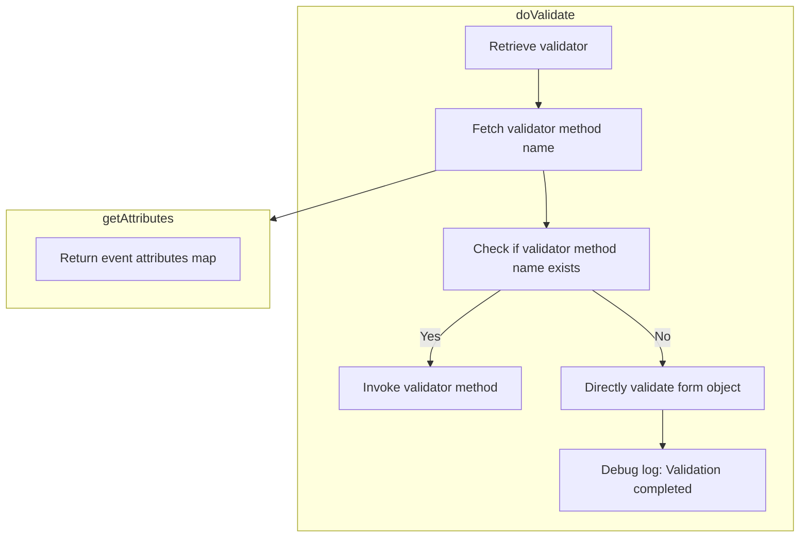

<SwmSnippet path="/spring-webflow/src/main/java/org/springframework/webflow/action/FormAction.java" line="823">

---

First, the <SwmToken path="spring-webflow/src/main/java/org/springframework/webflow/action/FormAction.java" pos="823:5:5" line-data="	protected void doValidate(RequestContext context, Object formObject, Errors errors) throws Exception {">`doValidate`</SwmToken> method is responsible for validating the form object using a registered validator. It ensures that the validator is not null before proceeding with the validation process.

```java
	protected void doValidate(RequestContext context, Object formObject, Errors errors) throws Exception {
		Assert.notNull(getValidator(), "The validator must not be null when attempting validation -- programmer error");
```

---

</SwmSnippet>

<SwmSnippet path="/spring-webflow/src/main/java/org/springframework/webflow/action/FormAction.java" line="825">

---

Next, it retrieves the validator method name from the event attributes. If a specific validator method is specified, it invokes that method on the validator.

```java
		String validatorMethodName = context.getAttributes().getString(VALIDATOR_METHOD_ATTRIBUTE);
		if (StringUtils.hasText(validatorMethodName)) {
			if (logger.isDebugEnabled()) {
				logger.debug("Invoking validation method '" + validatorMethodName + "' on validator " + getValidator());
			}
			invokeValidatorMethod(validatorMethodName, formObject, errors);
```

---

</SwmSnippet>

<SwmSnippet path="/spring-webflow/src/main/java/org/springframework/webflow/action/FormAction.java" line="831">

---

If no specific validator method is found, it invokes the default <SwmToken path="spring-webflow/src/main/java/org/springframework/webflow/action/FormAction.java" pos="835:5:5" line-data="			getValidator().validate(formObject, errors);">`validate`</SwmToken> method on the validator to perform the validation.

```java
		} else {
			if (logger.isDebugEnabled()) {
				logger.debug("Invoking validator " + getValidator());
			}
			getValidator().validate(formObject, errors);
```

---

</SwmSnippet>

<SwmSnippet path="/spring-webflow/src/main/java/org/springframework/webflow/action/FormAction.java" line="837">

---

Finally, it logs the completion of the validation process and the number of errors found, if any.

```java
		if (logger.isDebugEnabled()) {
			logger.debug("Validation completed for form object");
			logger.debug("There are [" + errors.getErrorCount() + "] errors, details: " + errors.getAllErrors());
		}
```

---

</SwmSnippet>

## Inside validate

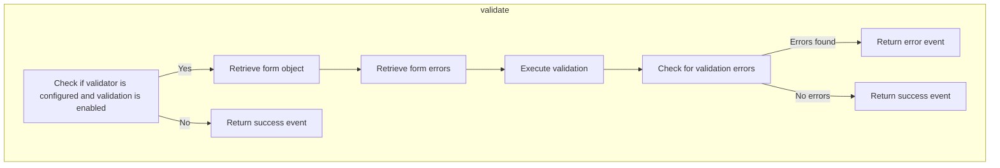

<SwmSnippet path="/spring-webflow/src/main/java/org/springframework/webflow/action/FormAction.java" line="535">

---

First, the <SwmToken path="spring-webflow/src/main/java/org/springframework/webflow/action/FormAction.java" pos="535:5:5" line-data="	public Event validate(RequestContext context) throws Exception {">`validate`</SwmToken> method checks if a validator is configured and if validation is enabled for the current request. This ensures that validation only occurs when necessary.

```java
	public Event validate(RequestContext context) throws Exception {
		if (getValidator() != null && validationEnabled(context)) {
```

---

</SwmSnippet>

<SwmSnippet path="/spring-webflow/src/main/java/org/springframework/webflow/action/FormAction.java" line="540">

---

Next, if validation is enabled, the method retrieves the form object from the flow scope or creates a new instance if it is not found. This ensures that there is always a form object to validate.

```java
			Object formObject = getFormObject(context);
```

---

</SwmSnippet>

<SwmSnippet path="/spring-webflow/src/main/java/org/springframework/webflow/action/FormAction.java" line="541">

---

Then, the method retrieves the form errors, ensuring a valid <SwmToken path="spring-webflow/src/main/java/org/springframework/webflow/action/FormAction.java" pos="541:1:1" line-data="			Errors errors = getFormErrors(context);">`Errors`</SwmToken> instance is available in the given context. This step is crucial for capturing any validation errors that may occur.

```java
			Errors errors = getFormErrors(context);
```

---

</SwmSnippet>

<SwmSnippet path="/spring-webflow/src/main/java/org/springframework/webflow/action/FormAction.java" line="542">

---

Moving to the next step, the <SwmToken path="spring-webflow/src/main/java/org/springframework/webflow/action/FormAction.java" pos="542:1:1" line-data="			doValidate(context, formObject, errors);">`doValidate`</SwmToken> method is called to perform the actual validation of the form object using the registered validator. This method logs the validation process and applies the validation rules.

```java
			doValidate(context, formObject, errors);
```

---

</SwmSnippet>

<SwmSnippet path="/spring-webflow/src/main/java/org/springframework/webflow/action/FormAction.java" line="543">

---

Finally, the method checks if there are any validation errors. If errors are present, an error event is generated; otherwise, a success event is returned. This determines the outcome of the validation process and informs the user of any issues with their input.

```java
			return errors.hasErrors() ? error() : success();
		} else {
```

---

</SwmSnippet>

## Zooming into <SwmToken path="spring-webflow/src/main/java/org/springframework/webflow/action/FormAction.java" pos="541:7:7" line-data="			Errors errors = getFormErrors(context);">`getFormErrors`</SwmToken> & <SwmToken path="spring-webflow/src/main/java/org/springframework/webflow/action/FormAction.java" pos="598:1:1" line-data="		getFormObjectAccessor(context).putFormObject(formObject, getFormObjectName(), getFormObjectScope());">`getFormObjectAccessor`</SwmToken> & <SwmToken path="spring-webflow/src/main/java/org/springframework/webflow/action/FormAction.java" pos="308:5:5" line-data="	public String getFormObjectName() {">`getFormObjectName`</SwmToken> & <SwmToken path="spring-webflow/src/main/java/org/springframework/webflow/action/FormAction.java" pos="361:5:5" line-data="	public ScopeType getFormErrorsScope() {">`getFormErrorsScope`</SwmToken>

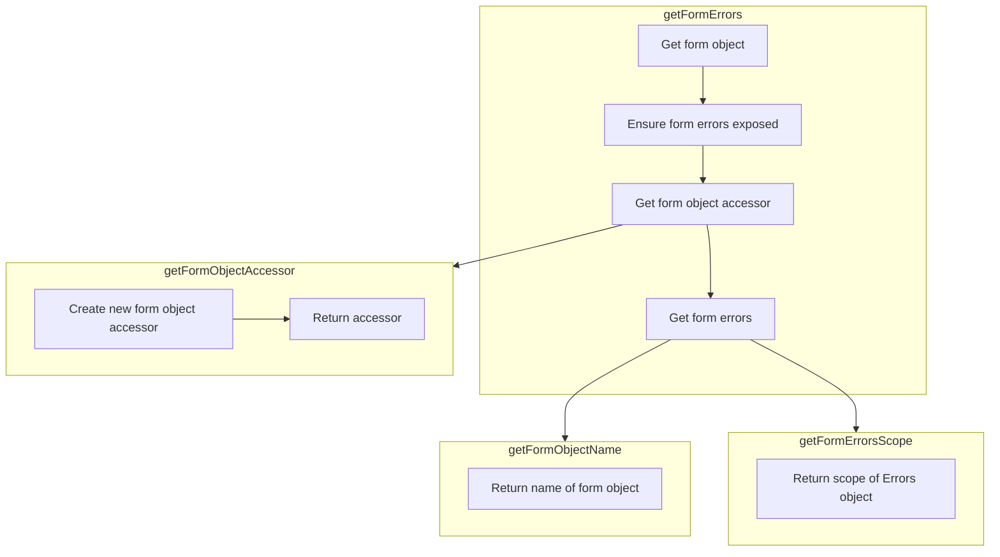

<SwmSnippet path="/spring-webflow/src/main/java/org/springframework/webflow/action/FormAction.java" line="746">

---

First, the <SwmToken path="spring-webflow/src/main/java/org/springframework/webflow/action/FormAction.java" pos="541:7:7" line-data="			Errors errors = getFormErrors(context);">`getFormErrors`</SwmToken> method is responsible for retrieving the form object errors. If the errors are not found in the configured scope, a new form object errors instance is created, initialized, and exposed in the configured scope.

```java
	/**
	 * Convenience method that returns the form object errors for this form action. If not found in the configured
	 * scope, a new form object errors will be created, initialized, and exposed in the confgured
	 * {@link #getFormErrorsScope() scope}.
	 * <p>
	 * Keep in mind that an Errors instance wraps a form object, so a form object will also be created if required (see
	 * {@link #getFormObject(RequestContext)}).
	 * @param context the flow request context
	 * @return the form errors
	 * @throws Exception when an unrecoverable exception occurs
	 */
```

---

</SwmSnippet>

<SwmSnippet path="/spring-webflow/src/main/java/org/springframework/webflow/action/FormAction.java" line="731">

---

Moving to the next step, the <SwmToken path="spring-webflow/src/main/java/org/springframework/webflow/action/FormAction.java" pos="731:5:5" line-data="	protected Object getFormObject(RequestContext context) throws Exception {">`getFormObject`</SwmToken> method is called to return the form object from the flow scope or create a new instance if it is not found.

```java
	protected Object getFormObject(RequestContext context) throws Exception {
```

---

</SwmSnippet>

<SwmSnippet path="/spring-webflow/src/main/java/org/springframework/webflow/action/FormAction.java" line="630">

---

Next, the <SwmToken path="spring-webflow/src/main/java/org/springframework/webflow/action/FormAction.java" pos="630:5:5" line-data="	private void ensureFormErrorsExposed(RequestContext context, Object formObject) throws Exception {">`ensureFormErrorsExposed`</SwmToken> method ensures that a valid Errors instance is available for the form object in the given context.

```java
	private void ensureFormErrorsExposed(RequestContext context, Object formObject) throws Exception {
```

---

</SwmSnippet>

<SwmSnippet path="/spring-webflow/src/main/java/org/springframework/webflow/action/FormAction.java" line="850">

---

Then, the <SwmToken path="spring-webflow/src/main/java/org/springframework/webflow/action/FormAction.java" pos="856:5:5" line-data="	protected FormObjectAccessor getFormObjectAccessor(RequestContext context) {">`getFormObjectAccessor`</SwmToken> method creates and returns an accessor for form objects in the provided request context.

```java
	/**
	 * Factory method that returns a new form object accessor for accessing form objects in the provided request
	 * context.
	 * @param context the flow request context
	 * @return the accessor
	 */
	protected FormObjectAccessor getFormObjectAccessor(RequestContext context) {
		return new FormObjectAccessor(context);
	}
```

---

</SwmSnippet>

<SwmSnippet path="/spring-webflow/src/main/java/org/springframework/webflow/action/FormAction.java" line="305">

---

The <SwmToken path="spring-webflow/src/main/java/org/springframework/webflow/action/FormAction.java" pos="308:5:5" line-data="	public String getFormObjectName() {">`getFormObjectName`</SwmToken> method retrieves the name of the form object, which is necessary for accessing the correct form object in the scope.

```java
	/**
	 * Return the name of the form object in the configured scope.
	 */
	public String getFormObjectName() {
		return formObjectName;
	}
```

---

</SwmSnippet>

<SwmSnippet path="/spring-webflow/src/main/java/org/springframework/webflow/action/FormAction.java" line="358">

---

Finally, the <SwmToken path="spring-webflow/src/main/java/org/springframework/webflow/action/FormAction.java" pos="361:5:5" line-data="	public ScopeType getFormErrorsScope() {">`getFormErrorsScope`</SwmToken> method retrieves the scope where the Errors object is stored, ensuring that the errors are placed in the correct context for further processing.

```java
	/**
	 * Get the scope in which the Errors object will be placed.
	 */
	public ScopeType getFormErrorsScope() {
		return formErrorsScope;
	}
```

---

</SwmSnippet>

## Zooming into <SwmToken path="spring-webflow/src/main/java/org/springframework/webflow/action/FormAction.java" pos="630:5:5" line-data="	private void ensureFormErrorsExposed(RequestContext context, Object formObject) throws Exception {">`ensureFormErrorsExposed`</SwmToken> & info & <SwmToken path="spring-webflow/src/main/java/org/springframework/webflow/action/FormAction.java" pos="651:3:3" line-data="				newErrors.addAllErrors(invalidExistingErrors);">`addAllErrors`</SwmToken>

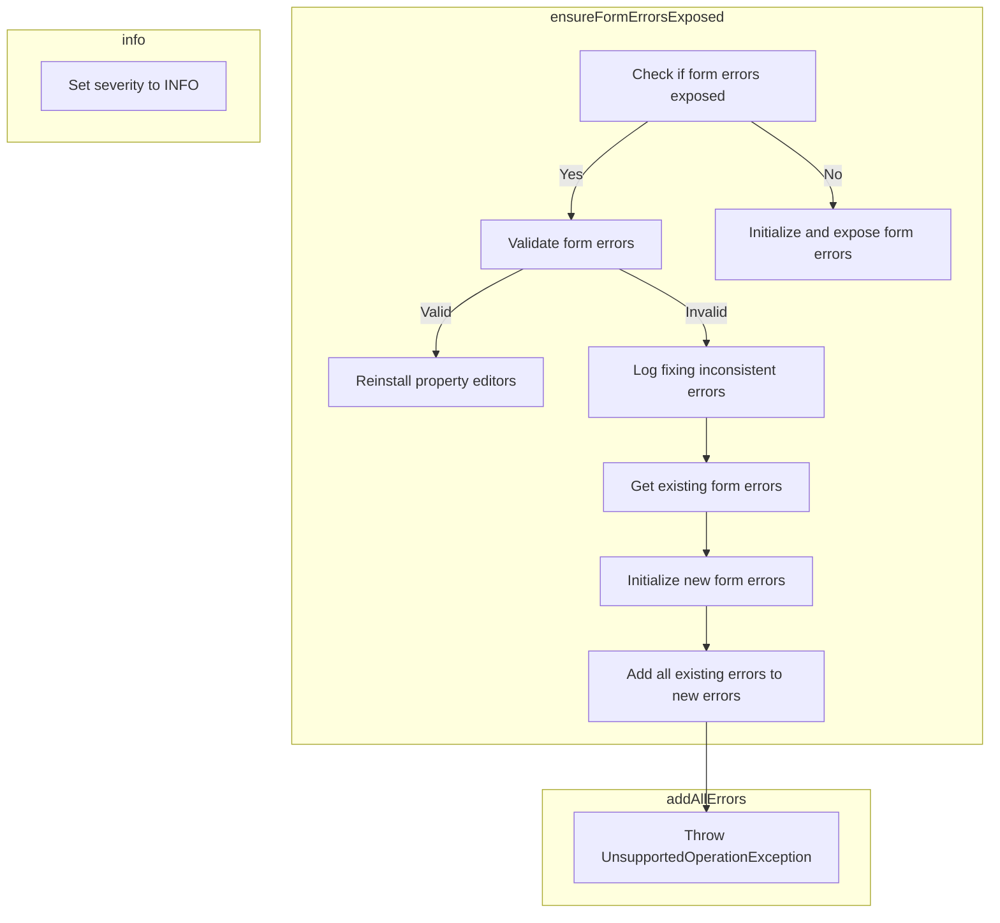

## Ensuring Form Errors are Exposed

The <SwmToken path="spring-webflow/src/main/java/org/springframework/webflow/action/FormAction.java" pos="630:5:5" line-data="	private void ensureFormErrorsExposed(RequestContext context, Object formObject) throws Exception {">`ensureFormErrorsExposed`</SwmToken> method ensures that a valid <SwmToken path="spring-webflow/src/main/java/org/springframework/webflow/action/FormAction.java" pos="359:15:15" line-data="	 * Get the scope in which the Errors object will be placed.">`Errors`</SwmToken> instance for a given form object is exposed in the current request context. This is crucial for maintaining the integrity of form validation and error handling throughout the user interaction.

<SwmSnippet path="/spring-webflow/src/main/java/org/springframework/webflow/action/FormAction.java" line="631">

---

First, the method checks if there are already errors available for the given form object in the request context. If no errors are found, it initializes and exposes a fresh <SwmToken path="spring-webflow/src/main/java/org/springframework/webflow/action/FormAction.java" pos="359:15:15" line-data="	 * Get the scope in which the Errors object will be placed.">`Errors`</SwmToken> instance to the flow, applying necessary property editors.

```java
		if (!formErrorsExposed(context)) {
			// initialize and expose a fresh errors instance to the flow with
			// editors applied
			initFormErrors(context, formObject);
```

---

</SwmSnippet>

<SwmSnippet path="/spring-webflow/src/main/java/org/springframework/webflow/action/FormAction.java" line="637">

---

If errors are already present, the method attempts to reuse the existing <SwmToken path="spring-webflow/src/main/java/org/springframework/webflow/action/FormAction.java" pos="359:15:15" line-data="	 * Get the scope in which the Errors object will be placed.">`Errors`</SwmToken> instance. It validates the existing errors and, if valid, reapplies property editors to the current errors instance.

```java
			if (formErrorsValid(context, formObject)) {
				// reapply property editors against the existing errors instance
				reinstallPropertyEditors(context);
```

---

</SwmSnippet>

<SwmSnippet path="/spring-webflow/src/main/java/org/springframework/webflow/action/FormAction.java" line="641">

---

If the existing <SwmToken path="spring-webflow/src/main/java/org/springframework/webflow/action/FormAction.java" pos="644:10:10" line-data="					logger.info(&quot;Fixing inconsistent Errors instance: initializing a new Errors instance &quot;">`Errors`</SwmToken> instance is found to be invalid, the method initializes a new <SwmToken path="spring-webflow/src/main/java/org/springframework/webflow/action/FormAction.java" pos="644:10:10" line-data="					logger.info(&quot;Fixing inconsistent Errors instance: initializing a new Errors instance &quot;">`Errors`</SwmToken> instance while copying over all existing error information. This ensures that any previously captured errors are not lost and are carried over to the new instance.

```java
				// the existing errors instance seems to be invalid
				// initialize a new errors instance, but copy over error information
				if (logger.isInfoEnabled()) {
					logger.info("Fixing inconsistent Errors instance: initializing a new Errors instance "
							+ "wrapping from object '" + formObject + "' in scope '" + getFormErrorsScope()
							+ "' and copying over all existing error information.");
				}
				Errors invalidExistingErrors = getFormObjectAccessor(context).getFormErrors(getFormObjectName(),
						getFormErrorsScope());
				Errors newErrors = initFormErrors(context, formObject);
				newErrors.addAllErrors(invalidExistingErrors);
```

---

</SwmSnippet>

<SwmSnippet path="/spring-webflow/src/main/java/org/springframework/webflow/action/FormAction.java" line="644">

---

Additionally, if the logger is set to info level, it logs a message indicating that an inconsistent <SwmToken path="spring-webflow/src/main/java/org/springframework/webflow/action/FormAction.java" pos="644:10:10" line-data="					logger.info(&quot;Fixing inconsistent Errors instance: initializing a new Errors instance &quot;">`Errors`</SwmToken> instance was fixed by initializing a new instance and copying over existing error information.

```java
					logger.info("Fixing inconsistent Errors instance: initializing a new Errors instance "
							+ "wrapping from object '" + formObject + "' in scope '" + getFormErrorsScope()
							+ "' and copying over all existing error information.");
				}
```

---

</SwmSnippet>

## A closer look at <SwmToken path="spring-webflow/src/main/java/org/springframework/webflow/action/FormAction.java" pos="608:5:5" line-data="	private Errors initFormErrors(RequestContext context, Object formObject) throws Exception {">`initFormErrors`</SwmToken>

```mermaid
graph TD
  subgraph initFormErrors
    initFormErrors:A["Log creation of new form errors"] --> initFormErrors:B["Create Binder"]
    initFormErrors:B --> initFormErrors:C["Retrieve Binding Result"]
    initFormErrors:C --> initFormErrors:D["Store errors in context"]
  end

%% Swimm:
%% graph TD
%%   subgraph <SwmToken path="spring-webflow/src/main/java/org/springframework/webflow/action/FormAction.java" pos="608:5:5" line-data="	private Errors initFormErrors(RequestContext context, Object formObject) throws Exception {">`initFormErrors`</SwmToken>
%%     <SwmToken path="spring-webflow/src/main/java/org/springframework/webflow/action/FormAction.java" pos="608:5:5" line-data="	private Errors initFormErrors(RequestContext context, Object formObject) throws Exception {">`initFormErrors`</SwmToken>:A["Log creation of new form errors"] --> <SwmToken path="spring-webflow/src/main/java/org/springframework/webflow/action/FormAction.java" pos="608:5:5" line-data="	private Errors initFormErrors(RequestContext context, Object formObject) throws Exception {">`initFormErrors`</SwmToken>:B["Create Binder"]
%%     <SwmToken path="spring-webflow/src/main/java/org/springframework/webflow/action/FormAction.java" pos="608:5:5" line-data="	private Errors initFormErrors(RequestContext context, Object formObject) throws Exception {">`initFormErrors`</SwmToken>:B --> <SwmToken path="spring-webflow/src/main/java/org/springframework/webflow/action/FormAction.java" pos="608:5:5" line-data="	private Errors initFormErrors(RequestContext context, Object formObject) throws Exception {">`initFormErrors`</SwmToken>:C["Retrieve Binding Result"]
%%     <SwmToken path="spring-webflow/src/main/java/org/springframework/webflow/action/FormAction.java" pos="608:5:5" line-data="	private Errors initFormErrors(RequestContext context, Object formObject) throws Exception {">`initFormErrors`</SwmToken>:C --> <SwmToken path="spring-webflow/src/main/java/org/springframework/webflow/action/FormAction.java" pos="608:5:5" line-data="	private Errors initFormErrors(RequestContext context, Object formObject) throws Exception {">`initFormErrors`</SwmToken>:D["Store errors in context"]
%%   end
```

<SwmSnippet path="/spring-webflow/src/main/java/org/springframework/webflow/action/FormAction.java" line="601">

---

First, the <SwmToken path="spring-webflow/src/main/java/org/springframework/webflow/action/FormAction.java" pos="608:5:5" line-data="	private Errors initFormErrors(RequestContext context, Object formObject) throws Exception {">`initFormErrors`</SwmToken> method is responsible for initializing a new form object errors instance within the configured scope. This is crucial for tracking any validation errors that may occur during the form submission process.

```java
	/**
	 * Initialize a new form object {@link Errors errors} instance in the configured {@link #getFormErrorsScope() scope}
	 * . This method also registers any {@link PropertiesEditor property editors} used to format form object property
	 * values.
	 * @param context the current flow execution request context
	 * @param formObject the form object for which errors will be tracked
	 */
	private Errors initFormErrors(RequestContext context, Object formObject) throws Exception {
		if (logger.isDebugEnabled()) {
			logger.debug("Creating new form errors for object with name '" + getFormObjectName() + "'");
		}
		Errors errors = createBinder(context, formObject).getBindingResult();
		putFormErrors(context, errors);
		return errors;
	}
```

---

</SwmSnippet>

<SwmSnippet path="/spring-webflow/src/main/java/org/springframework/webflow/action/FormAction.java" line="612">

---

Next, the method creates a new <SwmToken path="spring-webflow/src/main/java/org/springframework/webflow/action/FormAction.java" pos="416:12:12" line-data="	 * @see org.springframework.validation.DataBinder#setMessageCodesResolver(org.springframework.validation.MessageCodesResolver)">`DataBinder`</SwmToken> instance for the form object. This binder is used to bind form data and track any binding or validation errors.

```java
		Errors errors = createBinder(context, formObject).getBindingResult();
```

---

</SwmSnippet>

<SwmSnippet path="/spring-webflow/src/main/java/org/springframework/webflow/action/FormAction.java" line="613">

---

Then, the method stores the created errors instance in the configured scope of the provided context. This ensures that the errors are accessible throughout the flow for proper error handling and user feedback.

```java
		putFormErrors(context, errors);
```

---

</SwmSnippet>

## Looking at <SwmToken path="spring-webflow/src/main/java/org/springframework/webflow/action/FormAction.java" pos="415:7:7" line-data="	 * @see #createBinder(RequestContext, Object)">`createBinder`</SwmToken> & <SwmToken path="spring-webflow/src/main/java/org/springframework/webflow/action/FormAction.java" pos="406:5:5" line-data="	public MessageCodesResolver getMessageCodesResolver() {">`getMessageCodesResolver`</SwmToken> & <SwmToken path="spring-webflow/src/main/java/org/springframework/webflow/action/FormAction.java" pos="416:14:14" line-data="	 * @see org.springframework.validation.DataBinder#setMessageCodesResolver(org.springframework.validation.MessageCodesResolver)">`setMessageCodesResolver`</SwmToken> & <SwmToken path="spring-webflow/src/main/java/org/springframework/webflow/action/FormAction.java" pos="768:8:8" line-data="	 * {@link #initBinder(RequestContext, DataBinder)} and {@link #registerPropertyEditors(PropertyEditorRegistry)}.">`initBinder`</SwmToken>

```mermaid
graph TD
  subgraph createBinder
    createBinder:A["Create WebDataBinder with formObject"] --> createBinder:B["Check if getMessageCodesResolver is not null"]
    createBinder:B -->|True| createBinder:C["Set messageCodesResolver on binder"]
    createBinder:B -->|False| createBinder:D["Call initBinder with context and binder"]
    createBinder:C --> createBinder:D
    createBinder:D --> createBinder:E["Call registerPropertyEditors with context and binder"]
    createBinder:E --> createBinder:F["Return binder"]
  end
  subgraph getMessageCodesResolver
    getMessageCodesResolver:A["Return messageCodesResolver"]
  end
  subgraph setMessageCodesResolver
    setMessageCodesResolver:A["Set messageCodesResolver property"]
  end
  subgraph initBinder
    initBinder:A["Customize binder settings"]
  end
  createBinder:B --> getMessageCodesResolver
  createBinder:C --> setMessageCodesResolver
  createBinder:D --> initBinder

%% Swimm:
%% graph TD
%%   subgraph <SwmToken path="spring-webflow/src/main/java/org/springframework/webflow/action/FormAction.java" pos="415:7:7" line-data="	 * @see #createBinder(RequestContext, Object)">`createBinder`</SwmToken>
%%     <SwmToken path="spring-webflow/src/main/java/org/springframework/webflow/action/FormAction.java" pos="415:7:7" line-data="	 * @see #createBinder(RequestContext, Object)">`createBinder`</SwmToken>:A["Create <SwmToken path="spring-webflow/src/main/java/org/springframework/webflow/action/FormAction.java" pos="767:13:13" line-data="	 * Default implementation creates a standard WebDataBinder, and invokes">`WebDataBinder`</SwmToken> with <SwmToken path="spring-webflow/src/main/java/org/springframework/webflow/action/FormAction.java" pos="480:3:3" line-data="		Object formObject = getFormObject(context);">`formObject`</SwmToken>"] --> <SwmToken path="spring-webflow/src/main/java/org/springframework/webflow/action/FormAction.java" pos="415:7:7" line-data="	 * @see #createBinder(RequestContext, Object)">`createBinder`</SwmToken>:B["Check if <SwmToken path="spring-webflow/src/main/java/org/springframework/webflow/action/FormAction.java" pos="406:5:5" line-data="	public MessageCodesResolver getMessageCodesResolver() {">`getMessageCodesResolver`</SwmToken> is not null"]
%%     <SwmToken path="spring-webflow/src/main/java/org/springframework/webflow/action/FormAction.java" pos="415:7:7" line-data="	 * @see #createBinder(RequestContext, Object)">`createBinder`</SwmToken>:B -->|True| <SwmToken path="spring-webflow/src/main/java/org/springframework/webflow/action/FormAction.java" pos="415:7:7" line-data="	 * @see #createBinder(RequestContext, Object)">`createBinder`</SwmToken>:C["Set <SwmToken path="spring-webflow/src/main/java/org/springframework/webflow/action/FormAction.java" pos="407:3:3" line-data="		return messageCodesResolver;">`messageCodesResolver`</SwmToken> on binder"]
%%     <SwmToken path="spring-webflow/src/main/java/org/springframework/webflow/action/FormAction.java" pos="415:7:7" line-data="	 * @see #createBinder(RequestContext, Object)">`createBinder`</SwmToken>:B -->|False| <SwmToken path="spring-webflow/src/main/java/org/springframework/webflow/action/FormAction.java" pos="415:7:7" line-data="	 * @see #createBinder(RequestContext, Object)">`createBinder`</SwmToken>:D["Call <SwmToken path="spring-webflow/src/main/java/org/springframework/webflow/action/FormAction.java" pos="768:8:8" line-data="	 * {@link #initBinder(RequestContext, DataBinder)} and {@link #registerPropertyEditors(PropertyEditorRegistry)}.">`initBinder`</SwmToken> with context and binder"]
%%     <SwmToken path="spring-webflow/src/main/java/org/springframework/webflow/action/FormAction.java" pos="415:7:7" line-data="	 * @see #createBinder(RequestContext, Object)">`createBinder`</SwmToken>:C --> <SwmToken path="spring-webflow/src/main/java/org/springframework/webflow/action/FormAction.java" pos="415:7:7" line-data="	 * @see #createBinder(RequestContext, Object)">`createBinder`</SwmToken>:D
%%     <SwmToken path="spring-webflow/src/main/java/org/springframework/webflow/action/FormAction.java" pos="415:7:7" line-data="	 * @see #createBinder(RequestContext, Object)">`createBinder`</SwmToken>:D --> <SwmToken path="spring-webflow/src/main/java/org/springframework/webflow/action/FormAction.java" pos="415:7:7" line-data="	 * @see #createBinder(RequestContext, Object)">`createBinder`</SwmToken>:E["Call <SwmToken path="spring-webflow/src/main/java/org/springframework/webflow/action/FormAction.java" pos="694:1:1" line-data="		registerPropertyEditors(context, errors.getPropertyEditorRegistry());">`registerPropertyEditors`</SwmToken> with context and binder"]
%%     <SwmToken path="spring-webflow/src/main/java/org/springframework/webflow/action/FormAction.java" pos="415:7:7" line-data="	 * @see #createBinder(RequestContext, Object)">`createBinder`</SwmToken>:E --> <SwmToken path="spring-webflow/src/main/java/org/springframework/webflow/action/FormAction.java" pos="415:7:7" line-data="	 * @see #createBinder(RequestContext, Object)">`createBinder`</SwmToken>:F["Return binder"]
%%   end
%%   subgraph <SwmToken path="spring-webflow/src/main/java/org/springframework/webflow/action/FormAction.java" pos="406:5:5" line-data="	public MessageCodesResolver getMessageCodesResolver() {">`getMessageCodesResolver`</SwmToken>
%%     <SwmToken path="spring-webflow/src/main/java/org/springframework/webflow/action/FormAction.java" pos="406:5:5" line-data="	public MessageCodesResolver getMessageCodesResolver() {">`getMessageCodesResolver`</SwmToken>:A["Return <SwmToken path="spring-webflow/src/main/java/org/springframework/webflow/action/FormAction.java" pos="407:3:3" line-data="		return messageCodesResolver;">`messageCodesResolver`</SwmToken>"]
%%   end
%%   subgraph <SwmToken path="spring-webflow/src/main/java/org/springframework/webflow/action/FormAction.java" pos="416:14:14" line-data="	 * @see org.springframework.validation.DataBinder#setMessageCodesResolver(org.springframework.validation.MessageCodesResolver)">`setMessageCodesResolver`</SwmToken>
%%     <SwmToken path="spring-webflow/src/main/java/org/springframework/webflow/action/FormAction.java" pos="416:14:14" line-data="	 * @see org.springframework.validation.DataBinder#setMessageCodesResolver(org.springframework.validation.MessageCodesResolver)">`setMessageCodesResolver`</SwmToken>:A["Set <SwmToken path="spring-webflow/src/main/java/org/springframework/webflow/action/FormAction.java" pos="407:3:3" line-data="		return messageCodesResolver;">`messageCodesResolver`</SwmToken> property"]
%%   end
%%   subgraph <SwmToken path="spring-webflow/src/main/java/org/springframework/webflow/action/FormAction.java" pos="768:8:8" line-data="	 * {@link #initBinder(RequestContext, DataBinder)} and {@link #registerPropertyEditors(PropertyEditorRegistry)}.">`initBinder`</SwmToken>
%%     <SwmToken path="spring-webflow/src/main/java/org/springframework/webflow/action/FormAction.java" pos="768:8:8" line-data="	 * {@link #initBinder(RequestContext, DataBinder)} and {@link #registerPropertyEditors(PropertyEditorRegistry)}.">`initBinder`</SwmToken>:A["Customize binder settings"]
%%   end
%%   <SwmToken path="spring-webflow/src/main/java/org/springframework/webflow/action/FormAction.java" pos="415:7:7" line-data="	 * @see #createBinder(RequestContext, Object)">`createBinder`</SwmToken>:B --> <SwmToken path="spring-webflow/src/main/java/org/springframework/webflow/action/FormAction.java" pos="406:5:5" line-data="	public MessageCodesResolver getMessageCodesResolver() {">`getMessageCodesResolver`</SwmToken>
%%   <SwmToken path="spring-webflow/src/main/java/org/springframework/webflow/action/FormAction.java" pos="415:7:7" line-data="	 * @see #createBinder(RequestContext, Object)">`createBinder`</SwmToken>:C --> <SwmToken path="spring-webflow/src/main/java/org/springframework/webflow/action/FormAction.java" pos="416:14:14" line-data="	 * @see org.springframework.validation.DataBinder#setMessageCodesResolver(org.springframework.validation.MessageCodesResolver)">`setMessageCodesResolver`</SwmToken>
%%   <SwmToken path="spring-webflow/src/main/java/org/springframework/webflow/action/FormAction.java" pos="415:7:7" line-data="	 * @see #createBinder(RequestContext, Object)">`createBinder`</SwmToken>:D --> <SwmToken path="spring-webflow/src/main/java/org/springframework/webflow/action/FormAction.java" pos="768:8:8" line-data="	 * {@link #initBinder(RequestContext, DataBinder)} and {@link #registerPropertyEditors(PropertyEditorRegistry)}.">`initBinder`</SwmToken>
```

<SwmSnippet path="/spring-webflow/src/main/java/org/springframework/webflow/action/FormAction.java" line="763">

---

First, the <SwmToken path="spring-webflow/src/main/java/org/springframework/webflow/action/FormAction.java" pos="777:5:5" line-data="	protected DataBinder createBinder(RequestContext context, Object formObject) throws Exception {">`createBinder`</SwmToken> method is responsible for creating a new data binder instance for a given form object and request context. This method can be overridden to plug in custom <SwmToken path="spring-webflow/src/main/java/org/springframework/webflow/action/FormAction.java" pos="765:3:3" line-data="	 * DataBinder subclasses.">`DataBinder`</SwmToken> subclasses.

```java
	/**
	 * Create a new binder instance for the given form object and request context. Can be overridden to plug in custom
	 * DataBinder subclasses.
	 * <p>
	 * Default implementation creates a standard WebDataBinder, and invokes
	 * {@link #initBinder(RequestContext, DataBinder)} and {@link #registerPropertyEditors(PropertyEditorRegistry)}.
	 * @param context the action execution context, for accessing and setting data in "flow scope" or "request scope"
	 * @param formObject the form object to bind onto
	 * @return the new binder instance
	 * @throws Exception when an unrecoverable exception occurs
	 * @see WebDataBinder
	 * @see #initBinder(RequestContext, DataBinder)
	 * @see #setMessageCodesResolver(MessageCodesResolver)
	 */
	protected DataBinder createBinder(RequestContext context, Object formObject) throws Exception {
		DataBinder binder = new WebDataBinder(formObject, getFormObjectName());
		if (getMessageCodesResolver() != null) {
			binder.setMessageCodesResolver(getMessageCodesResolver());
		}
		initBinder(context, binder);
		registerPropertyEditors(context, binder);
		return binder;
	}
```

---

</SwmSnippet>

<SwmSnippet path="/spring-webflow/src/main/java/org/springframework/webflow/action/FormAction.java" line="403">

---

Moving to the next step, the <SwmToken path="spring-webflow/src/main/java/org/springframework/webflow/action/FormAction.java" pos="406:5:5" line-data="	public MessageCodesResolver getMessageCodesResolver() {">`getMessageCodesResolver`</SwmToken> method returns the strategy used for resolving errors into message codes. This strategy is applied to all data binders used by the action.

```java
	/**
	 * Return the strategy to use for resolving errors into message codes.
	 */
	public MessageCodesResolver getMessageCodesResolver() {
		return messageCodesResolver;
	}
```

---

</SwmSnippet>

<SwmSnippet path="/spring-webflow/src/main/java/org/springframework/webflow/action/FormAction.java" line="410">

---

Next, the <SwmToken path="spring-webflow/src/main/java/org/springframework/webflow/action/FormAction.java" pos="416:14:14" line-data="	 * @see org.springframework.validation.DataBinder#setMessageCodesResolver(org.springframework.validation.MessageCodesResolver)">`setMessageCodesResolver`</SwmToken> method sets the strategy to use for resolving errors into message codes. This method ensures that the specified strategy is applied to all data binders used by the action.

```java
	/**
	 * Set the strategy to use for resolving errors into message codes. Applies the given strategy to all data binders
	 * used by this action.
	 * <p>
	 * Default is null, i.e. using the default strategy of the data binder.
	 * @see #createBinder(RequestContext, Object)
	 * @see org.springframework.validation.DataBinder#setMessageCodesResolver(org.springframework.validation.MessageCodesResolver)
	 */
	public void setMessageCodesResolver(MessageCodesResolver messageCodesResolver) {
		this.messageCodesResolver = messageCodesResolver;
	}
```

---

</SwmSnippet>

<SwmSnippet path="/spring-webflow/src/main/java/org/springframework/webflow/action/FormAction.java" line="888">

---

Then, the <SwmToken path="spring-webflow/src/main/java/org/springframework/webflow/action/FormAction.java" pos="901:5:5" line-data="	protected void initBinder(RequestContext context, DataBinder binder) {">`initBinder`</SwmToken> method initializes a new binder instance with customization options for binder settings such as allowed fields, required fields, and direct field access. This method is called when a new data binder is created.

```java
	/**
	 * Initialize a new binder instance. This hook allows customization of binder settings such as the
	 * {@link DataBinder#getAllowedFields() allowed fields}, {@link DataBinder#getRequiredFields() required fields} and
	 * {@link DataBinder#initDirectFieldAccess() direct field access}. Called by
	 * {@link #createBinder(RequestContext, Object)}.
	 * <p>
	 * Note that registration of custom property editors should be done in
	 * {@link #registerPropertyEditors(PropertyEditorRegistry)}, not here! This method will only be called when a
	 * <b>new</b> data binder is created.
	 * @param context the action execution context, for accessing and setting data in "flow scope" or "request scope"
	 * @param binder new binder instance
	 * @see #createBinder(RequestContext, Object)
	 */
	protected void initBinder(RequestContext context, DataBinder binder) {
	}
```

---

</SwmSnippet>

## Diving into <SwmToken path="spring-webflow/src/main/java/org/springframework/webflow/action/FormAction.java" pos="694:1:1" line-data="		registerPropertyEditors(context, errors.getPropertyEditorRegistry());">`registerPropertyEditors`</SwmToken>

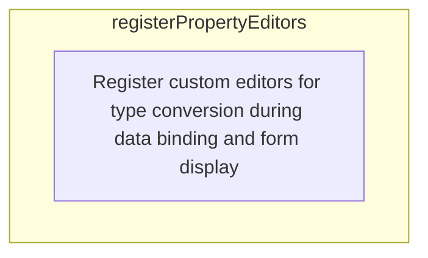

## Registering Custom Property Editors

First, the <SwmToken path="spring-webflow/src/main/java/org/springframework/webflow/action/FormAction.java" pos="694:1:1" line-data="		registerPropertyEditors(context, errors.getPropertyEditorRegistry());">`registerPropertyEditors`</SwmToken> method is responsible for registering custom editors that perform type conversion on fields of the form object during data binding and form display. This ensures that the data entered by the user is correctly interpreted and formatted for display on the user interface.

Moving to the implementation, the method takes two parameters: <SwmToken path="spring-webflow/src/main/java/org/springframework/webflow/action/FormAction.java" pos="415:9:9" line-data="	 * @see #createBinder(RequestContext, Object)">`RequestContext`</SwmToken> and <SwmToken path="spring-webflow/src/main/java/org/springframework/webflow/action/FormAction.java" pos="768:26:26" line-data="	 * {@link #initBinder(RequestContext, DataBinder)} and {@link #registerPropertyEditors(PropertyEditorRegistry)}.">`PropertyEditorRegistry`</SwmToken>. The <SwmToken path="spring-webflow/src/main/java/org/springframework/webflow/action/FormAction.java" pos="415:9:9" line-data="	 * @see #createBinder(RequestContext, Object)">`RequestContext`</SwmToken> provides access to the action execution context, allowing data to be accessed and set in the flow or request scope. The <SwmToken path="spring-webflow/src/main/java/org/springframework/webflow/action/FormAction.java" pos="768:26:26" line-data="	 * {@link #initBinder(RequestContext, DataBinder)} and {@link #registerPropertyEditors(PropertyEditorRegistry)}.">`PropertyEditorRegistry`</SwmToken> is where the custom editors are registered.

Next, the method calls a simpler form of itself, <SwmToken path="spring-webflow/src/main/java/org/springframework/webflow/action/FormAction.java" pos="768:24:27" line-data="	 * {@link #initBinder(RequestContext, DataBinder)} and {@link #registerPropertyEditors(PropertyEditorRegistry)}.">`registerPropertyEditors(PropertyEditorRegistry)`</SwmToken>, which does not take the <SwmToken path="spring-webflow/src/main/java/org/springframework/webflow/action/FormAction.java" pos="415:9:9" line-data="	 * @see #createBinder(RequestContext, Object)">`RequestContext`</SwmToken> parameter. This call ensures that the custom property editors are registered in the provided registry.

Diving into the business logic, the custom property editors give full control over how objects are transformed to and from a formatted string form. This is crucial for displaying data on user interfaces such as HTML pages, where the format of the data needs to be user-friendly and consistent.

<SwmSnippet path="/spring-webflow/src/main/java/org/springframework/webflow/action/FormAction.java" line="904">

---

Finally, by registering these custom editors, the application can handle various data types and formats seamlessly, improving the user experience by ensuring that the data is always presented in a readable and expected format.

```java
	/**
	 * Register custom editors to perform type conversion on fields of your form object during data binding and form
	 * display. This method is called on form errors initialization and {@link #initBinder(RequestContext, DataBinder)
	 * data binder} initialization.
	 * <p>
	 * Property editors give you full control over how objects are transformed to and from a formatted String form for
	 * display on a user interface such as a HTML page.
	 * <p>
	 * This default implementation will call the {@link #registerPropertyEditors(PropertyEditorRegistry) simpler form}
	 * of the method not taking a <code>RequestContext</code> parameter.
	 * @param context the action execution context, for accessing and setting data in "flow scope" or "request scope"
	 * @param registry the property editor registry to register editors in
	 * @see #registerPropertyEditors(PropertyEditorRegistry)
	 */
	protected void registerPropertyEditors(RequestContext context, PropertyEditorRegistry registry) {
		registerPropertyEditors(registry);
	}
```

---

</SwmSnippet>

## Looking at <SwmToken path="spring-webflow/src/main/java/org/springframework/webflow/action/FormAction.java" pos="694:1:1" line-data="		registerPropertyEditors(context, errors.getPropertyEditorRegistry());">`registerPropertyEditors`</SwmToken> & <SwmToken path="spring-webflow/src/main/java/org/springframework/webflow/action/FormAction.java" pos="376:5:5" line-data="	public PropertyEditorRegistrar getPropertyEditorRegistrar() {">`getPropertyEditorRegistrar`</SwmToken>

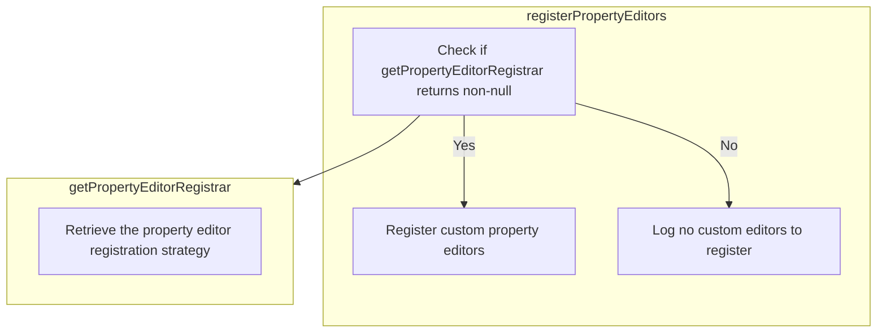

<SwmSnippet path="/spring-webflow/src/main/java/org/springframework/webflow/action/FormAction.java" line="922">

---

First, the <SwmToken path="spring-webflow/src/main/java/org/springframework/webflow/action/FormAction.java" pos="934:5:5" line-data="	protected void registerPropertyEditors(PropertyEditorRegistry registry) {">`registerPropertyEditors`</SwmToken> method is responsible for registering custom editors that perform type conversion on fields of the form object during data binding and form display. This ensures that the data entered by the user is correctly interpreted and formatted for display on the user interface, such as an HTML page.

```java
	/**
	 * Register custom editors to perform type conversion on fields of your form object during data binding and form
	 * display. This method is called on form errors initialization and {@link #initBinder(RequestContext, DataBinder)
	 * data binder} initialization.
	 * <p>
	 * Property editors give you full control over how objects are transformed to and from a formatted String form for
	 * display on a user interface such as a HTML page.
	 * <p>
	 * This default implementation will simply call <code>registerCustomEditors</code> on the
	 * {@link #getPropertyEditorRegistrar() propertyEditorRegistrar} object that has been set for the action, if any.
	 * @param registry the property editor registry to register editors in
	 */
	protected void registerPropertyEditors(PropertyEditorRegistry registry) {
		if (getPropertyEditorRegistrar() != null) {
			if (logger.isDebugEnabled()) {
				logger.debug("Registering custom property editors using configured registrar");
			}
			getPropertyEditorRegistrar().registerCustomEditors(registry);
		} else {
			if (logger.isDebugEnabled()) {
				logger.debug("No property editor registrar set, no custom editors to register");
			}
		}
	}
```

---

</SwmSnippet>

<SwmSnippet path="/spring-webflow/src/main/java/org/springframework/webflow/action/FormAction.java" line="935">

---

Next, the method checks if a <SwmToken path="spring-webflow/src/main/java/org/springframework/webflow/action/FormAction.java" pos="377:3:3" line-data="		return propertyEditorRegistrar;">`propertyEditorRegistrar`</SwmToken> has been set. If it has, it logs a debug message indicating that custom property editors are being registered using the configured registrar. The <SwmToken path="spring-webflow/src/main/java/org/springframework/webflow/action/FormAction.java" pos="377:3:3" line-data="		return propertyEditorRegistrar;">`propertyEditorRegistrar`</SwmToken> is then used to register the custom editors in the provided <SwmToken path="spring-webflow/src/main/java/org/springframework/webflow/action/FormAction.java" pos="768:26:26" line-data="	 * {@link #initBinder(RequestContext, DataBinder)} and {@link #registerPropertyEditors(PropertyEditorRegistry)}.">`PropertyEditorRegistry`</SwmToken>.

```java
		if (getPropertyEditorRegistrar() != null) {
			if (logger.isDebugEnabled()) {
				logger.debug("Registering custom property editors using configured registrar");
			}
			getPropertyEditorRegistrar().registerCustomEditors(registry);
		} else {
```

---

</SwmSnippet>

<SwmSnippet path="/spring-webflow/src/main/java/org/springframework/webflow/action/FormAction.java" line="941">

---

If no <SwmToken path="spring-webflow/src/main/java/org/springframework/webflow/action/FormAction.java" pos="377:3:3" line-data="		return propertyEditorRegistrar;">`propertyEditorRegistrar`</SwmToken> is set, a debug message is logged indicating that no custom editors will be registered. This ensures that the system behaves predictably even when no custom editors are configured.

```java
			if (logger.isDebugEnabled()) {
				logger.debug("No property editor registrar set, no custom editors to register");
			}
		}
```

---

</SwmSnippet>

<SwmSnippet path="/spring-webflow/src/main/java/org/springframework/webflow/action/FormAction.java" line="373">

---

Moving to the <SwmToken path="spring-webflow/src/main/java/org/springframework/webflow/action/FormAction.java" pos="376:5:5" line-data="	public PropertyEditorRegistrar getPropertyEditorRegistrar() {">`getPropertyEditorRegistrar`</SwmToken> method, it simply retrieves the property editor registration strategy for the action's data binders. This method is used within <SwmToken path="spring-webflow/src/main/java/org/springframework/webflow/action/FormAction.java" pos="694:1:1" line-data="		registerPropertyEditors(context, errors.getPropertyEditorRegistry());">`registerPropertyEditors`</SwmToken> to obtain the <SwmToken path="spring-webflow/src/main/java/org/springframework/webflow/action/FormAction.java" pos="377:3:3" line-data="		return propertyEditorRegistrar;">`propertyEditorRegistrar`</SwmToken> if it has been set.

```java
	/**
	 * Get the property editor registration strategy for this action's data binders.
	 */
	public PropertyEditorRegistrar getPropertyEditorRegistrar() {
		return propertyEditorRegistrar;
	}
```

---

</SwmSnippet>

## Inside <SwmToken path="spring-webflow/src/main/java/org/springframework/webflow/action/FormAction.java" pos="497:1:1" line-data="		putFormErrors(context, binder.getBindingResult());">`putFormErrors`</SwmToken>

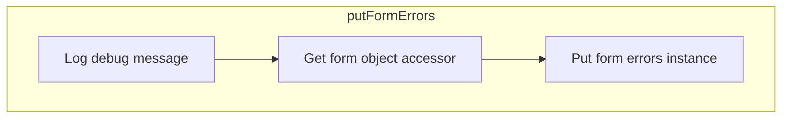

<SwmSnippet path="/spring-webflow/src/main/java/org/springframework/webflow/action/FormAction.java" line="617">

---

First, the <SwmToken path="spring-webflow/src/main/java/org/springframework/webflow/action/FormAction.java" pos="620:5:5" line-data="	private void putFormErrors(RequestContext context, Errors errors) {">`putFormErrors`</SwmToken> method is responsible for storing a given errors instance in the configured scope of the provided context. This is crucial for maintaining the state of form validation errors throughout the flow.

```java
	/**
	 * Put given errors instance in the configured scope of given context.
	 */
	private void putFormErrors(RequestContext context, Errors errors) {
		if (logger.isDebugEnabled()) {
			logger.debug("Putting form errors instance in scope " + getFormErrorsScope());
		}
		getFormObjectAccessor(context).putFormErrors(errors, getFormErrorsScope());
	}
```

---

</SwmSnippet>

Next, the method retrieves the scope where the Errors object is stored by calling <SwmToken path="spring-webflow/src/main/java/org/springframework/webflow/action/FormAction.java" pos="361:5:5" line-data="	public ScopeType getFormErrorsScope() {">`getFormErrorsScope`</SwmToken>. This ensures that the errors are placed in the correct scope, which is essential for the flow to access and display these errors appropriately.

Then, it creates and returns an accessor for form objects in the provided request context using <SwmToken path="spring-webflow/src/main/java/org/springframework/webflow/action/FormAction.java" pos="598:1:1" line-data="		getFormObjectAccessor(context).putFormObject(formObject, getFormObjectName(), getFormObjectScope());">`getFormObjectAccessor`</SwmToken>. This accessor is used to interact with the form objects, including storing the errors.

## Inside <SwmToken path="spring-webflow/src/main/java/org/springframework/webflow/action/FormAction.java" pos="639:1:1" line-data="				reinstallPropertyEditors(context);">`reinstallPropertyEditors`</SwmToken> & <SwmToken path="spring-webflow/src/main/java/org/springframework/webflow/action/FormAction.java" pos="694:8:8" line-data="		registerPropertyEditors(context, errors.getPropertyEditorRegistry());">`getPropertyEditorRegistry`</SwmToken>

```mermaid
graph TD
  subgraph reinstallPropertyEditors
    reinstallPropertyEditors:A["Retrieve the current form errors instance"] --> reinstallPropertyEditors:B["Get property editor registry from form errors"]
    reinstallPropertyEditors:B --> reinstallPropertyEditors:C["Register property editors"]
  end
  subgraph getPropertyEditorRegistry
    getPropertyEditorRegistry:A["Throw an error for unsupported operation during view rendering"]
  end

%% Swimm:
%% graph TD
%%   subgraph <SwmToken path="spring-webflow/src/main/java/org/springframework/webflow/action/FormAction.java" pos="639:1:1" line-data="				reinstallPropertyEditors(context);">`reinstallPropertyEditors`</SwmToken>
%%     <SwmToken path="spring-webflow/src/main/java/org/springframework/webflow/action/FormAction.java" pos="639:1:1" line-data="				reinstallPropertyEditors(context);">`reinstallPropertyEditors`</SwmToken>:A["Retrieve the current form errors instance"] --> <SwmToken path="spring-webflow/src/main/java/org/springframework/webflow/action/FormAction.java" pos="639:1:1" line-data="				reinstallPropertyEditors(context);">`reinstallPropertyEditors`</SwmToken>:B["Get property editor registry from form errors"]
%%     <SwmToken path="spring-webflow/src/main/java/org/springframework/webflow/action/FormAction.java" pos="639:1:1" line-data="				reinstallPropertyEditors(context);">`reinstallPropertyEditors`</SwmToken>:B --> <SwmToken path="spring-webflow/src/main/java/org/springframework/webflow/action/FormAction.java" pos="639:1:1" line-data="				reinstallPropertyEditors(context);">`reinstallPropertyEditors`</SwmToken>:C["Register property editors"]
%%   end
%%   subgraph <SwmToken path="spring-webflow/src/main/java/org/springframework/webflow/action/FormAction.java" pos="694:8:8" line-data="		registerPropertyEditors(context, errors.getPropertyEditorRegistry());">`getPropertyEditorRegistry`</SwmToken>
%%     <SwmToken path="spring-webflow/src/main/java/org/springframework/webflow/action/FormAction.java" pos="694:8:8" line-data="		registerPropertyEditors(context, errors.getPropertyEditorRegistry());">`getPropertyEditorRegistry`</SwmToken>:A["Throw an error for unsupported operation during view rendering"]
%%   end
```

## Re-registering property editors

First, the <SwmToken path="spring-webflow/src/main/java/org/springframework/webflow/action/FormAction.java" pos="639:1:1" line-data="				reinstallPropertyEditors(context);">`reinstallPropertyEditors`</SwmToken> method is responsible for re-registering property editors against the current form errors instance. This ensures that any custom editors for type conversion during data binding and form display are correctly set up.

Moving to the next step, the method retrieves the form errors using the <SwmToken path="spring-webflow/src/main/java/org/springframework/webflow/action/FormAction.java" pos="598:1:1" line-data="		getFormObjectAccessor(context).putFormObject(formObject, getFormObjectName(), getFormObjectScope());">`getFormObjectAccessor`</SwmToken> method, which provides access to form objects in the current request context. This is crucial for obtaining the current state of form errors.

Next, the method calls <SwmToken path="spring-webflow/src/main/java/org/springframework/webflow/action/FormAction.java" pos="308:5:5" line-data="	public String getFormObjectName() {">`getFormObjectName`</SwmToken> to retrieve the name of the form object, and <SwmToken path="spring-webflow/src/main/java/org/springframework/webflow/action/FormAction.java" pos="361:5:5" line-data="	public ScopeType getFormErrorsScope() {">`getFormErrorsScope`</SwmToken> to determine the scope where the Errors object is stored. These steps are essential for accurately locating and managing the form errors.

Then, the method calls <SwmToken path="spring-webflow/src/main/java/org/springframework/webflow/action/FormAction.java" pos="694:1:1" line-data="		registerPropertyEditors(context, errors.getPropertyEditorRegistry());">`registerPropertyEditors`</SwmToken>, passing the context and the property editor registry obtained from the form errors. This step re-registers the custom property editors, ensuring that the form can correctly handle data binding and validation.

<SwmSnippet path="/spring-webflow/src/main/java/org/springframework/webflow/action/FormAction.java" line="691">

---

Finally, the <SwmToken path="spring-webflow/src/main/java/org/springframework/webflow/action/FormAction.java" pos="694:8:8" line-data="		registerPropertyEditors(context, errors.getPropertyEditorRegistry());">`getPropertyEditorRegistry`</SwmToken> method in the <SwmToken path="spring-webflow/src/main/java/org/springframework/webflow/mvc/view/AbstractMvcView.java" pos="611:1:1" line-data="			BindingModel bindingModel = new BindingModel(getModelExpression().getExpressionString(), modelObject,">`BindingModel`</SwmToken> class is designed to throw an error if accessed during view rendering, indicating that property editors should not be manipulated at that stage.

```java
	private void reinstallPropertyEditors(RequestContext context) {
		BindingResult errors = (BindingResult) getFormObjectAccessor(context).getFormErrors(getFormObjectName(),
				getFormErrorsScope());
		registerPropertyEditors(context, errors.getPropertyEditorRegistry());
	}
```

---

</SwmSnippet>

## Diving into <SwmToken path="spring-webflow/src/main/java/org/springframework/webflow/action/FormAction.java" pos="637:4:4" line-data="			if (formErrorsValid(context, formObject)) {">`formErrorsValid`</SwmToken> & <SwmToken path="spring-webflow/src/main/java/org/springframework/webflow/action/FormAction.java" pos="670:6:6" line-data="			if (be.getTarget() != formObject) {">`getTarget`</SwmToken>

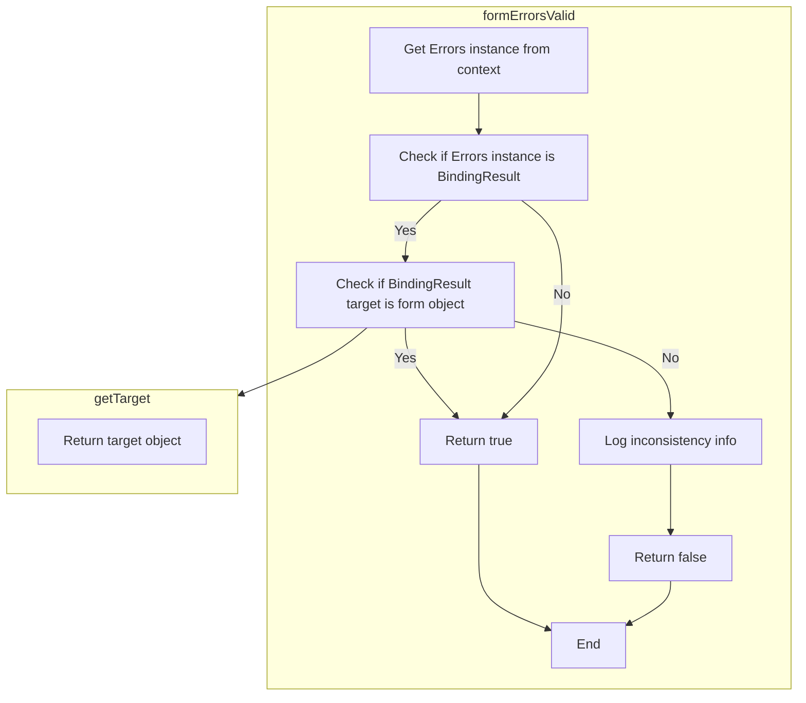

<SwmSnippet path="/spring-webflow/src/main/java/org/springframework/webflow/action/FormAction.java" line="663">

---

First, the <SwmToken path="spring-webflow/src/main/java/org/springframework/webflow/action/FormAction.java" pos="666:5:5" line-data="	private boolean formErrorsValid(RequestContext context, Object formObject) {">`formErrorsValid`</SwmToken> method checks if the <SwmToken path="spring-webflow/src/main/java/org/springframework/webflow/action/FormAction.java" pos="664:9:9" line-data="	 * Check if the Errors instance available in given context is valid for given form object.">`Errors`</SwmToken> instance available in the given context is valid for the provided form object. This ensures that the errors are correctly associated with the current form object, maintaining data consistency.

```java
	/**
	 * Check if the Errors instance available in given context is valid for given form object.
	 */
	private boolean formErrorsValid(RequestContext context, Object formObject) {
		Errors errors = getFormObjectAccessor(context).getFormErrors(getFormObjectName(), getFormErrorsScope());
		if (errors instanceof BindingResult) {
			BindingResult be = (BindingResult) errors;
			if (be.getTarget() != formObject) {
				if (logger.isInfoEnabled()) {
					logger.info("Inconsistency detected: the Errors instance in '" + getFormErrorsScope()
							+ "' does NOT wrap the current form object '" + formObject + "' of class "
							+ formObject.getClass()
							+ "; instead this Errors instance unexpectedly wraps the target object '" + be.getTarget()
							+ "' of class: " + be.getTarget().getClass() + ".");
				}
				return false;
			} else {
				return true;
			}
		} else {
			return true;
		}
	}
```

---

</SwmSnippet>

<SwmSnippet path="/spring-webflow/src/main/java/org/springframework/webflow/action/FormAction.java" line="667">

---

Next, the method retrieves the form errors using <SwmToken path="spring-webflow/src/main/java/org/springframework/webflow/action/FormAction.java" pos="667:7:7" line-data="		Errors errors = getFormObjectAccessor(context).getFormErrors(getFormObjectName(), getFormErrorsScope());">`getFormObjectAccessor`</SwmToken>, <SwmToken path="spring-webflow/src/main/java/org/springframework/webflow/action/FormAction.java" pos="667:14:14" line-data="		Errors errors = getFormObjectAccessor(context).getFormErrors(getFormObjectName(), getFormErrorsScope());">`getFormObjectName`</SwmToken>, and <SwmToken path="spring-webflow/src/main/java/org/springframework/webflow/action/FormAction.java" pos="667:19:19" line-data="		Errors errors = getFormObjectAccessor(context).getFormErrors(getFormObjectName(), getFormErrorsScope());">`getFormErrorsScope`</SwmToken>. This step ensures that the correct <SwmToken path="spring-webflow/src/main/java/org/springframework/webflow/action/FormAction.java" pos="667:1:1" line-data="		Errors errors = getFormObjectAccessor(context).getFormErrors(getFormObjectName(), getFormErrorsScope());">`Errors`</SwmToken> instance is obtained for validation.

```java
		Errors errors = getFormObjectAccessor(context).getFormErrors(getFormObjectName(), getFormErrorsScope());
```

---

</SwmSnippet>

<SwmSnippet path="/spring-webflow/src/main/java/org/springframework/webflow/action/FormAction.java" line="668">

---

Then, the method checks for inconsistencies by comparing the target of the <SwmToken path="spring-webflow/src/main/java/org/springframework/webflow/action/FormAction.java" pos="668:8:8" line-data="		if (errors instanceof BindingResult) {">`BindingResult`</SwmToken> with the current form object. If there is a mismatch, an informational message is logged, and the method returns `false`, indicating invalid errors.

```java
		if (errors instanceof BindingResult) {
			BindingResult be = (BindingResult) errors;
			if (be.getTarget() != formObject) {
				if (logger.isInfoEnabled()) {
					logger.info("Inconsistency detected: the Errors instance in '" + getFormErrorsScope()
							+ "' does NOT wrap the current form object '" + formObject + "' of class "
							+ formObject.getClass()
							+ "; instead this Errors instance unexpectedly wraps the target object '" + be.getTarget()
							+ "' of class: " + be.getTarget().getClass() + ".");
				}
				return false;
			} else {
```

---

</SwmSnippet>

<SwmSnippet path="/spring-webflow/src/main/java/org/springframework/webflow/action/FormAction.java" line="680">

---

Finally, if no inconsistencies are found, the method returns `true`, indicating that the form errors are valid. This step ensures that the form data is consistent and ready for further processing.

```java
				return true;
			}
		} else {
			return true;
		}
```

---

</SwmSnippet>

## Zooming into <SwmToken path="spring-webflow/src/main/java/org/springframework/webflow/action/FormAction.java" pos="631:5:5" line-data="		if (!formErrorsExposed(context)) {">`formErrorsExposed`</SwmToken>

```mermaid
graph TD
  subgraph formErrorsExposed
    formErrorsExposed:A["Get form object accessor from context"] --> formErrorsExposed:B["Get form object name"]
    formErrorsExposed:B --> formErrorsExposed:C["Retrieve form errors scope"]
    formErrorsExposed:C --> formErrorsExposed:D["Check if form errors instance is not null"]
  end

%% Swimm:
%% graph TD
%%   subgraph <SwmToken path="spring-webflow/src/main/java/org/springframework/webflow/action/FormAction.java" pos="631:5:5" line-data="		if (!formErrorsExposed(context)) {">`formErrorsExposed`</SwmToken>
%%     <SwmToken path="spring-webflow/src/main/java/org/springframework/webflow/action/FormAction.java" pos="631:5:5" line-data="		if (!formErrorsExposed(context)) {">`formErrorsExposed`</SwmToken>:A["Get form object accessor from context"] --> <SwmToken path="spring-webflow/src/main/java/org/springframework/webflow/action/FormAction.java" pos="631:5:5" line-data="		if (!formErrorsExposed(context)) {">`formErrorsExposed`</SwmToken>:B["Get form object name"]
%%     <SwmToken path="spring-webflow/src/main/java/org/springframework/webflow/action/FormAction.java" pos="631:5:5" line-data="		if (!formErrorsExposed(context)) {">`formErrorsExposed`</SwmToken>:B --> <SwmToken path="spring-webflow/src/main/java/org/springframework/webflow/action/FormAction.java" pos="631:5:5" line-data="		if (!formErrorsExposed(context)) {">`formErrorsExposed`</SwmToken>:C["Retrieve form errors scope"]
%%     <SwmToken path="spring-webflow/src/main/java/org/springframework/webflow/action/FormAction.java" pos="631:5:5" line-data="		if (!formErrorsExposed(context)) {">`formErrorsExposed`</SwmToken>:C --> <SwmToken path="spring-webflow/src/main/java/org/springframework/webflow/action/FormAction.java" pos="631:5:5" line-data="		if (!formErrorsExposed(context)) {">`formErrorsExposed`</SwmToken>:D["Check if form errors instance is not null"]
%%   end
```

## Checking if form errors are exposed

First, the <SwmToken path="spring-webflow/src/main/java/org/springframework/webflow/action/FormAction.java" pos="631:5:5" line-data="		if (!formErrorsExposed(context)) {">`formErrorsExposed`</SwmToken> method checks if there is an <SwmToken path="spring-webflow/src/main/java/org/springframework/webflow/action/FormAction.java" pos="359:15:15" line-data="	 * Get the scope in which the Errors object will be placed.">`Errors`</SwmToken> instance available in the given context for the specified form object. This is crucial for validating user input forms, as it determines whether any validation errors need to be addressed before proceeding.

Moving to the next step, the method retrieves the form object accessor using <SwmToken path="spring-webflow/src/main/java/org/springframework/webflow/action/FormAction.java" pos="598:1:1" line-data="		getFormObjectAccessor(context).putFormObject(formObject, getFormObjectName(), getFormObjectScope());">`getFormObjectAccessor`</SwmToken>. This accessor is responsible for managing form objects within the request context, ensuring that the correct form object is being validated.

Next, the method calls <SwmToken path="spring-webflow/src/main/java/org/springframework/webflow/action/FormAction.java" pos="541:7:7" line-data="			Errors errors = getFormErrors(context);">`getFormErrors`</SwmToken> to retrieve any existing errors associated with the form object. This step ensures that any validation errors are captured and can be displayed to the user for correction.

Then, the method retrieves the name of the form object using <SwmToken path="spring-webflow/src/main/java/org/springframework/webflow/action/FormAction.java" pos="308:5:5" line-data="	public String getFormObjectName() {">`getFormObjectName`</SwmToken>. This name is used to identify the specific form object within the context, ensuring that the correct errors are being checked.

Finally, the method retrieves the scope where the <SwmToken path="spring-webflow/src/main/java/org/springframework/webflow/action/FormAction.java" pos="359:15:15" line-data="	 * Get the scope in which the Errors object will be placed.">`Errors`</SwmToken> object is stored using <SwmToken path="spring-webflow/src/main/java/org/springframework/webflow/action/FormAction.java" pos="361:5:5" line-data="	public ScopeType getFormErrorsScope() {">`getFormErrorsScope`</SwmToken>. This scope determines where the validation errors are kept, ensuring that they are accessible for display and correction.

<SwmSnippet path="/spring-webflow/src/main/java/org/springframework/webflow/action/FormAction.java" line="656">

---

By performing these steps, the <SwmToken path="spring-webflow/src/main/java/org/springframework/webflow/action/FormAction.java" pos="659:5:5" line-data="	private boolean formErrorsExposed(RequestContext context) {">`formErrorsExposed`</SwmToken> method ensures that any validation errors for the form object are properly identified and exposed, allowing the application to handle user input validation effectively.

```java
	/**
	 * Check if there is an Errors instance available in given context for given form object.
	 */
	private boolean formErrorsExposed(RequestContext context) {
		return getFormObjectAccessor(context).getFormErrors(getFormObjectName(), getFormErrorsScope()) != null;
	}
```

---

</SwmSnippet>

## Exploring <SwmToken path="spring-webflow/src/main/java/org/springframework/webflow/action/FormAction.java" pos="480:7:7" line-data="		Object formObject = getFormObject(context);">`getFormObject`</SwmToken> & <SwmToken path="spring-webflow/src/main/java/org/springframework/webflow/action/FormAction.java" pos="346:5:5" line-data="	public ScopeType getFormObjectScope() {">`getFormObjectScope`</SwmToken>

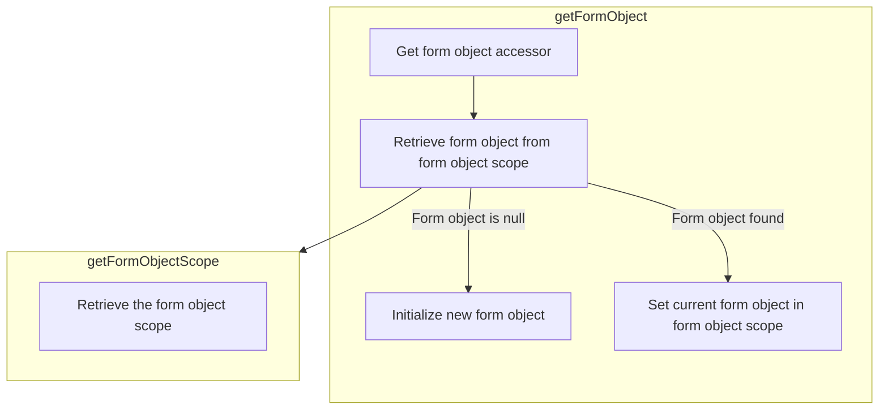

<SwmSnippet path="/spring-webflow/src/main/java/org/springframework/webflow/action/FormAction.java" line="731">

---

First, the <SwmToken path="spring-webflow/src/main/java/org/springframework/webflow/action/FormAction.java" pos="731:5:5" line-data="	protected Object getFormObject(RequestContext context) throws Exception {">`getFormObject`</SwmToken> method is responsible for retrieving the form object associated with the current user session. If the form object is not found in the configured scope, it will create a new instance. This ensures that the user always has a form object to interact with during their session.

```java
	protected Object getFormObject(RequestContext context) throws Exception {
		FormObjectAccessor accessor = getFormObjectAccessor(context);
		Object formObject = accessor.getFormObject(getFormObjectName(), getFormObjectScope());
		if (formObject == null) {
			formObject = initFormObject(context);
		} else {
			if (logger.isDebugEnabled()) {
				logger.debug("Found existing form object with name '" + getFormObjectName() + "' of type ["
						+ formObject.getClass() + "] in scope " + getFormObjectScope());
			}
			accessor.setCurrentFormObject(formObject, getFormObjectScope());
		}
		return formObject;
	}
```

---

</SwmSnippet>

<SwmSnippet path="/spring-webflow/src/main/java/org/springframework/webflow/action/FormAction.java" line="581">

---

Next, if the form object is not found, the <SwmToken path="spring-webflow/src/main/java/org/springframework/webflow/action/FormAction.java" pos="581:5:5" line-data="	private Object initFormObject(RequestContext context) throws Exception {">`initFormObject`</SwmToken> method is called to initialize a new form object and store it in the specified scope. This step is crucial to ensure that the form object is properly set up and ready for user interactions.

```java
	private Object initFormObject(RequestContext context) throws Exception {
```

---

</SwmSnippet>

<SwmSnippet path="/spring-webflow/src/main/java/org/springframework/webflow/action/FormObjectAccessor.java" line="121">

---

Then, the <SwmToken path="spring-webflow/src/main/java/org/springframework/webflow/action/FormObjectAccessor.java" pos="121:5:5" line-data="	public void setCurrentFormObject(Object formObject, ScopeType scopeType) {">`setCurrentFormObject`</SwmToken> method is used to expose the form object in the specified scope. This makes the form object available for the current user session, allowing the user to interact with it seamlessly.

```java
	public void setCurrentFormObject(Object formObject, ScopeType scopeType) {
```

---

</SwmSnippet>

<SwmSnippet path="/spring-webflow/src/main/java/org/springframework/webflow/action/FormAction.java" line="346">

---

Finally, the <SwmToken path="spring-webflow/src/main/java/org/springframework/webflow/action/FormAction.java" pos="346:5:5" line-data="	public ScopeType getFormObjectScope() {">`getFormObjectScope`</SwmToken> method retrieves the scope in which the form object will be placed. This ensures that the form object is stored in the correct scope, making it accessible throughout the user session.

```java
	public ScopeType getFormObjectScope() {
		return formObjectScope;
	}
```

---

</SwmSnippet>

## Diving into <SwmToken path="spring-webflow/src/main/java/org/springframework/webflow/action/FormAction.java" pos="581:5:5" line-data="	private Object initFormObject(RequestContext context) throws Exception {">`initFormObject`</SwmToken>

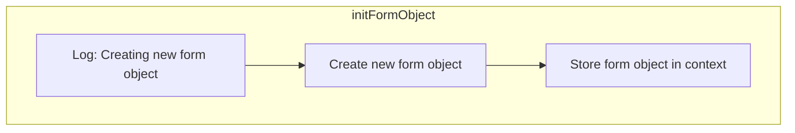

<SwmSnippet path="/spring-webflow/src/main/java/org/springframework/webflow/action/FormAction.java" line="581">

---

First, the <SwmToken path="spring-webflow/src/main/java/org/springframework/webflow/action/FormAction.java" pos="581:5:5" line-data="	private Object initFormObject(RequestContext context) throws Exception {">`initFormObject`</SwmToken> method is responsible for creating a new form object and placing it in the configured scope. This is crucial for setting up the initial state of the form that users will interact with.

```java
	private Object initFormObject(RequestContext context) throws Exception {
		if (logger.isDebugEnabled()) {
			logger.debug("Creating new form object with name '" + getFormObjectName() + "'");
		}
		Object formObject = createFormObject(context);
		putFormObject(context, formObject);
		return formObject;
	}
```

---

</SwmSnippet>

<SwmSnippet path="/spring-webflow/src/main/java/org/springframework/webflow/action/FormAction.java" line="585">

---

Next, the method calls <SwmToken path="spring-webflow/src/main/java/org/springframework/webflow/action/FormAction.java" pos="585:7:7" line-data="		Object formObject = createFormObject(context);">`createFormObject`</SwmToken>, which either creates a new instance of the form object or retrieves it from a specific location if overridden. This ensures that the form object is ready for use and that its class is correctly set.

```java
		Object formObject = createFormObject(context);
```

---

</SwmSnippet>

<SwmSnippet path="/spring-webflow/src/main/java/org/springframework/webflow/action/FormAction.java" line="586">

---

Then, the method calls <SwmToken path="spring-webflow/src/main/java/org/springframework/webflow/action/FormAction.java" pos="586:1:1" line-data="		putFormObject(context, formObject);">`putFormObject`</SwmToken> to store the newly created form object in the specified scope within the given request context. This step is essential for making the form object accessible throughout the flow, ensuring that it can be used and modified as needed during user interactions.

```java
		putFormObject(context, formObject);
```

---

</SwmSnippet>

## Zooming into <SwmToken path="spring-webflow/src/main/java/org/springframework/webflow/action/FormAction.java" pos="585:7:7" line-data="		Object formObject = createFormObject(context);">`createFormObject`</SwmToken> & <SwmToken path="spring-webflow/src/main/java/org/springframework/webflow/action/FormAction.java" pos="712:29:29" line-data="			logger.debug(&quot;Invoking piecemeal validator method &#39;&quot; + validatorMethod + &quot;(&quot; + getFormObjectClass()">`getFormObjectClass`</SwmToken>

```mermaid
graph TD
  subgraph createFormObject
    createFormObject:A["Check if formObjectClass is set"] -->|Not set| createFormObject:B["Throw IllegalStateException"]
    createFormObject:A -->|Set| createFormObject:C["Log creation of new form object"]
    createFormObject:C --> createFormObject:D["Create new instance of form object class"]
  end
  subgraph getFormObjectClass
    getFormObjectClass:A["Retrieve the form object's class"]
  end
  createFormObject:A --> getFormObjectClass

%% Swimm:
%% graph TD
%%   subgraph <SwmToken path="spring-webflow/src/main/java/org/springframework/webflow/action/FormAction.java" pos="585:7:7" line-data="		Object formObject = createFormObject(context);">`createFormObject`</SwmToken>
%%     <SwmToken path="spring-webflow/src/main/java/org/springframework/webflow/action/FormAction.java" pos="585:7:7" line-data="		Object formObject = createFormObject(context);">`createFormObject`</SwmToken>:A["Check if <SwmToken path="spring-webflow/src/main/java/org/springframework/webflow/action/FormAction.java" pos="879:18:18" line-data="			throw new IllegalStateException(&quot;Cannot create form object without formObjectClass property being set -- &quot;">`formObjectClass`</SwmToken> is set"] -->|Not set| <SwmToken path="spring-webflow/src/main/java/org/springframework/webflow/action/FormAction.java" pos="585:7:7" line-data="		Object formObject = createFormObject(context);">`createFormObject`</SwmToken>:B["Throw <SwmToken path="spring-webflow/src/main/java/org/springframework/webflow/action/FormAction.java" pos="879:5:5" line-data="			throw new IllegalStateException(&quot;Cannot create form object without formObjectClass property being set -- &quot;">`IllegalStateException`</SwmToken>"]
%%     <SwmToken path="spring-webflow/src/main/java/org/springframework/webflow/action/FormAction.java" pos="585:7:7" line-data="		Object formObject = createFormObject(context);">`createFormObject`</SwmToken>:A -->|Set| <SwmToken path="spring-webflow/src/main/java/org/springframework/webflow/action/FormAction.java" pos="585:7:7" line-data="		Object formObject = createFormObject(context);">`createFormObject`</SwmToken>:C["Log creation of new form object"]
%%     <SwmToken path="spring-webflow/src/main/java/org/springframework/webflow/action/FormAction.java" pos="585:7:7" line-data="		Object formObject = createFormObject(context);">`createFormObject`</SwmToken>:C --> <SwmToken path="spring-webflow/src/main/java/org/springframework/webflow/action/FormAction.java" pos="585:7:7" line-data="		Object formObject = createFormObject(context);">`createFormObject`</SwmToken>:D["Create new instance of form object class"]
%%   end
%%   subgraph <SwmToken path="spring-webflow/src/main/java/org/springframework/webflow/action/FormAction.java" pos="712:29:29" line-data="			logger.debug(&quot;Invoking piecemeal validator method &#39;&quot; + validatorMethod + &quot;(&quot; + getFormObjectClass()">`getFormObjectClass`</SwmToken>
%%     <SwmToken path="spring-webflow/src/main/java/org/springframework/webflow/action/FormAction.java" pos="712:29:29" line-data="			logger.debug(&quot;Invoking piecemeal validator method &#39;&quot; + validatorMethod + &quot;(&quot; + getFormObjectClass()">`getFormObjectClass`</SwmToken>:A["Retrieve the form object's class"]
%%   end
%%   <SwmToken path="spring-webflow/src/main/java/org/springframework/webflow/action/FormAction.java" pos="585:7:7" line-data="		Object formObject = createFormObject(context);">`createFormObject`</SwmToken>:A --> <SwmToken path="spring-webflow/src/main/java/org/springframework/webflow/action/FormAction.java" pos="712:29:29" line-data="			logger.debug(&quot;Invoking piecemeal validator method &#39;&quot; + validatorMethod + &quot;(&quot; + getFormObjectClass()">`getFormObjectClass`</SwmToken>
```

## Creating and Initializing the Form Object

First, the <SwmToken path="spring-webflow/src/main/java/org/springframework/webflow/action/FormAction.java" pos="585:7:7" line-data="		Object formObject = createFormObject(context);">`createFormObject`</SwmToken> method is responsible for creating the backing form object instance that will be managed by the <SwmToken path="spring-webflow/src/main/java/org/springframework/webflow/action/FormAction.java" pos="118:13:13" line-data=" * custom action method in your FormAction subclass that does just that. Simply invoke it as either a chained action as">`FormAction`</SwmToken>. This method attempts to instantiate a new form object of the type returned by <SwmToken path="spring-webflow/src/main/java/org/springframework/webflow/action/FormAction.java" pos="712:29:29" line-data="			logger.debug(&quot;Invoking piecemeal validator method &#39;&quot; + validatorMethod + &quot;(&quot; + getFormObjectClass()">`getFormObjectClass`</SwmToken>.

Moving to the <SwmToken path="spring-webflow/src/main/java/org/springframework/webflow/action/FormAction.java" pos="712:29:29" line-data="			logger.debug(&quot;Invoking piecemeal validator method &#39;&quot; + validatorMethod + &quot;(&quot; + getFormObjectClass()">`getFormObjectClass`</SwmToken> method, it retrieves the class type of the form object that needs to be created. This class type is essential for the instantiation process in <SwmToken path="spring-webflow/src/main/java/org/springframework/webflow/action/FormAction.java" pos="585:7:7" line-data="		Object formObject = createFormObject(context);">`createFormObject`</SwmToken>.

<SwmSnippet path="/spring-webflow/src/main/java/org/springframework/webflow/action/FormAction.java" line="878">

---

Next, within the <SwmToken path="spring-webflow/src/main/java/org/springframework/webflow/action/FormAction.java" pos="880:14:14" line-data="					+ &quot;either set formObjectClass or override createFormObject&quot;);">`createFormObject`</SwmToken> method, if the form object class is not set, an <SwmToken path="spring-webflow/src/main/java/org/springframework/webflow/action/FormAction.java" pos="879:5:5" line-data="			throw new IllegalStateException(&quot;Cannot create form object without formObjectClass property being set -- &quot;">`IllegalStateException`</SwmToken> is thrown to ensure that the form object cannot be created without a defined class type.

```java
		if (getFormObjectClass() == null) {
			throw new IllegalStateException("Cannot create form object without formObjectClass property being set -- "
					+ "either set formObjectClass or override createFormObject");
```

---

</SwmSnippet>

<SwmSnippet path="/spring-webflow/src/main/java/org/springframework/webflow/action/FormAction.java" line="882">

---

Then, if debugging is enabled, a debug message is logged indicating the creation of a new instance of the form object class. This helps in tracking the instantiation process during development and troubleshooting.

```java
		if (logger.isDebugEnabled()) {
			logger.debug("Creating new instance of form object class [" + getFormObjectClass() + "]");
		}
```

---

</SwmSnippet>

<SwmSnippet path="/spring-webflow/src/main/java/org/springframework/webflow/action/FormAction.java" line="885">

---

Finally, the method returns a new instance of the form object class, completing the creation process. This instance is then used in the flow for various user interactions and data handling.

```java
		return getFormObjectClass().newInstance();
	}
```

---

</SwmSnippet>

## Going into <SwmToken path="spring-webflow/src/main/java/org/springframework/webflow/action/FormAction.java" pos="885:7:7" line-data="		return getFormObjectClass().newInstance();">`newInstance`</SwmToken>

```mermaid
graph TD
  subgraph newInstance
    newInstance:A["Find LifecycleFactory using JsfUtils"] --> newInstance:B["Get default lifecycle from factory"]
    newInstance:B --> newInstance:C["Return new FlowLifecycle instance"]
  end

%% Swimm:
%% graph TD
%%   subgraph <SwmToken path="spring-webflow/src/main/java/org/springframework/webflow/action/FormAction.java" pos="885:7:7" line-data="		return getFormObjectClass().newInstance();">`newInstance`</SwmToken>
%%     <SwmToken path="spring-webflow/src/main/java/org/springframework/webflow/action/FormAction.java" pos="885:7:7" line-data="		return getFormObjectClass().newInstance();">`newInstance`</SwmToken>:A["Find <SwmToken path="spring-faces/src/main/java/org/springframework/faces/webflow/FlowLifecycle.java" pos="46:1:1" line-data="		LifecycleFactory lifecycleFactory = JsfUtils.findFactory(LifecycleFactory.class);">`LifecycleFactory`</SwmToken> using <SwmToken path="spring-faces/src/main/java/org/springframework/faces/webflow/FlowLifecycle.java" pos="46:7:7" line-data="		LifecycleFactory lifecycleFactory = JsfUtils.findFactory(LifecycleFactory.class);">`JsfUtils`</SwmToken>"] --> <SwmToken path="spring-webflow/src/main/java/org/springframework/webflow/action/FormAction.java" pos="885:7:7" line-data="		return getFormObjectClass().newInstance();">`newInstance`</SwmToken>:B["Get default lifecycle from factory"]
%%     <SwmToken path="spring-webflow/src/main/java/org/springframework/webflow/action/FormAction.java" pos="885:7:7" line-data="		return getFormObjectClass().newInstance();">`newInstance`</SwmToken>:B --> <SwmToken path="spring-webflow/src/main/java/org/springframework/webflow/action/FormAction.java" pos="885:7:7" line-data="		return getFormObjectClass().newInstance();">`newInstance`</SwmToken>:C["Return new <SwmToken path="spring-faces/src/main/java/org/springframework/faces/webflow/FlowLifecycle.java" pos="48:5:5" line-data="		return new FlowLifecycle(defaultLifecycle);">`FlowLifecycle`</SwmToken> instance"]
%%   end
```

## Creating a new lifecycle instance

First, the <SwmToken path="spring-webflow/src/main/java/org/springframework/webflow/action/FormAction.java" pos="885:7:7" line-data="		return getFormObjectClass().newInstance();">`newInstance`</SwmToken> method is responsible for creating a new lifecycle instance. This is crucial for initializing the flow lifecycle, which manages the various phases of the flow execution.

Moving to the next step, the method calls <SwmToken path="spring-faces/src/main/java/org/springframework/faces/webflow/FlowLifecycle.java" pos="46:7:9" line-data="		LifecycleFactory lifecycleFactory = JsfUtils.findFactory(LifecycleFactory.class);">`JsfUtils.findFactory`</SwmToken> to find a factory instance of the specified class <SwmToken path="spring-faces/src/main/java/org/springframework/faces/webflow/FlowLifecycle.java" pos="46:1:1" line-data="		LifecycleFactory lifecycleFactory = JsfUtils.findFactory(LifecycleFactory.class);">`LifecycleFactory`</SwmToken>. This ensures that the correct factory is used to create the lifecycle.

Next, the method retrieves the default lifecycle from the factory using <SwmToken path="spring-faces/src/main/java/org/springframework/faces/webflow/FlowLifecycle.java" pos="47:7:14" line-data="		Lifecycle defaultLifecycle = lifecycleFactory.getLifecycle(LifecycleFactory.DEFAULT_LIFECYCLE);">`lifecycleFactory.getLifecycle(LifecycleFactory.DEFAULT_LIFECYCLE)`</SwmToken>. This step ensures that the default lifecycle configuration is used as a base.

<SwmSnippet path="/spring-faces/src/main/java/org/springframework/faces/webflow/FlowLifecycle.java" line="45">

---

Finally, the method returns a new instance of <SwmToken path="spring-faces/src/main/java/org/springframework/faces/webflow/FlowLifecycle.java" pos="48:5:5" line-data="		return new FlowLifecycle(defaultLifecycle);">`FlowLifecycle`</SwmToken> initialized with the default lifecycle. This encapsulates the default lifecycle within a <SwmToken path="spring-faces/src/main/java/org/springframework/faces/webflow/FlowLifecycle.java" pos="48:5:5" line-data="		return new FlowLifecycle(defaultLifecycle);">`FlowLifecycle`</SwmToken> object, ready for use in managing the flow's lifecycle.

```java
	public static Lifecycle newInstance() {
		LifecycleFactory lifecycleFactory = JsfUtils.findFactory(LifecycleFactory.class);
		Lifecycle defaultLifecycle = lifecycleFactory.getLifecycle(LifecycleFactory.DEFAULT_LIFECYCLE);
		return new FlowLifecycle(defaultLifecycle);

	}
```

---

</SwmSnippet>

## Breaking down <SwmToken path="spring-faces/src/main/java/org/springframework/faces/webflow/FlowLifecycle.java" pos="46:9:9" line-data="		LifecycleFactory lifecycleFactory = JsfUtils.findFactory(LifecycleFactory.class);">`findFactory`</SwmToken> & <SwmToken path="spring-faces/src/main/java/org/springframework/faces/webflow/JsfUtils.java" pos="87:25:25" line-data="		Assert.state(name != null, &quot;Unknown factory class &quot; + factoryClass.getName());">`getName`</SwmToken>

```mermaid
graph TD
  subgraph findFactory
    findFactory:A["Check if factoryClass is not null"] --> findFactory:B["Get factory name from FACTORY_NAMES"]
    findFactory:B --> findFactory:C["Check if name is not null"]
    findFactory:C --> findFactory:D["Get factory using FactoryFinder"]
  end
  subgraph getName
    getName:A["Return conversation name"]
  end

%% Swimm:
%% graph TD
%%   subgraph <SwmToken path="spring-faces/src/main/java/org/springframework/faces/webflow/FlowLifecycle.java" pos="46:9:9" line-data="		LifecycleFactory lifecycleFactory = JsfUtils.findFactory(LifecycleFactory.class);">`findFactory`</SwmToken>
%%     <SwmToken path="spring-faces/src/main/java/org/springframework/faces/webflow/FlowLifecycle.java" pos="46:9:9" line-data="		LifecycleFactory lifecycleFactory = JsfUtils.findFactory(LifecycleFactory.class);">`findFactory`</SwmToken>:A["Check if <SwmToken path="spring-faces/src/main/java/org/springframework/faces/webflow/JsfUtils.java" pos="84:18:18" line-data="	public static &lt;T&gt; T findFactory(Class&lt;T&gt; factoryClass) {">`factoryClass`</SwmToken> is not null"] --> <SwmToken path="spring-faces/src/main/java/org/springframework/faces/webflow/FlowLifecycle.java" pos="46:9:9" line-data="		LifecycleFactory lifecycleFactory = JsfUtils.findFactory(LifecycleFactory.class);">`findFactory`</SwmToken>:B["Get factory name from <SwmToken path="spring-faces/src/main/java/org/springframework/faces/webflow/JsfUtils.java" pos="86:7:7" line-data="		String name = FACTORY_NAMES.get(factoryClass);">`FACTORY_NAMES`</SwmToken>"]
%%     <SwmToken path="spring-faces/src/main/java/org/springframework/faces/webflow/FlowLifecycle.java" pos="46:9:9" line-data="		LifecycleFactory lifecycleFactory = JsfUtils.findFactory(LifecycleFactory.class);">`findFactory`</SwmToken>:B --> <SwmToken path="spring-faces/src/main/java/org/springframework/faces/webflow/FlowLifecycle.java" pos="46:9:9" line-data="		LifecycleFactory lifecycleFactory = JsfUtils.findFactory(LifecycleFactory.class);">`findFactory`</SwmToken>:C["Check if name is not null"]
%%     <SwmToken path="spring-faces/src/main/java/org/springframework/faces/webflow/FlowLifecycle.java" pos="46:9:9" line-data="		LifecycleFactory lifecycleFactory = JsfUtils.findFactory(LifecycleFactory.class);">`findFactory`</SwmToken>:C --> <SwmToken path="spring-faces/src/main/java/org/springframework/faces/webflow/FlowLifecycle.java" pos="46:9:9" line-data="		LifecycleFactory lifecycleFactory = JsfUtils.findFactory(LifecycleFactory.class);">`findFactory`</SwmToken>:D["Get factory using <SwmToken path="spring-faces/src/main/java/org/springframework/faces/webflow/JsfUtils.java" pos="88:7:7" line-data="		return (T) FactoryFinder.getFactory(name);">`FactoryFinder`</SwmToken>"]
%%   end
%%   subgraph <SwmToken path="spring-faces/src/main/java/org/springframework/faces/webflow/JsfUtils.java" pos="87:25:25" line-data="		Assert.state(name != null, &quot;Unknown factory class &quot; + factoryClass.getName());">`getName`</SwmToken>
%%     <SwmToken path="spring-faces/src/main/java/org/springframework/faces/webflow/JsfUtils.java" pos="87:25:25" line-data="		Assert.state(name != null, &quot;Unknown factory class &quot; + factoryClass.getName());">`getName`</SwmToken>:A["Return conversation name"]
%%   end
```

<SwmSnippet path="/spring-faces/src/main/java/org/springframework/faces/webflow/JsfUtils.java" line="84">

---

First, the <SwmToken path="spring-faces/src/main/java/org/springframework/faces/webflow/JsfUtils.java" pos="84:11:11" line-data="	public static &lt;T&gt; T findFactory(Class&lt;T&gt; factoryClass) {">`findFactory`</SwmToken> method is responsible for locating a factory of a specified class using JSF's <SwmToken path="spring-faces/src/main/java/org/springframework/faces/webflow/JsfUtils.java" pos="88:7:7" line-data="		return (T) FactoryFinder.getFactory(name);">`FactoryFinder`</SwmToken> class. This method ensures that the factory class provided is not null and retrieves the corresponding factory name from a predefined map. If the factory name is found, it uses <SwmToken path="spring-faces/src/main/java/org/springframework/faces/webflow/JsfUtils.java" pos="88:7:7" line-data="		return (T) FactoryFinder.getFactory(name);">`FactoryFinder`</SwmToken> to get the factory instance.

```java
	public static <T> T findFactory(Class<T> factoryClass) {
		Assert.notNull(factoryClass, "FactoryClass must not be null");
		String name = FACTORY_NAMES.get(factoryClass);
		Assert.state(name != null, "Unknown factory class " + factoryClass.getName());
		return (T) FactoryFinder.getFactory(name);
	}
```

---

</SwmSnippet>

<SwmSnippet path="/spring-webflow/src/main/java/org/springframework/webflow/conversation/ConversationParameters.java" line="60">

---

Next, the <SwmToken path="spring-webflow/src/main/java/org/springframework/webflow/conversation/ConversationParameters.java" pos="60:5:5" line-data="	public String getName() {">`getName`</SwmToken> method in the <SwmToken path="spring-webflow/src/main/java/org/springframework/webflow/conversation/ConversationParameters.java" pos="27:4:4" line-data="public class ConversationParameters implements Serializable {">`ConversationParameters`</SwmToken> class simply returns the name of the conversation. This method is straightforward and does not involve any complex logic.

```java
	public String getName() {
		return name;
	}
```

---

</SwmSnippet>

## Looking at <SwmToken path="spring-faces/src/main/java/org/springframework/faces/webflow/FlowLifecycle.java" pos="47:9:9" line-data="		Lifecycle defaultLifecycle = lifecycleFactory.getLifecycle(LifecycleFactory.DEFAULT_LIFECYCLE);">`getLifecycle`</SwmToken>

```mermaid
graph TD
  subgraph getLifecycle
    getLifecycle:A["Check if lifecycle is not initialized"] --> getLifecycle:B["Create new FlowLifecycle instance"]
    getLifecycle:B --> getLifecycle:C["Return lifecycle instance"]
  end

%% Swimm:
%% graph TD
%%   subgraph <SwmToken path="spring-faces/src/main/java/org/springframework/faces/webflow/FlowLifecycle.java" pos="47:9:9" line-data="		Lifecycle defaultLifecycle = lifecycleFactory.getLifecycle(LifecycleFactory.DEFAULT_LIFECYCLE);">`getLifecycle`</SwmToken>
%%     <SwmToken path="spring-faces/src/main/java/org/springframework/faces/webflow/FlowLifecycle.java" pos="47:9:9" line-data="		Lifecycle defaultLifecycle = lifecycleFactory.getLifecycle(LifecycleFactory.DEFAULT_LIFECYCLE);">`getLifecycle`</SwmToken>:A["Check if lifecycle is not initialized"] --> <SwmToken path="spring-faces/src/main/java/org/springframework/faces/webflow/FlowLifecycle.java" pos="47:9:9" line-data="		Lifecycle defaultLifecycle = lifecycleFactory.getLifecycle(LifecycleFactory.DEFAULT_LIFECYCLE);">`getLifecycle`</SwmToken>:B["Create new <SwmToken path="spring-faces/src/main/java/org/springframework/faces/webflow/FlowLifecycle.java" pos="48:5:5" line-data="		return new FlowLifecycle(defaultLifecycle);">`FlowLifecycle`</SwmToken> instance"]
%%     <SwmToken path="spring-faces/src/main/java/org/springframework/faces/webflow/FlowLifecycle.java" pos="47:9:9" line-data="		Lifecycle defaultLifecycle = lifecycleFactory.getLifecycle(LifecycleFactory.DEFAULT_LIFECYCLE);">`getLifecycle`</SwmToken>:B --> <SwmToken path="spring-faces/src/main/java/org/springframework/faces/webflow/FlowLifecycle.java" pos="47:9:9" line-data="		Lifecycle defaultLifecycle = lifecycleFactory.getLifecycle(LifecycleFactory.DEFAULT_LIFECYCLE);">`getLifecycle`</SwmToken>:C["Return lifecycle instance"]
%%   end
```

<SwmSnippet path="/spring-faces/src/main/java/org/springframework/faces/webflow/JsfViewFactoryCreator.java" line="51">

---

First, the <SwmToken path="spring-faces/src/main/java/org/springframework/faces/webflow/FlowLifecycle.java" pos="47:9:9" line-data="		Lifecycle defaultLifecycle = lifecycleFactory.getLifecycle(LifecycleFactory.DEFAULT_LIFECYCLE);">`getLifecycle`</SwmToken> method checks if the <SwmToken path="spring-faces/src/main/java/org/springframework/faces/webflow/JsfViewFactoryCreator.java" pos="51:6:6" line-data="		if (this.lifecycle == null) {">`lifecycle`</SwmToken> instance is null. This is crucial because it ensures that a new instance of <SwmToken path="spring-faces/src/main/java/org/springframework/faces/webflow/JsfViewFactoryCreator.java" pos="52:7:7" line-data="			this.lifecycle = FlowLifecycle.newInstance();">`FlowLifecycle`</SwmToken> is only created if it doesn't already exist. This helps in managing resources efficiently by avoiding unnecessary instantiation.

```java
		if (this.lifecycle == null) {
			this.lifecycle = FlowLifecycle.newInstance();
```

---

</SwmSnippet>

<SwmSnippet path="/spring-faces/src/main/java/org/springframework/faces/webflow/JsfViewFactoryCreator.java" line="52">

---

Next, if the <SwmToken path="spring-faces/src/main/java/org/springframework/faces/webflow/JsfViewFactoryCreator.java" pos="52:3:3" line-data="			this.lifecycle = FlowLifecycle.newInstance();">`lifecycle`</SwmToken> instance is null, the method calls <SwmToken path="spring-faces/src/main/java/org/springframework/faces/webflow/JsfViewFactoryCreator.java" pos="52:7:11" line-data="			this.lifecycle = FlowLifecycle.newInstance();">`FlowLifecycle.newInstance()`</SwmToken> to create a new instance of <SwmToken path="spring-faces/src/main/java/org/springframework/faces/webflow/JsfViewFactoryCreator.java" pos="52:7:7" line-data="			this.lifecycle = FlowLifecycle.newInstance();">`FlowLifecycle`</SwmToken>. This step is essential as it initializes the lifecycle which is responsible for managing the flow of user interactions within the application.

```java
			this.lifecycle = FlowLifecycle.newInstance();
```

---

</SwmSnippet>

<SwmSnippet path="/spring-faces/src/main/java/org/springframework/faces/webflow/JsfViewFactoryCreator.java" line="54">

---

Finally, the method returns the <SwmToken path="spring-faces/src/main/java/org/springframework/faces/webflow/JsfViewFactoryCreator.java" pos="54:5:5" line-data="		return this.lifecycle;">`lifecycle`</SwmToken> instance. This ensures that the lifecycle is always available for managing the flow, whether it was newly created or already existing.

```java
		return this.lifecycle;
	}
```

---

</SwmSnippet>

## Inside <SwmToken path="spring-webflow/src/main/java/org/springframework/webflow/action/FormAction.java" pos="586:1:1" line-data="		putFormObject(context, formObject);">`putFormObject`</SwmToken>

```mermaid
graph TD
  subgraph putFormObject
    putFormObject:A["Check if debugging is enabled"] --> putFormObject:B["Log debugging information"]
    putFormObject --> putFormObject:C["Retrieve form object accessor"]
    putFormObject:C --> putFormObject:D["Store the form object in context"]
  end

%% Swimm:
%% graph TD
%%   subgraph <SwmToken path="spring-webflow/src/main/java/org/springframework/webflow/action/FormAction.java" pos="586:1:1" line-data="		putFormObject(context, formObject);">`putFormObject`</SwmToken>
%%     <SwmToken path="spring-webflow/src/main/java/org/springframework/webflow/action/FormAction.java" pos="586:1:1" line-data="		putFormObject(context, formObject);">`putFormObject`</SwmToken>:A["Check if debugging is enabled"] --> <SwmToken path="spring-webflow/src/main/java/org/springframework/webflow/action/FormAction.java" pos="586:1:1" line-data="		putFormObject(context, formObject);">`putFormObject`</SwmToken>:B["Log debugging information"]
%%     <SwmToken path="spring-webflow/src/main/java/org/springframework/webflow/action/FormAction.java" pos="586:1:1" line-data="		putFormObject(context, formObject);">`putFormObject`</SwmToken> --> <SwmToken path="spring-webflow/src/main/java/org/springframework/webflow/action/FormAction.java" pos="586:1:1" line-data="		putFormObject(context, formObject);">`putFormObject`</SwmToken>:C["Retrieve form object accessor"]
%%     <SwmToken path="spring-webflow/src/main/java/org/springframework/webflow/action/FormAction.java" pos="586:1:1" line-data="		putFormObject(context, formObject);">`putFormObject`</SwmToken>:C --> <SwmToken path="spring-webflow/src/main/java/org/springframework/webflow/action/FormAction.java" pos="586:1:1" line-data="		putFormObject(context, formObject);">`putFormObject`</SwmToken>:D["Store the form object in context"]
%%   end
```

## Storing the form object

First, the <SwmToken path="spring-webflow/src/main/java/org/springframework/webflow/action/FormAction.java" pos="586:1:1" line-data="		putFormObject(context, formObject);">`putFormObject`</SwmToken> method is responsible for storing the provided form object in the specified scope within the given request context. This is crucial for maintaining the state of the form object throughout the flow.

<SwmSnippet path="/spring-webflow/src/main/java/org/springframework/webflow/action/FormAction.java" line="346">

---

Next, the method retrieves the scope of the form object using <SwmToken path="spring-webflow/src/main/java/org/springframework/webflow/action/FormAction.java" pos="346:5:5" line-data="	public ScopeType getFormObjectScope() {">`getFormObjectScope`</SwmToken>. This determines where the form object will be stored, ensuring it is placed in the correct context for subsequent access.

```java
	public ScopeType getFormObjectScope() {
```

---

</SwmSnippet>

<SwmSnippet path="/spring-webflow/src/main/java/org/springframework/webflow/action/FormAction.java" line="308">

---

Then, it retrieves the name of the form object using <SwmToken path="spring-webflow/src/main/java/org/springframework/webflow/action/FormAction.java" pos="308:5:5" line-data="	public String getFormObjectName() {">`getFormObjectName`</SwmToken>. This name is used as a key to store and later retrieve the form object from the specified scope.

```java
	public String getFormObjectName() {
```

---

</SwmSnippet>

<SwmSnippet path="/spring-webflow/src/main/java/org/springframework/webflow/action/FormAction.java" line="856">

---

Moving to the next step, the method creates and returns an accessor for form objects in the provided request context using <SwmToken path="spring-webflow/src/main/java/org/springframework/webflow/action/FormAction.java" pos="856:5:5" line-data="	protected FormObjectAccessor getFormObjectAccessor(RequestContext context) {">`getFormObjectAccessor`</SwmToken>. This accessor facilitates the interaction with the form object within the specified scope.

```java
	protected FormObjectAccessor getFormObjectAccessor(RequestContext context) {
```

---

</SwmSnippet>

<SwmSnippet path="/spring-webflow/src/main/java/org/springframework/webflow/action/FormAction.java" line="594">

---

Additionally, if debugging is enabled, the method logs the type of the form object and the scope in which it is being stored. This helps in tracking the flow of form objects during the execution.

```java
		if (logger.isDebugEnabled()) {
			logger.debug("Putting form object of type [" + formObject.getClass() + "] in scope " + getFormObjectScope()
					+ " with name '" + getFormObjectName() + "'");
```

---

</SwmSnippet>

<SwmSnippet path="/spring-webflow/src/main/java/org/springframework/webflow/action/FormAction.java" line="598">

---

Finally, the method stores the form object in the specified scope using the accessor. This ensures that the form object is available for future operations within the flow.

```java
		getFormObjectAccessor(context).putFormObject(formObject, getFormObjectName(), getFormObjectScope());
	}
```

---

</SwmSnippet>

## Going into <SwmToken path="spring-webflow/src/main/java/org/springframework/webflow/action/FormAction.java" pos="741:3:3" line-data="			accessor.setCurrentFormObject(formObject, getFormObjectScope());">`setCurrentFormObject`</SwmToken> & <SwmToken path="spring-webflow/src/main/java/org/springframework/webflow/action/FormObjectAccessor.java" pos="75:7:7" line-data="	public static String getCurrentFormObjectName() {">`getCurrentFormObjectName`</SwmToken>

```mermaid
graph TD
  subgraph setCurrentFormObject
    setCurrentFormObject:A["Retrieve the current request scope"] --> setCurrentFormObject:B["Get the current form object name"]
    setCurrentFormObject:B --> setCurrentFormObject:C["Put form object in request scope"]
  end
  subgraph getCurrentFormObjectName
    getCurrentFormObjectName:A["Return the current form object name"]
  end
  setCurrentFormObject:B --> getCurrentFormObjectName

%% Swimm:
%% graph TD
%%   subgraph <SwmToken path="spring-webflow/src/main/java/org/springframework/webflow/action/FormAction.java" pos="741:3:3" line-data="			accessor.setCurrentFormObject(formObject, getFormObjectScope());">`setCurrentFormObject`</SwmToken>
%%     <SwmToken path="spring-webflow/src/main/java/org/springframework/webflow/action/FormAction.java" pos="741:3:3" line-data="			accessor.setCurrentFormObject(formObject, getFormObjectScope());">`setCurrentFormObject`</SwmToken>:A["Retrieve the current request scope"] --> <SwmToken path="spring-webflow/src/main/java/org/springframework/webflow/action/FormAction.java" pos="741:3:3" line-data="			accessor.setCurrentFormObject(formObject, getFormObjectScope());">`setCurrentFormObject`</SwmToken>:B["Get the current form object name"]
%%     <SwmToken path="spring-webflow/src/main/java/org/springframework/webflow/action/FormAction.java" pos="741:3:3" line-data="			accessor.setCurrentFormObject(formObject, getFormObjectScope());">`setCurrentFormObject`</SwmToken>:B --> <SwmToken path="spring-webflow/src/main/java/org/springframework/webflow/action/FormAction.java" pos="741:3:3" line-data="			accessor.setCurrentFormObject(formObject, getFormObjectScope());">`setCurrentFormObject`</SwmToken>:C["Put form object in request scope"]
%%   end
%%   subgraph <SwmToken path="spring-webflow/src/main/java/org/springframework/webflow/action/FormObjectAccessor.java" pos="75:7:7" line-data="	public static String getCurrentFormObjectName() {">`getCurrentFormObjectName`</SwmToken>
%%     <SwmToken path="spring-webflow/src/main/java/org/springframework/webflow/action/FormObjectAccessor.java" pos="75:7:7" line-data="	public static String getCurrentFormObjectName() {">`getCurrentFormObjectName`</SwmToken>:A["Return the current form object name"]
%%   end
%%   <SwmToken path="spring-webflow/src/main/java/org/springframework/webflow/action/FormAction.java" pos="741:3:3" line-data="			accessor.setCurrentFormObject(formObject, getFormObjectScope());">`setCurrentFormObject`</SwmToken>:B --> <SwmToken path="spring-webflow/src/main/java/org/springframework/webflow/action/FormObjectAccessor.java" pos="75:7:7" line-data="	public static String getCurrentFormObjectName() {">`getCurrentFormObjectName`</SwmToken>
```

<SwmSnippet path="/spring-webflow/src/main/java/org/springframework/webflow/action/FormObjectAccessor.java" line="121">

---

First, the <SwmToken path="spring-webflow/src/main/java/org/springframework/webflow/action/FormObjectAccessor.java" pos="121:5:5" line-data="	public void setCurrentFormObject(Object formObject, ScopeType scopeType) {">`setCurrentFormObject`</SwmToken> method is responsible for exposing the given form object using a <SwmToken path="spring-webflow/src/main/java/org/springframework/webflow/action/FormObjectAccessor.java" pos="88:22:24" line-data="	 * Gets the form object from the context, using the well-known attribute name. Will try all scopes.">`well-known`</SwmToken> alias within the specified scope. This ensures that the form object is accessible within the defined scope, which is crucial for maintaining the state of the form during the flow.

```java
	public void setCurrentFormObject(Object formObject, ScopeType scopeType) {
		// don't call setFormObject since that would cause infinite recursion!
		scopeType.getScope(context).put(getCurrentFormObjectName(), formObject);
	}
```

---

</SwmSnippet>

<SwmSnippet path="/spring-webflow/src/main/java/org/springframework/webflow/action/FormObjectAccessor.java" line="75">

---

Next, the <SwmToken path="spring-webflow/src/main/java/org/springframework/webflow/action/FormObjectAccessor.java" pos="75:7:7" line-data="	public static String getCurrentFormObjectName() {">`getCurrentFormObjectName`</SwmToken> method returns the name of the current form object. This name is used as a key to store and retrieve the form object within the scope. By using a consistent alias, the flow can reliably access the form object whenever needed.

```java
	public static String getCurrentFormObjectName() {
		return CURRENT_FORM_OBJECT_ATTRIBUTE;
	}
```

---

</SwmSnippet>

## A closer look at <SwmToken path="spring-webflow/src/main/java/org/springframework/webflow/action/FormObjectAccessor.java" pos="123:3:3" line-data="		scopeType.getScope(context).put(getCurrentFormObjectName(), formObject);">`getScope`</SwmToken> & <SwmToken path="spring-webflow/src/main/java/org/springframework/webflow/execution/ScopeType.java" pos="39:5:5" line-data="			return context.getRequestScope();">`getRequestScope`</SwmToken>

```mermaid
graph TD
  subgraph getScope
    getScope:A["Retrieve the current request scope attributes"]
  end
  subgraph getRequestScope
    getRequestScope:A["Provide request scope"] --> getRequestScope:B["Return requestScope"]
  end
  getScope:A --> getRequestScope:A

%% Swimm:
%% graph TD
%%   subgraph <SwmToken path="spring-webflow/src/main/java/org/springframework/webflow/action/FormObjectAccessor.java" pos="123:3:3" line-data="		scopeType.getScope(context).put(getCurrentFormObjectName(), formObject);">`getScope`</SwmToken>
%%     <SwmToken path="spring-webflow/src/main/java/org/springframework/webflow/action/FormObjectAccessor.java" pos="123:3:3" line-data="		scopeType.getScope(context).put(getCurrentFormObjectName(), formObject);">`getScope`</SwmToken>:A["Retrieve the current request scope attributes"]
%%   end
%%   subgraph <SwmToken path="spring-webflow/src/main/java/org/springframework/webflow/execution/ScopeType.java" pos="39:5:5" line-data="			return context.getRequestScope();">`getRequestScope`</SwmToken>
%%     <SwmToken path="spring-webflow/src/main/java/org/springframework/webflow/execution/ScopeType.java" pos="39:5:5" line-data="			return context.getRequestScope();">`getRequestScope`</SwmToken>:A["Provide request scope"] --> <SwmToken path="spring-webflow/src/main/java/org/springframework/webflow/execution/ScopeType.java" pos="39:5:5" line-data="			return context.getRequestScope();">`getRequestScope`</SwmToken>:B["Return <SwmToken path="spring-webflow/src/main/java/org/springframework/webflow/engine/impl/RequestControlContextImpl.java" pos="118:3:3" line-data="		return requestScope;">`requestScope`</SwmToken>"]
%%   end
%%   <SwmToken path="spring-webflow/src/main/java/org/springframework/webflow/action/FormObjectAccessor.java" pos="123:3:3" line-data="		scopeType.getScope(context).put(getCurrentFormObjectName(), formObject);">`getScope`</SwmToken>:A --> <SwmToken path="spring-webflow/src/main/java/org/springframework/webflow/execution/ScopeType.java" pos="39:5:5" line-data="			return context.getRequestScope();">`getRequestScope`</SwmToken>:A
```

<SwmSnippet path="/spring-webflow/src/main/java/org/springframework/webflow/execution/ScopeType.java" line="37">

---

First, the <SwmToken path="spring-webflow/src/main/java/org/springframework/webflow/execution/ScopeType.java" pos="38:8:8" line-data="		public MutableAttributeMap&lt;Object&gt; getScope(RequestContext context) {">`getScope`</SwmToken> method in <SwmToken path="spring-webflow/src/main/java/org/springframework/webflow/action/FormAction.java" pos="346:3:3" line-data="	public ScopeType getFormObjectScope() {">`ScopeType`</SwmToken> is responsible for determining the scope type and retrieving the corresponding scope from the <SwmToken path="spring-webflow/src/main/java/org/springframework/webflow/execution/ScopeType.java" pos="38:10:10" line-data="		public MutableAttributeMap&lt;Object&gt; getScope(RequestContext context) {">`RequestContext`</SwmToken>. This method specifically calls the <SwmToken path="spring-webflow/src/main/java/org/springframework/webflow/execution/ScopeType.java" pos="39:5:5" line-data="			return context.getRequestScope();">`getRequestScope`</SwmToken> method to fetch the request scope attributes.

```java
	REQUEST() {
		public MutableAttributeMap<Object> getScope(RequestContext context) {
			return context.getRequestScope();
		}
	},
```

---

</SwmSnippet>

<SwmSnippet path="/spring-webflow/src/main/java/org/springframework/webflow/engine/impl/RequestControlContextImpl.java" line="117">

---

Moving to the <SwmToken path="spring-webflow/src/main/java/org/springframework/webflow/engine/impl/RequestControlContextImpl.java" pos="117:8:8" line-data="	public MutableAttributeMap&lt;Object&gt; getRequestScope() {">`getRequestScope`</SwmToken> method in <SwmToken path="spring-webflow/src/main/java/org/springframework/webflow/engine/impl/RequestControlContextImpl.java" pos="47:2:2" line-data="class RequestControlContextImpl implements RequestControlContext {">`RequestControlContextImpl`</SwmToken>, this method directly retrieves the current request scope attributes stored in the <SwmToken path="spring-webflow/src/main/java/org/springframework/webflow/engine/impl/RequestControlContextImpl.java" pos="118:3:3" line-data="		return requestScope;">`requestScope`</SwmToken> variable. This is crucial for accessing any attributes that are specific to the current request, ensuring that the flow can manage and utilize these attributes effectively.

```java
	public MutableAttributeMap<Object> getRequestScope() {
		return requestScope;
	}
```

---

</SwmSnippet>

## Zooming into <SwmToken path="spring-webflow/src/main/java/org/springframework/webflow/action/FormAction.java" pos="498:9:9" line-data="		return binder.getBindingResult().hasErrors() ? error() : success();">`hasErrors`</SwmToken>

```mermaid
graph TD
  subgraph hasErrors
    hasErrors:A["Check if there are any error results in the mapping results"] --> hasErrors:B["Determine if only 'property not found' errors are present"]
    hasErrors:B -->|Both conditions met| hasErrors:C["Return true"]
  end

%% Swimm:
%% graph TD
%%   subgraph <SwmToken path="spring-webflow/src/main/java/org/springframework/webflow/action/FormAction.java" pos="498:9:9" line-data="		return binder.getBindingResult().hasErrors() ? error() : success();">`hasErrors`</SwmToken>
%%     <SwmToken path="spring-webflow/src/main/java/org/springframework/webflow/action/FormAction.java" pos="498:9:9" line-data="		return binder.getBindingResult().hasErrors() ? error() : success();">`hasErrors`</SwmToken>:A["Check if there are any error results in the mapping results"] --> <SwmToken path="spring-webflow/src/main/java/org/springframework/webflow/action/FormAction.java" pos="498:9:9" line-data="		return binder.getBindingResult().hasErrors() ? error() : success();">`hasErrors`</SwmToken>:B["Determine if only 'property not found' errors are present"]
%%     <SwmToken path="spring-webflow/src/main/java/org/springframework/webflow/action/FormAction.java" pos="498:9:9" line-data="		return binder.getBindingResult().hasErrors() ? error() : success();">`hasErrors`</SwmToken>:B -->|Both conditions met| <SwmToken path="spring-webflow/src/main/java/org/springframework/webflow/action/FormAction.java" pos="498:9:9" line-data="		return binder.getBindingResult().hasErrors() ? error() : success();">`hasErrors`</SwmToken>:C["Return true"]
%%   end
```

<SwmSnippet path="/spring-webflow/src/main/java/org/springframework/webflow/mvc/view/AbstractMvcView.java" line="649">

---

First, the <SwmToken path="spring-webflow/src/main/java/org/springframework/webflow/mvc/view/AbstractMvcView.java" pos="649:5:5" line-data="	private boolean hasErrors(MappingResults results) {">`hasErrors`</SwmToken> method checks if there are any error results in the mapping results. This is crucial for identifying any issues that might have occurred during the data mapping process.

```java
	private boolean hasErrors(MappingResults results) {
		return results.hasErrorResults() && !onlyPropertyNotFoundErrorsPresent(results);
	}
```

---

</SwmSnippet>

<SwmSnippet path="/spring-webflow/src/main/java/org/springframework/webflow/mvc/view/AbstractMvcView.java" line="650">

---

Next, the method evaluates the type of errors present. It specifically checks if the errors are not just 'property not found' errors. This distinction is important because 'property not found' errors might be less critical and could be handled differently compared to other types of errors.

```java
		return results.hasErrorResults() && !onlyPropertyNotFoundErrorsPresent(results);
	}
```

---

</SwmSnippet>

## A closer look at <SwmToken path="spring-webflow/src/main/java/org/springframework/webflow/mvc/view/AbstractMvcView.java" pos="650:12:12" line-data="		return results.hasErrorResults() &amp;&amp; !onlyPropertyNotFoundErrorsPresent(results);">`onlyPropertyNotFoundErrorsPresent`</SwmToken>

```mermaid
graph TD
  subgraph onlyPropertyNotFoundErrorsPresent
    onlyPropertyNotFoundErrorsPresent:A["Get the results for PROPERTY_NOT_FOUND_ERROR"] --> onlyPropertyNotFoundErrorsPresent:B["Get the error results"] 
    onlyPropertyNotFoundErrorsPresent:B --> onlyPropertyNotFoundErrorsPresent:C["Check if the size of PROPERTY_NOT_FOUND_ERROR results equals size of error results"] 
  end

  subgraph getResults
    getResults:A["Retrieve mapping results meeting criteria"] 
  end

  subgraph getErrorResults
    getErrorResults:A["Find and return error mapping results"] 
  end

%% Swimm:
%% graph TD
%%   subgraph <SwmToken path="spring-webflow/src/main/java/org/springframework/webflow/mvc/view/AbstractMvcView.java" pos="650:12:12" line-data="		return results.hasErrorResults() &amp;&amp; !onlyPropertyNotFoundErrorsPresent(results);">`onlyPropertyNotFoundErrorsPresent`</SwmToken>
%%     <SwmToken path="spring-webflow/src/main/java/org/springframework/webflow/mvc/view/AbstractMvcView.java" pos="650:12:12" line-data="		return results.hasErrorResults() &amp;&amp; !onlyPropertyNotFoundErrorsPresent(results);">`onlyPropertyNotFoundErrorsPresent`</SwmToken>:A["Get the results for <SwmToken path="spring-webflow/src/main/java/org/springframework/webflow/mvc/view/AbstractMvcView.java" pos="654:7:7" line-data="		return results.getResults(PROPERTY_NOT_FOUND_ERROR).size() == mappingResults.getErrorResults().size();">`PROPERTY_NOT_FOUND_ERROR`</SwmToken>"] --> <SwmToken path="spring-webflow/src/main/java/org/springframework/webflow/mvc/view/AbstractMvcView.java" pos="650:12:12" line-data="		return results.hasErrorResults() &amp;&amp; !onlyPropertyNotFoundErrorsPresent(results);">`onlyPropertyNotFoundErrorsPresent`</SwmToken>:B["Get the error results"] 
%%     <SwmToken path="spring-webflow/src/main/java/org/springframework/webflow/mvc/view/AbstractMvcView.java" pos="650:12:12" line-data="		return results.hasErrorResults() &amp;&amp; !onlyPropertyNotFoundErrorsPresent(results);">`onlyPropertyNotFoundErrorsPresent`</SwmToken>:B --> <SwmToken path="spring-webflow/src/main/java/org/springframework/webflow/mvc/view/AbstractMvcView.java" pos="650:12:12" line-data="		return results.hasErrorResults() &amp;&amp; !onlyPropertyNotFoundErrorsPresent(results);">`onlyPropertyNotFoundErrorsPresent`</SwmToken>:C["Check if the size of <SwmToken path="spring-webflow/src/main/java/org/springframework/webflow/mvc/view/AbstractMvcView.java" pos="654:7:7" line-data="		return results.getResults(PROPERTY_NOT_FOUND_ERROR).size() == mappingResults.getErrorResults().size();">`PROPERTY_NOT_FOUND_ERROR`</SwmToken> results equals size of error results"] 
%%   end
%% 
%%   subgraph <SwmToken path="spring-webflow/src/main/java/org/springframework/webflow/mvc/view/AbstractMvcView.java" pos="654:5:5" line-data="		return results.getResults(PROPERTY_NOT_FOUND_ERROR).size() == mappingResults.getErrorResults().size();">`getResults`</SwmToken>
%%     <SwmToken path="spring-webflow/src/main/java/org/springframework/webflow/mvc/view/AbstractMvcView.java" pos="654:5:5" line-data="		return results.getResults(PROPERTY_NOT_FOUND_ERROR).size() == mappingResults.getErrorResults().size();">`getResults`</SwmToken>:A["Retrieve mapping results meeting criteria"] 
%%   end
%% 
%%   subgraph <SwmToken path="spring-webflow/src/main/java/org/springframework/webflow/mvc/view/AbstractMvcView.java" pos="654:18:18" line-data="		return results.getResults(PROPERTY_NOT_FOUND_ERROR).size() == mappingResults.getErrorResults().size();">`getErrorResults`</SwmToken>
%%     <SwmToken path="spring-webflow/src/main/java/org/springframework/webflow/mvc/view/AbstractMvcView.java" pos="654:18:18" line-data="		return results.getResults(PROPERTY_NOT_FOUND_ERROR).size() == mappingResults.getErrorResults().size();">`getErrorResults`</SwmToken>:A["Find and return error mapping results"] 
%%   end
```

<SwmSnippet path="/spring-webflow/src/main/java/org/springframework/webflow/mvc/view/AbstractMvcView.java" line="653">

---

First, the method <SwmToken path="spring-webflow/src/main/java/org/springframework/webflow/mvc/view/AbstractMvcView.java" pos="653:5:5" line-data="	private boolean onlyPropertyNotFoundErrorsPresent(MappingResults results) {">`onlyPropertyNotFoundErrorsPresent`</SwmToken> is used to determine if the only errors present are property not found errors. This is crucial for identifying specific validation issues related to missing properties in the user input.

```java
	private boolean onlyPropertyNotFoundErrorsPresent(MappingResults results) {
		return results.getResults(PROPERTY_NOT_FOUND_ERROR).size() == mappingResults.getErrorResults().size();
	}
```

---

</SwmSnippet>

## Zooming into <SwmToken path="spring-webflow/src/main/java/org/springframework/webflow/mvc/view/AbstractMvcView.java" pos="654:5:5" line-data="		return results.getResults(PROPERTY_NOT_FOUND_ERROR).size() == mappingResults.getErrorResults().size();">`getResults`</SwmToken>

```mermaid
graph TD
  subgraph getResults
    getResults:A["Initialize empty results list"] --> getResults:B["Iterate through mapping results"]
    getResults:B --> getResults:C["Check if criteria test passes"]
    getResults:C -->|Passes| getResults:D["Add to results list"]
    getResults:D --> getResults:B
    getResults:C -->|Does not pass| getResults:B
    getResults:B --> getResults:E["Return unmodifiable list of results"]
  end

%% Swimm:
%% graph TD
%%   subgraph <SwmToken path="spring-webflow/src/main/java/org/springframework/webflow/mvc/view/AbstractMvcView.java" pos="654:5:5" line-data="		return results.getResults(PROPERTY_NOT_FOUND_ERROR).size() == mappingResults.getErrorResults().size();">`getResults`</SwmToken>
%%     <SwmToken path="spring-webflow/src/main/java/org/springframework/webflow/mvc/view/AbstractMvcView.java" pos="654:5:5" line-data="		return results.getResults(PROPERTY_NOT_FOUND_ERROR).size() == mappingResults.getErrorResults().size();">`getResults`</SwmToken>:A["Initialize empty results list"] --> <SwmToken path="spring-webflow/src/main/java/org/springframework/webflow/mvc/view/AbstractMvcView.java" pos="654:5:5" line-data="		return results.getResults(PROPERTY_NOT_FOUND_ERROR).size() == mappingResults.getErrorResults().size();">`getResults`</SwmToken>:B["Iterate through mapping results"]
%%     <SwmToken path="spring-webflow/src/main/java/org/springframework/webflow/mvc/view/AbstractMvcView.java" pos="654:5:5" line-data="		return results.getResults(PROPERTY_NOT_FOUND_ERROR).size() == mappingResults.getErrorResults().size();">`getResults`</SwmToken>:B --> <SwmToken path="spring-webflow/src/main/java/org/springframework/webflow/mvc/view/AbstractMvcView.java" pos="654:5:5" line-data="		return results.getResults(PROPERTY_NOT_FOUND_ERROR).size() == mappingResults.getErrorResults().size();">`getResults`</SwmToken>:C["Check if criteria test passes"]
%%     <SwmToken path="spring-webflow/src/main/java/org/springframework/webflow/mvc/view/AbstractMvcView.java" pos="654:5:5" line-data="		return results.getResults(PROPERTY_NOT_FOUND_ERROR).size() == mappingResults.getErrorResults().size();">`getResults`</SwmToken>:C -->|Passes| <SwmToken path="spring-webflow/src/main/java/org/springframework/webflow/mvc/view/AbstractMvcView.java" pos="654:5:5" line-data="		return results.getResults(PROPERTY_NOT_FOUND_ERROR).size() == mappingResults.getErrorResults().size();">`getResults`</SwmToken>:D["Add to results list"]
%%     <SwmToken path="spring-webflow/src/main/java/org/springframework/webflow/mvc/view/AbstractMvcView.java" pos="654:5:5" line-data="		return results.getResults(PROPERTY_NOT_FOUND_ERROR).size() == mappingResults.getErrorResults().size();">`getResults`</SwmToken>:D --> <SwmToken path="spring-webflow/src/main/java/org/springframework/webflow/mvc/view/AbstractMvcView.java" pos="654:5:5" line-data="		return results.getResults(PROPERTY_NOT_FOUND_ERROR).size() == mappingResults.getErrorResults().size();">`getResults`</SwmToken>:B
%%     <SwmToken path="spring-webflow/src/main/java/org/springframework/webflow/mvc/view/AbstractMvcView.java" pos="654:5:5" line-data="		return results.getResults(PROPERTY_NOT_FOUND_ERROR).size() == mappingResults.getErrorResults().size();">`getResults`</SwmToken>:C -->|Does not pass| <SwmToken path="spring-webflow/src/main/java/org/springframework/webflow/mvc/view/AbstractMvcView.java" pos="654:5:5" line-data="		return results.getResults(PROPERTY_NOT_FOUND_ERROR).size() == mappingResults.getErrorResults().size();">`getResults`</SwmToken>:B
%%     <SwmToken path="spring-webflow/src/main/java/org/springframework/webflow/mvc/view/AbstractMvcView.java" pos="654:5:5" line-data="		return results.getResults(PROPERTY_NOT_FOUND_ERROR).size() == mappingResults.getErrorResults().size();">`getResults`</SwmToken>:B --> <SwmToken path="spring-webflow/src/main/java/org/springframework/webflow/mvc/view/AbstractMvcView.java" pos="654:5:5" line-data="		return results.getResults(PROPERTY_NOT_FOUND_ERROR).size() == mappingResults.getErrorResults().size();">`getResults`</SwmToken>:E["Return unmodifiable list of results"]
%%   end
```

## Filtering Mapping Results

First, the <SwmToken path="spring-webflow/src/main/java/org/springframework/webflow/mvc/view/AbstractMvcView.java" pos="654:5:5" line-data="		return results.getResults(PROPERTY_NOT_FOUND_ERROR).size() == mappingResults.getErrorResults().size();">`getResults`</SwmToken> method is responsible for filtering mapping results based on the provided criteria. This method iterates over a collection of mapping results and applies the criteria to each result.

Moving to the next step, the method checks if each mapping result meets the criteria by calling the <SwmToken path="spring-binding/src/main/java/org/springframework/binding/mapping/impl/DefaultMappingResults.java" pos="84:6:6" line-data="			if (criteria.test(result)) {">`test`</SwmToken> method on the criteria object. If the result meets the criteria, it is added to a list of results.

<SwmSnippet path="/spring-binding/src/main/java/org/springframework/binding/mapping/impl/DefaultMappingResults.java" line="81">

---

Then, the method ensures that the list of results is unmodifiable before returning it. This prevents any further modifications to the list, ensuring the integrity of the filtered results.

```java
	public List<MappingResult> getResults(MappingResultsCriteria criteria) {
		List<MappingResult> results = new ArrayList<>();
		for (MappingResult result : mappingResults) {
			if (criteria.test(result)) {
				results.add(result);
			}
		}
		return Collections.unmodifiableList(results);
	}
```

---

</SwmSnippet>

## Zooming into test & <SwmToken path="spring-binding/src/main/java/org/springframework/binding/message/MessageContextErrors.java" pos="185:26:26" line-data="			if (result.isError() &amp;&amp; property.equals(result.getMapping().getTargetExpression().getExpressionString())) {">`getExpressionString`</SwmToken> & <SwmToken path="spring-binding/src/main/java/org/springframework/binding/mapping/impl/DefaultMappingResults.java" pos="64:6:6" line-data="			if (result.isError()) {">`isError`</SwmToken> & <SwmToken path="spring-binding/src/main/java/org/springframework/binding/message/MessageContextErrors.java" pos="185:18:18" line-data="			if (result.isError() &amp;&amp; property.equals(result.getMapping().getTargetExpression().getExpressionString())) {">`getMapping`</SwmToken> & <SwmToken path="spring-binding/src/main/java/org/springframework/binding/message/MessageContextErrors.java" pos="185:22:22" line-data="			if (result.isError() &amp;&amp; property.equals(result.getMapping().getTargetExpression().getExpressionString())) {">`getTargetExpression`</SwmToken>

```mermaid
graph TD
  subgraph test
    test:A["Check if result is error"] -->|Yes| test:B["Get mapping target expression"]
    test:B --> test:C["Get expression string"] 
    test:C --> test:D["Compare with property"] 
    test:D -->|True| test:E["Return true"]
    test:A -->|No| test:F["Return false"]
  end
  subgraph getExpressionString
    getExpressionString:A["Return the expression string"]
  end
  subgraph isError
    isError:A["Return true"]
  end
  subgraph getMapping
    getMapping:A["Return the mapping object"]
  end
  subgraph getTargetExpression
    getTargetExpression:A["Return the target expression value"]
  end
  test:A -->|Yes| isError
  test:B --> getMapping
  test:C --> getTargetExpression
  test:D --> getExpressionString

%% Swimm:
%% graph TD
%%   subgraph test
%%     test:A["Check if result is error"] -->|Yes| test:B["Get mapping target expression"]
%%     test:B --> test:C["Get expression string"] 
%%     test:C --> test:D["Compare with property"] 
%%     test:D -->|True| test:E["Return true"]
%%     test:A -->|No| test:F["Return false"]
%%   end
%%   subgraph <SwmToken path="spring-binding/src/main/java/org/springframework/binding/message/MessageContextErrors.java" pos="185:26:26" line-data="			if (result.isError() &amp;&amp; property.equals(result.getMapping().getTargetExpression().getExpressionString())) {">`getExpressionString`</SwmToken>
%%     <SwmToken path="spring-binding/src/main/java/org/springframework/binding/message/MessageContextErrors.java" pos="185:26:26" line-data="			if (result.isError() &amp;&amp; property.equals(result.getMapping().getTargetExpression().getExpressionString())) {">`getExpressionString`</SwmToken>:A["Return the expression string"]
%%   end
%%   subgraph <SwmToken path="spring-binding/src/main/java/org/springframework/binding/mapping/impl/DefaultMappingResults.java" pos="64:6:6" line-data="			if (result.isError()) {">`isError`</SwmToken>
%%     <SwmToken path="spring-binding/src/main/java/org/springframework/binding/mapping/impl/DefaultMappingResults.java" pos="64:6:6" line-data="			if (result.isError()) {">`isError`</SwmToken>:A["Return true"]
%%   end
%%   subgraph <SwmToken path="spring-binding/src/main/java/org/springframework/binding/message/MessageContextErrors.java" pos="185:18:18" line-data="			if (result.isError() &amp;&amp; property.equals(result.getMapping().getTargetExpression().getExpressionString())) {">`getMapping`</SwmToken>
%%     <SwmToken path="spring-binding/src/main/java/org/springframework/binding/message/MessageContextErrors.java" pos="185:18:18" line-data="			if (result.isError() &amp;&amp; property.equals(result.getMapping().getTargetExpression().getExpressionString())) {">`getMapping`</SwmToken>:A["Return the mapping object"]
%%   end
%%   subgraph <SwmToken path="spring-binding/src/main/java/org/springframework/binding/message/MessageContextErrors.java" pos="185:22:22" line-data="			if (result.isError() &amp;&amp; property.equals(result.getMapping().getTargetExpression().getExpressionString())) {">`getTargetExpression`</SwmToken>
%%     <SwmToken path="spring-binding/src/main/java/org/springframework/binding/message/MessageContextErrors.java" pos="185:22:22" line-data="			if (result.isError() &amp;&amp; property.equals(result.getMapping().getTargetExpression().getExpressionString())) {">`getTargetExpression`</SwmToken>:A["Return the target expression value"]
%%   end
%%   test:A -->|Yes| <SwmToken path="spring-binding/src/main/java/org/springframework/binding/mapping/impl/DefaultMappingResults.java" pos="64:6:6" line-data="			if (result.isError()) {">`isError`</SwmToken>
%%   test:B --> <SwmToken path="spring-binding/src/main/java/org/springframework/binding/message/MessageContextErrors.java" pos="185:18:18" line-data="			if (result.isError() &amp;&amp; property.equals(result.getMapping().getTargetExpression().getExpressionString())) {">`getMapping`</SwmToken>
%%   test:C --> <SwmToken path="spring-binding/src/main/java/org/springframework/binding/message/MessageContextErrors.java" pos="185:22:22" line-data="			if (result.isError() &amp;&amp; property.equals(result.getMapping().getTargetExpression().getExpressionString())) {">`getTargetExpression`</SwmToken>
%%   test:D --> <SwmToken path="spring-binding/src/main/java/org/springframework/binding/message/MessageContextErrors.java" pos="185:26:26" line-data="			if (result.isError() &amp;&amp; property.equals(result.getMapping().getTargetExpression().getExpressionString())) {">`getExpressionString`</SwmToken>
```

<SwmSnippet path="/spring-binding/src/main/java/org/springframework/binding/message/MessageContextErrors.java" line="184">

---

First, the <SwmToken path="spring-binding/src/main/java/org/springframework/binding/message/MessageContextErrors.java" pos="184:5:5" line-data="		public boolean test(MappingResult result) {">`test`</SwmToken> method evaluates if a given <SwmToken path="spring-binding/src/main/java/org/springframework/binding/message/MessageContextErrors.java" pos="184:7:7" line-data="		public boolean test(MappingResult result) {">`MappingResult`</SwmToken> indicates an error condition. This is determined by checking if the result is an error and if the property matches the target expression's string.

```java
		public boolean test(MappingResult result) {
			if (result.isError() && property.equals(result.getMapping().getTargetExpression().getExpressionString())) {
				return true;
			} else {
				return false;
			}
		}
```

---

</SwmSnippet>

## Looking at <SwmToken path="spring-webflow/src/main/java/org/springframework/webflow/mvc/view/AbstractMvcView.java" pos="654:18:18" line-data="		return results.getResults(PROPERTY_NOT_FOUND_ERROR).size() == mappingResults.getErrorResults().size();">`getErrorResults`</SwmToken>

```mermaid
graph TD
  subgraph getErrorResults
    getErrorResults:A["Initialize errorResults as empty list"] --> getErrorResults:B["Iterate over mappingResults"]
    getErrorResults:B --> getErrorResults:C["Check if result isError"]
    getErrorResults:C -->|true| getErrorResults:D["Add result to errorResults"]
    getErrorResults:D --> getErrorResults:E["Return unmodifiable list of errorResults"]
  end

%% Swimm:
%% graph TD
%%   subgraph <SwmToken path="spring-webflow/src/main/java/org/springframework/webflow/mvc/view/AbstractMvcView.java" pos="654:18:18" line-data="		return results.getResults(PROPERTY_NOT_FOUND_ERROR).size() == mappingResults.getErrorResults().size();">`getErrorResults`</SwmToken>
%%     <SwmToken path="spring-webflow/src/main/java/org/springframework/webflow/mvc/view/AbstractMvcView.java" pos="654:18:18" line-data="		return results.getResults(PROPERTY_NOT_FOUND_ERROR).size() == mappingResults.getErrorResults().size();">`getErrorResults`</SwmToken>:A["Initialize <SwmToken path="spring-binding/src/main/java/org/springframework/binding/mapping/impl/DefaultMappingResults.java" pos="72:6:6" line-data="		List&lt;MappingResult&gt; errorResults = new ArrayList&lt;&gt;();">`errorResults`</SwmToken> as empty list"] --> <SwmToken path="spring-webflow/src/main/java/org/springframework/webflow/mvc/view/AbstractMvcView.java" pos="654:18:18" line-data="		return results.getResults(PROPERTY_NOT_FOUND_ERROR).size() == mappingResults.getErrorResults().size();">`getErrorResults`</SwmToken>:B["Iterate over <SwmToken path="spring-webflow/src/main/java/org/springframework/webflow/mvc/view/AbstractMvcView.java" pos="654:16:16" line-data="		return results.getResults(PROPERTY_NOT_FOUND_ERROR).size() == mappingResults.getErrorResults().size();">`mappingResults`</SwmToken>"]
%%     <SwmToken path="spring-webflow/src/main/java/org/springframework/webflow/mvc/view/AbstractMvcView.java" pos="654:18:18" line-data="		return results.getResults(PROPERTY_NOT_FOUND_ERROR).size() == mappingResults.getErrorResults().size();">`getErrorResults`</SwmToken>:B --> <SwmToken path="spring-webflow/src/main/java/org/springframework/webflow/mvc/view/AbstractMvcView.java" pos="654:18:18" line-data="		return results.getResults(PROPERTY_NOT_FOUND_ERROR).size() == mappingResults.getErrorResults().size();">`getErrorResults`</SwmToken>:C["Check if result <SwmToken path="spring-binding/src/main/java/org/springframework/binding/mapping/impl/DefaultMappingResults.java" pos="64:6:6" line-data="			if (result.isError()) {">`isError`</SwmToken>"]
%%     <SwmToken path="spring-webflow/src/main/java/org/springframework/webflow/mvc/view/AbstractMvcView.java" pos="654:18:18" line-data="		return results.getResults(PROPERTY_NOT_FOUND_ERROR).size() == mappingResults.getErrorResults().size();">`getErrorResults`</SwmToken>:C -->|true| <SwmToken path="spring-webflow/src/main/java/org/springframework/webflow/mvc/view/AbstractMvcView.java" pos="654:18:18" line-data="		return results.getResults(PROPERTY_NOT_FOUND_ERROR).size() == mappingResults.getErrorResults().size();">`getErrorResults`</SwmToken>:D["Add result to <SwmToken path="spring-binding/src/main/java/org/springframework/binding/mapping/impl/DefaultMappingResults.java" pos="72:6:6" line-data="		List&lt;MappingResult&gt; errorResults = new ArrayList&lt;&gt;();">`errorResults`</SwmToken>"]
%%     <SwmToken path="spring-webflow/src/main/java/org/springframework/webflow/mvc/view/AbstractMvcView.java" pos="654:18:18" line-data="		return results.getResults(PROPERTY_NOT_FOUND_ERROR).size() == mappingResults.getErrorResults().size();">`getErrorResults`</SwmToken>:D --> <SwmToken path="spring-webflow/src/main/java/org/springframework/webflow/mvc/view/AbstractMvcView.java" pos="654:18:18" line-data="		return results.getResults(PROPERTY_NOT_FOUND_ERROR).size() == mappingResults.getErrorResults().size();">`getErrorResults`</SwmToken>:E["Return unmodifiable list of <SwmToken path="spring-binding/src/main/java/org/springframework/binding/mapping/impl/DefaultMappingResults.java" pos="72:6:6" line-data="		List&lt;MappingResult&gt; errorResults = new ArrayList&lt;&gt;();">`errorResults`</SwmToken>"]
%%   end
```

<SwmSnippet path="/spring-binding/src/main/java/org/springframework/binding/mapping/impl/DefaultMappingResults.java" line="72">

---

First, the <SwmToken path="spring-webflow/src/main/java/org/springframework/webflow/mvc/view/AbstractMvcView.java" pos="654:18:18" line-data="		return results.getResults(PROPERTY_NOT_FOUND_ERROR).size() == mappingResults.getErrorResults().size();">`getErrorResults`</SwmToken> method initializes an empty list to store error results. This list will hold all the mapping results that are identified as errors.

```java
		List<MappingResult> errorResults = new ArrayList<>();
```

---

</SwmSnippet>

<SwmSnippet path="/spring-binding/src/main/java/org/springframework/binding/mapping/impl/DefaultMappingResults.java" line="73">

---

Next, the method iterates over all the mapping results. For each result, it checks if the result is an error by calling the <SwmToken path="spring-binding/src/main/java/org/springframework/binding/mapping/impl/DefaultMappingResults.java" pos="74:6:6" line-data="			if (result.isError()) {">`isError`</SwmToken> method.

```java
		for (MappingResult result : mappingResults) {
			if (result.isError()) {
```

---

</SwmSnippet>

<SwmSnippet path="/spring-binding/src/main/java/org/springframework/binding/mapping/impl/DefaultMappingResults.java" line="74">

---

If a result is identified as an error, it is added to the error results list. This ensures that only the erroneous mapping results are collected.

```java
			if (result.isError()) {
				errorResults.add(result);
			}
```

---

</SwmSnippet>

<SwmSnippet path="/spring-binding/src/main/java/org/springframework/binding/mapping/impl/DefaultMappingResults.java" line="78">

---

Finally, the method returns an unmodifiable list of error results. This prevents any further modifications to the list, ensuring the integrity of the error results.

```java
		return Collections.unmodifiableList(errorResults);
```

---

</SwmSnippet>

## Exploring <SwmToken path="spring-webflow/src/main/java/org/springframework/webflow/mvc/view/AbstractMvcView.java" pos="650:5:5" line-data="		return results.hasErrorResults() &amp;&amp; !onlyPropertyNotFoundErrorsPresent(results);">`hasErrorResults`</SwmToken>

```mermaid
graph TD
 subgraph hasErrorResults
 hasErrorResults:A["Iterate through mapping results"] --> hasErrorResults:B["Check if result is error"] 
 hasErrorResults:B -->|Error found| hasErrorResults:C["Return true"] 
 hasErrorResults:B -->|No error found| hasErrorResults:D["Continue iteration"] 
 hasErrorResults:D --> hasErrorResults:B 
 hasErrorResults:A -->|No error in any results| hasErrorResults:E["Return false"] 
 end

%% Swimm:
%% graph TD
%%  subgraph <SwmToken path="spring-webflow/src/main/java/org/springframework/webflow/mvc/view/AbstractMvcView.java" pos="650:5:5" line-data="		return results.hasErrorResults() &amp;&amp; !onlyPropertyNotFoundErrorsPresent(results);">`hasErrorResults`</SwmToken>
%%  <SwmToken path="spring-webflow/src/main/java/org/springframework/webflow/mvc/view/AbstractMvcView.java" pos="650:5:5" line-data="		return results.hasErrorResults() &amp;&amp; !onlyPropertyNotFoundErrorsPresent(results);">`hasErrorResults`</SwmToken>:A["Iterate through mapping results"] --> <SwmToken path="spring-webflow/src/main/java/org/springframework/webflow/mvc/view/AbstractMvcView.java" pos="650:5:5" line-data="		return results.hasErrorResults() &amp;&amp; !onlyPropertyNotFoundErrorsPresent(results);">`hasErrorResults`</SwmToken>:B["Check if result is error"] 
%%  <SwmToken path="spring-webflow/src/main/java/org/springframework/webflow/mvc/view/AbstractMvcView.java" pos="650:5:5" line-data="		return results.hasErrorResults() &amp;&amp; !onlyPropertyNotFoundErrorsPresent(results);">`hasErrorResults`</SwmToken>:B -->|Error found| <SwmToken path="spring-webflow/src/main/java/org/springframework/webflow/mvc/view/AbstractMvcView.java" pos="650:5:5" line-data="		return results.hasErrorResults() &amp;&amp; !onlyPropertyNotFoundErrorsPresent(results);">`hasErrorResults`</SwmToken>:C["Return true"] 
%%  <SwmToken path="spring-webflow/src/main/java/org/springframework/webflow/mvc/view/AbstractMvcView.java" pos="650:5:5" line-data="		return results.hasErrorResults() &amp;&amp; !onlyPropertyNotFoundErrorsPresent(results);">`hasErrorResults`</SwmToken>:B -->|No error found| <SwmToken path="spring-webflow/src/main/java/org/springframework/webflow/mvc/view/AbstractMvcView.java" pos="650:5:5" line-data="		return results.hasErrorResults() &amp;&amp; !onlyPropertyNotFoundErrorsPresent(results);">`hasErrorResults`</SwmToken>:D["Continue iteration"] 
%%  <SwmToken path="spring-webflow/src/main/java/org/springframework/webflow/mvc/view/AbstractMvcView.java" pos="650:5:5" line-data="		return results.hasErrorResults() &amp;&amp; !onlyPropertyNotFoundErrorsPresent(results);">`hasErrorResults`</SwmToken>:D --> <SwmToken path="spring-webflow/src/main/java/org/springframework/webflow/mvc/view/AbstractMvcView.java" pos="650:5:5" line-data="		return results.hasErrorResults() &amp;&amp; !onlyPropertyNotFoundErrorsPresent(results);">`hasErrorResults`</SwmToken>:B 
%%  <SwmToken path="spring-webflow/src/main/java/org/springframework/webflow/mvc/view/AbstractMvcView.java" pos="650:5:5" line-data="		return results.hasErrorResults() &amp;&amp; !onlyPropertyNotFoundErrorsPresent(results);">`hasErrorResults`</SwmToken>:A -->|No error in any results| <SwmToken path="spring-webflow/src/main/java/org/springframework/webflow/mvc/view/AbstractMvcView.java" pos="650:5:5" line-data="		return results.hasErrorResults() &amp;&amp; !onlyPropertyNotFoundErrorsPresent(results);">`hasErrorResults`</SwmToken>:E["Return false"] 
%%  end
```

<SwmSnippet path="/spring-binding/src/main/java/org/springframework/binding/mapping/impl/DefaultMappingResults.java" line="62">

---

First, the <SwmToken path="spring-binding/src/main/java/org/springframework/binding/mapping/impl/DefaultMappingResults.java" pos="62:5:5" line-data="	public boolean hasErrorResults() {">`hasErrorResults`</SwmToken> method iterates over the collection of mapping results to check if any of them contain errors. This is crucial for ensuring that the mapping process has been successful and that there are no issues that need to be addressed before moving forward.

```java
	public boolean hasErrorResults() {
		for (MappingResult result : mappingResults) {
			if (result.isError()) {
				return true;
			}
		}
		return false;
	}
```

---

</SwmSnippet>

## Exploring error & <SwmToken path="spring-webflow/src/main/java/org/springframework/webflow/action/AbstractAction.java" pos="51:5:5" line-data="	public EventFactorySupport getEventFactorySupport() {">`getEventFactorySupport`</SwmToken>

```mermaid
graph TD
  subgraph error
    error:A["Create error event"] --> error:B["Return error event"]
    error:A --> getEventFactorySupport
  end
  subgraph getEventFactorySupport
    getEventFactorySupport:A["Create instance of EventFactorySupport"]
  end

%% Swimm:
%% graph TD
%%   subgraph error
%%     error:A["Create error event"] --> error:B["Return error event"]
%%     error:A --> <SwmToken path="spring-webflow/src/main/java/org/springframework/webflow/action/AbstractAction.java" pos="51:5:5" line-data="	public EventFactorySupport getEventFactorySupport() {">`getEventFactorySupport`</SwmToken>
%%   end
%%   subgraph <SwmToken path="spring-webflow/src/main/java/org/springframework/webflow/action/AbstractAction.java" pos="51:5:5" line-data="	public EventFactorySupport getEventFactorySupport() {">`getEventFactorySupport`</SwmToken>
%%     <SwmToken path="spring-webflow/src/main/java/org/springframework/webflow/action/AbstractAction.java" pos="51:5:5" line-data="	public EventFactorySupport getEventFactorySupport() {">`getEventFactorySupport`</SwmToken>:A["Create instance of <SwmToken path="spring-webflow/src/main/java/org/springframework/webflow/action/AbstractAction.java" pos="51:3:3" line-data="	public EventFactorySupport getEventFactorySupport() {">`EventFactorySupport`</SwmToken>"]
%%   end
```

<SwmSnippet path="/spring-webflow/src/main/java/org/springframework/webflow/action/AbstractAction.java" line="87">

---

First, the <SwmToken path="spring-webflow/src/main/java/org/springframework/webflow/action/AbstractAction.java" pos="88:8:8" line-data="	 * Returns an &quot;error&quot; result event.">`error`</SwmToken> method is responsible for creating an error event when an exception occurs. This method ensures that any issues during the search process are captured and handled appropriately.

```java
	/**
	 * Returns an "error" result event.
	 */
	protected Event error() {
		return getEventFactorySupport().error(this);
	}
```

---

</SwmSnippet>

<SwmSnippet path="/spring-webflow/src/main/java/org/springframework/webflow/action/AbstractAction.java" line="51">

---

Next, the <SwmToken path="spring-webflow/src/main/java/org/springframework/webflow/action/FormAction.java" pos="472:24:24" line-data="	 * @return &quot;success&quot; when binding and validation is successful, &quot;error&quot; if there were binding and/or validation">`error`</SwmToken> method calls the <SwmToken path="spring-webflow/src/main/java/org/springframework/webflow/action/AbstractAction.java" pos="51:5:5" line-data="	public EventFactorySupport getEventFactorySupport() {">`getEventFactorySupport`</SwmToken> method to obtain an instance of <SwmToken path="spring-webflow/src/main/java/org/springframework/webflow/action/AbstractAction.java" pos="51:3:3" line-data="	public EventFactorySupport getEventFactorySupport() {">`EventFactorySupport`</SwmToken>. This instance is then used to create the error event. This step is crucial as it standardizes the creation of error events, ensuring consistency across the application.

```java
	public EventFactorySupport getEventFactorySupport() {
		return new EventFactorySupport();
	}
```

---

</SwmSnippet>

## Inside error

```mermaid
graph TD
  subgraph error
    error:A["Retrieve event factory support"] --> error:B["Generate error event"]
  end
```

## Handling Error Events

First, the <SwmToken path="spring-webflow/src/main/java/org/springframework/webflow/action/FormAction.java" pos="472:24:24" line-data="	 * @return &quot;success&quot; when binding and validation is successful, &quot;error&quot; if there were binding and/or validation">`error`</SwmToken> method is responsible for generating an error event when an exception occurs during the search process. This method takes an exception as a parameter and uses it to create an error event.

Moving to the next step, the <SwmToken path="spring-webflow/src/main/java/org/springframework/webflow/action/FormAction.java" pos="472:24:24" line-data="	 * @return &quot;success&quot; when binding and validation is successful, &quot;error&quot; if there were binding and/or validation">`error`</SwmToken> method calls <SwmToken path="spring-webflow/src/main/java/org/springframework/webflow/action/AbstractAction.java" pos="99:3:13" line-data="		return getEventFactorySupport().error(this, e);">`getEventFactorySupport().error(this, e)`</SwmToken> to generate the error event. This ensures that the error event is properly configured with the exception details.

Then, the <SwmToken path="spring-webflow/src/main/java/org/springframework/webflow/action/AbstractAction.java" pos="51:5:5" line-data="	public EventFactorySupport getEventFactorySupport() {">`getEventFactorySupport`</SwmToken> method returns an instance of <SwmToken path="spring-webflow/src/main/java/org/springframework/webflow/action/AbstractAction.java" pos="51:3:3" line-data="	public EventFactorySupport getEventFactorySupport() {">`EventFactorySupport`</SwmToken>, which is used to create the error event. This instance provides the necessary support for generating events within the flow.

<SwmSnippet path="/spring-webflow/src/main/java/org/springframework/webflow/action/AbstractAction.java" line="94">

---

Finally, the generated error event is returned by the <SwmToken path="spring-webflow/src/main/java/org/springframework/webflow/action/AbstractAction.java" pos="95:8:8" line-data="	 * Returns an &quot;error&quot; result event caused by the provided exception.">`error`</SwmToken> method, which can then be handled appropriately within the flow to inform the user or take corrective actions.

```java
	/**
	 * Returns an "error" result event caused by the provided exception.
	 * @param e the exception that caused the error event, to be configured as an event attribute
	 */
	protected Event error(Exception e) {
		return getEventFactorySupport().error(this, e);
	}
```

---

</SwmSnippet>

## Going into success

```mermaid
graph TD subgraph success success:A["Call getEventFactorySupport"] --> success:B["Return success event"] end

%% Swimm:
%% graph TD subgraph success success:A["Call <SwmToken path="spring-webflow/src/main/java/org/springframework/webflow/action/AbstractAction.java" pos="51:5:5" line-data="	public EventFactorySupport getEventFactorySupport() {">`getEventFactorySupport`</SwmToken>"] --> success:B["Return success event"] end
```

<SwmSnippet path="/spring-webflow/src/main/java/org/springframework/webflow/action/AbstractAction.java" line="72">

---

First, the <SwmToken path="spring-webflow/src/main/java/org/springframework/webflow/action/AbstractAction.java" pos="73:8:8" line-data="	 * Returns a &quot;success&quot; result event.">`success`</SwmToken> method is called to indicate the successful completion of an action. This method is crucial as it generates a 'success' event, which signals that the action has been completed without any errors. This event is then used to proceed to the next step in the flow, ensuring a smooth transition for the user.

```java
	/**
	 * Returns a "success" result event.
	 */
	protected Event success() {
		return getEventFactorySupport().success(this);
	}
```

---

</SwmSnippet>

<SwmSnippet path="/spring-webflow/src/main/java/org/springframework/webflow/action/AbstractAction.java" line="51">

---

Next, the <SwmToken path="spring-webflow/src/main/java/org/springframework/webflow/action/FormAction.java" pos="472:7:7" line-data="	 * @return &quot;success&quot; when binding and validation is successful, &quot;error&quot; if there were binding and/or validation">`success`</SwmToken> method internally calls the <SwmToken path="spring-webflow/src/main/java/org/springframework/webflow/action/AbstractAction.java" pos="51:5:5" line-data="	public EventFactorySupport getEventFactorySupport() {">`getEventFactorySupport`</SwmToken> method. This method returns an instance of <SwmToken path="spring-webflow/src/main/java/org/springframework/webflow/action/AbstractAction.java" pos="51:3:3" line-data="	public EventFactorySupport getEventFactorySupport() {">`EventFactorySupport`</SwmToken>, which is responsible for creating the 'success' event. By delegating the event creation to <SwmToken path="spring-webflow/src/main/java/org/springframework/webflow/action/AbstractAction.java" pos="51:3:3" line-data="	public EventFactorySupport getEventFactorySupport() {">`EventFactorySupport`</SwmToken>, the code maintains a clean separation of concerns, making it easier to manage and extend.

```java
	public EventFactorySupport getEventFactorySupport() {
```

---

</SwmSnippet>

<SwmSnippet path="/spring-webflow/src/main/java/org/springframework/webflow/action/AbstractAction.java" line="83">

---

Finally, the <SwmToken path="spring-webflow/src/main/java/org/springframework/webflow/action/AbstractAction.java" pos="83:5:5" line-data="	protected Event success(Object result) {">`success`</SwmToken> method of <SwmToken path="spring-webflow/src/main/java/org/springframework/webflow/action/AbstractAction.java" pos="51:3:3" line-data="	public EventFactorySupport getEventFactorySupport() {">`EventFactorySupport`</SwmToken> is called with the current action as a parameter. This method creates and returns the 'success' event, which is then propagated through the flow. This event-driven approach ensures that the flow can react appropriately to the successful completion of actions, providing a seamless user experience.

```java
	protected Event success(Object result) {
```

---

</SwmSnippet>

## Exploring success

```mermaid
graph TD
  subgraph success
    success:A["Get event factory support"] --> success:B["Return success result event"]
  end
```

<SwmSnippet path="/spring-webflow/src/main/java/org/springframework/webflow/action/AbstractAction.java" line="83">

---

First, the <SwmToken path="spring-webflow/src/main/java/org/springframework/webflow/action/AbstractAction.java" pos="83:5:5" line-data="	protected Event success(Object result) {">`success`</SwmToken> method is invoked to handle the success event after an action is completed. This method is responsible for generating a success result event with the provided result object as a parameter.

```java
	protected Event success(Object result) {
		return getEventFactorySupport().success(this, result);
	}
```

---

</SwmSnippet>

## Breaking down <SwmToken path="spring-webflow/src/main/java/org/springframework/webflow/action/FormAction.java" pos="810:9:9" line-data="					+ binder.getBindingResult().getAllErrors());">`getAllErrors`</SwmToken>

```mermaid
graph TD
subgraph getAllErrors
getAllErrors:A["Retrieve messages by criteria"] --> getAllErrors:B["Convert messages to ObjectErrors"]
end

%% Swimm:
%% graph TD
%% subgraph <SwmToken path="spring-webflow/src/main/java/org/springframework/webflow/action/FormAction.java" pos="810:9:9" line-data="					+ binder.getBindingResult().getAllErrors());">`getAllErrors`</SwmToken>
%% <SwmToken path="spring-webflow/src/main/java/org/springframework/webflow/action/FormAction.java" pos="810:9:9" line-data="					+ binder.getBindingResult().getAllErrors());">`getAllErrors`</SwmToken>:A["Retrieve messages by criteria"] --> <SwmToken path="spring-webflow/src/main/java/org/springframework/webflow/action/FormAction.java" pos="810:9:9" line-data="					+ binder.getBindingResult().getAllErrors());">`getAllErrors`</SwmToken>:B["Convert messages to ObjectErrors"]
%% end
```

## Retrieving and Converting Error Messages

First, the <SwmToken path="spring-webflow/src/main/java/org/springframework/webflow/action/FormAction.java" pos="810:9:9" line-data="					+ binder.getBindingResult().getAllErrors());">`getAllErrors`</SwmToken> method is responsible for retrieving all error messages from the message context. This method ensures that any errors that have occurred are collected and ready for further processing or display.

Moving to the next step, the method calls <SwmToken path="spring-webflow/src/main/java/org/springframework/webflow/mvc/view/BindingModel.java" pos="111:7:7" line-data="		return toErrors(messageContext.getMessagesByCriteria(ERRORS_ANY_SOURCE), ALL_ERRORS);">`getMessagesByCriteria`</SwmToken> from the <SwmToken path="spring-binding/src/main/java/org/springframework/binding/message/DefaultMessageContext.java" pos="40:4:4" line-data="public class DefaultMessageContext implements StateManageableMessageContext {">`DefaultMessageContext`</SwmToken> class. This call retrieves messages that match certain criteria, specifically those that are errors, from the stored messages.

<SwmSnippet path="/spring-webflow/src/main/java/org/springframework/webflow/mvc/view/BindingModel.java" line="110">

---

Then, the retrieved messages are passed to the <SwmToken path="spring-webflow/src/main/java/org/springframework/webflow/mvc/view/BindingModel.java" pos="111:3:3" line-data="		return toErrors(messageContext.getMessagesByCriteria(ERRORS_ANY_SOURCE), ALL_ERRORS);">`toErrors`</SwmToken> method. This method converts the array of messages into a list of <SwmToken path="spring-webflow/src/main/java/org/springframework/webflow/mvc/view/BindingModel.java" pos="110:5:5" line-data="	public List&lt;ObjectError&gt; getAllErrors() {">`ObjectError`</SwmToken> instances using a provided factory. This conversion is crucial as it standardizes the error messages into a format that can be easily managed and displayed.

```java
	public List<ObjectError> getAllErrors() {
		return toErrors(messageContext.getMessagesByCriteria(ERRORS_ANY_SOURCE), ALL_ERRORS);
	}
```

---

</SwmSnippet>

## Looking at <SwmToken path="spring-webflow/src/main/java/org/springframework/webflow/mvc/view/BindingModel.java" pos="111:7:7" line-data="		return toErrors(messageContext.getMessagesByCriteria(ERRORS_ANY_SOURCE), ALL_ERRORS);">`getMessagesByCriteria`</SwmToken>

```mermaid
graph TD
  subgraph getMessagesByCriteria
    getMessagesByCriteria:A["Initialize empty list of messages"] --> getMessagesByCriteria:B["Iterate through source messages"] --> getMessagesByCriteria:C["Check if message meets criteria"]
    getMessagesByCriteria:C -->|Meets criteria| getMessagesByCriteria:D["Add message to the list"]
    getMessagesByCriteria:B --> getMessagesByCriteria:E["Convert list to array and return"]
  end

%% Swimm:
%% graph TD
%%   subgraph <SwmToken path="spring-webflow/src/main/java/org/springframework/webflow/mvc/view/BindingModel.java" pos="111:7:7" line-data="		return toErrors(messageContext.getMessagesByCriteria(ERRORS_ANY_SOURCE), ALL_ERRORS);">`getMessagesByCriteria`</SwmToken>
%%     <SwmToken path="spring-webflow/src/main/java/org/springframework/webflow/mvc/view/BindingModel.java" pos="111:7:7" line-data="		return toErrors(messageContext.getMessagesByCriteria(ERRORS_ANY_SOURCE), ALL_ERRORS);">`getMessagesByCriteria`</SwmToken>:A["Initialize empty list of messages"] --> <SwmToken path="spring-webflow/src/main/java/org/springframework/webflow/mvc/view/BindingModel.java" pos="111:7:7" line-data="		return toErrors(messageContext.getMessagesByCriteria(ERRORS_ANY_SOURCE), ALL_ERRORS);">`getMessagesByCriteria`</SwmToken>:B["Iterate through source messages"] --> <SwmToken path="spring-webflow/src/main/java/org/springframework/webflow/mvc/view/BindingModel.java" pos="111:7:7" line-data="		return toErrors(messageContext.getMessagesByCriteria(ERRORS_ANY_SOURCE), ALL_ERRORS);">`getMessagesByCriteria`</SwmToken>:C["Check if message meets criteria"]
%%     <SwmToken path="spring-webflow/src/main/java/org/springframework/webflow/mvc/view/BindingModel.java" pos="111:7:7" line-data="		return toErrors(messageContext.getMessagesByCriteria(ERRORS_ANY_SOURCE), ALL_ERRORS);">`getMessagesByCriteria`</SwmToken>:C -->|Meets criteria| <SwmToken path="spring-webflow/src/main/java/org/springframework/webflow/mvc/view/BindingModel.java" pos="111:7:7" line-data="		return toErrors(messageContext.getMessagesByCriteria(ERRORS_ANY_SOURCE), ALL_ERRORS);">`getMessagesByCriteria`</SwmToken>:D["Add message to the list"]
%%     <SwmToken path="spring-webflow/src/main/java/org/springframework/webflow/mvc/view/BindingModel.java" pos="111:7:7" line-data="		return toErrors(messageContext.getMessagesByCriteria(ERRORS_ANY_SOURCE), ALL_ERRORS);">`getMessagesByCriteria`</SwmToken>:B --> <SwmToken path="spring-webflow/src/main/java/org/springframework/webflow/mvc/view/BindingModel.java" pos="111:7:7" line-data="		return toErrors(messageContext.getMessagesByCriteria(ERRORS_ANY_SOURCE), ALL_ERRORS);">`getMessagesByCriteria`</SwmToken>:E["Convert list to array and return"]
%%   end
```

## Filtering Messages by Criteria

First, the <SwmToken path="spring-webflow/src/main/java/org/springframework/webflow/mvc/view/BindingModel.java" pos="111:7:7" line-data="		return toErrors(messageContext.getMessagesByCriteria(ERRORS_ANY_SOURCE), ALL_ERRORS);">`getMessagesByCriteria`</SwmToken> method is responsible for filtering messages based on specific criteria provided. This method iterates over all source messages and applies the given criteria to each message.

Moving to the next step, if a message meets the criteria, it is added to a list of messages. This ensures that only messages that match the criteria are collected.

<SwmSnippet path="/spring-binding/src/main/java/org/springframework/binding/message/DefaultMessageContext.java" line="90">

---

Then, after all messages have been evaluated, the list of filtered messages is converted to an array. This array is then returned as the result of the method.

```java
	public Message[] getMessagesByCriteria(MessageCriteria criteria) {
		List<Message> messages = new ArrayList<>();
		for (List<Message> sourceMessages : this.sourceMessages.values()) {
			for (Message message : sourceMessages) {
				if (criteria.test(message)) {
					messages.add(message);
				}
			}
		}
		return messages.toArray(new Message[messages.size()]);
	}
```

---

</SwmSnippet>

## Inside <SwmToken path="spring-binding/src/main/java/org/springframework/binding/message/DefaultMessageContext.java" pos="99:5:5" line-data="		return messages.toArray(new Message[messages.size()]);">`toArray`</SwmToken> & size

```mermaid
graph TD
  subgraph toArray
    toArray:A["Convert action list to array"] --> toArray:B["Return typed array"]
  end
  subgraph size
    size:A["Get action list size"] --> size:B["Return size"]
  end

%% Swimm:
%% graph TD
%%   subgraph <SwmToken path="spring-binding/src/main/java/org/springframework/binding/message/DefaultMessageContext.java" pos="99:5:5" line-data="		return messages.toArray(new Message[messages.size()]);">`toArray`</SwmToken>
%%     <SwmToken path="spring-binding/src/main/java/org/springframework/binding/message/DefaultMessageContext.java" pos="99:5:5" line-data="		return messages.toArray(new Message[messages.size()]);">`toArray`</SwmToken>:A["Convert action list to array"] --> <SwmToken path="spring-binding/src/main/java/org/springframework/binding/message/DefaultMessageContext.java" pos="99:5:5" line-data="		return messages.toArray(new Message[messages.size()]);">`toArray`</SwmToken>:B["Return typed array"]
%%   end
%%   subgraph size
%%     size:A["Get action list size"] --> size:B["Return size"]
%%   end
```

<SwmSnippet path="/spring-webflow/src/main/java/org/springframework/webflow/engine/ActionList.java" line="130">

---

First, the <SwmToken path="spring-webflow/src/main/java/org/springframework/webflow/engine/ActionList.java" pos="130:7:7" line-data="	public Action[] toArray() {">`toArray`</SwmToken> method is used to convert the action list into a typed array. This is essential for scenarios where array operations are needed or when the list needs to be passed to methods that require an array input.

```java
	public Action[] toArray() {
		return actions.toArray(new Action[actions.size()]);
	}
```

---

</SwmSnippet>

<SwmSnippet path="/spring-webflow/src/main/java/org/springframework/webflow/engine/ActionList.java" line="91">

---

Next, the <SwmToken path="spring-webflow/src/main/java/org/springframework/webflow/engine/ActionList.java" pos="91:5:5" line-data="	public int size() {">`size`</SwmToken> method is used to return the number of actions present in the action list. This is useful for determining the length of the list, which can be important for iteration or validation purposes.

```java
	public int size() {
		return actions.size();
	}
```

---

</SwmSnippet>

## A closer look at <SwmToken path="spring-webflow/src/main/java/org/springframework/webflow/mvc/view/BindingModel.java" pos="111:3:3" line-data="		return toErrors(messageContext.getMessagesByCriteria(ERRORS_ANY_SOURCE), ALL_ERRORS);">`toErrors`</SwmToken> & get

```mermaid
graph TD
subgraph toErrors
toErrors:A["Check if messages list is null or empty"] -->|True| toErrors:B["Return empty list"]
toErrors:A -->|False| toErrors:C["Iterate through messages"]
toErrors:C --> toErrors:D["Invoke errorFactory.get for each message"]
toErrors:D --> toErrors:E["Check if error is not null"]
toErrors:E -->|Not Null| toErrors:F["Add error to list"]
toErrors:F --> toErrors:C
toErrors:E -->|Null| toErrors:C
toErrors:F --> toErrors:G["Return unmodifiable list of errors"]
end
subgraph get
gen:Empty[]
end
toErrors:D --> get

%% Swimm:
%% graph TD
%% subgraph <SwmToken path="spring-webflow/src/main/java/org/springframework/webflow/mvc/view/BindingModel.java" pos="111:3:3" line-data="		return toErrors(messageContext.getMessagesByCriteria(ERRORS_ANY_SOURCE), ALL_ERRORS);">`toErrors`</SwmToken>
%% <SwmToken path="spring-webflow/src/main/java/org/springframework/webflow/mvc/view/BindingModel.java" pos="111:3:3" line-data="		return toErrors(messageContext.getMessagesByCriteria(ERRORS_ANY_SOURCE), ALL_ERRORS);">`toErrors`</SwmToken>:A["Check if messages list is null or empty"] -->|True| <SwmToken path="spring-webflow/src/main/java/org/springframework/webflow/mvc/view/BindingModel.java" pos="111:3:3" line-data="		return toErrors(messageContext.getMessagesByCriteria(ERRORS_ANY_SOURCE), ALL_ERRORS);">`toErrors`</SwmToken>:B["Return empty list"]
%% <SwmToken path="spring-webflow/src/main/java/org/springframework/webflow/mvc/view/BindingModel.java" pos="111:3:3" line-data="		return toErrors(messageContext.getMessagesByCriteria(ERRORS_ANY_SOURCE), ALL_ERRORS);">`toErrors`</SwmToken>:A -->|False| <SwmToken path="spring-webflow/src/main/java/org/springframework/webflow/mvc/view/BindingModel.java" pos="111:3:3" line-data="		return toErrors(messageContext.getMessagesByCriteria(ERRORS_ANY_SOURCE), ALL_ERRORS);">`toErrors`</SwmToken>:C["Iterate through messages"]
%% <SwmToken path="spring-webflow/src/main/java/org/springframework/webflow/mvc/view/BindingModel.java" pos="111:3:3" line-data="		return toErrors(messageContext.getMessagesByCriteria(ERRORS_ANY_SOURCE), ALL_ERRORS);">`toErrors`</SwmToken>:C --> <SwmToken path="spring-webflow/src/main/java/org/springframework/webflow/mvc/view/BindingModel.java" pos="111:3:3" line-data="		return toErrors(messageContext.getMessagesByCriteria(ERRORS_ANY_SOURCE), ALL_ERRORS);">`toErrors`</SwmToken>:D["Invoke <SwmToken path="spring-webflow/src/main/java/org/springframework/webflow/mvc/view/BindingModel.java" pos="293:7:9" line-data="			T error = errorFactory.get(objectName, message);">`errorFactory.get`</SwmToken> for each message"]
%% <SwmToken path="spring-webflow/src/main/java/org/springframework/webflow/mvc/view/BindingModel.java" pos="111:3:3" line-data="		return toErrors(messageContext.getMessagesByCriteria(ERRORS_ANY_SOURCE), ALL_ERRORS);">`toErrors`</SwmToken>:D --> <SwmToken path="spring-webflow/src/main/java/org/springframework/webflow/mvc/view/BindingModel.java" pos="111:3:3" line-data="		return toErrors(messageContext.getMessagesByCriteria(ERRORS_ANY_SOURCE), ALL_ERRORS);">`toErrors`</SwmToken>:E["Check if error is not null"]
%% <SwmToken path="spring-webflow/src/main/java/org/springframework/webflow/mvc/view/BindingModel.java" pos="111:3:3" line-data="		return toErrors(messageContext.getMessagesByCriteria(ERRORS_ANY_SOURCE), ALL_ERRORS);">`toErrors`</SwmToken>:E -->|Not Null| <SwmToken path="spring-webflow/src/main/java/org/springframework/webflow/mvc/view/BindingModel.java" pos="111:3:3" line-data="		return toErrors(messageContext.getMessagesByCriteria(ERRORS_ANY_SOURCE), ALL_ERRORS);">`toErrors`</SwmToken>:F["Add error to list"]
%% <SwmToken path="spring-webflow/src/main/java/org/springframework/webflow/mvc/view/BindingModel.java" pos="111:3:3" line-data="		return toErrors(messageContext.getMessagesByCriteria(ERRORS_ANY_SOURCE), ALL_ERRORS);">`toErrors`</SwmToken>:F --> <SwmToken path="spring-webflow/src/main/java/org/springframework/webflow/mvc/view/BindingModel.java" pos="111:3:3" line-data="		return toErrors(messageContext.getMessagesByCriteria(ERRORS_ANY_SOURCE), ALL_ERRORS);">`toErrors`</SwmToken>:C
%% <SwmToken path="spring-webflow/src/main/java/org/springframework/webflow/mvc/view/BindingModel.java" pos="111:3:3" line-data="		return toErrors(messageContext.getMessagesByCriteria(ERRORS_ANY_SOURCE), ALL_ERRORS);">`toErrors`</SwmToken>:E -->|Null| <SwmToken path="spring-webflow/src/main/java/org/springframework/webflow/mvc/view/BindingModel.java" pos="111:3:3" line-data="		return toErrors(messageContext.getMessagesByCriteria(ERRORS_ANY_SOURCE), ALL_ERRORS);">`toErrors`</SwmToken>:C
%% <SwmToken path="spring-webflow/src/main/java/org/springframework/webflow/mvc/view/BindingModel.java" pos="111:3:3" line-data="		return toErrors(messageContext.getMessagesByCriteria(ERRORS_ANY_SOURCE), ALL_ERRORS);">`toErrors`</SwmToken>:F --> <SwmToken path="spring-webflow/src/main/java/org/springframework/webflow/mvc/view/BindingModel.java" pos="111:3:3" line-data="		return toErrors(messageContext.getMessagesByCriteria(ERRORS_ANY_SOURCE), ALL_ERRORS);">`toErrors`</SwmToken>:G["Return unmodifiable list of errors"]
%% end
%% subgraph get
%% gen:Empty[]
%% end
%% <SwmToken path="spring-webflow/src/main/java/org/springframework/webflow/mvc/view/BindingModel.java" pos="111:3:3" line-data="		return toErrors(messageContext.getMessagesByCriteria(ERRORS_ANY_SOURCE), ALL_ERRORS);">`toErrors`</SwmToken>:D --> get
```

<SwmSnippet path="/spring-webflow/src/main/java/org/springframework/webflow/mvc/view/BindingModel.java" line="287">

---

First, the <SwmToken path="spring-webflow/src/main/java/org/springframework/webflow/mvc/view/BindingModel.java" pos="287:16:16" line-data="	private &lt;T extends ObjectError&gt; List&lt;T&gt; toErrors(Message[] messages, ObjectErrorFactory&lt;T&gt; errorFactory) {">`toErrors`</SwmToken> method is responsible for converting validation messages into error objects. This method takes an array of <SwmToken path="spring-webflow/src/main/java/org/springframework/webflow/mvc/view/BindingModel.java" pos="287:18:18" line-data="	private &lt;T extends ObjectError&gt; List&lt;T&gt; toErrors(Message[] messages, ObjectErrorFactory&lt;T&gt; errorFactory) {">`Message`</SwmToken> objects and an <SwmToken path="spring-webflow/src/main/java/org/springframework/webflow/mvc/view/BindingModel.java" pos="287:25:25" line-data="	private &lt;T extends ObjectError&gt; List&lt;T&gt; toErrors(Message[] messages, ObjectErrorFactory&lt;T&gt; errorFactory) {">`ObjectErrorFactory`</SwmToken> to create a list of <SwmToken path="spring-webflow/src/main/java/org/springframework/webflow/mvc/view/BindingModel.java" pos="287:8:8" line-data="	private &lt;T extends ObjectError&gt; List&lt;T&gt; toErrors(Message[] messages, ObjectErrorFactory&lt;T&gt; errorFactory) {">`ObjectError`</SwmToken> instances. If the messages array is null or empty, it returns an empty list. Otherwise, it iterates over the messages, uses the factory to create error objects, and adds them to the list. Finally, it returns an unmodifiable list of errors.

```java
	private <T extends ObjectError> List<T> toErrors(Message[] messages, ObjectErrorFactory<T> errorFactory) {
		if (messages == null || messages.length == 0) {
			return Collections.emptyList();
		}
		ArrayList<T> errors = new ArrayList<>(messages.length);
		for (Message message : messages) {
			T error = errorFactory.get(objectName, message);
			if (error != null) {
				errors.add(error);
			}
		}
		return Collections.unmodifiableList(errors);
	}
```

---

</SwmSnippet>

<SwmSnippet path="/spring-webflow/src/main/java/org/springframework/webflow/mvc/view/BindingModel.java" line="354">

---

Next, the <SwmToken path="spring-webflow/src/main/java/org/springframework/webflow/mvc/view/BindingModel.java" pos="355:3:3" line-data="		T get(String objectName, Message message);">`get`</SwmToken> method within the <SwmToken path="spring-webflow/src/main/java/org/springframework/webflow/mvc/view/BindingModel.java" pos="354:5:5" line-data="	private interface ObjectErrorFactory&lt;T extends ObjectError&gt; {">`ObjectErrorFactory`</SwmToken> interface is used to retrieve an error object using its name and message. This method is crucial for creating specific error instances based on the provided message and object name, ensuring that the errors are accurately represented and can be processed further.

```java
	private interface ObjectErrorFactory<T extends ObjectError> {
		T get(String objectName, Message message);
	}
```

---

</SwmSnippet>

## Going into <SwmToken path="spring-webflow/src/main/java/org/springframework/webflow/action/FormAction.java" pos="710:5:5" line-data="	private void invokeValidatorMethod(String validatorMethod, Object formObject, Errors errors) throws Exception {">`invokeValidatorMethod`</SwmToken> & <SwmToken path="spring-webflow/src/main/java/org/springframework/webflow/action/FormAction.java" pos="715:1:1" line-data="		getValidateMethodInvoker().invoke(validatorMethod, formObject, errors);">`getValidateMethodInvoker`</SwmToken>

```mermaid
graph TD
 subgraph invokeValidatorMethod
 invokeValidatorMethod:A["Log validator method invocation at debug level"] --> invokeValidatorMethod:B["Call getValidateMethodInvoker"]
 invokeValidatorMethod:B --> invokeValidatorMethod:C["Invoke validate method with form object and errors"]
 end
 subgraph getValidateMethodInvoker
 getValidateMethodInvoker:A["Return validateMethodInvoker"]
 end
 invokeValidatorMethod:B --> getValidateMethodInvoker

%% Swimm:
%% graph TD
%%  subgraph <SwmToken path="spring-webflow/src/main/java/org/springframework/webflow/action/FormAction.java" pos="710:5:5" line-data="	private void invokeValidatorMethod(String validatorMethod, Object formObject, Errors errors) throws Exception {">`invokeValidatorMethod`</SwmToken>
%%  <SwmToken path="spring-webflow/src/main/java/org/springframework/webflow/action/FormAction.java" pos="710:5:5" line-data="	private void invokeValidatorMethod(String validatorMethod, Object formObject, Errors errors) throws Exception {">`invokeValidatorMethod`</SwmToken>:A["Log validator method invocation at debug level"] --> <SwmToken path="spring-webflow/src/main/java/org/springframework/webflow/action/FormAction.java" pos="710:5:5" line-data="	private void invokeValidatorMethod(String validatorMethod, Object formObject, Errors errors) throws Exception {">`invokeValidatorMethod`</SwmToken>:B["Call <SwmToken path="spring-webflow/src/main/java/org/springframework/webflow/action/FormAction.java" pos="715:1:1" line-data="		getValidateMethodInvoker().invoke(validatorMethod, formObject, errors);">`getValidateMethodInvoker`</SwmToken>"]
%%  <SwmToken path="spring-webflow/src/main/java/org/springframework/webflow/action/FormAction.java" pos="710:5:5" line-data="	private void invokeValidatorMethod(String validatorMethod, Object formObject, Errors errors) throws Exception {">`invokeValidatorMethod`</SwmToken>:B --> <SwmToken path="spring-webflow/src/main/java/org/springframework/webflow/action/FormAction.java" pos="710:5:5" line-data="	private void invokeValidatorMethod(String validatorMethod, Object formObject, Errors errors) throws Exception {">`invokeValidatorMethod`</SwmToken>:C["Invoke validate method with form object and errors"]
%%  end
%%  subgraph <SwmToken path="spring-webflow/src/main/java/org/springframework/webflow/action/FormAction.java" pos="715:1:1" line-data="		getValidateMethodInvoker().invoke(validatorMethod, formObject, errors);">`getValidateMethodInvoker`</SwmToken>
%%  <SwmToken path="spring-webflow/src/main/java/org/springframework/webflow/action/FormAction.java" pos="715:1:1" line-data="		getValidateMethodInvoker().invoke(validatorMethod, formObject, errors);">`getValidateMethodInvoker`</SwmToken>:A["Return <SwmToken path="spring-webflow/src/main/java/org/springframework/webflow/action/FormAction.java" pos="847:3:3" line-data="		return validateMethodInvoker;">`validateMethodInvoker`</SwmToken>"]
%%  end
%%  <SwmToken path="spring-webflow/src/main/java/org/springframework/webflow/action/FormAction.java" pos="710:5:5" line-data="	private void invokeValidatorMethod(String validatorMethod, Object formObject, Errors errors) throws Exception {">`invokeValidatorMethod`</SwmToken>:B --> <SwmToken path="spring-webflow/src/main/java/org/springframework/webflow/action/FormAction.java" pos="715:1:1" line-data="		getValidateMethodInvoker().invoke(validatorMethod, formObject, errors);">`getValidateMethodInvoker`</SwmToken>
```

<SwmSnippet path="/spring-webflow/src/main/java/org/springframework/webflow/action/FormAction.java" line="710">

---

First, the <SwmToken path="spring-webflow/src/main/java/org/springframework/webflow/action/FormAction.java" pos="710:5:5" line-data="	private void invokeValidatorMethod(String validatorMethod, Object formObject, Errors errors) throws Exception {">`invokeValidatorMethod`</SwmToken> function is responsible for invoking a specific validator method on the validator registered with the action. This method ensures that the form data is validated according to the rules defined in the validator method. It logs the invocation of the validator method for debugging purposes and then calls the <SwmToken path="spring-webflow/src/main/java/org/springframework/webflow/action/FormAction.java" pos="715:1:1" line-data="		getValidateMethodInvoker().invoke(validatorMethod, formObject, errors);">`getValidateMethodInvoker`</SwmToken> to perform the actual method invocation.

```java
	private void invokeValidatorMethod(String validatorMethod, Object formObject, Errors errors) throws Exception {
		if (logger.isDebugEnabled()) {
			logger.debug("Invoking piecemeal validator method '" + validatorMethod + "(" + getFormObjectClass()
					+ ", Errors)'");
		}
		getValidateMethodInvoker().invoke(validatorMethod, formObject, errors);
	}
```

---

</SwmSnippet>

<SwmSnippet path="/spring-webflow/src/main/java/org/springframework/webflow/action/FormAction.java" line="846">

---

Next, the <SwmToken path="spring-webflow/src/main/java/org/springframework/webflow/action/FormAction.java" pos="846:5:5" line-data="	protected DispatchMethodInvoker getValidateMethodInvoker() {">`getValidateMethodInvoker`</SwmToken> function provides a dispatcher to invoke validation methods. This allows for customization by subclasses if needed. The dispatcher is used to call the validator method with the provided form object and errors, ensuring that the validation logic is executed correctly.

```java
	protected DispatchMethodInvoker getValidateMethodInvoker() {
		return validateMethodInvoker;
	}
```

---

</SwmSnippet>

## Looking at invoke & <SwmToken path="spring-webflow/src/main/java/org/springframework/webflow/action/DispatchMethodInvoker.java" pos="102:9:9" line-data="			Throwable t = e.getTargetException();">`getTargetException`</SwmToken> & <SwmToken path="spring-webflow/src/main/java/org/springframework/webflow/action/DispatchMethodInvoker.java" pos="98:7:7" line-data="			Method dispatchMethod = getDispatchMethod(methodName);">`getDispatchMethod`</SwmToken>

```mermaid
graph TD
  subgraph invoke
    invoke:A["Get dispatch method by name"] --> invoke:B["Invoke method with arguments"]
    invoke:B --> invoke:C["Check for InvocationTargetException"]
    invoke:C --> invoke:D["Get target exception"]
    invoke:D --> invoke:E["Throw exception or error based on type"]
  end
  subgraph getTargetException
    getTargetException:A["Get cause of invocation failure"] --> getTargetException:B["Iterate through causes if they are InvocationTargetException"]
    getTargetException:B --> getTargetException:C["Return the root cause exception"]
  end
  subgraph getDispatchMethod
    getDispatchMethod:A["Retrieve method by name from cache"]
  end
  invoke:A --> getDispatchMethod
  invoke:D --> getTargetException

%% Swimm:
%% graph TD
%%   subgraph invoke
%%     invoke:A["Get dispatch method by name"] --> invoke:B["Invoke method with arguments"]
%%     invoke:B --> invoke:C["Check for <SwmToken path="spring-webflow/src/main/java/org/springframework/webflow/action/DispatchMethodInvoker.java" pos="100:6:6" line-data="		} catch (InvocationTargetException e) {">`InvocationTargetException`</SwmToken>"]
%%     invoke:C --> invoke:D["Get target exception"]
%%     invoke:D --> invoke:E["Throw exception or error based on type"]
%%   end
%%   subgraph <SwmToken path="spring-webflow/src/main/java/org/springframework/webflow/action/DispatchMethodInvoker.java" pos="102:9:9" line-data="			Throwable t = e.getTargetException();">`getTargetException`</SwmToken>
%%     <SwmToken path="spring-webflow/src/main/java/org/springframework/webflow/action/DispatchMethodInvoker.java" pos="102:9:9" line-data="			Throwable t = e.getTargetException();">`getTargetException`</SwmToken>:A["Get cause of invocation failure"] --> <SwmToken path="spring-webflow/src/main/java/org/springframework/webflow/action/DispatchMethodInvoker.java" pos="102:9:9" line-data="			Throwable t = e.getTargetException();">`getTargetException`</SwmToken>:B["Iterate through causes if they are <SwmToken path="spring-webflow/src/main/java/org/springframework/webflow/action/DispatchMethodInvoker.java" pos="100:6:6" line-data="		} catch (InvocationTargetException e) {">`InvocationTargetException`</SwmToken>"]
%%     <SwmToken path="spring-webflow/src/main/java/org/springframework/webflow/action/DispatchMethodInvoker.java" pos="102:9:9" line-data="			Throwable t = e.getTargetException();">`getTargetException`</SwmToken>:B --> <SwmToken path="spring-webflow/src/main/java/org/springframework/webflow/action/DispatchMethodInvoker.java" pos="102:9:9" line-data="			Throwable t = e.getTargetException();">`getTargetException`</SwmToken>:C["Return the root cause exception"]
%%   end
%%   subgraph <SwmToken path="spring-webflow/src/main/java/org/springframework/webflow/action/DispatchMethodInvoker.java" pos="98:7:7" line-data="			Method dispatchMethod = getDispatchMethod(methodName);">`getDispatchMethod`</SwmToken>
%%     <SwmToken path="spring-webflow/src/main/java/org/springframework/webflow/action/DispatchMethodInvoker.java" pos="98:7:7" line-data="			Method dispatchMethod = getDispatchMethod(methodName);">`getDispatchMethod`</SwmToken>:A["Retrieve method by name from cache"]
%%   end
%%   invoke:A --> <SwmToken path="spring-webflow/src/main/java/org/springframework/webflow/action/DispatchMethodInvoker.java" pos="98:7:7" line-data="			Method dispatchMethod = getDispatchMethod(methodName);">`getDispatchMethod`</SwmToken>
%%   invoke:D --> <SwmToken path="spring-webflow/src/main/java/org/springframework/webflow/action/DispatchMethodInvoker.java" pos="102:9:9" line-data="			Throwable t = e.getTargetException();">`getTargetException`</SwmToken>
```

<SwmSnippet path="/spring-webflow/src/main/java/org/springframework/webflow/action/DispatchMethodInvoker.java" line="96">

---

First, the <SwmToken path="spring-webflow/src/main/java/org/springframework/webflow/action/DispatchMethodInvoker.java" pos="96:5:5" line-data="	public Object invoke(String methodName, Object... arguments) throws MethodLookupException, Exception {">`invoke`</SwmToken> method is responsible for dispatching a method call using the provided arguments. It retrieves the method to be invoked using the <SwmToken path="spring-webflow/src/main/java/org/springframework/webflow/action/DispatchMethodInvoker.java" pos="98:7:7" line-data="			Method dispatchMethod = getDispatchMethod(methodName);">`getDispatchMethod`</SwmToken> function and then calls this method on the target object with the given arguments.

```java
	public Object invoke(String methodName, Object... arguments) throws MethodLookupException, Exception {
		try {
			Method dispatchMethod = getDispatchMethod(methodName);
			return dispatchMethod.invoke(target, arguments);
		} catch (InvocationTargetException e) {
			// the invoked method threw an exception; have it propagate to the caller
			Throwable t = e.getTargetException();
			if (t instanceof Exception) {
				throw (Exception) e.getTargetException();
			} else {
				throw (Error) e.getTargetException();
			}
		}
	}
```

---

</SwmSnippet>

<SwmSnippet path="/spring-binding/src/main/java/org/springframework/binding/method/MethodInvocationException.java" line="69">

---

Next, if the invoked method throws an exception, the <SwmToken path="spring-webflow/src/main/java/org/springframework/webflow/action/FormAction.java" pos="715:5:5" line-data="		getValidateMethodInvoker().invoke(validatorMethod, formObject, errors);">`invoke`</SwmToken> method catches it and uses the <SwmToken path="spring-binding/src/main/java/org/springframework/binding/method/MethodInvocationException.java" pos="69:5:5" line-data="	public Throwable getTargetException() {">`getTargetException`</SwmToken> method to retrieve the root cause of the exception. This ensures that the actual cause of the failure is propagated to the caller, allowing for proper error handling.

```java
	public Throwable getTargetException() {
		Throwable targetException = getCause();
		while (targetException instanceof InvocationTargetException) {
			targetException = ((InvocationTargetException) targetException).getTargetException();
		}
		return targetException;
	}
```

---

</SwmSnippet>

<SwmSnippet path="/spring-webflow/src/main/java/org/springframework/webflow/action/DispatchMethodInvoker.java" line="118">

---

Then, the <SwmToken path="spring-webflow/src/main/java/org/springframework/webflow/action/DispatchMethodInvoker.java" pos="118:5:5" line-data="	private Method getDispatchMethod(String methodName) throws MethodLookupException {">`getDispatchMethod`</SwmToken> function is used to retrieve a method by its name from a cache. This method ensures that the correct method is called based on the provided method name, which is crucial for the dynamic dispatching of method calls.

```java
	private Method getDispatchMethod(String methodName) throws MethodLookupException {
		return methodCache.get(methodName);
	}
```

---

</SwmSnippet>

## Zooming into <SwmToken path="spring-webflow/src/main/java/org/springframework/webflow/action/FormAction.java" pos="825:13:13" line-data="		String validatorMethodName = context.getAttributes().getString(VALIDATOR_METHOD_ATTRIBUTE);">`getString`</SwmToken>

```mermaid
graph TD
  subgraph getString
    getString:A["Get string attribute value"]
  end

%% Swimm:
%% graph TD
%%   subgraph <SwmToken path="spring-webflow/src/main/java/org/springframework/webflow/action/FormAction.java" pos="825:13:13" line-data="		String validatorMethodName = context.getAttributes().getString(VALIDATOR_METHOD_ATTRIBUTE);">`getString`</SwmToken>
%%     <SwmToken path="spring-webflow/src/main/java/org/springframework/webflow/action/FormAction.java" pos="825:13:13" line-data="		String validatorMethodName = context.getAttributes().getString(VALIDATOR_METHOD_ATTRIBUTE);">`getString`</SwmToken>:A["Get string attribute value"]
%%   end
```

<SwmSnippet path="/spring-webflow/src/main/java/org/springframework/webflow/core/collection/LocalAttributeMap.java" line="126">

---

First, the <SwmToken path="spring-webflow/src/main/java/org/springframework/webflow/core/collection/LocalAttributeMap.java" pos="126:5:5" line-data="	public String getString(String attributeName) throws IllegalArgumentException {">`getString`</SwmToken> method is called to retrieve the value of a specified attribute from the local attribute map. This method is essential for accessing specific attributes that are stored as strings within the map.

```java
	public String getString(String attributeName) throws IllegalArgumentException {
		return attributeAccessor.getString(attributeName);
	}
```

---

</SwmSnippet>

<SwmSnippet path="/spring-webflow/src/main/java/org/springframework/webflow/core/collection/LocalAttributeMap.java" line="127">

---

Moving to the implementation, the <SwmToken path="spring-webflow/src/main/java/org/springframework/webflow/core/collection/LocalAttributeMap.java" pos="127:5:5" line-data="		return attributeAccessor.getString(attributeName);">`getString`</SwmToken> method delegates the retrieval process to the <SwmToken path="spring-webflow/src/main/java/org/springframework/webflow/core/collection/LocalAttributeMap.java" pos="127:3:5" line-data="		return attributeAccessor.getString(attributeName);">`attributeAccessor.getString`</SwmToken> method. This delegation ensures that the attribute value is fetched correctly from the underlying data structure.

```java
		return attributeAccessor.getString(attributeName);
```

---

</SwmSnippet>

## Looking at <SwmToken path="spring-webflow/src/main/java/org/springframework/webflow/action/FormAction.java" pos="825:13:13" line-data="		String validatorMethodName = context.getAttributes().getString(VALIDATOR_METHOD_ATTRIBUTE);">`getString`</SwmToken>

```mermaid
graph TD
  subgraph getString
    getString:A["Call attributeAccessor.getString with attributeName and defaultValue"]
  end

%% Swimm:
%% graph TD
%%   subgraph <SwmToken path="spring-webflow/src/main/java/org/springframework/webflow/action/FormAction.java" pos="825:13:13" line-data="		String validatorMethodName = context.getAttributes().getString(VALIDATOR_METHOD_ATTRIBUTE);">`getString`</SwmToken>
%%     <SwmToken path="spring-webflow/src/main/java/org/springframework/webflow/action/FormAction.java" pos="825:13:13" line-data="		String validatorMethodName = context.getAttributes().getString(VALIDATOR_METHOD_ATTRIBUTE);">`getString`</SwmToken>:A["Call <SwmToken path="spring-webflow/src/main/java/org/springframework/webflow/core/collection/LocalAttributeMap.java" pos="127:3:5" line-data="		return attributeAccessor.getString(attributeName);">`attributeAccessor.getString`</SwmToken> with <SwmToken path="spring-webflow/src/main/java/org/springframework/webflow/core/collection/LocalAttributeMap.java" pos="126:9:9" line-data="	public String getString(String attributeName) throws IllegalArgumentException {">`attributeName`</SwmToken> and <SwmToken path="spring-webflow/src/main/java/org/springframework/webflow/core/collection/LocalAttributeMap.java" pos="130:14:14" line-data="	public String getString(String attributeName, String defaultValue) throws IllegalArgumentException {">`defaultValue`</SwmToken>"]
%%   end
```

<SwmSnippet path="/spring-webflow/src/main/java/org/springframework/webflow/core/collection/LocalAttributeMap.java" line="130">

---

First, the <SwmToken path="spring-webflow/src/main/java/org/springframework/webflow/core/collection/LocalAttributeMap.java" pos="130:5:5" line-data="	public String getString(String attributeName, String defaultValue) throws IllegalArgumentException {">`getString`</SwmToken> method is called to retrieve a string attribute value from an attribute accessor. This method takes two parameters: the name of the attribute and a default value to return if the attribute is not found. This ensures that the flow can handle cases where the attribute might be missing by providing a fallback value.

```java
	public String getString(String attributeName, String defaultValue) throws IllegalArgumentException {
		return attributeAccessor.getString(attributeName, defaultValue);
	}
```

---

</SwmSnippet>

## Zooming into <SwmToken path="spring-webflow/src/main/java/org/springframework/webflow/action/FormAction.java" pos="470:8:8" line-data="	 * {@link #doBind(RequestContext, DataBinder)} or {@link #doValidate(RequestContext, Object, Errors)} hooks.">`doBind`</SwmToken> & <SwmToken path="spring-webflow/src/main/java/org/springframework/webflow/action/FormAction.java" pos="796:9:9" line-data="					+ StylerUtils.style(context.getExternalContext().getRequestParameterMap())">`getExternalContext`</SwmToken> & <SwmToken path="spring-webflow/src/main/java/org/springframework/webflow/action/FormAction.java" pos="796:13:13" line-data="					+ StylerUtils.style(context.getExternalContext().getRequestParameterMap())">`getRequestParameterMap`</SwmToken> & <SwmToken path="spring-webflow/src/main/java/org/springframework/webflow/action/FormAction.java" pos="797:22:22" line-data="					+ &quot; to form object with name &#39;&quot; + binder.getObjectName() + &quot;&#39;, pre-bind formObject toString = &quot;">`getObjectName`</SwmToken> & <SwmToken path="spring-webflow/src/main/java/org/springframework/webflow/action/FormAction.java" pos="805:15:15" line-data="		binder.bind(new MutablePropertyValues(context.getRequestParameters().asMap()));">`asMap`</SwmToken>

```mermaid
graph TD
  subgraph doBind
    doBind:A["Get external context"] --> doBind:B["Retrieve request parameter map"]
    doBind:B --> doBind:C["Log pre-bind state"]
    doBind:C --> doBind:D["Mutate request parameters to map"]
    doBind:D --> doBind:E["Bind parameters to form object"]
    doBind:E --> doBind:F["Log post-bind state"]
  end
  subgraph getExternalContext
    getExternalContext:A["Return current ExternalContext from thread local"]
  end
  subgraph getRequestParameterMap
    getRequestParameterMap:A["Return requestParameterMap"]
  end
  subgraph getObjectName
    getObjectName:A["Return object name"]
  end
  subgraph asMap
    asMap:A["Convert parameters to unmodifiable map"] --> asMap:B["Return unmodifiable map"]
  end
  doBind:A --> getExternalContext
  doBind:B --> getRequestParameterMap
  doBind:D --> asMap
  doBind:E --> getObjectName

%% Swimm:
%% graph TD
%%   subgraph <SwmToken path="spring-webflow/src/main/java/org/springframework/webflow/action/FormAction.java" pos="470:8:8" line-data="	 * {@link #doBind(RequestContext, DataBinder)} or {@link #doValidate(RequestContext, Object, Errors)} hooks.">`doBind`</SwmToken>
%%     <SwmToken path="spring-webflow/src/main/java/org/springframework/webflow/action/FormAction.java" pos="470:8:8" line-data="	 * {@link #doBind(RequestContext, DataBinder)} or {@link #doValidate(RequestContext, Object, Errors)} hooks.">`doBind`</SwmToken>:A["Get external context"] --> <SwmToken path="spring-webflow/src/main/java/org/springframework/webflow/action/FormAction.java" pos="470:8:8" line-data="	 * {@link #doBind(RequestContext, DataBinder)} or {@link #doValidate(RequestContext, Object, Errors)} hooks.">`doBind`</SwmToken>:B["Retrieve request parameter map"]
%%     <SwmToken path="spring-webflow/src/main/java/org/springframework/webflow/action/FormAction.java" pos="470:8:8" line-data="	 * {@link #doBind(RequestContext, DataBinder)} or {@link #doValidate(RequestContext, Object, Errors)} hooks.">`doBind`</SwmToken>:B --> <SwmToken path="spring-webflow/src/main/java/org/springframework/webflow/action/FormAction.java" pos="470:8:8" line-data="	 * {@link #doBind(RequestContext, DataBinder)} or {@link #doValidate(RequestContext, Object, Errors)} hooks.">`doBind`</SwmToken>:C["Log <SwmToken path="spring-webflow/src/main/java/org/springframework/webflow/action/FormAction.java" pos="797:32:34" line-data="					+ &quot; to form object with name &#39;&quot; + binder.getObjectName() + &quot;&#39;, pre-bind formObject toString = &quot;">`pre-bind`</SwmToken> state"]
%%     <SwmToken path="spring-webflow/src/main/java/org/springframework/webflow/action/FormAction.java" pos="470:8:8" line-data="	 * {@link #doBind(RequestContext, DataBinder)} or {@link #doValidate(RequestContext, Object, Errors)} hooks.">`doBind`</SwmToken>:C --> <SwmToken path="spring-webflow/src/main/java/org/springframework/webflow/action/FormAction.java" pos="470:8:8" line-data="	 * {@link #doBind(RequestContext, DataBinder)} or {@link #doValidate(RequestContext, Object, Errors)} hooks.">`doBind`</SwmToken>:D["Mutate request parameters to map"]
%%     <SwmToken path="spring-webflow/src/main/java/org/springframework/webflow/action/FormAction.java" pos="470:8:8" line-data="	 * {@link #doBind(RequestContext, DataBinder)} or {@link #doValidate(RequestContext, Object, Errors)} hooks.">`doBind`</SwmToken>:D --> <SwmToken path="spring-webflow/src/main/java/org/springframework/webflow/action/FormAction.java" pos="470:8:8" line-data="	 * {@link #doBind(RequestContext, DataBinder)} or {@link #doValidate(RequestContext, Object, Errors)} hooks.">`doBind`</SwmToken>:E["Bind parameters to form object"]
%%     <SwmToken path="spring-webflow/src/main/java/org/springframework/webflow/action/FormAction.java" pos="470:8:8" line-data="	 * {@link #doBind(RequestContext, DataBinder)} or {@link #doValidate(RequestContext, Object, Errors)} hooks.">`doBind`</SwmToken>:E --> <SwmToken path="spring-webflow/src/main/java/org/springframework/webflow/action/FormAction.java" pos="470:8:8" line-data="	 * {@link #doBind(RequestContext, DataBinder)} or {@link #doValidate(RequestContext, Object, Errors)} hooks.">`doBind`</SwmToken>:F["Log <SwmToken path="spring-webflow/src/main/java/org/springframework/webflow/action/FormAction.java" pos="808:7:9" line-data="					+ &quot;&#39;, post-bind formObject toString = &quot; + binder.getTarget());">`post-bind`</SwmToken> state"]
%%   end
%%   subgraph <SwmToken path="spring-webflow/src/main/java/org/springframework/webflow/action/FormAction.java" pos="796:9:9" line-data="					+ StylerUtils.style(context.getExternalContext().getRequestParameterMap())">`getExternalContext`</SwmToken>
%%     <SwmToken path="spring-webflow/src/main/java/org/springframework/webflow/action/FormAction.java" pos="796:9:9" line-data="					+ StylerUtils.style(context.getExternalContext().getRequestParameterMap())">`getExternalContext`</SwmToken>:A["Return current <SwmToken path="spring-webflow/src/main/java/org/springframework/webflow/context/ExternalContextHolder.java" pos="48:5:5" line-data="	public static ExternalContext getExternalContext() {">`ExternalContext`</SwmToken> from thread local"]
%%   end
%%   subgraph <SwmToken path="spring-webflow/src/main/java/org/springframework/webflow/action/FormAction.java" pos="796:13:13" line-data="					+ StylerUtils.style(context.getExternalContext().getRequestParameterMap())">`getRequestParameterMap`</SwmToken>
%%     <SwmToken path="spring-webflow/src/main/java/org/springframework/webflow/action/FormAction.java" pos="796:13:13" line-data="					+ StylerUtils.style(context.getExternalContext().getRequestParameterMap())">`getRequestParameterMap`</SwmToken>:A["Return <SwmToken path="spring-webflow/src/main/java/org/springframework/webflow/context/servlet/ServletExternalContext.java" pos="161:3:3" line-data="		return requestParameterMap;">`requestParameterMap`</SwmToken>"]
%%   end
%%   subgraph <SwmToken path="spring-webflow/src/main/java/org/springframework/webflow/action/FormAction.java" pos="797:22:22" line-data="					+ &quot; to form object with name &#39;&quot; + binder.getObjectName() + &quot;&#39;, pre-bind formObject toString = &quot;">`getObjectName`</SwmToken>
%%     <SwmToken path="spring-webflow/src/main/java/org/springframework/webflow/action/FormAction.java" pos="797:22:22" line-data="					+ &quot; to form object with name &#39;&quot; + binder.getObjectName() + &quot;&#39;, pre-bind formObject toString = &quot;">`getObjectName`</SwmToken>:A["Return object name"]
%%   end
%%   subgraph <SwmToken path="spring-webflow/src/main/java/org/springframework/webflow/action/FormAction.java" pos="805:15:15" line-data="		binder.bind(new MutablePropertyValues(context.getRequestParameters().asMap()));">`asMap`</SwmToken>
%%     <SwmToken path="spring-webflow/src/main/java/org/springframework/webflow/action/FormAction.java" pos="805:15:15" line-data="		binder.bind(new MutablePropertyValues(context.getRequestParameters().asMap()));">`asMap`</SwmToken>:A["Convert parameters to unmodifiable map"] --> <SwmToken path="spring-webflow/src/main/java/org/springframework/webflow/action/FormAction.java" pos="805:15:15" line-data="		binder.bind(new MutablePropertyValues(context.getRequestParameters().asMap()));">`asMap`</SwmToken>:B["Return unmodifiable map"]
%%   end
%%   <SwmToken path="spring-webflow/src/main/java/org/springframework/webflow/action/FormAction.java" pos="470:8:8" line-data="	 * {@link #doBind(RequestContext, DataBinder)} or {@link #doValidate(RequestContext, Object, Errors)} hooks.">`doBind`</SwmToken>:A --> <SwmToken path="spring-webflow/src/main/java/org/springframework/webflow/action/FormAction.java" pos="796:9:9" line-data="					+ StylerUtils.style(context.getExternalContext().getRequestParameterMap())">`getExternalContext`</SwmToken>
%%   <SwmToken path="spring-webflow/src/main/java/org/springframework/webflow/action/FormAction.java" pos="470:8:8" line-data="	 * {@link #doBind(RequestContext, DataBinder)} or {@link #doValidate(RequestContext, Object, Errors)} hooks.">`doBind`</SwmToken>:B --> <SwmToken path="spring-webflow/src/main/java/org/springframework/webflow/action/FormAction.java" pos="796:13:13" line-data="					+ StylerUtils.style(context.getExternalContext().getRequestParameterMap())">`getRequestParameterMap`</SwmToken>
%%   <SwmToken path="spring-webflow/src/main/java/org/springframework/webflow/action/FormAction.java" pos="470:8:8" line-data="	 * {@link #doBind(RequestContext, DataBinder)} or {@link #doValidate(RequestContext, Object, Errors)} hooks.">`doBind`</SwmToken>:D --> <SwmToken path="spring-webflow/src/main/java/org/springframework/webflow/action/FormAction.java" pos="805:15:15" line-data="		binder.bind(new MutablePropertyValues(context.getRequestParameters().asMap()));">`asMap`</SwmToken>
%%   <SwmToken path="spring-webflow/src/main/java/org/springframework/webflow/action/FormAction.java" pos="470:8:8" line-data="	 * {@link #doBind(RequestContext, DataBinder)} or {@link #doValidate(RequestContext, Object, Errors)} hooks.">`doBind`</SwmToken>:E --> <SwmToken path="spring-webflow/src/main/java/org/springframework/webflow/action/FormAction.java" pos="797:22:22" line-data="					+ &quot; to form object with name &#39;&quot; + binder.getObjectName() + &quot;&#39;, pre-bind formObject toString = &quot;">`getObjectName`</SwmToken>
```

<SwmSnippet path="/spring-webflow/src/main/java/org/springframework/webflow/action/FormAction.java" line="793">

---

First, the <SwmToken path="spring-webflow/src/main/java/org/springframework/webflow/action/FormAction.java" pos="793:5:5" line-data="	protected void doBind(RequestContext context, DataBinder binder) throws Exception {">`doBind`</SwmToken> method is responsible for binding allowed parameters from the external context's request parameter map to the form object using the provided data binder. This ensures that the form object is populated with the correct data from the user's input.

```java
	protected void doBind(RequestContext context, DataBinder binder) throws Exception {
		if (logger.isDebugEnabled()) {
			logger.debug("Binding allowed request parameters in "
					+ StylerUtils.style(context.getExternalContext().getRequestParameterMap())
					+ " to form object with name '" + binder.getObjectName() + "', pre-bind formObject toString = "
					+ binder.getTarget());
			if (binder.getAllowedFields() != null && binder.getAllowedFields().length > 0) {
				logger.debug("(Allowed fields are " + StylerUtils.style(binder.getAllowedFields()) + ")");
			} else {
				logger.debug("(Any field is allowed)");
			}
		}
		binder.bind(new MutablePropertyValues(context.getRequestParameters().asMap()));
		if (logger.isDebugEnabled()) {
			logger.debug("Binding completed for form object with name '" + binder.getObjectName()
					+ "', post-bind formObject toString = " + binder.getTarget());
			logger.debug("There are [" + binder.getBindingResult().getErrorCount() + "] errors, details: "
					+ binder.getBindingResult().getAllErrors());
		}
	}
```

---

</SwmSnippet>

<SwmSnippet path="/spring-webflow/src/main/java/org/springframework/webflow/context/ExternalContextHolder.java" line="48">

---

Next, the <SwmToken path="spring-webflow/src/main/java/org/springframework/webflow/context/ExternalContextHolder.java" pos="48:7:7" line-data="	public static ExternalContext getExternalContext() {">`getExternalContext`</SwmToken> method retrieves the current thread's <SwmToken path="spring-webflow/src/main/java/org/springframework/webflow/context/ExternalContextHolder.java" pos="48:5:5" line-data="	public static ExternalContext getExternalContext() {">`ExternalContext`</SwmToken> instance. This context provides access to the external environment, such as request parameters, which are necessary for binding.

```java
	public static ExternalContext getExternalContext() {
		return externalContextHolder.get();
	}
```

---

</SwmSnippet>

<SwmSnippet path="/spring-webflow/src/main/java/org/springframework/webflow/context/servlet/ServletExternalContext.java" line="160">

---

Then, the <SwmToken path="spring-webflow/src/main/java/org/springframework/webflow/context/servlet/ServletExternalContext.java" pos="160:5:5" line-data="	public ParameterMap getRequestParameterMap() {">`getRequestParameterMap`</SwmToken> method returns the map of request parameters. These parameters are the data that will be bound to the form object.

```java
	public ParameterMap getRequestParameterMap() {
		return requestParameterMap;
	}
```

---

</SwmSnippet>

<SwmSnippet path="/spring-webflow/src/main/java/org/springframework/webflow/mvc/view/BindingModel.java" line="152">

---

Following that, the <SwmToken path="spring-webflow/src/main/java/org/springframework/webflow/mvc/view/BindingModel.java" pos="152:5:5" line-data="	public String getObjectName() {">`getObjectName`</SwmToken> method retrieves the name of the form object. This name is used to identify the form object during the binding process.

```java
	public String getObjectName() {
		return objectName;
	}
```

---

</SwmSnippet>

<SwmSnippet path="/spring-webflow/src/main/java/org/springframework/webflow/core/collection/LocalParameterMap.java" line="98">

---

Finally, the <SwmToken path="spring-webflow/src/main/java/org/springframework/webflow/core/collection/LocalParameterMap.java" pos="98:11:11" line-data="	public Map&lt;String, Object&gt; asMap() {">`asMap`</SwmToken> method converts the request parameters to an unmodifiable map. This map is then used by the binder to bind the parameters to the form object.

```java
	public Map<String, Object> asMap() {
		return Collections.unmodifiableMap(parameterAccessor.asMap());
	}
```

---

</SwmSnippet>

## A closer look at bind

```mermaid
graph TD
  subgraph bind
    bind:A["Get form object"] --> bind:B["Create DataBinder"]
    bind:B --> bind:C["Execute custom data binding logic"]
    bind:C --> bind:D["Store binding results in context"]
    bind:D --> bind:E["Check for binding errors"]
    bind:E -->|No errors| bind:F["Return success event"]
    bind:E -->|Errors found| bind:G["Return error event"]
  end

%% Swimm:
%% graph TD
%%   subgraph bind
%%     bind:A["Get form object"] --> bind:B["Create <SwmToken path="spring-webflow/src/main/java/org/springframework/webflow/action/FormAction.java" pos="416:12:12" line-data="	 * @see org.springframework.validation.DataBinder#setMessageCodesResolver(org.springframework.validation.MessageCodesResolver)">`DataBinder`</SwmToken>"]
%%     bind:B --> bind:C["Execute custom data binding logic"]
%%     bind:C --> bind:D["Store binding results in context"]
%%     bind:D --> bind:E["Check for binding errors"]
%%     bind:E -->|No errors| bind:F["Return success event"]
%%     bind:E -->|Errors found| bind:G["Return error event"]
%%   end
```

## Binding incoming request parameters

First, the <SwmToken path="spring-webflow/src/main/java/org/springframework/webflow/action/FormAction.java" pos="468:24:24" line-data="	 * of Spring Web Flow. If you need to execute custom bind and validate logic have your flow call this method along">`bind`</SwmToken> method is responsible for binding incoming request parameters to the allowed fields of the form object. This is crucial for ensuring that the data submitted by the user is correctly mapped to the form object.

<SwmSnippet path="/spring-webflow/src/main/java/org/springframework/webflow/action/FormAction.java" line="516">

---

Next, the method retrieves the form object from the flow scope or creates a new instance if it is not found. This ensures that there is always a form object available for binding the request parameters.

```java
		Object formObject = getFormObject(context);
```

---

</SwmSnippet>

<SwmSnippet path="/spring-webflow/src/main/java/org/springframework/webflow/action/FormAction.java" line="517">

---

Then, a new <SwmToken path="spring-webflow/src/main/java/org/springframework/webflow/action/FormAction.java" pos="517:1:1" line-data="		DataBinder binder = createBinder(context, formObject);">`DataBinder`</SwmToken> instance is created for the form object. The <SwmToken path="spring-webflow/src/main/java/org/springframework/webflow/action/FormAction.java" pos="517:1:1" line-data="		DataBinder binder = createBinder(context, formObject);">`DataBinder`</SwmToken> is used to bind the request parameters to the form object, ensuring that only allowed fields are populated.

```java
		DataBinder binder = createBinder(context, formObject);
```

---

</SwmSnippet>

<SwmSnippet path="/spring-webflow/src/main/java/org/springframework/webflow/action/FormAction.java" line="518">

---

Moving to the next step, the <SwmToken path="spring-webflow/src/main/java/org/springframework/webflow/action/FormAction.java" pos="518:1:1" line-data="		doBind(context, binder);">`doBind`</SwmToken> method is called to perform the actual binding of the request parameters to the form object. This method uses the <SwmToken path="spring-webflow/src/main/java/org/springframework/webflow/action/FormAction.java" pos="416:12:12" line-data="	 * @see org.springframework.validation.DataBinder#setMessageCodesResolver(org.springframework.validation.MessageCodesResolver)">`DataBinder`</SwmToken> to bind the parameters and logs the binding process.

```java
		doBind(context, binder);
```

---

</SwmSnippet>

<SwmSnippet path="/spring-webflow/src/main/java/org/springframework/webflow/action/FormAction.java" line="519">

---

After binding, any errors that occurred during the binding process are stored in the configured scope of the provided context. This allows the application to handle and display binding errors to the user.

```java
		putFormErrors(context, binder.getBindingResult());
```

---

</SwmSnippet>

<SwmSnippet path="/spring-webflow/src/main/java/org/springframework/webflow/action/FormAction.java" line="520">

---

Finally, the method checks if there are any binding errors. If errors are present, an error event is generated; otherwise, a success result event is returned. This ensures that the application can respond appropriately based on the outcome of the binding process.

```java
		return binder.getBindingResult().hasErrors() ? error() : success();
```

---

</SwmSnippet>

## Zooming into <SwmToken path="spring-webflow/src/main/java/org/springframework/webflow/action/FormAction.java" pos="805:11:11" line-data="		binder.bind(new MutablePropertyValues(context.getRequestParameters().asMap()));">`getRequestParameters`</SwmToken>

```mermaid
graph TD
  subgraph getRequestParameters
    getRequestParameters:A["Access external context"] --> getRequestParameters:B["Retrieve request parameter map"]
  end

%% Swimm:
%% graph TD
%%   subgraph <SwmToken path="spring-webflow/src/main/java/org/springframework/webflow/action/FormAction.java" pos="805:11:11" line-data="		binder.bind(new MutablePropertyValues(context.getRequestParameters().asMap()));">`getRequestParameters`</SwmToken>
%%     <SwmToken path="spring-webflow/src/main/java/org/springframework/webflow/action/FormAction.java" pos="805:11:11" line-data="		binder.bind(new MutablePropertyValues(context.getRequestParameters().asMap()));">`getRequestParameters`</SwmToken>:A["Access external context"] --> <SwmToken path="spring-webflow/src/main/java/org/springframework/webflow/action/FormAction.java" pos="805:11:11" line-data="		binder.bind(new MutablePropertyValues(context.getRequestParameters().asMap()));">`getRequestParameters`</SwmToken>:B["Retrieve request parameter map"]
%%   end
```

<SwmSnippet path="/spring-webflow/src/main/java/org/springframework/webflow/engine/impl/RequestControlContextImpl.java" line="141">

---

First, the <SwmToken path="spring-webflow/src/main/java/org/springframework/webflow/engine/impl/RequestControlContextImpl.java" pos="141:5:5" line-data="	public ParameterMap getRequestParameters() {">`getRequestParameters`</SwmToken> method is called to retrieve the parameters from the current request. This is crucial for understanding the context of the request and processing it accordingly.

```java
	public ParameterMap getRequestParameters() {
		return externalContext.getRequestParameterMap();
	}
```

---

</SwmSnippet>

<SwmSnippet path="/spring-webflow/src/main/java/org/springframework/webflow/context/servlet/ServletExternalContext.java" line="160">

---

Moving to the implementation, the <SwmToken path="spring-webflow/src/main/java/org/springframework/webflow/action/FormAction.java" pos="805:11:11" line-data="		binder.bind(new MutablePropertyValues(context.getRequestParameters().asMap()));">`getRequestParameters`</SwmToken> method calls <SwmToken path="spring-webflow/src/main/java/org/springframework/webflow/engine/impl/RequestControlContextImpl.java" pos="142:3:7" line-data="		return externalContext.getRequestParameterMap();">`externalContext.getRequestParameterMap()`</SwmToken>. This method fetches the map of request parameters from the external context, which in this case is a servlet environment.

```java
	public ParameterMap getRequestParameterMap() {
```

---

</SwmSnippet>

&nbsp;

*This is an auto-generated document by Swimm 🌊 and has not yet been verified by a human*

<SwmMeta version="3.0.0" repo-id="Z2l0aHViJTNBJTNBc3ByaW5nLXdlYmZsb3ctZGVtbyUzQSUzQWdpbGFkbmF2b3Q=" repo-name="spring-webflow-demo"><sup>Powered by [Swimm](/)</sup></SwmMeta>
