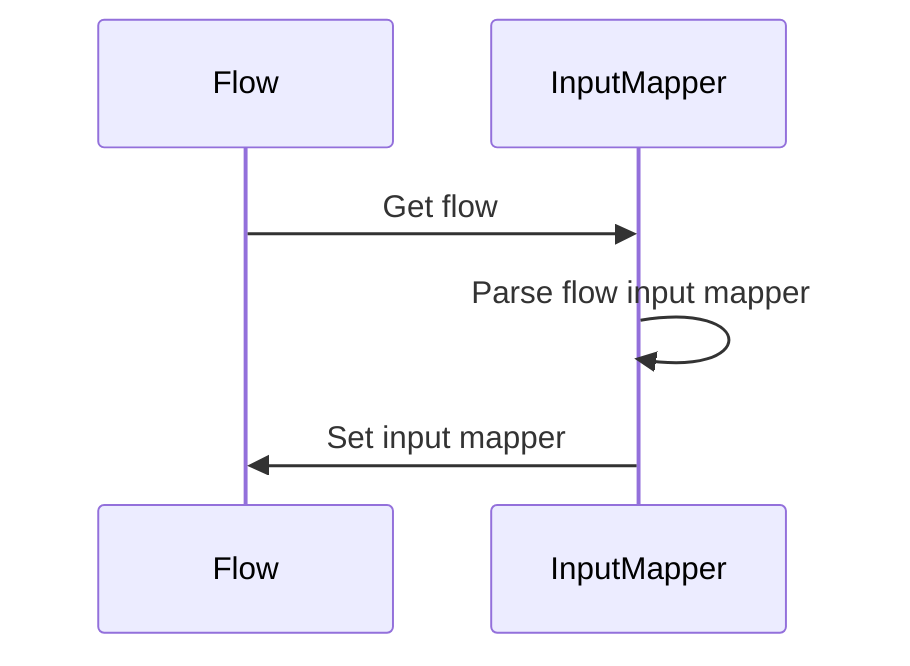
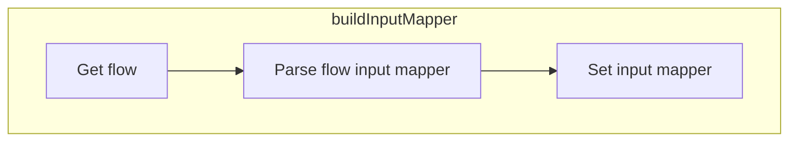

```mermaid
graph TD
  subgraph parseFlowInputMapper
    parseFlowInputMapper:A["Receive list of input models"] --> parseFlowInputMapper:B["Check if inputs are non-empty"]
    parseFlowInputMapper:B -->|Yes| parseFlowInputMapper:C["Create DefaultMapper"]
    parseFlowInputMapper:C --> parseFlowInputMapper:D["Iterate over inputs"]
    parseFlowInputMapper:D --> parseFlowInputMapper:E["Add each parsed input mapping"]
    parseFlowInputMapper:E --> parseFlowInputMapper:F["Return DefaultMapper"]
    parseFlowInputMapper:B -->|No| parseFlowInputMapper:G["Return null"]
  end
  subgraph addMapping
    addMapping:A["Receive mapper, binding, and model"] --> addMapping:B["Create source expression"]
    addMapping:B --> addMapping:C["Create parser context"]
    addMapping:C --> addMapping:D["Parse target expression"]
    addMapping:D --> addMapping:E["Create DefaultMapping"]
    addMapping:E --> addMapping:F["Set required property"]
    addMapping:F --> addMapping:G["Check for custom converter"]
    addMapping:G -->|Yes| addMapping:H["Get ConversionExecutor"]
    addMapping:H --> addMapping:I["Set type converter"]
    addMapping:G -->|No| addMapping:J["Skip type converter"]
    addMapping:J --> addMapping:K["Add mapping to mapper"]
  end

%% Swimm:
%% graph TD
%%   subgraph <SwmToken path="spring-webflow/src/main/java/org/springframework/webflow/engine/builder/model/FlowModelFlowBuilder.java" pos="191:7:7" line-data="		getFlow().setInputMapper(parseFlowInputMapper(flowModel.getInputs()));">`parseFlowInputMapper`</SwmToken>
%%     <SwmToken path="spring-webflow/src/main/java/org/springframework/webflow/engine/builder/model/FlowModelFlowBuilder.java" pos="191:7:7" line-data="		getFlow().setInputMapper(parseFlowInputMapper(flowModel.getInputs()));">`parseFlowInputMapper`</SwmToken>:A["Receive list of input models"] --> <SwmToken path="spring-webflow/src/main/java/org/springframework/webflow/engine/builder/model/FlowModelFlowBuilder.java" pos="191:7:7" line-data="		getFlow().setInputMapper(parseFlowInputMapper(flowModel.getInputs()));">`parseFlowInputMapper`</SwmToken>:B["Check if inputs are non-empty"]
%%     <SwmToken path="spring-webflow/src/main/java/org/springframework/webflow/engine/builder/model/FlowModelFlowBuilder.java" pos="191:7:7" line-data="		getFlow().setInputMapper(parseFlowInputMapper(flowModel.getInputs()));">`parseFlowInputMapper`</SwmToken>:B -->|Yes| <SwmToken path="spring-webflow/src/main/java/org/springframework/webflow/engine/builder/model/FlowModelFlowBuilder.java" pos="191:7:7" line-data="		getFlow().setInputMapper(parseFlowInputMapper(flowModel.getInputs()));">`parseFlowInputMapper`</SwmToken>:C["Create <SwmToken path="spring-webflow/src/main/java/org/springframework/webflow/engine/builder/model/FlowModelFlowBuilder.java" pos="431:1:1" line-data="			DefaultMapper inputMapper = new DefaultMapper();">`DefaultMapper`</SwmToken>"]
%%     <SwmToken path="spring-webflow/src/main/java/org/springframework/webflow/engine/builder/model/FlowModelFlowBuilder.java" pos="191:7:7" line-data="		getFlow().setInputMapper(parseFlowInputMapper(flowModel.getInputs()));">`parseFlowInputMapper`</SwmToken>:C --> <SwmToken path="spring-webflow/src/main/java/org/springframework/webflow/engine/builder/model/FlowModelFlowBuilder.java" pos="191:7:7" line-data="		getFlow().setInputMapper(parseFlowInputMapper(flowModel.getInputs()));">`parseFlowInputMapper`</SwmToken>:D["Iterate over inputs"]
%%     <SwmToken path="spring-webflow/src/main/java/org/springframework/webflow/engine/builder/model/FlowModelFlowBuilder.java" pos="191:7:7" line-data="		getFlow().setInputMapper(parseFlowInputMapper(flowModel.getInputs()));">`parseFlowInputMapper`</SwmToken>:D --> <SwmToken path="spring-webflow/src/main/java/org/springframework/webflow/engine/builder/model/FlowModelFlowBuilder.java" pos="191:7:7" line-data="		getFlow().setInputMapper(parseFlowInputMapper(flowModel.getInputs()));">`parseFlowInputMapper`</SwmToken>:E["Add each parsed input mapping"]
%%     <SwmToken path="spring-webflow/src/main/java/org/springframework/webflow/engine/builder/model/FlowModelFlowBuilder.java" pos="191:7:7" line-data="		getFlow().setInputMapper(parseFlowInputMapper(flowModel.getInputs()));">`parseFlowInputMapper`</SwmToken>:E --> <SwmToken path="spring-webflow/src/main/java/org/springframework/webflow/engine/builder/model/FlowModelFlowBuilder.java" pos="191:7:7" line-data="		getFlow().setInputMapper(parseFlowInputMapper(flowModel.getInputs()));">`parseFlowInputMapper`</SwmToken>:F["Return <SwmToken path="spring-webflow/src/main/java/org/springframework/webflow/engine/builder/model/FlowModelFlowBuilder.java" pos="431:1:1" line-data="			DefaultMapper inputMapper = new DefaultMapper();">`DefaultMapper`</SwmToken>"]
%%     <SwmToken path="spring-webflow/src/main/java/org/springframework/webflow/engine/builder/model/FlowModelFlowBuilder.java" pos="191:7:7" line-data="		getFlow().setInputMapper(parseFlowInputMapper(flowModel.getInputs()));">`parseFlowInputMapper`</SwmToken>:B -->|No| <SwmToken path="spring-webflow/src/main/java/org/springframework/webflow/engine/builder/model/FlowModelFlowBuilder.java" pos="191:7:7" line-data="		getFlow().setInputMapper(parseFlowInputMapper(flowModel.getInputs()));">`parseFlowInputMapper`</SwmToken>:G["Return null"]
%%   end
%%   subgraph <SwmToken path="spring-webflow/src/main/java/org/springframework/webflow/engine/builder/model/FlowModelFlowBuilder.java" pos="433:3:3" line-data="				inputMapper.addMapping(parseFlowInputMapping(inputModel));">`addMapping`</SwmToken>
%%     <SwmToken path="spring-webflow/src/main/java/org/springframework/webflow/engine/builder/model/FlowModelFlowBuilder.java" pos="433:3:3" line-data="				inputMapper.addMapping(parseFlowInputMapping(inputModel));">`addMapping`</SwmToken>:A["Receive mapper, binding, and model"] --> <SwmToken path="spring-webflow/src/main/java/org/springframework/webflow/engine/builder/model/FlowModelFlowBuilder.java" pos="433:3:3" line-data="				inputMapper.addMapping(parseFlowInputMapping(inputModel));">`addMapping`</SwmToken>:B["Create source expression"]
%%     <SwmToken path="spring-webflow/src/main/java/org/springframework/webflow/engine/builder/model/FlowModelFlowBuilder.java" pos="433:3:3" line-data="				inputMapper.addMapping(parseFlowInputMapping(inputModel));">`addMapping`</SwmToken>:B --> <SwmToken path="spring-webflow/src/main/java/org/springframework/webflow/engine/builder/model/FlowModelFlowBuilder.java" pos="433:3:3" line-data="				inputMapper.addMapping(parseFlowInputMapping(inputModel));">`addMapping`</SwmToken>:C["Create parser context"]
%%     <SwmToken path="spring-webflow/src/main/java/org/springframework/webflow/engine/builder/model/FlowModelFlowBuilder.java" pos="433:3:3" line-data="				inputMapper.addMapping(parseFlowInputMapping(inputModel));">`addMapping`</SwmToken>:C --> <SwmToken path="spring-webflow/src/main/java/org/springframework/webflow/engine/builder/model/FlowModelFlowBuilder.java" pos="433:3:3" line-data="				inputMapper.addMapping(parseFlowInputMapping(inputModel));">`addMapping`</SwmToken>:D["Parse target expression"]
%%     <SwmToken path="spring-webflow/src/main/java/org/springframework/webflow/engine/builder/model/FlowModelFlowBuilder.java" pos="433:3:3" line-data="				inputMapper.addMapping(parseFlowInputMapping(inputModel));">`addMapping`</SwmToken>:D --> <SwmToken path="spring-webflow/src/main/java/org/springframework/webflow/engine/builder/model/FlowModelFlowBuilder.java" pos="433:3:3" line-data="				inputMapper.addMapping(parseFlowInputMapping(inputModel));">`addMapping`</SwmToken>:E["Create <SwmToken path="spring-webflow/src/main/java/org/springframework/webflow/engine/builder/model/FlowModelFlowBuilder.java" pos="452:1:1" line-data="		DefaultMapping mapping = new DefaultMapping(source, target);">`DefaultMapping`</SwmToken>"]
%%     <SwmToken path="spring-webflow/src/main/java/org/springframework/webflow/engine/builder/model/FlowModelFlowBuilder.java" pos="433:3:3" line-data="				inputMapper.addMapping(parseFlowInputMapping(inputModel));">`addMapping`</SwmToken>:E --> <SwmToken path="spring-webflow/src/main/java/org/springframework/webflow/engine/builder/model/FlowModelFlowBuilder.java" pos="433:3:3" line-data="				inputMapper.addMapping(parseFlowInputMapping(inputModel));">`addMapping`</SwmToken>:F["Set required property"]
%%     <SwmToken path="spring-webflow/src/main/java/org/springframework/webflow/engine/builder/model/FlowModelFlowBuilder.java" pos="433:3:3" line-data="				inputMapper.addMapping(parseFlowInputMapping(inputModel));">`addMapping`</SwmToken>:F --> <SwmToken path="spring-webflow/src/main/java/org/springframework/webflow/engine/builder/model/FlowModelFlowBuilder.java" pos="433:3:3" line-data="				inputMapper.addMapping(parseFlowInputMapping(inputModel));">`addMapping`</SwmToken>:G["Check for custom converter"]
%%     <SwmToken path="spring-webflow/src/main/java/org/springframework/webflow/engine/builder/model/FlowModelFlowBuilder.java" pos="433:3:3" line-data="				inputMapper.addMapping(parseFlowInputMapping(inputModel));">`addMapping`</SwmToken>:G -->|Yes| <SwmToken path="spring-webflow/src/main/java/org/springframework/webflow/engine/builder/model/FlowModelFlowBuilder.java" pos="433:3:3" line-data="				inputMapper.addMapping(parseFlowInputMapping(inputModel));">`addMapping`</SwmToken>:H["Get <SwmToken path="spring-webflow/src/main/java/org/springframework/webflow/engine/builder/model/FlowModelFlowBuilder.java" pos="548:1:1" line-data="			ConversionExecutor typeConverter = new RuntimeBindingConversionExecutor(type, getLocalContext()">`ConversionExecutor`</SwmToken>"]
%%     <SwmToken path="spring-webflow/src/main/java/org/springframework/webflow/engine/builder/model/FlowModelFlowBuilder.java" pos="433:3:3" line-data="				inputMapper.addMapping(parseFlowInputMapping(inputModel));">`addMapping`</SwmToken>:H --> <SwmToken path="spring-webflow/src/main/java/org/springframework/webflow/engine/builder/model/FlowModelFlowBuilder.java" pos="433:3:3" line-data="				inputMapper.addMapping(parseFlowInputMapping(inputModel));">`addMapping`</SwmToken>:I["Set type converter"]
%%     <SwmToken path="spring-webflow/src/main/java/org/springframework/webflow/engine/builder/model/FlowModelFlowBuilder.java" pos="433:3:3" line-data="				inputMapper.addMapping(parseFlowInputMapping(inputModel));">`addMapping`</SwmToken>:G -->|No| <SwmToken path="spring-webflow/src/main/java/org/springframework/webflow/engine/builder/model/FlowModelFlowBuilder.java" pos="433:3:3" line-data="				inputMapper.addMapping(parseFlowInputMapping(inputModel));">`addMapping`</SwmToken>:J["Skip type converter"]
%%     <SwmToken path="spring-webflow/src/main/java/org/springframework/webflow/engine/builder/model/FlowModelFlowBuilder.java" pos="433:3:3" line-data="				inputMapper.addMapping(parseFlowInputMapping(inputModel));">`addMapping`</SwmToken>:J --> <SwmToken path="spring-webflow/src/main/java/org/springframework/webflow/engine/builder/model/FlowModelFlowBuilder.java" pos="433:3:3" line-data="				inputMapper.addMapping(parseFlowInputMapping(inputModel));">`addMapping`</SwmToken>:K["Add mapping to mapper"]
%%   end
```

```mermaid
graph TD
  subgraph getValue
    getValue:A["Retrieve subflowId from context"] --> getValue:B["Get flowDefinition using subflowId"]
  end
  subgraph getFlowDefinition
    getFlowDefinition:A["Check if currently assembling"] -->|Yes| getFlowDefinition:B["Return early assembly result"]
    getFlowDefinition:A -->|No| getFlowDefinition:C["Check if flowDefinition is null"]
    getFlowDefinition:C -->|Yes| getFlowDefinition:D["Assemble flow for the first time"] 
    getFlowDefinition:C -->|No| getFlowDefinition:E["Check if flow is in development and has changed"] 
    getFlowDefinition:E -->|Yes| getFlowDefinition:F["Reassemble flow"] 
    getFlowDefinition:F --> getFlowDefinition:G["Return latest flow definition"]
  end

%% Swimm:
%% graph TD
%%   subgraph <SwmToken path="spring-webflow/src/main/java/org/springframework/webflow/engine/builder/model/FlowModelFlowBuilder.java" pos="445:10:10" line-data="		if (StringUtils.hasText(input.getValue())) {">`getValue`</SwmToken>
%%     <SwmToken path="spring-webflow/src/main/java/org/springframework/webflow/engine/builder/model/FlowModelFlowBuilder.java" pos="445:10:10" line-data="		if (StringUtils.hasText(input.getValue())) {">`getValue`</SwmToken>:A["Retrieve <SwmToken path="spring-webflow/src/main/java/org/springframework/webflow/engine/builder/model/SubflowExpression.java" pos="34:3:3" line-data="		String subflowId = (String) this.subflowId.getValue(context);">`subflowId`</SwmToken> from context"] --> <SwmToken path="spring-webflow/src/main/java/org/springframework/webflow/engine/builder/model/FlowModelFlowBuilder.java" pos="445:10:10" line-data="		if (StringUtils.hasText(input.getValue())) {">`getValue`</SwmToken>:B["Get <SwmToken path="spring-webflow/src/main/java/org/springframework/webflow/engine/builder/DefaultFlowHolder.java" pos="82:4:4" line-data="		if (flowDefinition == null) {">`flowDefinition`</SwmToken> using <SwmToken path="spring-webflow/src/main/java/org/springframework/webflow/engine/builder/model/SubflowExpression.java" pos="34:3:3" line-data="		String subflowId = (String) this.subflowId.getValue(context);">`subflowId`</SwmToken>"]
%%   end
%%   subgraph <SwmToken path="spring-webflow/src/main/java/org/springframework/webflow/engine/builder/model/SubflowExpression.java" pos="35:5:5" line-data="		return flowDefinitionLocator.getFlowDefinition(subflowId);">`getFlowDefinition`</SwmToken>
%%     <SwmToken path="spring-webflow/src/main/java/org/springframework/webflow/engine/builder/model/SubflowExpression.java" pos="35:5:5" line-data="		return flowDefinitionLocator.getFlowDefinition(subflowId);">`getFlowDefinition`</SwmToken>:A["Check if currently assembling"] -->|Yes| <SwmToken path="spring-webflow/src/main/java/org/springframework/webflow/engine/builder/model/SubflowExpression.java" pos="35:5:5" line-data="		return flowDefinitionLocator.getFlowDefinition(subflowId);">`getFlowDefinition`</SwmToken>:B["Return early assembly result"]
%%     <SwmToken path="spring-webflow/src/main/java/org/springframework/webflow/engine/builder/model/SubflowExpression.java" pos="35:5:5" line-data="		return flowDefinitionLocator.getFlowDefinition(subflowId);">`getFlowDefinition`</SwmToken>:A -->|No| <SwmToken path="spring-webflow/src/main/java/org/springframework/webflow/engine/builder/model/SubflowExpression.java" pos="35:5:5" line-data="		return flowDefinitionLocator.getFlowDefinition(subflowId);">`getFlowDefinition`</SwmToken>:C["Check if <SwmToken path="spring-webflow/src/main/java/org/springframework/webflow/engine/builder/DefaultFlowHolder.java" pos="82:4:4" line-data="		if (flowDefinition == null) {">`flowDefinition`</SwmToken> is null"]
%%     <SwmToken path="spring-webflow/src/main/java/org/springframework/webflow/engine/builder/model/SubflowExpression.java" pos="35:5:5" line-data="		return flowDefinitionLocator.getFlowDefinition(subflowId);">`getFlowDefinition`</SwmToken>:C -->|Yes| <SwmToken path="spring-webflow/src/main/java/org/springframework/webflow/engine/builder/model/SubflowExpression.java" pos="35:5:5" line-data="		return flowDefinitionLocator.getFlowDefinition(subflowId);">`getFlowDefinition`</SwmToken>:D["Assemble flow for the first time"] 
%%     <SwmToken path="spring-webflow/src/main/java/org/springframework/webflow/engine/builder/model/SubflowExpression.java" pos="35:5:5" line-data="		return flowDefinitionLocator.getFlowDefinition(subflowId);">`getFlowDefinition`</SwmToken>:C -->|No| <SwmToken path="spring-webflow/src/main/java/org/springframework/webflow/engine/builder/model/SubflowExpression.java" pos="35:5:5" line-data="		return flowDefinitionLocator.getFlowDefinition(subflowId);">`getFlowDefinition`</SwmToken>:E["Check if flow is in development and has changed"] 
%%     <SwmToken path="spring-webflow/src/main/java/org/springframework/webflow/engine/builder/model/SubflowExpression.java" pos="35:5:5" line-data="		return flowDefinitionLocator.getFlowDefinition(subflowId);">`getFlowDefinition`</SwmToken>:E -->|Yes| <SwmToken path="spring-webflow/src/main/java/org/springframework/webflow/engine/builder/model/SubflowExpression.java" pos="35:5:5" line-data="		return flowDefinitionLocator.getFlowDefinition(subflowId);">`getFlowDefinition`</SwmToken>:F["Reassemble flow"] 
%%     <SwmToken path="spring-webflow/src/main/java/org/springframework/webflow/engine/builder/model/SubflowExpression.java" pos="35:5:5" line-data="		return flowDefinitionLocator.getFlowDefinition(subflowId);">`getFlowDefinition`</SwmToken>:F --> <SwmToken path="spring-webflow/src/main/java/org/springframework/webflow/engine/builder/model/SubflowExpression.java" pos="35:5:5" line-data="		return flowDefinitionLocator.getFlowDefinition(subflowId);">`getFlowDefinition`</SwmToken>:G["Return latest flow definition"]
%%   end
```

This document explains the process of setting up the input mapper for a flow. The input mapper is responsible for mapping the flow input when the flow starts, ensuring that the flow receives the correct input parameters to function properly.

For example, when a flow starts, the input mapper will map the provided input parameters to the flow's internal context, allowing the flow to access and use these parameters during its execution.



Here is a high level diagram of the flow, showing only the most important functions:

```mermaid
graph TD;
      subgraph springwebflowsrcmainjavaorgspringframeworkwebflowenginebuildermodel[spring-webflow/…/builder/model]
98e9b1a80c2257bee597e30b1018a58c11cd52b7c65910dc9aac10a4689c3d4f(FlowModelFlowBuilder.buildInputMapper) --> 44434da6e8e266be965851b32979994104ba8b0623a753ea3d2a2883f798f74b(FlowModelFlowBuilder.parseFlowInputMapper)
end

subgraph springwebflowsrcmainjavaorgspringframeworkwebflowenginebuildermodel[spring-webflow/…/builder/model]
44434da6e8e266be965851b32979994104ba8b0623a753ea3d2a2883f798f74b(FlowModelFlowBuilder.parseFlowInputMapper) --> e10f42973671ce629f7ff482b7c7f2407f825232973ad8dcf375182f8880a2a0(FlowModelFlowBuilder.parseFlowInputMapping)
end

subgraph springwebflowsrcmainjavaorgspringframeworkwebflowmvcviewAbstractMvcViewjava[spring-webflow/…/view/AbstractMvcView.java]
44434da6e8e266be965851b32979994104ba8b0623a753ea3d2a2883f798f74b(FlowModelFlowBuilder.parseFlowInputMapper) --> ee2726de36db92795bd2a2e99ae53eb84a6402a7d1becdd27f7a4d1495c0babb(AbstractMvcView.addMapping)
end

subgraph springwebflowsrcmainjavaorgspringframeworkwebflowenginebuildermodel[spring-webflow/…/builder/model]
e10f42973671ce629f7ff482b7c7f2407f825232973ad8dcf375182f8880a2a0(FlowModelFlowBuilder.parseFlowInputMapping) --> 220e55aa095ef43cfade7e36fa6c5638ad32472f2bd6f9596009be75d80d7a1f(SubflowExpression.getValue)
end

subgraph springwebflowsrcmainjavaorgspringframeworkwebflowenginebuildermodel[spring-webflow/…/builder/model]
e10f42973671ce629f7ff482b7c7f2407f825232973ad8dcf375182f8880a2a0(FlowModelFlowBuilder.parseFlowInputMapping) --> edf49af0a322df59fb671f1bdb5b1b91ee1a8d2c0b272acb67e3ac933c57a6f8(FlowModelFlowBuilder.parseAndSetMappingConversionExecutor)
end

subgraph springwebflowsrcmainjavaorgspringframeworkwebflowenginebuilderDefaultFlowHolderjava[spring-webflow/…/builder/DefaultFlowHolder.java]
220e55aa095ef43cfade7e36fa6c5638ad32472f2bd6f9596009be75d80d7a1f(SubflowExpression.getValue) --> 80b7a63b4ecf5c25b7d9897b4b4723d53841a226c726a8ded944576e0e6166a0(DefaultFlowHolder.getFlowDefinition)
end


      classDef mainFlowStyle color:#000000,fill:#7CB9F4
classDef rootsStyle color:#000000,fill:#00FFF4
classDef Style1 color:#000000,fill:#00FFAA
classDef Style2 color:#000000,fill:#FFFF00
classDef Style3 color:#000000,fill:#AA7CB9

%% Swimm:
%% graph TD;
%%       subgraph springwebflowsrcmainjavaorgspringframeworkwebflowenginebuildermodel[<SwmPath>[spring-webflow/…/builder/model/](spring-webflow/src/main/java/org/springframework/webflow/engine/builder/model/)</SwmPath>]
%% 98e9b1a80c2257bee597e30b1018a58c11cd52b7c65910dc9aac10a4689c3d4f(FlowModelFlowBuilder.buildInputMapper) --> 44434da6e8e266be965851b32979994104ba8b0623a753ea3d2a2883f798f74b(FlowModelFlowBuilder.parseFlowInputMapper)
%% end
%% 
%% subgraph springwebflowsrcmainjavaorgspringframeworkwebflowenginebuildermodel[<SwmPath>[spring-webflow/…/builder/model/](spring-webflow/src/main/java/org/springframework/webflow/engine/builder/model/)</SwmPath>]
%% 44434da6e8e266be965851b32979994104ba8b0623a753ea3d2a2883f798f74b(FlowModelFlowBuilder.parseFlowInputMapper) --> e10f42973671ce629f7ff482b7c7f2407f825232973ad8dcf375182f8880a2a0(FlowModelFlowBuilder.parseFlowInputMapping)
%% end
%% 
%% subgraph springwebflowsrcmainjavaorgspringframeworkwebflowmvcviewAbstractMvcViewjava[<SwmPath>[spring-webflow/…/view/AbstractMvcView.java](spring-webflow/src/main/java/org/springframework/webflow/mvc/view/AbstractMvcView.java)</SwmPath>]
%% 44434da6e8e266be965851b32979994104ba8b0623a753ea3d2a2883f798f74b(FlowModelFlowBuilder.parseFlowInputMapper) --> ee2726de36db92795bd2a2e99ae53eb84a6402a7d1becdd27f7a4d1495c0babb(AbstractMvcView.addMapping)
%% end
%% 
%% subgraph springwebflowsrcmainjavaorgspringframeworkwebflowenginebuildermodel[<SwmPath>[spring-webflow/…/builder/model/](spring-webflow/src/main/java/org/springframework/webflow/engine/builder/model/)</SwmPath>]
%% e10f42973671ce629f7ff482b7c7f2407f825232973ad8dcf375182f8880a2a0(FlowModelFlowBuilder.parseFlowInputMapping) --> 220e55aa095ef43cfade7e36fa6c5638ad32472f2bd6f9596009be75d80d7a1f(SubflowExpression.getValue)
%% end
%% 
%% subgraph springwebflowsrcmainjavaorgspringframeworkwebflowenginebuildermodel[<SwmPath>[spring-webflow/…/builder/model/](spring-webflow/src/main/java/org/springframework/webflow/engine/builder/model/)</SwmPath>]
%% e10f42973671ce629f7ff482b7c7f2407f825232973ad8dcf375182f8880a2a0(FlowModelFlowBuilder.parseFlowInputMapping) --> edf49af0a322df59fb671f1bdb5b1b91ee1a8d2c0b272acb67e3ac933c57a6f8(FlowModelFlowBuilder.parseAndSetMappingConversionExecutor)
%% end
%% 
%% subgraph springwebflowsrcmainjavaorgspringframeworkwebflowenginebuilderDefaultFlowHolderjava[<SwmPath>[spring-webflow/…/builder/DefaultFlowHolder.java](spring-webflow/src/main/java/org/springframework/webflow/engine/builder/DefaultFlowHolder.java)</SwmPath>]
%% 220e55aa095ef43cfade7e36fa6c5638ad32472f2bd6f9596009be75d80d7a1f(SubflowExpression.getValue) --> 80b7a63b4ecf5c25b7d9897b4b4723d53841a226c726a8ded944576e0e6166a0(DefaultFlowHolder.getFlowDefinition)
%% end
%% 
%% 
%%       classDef mainFlowStyle color:#000000,fill:#7CB9F4
%% classDef rootsStyle color:#000000,fill:#00FFF4
%% classDef Style1 color:#000000,fill:#00FFAA
%% classDef Style2 color:#000000,fill:#FFFF00
%% classDef Style3 color:#000000,fill:#AA7CB9
```



# Flow drill down

## Exploring <SwmToken path="spring-webflow/src/main/java/org/springframework/webflow/engine/builder/model/FlowModelFlowBuilder.java" pos="190:5:5" line-data="	public void buildInputMapper() throws FlowBuilderException {">`buildInputMapper`</SwmToken>



<SwmSnippet path="/spring-webflow/src/main/java/org/springframework/webflow/engine/builder/model/FlowModelFlowBuilder.java" line="186">

---

First, the <SwmToken path="spring-webflow/src/main/java/org/springframework/webflow/engine/builder/model/FlowModelFlowBuilder.java" pos="190:5:5" line-data="	public void buildInputMapper() throws FlowBuilderException {">`buildInputMapper`</SwmToken> method is responsible for setting up the input mapper that maps the flow input when the flow starts. This is crucial for ensuring that the flow receives the correct input parameters to function properly.

```java
	/**
	 * Builds the input mapper responsible for mapping flow input on start.
	 * @throws FlowBuilderException an exception occurred building the flow
	 */
	public void buildInputMapper() throws FlowBuilderException {
		getFlow().setInputMapper(parseFlowInputMapper(flowModel.getInputs()));
	}
```

---

</SwmSnippet>

<SwmSnippet path="/spring-webflow/src/main/java/org/springframework/webflow/engine/builder/model/FlowModelFlowBuilder.java" line="429">

---

Next, the <SwmToken path="spring-webflow/src/main/java/org/springframework/webflow/engine/builder/model/FlowModelFlowBuilder.java" pos="429:5:5" line-data="	private Mapper parseFlowInputMapper(List&lt;InputModel&gt; inputs) {">`parseFlowInputMapper`</SwmToken> method is called within <SwmToken path="spring-webflow/src/main/java/org/springframework/webflow/engine/builder/model/FlowModelFlowBuilder.java" pos="190:5:5" line-data="	public void buildInputMapper() throws FlowBuilderException {">`buildInputMapper`</SwmToken>. This method parses the flow input models and creates a mapper. This step is essential for interpreting the input data structure and converting it into a format that the flow can use.

```java
	private Mapper parseFlowInputMapper(List<InputModel> inputs) {
```

---

</SwmSnippet>

## Going into <SwmToken path="spring-webflow/src/main/java/org/springframework/webflow/engine/builder/model/FlowModelFlowBuilder.java" pos="191:7:7" line-data="		getFlow().setInputMapper(parseFlowInputMapper(flowModel.getInputs()));">`parseFlowInputMapper`</SwmToken> & <SwmToken path="spring-webflow/src/main/java/org/springframework/webflow/engine/builder/model/FlowModelFlowBuilder.java" pos="433:3:3" line-data="				inputMapper.addMapping(parseFlowInputMapping(inputModel));">`addMapping`</SwmToken>



<SwmSnippet path="/spring-webflow/src/main/java/org/springframework/webflow/engine/builder/model/FlowModelFlowBuilder.java" line="429">

---

First, the <SwmToken path="spring-webflow/src/main/java/org/springframework/webflow/engine/builder/model/FlowModelFlowBuilder.java" pos="429:5:5" line-data="	private Mapper parseFlowInputMapper(List&lt;InputModel&gt; inputs) {">`parseFlowInputMapper`</SwmToken> method is responsible for creating a <SwmToken path="spring-webflow/src/main/java/org/springframework/webflow/engine/builder/model/FlowModelFlowBuilder.java" pos="431:1:1" line-data="			DefaultMapper inputMapper = new DefaultMapper();">`DefaultMapper`</SwmToken> instance if the provided list of <SwmToken path="spring-webflow/src/main/java/org/springframework/webflow/engine/builder/model/FlowModelFlowBuilder.java" pos="429:9:9" line-data="	private Mapper parseFlowInputMapper(List&lt;InputModel&gt; inputs) {">`InputModel`</SwmToken> is not null or empty. This mapper will be used to store the mappings of input parameters for the flow.

```java
	private Mapper parseFlowInputMapper(List<InputModel> inputs) {
		if (inputs != null && !inputs.isEmpty()) {
			DefaultMapper inputMapper = new DefaultMapper();
			for (InputModel inputModel : inputs) {
```

---

</SwmSnippet>

<SwmSnippet path="/spring-webflow/src/main/java/org/springframework/webflow/engine/builder/model/FlowModelFlowBuilder.java" line="432">

---

Next, the method iterates over each <SwmToken path="spring-webflow/src/main/java/org/springframework/webflow/engine/builder/model/FlowModelFlowBuilder.java" pos="432:4:4" line-data="			for (InputModel inputModel : inputs) {">`InputModel`</SwmToken> in the list and calls the <SwmToken path="spring-webflow/src/main/java/org/springframework/webflow/engine/builder/model/FlowModelFlowBuilder.java" pos="433:5:5" line-data="				inputMapper.addMapping(parseFlowInputMapping(inputModel));">`parseFlowInputMapping`</SwmToken> method to parse each input model into a mapping. These mappings are then added to the <SwmToken path="spring-webflow/src/main/java/org/springframework/webflow/engine/builder/model/FlowModelFlowBuilder.java" pos="431:1:1" line-data="			DefaultMapper inputMapper = new DefaultMapper();">`DefaultMapper`</SwmToken> instance.

```java
			for (InputModel inputModel : inputs) {
				inputMapper.addMapping(parseFlowInputMapping(inputModel));
			}
```

---

</SwmSnippet>

<SwmSnippet path="/spring-webflow/src/main/java/org/springframework/webflow/engine/builder/model/FlowModelFlowBuilder.java" line="435">

---

Finally, the method returns the <SwmToken path="spring-webflow/src/main/java/org/springframework/webflow/engine/builder/model/FlowModelFlowBuilder.java" pos="431:1:1" line-data="			DefaultMapper inputMapper = new DefaultMapper();">`DefaultMapper`</SwmToken> instance containing all the parsed input mappings. If the input list is null or empty, the method returns null.

```java
			return inputMapper;
		} else {
			return null;
		}
```

---

</SwmSnippet>

<SwmSnippet path="/spring-webflow/src/main/java/org/springframework/webflow/mvc/view/AbstractMvcView.java" line="426">

---

Moving to the <SwmToken path="spring-webflow/src/main/java/org/springframework/webflow/engine/builder/model/FlowModelFlowBuilder.java" pos="433:3:3" line-data="				inputMapper.addMapping(parseFlowInputMapping(inputModel));">`addMapping`</SwmToken> method, this method is responsible for creating and adding a <SwmToken path="spring-webflow/src/main/java/org/springframework/webflow/mvc/view/AbstractMvcView.java" pos="428:15:15" line-data="	 * Creates and adds a {@link DefaultMapping} for the given {@link Binding}. Information such as the model field">`DefaultMapping`</SwmToken> for a given <SwmToken path="spring-webflow/src/main/java/org/springframework/webflow/mvc/view/AbstractMvcView.java" pos="428:28:28" line-data="	 * Creates and adds a {@link DefaultMapping} for the given {@link Binding}. Information such as the model field">`Binding`</SwmToken>. The binding contains information such as the model field name, whether the field is required, and if type conversion is needed.

```java
	/**
	 * <p>
	 * Creates and adds a {@link DefaultMapping} for the given {@link Binding}. Information such as the model field
	 * name, if the field is required, and whether type conversion is needed will be passed on from the binding to the
	 * mapping.
	 * </p>
```

---

</SwmSnippet>

<SwmSnippet path="/spring-webflow/src/main/java/org/springframework/webflow/mvc/view/AbstractMvcView.java" line="444">

---

The method first creates a <SwmToken path="spring-webflow/src/main/java/org/springframework/webflow/mvc/view/AbstractMvcView.java" pos="444:9:9" line-data="		Expression source = new RequestParameterExpression(binding.getProperty());">`RequestParameterExpression`</SwmToken> for the source expression using the property name from the binding. It then parses the target expression using the <SwmToken path="spring-webflow/src/main/java/org/springframework/webflow/mvc/view/AbstractMvcView.java" pos="446:7:7" line-data="		Expression target = expressionParser.parseExpression(binding.getProperty(), parserContext);">`expressionParser`</SwmToken> and the model's class.

```java
		Expression source = new RequestParameterExpression(binding.getProperty());
		ParserContext parserContext = new SimpleParserContext(model.getClass());
		Expression target = expressionParser.parseExpression(binding.getProperty(), parserContext);
```

---

</SwmSnippet>

<SwmSnippet path="/spring-webflow/src/main/java/org/springframework/webflow/mvc/view/AbstractMvcView.java" line="447">

---

Next, a <SwmToken path="spring-webflow/src/main/java/org/springframework/webflow/mvc/view/AbstractMvcView.java" pos="447:1:1" line-data="		DefaultMapping mapping = new DefaultMapping(source, target);">`DefaultMapping`</SwmToken> is created using the source and target expressions. The required flag from the binding is set on the mapping. If a custom converter is specified in the binding, a <SwmToken path="spring-webflow/src/main/java/org/springframework/webflow/mvc/view/AbstractMvcView.java" pos="452:1:1" line-data="			ConversionExecutor conversionExecutor = conversionService.getConversionExecutor(binding.getConverter(),">`ConversionExecutor`</SwmToken> is created and set on the mapping.

```java
		DefaultMapping mapping = new DefaultMapping(source, target);
		mapping.setRequired(binding.getRequired());
		if (binding.getConverter() != null) {
			Assert.notNull(conversionService,
					"A ConversionService must be configured to use resolve custom converters to use during binding");
			ConversionExecutor conversionExecutor = conversionService.getConversionExecutor(binding.getConverter(),
					String.class, target.getValueType(model));
			mapping.setTypeConverter(conversionExecutor);
```

---

</SwmSnippet>

<SwmSnippet path="/spring-webflow/src/main/java/org/springframework/webflow/mvc/view/AbstractMvcView.java" line="456">

---

Finally, the mapping is added to the provided <SwmToken path="spring-webflow/src/main/java/org/springframework/webflow/engine/builder/model/FlowModelFlowBuilder.java" pos="431:1:1" line-data="			DefaultMapper inputMapper = new DefaultMapper();">`DefaultMapper`</SwmToken> instance, and a debug log is generated if debugging is enabled.

```java
		if (logger.isDebugEnabled()) {
			logger.debug("Adding mapping for parameter '" + binding.getProperty() + "'");
		}
		mapper.addMapping(mapping);
```

---

</SwmSnippet>

## Diving into <SwmToken path="spring-webflow/src/main/java/org/springframework/webflow/engine/builder/model/FlowModelFlowBuilder.java" pos="433:5:5" line-data="				inputMapper.addMapping(parseFlowInputMapping(inputModel));">`parseFlowInputMapping`</SwmToken> & <SwmToken path="spring-webflow/src/main/java/org/springframework/webflow/engine/builder/model/FlowModelFlowBuilder.java" pos="545:5:5" line-data="	private void parseAndSetMappingConversionExecutor(AbstractMappingModel mappingModel, DefaultMapping mapping) {">`parseAndSetMappingConversionExecutor`</SwmToken>



```mermaid
graph TD
  subgraph parseFlowInputMapping
    parseFlowInputMapping:A["Get expression parser from local context"] --> parseFlowInputMapping:B["Parse source expression using input name"]
    parseFlowInputMapping:B --> parseFlowInputMapping:C["Check if input has value"]
    parseFlowInputMapping:C -->|Yes| parseFlowInputMapping:D["Use input value"]
    parseFlowInputMapping:C -->|No| parseFlowInputMapping:E["Default value to 'flowScope.' + input name"]
    parseFlowInputMapping:E --> parseFlowInputMapping:F["Parse target expression using value"]
    parseFlowInputMapping:D --> parseFlowInputMapping:F["Parse target expression using value"]
    parseFlowInputMapping:F --> parseFlowInputMapping:G["Create DefaultMapping with source and target"]
    parseFlowInputMapping:G --> parseFlowInputMapping:H["Call parseAndSetMappingConversionExecutor"]
    parseFlowInputMapping:H --> parseAndSetMappingConversionExecutor
    parseFlowInputMapping:I["Set mapping required"] --> parseFlowInputMapping:J["Return mapping"]
  end
  subgraph parseAndSetMappingConversionExecutor
    parseAndSetMappingConversionExecutor:A["Check if type is specified in mapping model"] -->|Yes| parseAndSetMappingConversionExecutor:B["Convert type to class"]
    parseAndSetMappingConversionExecutor:B --> parseAndSetMappingConversionExecutor:C["Create RuntimeBindingConversionExecutor with type and conversion service"]
    parseAndSetMappingConversionExecutor:C --> parseAndSetMappingConversionExecutor:D["Set type converter in mapping"]
  end

%% Swimm:
%% graph TD
%%   subgraph <SwmToken path="spring-webflow/src/main/java/org/springframework/webflow/engine/builder/model/FlowModelFlowBuilder.java" pos="433:5:5" line-data="				inputMapper.addMapping(parseFlowInputMapping(inputModel));">`parseFlowInputMapping`</SwmToken>
%%     <SwmToken path="spring-webflow/src/main/java/org/springframework/webflow/engine/builder/model/FlowModelFlowBuilder.java" pos="433:5:5" line-data="				inputMapper.addMapping(parseFlowInputMapping(inputModel));">`parseFlowInputMapping`</SwmToken>:A["Get expression parser from local context"] --> <SwmToken path="spring-webflow/src/main/java/org/springframework/webflow/engine/builder/model/FlowModelFlowBuilder.java" pos="433:5:5" line-data="				inputMapper.addMapping(parseFlowInputMapping(inputModel));">`parseFlowInputMapping`</SwmToken>:B["Parse source expression using input name"]
%%     <SwmToken path="spring-webflow/src/main/java/org/springframework/webflow/engine/builder/model/FlowModelFlowBuilder.java" pos="433:5:5" line-data="				inputMapper.addMapping(parseFlowInputMapping(inputModel));">`parseFlowInputMapping`</SwmToken>:B --> <SwmToken path="spring-webflow/src/main/java/org/springframework/webflow/engine/builder/model/FlowModelFlowBuilder.java" pos="433:5:5" line-data="				inputMapper.addMapping(parseFlowInputMapping(inputModel));">`parseFlowInputMapping`</SwmToken>:C["Check if input has value"]
%%     <SwmToken path="spring-webflow/src/main/java/org/springframework/webflow/engine/builder/model/FlowModelFlowBuilder.java" pos="433:5:5" line-data="				inputMapper.addMapping(parseFlowInputMapping(inputModel));">`parseFlowInputMapping`</SwmToken>:C -->|Yes| <SwmToken path="spring-webflow/src/main/java/org/springframework/webflow/engine/builder/model/FlowModelFlowBuilder.java" pos="433:5:5" line-data="				inputMapper.addMapping(parseFlowInputMapping(inputModel));">`parseFlowInputMapping`</SwmToken>:D["Use input value"]
%%     <SwmToken path="spring-webflow/src/main/java/org/springframework/webflow/engine/builder/model/FlowModelFlowBuilder.java" pos="433:5:5" line-data="				inputMapper.addMapping(parseFlowInputMapping(inputModel));">`parseFlowInputMapping`</SwmToken>:C -->|No| <SwmToken path="spring-webflow/src/main/java/org/springframework/webflow/engine/builder/model/FlowModelFlowBuilder.java" pos="433:5:5" line-data="				inputMapper.addMapping(parseFlowInputMapping(inputModel));">`parseFlowInputMapping`</SwmToken>:E["Default value to '<SwmToken path="spring-webflow/src/main/java/org/springframework/webflow/engine/builder/model/FlowModelFlowBuilder.java" pos="448:6:6" line-data="			value = &quot;flowScope.&quot; + name;">`flowScope`</SwmToken>.' + input name"]
%%     <SwmToken path="spring-webflow/src/main/java/org/springframework/webflow/engine/builder/model/FlowModelFlowBuilder.java" pos="433:5:5" line-data="				inputMapper.addMapping(parseFlowInputMapping(inputModel));">`parseFlowInputMapping`</SwmToken>:E --> <SwmToken path="spring-webflow/src/main/java/org/springframework/webflow/engine/builder/model/FlowModelFlowBuilder.java" pos="433:5:5" line-data="				inputMapper.addMapping(parseFlowInputMapping(inputModel));">`parseFlowInputMapping`</SwmToken>:F["Parse target expression using value"]
%%     <SwmToken path="spring-webflow/src/main/java/org/springframework/webflow/engine/builder/model/FlowModelFlowBuilder.java" pos="433:5:5" line-data="				inputMapper.addMapping(parseFlowInputMapping(inputModel));">`parseFlowInputMapping`</SwmToken>:D --> <SwmToken path="spring-webflow/src/main/java/org/springframework/webflow/engine/builder/model/FlowModelFlowBuilder.java" pos="433:5:5" line-data="				inputMapper.addMapping(parseFlowInputMapping(inputModel));">`parseFlowInputMapping`</SwmToken>:F["Parse target expression using value"]
%%     <SwmToken path="spring-webflow/src/main/java/org/springframework/webflow/engine/builder/model/FlowModelFlowBuilder.java" pos="433:5:5" line-data="				inputMapper.addMapping(parseFlowInputMapping(inputModel));">`parseFlowInputMapping`</SwmToken>:F --> <SwmToken path="spring-webflow/src/main/java/org/springframework/webflow/engine/builder/model/FlowModelFlowBuilder.java" pos="433:5:5" line-data="				inputMapper.addMapping(parseFlowInputMapping(inputModel));">`parseFlowInputMapping`</SwmToken>:G["Create <SwmToken path="spring-webflow/src/main/java/org/springframework/webflow/engine/builder/model/FlowModelFlowBuilder.java" pos="452:1:1" line-data="		DefaultMapping mapping = new DefaultMapping(source, target);">`DefaultMapping`</SwmToken> with source and target"]
%%     <SwmToken path="spring-webflow/src/main/java/org/springframework/webflow/engine/builder/model/FlowModelFlowBuilder.java" pos="433:5:5" line-data="				inputMapper.addMapping(parseFlowInputMapping(inputModel));">`parseFlowInputMapping`</SwmToken>:G --> <SwmToken path="spring-webflow/src/main/java/org/springframework/webflow/engine/builder/model/FlowModelFlowBuilder.java" pos="433:5:5" line-data="				inputMapper.addMapping(parseFlowInputMapping(inputModel));">`parseFlowInputMapping`</SwmToken>:H["Call <SwmToken path="spring-webflow/src/main/java/org/springframework/webflow/engine/builder/model/FlowModelFlowBuilder.java" pos="545:5:5" line-data="	private void parseAndSetMappingConversionExecutor(AbstractMappingModel mappingModel, DefaultMapping mapping) {">`parseAndSetMappingConversionExecutor`</SwmToken>"]
%%     <SwmToken path="spring-webflow/src/main/java/org/springframework/webflow/engine/builder/model/FlowModelFlowBuilder.java" pos="433:5:5" line-data="				inputMapper.addMapping(parseFlowInputMapping(inputModel));">`parseFlowInputMapping`</SwmToken>:H --> <SwmToken path="spring-webflow/src/main/java/org/springframework/webflow/engine/builder/model/FlowModelFlowBuilder.java" pos="545:5:5" line-data="	private void parseAndSetMappingConversionExecutor(AbstractMappingModel mappingModel, DefaultMapping mapping) {">`parseAndSetMappingConversionExecutor`</SwmToken>
%%     <SwmToken path="spring-webflow/src/main/java/org/springframework/webflow/engine/builder/model/FlowModelFlowBuilder.java" pos="433:5:5" line-data="				inputMapper.addMapping(parseFlowInputMapping(inputModel));">`parseFlowInputMapping`</SwmToken>:I["Set mapping required"] --> <SwmToken path="spring-webflow/src/main/java/org/springframework/webflow/engine/builder/model/FlowModelFlowBuilder.java" pos="433:5:5" line-data="				inputMapper.addMapping(parseFlowInputMapping(inputModel));">`parseFlowInputMapping`</SwmToken>:J["Return mapping"]
%%   end
%%   subgraph <SwmToken path="spring-webflow/src/main/java/org/springframework/webflow/engine/builder/model/FlowModelFlowBuilder.java" pos="545:5:5" line-data="	private void parseAndSetMappingConversionExecutor(AbstractMappingModel mappingModel, DefaultMapping mapping) {">`parseAndSetMappingConversionExecutor`</SwmToken>
%%     <SwmToken path="spring-webflow/src/main/java/org/springframework/webflow/engine/builder/model/FlowModelFlowBuilder.java" pos="545:5:5" line-data="	private void parseAndSetMappingConversionExecutor(AbstractMappingModel mappingModel, DefaultMapping mapping) {">`parseAndSetMappingConversionExecutor`</SwmToken>:A["Check if type is specified in mapping model"] -->|Yes| <SwmToken path="spring-webflow/src/main/java/org/springframework/webflow/engine/builder/model/FlowModelFlowBuilder.java" pos="545:5:5" line-data="	private void parseAndSetMappingConversionExecutor(AbstractMappingModel mappingModel, DefaultMapping mapping) {">`parseAndSetMappingConversionExecutor`</SwmToken>:B["Convert type to class"]
%%     <SwmToken path="spring-webflow/src/main/java/org/springframework/webflow/engine/builder/model/FlowModelFlowBuilder.java" pos="545:5:5" line-data="	private void parseAndSetMappingConversionExecutor(AbstractMappingModel mappingModel, DefaultMapping mapping) {">`parseAndSetMappingConversionExecutor`</SwmToken>:B --> <SwmToken path="spring-webflow/src/main/java/org/springframework/webflow/engine/builder/model/FlowModelFlowBuilder.java" pos="545:5:5" line-data="	private void parseAndSetMappingConversionExecutor(AbstractMappingModel mappingModel, DefaultMapping mapping) {">`parseAndSetMappingConversionExecutor`</SwmToken>:C["Create <SwmToken path="spring-webflow/src/main/java/org/springframework/webflow/engine/builder/model/FlowModelFlowBuilder.java" pos="548:9:9" line-data="			ConversionExecutor typeConverter = new RuntimeBindingConversionExecutor(type, getLocalContext()">`RuntimeBindingConversionExecutor`</SwmToken> with type and conversion service"]
%%     <SwmToken path="spring-webflow/src/main/java/org/springframework/webflow/engine/builder/model/FlowModelFlowBuilder.java" pos="545:5:5" line-data="	private void parseAndSetMappingConversionExecutor(AbstractMappingModel mappingModel, DefaultMapping mapping) {">`parseAndSetMappingConversionExecutor`</SwmToken>:C --> <SwmToken path="spring-webflow/src/main/java/org/springframework/webflow/engine/builder/model/FlowModelFlowBuilder.java" pos="545:5:5" line-data="	private void parseAndSetMappingConversionExecutor(AbstractMappingModel mappingModel, DefaultMapping mapping) {">`parseAndSetMappingConversionExecutor`</SwmToken>:D["Set type converter in mapping"]
%%   end
```

## Parsing Flow Input Mapping

First, the <SwmToken path="spring-webflow/src/main/java/org/springframework/webflow/engine/builder/model/FlowModelFlowBuilder.java" pos="433:5:5" line-data="				inputMapper.addMapping(parseFlowInputMapping(inputModel));">`parseFlowInputMapping`</SwmToken> method is responsible for creating a mapping between the input model and the flow's internal context. This involves parsing the input name and value to create expressions that can be evaluated within the flow's scope.

<SwmSnippet path="/spring-webflow/src/main/java/org/springframework/webflow/engine/builder/model/FlowModelFlowBuilder.java" line="445">

---

Next, the method checks if the input value is provided. If not, it defaults to using the flow scope with the input name. This ensures that every input has a corresponding value within the flow's context.

```java
		if (StringUtils.hasText(input.getValue())) {
			value = input.getValue();
		} else {
			value = "flowScope." + name;
		}
```

---

</SwmSnippet>

<SwmSnippet path="/spring-webflow/src/main/java/org/springframework/webflow/engine/builder/model/FlowModelFlowBuilder.java" line="450">

---

Then, the method parses these expressions using the local context's expression parser, creating source and target expressions that will be used for the mapping.

```java
		Expression source = parser.parseExpression(name, new FluentParserContext().evaluate(MutableAttributeMap.class));
		Expression target = parser.parseExpression(value, new FluentParserContext().evaluate(RequestContext.class));
```

---

</SwmSnippet>

<SwmSnippet path="/spring-webflow/src/main/java/org/springframework/webflow/engine/builder/model/FlowModelFlowBuilder.java" line="452">

---

Moving to the next step, a <SwmToken path="spring-webflow/src/main/java/org/springframework/webflow/engine/builder/model/FlowModelFlowBuilder.java" pos="452:1:1" line-data="		DefaultMapping mapping = new DefaultMapping(source, target);">`DefaultMapping`</SwmToken> object is created using these source and target expressions. This object represents the mapping of the input value to the flow's context.

```java
		DefaultMapping mapping = new DefaultMapping(source, target);
```

---

</SwmSnippet>

<SwmSnippet path="/spring-webflow/src/main/java/org/springframework/webflow/engine/builder/model/FlowModelFlowBuilder.java" line="545">

---

Next, the <SwmToken path="spring-webflow/src/main/java/org/springframework/webflow/engine/builder/model/FlowModelFlowBuilder.java" pos="545:5:5" line-data="	private void parseAndSetMappingConversionExecutor(AbstractMappingModel mappingModel, DefaultMapping mapping) {">`parseAndSetMappingConversionExecutor`</SwmToken> method is called to set a type converter for the mapping if a type is specified in the input model. This ensures that the input value is correctly converted to the required type within the flow's context.

```java
	private void parseAndSetMappingConversionExecutor(AbstractMappingModel mappingModel, DefaultMapping mapping) {
		if (StringUtils.hasText(mappingModel.getType())) {
			Class<?> type = toClass(mappingModel.getType());
			ConversionExecutor typeConverter = new RuntimeBindingConversionExecutor(type, getLocalContext()
					.getConversionService());
			mapping.setTypeConverter(typeConverter);
		}
```

---

</SwmSnippet>

<SwmSnippet path="/spring-webflow/src/main/java/org/springframework/webflow/engine/builder/model/FlowModelFlowBuilder.java" line="455">

---

Finally, the <SwmToken path="spring-webflow/src/main/java/org/springframework/webflow/engine/builder/model/FlowModelFlowBuilder.java" pos="433:5:5" line-data="				inputMapper.addMapping(parseFlowInputMapping(inputModel));">`parseFlowInputMapping`</SwmToken> method returns the <SwmToken path="spring-webflow/src/main/java/org/springframework/webflow/engine/builder/model/FlowModelFlowBuilder.java" pos="452:1:1" line-data="		DefaultMapping mapping = new DefaultMapping(source, target);">`DefaultMapping`</SwmToken> object, completing the process of mapping the input value to the flow's context.

```java
		return mapping;
```

---

</SwmSnippet>

## Breaking down <SwmToken path="spring-webflow/src/main/java/org/springframework/webflow/engine/builder/model/FlowModelFlowBuilder.java" pos="445:10:10" line-data="		if (StringUtils.hasText(input.getValue())) {">`getValue`</SwmToken> & <SwmToken path="spring-webflow/src/main/java/org/springframework/webflow/engine/builder/model/SubflowExpression.java" pos="35:5:5" line-data="		return flowDefinitionLocator.getFlowDefinition(subflowId);">`getFlowDefinition`</SwmToken>



<SwmSnippet path="/spring-webflow/src/main/java/org/springframework/webflow/engine/builder/model/SubflowExpression.java" line="33">

---

First, the <SwmToken path="spring-webflow/src/main/java/org/springframework/webflow/engine/builder/model/SubflowExpression.java" pos="33:5:5" line-data="	public Object getValue(Object context) throws EvaluationException {">`getValue`</SwmToken> method in <SwmToken path="spring-webflow/src/main/java/org/springframework/webflow/engine/builder/model/FlowModelFlowBuilder.java" pos="751:5:5" line-data="		return new SubflowExpression(subflowId, getLocalContext().getFlowDefinitionLocator());">`SubflowExpression`</SwmToken> is responsible for retrieving a flow definition based on the provided context. It extracts the subflow ID from the context and then uses the <SwmToken path="spring-webflow/src/main/java/org/springframework/webflow/engine/builder/model/SubflowExpression.java" pos="35:3:3" line-data="		return flowDefinitionLocator.getFlowDefinition(subflowId);">`flowDefinitionLocator`</SwmToken> to get the corresponding flow definition.

```java
	public Object getValue(Object context) throws EvaluationException {
		String subflowId = (String) this.subflowId.getValue(context);
		return flowDefinitionLocator.getFlowDefinition(subflowId);
	}
```

---

</SwmSnippet>

<SwmSnippet path="/spring-webflow/src/main/java/org/springframework/webflow/engine/builder/DefaultFlowHolder.java" line="77">

---

Next, the <SwmToken path="spring-webflow/src/main/java/org/springframework/webflow/engine/builder/DefaultFlowHolder.java" pos="77:7:7" line-data="	public synchronized FlowDefinition getFlowDefinition() throws FlowDefinitionConstructionException {">`getFlowDefinition`</SwmToken> method in <SwmToken path="spring-webflow/src/main/java/org/springframework/webflow/engine/builder/DefaultFlowHolder.java" pos="40:4:4" line-data="public class DefaultFlowHolder implements FlowDefinitionHolder {">`DefaultFlowHolder`</SwmToken> ensures that the latest flow definition is returned. If the flow is being assembled or has changed during development, it assembles the flow definition accordingly. This method checks if the flow is in development and if any changes have occurred, reassembling the flow if necessary.

```java
	public synchronized FlowDefinition getFlowDefinition() throws FlowDefinitionConstructionException {
		if (assembling) {
			// must return early assembly result for when a flow calls itself recursively
			return getFlowBuilder().getFlow();
		}
		if (flowDefinition == null) {
			logger.debug("Assembling the flow for the first time");
			assembleFlow();
		} else {
			if (flowDefinition.inDevelopment() && getFlowBuilder().hasFlowChanged()) {
				logger.debug("The flow under development has changed; reassembling...");
				assembleFlow();
			}
		}
		return flowDefinition;
	}
```

---

</SwmSnippet>

&nbsp;

*This is an auto-generated document by Swimm 🌊 and has not yet been verified by a human*

<SwmMeta version="3.0.0" repo-id="Z2l0aHViJTNBJTNBc3ByaW5nLXdlYmZsb3ctZGVtbyUzQSUzQWdpbGFkbmF2b3Q=" repo-name="spring-webflow-demo"><sup>Powered by [Swimm](/)</sup></SwmMeta>
